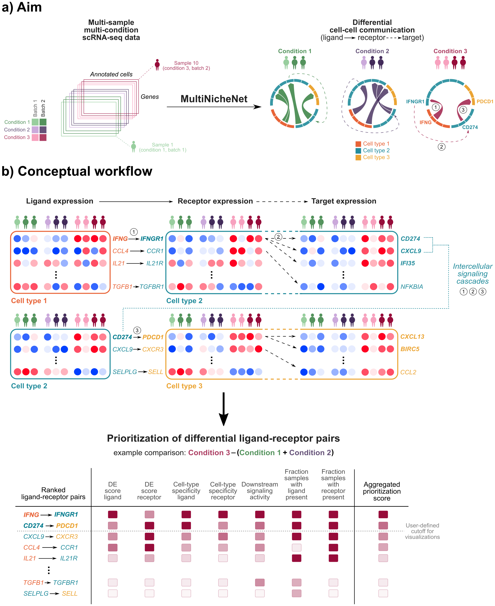

<!-- README.md is generated from README.Rmd. Please edit that file -->
<!-- github markdown built using
rmarkdown::render("README.Rmd",output_format = "md_document")
-->

# multinichenetr

<!-- badges: start -->

<!-- badges: end -->

**multinichenetr: the R package for differential cell-cell communication
analysis from single-cell transcriptomics data with complex
multi-sample, multi-condition designs.** The goal of this toolbox is to
study differences in intercellular communication between groups of
samples of interest (eg patients of different disease states).

You can read all about MultiNicheNet in the following preprint:
<https://www.biorxiv.org/content/10.1101/2023.06.13.544751v1>

The main goal of the MultiNicheNet package is to find which
ligand-receptor interactions are differentially expressed and
differentially active between conditions of interest, such as patient
groups. Compared to the normal NicheNet workflow, MultiNicheNet is more
suited to tackle complex experimental designs such as those with
multiple samples and conditions, and multiple receiver cell types of
interest.

      

In the MultiNicheNet approach, we allow the user to prioritize
differential cell-cell communication events (ligand-receptor
interactions and downstream signaling to target genes) based on the
following criteria:

-   Upregulation of the ligand in a sender cell type and/or upregulation
    of the receptor in a receiver cell type - in the condition of
    interest.
-   Sufficiently high expression levels of ligand and receptor in many
    samples of the same group (to mitigate the influence of outlier
    samples).
-   Cell-type and condition specific expression of the ligand in the
    sender cell type and receptor in the receiver cell type (to mitigate
    the influence of upregulated but still relatively weakly expressed
    ligands/receptors)
-   High NicheNet ligand activity, to further prioritize ligand-receptor
    pairs based on their predicted effect of the ligand-receptor
    interaction on the gene expression in the receiver cell type

MultiNicheNet combines all these criteria in a single prioritization
score, which is also comparable between all sender-receiver pairs. This
way, MultiNicheNet extends on the prioritization done by NicheNet, which
is only based on the ligand activity score.

Users can customize the weights of these different factors to prioritize
some of these criteria stronger, or neglect them altogether.

At the basis of MultiNicheNet for defining differentially expressed
ligands, receptors and target genes, is the the differential state
analysis as discussed by muscat, which provides a framework for
cell-level mixed models or methods based on aggregated “pseudobulk” data
(<https://doi.org/10.1038/s41467-020-19894-4>,
<https://bioconductor.org/packages/release/bioc/html/muscat.html>). We
use this muscat framework to make inferences on the sample-level (as
wanted in a multi-sample, multi-condition setting) and not the classic
cell-level differential expression analysis of Seurat
(Seurat::FindMarkers), because muscat allows us to overcome some of the
limitations of cell-level analyses for differential state analyses. Some
of these limitations include: a bias towards samples with more cells of
cell type, a lack of flexibility to work with complex study designs, and
a too optimistic estimation of the statistical power since the analysis
is done at the cell-level and not at the sample level.

In the future, we might extend the differential expression analyses
options to include other frameworks than muscat.

## Main functionalities of multinichenetr

-   Prioritizing the most important ligand-receptor interactions from
    different sender-receiver pairs between different sample groups,
    according to criteria such as condition specificity, cell-type
    specificity, ligand activity (= downstream signaling activity), and
    more.
-   Finding differential expressed ligand-receptor interactions from
    different sender-receiver pairs between different sample groups
    (Differential Ligand-Receptor network inference).
-   Predicting the most active ligand-receptor interactions in different
    sample groups based on predicted signaling effects (NicheNet ligand
    activity analysis).
-   Predicting specific downstream affected target genes of
    ligand-receptor links of interest (NicheNet ligand-target
    inference).
-   Predicting intercellular signaling networks, connecting ligands to
    ligand- or receptor-encoding target genes in other cell types,
    enabling predictions concerning intercellular cascade and feedback
    mechanisms.

## Installation of multinichenetr

Installation typically takes a few minutes, depending on the number of
dependencies that has already been installed on your pc.

You can install multinichenetr (and required dependencies) from github
with:

    # install.packages("devtools")
    devtools::install_github("saeyslab/nichenetr")
    devtools::install_github("saeyslab/multinichenetr")

It is possible that during installation the following warning is thrown:

“glmmTMB was built with TMB version 1.9.4” “Current TMB version is 1.9.5

This warning can be safely ignored since this does not affect
multinichenetr’s installation and functionalities.

multinichenetr is tested via Github Actions version control on Windows,
Linux (Ubuntu) and Mac (most recently tested R version: R 4.3.1.).

## Learning to use multinichenetr

We provide several vignettes demonstrating the different types of
analysis that can be performed with MultiNicheNet, and the several types
of downstream visualizations that can be created.

We recommend users to start with the following vignette, which
demonstrates the different steps in the analysis without too many
details yet. This is the recommended vignette to learn the basics of
MultiNicheNet.

TEST TEST TEST TEST

-   [MultiNicheNet analysis: MIS-C threewise comparison -
    step-by-step](vignettes/basic_analysis_steps_MISC.html):
    `vignette("basic_analysis_steps_MISC", package="multinichenetr")`
-   [MultiNicheNet analysis: MIS-C threewise comparison -
    step-by-step](vignettes/basic_analysis_steps_MISC.md):
    `vignette("basic_analysis_steps_MISC", package="multinichenetr")`

TEST TEST TEST TEST

This vignette provides an example of a comparison between 3 groups. The
following vignettes demonstrate how to analyze cell-cell communication
differences in other settings. For sake of simplicity, these vignettes
also use a MultiNicheNet wrapper function, which encompasses the
different steps demonstrated in the previous vignette. These vignettes
are the best vignettes to learn how to apply MultiNicheNet to different
datastes for addressing different questions.

-   [MultiNicheNet analysis: MIS-C pairwise comparison - wrapper
    function](vignettes/pairwise_analysis_MISC.md):
    `vignette("pairwise_analysis_MISC.Rmd", package="multinichenetr")`
-   [MultiNicheNet analysis: MIS-C threewise comparison - wrapper
    function](vignettes/threewise_analysis_MISC.md):
    `vignette("threewise_analysis_MISC", package="multinichenetr")`
-   [MultiNicheNet analysis: SCC paired analysis - wrapper
    function](vignettes/paired_analysis_SCC.md):
    `vignette("paired_analysis_SCC", package="multinichenetr")`
-   [MultiNicheNet analysis: anti-PD1 Breast cancer multifactorial
    comparison - wrapper
    function](vignettes/multifactorial_analysis_BreastCancer.md):
    `vignette("multifactorial_analysis_BreastCancer", package="multinichenetr")`
-   [MultiNicheNet analysis: Integrated lung atlas analysis - correct
    for batch effects to infer differences between IPF and healthy
    subjects - wrapper
    function](vignettes/batch_correction_analysis_LungAtlas.md):
    `vignette("batch_correction_analysis_LungAtlas", package="multinichenetr")`

The next vignette will cover the different steps in more detail,
showcasing some additional recommended quality checks and visualizations

-   [MultiNicheNet analysis: MIS-C threewise comparison - step-by-step
    with all details](vignettes/detailed_analysis_steps_MISC.md):
    `vignette("detailed_analysis_steps_MISC", package="multinichenetr")`

That vignettes checks as well for the DE analysis p-value distributions.
In case these are suboptimal, pointing to violations to some model
assumptions, we recommend to use empirical p-values as discussed in the
Methods section of the paper and demonstrated in the following vignette:

-   [MultiNicheNet analysis: anti-PD1 Breast cancer multifactorial
    comparison - step-by-step with all
    details](vignettes/detailed_analysis_steps_empirical_pvalues.md):
    `vignette("detailed_analysis_steps_empirical_pvalues", package="multinichenetr")`

When applying MultiNicheNet on datasets with many samples and cell
types, it is recommended to run the analysis on HPC infrastructure.You
can have a look at following scripts to see how we split up the analysis
in two parts: 1) running MultiNicheNet and saving necessary output and
plots; and 2) interpreting the results and generating visualizations.

-   [Running MultiNicheNet with
    qsub](vignettes/2-multinichenet_prism_final_MSA.Rmd)
-   [Interpreting MultiNicheNet results
    locally](vignettes/3-multinichenet_interpretation_MSA_final.Rmd)

## Frequently recurring questions and issues

-   Even though it is stated in the vignettes, many reported issues
    arise because names of celltypes, groups/conditions, and/or samples
    are not syntactically valid. Before reporting your issue, make sure
    you satisfy this condition and other conditions described in the
    vignettes. In the latest version of MultiNicheNet, input checks are
    run to check this and give an understandable error message.
-   It is required that each sample is uniquely assigned to only one
    condition/group of interest. See the vignettes about paired and
    multifactorial analysis to see how to define your analysis input
    when you have multiple samples and conditions per patient. In the
    latest version of MultiNicheNet, input checks are run to check this
    and give an understandable error message.
-   We strongly recommend having at least 4 samples in each of the
    groups/conditions you want to compare. With less samples, the
    benefits of performing a pseudobulk-based DE analysis are less clear
    and non-multi-sample tools for differential cell-cell communication
    might be better alternatives.

## References

Browaeys, R. et al. MultiNicheNet: a flexible framework for differential
cell-cell communication analysis from multi-sample multi-condition
single-cell transcriptomics data. (preprint)

Crowell, H.L., Soneson, C., Germain, PL. et al. muscat detects
subpopulation-specific state transitions from multi-sample
multi-condition single-cell transcriptomics data. Nat Commun 11, 6077
(2020). <https://doi.org/10.1038/s41467-020-19894-4>

Browaeys, R., Saelens, W. & Saeys, Y. NicheNet: modeling intercellular
communication by linking ligands to target genes. Nat Methods (2019)
<doi:10.1038/s41592-019-0667-5>
