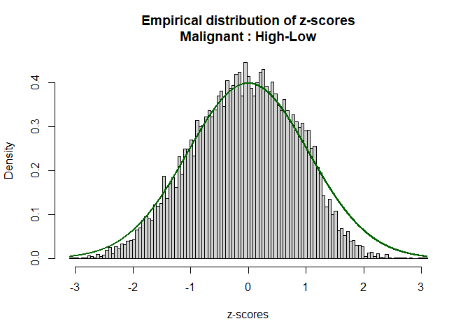
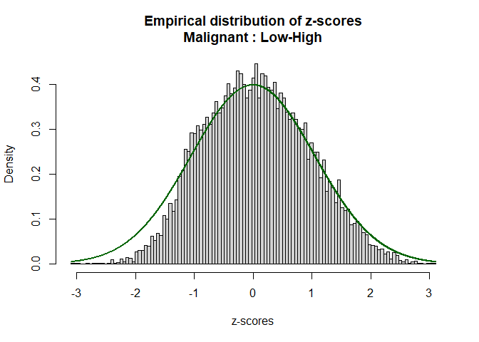
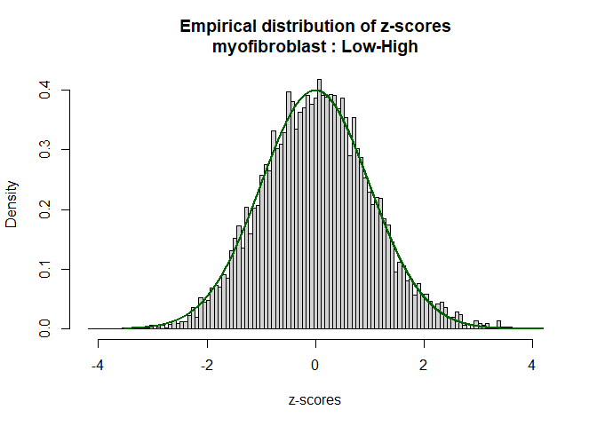
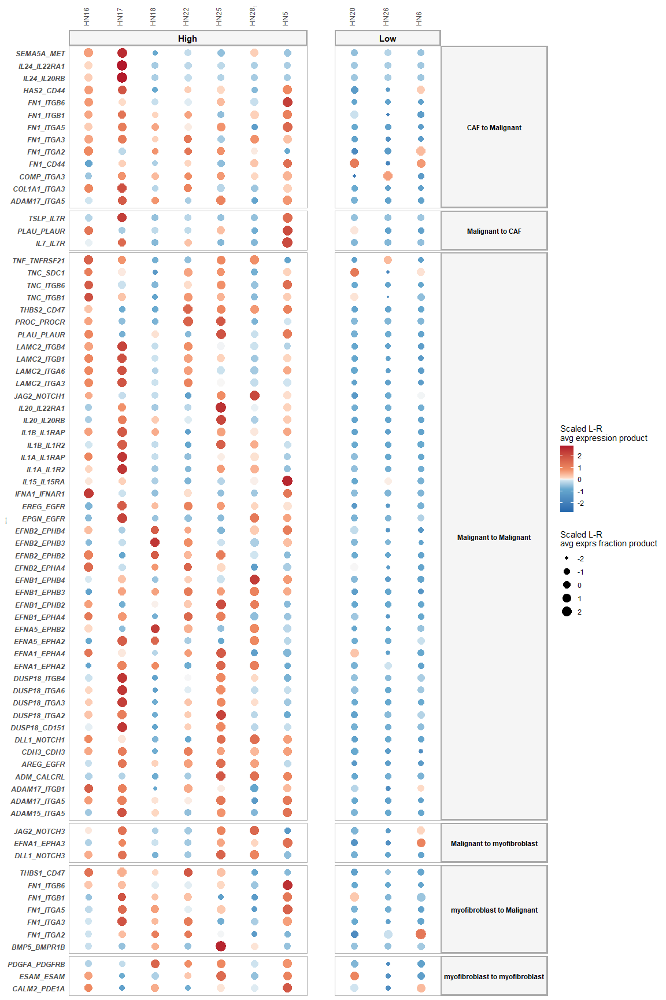
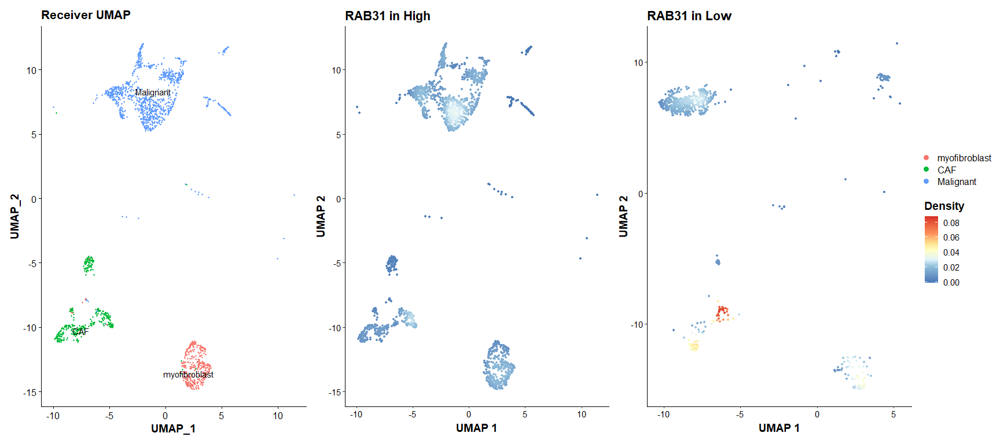
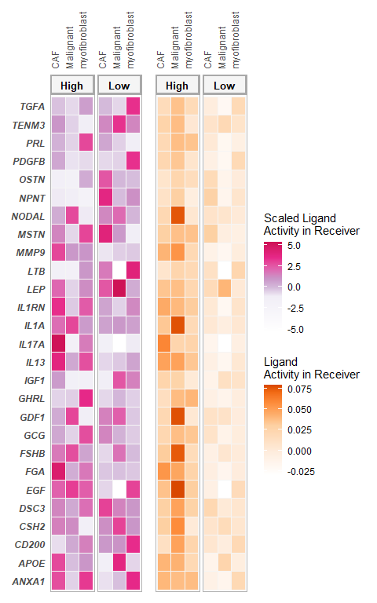
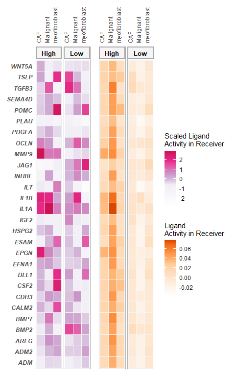

Multi-Sample Multi-condition Cell-Cell Communication Analysis via
NicheNet: HNSCC application; All-vs-All
================
Robin Browaeys
2021-02-19

<!-- github markdown built using 
rmarkdown::render("vignettes/basic_analysis.Rmd", output_format = "github_document")
-->

In this vignette, you can learn how to perform an all-vs-all
MultiNicheNet analysis. In this vignette, we start from one single
Seurat object containing cells from both sender and receiver cell types
and from different patients. As example expression data of interacting
cells, we will use data from Puram et al. to explore intercellular
communication in the tumor microenvironment in head and neck squamous
cell carcinoma (HNSCC) \[See @puram\_single-cell\_2017\]. More
specifically, we will look at differential cell-cell communication
patterns between tumors scoring high for a partial
epithelial-mesenschymal transition (p-EMT) program vs low-scoring
tumors.

In this vignette, we will prepare the data and analysis parameters, and
then perform the MultiNicheNet analysis. The different steps of the
MultiNicheNet analysis are the following: \* 1. Extract expression
information from receiver and sender cell types: average expression for
each gene per sample, and per group (normalized expression value and
fraction of expressing cells with non-zero counts). \* 2. Linking this
expression information for ligands of the sender cell types to the
corresponding receptors of the receiver cell types. \* 3. Perform
genome-wide differential expression analysis of receiver and sender cell
types to define DE genes between the conditions of interest. Based on
this analysis, we can define the logFC/p-value of ligands in senders and
receptors in receivers, and define the set of affected target genes in
the receiver. \* 4. Predict NicheNet ligand activities and NicheNet
ligand-target links based on these differential expression results \* 5.
Use the information collected above to prioritize all sender-ligand
–&gt; receiver-receptor pairs.

In this vignette, we will demonstrate the use of a wrapper function to
perform all these steps in one line of code. If you want to explore the
different steps of MultiNicheNet one by one in more detail, you could
check this other vignette: XXX.

After the MultiNicheNet analysis is done, we will explore the output of
the analysis with different ways of visualization.

# Step 0: Load required packages and NicheNet ligand-receptor network and ligand-target matrix

``` r
library(Seurat)
library(dplyr)
library(multinichenetr)
```

``` r
# LR network
lr_network = readRDS(url("https://zenodo.org/record/3260758/files/lr_network.rds"))
lr_network = lr_network %>% filter(! database %in% c("ppi_prediction","ppi_prediction_go"))
lr_network = lr_network %>% dplyr::rename(ligand = from, receptor = to) %>% distinct(ligand, receptor)
```

``` r
ligand_target_matrix = readRDS(url("https://zenodo.org/record/3260758/files/ligand_target_matrix.rds"))
```

# Step 1: Prepare Seurat Objects for Sender and Receiver cells

In this vignette, sender and receiver cell types are in the same Seurat
object, which we will load here.

In this case study, we want to study differences in cell-cell
communication patterns between pEMT-high and pEMT-low tumors. The meta
data columns that indicate the pEMT status of tumors are ‘pEMT’ and
‘pEMT\_fine’, cell type is indicated in the ‘celltype’ column, and the
sample is indicated by the ‘tumor’ column.

``` r
seurat_obj = readRDS("C:/Users/rbrowaey/work/Research/NicheNet/current_projects/CRC_NicheNet/data/seurat_obj_hnscc.rds") 
DimPlot(seurat_obj, group.by = "celltype")
```

<!-- -->

``` r
DimPlot(seurat_obj, group.by = "tumor")
```

<!-- -->

``` r
DimPlot(seurat_obj, group.by = "pEMT")
```

<!-- -->

``` r
DimPlot(seurat_obj, group.by = "pEMT_fine")
```

<!-- -->

We will now also check the number of cells per cell type condition
combination, and the number of patients per condition.

``` r
table(seurat_obj@meta.data$celltype, seurat_obj@meta.data$tumor)
##                
##                 HN16 HN17 HN18 HN20 HN22 HN25 HN26 HN28 HN5 HN6
##   CAF             47   37   36    3    9   73   19  157  37  82
##   Endothelial     43   17   18    1    1    1    0   14  11  52
##   Malignant       82  353  263  331  123  153   61   49  70 157
##   Myeloid         15    2    7    0    1    8    1    1  58   6
##   myofibroblast   84    6   14   10   45   88   45  140   5   6
##   T.cell         300   61  207    0    0   93    3    0  28   0
table(seurat_obj@meta.data$celltype, seurat_obj@meta.data$pEMT)
##                
##                 High  Low
##   CAF            396  104
##   Endothelial    105   53
##   Malignant     1093  549
##   Myeloid         92    7
##   myofibroblast  382   61
##   T.cell         689    3
table(seurat_obj@meta.data$tumor, seurat_obj@meta.data$pEMT)
##       
##        High Low
##   HN16  571   0
##   HN17  476   0
##   HN18  545   0
##   HN20    0 345
##   HN22  179   0
##   HN25  416   0
##   HN26    0 129
##   HN28  361   0
##   HN5   209   0
##   HN6     0 303
```

# Step 2: Prepare the cell-cell communication analysis

## Define in which metadata columns we can find the group, sample and cell type IDs

For the group\_id, we now choose for the ‘pEMT’ column instead of
‘pEMT\_fine’, which we will select in a subsequent analysis.

``` r
sample_id = "tumor"
group_id = "pEMT"
celltype_id = "celltype"
```

## Define the contrasts and covariates of interest for the DE analysis, and the minimal number of cells of a cell type that each sample should have to be considered for DE analysis of that cell type.

Here, we want to compare the p-EMT-high vs the p-EMT-low group and find
cell-cell communication events that are higher in high and low pEMT. We
don’t have other covariates to correct for in this dataset.

``` r
covariates = NA
contrasts_oi = c("'High-Low','Low-High'")
contrast_tbl = tibble(contrast = 
                        c("High-Low","Low-High"), 
                      group = c("High","Low"))
min_cells = 5
```

## Define the parameters for the NicheNet ligand activity analysis

Here, we need to define the thresholds that will be used to consider
genes as differentially expressed or not (logFC, p-value, decision
whether to use adjusted or normal p-value, minimum fraction of cells
that should express a gene in at least one sample in a group). NicheNet
ligand activity will then be calculated as the enrichment of predicted
target genes of ligands in this set of DE genes compared to the genomic
background. Here we choose for a minimum logFC of 1, maximum p-value of
0.05 (normal, not adjusted one, because of lack of statistical power),
and minimum fraction of expression of 0.05. For the NicheNet
ligand-target inference, we also need to select which top n of the
predicted target genes will be considered (here: top 250 per ligand).

``` r
logFC_threshold = 1
p_val_threshold = 0.05
frac_cutoff = 0.05
p_val_adj = FALSE 
empirical_pval = TRUE
top_n_target = 250
```

## Define the weights of the prioritization of both expression, differential expression and NicheNet activity information

MultiNicheNet allows the user to define the weights of the following
criteria to prioritize ligand-receptor interactions:

-   Upregulation of the ligand in a sender cell type and/or upregulation
    of the receptor in a receiver cell type - in the condition of
    interest. : `scaled_lfc_ligand`, `scaled_p_val_ligand`,
    `scaled_lfc_receptor`, and `scaled_p_val_receptor`
-   Sufficiently high expression levels of ligand and receptor in many
    samples of the same group (to mitigate the influence of outlier
    samples). : `fraction_expressing_ligand_receptor`
-   Cell-type and condition specific expression of the ligand in the
    sender cell type and receptor in the receiver cell type (to mitigate
    the influence of upregulated but still relatively weakly expressed
    ligands/receptors) : `scaled_avg_exprs_ligand`,
    `scaled_avg_frq_ligand`, `scaled_avg_exprs_receptor`, and
    `scaled_avg_frq_receptor`
-   High NicheNet ligand activity, to further prioritize ligand-receptor
    pairs based on their predicted effect of the ligand-receptor
    interaction on the gene expression in the receiver cell type :
    `scaled_activity` and `scaled_activity_scaled`
-   High relative abundance of sender and/or receiver in the condition
    of interest: `scaled_abundance_sender` and
    `scaled_abundance_receiver`

``` r
prioritizing_weights = c("scaled_lfc_ligand" = 1,
                         "scaled_p_val_ligand" = 1,
                         "scaled_lfc_receptor" = 1,
                         "scaled_p_val_receptor" = 1,
                         "scaled_activity_scaled" = 1.5,
                         "scaled_activity" = 0.5,
                         "scaled_avg_exprs_ligand" = 0.75,
                         "scaled_avg_frq_ligand" = 0.75,
                         "scaled_avg_exprs_receptor" = 0.75,
                         "scaled_avg_frq_receptor" = 0.75,
                         "fraction_expressing_ligand_receptor" = 1,
                         "scaled_abundance_sender" = 0,
                         "scaled_abundance_receiver" = 0)
```

# Step 3: Perform the cell-cell communication analysis

Now we will run the MultiNicheNet wrapper. In the function
`multi_nichenet_analysis`, we need to specify that we use one Seurat
object of which all cell types should be considered as both receptor and
sender (`sender_receiver_separate = FALSE`). To keep track of the
different steps, we will here set `verbose = TRUE`

``` r
output = multi_nichenet_analysis(seurat_obj = seurat_obj, celltype_id = celltype_id, sample_id = sample_id, group_id = group_id, 
                                lr_network = lr_network, ligand_target_matrix = ligand_target_matrix, contrasts_oi = contrasts_oi, contrast_tbl = contrast_tbl, covariates = covariates,
                                prioritizing_weights = prioritizing_weights, min_cells = min_cells, logFC_threshold = logFC_threshold, p_val_threshold = p_val_threshold,  
                                frac_cutoff = frac_cutoff, p_val_adj = p_val_adj, empirical_pval = empirical_pval, top_n_target = top_n_target, sender_receiver_separate = FALSE, verbose = TRUE)
## [1] "Extract expression information from all cell types"
## [1] "Calculate differential expression for all cell types"
## [1] "excluded cell types are:"
## [1] "Endothelial" "Myeloid"     "T.cell"     
## [1] "These celltypes are not considered in the analysis. After removing samples that contain less cells than the required minimal, some groups don't have 2 or more samples anymore. As a result the analysis cannot be run. To solve this: decrease the number of min_cells or change your group_id and pool all samples that belong to groups that are not of interest! "
```

<!-- --><!-- --><!-- --><!-- --><!-- --><!-- -->

    ## [1] "Calculate NicheNet ligand activities and ligand-target links"
    ## [1] "p-values and adjusted p-values will be determined via the empirical null methods"
    ## [1] "receiver_oi:"
    ## [1] "myofibroblast"
    ## [1] "contrast_oi:"
    ## [1] "High-Low"
    ## [1] "Number of DE genes (gene set of interest): "
    ## [1] 183
    ## [1] "contrast_oi:"
    ## [1] "Low-High"
    ## [1] "Number of DE genes (gene set of interest): "
    ## [1] 118
    ## [1] "receiver_oi:"
    ## [1] "CAF"
    ## [1] "contrast_oi:"
    ## [1] "High-Low"
    ## [1] "Number of DE genes (gene set of interest): "
    ## [1] 161
    ## [1] "contrast_oi:"
    ## [1] "Low-High"
    ## [1] "Number of DE genes (gene set of interest): "
    ## [1] 159
    ## [1] "receiver_oi:"
    ## [1] "Malignant"
    ## [1] "contrast_oi:"
    ## [1] "High-Low"
    ## [1] "Number of DE genes (gene set of interest): "
    ## [1] 158
    ## [1] "contrast_oi:"
    ## [1] "Low-High"
    ## [1] "Number of DE genes (gene set of interest): "
    ## [1] 71
    ## [1] "receiver_oi:"
    ## [1] "Endothelial"
    ## [1] "receiver_oi:"
    ## [1] "T.cell"
    ## [1] "receiver_oi:"
    ## [1] "Myeloid"
    ## [1] "Combine all the information in prioritization tables"


    output$hist_pvals

<!-- -->

``` r
output$hist_pvals_emp
```

<!-- -->

# Step 4: Visualize the results of the cell-cell communication analysis

In a first instance, we will look at the broad overview of prioritized
interactions via condition-specific Circos plots. We will filter on the
prioritization score after removing interactions that are not
upregulated in the condition of interest, and that are in no patient
expressed in more than 5% of cells of a cell type (cf `frac_cutoff`).

We will look here at the top100 predictions across all contrasts (high
vs low; and low vs high), senders, and receivers of interest.

## Circos plot of top-prioritized links

``` r
prioritized_tbl_oi = output$prioritization_tables$group_prioritization_tbl %>% 
  filter(fraction_ligand_group > frac_cutoff & fraction_receptor_group > frac_cutoff) %>% 
  distinct(id, sender, receiver, ligand, receptor, group, prioritization_score, ligand_receptor_lfc_avg, fraction_expressing_ligand_receptor) %>% 
  filter(ligand_receptor_lfc_avg > 0 & fraction_expressing_ligand_receptor > 0) %>% top_n(100, prioritization_score) 

prioritized_tbl_oi %>% group_by(group) %>% count()
## # A tibble: 2 x 2
## # Groups:   group [2]
##   group     n
##   <chr> <int>
## 1 High     74
## 2 Low      26

prioritized_tbl_oi = output$prioritization_tables$group_prioritization_tbl %>% 
  filter(id %in% prioritized_tbl_oi$id) %>% 
  distinct(id, sender, receiver, ligand, receptor, group) %>% left_join(prioritized_tbl_oi)
prioritized_tbl_oi$prioritization_score[is.na(prioritized_tbl_oi$prioritization_score)] = 0


n_senders = prioritized_tbl_oi$sender %>% unique() %>% length()
n_receivers = prioritized_tbl_oi$receiver %>% unique() %>% length()

  
colors_sender = c("red", "mediumpurple1", "royalblue")
colors_receiver = c("darkolivegreen1", "lawngreen", "limegreen")

circos_list = make_circos_group_comparison(prioritized_tbl_oi, colors_sender, colors_receiver)
```

<!-- --><!-- --><!-- -->

## Visualization of scaled\_LR\_prod (average expression) and scaled\_LR\_frac (average fraction) per sample

``` r
group_oi = "High"
```

``` r
prioritized_tbl_oi = output$prioritization_tables$group_prioritization_tbl %>% 
  distinct(id, sender, receiver, lr_interaction, group, ligand_receptor_lfc_avg, activity_scaled, fraction_expressing_ligand_receptor,  prioritization_score) %>% 
  filter(ligand_receptor_lfc_avg > 0 & fraction_expressing_ligand_receptor > 0) %>% 
  filter(group == group_oi) %>% group_by(group) %>% top_n(75, prioritization_score) 

plot_oi = make_sample_lr_prod_plots(output$prioritization_tables, prioritized_tbl_oi)
plot_oi
```

<!-- -->

## Visualization of expression-logFC per group and ligand activity

``` r
receiver_oi = "Malignant"
group_oi = "High"
```

``` r
prioritized_tbl_oi = output$prioritization_tables$group_prioritization_tbl %>% 
  filter(fraction_ligand_group > frac_cutoff & fraction_receptor_group > frac_cutoff) %>% 
  distinct(id, sender, receiver, lr_interaction, group, ligand_receptor_lfc_avg, activity_scaled, fraction_ligand_group, fraction_expressing_ligand_receptor, scaled_avg_exprs_ligand, prioritization_score) %>% 
  filter(ligand_receptor_lfc_avg > 0 & fraction_expressing_ligand_receptor > 0) %>% 
  filter(group == group_oi & receiver == receiver_oi) %>% top_n(75, prioritization_score) 

plot_oi = make_group_lfc_exprs_activity_plot(output$prioritization_tables, prioritized_tbl_oi, receiver_oi)
plot_oi
```

<!-- -->

## Circos plot of top-prioritized links

``` r
prioritized_tbl_oi = output$prioritization_tables$group_prioritization_tbl %>% 
  filter(fraction_ligand_group > frac_cutoff & fraction_receptor_group > frac_cutoff) %>% 
  distinct(id, sender, receiver, ligand, receptor, group, prioritization_score, ligand_receptor_lfc_avg, fraction_expressing_ligand_receptor) %>% 
  filter(ligand_receptor_lfc_avg > 0 & fraction_expressing_ligand_receptor > 0) %>% top_n(100, prioritization_score) 

prioritized_tbl_oi = output$prioritization_tables$group_prioritization_tbl %>% 
  filter(id %in% prioritized_tbl_oi$id) %>% 
  distinct(id, sender, receiver, ligand, receptor, group) %>% left_join(prioritized_tbl_oi)
prioritized_tbl_oi$prioritization_score[is.na(prioritized_tbl_oi$prioritization_score)] = 0


n_senders = prioritized_tbl_oi$sender %>% unique() %>% length()
n_receivers = prioritized_tbl_oi$receiver %>% unique() %>% length()

  
colors_sender = c("red","tomato","violetred3", "mediumpurple1", "royalblue")
colors_receiver = c("darkolivegreen1", "darkolivegreen2", "darkolivegreen3", "lawngreen", "limegreen")

circos_list = make_circos_group_comparison(prioritized_tbl_oi, colors_sender, colors_receiver)
```

<!-- --><!-- --><!-- -->

## Visualization of ligand-activity, ligand-target links, and target gene expression

``` r
group_oi = "High"
receiver_oi = "Malignant"
prioritized_tbl_oi = output$prioritization_tables$group_prioritization_tbl %>% 
  filter(fraction_ligand_group > frac_cutoff & fraction_receptor_group > frac_cutoff) %>% 
  distinct(id, sender, receiver, ligand, receptor, group, prioritization_score, ligand_receptor_lfc_avg, fraction_expressing_ligand_receptor, activity_scaled) %>% 
  filter(ligand_receptor_lfc_avg > 0 & fraction_expressing_ligand_receptor > 0) %>% 
  filter(group == group_oi & receiver == receiver_oi) %>% 
  group_by(group) %>% top_n(50, prioritization_score) %>% top_n(25, activity_scaled) %>% arrange(-activity_scaled)
```

``` r
combined_plot = make_ligand_activity_target_plot(group_oi, receiver_oi, prioritized_tbl_oi, output$ligand_activities_targets_DEgenes, contrast_tbl, output$grouping_tbl, output$celltype_info, plot_legend = FALSE)
combined_plot
## $combined_plot
```

<!-- -->

    ## 
    ## $legends

<!-- --> \#\#
Show ligand activities for each receiver-group combination

Both scaled and absolute activities.

In combination with ligand-receptor expression per sample

``` r
group_oi = "High"
```

``` r
prioritized_tbl_oi = output$prioritization_tables$group_prioritization_tbl %>% 
  filter(fraction_ligand_group > frac_cutoff & fraction_receptor_group > frac_cutoff) %>% 
  distinct(id, sender, receiver, lr_interaction, group, ligand_receptor_lfc_avg, activity_scaled, fraction_ligand_group, fraction_expressing_ligand_receptor, scaled_avg_exprs_ligand, prioritization_score) %>% 
  filter(ligand_receptor_lfc_avg > 0 & fraction_expressing_ligand_receptor > 0) %>% 
  filter(group == group_oi)  %>% top_n(250, prioritization_score) %>% group_by(receiver) %>% top_n(10)

plot_oi = make_sample_lr_prod_activity_plots(output$prioritization_tables,prioritized_tbl_oi, widths = c(8,2,2))
plot_oi
```

<!-- -->

``` r
plot_oi
```

<!-- -->

Both scaled and absolute activities.

Without ligand-receptor expression per sample

Show top ligands based on ligand activity (agnostic of expression in
sender)

``` r
ligands_oi = output$prioritization_tables$ligand_activities_target_de_tbl %>% inner_join(contrast_tbl) %>% 
  group_by(group, receiver) %>% distinct(ligand, receiver, group, activity) %>% 
  top_n(5, activity) %>% pull(ligand) %>% unique()

plot_oi = make_ligand_activity_plots(output$prioritization_tables, ligands_oi, contrast_tbl, widths = NULL)
plot_oi
```

<!-- --> Show
top ligands based on prioritization scores

``` r
ligands_oi = output$prioritization_tables$group_prioritization_tbl %>% 
  group_by(group, receiver) %>% distinct(ligand, receiver, group, prioritization_score) %>% 
  top_n(5, prioritization_score) %>% pull(ligand) %>% unique()

plot_oi = make_ligand_activity_plots(output$prioritization_tables, ligands_oi, contrast_tbl, widths = NULL)
plot_oi
```

<!-- -->

## References
