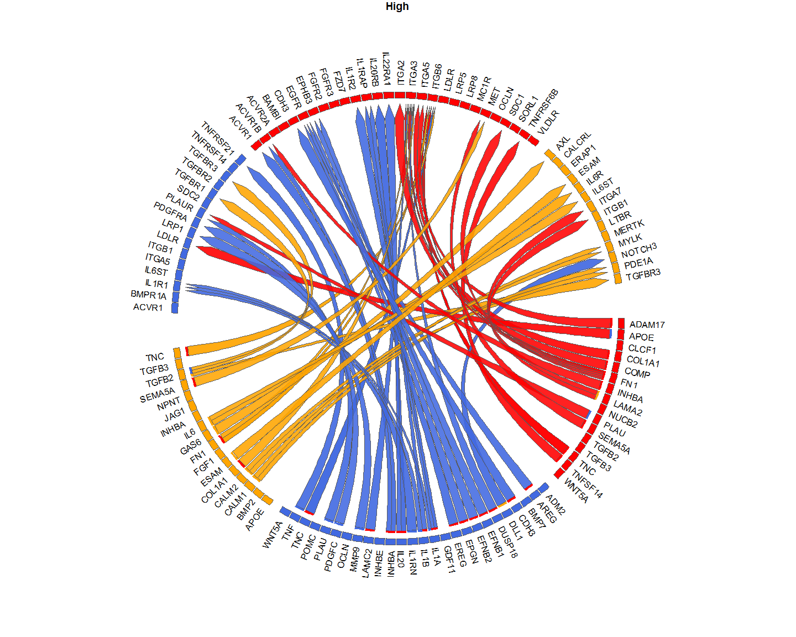
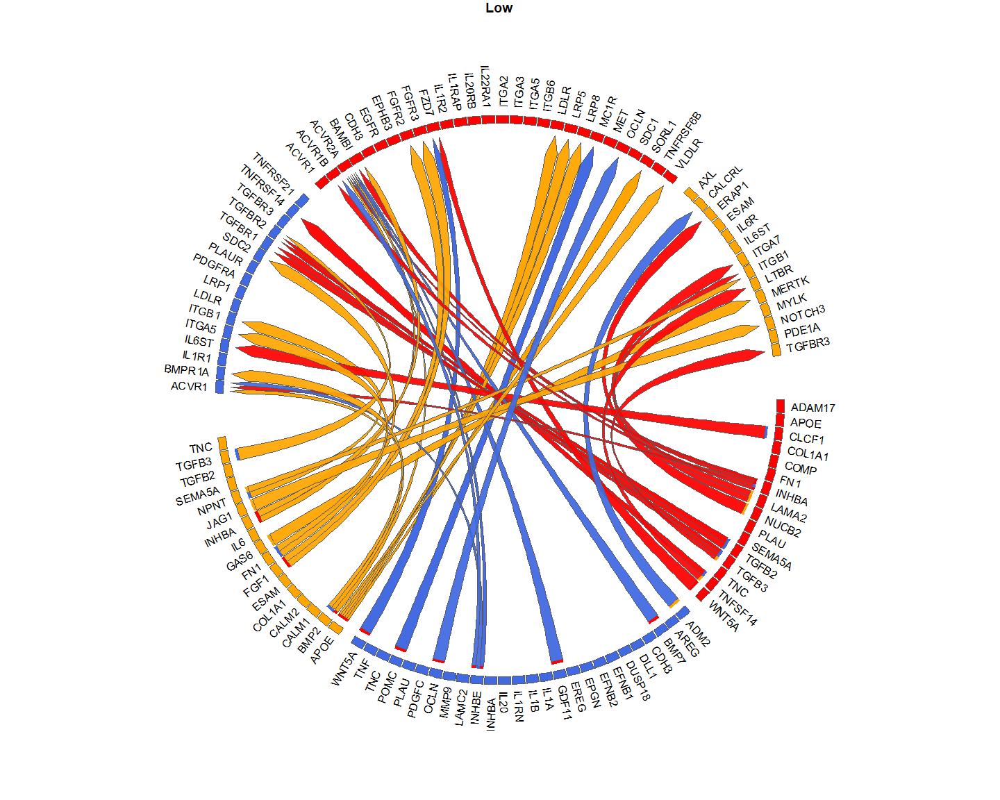
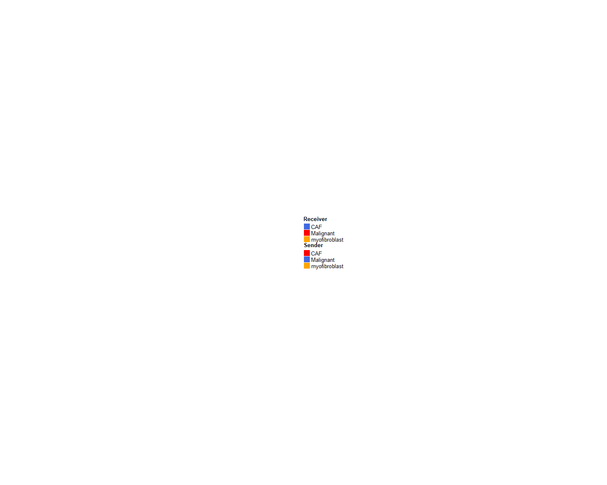
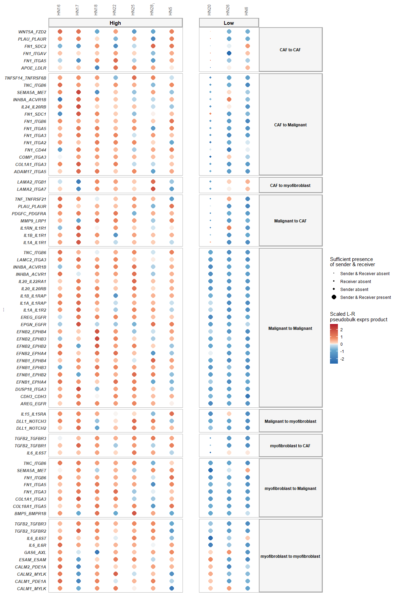
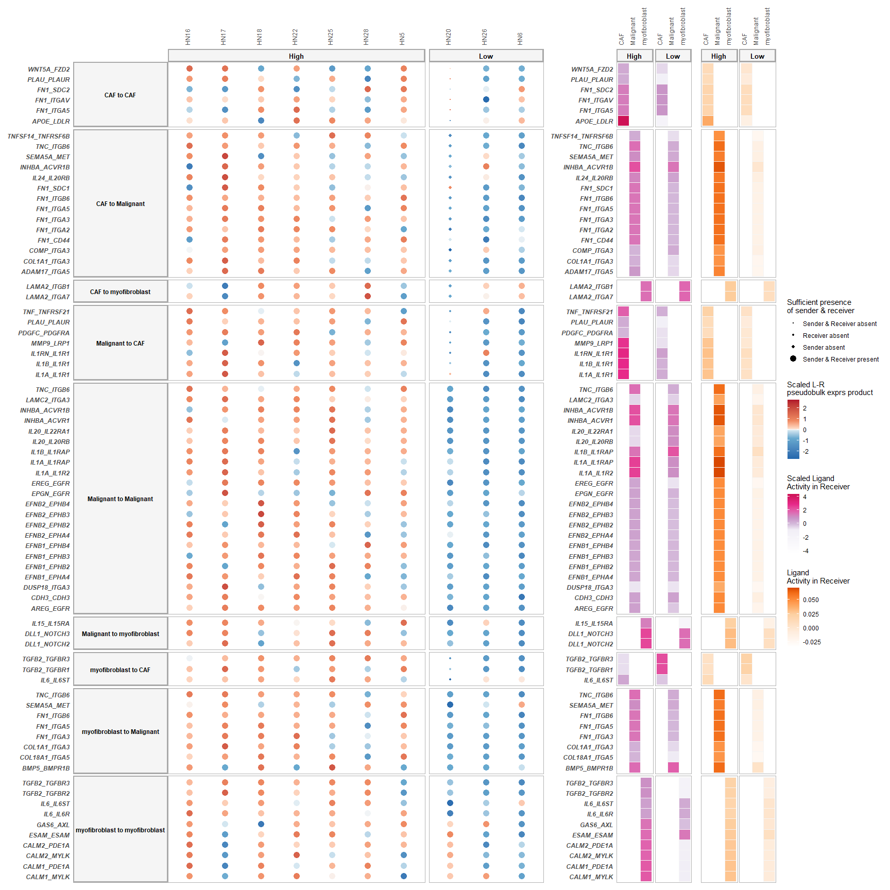
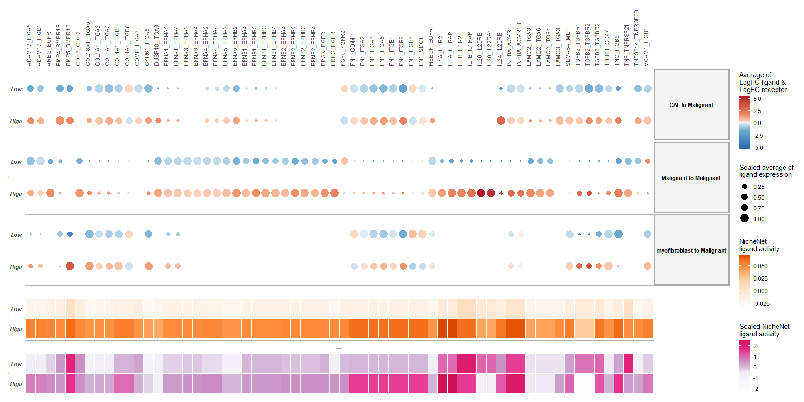
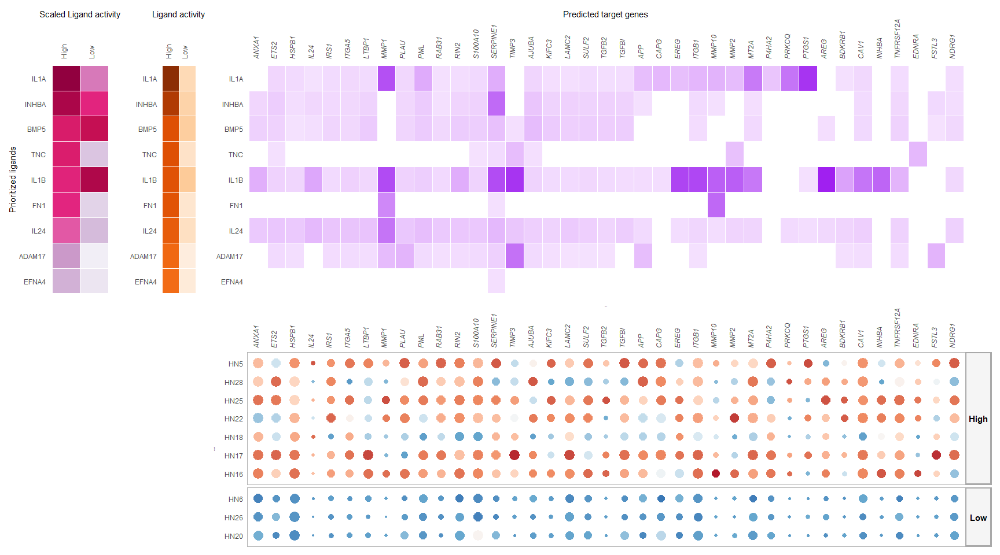
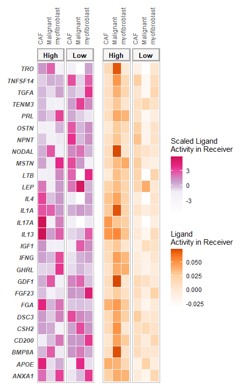
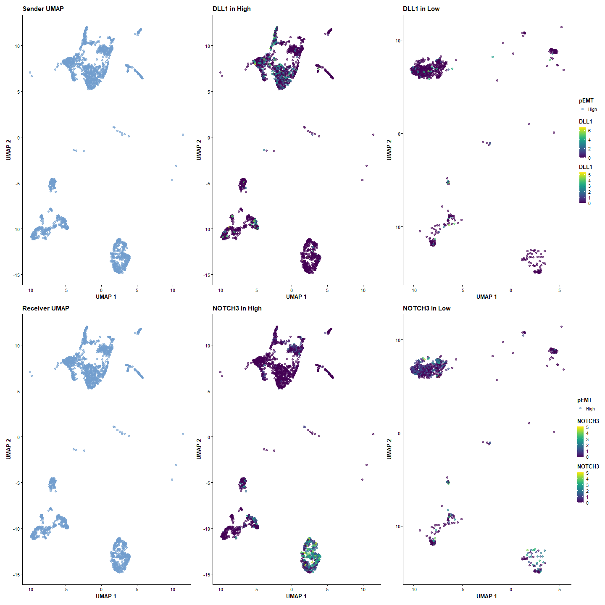

Multi-Sample Multi-condition Cell-Cell Communication Analysis via
NicheNet: HNSCC application; All-vs-All
================
Robin Browaeys
2021-04-09

<!-- github markdown built using 
rmarkdown::render("vignettes/basic_analysis.Rmd", output_format = "github_document")
-->

In this vignette, you can learn how to perform an all-vs-all
MultiNicheNet analysis. In this vignette, we start from one single
SingleCellExperiment object containing cells from both sender and
receiver cell types and from different patients.

As example expression data of interacting cells, we will use data from
Puram et al. to explore intercellular communication in the tumor
microenvironment in head and neck squamous cell carcinoma (HNSCC) \[See
@puram\_single-cell\_2017\]
[](https://doi.org/10.5281/zenodo.5196144).
More specifically, we will look at differential cell-cell communication
patterns between tumors scoring high for a partial
epithelial-mesenschymal transition (p-EMT) program vs low-scoring
tumors.

In this vignette, we will prepare the data and analysis parameters, and
then perform the MultiNicheNet analysis.

The different steps of the MultiNicheNet analysis are the following:

-   1.  Extract expression information from receiver and sender cell
        types: average expression for each gene per sample, and per
        group (normalized expression value and fraction of expressing
        cells with non-zero counts).

-   2.  Linking this expression information for ligands of the sender
        cell types to the corresponding receptors of the receiver cell
        types.

-   3.  Perform genome-wide differential expression analysis of receiver
        and sender cell types to define DE genes between the conditions
        of interest. Based on this analysis, we can define the
        logFC/p-value of ligands in senders and receptors in receivers,
        and define the set of affected target genes in the receiver.

-   4.  Predict NicheNet ligand activities and NicheNet ligand-target
        links based on these differential expression results

-   5.  Use the information collected above to prioritize all
        sender-ligand –&gt; receiver-receptor pairs.

In this vignette, we will demonstrate the use of a wrapper function to
perform all these steps in one line of code. If you want to explore the
different steps of MultiNicheNet one by one in more detail, you could
check this other vignette: **\[ADD THIS LATER\]**.

After the MultiNicheNet analysis is done, we will explore the output of
the analysis with different ways of visualization.

# Step 0: Load required packages and NicheNet ligand-receptor network and ligand-target matrix

``` r
library(dplyr)
library(ggplot2)
library(multinichenetr)
```

``` r
# LR network
lr_network = readRDS(url("https://zenodo.org/record/3260758/files/lr_network.rds"))
lr_network = lr_network %>% filter(! database %in% c("ppi_prediction","ppi_prediction_go")) # We filter out these interactions because they are not really bona-fide LR pairs - NicheNet v2 prior models will be released relatively soon
lr_network = lr_network %>% dplyr::rename(ligand = from, receptor = to) %>% distinct(ligand, receptor)
```

``` r
ligand_target_matrix = readRDS(url("https://zenodo.org/record/3260758/files/ligand_target_matrix.rds"))
```

# Step 1: Prepare SingleCellExperiment objects for Sender and Receiver cells

In this vignette, sender and receiver cell types are in the same
SingleCellExperiment object, which we will load here.

In this case study, we want to study differences in cell-cell
communication patterns between pEMT-high and pEMT-low tumors. The meta
data columns that indicate the pEMT status of tumors are ‘pEMT’ and
‘pEMT\_fine’, cell type is indicated in the ‘celltype’ column, and the
sample is indicated by the ‘tumor’ column.

If you start from a Seurat object, you can convert it easily to a
SingleCellExperiment via
`sce = Seurat::as.SingleCellExperiment(seurat_obj, assay = "RNA")`.

**User adaptation required**

``` r
sce = readRDS(url("https://zenodo.org/record/5196144/files/sce_hnscc.rds"))
scater::plotReducedDim(sce, dimred = "UMAP", colour_by = "celltype")
```

<!-- -->

``` r
scater::plotReducedDim(sce, dimred = "UMAP", colour_by = "tumor")
```

<!-- -->

``` r
scater::plotReducedDim(sce, dimred = "UMAP", colour_by = "pEMT")
```

<!-- -->

``` r
scater::plotReducedDim(sce, dimred = "UMAP", colour_by = "pEMT_fine")
```

<!-- -->

We will now also check the number of cells per cell type condition
combination, and the number of patients per condition.

**User adaptation required**

``` r
table(SummarizedExperiment::colData(sce)$celltype, SummarizedExperiment::colData(sce)$tumor) # cell types vs samples
##                
##                 HN16 HN17 HN18 HN20 HN22 HN25 HN26 HN28 HN5 HN6
##   CAF             47   37   36    3    9   73   19  157  37  82
##   Endothelial     43   17   18    1    1    1    0   14  11  52
##   Malignant       82  353  263  331  123  153   61   49  70 157
##   Myeloid         15    2    7    0    1    8    1    1  58   6
##   myofibroblast   84    6   14   10   45   88   45  140   5   6
##   T.cell         300   61  207    0    0   93    3    0  28   0
table(SummarizedExperiment::colData(sce)$celltype, SummarizedExperiment::colData(sce)$pEMT) # cell types vs conditions
##                
##                 High  Low
##   CAF            396  104
##   Endothelial    105   53
##   Malignant     1093  549
##   Myeloid         92    7
##   myofibroblast  382   61
##   T.cell         689    3
table(SummarizedExperiment::colData(sce)$tumor, SummarizedExperiment::colData(sce)$pEMT) # samples vs conditions
##       
##        High Low
##   HN16  571   0
##   HN17  476   0
##   HN18  545   0
##   HN20    0 345
##   HN22  179   0
##   HN25  416   0
##   HN26    0 129
##   HN28  361   0
##   HN5   209   0
##   HN6     0 303
```

As you can see, some Celltype-Sample combinations have 0 cells. It is
possible that during DE analysis, some cell types will be removed from
the analysis if there is not enough information to do a DE analysis.

# Step 2: Prepare the cell-cell communication analysis

## Define in which metadata columns we can find the **group**, **sample** and **cell type** IDs

For the group\_id, we now choose for the ‘pEMT’ column instead of
‘pEMT\_fine’, which we will select in a subsequent analysis.

**User adaptation required**

``` r
sample_id = "tumor"
group_id = "pEMT"
celltype_id = "celltype"
```

## Define the contrasts and covariates of interest for the DE analysis, and the minimal number of cells of a cell type that each sample should have to be considered for DE analysis of that cell type.

Here, we want to compare the p-EMT-high vs the p-EMT-low group and find
cell-cell communication events that are higher in high than low pEMT. We
don’t have other covariates to correct for in this dataset.

Note the format to indicate the contrasts!

**User adaptation required**

``` r
covariates = NA
contrasts_oi = c("'High-Low','Low-High'")
contrast_tbl = tibble(contrast = 
                        c("High-Low","Low-High"), 
                      group = c("High","Low"))
min_cells = 5 # here 5 for demonstration purposes - but recommended default is 10.
```

## Define the parameters for the NicheNet ligand activity analysis

Here, we need to define the thresholds that will be used to consider
genes as differentially expressed or not (logFC, p-value, decision
whether to use adjusted or normal p-value, minimum fraction of cells
that should express a gene in at least one sample in a group, whether to
use the normal p-values or empirical null p-values).

NicheNet ligand activity will then be calculated as the enrichment of
predicted target genes of ligands in this set of DE genes compared to
the genomic background. Here we choose for a minimum logFC of 1, maximum
p-value of 0.05 (normal, not adjusted one, because of lack of
statistical power due to pseudobulking and the fact that this dataset
has only a few samples per group), and minimum fraction of expression of
0.05. For the NicheNet ligand-target inference, we also need to select
which top n of the predicted target genes will be considered (here: top
250 targets per ligand). We will also use the empirical p-values (\[ADD
REFERENCE\]). This has mainly advantages when there would be some
violations to the assumptions that should be fulfilled for having
accurate theoretical p-values. In case all assumptions are fulfilled,
using empirical p-values would not harm either.

**User adaptation recommended**

``` r
logFC_threshold = 0.50
p_val_threshold = 0.05
fraction_cutoff = 0.05
p_val_adj = FALSE 
empirical_pval = TRUE
top_n_target = 250
```

## Define the weights of the prioritization of both expression, differential expression and NicheNet activity information

MultiNicheNet allows the user to define the weights of the following
criteria to prioritize ligand-receptor interactions:

-   Upregulation of the ligand in a sender cell type and/or upregulation
    of the receptor in a receiver cell type - in the condition of
    interest. : `scaled_lfc_ligand`, `scaled_p_val_ligand`,
    `scaled_lfc_receptor`, and `scaled_p_val_receptor`
-   Sufficiently high expression levels of ligand and receptor in many
    samples of the same group (to mitigate the influence of outlier
    samples). : `fraction_expressing_ligand_receptor`
-   Cell-type and condition specific expression of the ligand in the
    sender cell type and receptor in the receiver cell type (to mitigate
    the influence of upregulated but still relatively weakly expressed
    ligands/receptors) : `scaled_avg_exprs_ligand`,
    `scaled_avg_frq_ligand`, `scaled_avg_exprs_receptor`, and
    `scaled_avg_frq_receptor`
-   High NicheNet ligand activity, to further prioritize ligand-receptor
    pairs based on their predicted effect of the ligand-receptor
    interaction on the gene expression in the receiver cell type :
    `scaled_activity` and `scaled_activity_scaled`
    (scaled\_activity=absolute value of ligand activity;
    scaled\_activity\_scaled=scaled ligand activity value that is
    comparable between different receiver settings - recommended to put
    more weight on this)
-   High relative abundance of sender and/or receiver in the condition
    of interest: `scaled_abundance_sender` and
    `scaled_abundance_receiver`

We will set our preference for this dataset as follows:

**User adaptation recommended**

``` r
prioritizing_weights_DE = c("de_ligand" = 3,
                         "de_receptor" = 3)
prioritizing_weights_activity = c("activity_scaled" = 3)

prioritizing_weights_expression_specificity = c("exprs_ligand" = 1.5,
                         "exprs_receptor" = 1.5)

prioritizing_weights_expression_sufficiency = c("frac_exprs_ligand_receptor" = 2)

prioritizing_weights_relative_abundance = c( "abund_sender" = 0,
                         "abund_receiver" = 0)
```

``` r
prioritizing_weights = c(prioritizing_weights_DE, 
                         prioritizing_weights_activity, 
                         prioritizing_weights_expression_specificity,
                         prioritizing_weights_expression_sufficiency, 
                         prioritizing_weights_relative_abundance)
```

# Step 3: Perform the cell-cell communication analysis

Now we will run the MultiNicheNet wrapper. In the function
`multi_nichenet_analysis`, we need to specify that we use one
SingleCellExperiment object of which all cell types should be considered
as both receiver and sender by setting
`sender_receiver_separate = FALSE`. This setting will call the
underlying `multi_nichenet_analysis_combined` pipeline function.

To keep track of the different steps, we will here set `verbose = TRUE`

``` r
multinichenet_output = multi_nichenet_analysis(sce = sce, celltype_id = celltype_id, sample_id = sample_id, group_id = group_id, 
                                lr_network = lr_network, ligand_target_matrix = ligand_target_matrix, contrasts_oi = contrasts_oi, contrast_tbl = contrast_tbl, covariates = covariates,
                                prioritizing_weights = prioritizing_weights, min_cells = min_cells, logFC_threshold = logFC_threshold, p_val_threshold = p_val_threshold,  
                                fraction_cutoff = fraction_cutoff, p_val_adj = p_val_adj, empirical_pval = empirical_pval, top_n_target = top_n_target, sender_receiver_separate = FALSE, verbose = TRUE)
## [1] "Make diagnostic abundance plots + Calculate expression information"
## [1] "Calculate differential expression for all cell types"
## [1] "excluded cell types are:"
## [1] "Endothelial" "Myeloid"     "T.cell"     
## [1] "These celltypes are not considered in the analysis. After removing samples that contain less cells than the required minimal, some groups don't have 2 or more samples anymore. As a result the analysis cannot be run. To solve this: decrease the number of min_cells or change your group_id and pool all samples that belong to groups that are not of interest! "
## [1] "Calculate NicheNet ligand activities and ligand-target links"
## [1] "receiver_oi:"
## [1] "myofibroblast"
## [1] "contrast_oi:"
## [1] "High-Low"
## [1] "Number of DE genes (gene set of interest): "
## [1] 224
## [1] "contrast_oi:"
## [1] "Low-High"
## [1] "Number of DE genes (gene set of interest): "
## [1] 139
## [1] "receiver_oi:"
## [1] "CAF"
## [1] "contrast_oi:"
## [1] "High-Low"
## [1] "Number of DE genes (gene set of interest): "
## [1] 243
## [1] "contrast_oi:"
## [1] "Low-High"
## [1] "Number of DE genes (gene set of interest): "
## [1] 189
## [1] "receiver_oi:"
## [1] "Malignant"
## [1] "contrast_oi:"
## [1] "High-Low"
## [1] "Number of DE genes (gene set of interest): "
## [1] 227
## [1] "contrast_oi:"
## [1] "Low-High"
## [1] "Number of DE genes (gene set of interest): "
## [1] 72
## [1] "receiver_oi:"
## [1] "Endothelial"
## [1] "receiver_oi:"
## [1] "T.cell"
## [1] "receiver_oi:"
## [1] "Myeloid"
## [1] "Combine all the information in prioritization tables"
```

The output of the MultiNicheNet analysis contains much information. We
will now go over this step-by-step

## Check the returned tables in the output

### Average expression value and fraction of each cell type - sample combination

``` r
multinichenet_output$celltype_info$avg_df %>% head()
## # A tibble: 6 x 4
##   gene    sample average_sample celltype     
##   <chr>   <chr>           <dbl> <fct>        
## 1 ELMO2   HN28           0.311  myofibroblast
## 2 PNMA1   HN28           0.647  myofibroblast
## 3 MMP2    HN28           0.0724 myofibroblast
## 4 TMEM216 HN28           0.100  myofibroblast
## 5 SUMO1   HN28           0.974  myofibroblast
## 6 UQCR11  HN28           1.11   myofibroblast
multinichenet_output$celltype_info$frq_df %>% head()
## # A tibble: 6 x 4
##   gene    sample fraction_sample celltype     
##   <chr>   <chr>            <dbl> <chr>        
## 1 ELMO2   HN28            0.157  myofibroblast
## 2 PNMA1   HN28            0.243  myofibroblast
## 3 MMP2    HN28            0.05   myofibroblast
## 4 TMEM216 HN28            0.0429 myofibroblast
## 5 SUMO1   HN28            0.364  myofibroblast
## 6 UQCR11  HN28            0.521  myofibroblast
multinichenet_output$celltype_info$avg_df_group %>% head()
## # A tibble: 6 x 4
## # Groups:   group, celltype [1]
##   group celltype gene   average_group
##   <chr> <fct>    <chr>          <dbl>
## 1 High  CAF      A2M            1.29 
## 2 High  CAF      ABCD3          0.234
## 3 High  CAF      ABI2           0.499
## 4 High  CAF      ABI3BP         1.02 
## 5 High  CAF      ACAA2          0.573
## 6 High  CAF      ACACA          0.130
multinichenet_output$celltype_info$frq_df_group %>% head()
## # A tibble: 6 x 4
## # Groups:   group, celltype [1]
##   group celltype gene   fraction_group
##   <chr> <chr>    <chr>           <dbl>
## 1 High  CAF      A2M             0.500
## 2 High  CAF      ABCD3           0.167
## 3 High  CAF      ABI2            0.698
## 4 High  CAF      ABI3BP          0.408
## 5 High  CAF      ACAA2           0.240
## 6 High  CAF      ACACA           0.242
multinichenet_output$celltype_info$rel_abundance_df %>% head()
## # A tibble: 6 x 3
##   group celltype    rel_abundance_scaled
##   <chr> <chr>                      <dbl>
## 1 High  CAF                        0.519
## 2 Low   CAF                        0.483
## 3 High  Endothelial                0.355
## 4 Low   Endothelial                0.647
## 5 High  Malignant                  0.356
## 6 Low   Malignant                  0.646
```

### DE information for each cell type - contrast combination

``` r
multinichenet_output$celltype_de %>% head()
## # A tibble: 6 x 9
##   gene    cluster_id  logFC logCPM     F p_adj.loc contrast   p_val p_adj
##   <chr>   <chr>       <dbl>  <dbl> <dbl>     <dbl> <chr>      <dbl> <dbl>
## 1 ELMO2   CAF         0.726   6.64 2.31          1 High-Low 0.0864  0.991
## 2 PNMA1   CAF        -1.04    6.51 4.03          1 High-Low 0.0246  0.991
## 3 MMP2    CAF         0.162   9.28 0.422         1 High-Low 0.457   0.991
## 4 TMEM216 CAF        -1.34    6    5.85          1 High-Low 0.00834 0.991
## 5 SUMO1   CAF         0.903   8.14 3.75          1 High-Low 0.0324  0.991
## 6 UQCR11  CAF         0.602   8.08 2.26          1 High-Low 0.0904  0.991
```

### Output of the NicheNet ligand activity analysis, and the NicheNet ligand-target inference

``` r
multinichenet_output$ligand_activities_targets_DEgenes$ligand_activities %>% head()
## # A tibble: 6 x 7
## # Groups:   receiver, contrast [1]
##   ligand activity contrast target  ligand_target_weight receiver      activity_scaled
##   <chr>     <dbl> <chr>    <chr>                  <dbl> <chr>                   <dbl>
## 1 CXCL1    0.0155 High-Low ANGPTL4             0.000940 myofibroblast           0.148
## 2 CXCL1    0.0155 High-Low CISH                0.000935 myofibroblast           0.148
## 3 CXCL1    0.0155 High-Low CLIC1               0.000909 myofibroblast           0.148
## 4 CXCL1    0.0155 High-Low HES1                0.00116  myofibroblast           0.148
## 5 CXCL1    0.0155 High-Low ICAM1               0.00104  myofibroblast           0.148
## 6 CXCL1    0.0155 High-Low IL6                 0.000946 myofibroblast           0.148
```

``` r
multinichenet_output$ligand_activities_targets_DEgenes$de_genes_df %>% head()
## # A tibble: 6 x 6
##   gene   receiver      logFC   p_val p_adj contrast
##   <chr>  <chr>         <dbl>   <dbl> <dbl> <chr>   
## 1 ELMO2  myofibroblast 2.02  0.0154  0.818 High-Low
## 2 UQCR11 myofibroblast 0.765 0.0212  0.819 High-Low
## 3 ZDHHC6 myofibroblast 2.82  0.00272 0.465 High-Low
## 4 FPGT   myofibroblast 2.42  0.0115  0.768 High-Low
## 5 SDC2   myofibroblast 0.877 0.0236  0.819 High-Low
## 6 LDLR   myofibroblast 1.17  0.0363  0.866 High-Low
```

### Tables with the final prioritization scores (results per group and per sample)

``` r
multinichenet_output$prioritization_tables$group_prioritization_tbl %>% head()
## # A tibble: 6 x 46
##   contrast group sender        receiver  ligand receptor lfc_ligand lfc_receptor ligand_receptor_l~ p_val_ligand p_adj_ligand p_val_receptor p_adj_receptor activity
##   <chr>    <chr> <chr>         <chr>     <chr>  <chr>         <dbl>        <dbl>              <dbl>        <dbl>        <dbl>          <dbl>          <dbl>    <dbl>
## 1 High-Low High  CAF           Malignant FN1    ITGB6         0.131        3.75               1.94       0.563          0.991        0.00433          0.999   0.0602
## 2 High-Low High  myofibroblast Malignant FN1    ITGB6        -0.745        3.75               1.50       0.00805        0.727        0.00433          0.999   0.0602
## 3 High-Low High  CAF           Malignant TNC    ITGB6         0.261        3.75               2.01       0.659          0.991        0.00433          0.999   0.0616
## 4 High-Low High  Malignant     Malignant TNC    ITGB6         0.38         3.75               2.06       0.635          0.999        0.00433          0.999   0.0616
## 5 Low-High Low   myofibroblast Malignant APOE   SORL1         1.65        -0.197              0.726      0.0844         0.956        0.739            0.999   0.0235
## 6 High-Low High  Malignant     Malignant IL20   IL20RB        8.59         2.33               5.46       0.0107         0.999        0.0215           0.999   0.0400
## # ... with 32 more variables: activity_scaled <dbl>, lr_interaction <chr>, id <chr>, avg_ligand_group <dbl>, avg_receptor_group <dbl>,
## #   ligand_receptor_prod_group <dbl>, fraction_ligand_group <dbl>, fraction_receptor_group <dbl>, ligand_receptor_fraction_prod_group <dbl>,
## #   rel_abundance_scaled_sender <dbl>, rel_abundance_scaled_receiver <dbl>, sender_receiver_rel_abundance_avg <dbl>, lfc_pval_ligand <dbl>,
## #   scaled_lfc_ligand <dbl>, scaled_p_val_ligand <dbl>, scaled_lfc_pval_ligand <dbl>, lfc_pval_receptor <dbl>, scaled_lfc_receptor <dbl>,
## #   scaled_p_val_receptor <dbl>, scaled_lfc_pval_receptor <dbl>, scaled_activity_scaled <dbl>, scaled_activity <dbl>, scaled_avg_exprs_ligand <dbl>,
## #   scaled_avg_frq_ligand <dbl>, pb_ligand_group <dbl>, scaled_pb_ligand <dbl>, scaled_avg_exprs_receptor <dbl>, scaled_avg_frq_receptor <dbl>,
## #   pb_receptor_group <dbl>, scaled_pb_receptor <dbl>, fraction_expressing_ligand_receptor <dbl>, prioritization_score <dbl>
```

``` r
multinichenet_output$prioritization_tables$sample_prioritization_tbl %>% head()
## # A tibble: 6 x 26
##   sample sender        receiver      ligand receptor avg_ligand avg_receptor ligand_receptor~ fraction_ligand fraction_recept~ ligand_receptor~ pb_ligand pb_receptor
##   <chr>  <chr>         <chr>         <chr>  <chr>         <dbl>        <dbl>            <dbl>           <dbl>            <dbl>            <dbl>     <dbl>       <dbl>
## 1 HN5    myofibroblast myofibroblast COL4A1 ITGB1          3.09         3.36            10.4            1                1                1          9.23        9.48
## 2 HN5    CAF           myofibroblast COL1A1 ITGB1          3.09         3.36            10.4            0.973            1                0.973      9.58        9.48
## 3 HN17   CAF           myofibroblast COL1A1 ITGB1          3.75         2.73            10.2            1                0.833            0.833     10.2         8.92
## 4 HN17   CAF           CAF           COL1A1 ITGB1          3.75         2.62             9.83           1                0.811            0.811     10.2         9.45
## 5 HN17   myofibroblast myofibroblast COL1A1 ITGB1          3.48         2.73             9.48           1                0.833            0.833      9.36        8.92
## 6 HN20   CAF           CAF           COL1A1 ITGB1          3.53         2.68             9.46           1                1                1          9.67        8.72
## # ... with 13 more variables: ligand_receptor_pb_prod <dbl>, group <chr>, prioritization_score <dbl>, lr_interaction <chr>, id <chr>, scaled_LR_prod <dbl>,
## #   scaled_LR_frac <dbl>, scaled_LR_pb_prod <dbl>, n_cells_receiver <dbl>, keep_receiver <dbl>, n_cells_sender <dbl>, keep_sender <dbl>, keep_sender_receiver <fct>
```

Based on these prioritization tables, we will define which interactions
to visualize in the different plots below.

# Step 4: Visualize the results of the cell-cell communication analysis

In a first instance, we will look at the broad overview of prioritized
interactions via condition-specific Circos plots. We will filter on the
prioritization score after removing interactions that are not
upregulated in the condition of interest, and that are in no patient
expressed in more than 5% of cells of a cell type (cf
`fraction_cutoff`).

We will look here at the top100 predictions across all contrasts (high
vs low; and low vs high), senders, and receivers of interest.

## Circos plot of top-prioritized links

``` r
prioritized_tbl_oi = multinichenet_output$prioritization_tables$group_prioritization_tbl %>% 
  filter(fraction_ligand_group > fraction_cutoff & fraction_receptor_group > fraction_cutoff) %>% 
  distinct(id, sender, receiver, ligand, receptor, group, prioritization_score, ligand_receptor_lfc_avg, fraction_expressing_ligand_receptor) %>% 
  filter(fraction_expressing_ligand_receptor > 0) %>% top_n(100, prioritization_score) 

prioritized_tbl_oi %>% group_by(group) %>% count()
## # A tibble: 2 x 2
## # Groups:   group [2]
##   group     n
##   <chr> <int>
## 1 High     56
## 2 Low      44

prioritized_tbl_oi = multinichenet_output$prioritization_tables$group_prioritization_tbl %>% 
  filter(id %in% prioritized_tbl_oi$id) %>% 
  distinct(id, sender, receiver, ligand, receptor, group) %>% left_join(prioritized_tbl_oi)
prioritized_tbl_oi$prioritization_score[is.na(prioritized_tbl_oi$prioritization_score)] = 0


n_senders = prioritized_tbl_oi$sender %>% unique() %>% length()
n_receivers = prioritized_tbl_oi$receiver %>% unique() %>% length()

colors_sender = c("red", "orange", "royalblue") %>% magrittr::set_names(prioritized_tbl_oi$sender %>% unique())
colors_receiver = c("red", "orange", "royalblue") %>% magrittr::set_names(prioritized_tbl_oi$receiver %>% unique())

circos_list = make_circos_group_comparison(prioritized_tbl_oi, colors_sender, colors_receiver)
```

<!-- --><!-- --><!-- -->

## Visualization of scaled\_LR\_prod per sample

Now we will visualize per sample the scaled product of ligand and
receptor expression. Samples that were left out of the DE analysis are
indicated with a smaller dot (this helps to indicate the samples that
did not contribute to the calculation of the logFC, and thus not
contributed to the final prioritization)

We will now check the top75 interactions specific for the pEMT high
group

``` r
group_oi = "High"
```

``` r
prioritized_tbl_oi = multinichenet_output$prioritization_tables$group_prioritization_tbl %>% 
  distinct(id, sender, receiver, lr_interaction, group, ligand_receptor_lfc_avg, activity_scaled, fraction_expressing_ligand_receptor,  prioritization_score) %>% 
  filter(fraction_expressing_ligand_receptor > 0) %>% 
  filter(group == group_oi) %>% group_by(group) %>% top_n(75, prioritization_score) 

plot_oi = make_sample_lr_prod_plots(multinichenet_output$prioritization_tables, prioritized_tbl_oi)
plot_oi
```

<!-- -->

Next to these LR expression products, we can also plot the NicheNet
ligand activities of the ligand in the receiver.

``` r
prioritized_tbl_oi = multinichenet_output$prioritization_tables$group_prioritization_tbl %>% 
  distinct(id, sender, receiver, lr_interaction, group, ligand_receptor_lfc_avg, activity_scaled, fraction_expressing_ligand_receptor,  prioritization_score) %>% 
  filter(fraction_expressing_ligand_receptor > 0) %>% 
  filter(group == group_oi) %>% group_by(group) %>% top_n(75, prioritization_score) 

plot_oi = make_sample_lr_prod_activity_plots(multinichenet_output$prioritization_tables, prioritized_tbl_oi, widths = c(5,1,1))
plot_oi
```

<!-- -->

## Visualization of expression-logFC per group and ligand activity

Next type of plots will show the logFC of LR pairs across all
sender-receiver pairs that are selected, and add the ligand activity
next to it.

``` r
receiver_oi = "Malignant"
group_oi = "High"
```

``` r
prioritized_tbl_oi = multinichenet_output$prioritization_tables$group_prioritization_tbl %>% 
  filter(fraction_ligand_group > fraction_cutoff & fraction_receptor_group > fraction_cutoff) %>% 
  distinct(id, sender, receiver, lr_interaction, group, ligand_receptor_lfc_avg, activity_scaled, fraction_ligand_group, fraction_expressing_ligand_receptor, scaled_avg_exprs_ligand, prioritization_score) %>% 
  filter(fraction_expressing_ligand_receptor > 0) %>% 
  filter(group == group_oi & receiver == receiver_oi) %>% top_n(75, prioritization_score) 

plot_oi = make_group_lfc_exprs_activity_plot(multinichenet_output$prioritization_tables, prioritized_tbl_oi, receiver_oi, heights = c(5,1,1))
plot_oi
```

<!-- -->

## Visualization of ligand-activity, ligand-target links, and target gene expression

In another type of plot, we can visualize the ligand activities for a
group-receiver combination, and show the predicted ligand-target links,
and also the expression of the predicted target genes across samples.

First: show this for a selection of ligands with high ligand activities:

``` r
group_oi = "High"
receiver_oi = "Malignant"
prioritized_tbl_oi = multinichenet_output$prioritization_tables$group_prioritization_tbl %>% 
  filter(fraction_ligand_group > fraction_cutoff & fraction_receptor_group > fraction_cutoff) %>% 
  distinct(id, sender, receiver, ligand, receptor, group, prioritization_score, ligand_receptor_lfc_avg, fraction_expressing_ligand_receptor, activity_scaled) %>% 
  filter(fraction_expressing_ligand_receptor > 0) %>% 
  filter(group == group_oi & receiver == receiver_oi) %>% 
  group_by(group) %>% top_n(50, prioritization_score) %>% top_n(25, activity_scaled) %>% arrange(-activity_scaled)
```

``` r
combined_plot = make_ligand_activity_target_plot(group_oi, receiver_oi, prioritized_tbl_oi, multinichenet_output$ligand_activities_targets_DEgenes, contrast_tbl, multinichenet_output$grouping_tbl, multinichenet_output$celltype_info, plot_legend = FALSE)
combined_plot
## $combined_plot
```

<!-- -->

    ## 
    ## $legends

<!-- -->

Now: show this for a selection of ligands with high general
prioritization scores, not necessarily high ligand activities.

``` r
group_oi = "High"
receiver_oi = "Malignant"
prioritized_tbl_oi = multinichenet_output$prioritization_tables$group_prioritization_tbl %>% 
  filter(fraction_ligand_group > fraction_cutoff & fraction_receptor_group > fraction_cutoff) %>% 
  distinct(id, sender, receiver, ligand, receptor, group, prioritization_score, ligand_receptor_lfc_avg, fraction_expressing_ligand_receptor, activity_scaled) %>% 
  filter(fraction_expressing_ligand_receptor > 0) %>% 
  filter(group == group_oi & receiver == receiver_oi) %>% 
  group_by(group) %>% top_n(25, prioritization_score) %>% arrange(-activity_scaled)
```

``` r
combined_plot = make_ligand_activity_target_plot(group_oi, receiver_oi, prioritized_tbl_oi, multinichenet_output$ligand_activities_targets_DEgenes, contrast_tbl, multinichenet_output$grouping_tbl, multinichenet_output$celltype_info, plot_legend = FALSE)
combined_plot
## $combined_plot
```

<!-- -->

    ## 
    ## $legends

<!-- -->

Of course you can look at other receivers as well:

``` r
group_oi = "High"
receiver_oi = "myofibroblast"
prioritized_tbl_oi = multinichenet_output$prioritization_tables$group_prioritization_tbl %>% 
  filter(fraction_ligand_group > fraction_cutoff & fraction_receptor_group > fraction_cutoff) %>% 
  distinct(id, sender, receiver, ligand, receptor, group, prioritization_score, ligand_receptor_lfc_avg, fraction_expressing_ligand_receptor, activity_scaled) %>% 
  filter(fraction_expressing_ligand_receptor > 0) %>% 
  filter(group == group_oi & receiver == receiver_oi) %>% 
  group_by(group) %>% top_n(25, prioritization_score) %>% arrange(-activity_scaled)
```

``` r
combined_plot = make_ligand_activity_target_plot(group_oi, receiver_oi, prioritized_tbl_oi, multinichenet_output$ligand_activities_targets_DEgenes, contrast_tbl, multinichenet_output$grouping_tbl, multinichenet_output$celltype_info, plot_legend = FALSE)
combined_plot
## $combined_plot
```

<!-- -->

    ## 
    ## $legends

<!-- -->

## Show ligand activities for each receiver-group combination

In the next type of plot, we plot all the ligand activities (Both scaled
and absolute activities) of each receiver-group combination. This can
give us some insights in active signaling pathways across groups. Note
that we can thus show top ligands based on ligand activity - agnostic of
expression in sender.

``` r
ligands_oi = multinichenet_output$prioritization_tables$ligand_activities_target_de_tbl %>% inner_join(contrast_tbl) %>% 
  group_by(group, receiver) %>% distinct(ligand, receiver, group, activity) %>% 
  top_n(5, activity) %>% pull(ligand) %>% unique()

plot_oi = make_ligand_activity_plots(multinichenet_output$prioritization_tables, ligands_oi, contrast_tbl, widths = NULL)
plot_oi
```

<!-- -->

Or we can do this plot for ligands, while considering the general
priorization score (which considers expression information etc)

Show top ligands based on prioritization scores

``` r
ligands_oi = multinichenet_output$prioritization_tables$group_prioritization_tbl %>% 
  group_by(group, receiver) %>% distinct(ligand, receiver, group, prioritization_score) %>% 
  top_n(5, prioritization_score) %>% pull(ligand) %>% unique()

plot_oi = make_ligand_activity_plots(multinichenet_output$prioritization_tables, ligands_oi, contrast_tbl, widths = NULL)
plot_oi
```

<!-- -->

## Zoom in on specific ligand-receptor interactions: show their expression in the single-cell data!

Single-cell-based Feature, and Violin plots of ligand-receptor
interaction of interest: `make_ligand_receptor_feature_plot` and
`make_ligand_receptor_violin_plot`

It is often useful to zoom in on specific ligand-receptor interactions
of interest by looking in more detail to their expression at the single
cell level

Check the highest scoring links based on the general prioritization
score. Here we will pick one of those to visualize.

``` r
prioritized_tbl_oi = multinichenet_output$prioritization_tables$group_prioritization_tbl %>% 
  filter(fraction_ligand_group > fraction_cutoff & fraction_receptor_group > fraction_cutoff) %>% 
  distinct(id, sender, receiver, ligand, receptor, group, prioritization_score) %>% 
  group_by(group, receiver) %>% top_n(5, prioritization_score) 
prioritized_tbl_oi
## # A tibble: 30 x 7
## # Groups:   group, receiver [6]
##    group sender        receiver      ligand receptor id                                  prioritization_score
##    <chr> <chr>         <chr>         <chr>  <chr>    <chr>                                              <dbl>
##  1 High  CAF           Malignant     FN1    ITGB6    FN1_ITGB6_CAF_Malignant                             1.41
##  2 High  myofibroblast Malignant     FN1    ITGB6    FN1_ITGB6_myofibroblast_Malignant                   1.37
##  3 High  CAF           Malignant     TNC    ITGB6    TNC_ITGB6_CAF_Malignant                             1.37
##  4 High  Malignant     Malignant     TNC    ITGB6    TNC_ITGB6_Malignant_Malignant                       1.36
##  5 Low   myofibroblast Malignant     APOE   SORL1    APOE_SORL1_myofibroblast_Malignant                  1.32
##  6 High  Malignant     Malignant     IL20   IL20RB   IL20_IL20RB_Malignant_Malignant                     1.32
##  7 Low   Malignant     Malignant     POMC   MC1R     POMC_MC1R_Malignant_Malignant                       1.31
##  8 Low   Malignant     Malignant     WNT5A  FZD7     WNT5A_FZD7_Malignant_Malignant                      1.31
##  9 Low   myofibroblast Malignant     BMP2   ACVR2A   BMP2_ACVR2A_myofibroblast_Malignant                 1.30
## 10 High  Malignant     myofibroblast DLL1   NOTCH3   DLL1_NOTCH3_Malignant_myofibroblast                 1.29
## # ... with 20 more rows
```

``` r
ligand_oi = "DLL1"
receptor_oi = "NOTCH3"
group_oi = "High"
sender_oi = "Malignant"
receiver_oi = "myofibroblast"
```

Feature plot of the ligand in the sender cell type and the receptor in
the receiver cell type (split per condition)

``` r
p_feature = make_ligand_receptor_feature_plot(sce_sender = sce, sce_receiver = sce, ligand_oi = ligand_oi, receptor_oi = receptor_oi, group_oi = group_oi, group_id = group_id, celltype_id_sender = celltype_id, celltype_id_receiver = celltype_id, senders_oi = c("Malignant","myofibroblast","CAF"), receivers_oi = c("Malignant","myofibroblast","CAF"))
p_feature
```

<!-- -->
Pooled single-cell and sample-specific single-cell violin plots of
ligand and receptor expression in respectively sender and receiver.

``` r
p_violin = make_ligand_receptor_violin_plot(sce_sender = sce, sce_receiver = sce, ligand_oi = ligand_oi, receptor_oi = receptor_oi, group_oi = group_oi, group_id = group_id, sender_oi = sender_oi, receiver_oi = receiver_oi, sample_id = sample_id, celltype_id_sender = celltype_id, celltype_id_receiver = celltype_id)
p_violin
```

<!-- -->

## Zoom in on specific ligand-target interactions: show their expression in the single-cell data!

Make target gene violin and feature plots: `make_target_violin_plot` and
`make_target_feature_plot`

``` r
receiver_oi = "Malignant"
group_oi = "High"

multinichenet_output$ligand_activities_targets_DEgenes$de_genes_df %>% inner_join(contrast_tbl) %>% filter(p_val <= 0.05) %>% filter(group == group_oi) %>% filter(receiver == receiver_oi) %>% arrange(p_val) %>% top_n(100, logFC)  
## # A tibble: 100 x 7
##    gene   receiver  logFC   p_val p_adj contrast group
##    <chr>  <chr>     <dbl>   <dbl> <dbl> <chr>    <chr>
##  1 RAB31  Malignant  3    0.00200 0.999 High-Low High 
##  2 AHNAK2 Malignant  2.3  0.00260 0.999 High-Low High 
##  3 GSDMC  Malignant  3.19 0.00306 0.999 High-Low High 
##  4 ITGB6  Malignant  3.75 0.00433 0.999 High-Low High 
##  5 ITGA3  Malignant  1.85 0.00497 0.999 High-Low High 
##  6 CA2    Malignant  5.8  0.00562 0.999 High-Low High 
##  7 GALNT6 Malignant  1.76 0.00597 0.999 High-Low High 
##  8 KCNK6  Malignant  2.57 0.00681 0.999 High-Low High 
##  9 PLEK2  Malignant  1.93 0.00687 0.999 High-Low High 
## 10 GJB6   Malignant  3.33 0.00819 0.999 High-Low High 
## # ... with 90 more rows
```

RAB31: interesting gene

``` r
target_oi = "RAB31"

make_target_violin_plot(sce_receiver = sce, target_oi = target_oi, receiver_oi = receiver_oi, group_oi = group_oi, group_id = group_id, sample_id, celltype_id_receiver = celltype_id)
```

<!-- -->

``` r
make_target_feature_plot(sce_receiver = sce, target_oi = target_oi, group_oi = group_oi, group_id = group_id, celltype_id_receiver = celltype_id, receivers_oi = c("Malignant","myofibroblast","CAF")) 
```

<!-- -->

## Make Dotplot for all DE genes/targets

Note: DE here determined based on the parameters used for the
MultiNicheNet analysis (cf above): this means that DE genes are here not
based on the p-value corrected for multiple testing!

``` r
receiver_oi = "Malignant"
group_oi = "High"

targets_oi = multinichenet_output$ligand_activities_targets_DEgenes$de_genes_df %>% inner_join(contrast_tbl) %>% filter(group == group_oi) %>% arrange(p_val) %>% filter(receiver == receiver_oi) %>% pull(gene) %>% unique()
```

``` r
p_target = make_sample_target_plots(receiver_info = multinichenet_output$celltype_info, targets_oi, receiver_oi, multinichenet_output$grouping_tbl)
p_target + ggtitle(paste0("DE genes in ",group_oi, " in celltype ",receiver_oi))
```

<!-- -->

## References
