Multi-Sample Multi-condition Cell-Cell Communication Analysis via
NicheNet: HNSCC application; All-vs-All
================
Robin Browaeys
2021-04-09

<!-- github markdown built using 
rmarkdown::render("vignettes/basic_analysis.Rmd", output_format = "github_document")
-->

In this vignette, you can learn how to perform an all-vs-all
MultiNicheNet analysis. In this vignette, we start from one single
Seurat object containing cells from both sender and receiver cell types
and from different patients.

As example expression data of interacting cells, we will use data from
Puram et al. to explore intercellular communication in the tumor
microenvironment in head and neck squamous cell carcinoma (HNSCC) \[See
@puram\_single-cell\_2017\]
[](https://doi.org/10.5281/zenodo.4675430).
More specifically, we will look at differential cell-cell communication
patterns between tumors scoring high for a partial
epithelial-mesenschymal transition (p-EMT) program vs low-scoring
tumors.

In this vignette, we will prepare the data and analysis parameters, and
then perform the MultiNicheNet analysis.

The different steps of the MultiNicheNet analysis are the following:

-   1.  Extract expression information from receiver and sender cell
        types: average expression for each gene per sample, and per
        group (normalized expression value and fraction of expressing
        cells with non-zero counts).

-   1.  Linking this expression information for ligands of the sender
        cell types to the corresponding receptors of the receiver cell
        types.

-   1.  Perform genome-wide differential expression analysis of receiver
        and sender cell types to define DE genes between the conditions
        of interest. Based on this analysis, we can define the
        logFC/p-value of ligands in senders and receptors in receivers,
        and define the set of affected target genes in the receiver.

-   1.  Predict NicheNet ligand activities and NicheNet ligand-target
        links based on these differential expression results

-   1.  Use the information collected above to prioritize all
        sender-ligand –&gt; receiver-receptor pairs.

In this vignette, we will demonstrate the use of a wrapper function to
perform all these steps in one line of code. If you want to explore the
different steps of MultiNicheNet one by one in more detail, you could
check this other vignette: **\[ADD THIS LATER\]**.

After the MultiNicheNet analysis is done, we will explore the output of
the analysis with different ways of visualization.

# Step 0: Load required packages and NicheNet ligand-receptor network and ligand-target matrix

``` r
library(Seurat)
library(dplyr)
library(ggplot2)
library(multinichenetr)
```

``` r
# LR network
lr_network = readRDS(url("https://zenodo.org/record/3260758/files/lr_network.rds"))
lr_network = lr_network %>% filter(! database %in% c("ppi_prediction","ppi_prediction_go")) # We filter out these interactions because they are not really bona-fide LR pairs - NicheNet v2 prior models will be released relatively soon
lr_network = lr_network %>% dplyr::rename(ligand = from, receptor = to) %>% distinct(ligand, receptor)
```

``` r
ligand_target_matrix = readRDS(url("https://zenodo.org/record/3260758/files/ligand_target_matrix.rds"))
```

# Step 1: Prepare Seurat Objects for Sender and Receiver cells

In this vignette, sender and receiver cell types are in the same Seurat
object, which we will load here.

In this case study, we want to study differences in cell-cell
communication patterns between pEMT-high and pEMT-low tumors. The meta
data columns that indicate the pEMT status of tumors are ‘pEMT’ and
‘pEMT\_fine’, cell type is indicated in the ‘celltype’ column, and the
sample is indicated by the ‘tumor’ column.

``` r
seurat_obj = readRDS(url("https://zenodo.org/record/4675430/files/seurat_obj_hnscc.rds"))
DimPlot(seurat_obj, group.by = "celltype")
```

<!-- -->

``` r
DimPlot(seurat_obj, group.by = "tumor")
```

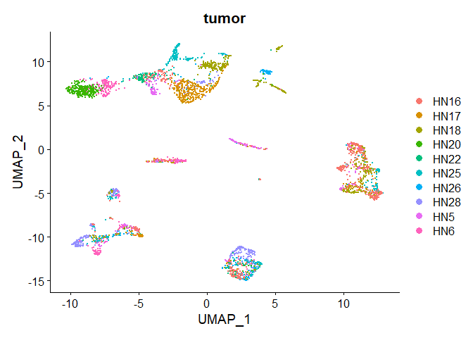<!-- -->

``` r
DimPlot(seurat_obj, group.by = "pEMT")
```

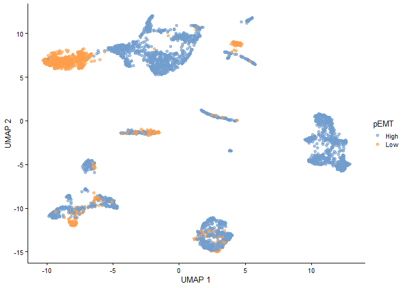<!-- -->

``` r
DimPlot(seurat_obj, group.by = "pEMT_fine")
```

<!-- -->

We will now also check the number of cells per cell type condition
combination, and the number of patients per condition.

``` r
table(seurat_obj@meta.data$celltype, seurat_obj@meta.data$tumor) # cell types vs samples
##                
##                 HN16 HN17 HN18 HN20 HN22 HN25 HN26 HN28 HN5 HN6
##   CAF             47   37   36    3    9   73   19  157  37  82
##   Endothelial     43   17   18    1    1    1    0   14  11  52
##   Malignant       82  353  263  331  123  153   61   49  70 157
##   Myeloid         15    2    7    0    1    8    1    1  58   6
##   myofibroblast   84    6   14   10   45   88   45  140   5   6
##   T.cell         300   61  207    0    0   93    3    0  28   0
table(seurat_obj@meta.data$celltype, seurat_obj@meta.data$pEMT) # cell types vs conditions
##                
##                 High  Low
##   CAF            396  104
##   Endothelial    105   53
##   Malignant     1093  549
##   Myeloid         92    7
##   myofibroblast  382   61
##   T.cell         689    3
table(seurat_obj@meta.data$tumor, seurat_obj@meta.data$pEMT) # samples vs conditions
##       
##        High Low
##   HN16  571   0
##   HN17  476   0
##   HN18  545   0
##   HN20    0 345
##   HN22  179   0
##   HN25  416   0
##   HN26    0 129
##   HN28  361   0
##   HN5   209   0
##   HN6     0 303
```

As you can see, some Celltype-Sample combinations have 0 cells. It is
possible that during DE analysis, some cell types will be removed from
the analysis if there is not enough information to do a DE analysis.

# Step 2: Prepare the cell-cell communication analysis

## Define in which metadata columns we can find the **group**, **sample** and **cell type** IDs

For the group\_id, we now choose for the ‘pEMT’ column instead of
‘pEMT\_fine’, which we will select in a subsequent analysis.

``` r
sample_id = "tumor"
group_id = "pEMT"
celltype_id = "celltype"
```

## Define the contrasts and covariates of interest for the DE analysis, and the minimal number of cells of a cell type that each sample should have to be considered for DE analysis of that cell type.

Here, we want to compare the p-EMT-high vs the p-EMT-low group and find
cell-cell communication events that are higher in high than low pEMT. We
don’t have other covariates to correct for in this dataset.

Note the format to indicate the contrasts!

``` r
covariates = NA
contrasts_oi = c("'High-Low','Low-High'")
contrast_tbl = tibble(contrast = 
                        c("High-Low","Low-High"), 
                      group = c("High","Low"))
min_cells = 5 # here 5 for demonstration purposes - but recommended default is 10.
```

## Define the parameters for the NicheNet ligand activity analysis

Here, we need to define the thresholds that will be used to consider
genes as differentially expressed or not (logFC, p-value, decision
whether to use adjusted or normal p-value, minimum fraction of cells
that should express a gene in at least one sample in a group, whether to
use the normal p-values or empirical null p-values).

NicheNet ligand activity will then be calculated as the enrichment of
predicted target genes of ligands in this set of DE genes compared to
the genomic background. Here we choose for a minimum logFC of 1, maximum
p-value of 0.05 (normal, not adjusted one, because of lack of
statistical power due to pseudobulking and the fact that this dataset
has only a few samples per group), and minimum fraction of expression of
0.05. For the NicheNet ligand-target inference, we also need to select
which top n of the predicted target genes will be considered (here: top
250 targets per ligand). We will also use the empirical p-values (\[ADD
REFERENCE\]). This has mainly advantages when there would be some
violations to the assumptions that should be fulfilled for having
accurate theoretical p-values. In case all assumptions are fulfilled,
using empirical p-values would not harm either.

``` r
logFC_threshold = 1
p_val_threshold = 0.05
fraction_cutoff = 0.05
p_val_adj = FALSE 
empirical_pval = TRUE
top_n_target = 250
```

## Define the weights of the prioritization of both expression, differential expression and NicheNet activity information

MultiNicheNet allows the user to define the weights of the following
criteria to prioritize ligand-receptor interactions:

-   Upregulation of the ligand in a sender cell type and/or upregulation
    of the receptor in a receiver cell type - in the condition of
    interest. : `scaled_lfc_ligand`, `scaled_p_val_ligand`,
    `scaled_lfc_receptor`, and `scaled_p_val_receptor`
-   Sufficiently high expression levels of ligand and receptor in many
    samples of the same group (to mitigate the influence of outlier
    samples). : `fraction_expressing_ligand_receptor`
-   Cell-type and condition specific expression of the ligand in the
    sender cell type and receptor in the receiver cell type (to mitigate
    the influence of upregulated but still relatively weakly expressed
    ligands/receptors) : `scaled_avg_exprs_ligand`,
    `scaled_avg_frq_ligand`, `scaled_avg_exprs_receptor`, and
    `scaled_avg_frq_receptor`
-   High NicheNet ligand activity, to further prioritize ligand-receptor
    pairs based on their predicted effect of the ligand-receptor
    interaction on the gene expression in the receiver cell type :
    `scaled_activity` and `scaled_activity_scaled`
    (scaled\_activity=absolute value of ligand activity;
    scaled\_activity\_scaled=scaled ligand activity value that is
    comparable between different receiver settings - recommended to put
    more weight on this)
-   High relative abundance of sender and/or receiver in the condition
    of interest: `scaled_abundance_sender` and
    `scaled_abundance_receiver`

We will set our preference for this dataset as follows:

``` r
prioritizing_weights = c("scaled_lfc_ligand" = 1,
                         "scaled_p_val_ligand" = 1,
                         "scaled_lfc_receptor" = 1,
                         "scaled_p_val_receptor" = 1,
                         "scaled_activity_scaled" = 1.5,
                         "scaled_activity" = 0.5,
                         "scaled_avg_exprs_ligand" = 0.75,
                         "scaled_avg_frq_ligand" = 0.75,
                         "scaled_avg_exprs_receptor" = 0.75,
                         "scaled_avg_frq_receptor" = 0.75,
                         "fraction_expressing_ligand_receptor" = 1,
                         "scaled_abundance_sender" = 0,
                         "scaled_abundance_receiver" = 0)
```

# Step 3: Perform the cell-cell communication analysis

Now we will run the MultiNicheNet wrapper. In the function
`multi_nichenet_analysis`, we need to specify that we use one Seurat
object of which all cell types should be considered as both receiver and
sender by setting `sender_receiver_separate = FALSE`. This setting will
call the underlying `multi_nichenet_analysis_combined` pipeline
function.

To keep track of the different steps, we will here set `verbose = TRUE`

``` r
output = multi_nichenet_analysis(seurat_obj = seurat_obj, celltype_id = celltype_id, sample_id = sample_id, group_id = group_id, 
                                lr_network = lr_network, ligand_target_matrix = ligand_target_matrix, contrasts_oi = contrasts_oi, contrast_tbl = contrast_tbl, covariates = covariates,
                                prioritizing_weights = prioritizing_weights, min_cells = min_cells, logFC_threshold = logFC_threshold, p_val_threshold = p_val_threshold,  
                                fraction_cutoff = fraction_cutoff, p_val_adj = p_val_adj, empirical_pval = empirical_pval, top_n_target = top_n_target, sender_receiver_separate = FALSE, verbose = TRUE)
## [1] "Make diagnostic abundance plots"
## [1] "Extract expression information from all cell types"
## [1] "Calculate differential expression for all cell types"
## [1] "excluded cell types are:"
## [1] "Endothelial" "Myeloid"     "T.cell"     
## [1] "These celltypes are not considered in the analysis. After removing samples that contain less cells than the required minimal, some groups don't have 2 or more samples anymore. As a result the analysis cannot be run. To solve this: decrease the number of min_cells or change your group_id and pool all samples that belong to groups that are not of interest! "
## [1] "Calculate NicheNet ligand activities and ligand-target links"
## [1] "p-values and adjusted p-values will be determined via the empirical null methods"
## [1] "receiver_oi:"
## [1] "myofibroblast"
## [1] "contrast_oi:"
## [1] "High-Low"
## [1] "Number of DE genes (gene set of interest): "
## [1] 183
## [1] "contrast_oi:"
## [1] "Low-High"
## [1] "Number of DE genes (gene set of interest): "
## [1] 118
## [1] "receiver_oi:"
## [1] "CAF"
## [1] "contrast_oi:"
## [1] "High-Low"
## [1] "Number of DE genes (gene set of interest): "
## [1] 174
## [1] "contrast_oi:"
## [1] "Low-High"
## [1] "Number of DE genes (gene set of interest): "
## [1] 161
## [1] "receiver_oi:"
## [1] "Malignant"
## [1] "contrast_oi:"
## [1] "High-Low"
## [1] "Number of DE genes (gene set of interest): "
## [1] 161
## [1] "contrast_oi:"
## [1] "Low-High"
## [1] "Number of DE genes (gene set of interest): "
## [1] 72
## [1] "receiver_oi:"
## [1] "Endothelial"
## [1] "receiver_oi:"
## [1] "T.cell"
## [1] "receiver_oi:"
## [1] "Myeloid"
## [1] "Combine all the information in prioritization tables"
```

The output of the MultiNicheNet analysis contains much information. We
will now go over this step-by-step

## Quality checks of the MultiNicheNet analysis

### Check the abundance of each cell type per sample and per group

The first plot visualizes the number of cells per celltype-sample
combination, and indicates which combinations are removed during the DE
analysis because there are less than `min_cells` in the celltype-sample
combination.

``` r
output$abund_plot_sample
```

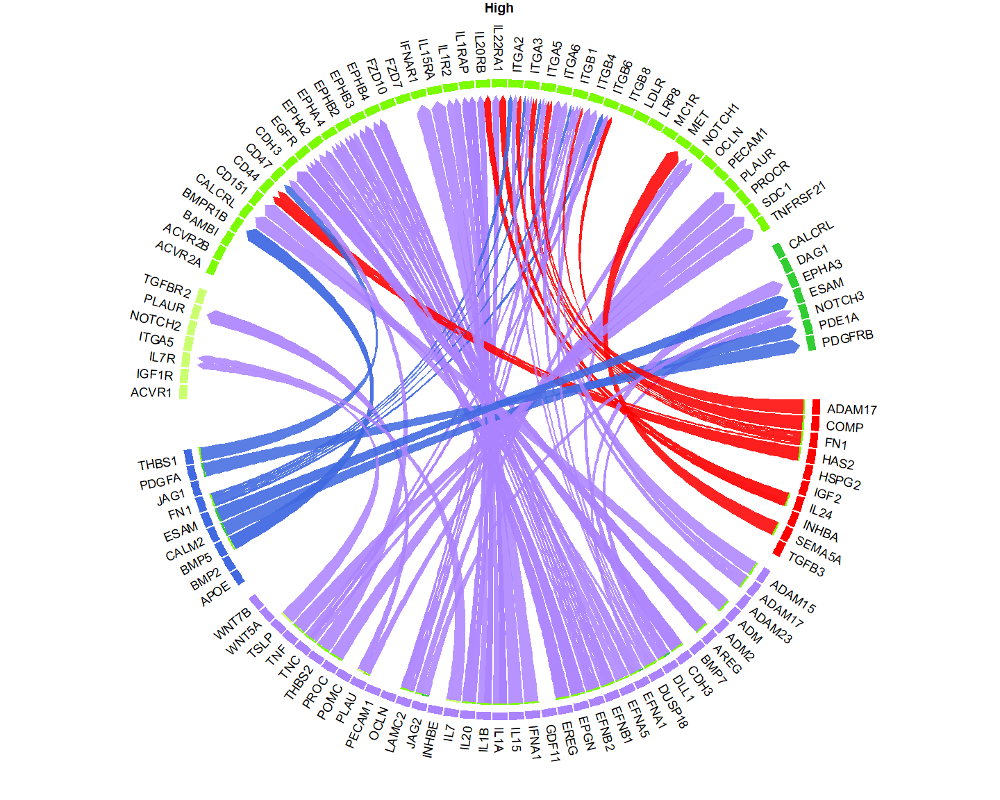<!-- -->

As we can see: Endothelial, Myeloid, and T cells: we don’t have two or
more samples that have enough cells of those cell types. Therefore,
those cell types were removed before the DE analysis (see verbose output
of the multinichenet analysis function).

We will now look at differential abundance between the conditions. This
because the pseudobulking approach behind Muscat could potentially
suffer from some biases if there would be huge differences in abundances
of a cell type between different groups. Downstream results of these
cell types should be considered with some caution.

``` r
output$abund_plot_group
```

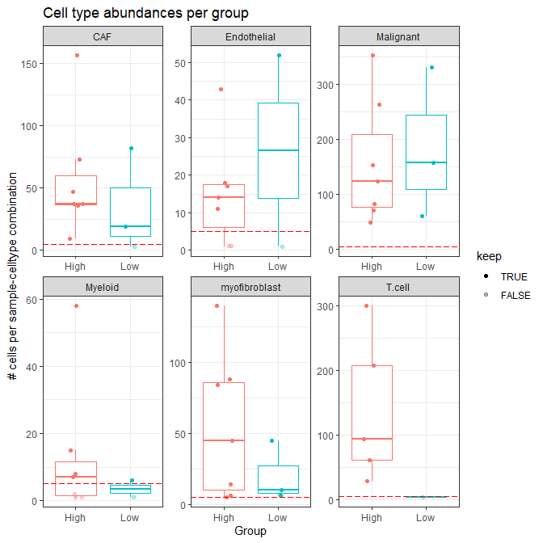<!-- -->
Differential abundance looks quite OK for the cell types kept for the DE
analysis (i.e. CAF, Malignant and myofibroblast)

### Check whether the DE analysis was done in a statistically sound way

First check the normal p-value distributions

``` r
output$hist_pvals
```

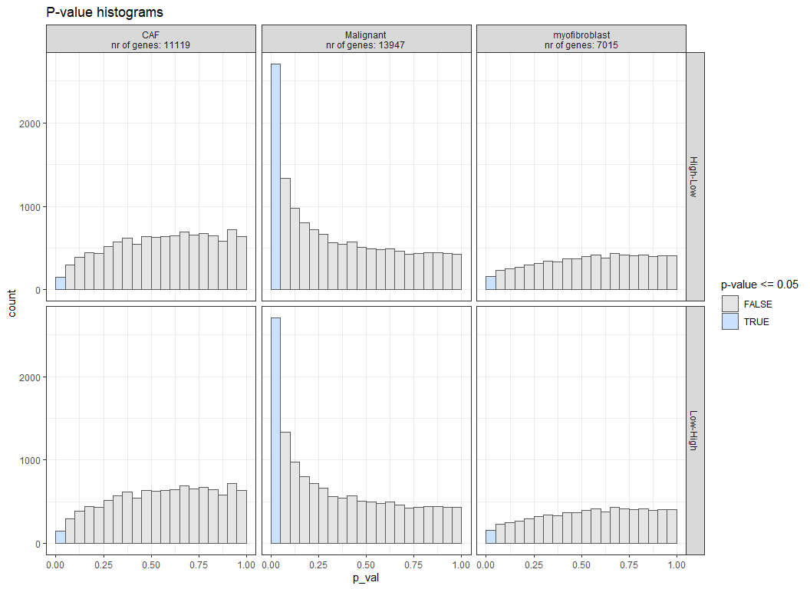<!-- -->
(Note: this p-value histograms are the same for High-Low and Low-High
because we only have two groups and compare them to each other - a
statical DE gene in one comparison will then also be DE in the other
comparison, with just a reversed sign of the logFC)

In order to trust the p-values, the p-value distributions should be
uniform distributions, with a peak allowed between 0 and 0.05 if there
would be a clear biological effect in the data. This clear effect
(=clear DE) seems to be present here in the Malignant cell type
populations, although the histogram is not very uniformly distributed
for p-values between 0.05 and 0.25. This might point to issues in the DE
model definition (eg we did not add all important covariates,
substructure present,…)

Because there might be some issues, and we anticipate this to be present
in most datasets, we decided to use the empiricall null procedure. This
is a procedure that will define empirical p-values based on the observed
distribution of the test statistic (here: logFC) and not based on the
theoretical distribution.

The following plot shows those corrected, empirical p-values

``` r
output$hist_pvals_emp
```

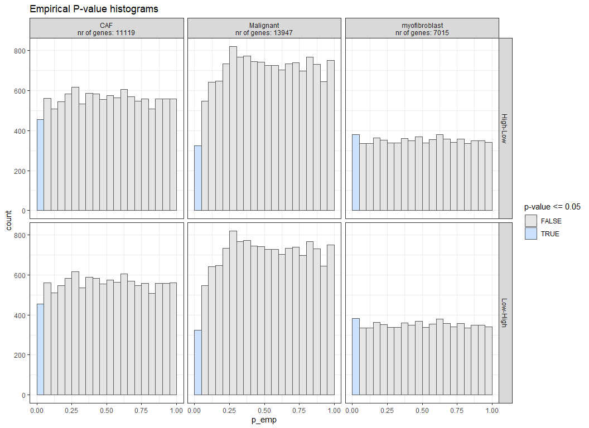<!-- -->

Check of the underlying observed distirbutions of the test statistics:
The green fitted curve should fit well with the histogram. If not, this
might point to some issues in the DE model definition.

(if plotting does not work, it might be necessary to run these plot
commands in the console)

``` r
output$z_distr_plots_emp_pval$`Malignant.High-Low` %>% print()
```

``` r
output$z_distr_plots_emp_pval$`CAF.High-Low` %>% print()
```

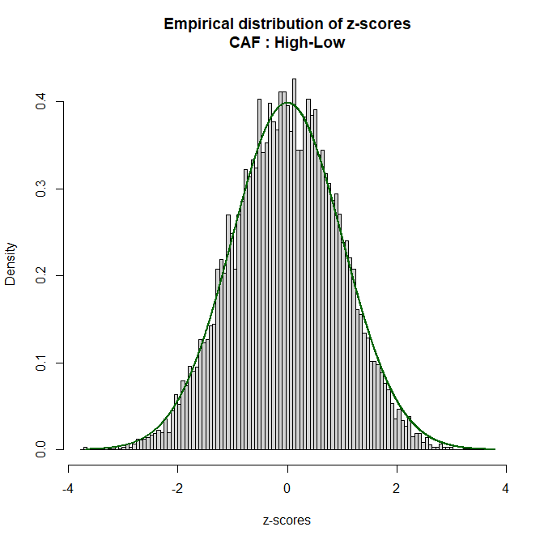<!-- -->

``` r
output$z_distr_plots_emp_pval$`myofibroblast.High-Low` %>% print()
```

This looks fine, except for the Malignant cells. As discussed in the
previous plots: there might be an issue here. One possible explanation
might be that there is additional substructure in the data - which would
make sense because the pEMT high group consists both of pEMT very-high
and pEMT high samples according to the finer subdivision `pEMT_fine`.
Another reason for the possible substructure: malignant cells of each
tumor are very different because of genetic aberrations.

By the empirical null procedure, we lost some DE genes in malignant
cells, but these left over DE genes might be the most bona fide ones.

### Conclusion of the diagnostic plots

If possible it might be a good idea to include more covariates in the
model, or use the `pEMT_fine` group definition instead.

## Check the returned tables in the output

### Average expression value and fraction of each cell type - sample combination

``` r
output$celltype_info$avg_df %>% head()
## # A tibble: 6 x 4
##   gene     sample average_sample celltype     
##   <chr>    <chr>           <dbl> <fct>        
## 1 C9orf152 HN28           0      myofibroblast
## 2 RPS11    HN28           2.96   myofibroblast
## 3 ELMO2    HN28           0.311  myofibroblast
## 4 CREB3L1  HN28           0      myofibroblast
## 5 PNMA1    HN28           0.647  myofibroblast
## 6 MMP2     HN28           0.0724 myofibroblast
output$celltype_info$frq_df %>% head()
## # A tibble: 6 x 4
##   gene     sample fraction_sample celltype     
##   <chr>    <chr>            <dbl> <chr>        
## 1 C9orf152 HN28             0     myofibroblast
## 2 RPS11    HN28             0.957 myofibroblast
## 3 ELMO2    HN28             0.157 myofibroblast
## 4 CREB3L1  HN28             0     myofibroblast
## 5 PNMA1    HN28             0.243 myofibroblast
## 6 MMP2     HN28             0.05  myofibroblast
output$celltype_info$avg_df_group %>% head()
## # A tibble: 6 x 4
## # Groups:   group, celltype [1]
##   group celltype gene     average_group
##   <chr> <fct>    <chr>            <dbl>
## 1 High  CAF      A1BG           0.154  
## 2 High  CAF      A1BG-AS1       0.0789 
## 3 High  CAF      A1CF           0.00821
## 4 High  CAF      A2M            1.29   
## 5 High  CAF      A2M-AS1        0.0571 
## 6 High  CAF      A2ML1          0.0443
output$celltype_info$frq_df_group %>% head()
## # A tibble: 6 x 4
## # Groups:   group, celltype [1]
##   group celltype gene     fraction_group
##   <chr> <chr>    <chr>             <dbl>
## 1 High  CAF      A1BG             0.103 
## 2 High  CAF      A1BG-AS1         0.0536
## 3 High  CAF      A1CF             0.0739
## 4 High  CAF      A2M              0.500 
## 5 High  CAF      A2M-AS1          0.0447
## 6 High  CAF      A2ML1            0.207
output$celltype_info$rel_abundance_df %>% head()
## # A tibble: 6 x 3
##   group celltype    rel_abundance_scaled
##   <chr> <chr>                      <dbl>
## 1 High  CAF                        0.519
## 2 Low   CAF                        0.483
## 3 High  Endothelial                0.355
## 4 Low   Endothelial                0.647
## 5 High  Malignant                  0.356
## 6 Low   Malignant                  0.646
```

### DE information for each cell type - contrast combination

``` r
output$celltype_de %>% head()
## # A tibble: 6 x 11
##   gene    cluster_id   logFC logCPM      F  p_val p_adj.loc p_adj.glb contrast   p_emp p_adj_emp
##   <chr>   <chr>        <dbl>  <dbl>  <dbl>  <dbl>     <dbl>     <dbl> <chr>      <dbl>     <dbl>
## 1 RPS11   CAF        -0.0666   9.29 0.0658 0.801          1         1 High-Low 0.748       0.991
## 2 ELMO2   CAF         0.726    6.64 2.31   0.149          1         1 High-Low 0.0864      0.991
## 3 CREB3L1 CAF         0.149    5.44 0.0184 0.894          1         1 High-Low 0.887       0.998
## 4 PNMA1   CAF        -1.04     6.51 4.03   0.0634         1         1 High-Low 0.0246      0.991
## 5 MMP2    CAF         0.162    9.28 0.422  0.526          1         1 High-Low 0.457       0.991
## 6 TMEM216 CAF        -1.34     6    5.85   0.0291         1         1 High-Low 0.00834     0.991
```

### Linked expression and DE information of the ligand in the sender cell types and the receptor in the receiver cell types

``` r
output$sender_receiver_info$avg_df %>% head()
## # A tibble: 6 x 8
##   sample sender  receiver    ligand receptor avg_ligand avg_receptor ligand_receptor_prod
##   <chr>  <fct>   <fct>       <chr>  <chr>         <dbl>        <dbl>                <dbl>
## 1 HN26   Myeloid Myeloid     CCL19  CCR7           3.81         4.28                 16.3
## 2 HN22   Myeloid Myeloid     IL15   IL2RG          3.41         3.79                 12.9
## 3 HN26   Myeloid Myeloid     F11R   F11R           3.59         3.59                 12.9
## 4 HN17   Myeloid Endothelial NAMPT  INSR           3.59         3.47                 12.5
## 5 HN26   T.cell  T.cell      CD99   CD99           3.49         3.49                 12.1
## 6 HN22   Myeloid Myeloid     F11R   F11R           3.46         3.46                 12.0
output$sender_receiver_info$frq_df %>% head()
## # A tibble: 6 x 8
##   sample sender        receiver    ligand   receptor fraction_ligand fraction_receptor ligand_receptor_fraction_prod
##   <chr>  <chr>         <chr>       <chr>    <chr>              <dbl>             <dbl>                         <dbl>
## 1 HN26   myofibroblast Myeloid     GPI      AMFR                   1                 1                             1
## 2 HN22   myofibroblast Myeloid     CALR     SCARF1                 1                 1                             1
## 3 HN18   myofibroblast Myeloid     PSAP     GPR37L1                1                 1                             1
## 4 HN18   myofibroblast Endothelial CALR     SCARF1                 1                 1                             1
## 5 HN20   myofibroblast CAF         SERPING1 LRP1                   1                 1                             1
## 6 HN20   myofibroblast Endothelial CALM2    MYLK                   1                 1                             1
output$sender_receiver_info$avg_df_group %>% head()
## # A tibble: 6 x 8
## # Groups:   group, sender [5]
##   group sender        receiver      ligand receptor avg_ligand_group avg_receptor_group ligand_receptor_prod_group
##   <chr> <fct>         <fct>         <chr>  <chr>               <dbl>              <dbl>                      <dbl>
## 1 High  myofibroblast myofibroblast CALM2  MYLK                 3.48               2.23                       7.77
## 2 High  Myeloid       myofibroblast CALM2  MYLK                 3.38               2.23                       7.54
## 3 Low   CAF           myofibroblast COL1A1 ITGB1                3.04               2.40                       7.29
## 4 Low   myofibroblast myofibroblast CALM2  MYLK                 3.12               2.32                       7.24
## 5 Low   CAF           CAF           CD99   CD99                 2.68               2.68                       7.18
## 6 High  CAF           myofibroblast CALM2  MYLK                 3.08               2.23                       6.87
output$sender_receiver_info$frq_df_group %>% head()
## # A tibble: 6 x 8
## # Groups:   group, sender [3]
##   group sender      receiver    ligand   receptor fraction_ligand_group fraction_receptor_group ligand_receptor_fraction_prod_group
##   <chr> <chr>       <chr>       <chr>    <chr>                    <dbl>                   <dbl>                               <dbl>
## 1 High  Endothelial Endothelial PECAM1   PECAM1                   1                       1                                   1    
## 2 High  Endothelial Myeloid     HLA-E    KLRD1                    1                       0.956                               0.956
## 3 High  Myeloid     Myeloid     HLA-E    KLRD1                    1                       0.956                               0.956
## 4 Low   CAF         CAF         PSAP     LRP1                     0.992                   0.957                               0.949
## 5 Low   CAF         CAF         SERPING1 LRP1                     0.992                   0.957                               0.949
## 6 High  Myeloid     Myeloid     HLA-G    KLRD1                    0.986                   0.956                               0.942
output$sender_receiver_info$rel_abundance_df %>% head()
## # A tibble: 6 x 6
##   group sender rel_abundance_scaled_sender receiver      rel_abundance_scaled_receiver sender_receiver_rel_abundance_avg
##   <chr> <chr>                        <dbl> <chr>                                 <dbl>                             <dbl>
## 1 High  CAF                          0.519 CAF                                   0.519                             0.519
## 2 High  CAF                          0.519 Endothelial                           0.355                             0.437
## 3 High  CAF                          0.519 Malignant                             0.356                             0.438
## 4 High  CAF                          0.519 Myeloid                               0.797                             0.658
## 5 High  CAF                          0.519 myofibroblast                         0.644                             0.581
## 6 High  CAF                          0.519 T.cell                                1.00                              0.760
```

``` r
output$sender_receiver_de %>% head()
## # A tibble: 6 x 12
##   contrast sender        receiver  ligand receptor lfc_ligand lfc_receptor ligand_receptor_lfc_avg p_val_ligand p_adj_ligand p_val_receptor p_adj_receptor
##   <chr>    <chr>         <chr>     <chr>  <chr>         <dbl>        <dbl>                   <dbl>        <dbl>        <dbl>          <dbl>          <dbl>
## 1 High-Low Malignant     Malignant IL20   IL20RB         8.59        2.33                     5.46    0.0000403       0.0144       0.000226         0.0272
## 2 High-Low Malignant     Malignant IL20   IL22RA1        8.59        1.05                     4.82    0.0000403       0.0144       0.0403           0.237 
## 3 High-Low Malignant     Malignant IL24   IL20RB         6.28        2.33                     4.30    0.000117        0.0202       0.000226         0.0272
## 4 High-Low Malignant     Malignant IL20   IL20RA         8.59       -0.477                    4.06    0.0000403       0.0144       0.577            0.793 
## 5 High-Low myofibroblast Malignant TGFB2  TGFBR2         4.89        2.89                     3.89    0.00464         1            0.0018           0.0645
## 6 High-Low Malignant     Malignant TGFB2  TGFBR2         4.76        2.89                     3.82    0.000279        0.0285       0.0018           0.0645
```

### Output of the NicheNet ligand activity analysis, and the NicheNet ligand-target inference

``` r
output$ligand_activities_targets_DEgenes$ligand_activities %>% head()
## # A tibble: 6 x 7
## # Groups:   receiver, contrast [1]
##   ligand activity contrast target  ligand_target_weight receiver      activity_scaled
##   <chr>     <dbl> <chr>    <chr>                  <dbl> <chr>                   <dbl>
## 1 CXCL1    0.0119 High-Low ANGPTL4             0.000940 myofibroblast         -0.0177
## 2 CXCL1    0.0119 High-Low CISH                0.000935 myofibroblast         -0.0177
## 3 CXCL1    0.0119 High-Low HES1                0.00116  myofibroblast         -0.0177
## 4 CXCL1    0.0119 High-Low ICAM1               0.00104  myofibroblast         -0.0177
## 5 CXCL1    0.0119 High-Low IL6                 0.000946 myofibroblast         -0.0177
## 6 CXCL1    0.0119 High-Low PRDM1               0.000897 myofibroblast         -0.0177
```

``` r
output$ligand_activities_targets_DEgenes$de_genes_df %>% head()
## # A tibble: 6 x 6
##   gene    receiver      logFC contrast   p_val p_adj.glb
##   <chr>   <chr>         <dbl> <chr>      <dbl>     <dbl>
## 1 ELMO2   myofibroblast  2.02 High-Low 0.0154      0.818
## 2 ZDHHC6  myofibroblast  2.82 High-Low 0.00272     0.465
## 3 FPGT    myofibroblast  2.42 High-Low 0.0115      0.768
## 4 LDLR    myofibroblast  1.17 High-Low 0.0363      0.866
## 5 SLC48A1 myofibroblast  1.29 High-Low 0.0459      0.890
## 6 BLVRB   myofibroblast  1.95 High-Low 0.00255     0.465
```

### Tables with the final prioritization scores (results per group and per sample)

``` r
output$prioritization_tables$group_prioritization_tbl %>% head()
## # A tibble: 6 x 38
##   contrast group sender  receiver  ligand receptor lfc_ligand lfc_receptor ligand_receptor_~ p_val_ligand p_adj_ligand p_val_receptor p_adj_receptor activity activity_scaled lr_interaction id         avg_ligand_group avg_receptor_gr~ ligand_receptor_p~ fraction_ligand_~
##   <chr>    <chr> <chr>   <chr>     <chr>  <chr>         <dbl>        <dbl>             <dbl>        <dbl>        <dbl>          <dbl>          <dbl>    <dbl>           <dbl> <chr>          <chr>                 <dbl>            <dbl>              <dbl>             <dbl>
## 1 High-Low High  Malign~ Malignant IL1A   IL1RAP         2.4         1.63               2.01    0.0579          0.276      0.000127          0.0205    0.0764           2.84  IL1A_IL1RAP    IL1A_IL1R~            0.254            0.824             0.209             0.169 
## 2 High-Low High  Malign~ Malignant IL1B   IL1RAP         3.58        1.63               2.60    0.00642         0.107      0.000127          0.0205    0.0677           2.09  IL1B_IL1RAP    IL1B_IL1R~            0.112            0.824             0.0920            0.0625
## 3 High-Low High  Malign~ Malignant AREG   EGFR           2.3         0.908              1.60    0.000263        0.0282     0.00942           0.129     0.0498           0.553 AREG_EGFR      AREG_EGFR~            0.934            0.906             0.846             0.480 
## 4 High-Low High  Malign~ Malignant CDH3   CDH3           1.41        1.41               1.41    0.000216        0.0267     0.000216          0.0267    0.0481           0.410 CDH3_CDH3      CDH3_CDH3~            2.02             2.02              4.07              0.884 
## 5 High-Low High  Malign~ Malignant TNC    ITGB6          0.38        3.75               2.06    0.498           0.741      0.00000421        0.00588   0.0667           2.01  TNC_ITGB6      TNC_ITGB6~            1.38             0.990             1.37              0.746 
## 6 High-Low High  Malign~ Malignant EREG   EGFR           2.83        0.908              1.87    0.0000916       0.0185     0.00942           0.129     0.0464           0.262 EREG_EGFR      EREG_EGFR~            0.341            0.906             0.309             0.530 
## # ... with 17 more variables: fraction_receptor_group <dbl>, ligand_receptor_fraction_prod_group <dbl>, rel_abundance_scaled_sender <dbl>, rel_abundance_scaled_receiver <dbl>, sender_receiver_rel_abundance_avg <dbl>, scaled_lfc_ligand <dbl>, scaled_p_val_ligand <dbl>,
## #   scaled_lfc_receptor <dbl>, scaled_p_val_receptor <dbl>, scaled_activity_scaled <dbl>, scaled_activity <dbl>, scaled_avg_exprs_ligand <dbl>, scaled_avg_frq_ligand <dbl>, scaled_avg_exprs_receptor <dbl>, scaled_avg_frq_receptor <dbl>,
## #   fraction_expressing_ligand_receptor <dbl>, prioritization_score <dbl>
```

``` r
output$prioritization_tables$sample_prioritization_tbl %>% head()
## # A tibble: 6 x 22
##   sample sender  receiver  ligand receptor avg_ligand avg_receptor ligand_receptor_~ fraction_ligand fraction_recept~ ligand_receptor_~ group prioritization_~ lr_interaction id       scaled_LR_prod scaled_LR_frac n_cells_receiver keep_receiver n_cells_sender keep_sender
##   <chr>  <chr>   <chr>     <chr>  <chr>         <dbl>        <dbl>             <dbl>           <dbl>            <dbl>             <dbl> <chr>            <dbl> <chr>          <chr>             <dbl>          <dbl>            <dbl>         <dbl>          <dbl>       <dbl>
## 1 HN26   Myeloid Myeloid   CCL19  CCR7           3.81         4.28              16.3               1                1                 1 Low                 NA CCL19_CCR7     CCL19_C~           2.74          2.57                 1             0              1           0
## 2 HN22   Myeloid Myeloid   IL15   IL2RG          3.41         3.79              12.9               1                1                 1 High                NA IL15_IL2RG     IL15_IL~           2.05          1.21                 1             0              1           0
## 3 HN26   Myeloid Myeloid   F11R   F11R           3.59         3.59              12.9               1                1                 1 Low                 NA F11R_F11R      F11R_F1~           1.95          0.881                1             0              1           0
## 4 HN17   Myeloid Endothel~ NAMPT  INSR           3.59         3.47              12.5               1                1                 1 High                NA NAMPT_INSR     NAMPT_I~           2.04          0.921               17             1              2           0
## 5 HN26   T.cell  T.cell    CD99   CD99           3.49         3.49              12.1               1                1                 1 Low                 NA CD99_CD99      CD99_CD~           2.56          2.48                 3             0              3           0
## 6 HN22   Myeloid Myeloid   F11R   F11R           3.46         3.46              12.0               1                1                 1 High                NA F11R_F11R      F11R_F1~           1.77          0.881                1             0              1           0
## # ... with 1 more variable: keep_sender_receiver <fct>
```

Based on these prioritization tables, we will define which interactions
to visualize in the different plots below.

# Step 4: Visualize the results of the cell-cell communication analysis

In a first instance, we will look at the broad overview of prioritized
interactions via condition-specific Circos plots. We will filter on the
prioritization score after removing interactions that are not
upregulated in the condition of interest, and that are in no patient
expressed in more than 5% of cells of a cell type (cf
`fraction_cutoff`).

We will look here at the top100 predictions across all contrasts (high
vs low; and low vs high), senders, and receivers of interest.

## Circos plot of top-prioritized links

(remark: there are still some bugs in the automatic circos plot
function)

``` r
prioritized_tbl_oi = output$prioritization_tables$group_prioritization_tbl %>% 
  filter(fraction_ligand_group > fraction_cutoff & fraction_receptor_group > fraction_cutoff) %>% 
  distinct(id, sender, receiver, ligand, receptor, group, prioritization_score, ligand_receptor_lfc_avg, fraction_expressing_ligand_receptor) %>% 
  filter(ligand_receptor_lfc_avg > 0 & fraction_expressing_ligand_receptor > 0) %>% top_n(100, prioritization_score) 

prioritized_tbl_oi %>% group_by(group) %>% count()
## # A tibble: 2 x 2
## # Groups:   group [2]
##   group     n
##   <chr> <int>
## 1 High     73
## 2 Low      27

prioritized_tbl_oi = output$prioritization_tables$group_prioritization_tbl %>% 
  filter(id %in% prioritized_tbl_oi$id) %>% 
  distinct(id, sender, receiver, ligand, receptor, group) %>% left_join(prioritized_tbl_oi)
prioritized_tbl_oi$prioritization_score[is.na(prioritized_tbl_oi$prioritization_score)] = 0


n_senders = prioritized_tbl_oi$sender %>% unique() %>% length()
n_receivers = prioritized_tbl_oi$receiver %>% unique() %>% length()

  
colors_sender = c("red", "orange", "royalblue")
colors_receiver = c("red", "orange", "royalblue")

circos_list = make_circos_group_comparison(prioritized_tbl_oi, colors_sender, colors_receiver)
```

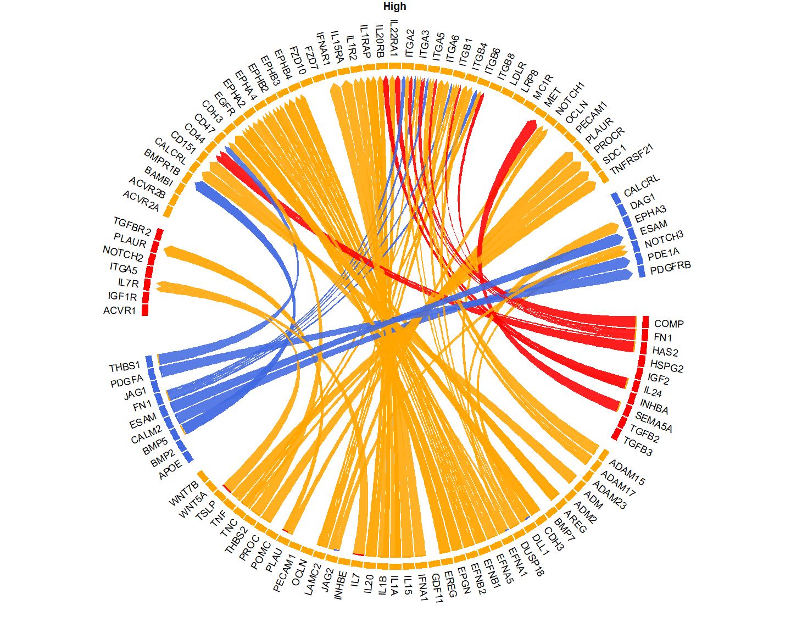<!-- -->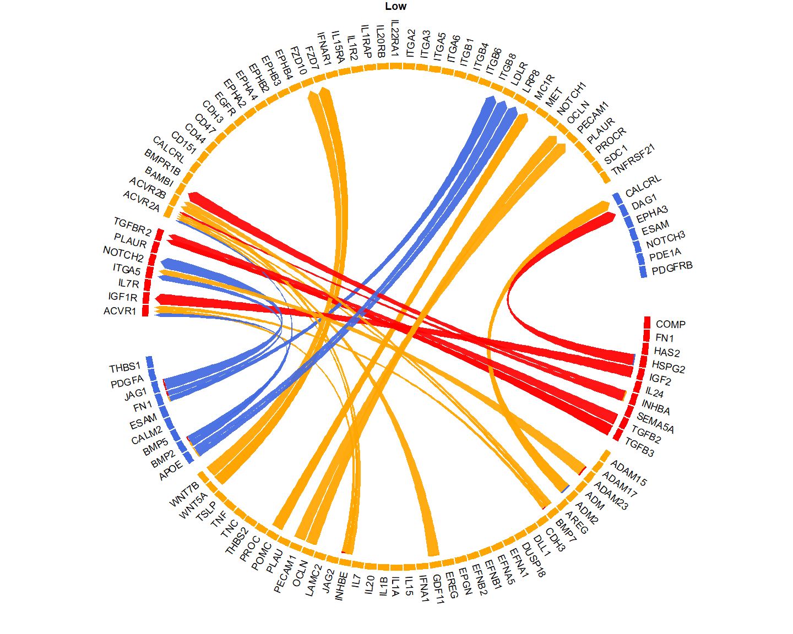<!-- -->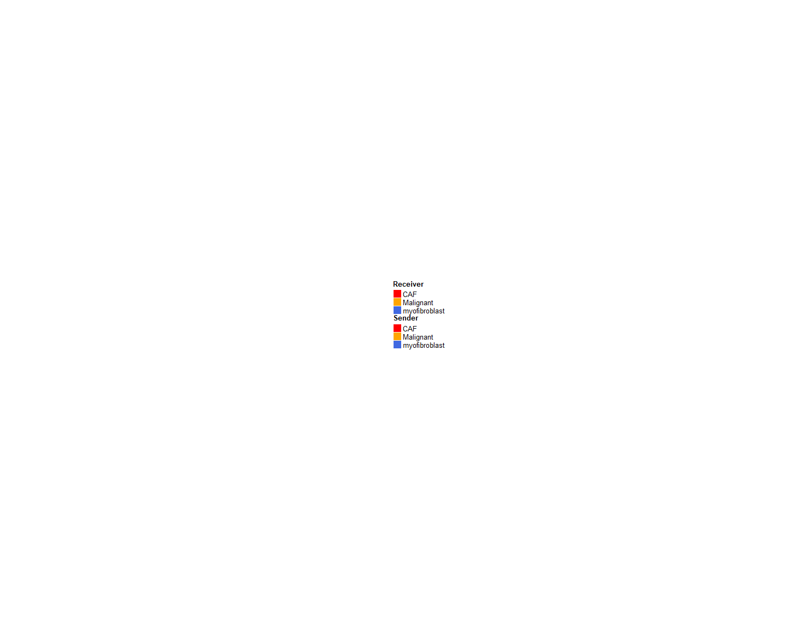<!-- -->

## Visualization of scaled\_LR\_prod per sample

Now we will visualize per sample the scaled product of ligand and
receptor expression. Samples that were left out of the DE analysis are
indicated with a smaller dot (this helps to indicate the samples that
did not contribute to the calculation of the logFC, and thus not
contributed to the final prioritization)

We will now check the top75 interactions specific for the pEMT high
group

``` r
group_oi = "High"
```

``` r
prioritized_tbl_oi = output$prioritization_tables$group_prioritization_tbl %>% 
  distinct(id, sender, receiver, lr_interaction, group, ligand_receptor_lfc_avg, activity_scaled, fraction_expressing_ligand_receptor,  prioritization_score) %>% 
  filter(ligand_receptor_lfc_avg > 0 & fraction_expressing_ligand_receptor > 0) %>% 
  filter(group == group_oi) %>% group_by(group) %>% top_n(75, prioritization_score) 

plot_oi = make_sample_lr_prod_plots(output$prioritization_tables, prioritized_tbl_oi)
plot_oi
```

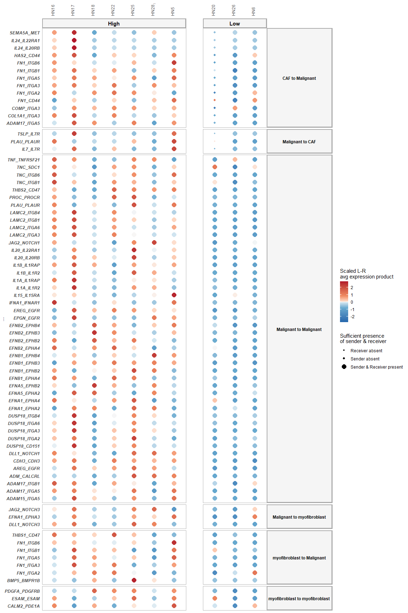<!-- -->

Next to these LR expression products, we can also plot the NicheNet
ligand activities of the ligand in the receiver.

``` r
prioritized_tbl_oi = output$prioritization_tables$group_prioritization_tbl %>% 
  distinct(id, sender, receiver, lr_interaction, group, ligand_receptor_lfc_avg, activity_scaled, fraction_expressing_ligand_receptor,  prioritization_score) %>% 
  filter(ligand_receptor_lfc_avg > 0 & fraction_expressing_ligand_receptor > 0) %>% 
  filter(group == group_oi) %>% group_by(group) %>% top_n(75, prioritization_score) 

plot_oi = make_sample_lr_prod_activity_plots(output$prioritization_tables, prioritized_tbl_oi, widths = c(5,1,1))
plot_oi
```

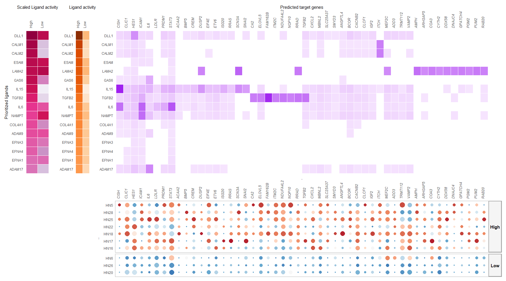<!-- -->

## Visualization of expression-logFC per group and ligand activity

Next type of plots will show the logFC of LR pairs across all
sender-receiver pairs that are selected, and add the ligand activity
next to it.

``` r
receiver_oi = "Malignant"
group_oi = "High"
```

``` r
prioritized_tbl_oi = output$prioritization_tables$group_prioritization_tbl %>% 
  filter(fraction_ligand_group > fraction_cutoff & fraction_receptor_group > fraction_cutoff) %>% 
  distinct(id, sender, receiver, lr_interaction, group, ligand_receptor_lfc_avg, activity_scaled, fraction_ligand_group, fraction_expressing_ligand_receptor, scaled_avg_exprs_ligand, prioritization_score) %>% 
  filter(ligand_receptor_lfc_avg > 0 & fraction_expressing_ligand_receptor > 0) %>% 
  filter(group == group_oi & receiver == receiver_oi) %>% top_n(75, prioritization_score) 

plot_oi = make_group_lfc_exprs_activity_plot(output$prioritization_tables, prioritized_tbl_oi, receiver_oi, heights = c(5,1,1))
plot_oi
```

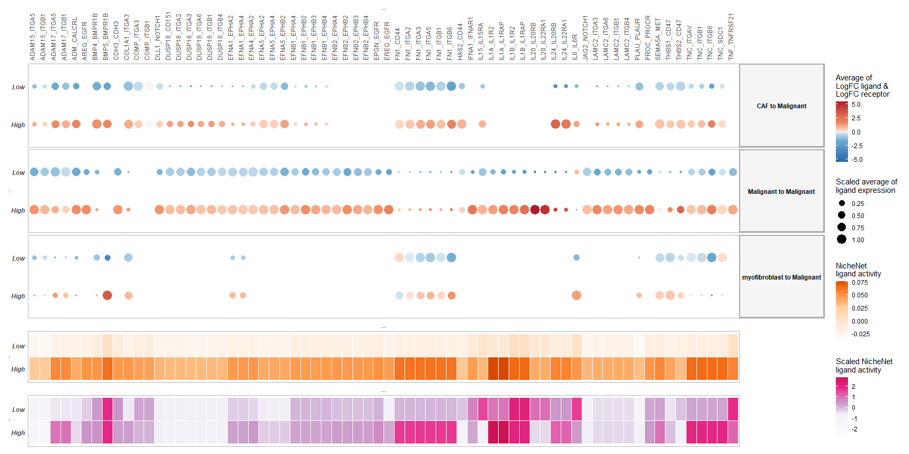<!-- -->

## Visualization of ligand-activity, ligand-target links, and target gene expression

In another type of plot, we can visualize the ligand activities for a
group-receiver combination, and show the predicted ligand-target links,
and also the expression of the predicted target genes across samples.

First: show this for a selection of ligands with high ligand activities:

``` r
group_oi = "High"
receiver_oi = "Malignant"
prioritized_tbl_oi = output$prioritization_tables$group_prioritization_tbl %>% 
  filter(fraction_ligand_group > fraction_cutoff & fraction_receptor_group > fraction_cutoff) %>% 
  distinct(id, sender, receiver, ligand, receptor, group, prioritization_score, ligand_receptor_lfc_avg, fraction_expressing_ligand_receptor, activity_scaled) %>% 
  filter(ligand_receptor_lfc_avg > 0 & fraction_expressing_ligand_receptor > 0) %>% 
  filter(group == group_oi & receiver == receiver_oi) %>% 
  group_by(group) %>% top_n(50, prioritization_score) %>% top_n(25, activity_scaled) %>% arrange(-activity_scaled)
```

``` r
combined_plot = make_ligand_activity_target_plot(group_oi, receiver_oi, prioritized_tbl_oi, output$ligand_activities_targets_DEgenes, contrast_tbl, output$grouping_tbl, output$celltype_info, plot_legend = FALSE)
combined_plot
## $combined_plot
```

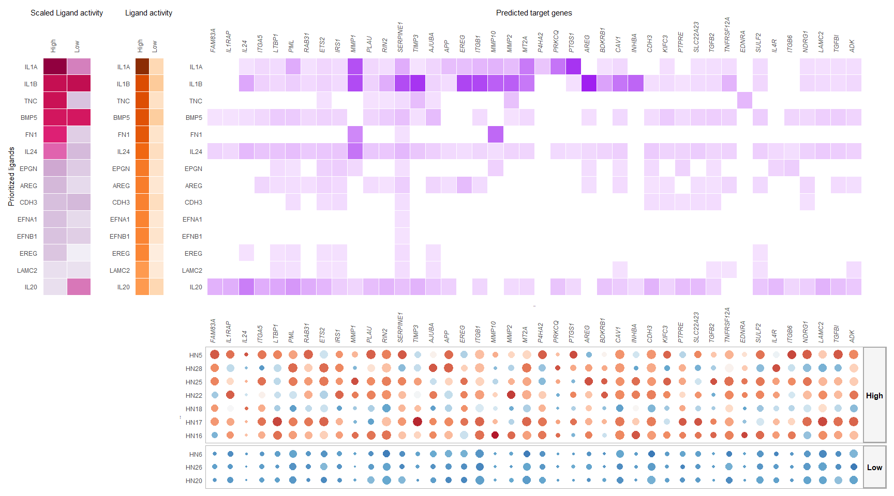<!-- -->

    ## 
    ## $legends

<!-- -->

Now: show this for a selection of ligands with high general
prioritization scores, not necessarily high ligand activities.

``` r
group_oi = "High"
receiver_oi = "Malignant"
prioritized_tbl_oi = output$prioritization_tables$group_prioritization_tbl %>% 
  filter(fraction_ligand_group > fraction_cutoff & fraction_receptor_group > fraction_cutoff) %>% 
  distinct(id, sender, receiver, ligand, receptor, group, prioritization_score, ligand_receptor_lfc_avg, fraction_expressing_ligand_receptor, activity_scaled) %>% 
  filter(ligand_receptor_lfc_avg > 0 & fraction_expressing_ligand_receptor > 0) %>% 
  filter(group == group_oi & receiver == receiver_oi) %>% 
  group_by(group) %>% top_n(25, prioritization_score) %>% arrange(-activity_scaled)
```

``` r
combined_plot = make_ligand_activity_target_plot(group_oi, receiver_oi, prioritized_tbl_oi, output$ligand_activities_targets_DEgenes, contrast_tbl, output$grouping_tbl, output$celltype_info, plot_legend = FALSE)
combined_plot
## $combined_plot
```

<!-- -->

    ## 
    ## $legends

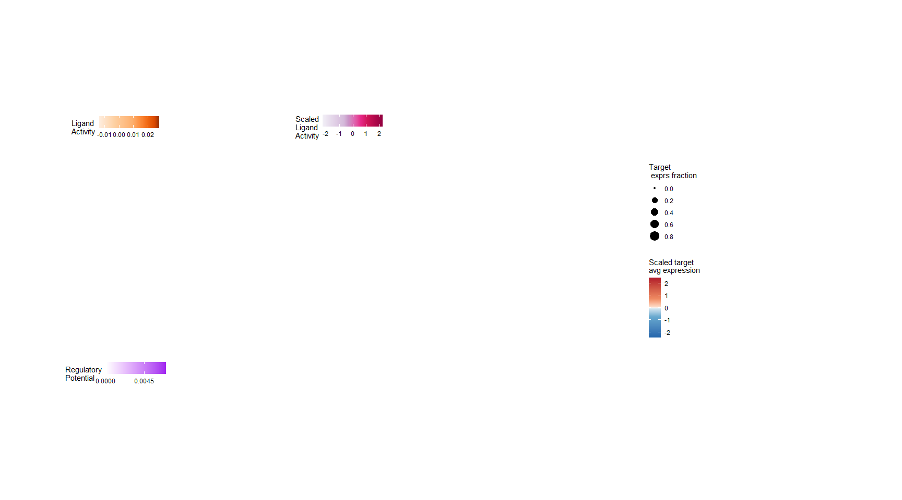<!-- -->

Of course you can look at other receivers as well:

``` r
group_oi = "High"
receiver_oi = "myofibroblast"
prioritized_tbl_oi = output$prioritization_tables$group_prioritization_tbl %>% 
  filter(fraction_ligand_group > fraction_cutoff & fraction_receptor_group > fraction_cutoff) %>% 
  distinct(id, sender, receiver, ligand, receptor, group, prioritization_score, ligand_receptor_lfc_avg, fraction_expressing_ligand_receptor, activity_scaled) %>% 
  filter(ligand_receptor_lfc_avg > 0 & fraction_expressing_ligand_receptor > 0) %>% 
  filter(group == group_oi & receiver == receiver_oi) %>% 
  group_by(group) %>% top_n(25, prioritization_score) %>% arrange(-activity_scaled)
```

``` r
combined_plot = make_ligand_activity_target_plot(group_oi, receiver_oi, prioritized_tbl_oi, output$ligand_activities_targets_DEgenes, contrast_tbl, output$grouping_tbl, output$celltype_info, plot_legend = FALSE)
combined_plot
## $combined_plot
```

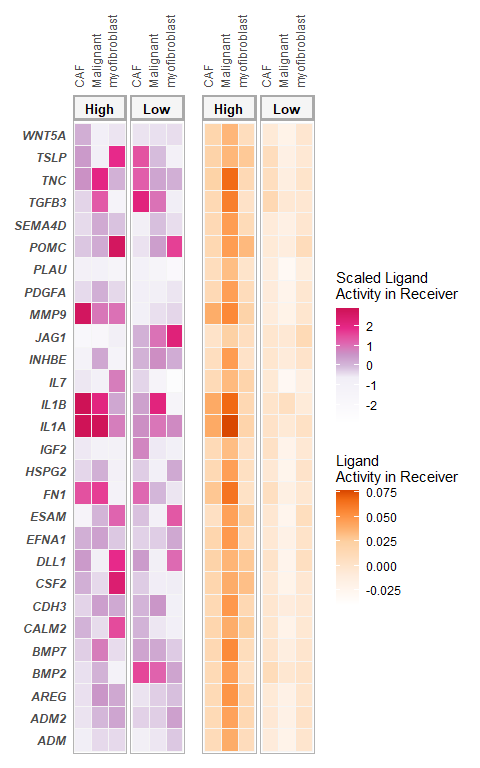<!-- -->

    ## 
    ## $legends

<!-- -->

## Show ligand activities for each receiver-group combination

In the next type of plot, we plot all the ligand activities (Both scaled
and absolute activities) of each receiver-group combination. This can
give us some insights in active signaling pathways across groups. Note
that we can thus show top ligands based on ligand activity - agnostic of
expression in sender.

``` r
ligands_oi = output$prioritization_tables$ligand_activities_target_de_tbl %>% inner_join(contrast_tbl) %>% 
  group_by(group, receiver) %>% distinct(ligand, receiver, group, activity) %>% 
  top_n(5, activity) %>% pull(ligand) %>% unique()

plot_oi = make_ligand_activity_plots(output$prioritization_tables, ligands_oi, contrast_tbl, widths = NULL)
plot_oi
```

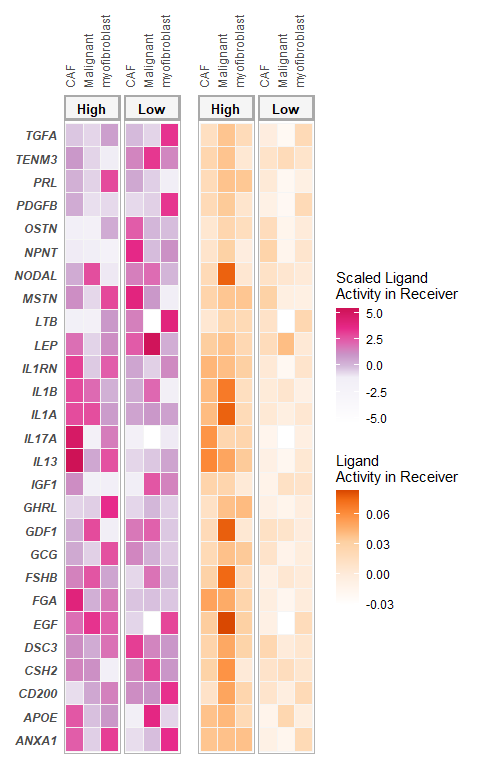<!-- -->

Or we can do this plot for ligands, while considering the general
priorization score (which considers expression information etc)

Show top ligands based on prioritization scores

``` r
ligands_oi = output$prioritization_tables$group_prioritization_tbl %>% 
  group_by(group, receiver) %>% distinct(ligand, receiver, group, prioritization_score) %>% 
  top_n(5, prioritization_score) %>% pull(ligand) %>% unique()

plot_oi = make_ligand_activity_plots(output$prioritization_tables, ligands_oi, contrast_tbl, widths = NULL)
plot_oi
```

<!-- -->

## Zoom in on specific ligand-receptor interactions: show their expression in the single-cell data!

Single-cell-based Nebulosa, Feature, and Violin plots of ligand-receptor
interaction of interest: `make_ligand_receptor_nebulosa_feature_plot`
and `make_ligand_receptor_violin_plot`

It is often useful to zoom in on specific ligand-receptor interactions
of interest by looking in more detail to their expression at the single
cell level

Check the highest scoring links based on the general prioritization
score. Here we will pick one of those to visualize.

``` r
prioritized_tbl_oi = output$prioritization_tables$group_prioritization_tbl %>% 
  filter(fraction_ligand_group > fraction_cutoff & fraction_receptor_group > fraction_cutoff) %>% 
  distinct(id, sender, receiver, ligand, receptor, group, prioritization_score) %>% 
  group_by(group, receiver) %>% top_n(5, prioritization_score) 
prioritized_tbl_oi
## # A tibble: 30 x 7
## # Groups:   group, receiver [6]
##    group sender    receiver      ligand receptor id                                  prioritization_score
##    <chr> <chr>     <chr>         <chr>  <chr>    <chr>                                              <dbl>
##  1 High  Malignant Malignant     IL1A   IL1RAP   IL1A_IL1RAP_Malignant_Malignant                    0.667
##  2 High  Malignant Malignant     IL1B   IL1RAP   IL1B_IL1RAP_Malignant_Malignant                    0.653
##  3 High  Malignant Malignant     AREG   EGFR     AREG_EGFR_Malignant_Malignant                      0.640
##  4 High  Malignant Malignant     CDH3   CDH3     CDH3_CDH3_Malignant_Malignant                      0.638
##  5 High  Malignant Malignant     TNC    ITGB6    TNC_ITGB6_Malignant_Malignant                      0.638
##  6 Low   Malignant Malignant     INHBE  ACVR2A   INHBE_ACVR2A_Malignant_Malignant                   0.629
##  7 Low   Malignant Malignant     WNT5A  FZD7     WNT5A_FZD7_Malignant_Malignant                     0.627
##  8 High  Malignant myofibroblast DLL1   NOTCH3   DLL1_NOTCH3_Malignant_myofibroblast                0.614
##  9 Low   Malignant Malignant     BMP7   ACVR2A   BMP7_ACVR2A_Malignant_Malignant                    0.613
## 10 Low   Malignant Malignant     POMC   MC1R     POMC_MC1R_Malignant_Malignant                      0.613
## # ... with 20 more rows
```

``` r
ligand_oi = "DLL1"
receptor_oi = "NOTCH3"
group_oi = "High"
sender_oi = "Malignant"
receiver_oi = "myofibroblast"
```

Nebulosa and Feature plot of the ligand in the sender cell type and the
receptor in the receiver cell type (split per condition)

``` r
plot_list = make_ligand_receptor_nebulosa_feature_plot(seurat_obj_sender = seurat_obj, seurat_obj_receiver = seurat_obj, ligand_oi = ligand_oi, receptor_oi = receptor_oi, group_oi = group_oi, group_id = group_id, celltype_id_sender = celltype_id, celltype_id_receiver = celltype_id, senders_oi = c("Malignant","myofibroblast","CAF"), receivers_oi = c("Malignant","myofibroblast","CAF"), prioritized_tbl_oi = prioritized_tbl_oi)
plot_list$nebulosa # not recommended for Smart-seq data
```

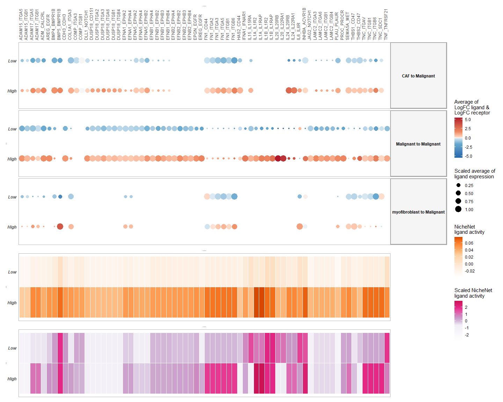<!-- -->

``` r
plot_list$feature
```

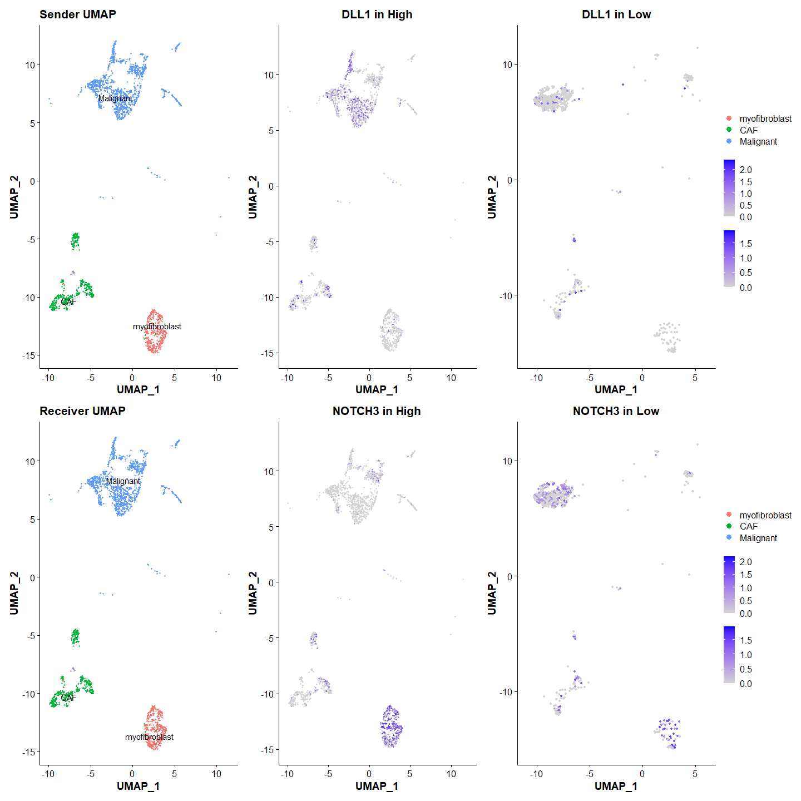<!-- -->
Pooled single-cell and sample-specific single-cell violin plots of
ligand and receptor expression in respectively sender and receiver.

``` r
plot_list2 = make_ligand_receptor_violin_plot(seurat_obj_sender = seurat_obj, seurat_obj_receiver = seurat_obj, ligand_oi = ligand_oi, receptor_oi = receptor_oi, group_oi = group_oi, group_id = group_id, sender_oi = sender_oi, receiver_oi = receiver_oi, sample_id = sample_id, celltype_id_sender = celltype_id, celltype_id_receiver = celltype_id, prioritized_tbl_oi = prioritized_tbl_oi)
plot_list2$violin_group
```

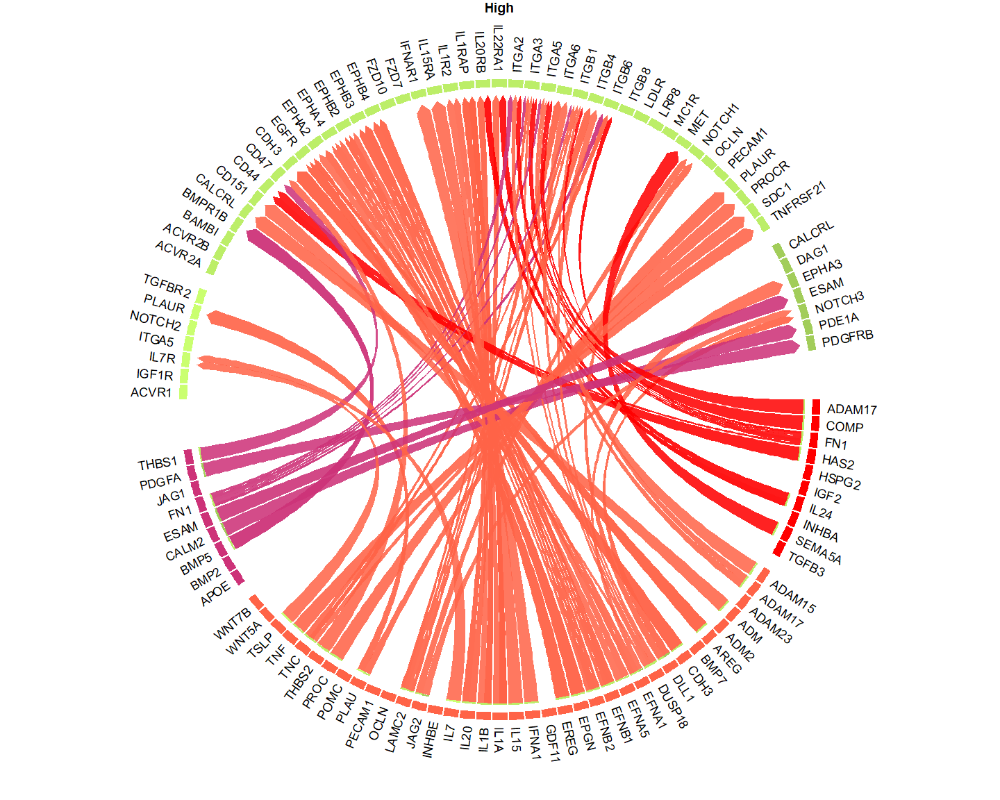<!-- -->

``` r
plot_list2$violin_sample
```

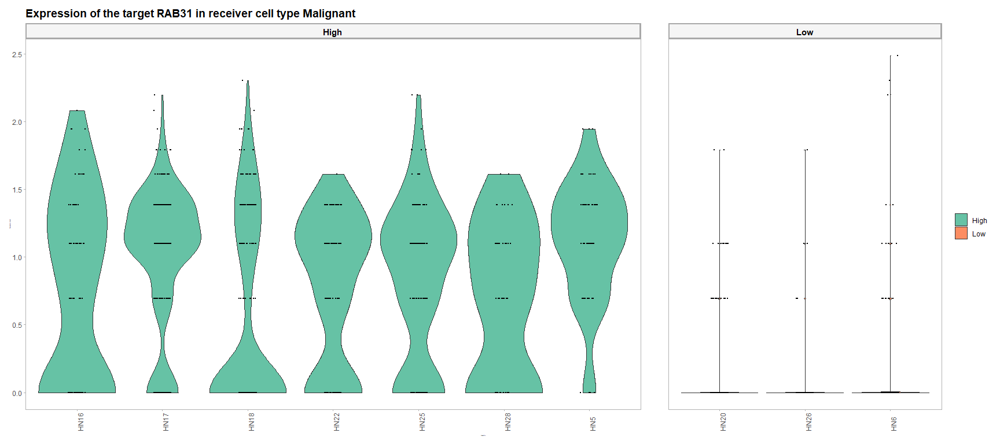<!-- -->

## Zoom in on specific ligand-target interactions: show their expression in the single-cell data!

Make target gene violin and nebulosa plots: `make_target_violin_plot`
and `make_target_nebulosa_feature_plot`

``` r
receiver_oi = "Malignant"
group_oi = "High"

output$ligand_activities_targets_DEgenes$de_genes_df %>% inner_join(contrast_tbl) %>% filter(p_val <= 0.05) %>% filter(group == group_oi) %>% filter(receiver == receiver_oi) %>% arrange(p_val) %>% top_n(100, logFC)  
## # A tibble: 100 x 7
##    gene   receiver  logFC contrast   p_val p_adj.glb group
##    <chr>  <chr>     <dbl> <chr>      <dbl>     <dbl> <chr>
##  1 RAB31  Malignant  3    High-Low 0.00200     0.999 High 
##  2 AHNAK2 Malignant  2.3  High-Low 0.00260     0.999 High 
##  3 GSDMC  Malignant  3.19 High-Low 0.00306     0.999 High 
##  4 ITGB6  Malignant  3.75 High-Low 0.00433     0.999 High 
##  5 ITGA3  Malignant  1.85 High-Low 0.00497     0.999 High 
##  6 CA2    Malignant  5.8  High-Low 0.00562     0.999 High 
##  7 GALNT6 Malignant  1.76 High-Low 0.00597     0.999 High 
##  8 KCNK6  Malignant  2.57 High-Low 0.00681     0.999 High 
##  9 PLEK2  Malignant  1.93 High-Low 0.00687     0.999 High 
## 10 GJB6   Malignant  3.33 High-Low 0.00819     0.999 High 
## # ... with 90 more rows
```

RAB31: interesting gene

``` r
target_oi = "RAB31"

make_target_violin_plot(seurat_obj_receiver = seurat_obj, target_oi = target_oi, receiver_oi = receiver_oi, group_oi = group_oi, group_id = group_id, sample_id, celltype_id_receiver = celltype_id, output$prioritization_tables$group_prioritization_tbl)
## $violin_group
```

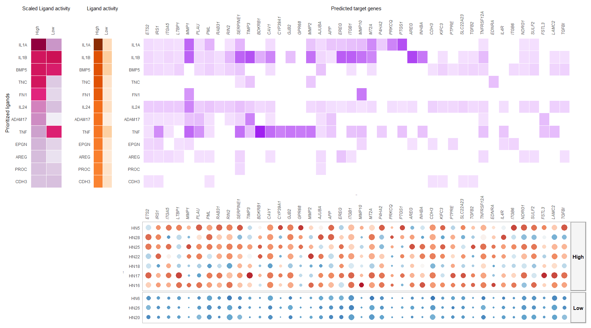<!-- -->

    ## 
    ## $violin_sample

<!-- -->

``` r
make_target_nebulosa_feature_plot(seurat_obj_receiver = seurat_obj, target_oi = target_oi, group_oi = group_oi, group_id = group_id, celltype_id_receiver = celltype_id, receivers_oi = c("Malignant","myofibroblast","CAF"), output$prioritization_tables$group_prioritization_tbl) 
## $nebulosa
```

<!-- -->

    ## 
    ## $feature

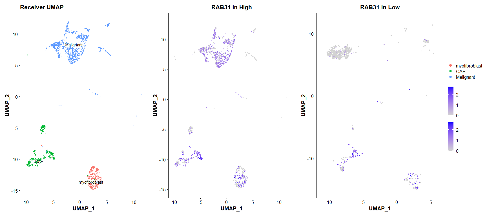<!-- -->

## Make Dotplot for all DE genes/targets

Note: DE here determined based on the parameters used for the
MultiNicheNet analysis (cf above): this means that DE genes are here not
based on the p-value corrected for multiple testing!

``` r
receiver_oi = "Malignant"
group_oi = "High"

targets_oi = output$ligand_activities_targets_DEgenes$de_genes_df %>% inner_join(contrast_tbl) %>% filter(group == group_oi) %>% arrange(p_val) %>% filter(receiver == receiver_oi) %>% pull(gene) %>% unique()
```

``` r
p_target = make_sample_target_plots(receiver_info = output$celltype_info, targets_oi, receiver_oi, output$grouping_tbl)
p_target + ggtitle(paste0("DE genes in ",group_oi, " in celltype ",receiver_oi))
```

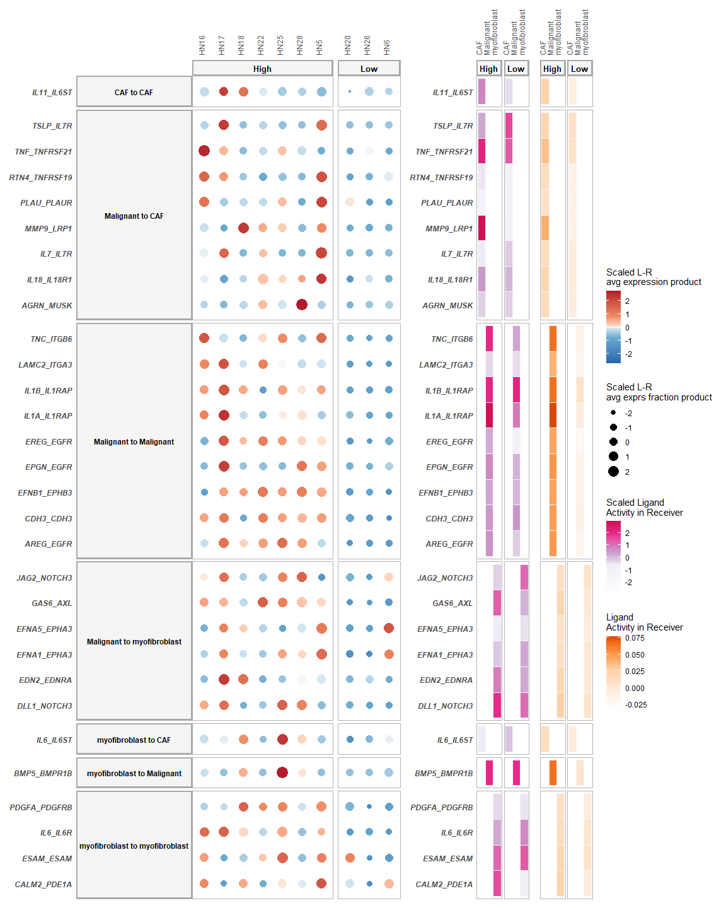<!-- -->

## References
