Multi-Sample Multi-condition Cell-Cell Communication Analysis via
NicheNet: HNSCC application; Separate
================
Robin Browaeys
2021-04-09

<!-- github markdown built using 
rmarkdown::render("vignettes/basic_analysis_separate.Rmd", output_format = "github_document")
-->

In this vignette, you can learn how to perform an all-vs-all
MultiNicheNet analysis. In this vignette, we start from two
SingleCellExperiment objects: one SingleCellExperiment object containing
the sender cell types, and one SingleCellExperiment object with receiver
cell types. (for demonstration purposes, we start from the same object,
that we then split based on sender/receiver cell type)

As example expression data of interacting cells, we will use data from
Puram et al. to explore intercellular communication in the tumor
microenvironment in head and neck squamous cell carcinoma (HNSCC) \[See
@puram\_single-cell\_2017\]
[](https://doi.org/10.5281/zenodo.5196144).
More specifically, we will look at differential cell-cell communication
patterns between tumors scoring high for a partial
epithelial-mesenschymal transition (p-EMT) program vs low-scoring
tumors.

In this vignette, we will prepare the data and analysis parameters, and
then perform the MultiNicheNet analysis.

The different steps of the MultiNicheNet analysis are the following:

-   1.  Extract expression information from receiver and sender cell
        types: average expression for each gene per sample, and per
        group (normalized expression value and fraction of expressing
        cells with non-zero counts).

-   2.  Linking this expression information for ligands of the sender
        cell types to the corresponding receptors of the receiver cell
        types.

-   3.  Perform genome-wide differential expression analysis of receiver
        and sender cell types to define DE genes between the conditions
        of interest. Based on this analysis, we can define the
        logFC/p-value of ligands in senders and receptors in receivers,
        and define the set of affected target genes in the receiver.

-   4.  Predict NicheNet ligand activities and NicheNet ligand-target
        links based on these differential expression results

-   5.  Use the information collected above to prioritize all
        sender-ligand –&gt; receiver-receptor pairs.

In this vignette, we will demonstrate the use of a wrapper function to
perform all these steps in one line of code. If you want to explore the
different steps of MultiNicheNet one by one in more detail, you could
check this other vignette: **\[ADD THIS LATER\]**.

After the MultiNicheNet analysis is done, we will explore the output of
the analysis with different ways of visualization.

# Step 0: Load required packages and NicheNet ligand-receptor network and ligand-target matrix

``` r
library(dplyr)
library(ggplot2)
library(multinichenetr)
```

``` r
# LR network
lr_network = readRDS(url("https://zenodo.org/record/3260758/files/lr_network.rds"))
lr_network = lr_network %>% filter(! database %in% c("ppi_prediction","ppi_prediction_go")) # We filter out these interactions because they are not really bona-fide LR pairs - NicheNet v2 prior models will be released relatively soon
lr_network = lr_network %>% dplyr::rename(ligand = from, receptor = to) %>% distinct(ligand, receptor)
```

``` r
ligand_target_matrix = readRDS(url("https://zenodo.org/record/3260758/files/ligand_target_matrix.rds"))
```

# Step 1: Prepare SingleCellExperiment objects for Sender and Receiver cells

This vignette demonstrates a multinichenet analysis with predefined
sender and receiver cell types of interest.

In this case study, we want to study differences in cell-cell
communication patterns between pEMT-high and pEMT-low tumors. The meta
data columns that indicate the pEMT status of tumors are ‘pEMT’ and
‘pEMT\_fine’, cell type is indicated in the ‘celltype’ column, and the
sample is indicated by the ‘tumor’ column.

Malignant cells as receiver

If you start from a Seurat object, you can convert it easily to a
SingleCellExperiment via
`sce = Seurat::as.SingleCellExperiment(seurat_obj, assay = "RNA")`.

**User adaptation required**

``` r
getwd()
## [1] "C:/Users/rbrowaey/work/Research/NicheNet/multinichenetr/vignettes"

sce = readRDS(url("https://zenodo.org/record/5196144/files/sce_hnscc.rds")) 
sce$pEMT_fine = factor(sce$pEMT_fine, levels = c("High","Medium","Low")) 

celltype_id_receiver = "celltype"
sce_receiver = sce[, SummarizedExperiment::colData(sce)[,celltype_id_receiver] == "Malignant"]

scater::plotReducedDim(sce_receiver, dimred = "UMAP", colour_by = "celltype")
```

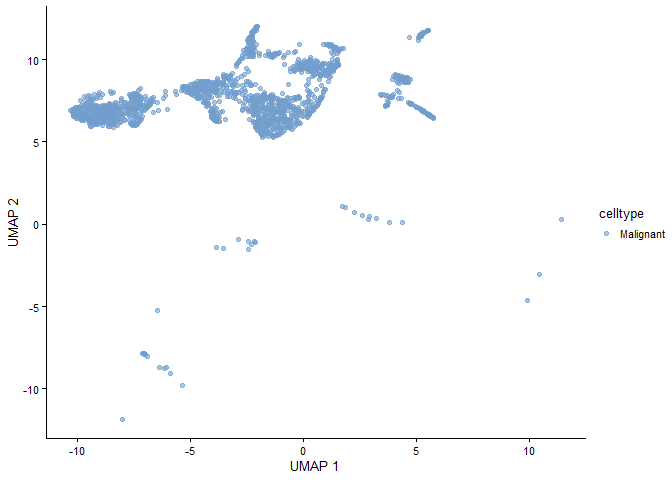<!-- -->

``` r
scater::plotReducedDim(sce_receiver, dimred = "UMAP", colour_by = "tumor")
```

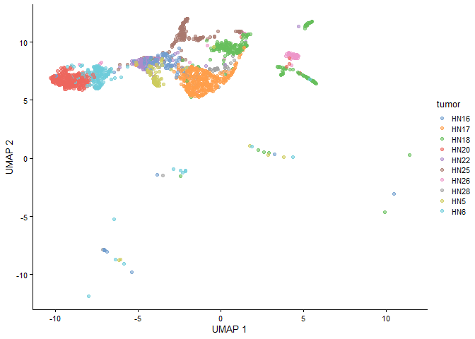<!-- -->

``` r
scater::plotReducedDim(sce_receiver, dimred = "UMAP", colour_by = "pEMT")
```

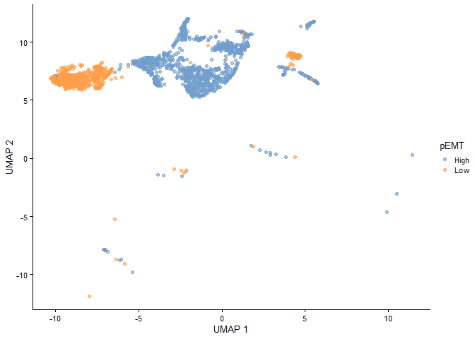<!-- -->

``` r
scater::plotReducedDim(sce_receiver, dimred = "UMAP", colour_by = "pEMT_fine")
```

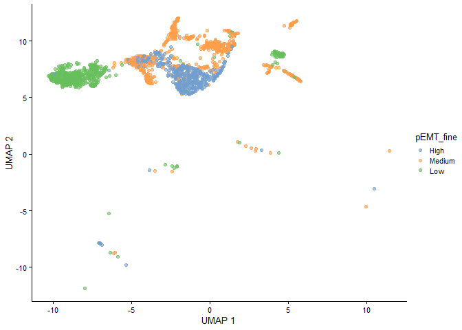<!-- -->

Non-Malignant cells as sender

**User adaptation required**

``` r
getwd()
## [1] "C:/Users/rbrowaey/work/Research/NicheNet/multinichenetr/vignettes"

celltype_id_sender = "celltype"
sce_sender = sce[, SummarizedExperiment::colData(sce)[,celltype_id_sender] != "Malignant"]

scater::plotReducedDim(sce_sender, dimred = "UMAP", colour_by = "celltype")
```

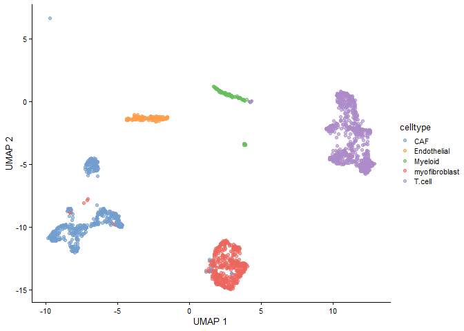<!-- -->

``` r
scater::plotReducedDim(sce_sender, dimred = "UMAP", colour_by = "tumor")
```

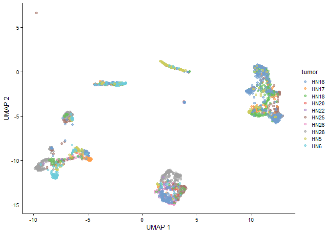<!-- -->

``` r
scater::plotReducedDim(sce_sender, dimred = "UMAP", colour_by = "pEMT")
```

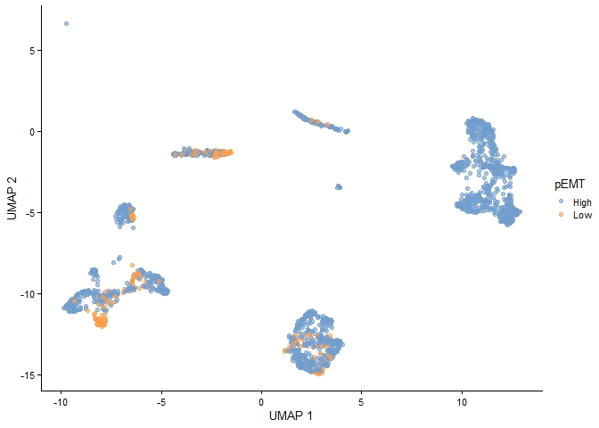<!-- -->

``` r
scater::plotReducedDim(sce_sender, dimred = "UMAP", colour_by = "pEMT_fine")
```

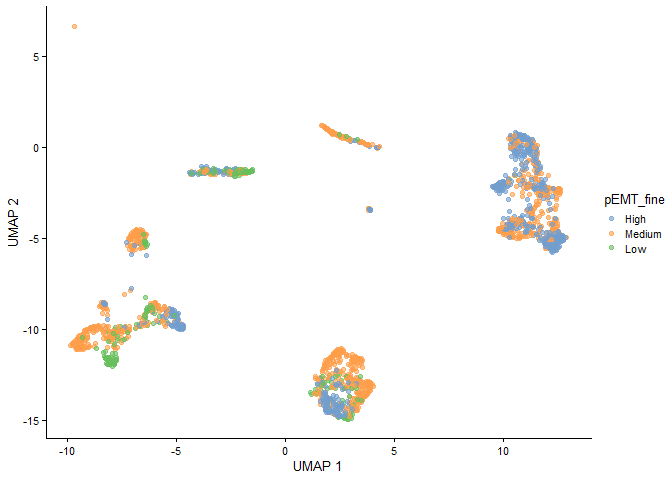<!-- -->

# Step 2: Prepare the cell-cell communication analysis

## Define senders and receivers of interest

``` r
receivers_oi = SummarizedExperiment::colData(sce_receiver)[,celltype_id_receiver] %>% unique() 
senders_oi = SummarizedExperiment::colData(sce_sender)[,celltype_id_sender] %>% unique()

sce_sender = sce_sender[, SummarizedExperiment::colData(sce_sender)[,celltype_id_sender] %in% c(senders_oi)]
sce_receiver = sce_receiver[, SummarizedExperiment::colData(sce_receiver)[,celltype_id_receiver] %in% c(receivers_oi)]
```

We will now also check the number of cells per cell type condition
combination, and the number of patients per condition.

**User adaptation required**

``` r
table(SummarizedExperiment::colData(sce_receiver)$celltype, SummarizedExperiment::colData(sce_receiver)$tumor) # cell types vs samples
##            
##             HN16 HN17 HN18 HN20 HN22 HN25 HN26 HN28 HN5 HN6
##   Malignant   82  353  263  331  123  153   61   49  70 157
table(SummarizedExperiment::colData(sce_receiver)$celltype, SummarizedExperiment::colData(sce_receiver)$pEMT_fine) # cell types vs conditions
##            
##             High Medium Low
##   Malignant  435    658 549
table(SummarizedExperiment::colData(sce_receiver)$tumor, SummarizedExperiment::colData(sce_receiver)$pEMT_fine) # samples vs conditions
##       
##        High Medium Low
##   HN16   82      0   0
##   HN17  353      0   0
##   HN18    0    263   0
##   HN20    0      0 331
##   HN22    0    123   0
##   HN25    0    153   0
##   HN26    0      0  61
##   HN28    0     49   0
##   HN5     0     70   0
##   HN6     0      0 157
```

**User adaptation required**

``` r
table(SummarizedExperiment::colData(sce_sender)$celltype, SummarizedExperiment::colData(sce_sender)$tumor) # cell types vs samples
##                
##                 HN16 HN17 HN18 HN20 HN22 HN25 HN26 HN28 HN5 HN6
##   CAF             47   37   36    3    9   73   19  157  37  82
##   Endothelial     43   17   18    1    1    1    0   14  11  52
##   Myeloid         15    2    7    0    1    8    1    1  58   6
##   myofibroblast   84    6   14   10   45   88   45  140   5   6
##   T.cell         300   61  207    0    0   93    3    0  28   0
table(SummarizedExperiment::colData(sce_sender)$celltype, SummarizedExperiment::colData(sce_sender)$pEMT_fine) # cell types vs conditions
##                
##                 High Medium Low
##   CAF             84    312 104
##   Endothelial     60     45  53
##   Myeloid         17     75   7
##   myofibroblast   90    292  61
##   T.cell         361    328   3
table(SummarizedExperiment::colData(sce_sender)$tumor, SummarizedExperiment::colData(sce_sender)$pEMT_fine) # samples vs conditions
##       
##        High Medium Low
##   HN16  489      0   0
##   HN17  123      0   0
##   HN18    0    282   0
##   HN20    0      0  14
##   HN22    0     56   0
##   HN25    0    263   0
##   HN26    0      0  68
##   HN28    0    312   0
##   HN5     0    139   0
##   HN6     0      0 146
```

As you can see, some Celltype-Sample combinations have 0 cells. It is
possible that during DE analysis, some cell types will be removed from
the analysis if there is not enough information to do a DE analysis.

# Step 2: Prepare the cell-cell communication analysis

## Define in which metadata columns we can find the **group**, **sample** and **cell type** IDs

For the group\_id, we now choose for the ‘pEMT\_fine’ column because we
now want to compare the p-EMT-high vs the p-EMT-mid and p-EMT-low group

**User adaptation required**

``` r
sample_id = "tumor"
group_id = "pEMT_fine"
```

## Define the contrasts and covariates of interest for the DE analysis, and the minimal number of cells of a cell type that each sample should have to be considered for DE analysis of that cell type.

Here, we want to compare the p-EMT-high vs the p-EMT-mid and p-EMT-low
group and find cell-cell communication events that are higher in high
than mid and low pEMT. We don’t have other covariates to correct for in
this dataset.

Note the format to indicate the contrasts!

**User adaptation required**

``` r
covariates = NA
contrasts_oi = c("'High-(Medium+Low)/2','Medium-(High+Low)/2','Low-(Medium+High)/2'") # no spaces between the different contrasts!
contrast_tbl = tibble(contrast = 
                        c("High-(Medium+Low)/2", "Medium-(High+Low)/2","Low-(Medium+High)/2"),  # division by 2 necessary because 2 groups to compare against !!
                      group = c("High","Medium","Low")) # division by 2 necessary because 2 groups to compare against !!
min_cells = 5 # here 5 for demonstration purposes - but recommended default is 10.
```

## Define the parameters for the NicheNet ligand activity analysis

Here, we need to define the thresholds that will be used to consider
genes as differentially expressed or not (logFC, p-value, decision
whether to use adjusted or normal p-value, minimum fraction of cells
that should express a gene in at least one sample in a group, whether to
use the normal p-values or empirical null p-values).

NicheNet ligand activity will then be calculated as the enrichment of
predicted target genes of ligands in this set of DE genes compared to
the genomic background. Here we choose for a minimum logFC of 0.50,
maximum p-value of 0.05 (normal, not adjusted one, because of lack of
statistical power due to pseudobulking and the fact that this dataset
has only a few samples per group), and minimum fraction of expression of
0.05. For the NicheNet ligand-target inference, we also need to select
which top n of the predicted target genes will be considered (here: top
250 targets per ligand). We will also use the empirical p-values (\[ADD
REFERENCE\]). This has mainly advantages when there would be some
violations to the assumptions that should be fulfilled for having
accurate theoretical p-values. In case all assumptions are fulfilled,
using empirical p-values would not harm either.

**User adaptation recommended**

``` r
logFC_threshold = 0.50
p_val_threshold = 0.05
fraction_cutoff = 0.05
p_val_adj = FALSE 
empirical_pval = TRUE
top_n_target = 250
```

## Define the weights of the prioritization of both expression, differential expression and NicheNet activity information

MultiNicheNet allows the user to define the weights of the following
criteria to prioritize ligand-receptor interactions:

-   Upregulation of the ligand in a sender cell type and/or upregulation
    of the receptor in a receiver cell type - in the condition of
    interest. : `scaled_lfc_ligand`, `scaled_p_val_ligand`,
    `scaled_lfc_receptor`, and `scaled_p_val_receptor`
-   Sufficiently high expression levels of ligand and receptor in many
    samples of the same group (to mitigate the influence of outlier
    samples). : `fraction_expressing_ligand_receptor`
-   Cell-type and condition specific expression of the ligand in the
    sender cell type and receptor in the receiver cell type (to mitigate
    the influence of upregulated but still relatively weakly expressed
    ligands/receptors) : `scaled_avg_exprs_ligand`,
    `scaled_avg_frq_ligand`, `scaled_avg_exprs_receptor`, and
    `scaled_avg_frq_receptor`
-   High NicheNet ligand activity, to further prioritize ligand-receptor
    pairs based on their predicted effect of the ligand-receptor
    interaction on the gene expression in the receiver cell type :
    `scaled_activity` and `scaled_activity_scaled`
    (scaled\_activity=absolute value of ligand activity;
    scaled\_activity\_scaled=scaled ligand activity value that is
    comparable between different receiver settings - recommended to put
    more weight on this)
-   High relative abundance of sender and/or receiver in the condition
    of interest: `scaled_abundance_sender` and
    `scaled_abundance_receiver`

We will set our preference for this dataset as follows:

**User adaptation recommended**

``` r
prioritizing_weights_DE = c("de_ligand" = 3,
                         "de_receptor" = 3)
prioritizing_weights_activity = c("activity_scaled" = 3)

prioritizing_weights_expression_specificity = c("exprs_ligand" = 1.5,
                         "exprs_receptor" = 1.5)

prioritizing_weights_expression_sufficiency = c("frac_exprs_ligand_receptor" = 2)

prioritizing_weights_relative_abundance = c( "abund_sender" = 0,
                         "abund_receiver" = 0)
```

``` r
prioritizing_weights = c(prioritizing_weights_DE, 
                         prioritizing_weights_activity, 
                         prioritizing_weights_expression_specificity,
                         prioritizing_weights_expression_sufficiency, 
                         prioritizing_weights_relative_abundance)
```

# Step 3: Perform the cell-cell communication analysis

Now we will run the MultiNicheNet wrapper. In the function
`multi_nichenet_analysis`, we need to specify that we use two
SingleCellExperiment objects (one with senders and one with receivers)
by setting `sender_receiver_separate = TRUE`. This setting will call the
underlying `multi_nichenet_analysis_separate` pipeline function.

To keep track of the different steps, we will here set `verbose = TRUE`

``` r
multinichenet_output = multi_nichenet_analysis(sce_receiver = sce_receiver, sce_sender = sce_sender, 
                                celltype_id_receiver = celltype_id_receiver, celltype_id_sender = celltype_id_sender, sample_id = sample_id, group_id = group_id, 
                                lr_network = lr_network, ligand_target_matrix = ligand_target_matrix, contrasts_oi = contrasts_oi, contrast_tbl = contrast_tbl, covariates = covariates,
                                prioritizing_weights = prioritizing_weights, min_cells = min_cells, logFC_threshold = logFC_threshold, p_val_threshold = p_val_threshold,  
                                fraction_cutoff = fraction_cutoff, p_val_adj = p_val_adj, empirical_pval = empirical_pval, top_n_target = top_n_target, sender_receiver_separate = TRUE, verbose = TRUE)
## [1] "Make diagnostic cell type abundance plots"
## [1] "Make diagnostic abundance plots + Calculate expression information"
## [1] "Calculate differential expression for all cell types"
## [1] "excluded cell types are:"
## [1] "Endothelial" "Myeloid"     "T.cell"     
## [1] "These celltypes are not considered in the analysis. After removing samples that contain less cells than the required minimal, some groups don't have 2 or more samples anymore. As a result the analysis cannot be run. To solve this: decrease the number of min_cells or change your group_id and pool all samples that belong to groups that are not of interest! "
## [1] "Calculate NicheNet ligand activities and ligand-target links"
## [1] "receiver_oi:"
## [1] "Malignant"
## [1] "contrast_oi:"
## [1] "High-(Medium+Low)/2"
## [1] "Number of DE genes (gene set of interest): "
## [1] 576
## [1] "contrast_oi:"
## [1] "Medium-(High+Low)/2"
## [1] "Number of DE genes (gene set of interest): "
## [1] 216
## [1] "contrast_oi:"
## [1] "Low-(Medium+High)/2"
## [1] "Number of DE genes (gene set of interest): "
## [1] 80
## [1] "Combine all the information in prioritization tables"
```

The output of the MultiNicheNet analysis contains much information. We
will now go over this step-by-step

## Check the returned tables in the output

### Average expression value and fraction of each cell type - sample combination

``` r
multinichenet_output$receiver_info$avg_df %>% head()
## # A tibble: 6 x 4
##   gene    sample average_sample celltype 
##   <chr>   <chr>           <dbl> <fct>    
## 1 CREB3L1 HN26           0.0733 Malignant
## 2 MMP2    HN26           0.0345 Malignant
## 3 APBB2   HN26           0.151  Malignant
## 4 UQCR11  HN26           1.43   Malignant
## 5 MIER1   HN26           0.650  Malignant
## 6 SORL1   HN26           0.469  Malignant
multinichenet_output$receiver_info$frq_df %>% head()
## # A tibble: 6 x 4
##   gene    sample fraction_sample celltype 
##   <chr>   <chr>            <dbl> <chr>    
## 1 CREB3L1 HN26            0.0820 Malignant
## 2 MMP2    HN26            0.0328 Malignant
## 3 APBB2   HN26            0.246  Malignant
## 4 UQCR11  HN26            0.787  Malignant
## 5 MIER1   HN26            0.492  Malignant
## 6 SORL1   HN26            0.377  Malignant
multinichenet_output$receiver_info$avg_df_group %>% head()
## # A tibble: 6 x 4
## # Groups:   group, celltype [1]
##   group celltype  gene    average_group
##   <fct> <fct>     <chr>           <dbl>
## 1 High  Malignant AAMDC          0.915 
## 2 High  Malignant AASS           1.04  
## 3 High  Malignant ABHD12B        0.0359
## 4 High  Malignant ABI1           1.74  
## 5 High  Malignant ABLIM2         0.371 
## 6 High  Malignant ABTB1          0.757
multinichenet_output$receiver_info$frq_df_group %>% head()
## # A tibble: 6 x 4
## # Groups:   group, celltype [1]
##   group celltype  gene    fraction_group
##   <fct> <chr>     <chr>            <dbl>
## 1 High  Malignant AAMDC           0.428 
## 2 High  Malignant AASS            0.850 
## 3 High  Malignant ABHD12B         0.0456
## 4 High  Malignant ABI1            0.872 
## 5 High  Malignant ABLIM2          0.228 
## 6 High  Malignant ABTB1           0.428
multinichenet_output$receiver_info$rel_abundance_df %>% head()
## # A tibble: 3 x 3
##   group  celltype  rel_abundance_scaled
##   <chr>  <chr>                    <dbl>
## 1 High   Malignant                0.001
## 2 Medium Malignant                1.00 
## 3 Low    Malignant                0.512
```

``` r
multinichenet_output$sender_info$avg_df %>% head()
## # A tibble: 6 x 4
##   gene    sample average_sample celltype     
##   <chr>   <chr>           <dbl> <fct>        
## 1 COL18A1 HN28          0.980   myofibroblast
## 2 GSTP1   HN28          1.99    myofibroblast
## 3 PROS1   HN28          0.485   myofibroblast
## 4 ALOX5AP HN28          0       myofibroblast
## 5 COMP    HN28          0.00651 myofibroblast
## 6 FGF10   HN28          0.0789  myofibroblast
multinichenet_output$sender_info$frq_df %>% head()
## # A tibble: 6 x 4
##   gene    sample fraction_sample celltype     
##   <chr>   <chr>            <dbl> <chr>        
## 1 COL18A1 HN28           0.593   myofibroblast
## 2 GSTP1   HN28           0.736   myofibroblast
## 3 PROS1   HN28           0.207   myofibroblast
## 4 ALOX5AP HN28           0       myofibroblast
## 5 COMP    HN28           0.00714 myofibroblast
## 6 FGF10   HN28           0.0357  myofibroblast
multinichenet_output$sender_info$avg_df_group %>% head()
## # A tibble: 6 x 4
## # Groups:   group, celltype [1]
##   group celltype gene   average_group
##   <fct> <fct>    <chr>          <dbl>
## 1 High  CAF      A2M            1.07 
## 2 High  CAF      ADAM12         0.622
## 3 High  CAF      ADAM15         0.142
## 4 High  CAF      ADAM17         1.16 
## 5 High  CAF      ADAM9          0.699
## 6 High  CAF      ADM            1.24
multinichenet_output$sender_info$frq_df_group %>% head()
## # A tibble: 6 x 4
## # Groups:   group, celltype [1]
##   group celltype gene   fraction_group
##   <fct> <chr>    <chr>           <dbl>
## 1 High  CAF      A2M             0.489
## 2 High  CAF      ADAM12          0.442
## 3 High  CAF      ADAM15          0.120
## 4 High  CAF      ADAM17          0.673
## 5 High  CAF      ADAM9           0.372
## 6 High  CAF      ADM             0.488
multinichenet_output$sender_info$rel_abundance_df %>% head()
## # A tibble: 6 x 3
##   group  celltype    rel_abundance_scaled
##   <chr>  <chr>                      <dbl>
## 1 High   CAF                        0.223
## 2 Medium CAF                        0.507
## 3 Low    CAF                        0.791
## 4 High   Endothelial                0.395
## 5 Medium Endothelial                0.160
## 6 Low    Endothelial                0.966
```

### DE information for each cell type - contrast combination

``` r
multinichenet_output$receiver_de %>% head()
## # A tibble: 6 x 9
##   gene    cluster_id  logFC logCPM     F p_adj.loc contrast             p_val p_adj
##   <chr>   <chr>       <dbl>  <dbl> <dbl>     <dbl> <chr>                <dbl> <dbl>
## 1 CREB3L1 Malignant  -6.2     2.78  4.77     0.59  High-(Medium+Low)/2 0.124  0.917
## 2 MMP2    Malignant   1.69    6.33  6.54     0.536 High-(Medium+Low)/2 0.0255 0.766
## 3 APBB2   Malignant   1.53    5.56  9.36     0.471 High-(Medium+Low)/2 0.0113 0.684
## 4 UQCR11  Malignant   0.542   7.9   6.77     0.527 High-(Medium+Low)/2 0.0238 0.754
## 5 MIER1   Malignant   0.534   6.72  5.09     0.574 High-(Medium+Low)/2 0.0418 0.829
## 6 SORL1   Malignant   0.54    6.01  1.28     0.799 High-(Medium+Low)/2 0.231  0.942
```

``` r
multinichenet_output$sender_de %>% head()
## # A tibble: 6 x 9
##   gene    cluster_id    logFC logCPM         F p_adj.loc contrast            p_val p_adj
##   <chr>   <chr>         <dbl>  <dbl>     <dbl>     <dbl> <chr>               <dbl> <dbl>
## 1 COL18A1 CAF         0.00391   6.75 0.0000553     0.999 High-(Medium+Low)/2 0.930 0.996
## 2 GSTP1   CAF         0.229     8.92 0.593         0.859 High-(Medium+Low)/2 0.473 0.987
## 3 PROS1   CAF        -0.962     7.34 4.87          0.532 High-(Medium+Low)/2 0.104 0.987
## 4 ALOX5AP CAF         1.4       3.87 0.97          0.815 High-(Medium+Low)/2 0.373 0.987
## 5 COMP    CAF        -1.07      6.99 3.34          0.62  High-(Medium+Low)/2 0.173 0.987
## 6 FGF10   CAF        -2.69      5.73 4.61          0.543 High-(Medium+Low)/2 0.113 0.987
```

### Output of the NicheNet ligand activity analysis, and the NicheNet ligand-target inference

``` r
multinichenet_output$ligand_activities_targets_DEgenes$ligand_activities %>% head()
## # A tibble: 6 x 7
## # Groups:   receiver, contrast [1]
##   ligand activity contrast            target  ligand_target_weight receiver  activity_scaled
##   <chr>     <dbl> <chr>               <chr>                  <dbl> <chr>               <dbl>
## 1 CXCL1    0.0739 High-(Medium+Low)/2 AJUBA               0.000876 Malignant           0.822
## 2 CXCL1    0.0739 High-(Medium+Low)/2 ANGPTL4             0.000940 Malignant           0.822
## 3 CXCL1    0.0739 High-(Medium+Low)/2 CAV1                0.000897 Malignant           0.822
## 4 CXCL1    0.0739 High-(Medium+Low)/2 COL18A1             0.000877 Malignant           0.822
## 5 CXCL1    0.0739 High-(Medium+Low)/2 COL1A1              0.00383  Malignant           0.822
## 6 CXCL1    0.0739 High-(Medium+Low)/2 DDIT4               0.00111  Malignant           0.822
```

``` r
multinichenet_output$ligand_activities_targets_DEgenes$de_genes_df %>% head()
## # A tibble: 6 x 6
##   gene     receiver  logFC  p_val p_adj contrast           
##   <chr>    <chr>     <dbl>  <dbl> <dbl> <chr>              
## 1 MMP2     Malignant 1.69  0.0255 0.766 High-(Medium+Low)/2
## 2 APBB2    Malignant 1.53  0.0113 0.684 High-(Medium+Low)/2
## 3 UQCR11   Malignant 0.542 0.0238 0.754 High-(Medium+Low)/2
## 4 MIER1    Malignant 0.534 0.0418 0.829 High-(Medium+Low)/2
## 5 SERPINF1 Malignant 1.38  0.0151 0.722 High-(Medium+Low)/2
## 6 WDR34    Malignant 0.585 0.0479 0.841 High-(Medium+Low)/2
```

### Tables with the final prioritization scores (results per group and per sample)

``` r
multinichenet_output$prioritization_tables$group_prioritization_tbl %>% head()
## # A tibble: 6 x 46
##   contrast            group sender receiver ligand receptor lfc_ligand lfc_receptor ligand_receptor~ p_val_ligand p_adj_ligand p_val_receptor p_adj_receptor activity
##   <chr>               <chr> <chr>  <chr>    <chr>  <chr>         <dbl>        <dbl>            <dbl>        <dbl>        <dbl>          <dbl>          <dbl>    <dbl>
## 1 High-(Medium+Low)/2 High  CAF    Maligna~ IL24   IL20RB        4.85         1.19              3.02     0.000526        0.987      0.0199             0.745   0.0825
## 2 Low-(Medium+High)/2 Low   myofi~ Maligna~ FGF1   FGFR1         0.764        3.19              1.98     0.418           0.991      0.0436             0.993   0.0185
## 3 High-(Medium+Low)/2 High  CAF    Maligna~ TNC    ITGB6         1.01         2.03              1.52     0.138           0.987      0.000667           0.413   0.0875
## 4 High-(Medium+Low)/2 High  CAF    Maligna~ IL24   IL22RA1       4.85         0.562             2.71     0.000526        0.987      0.236              0.942   0.0825
## 5 Low-(Medium+High)/2 Low   myofi~ Maligna~ BMP2   ACVR2A        4.32         1.62              2.97     0.00476         0.699      0.0315             0.993  -0.0101
## 6 High-(Medium+Low)/2 High  CAF    Maligna~ TNC    ITGB1         1.01         0.93              0.97     0.138           0.987      0.0000236          0.117   0.0875
## # ... with 32 more variables: activity_scaled <dbl>, lr_interaction <chr>, id <chr>, avg_ligand_group <dbl>, avg_receptor_group <dbl>,
## #   ligand_receptor_prod_group <dbl>, fraction_ligand_group <dbl>, fraction_receptor_group <dbl>, ligand_receptor_fraction_prod_group <dbl>,
## #   rel_abundance_scaled_sender <dbl>, rel_abundance_scaled_receiver <dbl>, sender_receiver_rel_abundance_avg <dbl>, lfc_pval_ligand <dbl>,
## #   scaled_lfc_ligand <dbl>, scaled_p_val_ligand <dbl>, scaled_lfc_pval_ligand <dbl>, lfc_pval_receptor <dbl>, scaled_lfc_receptor <dbl>,
## #   scaled_p_val_receptor <dbl>, scaled_lfc_pval_receptor <dbl>, scaled_activity_scaled <dbl>, scaled_activity <dbl>, scaled_avg_exprs_ligand <dbl>,
## #   scaled_avg_frq_ligand <dbl>, pb_ligand_group <dbl>, scaled_pb_ligand <dbl>, scaled_avg_exprs_receptor <dbl>, scaled_avg_frq_receptor <dbl>,
## #   pb_receptor_group <dbl>, scaled_pb_receptor <dbl>, fraction_expressing_ligand_receptor <dbl>, prioritization_score <dbl>
```

``` r
multinichenet_output$prioritization_tables$sample_prioritization_tbl %>% head()
## # A tibble: 6 x 26
##   sample sender        receiver  ligand receptor avg_ligand avg_receptor ligand_receptor_~ fraction_ligand fraction_recept~ ligand_receptor_f~ pb_ligand pb_receptor
##   <chr>  <chr>         <chr>     <chr>  <chr>         <dbl>        <dbl>             <dbl>           <dbl>            <dbl>              <dbl>     <dbl>       <dbl>
## 1 HN17   CAF           Malignant COL1A1 ITGB1          3.43         2.72              9.34               1            0.994              0.994     10.2         8.93
## 2 HN17   CAF           Malignant COL1A1 SDC1           3.43         2.53              8.69               1            0.994              0.994     10.2         8.72
## 3 HN17   myofibroblast Malignant COL1A1 ITGB1          3.17         2.72              8.61               1            0.994              0.994      9.36        8.93
## 4 HN17   CAF           Malignant COL1A1 CD44           3.43         2.34              8.02               1            0.992              0.992     10.2         8.51
## 5 HN17   myofibroblast Malignant COL1A1 SDC1           3.17         2.53              8.01               1            0.994              0.994      9.36        8.72
## 6 HN20   CAF           Malignant COL1A1 SDC1           3.22         2.42              7.78               1            0.967              0.967      9.67        8.40
## # ... with 13 more variables: ligand_receptor_pb_prod <dbl>, group <chr>, prioritization_score <dbl>, lr_interaction <chr>, id <chr>, scaled_LR_prod <dbl>,
## #   scaled_LR_frac <dbl>, scaled_LR_pb_prod <dbl>, n_cells_receiver <dbl>, keep_receiver <dbl>, n_cells_sender <dbl>, keep_sender <dbl>, keep_sender_receiver <fct>
```

Based on these prioritization tables, we will define which interactions
to visualize in the different plots below.

# Step 4: Visualize the results of the cell-cell communication analysis

In a first instance, we will look at the broad overview of prioritized
interactions via condition-specific Circos plots. We will filter on the
prioritization score after removing interactions that are not
upregulated in the condition of interest, and that are in no patient
expressed in more than 5% of cells of a cell type (cf
`fraction_cutoff`).

We will look here at the top100 predictions across all contrasts (high
vs low; and low vs high), senders, and receivers of interest.

## Circos plot of top-prioritized links

(remark: there are still some bugs in the automatic circos plot
function)

``` r
prioritized_tbl_oi = multinichenet_output$prioritization_tables$group_prioritization_tbl %>% 
  filter(fraction_ligand_group > fraction_cutoff & fraction_receptor_group > fraction_cutoff) %>% 
  distinct(id, sender, receiver, ligand, receptor, group, prioritization_score, ligand_receptor_lfc_avg, fraction_expressing_ligand_receptor) %>% 
  filter(ligand_receptor_lfc_avg > 0 & fraction_expressing_ligand_receptor > 0) %>% top_n(100, prioritization_score) 

prioritized_tbl_oi %>% group_by(group) %>% count()
## # A tibble: 3 x 2
## # Groups:   group [3]
##   group      n
##   <chr>  <int>
## 1 High      64
## 2 Low       26
## 3 Medium    10

prioritized_tbl_oi = multinichenet_output$prioritization_tables$group_prioritization_tbl %>% 
  filter(id %in% prioritized_tbl_oi$id) %>% 
  distinct(id, sender, receiver, ligand, receptor, group) %>% left_join(prioritized_tbl_oi)
prioritized_tbl_oi$prioritization_score[is.na(prioritized_tbl_oi$prioritization_score)] = 0


n_senders = prioritized_tbl_oi$sender %>% unique() %>% length()
n_receivers = prioritized_tbl_oi$receiver %>% unique() %>% length()

  
colors_sender = c("red", "royalblue") %>% magrittr::set_names(prioritized_tbl_oi$sender %>% unique())
colors_receiver = c("orange") %>% magrittr::set_names(prioritized_tbl_oi$receiver %>% unique())

circos_list = make_circos_group_comparison(prioritized_tbl_oi, colors_sender, colors_receiver)
```

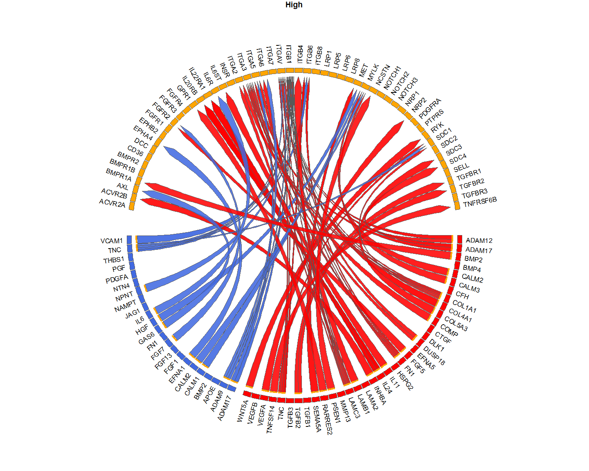<!-- -->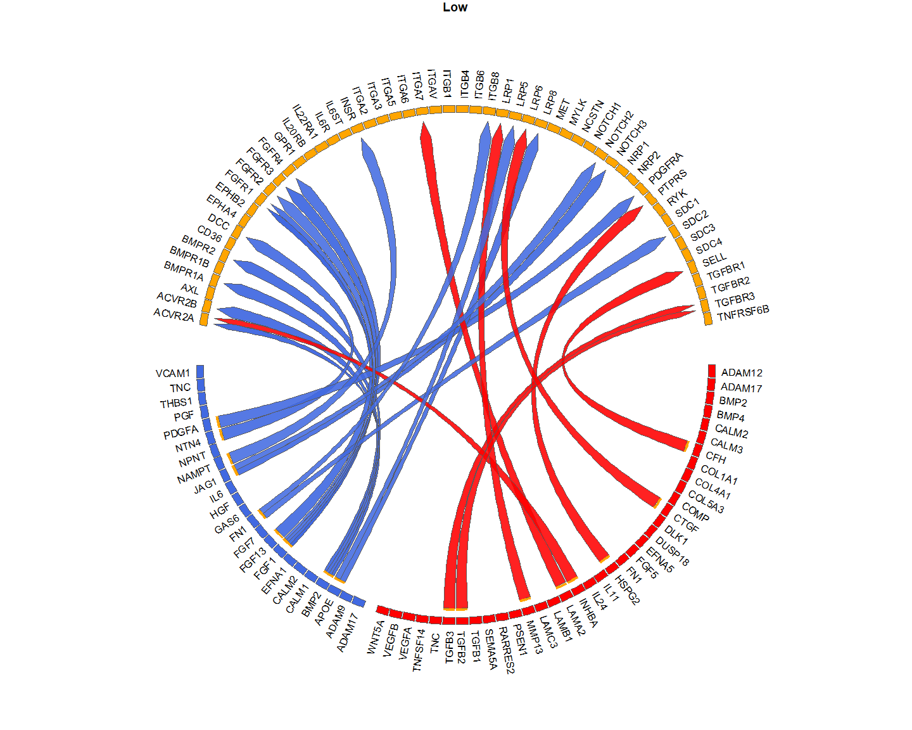<!-- -->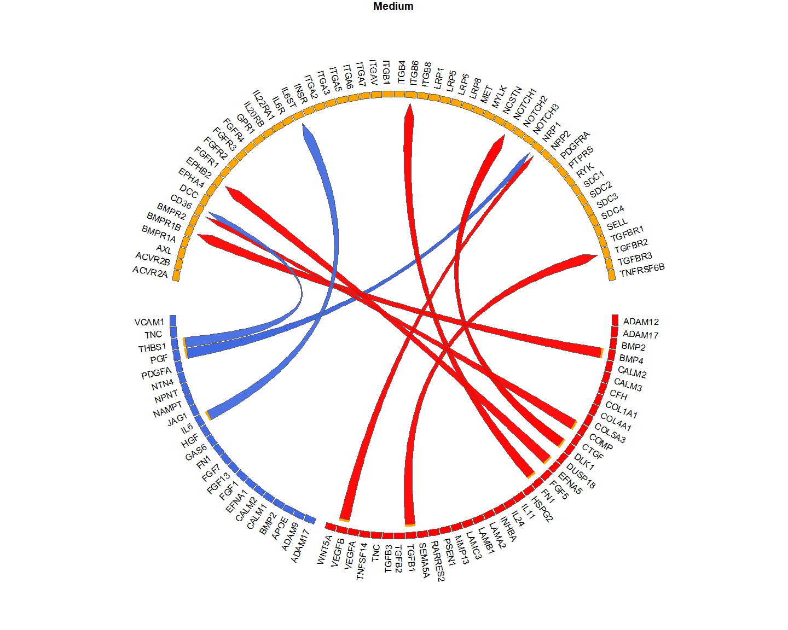<!-- --><!-- -->

## Visualization of scaled\_LR\_prod per sample

Now we will visualize per sample the scaled product of ligand and
receptor expression. Samples that were left out of the DE analysis are
indicated with a smaller dot (this helps to indicate the samples that
did not contribute to the calculation of the logFC, and thus not
contributed to the final prioritization)

We will now check the top75 interactions specific for the pEMT high
group

``` r
group_oi = "High"
```

``` r
multinichenet_output$prioritization_tables$sample_prioritization_tbl$group = factor(multinichenet_output$prioritization_tables$sample_prioritization_tbl$group, levels = c("High","Medium","Low"))

prioritized_tbl_oi = multinichenet_output$prioritization_tables$group_prioritization_tbl %>% 
  distinct(id, sender, receiver, lr_interaction, group, ligand_receptor_lfc_avg, activity_scaled, fraction_expressing_ligand_receptor,  prioritization_score) %>% 
  filter(ligand_receptor_lfc_avg > 0 & fraction_expressing_ligand_receptor > 0) %>% 
  filter(group == group_oi) %>% group_by(group) %>% top_n(75, prioritization_score) 

plot_oi = make_sample_lr_prod_plots(multinichenet_output$prioritization_tables, prioritized_tbl_oi)
plot_oi
```

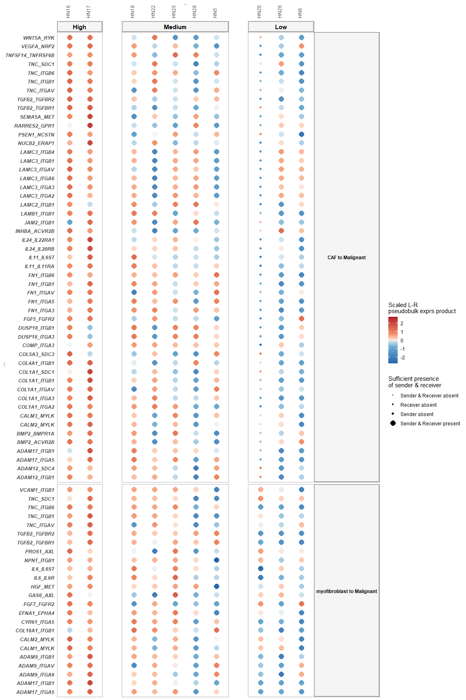<!-- -->

Next to these LR expression products, we can also plot the NicheNet
ligand activities of the ligand in the receiver.

``` r
multinichenet_output$prioritization_tables$group_prioritization_tbl$group = factor(multinichenet_output$prioritization_tables$group_prioritization_tbl$group, levels = c("High","Medium","Low"))

prioritized_tbl_oi = multinichenet_output$prioritization_tables$group_prioritization_tbl %>% 
  distinct(id, sender, receiver, lr_interaction, group, ligand_receptor_lfc_avg, activity_scaled, fraction_expressing_ligand_receptor,  prioritization_score) %>% 
  filter(ligand_receptor_lfc_avg > 0 & fraction_expressing_ligand_receptor > 0) %>% 
  filter(group == group_oi) %>% group_by(group) %>% top_n(75, prioritization_score) 

plot_oi = make_sample_lr_prod_activity_plots(multinichenet_output$prioritization_tables, prioritized_tbl_oi, widths = c(5,1,1))
plot_oi
```

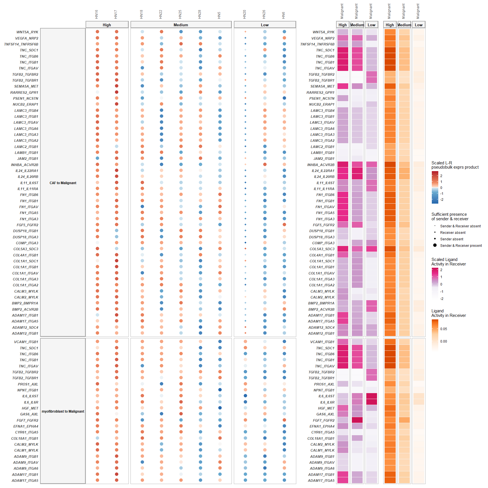<!-- -->

## Visualization of expression-logFC per group and ligand activity

Next type of plots will show the logFC of LR pairs across all
sender-receiver pairs that are selected, and add the ligand activity
next to it.

``` r
receiver_oi = "Malignant"
group_oi = "High"
```

``` r
prioritized_tbl_oi = multinichenet_output$prioritization_tables$group_prioritization_tbl %>% 
  filter(fraction_ligand_group > fraction_cutoff & fraction_receptor_group > fraction_cutoff) %>% 
  distinct(id, sender, receiver, lr_interaction, group, ligand_receptor_lfc_avg, activity_scaled, fraction_ligand_group, fraction_expressing_ligand_receptor, scaled_avg_exprs_ligand, prioritization_score) %>% 
  filter(ligand_receptor_lfc_avg > 0 & fraction_expressing_ligand_receptor > 0) %>% 
  filter(group == group_oi & receiver == receiver_oi) %>% top_n(75, prioritization_score) 

plot_oi = make_group_lfc_exprs_activity_plot(multinichenet_output$prioritization_tables, prioritized_tbl_oi, receiver_oi, heights = c(5,1,1))
plot_oi
```

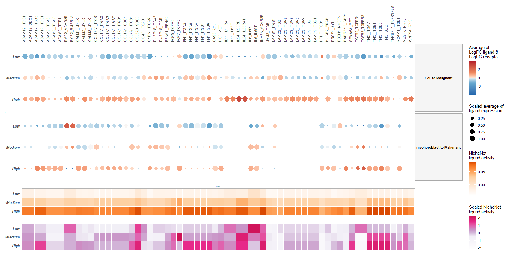<!-- -->

## Visualization of ligand-activity, ligand-target links, and target gene expression

In another type of plot, we can visualize the ligand activities for a
group-receiver combination, and show the predicted ligand-target links,
and also the expression of the predicted target genes across samples.

First: show this for a selection of ligands with high ligand activities:

``` r
group_oi = "High"
receiver_oi = "Malignant"
prioritized_tbl_oi = multinichenet_output$prioritization_tables$group_prioritization_tbl %>% 
  filter(fraction_ligand_group > fraction_cutoff & fraction_receptor_group > fraction_cutoff) %>% 
  distinct(id, sender, receiver, ligand, receptor, group, prioritization_score, ligand_receptor_lfc_avg, fraction_expressing_ligand_receptor, activity_scaled) %>% 
  filter(ligand_receptor_lfc_avg > 0 & fraction_expressing_ligand_receptor > 0) %>% 
  filter(group == group_oi & receiver == receiver_oi) %>% 
  group_by(group) %>% top_n(50, prioritization_score) %>% top_n(25, activity_scaled) %>% arrange(-activity_scaled)
```

``` r
combined_plot = make_ligand_activity_target_plot(group_oi, receiver_oi, prioritized_tbl_oi, multinichenet_output$ligand_activities_targets_DEgenes, contrast_tbl, multinichenet_output$grouping_tbl, multinichenet_output$receiver_info, plot_legend = FALSE)
combined_plot
## $combined_plot
```

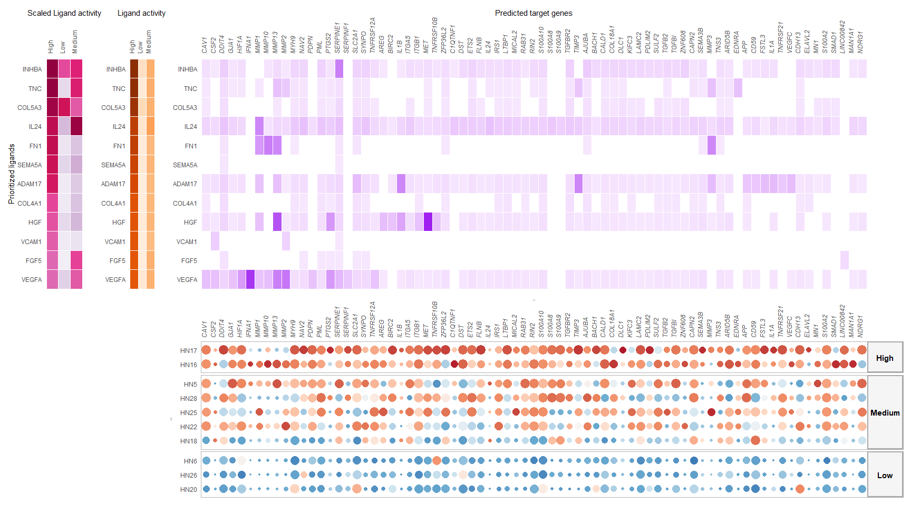<!-- -->

    ## 
    ## $legends

<!-- -->

Now: show this for a selection of ligands with high general
prioritization scores, not necessarily high ligand activities.

``` r
group_oi = "High"
receiver_oi = "Malignant"
prioritized_tbl_oi = multinichenet_output$prioritization_tables$group_prioritization_tbl %>% 
  filter(fraction_ligand_group > fraction_cutoff & fraction_receptor_group > fraction_cutoff) %>% 
  distinct(id, sender, receiver, ligand, receptor, group, prioritization_score, ligand_receptor_lfc_avg, fraction_expressing_ligand_receptor, activity_scaled) %>% 
  filter(ligand_receptor_lfc_avg > 0 & fraction_expressing_ligand_receptor > 0) %>% 
  filter(group == group_oi & receiver == receiver_oi) %>% 
  group_by(group) %>% top_n(25, prioritization_score) %>% arrange(-activity_scaled)
```

``` r
combined_plot = make_ligand_activity_target_plot(group_oi, receiver_oi, prioritized_tbl_oi, multinichenet_output$ligand_activities_targets_DEgenes, contrast_tbl, multinichenet_output$grouping_tbl, multinichenet_output$receiver_info, plot_legend = FALSE)
combined_plot
## $combined_plot
```

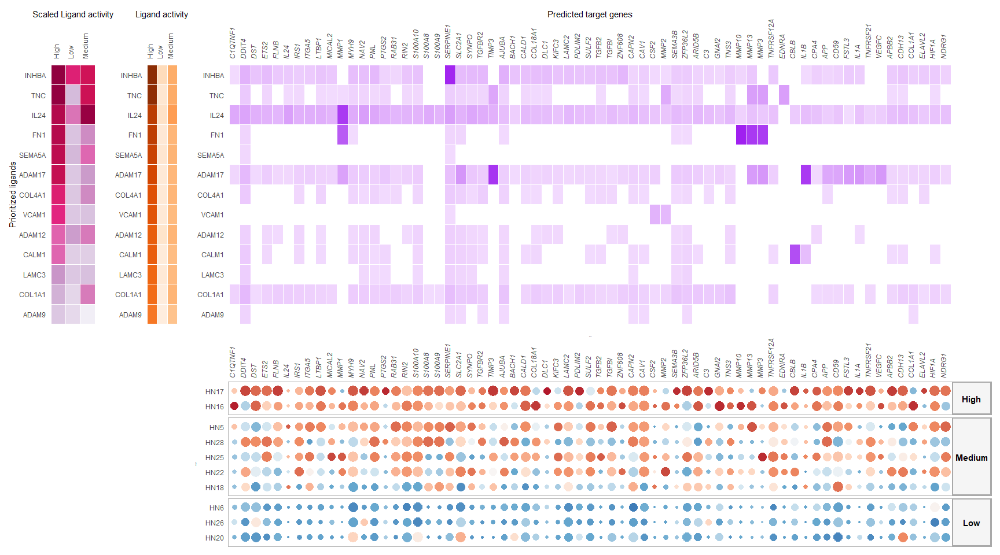<!-- -->

    ## 
    ## $legends

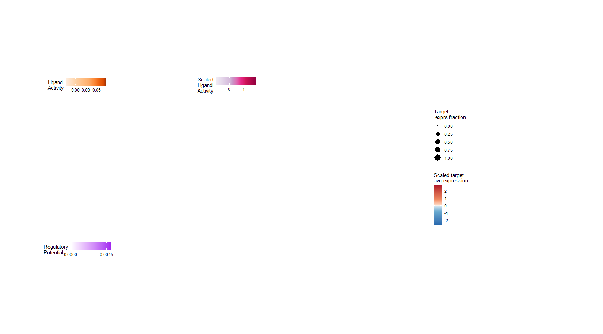<!-- -->

## Show ligand activities for each receiver-group combination

In the next type of plot, we plot all the ligand activities (Both scaled
and absolute activities) of each receiver-group combination. This can
give us some insights in active signaling pathways across groups. Note
that we can thus show top ligands based on ligand activity - agnostic of
expression in sender.

``` r
ligands_oi = multinichenet_output$prioritization_tables$ligand_activities_target_de_tbl %>% inner_join(contrast_tbl) %>% 
  group_by(group, receiver) %>% distinct(ligand, receiver, group, activity) %>% 
  top_n(5, activity) %>% pull(ligand) %>% unique()

plot_oi = make_ligand_activity_plots(multinichenet_output$prioritization_tables, ligands_oi, contrast_tbl, widths = NULL)
plot_oi
```

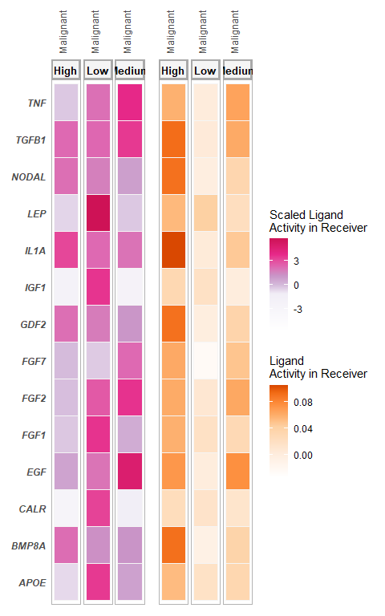<!-- -->

Or we can do this plot for ligands, while considering the general
priorization score (which considers expression information etc)

Show top ligands based on prioritization scores

``` r
ligands_oi = multinichenet_output$prioritization_tables$group_prioritization_tbl %>% 
  group_by(group, receiver) %>% distinct(ligand, receiver, group, prioritization_score) %>% 
  top_n(5, prioritization_score) %>% pull(ligand) %>% unique()

plot_oi = make_ligand_activity_plots(multinichenet_output$prioritization_tables, ligands_oi, contrast_tbl, widths = NULL)
plot_oi
```

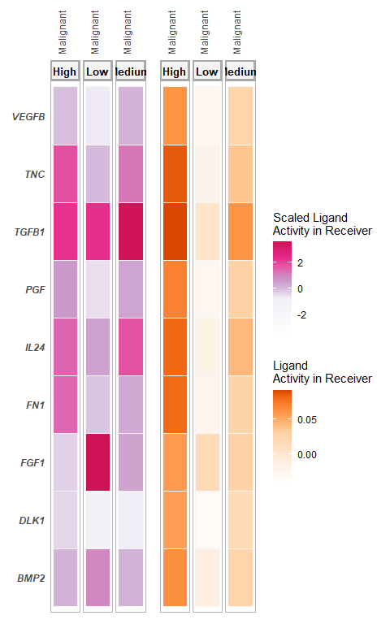<!-- -->

## Zoom in on specific ligand-receptor interactions: show their expression in the single-cell data!

Single-cell-based Feature, and Violin plots of ligand-receptor
interaction of interest: `make_ligand_receptor_feature_plot` and
`make_ligand_receptor_violin_plot`

It is often useful to zoom in on specific ligand-receptor interactions
of interest by looking in more detail to their expression at the single
cell level

Check the highest scoring links based on the general prioritization
score. Here we will pick one of those to visualize.

``` r
prioritized_tbl_oi = multinichenet_output$prioritization_tables$group_prioritization_tbl %>% 
  filter(fraction_ligand_group > fraction_cutoff & fraction_receptor_group > fraction_cutoff) %>% 
  distinct(id, sender, receiver, ligand, receptor, group, prioritization_score) %>% 
  group_by(group, receiver) %>% top_n(5, prioritization_score) 
prioritized_tbl_oi
## # A tibble: 15 x 7
## # Groups:   group, receiver [3]
##    group  sender        receiver  ligand receptor id                                  prioritization_score
##    <fct>  <chr>         <chr>     <chr>  <chr>    <chr>                                              <dbl>
##  1 High   CAF           Malignant IL24   IL20RB   IL24_IL20RB_CAF_Malignant                           1.44
##  2 Low    myofibroblast Malignant FGF1   FGFR1    FGF1_FGFR1_myofibroblast_Malignant                  1.42
##  3 High   CAF           Malignant TNC    ITGB6    TNC_ITGB6_CAF_Malignant                             1.41
##  4 High   CAF           Malignant IL24   IL22RA1  IL24_IL22RA1_CAF_Malignant                          1.40
##  5 Low    myofibroblast Malignant BMP2   ACVR2A   BMP2_ACVR2A_myofibroblast_Malignant                 1.38
##  6 High   CAF           Malignant TNC    ITGB1    TNC_ITGB1_CAF_Malignant                             1.37
##  7 High   myofibroblast Malignant TNC    ITGB6    TNC_ITGB6_myofibroblast_Malignant                   1.36
##  8 Low    myofibroblast Malignant FGF1   FGFR3    FGF1_FGFR3_myofibroblast_Malignant                  1.35
##  9 Low    myofibroblast Malignant BMP2   ACVR2B   BMP2_ACVR2B_myofibroblast_Malignant                 1.33
## 10 Low    myofibroblast Malignant BMP2   BMPR2    BMP2_BMPR2_myofibroblast_Malignant                  1.33
## 11 Medium myofibroblast Malignant PGF    NRP1     PGF_NRP1_myofibroblast_Malignant                    1.32
## 12 Medium CAF           Malignant DLK1   NOTCH1   DLK1_NOTCH1_CAF_Malignant                           1.29
## 13 Medium CAF           Malignant FN1    ITGB6    FN1_ITGB6_CAF_Malignant                             1.27
## 14 Medium CAF           Malignant VEGFB  NRP1     VEGFB_NRP1_CAF_Malignant                            1.26
## 15 Medium CAF           Malignant TGFB1  TGFBR2   TGFB1_TGFBR2_CAF_Malignant                          1.26
```

``` r
ligand_oi = "IL24"
receptor_oi = "IL20RB"
group_oi = "High"
sender_oi = "CAF"
receiver_oi = "Malignant"
```

Feature plot of the ligand in the sender cell type and the receptor in
the receiver cell type (split per condition)

``` r
p_feature = make_ligand_receptor_feature_plot(sce_sender = sce_sender, sce_receiver = sce_receiver, ligand_oi = ligand_oi, receptor_oi = receptor_oi, group_oi = group_oi, group_id = group_id, celltype_id_sender = celltype_id_sender, celltype_id_receiver = celltype_id_receiver, senders_oi = c("myofibroblast","CAF"), receivers_oi = c("Malignant"))
p_feature
```

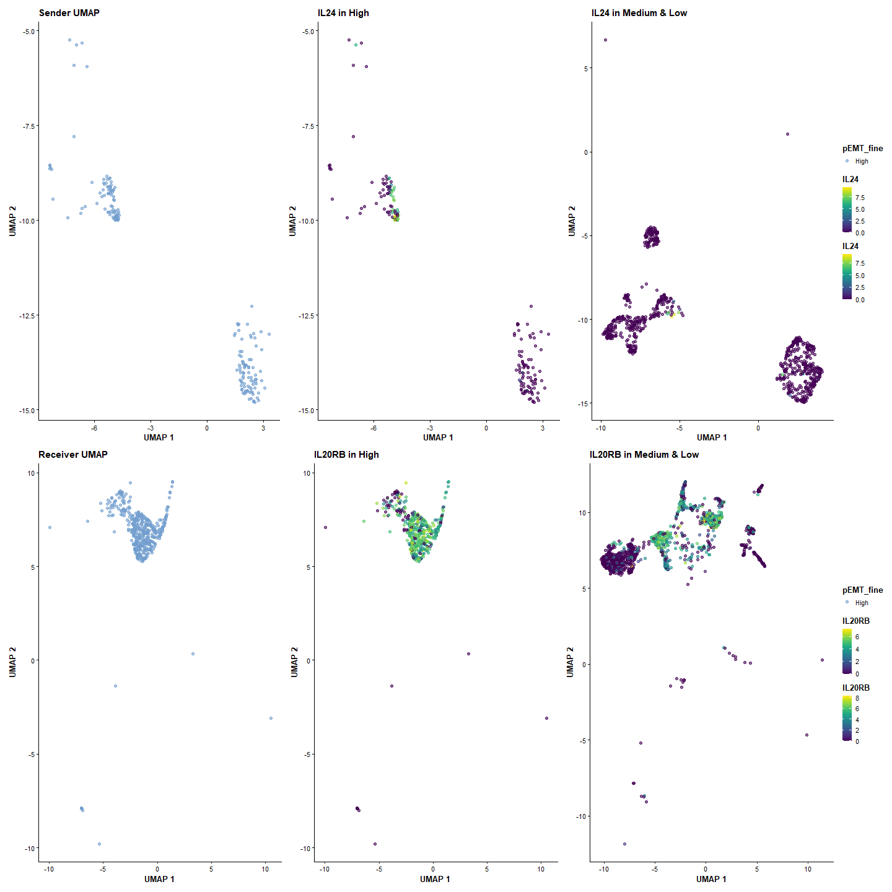<!-- -->

Pooled single-cell and sample-specific single-cell violin plots of
ligand and receptor expression in respectively sender and receiver.

``` r
p_violin = make_ligand_receptor_violin_plot(sce_sender = sce_sender, sce_receiver = sce_receiver, ligand_oi = ligand_oi, receptor_oi = receptor_oi, group_oi = group_oi, group_id = group_id, sender_oi = sender_oi, receiver_oi = receiver_oi, sample_id = sample_id, celltype_id_sender = celltype_id_sender, celltype_id_receiver = celltype_id_receiver)
p_violin
```

<!-- -->

## Zoom in on specific ligand-target interactions: show their expression in the single-cell data!

Make target gene violin and feature plots: `make_target_violin_plot` and
`make_target_feature_plot`

``` r
receiver_oi = "Malignant"
group_oi = "High"

multinichenet_output$ligand_activities_targets_DEgenes$de_genes_df %>% inner_join(contrast_tbl) %>% filter(p_val <= 0.05) %>% filter(group == group_oi) %>% filter(receiver == receiver_oi) %>% arrange(p_val) %>% top_n(100, logFC)  
## # A tibble: 100 x 7
##    gene    receiver  logFC      p_val  p_adj contrast            group
##    <chr>   <chr>     <dbl>      <dbl>  <dbl> <chr>               <chr>
##  1 LTBP1   Malignant  2.6  0.00000233 0.0185 High-(Medium+Low)/2 High 
##  2 MMP10   Malignant  3    0.0000461  0.137  High-(Medium+Low)/2 High 
##  3 LPXN    Malignant  3.36 0.000386   0.413  High-(Medium+Low)/2 High 
##  4 LGALS9C Malignant  2.72 0.000479   0.413  High-(Medium+Low)/2 High 
##  5 CGB8    Malignant  4.35 0.000501   0.413  High-(Medium+Low)/2 High 
##  6 INHBA   Malignant  2.91 0.000637   0.413  High-(Medium+Low)/2 High 
##  7 NEFM    Malignant  6.49 0.000689   0.413  High-(Medium+Low)/2 High 
##  8 TAGLN   Malignant  2.48 0.000912   0.413  High-(Medium+Low)/2 High 
##  9 TGFB2   Malignant  3.19 0.00111    0.413  High-(Medium+Low)/2 High 
## 10 GCNT1   Malignant  3.03 0.00118    0.413  High-(Medium+Low)/2 High 
## # ... with 90 more rows
```

RAB31: interesting gene

``` r
target_oi = "NEFM"

make_target_violin_plot(sce_receiver = sce_receiver, target_oi = target_oi, receiver_oi = receiver_oi, group_oi = group_oi, group_id = group_id, sample_id, celltype_id_receiver = celltype_id_receiver)
```

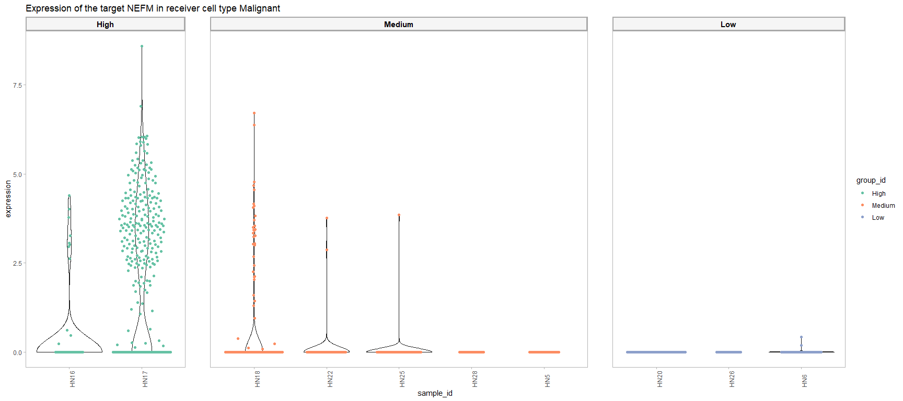<!-- -->

``` r
make_target_feature_plot(sce_receiver = sce_receiver, target_oi = target_oi, group_oi = group_oi, group_id = group_id, celltype_id_receiver = celltype_id_receiver, receivers_oi = c("Malignant")) 
```

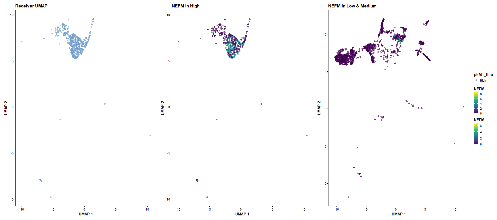<!-- -->

## Make Dotplot for all DE genes/targets

Note: DE here determined based on the parameters used for the
MultiNicheNet analysis (cf above): this means that DE genes are here not
based on the p-value corrected for multiple testing!

``` r
receiver_oi = "Malignant"
group_oi = "High"

targets_oi = multinichenet_output$ligand_activities_targets_DEgenes$de_genes_df %>% inner_join(contrast_tbl) %>% filter(group == group_oi) %>% arrange(p_val)  %>% filter(receiver == receiver_oi) %>% top_n(200, logFC) %>% pull(gene) %>% unique() 
```

``` r
p_target = make_sample_target_plots(receiver_info = multinichenet_output$receiver_info, targets_oi, receiver_oi, multinichenet_output$grouping_tbl)
p_target + ggtitle(paste0("DE genes in ",group_oi, " in celltype ",receiver_oi))
```

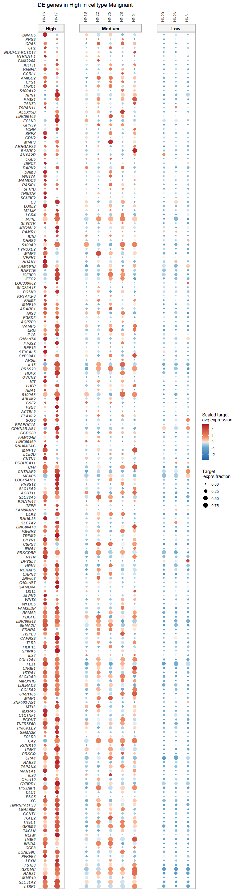<!-- -->

## References
