Multi-Sample Multi-condition Cell-Cell Communication Analysis via
NicheNet: HNSCC application; Separate
================
Robin Browaeys
2021-04-09

<!-- github markdown built using 
rmarkdown::render("vignettes/basic_analysis_separate.Rmd", output_format = "github_document")
-->

In this vignette, you can learn how to perform an all-vs-all
MultiNicheNet analysis. In this vignette, we start from two Seurat
objects: one seurat object containing the sender cell types, and one
seurat object with receiver cell types. (for demonstration purposes, we
start from the same object, that we then split based on sender/receiver
cell type)

As example expression data of interacting cells, we will use data from
Puram et al. to explore intercellular communication in the tumor
microenvironment in head and neck squamous cell carcinoma (HNSCC) \[See
@puram\_single-cell\_2017\]
[](https://doi.org/10.5281/zenodo.4675430).
More specifically, we will look at differential cell-cell communication
patterns between tumors scoring high for a partial
epithelial-mesenschymal transition (p-EMT) program vs low-scoring
tumors.

In this vignette, we will prepare the data and analysis parameters, and
then perform the MultiNicheNet analysis.

The different steps of the MultiNicheNet analysis are the following:

-   1.  Extract expression information from receiver and sender cell
        types: average expression for each gene per sample, and per
        group (normalized expression value and fraction of expressing
        cells with non-zero counts).

-   1.  Linking this expression information for ligands of the sender
        cell types to the corresponding receptors of the receiver cell
        types.

-   1.  Perform genome-wide differential expression analysis of receiver
        and sender cell types to define DE genes between the conditions
        of interest. Based on this analysis, we can define the
        logFC/p-value of ligands in senders and receptors in receivers,
        and define the set of affected target genes in the receiver.

-   1.  Predict NicheNet ligand activities and NicheNet ligand-target
        links based on these differential expression results

-   1.  Use the information collected above to prioritize all
        sender-ligand –&gt; receiver-receptor pairs.

In this vignette, we will demonstrate the use of a wrapper function to
perform all these steps in one line of code. If you want to explore the
different steps of MultiNicheNet one by one in more detail, you could
check this other vignette: **\[ADD THIS LATER\]**.

After the MultiNicheNet analysis is done, we will explore the output of
the analysis with different ways of visualization.

# Step 0: Load required packages and NicheNet ligand-receptor network and ligand-target matrix

``` r
library(Seurat)
library(dplyr)
library(ggplot2)
library(multinichenetr)
```

``` r
# LR network
lr_network = readRDS(url("https://zenodo.org/record/3260758/files/lr_network.rds"))
lr_network = lr_network %>% filter(! database %in% c("ppi_prediction","ppi_prediction_go")) # We filter out these interactions because they are not really bona-fide LR pairs - NicheNet v2 prior models will be released relatively soon
lr_network = lr_network %>% dplyr::rename(ligand = from, receptor = to) %>% distinct(ligand, receptor)
```

``` r
ligand_target_matrix = readRDS(url("https://zenodo.org/record/3260758/files/ligand_target_matrix.rds"))
```

# Step 1: Prepare Seurat Objects for Sender and Receiver cells

This vignette demonstrates a multinichenet analysis with predefined
sender and receiver cell types of interest.

In this case study, we want to study differences in cell-cell
communication patterns between pEMT-high and pEMT-low tumors. The meta
data columns that indicate the pEMT status of tumors are ‘pEMT’ and
‘pEMT\_fine’, cell type is indicated in the ‘celltype’ column, and the
sample is indicated by the ‘tumor’ column.

Malignant cells as receiver

``` r
getwd()
## [1] "C:/Users/rbrowaey/work/Research/NicheNet/multinichenetr/vignettes"
seurat_obj_receiver = readRDS(url("https://zenodo.org/record/4675430/files/seurat_obj_hnscc.rds")) %>% subset(subset = celltype == "Malignant")
seurat_obj_receiver@meta.data$pEMT_fine = factor(seurat_obj_receiver@meta.data$pEMT_fine, levels = c("High","Medium","Low")) 
DimPlot(seurat_obj_receiver, group.by = "celltype")
```

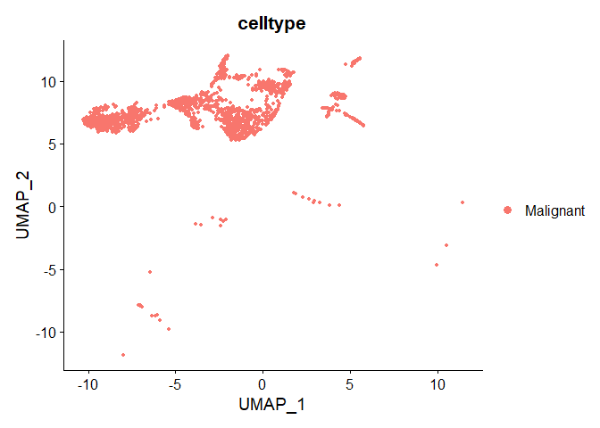<!-- -->

``` r
DimPlot(seurat_obj_receiver, group.by = "tumor")
```

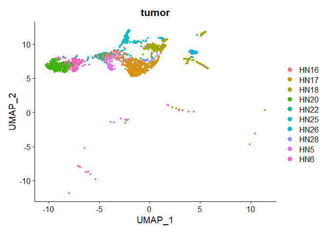<!-- -->

``` r
DimPlot(seurat_obj_receiver, group.by = "pEMT")
```

<!-- -->

``` r
DimPlot(seurat_obj_receiver, group.by = "pEMT_fine")
```

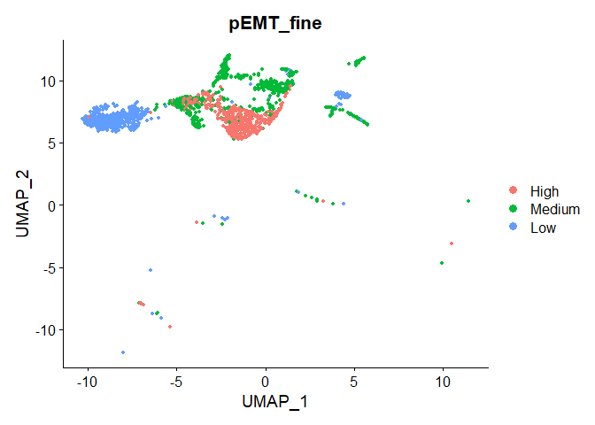<!-- -->

Non-Malignant cells as sender

``` r
getwd()
## [1] "C:/Users/rbrowaey/work/Research/NicheNet/multinichenetr/vignettes"
seurat_obj_sender =readRDS(url("https://zenodo.org/record/4675430/files/seurat_obj_hnscc.rds")) %>% subset(subset = celltype != "Malignant")
seurat_obj_sender@meta.data$pEMT_fine = factor(seurat_obj_sender@meta.data$pEMT_fine, levels = c("High","Medium","Low")) 
DimPlot(seurat_obj_sender, group.by = "celltype")
```

<!-- -->

``` r
DimPlot(seurat_obj_sender, group.by = "tumor")
```

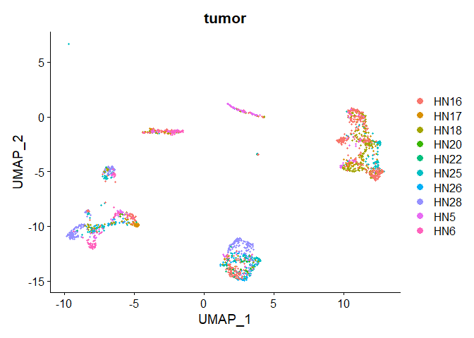<!-- -->

``` r
DimPlot(seurat_obj_sender, group.by = "pEMT")
```

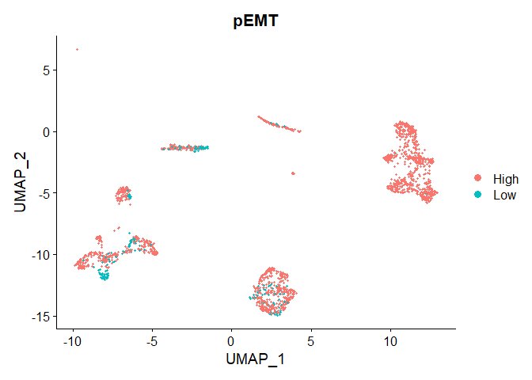<!-- -->

``` r
DimPlot(seurat_obj_sender, group.by = "pEMT_fine")
```

<!-- -->

# Step 2: Prepare the cell-cell communication analysis

## Define senders and receivers of interest

``` r
senders_oi = seurat_obj_sender %>% Idents() %>% unique()
receivers_oi = seurat_obj_receiver %>% Idents() %>% unique()

seurat_obj_sender = seurat_obj_sender %>% subset(idents = senders_oi)
seurat_obj_receiver = seurat_obj_receiver %>% subset(idents = receivers_oi)
```

We will now also check the number of cells per cell type condition
combination, and the number of patients per condition.

``` r
table(seurat_obj_receiver@meta.data$celltype, seurat_obj_receiver@meta.data$tumor) # cell types vs samples
##            
##             HN16 HN17 HN18 HN20 HN22 HN25 HN26 HN28 HN5 HN6
##   Malignant   82  353  263  331  123  153   61   49  70 157
table(seurat_obj_receiver@meta.data$celltype, seurat_obj_receiver@meta.data$pEMT_fine) # cell types vs conditions
##            
##             High Medium Low
##   Malignant  435    658 549
table(seurat_obj_receiver@meta.data$tumor, seurat_obj_receiver@meta.data$pEMT_fine) # samples vs conditions
##       
##        High Medium Low
##   HN16   82      0   0
##   HN17  353      0   0
##   HN18    0    263   0
##   HN20    0      0 331
##   HN22    0    123   0
##   HN25    0    153   0
##   HN26    0      0  61
##   HN28    0     49   0
##   HN5     0     70   0
##   HN6     0      0 157
```

``` r
table(seurat_obj_sender@meta.data$celltype, seurat_obj_sender@meta.data$tumor) # cell types vs samples
##                
##                 HN16 HN17 HN18 HN20 HN22 HN25 HN26 HN28 HN5 HN6
##   CAF             47   37   36    3    9   73   19  157  37  82
##   Endothelial     43   17   18    1    1    1    0   14  11  52
##   Myeloid         15    2    7    0    1    8    1    1  58   6
##   myofibroblast   84    6   14   10   45   88   45  140   5   6
##   T.cell         300   61  207    0    0   93    3    0  28   0
table(seurat_obj_sender@meta.data$celltype, seurat_obj_sender@meta.data$pEMT_fine) # cell types vs conditions
##                
##                 High Medium Low
##   CAF             84    312 104
##   Endothelial     60     45  53
##   Myeloid         17     75   7
##   myofibroblast   90    292  61
##   T.cell         361    328   3
table(seurat_obj_sender@meta.data$tumor, seurat_obj_sender@meta.data$pEMT_fine) # samples vs conditions
##       
##        High Medium Low
##   HN16  489      0   0
##   HN17  123      0   0
##   HN18    0    282   0
##   HN20    0      0  14
##   HN22    0     56   0
##   HN25    0    263   0
##   HN26    0      0  68
##   HN28    0    312   0
##   HN5     0    139   0
##   HN6     0      0 146
```

As you can see, some Celltype-Sample combinations have 0 cells. It is
possible that during DE analysis, some cell types will be removed from
the analysis if there is not enough information to do a DE analysis.

# Step 2: Prepare the cell-cell communication analysis

## Define in which metadata columns we can find the **group**, **sample** and **cell type** IDs

For the group\_id, we now choose for the ‘pEMT\_fine’ column because we
now want to compare the p-EMT-high vs the p-EMT-mid and p-EMT-low group

``` r
sample_id = "tumor"
group_id = "pEMT_fine"
celltype_id_receiver = "celltype"
celltype_id_sender = "celltype"
```

## Define the contrasts and covariates of interest for the DE analysis, and the minimal number of cells of a cell type that each sample should have to be considered for DE analysis of that cell type.

Here, we want to compare the p-EMT-high vs the p-EMT-mid and p-EMT-low
group and find cell-cell communication events that are higher in high
than mid and low pEMT. We don’t have other covariates to correct for in
this dataset.

Note the format to indicate the contrasts!

``` r
covariates = NA
contrasts_oi = c("'High-(Medium+Low)/2','Medium-(High+Low)/2','Low-(Medium+High)/2'") # no spaces between the different contrasts!
contrast_tbl = tibble(contrast = 
                        c("High-(Medium+Low)/2", "Medium-(High+Low)/2","Low-(Medium+High)/2"),  # division by 2 necessary because 2 groups to compare against !!
                      group = c("High","Medium","Low")) # division by 2 necessary because 2 groups to compare against !!
min_cells = 5 # here 5 for demonstration purposes - but recommended default is 10.
```

## Define the parameters for the NicheNet ligand activity analysis

Here, we need to define the thresholds that will be used to consider
genes as differentially expressed or not (logFC, p-value, decision
whether to use adjusted or normal p-value, minimum fraction of cells
that should express a gene in at least one sample in a group, whether to
use the normal p-values or empirical null p-values).

NicheNet ligand activity will then be calculated as the enrichment of
predicted target genes of ligands in this set of DE genes compared to
the genomic background. Here we choose for a minimum logFC of 1, maximum
p-value of 0.05 (normal, not adjusted one, because of lack of
statistical power due to pseudobulking and the fact that this dataset
has only a few samples per group), and minimum fraction of expression of
0.05. For the NicheNet ligand-target inference, we also need to select
which top n of the predicted target genes will be considered (here: top
250 targets per ligand). We will also use the empirical p-values (\[ADD
REFERENCE\]). This has mainly advantages when there would be some
violations to the assumptions that should be fulfilled for having
accurate theoretical p-values. In case all assumptions are fulfilled,
using empirical p-values would not harm either.

``` r
logFC_threshold = 1
p_val_threshold = 0.05
fraction_cutoff = 0.05
p_val_adj = FALSE 
empirical_pval = TRUE
top_n_target = 250
```

## Define the weights of the prioritization of both expression, differential expression and NicheNet activity information

MultiNicheNet allows the user to define the weights of the following
criteria to prioritize ligand-receptor interactions:

-   Upregulation of the ligand in a sender cell type and/or upregulation
    of the receptor in a receiver cell type - in the condition of
    interest. : `scaled_lfc_ligand`, `scaled_p_val_ligand`,
    `scaled_lfc_receptor`, and `scaled_p_val_receptor`
-   Sufficiently high expression levels of ligand and receptor in many
    samples of the same group (to mitigate the influence of outlier
    samples). : `fraction_expressing_ligand_receptor`
-   Cell-type and condition specific expression of the ligand in the
    sender cell type and receptor in the receiver cell type (to mitigate
    the influence of upregulated but still relatively weakly expressed
    ligands/receptors) : `scaled_avg_exprs_ligand`,
    `scaled_avg_frq_ligand`, `scaled_avg_exprs_receptor`, and
    `scaled_avg_frq_receptor`
-   High NicheNet ligand activity, to further prioritize ligand-receptor
    pairs based on their predicted effect of the ligand-receptor
    interaction on the gene expression in the receiver cell type :
    `scaled_activity` and `scaled_activity_scaled`
    (scaled\_activity=absolute value of ligand activity;
    scaled\_activity\_scaled=scaled ligand activity value that is
    comparable between different receiver settings - recommended to put
    more weight on this)
-   High relative abundance of sender and/or receiver in the condition
    of interest: `scaled_abundance_sender` and
    `scaled_abundance_receiver`

We will set our preference for this dataset as follows:

``` r
prioritizing_weights = c("scaled_lfc_ligand" = 1,
                         "scaled_p_val_ligand" = 1,
                         "scaled_lfc_receptor" = 1,
                         "scaled_p_val_receptor" = 1,
                         "scaled_activity_scaled" = 1.5,
                         "scaled_activity" = 0.5,
                         "scaled_avg_exprs_ligand" = 0.75,
                         "scaled_avg_frq_ligand" = 0.75,
                         "scaled_avg_exprs_receptor" = 0.75,
                         "scaled_avg_frq_receptor" = 0.75,
                         "fraction_expressing_ligand_receptor" = 1,
                         "scaled_abundance_sender" = 0,
                         "scaled_abundance_receiver" = 0)
```

# Step 3: Perform the cell-cell communication analysis

Now we will run the MultiNicheNet wrapper. In the function
`multi_nichenet_analysis`, we need to specify that we use two Seurat
objects (one with senders and one with receivers) by setting
`sender_receiver_separate = TRUE`. This setting will call the underlying
`multi_nichenet_analysis_separate` pipeline function.

To keep track of the different steps, we will here set `verbose = TRUE`

``` r
output = multi_nichenet_analysis(seurat_obj_receiver = seurat_obj_receiver, seurat_obj_sender = seurat_obj_sender, 
                                celltype_id_receiver = celltype_id_receiver, celltype_id_sender = celltype_id_sender, sample_id = sample_id, group_id = group_id, 
                                lr_network = lr_network, ligand_target_matrix = ligand_target_matrix, contrasts_oi = contrasts_oi, contrast_tbl = contrast_tbl, covariates = covariates,
                                prioritizing_weights = prioritizing_weights, min_cells = min_cells, logFC_threshold = logFC_threshold, p_val_threshold = p_val_threshold,  
                                fraction_cutoff = fraction_cutoff, p_val_adj = p_val_adj, empirical_pval = empirical_pval, top_n_target = top_n_target, sender_receiver_separate = TRUE, verbose = TRUE)
## [1] "Make diagnostic cell type abundance plots"
## [1] "Extract expression information from receiver"
## [1] "Extract expression information from sender"
## [1] "Calculate differential expression in receiver"
## [1] "Calculate differential expression in sender"
## [1] "excluded cell types are:"
## [1] "Endothelial" "Myeloid"     "T.cell"     
## [1] "These celltypes are not considered in the analysis. After removing samples that contain less cells than the required minimal, some groups don't have 2 or more samples anymore. As a result the analysis cannot be run. To solve this: decrease the number of min_cells or change your group_id and pool all samples that belong to groups that are not of interest! "
## [1] "Calculate NicheNet ligand activities and ligand-target links for receiver"
## [1] "p-values and adjusted p-values will be determined via the empirical null methods"
## [1] "receiver_oi:"
## [1] "Malignant"
## [1] "contrast_oi:"
## [1] "High-(Medium+Low)/2"
## [1] "Number of DE genes (gene set of interest): "
## [1] 345
## [1] "contrast_oi:"
## [1] "Medium-(High+Low)/2"
## [1] "Number of DE genes (gene set of interest): "
## [1] 154
## [1] "contrast_oi:"
## [1] "Low-(Medium+High)/2"
## [1] "Number of DE genes (gene set of interest): "
## [1] 80
## [1] "Combine all the information in prioritization tables"
```

The output of the MultiNicheNet analysis contains much information. We
will now go over this step-by-step

## Quality checks of the MultiNicheNet analysis

### Check the abundance of each cell type per sample and per group

The first plot visualizes the number of cells per celltype-sample
combination, and indicates which combinations are removed during the DE
analysis because there are less than `min_cells` in the celltype-sample
combination.

``` r
output$abund_plot_sample_receiver
```

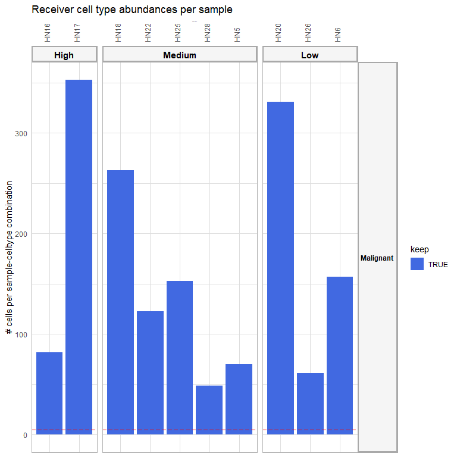<!-- -->

``` r
output$abund_plot_sample_sender
```

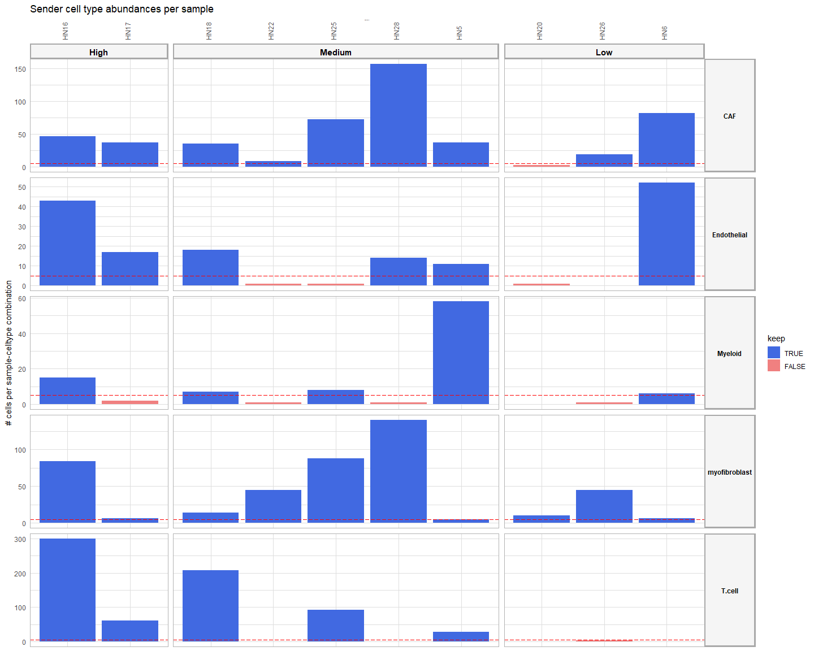<!-- -->

As we can see: Endothelial, Myeloid, and T cells: we don’t have two or
more samples that have enough cells of those cell types. Therefore,
those cell types were removed before the DE analysis (see verbose output
of the multinichenet analysis function).

We will now look at differential abundance between the conditions. This
because the pseudobulking approach behind Muscat could potentially
suffer from some biases if there would be huge differences in abundances
of a cell type between different groups. Downstream results of these
cell types should be considered with some caution.

``` r
output$abund_plot_group_receiver
```

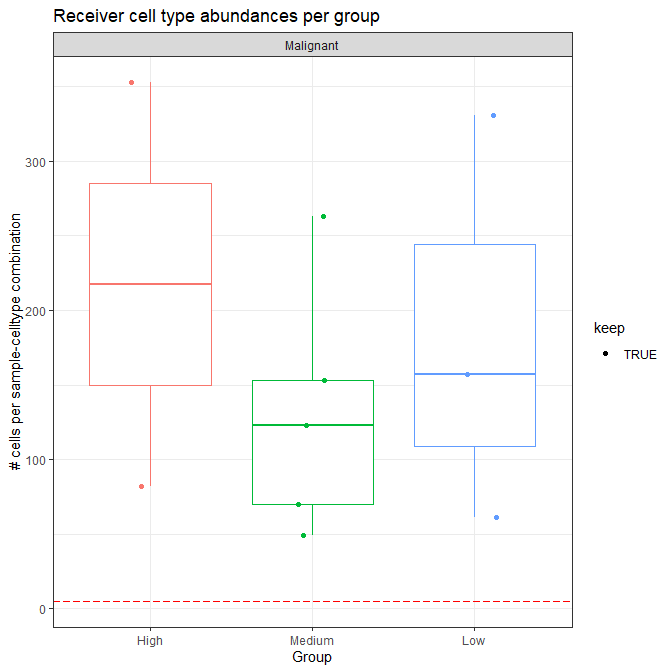<!-- -->

``` r
output$abund_plot_group_sender
```

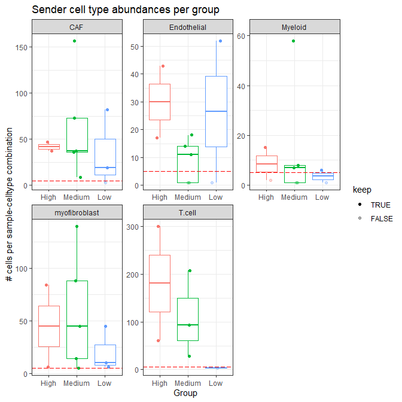<!-- -->
Differential abundance looks quite OK for the cell types kept for the DE
analysis (i.e. CAF, Malignant and myofibroblast)

### Check whether the DE analysis was done in a statistically sound way

First check the normal p-value distributions

``` r
output$hist_pvals_receiver
```

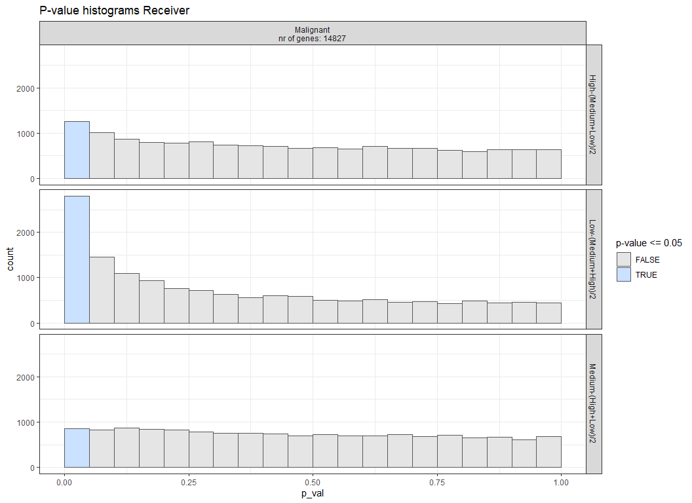<!-- -->

``` r
output$hist_pvals_sender
```

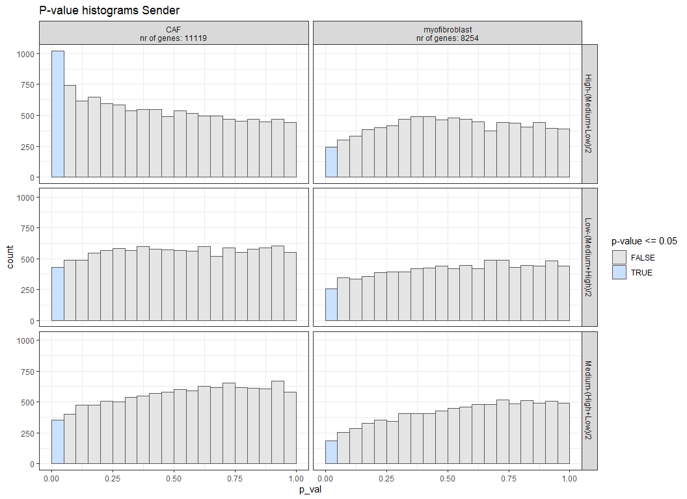<!-- -->

In order to trust the p-values, the p-value distributions should be
uniform distributions, with a peak allowed between 0 and 0.05 if there
would be a clear biological effect in the data. This clear effect
(=clear DE) seems to be present here in the Malignant and CAF cell
types.

In this analysis (see above), we decided to use the empiricall null
procedure. This is a procedure that will define empirical p-values based
on the observed distribution of the test statistic (here: logFC) and not
based on the theoretical distribution. This might be more suited in
cases some assumptions behind the model are violated.

The following plot shows those corrected, empirical p-values

``` r
output$hist_pvals_emp_receiver
```

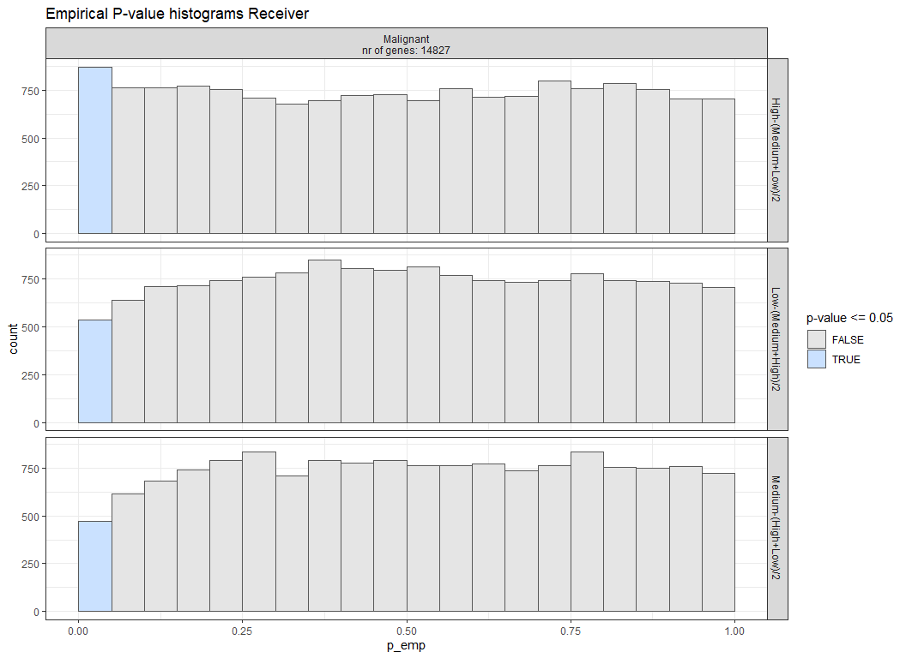<!-- -->

``` r
output$hist_pvals_emp_sender
```

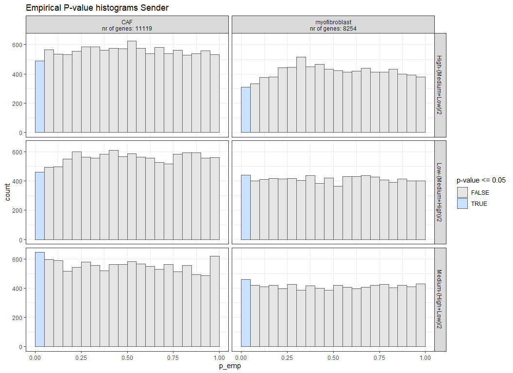<!-- -->

Check of the underlying observed distirbutions of the test statistics:
The green fitted curve should fit well with the histogram. If not, this
might point to some issues in the DE model definition.

(if plotting does not work, it might be necessary to run these plot
commands in the console)

``` r
output$z_distr_plots_emp_pval_receiver$`Malignant.High-(Medium+Low)/2` %>% print()
```

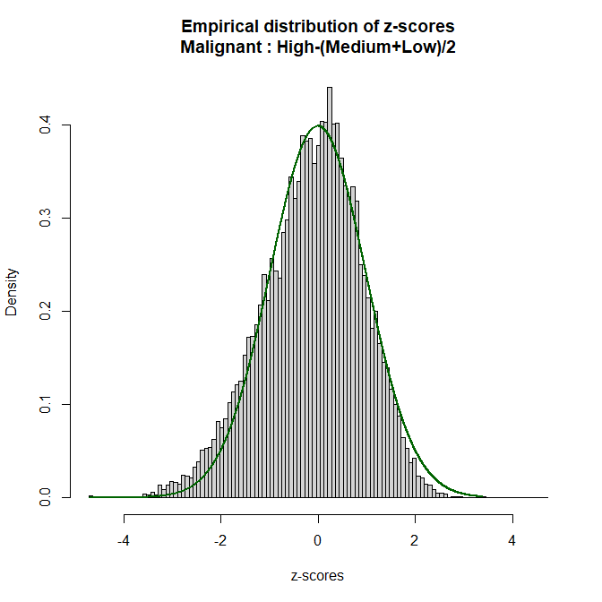<!-- -->

By the empirical null procedure, we lost some DE genes in malignant
cells and CAFs, but these left over DE genes might be the most bona fide
ones. (but this only relevant for defining the geneset of interesti in
the receiver cell type before performing ligand activities)

### Conclusion of the diagnostic plots

If possible it might be a good idea to include more covariates in the
model, or use the `pEMT_fine` group definition instead.

## Check the returned tables in the output

### Average expression value and fraction of each cell type - sample combination

``` r
output$receiver_info$avg_df %>% head()
## # A tibble: 6 x 4
##   gene     sample average_sample celltype 
##   <chr>    <chr>           <dbl> <fct>    
## 1 C9orf152 HN26           0      Malignant
## 2 RPS11    HN26           2.91   Malignant
## 3 ELMO2    HN26           0.434  Malignant
## 4 CREB3L1  HN26           0.0733 Malignant
## 5 PNMA1    HN26           0.575  Malignant
## 6 MMP2     HN26           0.0345 Malignant
output$receiver_info$frq_df %>% head()
## # A tibble: 6 x 4
##   gene     sample fraction_sample celltype 
##   <chr>    <chr>            <dbl> <chr>    
## 1 C9orf152 HN26            0      Malignant
## 2 RPS11    HN26            0.967  Malignant
## 3 ELMO2    HN26            0.262  Malignant
## 4 CREB3L1  HN26            0.0820 Malignant
## 5 PNMA1    HN26            0.230  Malignant
## 6 MMP2     HN26            0.0328 Malignant
output$receiver_info$avg_df_group %>% head()
## # A tibble: 6 x 4
## # Groups:   group, celltype [1]
##   group celltype  gene     average_group
##   <fct> <fct>     <chr>            <dbl>
## 1 High  Malignant A1BG           0.121  
## 2 High  Malignant A1BG-AS1       0.0193 
## 3 High  Malignant A1CF           0.00430
## 4 High  Malignant A2M            0.147  
## 5 High  Malignant A2M-AS1        0.00216
## 6 High  Malignant A2ML1          0.101
output$receiver_info$frq_df_group %>% head()
## # A tibble: 6 x 4
## # Groups:   group, celltype [1]
##   group celltype  gene     fraction_group
##   <fct> <chr>     <chr>             <dbl>
## 1 High  Malignant A1BG            0.0719 
## 2 High  Malignant A1BG-AS1        0.0179 
## 3 High  Malignant A1CF            0.103  
## 4 High  Malignant A2M             0.120  
## 5 High  Malignant A2M-AS1         0.00142
## 6 High  Malignant A2ML1           0.249
output$receiver_info$rel_abundance_df %>% head()
## # A tibble: 3 x 3
##   group  celltype  rel_abundance_scaled
##   <chr>  <chr>                    <dbl>
## 1 High   Malignant                0.001
## 2 Medium Malignant                1.00 
## 3 Low    Malignant                0.512
```

``` r
output$sender_info$avg_df %>% head()
## # A tibble: 6 x 4
##   gene     sample average_sample celltype     
##   <chr>    <chr>           <dbl> <fct>        
## 1 C9orf152 HN28           0      myofibroblast
## 2 RPS11    HN28           2.67   myofibroblast
## 3 ELMO2    HN28           0.276  myofibroblast
## 4 CREB3L1  HN28           0      myofibroblast
## 5 PNMA1    HN28           0.580  myofibroblast
## 6 MMP2     HN28           0.0636 myofibroblast
output$sender_info$frq_df %>% head()
## # A tibble: 6 x 4
##   gene     sample fraction_sample celltype     
##   <chr>    <chr>            <dbl> <chr>        
## 1 C9orf152 HN28             0     myofibroblast
## 2 RPS11    HN28             0.957 myofibroblast
## 3 ELMO2    HN28             0.157 myofibroblast
## 4 CREB3L1  HN28             0     myofibroblast
## 5 PNMA1    HN28             0.243 myofibroblast
## 6 MMP2     HN28             0.05  myofibroblast
output$sender_info$avg_df_group %>% head()
## # A tibble: 6 x 4
## # Groups:   group, celltype [1]
##   group celltype gene     average_group
##   <fct> <fct>    <chr>            <dbl>
## 1 High  CAF      A1BG           0.241  
## 2 High  CAF      A1BG-AS1       0.0573 
## 3 High  CAF      A1CF           0.00447
## 4 High  CAF      A2M            1.07   
## 5 High  CAF      A2M-AS1        0.0331 
## 6 High  CAF      A2ML1          0.0269
output$sender_info$frq_df_group %>% head()
## # A tibble: 6 x 4
## # Groups:   group, celltype [1]
##   group celltype gene     fraction_group
##   <fct> <chr>    <chr>             <dbl>
## 1 High  CAF      A1BG             0.179 
## 2 High  CAF      A1BG-AS1         0.0426
## 3 High  CAF      A1CF             0.0589
## 4 High  CAF      A2M              0.489 
## 5 High  CAF      A2M-AS1          0.0426
## 6 High  CAF      A2ML1            0.174
output$sender_info$rel_abundance_df %>% head()
## # A tibble: 6 x 3
##   group  celltype    rel_abundance_scaled
##   <chr>  <chr>                      <dbl>
## 1 High   CAF                        0.223
## 2 Medium CAF                        0.507
## 3 Low    CAF                        0.791
## 4 High   Endothelial                0.395
## 5 Medium Endothelial                0.160
## 6 Low    Endothelial                0.966
```

### DE information for each cell type - contrast combination

``` r
output$receiver_de %>% head()
## # A tibble: 6 x 11
##   gene    cluster_id   logFC logCPM       F  p_val p_adj.loc p_adj.glb contrast             p_emp p_adj_emp
##   <chr>   <chr>        <dbl>  <dbl>   <dbl>  <dbl>     <dbl>     <dbl> <chr>                <dbl>     <dbl>
## 1 RPS11   Malignant  -0.0106   8.91 0.00475 0.946      0.992         1 High-(Medium+Low)/2 0.870      0.994
## 2 ELMO2   Malignant   0.0411   5.81 0.0107  0.919      0.987         1 High-(Medium+Low)/2 0.752      0.994
## 3 CREB3L1 Malignant  -6.2      2.78 4.77    0.0505     0.59          1 High-(Medium+Low)/2 0.124      0.917
## 4 PNMA1   Malignant  -0.91     5.83 1.99    0.185      0.74          1 High-(Medium+Low)/2 0.332      0.969
## 5 MMP2    Malignant   1.69     6.33 6.54    0.0258     0.536         1 High-(Medium+Low)/2 0.0255     0.766
## 6 TMEM216 Malignant  -0.393    5.9  0.607   0.452      0.869         1 High-(Medium+Low)/2 0.650      0.994
```

``` r
output$sender_de %>% head()
## # A tibble: 6 x 11
##   gene    cluster_id   logFC logCPM      F p_val p_adj.loc p_adj.glb contrast            p_emp p_adj_emp
##   <chr>   <chr>        <dbl>  <dbl>  <dbl> <dbl>     <dbl>     <dbl> <chr>               <dbl>     <dbl>
## 1 RPS11   CAF        -0.0696   9.29 0.0663 0.8       0.958         1 High-(Medium+Low)/2 0.894     0.996
## 2 ELMO2   CAF         0.308    6.64 0.439  0.518     0.885         1 High-(Medium+Low)/2 0.528     0.987
## 3 CREB3L1 CAF         0.319    5.45 0.0785 0.783     0.953         1 High-(Medium+Low)/2 0.752     0.991
## 4 PNMA1   CAF        -0.947    6.51 2.59   0.13      0.676         1 High-(Medium+Low)/2 0.229     0.987
## 5 MMP2    CAF         0.0535   9.28 0.0447 0.836     0.964         1 High-(Medium+Low)/2 0.796     0.991
## 6 TMEM216 CAF        -0.203    6    0.11   0.745     0.943         1 High-(Medium+Low)/2 0.846     0.994
```

### Linked expression and DE information of the ligand in the sender cell types and the receptor in the receiver cell types

``` r
output$sender_receiver_info$avg_df %>% head()
## # A tibble: 6 x 8
##   sample sender        receiver  ligand receptor avg_ligand avg_receptor ligand_receptor_prod
##   <chr>  <fct>         <fct>     <chr>  <chr>         <dbl>        <dbl>                <dbl>
## 1 HN17   CAF           Malignant COL1A1 ITGB1          3.43         2.72                 9.34
## 2 HN17   CAF           Malignant COL1A1 SDC1           3.43         2.53                 8.69
## 3 HN17   myofibroblast Malignant COL1A1 ITGB1          3.17         2.72                 8.61
## 4 HN17   CAF           Malignant COL1A1 CD44           3.43         2.34                 8.02
## 5 HN17   myofibroblast Malignant COL1A1 SDC1           3.17         2.53                 8.01
## 6 HN20   CAF           Malignant COL1A1 SDC1           3.22         2.42                 7.78
output$sender_receiver_info$frq_df %>% head()
## # A tibble: 6 x 8
##   sample sender  receiver  ligand receptor fraction_ligand fraction_receptor ligand_receptor_fraction_prod
##   <chr>  <chr>   <chr>     <chr>  <chr>              <dbl>             <dbl>                         <dbl>
## 1 HN28   Myeloid Malignant COL1A1 CD44                   1                 1                             1
## 2 HN28   Myeloid Malignant LAMA2  RPSA                   1                 1                             1
## 3 HN28   Myeloid Malignant FN1    CD44                   1                 1                             1
## 4 HN28   Myeloid Malignant HAS2   CD44                   1                 1                             1
## 5 HN28   Myeloid Malignant LAMC3  CD44                   1                 1                             1
## 6 HN28   Myeloid Malignant LAMB2  RPSA                   1                 1                             1
output$sender_receiver_info$avg_df_group %>% head()
## # A tibble: 6 x 8
## # Groups:   group, sender [4]
##   group sender        receiver  ligand receptor avg_ligand_group avg_receptor_group ligand_receptor_prod_group
##   <fct> <fct>         <fct>     <chr>  <chr>               <dbl>              <dbl>                      <dbl>
## 1 High  CAF           Malignant COL1A1 ITGB1                3.02               2.67                       8.07
## 2 High  CAF           Malignant COL1A1 SDC1                 3.02               2.26                       6.81
## 3 High  CAF           Malignant COL1A1 CD44                 3.02               2.17                       6.56
## 4 High  myofibroblast Malignant COL1A1 ITGB1                2.34               2.67                       6.25
## 5 Low   CAF           Malignant COL1A1 SDC1                 2.75               2.22                       6.11
## 6 High  Endothelial   Malignant CD99   CD99                 2.32               2.43                       5.64
output$sender_receiver_info$frq_df_group %>% head()
## # A tibble: 6 x 8
## # Groups:   group, sender [5]
##   group sender        receiver  ligand receptor fraction_ligand_group fraction_receptor_group ligand_receptor_fraction_prod_group
##   <fct> <chr>         <chr>     <chr>  <chr>                    <dbl>                   <dbl>                               <dbl>
## 1 High  Myeloid       Malignant F11R   F11R                     1                       0.981                               0.981
## 2 High  CAF           Malignant COL1A1 ITGB1                    0.957                   0.979                               0.937
## 3 High  myofibroblast Malignant THBS1  CD47                     0.976                   0.939                               0.917
## 4 High  CAF           Malignant COL1A1 CD44                     0.957                   0.953                               0.913
## 5 High  T.cell        Malignant F11R   F11R                     0.924                   0.981                               0.906
## 6 High  Endothelial   Malignant F11R   F11R                     0.906                   0.981                               0.889
output$sender_receiver_info$rel_abundance_df %>% head()
## # A tibble: 6 x 6
##   group  sender      rel_abundance_scaled_sender receiver  rel_abundance_scaled_receiver sender_receiver_rel_abundance_avg
##   <chr>  <chr>                             <dbl> <chr>                             <dbl>                             <dbl>
## 1 High   CAF                               0.223 Malignant                         0.001                             0.112
## 2 Medium CAF                               0.507 Malignant                         1.00                              0.754
## 3 Low    CAF                               0.791 Malignant                         0.512                             0.652
## 4 High   Endothelial                       0.395 Malignant                         0.001                             0.198
## 5 Medium Endothelial                       0.160 Malignant                         1.00                              0.580
## 6 Low    Endothelial                       0.966 Malignant                         0.512                             0.739
```

``` r
output$sender_receiver_de %>% head()
## # A tibble: 6 x 12
##   contrast            sender        receiver  ligand receptor lfc_ligand lfc_receptor ligand_receptor_lfc_avg p_val_ligand p_adj_ligand p_val_receptor p_adj_receptor
##   <chr>               <chr>         <chr>     <chr>  <chr>         <dbl>        <dbl>                   <dbl>        <dbl>        <dbl>          <dbl>          <dbl>
## 1 Low-(Medium+High)/2 CAF           Malignant NTN4   DCC           1.12          7.14                    4.13       0.203         0.999       0.000213         0.0296
## 2 Low-(Medium+High)/2 CAF           Malignant CD34   SELL          1.38          5.54                    3.46       0.148         0.999       0.00109          0.0535
## 3 Low-(Medium+High)/2 myofibroblast Malignant NTN4   DCC          -0.225         7.14                    3.46       0.779         0.999       0.000213         0.0296
## 4 Low-(Medium+High)/2 CAF           Malignant FGF13  FGFR1         3.22          3.19                    3.20       0.0572        0.999       0.000477         0.04  
## 5 Low-(Medium+High)/2 myofibroblast Malignant CFH    SELL          0.834         5.54                    3.19       0.274         0.999       0.00109          0.0535
## 6 Low-(Medium+High)/2 CAF           Malignant DLK1   NOTCH3        3.31          3.01                    3.16       0.0569        0.999       0.00113          0.0543
```

### Output of the NicheNet ligand activity analysis, and the NicheNet ligand-target inference

``` r
output$ligand_activities_targets_DEgenes$ligand_activities %>% head()
## # A tibble: 6 x 7
## # Groups:   receiver, contrast [1]
##   ligand activity contrast            target  ligand_target_weight receiver  activity_scaled
##   <chr>     <dbl> <chr>               <chr>                  <dbl> <chr>               <dbl>
## 1 CXCL1    0.0527 High-(Medium+Low)/2 AJUBA               0.000876 Malignant           0.769
## 2 CXCL1    0.0527 High-(Medium+Low)/2 ANGPTL4             0.000940 Malignant           0.769
## 3 CXCL1    0.0527 High-(Medium+Low)/2 CAV1                0.000897 Malignant           0.769
## 4 CXCL1    0.0527 High-(Medium+Low)/2 COL18A1             0.000877 Malignant           0.769
## 5 CXCL1    0.0527 High-(Medium+Low)/2 COL1A1              0.00383  Malignant           0.769
## 6 CXCL1    0.0527 High-(Medium+Low)/2 ETS2                0.000867 Malignant           0.769
```

``` r
output$ligand_activities_targets_DEgenes$de_genes_df %>% head()
## # A tibble: 6 x 6
##   gene      receiver  logFC contrast             p_val p_adj.glb
##   <chr>     <chr>     <dbl> <chr>                <dbl>     <dbl>
## 1 MMP2      Malignant  1.69 High-(Medium+Low)/2 0.0255     0.766
## 2 APBB2     Malignant  1.53 High-(Medium+Low)/2 0.0113     0.684
## 3 SERPINF1  Malignant  1.38 High-(Medium+Low)/2 0.0151     0.722
## 4 LINC00460 Malignant  3.65 High-(Medium+Low)/2 0.0149     0.720
## 5 MT1JP     Malignant  2.05 High-(Medium+Low)/2 0.0289     0.788
## 6 COL18A1   Malignant  1.15 High-(Medium+Low)/2 0.0287     0.788
```

### Tables with the final prioritization scores (results per group and per sample)

``` r
output$prioritization_tables$group_prioritization_tbl %>% head()
## # A tibble: 6 x 38
##   contrast   group sender   receiver  ligand receptor lfc_ligand lfc_receptor ligand_receptor_~ p_val_ligand p_adj_ligand p_val_receptor p_adj_receptor activity activity_scaled lr_interaction id        avg_ligand_group avg_receptor_gr~ ligand_receptor_~ fraction_ligand~
##   <chr>      <chr> <chr>    <chr>     <chr>  <chr>         <dbl>        <dbl>             <dbl>        <dbl>        <dbl>          <dbl>          <dbl>    <dbl>           <dbl> <chr>          <chr>                <dbl>            <dbl>             <dbl>            <dbl>
## 1 High-(Med~ High  CAF      Malignant IL24   IL20RB        4.85         1.19               3.02    0.0000676        0.125     0.0196             0.52     0.0663           1.73  IL24_IL20RB    IL24_IL2~            1.28             1.68             2.16              0.468
## 2 High-(Med~ High  CAF      Malignant TNC    ITGB6         1.01         2.03               1.52    0.099            0.632     0.000421           0.269    0.0710           2.07  TNC_ITGB6      TNC_ITGB~            1.55             1.17             1.82              0.691
## 3 High-(Med~ High  CAF      Malignant TNC    ITGB1         1.01         0.93               0.97    0.099            0.632     0.00000892         0.0441   0.0710           2.07  TNC_ITGB1      TNC_ITGB~            1.55             2.67             4.15              0.691
## 4 High-(Med~ High  CAF      Malignant TNC    ITGAV         1.01         1.05               1.03    0.099            0.632     0.068              0.61     0.0710           2.07  TNC_ITGAV      TNC_ITGA~            1.55             0.984            1.53              0.691
## 5 High-(Med~ High  CAF      Malignant SEMA5A MET           1.75         0.903              1.33    0.0118           0.436     0.0203             0.52     0.0559           0.995 SEMA5A_MET     SEMA5A_M~            1.10             1.12             1.23              0.700
## 6 Low-(Medi~ Low   myofibr~ Malignant FGF1   FGFR1         0.764        3.19               1.98    0.418            0.999     0.000477           0.04     0.0185           3.60  FGF1_FGFR1     FGF1_FGF~            0.378            0.247            0.0931            0.152
## # ... with 17 more variables: fraction_receptor_group <dbl>, ligand_receptor_fraction_prod_group <dbl>, rel_abundance_scaled_sender <dbl>, rel_abundance_scaled_receiver <dbl>, sender_receiver_rel_abundance_avg <dbl>, scaled_lfc_ligand <dbl>, scaled_p_val_ligand <dbl>,
## #   scaled_lfc_receptor <dbl>, scaled_p_val_receptor <dbl>, scaled_activity_scaled <dbl>, scaled_activity <dbl>, scaled_avg_exprs_ligand <dbl>, scaled_avg_frq_ligand <dbl>, scaled_avg_exprs_receptor <dbl>, scaled_avg_frq_receptor <dbl>,
## #   fraction_expressing_ligand_receptor <dbl>, prioritization_score <dbl>
```

``` r
output$prioritization_tables$sample_prioritization_tbl %>% head()
## # A tibble: 6 x 22
##   sample sender  receiver  ligand receptor avg_ligand avg_receptor ligand_receptor_~ fraction_ligand fraction_recept~ ligand_receptor_~ group prioritization_~ lr_interaction id       scaled_LR_prod scaled_LR_frac n_cells_receiver keep_receiver n_cells_sender keep_sender
##   <chr>  <chr>   <chr>     <chr>  <chr>         <dbl>        <dbl>             <dbl>           <dbl>            <dbl>             <dbl> <chr>            <dbl> <chr>          <chr>             <dbl>          <dbl>            <dbl>         <dbl>          <dbl>       <dbl>
## 1 HN17   CAF     Malignant COL1A1 ITGB1          3.43         2.72              9.34               1            0.994             0.994 High             0.621 COL1A1_ITGB1   COL1A1_~           2.12           1.68              353             1             37           1
## 2 HN17   CAF     Malignant COL1A1 SDC1           3.43         2.53              8.69               1            0.994             0.994 High             0.533 COL1A1_SDC1    COL1A1_~           1.82           1.25              353             1             37           1
## 3 HN17   myofib~ Malignant COL1A1 ITGB1          3.17         2.72              8.61               1            0.994             0.994 High             0.553 COL1A1_ITGB1   COL1A1_~           2.55           2.13              353             1              6           1
## 4 HN17   CAF     Malignant COL1A1 CD44           3.43         2.34              8.02               1            0.992             0.992 High             0.554 COL1A1_CD44    COL1A1_~           1.80           1.29              353             1             37           1
## 5 HN17   myofib~ Malignant COL1A1 SDC1           3.17         2.53              8.01               1            0.994             0.994 High             0.465 COL1A1_SDC1    COL1A1_~           2.30           1.67              353             1              6           1
## 6 HN20   CAF     Malignant COL1A1 SDC1           3.22         2.42              7.78               1            0.967             0.967 Low              0.499 COL1A1_SDC1    COL1A1_~           1.29           1.06              331             1              3           0
## # ... with 1 more variable: keep_sender_receiver <fct>
```

Based on these prioritization tables, we will define which interactions
to visualize in the different plots below.

# Step 4: Visualize the results of the cell-cell communication analysis

In a first instance, we will look at the broad overview of prioritized
interactions via condition-specific Circos plots. We will filter on the
prioritization score after removing interactions that are not
upregulated in the condition of interest, and that are in no patient
expressed in more than 5% of cells of a cell type (cf
`fraction_cutoff`).

We will look here at the top100 predictions across all contrasts (high
vs low; and low vs high), senders, and receivers of interest.

## Circos plot of top-prioritized links

(remark: there are still some bugs in the automatic circos plot
function)

``` r
prioritized_tbl_oi = output$prioritization_tables$group_prioritization_tbl %>% 
  filter(fraction_ligand_group > fraction_cutoff & fraction_receptor_group > fraction_cutoff) %>% 
  distinct(id, sender, receiver, ligand, receptor, group, prioritization_score, ligand_receptor_lfc_avg, fraction_expressing_ligand_receptor) %>% 
  filter(ligand_receptor_lfc_avg > 0 & fraction_expressing_ligand_receptor > 0) %>% top_n(100, prioritization_score) 

prioritized_tbl_oi %>% group_by(group) %>% count()
## # A tibble: 3 x 2
## # Groups:   group [3]
##   group      n
##   <chr>  <int>
## 1 High      54
## 2 Low       28
## 3 Medium    18

prioritized_tbl_oi = output$prioritization_tables$group_prioritization_tbl %>% 
  filter(id %in% prioritized_tbl_oi$id) %>% 
  distinct(id, sender, receiver, ligand, receptor, group) %>% left_join(prioritized_tbl_oi)
prioritized_tbl_oi$prioritization_score[is.na(prioritized_tbl_oi$prioritization_score)] = 0


n_senders = prioritized_tbl_oi$sender %>% unique() %>% length()
n_receivers = prioritized_tbl_oi$receiver %>% unique() %>% length()

  
colors_sender = c("red", "royalblue")
colors_receiver = c("orange")

circos_list = make_circos_group_comparison(prioritized_tbl_oi, colors_sender, colors_receiver)
```

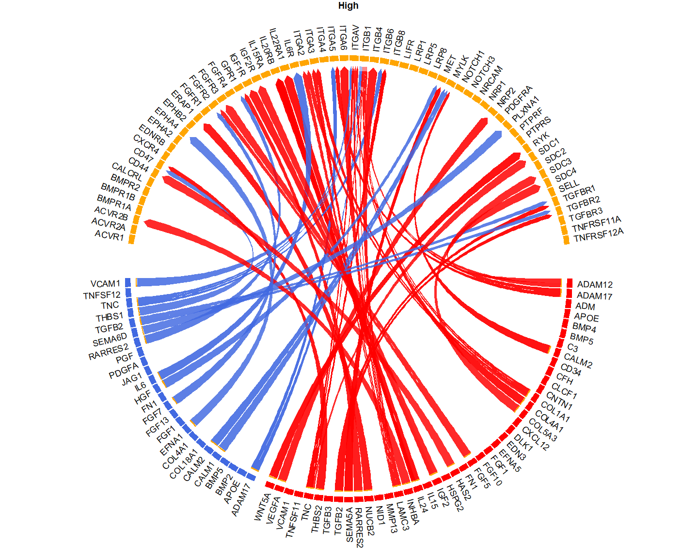<!-- -->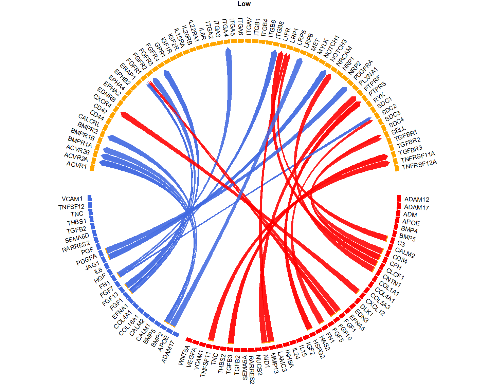<!-- -->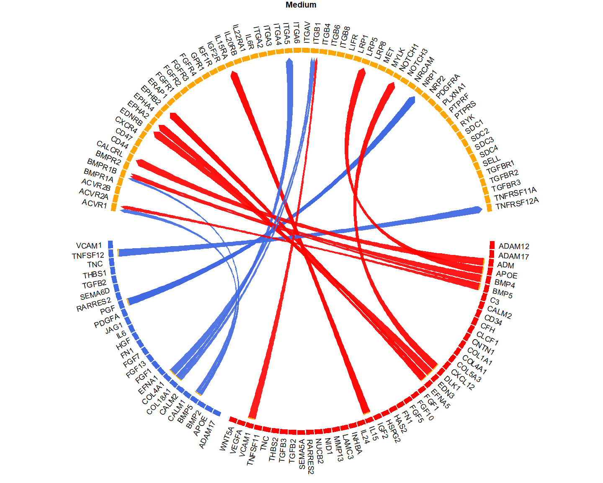<!-- --><!-- -->

## Visualization of scaled\_LR\_prod per sample

Now we will visualize per sample the scaled product of ligand and
receptor expression. Samples that were left out of the DE analysis are
indicated with a smaller dot (this helps to indicate the samples that
did not contribute to the calculation of the logFC, and thus not
contributed to the final prioritization)

We will now check the top75 interactions specific for the pEMT high
group

``` r
group_oi = "High"
```

``` r
output$prioritization_tables$sample_prioritization_tbl$group = factor(output$prioritization_tables$sample_prioritization_tbl$group, levels = c("High","Medium","Low"))

prioritized_tbl_oi = output$prioritization_tables$group_prioritization_tbl %>% 
  distinct(id, sender, receiver, lr_interaction, group, ligand_receptor_lfc_avg, activity_scaled, fraction_expressing_ligand_receptor,  prioritization_score) %>% 
  filter(ligand_receptor_lfc_avg > 0 & fraction_expressing_ligand_receptor > 0) %>% 
  filter(group == group_oi) %>% group_by(group) %>% top_n(75, prioritization_score) 

plot_oi = make_sample_lr_prod_plots(output$prioritization_tables, prioritized_tbl_oi)
plot_oi
```

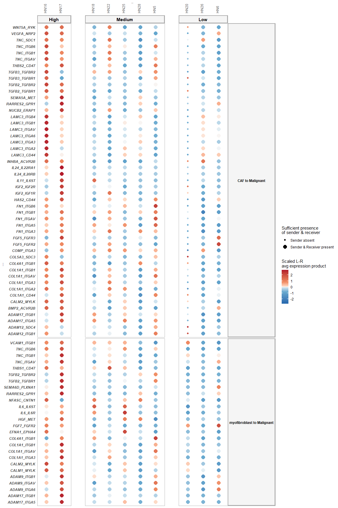<!-- -->

Next to these LR expression products, we can also plot the NicheNet
ligand activities of the ligand in the receiver.

``` r
prioritized_tbl_oi = output$prioritization_tables$group_prioritization_tbl %>% 
  distinct(id, sender, receiver, lr_interaction, group, ligand_receptor_lfc_avg, activity_scaled, fraction_expressing_ligand_receptor,  prioritization_score) %>% 
  filter(ligand_receptor_lfc_avg > 0 & fraction_expressing_ligand_receptor > 0) %>% 
  filter(group == group_oi) %>% group_by(group) %>% top_n(75, prioritization_score) 

plot_oi = make_sample_lr_prod_activity_plots(output$prioritization_tables, prioritized_tbl_oi, widths = c(5,1,1))
plot_oi
```

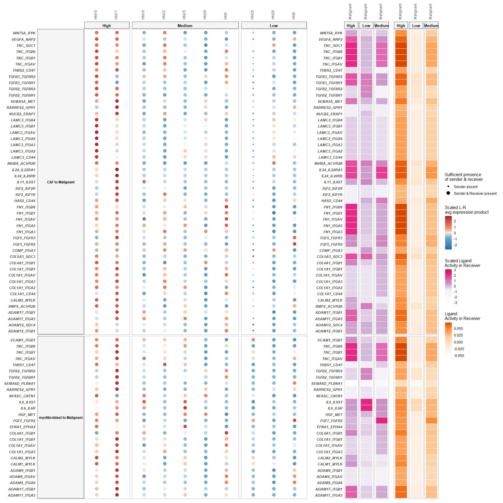<!-- -->

## Visualization of expression-logFC per group and ligand activity

Next type of plots will show the logFC of LR pairs across all
sender-receiver pairs that are selected, and add the ligand activity
next to it.

``` r
receiver_oi = "Malignant"
group_oi = "High"
```

``` r
prioritized_tbl_oi = output$prioritization_tables$group_prioritization_tbl %>% 
  filter(fraction_ligand_group > fraction_cutoff & fraction_receptor_group > fraction_cutoff) %>% 
  distinct(id, sender, receiver, lr_interaction, group, ligand_receptor_lfc_avg, activity_scaled, fraction_ligand_group, fraction_expressing_ligand_receptor, scaled_avg_exprs_ligand, prioritization_score) %>% 
  filter(ligand_receptor_lfc_avg > 0 & fraction_expressing_ligand_receptor > 0) %>% 
  filter(group == group_oi & receiver == receiver_oi) %>% top_n(75, prioritization_score) 

plot_oi = make_group_lfc_exprs_activity_plot(output$prioritization_tables, prioritized_tbl_oi, receiver_oi, heights = c(5,1,1))
plot_oi
```

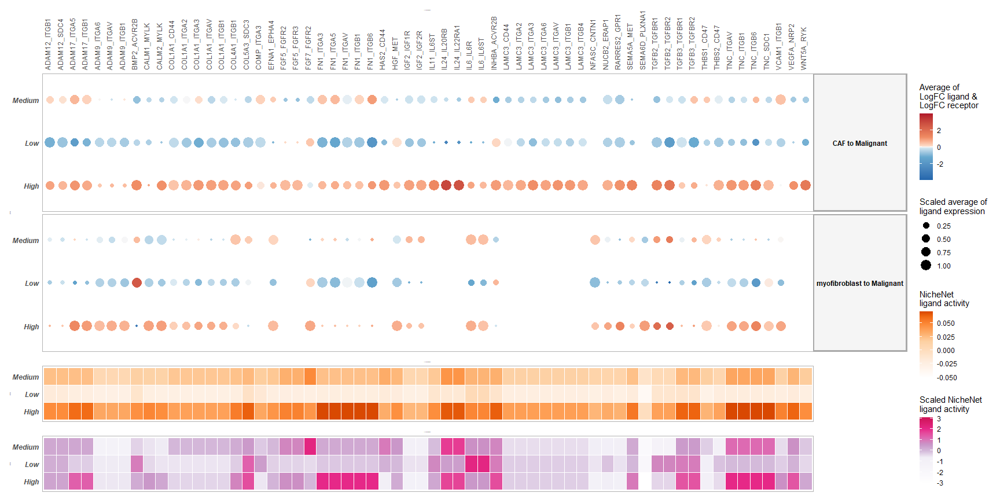<!-- -->

## Visualization of ligand-activity, ligand-target links, and target gene expression

In another type of plot, we can visualize the ligand activities for a
group-receiver combination, and show the predicted ligand-target links,
and also the expression of the predicted target genes across samples.

First: show this for a selection of ligands with high ligand activities:

``` r
group_oi = "High"
receiver_oi = "Malignant"
prioritized_tbl_oi = output$prioritization_tables$group_prioritization_tbl %>% 
  filter(fraction_ligand_group > fraction_cutoff & fraction_receptor_group > fraction_cutoff) %>% 
  distinct(id, sender, receiver, ligand, receptor, group, prioritization_score, ligand_receptor_lfc_avg, fraction_expressing_ligand_receptor, activity_scaled) %>% 
  filter(ligand_receptor_lfc_avg > 0 & fraction_expressing_ligand_receptor > 0) %>% 
  filter(group == group_oi & receiver == receiver_oi) %>% 
  group_by(group) %>% top_n(50, prioritization_score) %>% top_n(25, activity_scaled) %>% arrange(-activity_scaled)
```

``` r
combined_plot = make_ligand_activity_target_plot(group_oi, receiver_oi, prioritized_tbl_oi, output$ligand_activities_targets_DEgenes, contrast_tbl, output$grouping_tbl, output$receiver_info, plot_legend = FALSE)
combined_plot
## $combined_plot
```

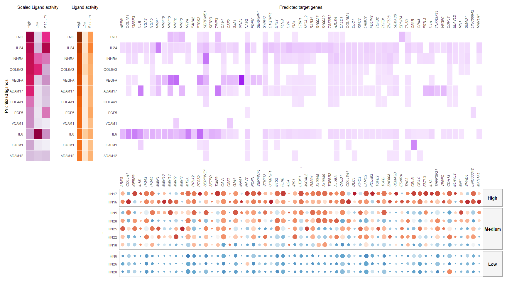<!-- -->

    ## 
    ## $legends

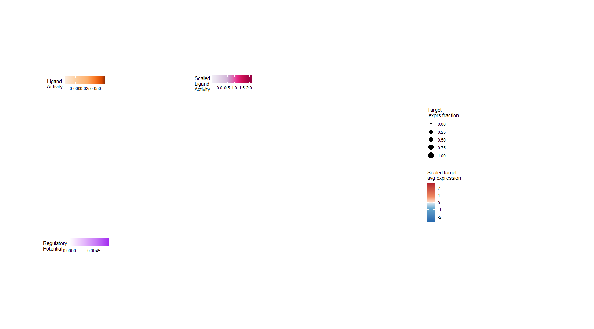<!-- -->

Now: show this for a selection of ligands with high general
prioritization scores, not necessarily high ligand activities.

``` r
group_oi = "High"
receiver_oi = "Malignant"
prioritized_tbl_oi = output$prioritization_tables$group_prioritization_tbl %>% 
  filter(fraction_ligand_group > fraction_cutoff & fraction_receptor_group > fraction_cutoff) %>% 
  distinct(id, sender, receiver, ligand, receptor, group, prioritization_score, ligand_receptor_lfc_avg, fraction_expressing_ligand_receptor, activity_scaled) %>% 
  filter(ligand_receptor_lfc_avg > 0 & fraction_expressing_ligand_receptor > 0) %>% 
  filter(group == group_oi & receiver == receiver_oi) %>% 
  group_by(group) %>% top_n(25, prioritization_score) %>% arrange(-activity_scaled)
```

``` r
combined_plot = make_ligand_activity_target_plot(group_oi, receiver_oi, prioritized_tbl_oi, output$ligand_activities_targets_DEgenes, contrast_tbl, output$grouping_tbl, output$receiver_info, plot_legend = FALSE)
combined_plot
## $combined_plot
```

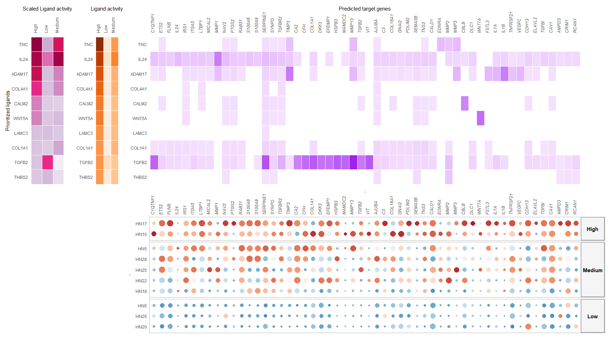<!-- -->

    ## 
    ## $legends

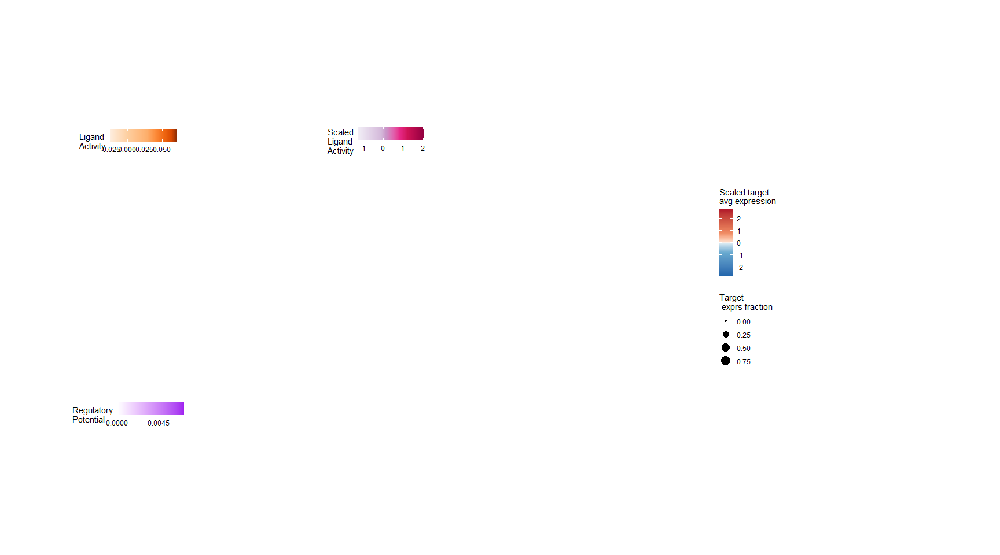<!-- -->

## Show ligand activities for each receiver-group combination

In the next type of plot, we plot all the ligand activities (Both scaled
and absolute activities) of each receiver-group combination. This can
give us some insights in active signaling pathways across groups. Note
that we can thus show top ligands based on ligand activity - agnostic of
expression in sender.

``` r
ligands_oi = output$prioritization_tables$ligand_activities_target_de_tbl %>% inner_join(contrast_tbl) %>% 
  group_by(group, receiver) %>% distinct(ligand, receiver, group, activity) %>% 
  top_n(5, activity) %>% pull(ligand) %>% unique()

plot_oi = make_ligand_activity_plots(output$prioritization_tables, ligands_oi, contrast_tbl, widths = NULL)
plot_oi
```

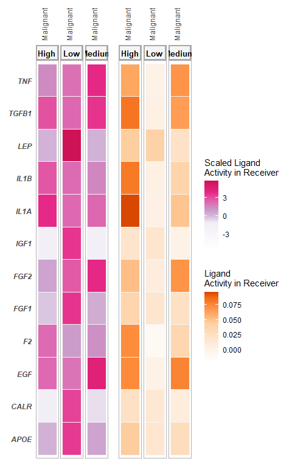<!-- -->

Or we can do this plot for ligands, while considering the general
priorization score (which considers expression information etc)

Show top ligands based on prioritization scores

``` r
ligands_oi = output$prioritization_tables$group_prioritization_tbl %>% 
  group_by(group, receiver) %>% distinct(ligand, receiver, group, prioritization_score) %>% 
  top_n(5, prioritization_score) %>% pull(ligand) %>% unique()

plot_oi = make_ligand_activity_plots(output$prioritization_tables, ligands_oi, contrast_tbl, widths = NULL)
plot_oi
```

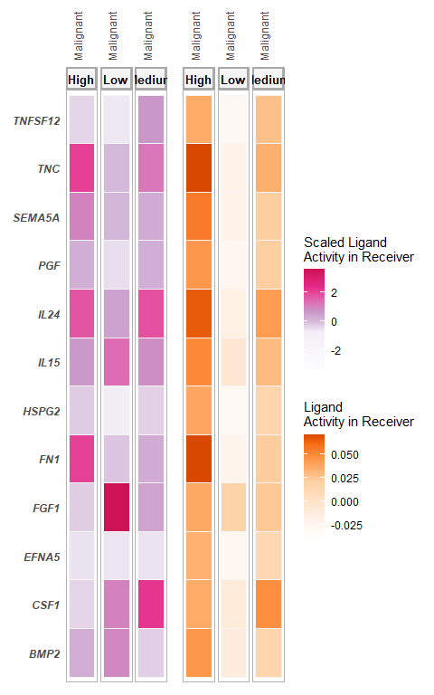<!-- -->

## Zoom in on specific ligand-receptor interactions: show their expression in the single-cell data!

Single-cell-based Nebulosa, Feature, and Violin plots of ligand-receptor
interaction of interest: `make_ligand_receptor_nebulosa_feature_plot`
and `make_ligand_receptor_violin_plot`

It is often useful to zoom in on specific ligand-receptor interactions
of interest by looking in more detail to their expression at the single
cell level

Check the highest scoring links based on the general prioritization
score. Here we will pick one of those to visualize.

``` r
prioritized_tbl_oi = output$prioritization_tables$group_prioritization_tbl %>% 
  filter(fraction_ligand_group > fraction_cutoff & fraction_receptor_group > fraction_cutoff) %>% 
  distinct(id, sender, receiver, ligand, receptor, group, prioritization_score) %>% 
  group_by(group, receiver) %>% top_n(5, prioritization_score) 
prioritized_tbl_oi
## # A tibble: 15 x 7
## # Groups:   group, receiver [3]
##    group  sender        receiver  ligand  receptor  id                                        prioritization_score
##    <chr>  <chr>         <chr>     <chr>   <chr>     <chr>                                                    <dbl>
##  1 High   CAF           Malignant IL24    IL20RB    IL24_IL20RB_CAF_Malignant                                0.675
##  2 High   CAF           Malignant TNC     ITGB6     TNC_ITGB6_CAF_Malignant                                  0.660
##  3 High   CAF           Malignant TNC     ITGB1     TNC_ITGB1_CAF_Malignant                                  0.655
##  4 High   CAF           Malignant TNC     ITGAV     TNC_ITGAV_CAF_Malignant                                  0.651
##  5 High   CAF           Malignant SEMA5A  MET       SEMA5A_MET_CAF_Malignant                                 0.648
##  6 Low    myofibroblast Malignant FGF1    FGFR1     FGF1_FGFR1_myofibroblast_Malignant                       0.644
##  7 Medium myofibroblast Malignant PGF     NRP1      PGF_NRP1_myofibroblast_Malignant                         0.634
##  8 Low    myofibroblast Malignant BMP2    ACVR2A    BMP2_ACVR2A_myofibroblast_Malignant                      0.618
##  9 Medium CAF           Malignant IL15    IL15RA    IL15_IL15RA_CAF_Malignant                                0.612
## 10 Medium CAF           Malignant EFNA5   EPHB2     EFNA5_EPHB2_CAF_Malignant                                0.610
## 11 Low    CAF           Malignant HSPG2   PTPRS     HSPG2_PTPRS_CAF_Malignant                                0.608
## 12 Low    myofibroblast Malignant FN1     SDC2      FN1_SDC2_myofibroblast_Malignant                         0.606
## 13 Low    myofibroblast Malignant FGF1    FGFR4     FGF1_FGFR4_myofibroblast_Malignant                       0.603
## 14 Medium myofibroblast Malignant TNFSF12 TNFRSF12A TNFSF12_TNFRSF12A_myofibroblast_Malignant                0.595
## 15 Medium CAF           Malignant EFNA5   EPHA2     EFNA5_EPHA2_CAF_Malignant                                0.592
```

``` r
ligand_oi = "IL24"
receptor_oi = "IL20RB"
group_oi = "High"
sender_oi = "CAF"
receiver_oi = "Malignant"
```

Nebulosa and Feature plot of the ligand in the sender cell type and the
receptor in the receiver cell type (split per condition)

``` r
plot_list = make_ligand_receptor_nebulosa_feature_plot(seurat_obj_sender = seurat_obj_sender, seurat_obj_receiver = seurat_obj_receiver, ligand_oi = ligand_oi, receptor_oi = receptor_oi, group_oi = group_oi, group_id = group_id, celltype_id_sender = celltype_id_sender, celltype_id_receiver = celltype_id_receiver, senders_oi = c("myofibroblast","CAF"), receivers_oi = c("Malignant"), prioritized_tbl_oi = prioritized_tbl_oi)
plot_list$nebulosa # not recommended for Smart-seq data
```

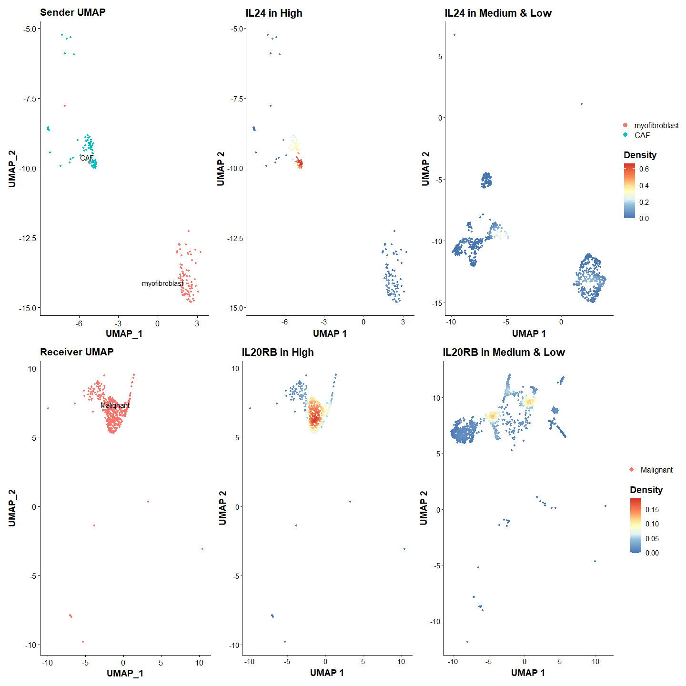<!-- -->

``` r
plot_list$feature
```

<!-- -->
Pooled single-cell and sample-specific single-cell violin plots of
ligand and receptor expression in respectively sender and receiver.

``` r
plot_list2 = make_ligand_receptor_violin_plot(seurat_obj_sender = seurat_obj_sender, seurat_obj_receiver = seurat_obj_receiver, ligand_oi = ligand_oi, receptor_oi = receptor_oi, group_oi = group_oi, group_id = group_id, sender_oi = sender_oi, receiver_oi = receiver_oi, sample_id = sample_id, celltype_id_sender = celltype_id_sender, celltype_id_receiver = celltype_id_receiver, prioritized_tbl_oi = prioritized_tbl_oi)
plot_list2$violin_group
```

<!-- -->

``` r
plot_list2$violin_sample
```

<!-- -->

## Zoom in on specific ligand-target interactions: show their expression in the single-cell data!

Make target gene violin and nebulosa plots: `make_target_violin_plot`
and `make_target_nebulosa_feature_plot`

``` r
receiver_oi = "Malignant"
group_oi = "High"

output$ligand_activities_targets_DEgenes$de_genes_df %>% inner_join(contrast_tbl) %>% filter(p_val <= 0.05) %>% filter(group == group_oi) %>% filter(receiver == receiver_oi) %>% arrange(p_val) %>% top_n(100, logFC)  
## # A tibble: 100 x 7
##    gene    receiver  logFC contrast                 p_val p_adj.glb group
##    <chr>   <chr>     <dbl> <chr>                    <dbl>     <dbl> <chr>
##  1 LTBP1   Malignant  2.6  High-(Medium+Low)/2 0.00000233    0.0185 High 
##  2 MMP10   Malignant  3    High-(Medium+Low)/2 0.0000461     0.137  High 
##  3 LPXN    Malignant  3.36 High-(Medium+Low)/2 0.000386      0.413  High 
##  4 LGALS9C Malignant  2.72 High-(Medium+Low)/2 0.000479      0.413  High 
##  5 CGB8    Malignant  4.35 High-(Medium+Low)/2 0.000501      0.413  High 
##  6 INHBA   Malignant  2.91 High-(Medium+Low)/2 0.000637      0.413  High 
##  7 NEFM    Malignant  6.49 High-(Medium+Low)/2 0.000689      0.413  High 
##  8 TAGLN   Malignant  2.48 High-(Medium+Low)/2 0.000912      0.413  High 
##  9 TGFB2   Malignant  3.19 High-(Medium+Low)/2 0.00111       0.413  High 
## 10 GCNT1   Malignant  3.03 High-(Medium+Low)/2 0.00118       0.413  High 
## # ... with 90 more rows
```

RAB31: interesting gene

``` r
target_oi = "INHBA"

make_target_violin_plot(seurat_obj_receiver = seurat_obj_receiver, target_oi = target_oi, receiver_oi = receiver_oi, group_oi = group_oi, group_id = group_id, sample_id, celltype_id_receiver = celltype_id_receiver, output$prioritization_tables$group_prioritization_tbl)
## $violin_group
```

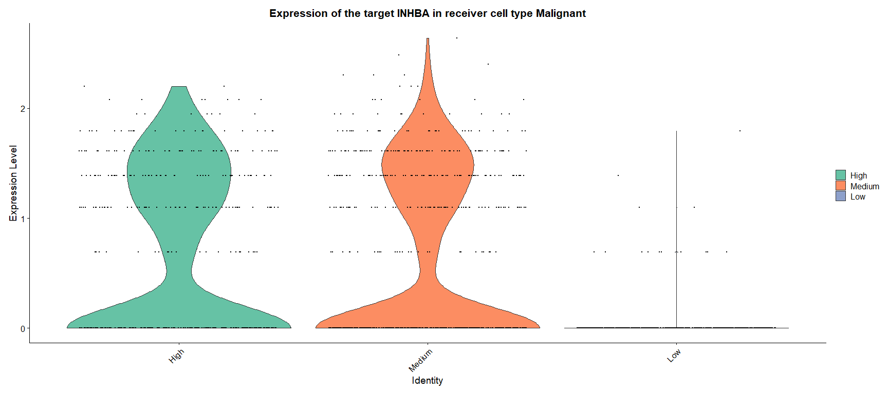<!-- -->

    ## 
    ## $violin_sample

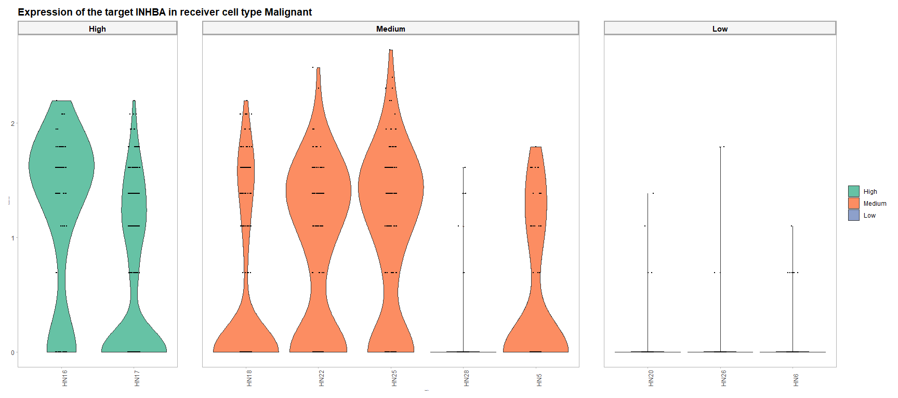<!-- -->

``` r
make_target_nebulosa_feature_plot(seurat_obj_receiver = seurat_obj_receiver, target_oi = target_oi, group_oi = group_oi, group_id = group_id, celltype_id_receiver = celltype_id_receiver, receivers_oi = c("Malignant"), output$prioritization_tables$group_prioritization_tbl) 
## $nebulosa
```

<!-- -->

    ## 
    ## $feature

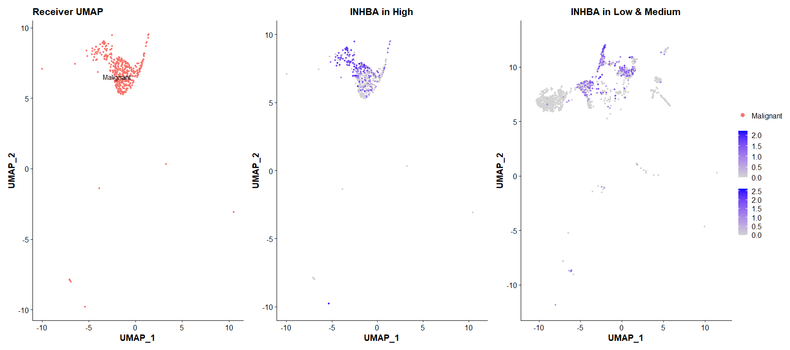<!-- -->

## Make Dotplot for all DE genes/targets

Note: DE here determined based on the parameters used for the
MultiNicheNet analysis (cf above): this means that DE genes are here not
based on the p-value corrected for multiple testing!

``` r
receiver_oi = "Malignant"
group_oi = "High"

targets_oi = output$ligand_activities_targets_DEgenes$de_genes_df %>% inner_join(contrast_tbl) %>% filter(group == group_oi) %>% arrange(p_val)  %>% filter(receiver == receiver_oi) %>% top_n(200, logFC) %>% pull(gene) %>% unique() 
```

``` r
p_target = make_sample_target_plots(receiver_info = output$receiver_info, targets_oi, receiver_oi, output$grouping_tbl)
p_target + ggtitle(paste0("DE genes in ",group_oi, " in celltype ",receiver_oi))
```

<!-- -->

## References
