Multi-Sample Multi-condition Cell-Cell Communication Analysis via
NicheNet: HNSCC application; All-vs-All
================
Robin Browaeys
2021-04-09

<!-- github markdown built using 
rmarkdown::render("vignettes/basic_analysis_steps.Rmd", output_format = "github_document")
-->

In this vignette, you can learn how to perform an all-vs-all
MultiNicheNet analysis. In this vignette, we start from one
SingleCellExperiment object containing cells from both sender and
receiver cell types and from different patients.

A MultiNicheNet analysis can be performed if you have multi-sample,
multi-group single-cell data. MultiNicheNet will look for cell-cell
communication between the cell types in your data for each sample, and
compare the cell-cell communication patterns between the groups of
interest. Therefore, the absolute minimum of meta data you need to have,
are following columns indicating for each cell: the **group**,
**sample** and **cell type**.

As example expression data of interacting cells, we will use data from
Puram et al. to explore intercellular communication in the tumor
microenvironment in head and neck squamous cell carcinoma (HNSCC) \[See
@puram\_single-cell\_2017\]
[](https://doi.org/10.5281/zenodo.5196144).
More specifically, we will look at differential cell-cell communication
patterns between tumors scoring high for a partial
epithelial-mesenschymal transition (p-EMT) program vs low-scoring
tumors.

In this vignette, we will prepare the data and analysis parameters, and
then perform the MultiNicheNet analysis.

The different steps of the MultiNicheNet analysis are the following:

-   0.  Preparation of the analysis: load packages, NicheNet LR network
        & ligand-target matrix, single-cell expression data, and define
        main settings of the MultiNicheNet analysis

-   1.  Extract cell type abundance and expression information from
        receiver and sender cell types, and link this expression
        information for ligands of the sender cell types to the
        corresponding receptors of the receiver cell types

-   2.  Perform genome-wide differential expression analysis of receiver
        and sender cell types to define DE genes between the conditions
        of interest. Based on this analysis, we can define the
        logFC/p-value of ligands in senders and receptors in receivers,
        and define the set of affected target genes in the receiver.

-   3.  Predict NicheNet ligand activities and NicheNet ligand-target
        links based on these differential expression results

-   4.  Use the information collected above to prioritize all
        sender-ligand—receiver-receptor pairs.

-   5.  Optional: unsupervised analysis of
        sender-ligand—receiver-receptor pair expression values per
        sample, to see heterogeneity in cell-cell communication.

In this vignette, we will demonstrate all these steps in detail.

After the MultiNicheNet analysis is done, we will explore the output of
the analysis with different ways of visualization.

# Step 0: Preparation of the analysis: load packages, NicheNet LR network & ligand-target matrix, single-cell expression data

## Step 0.1: Load required packages and NicheNet ligand-receptor network and ligand-target matrix

``` r
library(SingleCellExperiment)
library(dplyr)
library(ggplot2)
library(multinichenetr)
```

``` r
organism = "human"
if(organism == "human"){
  lr_network = readRDS(url("https://zenodo.org/record/5884439/files/lr_network_human_21122021.rds"))
  lr_network = lr_network %>% dplyr::rename(ligand = from, receptor = to) %>% distinct(ligand, receptor) %>% mutate(ligand = make.names(ligand), receptor = make.names(receptor))
  sig_network = readRDS(url("https://zenodo.org/record/5884439/files/signaling_network_human_21122021.rds")) %>% mutate(from = make.names(from), to = make.names(to))
  gr_network = readRDS(url("https://zenodo.org/record/5884439/files/gr_network_human_21122021.rds")) %>% mutate(from = make.names(from), to = make.names(to))
  ligand_target_matrix = readRDS(url("https://zenodo.org/record/5884439/files/ligand_target_matrix_nsga2r_final.rds"))
  colnames(ligand_target_matrix) = colnames(ligand_target_matrix) %>% make.names()
  rownames(ligand_target_matrix) = rownames(ligand_target_matrix) %>% make.names()
  ligand_tf_matrix = readRDS(url("https://zenodo.org/record/5884439/files/ligand_tf_matrix_nsga2r_final.rds"))
  colnames(ligand_tf_matrix) = colnames(ligand_tf_matrix) %>% make.names()
  rownames(ligand_tf_matrix) = rownames(ligand_tf_matrix) %>% make.names()
  weighted_networks = readRDS(url("https://zenodo.org/record/5884439/files/weighted_networks_nsga2r_final.rds"))
  weighted_networks$lr_sig = weighted_networks$lr_sig %>% mutate(from = make.names(from), to = make.names(to))
  weighted_networks$gr = weighted_networks$gr %>% mutate(from = make.names(from), to = make.names(to))
} else if(organism == "mouse"){
  lr_network = readRDS(url("https://zenodo.org/record/5884439/files/lr_network_mouse_21122021.rds"))
  lr_network = lr_network %>% dplyr::rename(ligand = from, receptor = to) %>% distinct(ligand, receptor) %>% mutate(ligand = make.names(ligand), receptor = make.names(receptor))
  sig_network = readRDS(url("https://zenodo.org/record/5884439/files/signaling_network_mouse_21122021.rds")) %>% mutate(from = make.names(from), to = make.names(to))
  gr_network = readRDS(url("https://zenodo.org/record/5884439/files/gr_network_mouse_21122021.rds")) %>% mutate(from = make.names(from), to = make.names(to))
  ligand_target_matrix = readRDS(url("https://zenodo.org/record/5884439/files/ligand_target_matrix_nsga2r_final_mouse.rds"))
  colnames(ligand_target_matrix) = colnames(ligand_target_matrix) %>% make.names()
  rownames(ligand_target_matrix) = rownames(ligand_target_matrix) %>% make.names()
  ligand_tf_matrix = readRDS(url("https://zenodo.org/record/5884439/files/ligand_tf_matrix_nsga2r_final_mouse.rds"))
  colnames(ligand_tf_matrix) = colnames(ligand_tf_matrix) %>% make.names()
  rownames(ligand_tf_matrix) = rownames(ligand_tf_matrix) %>% make.names()
  weighted_networks = readRDS(url("https://zenodo.org/record/5884439/files/weighted_networks_nsga2r_final_mouse.rds"))
  weighted_networks$lr_sig = weighted_networks$lr_sig %>% mutate(from = make.names(from), to = make.names(to))
  weighted_networks$gr = weighted_networks$gr %>% mutate(from = make.names(from), to = make.names(to))
}
```

## Step 0.2: Prepare SingleCellExperiment Objects for Sender and Receiver cells

In this vignette, sender and receiver cell types are in the same
SingleCellExperiment object, which we will load here.

In this case study, we want to study differences in cell-cell
communication patterns between pEMT-high and pEMT-low tumors. The meta
data columns that indicate the pEMT status of tumors are ‘pEMT’ and
‘pEMT\_fine’, cell type is indicated in the ‘celltype’ column, and the
sample is indicated by the ‘tumor’ column.

If you start from a Seurat object, you can convert it easily to a
SingleCellExperiment via
`sce = Seurat::as.SingleCellExperiment(seurat_obj, assay = "RNA")`.

**User adaptation required**

``` r
sce = readRDS(url("https://zenodo.org/record/5196144/files/sce_hnscc.rds"))
sce = alias_to_symbol_SCE(sce, "human") %>% makenames_SCE()
## [1] "there are provided symbols that are not in the alias annotation table: "
##   [1] "LOC100216546"   "FLJ26850"       "LOC338758"      "LOC729603"      "FLJ42709"       "LOC654342"      "FLJ45974"       "LOC100132707"   "FLJ39739"       "PP14571"        "LOC100506172"   "LOC729177"      "LOC100527964"   "LOC100128252"  
##  [15] "LOC400752"      "LOC338799"      "LOC100132735"   "LOC100505474"   "LOC100133161"   "LOC100129046"   "LINC00516"      "LOC729852"      "SPHAR"          "LOC285627"      "LOC100500773"   "FLJ34503"       "FLJ41200"       "KIAA1045"      
##  [29] "LOC399715"      "LOC727915"      "FLJ13197"       "SEPT2"          "LOC100289187"   "LOC100128420"   "LOC493754"      "LOC284837"      "LOC285972"      "LOC100507003"   "MGC39372"       "LOC731779"      "LOC100507537"   "LOC387723"     
##  [43] "LOC401109"      "LOC253039"      "LOC283922"      "FLJ42875"       "LOC100133957"   "LOC100506054"   "LOC644961"      "LOC100506190"   "LOC653160"      "LOC285484"      "TCEB3CL"        "LOC728323"      "LOC339442"      "LOC100130894"  
##  [57] "LOC150776"      "LOC100507299"   "FLJ31813"       "LOC100507140"   "FLJ25363"       "LOC100128568"   "LOC100499405"   "LOC100506136"   "LOC442459"      "LOC283174"      "LOC400654"      "PMS2L2"         "LOC100507373"   "FAM25B"        
##  [71] "LOC643623"      "LOC100506025"   "LOC390660"      "LOC100422737"   "LOC646268"      "LOC100505624"   "LOC285768"      "LOC144742"      "LOC100507433"   "LOC645638"      "FLJ42102"       "LOC100128338"   "LOC100292680"   "LOC646498"     
##  [85] "NPIP"           "LOC90834"       "LOC100507244"   "LOC152217"      "LOC283070"      "LOC730091"      "FLJ46066"       "LOC100507651"   "LOC100130093"   "LOC441461"      "FLJ22184"       "LOC100506233"   "LOC286184"      "LOC644172"     
##  [99] "LOC283332"      "LOC286189"      "LOC284100"      "LOC440518"      "LOC727896"      "LOC100506343"   "DEC1"           "FLJ35024"       "LOC100506388"   "LOC554223"      "LOC340515"      "LOC100505738"   "LOC645249"      "LOC284889"     
## [113] "LOC100132146"   "FLJ40292"       "LOC100131691"   "LINC00439"      "LOC388906"      "LOC643923"      "LOC100498859"   "LOC340017"      "LOC440288"      "LOC440900"      "LOC100129550"   "ZNF664-FAM101A" "LOC642366"      "LOC100272228"  
## [127] "LOC100133331"   "FAM21A"         "LOC100130231"   "HN1L"           "LOC100287879"   "LOC253573"      "LOC100190940"   "LOC100272216"   "PRAMEF3"        "FLJ41278"       "LOC100131096"   "LOC440970"      "SMCR9"          "LOC100302640"  
## [141] "LOC100507584"   "LOC283585"      "MIR3653"        "LOC100288255"   "AGSK1"          "LOC440297"      "LOC100505812"   "AGPAT9"         "FLJ30403"       "OCLM"           "LOC100133612"   "LOC202781"      "LOC100507391"   "LOC100499227"  
## [155] "LINC00086"      "LOC100126784"   "LOC158696"      "LOC150197"      "HIST1H2BC"      "LOC728819"      "LOC647323"      "LOC100271722"   "LOC100288814"   "LOC440563"      "LOC729506"      "LOC440600"      "LOC100506548"   "LOC286190"     
## [169] "LOC100129794"   "LOC100128531"   "LOC100505695"   "LOC100131551"   "LOC100132352"   "LOC100131564"   "FLJ33630"       "LOC650368"      "LOC151484"      "LOC100128264"   "GATM-AS1"       "LOC283143"      "LOC100144604"   "LOC100130700"  
## [183] "LOC100996291"   "FLJ35282"       "LOC100506050"   "PPYR1"          "LOC400027"      "LOC100652772"   "LOC731223"      "LOC100133669"   "LOC100631378"   "LOC100132111"   "LOC284080"      "FLJ44511"       "LOC100134259"   "LOC375295"     
## [197] "LOC284294"      "FLJ45079"       "LOC348761"      "LOC256021"      "LOC100505865"   "GGTA1P"         "APITD1"         "LOC100128714"   "SPANXE"         "LOC728537"      "LOC643648"      "LOC389332"      "LOC255130"      "LOC93432"      
## [211] "LOC285740"      "LOC100506241"   "LOC152225"      "LOC642852"      "LOC728558"      "LOC256880"      "LOC440356"      "LOC389043"      "LOC399744"      "C15orf38"       "LOC157381"      "LOC400680"      "LOC100131234"   "CSRP2BP"       
## [225] "LOC100288911"   "LOC100286793"   "LOC154092"      "LOC158376"      "LOC284395"      "LOC100287225"   "FLJ46361"       "LOC100506585"   "LOC100506804"   "LOC100287314"   "LOC100507577"   "LOC146880"      "FLJ44313"       "LOC100507091"  
## [239] "LINC00087"      "MPP6"           "LOC79015"       "LOC101055625"   "LOC728752"      "LOC100506421"   "LOC400084"      "LOC100506082"   "LOC100653515"   "LOC285419"      "CCRL1"          "LOC286367"      "LOC100144602"   "LOC152578"     
## [253] "FLJ43663"       "LOC81691"       "LOC151009"      "MGC45922"       "QARS"           "LOC284276"      "LOC100288122"   "LOC646278"      "LOC642236"      "LOC151475"      "WASH1"          "LOC283692"      "LOC284260"      "LOC100996455"  
## [267] "LOC285629"      "LOC100133985"   "FLJ39639"       "MLL4"           "LOC148413"      "LOC388152"      "LOC387895"      "LOC90499"       "LOC339505"      "LOC440434"      "LOC100505875"   "LOC730102"      "LOC100130451"   "LOC100129722"  
## [281] "LOC729176"      "LOC400043"      "LOC728342"      "LOC643723"      "LOC654433"      "HIST1H2BG"      "TCEB3C"         "FLJ11235"       "LOC100131047"   "LOC643770"      "LOC100505648"   "LOC728730"      "LOC400684"      "LOC100506368"  
## [295] "MARS"           "LOC100130950"   "LOC441601"      "HIST1H2BF"      "LOC283914"      "LOC286370"      "LOC649330"      "LOC400620"      "CYP2B7P1"       "LOC349196"      "LOC150381"      "MGC21881"       "ADC"            "LOC100287534"  
## [309] "MGC16121"       "FLJ35390"       "FLJ39051"       "FLJ33360"       "LOC100506810"   "LOC100129083"   "LOC100288432"   "LOC400958"      "LOC401164"      "LOC100130776"   "LOC100129518"   "LOC729987"      "LOC727982"      "LOC150622"     
## [323] "MGC34034"       "LOC100288974"   "LOC100287042"   "LOC255512"      "LOC388692"      "LOC100132247"   "CXorf21"        "C7orf55"        "LOC101101776"   "LOC100506195"   "LOC282997"      "LOC283867"      "LOC100289341"   "LOC339524"     
## [337] "LOC100507206"   "FLJ38109"       "LOC100505718"   "LOC100289019"   "LOC100288181"   "LOC550643"      "LOC401242"      "LOC284454"      "LOC100127888"   "LOC100507300"   "LOC339240"      "LOC641367"      "LOC100289509"   "LOC254559"     
## [351] "LOC100130581"   "LOC284551"      "LOC100507117"   "LOC100130899"   "LOC338817"      "LOC100499484"   "LOC728606"      "FLJ37505"       "LOC389791"      "LOC100144603"   "LOR"            "LOC100506895"   "LOC729444"      "LOC646168"     
## [365] "LOC727924"      "LOC100505933"   "LOC400657"      "LOC730227"      "LOC284648"      "LOC144486"      "LOC100287177"   "LOC100130954"   "LOC100128822"   "LOC100862671"   "LOC100131655"   "LOC644838"      "LOC90784"       "LOC400794"     
## [379] "FLJ46257"       "LOC286442"      "LOC100505702"   "LOC100129345"   "LOC613037"      "LOC100506134"   "LOC101054525"   "LOC100289092"   "LOC645513"      "LOC100288079"   "LOC401397"      "MIR4461"        "LOC100996307"   "LOC100130557"  
## [393] "LOC100507463"   "LOC96610"       "LOC649395"      "LOC286238"      "LOC100128682"   "SARS"           "FLJ14186"       "LOC100505666"   "LOC401052"      "LOC100129858"   "DKFZp566F0947"  "LOC100506083"   "LOC100505761"   "LOC285540"     
## [407] "LOC100288748"   "LOC728175"      "LOC100128750"   "LOC100499183"   "LOC254100"      "LOC100130476"   "HN1"            "LOC100505806"   "LOC100505776"   "LOC648691"      "FLJ12334"       "LOC149134"      "LOC647859"      "LOC440905"     
## [421] "LOC653786"      "LOC100506795"   "DUSP27"         "LOC100505622"   "C11orf48"       "LOC283177"      "LOC439994"      "LOC100129726"   "STRA13"         "LOC285074"      "LOC145837"      "LOC286186"      "LOC401980"      "LOC100505676"  
## [435] "LOC100132273"   "LOC100505839"   "LOC400548"      "MGC16142"       "LOC339894"      "LOC100507173"   "LOC646719"      "LOC727849"      "LOC541471"      "LOC728377"      "LOC646329"      "LOC100131060"   "LOC100506599"   "LOC100129361"  
## [449] "LOC388849"      "LOC100128787"   "LOC285441"      "LOC286135"      "LOC440461"      "LOC100130417"   "LOC100506451"   "LOC100287632"   "LOC113230"      "LOC100289650"   "LOC100129027"   "LOC100506385"   "LOC339874"      "LOC494141"     
## [463] "LOC643669"      "LOC255654"      "LOC100128239"   "LOC401074"      "LOC100505633"   "LOC100507032"   "LOC100216545"   "LOC100873065"   "SHFM1"          "LOC643837"      "LOC100505658"   "LOC283693"      "LOC100131089"   "LOC339535"     
## [477] "LOC100507387"   "LOC400891"      "SMA4"           "LOC400685"      "LOC284757"      "TRAPPC2P1"      "LOC284865"      "LOC221122"      "LOC100188947"   "LOC100289137"   "GARS"           "LOC440028"      "FLJ34208"       "MGC45800"      
## [491] "FLJ16171"       "LOC440704"      "LOC440243"      "LOC100505679"   "LOC100129055"   "LOC399753"      "M1"             "LOC402160"      "LOC339807"      "LOC100129480"   "LOC285501"      "LOC100216479"   "LOC100507066"   "FLJ14107"      
## [505] "LOC644649"      "LOC653501"      "HIST1H2BE"      "LOC389033"      "LOC255167"      "LOC91948"       "LOC100294362"   "FBXO22-AS1"     "LOC440894"      "FLJ45340"       "LOC728431"      "LOC100507118"   "LOC100652770"   "LOC731424"     
## [519] "DKFZP686I15217" "LOC339568"      "PRAMEF16"       "LOC100507424"   "LOC729013"      "LOC92249"       "LOC100652909"   "FLJ26245"       "LOC100130301"   "LOC100132354"   "LOC100507377"   "CT64"           "MGC2752"        "LOC285696"     
## [533] "MLL2"           "C2orf47"        "APOBEC3A-B"     "LOC100131434"   "RP1-177G6.2"    "LOC100506801"   "MUM1"           "LOC100505876"   "LOC441009"      "LOC339788"      "LOC100505495"   "LOC399815"      "LOC283663"      "LOC100506013"  
## [547] "LOC729739"      "LOC100129250"   "LOC158572"      "LOC100506746"   "LOC440040"      "FLJ21408"       "LOC338651"      "TRIM49D2P"      "LOC100288778"   "LOC100130855"   "LOC115110"      "NAT6"           "LOC283761"      "LOC100506844"  
## [561] "LOC494127"      "LOC100506035"   "LOC400927"      "LOC100130000"   "FLJ30838"       "LOC642423"      "LOC401321"      "LOC100630918"   "LOC441454"      "LOC344887"      "LOC645166"      "FLJ39080"       "LOC201651"      "LOC100271832"  
## [575] "LOC100130539"   "LOC643529"      "FLJ37035"       "LOC729020"      "LOC284385"      "LOC285084"      "FLJ45445"       "LOC100507600"   "LOC100131094"   "LOC100505989"   "LOC100128881"   "LOC100134229"   "LOC100131067"   "MST4"          
## [589] "LOC100652739"   "FLJ27352"       "LOC494558"      "LOC100131825"   "LOC283587"      "LOC100505768"   "LOC100505795"   "LOC285033"      "LOC100132832"   "LOC254128"      "FLJ16341"       "LOC152742"      "LOC729970"      "LOC283688"     
## [603] "LOC100506469"   "LOC642426"      "LOC100128176"   "LOC100507489"   "LOC440925"      "LOC100507462"   "LOC286467"      "LOC100271836"   "MGC57346"       "LOC100505817"   "LOC100132891"   "LOC100129961"   "LOC344595"      "LOC400456"     
## [617] "LOC63930"       "LOC388796"      "LOC729121"      "CGB"            "HIST1H2BI"      "LOC100133445"   "TAZ"            "LOC100130880"   "LOC100130015"   "LOC100505783"   "LOC100009676"   "LOC340074"      "LOC100130705"   "FLJ27354"      
## [631] "LOC100506874"   "LOC731275"      "LOC100506305"   "LOC400655"      "LOC145820"      "LOC440173"      "LOC389634"      "LOC728875"      "LOC100507410"   "LOC650293"      "LOC643355"      "LOC339622"      "LOC728407"      "LOC100505659"  
## [645] "LOC100506314"   "DKFZp434J0226"  "LOC100506668"   "NOTCH2NL"       "LOC388942"      "LOC100508120"   "MGC72080"       "LOC100128573"   "CD97"           "LOC729041"      "LOC340113"      "LOC100507254"   "LOC284023"      "LOC146513"     
## [659] "LOC100506713"   "LOC730441"      "LOC643542"      "LOC644248"      "LOC100288846"   "LOC100128675"   "FLJ10038"       "FOXD4L2"        "LOC100129924"   "FLJ43879"       "LOC100507217"   "DBC1"           "LOC100507501"   "FLJ46446"      
## [673] "LIMS3L"         "LOC595101"      "FLJ23867"       "EFTUD1"         "LOC100506963"   "LOC100507632"   "FLJ31485"       "LOC100506710"   "LOC116437"      "LOC100129213"   "LOC401010"      "LOC284751"      "FLJ43681"       "CXorf22"       
## [687] "LOC100505835"   "LOC285758"      "LOC100652791"   "LOC643733"      "LOC100505687"   "LOC100506394"   "FLJ42289"       "LOC619207"      "FLJ41350"       "LOC148145"      "SLC35E2"        "FLJ31306"       "LOC401320"      "LOC550112"     
## [701] "LOC100507266"   "LOC100132831"   "LOC100128505"   "LOC151171"      "LOC728228"      "LOC100506655"   "LOC100271702"   "LOC643401"      "LOC729059"      "LOC100128054"   "C10orf2"        "LOC440335"      "TCEB3CL2"       "LOC146481"     
## [715] "LOC389458"      "CRIPAK"         "LOC100131320"   "LOC100506776"   "LOC728463"      "LOC100506834"   "LOC553103"      "FLJ40852"       "LOC100506060"   "LOC729950"      "LOC147093"      "LOC643387"      "LOC340107"      "LOC100129269"  
## [729] "CCBP2"          "LOC285692"      "LOC727677"      "LOC100130264"   "LOC100131726"   "LOC339529"      "LOC200726"      "LOC151174"      "LOC284688"      "FLJ35946"       "LOC440354"      "MGC27345"       "LOC100288842"   "C4B-2"         
## [743] "LOC399829"      "LOC100507557"   "FLJ33581"       "LOC100131347"   "CT45A4"         "LOC100506085"   "LOC100270804"   "LOC728218"      "FLJ31662"       "B3GNT1"         "LOC100130275"   "ZHX1-C8ORF76"   "LOC100288198"   "LOC645212"     
## [757] "LOC100129216"   "UNQ6494"        "LOC100616530"   "LOC284632"      "LOC284578"      "FLJ35424"       "LOC100506714"   "LOC388499"      "LOC100127983"   "FLJ36777"       "KIAA1804"       "LOC728190"      "C11orf31"       "LOC401134"     
## [771] "LOC148709"      "LOC284801"      "FLJ41941"       "LOC100093631"  
## [1] "they are added to the alias annotation table, so they don't get lost"
## [1] "following are the official gene symbols of input aliases: "
##              symbol          alias
## 1             AARS1           AARS
## 2        ABHD11-AS1      LINC00035
## 3           ABHD17A       FAM108A1
## 4           ABHD17B       FAM108B1
## 5           ABHD17C       FAM108C1
## 6            ABHD18        C4orf29
## 7           ABITRAM        FAM206A
## 8          ABRAXAS1        FAM175A
## 9          ABRAXAS2        FAM175B
## 10            ACKR1           DARC
## 11            ACKR3          CXCR7
## 12             ACP3           ACPP
## 13             ACP4           ACPT
## 14             ACP7           PAPL
## 15            ACSM6      C10orf129
## 16         ACTN1-DT      ACTN1-AS1
## 17             ADA2          CECR1
## 18           ADGRA2         GPR124
## 19           ADGRA3         GPR125
## 20           ADGRB1           BAI1
## 21           ADGRB2           BAI2
## 22           ADGRB3           BAI3
## 23           ADGRD1         GPR133
## 24           ADGRD2         GPR144
## 25           ADGRE1           EMR1
## 26           ADGRE2           EMR2
## 27           ADGRE3           EMR3
## 28          ADGRE4P          EMR4P
## 29           ADGRF1         GPR110
## 30           ADGRF2         GPR111
## 31           ADGRF3         GPR113
## 32           ADGRF4         GPR115
## 33           ADGRF5         GPR116
## 34           ADGRG1          GPR56
## 35           ADGRG2          GPR64
## 36           ADGRG3          GPR97
## 37           ADGRG4         GPR112
## 38           ADGRG5         GPR114
## 39           ADGRG6         GPR126
## 40           ADGRG7         GPR128
## 41           ADGRL1          LPHN1
## 42           ADGRL2          LPHN2
## 43           ADGRL3          LPHN3
## 44           ADGRL4          ELTD1
## 45           ADGRV1          GPR98
## 46            ADPRS        ADPRHL2
## 47            ADSS1         ADSSL1
## 48            ADSS2           ADSS
## 49             AFDN          MLLT4
## 50          AFDN-DT      MLLT4-AS1
## 51            AFG1L          LACE1
## 52            AGAP4          AGAP8
## 53           AGAP7P          AGAP7
## 54           AHSA2P          AHSA2
## 55             AJM1       C9orf172
## 56              AK9           AKD1
## 57          AKR1C8P        AKR1CL1
## 58           ALKAL1        FAM150A
## 59           ALKAL2        FAM150B
## 60          ALMS1P1         ALMS1P
## 61             ALPG         ALPPL2
## 62          ANGPTL8       C19orf80
## 63       ANKRD20A2P      ANKRD20A2
## 64       ANKRD20A3P      ANKRD20A3
## 65       ANKRD20A4P      ANKRD20A4
## 66        ANKRD40CL      LINC00483
## 67            ANOS1           KAL1
## 68           ANTKMT        FAM173A
## 69          ANXA8L1        ANXA8L2
## 70             AOC1           ABP1
## 71            AOC4P           AOC4
## 72            AOPEP         C9orf3
## 73       APCDD1L-DT    APCDD1L-AS1
## 74             APTR     RSBN1L-AS1
## 75            AREL1       KIAA0317
## 76          ARFGEF3       KIAA1244
## 77         ARHGAP42        TMEM133
## 78         ARHGAP45          HMHA1
## 79            ARMH1       C1orf228
## 80            ARMH3       C10orf76
## 81            ARMH4       C14orf37
## 82            ARMT1       C6orf211
## 83      ARPIN-AP3S2 C15orf38-AP3S2
## 84       ARRDC1-AS1        C9orf37
## 85             ARSL           ARSE
## 86           ATG101       C12orf44
## 87       ATP1A1-AS1       ATP1A1OS
## 88            ATP23       XRCC6BP1
## 89          ATP5F1A         ATP5A1
## 90          ATP5F1B          ATP5B
## 91          ATP5F1C         ATP5C1
## 92          ATP5F1D          ATP5D
## 93          ATP5F1E          ATP5E
## 94        ATP5F1EP2        ATP5EP2
## 95          ATP5IF1         ATPIF1
## 96          ATP5MC1         ATP5G1
## 97          ATP5MC2         ATP5G2
## 98          ATP5MC3         ATP5G3
## 99           ATP5ME          ATP5I
## 100          ATP5MF         ATP5J2
## 101    ATP5MF-PTCD1   ATP5J2-PTCD1
## 102          ATP5MG          ATP5L
## 103         ATP5MGL         ATP5L2
## 104          ATP5MJ        C14orf2
## 105          ATP5MK          USMG5
## 106          ATP5PB         ATP5F1
## 107          ATP5PD          ATP5H
## 108          ATP5PF          ATP5J
## 109          ATP5PO          ATP5O
## 110        ATPSCKMT        FAM173B
## 111         AURKAP1       AURKAPS1
## 112     B3GALT5-AS1       C21orf88
## 113          B3GLCT        B3GALTL
## 114       BAALC-AS2        C8orf56
## 115          BABAM2            BRE
## 116      BABAM2-AS1        BRE-AS1
## 117       BAIAP2-DT     BAIAP2-AS1
## 118            BBLN        C9orf16
## 119           BBOF1        CCDC176
## 120          BCLAF3        CXorf23
## 121            BCO1          BCMO1
## 122            BEX3        NGFRAP1
## 123          BICDL1         CCDC64
## 124          BICDL2        CCDC64B
## 125           BICRA        GLTSCR1
## 126          BICRAL       GLTSCR1L
## 127          BMERB1       C16orf45
## 128          BMS1P1         BMS1P5
## 129          BMS1P2         BMS1P6
## 130            BMT2        C7orf60
## 131          BORCS5       LOH12CR1
## 132          BORCS6       C17orf59
## 133          BORCS7       C10orf32
## 134     BORCS7-ASMT C10orf32-AS3MT
## 135          BORCS8        MEF2BNB
## 136    BORCS8-MEF2B  MEF2BNB-MEF2B
## 137           BPNT2         IMPAD1
## 138          BRD3OS      LINC00094
## 139          BRINP3          FAM5C
## 140           BRME1       C19orf57
## 141       BRWD1-AS2      BRWD1-IT2
## 142          BSN-DT        BSN-AS2
## 143           BTBD8       KIAA1107
## 144           BUD23        WBSCR22
## 145        C1QTNF12        FAM132A
## 146       C20orf204      LINC00176
## 147    C21orf62-AS1       C21orf49
## 148           C2CD6       ALS2CR11
## 149        CABCOCO1      C10orf107
## 150          CALHM5         FAM26E
## 151          CALHM6         FAM26F
## 152          CAPN15           SOLH
## 153          CARD19        C9orf89
## 154            CARF        ALS2CR8
## 155         CARMIL1        LRRC16A
## 156         CARMIL2          RLTPR
## 157         CARMIL3        LRRC16B
## 158           CARMN       MIR143HG
## 159         CARNMT1        C9orf41
## 160           CARS1           CARS
## 161          CASC15      LINC00340
## 162         CASTOR1         GATSL3
## 163         CASTOR2         GATSL1
## 164         CASTOR2         GATSL2
## 165         CASTOR3           GATS
## 166           CATIP        C2orf62
## 167        CATSPERE       C1orf101
## 168        CATSPERZ          TEX40
## 169          CAVIN1           PTRF
## 170          CAVIN2           SDPR
## 171          CAVIN3        PRKCDBP
## 172          CAVIN4           MURC
## 173           CBARP       C19orf26
## 174           CBLL2         ZNF645
## 175            CBY2          SPERT
## 176          CC2D2B      C10orf131
## 177           CCAR2       KIAA1967
## 178       CCDC144CP       CCDC144C
## 179         CCDC163       CCDC163P
## 180         CCDC180       C9orf174
## 181         CCDC181       C1orf114
## 182         CCDC183       KIAA1984
## 183     CCDC183-AS1   KIAA1984-AS1
## 184         CCDC184       C12orf68
## 185         CCDC185        C1orf65
## 186         CCDC186      C10orf118
## 187         CCDC189       C16orf93
## 188         CCDC190       C1orf110
## 189         CCDC191       KIAA1407
## 190         CCDC196      LINC00238
## 191         CCDC197      LINC00521
## 192         CCDC198      C14orf105
## 193         CCDC200      LINC00854
## 194          CCDC32       C15orf57
## 195           CCDC7       C10orf68
## 196          CCDC9B       C15orf52
## 197            CCN1          CYR61
## 198            CCN2           CTGF
## 199            CCN3            NOV
## 200            CCN4          WISP1
## 201            CCN5          WISP2
## 202            CCN6          WISP3
## 203            CCNP          CNTD2
## 204            CCNQ         FAM58A
## 205     CD300LD-AS1       C17orf77
## 206            CD5L           AIM1
## 207           CDIN1       C15orf41
## 208       CDKN2A-DT        C9orf53
## 209        CEBPA-DT      CEBPA-AS1
## 210           CEMIP       KIAA1199
## 211          CEMIP2          TMEM2
## 212         CENATAC         CCDC84
## 213           CENPC         CENPC1
## 214      CENPS-CORT    APITD1-CORT
## 215           CENPU         MLF1IP
## 216         CENPVL1        CENPVP1
## 217         CENPVL2        CENPVP2
## 218          CEP126       KIAA1377
## 219          CEP162       KIAA1009
## 220           CEP20          FOPNL
## 221          CEP295       KIAA1731
## 222           CEP43        FGFR1OP
## 223           CEP83         CCDC41
## 224           CERT1       COL4A3BP
## 225         CFAP100         CCDC37
## 226         CFAP126       C1orf192
## 227         CFAP157       C9orf117
## 228         CFAP161       C15orf26
## 229          CFAP20       C16orf80
## 230         CFAP206       C6orf165
## 231        CFAP20DC        C3orf67
## 232         CFAP221          PCDP1
## 233         CFAP251          WDR66
## 234         CFAP298       C21orf59
## 235         CFAP300       C11orf70
## 236          CFAP36        CCDC104
## 237         CFAP410        C21orf2
## 238          CFAP43          WDR96
## 239          CFAP44          WDR52
## 240      CFAP44-AS1      WDR52-AS1
## 241          CFAP45         CCDC19
## 242          CFAP46          TTC40
## 243          CFAP47          CHDC2
## 244          CFAP47        CXorf30
## 245          CFAP52          WDR16
## 246          CFAP53         CCDC11
## 247          CFAP57          WDR65
## 248          CFAP58        CCDC147
## 249          CFAP61       C20orf26
## 250          CFAP65        CCDC108
## 251          CFAP69        C7orf63
## 252          CFAP70          TTC18
## 253          CFAP73        CCDC42B
## 254          CFAP74       KIAA1751
## 255          CFAP77       C9orf171
## 256          CFAP91         MAATS1
## 257          CFAP92       KIAA1257
## 258          CFAP97       KIAA1430
## 259        CFAP97D1      C17orf105
## 260            CGAS         MB21D1
## 261          CIAO2A         FAM96A
## 262          CIAO2B         FAM96B
## 263           CIAO3          NARFL
## 264           CIART        C1orf51
## 265          CIBAR1        FAM92A1
## 266        CIBAR1P2      FAM92A1P2
## 267          CIBAR2         FAM92B
## 268         CIDECP1         CIDECP
## 269           CILK1            ICK
## 270           CIP2A       KIAA1524
## 271            CIPC       KIAA1737
## 272           CLBA1       C14orf79
## 273          CLK2P1          CLK2P
## 274           CLTRN         TMEM27
## 275           CMTR1         FTSJD2
## 276           CMTR2         FTSJD1
## 277           CNIH1           CNIH
## 278            CNMD          LECT1
## 279           CNOT9          RQCD1
## 280            COA7         SELRC1
## 281            COA8         APOPT1
## 282          COLCA1       C11orf92
## 283          COLCA2       C11orf93
## 284        COLGALT1        GLT25D1
## 285        COLGALT2        GLT25D2
## 286            COP1          RFWD2
## 287           COPS9         MYEOV2
## 288           COQ8A          ADCK3
## 289           COQ8B          ADCK4
## 290         CPLANE1        C5orf42
## 291         CPLANE2           RSG1
## 292            CPTP         GLTPD1
## 293           CRACD       KIAA1211
## 294          CRACDL      KIAA1211L
## 295         CRACR2A        EFCAB4B
## 296         CRACR2B        EFCAB4A
## 297          CRAMP1        CRAMP1L
## 298           CRPPA           ISPD
## 299          CRYBG2          AIM1L
## 300           CSKMT        METTL12
## 301        CSTF3-DT      CSTF3-AS1
## 302         CTAGE15       CTAGE15P
## 303          CTAGE6        CTAGE6P
## 304        CTBP1-DT      CTBP1-AS1
## 305            CTSL          CTSL1
## 306          CTSLP2        CTSL1P2
## 307          CTSLP8        CTSL1P8
## 308            CTSV          CTSL2
## 309           CXCL8            IL8
## 310        CYB561A3        CYBASC3
## 311           CYBC1       C17orf62
## 312          CYP2D7       CYP2D7P1
## 313 CYP3A7-CYP3A51P CYP3A7-CYP3AP1
## 314        CYP4F29P       C21orf15
## 315           CYREN        C7orf49
## 316           CYRIA         FAM49A
## 317           CYRIB         FAM49B
## 318          CYSRT1       C9orf169
## 319           CYTOR      LINC00152
## 320            CZIB       C1orf123
## 321           DARS1           DARS
## 322           DCAF1          VPRBP
## 323          DCANP1        C5orf20
## 324           DCDC1          DCDC5
## 325           DDIAS       C11orf82
## 326        DEFB109B     DEFB109P1B
## 327        DEFB131A        DEFB131
## 328           DELE1       KIAA0141
## 329         DENND10         FAM45A
## 330       DENND10P1         FAM45B
## 331         DENND11       KIAA1147
## 332         DENND2B            ST5
## 333           DEPP1       C10orf10
## 334           DEUP1         CCDC67
## 335           DGCR5         DGCR10
## 336           DGCR5          DGCR9
## 337          DGLUCY      C14orf159
## 338           DHFR2         DHFRL1
## 339       DIP2C-AS1          PRR26
## 340          DIPK1A         FAM69A
## 341          DIPK1B         FAM69B
## 342          DIPK1C         FAM69C
## 343          DIPK2A        C3orf58
## 344          DIPK2B        CXorf36
## 345           DISP3         PTCHD2
## 346          DLGAP2     ERICH1-AS1
## 347           DMAC1       C9orf123
## 348           DMAC2         ATP5SL
## 349          DMAC2L          ATP5S
## 350            DMTN          EPB49
## 351         DNAAF10          WDR92
## 352         DNAAF11          LRRC6
## 353          DNAAF4         DYX1C1
## 354    DNAAF4-CCPG1   DYX1C1-CCPG1
## 355          DNAAF5         HEATR2
## 356          DNAAF6         PIH1D3
## 357          DNAAF8       C16orf71
## 358          DNAAF9      C20orf194
## 359           DNAI3          WDR63
## 360           DNAI4          WDR78
## 361           DNAI7          CASC1
## 362       DOCK8-AS1        C9orf66
## 363           DOP1A         DOPEY1
## 364           DOP1B         DOPEY2
## 365            DPH6         ATPBD4
## 366         DPH6-DT     ATPBD4-AS1
## 367            DPH7          WDR85
## 368            DRC1        CCDC164
## 369            DRC3         LRRC48
## 370            DRC7        CCDC135
## 371          DRICH1       C22orf43
## 372            DUS2          DUS2L
## 373          DUX4L8           DUX2
## 374             DXO          DOM3Z
## 375         DYNC2I1          WDR60
## 376         DYNC2I2          WDR34
## 377          DYNLT2          TCTE3
## 378         DYNLT2B       TCTEX1D2
## 379          DYNLT4       TCTEX1D4
## 380          DYNLT5       TCTEX1D1
## 381           ECPAS       KIAA0368
## 382           ECRG4        C2orf40
## 383           EDRF1      C10orf137
## 384       EEF1AKMT1         N6AMT2
## 385       EEF1AKMT2        METTL10
## 386       EEF1AKMT3       METTL21B
## 387  EEF1E1-BLOC1S5   EEF1E1-MUTED
## 388         EEF2KMT         FAM86A
## 389          EFL1P1       EFTUD1P1
## 390           EIPR1          TSSC1
## 391         ELAPOR1       KIAA1324
## 392         ELAPOR2      KIAA1324L
## 393            ELOA          TCEB3
## 394           ELOA2         TCEB3B
## 395            ELOB          TCEB2
## 396            ELOC          TCEB1
## 397            ELP1         IKBKAP
## 398            EMSY       C11orf30
## 399           ENTR1        SDCCAG3
## 400           EOLA1       CXorf40A
## 401           EOLA2       CXorf40B
## 402         EP400P1        EP400NL
## 403            EPOP       C17orf96
## 404           EPRS1           EPRS
## 405           ERBIN        ERBB2IP
## 406           ERG28        C14orf1
## 407          ERICH3       C1orf173
## 408          ERICH4       C19orf69
## 409          ERICH5        C8orf47
## 410          ERICH6        FAM194A
## 411          ERMARD        C6orf70
## 412           ERO1A          ERO1L
## 413           ERO1B         ERO1LB
## 414            ESS2         DGCR14
## 415         ETFBKMT        METTL20
## 416          ETFRF1          LYRM5
## 417          EWSAT1      LINC00277
## 418       EXOC3-AS1        C5orf55
## 419         FAAP100       C17orf70
## 420          FAAP20        C1orf86
## 421          FAAP24       C19orf40
## 422           FALEC      LINC00568
## 423         FAM106C       FAM106CP
## 424        FAM153CP        FAM153C
## 425         FAM166C        C2orf70
## 426     FAM167A-AS1        C8orf12
## 427         FAM174C       C19orf24
## 428        FAM183BP        FAM183B
## 429        FAM205BP        FAM205B
## 430         FAM234A          ITFG3
## 431         FAM234B       KIAA1467
## 432         FAM238A      LINC00264
## 433         FAM238B    LINC00202-2
## 434         FAM238C    LINC00202-1
## 435         FAM241A        C4orf32
## 436         FAM241B       C10orf35
## 437          FAM27C         FAM27A
## 438         FAM27E5         FAM27L
## 439          FAM30A       KIAA0125
## 440         FAM74A4        FAM74A2
## 441        FAM86C1P        FAM86C1
## 442          FAXDC2         C5orf4
## 443            FBH1         FBXO18
## 444         FBXL21P         FBXL21
## 445         FCGR1CP         FCGR1C
## 446            FCMR          FAIM3
## 447            FCSK            FUK
## 448          FDPSP2        FDPSL2A
## 449            FDX2          FDX1L
## 450          FGF7P3         KGFLP2
## 451          FGF7P6         KGFLP1
## 452          FHIP1A       FAM160A1
## 453          FHIP1B       FAM160A2
## 454          FHIP2A       FAM160B1
## 455          FHIP2B       FAM160B2
## 456         FKBP9P1         FKBP9L
## 457          FLACC1       ALS2CR12
## 458       FLVCR1-DT     FLVCR1-AS1
## 459     FMC1-LUC7L2 C7orf55-LUC7L2
## 460          FNDC10       C1orf233
## 461          FNDC11      C20orf195
## 462         FOXL2NB        C3orf72
## 463          FRG1BP          FRG1B
## 464         FRMPD2B       FRMPD2P1
## 465         FTCDNL1           FONG
## 466            FYB1            FYB
## 467            FYB2       C1orf168
## 468           G6PC1           G6PC
## 469         GALNT17        WBSCR17
## 470          GAREM1          GAREM
## 471          GAREM2         GAREML
## 472          GARRE1       KIAA0355
## 473        GAS8-AS1        C16orf3
## 474          GASK1A        FAM198A
## 475          GASK1B        FAM198B
## 476            GATB         PET112
## 477           GATD1          PDDC1
## 478          GATD3A       C21orf33
## 479            GCN1         GCN1L1
## 480            GCNA           ACRC
## 481            GET1            WRB
## 482            GET3          ASNA1
## 483            GFUS          TSTA3
## 484            GLMP        C1orf85
## 485         GLUD1P2        GLUD1P7
## 486           GMCL2        GMCL1P1
## 487       GNAO1-AS1   DKFZP434H168
## 488       GOLGA6L5P       GOLGA6L5
## 489        GOLGA6L7      GOLGA6L7P
## 490        GOLGA8IP        GOLGA8I
## 491           GOLM2          CASC4
## 492            GON7      C14orf142
## 493         GPALPP1       KIAA1704
## 494           GPAT4         AGPAT6
## 495           GPER1           GPER
## 496          GPR89B         GPR89C
## 497         GRAMD2A         GRAMD2
## 498         GRAMD2B         GRAMD3
## 499         GRASLND    RNF144A-AS1
## 500           GREP1      LINC00514
##  [ reached 'max' / getOption("max.print") -- omitted 921 rows ]

scater::plotReducedDim(sce, dimred = "UMAP", colour_by = "celltype")
```

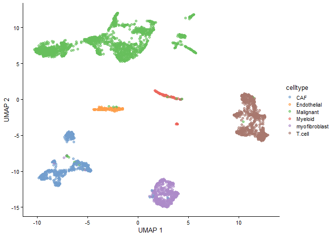<!-- -->

``` r
scater::plotReducedDim(sce, dimred = "UMAP", colour_by = "tumor")
```

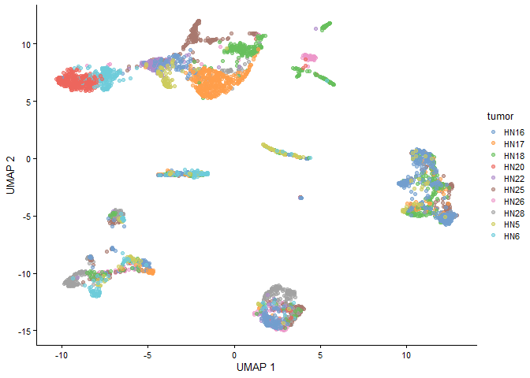<!-- -->

``` r
scater::plotReducedDim(sce, dimred = "UMAP", colour_by = "pEMT")
```

<!-- -->

``` r
scater::plotReducedDim(sce, dimred = "UMAP", colour_by = "pEMT_fine")
```

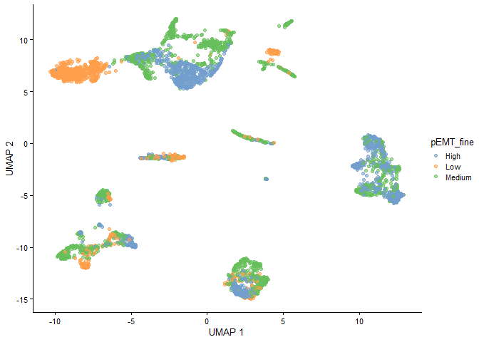<!-- -->
We will now also check the number of cells per cell type condition
combination, and the number of patients per condition.

**User adaptation required**

``` r
table(SummarizedExperiment::colData(sce)$celltype, SummarizedExperiment::colData(sce)$tumor) # cell types vs samples
##                
##                 HN16 HN17 HN18 HN20 HN22 HN25 HN26 HN28 HN5 HN6
##   CAF             47   37   36    3    9   73   19  157  37  82
##   Endothelial     43   17   18    1    1    1    0   14  11  52
##   Malignant       82  353  263  331  123  153   61   49  70 157
##   Myeloid         15    2    7    0    1    8    1    1  58   6
##   myofibroblast   84    6   14   10   45   88   45  140   5   6
##   T.cell         300   61  207    0    0   93    3    0  28   0
table(SummarizedExperiment::colData(sce)$celltype, SummarizedExperiment::colData(sce)$pEMT) # cell types vs conditions
##                
##                 High  Low
##   CAF            396  104
##   Endothelial    105   53
##   Malignant     1093  549
##   Myeloid         92    7
##   myofibroblast  382   61
##   T.cell         689    3
table(SummarizedExperiment::colData(sce)$tumor, SummarizedExperiment::colData(sce)$pEMT) # samples vs conditions
##       
##        High Low
##   HN16  571   0
##   HN17  476   0
##   HN18  545   0
##   HN20    0 345
##   HN22  179   0
##   HN25  416   0
##   HN26    0 129
##   HN28  361   0
##   HN5   209   0
##   HN6     0 303
```

As you can see, some Celltype-Sample combinations have 0 cells. It is
possible that during DE analysis, some cell types will be removed from
the analysis if there is not enough information to do a DE analysis.
(More info later)

## Step 0.3: Prepare settings of the MultiNicheNet cell-cell communication analysis

### Define in which metadata columns we can find the **group**, **sample** and **cell type** IDs

For the group\_id, we now choose for the ‘pEMT’ column instead of
‘pEMT\_fine’, which we will select in a subsequent analysis.

If you would have batches/covariates you can correct for (meaning:
different covariate values should be present in all the groups of the
group\_id), we strongly recommend doing this, since this is one of the
main unique possibilities of the MultiNicheNet approach.

**User adaptation required**

``` r
sample_id = "tumor"
group_id = "pEMT"
celltype_id = "celltype"
covariates = NA
batches = NA
```

Sender and receiver cell types also need to be defined. Both are here
all cell types in the dataset because we are interested in an All-vs-All
analysis.

``` r
senders_oi = SummarizedExperiment::colData(sce)[,celltype_id] %>% unique()
receivers_oi = SummarizedExperiment::colData(sce)[,celltype_id] %>% unique()
```

If the user wants it, it is possible to use only a subset of senders and
receivers. Senders and receivers can be entirely different, but also
overlapping, or the same. If you don’t use all the cell types in your
data, we recommend to continue with a subset of your data.

Example code:

``` r
subset_senders_receivers = FALSE
if(subset_senders_receivers == TRUE){
  senders_oi = SummarizedExperiment::colData(sce)[,celltype_id] %>% unique() %>% .[1:2]
  receivers_oi = SummarizedExperiment::colData(sce)[,celltype_id] %>% unique() %>% .[2:4]
  sce = sce[, SummarizedExperiment::colData(sce)[,celltype_id] %in% c(senders_oi, receivers_oi)]
}
```

Now we will go to the first real step of the MultiNicheNet analysis

# Step 1: Extract cell type abundance and expression information from receiver and sender cell types, and link this expression information for ligands of the sender cell types to the corresponding receptors of the receiver cell types

Since MultiNicheNet will infer group differences at the sample level for
each cell type (currently via Muscat and pseudobulking), we need to have
sufficient cells per sample of a cell type, and this for both groups. In
the following analysis we will set this minimum number of cells per cell
type per sample at 5. For 10x scRNAseq datasets, we recommend to set
this to at least 20 (absolute minimum 10)

**User adaptation recommended**

``` r
min_cells = 5
```

Now we will calculate abundance and expression information for each cell
type / sample / group combination with the following functions. In the
output of this function, you can also find some ‘Cell type abundance
diagnostic plots’ that will the users which celltype-sample combinations
will be left out later on for DE calculation because the nr of cells is
lower than de defined minimum defined here above. If too many
celltype-sample combinations don’t pass this threshold, we recommend to
define your cell types in a more general way (use one level higher of
the cell type ontology hierarchy) (eg TH17 CD4T cells –&gt; CD4T cells).

``` r
abundance_expression_info = get_abundance_expression_info(sce = sce, sample_id = sample_id, group_id = group_id, celltype_id = celltype_id, min_cells = min_cells, senders_oi = senders_oi, receivers_oi = receivers_oi, lr_network = lr_network, batches = batches)
```

Warning: means that some samples have a pseudobulk library size of 0 for
a cell type (because that cell type was not present in that sample)

First, check the cell type abundance diagnostic plots.

### Interpretation of cell type abundance information

The first plot visualizes the number of cells per celltype-sample
combination, and indicates which combinations are removed during the DE
analysis because there are less than `min_cells` in the celltype-sample
combination.

``` r
abundance_expression_info$abund_plot_sample
```

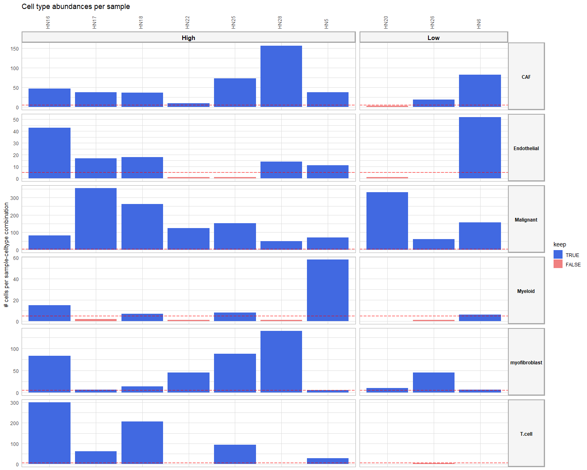<!-- -->
The red dotted line indicates the required minimum of cells as defined
above in `min_cells`. We can see here that quite many sample-celltype
combinations are left out. For Endothelial, Myeloid, and T cells, we
don’t even have two or more samples that have enough cells of those cell
types. Therefore, those cell types were removed before the DE analysis.
As stated before when seeing this, we would recommend to use a
higher-level cell type annotation if possible. But the annotation here
is already high-level, and grouping Endothelial cells, T cells and
Myeloid cells eg would not make sense biologically. That we won’t be
able to include these cell types in our analysis is a limitation of the
MultiNicheNet approach compared to classic cell-level-based approaches,
but on the contrary, those cell-level-based approaches don’t reveal the
lack of cells in many samples, and might lead to biased results. Another
limitation is that we lose now potentially very important group-specific
cell types, like T cells in this case. To overcome this, we will use a
hack later on. TODODODOODDOODODODODODODOD

In a next plot, we will look at differential abundance between the
conditions. This because the pseudobulking approach behind Muscat could
potentially suffer from some biases if there would be huge differences
in abundances of a cell type between different groups. Downstream
results of these cell types should then be considered with some caution.

``` r
abundance_expression_info$abund_plot_group
```

<!-- -->
Differential abundance looks quite OK for the cell types kept for the DE
analysis (i.e. CAF, Malignant and myofibroblast)

If you want to look at the cell numbers behind these plots, you can do
so via the following piece of code

``` r
abundance_expression_info$abundance_data_receiver
## # A tibble: 54 x 5
## # Groups:   sample, receiver [54]
##    sample receiver      n_cells_receiver group keep_receiver
##    <chr>  <chr>                    <int> <chr>         <dbl>
##  1 HN16   CAF                         47 High              1
##  2 HN16   Endothelial                 43 High              1
##  3 HN16   Malignant                   82 High              1
##  4 HN16   Myeloid                     15 High              1
##  5 HN16   myofibroblast               84 High              1
##  6 HN16   T.cell                     300 High              1
##  7 HN17   CAF                         37 High              1
##  8 HN17   Endothelial                 17 High              1
##  9 HN17   Malignant                  353 High              1
## 10 HN17   Myeloid                      2 High              0
## # ... with 44 more rows
abundance_expression_info$abundance_data_sender # in the case of an all-vs-all analysis: both are the same
## # A tibble: 54 x 5
## # Groups:   sample, sender [54]
##    sample sender        n_cells_sender group keep_sender
##    <chr>  <chr>                  <int> <chr>       <dbl>
##  1 HN16   CAF                       47 High            1
##  2 HN16   Endothelial               43 High            1
##  3 HN16   Malignant                 82 High            1
##  4 HN16   Myeloid                   15 High            1
##  5 HN16   myofibroblast             84 High            1
##  6 HN16   T.cell                   300 High            1
##  7 HN17   CAF                       37 High            1
##  8 HN17   Endothelial               17 High            1
##  9 HN17   Malignant                353 High            1
## 10 HN17   Myeloid                    2 High            0
## # ... with 44 more rows
```

**Important**: Based on the cell type abundance diagnostics, we
recommend users to change their analysis settings if required, before
proceeding with the rest of the analysis.

### Interpretation of expression information

Previously, we also calculated expression information. With the
following piece of code, you can check the average expression for each
gene per sample (normalized expression value and fraction of expressing
cells with non-zero counts, and logCPM-pseudocounts).

``` r
abundance_expression_info$celltype_info$avg_df
## # A tibble: 1,245,060 x 4
##    gene         sample average_sample celltype     
##    <chr>        <chr>           <dbl> <fct>        
##  1 C9orf152     HN28           0      myofibroblast
##  2 RPS11        HN28           5.78   myofibroblast
##  3 ELMO2        HN28           0.504  myofibroblast
##  4 CREB3L1      HN28           0      myofibroblast
##  5 PNMA1        HN28           1.17   myofibroblast
##  6 MMP2         HN28           0.103  myofibroblast
##  7 TMEM216      HN28           0.167  myofibroblast
##  8 TRAF3IP2.AS1 HN28           0.767  myofibroblast
##  9 LRRC37A5P    HN28           0      myofibroblast
## 10 LOC653712    HN28           0.0757 myofibroblast
## # ... with 1,245,050 more rows
abundance_expression_info$celltype_info$frq_df
## # A tibble: 1,245,060 x 4
##    gene         sample fraction_sample celltype     
##    <chr>        <chr>            <dbl> <chr>        
##  1 C9orf152     HN28            0      myofibroblast
##  2 RPS11        HN28            0.957  myofibroblast
##  3 ELMO2        HN28            0.157  myofibroblast
##  4 CREB3L1      HN28            0      myofibroblast
##  5 PNMA1        HN28            0.243  myofibroblast
##  6 MMP2         HN28            0.05   myofibroblast
##  7 TMEM216      HN28            0.0429 myofibroblast
##  8 TRAF3IP2.AS1 HN28            0.593  myofibroblast
##  9 LRRC37A5P    HN28            0      myofibroblast
## 10 LOC653712    HN28            0.0929 myofibroblast
## # ... with 1,245,050 more rows
abundance_expression_info$celltype_info$pb_df
## # A tibble: 1,120,554 x 4
##    gene         sample pb_sample celltype     
##    <chr>        <chr>      <dbl> <fct>        
##  1 C9orf152     HN16        0    myofibroblast
##  2 RPS11        HN16        9.14 myofibroblast
##  3 ELMO2        HN16        6.13 myofibroblast
##  4 CREB3L1      HN16        0    myofibroblast
##  5 PNMA1        HN16        6.28 myofibroblast
##  6 MMP2         HN16        1.67 myofibroblast
##  7 TMEM216      HN16        3.29 myofibroblast
##  8 TRAF3IP2.AS1 HN16        6.20 myofibroblast
##  9 LRRC37A5P    HN16        0    myofibroblast
## 10 LOC653712    HN16        3.92 myofibroblast
## # ... with 1,120,544 more rows
```

Now for the average per group:

``` r
abundance_expression_info$celltype_info$avg_df_group
## # A tibble: 249,012 x 4
## # Groups:   group, celltype [12]
##    group celltype gene     average_group
##    <chr> <fct>    <chr>            <dbl>
##  1 High  CAF      A1BG           0.211  
##  2 High  CAF      A1BG.AS1       0.124  
##  3 High  CAF      A1CF           0.00428
##  4 High  CAF      A2M            2.68   
##  5 High  CAF      A2M.AS1        0.0882 
##  6 High  CAF      A2ML1          0.0265 
##  7 High  CAF      A2MP1          0      
##  8 High  CAF      A4GALT         0.609  
##  9 High  CAF      A4GNT          0.00193
## 10 High  CAF      AAAS           0.458  
## # ... with 249,002 more rows
abundance_expression_info$celltype_info$frq_df_group
## # A tibble: 249,012 x 4
## # Groups:   group, celltype [12]
##    group celltype gene     fraction_group
##    <chr> <chr>    <chr>             <dbl>
##  1 High  CAF      A1BG            0.103  
##  2 High  CAF      A1BG.AS1        0.0536 
##  3 High  CAF      A1CF            0.0739 
##  4 High  CAF      A2M             0.500  
##  5 High  CAF      A2M.AS1         0.0447 
##  6 High  CAF      A2ML1           0.207  
##  7 High  CAF      A2MP1           0      
##  8 High  CAF      A4GALT          0.215  
##  9 High  CAF      A4GNT           0.00386
## 10 High  CAF      AAAS            0.115  
## # ... with 249,002 more rows
abundance_expression_info$celltype_info$pb_df_group
## # A tibble: 249,012 x 4
## # Groups:   group, celltype [12]
##    group celltype gene     pb_group
##    <chr> <fct>    <chr>       <dbl>
##  1 High  CAF      A1BG        3.86 
##  2 High  CAF      A1BG.AS1    2.99 
##  3 High  CAF      A1CF        0.527
##  4 High  CAF      A2M         7.99 
##  5 High  CAF      A2M.AS1     2.55 
##  6 High  CAF      A2ML1       1.92 
##  7 High  CAF      A2MP1       0    
##  8 High  CAF      A4GALT      5.61 
##  9 High  CAF      A4GNT       0.157
## 10 High  CAF      AAAS        4.84 
## # ... with 249,002 more rows
```

In the last part of this step, we combined this information for each
ligand-receptor pair combination for each sender-receiver combination.
The output of this can be seen as well:

For sample-based:

``` r
abundance_expression_info$sender_receiver_info$avg_df
## # A tibble: 1,619,640 x 8
##    sample sender    receiver ligand  receptor avg_ligand avg_receptor ligand_receptor_prod
##    <chr>  <fct>     <fct>    <chr>   <chr>         <dbl>        <dbl>                <dbl>
##  1 HN17   Myeloid   Myeloid  HLA.DMA CD74           8.76        12.5                 110. 
##  2 HN17   Malignant Myeloid  MIF     CD74           8.40        12.5                 105. 
##  3 HN16   Malignant Myeloid  MIF     CD74           8.61        11.9                 102. 
##  4 HN18   Myeloid   Myeloid  HLA.DMA CD74           7.78        12.6                  98.3
##  5 HN5    Myeloid   Myeloid  HLA.DMA CD74           7.76        12.2                  94.5
##  6 HN26   Myeloid   Myeloid  CCL19   CCR7           8.16        11.5                  94.2
##  7 HN5    Malignant Myeloid  MIF     CD74           7.72        12.2                  93.9
##  8 HN5    Myeloid   CAF      HLA.DRA CD63          11.2          8.15                 90.9
##  9 HN18   Malignant Myeloid  MIF     CD74           7.20        12.6                  90.9
## 10 HN5    Myeloid   Myeloid  HLA.DMB CD74           7.38        12.2                  89.8
## # ... with 1,619,630 more rows
abundance_expression_info$sender_receiver_info$frq_df
## # A tibble: 1,619,640 x 8
##    sample sender        receiver    ligand receptor fraction_ligand fraction_receptor ligand_receptor_fraction_prod
##    <chr>  <chr>         <chr>       <chr>  <chr>              <dbl>             <dbl>                         <dbl>
##  1 HN28   myofibroblast Myeloid     B2M    TAP1                   1                 1                             1
##  2 HN28   myofibroblast Myeloid     B2M    TAP2                   1                 1                             1
##  3 HN28   myofibroblast Myeloid     B2M    LILRB1                 1                 1                             1
##  4 HN28   myofibroblast Myeloid     B2M    KLRD1                  1                 1                             1
##  5 HN28   myofibroblast Myeloid     HLA.C  LILRB1                 1                 1                             1
##  6 HN28   myofibroblast Myeloid     HLA.C  LILRB2                 1                 1                             1
##  7 HN28   myofibroblast Myeloid     HLA.B  LILRB1                 1                 1                             1
##  8 HN28   myofibroblast Myeloid     HLA.B  KLRD1                  1                 1                             1
##  9 HN28   myofibroblast Myeloid     HLA.B  LILRB2                 1                 1                             1
## 10 HN25   myofibroblast Endothelial B2M    TAP1                   1                 1                             1
## # ... with 1,619,630 more rows
abundance_expression_info$sender_receiver_info$pb_df
## # A tibble: 1,331,704 x 8
##    sample sender  receiver ligand  receptor pb_ligand pb_receptor ligand_receptor_pb_prod
##    <chr>  <fct>   <fct>    <chr>   <chr>        <dbl>       <dbl>                   <dbl>
##  1 HN5    Myeloid Myeloid  HLA.DMA CD74         10.2        10.8                     111.
##  2 HN5    Myeloid Myeloid  HLA.DMB CD74         10.1        10.8                     110.
##  3 HN18   Myeloid Myeloid  HLA.DMA CD74         10.1        10.8                     109.
##  4 HN5    Myeloid Myeloid  HLA.DRA CD63         10.7        10.1                     108.
##  5 HN17   Myeloid Myeloid  HLA.DMA CD74         10.1        10.6                     107.
##  6 HN5    Myeloid Myeloid  MIF     CD74          9.75       10.8                     106.
##  7 HN5    Myeloid Myeloid  HLA.DRA CD53         10.7         9.86                    106.
##  8 HN17   CAF     Myeloid  MIF     CD74          9.94       10.6                     105.
##  9 HN5    T.cell  Myeloid  MIF     CD74          9.70       10.8                     105.
## 10 HN18   Myeloid Myeloid  HLA.DMB CD74          9.71       10.8                     105.
## # ... with 1,331,694 more rows
```

For group-based:

``` r
abundance_expression_info$sender_receiver_info$avg_df_group
## # A tibble: 323,928 x 8
## # Groups:   group, sender [12]
##    group sender        receiver    ligand   receptor avg_ligand_group avg_receptor_group ligand_receptor_prod_group
##    <chr> <fct>         <fct>       <chr>    <chr>               <dbl>              <dbl>                      <dbl>
##  1 High  Malignant     Myeloid     MIF      CD74                 7.67              11.5                        88.3
##  2 High  Endothelial   Myeloid     MIF      CD74                 6.16              11.5                        71.0
##  3 High  Malignant     Endothelial MIF      CD74                 7.67               8.91                       68.3
##  4 High  CAF           Myeloid     MIF      CD74                 5.85              11.5                        67.3
##  5 High  Myeloid       CAF         HLA.DRA  CD63                 8.58               7.47                       64.1
##  6 High  Myeloid       Myeloid     HLA.DMA  CD74                 5.46              11.5                        62.8
##  7 Low   CAF           CAF         SERPING1 C1R                  7.73               8.04                       62.1
##  8 High  myofibroblast Myeloid     MIF      CD74                 5.35              11.5                        61.7
##  9 Low   Malignant     Myeloid     MIF      CD74                 7.47               7.60                       56.8
## 10 High  myofibroblast CAF         SERPING1 C1R                  7.72               7.36                       56.8
## # ... with 323,918 more rows
abundance_expression_info$sender_receiver_info$frq_df_group
## # A tibble: 323,928 x 8
## # Groups:   group, sender [12]
##    group sender        receiver    ligand   receptor fraction_ligand_group fraction_receptor_group ligand_receptor_fraction_prod_group
##    <chr> <chr>         <chr>       <chr>    <chr>                    <dbl>                   <dbl>                               <dbl>
##  1 High  Endothelial   Endothelial PECAM1   PECAM1                   1                       1                                   1    
##  2 Low   CAF           CAF         SERPING1 C1R                      0.992                   0.996                               0.988
##  3 High  Malignant     Myeloid     MIF      CD74                     0.986                   1                                   0.986
##  4 Low   myofibroblast CAF         SERPING1 C1R                      0.970                   0.996                               0.966
##  5 High  Malignant     Endothelial MIF      CD74                     0.986                   0.969                               0.956
##  6 High  CAF           Myeloid     B2M      KLRD1                    1                       0.956                               0.956
##  7 High  Endothelial   Myeloid     B2M      KLRD1                    1                       0.956                               0.956
##  8 High  Endothelial   Myeloid     HLA.B    KLRD1                    1                       0.956                               0.956
##  9 High  Endothelial   Myeloid     HLA.E    KLRD1                    1                       0.956                               0.956
## 10 High  Malignant     Myeloid     B2M      KLRD1                    1                       0.956                               0.956
## # ... with 323,918 more rows
abundance_expression_info$sender_receiver_info$pb_df_group
## # A tibble: 323,928 x 8
## # Groups:   group, sender [12]
##    group sender        receiver      ligand   receptor pb_ligand_group pb_receptor_group ligand_receptor_pb_prod_group
##    <chr> <fct>         <fct>         <chr>    <chr>              <dbl>             <dbl>                         <dbl>
##  1 High  T.cell        Myeloid       MIF      CD74                9.33             10.4                           96.8
##  2 High  myofibroblast Myeloid       MIF      CD74                9.32             10.4                           96.7
##  3 High  CAF           Myeloid       MIF      CD74                9.30             10.4                           96.5
##  4 High  Malignant     Myeloid       MIF      CD74                9.24             10.4                           96.0
##  5 High  myofibroblast T.cell        LGALS1   PTPRC               9.74              9.83                          95.8
##  6 Low   myofibroblast T.cell        MIF      CXCR4               9.37             10.2                           95.7
##  7 High  CAF           T.cell        LGALS1   PTPRC               9.69              9.83                          95.3
##  8 High  T.cell        T.cell        HMGB1    CXCR4               9.43             10.1                           95.2
##  9 High  myofibroblast CAF           SERPING1 C1R                 9.84              9.66                          95.1
## 10 High  myofibroblast myofibroblast SERPING1 C1R                 9.84              9.65                          95.0
## # ... with 323,918 more rows
```

# Step 2: Perform genome-wide differential expression analysis of receiver and sender cell types to define DE genes between the conditions of interest. Based on this analysis, we can define the logFC/p-value of ligands in senders and receptors in receivers, and define the set of affected target genes in the receiver.

Now we will go over to the multi-group, multi-sample differential
expression (DE) analysis (also called ‘differential state’ analysis by
the developers of Muscat).

### Define the contrasts and covariates of interest for the DE analysis.

Here, we want to compare the p-EMT-high vs the p-EMT-low group and find
cell-cell communication events that are higher in high than low pEMT.

Note the format to indicate the contrasts! (This formatting should be
adhered to very strictly, and white spaces are not allowed)

**User adaptation required**

``` r
contrasts_oi = c("'High-Low','Low-High'")
contrast_tbl = tibble(contrast = 
                        c("High-Low","Low-High"), 
                      group = c("High","Low"))
```

### Perform the DE analysis for each cell type.

``` r
DE_info = get_DE_info(sce = sce, sample_id = sample_id, group_id = group_id, celltype_id = celltype_id, batches = batches, covariates = covariates, contrasts_oi = contrasts_oi, min_cells = min_cells)
## [1] "excluded cell types are:"
## [1] "Endothelial" "Myeloid"     "T.cell"     
## [1] "These celltypes are not considered in the analysis. After removing samples that contain less cells than the required minimal, some groups don't have 2 or more samples anymore. As a result the analysis cannot be run. To solve this: decrease the number of min_cells or change your group_id and pool all samples that belong to groups that are not of interest! "
```

### Check DE results

Table with logFC and p-values for each gene-celltype-contrast:

``` r
DE_info$celltype_de$de_output_tidy
## # A tibble: 64,162 x 9
##    gene         cluster_id   logFC logCPM      F  p_val p_adj.loc p_adj contrast
##    <chr>        <chr>        <dbl>  <dbl>  <dbl>  <dbl>     <dbl> <dbl> <chr>   
##  1 RPS11        CAF        -0.0666   9.29 0.0658 0.801          1 0.984 High-Low
##  2 ELMO2        CAF         0.726    6.64 2.31   0.149          1 0.743 High-Low
##  3 CREB3L1      CAF         0.149    5.44 0.0184 0.894          1 0.994 High-Low
##  4 PNMA1        CAF        -1.04     6.51 4.03   0.0634         1 0.573 High-Low
##  5 MMP2         CAF         0.162    9.28 0.422  0.526          1 0.951 High-Low
##  6 TMEM216      CAF        -1.34     6    5.85   0.0291         1 0.442 High-Low
##  7 TRAF3IP2.AS1 CAF        -0.496    5.54 0.718  0.41           1 0.924 High-Low
##  8 ZHX3         CAF        -0.207    5.46 0.103  0.753          1 0.979 High-Low
##  9 ERCC5        CAF         0.202    6.08 0.0925 0.765          1 0.982 High-Low
## 10 APBB2        CAF        -0.235    6.47 0.249  0.625          1 0.966 High-Low
## # ... with 64,152 more rows
```

Diagnostic p-value histograms:

``` r
DE_info$hist_pvals
```

<!-- -->
(Note: this p-value histograms are the same for High-Low and Low-High
because we only have two groups and compare them to each other - a DE
gene in one comparison will then also be DE in the other comparison,
with just a reversed sign of the logFC)

In order to trust the p-values, the p-value distributions should be
uniform distributions, with a peak allowed between 0 and 0.05 if there
would be a clear biological effect in the data. This clear effect
(=clear DE) seems to be present here in the Malignant cell type
populations, although the histogram is not very uniformly distributed
for p-values between 0.05 and 0.25. This might point to issues in the DE
model definition (eg we did not add all important covariates,
substructure present,…)

Because there might be some issues, and we anticipate this could be
present in other datasets, we will now use the empiricall null
procedure. This is a procedure that will define empirical p-values based
on the observed distribution of the test statistic (here: logFC) and not
based on the theoretical distribution. We only recommend this if the
p-value distributions point to possible issues. (\[ADD REFERENCE\])

### Empirical Null procedure

**User adaptation recommended**

``` r
empirical_pval = TRUE
if(empirical_pval == TRUE){
  DE_info_emp = get_empirical_pvals(DE_info$celltype_de$de_output_tidy)
} 
```

Table with logFC and p-values for each gene-celltype-contrast:

``` r
DE_info_emp$de_output_tidy_emp
## # A tibble: 64,162 x 11
##    gene         cluster_id   logFC logCPM      F  p_val p_adj.loc p_adj contrast   p_emp p_adj_emp
##    <chr>        <chr>        <dbl>  <dbl>  <dbl>  <dbl>     <dbl> <dbl> <chr>      <dbl>     <dbl>
##  1 RPS11        CAF        -0.0666   9.29 0.0658 0.801          1 0.984 High-Low 0.748       0.991
##  2 ELMO2        CAF         0.726    6.64 2.31   0.149          1 0.743 High-Low 0.0864      0.991
##  3 CREB3L1      CAF         0.149    5.44 0.0184 0.894          1 0.994 High-Low 0.887       0.998
##  4 PNMA1        CAF        -1.04     6.51 4.03   0.0634         1 0.573 High-Low 0.0246      0.991
##  5 MMP2         CAF         0.162    9.28 0.422  0.526          1 0.951 High-Low 0.457       0.991
##  6 TMEM216      CAF        -1.34     6    5.85   0.0291         1 0.442 High-Low 0.00834     0.991
##  7 TRAF3IP2.AS1 CAF        -0.496    5.54 0.718  0.41           1 0.924 High-Low 0.314       0.991
##  8 ZHX3         CAF        -0.207    5.46 0.103  0.753          1 0.979 High-Low 0.692       0.991
##  9 ERCC5        CAF         0.202    6.08 0.0925 0.765          1 0.982 High-Low 0.733       0.991
## 10 APBB2        CAF        -0.235    6.47 0.249  0.625          1 0.966 High-Low 0.545       0.991
## # ... with 64,152 more rows
```

The following plot shows those corrected, empirical p-values:

``` r
DE_info_emp$hist_pvals_emp
```

<!-- -->
The following plots show how well the correction worked. The green
fitted curve should fit well with the histogram. If not, this might
point to some issues in the DE model definition.

**User adaptation required**

``` r
DE_info_emp$z_distr_plots_emp_pval
## $`CAF.High-Low`
```

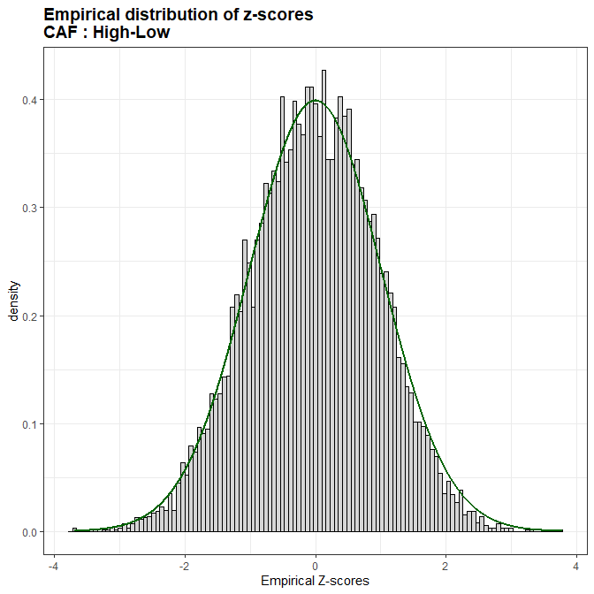<!-- -->

    ## 
    ## $`CAF.Low-High`

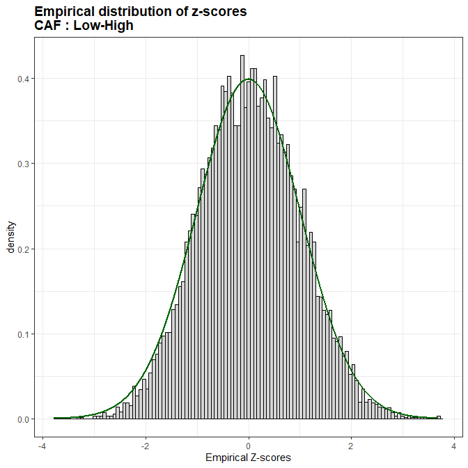<!-- -->

    ## 
    ## $`Malignant.High-Low`

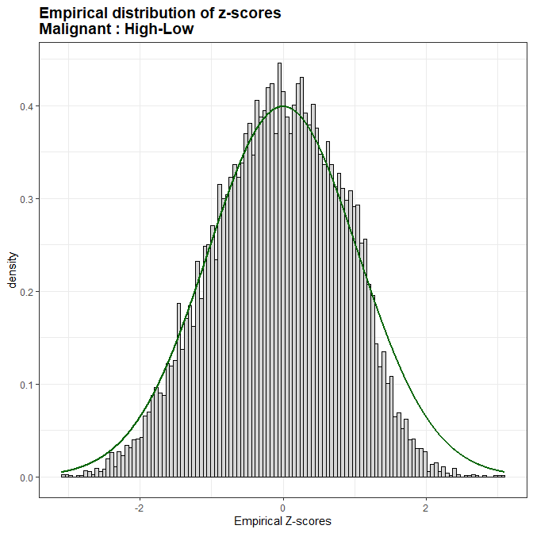<!-- -->

    ## 
    ## $`Malignant.Low-High`

<!-- -->

    ## 
    ## $`myofibroblast.High-Low`

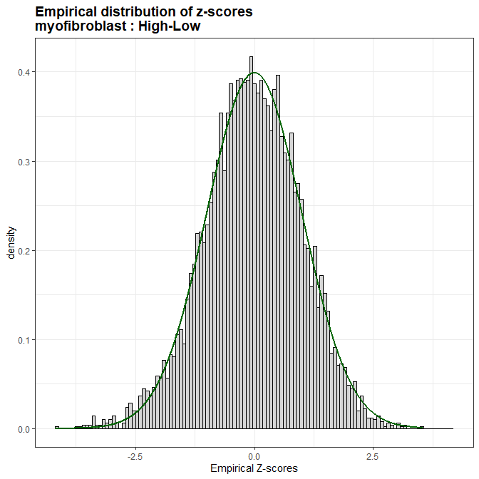<!-- -->

    ## 
    ## $`myofibroblast.Low-High`

<!-- -->
(Note: if plotting does not work, it might be necessary to run these
plot commands in the console)

In general, these plots looks fine, except for the Malignant cells. As
discussed in the previous plots: there might be an issue here. One
possible explanation might be that there is additional substructure in
the data. This could make sense because the pEMT high group consists
both of pEMT very-high and pEMT high samples according to the finer
subdivision/metadata column `pEMT_fine`. Another reason for the possible
substructure: malignant cells of each tumor are very different because
of genetic aberrations.

If we compare the empirical p-values to the original ones before for the
malignant cells, we see that through the empirical null procedure, we
lost some DE genes in malignant cells. But it is likely that the DE
genes that er kept are the most bona fide ones.

As additional check, we will look for the concordance between p-values
rankings of the original and empirical DE analysis (via ranking-line and
upset plots):

``` r
comparison_plots = DE_info$celltype_de$de_output_tidy$cluster_id %>% unique() %>% lapply(function(celltype_oi, adjusted = FALSE){
  if(adjusted == TRUE){
      de_genes_normal = DE_info$celltype_de$de_output_tidy %>% filter(cluster_id == celltype_oi) %>% filter(p_adj.glb <= 0.05) %>% pull(gene) %>% unique()
      de_genes_emp = DE_info_emp$de_output_tidy_emp %>% filter(cluster_id == celltype_oi) %>% filter(p_adj_emp <= 0.05) %>% pull(gene) %>% unique()

  } else {
      de_genes_normal = DE_info$celltype_de$de_output_tidy %>% filter(cluster_id == celltype_oi) %>% filter(p_val <= 0.05) %>% pull(gene) %>% unique()
      de_genes_emp = DE_info_emp$de_output_tidy_emp %>% filter(cluster_id == celltype_oi) %>% filter(p_emp <= 0.05) %>% pull(gene) %>% unique()

  }

  upset_df = tibble(gene = union(de_genes_normal, de_genes_emp), normal = as.double(gene %in% de_genes_normal), empirical = as.double(gene %in% de_genes_emp)) %>% data.frame() %>% magrittr::set_rownames(.$gene) %>% dplyr::select(-gene)
  colnames(upset_df) = paste(colnames(upset_df), celltype_oi, sep = "-")
  p_upset = UpSetR::upset(upset_df, sets.bar.color = "#56B4E9", order.by = "freq", empty.intersections = "on") 
  
  p_ranking = DE_info_emp$de_output_tidy_emp %>% filter(gene %in% union(de_genes_normal, de_genes_emp) & cluster_id == celltype_oi) %>% group_by(cluster_id, contrast) %>% mutate(normal = rank(p_val), empirical = rank(p_emp)) %>% filter(normal != empirical) %>% mutate(empirical_lower = empirical < normal) %>% tidyr::gather(rank_type, rank, normal:empirical) %>% dplyr::select(gene, rank_type, rank, empirical_lower)  %>% 
    ggplot(aes(rank_type, rank, group = gene, color = empirical_lower)) + geom_line(aes(group = gene)) + facet_grid(cluster_id ~ contrast) + theme_bw()
  
  return(list(p_upset, p_ranking))
  
}, adjusted = FALSE) 
comparison_plots
## [[1]]
## [[1]][[1]]
```

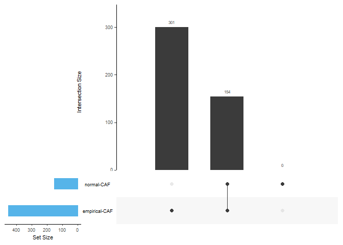<!-- -->

    ## 
    ## [[1]][[2]]

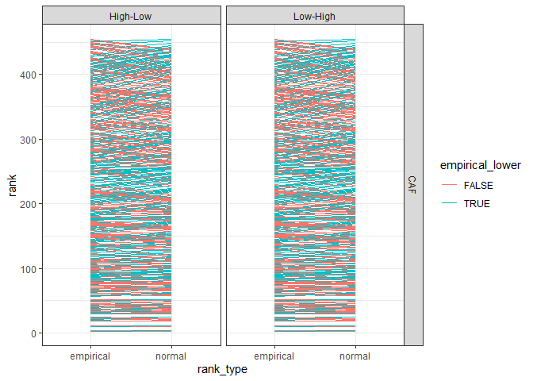<!-- -->

    ## 
    ## 
    ## [[2]]
    ## [[2]][[1]]

<!-- -->

    ## 
    ## [[2]][[2]]

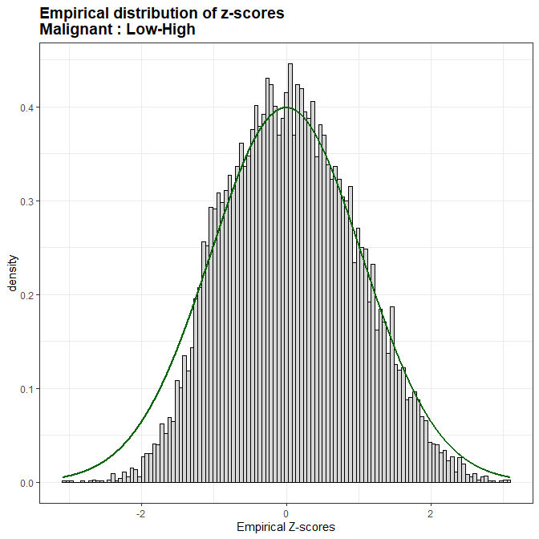<!-- -->

    ## 
    ## 
    ## [[3]]
    ## [[3]][[1]]

<!-- -->

    ## 
    ## [[3]][[2]]

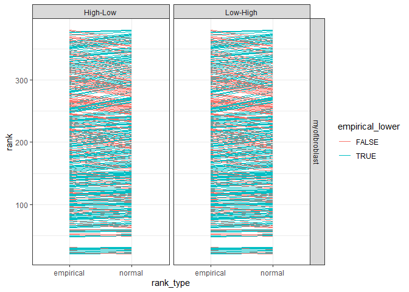<!-- -->

### Conclusion of the diagnostic plots concerning the DE analysis

P-value histograms of both the normal and empirical p-values indicate
there might be some problems in the DE model definition, certainly for
malignant cells. If possible it might be a good idea to include more
covariates in the model, or use the `pEMT_fine` group definition
instead.

Because of these issues (that point to violations to the assumptions
that should be fulfilled for having accurate theoretical p-values), we
decide to continue based on the empirical p-values in this case study.

**User adaptation recommended**

``` r
empirical_pval = TRUE
if(empirical_pval == FALSE){
  celltype_de = DE_info$celltype_de$de_output_tidy
} else {
  celltype_de = DE_info_emp$de_output_tidy_emp %>% dplyr::select(-p_val, -p_adj) %>% dplyr::rename(p_val = p_emp, p_adj = p_adj_emp)
}
```

### Combine DE information for ligand-senders and receptors-receivers (similar to step1 - `abundance_expression_info$sender_receiver_info`)

``` r
sender_receiver_de = combine_sender_receiver_de(
  sender_de = celltype_de,
  receiver_de = celltype_de,
  senders_oi = senders_oi,
  receivers_oi = receivers_oi,
  lr_network = lr_network
)
```

``` r
sender_receiver_de %>% head(20)
## # A tibble: 20 x 12
##    contrast sender        receiver      ligand receptor lfc_ligand lfc_receptor ligand_receptor_lfc_avg p_val_ligand p_adj_ligand p_val_receptor p_adj_receptor
##    <chr>    <chr>         <chr>         <chr>  <chr>         <dbl>        <dbl>                   <dbl>        <dbl>        <dbl>          <dbl>          <dbl>
##  1 High-Low Malignant     Malignant     IL20   IL20RB         8.59       2.33                      5.46     0.0107          0.999        0.0215           0.999
##  2 High-Low Malignant     CAF           IL1B   ADRB2          3.58       6.75                      5.16     0.0862          0.999        0.00522          0.991
##  3 High-Low Malignant     Malignant     IL20   IL22RA1        8.59       1.05                      4.82     0.0107          0.999        0.191            0.999
##  4 Low-High Malignant     Malignant     IGSF11 CLEC2L         4.01       4.88                      4.44     0.0430          0.999        0.0783           0.999
##  5 Low-High Malignant     Malignant     CLEC2L IGSF11         4.88       4.01                      4.44     0.0783          0.999        0.0430           0.999
##  6 High-Low Malignant     Malignant     IL24   IL20RB         6.28       2.33                      4.30     0.0164          0.999        0.0215           0.999
##  7 High-Low CAF           Malignant     SAA1   FPR1           6.74       1.76                      4.25     0.0198          0.991        0.482            0.999
##  8 High-Low CAF           Malignant     SAA1   TLR2           6.74       1.73                      4.24     0.0198          0.991        0.157            0.999
##  9 High-Low Malignant     Malignant     IL1B   IL12RB2        3.58       4.86                      4.22     0.0862          0.999        0.0472           0.999
## 10 High-Low Malignant     myofibroblast LIPC   LRP1           8.11       0.0842                    4.10     0.0877          0.999        0.868            0.995
## 11 High-Low Malignant     Malignant     IL20   IL20RA         8.59      -0.477                     4.06     0.0107          0.999        0.784            0.999
## 12 High-Low Malignant     CAF           PTHLH  ADRB2          1.32       6.75                      4.04     0.306           0.999        0.00522          0.991
## 13 High-Low Malignant     Malignant     TIMP3  MMP9           3.37       4.69                      4.03     0.0393          0.999        0.0561           0.999
## 14 Low-High Malignant     Malignant     MPDZ   CLDN5          1.91       6.04                      3.98     0.277           0.999        0.00967          0.999
## 15 High-Low Malignant     CAF           LIPC   LRP1           8.11      -0.258                     3.93     0.0877          0.999        0.555            0.991
## 16 High-Low Malignant     Malignant     LIPC   LRP1           8.11      -0.28                      3.91     0.0877          0.999        0.735            0.999
## 17 High-Low myofibroblast Malignant     TGFB2  TGFBR2         4.89       2.89                      3.89     0.000689        0.328        0.0505           0.999
## 18 Low-High Malignant     Malignant     FGF12  SCN9A          2.7        5.07                      3.88     0.147           0.999        0.0427           0.999
## 19 Low-High Malignant     Malignant     FGF13  SCN9A          2.66       5.07                      3.86     0.202           0.999        0.0427           0.999
## 20 High-Low Malignant     Malignant     TGFB2  TGFBR2         4.76       2.89                      3.82     0.0234          0.999        0.0505           0.999
```

# Step 3: Predict NicheNet ligand activities and NicheNet ligand-target links based on these differential expression results

## Define the parameters for the NicheNet ligand activity analysis

Here, we need to define the thresholds that will be used to consider
genes as differentially expressed or not (logFC, p-value, decision
whether to use adjusted or normal p-value, minimum fraction of cells
that should express a gene in at least one sample in a group, whether to
use the normal p-values or empirical p-values).

NicheNet ligand activity will then be calculated as the enrichment of
predicted target genes of ligands in this set of DE genes compared to
the genomic background. Here we choose for a minimum logFC of 0.50,
maximum p-value of 0.05, and minimum fraction of expression of 0.05.

**User adaptation recommended**

``` r
logFC_threshold = 0.50
p_val_threshold = 0.05
fraction_cutoff = 0.05
```

We will here choose for applying the p-value cutoff on the normal
p-values, and not on the p-values corrected for multiple testing. This
choice was made here because of lack of statistical power due to
pseudobulking and the fact that this dataset has only a few samples per
group.

**User adaptation recommended**

``` r
p_val_adj = FALSE 
```

For the NicheNet ligand-target inference, we also need to select which
top n of the predicted target genes will be considered (here: top 250
targets per ligand).

**User adaptation recommended**

``` r
top_n_target = 250
```

The NicheNet ligand activity analysis can be run in parallel for each
receiver cell type, by changing the number of cores as defined here.
This is only recommended if you have many receiver cell type.

**User adaptation recommended**

``` r
verbose = TRUE
n.cores = 1
```

## Run the NicheNet ligand activity analysis

``` r
start_time <- Sys.time()
ligand_activities_targets_DEgenes = suppressMessages(suppressWarnings(get_ligand_activities_targets_DEgenes(
  receiver_de = celltype_de,
  receivers_oi = receivers_oi,
  ligand_target_matrix = ligand_target_matrix,
  logFC_threshold = logFC_threshold,
  p_val_threshold = p_val_threshold,
  p_val_adj = p_val_adj,
  top_n_target = top_n_target,
  verbose = verbose, 
  n.cores = n.cores
)))
## [1] "receiver_oi:"
## [1] "CAF"
## [1] "contrast_oi:"
## [1] "High-Low"
## [1] "Number of upregulated DE genes (gene set of interest): "
## [1] 252
## [1] "Number of downregulated DE genes (gene set of interest): "
## [1] 194
## [1] "contrast_oi:"
## [1] "Low-High"
## [1] "Number of upregulated DE genes (gene set of interest): "
## [1] 194
## [1] "Number of downregulated DE genes (gene set of interest): "
## [1] 252
## [1] "receiver_oi:"
## [1] "Malignant"
## [1] "contrast_oi:"
## [1] "High-Low"
## [1] "Number of upregulated DE genes (gene set of interest): "
## [1] 233
## [1] "Number of downregulated DE genes (gene set of interest): "
## [1] 74
## [1] "contrast_oi:"
## [1] "Low-High"
## [1] "Number of upregulated DE genes (gene set of interest): "
## [1] 74
## [1] "Number of downregulated DE genes (gene set of interest): "
## [1] 233
## [1] "receiver_oi:"
## [1] "myofibroblast"
## [1] "contrast_oi:"
## [1] "High-Low"
## [1] "Number of upregulated DE genes (gene set of interest): "
## [1] 236
## [1] "Number of downregulated DE genes (gene set of interest): "
## [1] 141
## [1] "contrast_oi:"
## [1] "Low-High"
## [1] "Number of upregulated DE genes (gene set of interest): "
## [1] 141
## [1] "Number of downregulated DE genes (gene set of interest): "
## [1] 236
end_time <- Sys.time()
end_time - start_time
## Time difference of 10.41583 mins
```

Check the DE genes used for the activity analysis

``` r
ligand_activities_targets_DEgenes$de_genes_df %>% head(20)
## # A tibble: 20 x 6
##    gene      receiver logFC   p_val p_adj contrast
##    <chr>     <chr>    <dbl>   <dbl> <dbl> <chr>   
##  1 SUMO1     CAF      0.903 0.0324  0.991 High-Low
##  2 CHST15    CAF      2.12  0.0265  0.991 High-Low
##  3 CD82      CAF      1.68  0.00253 0.991 High-Low
##  4 SNAPC1    CAF      1.42  0.00875 0.991 High-Low
##  5 COX7A2    CAF      0.903 0.0161  0.991 High-Low
##  6 LDLR      CAF      0.992 0.0353  0.991 High-Low
##  7 ALAS1     CAF      1.48  0.0192  0.991 High-Low
##  8 ST7L      CAF      2.24  0.00155 0.991 High-Low
##  9 ACSL1     CAF      1.32  0.0296  0.991 High-Low
## 10 HDAC1     CAF      1.2   0.0170  0.991 High-Low
## 11 SNRPB2    CAF      0.731 0.0340  0.991 High-Low
## 12 MRPL33    CAF      0.943 0.0109  0.991 High-Low
## 13 PELO      CAF      1.07  0.0272  0.991 High-Low
## 14 MED10     CAF      0.971 0.0199  0.991 High-Low
## 15 ATP2C1    CAF      1.63  0.0343  0.991 High-Low
## 16 SLC12A2   CAF      1.52  0.00567 0.991 High-Low
## 17 STC1      CAF      7.5   0.0140  0.991 High-Low
## 18 H2BC3     CAF      5.32  0.0403  0.991 High-Low
## 19 LINC00473 CAF      2.57  0.0220  0.991 High-Low
## 20 PELI1     CAF      1.44  0.0402  0.991 High-Low
```

Check the output of the activity analysis

``` r
ligand_activities_targets_DEgenes$ligand_activities %>% head(20)
## # A tibble: 20 x 8
## # Groups:   receiver, contrast [1]
##    ligand  activity contrast target   ligand_target_weight receiver direction_regulation activity_scaled
##    <chr>      <dbl> <chr>    <chr>                   <dbl> <chr>    <fct>                          <dbl>
##  1 A2M     0.00324  High-Low ADM                   0.00399 CAF      up                            0.0792
##  2 A2M     0.00324  High-Low BCL3                  0.00486 CAF      up                            0.0792
##  3 A2M     0.00324  High-Low LDLR                  0.00415 CAF      up                            0.0792
##  4 A2M     0.00324  High-Low MIDEAS                0.00418 CAF      up                            0.0792
##  5 A2M     0.00324  High-Low PLAUR                 0.00425 CAF      up                            0.0792
##  6 A2M     0.00324  High-Low PRDM1                 0.00437 CAF      up                            0.0792
##  7 A2M     0.00324  High-Low TRIB1                 0.00442 CAF      up                            0.0792
##  8 AANAT  -0.000133 High-Low BCL3                  0.00387 CAF      up                           -1.47  
##  9 AANAT  -0.000133 High-Low EIF5A                 0.00302 CAF      up                           -1.47  
## 10 AANAT  -0.000133 High-Low HDAC1                 0.00360 CAF      up                           -1.47  
## 11 AANAT  -0.000133 High-Low LDLR                  0.00301 CAF      up                           -1.47  
## 12 AANAT  -0.000133 High-Low MIDEAS                0.00324 CAF      up                           -1.47  
## 13 AANAT  -0.000133 High-Low NR4A2                 0.00297 CAF      up                           -1.47  
## 14 AANAT  -0.000133 High-Low SLC2A1                0.00307 CAF      up                           -1.47  
## 15 AANAT  -0.000133 High-Low TRIB1                 0.00306 CAF      up                           -1.47  
## 16 AANAT  -0.000133 High-Low USP3                  0.00332 CAF      up                           -1.47  
## 17 ABCA1   0.00573  High-Low AURKAIP1              0.0393  CAF      up                            1.22  
## 18 ABCA1   0.00573  High-Low CXCL2                 0.0403  CAF      up                            1.22  
## 19 ABCA1   0.00573  High-Low CXCL6                 0.0442  CAF      up                            1.22  
## 20 ABCA1   0.00573  High-Low ELOVL4                0.0442  CAF      up                            1.22
```

# Step 4: Use the information collected above to prioritize all sender-ligand—receiver-receptor pairs.

In the 3 previous steps, we calculated expression, differential
expression and NicheNet activity information. Now we will combine these
different types of information in one prioritization scheme.

MultiNicheNet allows the user to define the weights of the following
criteria to prioritize ligand-receptor interactions:

-   Upregulation of the ligand in a sender cell type and/or upregulation
    of the receptor in a receiver cell type - in the condition of
    interest. : `scaled_lfc_ligand`, `scaled_p_val_ligand`,
    `scaled_lfc_receptor`, and `scaled_p_val_receptor`
-   Sufficiently high expression levels of ligand and receptor in many
    samples of the same group (to mitigate the influence of outlier
    samples). : `fraction_expressing_ligand_receptor`
-   Cell-type and condition specific expression of the ligand in the
    sender cell type and receptor in the receiver cell type (to mitigate
    the influence of upregulated but still relatively weakly expressed
    ligands/receptors) : `scaled_avg_exprs_ligand`,
    `scaled_avg_frq_ligand`, `scaled_avg_exprs_receptor`, and
    `scaled_avg_frq_receptor`
-   High NicheNet ligand activity, to further prioritize ligand-receptor
    pairs based on their predicted effect of the ligand-receptor
    interaction on the gene expression in the receiver cell type :
    `scaled_activity` and `scaled_activity_scaled`
    (scaled\_activity=absolute value of ligand activity;
    scaled\_activity\_scaled=scaled ligand activity value that is
    comparable between different receiver settings - recommended to put
    more weight on this)
-   High relative abundance of sender and/or receiver in the condition
    of interest: `scaled_abundance_sender` and
    `scaled_abundance_receiver`

The different properties of the sender-ligand—receiver-receptor pairs
can be weighted according to the user’s preference and insight in the
dataset at hand.

## Define the prioritization weights, and prepare grouping objects

We will set our preference for this dataset as follows:

**User adaptation recommended**

``` r
prioritizing_weights_DE = c("de_ligand" = 5,
                         "de_receptor" = 6)
prioritizing_weights_activity = c("activity_scaled" = 3)

prioritizing_weights_expression_specificity = c("exprs_ligand" = 4,
                         "exprs_receptor" = 2)

prioritizing_weights_expression_sufficiency = c("frac_exprs_ligand_receptor" = 2)

prioritizing_weights_relative_abundance = c( "abund_sender" = 0,
                         "abund_receiver" = 0)
```

``` r
prioritizing_weights = c(prioritizing_weights_DE, 
                         prioritizing_weights_activity, 
                         prioritizing_weights_expression_specificity,
                         prioritizing_weights_expression_sufficiency, 
                         prioritizing_weights_relative_abundance)
```

Make necessary grouping data frame

``` r
sender_receiver_tbl = sender_receiver_de %>% dplyr::distinct(sender, receiver)

metadata_combined = SummarizedExperiment::colData(sce) %>% tibble::as_tibble()

if(!is.na(covariates)){
  grouping_tbl = metadata_combined[,c(sample_id, group_id, covariates)] %>% tibble::as_tibble() %>% dplyr::distinct()
  colnames(grouping_tbl) = c("sample","group",covariates)
} else {
  grouping_tbl = metadata_combined[,c(sample_id, group_id)] %>% tibble::as_tibble() %>% dplyr::distinct()
  colnames(grouping_tbl) = c("sample","group")
}
```

Crucial note: grouping\_tbl: group should be the same as in the
contrast\_tbl, and the expression ino tables! Rename accordingly if this
would not be the case. If you followed the guidelines of this tutorial
closely, there should be no problem.

## Run the prioritization

``` r
prioritization_tables = suppressMessages(generate_prioritization_tables(
  sender_receiver_info = abundance_expression_info$sender_receiver_info,
  sender_receiver_de = sender_receiver_de,
  ligand_activities_targets_DEgenes = ligand_activities_targets_DEgenes,
  contrast_tbl = contrast_tbl,
  sender_receiver_tbl = sender_receiver_tbl,
  grouping_tbl = grouping_tbl,
  prioritizing_weights = prioritizing_weights,
  fraction_cutoff = fraction_cutoff, 
  abundance_data_receiver = abundance_expression_info$abundance_data_receiver,
  abundance_data_sender = abundance_expression_info$abundance_data_sender
))
```

Check the output tables

First: group-based summary table

``` r
prioritization_tables$group_prioritization_tbl %>% head(20)
## # A tibble: 20 x 54
##    contrast group sender        receiver  ligand receptor lfc_ligand lfc_receptor ligand_receptor_~ p_val_ligand p_adj_ligand p_val_receptor p_adj_receptor activity direction_regul~ activity_scaled lr_interaction id    avg_ligand_group avg_receptor_gr~
##    <chr>    <chr> <chr>         <chr>     <chr>  <chr>         <dbl>        <dbl>             <dbl>        <dbl>        <dbl>          <dbl>          <dbl>    <dbl> <fct>                      <dbl> <chr>          <chr>            <dbl>            <dbl>
##  1 High-Low High  Malignant     CAF       IL1B   ADRB2        3.58          6.75              5.16        0.0862        0.999        0.00522          0.991  1.34e-2 up                        4.75   IL1B_ADRB2     IL1B~            0.217            0.214
##  2 High-Low High  Malignant     CAF       IL1B   ADRB2        3.58          6.75              5.16        0.0862        0.999        0.00522          0.991  1.43e-4 down                      0.466  IL1B_ADRB2     IL1B~            0.217            0.214
##  3 Low-High Low   myofibroblast Malignant MPDZ   CLDN5        0.318         6.04              3.18        0.581         0.990        0.00967          0.999 -1.01e-3 up                       -0.155  MPDZ_CLDN5     MPDZ~            0.753            1.18 
##  4 Low-High Low   myofibroblast Malignant MPDZ   CLDN5        0.318         6.04              3.18        0.581         0.990        0.00967          0.999  1.52e-2 down                      1.56   MPDZ_CLDN5     MPDZ~            0.753            1.18 
##  5 High-Low High  Malignant     Malignant IL20   IL20RB       8.59          2.33              5.46        0.0107        0.999        0.0215           0.999  1.34e-2 up                        1.11   IL20_IL20RB    IL20~            0.272            3.19 
##  6 High-Low High  Malignant     Malignant IL20   IL20RB       8.59          2.33              5.46        0.0107        0.999        0.0215           0.999 -1.08e-3 down                     -0.198  IL20_IL20RB    IL20~            0.272            3.19 
##  7 High-Low High  myofibroblast Malignant CCN1   TLR2         0.185         1.73              0.958       0.491         0.990        0.157            0.999  9.29e-3 up                        0.0388 CCN1_TLR2      CCN1~            4.82             0.708
##  8 High-Low High  myofibroblast Malignant CCN1   TLR2         0.185         1.73              0.958       0.491         0.990        0.157            0.999  1.24e-2 down                      8.03   CCN1_TLR2      CCN1~            4.82             0.708
##  9 High-Low High  myofibroblast Malignant CCN1   ITGA5        0.185         2.44              1.31        0.491         0.990        0.0303           0.999  9.29e-3 up                        0.0388 CCN1_ITGA5     CCN1~            4.82             1.82 
## 10 High-Low High  myofibroblast Malignant CCN1   ITGA5        0.185         2.44              1.31        0.491         0.990        0.0303           0.999  1.24e-2 down                      8.03   CCN1_ITGA5     CCN1~            4.82             1.82 
## 11 High-Low High  CAF           Malignant DCN    TLR2         0.0461        1.73              0.888       0.885         0.998        0.157            0.999  8.47e-3 up                       -0.171  DCN_TLR2       DCN_~            8.09             0.708
## 12 High-Low High  CAF           Malignant DCN    TLR2         0.0461        1.73              0.888       0.885         0.998        0.157            0.999  1.22e-2 down                      7.90   DCN_TLR2       DCN_~            8.09             0.708
## 13 High-Low High  myofibroblast Malignant CCN1   ITGA6        0.185         0.754             0.470       0.491         0.990        0.0764           0.999  9.29e-3 up                        0.0388 CCN1_ITGA6     CCN1~            4.82             2.95 
## 14 High-Low High  myofibroblast Malignant CCN1   ITGA6        0.185         0.754             0.470       0.491         0.990        0.0764           0.999  1.24e-2 down                      8.03   CCN1_ITGA6     CCN1~            4.82             2.95 
## 15 High-Low High  Malignant     Malignant AREG   MMP9         2.3           4.69              3.50        0.0228        0.999        0.0561           0.999  9.04e-3 up                       -0.0256 AREG_MMP9      AREG~            1.85             0.263
## 16 High-Low High  Malignant     Malignant AREG   MMP9         2.3           4.69              3.50        0.0228        0.999        0.0561           0.999  6.17e-3 down                      4.23   AREG_MMP9      AREG~            1.85             0.263
## 17 High-Low High  CAF           Malignant DCN    EGFR         0.0461        0.908             0.477       0.885         0.998        0.101            0.999  8.47e-3 up                       -0.171  DCN_EGFR       DCN_~            8.09             1.52 
## 18 High-Low High  CAF           Malignant DCN    EGFR         0.0461        0.908             0.477       0.885         0.998        0.101            0.999  1.22e-2 down                      7.90   DCN_EGFR       DCN_~            8.09             1.52 
## 19 High-Low High  myofibroblast Malignant CCN1   SDC4         0.185         0.456             0.320       0.491         0.990        0.293            0.999  9.29e-3 up                        0.0388 CCN1_SDC4      CCN1~            4.82             3.56 
## 20 High-Low High  myofibroblast Malignant CCN1   SDC4         0.185         0.456             0.320       0.491         0.990        0.293            0.999  1.24e-2 down                      8.03   CCN1_SDC4      CCN1~            4.82             3.56 
## # ... with 34 more variables: ligand_receptor_prod_group <dbl>, fraction_ligand_group <dbl>, fraction_receptor_group <dbl>, ligand_receptor_fraction_prod_group <dbl>, rel_abundance_scaled_sender <dbl>, rel_abundance_scaled_receiver <dbl>,
## #   sender_receiver_rel_abundance_avg <dbl>, lfc_pval_ligand <dbl>, scaled_lfc_ligand <dbl>, scaled_p_val_ligand <dbl>, scaled_lfc_pval_ligand <dbl>, lfc_pval_receptor <dbl>, scaled_lfc_receptor <dbl>, scaled_p_val_receptor <dbl>,
## #   scaled_lfc_pval_receptor <dbl>, activity_up <dbl>, activity_scaled_up <dbl>, scaled_activity_scaled_up <dbl>, scaled_activity_up <dbl>, activity_down <dbl>, activity_scaled_down <dbl>, scaled_activity_scaled_down <dbl>, scaled_activity_down <dbl>,
## #   scaled_avg_exprs_ligand <dbl>, scaled_avg_frq_ligand <dbl>, pb_ligand_group <dbl>, scaled_pb_ligand <dbl>, scaled_avg_exprs_receptor <dbl>, scaled_avg_frq_receptor <dbl>, pb_receptor_group <dbl>, scaled_pb_receptor <dbl>,
## #   fraction_expressing_ligand_receptor <dbl>, prioritization_score <dbl>, top_group <chr>
```

Second: sample-based summary table: contains expression information of
each LR pair per sample

``` r
prioritization_tables$sample_prioritization_tbl %>% head(20)
## # A tibble: 20 x 26
##    sample sender        receiver ligand receptor avg_ligand avg_receptor ligand_receptor~ fraction_ligand fraction_recept~ ligand_receptor~ pb_ligand pb_receptor ligand_receptor~ group prioritization_~ lr_interaction id    scaled_LR_prod scaled_LR_frac
##    <chr>  <chr>         <chr>    <chr>  <chr>         <dbl>        <dbl>            <dbl>           <dbl>            <dbl>            <dbl>     <dbl>       <dbl>            <dbl> <chr>            <dbl> <chr>          <chr>          <dbl>          <dbl>
##  1 HN17   Myeloid       Myeloid  HLA.D~ CD74           8.76        12.5             110.            1                    1            1         10.1        10.6             107.  High                NA HLA.DMA_CD74   HLA.~          1.22           0.817
##  2 HN17   Malignant     Myeloid  MIF    CD74           8.40        12.5             105.            1                    1            1          9.47       10.6             100.  High                NA MIF_CD74       MIF_~          1.53           1.09 
##  3 HN16   Malignant     Myeloid  MIF    CD74           8.61        11.9             102.            0.988                1            0.988      9.38       10.7             101.  High                NA MIF_CD74       MIF_~          1.28           0.345
##  4 HN18   Myeloid       Myeloid  HLA.D~ CD74           7.78        12.6              98.3           1                    1            1         10.1        10.8             109.  High                NA HLA.DMA_CD74   HLA.~          0.954          0.817
##  5 HN5    Myeloid       Myeloid  HLA.D~ CD74           7.76        12.2              94.5           1                    1            1         10.2        10.8             111.  High                NA HLA.DMA_CD74   HLA.~          0.864          0.817
##  6 HN26   Myeloid       Myeloid  CCL19  CCR7           8.16        11.5              94.2           1                    1            1          9.33        9.83             91.6 Low                 NA CCL19_CCR7     CCL1~          2.60           2.41 
##  7 HN5    Malignant     Myeloid  MIF    CD74           7.72        12.2              93.9           0.971                1            0.971      9.09       10.8              98.5 High                NA MIF_CD74       MIF_~          0.618         -0.661
##  8 HN5    Myeloid       CAF      HLA.D~ CD63          11.2          8.15             90.9           1                    1            1         10.7         9.44            101.  High                NA HLA.DRA_CD63   HLA.~          1.06           0.485
##  9 HN18   Malignant     Myeloid  MIF    CD74           7.20        12.6              90.9           0.958                1            0.958      9.40       10.8             102.  High                NA MIF_CD74       MIF_~          0.374         -1.48 
## 10 HN5    Myeloid       Myeloid  HLA.D~ CD74           7.38        12.2              89.8           1                    1            1         10.1        10.8             110.  High                NA HLA.DMB_CD74   HLA.~          1.40           1.26 
## 11 HN18   CAF           Myeloid  MIF    CD74           7.00        12.6              88.4           0.944                1            0.944      9.64       10.8             104.  High                NA MIF_CD74       MIF_~          1.22           0.992
## 12 HN5    myofibroblast Myeloid  MIF    CD74           7.21        12.2              87.8           1                    1            1          9.50       10.8             103.  High                NA MIF_CD74       MIF_~          1.52           1.26 
## 13 HN18   myofibroblast Myeloid  MIF    CD74           6.82        12.6              86.2           1                    1            1          9.65       10.8             104.  High                NA MIF_CD74       MIF_~          1.42           1.26 
## 14 HN17   CAF           Myeloid  MIF    CD74           6.85        12.5              85.7           0.892                1            0.892      9.94       10.6             105.  High                NA MIF_CD74       MIF_~          1.08           0.356
## 15 HN22   Endothelial   Endothe~ MIF    CD74           8.39        10.2              85.2           1                    1            1          9.22        9.49             87.5 High                NA MIF_CD74       MIF_~          2.35           0.990
## 16 HN22   Malignant     Myeloid  CXCL14 CXCR4          8.69         9.81             85.2           0.976                1            0.976      9.37        9.51             89.2 High                NA CXCL14_CXCR4   CXCL~          1.95           1.15 
## 17 HN5    CAF           Myeloid  MIF    CD74           6.96        12.2              84.7           0.973                1            0.973      9.21       10.8              99.8 High                NA MIF_CD74       MIF_~          1.02           1.34 
## 18 HN6    Malignant     Myeloid  MIF    CD74           7.77        10.9              84.5           0.968                1            0.968      9.03       10.2              92.4 Low                 NA MIF_CD74       MIF_~         -0.138         -0.862
## 19 HN22   Malignant     Endothe~ MIF    CD74           8.23        10.2              83.7           1                    1            1          9.29        9.49             88.2 High                NA MIF_CD74       MIF_~          2.13           0.870
## 20 HN28   Myeloid       Myeloid  HLA.D~ CD63          11.0          7.57             83.5           1                    1            1          9.60        9.06             86.9 High                NA HLA.DRA_CD63   HLA.~          1.06           0.607
## # ... with 6 more variables: scaled_LR_pb_prod <dbl>, n_cells_receiver <dbl>, keep_receiver <dbl>, n_cells_sender <dbl>, keep_sender <dbl>, keep_sender_receiver <fct>
```

# Step 5: Optional: unsupervised analysis of sender-ligand—receiver-receptor pair expression values per sample, to see heterogeneity in cell-cell communication.

**User adaptation recommended**

``` r
return_lr_prod_matrix = TRUE
if(return_lr_prod_matrix == TRUE){
    
    ids_oi = prioritization_tables$group_prioritization_tbl %>% dplyr::filter(fraction_expressing_ligand_receptor > 0)  %>% dplyr::pull(id) %>% unique()
    
    lr_prod_df = abundance_expression_info$sender_receiver_info$pb_df %>% dplyr::inner_join(grouping_tbl, by = "sample") %>% dplyr::mutate(lr_interaction = paste(ligand, receptor, sep = "_")) %>% dplyr::mutate(id = paste(lr_interaction, sender, receiver, sep = "_")) %>% dplyr::select(sample, id, ligand_receptor_pb_prod) %>% dplyr::filter(id %in% ids_oi) %>% dplyr::distinct() %>% tidyr::spread(id, ligand_receptor_pb_prod)
    lr_prod_mat = lr_prod_df %>% dplyr::select(-sample) %>% data.frame() %>% as.matrix()
    rownames(lr_prod_mat) = lr_prod_df$sample
    
    col_remove = lr_prod_mat %>% apply(2,function(x)sum(x != 0)) %>% .[. == 0] %>% names()
    row_remove = lr_prod_mat %>% apply(1,function(x)sum(x != 0)) %>% .[. == 0] %>% names()
    
    lr_prod_mat = lr_prod_mat %>% .[rownames(.) %>% generics::setdiff(col_remove),colnames(.) %>% generics::setdiff(col_remove)]
  } else {
    lr_prod_mat = NULL
}
```

# Step 6: Add information on prior knowledge and expression correlation between LR and target expression.

``` r
lr_target_prior_cor = lr_target_prior_cor_inference(prioritization_tables$group_prioritization_tbl$receiver %>% unique(), abundance_expression_info, celltype_de, grouping_tbl, prioritization_tables, ligand_target_matrix, logFC_threshold = logFC_threshold, p_val_threshold = p_val_threshold, p_val_adj = p_val_adj)
```

# Save all the output of MultiNicheNet

To avoid needing to redo the analysis later. All the output written down
here is sufficient to make all in-built downstream visualizations.

**User adaptation recommended**

``` r
path = "./"

multinichenet_output = list(
    celltype_info = abundance_expression_info$celltype_info,
    celltype_de = celltype_de,
    sender_receiver_info = abundance_expression_info$sender_receiver_info,
    sender_receiver_de =  sender_receiver_de,
    ligand_activities_targets_DEgenes = ligand_activities_targets_DEgenes,
    prioritization_tables = prioritization_tables,
    lr_prod_mat = lr_prod_mat,
    grouping_tbl = grouping_tbl,
    lr_target_prior_cor = lr_target_prior_cor
  ) 
multinichenet_output = make_lite_output(multinichenet_output)

save = FALSE
if(save == TRUE){
  saveRDS(multinichenet_output, paste0(path, "multinichenet_output.rds"))

}
```

# Visualization of the results of the cell-cell communication analysis

In a first instance, we will look at the broad overview of prioritized
interactions via condition-specific Circos plots. We will filter on the
prioritization score after removing interactions that are not
upregulated in the condition of interest, and that are in no patient
expressed in more than 5% of cells of a cell type (cf
`fraction_cutoff`).

We will look here at the top100 predictions across all contrasts (high
vs low; and low vs high), senders, and receivers of interest.

## Circos plot of top-prioritized links

(remark: there are still some bugs in the automatic circos plot
function)

``` r
prioritized_tbl_oi_high30 = get_top_n_lr_pairs(prioritization_tables, 30, groups_oi = "High")
prioritized_tbl_oi_low30 = get_top_n_lr_pairs(prioritization_tables, 30, groups_oi = "Low")
prioritized_tbl_oi_top30_all = get_top_n_lr_pairs(prioritization_tables, 30, rank_per_group = FALSE)
```

``` r
# prioritized_tbl_oi_prep = multinichenet_output$prioritization_tables$group_prioritization_tbl %>%
#   filter(fraction_ligand_group > fraction_cutoff & fraction_receptor_group > fraction_cutoff) %>%
#   distinct(id, sender, receiver, ligand, receptor, group, prioritization_score, ligand_receptor_lfc_avg, fraction_expressing_ligand_receptor) %>%
#   filter(ligand_receptor_lfc_avg > 0 & fraction_expressing_ligand_receptor > 0) %>% top_n(30, prioritization_score)
# 
# prioritized_tbl_oi_prep %>% dplyr::group_by(group) %>% dplyr::count()

prioritized_tbl_oi = multinichenet_output$prioritization_tables$group_prioritization_tbl %>%
  filter(id %in% prioritized_tbl_oi_top30_all$id) %>%
  distinct(id, sender, receiver, ligand, receptor, group) %>% left_join(prioritized_tbl_oi_top30_all)
prioritized_tbl_oi$prioritization_score[is.na(prioritized_tbl_oi$prioritization_score)] = 0

# prioritized_tbl_oi = lr_pairs_top30_all

senders_receivers = union(prioritized_tbl_oi$sender %>% unique(), prioritized_tbl_oi$receiver %>% unique())

colors_sender = RColorBrewer::brewer.pal(n = length(senders_receivers), name = 'Spectral') %>% magrittr::set_names(senders_receivers)
colors_receiver = RColorBrewer::brewer.pal(n = length(senders_receivers), name = 'Spectral') %>% magrittr::set_names(senders_receivers)

circos_list = make_circos_group_comparison(prioritized_tbl_oi, colors_sender, colors_receiver)
```

<!-- -->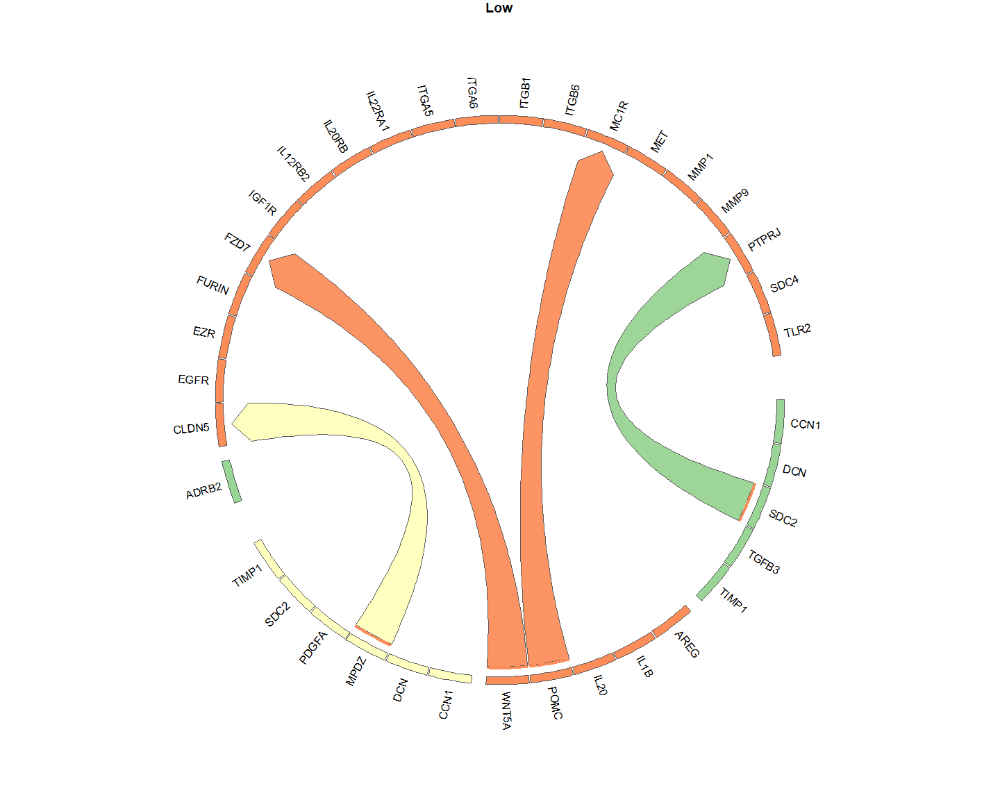<!-- -->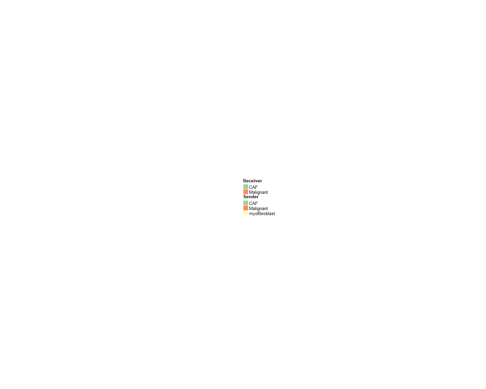<!-- -->

Now you can also make a full circos plot for one group of interest

``` r
# group_oi = "High"
# prioritized_tbl_oi = multinichenet_output$prioritization_tables$group_prioritization_tbl %>% 
#   filter(fraction_ligand_group > fraction_cutoff & fraction_receptor_group > fraction_cutoff & group == group_oi) %>% 
#   distinct(id, sender, receiver, ligand, receptor, group, prioritization_score, ligand_receptor_lfc_avg, fraction_expressing_ligand_receptor) %>% 
#   filter(ligand_receptor_lfc_avg > 0 & fraction_expressing_ligand_receptor > 0) %>% top_n(30, prioritization_score) 
# 
# senders_receivers = union(prioritized_tbl_oi$sender %>% unique(), prioritized_tbl_oi$receiver %>% unique())
# 
# colors_sender = RColorBrewer::brewer.pal(n = length(senders_receivers), name = 'Spectral') %>% magrittr::set_names(senders_receivers)
# colors_receiver = RColorBrewer::brewer.pal(n = length(senders_receivers), name = 'Spectral') %>% magrittr::set_names(senders_receivers)
# 
# circos_list = make_circos_one_group(prioritized_tbl_oi, colors_sender, colors_receiver)


circos_list = make_circos_one_group(prioritized_tbl_oi_high30, colors_sender, colors_receiver)
```

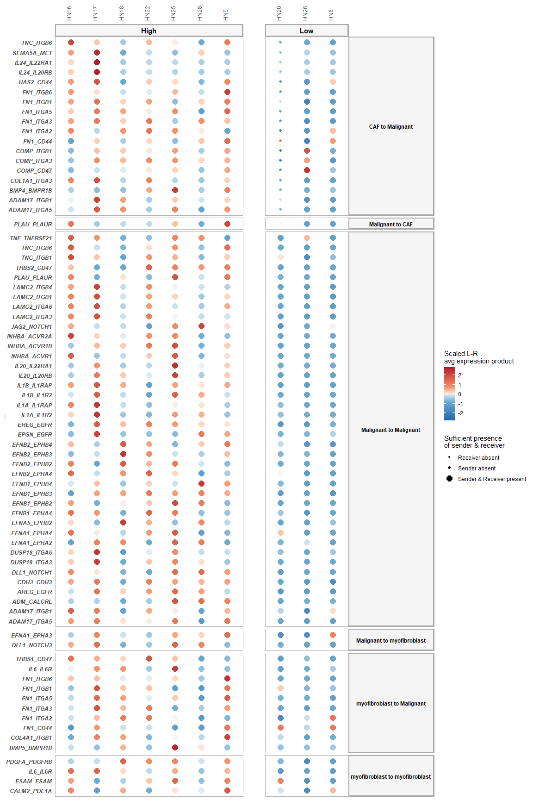<!-- --><!-- -->

``` r
circos_list = make_circos_one_group(prioritized_tbl_oi_low30, colors_sender, colors_receiver)
```

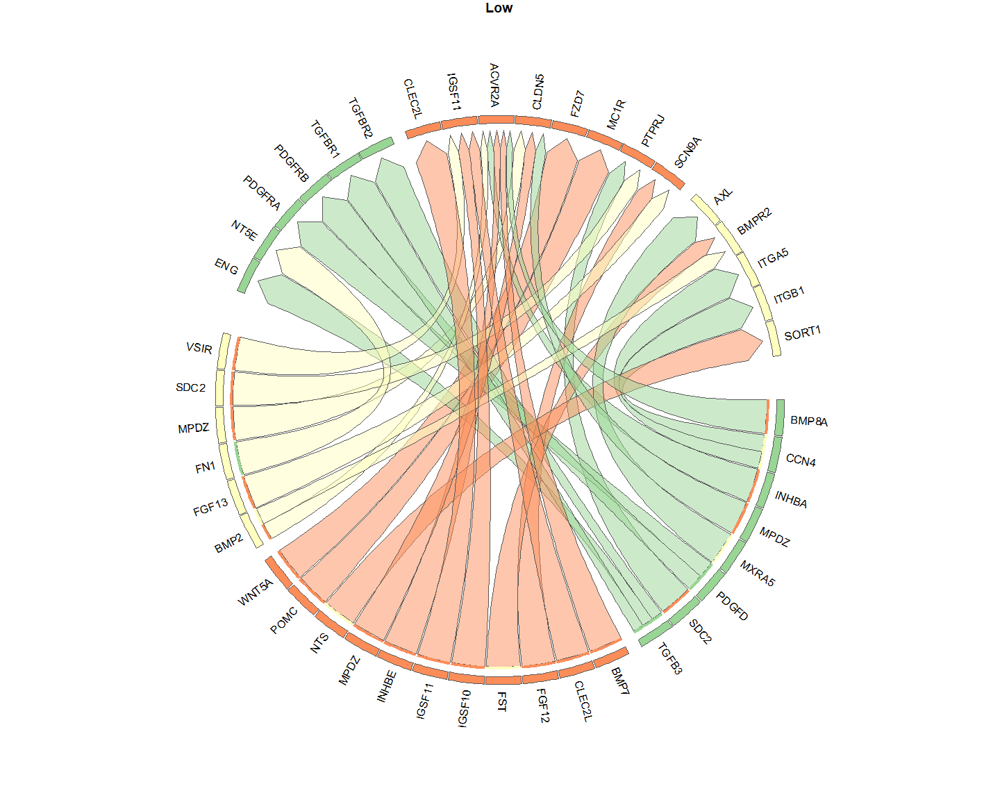<!-- -->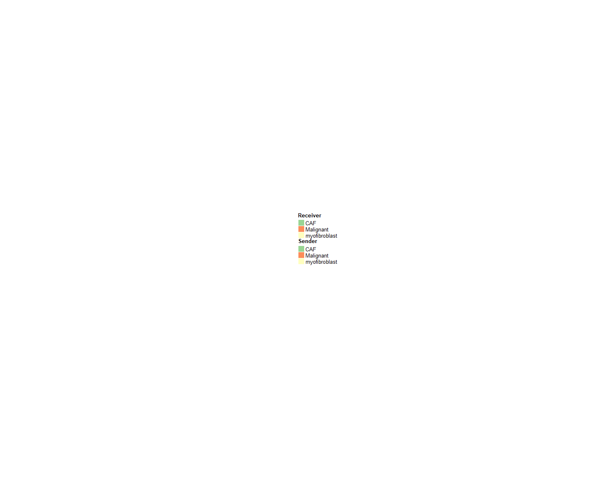<!-- -->

## Visualization of scaled\_LR\_prod per sample

Now we will visualize per sample the scaled product of ligand and
receptor expression. Samples that were left out of the DE analysis are
indicated with a smaller dot (this helps to indicate the samples that
did not contribute to the calculation of the logFC, and thus not
contributed to the final prioritization)

We will now check the top75 interactions specific for the pEMT high
group

``` r
group_oi = "High"
```

``` r
# prioritized_tbl_oi = multinichenet_output$prioritization_tables$group_prioritization_tbl %>%
#   distinct(id, sender, receiver, lr_interaction, group, ligand_receptor_lfc_avg, activity_scaled, fraction_expressing_ligand_receptor,  prioritization_score) %>%
#   filter(fraction_expressing_ligand_receptor > 0) %>%
#   filter(group == group_oi) %>% group_by(group) %>% top_n(75, prioritization_score)

prioritized_tbl_oi_high75 = get_top_n_lr_pairs(prioritization_tables, 75, groups_oi = group_oi)

plot_oi = make_sample_lr_prod_plots(multinichenet_output$prioritization_tables, prioritized_tbl_oi_high75)
plot_oi
```

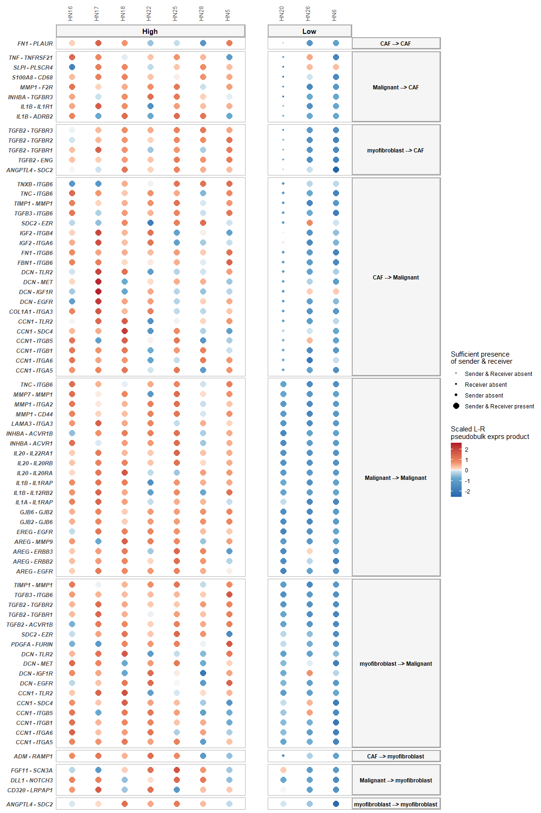<!-- -->

Next to these LR expression products, we can also plot the NicheNet
ligand activities of the ligand in the receiver.

``` r
# prioritized_tbl_oi = multinichenet_output$prioritization_tables$group_prioritization_tbl %>% 
#   distinct(id, sender, receiver, lr_interaction, group, ligand_receptor_lfc_avg, activity_scaled, fraction_expressing_ligand_receptor,  prioritization_score) %>% 
#   filter(fraction_expressing_ligand_receptor > 0) %>% 
#   filter(group == group_oi) %>% group_by(group) %>% top_n(150, prioritization_score) 

plot_oi = make_sample_lr_prod_activity_plots(multinichenet_output$prioritization_tables, prioritized_tbl_oi_high75, widths = c(4,1,1))
plot_oi
```

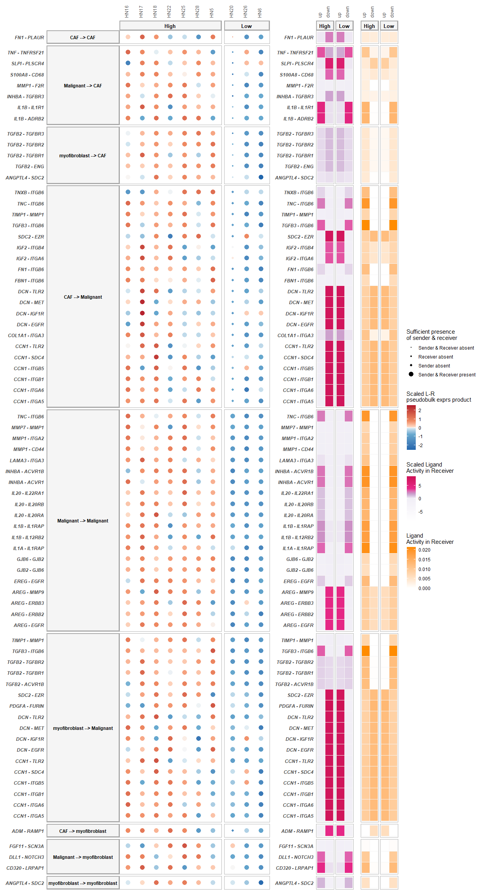<!-- -->

## Visualization of expression-logFC per group and ligand activity

Next type of plots will show the logFC of LR pairs across all
sender-receiver pairs that are selected, and add the ligand activity
next to it.

``` r
receiver_oi = "Malignant"
group_oi = "High"
```

``` r
# prioritized_tbl_oi = multinichenet_output$prioritization_tables$group_prioritization_tbl %>% 
#   filter(fraction_ligand_group > fraction_cutoff & fraction_receptor_group > fraction_cutoff) %>% 
#   distinct(id, sender, receiver, lr_interaction, group, ligand_receptor_lfc_avg, activity_scaled, fraction_ligand_group, fraction_expressing_ligand_receptor, scaled_avg_exprs_ligand, prioritization_score) %>% 
#   filter(fraction_expressing_ligand_receptor > 0) %>% 
#   filter(group == group_oi & receiver == receiver_oi) %>% top_n(75, prioritization_score) 

prioritized_tbl_oi_high75 = get_top_n_lr_pairs(prioritization_tables, 75, groups_oi = group_oi, receivers_oi = receiver_oi)


plot_oi = make_group_lfc_exprs_activity_plot(multinichenet_output$prioritization_tables, prioritized_tbl_oi_high75, receiver_oi, heights = c(5,1,1))
plot_oi
```

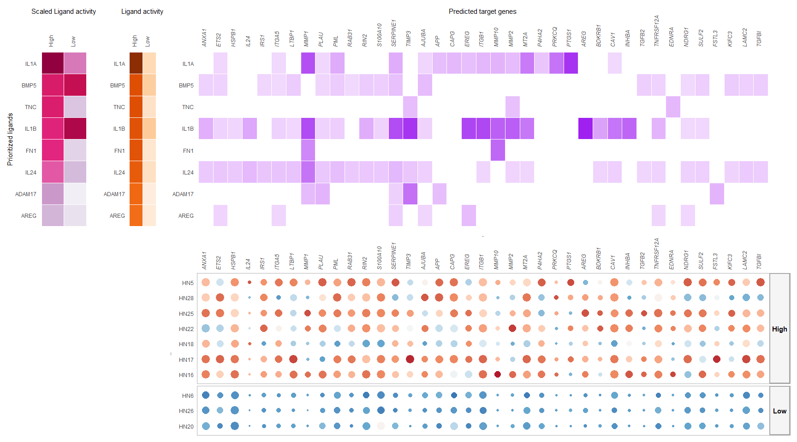<!-- -->

## Visualization of ligand-activity, ligand-target links, and target gene expression

In another type of plot, we can visualize the ligand activities for a
group-receiver combination, and show the predicted ligand-target links,
and also the expression of the predicted target genes across samples.

First: show this for a selection of ligands with high ligand activities:

``` r
# group_oi = "High"
# receiver_oi = "Malignant"
# prioritized_tbl_oi = multinichenet_output$prioritization_tables$group_prioritization_tbl %>% 
#   filter(fraction_ligand_group > fraction_cutoff & fraction_receptor_group > fraction_cutoff) %>% 
#   distinct(id, sender, receiver, ligand, receptor, group, prioritization_score, ligand_receptor_lfc_avg, fraction_expressing_ligand_receptor, activity_scaled) %>% 
#   filter(fraction_expressing_ligand_receptor > 0) %>% 
#   filter(group == group_oi & receiver == receiver_oi) %>% 
#   group_by(group) %>% top_n(50, prioritization_score) %>% top_n(25, activity_scaled) %>% arrange(-activity_scaled)
```

``` r
# combined_plot = make_ligand_activity_target_plot(group_oi, receiver_oi, prioritized_tbl_oi, multinichenet_output$prioritization_tables, multinichenet_output$ligand_activities_targets_DEgenes, contrast_tbl, multinichenet_output$grouping_tbl, multinichenet_output$celltype_info, ligand_target_matrix, plot_legend = FALSE)
# combined_plot
```

Now: show this for a selection of ligands with high general
prioritization scores, not necessarily high ligand activities.

``` r
# group_oi = "High"
# receiver_oi = "Malignant"
# prioritized_tbl_oi = multinichenet_output$prioritization_tables$group_prioritization_tbl %>% 
#   filter(fraction_ligand_group > fraction_cutoff & fraction_receptor_group > fraction_cutoff) %>% 
#   distinct(id, sender, receiver, ligand, receptor, group, prioritization_score, ligand_receptor_lfc_avg, fraction_expressing_ligand_receptor, activity_scaled) %>% 
#   filter(fraction_expressing_ligand_receptor > 0) %>% 
#   filter(group == group_oi & receiver == receiver_oi) %>% 
#   group_by(group) %>% top_n(100, prioritization_score) %>% arrange(-activity_scaled)
prioritized_tbl_oi_high30 = get_top_n_lr_pairs(prioritization_tables, 30, groups_oi = group_oi, receivers_oi = receiver_oi)
```

``` r
combined_plot = make_ligand_activity_target_plot(group_oi, receiver_oi, prioritized_tbl_oi_high30, multinichenet_output$prioritization_tables, multinichenet_output$ligand_activities_targets_DEgenes, contrast_tbl, multinichenet_output$grouping_tbl, multinichenet_output$celltype_info, ligand_target_matrix, plot_legend = FALSE)
combined_plot
## $combined_plot
```

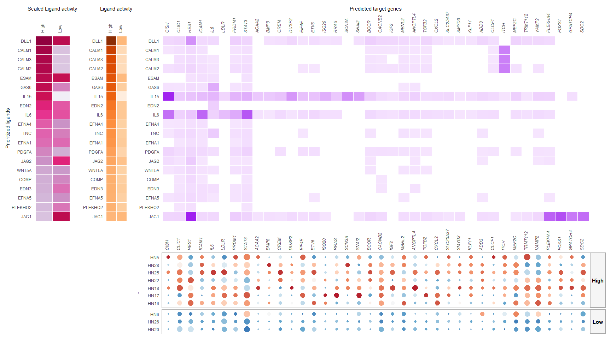<!-- -->

    ## 
    ## $legends

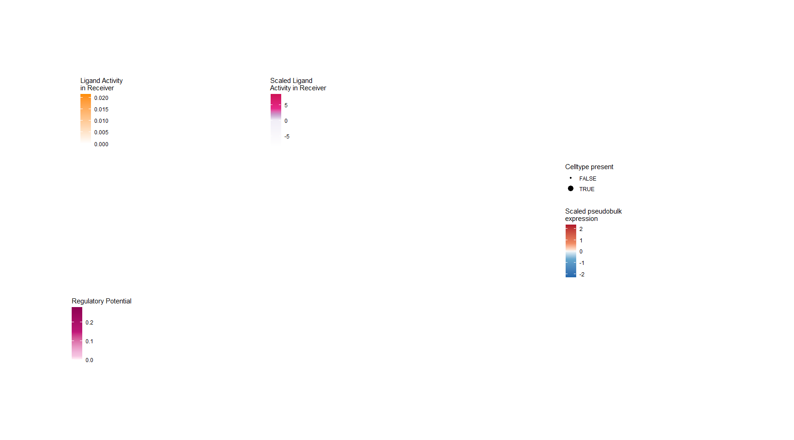<!-- -->

Of course you can look at other receivers as well:

``` r
group_oi = "High"
receiver_oi = "myofibroblast"
# prioritized_tbl_oi = multinichenet_output$prioritization_tables$group_prioritization_tbl %>% 
#   filter(fraction_ligand_group > fraction_cutoff & fraction_receptor_group > fraction_cutoff) %>% 
#   distinct(id, sender, receiver, ligand, receptor, group, prioritization_score, ligand_receptor_lfc_avg, fraction_expressing_ligand_receptor, activity_scaled) %>% 
#   filter(fraction_expressing_ligand_receptor > 0) %>% 
#   filter(group == group_oi & receiver == receiver_oi) %>% 
#   group_by(group) %>% top_n(25, prioritization_score) %>% arrange(-activity_scaled)
prioritized_tbl_oi_high30 = get_top_n_lr_pairs(prioritization_tables, 30, groups_oi = group_oi, receivers_oi = receiver_oi)
```

``` r
combined_plot = make_ligand_activity_target_plot(group_oi, receiver_oi, prioritized_tbl_oi_high30, multinichenet_output$prioritization_tables, multinichenet_output$ligand_activities_targets_DEgenes, contrast_tbl, multinichenet_output$grouping_tbl, multinichenet_output$celltype_info, ligand_target_matrix, plot_legend = FALSE)
combined_plot
## $combined_plot
```

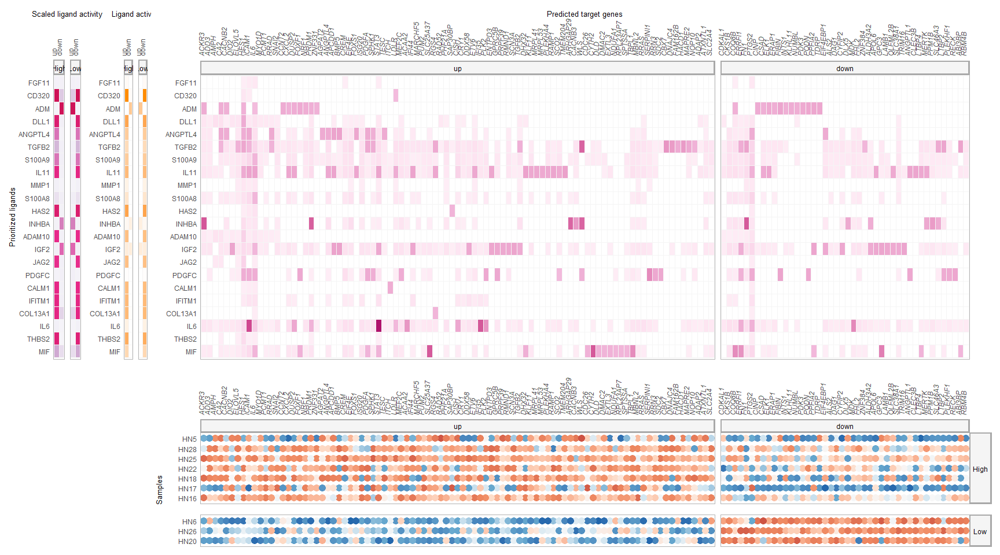<!-- -->

    ## 
    ## $legends

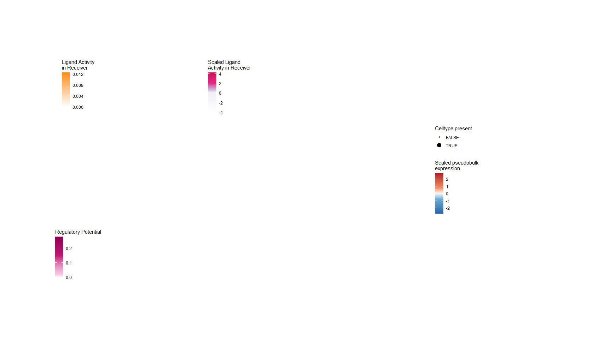<!-- -->

## Show ligand activities for each receiver-group combination

In the next type of plot, we plot all the ligand activities (Both scaled
and absolute activities) of each receiver-group combination. This can
give us some insights in active signaling pathways across groups. Note
that we can thus show top ligands based on ligand activity - agnostic of
expression in sender.

``` r
ligands_oi = multinichenet_output$prioritization_tables$ligand_activities_target_de_tbl %>% inner_join(contrast_tbl) %>% 
  group_by(group, receiver) %>% distinct(ligand, receiver, group, activity) %>% 
  top_n(5, activity) %>% pull(ligand) %>% unique()

plot_oi = make_ligand_activity_plots(multinichenet_output$prioritization_tables, ligands_oi, contrast_tbl, widths = NULL)
plot_oi
```

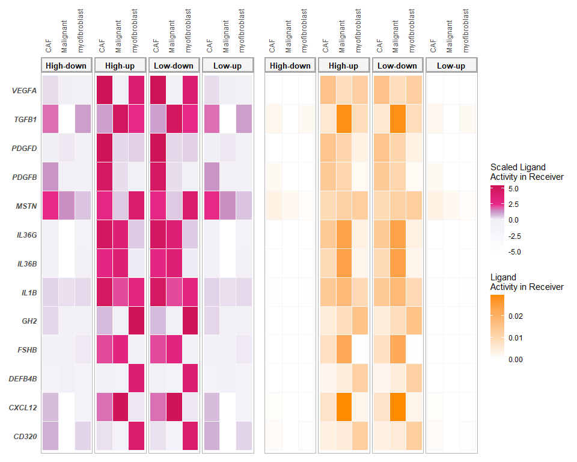<!-- -->

Or we can do this plot for ligands, while considering the general
priorization score (which considers expression information etc)

Show top ligands based on prioritization scores

``` r
ligands_oi = multinichenet_output$prioritization_tables$group_prioritization_tbl %>% 
  group_by(group, receiver) %>% distinct(ligand, receiver, group, prioritization_score) %>% 
  top_n(5, prioritization_score) %>% pull(ligand) %>% unique()

plot_oi = make_ligand_activity_plots(multinichenet_output$prioritization_tables, ligands_oi, contrast_tbl, widths = NULL)
plot_oi
```

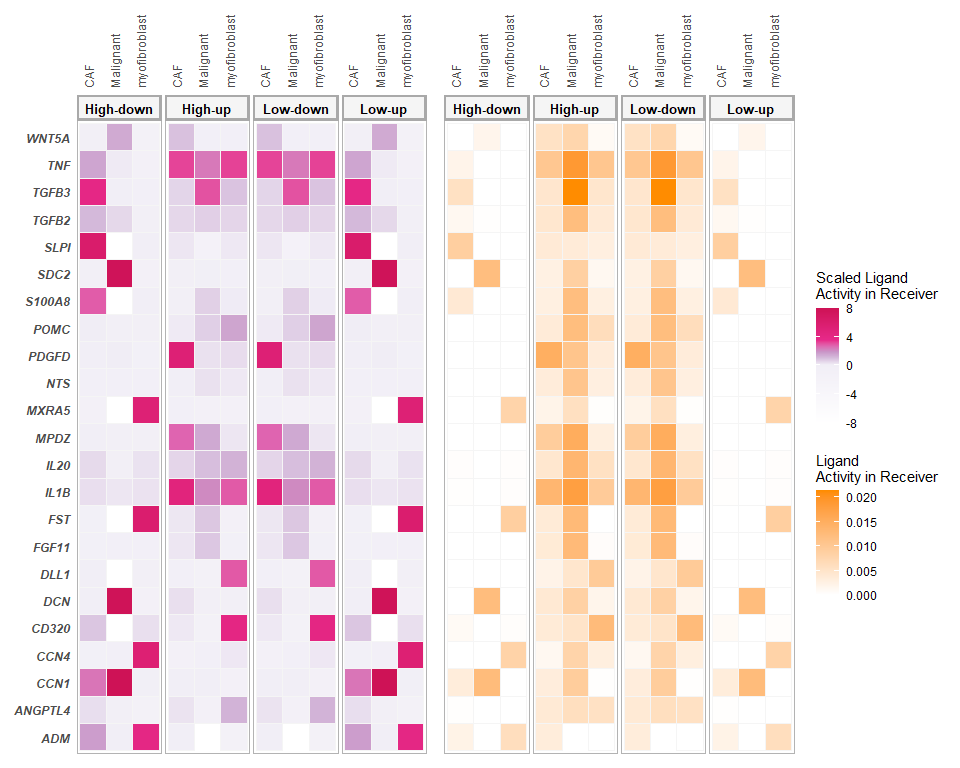<!-- -->

## Zoom in on specific ligand-receptor interactions: show their expression in the single-cell data!

Single-cell-based Feature, and Violin plots of ligand-receptor
interaction of interest: `make_ligand_receptor_feature_plot` and
`make_ligand_receptor_violin_plot`

It is often useful to zoom in on specific ligand-receptor interactions
of interest by looking in more detail to their expression at the single
cell level

Check the highest scoring links based on the general prioritization
score. Here we will pick one of those to visualize.

``` r
prioritized_tbl_oi_high30
## # A tibble: 30 x 8
## # Groups:   group [1]
##    group sender        receiver      ligand  receptor id                                        prioritization_score prioritization_rank
##    <chr> <chr>         <chr>         <chr>   <chr>    <chr>                                                    <dbl>               <dbl>
##  1 High  Malignant     myofibroblast FGF11   SCN3A    FGF11_SCN3A_Malignant_myofibroblast                       2.07                   1
##  2 High  Malignant     myofibroblast CD320   LRPAP1   CD320_LRPAP1_Malignant_myofibroblast                      2.06                   2
##  3 High  CAF           myofibroblast ADM     RAMP1    ADM_RAMP1_CAF_myofibroblast                               2.03                   3
##  4 High  Malignant     myofibroblast DLL1    NOTCH3   DLL1_NOTCH3_Malignant_myofibroblast                       2.03                   4
##  5 High  myofibroblast myofibroblast ANGPTL4 SDC2     ANGPTL4_SDC2_myofibroblast_myofibroblast                  2.03                   5
##  6 High  myofibroblast myofibroblast ANGPTL4 ITGB1    ANGPTL4_ITGB1_myofibroblast_myofibroblast                 2.00                   6
##  7 High  myofibroblast myofibroblast ANGPTL4 ITGAV    ANGPTL4_ITGAV_myofibroblast_myofibroblast                 2.00                   7
##  8 High  myofibroblast myofibroblast TGFB2   TGFBR3   TGFB2_TGFBR3_myofibroblast_myofibroblast                  2.00                   8
##  9 High  Malignant     myofibroblast S100A9  CD36     S100A9_CD36_Malignant_myofibroblast                       1.99                   9
## 10 High  CAF           myofibroblast IL11    IL6R     IL11_IL6R_CAF_myofibroblast                               1.99                  10
## # ... with 20 more rows
```

``` r
ligand_oi = "DLL1"
receptor_oi = "NOTCH3"
group_oi = "High"
sender_oi = "Malignant"
receiver_oi = "myofibroblast"
```

Nebulosa and Feature plot of the ligand in the sender cell type and the
receptor in the receiver cell type (split per condition)

``` r
p_feature = make_ligand_receptor_feature_plot(sce_sender = sce, sce_receiver = sce, ligand_oi = ligand_oi, receptor_oi = receptor_oi, group_oi = group_oi, group_id = group_id, celltype_id_sender = celltype_id, celltype_id_receiver = celltype_id, senders_oi = c("Malignant","myofibroblast","CAF"), receivers_oi = c("Malignant","myofibroblast","CAF"))

p_feature
```

<!-- -->
Pooled single-cell and sample-specific single-cell violin plots of
ligand and receptor expression in respectively sender and receiver.

``` r
p_violin = make_ligand_receptor_violin_plot(sce_sender = sce, sce_receiver = sce, ligand_oi = ligand_oi, receptor_oi = receptor_oi, group_oi = group_oi, group_id = group_id, sender_oi = sender_oi, receiver_oi = receiver_oi, sample_id = sample_id, celltype_id_sender = celltype_id, celltype_id_receiver = celltype_id)
p_violin
```

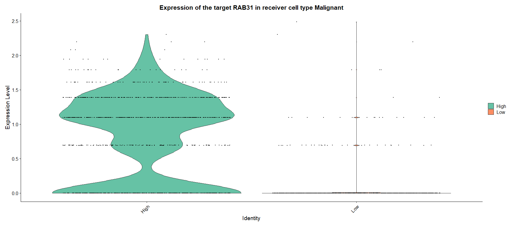<!-- -->

## Zoom in on specific ligand-target interactions: show their expression in the single-cell data!

Make target gene violin and feature plots: `make_target_violin_plot` and
`make_target_feature_plot`

``` r
receiver_oi = "Malignant"
group_oi = "High"

multinichenet_output$ligand_activities_targets_DEgenes$de_genes_df %>% inner_join(contrast_tbl) %>% filter(p_val <= 0.05) %>% filter(group == group_oi) %>% filter(receiver == receiver_oi) %>% arrange(p_val) %>% top_n(100, logFC)  
## # A tibble: 100 x 7
##    gene   receiver  logFC   p_val p_adj contrast group
##    <chr>  <chr>     <dbl>   <dbl> <dbl> <chr>    <chr>
##  1 RAB31  Malignant  3    0.00200 0.999 High-Low High 
##  2 AHNAK2 Malignant  2.3  0.00260 0.999 High-Low High 
##  3 GSDMC  Malignant  3.19 0.00306 0.999 High-Low High 
##  4 ITGB6  Malignant  3.75 0.00433 0.999 High-Low High 
##  5 ITGA3  Malignant  1.85 0.00497 0.999 High-Low High 
##  6 CA2    Malignant  5.8  0.00562 0.999 High-Low High 
##  7 GALNT6 Malignant  1.76 0.00597 0.999 High-Low High 
##  8 KCNK6  Malignant  2.57 0.00681 0.999 High-Low High 
##  9 PLEK2  Malignant  1.93 0.00687 0.999 High-Low High 
## 10 GJB6   Malignant  3.33 0.00819 0.999 High-Low High 
## # ... with 90 more rows
```

RAB31: interesting gene

``` r
target_oi = "RAB31"

make_target_violin_plot(sce_receiver = sce, target_oi = target_oi, receiver_oi = receiver_oi, group_oi = group_oi, group_id = group_id, sample_id, celltype_id_receiver = celltype_id)
```

<!-- -->

``` r
make_target_feature_plot(sce_receiver = sce, target_oi = target_oi, group_oi = group_oi, group_id = group_id, celltype_id_receiver = celltype_id, receivers_oi = c("Malignant","myofibroblast","CAF")) 
```

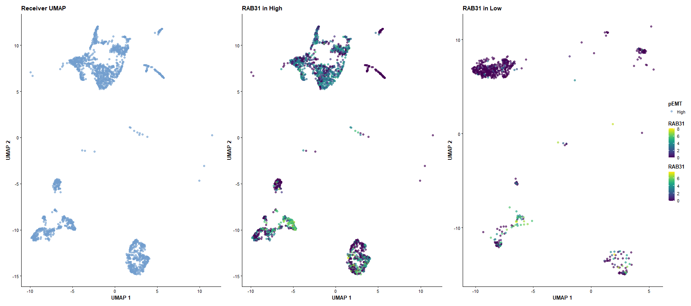<!-- -->

## Make Dotplot for all DE genes/targets

Note: DE here determined based on the parameters used for the
MultiNicheNet analysis (cf above): this means that DE genes are here not
based on the p-value corrected for multiple testing!

``` r
receiver_oi = "Malignant"
group_oi = "High"

targets_oi = multinichenet_output$ligand_activities_targets_DEgenes$de_genes_df %>% inner_join(contrast_tbl) %>% filter(group == group_oi) %>% arrange(p_val) %>% filter(receiver == receiver_oi) %>% pull(gene) %>% unique()
```

``` r
p_target = make_DEgene_dotplot_pseudobulk(targets_oi, celltype_info = multinichenet_output$celltype_info, prioritization_tables,  receiver_oi, multinichenet_output$grouping_tbl)
p_target$pseudobulk_plot + ggtitle(paste0("DE genes in ",group_oi, " in celltype ",receiver_oi))
```

<!-- -->

## Visualization of expression-correlated target genes of ligand-receptor pairs

Before, we had calculated the correlation in expression between
ligand-receptor pairs and DE genes. Now we will filter out correlated
ligand-receptor –&gt; target links that both show high expression
correlation (spearman or activity &gt; 0.75 in this example) and have
some prior knowledge to support their link.

To filter we can use one of these two options:
`lr_target_prior_cor_filtered` (recommended and based on ligand-target
prior knowledge: the target should be a top target of the ligand, and
the ligand should be a top ligand for the target) or
`lr_target_prior_cor_filtered_original` (based on the same ligand-target
df returned by default in classic NicheNet: focuses on top targets of a
ligand only, and not necessarily the reverse)

``` r
group_oi = "High"
receiver_oi = "Malignant"
lr_target_prior_cor_filtered = multinichenet_output$lr_target_prior_cor %>% inner_join(ligand_activities_targets_DEgenes$ligand_activities %>% distinct(ligand, target, direction_regulation, contrast)) %>% inner_join(contrast_tbl) %>% filter(group == group_oi, receiver == receiver_oi)
# lr_target_prior_cor_filtered = multinichenet_output$lr_target_prior_cor %>% filter( (rank_of_target < top_n_target | rank_of_ligand < 10) & (pearson > 0.75 | spearman > 0.75))
lr_target_prior_cor_filtered_up = lr_target_prior_cor_filtered %>% filter(direction_regulation == "up") %>% filter( (rank_of_target < top_n_target) & (pearson > 0.75 | spearman > 0.75))
lr_target_prior_cor_filtered_down = lr_target_prior_cor_filtered %>% filter(direction_regulation == "down") %>% filter( (rank_of_target < top_n_target) & (pearson < -0.75 | spearman < -0.75))
lr_target_prior_cor_filtered = bind_rows(lr_target_prior_cor_filtered_up, lr_target_prior_cor_filtered_down)
```

Now we will visualize the top correlated hits for the LR pairs that are
also in the top200 pairs discriminating both groups from each others:

``` r
# prioritized_tbl_oi = multinichenet_output$prioritization_tables$group_prioritization_tbl %>% distinct(id, ligand, receptor, sender, receiver, lr_interaction, group, ligand_receptor_lfc_avg, activity_scaled, fraction_expressing_ligand_receptor,  prioritization_score) %>% filter(fraction_expressing_ligand_receptor > 0 & ligand_receptor_lfc_avg > 0) %>% filter(group == group_oi & receiver == receiver_oi) %>% top_n(100, prioritization_score)
# # prioritized_tbl_oi = prioritized_tbl_oi %>% filter(id %in% lr_target_prior_cor_filtered$id)
prioritized_tbl_oi = get_top_n_lr_pairs(prioritization_tables, 100, groups_oi = group_oi, receivers_oi = receiver_oi)
# prioritized_tbl_oi = prioritized_tbl_oi %>% group_by(ligand, sender, group) %>% top_n(3, prioritization_score) # keep max three receptors per ligand - for visualization purposes
```

First: show the LR–&gt;Target heatmap of prior knowledge supported and
correlated links (shows both measure of correlation and measure of prior
knowledge)

``` r
lr_target_prior_cor_heatmap = make_lr_target_prior_cor_heatmap(lr_target_prior_cor_filtered_up %>% filter(receiver == receiver_oi & id %in% prioritized_tbl_oi$id), add_grid = FALSE)
lr_target_prior_cor_heatmap
```

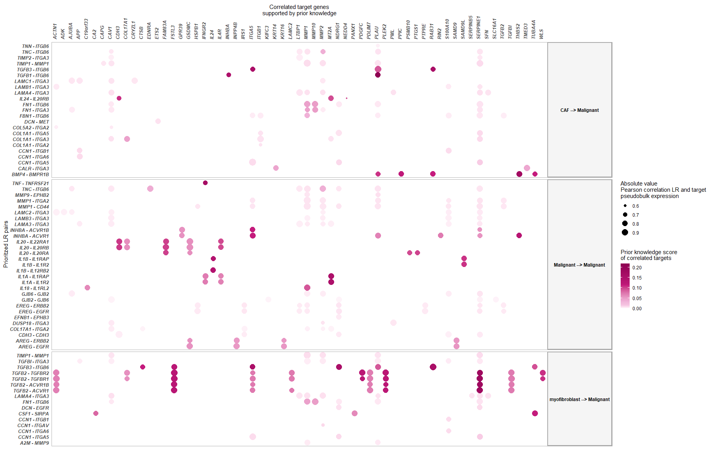<!-- -->

``` r
lr_target_prior_cor_heatmap = make_lr_target_prior_cor_heatmap(lr_target_prior_cor_filtered_up %>% filter(receiver == receiver_oi & id %in% prioritized_tbl_oi$id), add_grid = TRUE)
lr_target_prior_cor_heatmap
```

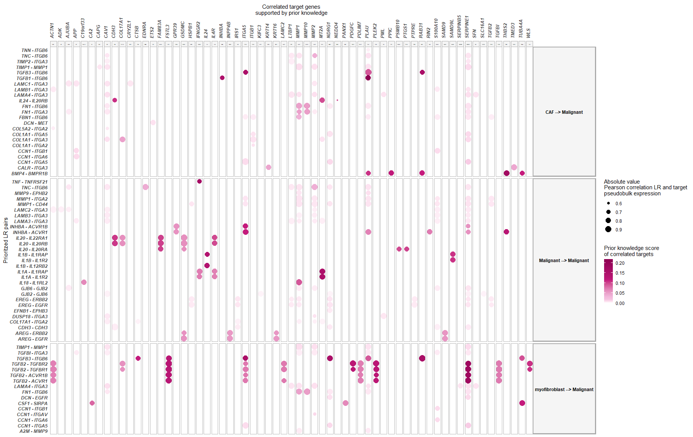<!-- -->

``` r
lr_target_prior_cor_heatmap = make_lr_target_prior_cor_heatmap(lr_target_prior_cor_filtered_down %>% filter(receiver == receiver_oi & id %in% prioritized_tbl_oi$id), add_grid = FALSE)
lr_target_prior_cor_heatmap
```

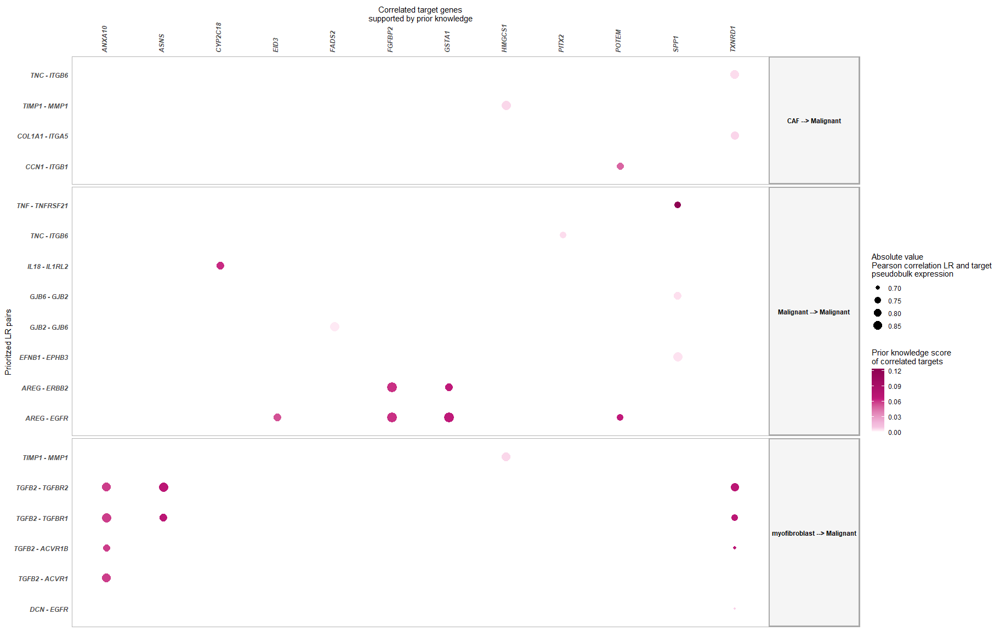<!-- -->

``` r
lr_target_prior_cor_heatmap = make_lr_target_prior_cor_heatmap(lr_target_prior_cor_filtered_down %>% filter(receiver == receiver_oi & id %in% prioritized_tbl_oi$id), add_grid = TRUE)
lr_target_prior_cor_heatmap
```

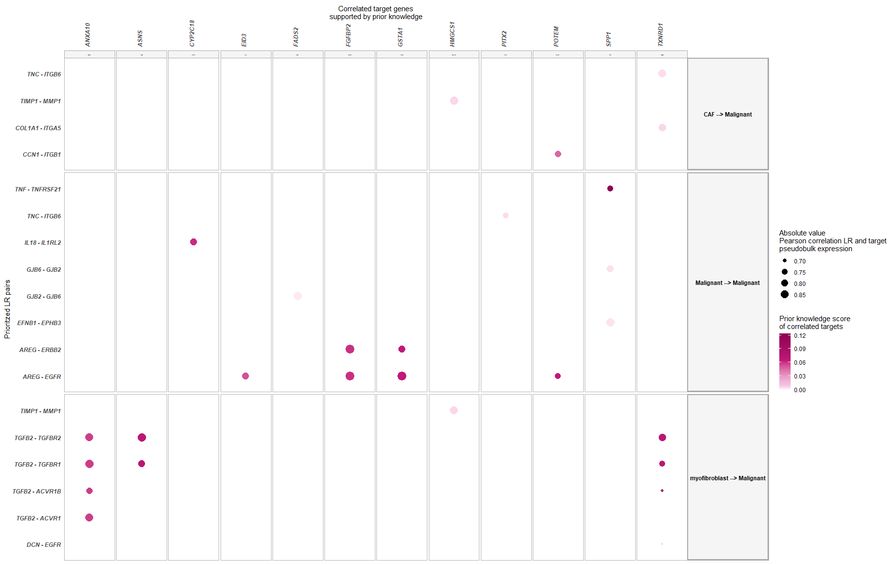<!-- -->

Now visualize these links together with the LR and target expression, to
visualize the expression correlation

``` r
lr_target_correlation_plot = make_lr_target_correlation_plot(multinichenet_output$prioritization_tables, prioritized_tbl_oi,  lr_target_prior_cor_filtered , multinichenet_output$grouping_tbl, multinichenet_output$celltype_info, receiver_oi,plot_legend = FALSE)
lr_target_correlation_plot$combined_plot
```

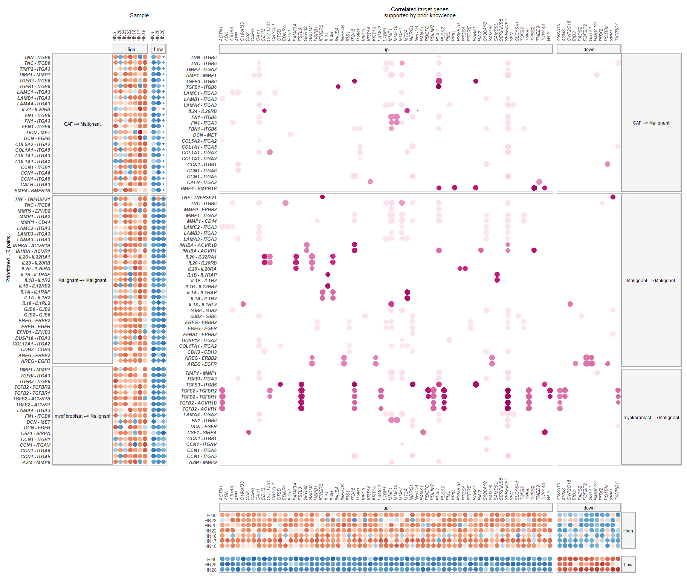<!-- -->

You can also visualize the expression correlation in the following way
for a selected LR pair and their targets:

``` r
ligand_oi = "TGFB3"
receptor_oi = "ITGB6"
sender_oi = "CAF"
receiver_oi = "Malignant"
lr_target_scatter_plot = make_lr_target_scatter_plot(multinichenet_output$prioritization_tables, ligand_oi, receptor_oi, sender_oi, receiver_oi, multinichenet_output$celltype_info, multinichenet_output$grouping_tbl, lr_target_prior_cor_filtered)
lr_target_scatter_plot
```

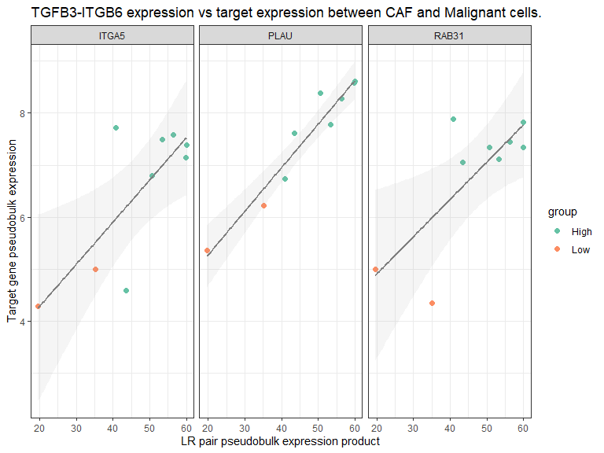<!-- -->

``` r
ligand_oi = "TGFB2"
receptor_oi = "TGFBR2"
sender_oi = "myofibroblast"
receiver_oi = "Malignant"
lr_target_scatter_plot = make_lr_target_scatter_plot(multinichenet_output$prioritization_tables, ligand_oi, receptor_oi, sender_oi, receiver_oi, multinichenet_output$celltype_info, multinichenet_output$grouping_tbl, lr_target_prior_cor_filtered)
lr_target_scatter_plot
```

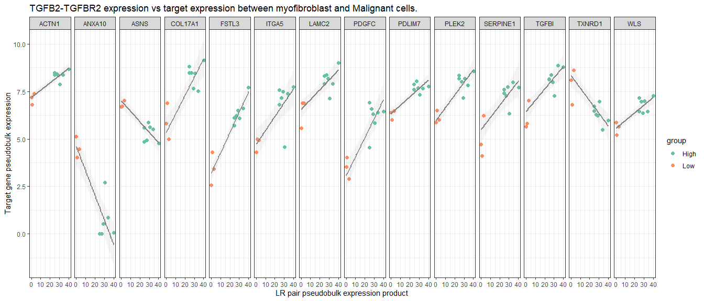<!-- -->

For these targets, you can also visualize the ‘prior knowledge’
ligand-receptor-to-target signaling paths. This is done similarly to the
workflow described in
<https://github.com/saeyslab/nichenetr/blob/master/vignettes/ligand_target_signaling_path.md>

``` r
targets_all = lr_target_prior_cor_filtered %>% filter(ligand == ligand_oi & receiver == receiver_oi & sender == sender_oi & receptor == receptor_oi)  %>% pull(target) %>% unique()
  
active_signaling_network = nichenetr::get_ligand_signaling_path_with_receptor(ligand_tf_matrix = ligand_tf_matrix, ligands_all = ligand_oi, receptors_all = receptor_oi, targets_all = targets_all, weighted_networks = weighted_networks, top_n_regulators = 2)
data_source_network = nichenetr::infer_supporting_datasources(signaling_graph_list = active_signaling_network,lr_network = lr_network, sig_network = sig_network, gr_network = gr_network)
  
active_signaling_network_min_max = active_signaling_network
active_signaling_network_min_max$sig = active_signaling_network_min_max$sig %>% mutate(weight = ((weight-min(weight))/(max(weight)-min(weight))) + 0.75)
active_signaling_network_min_max$gr = active_signaling_network_min_max$gr %>% mutate(weight = ((weight-min(weight))/(max(weight)-min(weight))) + 0.75)
colors = c("ligand" = "purple", "receptor" = "orange", "target" = "royalblue", "mediator" = "grey60")
ggraph_signaling_path = suppressWarnings(make_ggraph_signaling_path(active_signaling_network_min_max, colors, ligand_oi, receptor_oi, targets_all))
ggraph_signaling_path$plot
```

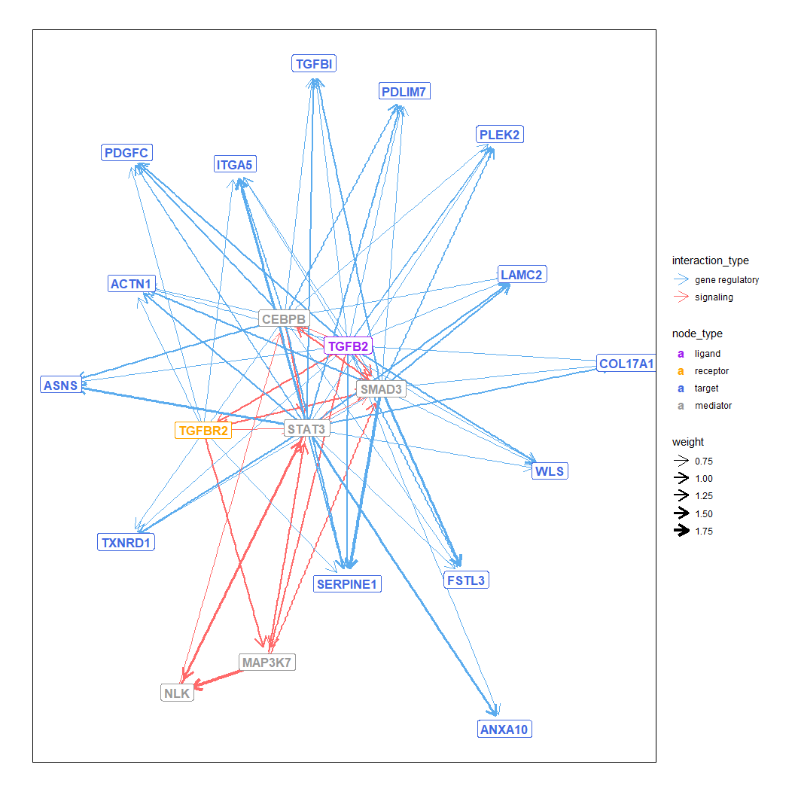<!-- -->

``` r
data_source_network %>% head()
## # A tibble: 6 x 7
##   from  to    source             database       layer      ligand receptor
##   <chr> <chr> <chr>              <chr>          <chr>      <chr>  <chr>   
## 1 CEBPB ACTN1 harmonizome_ENCODE harmonizome_gr regulatory <NA>   <NA>    
## 2 CEBPB ASNS  harmonizome_ENCODE harmonizome_gr regulatory <NA>   <NA>    
## 3 CEBPB ASNS  trrust             trrust         regulatory <NA>   <NA>    
## 4 CEBPB ASNS  HTRIDB             HTRIDB         regulatory <NA>   <NA>    
## 5 CEBPB ASNS  omnipath_ABC       omnipath       regulatory <NA>   <NA>    
## 6 CEBPB FSTL3 harmonizome_ENCODE harmonizome_gr regulatory <NA>   <NA>
```

As last plot, we can generate a ‘systems’ view of the intercellular
feedback processes than can be occuring between the different cell
populations involved. In this plot, we will draw links between ligands
of sender cell types their ligand/receptor-annotated target genes in
receiver cell types.

``` r
group_oi = "High"

prioritized_tbl_oi = get_top_n_lr_pairs(prioritization_tables, 100, groups_oi = group_oi)

lr_target_prior_cor_filtered = multinichenet_output$lr_target_prior_cor %>% inner_join(ligand_activities_targets_DEgenes$ligand_activities %>% distinct(ligand, target, direction_regulation, contrast)) %>% inner_join(contrast_tbl) %>% filter(group == group_oi)
lr_target_prior_cor_filtered_up = lr_target_prior_cor_filtered %>% filter(direction_regulation == "up") %>% filter( (rank_of_target < top_n_target) & (pearson > 0.75 | spearman > 0.75))
lr_target_prior_cor_filtered_down = lr_target_prior_cor_filtered %>% filter(direction_regulation == "down") %>% filter( (rank_of_target < top_n_target) & (pearson < -0.75 | spearman < -0.75))
lr_target_prior_cor_filtered = bind_rows(lr_target_prior_cor_filtered_up, lr_target_prior_cor_filtered_down)

colors_sender["myofibroblast"] = "blue"
graph_plot = make_ggraph_ligand_target_links(lr_target_prior_cor_filtered = lr_target_prior_cor_filtered, prioritized_tbl_oi = prioritized_tbl_oi, colors = colors_sender)
graph_plot$plot
```

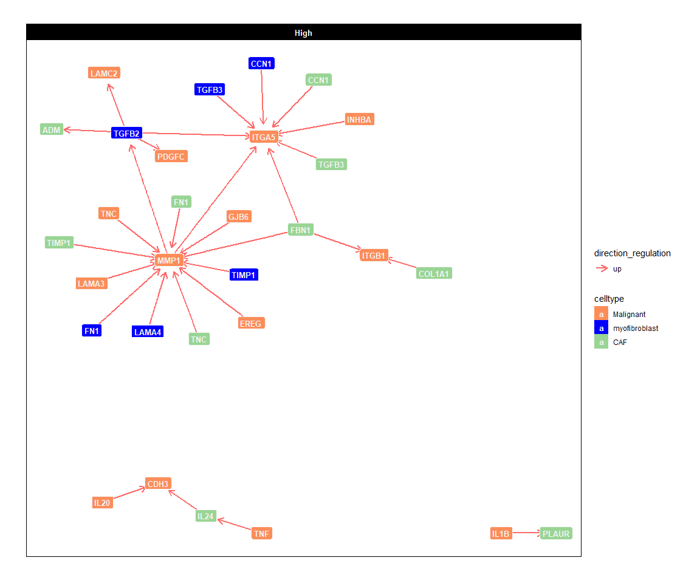<!-- -->

Make a double prioritization table: do this for every condition

``` r
prioritized_tbl_oi = get_top_n_lr_pairs(prioritization_tables, 150, rank_per_group = FALSE)

lr_target_prior_cor_filtered = prioritization_tables$group_prioritization_tbl$group %>% unique() %>% lapply(function(group_oi){
  lr_target_prior_cor_filtered = multinichenet_output$lr_target_prior_cor %>% inner_join(ligand_activities_targets_DEgenes$ligand_activities %>% distinct(ligand, target, direction_regulation, contrast)) %>% inner_join(contrast_tbl) %>% filter(group == group_oi)
  lr_target_prior_cor_filtered_up = lr_target_prior_cor_filtered %>% filter(direction_regulation == "up") %>% filter( (rank_of_target < top_n_target) & (pearson > 0.75 | spearman > 0.75))
  lr_target_prior_cor_filtered_down = lr_target_prior_cor_filtered %>% filter(direction_regulation == "down") %>% filter( (rank_of_target < top_n_target) & (pearson < -0.75 | spearman < -0.75))
  lr_target_prior_cor_filtered = bind_rows(lr_target_prior_cor_filtered_up, lr_target_prior_cor_filtered_down)
}) %>% bind_rows()
```

``` r
graph_plot = make_ggraph_ligand_target_links(lr_target_prior_cor_filtered = lr_target_prior_cor_filtered, prioritized_tbl_oi = prioritized_tbl_oi, colors = colors_sender)
graph_plot$plot
```

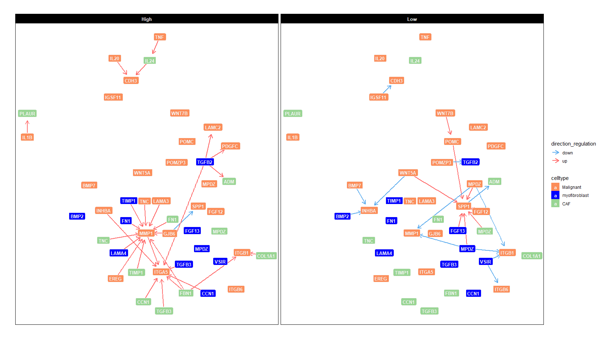<!-- -->

``` r
graph_plot$source_df_lt %>% head()
## # A tibble: 6 x 6
##   sender              receiver        direction_regulation group type          weight
##   <chr>               <chr>           <fct>                <chr> <chr>          <dbl>
## 1 Malignant_TNF       CAF_IL24        up                   High  Ligand-Target      1
## 2 myofibroblast_TGFB2 CAF_ADM         up                   High  Ligand-Target      1
## 3 myofibroblast_TGFB2 Malignant_LAMC2 up                   High  Ligand-Target      1
## 4 myofibroblast_TGFB2 Malignant_PDGFC up                   High  Ligand-Target      1
## 5 Malignant_GJB6      Malignant_SPP1  down                 High  Ligand-Target      1
## 6 Malignant_WNT5A     Malignant_SPP1  up                   Low   Ligand-Target      1
graph_plot$nodes_df %>% head()
##                                    node      celltype   gene       type_gene
## Malignant_MMP1           Malignant_MMP1     Malignant   MMP1 ligand/receptor
## Malignant_CDH3           Malignant_CDH3     Malignant   CDH3 ligand/receptor
## Malignant_IGSF11       Malignant_IGSF11     Malignant IGSF11 ligand/receptor
## Malignant_TNF             Malignant_TNF     Malignant    TNF          ligand
## myofibroblast_TGFB2 myofibroblast_TGFB2 myofibroblast  TGFB2          ligand
## Malignant_GJB6           Malignant_GJB6     Malignant   GJB6          ligand
```

## Unsupervised analysis

Perform PCA on the pseudobulk LR-prod matrix of each sample. Can we see
patterns of heterogeneity between the patients, in addition to the
expect group differences? This can be useful to get insights into
important sources of variation in your data, which you could consider
using as a covariate in the MultiNicheNet analysis.

## References
