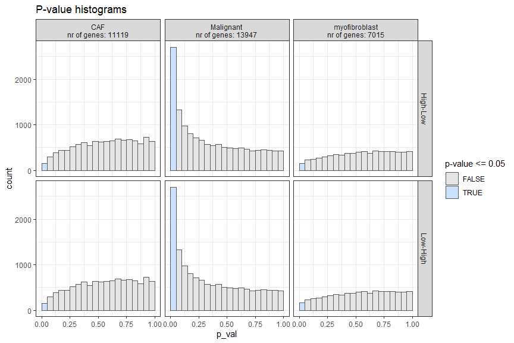
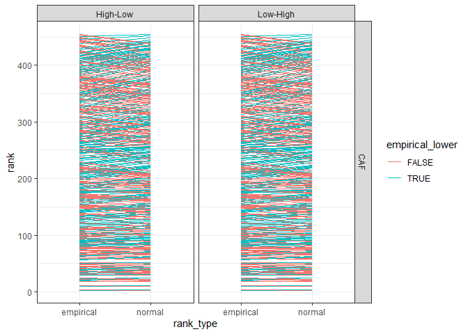
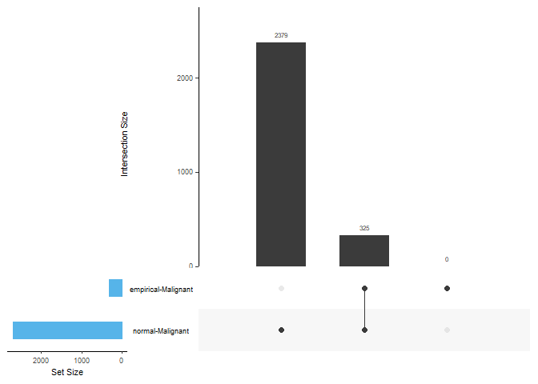
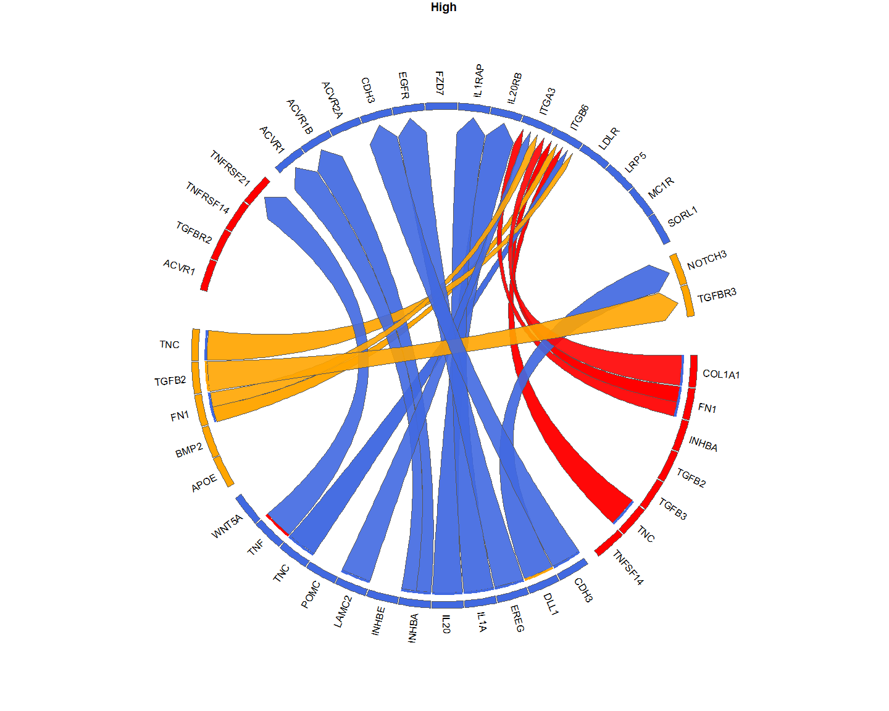
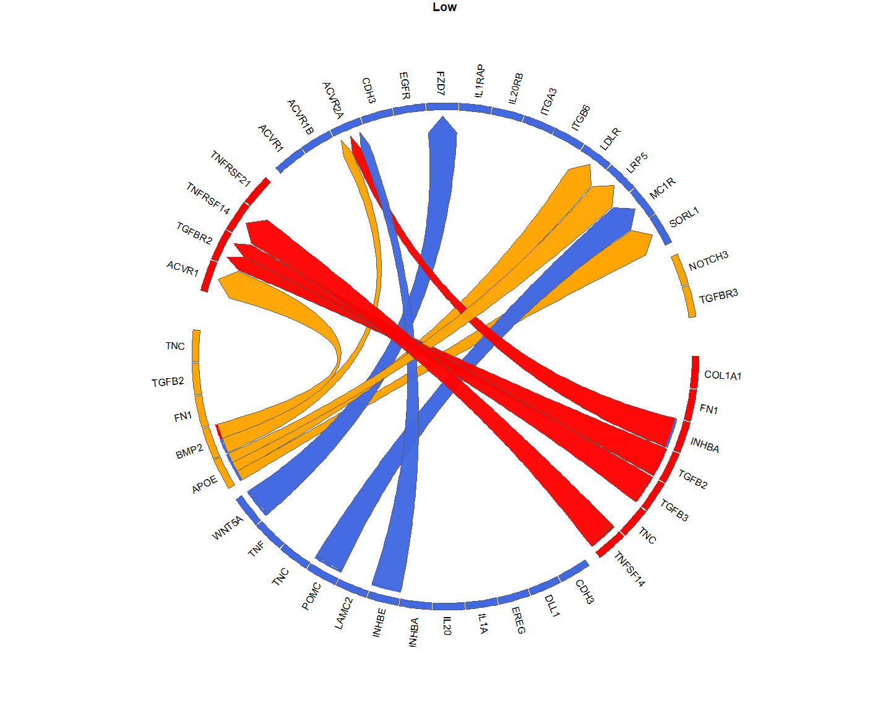
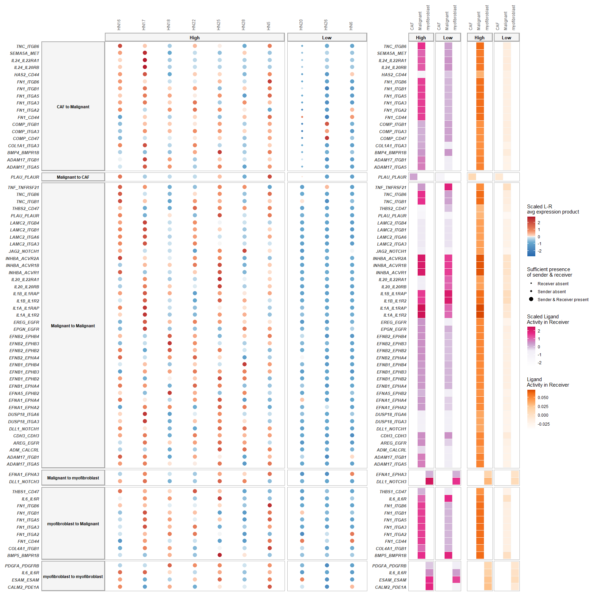
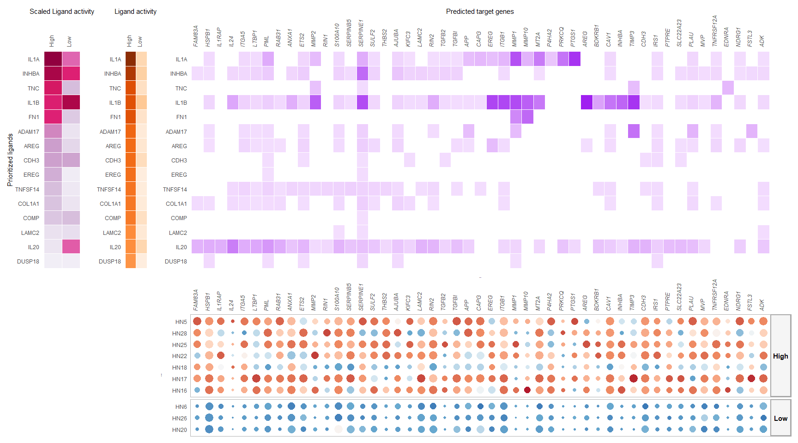
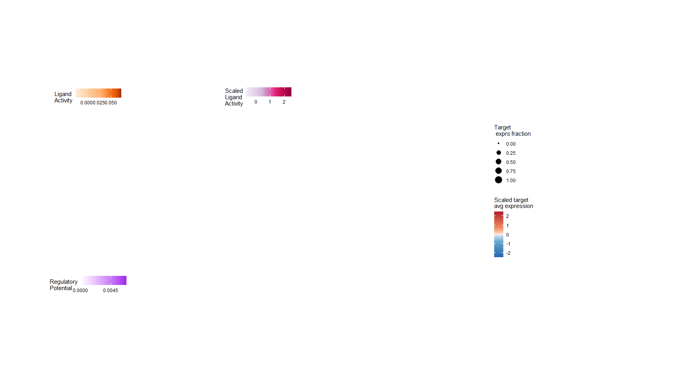
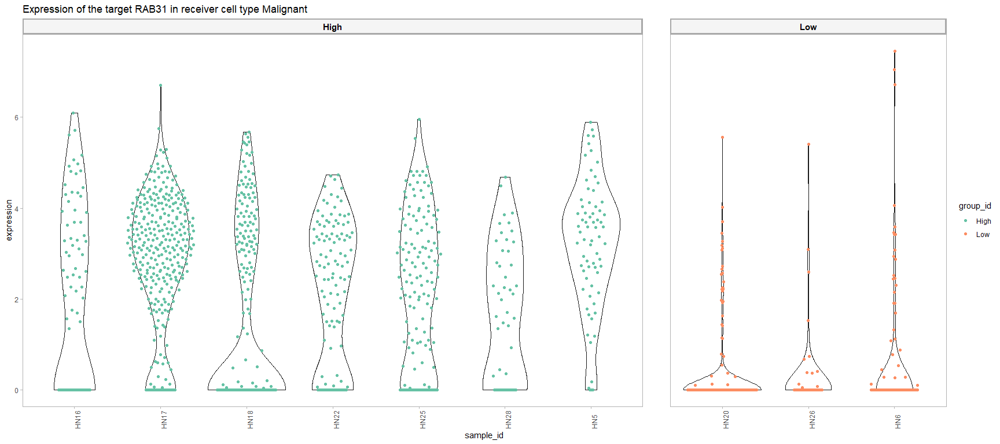
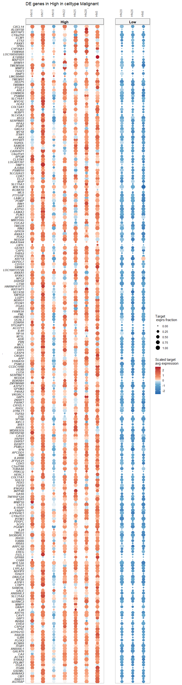

Multi-Sample Multi-condition Cell-Cell Communication Analysis via
NicheNet: HNSCC application; All-vs-All
================
Robin Browaeys
2021-04-09

<!-- github markdown built using 
rmarkdown::render("vignettes/basic_analysis_steps.Rmd", output_format = "github_document")
-->

In this vignette, you can learn how to perform an all-vs-all
MultiNicheNet analysis. In this vignette, we start from one
SingleCellExperiment object containing cells from both sender and
receiver cell types and from different patients.

A MultiNicheNet analysis can be performed if you have multi-sample,
multi-group single-cell data. MultiNicheNet will look for cell-cell
communication between the cell types in your data for each sample, and
compare the cell-cell communication patterns between the groups of
interest. Therefore, the absolute minimum of meta data you need to have,
are following columns indicating for each cell: the **group**,
**sample** and **cell type**.

As example expression data of interacting cells, we will use data from
Puram et al. to explore intercellular communication in the tumor
microenvironment in head and neck squamous cell carcinoma (HNSCC) \[See
@puram\_single-cell\_2017\]
[](https://doi.org/10.5281/zenodo.5196144).
More specifically, we will look at differential cell-cell communication
patterns between tumors scoring high for a partial
epithelial-mesenschymal transition (p-EMT) program vs low-scoring
tumors.

In this vignette, we will prepare the data and analysis parameters, and
then perform the MultiNicheNet analysis.

The different steps of the MultiNicheNet analysis are the following:

-   0.  Preparation of the analysis: load packages, NicheNet LR network
        & ligand-target matrix, single-cell expression data, and define
        main settings of the MultiNicheNet analysis

-   1.  Extract cell type abundance and expression information from
        receiver and sender cell types, and link this expression
        information for ligands of the sender cell types to the
        corresponding receptors of the receiver cell types

-   2.  Perform genome-wide differential expression analysis of receiver
        and sender cell types to define DE genes between the conditions
        of interest. Based on this analysis, we can define the
        logFC/p-value of ligands in senders and receptors in receivers,
        and define the set of affected target genes in the receiver.

-   3.  Predict NicheNet ligand activities and NicheNet ligand-target
        links based on these differential expression results

-   4.  Use the information collected above to prioritize all
        sender-ligand—receiver-receptor pairs.

-   5.  Optional: unsupervised analysis of
        sender-ligand—receiver-receptor pair expression values per
        sample, to see heterogeneity in cell-cell communication.

In this vignette, we will demonstrate all these steps in detail.

After the MultiNicheNet analysis is done, we will explore the output of
the analysis with different ways of visualization.

# Step 0: Preparation of the analysis: load packages, NicheNet LR network & ligand-target matrix, single-cell expression data

## Step 0.1: Load required packages and NicheNet ligand-receptor network and ligand-target matrix

``` r
library(SingleCellExperiment)
library(dplyr)
library(ggplot2)
library(multinichenetr)
```

``` r
# LR network
lr_network = readRDS(url("https://zenodo.org/record/3260758/files/lr_network.rds"))
lr_network = lr_network %>% filter(! database %in% c("ppi_prediction","ppi_prediction_go")) # We filter out these interactions because they are not really bona-fide LR pairs - NicheNet v2 prior models will be released relatively soon
lr_network = lr_network %>% dplyr::rename(ligand = from, receptor = to) %>% distinct(ligand, receptor)
```

``` r
ligand_target_matrix = readRDS(url("https://zenodo.org/record/3260758/files/ligand_target_matrix.rds"))
```

## Step 0.2: Prepare SingleCellExperiment Objects for Sender and Receiver cells

In this vignette, sender and receiver cell types are in the same
SingleCellExperiment object, which we will load here.

In this case study, we want to study differences in cell-cell
communication patterns between pEMT-high and pEMT-low tumors. The meta
data columns that indicate the pEMT status of tumors are ‘pEMT’ and
‘pEMT\_fine’, cell type is indicated in the ‘celltype’ column, and the
sample is indicated by the ‘tumor’ column.

If you start from a Seurat object, you can convert it easily to a
SingleCellExperiment via
`sce = Seurat::as.SingleCellExperiment(seurat_obj, assay = "RNA")`.

**User adaptation required**

``` r
sce = readRDS(url("https://zenodo.org/record/5196144/files/sce_hnscc.rds"))

scater::plotReducedDim(sce, dimred = "UMAP", colour_by = "celltype")
```

<!-- -->

``` r
scater::plotReducedDim(sce, dimred = "UMAP", colour_by = "tumor")
```

<!-- -->

``` r
scater::plotReducedDim(sce, dimred = "UMAP", colour_by = "pEMT")
```

<!-- -->

``` r
scater::plotReducedDim(sce, dimred = "UMAP", colour_by = "pEMT_fine")
```

<!-- -->
We will now also check the number of cells per cell type condition
combination, and the number of patients per condition.

**User adaptation required**

``` r
table(SummarizedExperiment::colData(sce)$celltype, SummarizedExperiment::colData(sce)$tumor) # cell types vs samples
##                
##                 HN16 HN17 HN18 HN20 HN22 HN25 HN26 HN28 HN5 HN6
##   CAF             47   37   36    3    9   73   19  157  37  82
##   Endothelial     43   17   18    1    1    1    0   14  11  52
##   Malignant       82  353  263  331  123  153   61   49  70 157
##   Myeloid         15    2    7    0    1    8    1    1  58   6
##   myofibroblast   84    6   14   10   45   88   45  140   5   6
##   T.cell         300   61  207    0    0   93    3    0  28   0
table(SummarizedExperiment::colData(sce)$celltype, SummarizedExperiment::colData(sce)$pEMT) # cell types vs conditions
##                
##                 High  Low
##   CAF            396  104
##   Endothelial    105   53
##   Malignant     1093  549
##   Myeloid         92    7
##   myofibroblast  382   61
##   T.cell         689    3
table(SummarizedExperiment::colData(sce)$tumor, SummarizedExperiment::colData(sce)$pEMT) # samples vs conditions
##       
##        High Low
##   HN16  571   0
##   HN17  476   0
##   HN18  545   0
##   HN20    0 345
##   HN22  179   0
##   HN25  416   0
##   HN26    0 129
##   HN28  361   0
##   HN5   209   0
##   HN6     0 303
```

As you can see, some Celltype-Sample combinations have 0 cells. It is
possible that during DE analysis, some cell types will be removed from
the analysis if there is not enough information to do a DE analysis.
(More info later)

## Step 0.3: Prepare settings of the MultiNicheNet cell-cell communication analysis

### Define in which metadata columns we can find the **group**, **sample** and **cell type** IDs

For the group\_id, we now choose for the ‘pEMT’ column instead of
‘pEMT\_fine’, which we will select in a subsequent analysis.

If you would have batches/covariates you can correct for (meaning:
different covariate values should be present in all the groups of the
group\_id), we strongly recommend doing this, since this is one of the
main unique possibilities of the MultiNicheNet approach.

**User adaptation required**

``` r
sample_id = "tumor"
group_id = "pEMT"
celltype_id = "celltype"
covariates = NA
```

Sender and receiver cell types also need to be defined. Both are here
all cell types in the dataset because we are interested in an All-vs-All
analysis.

``` r
senders_oi = SummarizedExperiment::colData(sce)[,celltype_id] %>% unique()
receivers_oi = SummarizedExperiment::colData(sce)[,celltype_id] %>% unique()
```

If the user wants it, it is possible to use only a subset of senders and
receivers. Senders and receivers can be entirely different, but also
overlapping, or the same. If you don’t use all the cell types in your
data, we recommend to continue with a subset of your data.

Example code:

``` r
subset_senders_receivers = FALSE
if(subset_senders_receivers == TRUE){
  senders_oi = SummarizedExperiment::colData(sce)[,celltype_id] %>% unique() %>% .[1:2]
  receivers_oi = SummarizedExperiment::colData(sce)[,celltype_id] %>% unique() %>% .[2:4]
  sce = sce[, SummarizedExperiment::colData(sce)[,celltype_id] %in% c(senders_oi, receivers_oi)]
}
```

Now we will go to the first real step of the MultiNicheNet analysis

# Step 1: Extract cell type abundance and expression information from receiver and sender cell types, and link this expression information for ligands of the sender cell types to the corresponding receptors of the receiver cell types

Since MultiNicheNet will infer group differences at the sample level for
each cell type (currently via Muscat and pseudobulking), we need to have
sufficient cells per sample of a cell type, and this for both groups. In
the following analysis we will set this minimum number of cells per cell
type per sample at 5. For 10x scRNAseq datasets, we recommend to set
this to at least 20 (absolute minimum 10)

**User adaptation recommended**

``` r
min_cells = 5
```

Now we will calculate abundance and expression information for each cell
type / sample / group combination with the following functions. In the
output of this function, you can also find some ‘Cell type abundance
diagnostic plots’ that will the users which celltype-sample combinations
will be left out later on for DE calculation because the nr of cells is
lower than de defined minimum defined here above. If too many
celltype-sample combinations don’t pass this threshold, we recommend to
define your cell types in a more general way (use one level higher of
the cell type ontology hierarchy) (eg TH17 CD4T cells –&gt; CD4T cells).

``` r
abundance_expression_info = get_abundance_expression_info(sce = sce, sample_id = sample_id, group_id = group_id, celltype_id = celltype_id, min_cells = min_cells, senders_oi = senders_oi, receivers_oi = receivers_oi, lr_network = lr_network, covariates = covariates)
```

Warning: means that some samples have a pseudobulk library size of 0 for
a cell type (because that cell type was not present in that sample)

First, check the cell type abundance diagnostic plots.

### Interpretation of cell type abundance information

The first plot visualizes the number of cells per celltype-sample
combination, and indicates which combinations are removed during the DE
analysis because there are less than `min_cells` in the celltype-sample
combination.

``` r
abundance_expression_info$abund_plot_sample
```

<!-- -->
The red dotted line indicates the required minimum of cells as defined
above in `min_cells`. We can see here that quite many sample-celltype
combinations are left out. For Endothelial, Myeloid, and T cells, we
don’t even have two or more samples that have enough cells of those cell
types. Therefore, those cell types were removed before the DE analysis.
As stated before when seeing this, we would recommend to use a
higher-level cell type annotation if possible. But the annotation here
is already high-level, and grouping Endothelial cells, T cells and
Myeloid cells eg would not make sense biologically. That we won’t be
able to include these cell types in our analysis is a limitation of the
MultiNicheNet approach compared to classic cell-level-based approaches,
but on the contrary, those cell-level-based approaches don’t reveal the
lack of cells in many samples, and might lead to biased results. Another
limitation is that we lose now potentially very important group-specific
cell types, like T cells in this case. To overcome this, we will use a
hack later on. TODODODOODDOODODODODODODOD

In a next plot, we will look at differential abundance between the
conditions. This because the pseudobulking approach behind Muscat could
potentially suffer from some biases if there would be huge differences
in abundances of a cell type between different groups. Downstream
results of these cell types should then be considered with some caution.

``` r
abundance_expression_info$abund_plot_group
```

<!-- -->
Differential abundance looks quite OK for the cell types kept for the DE
analysis (i.e. CAF, Malignant and myofibroblast)

If you want to look at the cell numbers behind these plots, you can do
so via the following piece of code

``` r
abundance_expression_info$abundance_data_receiver
## # A tibble: 54 x 5
## # Groups:   sample, receiver [54]
##    sample receiver      n_cells_receiver group keep_receiver
##    <chr>  <chr>                    <int> <chr>         <dbl>
##  1 HN16   CAF                         47 High              1
##  2 HN16   Endothelial                 43 High              1
##  3 HN16   Malignant                   82 High              1
##  4 HN16   Myeloid                     15 High              1
##  5 HN16   myofibroblast               84 High              1
##  6 HN16   T.cell                     300 High              1
##  7 HN17   CAF                         37 High              1
##  8 HN17   Endothelial                 17 High              1
##  9 HN17   Malignant                  353 High              1
## 10 HN17   Myeloid                      2 High              0
## # ... with 44 more rows
abundance_expression_info$abundance_data_sender # in the case of an all-vs-all analysis: both are the same
## # A tibble: 54 x 5
## # Groups:   sample, sender [54]
##    sample sender        n_cells_sender group keep_sender
##    <chr>  <chr>                  <int> <chr>       <dbl>
##  1 HN16   CAF                       47 High            1
##  2 HN16   Endothelial               43 High            1
##  3 HN16   Malignant                 82 High            1
##  4 HN16   Myeloid                   15 High            1
##  5 HN16   myofibroblast             84 High            1
##  6 HN16   T.cell                   300 High            1
##  7 HN17   CAF                       37 High            1
##  8 HN17   Endothelial               17 High            1
##  9 HN17   Malignant                353 High            1
## 10 HN17   Myeloid                    2 High            0
## # ... with 44 more rows
```

**Important**: Based on the cell type abundance diagnostics, we
recommend users to change their analysis settings if required, before
proceeding with the rest of the analysis.

### Interpretation of expression information

Previously, we also calculated expression information. With the
following piece of code, you can check the average expression for each
gene per sample (normalized expression value and fraction of expressing
cells with non-zero counts, and logCPM-pseudocounts).

``` r
abundance_expression_info$celltype_info$avg_df
## # A tibble: 1,245,060 x 4
##    gene         sample average_sample celltype     
##    <chr>        <chr>           <dbl> <fct>        
##  1 C9orf152     HN28           0      myofibroblast
##  2 RPS11        HN28           2.96   myofibroblast
##  3 ELMO2        HN28           0.311  myofibroblast
##  4 CREB3L1      HN28           0      myofibroblast
##  5 PNMA1        HN28           0.647  myofibroblast
##  6 MMP2         HN28           0.0724 myofibroblast
##  7 TMEM216      HN28           0.100  myofibroblast
##  8 TRAF3IP2-AS1 HN28           0.686  myofibroblast
##  9 LRRC37A5P    HN28           0      myofibroblast
## 10 LOC653712    HN28           0.0887 myofibroblast
## # ... with 1,245,050 more rows
abundance_expression_info$celltype_info$frq_df
## # A tibble: 1,245,060 x 4
##    gene         sample fraction_sample celltype     
##    <chr>        <chr>            <dbl> <chr>        
##  1 C9orf152     HN28            0      myofibroblast
##  2 RPS11        HN28            0.957  myofibroblast
##  3 ELMO2        HN28            0.157  myofibroblast
##  4 CREB3L1      HN28            0      myofibroblast
##  5 PNMA1        HN28            0.243  myofibroblast
##  6 MMP2         HN28            0.05   myofibroblast
##  7 TMEM216      HN28            0.0429 myofibroblast
##  8 TRAF3IP2-AS1 HN28            0.593  myofibroblast
##  9 LRRC37A5P    HN28            0      myofibroblast
## 10 LOC653712    HN28            0.0929 myofibroblast
## # ... with 1,245,050 more rows
abundance_expression_info$celltype_info$pb_df
## # A tibble: 1,120,554 x 4
##    gene         sample pb_sample celltype     
##    <chr>        <chr>      <dbl> <fct>        
##  1 C9orf152     HN16        0    myofibroblast
##  2 RPS11        HN16        9.14 myofibroblast
##  3 ELMO2        HN16        6.13 myofibroblast
##  4 CREB3L1      HN16        0    myofibroblast
##  5 PNMA1        HN16        6.28 myofibroblast
##  6 MMP2         HN16        1.67 myofibroblast
##  7 TMEM216      HN16        3.29 myofibroblast
##  8 TRAF3IP2-AS1 HN16        6.20 myofibroblast
##  9 LRRC37A5P    HN16        0    myofibroblast
## 10 LOC653712    HN16        3.92 myofibroblast
## # ... with 1,120,544 more rows
```

Now for the average per group:

``` r
abundance_expression_info$celltype_info$avg_df_group
## # A tibble: 249,012 x 4
## # Groups:   group, celltype [12]
##    group celltype gene     average_group
##    <chr> <fct>    <chr>            <dbl>
##  1 High  CAF      A1BG           0.154  
##  2 High  CAF      A1BG-AS1       0.0789 
##  3 High  CAF      A1CF           0.00821
##  4 High  CAF      A2M            1.29   
##  5 High  CAF      A2M-AS1        0.0571 
##  6 High  CAF      A2ML1          0.0443 
##  7 High  CAF      A2MP1          0      
##  8 High  CAF      A4GALT         0.382  
##  9 High  CAF      A4GNT          0.00176
## 10 High  CAF      AAAS           0.250  
## # ... with 249,002 more rows
abundance_expression_info$celltype_info$frq_df_group
## # A tibble: 249,012 x 4
## # Groups:   group, celltype [12]
##    group celltype gene     fraction_group
##    <chr> <chr>    <chr>             <dbl>
##  1 High  CAF      A1BG            0.103  
##  2 High  CAF      A1BG-AS1        0.0536 
##  3 High  CAF      A1CF            0.0739 
##  4 High  CAF      A2M             0.500  
##  5 High  CAF      A2M-AS1         0.0447 
##  6 High  CAF      A2ML1           0.207  
##  7 High  CAF      A2MP1           0      
##  8 High  CAF      A4GALT          0.215  
##  9 High  CAF      A4GNT           0.00386
## 10 High  CAF      AAAS            0.115  
## # ... with 249,002 more rows
abundance_expression_info$celltype_info$pb_df_group
## # A tibble: 249,012 x 4
## # Groups:   group, celltype [12]
##    group celltype gene     pb_group
##    <chr> <fct>    <chr>       <dbl>
##  1 High  CAF      A1BG        3.86 
##  2 High  CAF      A1BG-AS1    2.99 
##  3 High  CAF      A1CF        0.527
##  4 High  CAF      A2M         7.99 
##  5 High  CAF      A2M-AS1     2.55 
##  6 High  CAF      A2ML1       1.92 
##  7 High  CAF      A2MP1       0    
##  8 High  CAF      A4GALT      5.61 
##  9 High  CAF      A4GNT       0.157
## 10 High  CAF      AAAS        4.84 
## # ... with 249,002 more rows
```

In the last part of this step, we combined this information for each
ligand-receptor pair combination for each sender-receiver combination.
The output of this can be seen as well:

For sample-based:

``` r
abundance_expression_info$sender_receiver_info$avg_df
## # A tibble: 434,160 x 8
##    sample sender  receiver    ligand receptor avg_ligand avg_receptor ligand_receptor_prod
##    <chr>  <fct>   <fct>       <chr>  <chr>         <dbl>        <dbl>                <dbl>
##  1 HN26   Myeloid Myeloid     CCL19  CCR7           3.81         4.28                 16.3
##  2 HN22   Myeloid Myeloid     IL15   IL2RG          3.41         3.79                 12.9
##  3 HN26   Myeloid Myeloid     F11R   F11R           3.59         3.59                 12.9
##  4 HN17   Myeloid Endothelial NAMPT  INSR           3.59         3.47                 12.5
##  5 HN26   T.cell  T.cell      CD99   CD99           3.49         3.49                 12.1
##  6 HN22   Myeloid Myeloid     F11R   F11R           3.46         3.46                 12.0
##  7 HN26   Myeloid T.cell      IL15   IL2RG          3.31         3.53                 11.7
##  8 HN26   T.cell  Myeloid     CD99   CD99           3.49         3.33                 11.6
##  9 HN26   Myeloid T.cell      CD99   CD99           3.33         3.49                 11.6
## 10 HN26   Myeloid Myeloid     CD99   CD99           3.33         3.33                 11.1
## # ... with 434,150 more rows
abundance_expression_info$sender_receiver_info$frq_df
## # A tibble: 434,160 x 8
##    sample sender        receiver    ligand   receptor fraction_ligand fraction_receptor ligand_receptor_fraction_prod
##    <chr>  <chr>         <chr>       <chr>    <chr>              <dbl>             <dbl>                         <dbl>
##  1 HN26   myofibroblast Myeloid     GPI      AMFR                   1                 1                             1
##  2 HN22   myofibroblast Myeloid     CALR     SCARF1                 1                 1                             1
##  3 HN18   myofibroblast Myeloid     PSAP     GPR37L1                1                 1                             1
##  4 HN18   myofibroblast Endothelial CALR     SCARF1                 1                 1                             1
##  5 HN20   myofibroblast CAF         SERPING1 LRP1                   1                 1                             1
##  6 HN20   myofibroblast Endothelial CALM2    MYLK                   1                 1                             1
##  7 HN20   myofibroblast Endothelial GPI      AMFR                   1                 1                             1
##  8 HN20   myofibroblast CAF         A2M      LRP1                   1                 1                             1
##  9 HN20   myofibroblast Endothelial THBS1    CD36                   1                 1                             1
## 10 HN20   myofibroblast CAF         THBS1    SDC1                   1                 1                             1
## # ... with 434,150 more rows
abundance_expression_info$sender_receiver_info$pb_df
## # A tibble: 356,976 x 8
##    sample sender        receiver      ligand  receptor pb_ligand pb_receptor ligand_receptor_pb_prod
##    <chr>  <fct>         <fct>         <chr>   <chr>        <dbl>       <dbl>                   <dbl>
##  1 HN5    Myeloid       Myeloid       HLA-DRA CD4          10.7         9.40                   101. 
##  2 HN18   Myeloid       Myeloid       HLA-DRA CD4          10.6         9.19                    97.4
##  3 HN22   myofibroblast myofibroblast CALM2   MYLK         10.4         9.27                    96.6
##  4 HN17   CAF           CAF           COL1A1  ITGB1        10.2         9.45                    96.6
##  5 HN17   Myeloid       Endothelial   NAMPT   INSR          9.68        9.96                    96.5
##  6 HN17   CAF           Endothelial   COL1A1  ITGB1        10.2         9.41                    96.2
##  7 HN18   Myeloid       Myeloid       ITGB2   ICAM1         9.88        9.71                    95.9
##  8 HN18   Myeloid       Myeloid       ICAM1   ITGB2         9.71        9.88                    95.9
##  9 HN5    Myeloid       Myeloid       HLA-DMA CD4          10.2         9.40                    95.8
## 10 HN18   CAF           Myeloid       CTGF    ITGB2         9.62        9.88                    95.0
## # ... with 356,966 more rows
```

For group-based:

``` r
abundance_expression_info$sender_receiver_info$avg_df_group
## # A tibble: 86,832 x 8
## # Groups:   group, sender [12]
##    group sender        receiver      ligand receptor avg_ligand_group avg_receptor_group ligand_receptor_prod_group
##    <chr> <fct>         <fct>         <chr>  <chr>               <dbl>              <dbl>                      <dbl>
##  1 High  myofibroblast myofibroblast CALM2  MYLK                 3.48               2.23                       7.77
##  2 High  Myeloid       myofibroblast CALM2  MYLK                 3.38               2.23                       7.54
##  3 Low   CAF           myofibroblast COL1A1 ITGB1                3.04               2.40                       7.29
##  4 Low   myofibroblast myofibroblast CALM2  MYLK                 3.12               2.32                       7.24
##  5 Low   CAF           CAF           CD99   CD99                 2.68               2.68                       7.18
##  6 High  CAF           myofibroblast CALM2  MYLK                 3.08               2.23                       6.87
##  7 Low   CAF           myofibroblast CALM2  MYLK                 2.86               2.32                       6.65
##  8 Low   CAF           CAF           COL1A1 ITGB1                3.04               2.19                       6.65
##  9 High  Endothelial   Endothelial   CD99   CD99                 2.57               2.57                       6.60
## 10 High  CAF           myofibroblast COL1A1 ITGB1                2.67               2.44                       6.53
## # ... with 86,822 more rows
abundance_expression_info$sender_receiver_info$frq_df_group
## # A tibble: 86,832 x 8
## # Groups:   group, sender [12]
##    group sender      receiver    ligand   receptor fraction_ligand_group fraction_receptor_group ligand_receptor_fraction_prod_group
##    <chr> <chr>       <chr>       <chr>    <chr>                    <dbl>                   <dbl>                               <dbl>
##  1 High  Endothelial Endothelial PECAM1   PECAM1                   1                       1                                   1    
##  2 High  Endothelial Myeloid     HLA-E    KLRD1                    1                       0.956                               0.956
##  3 High  Myeloid     Myeloid     HLA-E    KLRD1                    1                       0.956                               0.956
##  4 Low   CAF         CAF         PSAP     LRP1                     0.992                   0.957                               0.949
##  5 Low   CAF         CAF         SERPING1 LRP1                     0.992                   0.957                               0.949
##  6 High  Myeloid     Myeloid     HLA-G    KLRD1                    0.986                   0.956                               0.942
##  7 High  Malignant   Myeloid     HLA-E    KLRD1                    0.985                   0.956                               0.941
##  8 Low   Malignant   CAF         LRPAP1   LRP1                     0.979                   0.957                               0.937
##  9 High  Endothelial Endothelial HLA-E    KLRD1                    1                       0.936                               0.936
## 10 High  Myeloid     Endothelial HLA-E    KLRD1                    1                       0.936                               0.936
## # ... with 86,822 more rows
abundance_expression_info$sender_receiver_info$pb_df_group
## # A tibble: 86,832 x 8
## # Groups:   group, sender [12]
##    group sender        receiver      ligand receptor pb_ligand_group pb_receptor_group ligand_receptor_pb_prod_group
##    <chr> <fct>         <fct>         <chr>  <chr>              <dbl>             <dbl>                         <dbl>
##  1 Low   T.cell        T.cell        CD99   CD99                9.64              9.64                          93.0
##  2 High  T.cell        myofibroblast CALM2  MYLK               10.1               8.98                          90.5
##  3 High  myofibroblast myofibroblast CALM2  MYLK                9.94              8.98                          89.3
##  4 Low   CAF           T.cell        CXCL12 CXCR4               8.71             10.2                           88.9
##  5 Low   T.cell        myofibroblast CALM2  MYLK                9.86              9.02                          88.9
##  6 High  Myeloid       myofibroblast CALM2  MYLK                9.85              8.98                          88.5
##  7 Low   myofibroblast myofibroblast CALM2  MYLK                9.73              9.02                          87.8
##  8 Low   CAF           T.cell        CD99   CD99                9.08              9.64                          87.6
##  9 Low   T.cell        CAF           CD99   CD99                9.64              9.08                          87.6
## 10 High  T.cell        myofibroblast CALM1  MYLK                9.72              8.98                          87.3
## # ... with 86,822 more rows
```

# Step 2: Perform genome-wide differential expression analysis of receiver and sender cell types to define DE genes between the conditions of interest. Based on this analysis, we can define the logFC/p-value of ligands in senders and receptors in receivers, and define the set of affected target genes in the receiver.

Now we will go over to the multi-group, multi-sample differential
expression (DE) analysis (also called ‘differential state’ analysis by
the developers of Muscat).

### Define the contrasts and covariates of interest for the DE analysis.

Here, we want to compare the p-EMT-high vs the p-EMT-low group and find
cell-cell communication events that are higher in high than low pEMT.

Note the format to indicate the contrasts! (This formatting should be
adhered to very strictly, and white spaces are not allowed)

**User adaptation required**

``` r
contrasts_oi = c("'High-Low','Low-High'")
contrast_tbl = tibble(contrast = 
                        c("High-Low","Low-High"), 
                      group = c("High","Low"))
```

### Perform the DE analysis for each cell type.

``` r
DE_info = get_DE_info(sce = sce, sample_id = sample_id, group_id = group_id, celltype_id = celltype_id, covariates = covariates, contrasts_oi = contrasts_oi, min_cells = min_cells)
## [1] "excluded cell types are:"
## [1] "Endothelial" "Myeloid"     "T.cell"     
## [1] "These celltypes are not considered in the analysis. After removing samples that contain less cells than the required minimal, some groups don't have 2 or more samples anymore. As a result the analysis cannot be run. To solve this: decrease the number of min_cells or change your group_id and pool all samples that belong to groups that are not of interest! "
```

### Check DE results

Table with logFC and p-values for each gene-celltype-contrast:

``` r
DE_info$celltype_de$de_output_tidy
## # A tibble: 64,162 x 9
##    gene         cluster_id   logFC logCPM      F  p_val p_adj.loc p_adj contrast
##    <chr>        <chr>        <dbl>  <dbl>  <dbl>  <dbl>     <dbl> <dbl> <chr>   
##  1 RPS11        CAF        -0.0666   9.29 0.0658 0.801          1 0.984 High-Low
##  2 ELMO2        CAF         0.726    6.64 2.31   0.149          1 0.743 High-Low
##  3 CREB3L1      CAF         0.149    5.44 0.0184 0.894          1 0.994 High-Low
##  4 PNMA1        CAF        -1.04     6.51 4.03   0.0634         1 0.573 High-Low
##  5 MMP2         CAF         0.162    9.28 0.422  0.526          1 0.951 High-Low
##  6 TMEM216      CAF        -1.34     6    5.85   0.0291         1 0.442 High-Low
##  7 TRAF3IP2-AS1 CAF        -0.496    5.54 0.718  0.41           1 0.924 High-Low
##  8 ZHX3         CAF        -0.207    5.46 0.103  0.753          1 0.979 High-Low
##  9 ERCC5        CAF         0.202    6.08 0.0925 0.765          1 0.982 High-Low
## 10 APBB2        CAF        -0.235    6.47 0.249  0.625          1 0.966 High-Low
## # ... with 64,152 more rows
```

Diagnostic p-value histograms:

``` r
DE_info$hist_pvals
```

<!-- -->
(Note: this p-value histograms are the same for High-Low and Low-High
because we only have two groups and compare them to each other - a DE
gene in one comparison will then also be DE in the other comparison,
with just a reversed sign of the logFC)

In order to trust the p-values, the p-value distributions should be
uniform distributions, with a peak allowed between 0 and 0.05 if there
would be a clear biological effect in the data. This clear effect
(=clear DE) seems to be present here in the Malignant cell type
populations, although the histogram is not very uniformly distributed
for p-values between 0.05 and 0.25. This might point to issues in the DE
model definition (eg we did not add all important covariates,
substructure present,…)

Because there might be some issues, and we anticipate this could be
present in other datasets, we will now use the empiricall null
procedure. This is a procedure that will define empirical p-values based
on the observed distribution of the test statistic (here: logFC) and not
based on the theoretical distribution. We only recommend this if the
p-value distributions point to possible issues. (\[ADD REFERENCE\])

### Empirical Null procedure

**User adaptation recommended**

``` r
empirical_pval = TRUE
if(empirical_pval == TRUE){
  DE_info_emp = get_empirical_pvals(DE_info$celltype_de$de_output_tidy)
} 
```

Table with logFC and p-values for each gene-celltype-contrast:

``` r
DE_info_emp$de_output_tidy_emp
## # A tibble: 64,162 x 11
##    gene         cluster_id   logFC logCPM      F  p_val p_adj.loc p_adj contrast   p_emp p_adj_emp
##    <chr>        <chr>        <dbl>  <dbl>  <dbl>  <dbl>     <dbl> <dbl> <chr>      <dbl>     <dbl>
##  1 RPS11        CAF        -0.0666   9.29 0.0658 0.801          1 0.984 High-Low 0.748       0.991
##  2 ELMO2        CAF         0.726    6.64 2.31   0.149          1 0.743 High-Low 0.0864      0.991
##  3 CREB3L1      CAF         0.149    5.44 0.0184 0.894          1 0.994 High-Low 0.887       0.998
##  4 PNMA1        CAF        -1.04     6.51 4.03   0.0634         1 0.573 High-Low 0.0246      0.991
##  5 MMP2         CAF         0.162    9.28 0.422  0.526          1 0.951 High-Low 0.457       0.991
##  6 TMEM216      CAF        -1.34     6    5.85   0.0291         1 0.442 High-Low 0.00834     0.991
##  7 TRAF3IP2-AS1 CAF        -0.496    5.54 0.718  0.41           1 0.924 High-Low 0.314       0.991
##  8 ZHX3         CAF        -0.207    5.46 0.103  0.753          1 0.979 High-Low 0.692       0.991
##  9 ERCC5        CAF         0.202    6.08 0.0925 0.765          1 0.982 High-Low 0.733       0.991
## 10 APBB2        CAF        -0.235    6.47 0.249  0.625          1 0.966 High-Low 0.545       0.991
## # ... with 64,152 more rows
```

The following plot shows those corrected, empirical p-values:

``` r
DE_info_emp$hist_pvals_emp
```

<!-- -->
The following plots show how well the correction worked. The green
fitted curve should fit well with the histogram. If not, this might
point to some issues in the DE model definition.

**User adaptation required**

``` r
DE_info_emp$z_distr_plots_emp_pval
## $`CAF.High-Low`
```

<!-- -->

    ## 
    ## $`CAF.Low-High`

<!-- -->

    ## 
    ## $`Malignant.High-Low`

<!-- -->

    ## 
    ## $`Malignant.Low-High`

<!-- -->

    ## 
    ## $`myofibroblast.High-Low`

<!-- -->

    ## 
    ## $`myofibroblast.Low-High`

<!-- -->
(Note: if plotting does not work, it might be necessary to run these
plot commands in the console)

In general, these plots looks fine, except for the Malignant cells. As
discussed in the previous plots: there might be an issue here. One
possible explanation might be that there is additional substructure in
the data. This could make sense because the pEMT high group consists
both of pEMT very-high and pEMT high samples according to the finer
subdivision/metadata column `pEMT_fine`. Another reason for the possible
substructure: malignant cells of each tumor are very different because
of genetic aberrations.

If we compare the empirical p-values to the original ones before for the
malignant cells, we see that through the empirical null procedure, we
lost some DE genes in malignant cells. But it is likely that the DE
genes that er kept are the most bona fide ones.

As additional check, we will look for the concordance between p-values
rankings of the original and empirical DE analysis (via ranking-line and
upset plots):

``` r
comparison_plots = DE_info$celltype_de$de_output_tidy$cluster_id %>% unique() %>% lapply(function(celltype_oi, adjusted = FALSE){
  if(adjusted == TRUE){
      de_genes_normal = DE_info$celltype_de$de_output_tidy %>% filter(cluster_id == celltype_oi) %>% filter(p_adj.glb <= 0.05) %>% pull(gene) %>% unique()
      de_genes_emp = DE_info_emp$de_output_tidy_emp %>% filter(cluster_id == celltype_oi) %>% filter(p_adj_emp <= 0.05) %>% pull(gene) %>% unique()

  } else {
      de_genes_normal = DE_info$celltype_de$de_output_tidy %>% filter(cluster_id == celltype_oi) %>% filter(p_val <= 0.05) %>% pull(gene) %>% unique()
      de_genes_emp = DE_info_emp$de_output_tidy_emp %>% filter(cluster_id == celltype_oi) %>% filter(p_emp <= 0.05) %>% pull(gene) %>% unique()

  }

  upset_df = tibble(gene = union(de_genes_normal, de_genes_emp), normal = as.double(gene %in% de_genes_normal), empirical = as.double(gene %in% de_genes_emp)) %>% data.frame() %>% magrittr::set_rownames(.$gene) %>% dplyr::select(-gene)
  colnames(upset_df) = paste(colnames(upset_df), celltype_oi, sep = "-")
  p_upset = UpSetR::upset(upset_df, sets.bar.color = "#56B4E9", order.by = "freq", empty.intersections = "on") 
  
  p_ranking = DE_info_emp$de_output_tidy_emp %>% filter(gene %in% union(de_genes_normal, de_genes_emp) & cluster_id == celltype_oi) %>% group_by(cluster_id, contrast) %>% mutate(normal = rank(p_val), empirical = rank(p_emp)) %>% filter(normal != empirical) %>% mutate(empirical_lower = empirical < normal) %>% tidyr::gather(rank_type, rank, normal:empirical) %>% dplyr::select(gene, rank_type, rank, empirical_lower)  %>% 
    ggplot(aes(rank_type, rank, group = gene, color = empirical_lower)) + geom_line(aes(group = gene)) + facet_grid(cluster_id ~ contrast) + theme_bw()
  
  return(list(p_upset, p_ranking))
  
}, adjusted = FALSE) 
comparison_plots
## [[1]]
## [[1]][[1]]
```

<!-- -->

    ## 
    ## [[1]][[2]]

<!-- -->

    ## 
    ## 
    ## [[2]]
    ## [[2]][[1]]

<!-- -->

    ## 
    ## [[2]][[2]]

<!-- -->

    ## 
    ## 
    ## [[3]]
    ## [[3]][[1]]

<!-- -->

    ## 
    ## [[3]][[2]]

<!-- -->

### Conclusion of the diagnostic plots concerning the DE analysis

P-value histograms of both the normal and empirical p-values indicate
there might be some problems in the DE model definition, certainly for
malignant cells. If possible it might be a good idea to include more
covariates in the model, or use the `pEMT_fine` group definition
instead.

Because of these issues (that point to violations to the assumptions
that should be fulfilled for having accurate theoretical p-values), we
decide to continue based on the empirical p-values in this case study.

**User adaptation recommended**

``` r
empirical_pval = TRUE
if(empirical_pval == FALSE){
  celltype_de = DE_info$celltype_de$de_output_tidy
} else {
  celltype_de = DE_info_emp$de_output_tidy_emp %>% dplyr::select(-p_val, -p_adj) %>% dplyr::rename(p_val = p_emp, p_adj = p_adj_emp)
}
```

### Combine DE information for ligand-senders and receptors-receivers (similar to step1 - `abundance_expression_info$sender_receiver_info`)

``` r
sender_receiver_de = combine_sender_receiver_de(
  sender_de = celltype_de,
  receiver_de = celltype_de,
  senders_oi = senders_oi,
  receivers_oi = receivers_oi,
  lr_network = lr_network
)
```

``` r
sender_receiver_de %>% head(20)
## # A tibble: 20 x 12
##    contrast sender        receiver      ligand receptor lfc_ligand lfc_receptor ligand_receptor_lfc_avg p_val_ligand p_adj_ligand p_val_receptor p_adj_receptor
##    <chr>    <chr>         <chr>         <chr>  <chr>         <dbl>        <dbl>                   <dbl>        <dbl>        <dbl>          <dbl>          <dbl>
##  1 High-Low Malignant     Malignant     IL20   IL20RB         8.59      2.33                       5.46     0.0107          0.999         0.0215          0.999
##  2 High-Low Malignant     Malignant     IL20   IL22RA1        8.59      1.05                       4.82     0.0107          0.999         0.191           0.999
##  3 High-Low Malignant     Malignant     IL24   IL20RB         6.28      2.33                       4.30     0.0164          0.999         0.0215          0.999
##  4 High-Low Malignant     Malignant     IL20   IL20RA         8.59     -0.477                      4.06     0.0107          0.999         0.784           0.999
##  5 High-Low myofibroblast Malignant     TGFB2  TGFBR2         4.89      2.89                       3.89     0.000689        0.328         0.0505          0.999
##  6 High-Low Malignant     Malignant     TGFB2  TGFBR2         4.76      2.89                       3.82     0.0234          0.999         0.0505          0.999
##  7 High-Low Malignant     Malignant     IL24   IL22RA1        6.28      1.05                       3.66     0.0164          0.999         0.191           0.999
##  8 High-Low Malignant     Malignant     EDN2   EDNRA          2.08      5.05                       3.56     0.333           0.999         0.0298          0.999
##  9 High-Low myofibroblast Malignant     BMP5   BMPR1B         3.83      3.22                       3.53     0.0140          0.792         0.0576          0.999
## 10 High-Low Malignant     CAF           CCL27  CCR10          5.36      1.62                       3.49     0.105           0.999         0.153           0.991
## 11 Low-High Malignant     CAF           SPP1   ITGB3          6.37      0.463                      3.42     0.0174          0.999         0.691           0.991
## 12 Low-High Malignant     myofibroblast SPP1   ITGAV          6.37      0.25                       3.31     0.0174          0.999         0.620           0.990
## 13 Low-High Malignant     myofibroblast SPP1   CD44           6.37     -0.00542                    3.18     0.0174          0.999         0.966           0.998
## 14 Low-High Malignant     CAF           SPP1   CD44           6.37     -0.0247                     3.17     0.0174          0.999         0.960           0.998
## 15 Low-High Malignant     myofibroblast SPP1   ITGB1          6.37     -0.0344                     3.17     0.0174          0.999         0.850           0.995
## 16 Low-High Malignant     CAF           SPP1   ITGB1          6.37     -0.183                      3.09     0.0174          0.999         0.566           0.991
## 17 Low-High Malignant     CAF           SPP1   ITGB5          6.37     -0.19                       3.09     0.0174          0.999         0.720           0.991
## 18 High-Low CAF           CAF           CSF2   CSF2RA         5.24      0.841                      3.04     0.0566          0.991         0.243           0.991
## 19 Low-High Malignant     Malignant     WNT5A  FZD7           2.8       3.26                       3.03     0.0471          0.999         0.0252          0.999
## 20 Low-High Malignant     Malignant     SPP1   CD44           6.37     -0.352                      3.01     0.0174          0.999         0.181           0.999
```

# Step 3: Predict NicheNet ligand activities and NicheNet ligand-target links based on these differential expression results

## Define the parameters for the NicheNet ligand activity analysis

Here, we need to define the thresholds that will be used to consider
genes as differentially expressed or not (logFC, p-value, decision
whether to use adjusted or normal p-value, minimum fraction of cells
that should express a gene in at least one sample in a group, whether to
use the normal p-values or empirical p-values).

NicheNet ligand activity will then be calculated as the enrichment of
predicted target genes of ligands in this set of DE genes compared to
the genomic background. Here we choose for a minimum logFC of 0.50,
maximum p-value of 0.05, and minimum fraction of expression of 0.05.

**User adaptation recommended**

``` r
logFC_threshold = 0.50
p_val_threshold = 0.05
fraction_cutoff = 0.05
```

We will here choose for applying the p-value cutoff on the normal
p-values, and not on the p-values corrected for multiple testing. This
choice was made here because of lack of statistical power due to
pseudobulking and the fact that this dataset has only a few samples per
group.

**User adaptation recommended**

``` r
p_val_adj = FALSE 
```

For the NicheNet ligand-target inference, we also need to select which
top n of the predicted target genes will be considered (here: top 250
targets per ligand).

**User adaptation recommended**

``` r
top_n_target = 250
```

The NicheNet ligand activity analysis can be run in parallel for each
receiver cell type, by changing the number of cores as defined here.
This is only recommended if you have many receiver cell type.

**User adaptation recommended**

``` r
verbose = TRUE
n.cores = 1
```

## Run the NicheNet ligand activity analysis

``` r
ligand_activities_targets_DEgenes = suppressMessages(suppressWarnings(get_ligand_activities_targets_DEgenes(
  receiver_de = celltype_de,
  receivers_oi = receivers_oi,
  ligand_target_matrix = ligand_target_matrix,
  logFC_threshold = logFC_threshold,
  p_val_threshold = p_val_threshold,
  p_val_adj = p_val_adj,
  top_n_target = top_n_target,
  verbose = verbose, 
  n.cores = n.cores
)))
## [1] "receiver_oi:"
## [1] "myofibroblast"
## [1] "contrast_oi:"
## [1] "High-Low"
## [1] "Number of DE genes (gene set of interest): "
## [1] 224
## [1] "contrast_oi:"
## [1] "Low-High"
## [1] "Number of DE genes (gene set of interest): "
## [1] 139
## [1] "receiver_oi:"
## [1] "CAF"
## [1] "contrast_oi:"
## [1] "High-Low"
## [1] "Number of DE genes (gene set of interest): "
## [1] 243
## [1] "contrast_oi:"
## [1] "Low-High"
## [1] "Number of DE genes (gene set of interest): "
## [1] 189
## [1] "receiver_oi:"
## [1] "Malignant"
## [1] "contrast_oi:"
## [1] "High-Low"
## [1] "Number of DE genes (gene set of interest): "
## [1] 227
## [1] "contrast_oi:"
## [1] "Low-High"
## [1] "Number of DE genes (gene set of interest): "
## [1] 72
## [1] "receiver_oi:"
## [1] "Endothelial"
## [1] "receiver_oi:"
## [1] "T.cell"
## [1] "receiver_oi:"
## [1] "Myeloid"
```

Check the DE genes used for the activity analysis

``` r
ligand_activities_targets_DEgenes$de_genes_df %>% head(20)
## # A tibble: 20 x 6
##    gene     receiver      logFC   p_val p_adj contrast
##    <chr>    <chr>         <dbl>   <dbl> <dbl> <chr>   
##  1 ELMO2    myofibroblast 2.02  0.0154  0.818 High-Low
##  2 UQCR11   myofibroblast 0.765 0.0212  0.819 High-Low
##  3 ZDHHC6   myofibroblast 2.82  0.00272 0.465 High-Low
##  4 FPGT     myofibroblast 2.42  0.0115  0.768 High-Low
##  5 SDC2     myofibroblast 0.877 0.0236  0.819 High-Low
##  6 LDLR     myofibroblast 1.17  0.0363  0.866 High-Low
##  7 CALCOCO2 myofibroblast 0.723 0.0433  0.872 High-Low
##  8 SLC48A1  myofibroblast 1.29  0.0459  0.890 High-Low
##  9 BLVRB    myofibroblast 1.95  0.00255 0.465 High-Low
## 10 AMPH     myofibroblast 2.84  0.00163 0.408 High-Low
## 11 EIF4E    myofibroblast 1.48  0.00367 0.525 High-Low
## 12 TMEM175  myofibroblast 3.86  0.00180 0.415 High-Low
## 13 LAMTOR4  myofibroblast 0.646 0.0419  0.866 High-Low
## 14 NOL7     myofibroblast 0.663 0.0399  0.866 High-Low
## 15 ITCH     myofibroblast 1.42  0.0360  0.866 High-Low
## 16 SLC38A11 myofibroblast 1.74  0.0185  0.819 High-Low
## 17 LZTS2    myofibroblast 1.95  0.0109  0.745 High-Low
## 18 SLC25A37 myofibroblast 1.7   0.0218  0.819 High-Low
## 19 CCDC12   myofibroblast 1.86  0.00839 0.727 High-Low
## 20 EPDR1    myofibroblast 2.17  0.0351  0.866 High-Low
```

Check the output of the activity analysis

``` r
ligand_activities_targets_DEgenes$ligand_activities %>% head(20)
## # A tibble: 20 x 7
## # Groups:   receiver, contrast [1]
##    ligand activity contrast target  ligand_target_weight receiver      activity_scaled
##    <chr>     <dbl> <chr>    <chr>                  <dbl> <chr>                   <dbl>
##  1 CXCL1    0.0155 High-Low ANGPTL4             0.000940 myofibroblast           0.148
##  2 CXCL1    0.0155 High-Low CISH                0.000935 myofibroblast           0.148
##  3 CXCL1    0.0155 High-Low CLIC1               0.000909 myofibroblast           0.148
##  4 CXCL1    0.0155 High-Low HES1                0.00116  myofibroblast           0.148
##  5 CXCL1    0.0155 High-Low ICAM1               0.00104  myofibroblast           0.148
##  6 CXCL1    0.0155 High-Low IL6                 0.000946 myofibroblast           0.148
##  7 CXCL1    0.0155 High-Low PRDM1               0.000897 myofibroblast           0.148
##  8 CXCL1    0.0155 High-Low STAT3               0.00105  myofibroblast           0.148
##  9 CXCL2    0.0170 High-Low BCOR                0.000908 myofibroblast           0.374
## 10 CXCL2    0.0170 High-Low CACNB2              0.000945 myofibroblast           0.374
## 11 CXCL2    0.0170 High-Low CLIC1               0.00100  myofibroblast           0.374
## 12 CXCL2    0.0170 High-Low HES1                0.00129  myofibroblast           0.374
## 13 CXCL2    0.0170 High-Low ICAM1               0.00116  myofibroblast           0.374
## 14 CXCL2    0.0170 High-Low IL6                 0.00103  myofibroblast           0.374
## 15 CXCL2    0.0170 High-Low MBNL2               0.000900 myofibroblast           0.374
## 16 CXCL2    0.0170 High-Low PRDM1               0.000954 myofibroblast           0.374
## 17 CXCL2    0.0170 High-Low STAT3               0.00109  myofibroblast           0.374
## 18 CXCL3    0.0135 High-Low ANGPTL4             0.000761 myofibroblast          -0.133
## 19 CXCL3    0.0135 High-Low BCOR                0.000741 myofibroblast          -0.133
## 20 CXCL3    0.0135 High-Low CISH                0.000801 myofibroblast          -0.133
```

# Step 4: Use the information collected above to prioritize all sender-ligand—receiver-receptor pairs.

In the 3 previous steps, we calculated expression, differential
expression and NicheNet activity information. Now we will combine these
different types of information in one prioritization scheme.

MultiNicheNet allows the user to define the weights of the following
criteria to prioritize ligand-receptor interactions:

-   Upregulation of the ligand in a sender cell type and/or upregulation
    of the receptor in a receiver cell type - in the condition of
    interest. : `scaled_lfc_ligand`, `scaled_p_val_ligand`,
    `scaled_lfc_receptor`, and `scaled_p_val_receptor`
-   Sufficiently high expression levels of ligand and receptor in many
    samples of the same group (to mitigate the influence of outlier
    samples). : `fraction_expressing_ligand_receptor`
-   Cell-type and condition specific expression of the ligand in the
    sender cell type and receptor in the receiver cell type (to mitigate
    the influence of upregulated but still relatively weakly expressed
    ligands/receptors) : `scaled_avg_exprs_ligand`,
    `scaled_avg_frq_ligand`, `scaled_avg_exprs_receptor`, and
    `scaled_avg_frq_receptor`
-   High NicheNet ligand activity, to further prioritize ligand-receptor
    pairs based on their predicted effect of the ligand-receptor
    interaction on the gene expression in the receiver cell type :
    `scaled_activity` and `scaled_activity_scaled`
    (scaled\_activity=absolute value of ligand activity;
    scaled\_activity\_scaled=scaled ligand activity value that is
    comparable between different receiver settings - recommended to put
    more weight on this)
-   High relative abundance of sender and/or receiver in the condition
    of interest: `scaled_abundance_sender` and
    `scaled_abundance_receiver`

The different properties of the sender-ligand—receiver-receptor pairs
can be weighted according to the user’s preference and insight in the
dataset at hand.

## Define the prioritization weights, and prepare grouping objects

We will set our preference for this dataset as follows:

**User adaptation recommended**

``` r
prioritizing_weights_DE = c("de_ligand" = 3,
                         "de_receptor" = 3)
prioritizing_weights_activity = c("activity_scaled" = 3)

prioritizing_weights_expression_specificity = c("exprs_ligand" = 1.5,
                         "exprs_receptor" = 1.5)

prioritizing_weights_expression_sufficiency = c("frac_exprs_ligand_receptor" = 2)

prioritizing_weights_relative_abundance = c( "abund_sender" = 0,
                         "abund_receiver" = 0)
```

``` r
prioritizing_weights = c(prioritizing_weights_DE, 
                         prioritizing_weights_activity, 
                         prioritizing_weights_expression_specificity,
                         prioritizing_weights_expression_sufficiency, 
                         prioritizing_weights_relative_abundance)
```

Make necessary grouping data frame

``` r
sender_receiver_tbl = sender_receiver_de %>% dplyr::distinct(sender, receiver)

metadata_combined = SummarizedExperiment::colData(sce) %>% tibble::as_tibble()

if(!is.na(covariates)){
  grouping_tbl = metadata_combined[,c(sample_id, group_id, covariates)] %>% tibble::as_tibble() %>% dplyr::distinct()
  colnames(grouping_tbl) = c("sample","group",covariates)
} else {
  grouping_tbl = metadata_combined[,c(sample_id, group_id)] %>% tibble::as_tibble() %>% dplyr::distinct()
  colnames(grouping_tbl) = c("sample","group")
}
```

Crucial note: grouping\_tbl: group should be the same as in the
contrast\_tbl, and the expression ino tables! Rename accordingly if this
would not be the case. If you followed the guidelines of this tutorial
closely, there should be no problem.

## Run the prioritization

``` r
prioritization_tables = suppressMessages(generate_prioritization_tables(
  sender_receiver_info = abundance_expression_info$sender_receiver_info,
  sender_receiver_de = sender_receiver_de,
  ligand_activities_targets_DEgenes = ligand_activities_targets_DEgenes,
  contrast_tbl = contrast_tbl,
  sender_receiver_tbl = sender_receiver_tbl,
  grouping_tbl = grouping_tbl,
  prioritizing_weights = prioritizing_weights,
  fraction_cutoff = fraction_cutoff, 
  abundance_data_receiver = abundance_expression_info$abundance_data_receiver,
  abundance_data_sender = abundance_expression_info$abundance_data_sender
))
```

Check the output tables

First: group-based summary table

``` r
prioritization_tables$group_prioritization_tbl %>% head(20)
## # A tibble: 20 x 46
##    contrast group sender        receiver  ligand receptor lfc_ligand lfc_receptor ligand_receptor_~ p_val_ligand p_adj_ligand p_val_receptor p_adj_receptor activity
##    <chr>    <chr> <chr>         <chr>     <chr>  <chr>         <dbl>        <dbl>             <dbl>        <dbl>        <dbl>          <dbl>          <dbl>    <dbl>
##  1 High-Low High  CAF           Malignant FN1    ITGB6         0.131        3.75              1.94       0.563          0.991        0.00433          0.999  6.02e-2
##  2 High-Low High  myofibroblast Malignant FN1    ITGB6        -0.745        3.75              1.50       0.00805        0.727        0.00433          0.999  6.02e-2
##  3 High-Low High  CAF           Malignant TNC    ITGB6         0.261        3.75              2.01       0.659          0.991        0.00433          0.999  6.16e-2
##  4 High-Low High  Malignant     Malignant TNC    ITGB6         0.38         3.75              2.06       0.635          0.999        0.00433          0.999  6.16e-2
##  5 Low-High Low   myofibroblast Malignant APOE   SORL1         1.65        -0.197             0.726      0.0844         0.956        0.739            0.999  2.35e-2
##  6 High-Low High  Malignant     Malignant IL20   IL20RB        8.59         2.33              5.46       0.0107         0.999        0.0215           0.999  4.00e-2
##  7 High-Low High  CAF           Malignant FN1    ITGA3         0.131        1.85              0.990      0.563          0.991        0.00497          0.999  6.02e-2
##  8 Low-High Low   Malignant     Malignant POMC   MC1R          4.89         0.785             2.84       0.00749        0.999        0.501            0.999 -1.15e-2
##  9 Low-High Low   Malignant     Malignant WNT5A  FZD7          2.8          3.26              3.03       0.0471         0.999        0.0252           0.999 -2.04e-2
## 10 High-Low High  Malignant     Malignant IL1A   IL1RAP        2.4          1.63              2.01       0.225          0.999        0.0170           0.999  7.09e-2
## 11 High-Low High  Malignant     Malignant INHBA  ACVR1B        4.92         0.116             2.52       0.00947        0.999        0.845            0.999  6.77e-2
## 12 High-Low High  myofibroblast Malignant TNC    ITGB6        -0.415        3.75              1.67       0.354          0.990        0.00433          0.999  6.16e-2
## 13 Low-High Low   myofibroblast Malignant BMP2   ACVR2A        1.73         1.68              1.70       0.0781         0.945        0.0208           0.999 -3.38e-3
## 14 High-Low High  Malignant     myofibro~ DLL1   NOTCH3        2.16         0.369             1.26       0.0584         0.999        0.297            0.990  3.11e-2
## 15 Low-High Low   myofibroblast Malignant APOE   LDLR          1.65        -0.395             0.628      0.0844         0.956        0.522            0.999  2.35e-2
## 16 Low-High Low   myofibroblast CAF       BMP2   ACVR1         1.73         0.967             1.35       0.0781         0.945        0.0699           0.991  1.80e-2
## 17 Low-High Low   CAF           Malignant INHBA  ACVR2A       -0.317        1.68              0.682      0.602          0.991        0.0208           0.999 -6.88e-4
## 18 Low-High Low   CAF           CAF       TGFB2  TGFBR2       -0.21         0.931             0.361      0.751          0.991        0.0266           0.991  2.06e-2
## 19 Low-High Low   Malignant     Malignant INHBE  ACVR2A        2.28         1.68              1.98       0.0915         0.999        0.0208           0.999 -9.02e-3
## 20 High-Low High  Malignant     CAF       TNF    TNFRSF21      0.8          1.45              1.12       0.662          0.999        0.00430          0.991  2.20e-2
## # ... with 32 more variables: activity_scaled <dbl>, lr_interaction <chr>, id <chr>, avg_ligand_group <dbl>, avg_receptor_group <dbl>,
## #   ligand_receptor_prod_group <dbl>, fraction_ligand_group <dbl>, fraction_receptor_group <dbl>, ligand_receptor_fraction_prod_group <dbl>,
## #   rel_abundance_scaled_sender <dbl>, rel_abundance_scaled_receiver <dbl>, sender_receiver_rel_abundance_avg <dbl>, lfc_pval_ligand <dbl>,
## #   scaled_lfc_ligand <dbl>, scaled_p_val_ligand <dbl>, scaled_lfc_pval_ligand <dbl>, lfc_pval_receptor <dbl>, scaled_lfc_receptor <dbl>,
## #   scaled_p_val_receptor <dbl>, scaled_lfc_pval_receptor <dbl>, scaled_activity_scaled <dbl>, scaled_activity <dbl>, scaled_avg_exprs_ligand <dbl>,
## #   scaled_avg_frq_ligand <dbl>, pb_ligand_group <dbl>, scaled_pb_ligand <dbl>, scaled_avg_exprs_receptor <dbl>, scaled_avg_frq_receptor <dbl>,
## #   pb_receptor_group <dbl>, scaled_pb_receptor <dbl>, fraction_expressing_ligand_receptor <dbl>, prioritization_score <dbl>
```

Second: sample-based summary table: contains expression information of
each LR pair per sample

``` r
prioritization_tables$sample_prioritization_tbl %>% head(20)
## # A tibble: 20 x 26
##    sample sender        receiver      ligand receptor avg_ligand avg_receptor ligand_receptor~ fraction_ligand fraction_recept~ ligand_receptor~ pb_ligand pb_receptor
##    <chr>  <chr>         <chr>         <chr>  <chr>         <dbl>        <dbl>            <dbl>           <dbl>            <dbl>            <dbl>     <dbl>       <dbl>
##  1 HN26   Myeloid       Myeloid       CCL19  CCR7           3.81         4.28            16.3            1                1                1          9.33        9.83
##  2 HN22   Myeloid       Myeloid       IL15   IL2RG          3.41         3.79            12.9            1                1                1          8.64        9.05
##  3 HN26   Myeloid       Myeloid       F11R   F11R           3.59         3.59            12.9            1                1                1          9.08        9.08
##  4 HN17   Myeloid       Endothelial   NAMPT  INSR           3.59         3.47            12.5            1                1                1          9.68        9.96
##  5 HN26   T.cell        T.cell        CD99   CD99           3.49         3.49            12.1            1                1                1          9.64        9.64
##  6 HN22   Myeloid       Myeloid       F11R   F11R           3.46         3.46            12.0            1                1                1          8.70        8.70
##  7 HN26   Myeloid       T.cell        IL15   IL2RG          3.31         3.53            11.7            1                1                1          8.78        9.70
##  8 HN26   T.cell        Myeloid       CD99   CD99           3.49         3.33            11.6            1                1                1          9.64        8.80
##  9 HN26   Myeloid       T.cell        CD99   CD99           3.33         3.49            11.6            1                1                1          8.80        9.64
## 10 HN26   Myeloid       Myeloid       CD99   CD99           3.33         3.33            11.1            1                1                1          8.80        8.80
## 11 HN26   Myeloid       Myeloid       IL15   IL2RG          3.31         3.27            10.8            1                1                1          8.78        8.73
## 12 HN5    myofibroblast myofibroblast COL4A1 ITGB1          3.09         3.36            10.4            1                1                1          9.23        9.48
## 13 HN5    CAF           myofibroblast COL1A1 ITGB1          3.09         3.36            10.4            0.973            1                0.973      9.58        9.48
## 14 HN17   CAF           myofibroblast COL1A1 ITGB1          3.75         2.73            10.2            1                0.833            0.833     10.2         8.92
## 15 HN17   CAF           Endothelial   COL1A1 ITGB1          3.75         2.65             9.94           1                0.824            0.824     10.2         9.41
## 16 HN17   CAF           CAF           COL1A1 ITGB1          3.75         2.62             9.83           1                0.811            0.811     10.2         9.45
## 17 HN22   myofibroblast Myeloid       THBS1  CD47           3.15         3.05             9.61           0.911            1                0.911      9.92        8.24
## 18 HN17   myofibroblast myofibroblast COL1A1 ITGB1          3.48         2.73             9.48           1                0.833            0.833      9.36        8.92
## 19 HN20   CAF           CAF           COL1A1 ITGB1          3.53         2.68             9.46           1                1                1          9.67        8.72
## 20 HN5    CAF           myofibroblast FN1    ITGB1          2.82         3.36             9.45           0.973            1                0.973      9.30        9.48
## # ... with 13 more variables: ligand_receptor_pb_prod <dbl>, group <chr>, prioritization_score <dbl>, lr_interaction <chr>, id <chr>, scaled_LR_prod <dbl>,
## #   scaled_LR_frac <dbl>, scaled_LR_pb_prod <dbl>, n_cells_receiver <dbl>, keep_receiver <dbl>, n_cells_sender <dbl>, keep_sender <dbl>, keep_sender_receiver <fct>
```

# Step 5: Optional: unsupervised analysis of sender-ligand—receiver-receptor pair expression values per sample, to see heterogeneity in cell-cell communication.

**User adaptation recommended**

``` r
return_lr_prod_matrix = TRUE
if(return_lr_prod_matrix == TRUE){

  ids_oi = prioritization_tables$group_prioritization_tbl %>% dplyr::filter(fraction_expressing_ligand_receptor > 0)  %>% dplyr::pull(id) %>% unique()
  
  lr_prod_df = abundance_expression_info$sender_receiver_info$avg_df %>% dplyr::inner_join(grouping_tbl, by = "sample") %>% dplyr::mutate(lr_interaction = paste(ligand, receptor, sep = "_")) %>% dplyr::mutate(id = paste(lr_interaction, sender, receiver, sep = "_")) %>% dplyr::select(sample, id, ligand_receptor_prod) %>% dplyr::filter(id %in% ids_oi) %>% dplyr::distinct() %>% tidyr::spread(id, ligand_receptor_prod)
  lr_prod_mat = lr_prod_df %>% dplyr::select(-sample) %>% data.frame() %>% as.matrix()
  rownames(lr_prod_mat) = lr_prod_df$sample
  
  col_remove = lr_prod_mat %>% apply(2,function(x)sum(x != 0)) %>% .[. == 0] %>% names()
  row_remove = lr_prod_mat %>% apply(1,function(x)sum(x != 0)) %>% .[. == 0] %>% names()
  
  lr_prod_mat = lr_prod_mat %>% .[rownames(.) %>% generics::setdiff(col_remove),colnames(.) %>% generics::setdiff(col_remove)]
} else {
  lr_prod_mat = NULL
}
```

# Save all the output of MultiNicheNet

To avoid needing to redo the analysis later. All the output written down
here is sufficient to make all in-built downstream visualizations.

**User adaptation recommended**

``` r
path = "./"

multinichenet_output = list(
    celltype_info = abundance_expression_info$celltype_info,
    celltype_de = celltype_de,
    sender_receiver_info = abundance_expression_info$sender_receiver_info,
    sender_receiver_de =  sender_receiver_de,
    ligand_activities_targets_DEgenes = ligand_activities_targets_DEgenes,
    prioritization_tables = prioritization_tables,
    lr_prod_mat = lr_prod_mat,
    grouping_tbl = grouping_tbl
  ) 
multinichenet_output = make_lite_output(multinichenet_output)

save = FALSE
if(save == TRUE){
  saveRDS(multinichenet_output, paste0(path, "multinichenet_output.rds"))

}
```

# Visualization of the results of the cell-cell communication analysis

In a first instance, we will look at the broad overview of prioritized
interactions via condition-specific Circos plots. We will filter on the
prioritization score after removing interactions that are not
upregulated in the condition of interest, and that are in no patient
expressed in more than 5% of cells of a cell type (cf
`fraction_cutoff`).

We will look here at the top100 predictions across all contrasts (high
vs low; and low vs high), senders, and receivers of interest.

## Circos plot of top-prioritized links

(remark: there are still some bugs in the automatic circos plot
function)

``` r
prioritized_tbl_oi = multinichenet_output$prioritization_tables$group_prioritization_tbl %>% 
  filter(fraction_ligand_group > fraction_cutoff & fraction_receptor_group > fraction_cutoff) %>% 
  distinct(id, sender, receiver, ligand, receptor, group, prioritization_score, ligand_receptor_lfc_avg, fraction_expressing_ligand_receptor) %>% 
  filter(ligand_receptor_lfc_avg > 0 & fraction_expressing_ligand_receptor > 0) %>% top_n(30, prioritization_score) 

prioritized_tbl_oi %>% group_by(group) %>% count()
## # A tibble: 2 x 2
## # Groups:   group [2]
##   group     n
##   <chr> <int>
## 1 High     18
## 2 Low      12

prioritized_tbl_oi = multinichenet_output$prioritization_tables$group_prioritization_tbl %>% 
  filter(id %in% prioritized_tbl_oi$id) %>% 
  distinct(id, sender, receiver, ligand, receptor, group) %>% left_join(prioritized_tbl_oi)
prioritized_tbl_oi$prioritization_score[is.na(prioritized_tbl_oi$prioritization_score)] = 0

senders_receivers = union(prioritized_tbl_oi$sender %>% unique(), prioritized_tbl_oi$receiver %>% unique())

colors_sender = c("red", "orange", "royalblue") %>% magrittr::set_names(senders_receivers)
colors_receiver = c("red", "orange", "royalblue") %>% magrittr::set_names(senders_receivers)

circos_list = make_circos_group_comparison(prioritized_tbl_oi, colors_sender, colors_receiver)
```

<!-- --><!-- --><!-- -->

## Visualization of scaled\_LR\_prod per sample

Now we will visualize per sample the scaled product of ligand and
receptor expression. Samples that were left out of the DE analysis are
indicated with a smaller dot (this helps to indicate the samples that
did not contribute to the calculation of the logFC, and thus not
contributed to the final prioritization)

We will now check the top75 interactions specific for the pEMT high
group

``` r
group_oi = "High"
```

``` r
prioritized_tbl_oi = multinichenet_output$prioritization_tables$group_prioritization_tbl %>% 
  distinct(id, sender, receiver, lr_interaction, group, ligand_receptor_lfc_avg, activity_scaled, fraction_expressing_ligand_receptor,  prioritization_score) %>% 
  filter(fraction_expressing_ligand_receptor > 0) %>% 
  filter(group == group_oi) %>% group_by(group) %>% top_n(75, prioritization_score) 

plot_oi = make_sample_lr_prod_plots(multinichenet_output$prioritization_tables, prioritized_tbl_oi)
plot_oi
```

<!-- -->
Visualize now the scaled LR prod based on pseudobulk!

``` r
prioritized_tbl_oi = multinichenet_output$prioritization_tables$group_prioritization_tbl %>% 
  distinct(id, sender, receiver, lr_interaction, group, ligand_receptor_lfc_avg, activity_scaled, fraction_expressing_ligand_receptor,  prioritization_score) %>% 
  filter(fraction_expressing_ligand_receptor > 0) %>% 
  filter(group == group_oi) %>% group_by(group) %>% top_n(75, prioritization_score) 

prior_tables_adapated = multinichenet_output$prioritization_tables
prior_tables_adapated$sample_prioritization_tbl = prior_tables_adapated$sample_prioritization_tbl %>% mutate(scaled_LR_prod = scaled_LR_pb_prod )

plot_oi = make_sample_lr_prod_plots(prior_tables_adapated, prioritized_tbl_oi)
plot_oi
```

<!-- -->

Next to these LR expression products, we can also plot the NicheNet
ligand activities of the ligand in the receiver.

``` r
prioritized_tbl_oi = multinichenet_output$prioritization_tables$group_prioritization_tbl %>% 
  distinct(id, sender, receiver, lr_interaction, group, ligand_receptor_lfc_avg, activity_scaled, fraction_expressing_ligand_receptor,  prioritization_score) %>% 
  filter(fraction_expressing_ligand_receptor > 0) %>% 
  filter(group == group_oi) %>% group_by(group) %>% top_n(75, prioritization_score) 

plot_oi = make_sample_lr_prod_activity_plots(multinichenet_output$prioritization_tables, prioritized_tbl_oi, widths = c(5,1,1))
plot_oi
```

<!-- -->

## Visualization of expression-logFC per group and ligand activity

Next type of plots will show the logFC of LR pairs across all
sender-receiver pairs that are selected, and add the ligand activity
next to it.

``` r
receiver_oi = "Malignant"
group_oi = "High"
```

``` r
prioritized_tbl_oi = multinichenet_output$prioritization_tables$group_prioritization_tbl %>% 
  filter(fraction_ligand_group > fraction_cutoff & fraction_receptor_group > fraction_cutoff) %>% 
  distinct(id, sender, receiver, lr_interaction, group, ligand_receptor_lfc_avg, activity_scaled, fraction_ligand_group, fraction_expressing_ligand_receptor, scaled_avg_exprs_ligand, prioritization_score) %>% 
  filter(fraction_expressing_ligand_receptor > 0) %>% 
  filter(group == group_oi & receiver == receiver_oi) %>% top_n(75, prioritization_score) 

plot_oi = make_group_lfc_exprs_activity_plot(multinichenet_output$prioritization_tables, prioritized_tbl_oi, receiver_oi, heights = c(5,1,1))
plot_oi
```

<!-- -->

## Visualization of ligand-activity, ligand-target links, and target gene expression

In another type of plot, we can visualize the ligand activities for a
group-receiver combination, and show the predicted ligand-target links,
and also the expression of the predicted target genes across samples.

First: show this for a selection of ligands with high ligand activities:

``` r
group_oi = "High"
receiver_oi = "Malignant"
prioritized_tbl_oi = multinichenet_output$prioritization_tables$group_prioritization_tbl %>% 
  filter(fraction_ligand_group > fraction_cutoff & fraction_receptor_group > fraction_cutoff) %>% 
  distinct(id, sender, receiver, ligand, receptor, group, prioritization_score, ligand_receptor_lfc_avg, fraction_expressing_ligand_receptor, activity_scaled) %>% 
  filter(fraction_expressing_ligand_receptor > 0) %>% 
  filter(group == group_oi & receiver == receiver_oi) %>% 
  group_by(group) %>% top_n(50, prioritization_score) %>% top_n(25, activity_scaled) %>% arrange(-activity_scaled)
```

``` r
combined_plot = make_ligand_activity_target_plot(group_oi, receiver_oi, prioritized_tbl_oi, multinichenet_output$ligand_activities_targets_DEgenes, contrast_tbl, multinichenet_output$grouping_tbl, multinichenet_output$celltype_info, plot_legend = FALSE)
combined_plot
## $combined_plot
```

<!-- -->

    ## 
    ## $legends

<!-- -->

Now: show this for a selection of ligands with high general
prioritization scores, not necessarily high ligand activities.

``` r
group_oi = "High"
receiver_oi = "Malignant"
prioritized_tbl_oi = multinichenet_output$prioritization_tables$group_prioritization_tbl %>% 
  filter(fraction_ligand_group > fraction_cutoff & fraction_receptor_group > fraction_cutoff) %>% 
  distinct(id, sender, receiver, ligand, receptor, group, prioritization_score, ligand_receptor_lfc_avg, fraction_expressing_ligand_receptor, activity_scaled) %>% 
  filter(fraction_expressing_ligand_receptor > 0) %>% 
  filter(group == group_oi & receiver == receiver_oi) %>% 
  group_by(group) %>% top_n(25, prioritization_score) %>% arrange(-activity_scaled)
```

``` r
combined_plot = make_ligand_activity_target_plot(group_oi, receiver_oi, prioritized_tbl_oi, multinichenet_output$ligand_activities_targets_DEgenes, contrast_tbl, multinichenet_output$grouping_tbl, multinichenet_output$celltype_info, plot_legend = FALSE)
combined_plot
## $combined_plot
```

<!-- -->

    ## 
    ## $legends

<!-- -->

Of course you can look at other receivers as well:

``` r
group_oi = "High"
receiver_oi = "myofibroblast"
prioritized_tbl_oi = multinichenet_output$prioritization_tables$group_prioritization_tbl %>% 
  filter(fraction_ligand_group > fraction_cutoff & fraction_receptor_group > fraction_cutoff) %>% 
  distinct(id, sender, receiver, ligand, receptor, group, prioritization_score, ligand_receptor_lfc_avg, fraction_expressing_ligand_receptor, activity_scaled) %>% 
  filter(fraction_expressing_ligand_receptor > 0) %>% 
  filter(group == group_oi & receiver == receiver_oi) %>% 
  group_by(group) %>% top_n(25, prioritization_score) %>% arrange(-activity_scaled)
```

``` r
combined_plot = make_ligand_activity_target_plot(group_oi, receiver_oi, prioritized_tbl_oi, multinichenet_output$ligand_activities_targets_DEgenes, contrast_tbl, multinichenet_output$grouping_tbl, multinichenet_output$celltype_info, plot_legend = FALSE)
combined_plot
## $combined_plot
```

<!-- -->

    ## 
    ## $legends

<!-- -->

## Show ligand activities for each receiver-group combination

In the next type of plot, we plot all the ligand activities (Both scaled
and absolute activities) of each receiver-group combination. This can
give us some insights in active signaling pathways across groups. Note
that we can thus show top ligands based on ligand activity - agnostic of
expression in sender.

``` r
ligands_oi = multinichenet_output$prioritization_tables$ligand_activities_target_de_tbl %>% inner_join(contrast_tbl) %>% 
  group_by(group, receiver) %>% distinct(ligand, receiver, group, activity) %>% 
  top_n(5, activity) %>% pull(ligand) %>% unique()

plot_oi = make_ligand_activity_plots(multinichenet_output$prioritization_tables, ligands_oi, contrast_tbl, widths = NULL)
plot_oi
```

<!-- -->

Or we can do this plot for ligands, while considering the general
priorization score (which considers expression information etc)

Show top ligands based on prioritization scores

``` r
ligands_oi = multinichenet_output$prioritization_tables$group_prioritization_tbl %>% 
  group_by(group, receiver) %>% distinct(ligand, receiver, group, prioritization_score) %>% 
  top_n(5, prioritization_score) %>% pull(ligand) %>% unique()

plot_oi = make_ligand_activity_plots(multinichenet_output$prioritization_tables, ligands_oi, contrast_tbl, widths = NULL)
plot_oi
```

<!-- -->

## Zoom in on specific ligand-receptor interactions: show their expression in the single-cell data!

Single-cell-based Feature, and Violin plots of ligand-receptor
interaction of interest: `make_ligand_receptor_feature_plot` and
`make_ligand_receptor_violin_plot`

It is often useful to zoom in on specific ligand-receptor interactions
of interest by looking in more detail to their expression at the single
cell level

Check the highest scoring links based on the general prioritization
score. Here we will pick one of those to visualize.

``` r
prioritized_tbl_oi = multinichenet_output$prioritization_tables$group_prioritization_tbl %>% 
  filter(fraction_ligand_group > fraction_cutoff & fraction_receptor_group > fraction_cutoff) %>% 
  distinct(id, sender, receiver, ligand, receptor, group, prioritization_score) %>% 
  group_by(group, receiver) %>% top_n(5, prioritization_score) 
prioritized_tbl_oi
## # A tibble: 30 x 7
## # Groups:   group, receiver [6]
##    group sender        receiver      ligand receptor id                                  prioritization_score
##    <chr> <chr>         <chr>         <chr>  <chr>    <chr>                                              <dbl>
##  1 High  CAF           Malignant     FN1    ITGB6    FN1_ITGB6_CAF_Malignant                             1.41
##  2 High  myofibroblast Malignant     FN1    ITGB6    FN1_ITGB6_myofibroblast_Malignant                   1.37
##  3 High  CAF           Malignant     TNC    ITGB6    TNC_ITGB6_CAF_Malignant                             1.37
##  4 High  Malignant     Malignant     TNC    ITGB6    TNC_ITGB6_Malignant_Malignant                       1.36
##  5 Low   myofibroblast Malignant     APOE   SORL1    APOE_SORL1_myofibroblast_Malignant                  1.32
##  6 High  Malignant     Malignant     IL20   IL20RB   IL20_IL20RB_Malignant_Malignant                     1.32
##  7 Low   Malignant     Malignant     POMC   MC1R     POMC_MC1R_Malignant_Malignant                       1.31
##  8 Low   Malignant     Malignant     WNT5A  FZD7     WNT5A_FZD7_Malignant_Malignant                      1.31
##  9 Low   myofibroblast Malignant     BMP2   ACVR2A   BMP2_ACVR2A_myofibroblast_Malignant                 1.30
## 10 High  Malignant     myofibroblast DLL1   NOTCH3   DLL1_NOTCH3_Malignant_myofibroblast                 1.29
## # ... with 20 more rows
```

``` r
ligand_oi = "DLL1"
receptor_oi = "NOTCH3"
group_oi = "High"
sender_oi = "Malignant"
receiver_oi = "myofibroblast"
```

Nebulosa and Feature plot of the ligand in the sender cell type and the
receptor in the receiver cell type (split per condition)

``` r
p_feature = make_ligand_receptor_feature_plot(sce_sender = sce, sce_receiver = sce, ligand_oi = ligand_oi, receptor_oi = receptor_oi, group_oi = group_oi, group_id = group_id, celltype_id_sender = celltype_id, celltype_id_receiver = celltype_id, senders_oi = c("Malignant","myofibroblast","CAF"), receivers_oi = c("Malignant","myofibroblast","CAF"))

p_feature
```

<!-- -->
Pooled single-cell and sample-specific single-cell violin plots of
ligand and receptor expression in respectively sender and receiver.

``` r
p_violin = make_ligand_receptor_violin_plot(sce_sender = sce, sce_receiver = sce, ligand_oi = ligand_oi, receptor_oi = receptor_oi, group_oi = group_oi, group_id = group_id, sender_oi = sender_oi, receiver_oi = receiver_oi, sample_id = sample_id, celltype_id_sender = celltype_id, celltype_id_receiver = celltype_id)
p_violin
```

<!-- -->

## Zoom in on specific ligand-target interactions: show their expression in the single-cell data!

Make target gene violin and feature plots: `make_target_violin_plot` and
`make_target_feature_plot`

``` r
receiver_oi = "Malignant"
group_oi = "High"

multinichenet_output$ligand_activities_targets_DEgenes$de_genes_df %>% inner_join(contrast_tbl) %>% filter(p_val <= 0.05) %>% filter(group == group_oi) %>% filter(receiver == receiver_oi) %>% arrange(p_val) %>% top_n(100, logFC)  
## # A tibble: 100 x 7
##    gene   receiver  logFC   p_val p_adj contrast group
##    <chr>  <chr>     <dbl>   <dbl> <dbl> <chr>    <chr>
##  1 RAB31  Malignant  3    0.00200 0.999 High-Low High 
##  2 AHNAK2 Malignant  2.3  0.00260 0.999 High-Low High 
##  3 GSDMC  Malignant  3.19 0.00306 0.999 High-Low High 
##  4 ITGB6  Malignant  3.75 0.00433 0.999 High-Low High 
##  5 ITGA3  Malignant  1.85 0.00497 0.999 High-Low High 
##  6 CA2    Malignant  5.8  0.00562 0.999 High-Low High 
##  7 GALNT6 Malignant  1.76 0.00597 0.999 High-Low High 
##  8 KCNK6  Malignant  2.57 0.00681 0.999 High-Low High 
##  9 PLEK2  Malignant  1.93 0.00687 0.999 High-Low High 
## 10 GJB6   Malignant  3.33 0.00819 0.999 High-Low High 
## # ... with 90 more rows
```

RAB31: interesting gene

``` r
target_oi = "RAB31"

make_target_violin_plot(sce_receiver = sce, target_oi = target_oi, receiver_oi = receiver_oi, group_oi = group_oi, group_id = group_id, sample_id, celltype_id_receiver = celltype_id)
```

<!-- -->

``` r
make_target_feature_plot(sce_receiver = sce, target_oi = target_oi, group_oi = group_oi, group_id = group_id, celltype_id_receiver = celltype_id, receivers_oi = c("Malignant","myofibroblast","CAF")) 
```

<!-- -->

## Make Dotplot for all DE genes/targets

Note: DE here determined based on the parameters used for the
MultiNicheNet analysis (cf above): this means that DE genes are here not
based on the p-value corrected for multiple testing!

``` r
receiver_oi = "Malignant"
group_oi = "High"

targets_oi = multinichenet_output$ligand_activities_targets_DEgenes$de_genes_df %>% inner_join(contrast_tbl) %>% filter(group == group_oi) %>% arrange(p_val) %>% filter(receiver == receiver_oi) %>% pull(gene) %>% unique()
```

``` r
p_target = make_sample_target_plots(receiver_info = multinichenet_output$celltype_info, targets_oi, receiver_oi, multinichenet_output$grouping_tbl)
p_target + ggtitle(paste0("DE genes in ",group_oi, " in celltype ",receiver_oi))
```

<!-- -->

## References
