<style type="text/css">
.smaller {
  font-size: 10px
}
</style>

<!-- github markdown built using
rmarkdown::render("vignettes/basic_analysis_steps_MISC.Rmd", clean = FALSE )
-->


In this vignette, you can learn how to perform a MultiNicheNet analysis to compare cell-cell communication between conditions of interest. A MultiNicheNet analysis can be performed if you have multi-sample, multi-condition/group single-cell data. We strongly recommend having at least 4 samples in each of the groups/conditions you want to compare. With less samples, the benefits of performing a pseudobulk-based DE analysis are less clear. For those datasets, you can check and run our alternative workflow that makes use of cell-level sample-agnostic differential expression tools.

As input you need a SingleCellExperiment object containing at least the raw count matrix and metadata providing the following information for each cell: the **group**, **sample** and **cell type**.

As example expression data of interacting cells, we will here use scRNAseq data of immune cells in MIS-C patients and healthy siblings from this paper of Hoste et al.: [TIM3+ TRBV11-2 T cells and IFNγ signature in patrolling monocytes and CD16+ NK cells delineate MIS-C](https://rupress.org/jem/article/219/2/e20211381/212918/TIM3-TRBV11-2-T-cells-and-IFN-signature-in) [](https://doi.org/10.5281/zenodo.6362434). 
MIS-C (multisystem inflammatory syndrome in children) is a novel rare immunodysregulation syndrome that can arise after SARS-CoV-2 infection in children. We will use MultiNicheNet to explore immune cell crosstalk enriched in MIS-C compared to healthy siblings and adult COVID-19 patients. 

In this vignette, we will first prepare the MultiNicheNet core analysis, then run the several steps in the MultiNicheNet core analysis, and finally interpret the output.

# Preparation of the MultiNicheNet core analysis


```r
library(SingleCellExperiment)
library(dplyr)
library(ggplot2)
library(nichenetr)
library(multinichenetr)
```

## Load NicheNet's ligand-receptor network and ligand-target matrix

MultiNicheNet builds upon the NicheNet framework and uses the same prior knowledge networks (ligand-receptor network and ligand-target matrix, currently v2 version).

The Nichenet v2 networks and matrices for both mouse and human can be downloaded from Zenodo [](https://doi.org/10.5281/zenodo.7074291). 

We will read these object in for human because our expression data is of human patients. 
Gene names are here made syntactically valid via `make.names()` to avoid the loss of genes (eg H2-M3) in downstream visualizations.


```r
organism = "human"
```


```r
options(timeout = 120)

if(organism == "human"){
  
  lr_network_all = 
    readRDS(url(
      "https://zenodo.org/record/10229222/files/lr_network_human_allInfo_30112033.rds"
      )) %>% 
    mutate(
      ligand = convert_alias_to_symbols(ligand, organism = organism), 
      receptor = convert_alias_to_symbols(receptor, organism = organism))
  
  lr_network_all = lr_network_all  %>% 
    mutate(ligand = make.names(ligand), receptor = make.names(receptor)) 
  
  lr_network = lr_network_all %>% 
    distinct(ligand, receptor)
  
  ligand_target_matrix = readRDS(url(
    "https://zenodo.org/record/7074291/files/ligand_target_matrix_nsga2r_final.rds"
    ))
  
  colnames(ligand_target_matrix) = colnames(ligand_target_matrix) %>% 
    convert_alias_to_symbols(organism = organism) %>% make.names()
  rownames(ligand_target_matrix) = rownames(ligand_target_matrix) %>% 
    convert_alias_to_symbols(organism = organism) %>% make.names()
  
  lr_network = lr_network %>% filter(ligand %in% colnames(ligand_target_matrix))
  ligand_target_matrix = ligand_target_matrix[, lr_network$ligand %>% unique()]
  
} else if(organism == "mouse"){
  
  lr_network_all = readRDS(url(
    "https://zenodo.org/record/10229222/files/lr_network_mouse_allInfo_30112033.rds"
    )) %>% 
    mutate(
      ligand = convert_alias_to_symbols(ligand, organism = organism), 
      receptor = convert_alias_to_symbols(receptor, organism = organism))
  
  lr_network_all = lr_network_all  %>% 
    mutate(ligand = make.names(ligand), receptor = make.names(receptor)) 
  lr_network = lr_network_all %>% 
    distinct(ligand, receptor)
  
  ligand_target_matrix = readRDS(url(
    "https://zenodo.org/record/7074291/files/ligand_target_matrix_nsga2r_final_mouse.rds"
    ))
  
  colnames(ligand_target_matrix) = colnames(ligand_target_matrix) %>% 
    convert_alias_to_symbols(organism = organism) %>% make.names()
  rownames(ligand_target_matrix) = rownames(ligand_target_matrix) %>% 
    convert_alias_to_symbols(organism = organism) %>% make.names()
  
  lr_network = lr_network %>% filter(ligand %in% colnames(ligand_target_matrix))
  ligand_target_matrix = ligand_target_matrix[, lr_network$ligand %>% unique()]
  
}
```

## Read in SingleCellExperiment Object

In this vignette, we will load in a subset of the scRNAseq data of the MIS-C [](https://doi.org/10.5281/zenodo.8010790). For the sake of demonstration, this subset only contains 3 cell types. These celltypes are some of the cell types that were found to be most interesting related to MIS-C according to Hoste et al. 

If you start from a Seurat object, you can convert it easily to a SingleCellExperiment object via `sce = Seurat::as.SingleCellExperiment(seurat_obj, assay = "RNA")`.

Because the NicheNet 2.0. networks are in the most recent version of the official gene symbols, we will make sure that the gene symbols used in the expression data are also updated (= converted from their "aliases" to official gene symbols). Afterwards, we will make them again syntactically valid. 


```r
sce = readRDS(url(
  "https://zenodo.org/record/8010790/files/sce_subset_misc.rds"
  ))
sce = alias_to_symbol_SCE(sce, "human") %>% makenames_SCE()
```

## Prepare the settings of the MultiNicheNet cell-cell communication analysis

In this step, we will formalize our research question into MultiNicheNet input arguments.

### Define in which metadata columns we can find the **group**, **sample** and **cell type** IDs

In this case study, we want to study differences in cell-cell communication patterns between MIS-C patients (M), their healthy siblings (S) and adult patients with severe covid (A). The meta data columns that indicate this disease status(=group/condition of interest) is `MIS.C.AgeTier`. 

Cell type annotations are indicated in the `Annotation_v2.0` column, and the sample is indicated by the `ShortID` column. 
If your cells are annotated in multiple hierarchical levels, we recommend using a relatively high level in the hierarchy. This for 2 reasons: 1) MultiNicheNet focuses on differential expression and not differential abundance, and 2) there should be sufficient cells per sample-celltype combination (see later).


```r
sample_id = "ShortID"
group_id = "MIS.C.AgeTier"
celltype_id = "Annotation_v2.0"
```

__Important__: It is required that each sample-id is uniquely assigned to only one condition/group of interest. See the vignettes about paired and multifactorial analysis to see how to define your analysis input when you have multiple samples (and conditions) per patient.

If you would have batch effects or covariates you can correct for, you can define this here as well. However, this is not applicable to this dataset. Therefore we will use the following NA settings:


```r
covariates = NA
batches = NA
```

__Important__: for categorical covariates and batches, there should be at least one sample for every group-batch combination. If one of your groups/conditions lacks a certain level of your batch, you won't be able to correct for the batch effect because the model is then not able to distinguish batch from group/condition effects.

__Important__: The column names of group, sample, cell type, batches and covariates should be syntactically valid (`make.names`)

__Important__: All group, sample, cell type, batch and covariate names should be syntactically valid as well (`make.names`) (eg through `SummarizedExperiment::colData(sce)$ShortID = SummarizedExperiment::colData(sce)$ShortID %>% make.names()`)

### Define the contrasts of interest.

Here, we want to compare each patient group to the other groups, so the MIS-C (M) group vs healthy control siblings (S) and adult COVID19 patients (A) (= M vs S+A) and so on. We want to know which cell-cell communication patterns are specific for the M vs A+S group, the A vs M+S group and the S vs A+M group. 

To perform this comparison, we need to set the following contrasts:


```r
contrasts_oi = c("'M-(S+A)/2','S-(M+A)/2','A-(S+M)/2'")
```

__Very Important__ Note the format to indicate the contrasts! This formatting should be adhered to very strictly, and white spaces are not allowed! Check `?get_DE_info` for explanation about how to define this well. The most important points are that: 
*each contrast is surrounded by single quotation marks
*contrasts are separated by a comma without any white space 
*all contrasts together are surrounded by double quotation marks. 

If you compare against two groups, you should divide by 2 (as demonstrated here), if you compare against three groups, you should divide by 3 and so on.

For downstream visualizations and linking contrasts to their main condition, we also need to run the following:
This is necessary because we will also calculate cell-type+condition specificity of ligands and receptors. 


```r
contrast_tbl = tibble(contrast = 
                        c("M-(S+A)/2","S-(M+A)/2", "A-(S+M)/2"), 
                      group = c("M","S","A"))
```

If you want to compare only two groups (eg M vs S), you can use the following:
`contrasts_oi = c("'M-S','S-M'") `
`contrast_tbl = tibble(contrast = c("M-S","S-M"), group = c("M","S"))`

Other vignettes will demonstrate how to formalize different types of research questions.

### Define the sender and receiver cell types of interest.

If you want to focus the analysis on specific cell types (e.g. because you know which cell types reside in the same microenvironments based on spatial data), you can define this here. If you have sufficient computational resources and no specific idea of cell-type colocalzations, we recommend to consider all cell types as potential senders and receivers. Later on during analysis of the output it is still possible to zoom in on the cell types that interest you most, but your analysis is not biased to them.

Here we will consider all cell types in the data:


```r
senders_oi = SummarizedExperiment::colData(sce)[,celltype_id] %>% unique()
receivers_oi = SummarizedExperiment::colData(sce)[,celltype_id] %>% unique()
sce = sce[, SummarizedExperiment::colData(sce)[,celltype_id] %in% 
            c(senders_oi, receivers_oi)
          ]
```

In case you would have samples in your data that do not belong to one of the groups/conditions of interest, we recommend removing them and only keeping conditions of interst:


```r
conditions_keep = c("M", "S", "A")
sce = sce[, SummarizedExperiment::colData(sce)[,group_id] %in% 
            conditions_keep
          ]
```
# Running the MultiNicheNet core analysis

Now we will run the core of a MultiNicheNet analysis. This analysis consists of the following steps:

* 1. Cell-type filtering: determine which cell types are sufficiently present
* 2. Gene filtering: determine which genes are sufficiently expressed in each present cell type
* 3. Pseudobulk expression calculation: determine and normalize per-sample pseudobulk expression levels for each expressed gene in each present cell type
* 4. Differential expression (DE) analysis: determine which genes are differentially expressed
* 5. Ligand activity prediction: use the DE analysis output to predict the activity of ligands in receiver cell types and infer their potential target genes
* 6. Prioritization: rank cell-cell communication patterns through multi-criteria prioritization

Following these steps, one can optionally 
* 7. Calculate the across-samples expression correlation between ligand-receptor pairs and target genes
* 8. Prioritize communication patterns involving condition-specific cell types through an alternative prioritization scheme

After these steps, the output can be further explored as we will demonstrate in the "Downstream analysis of the MultiNicheNet output" section. 

In this vignette, we will demonstrate these steps one-by-one, which offers the most flexibility to the user to assess intermediary results. Other vignettes will demonstrate the use of the `multi_nichenet_analysis` wrapper function.

## Cell-type filtering: determine which cell types are sufficiently present

In this step we will calculate and visualize cell type abundances. This will give an indication about which cell types will be retained in the analysis, and which cell types will be filtered out.  

Since MultiNicheNet will infer group differences at the sample level for each cell type (currently via Muscat - pseudobulking + EdgeR), we need to have sufficient cells per sample of a cell type, and this for all groups. In the following analysis we will set this minimum number of cells per cell type per sample at 10. Samples that have less than `min_cells` cells will be excluded from the analysis for that specific cell type.
 

```r
min_cells = 10
```

We recommend using `min_cells = 10`, except for datasets with several lowly abundant cell types of interest. For those datasets, we recommend using `min_cells = 5`.


```r
abundance_info = get_abundance_info(
  sce = sce, 
  sample_id = sample_id, group_id = group_id, celltype_id = celltype_id, 
  min_cells = min_cells, 
  senders_oi = senders_oi, receivers_oi = receivers_oi, 
  batches = batches
  )
```

First, we will check the cell type abundance diagnostic plots.

### Interpretation of cell type abundance information

The first plot visualizes the number of cells per celltype-sample combination, and indicates which combinations are removed during the DE analysis because there are less than `min_cells` in the celltype-sample combination. 


```r
abundance_info$abund_plot_sample
```

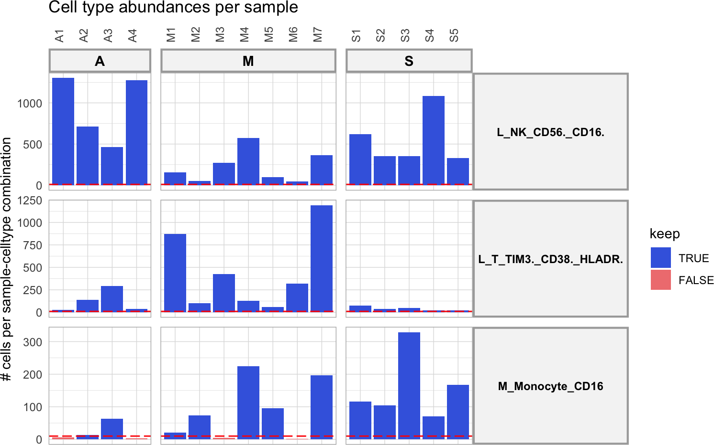

The red dotted line indicates the required minimum of cells as defined above in `min_cells`. We can see here that some sample-celltype combinations are left out. For the DE analysis in the next step, only cell types will be considered if there are at least two samples per group with a sufficient number of cells. But as we can see here: all cell types will be considered for the analysis and there are no condition-specific cell types. 

__Important__: Based on the cell type abundance diagnostics, we recommend users to change their analysis settings if required (eg changing cell type annotation level, batches, ...), before proceeding with the rest of the analysis. If too many celltype-sample combinations don't pass this threshold, we recommend to define your cell types in a more general way (use one level higher of the cell type ontology hierarchy) (eg TH17 CD4T cells --> CD4T cells) or use `min_cells = 5` if this would not be possible.

### Cell type filtering based on cell type abundance information

Running the following block of code can help you determine which cell types are condition-specific and which cell types are absent. 


```r
sample_group_celltype_df = abundance_info$abundance_data %>% 
  filter(n > min_cells) %>% 
  ungroup() %>% 
  distinct(sample_id, group_id) %>% 
  cross_join(
    abundance_info$abundance_data %>% 
      ungroup() %>% 
      distinct(celltype_id)
    ) %>% 
  arrange(sample_id)

abundance_df = sample_group_celltype_df %>% left_join(
  abundance_info$abundance_data %>% ungroup()
  )

abundance_df$n[is.na(abundance_df$n)] = 0
abundance_df$keep[is.na(abundance_df$keep)] = FALSE
abundance_df_summarized = abundance_df %>% 
  mutate(keep = as.logical(keep)) %>% 
  group_by(group_id, celltype_id) %>% 
  summarise(samples_present = sum((keep)))

celltypes_absent_one_condition = abundance_df_summarized %>% 
  filter(samples_present == 0) %>% pull(celltype_id) %>% unique() 
# find truly condition-specific cell types by searching for cell types 
# truely absent in at least one condition

celltypes_present_one_condition = abundance_df_summarized %>% 
  filter(samples_present >= 2) %>% pull(celltype_id) %>% unique() 
# require presence in at least 2 samples of one group so 
# it is really present in at least one condition

condition_specific_celltypes = intersect(
  celltypes_absent_one_condition, 
  celltypes_present_one_condition)

total_nr_conditions = SummarizedExperiment::colData(sce)[,group_id] %>% 
  unique() %>% length() 

absent_celltypes = abundance_df_summarized %>% 
  filter(samples_present < 2) %>% 
  group_by(celltype_id) %>% 
  count() %>% 
  filter(n == total_nr_conditions) %>% 
  pull(celltype_id)
  
print("condition-specific celltypes:")
## [1] "condition-specific celltypes:"
print(condition_specific_celltypes)
## character(0)
  
print("absent celltypes:")
## [1] "absent celltypes:"
print(absent_celltypes)
## character(0)
```
Absent cell types will be filtered out, condition-specific cell types can be filtered out if you as a user do not want to run the alternative workflow for condition-specific cell types in the optional step 8 of the core MultiNicheNet analysis. 


```r
analyse_condition_specific_celltypes = FALSE
```


```r
if(analyse_condition_specific_celltypes == TRUE){
  senders_oi = senders_oi %>% setdiff(absent_celltypes)
  receivers_oi = receivers_oi %>% setdiff(absent_celltypes)
} else {
  senders_oi = senders_oi %>% 
    setdiff(union(absent_celltypes, condition_specific_celltypes))
  receivers_oi = receivers_oi %>% 
    setdiff(union(absent_celltypes, condition_specific_celltypes))
}

sce = sce[, SummarizedExperiment::colData(sce)[,celltype_id] %in% 
            c(senders_oi, receivers_oi)
          ]
```

## Gene filtering: determine which genes are sufficiently expressed in each present cell type

Before running the DE analysis, we will determine which genes are not sufficiently expressed and should be filtered out. 
We will perform gene filtering based on a similar procedure as used in `edgeR::filterByExpr`. However, we adapted this procedure to be more interpretable for single-cell datasets.  

For each cell type, we will consider genes expressed if they are expressed in at least a `min_sample_prop` fraction of samples in the condition with the lowest number of samples. By default, we set `min_sample_prop = 0.50`, which means that genes should be expressed in at least 2 samples if the group with lowest nr. of samples has 4 samples like this dataset. 


```r
min_sample_prop = 0.50
```

But how do we define which genes are expressed in a sample? For this we will consider genes as expressed if they have non-zero expression values in a `fraction_cutoff` fraction of cells of that cell type in that sample. By default, we set `fraction_cutoff = 0.05`, which means that genes should show non-zero expression values in at least 5% of cells in a sample. 


```r
fraction_cutoff = 0.05
```

We recommend using these default values unless there is specific interest in prioritizing (very) weakly expressed interactions. In that case, you could lower the value of `fraction_cutoff`. We explicitly recommend against using `fraction_cutoff > 0.10`.

Now we will calculate the information required for gene filtering with the following command:


```r
frq_list = get_frac_exprs(
  sce = sce, 
  sample_id = sample_id, celltype_id =  celltype_id, group_id = group_id, 
  batches = batches, 
  min_cells = min_cells, 
  fraction_cutoff = fraction_cutoff, min_sample_prop = min_sample_prop)
## [1] "Samples are considered if they have more than 10 cells of the cell type of interest"
## [1] "Genes with non-zero counts in at least 5% of cells of a cell type of interest in a particular sample will be considered as expressed in that sample."
## [1] "Genes expressed in at least 2 samples will considered as expressed in the cell type: L_NK_CD56._CD16."
## [1] "Genes expressed in at least 2 samples will considered as expressed in the cell type: L_T_TIM3._CD38._HLADR."
## [1] "Genes expressed in at least 2 samples will considered as expressed in the cell type: M_Monocyte_CD16"
## [1] "6621 genes are considered as expressed in the cell type: L_NK_CD56._CD16."
## [1] "8461 genes are considered as expressed in the cell type: L_T_TIM3._CD38._HLADR."
## [1] "8817 genes are considered as expressed in the cell type: M_Monocyte_CD16"
```
Now only keep genes that are expressed by at least one cell type:


```r
genes_oi = frq_list$expressed_df %>% 
  filter(expressed == TRUE) %>% pull(gene) %>% unique() 
sce = sce[genes_oi, ]
```

## Pseudobulk expression calculation: determine and normalize per-sample pseudobulk expression levels for each expressed gene in each present cell type

After filtering out absent cell types and genes, we will continue the analysis by calculating the different prioritization criteria that we will use to prioritize cell-cell communication patterns.

First, we will determine and normalize per-sample pseudobulk expression levels for each expressed gene in each present cell type. The function `process_abundance_expression_info` will link this expression information for ligands of the sender cell types to the corresponding receptors of the receiver cell types. This will later on allow us to define the cell-type specicificy criteria for ligands and receptors.


```r
abundance_expression_info = process_abundance_expression_info(
  sce = sce, 
  sample_id = sample_id, group_id = group_id, celltype_id = celltype_id, 
  min_cells = min_cells, 
  senders_oi = senders_oi, receivers_oi = receivers_oi, 
  lr_network = lr_network, 
  batches = batches, 
  frq_list = frq_list, 
  abundance_info = abundance_info)
```

Normalized pseudobulk expression values per gene/celltype/sample can be inspected by:


```r
abundance_expression_info$celltype_info$pb_df %>% head()
## # A tibble: 6 × 4
##   gene  sample pb_sample celltype              
##   <chr> <chr>      <dbl> <fct>                 
## 1 A1BG  A1          3.10 L_T_TIM3._CD38._HLADR.
## 2 AAAS  A1          4.01 L_T_TIM3._CD38._HLADR.
## 3 AAGAB A1          5.54 L_T_TIM3._CD38._HLADR.
## 4 AAK1  A1          6.40 L_T_TIM3._CD38._HLADR.
## 5 AAMDC A1          4.57 L_T_TIM3._CD38._HLADR.
## 6 AAMP  A1          5.54 L_T_TIM3._CD38._HLADR.
```

An average of these sample-level expression values per condition/group can be inspected by:


```r
abundance_expression_info$celltype_info$pb_df_group %>% head()
## # A tibble: 6 × 4
## # Groups:   group, celltype [1]
##   group celltype         gene  pb_group
##   <chr> <chr>            <chr>    <dbl>
## 1 A     L_NK_CD56._CD16. A1BG      3.91
## 2 A     L_NK_CD56._CD16. AAAS      4.81
## 3 A     L_NK_CD56._CD16. AAGAB     4.82
## 4 A     L_NK_CD56._CD16. AAK1      7.03
## 5 A     L_NK_CD56._CD16. AAMDC     3.66
## 6 A     L_NK_CD56._CD16. AAMP      6.04
```

Inspecting these values for ligand-receptor interactions can be done by:


```r
abundance_expression_info$sender_receiver_info$pb_df %>% head()
## # A tibble: 6 × 8
##   sample sender                 receiver        ligand receptor pb_ligand pb_receptor ligand_receptor_pb_prod
##   <chr>  <chr>                  <chr>           <chr>  <chr>        <dbl>       <dbl>                   <dbl>
## 1 M4     M_Monocyte_CD16        M_Monocyte_CD16 B2M    LILRB1        14.2        11.4                    162.
## 2 M4     L_NK_CD56._CD16.       M_Monocyte_CD16 B2M    LILRB1        14.0        11.4                    160.
## 3 M4     L_T_TIM3._CD38._HLADR. M_Monocyte_CD16 B2M    LILRB1        13.8        11.4                    158.
## 4 M5     L_NK_CD56._CD16.       M_Monocyte_CD16 B2M    LILRB1        14.5        10.5                    153.
## 5 M5     M_Monocyte_CD16        M_Monocyte_CD16 B2M    LILRB1        14.4        10.5                    152.
## 6 M5     L_T_TIM3._CD38._HLADR. M_Monocyte_CD16 B2M    LILRB1        14.2        10.5                    149.
abundance_expression_info$sender_receiver_info$pb_df_group %>% head()
## # A tibble: 6 × 8
## # Groups:   group, sender [6]
##   group sender                 receiver       ligand receptor pb_ligand_group pb_receptor_group ligand_receptor_pb_p…¹
##   <chr> <chr>                  <chr>          <chr>  <chr>              <dbl>             <dbl>                  <dbl>
## 1 M     L_NK_CD56._CD16.       M_Monocyte_CD… B2M    LILRB1              14.1             10.0                    141.
## 2 M     M_Monocyte_CD16        M_Monocyte_CD… B2M    LILRB1              14.1             10.0                    141.
## 3 M     L_T_TIM3._CD38._HLADR. M_Monocyte_CD… B2M    LILRB1              14.0             10.0                    140.
## 4 A     L_NK_CD56._CD16.       L_NK_CD56._CD… B2M    KLRD1               14.3              9.71                   139.
## 5 S     L_NK_CD56._CD16.       L_NK_CD56._CD… B2M    KLRD1               14.4              9.46                   136.
## 6 A     L_T_TIM3._CD38._HLADR. L_NK_CD56._CD… B2M    KLRD1               13.9              9.71                   135.
## # ℹ abbreviated name: ¹​ligand_receptor_pb_prod_group
```

## Differential expression (DE) analysis: determine which genes are differentially expressed

In this step, we will perform genome-wide differential expression analysis of receiver and sender cell types to define DE genes between the conditions of interest (as formalized by the `contrasts_oi`). Based on this analysis, we later can define the levels of differential expression of ligands in senders and receptors in receivers, and define the set of affected target genes in the receiver cell types (which will be used for the ligand activity analysis).

We will apply pseudobulking followed by EdgeR to perform multi-condition multi-sample differential expression (DE) analysis (also called 'differential state' analysis by the developers of Muscat). 


```r
DE_info = get_DE_info(
  sce = sce, 
  sample_id = sample_id, group_id = group_id, celltype_id = celltype_id, 
  batches = batches, covariates = covariates, 
  contrasts_oi = contrasts_oi, 
  min_cells = min_cells, 
  expressed_df = frq_list$expressed_df)
## [1] "DE analysis is done:"
## [1] "included cell types are:"
## [1] "L_T_TIM3._CD38._HLADR." "L_NK_CD56._CD16."       "M_Monocyte_CD16"
```

### Check DE results

Check DE output information in table with logFC and p-values for each gene-celltype-contrast:


```r
DE_info$celltype_de$de_output_tidy %>% head()
## # A tibble: 6 × 9
##   gene  cluster_id              logFC logCPM       F   p_val p_adj.loc p_adj contrast 
##   <chr> <chr>                   <dbl>  <dbl>   <dbl>   <dbl>     <dbl> <dbl> <chr>    
## 1 A1BG  L_T_TIM3._CD38._HLADR.  0.127   4.46  0.175  0.68        0.984 0.984 M-(S+A)/2
## 2 AAAS  L_T_TIM3._CD38._HLADR. -0.072   4.78  0.0678 0.797       1     1     M-(S+A)/2
## 3 AAGAB L_T_TIM3._CD38._HLADR.  0.492   5.01  4.73   0.04        0.481 0.481 M-(S+A)/2
## 4 AAK1  L_T_TIM3._CD38._HLADR. -0.521   6.83 12.7    0.00163     0.138 0.138 M-(S+A)/2
## 5 AAMDC L_T_TIM3._CD38._HLADR. -0.44    3.95  2.15   0.156       0.724 0.724 M-(S+A)/2
## 6 AAMP  L_T_TIM3._CD38._HLADR.  0.224   6.04  2.95   0.235       0.806 0.806 M-(S+A)/2
```
Evaluate the distributions of p-values:


```r
DE_info$hist_pvals
```

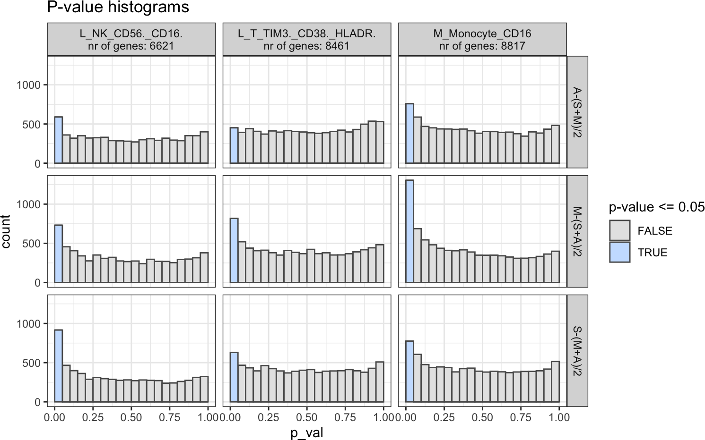

These distributions look fine (uniform distribution, except peak at p-value <= 0.05), so we will continue using these regular p-values. In case these p-value distributions look irregular, you can estimate empirical p-values as we will demonstrate in another vignette.


```r
empirical_pval = FALSE
```


```r
if(empirical_pval == TRUE){
  DE_info_emp = get_empirical_pvals(DE_info$celltype_de$de_output_tidy)
  celltype_de = DE_info_emp$de_output_tidy_emp %>% select(-p_val, -p_adj) %>% 
    rename(p_val = p_emp, p_adj = p_adj_emp)
} else {
  celltype_de = DE_info$celltype_de$de_output_tidy
} 
```

### Combine DE information for ligand-senders and receptors-receivers

To end this step, we will combine the DE information of senders and receivers by linking their ligands and receptors together based on the prior knowledge ligand-receptor network.


```r
sender_receiver_de = combine_sender_receiver_de(
  sender_de = celltype_de,
  receiver_de = celltype_de,
  senders_oi = senders_oi,
  receivers_oi = receivers_oi,
  lr_network = lr_network
)
```


```r
sender_receiver_de %>% head(20)
## # A tibble: 20 × 12
##    contrast  sender  receiver ligand receptor lfc_ligand lfc_receptor ligand_receptor_lfc_…¹ p_val_ligand p_adj_ligand
##    <chr>     <chr>   <chr>    <chr>  <chr>         <dbl>        <dbl>                  <dbl>        <dbl>        <dbl>
##  1 M-(S+A)/2 M_Mono… M_Monoc… C3     VSIG4         2.96        5.76                     4.36      0.0964         0.439
##  2 M-(S+A)/2 M_Mono… M_Monoc… IL10   IL10RB        5.61        0.715                    3.16      0.0052         0.142
##  3 M-(S+A)/2 M_Mono… L_T_TIM… IL18   IL18RAP       1.93        4.39                     3.16      0.0445         0.321
##  4 M-(S+A)/2 M_Mono… L_T_TIM… IL10   IL10RB        5.61        0.184                    2.90      0.0052         0.142
##  5 M-(S+A)/2 L_NK_C… L_T_TIM… IL18   IL18RAP       1.29        4.39                     2.84      0.00758        0.231
##  6 M-(S+A)/2 M_Mono… L_NK_CD… IL10   IL10RA        5.61        0.0393                   2.82      0.0052         0.142
##  7 M-(S+A)/2 M_Mono… L_T_TIM… IL10   IL10RA        5.61       -0.0612                   2.77      0.0052         0.142
##  8 M-(S+A)/2 M_Mono… L_NK_CD… IL10   IL10RB        5.61       -0.0727                   2.77      0.0052         0.142
##  9 M-(S+A)/2 M_Mono… M_Monoc… IL10   IL10RA        5.61       -0.316                    2.65      0.0052         0.142
## 10 M-(S+A)/2 M_Mono… L_T_TIM… C3     ITGAM         2.96        2.2                      2.58      0.0964         0.439
## 11 A-(S+M)/2 L_T_TI… M_Monoc… SCGB3… MARCO         4.49        0.611                    2.55      0.0492         0.932
## 12 M-(S+A)/2 M_Mono… M_Monoc… IL1B   IL1RAP        1.53        3.56                     2.54      0.0145         0.216
## 13 M-(S+A)/2 M_Mono… M_Monoc… THBS1  CD47          4.58        0.446                    2.51      0.00784        0.166
## 14 M-(S+A)/2 L_T_TI… M_Monoc… TNFSF… CD163         0.484       4.54                     2.51      0.282          0.84 
## 15 M-(S+A)/2 M_Mono… M_Monoc… THBS1  ITGA6         4.58        0.382                    2.48      0.00784        0.166
## 16 M-(S+A)/2 M_Mono… L_NK_CD… THBS1  ITGA6         4.58        0.352                    2.47      0.00784        0.166
## 17 M-(S+A)/2 M_Mono… L_NK_CD… THBS1  ITGA4         4.58        0.283                    2.43      0.00784        0.166
## 18 M-(S+A)/2 M_Mono… L_T_TIM… THBS1  ITGA6         4.58        0.263                    2.42      0.00784        0.166
## 19 M-(S+A)/2 L_T_TI… M_Monoc… HMGB1  CD163         0.226       4.54                     2.38      0.111          0.649
## 20 M-(S+A)/2 M_Mono… M_Monoc… HMGB1  CD163         0.154       4.54                     2.35      0.287          0.673
## # ℹ abbreviated name: ¹​ligand_receptor_lfc_avg
## # ℹ 2 more variables: p_val_receptor <dbl>, p_adj_receptor <dbl>
```

## Ligand activity prediction: use the DE analysis output to predict the activity of ligands in receiver cell types and infer their potential target genes

In this step, we will predict NicheNet ligand activities and NicheNet ligand-target links based on these differential expression results. We do this to prioritize interactions based on their predicted effect on a receiver cell type. We will assume that the most important group-specific interactions are those that lead to group-specific gene expression changes in a receiver cell type.

Similarly to base NicheNet (https://github.com/saeyslab/nichenetr), we use the DE output to create a "geneset of interest": here we assume that DE genes within a cell type may be DE because of differential cell-cell communication processes. In the ligand activity prediction, we will assess the enrichment of target genes of ligands within this geneset of interest. In case high-probabiliy target genes of a ligand are enriched in this set compared to the background of expressed genes, we predict that this ligand may have a high activity. 

Because the ligand activity analysis is an enrichment procedure, it is important that this geneset of interest should contain a sufficient but not too large number of genes. The ratio geneset_oi/background should ideally be between 1/200 and 1/10 (or close to these ratios).

To determine the genesets of interest based on DE output, we need to define some logFC and/or p-value thresholds per cell type/contrast combination. In general, we recommend inspecting the nr. of DE genes for all cell types based on the default thresholds and adapting accordingly. By default, we will apply the p-value cutoff on the normal p-values, and not on the p-values corrected for multiple testing. This choice was made because most multi-sample single-cell transcriptomics datasets have just a few samples per group and we might have a lack of statistical power due to pseudobulking. But, if the smallest group >= 20 samples, we typically recommend using p_val_adj = TRUE. When the biological difference between the conditions is very large, we typically recommend increasing the logFC_threshold and/or using p_val_adj = TRUE.

### Assess geneset_oi-vs-background ratios for different DE output tresholds prior to the NicheNet ligand activity analysis 

We will first inspect the geneset_oi-vs-background ratios for the default tresholds:


```r
logFC_threshold = 0.50
p_val_threshold = 0.05
```


```r
p_val_adj = FALSE 
```


```r
geneset_assessment = contrast_tbl$contrast %>% 
  lapply(
    process_geneset_data, 
    celltype_de, logFC_threshold, p_val_adj, p_val_threshold
  ) %>% 
  bind_rows() 
geneset_assessment
## # A tibble: 9 × 12
##   cluster_id      n_background n_geneset_up n_geneset_down prop_geneset_up prop_geneset_down in_range_up in_range_down
##   <chr>                  <int>        <int>          <int>           <dbl>             <dbl> <lgl>       <lgl>        
## 1 L_NK_CD56._CD1…         6621          162             82          0.0245            0.0124 TRUE        TRUE         
## 2 L_T_TIM3._CD38…         8461          401            194          0.0474            0.0229 TRUE        TRUE         
## 3 M_Monocyte_CD16         8817          647            438          0.0734            0.0497 TRUE        TRUE         
## 4 L_NK_CD56._CD1…         6621          150            219          0.0227            0.0331 TRUE        TRUE         
## 5 L_T_TIM3._CD38…         8461          201            320          0.0238            0.0378 TRUE        TRUE         
## 6 M_Monocyte_CD16         8817          368            254          0.0417            0.0288 TRUE        TRUE         
## 7 L_NK_CD56._CD1…         6621          118            110          0.0178            0.0166 TRUE        TRUE         
## 8 L_T_TIM3._CD38…         8461          225            150          0.0266            0.0177 TRUE        TRUE         
## 9 M_Monocyte_CD16         8817          262            464          0.0297            0.0526 TRUE        TRUE         
## # ℹ 4 more variables: contrast <chr>, logFC_threshold <dbl>, p_val_threshold <dbl>, adjusted <lgl>
```
We can see here that for all cell type / contrast combinations, all geneset/background ratio's are within the recommended range (`in_range_up` and `in_range_down` columns). When these geneset/background ratio's would not be within the recommended ranges, we should interpret ligand activity results for these cell types with more caution, or use different thresholds (for these or all cell types). 

For the sake of demonstration, we will also calculate these ratio's in case we would use the adjusted p-value as threshold.


```r
geneset_assessment_adjustedPval = contrast_tbl$contrast %>% 
  lapply(
    process_geneset_data, 
    celltype_de, logFC_threshold, p_val_adj = TRUE, p_val_threshold
    ) %>% 
  bind_rows() 
geneset_assessment_adjustedPval
## # A tibble: 9 × 12
##   cluster_id      n_background n_geneset_up n_geneset_down prop_geneset_up prop_geneset_down in_range_up in_range_down
##   <chr>                  <int>        <int>          <int>           <dbl>             <dbl> <lgl>       <lgl>        
## 1 L_NK_CD56._CD1…         6621            7              0        0.00106           0        FALSE       FALSE        
## 2 L_T_TIM3._CD38…         8461           15              5        0.00177           0.000591 FALSE       FALSE        
## 3 M_Monocyte_CD16         8817           25             11        0.00284           0.00125  FALSE       FALSE        
## 4 L_NK_CD56._CD1…         6621           28             50        0.00423           0.00755  FALSE       TRUE         
## 5 L_T_TIM3._CD38…         8461            2              5        0.000236          0.000591 FALSE       FALSE        
## 6 M_Monocyte_CD16         8817           10             15        0.00113           0.00170  FALSE       FALSE        
## 7 L_NK_CD56._CD1…         6621           36             19        0.00544           0.00287  TRUE        FALSE        
## 8 L_T_TIM3._CD38…         8461           13              1        0.00154           0.000118 FALSE       FALSE        
## 9 M_Monocyte_CD16         8817            4              3        0.000454          0.000340 FALSE       FALSE        
## # ℹ 4 more variables: contrast <chr>, logFC_threshold <dbl>, p_val_threshold <dbl>, adjusted <lgl>
```
We can see here that for most cell type / contrast combinations, the geneset/background ratio's are not within the recommended range. Therefore, we will proceed with the default tresholds for the ligand activity analysis

### Perform the ligand activity analysis and ligand-target inference

After the ligand activity prediction, we will also infer the predicted target genes of these ligands in each contrast. For this ligand-target inference procedure, we also need to select which top n of the predicted target genes will be considered (here: top 250 targets per ligand). This parameter will not affect the ligand activity predictions. It will only affect ligand-target visualizations and construction of the intercellular regulatory network during the downstream analysis. We recommend users to test other settings in case they would be interested in exploring fewer, but more confident target genes, or vice versa. 


```r
top_n_target = 250
```

The NicheNet ligand activity analysis can be run in parallel for each receiver cell type, by changing the number of cores as defined here. Using more cores will speed up the analysis at the cost of needing more memory. This is only recommended if you have many receiver cell types of interest. 


```r
verbose = TRUE
cores_system = 8
n.cores = min(cores_system, celltype_de$cluster_id %>% unique() %>% length()) 
```

Running the ligand activity prediction will take some time (the more cell types and contrasts, the more time)


```r
ligand_activities_targets_DEgenes = suppressMessages(suppressWarnings(
  get_ligand_activities_targets_DEgenes(
    receiver_de = celltype_de,
    receivers_oi = intersect(receivers_oi, celltype_de$cluster_id %>% unique()),
    ligand_target_matrix = ligand_target_matrix,
    logFC_threshold = logFC_threshold,
    p_val_threshold = p_val_threshold,
    p_val_adj = p_val_adj,
    top_n_target = top_n_target,
    verbose = verbose, 
    n.cores = n.cores
  )
))
```

You can check the output of the ligand activity and ligand-target inference here:


```r
ligand_activities_targets_DEgenes$ligand_activities %>% head(20)
## # A tibble: 20 × 8
## # Groups:   receiver, contrast [1]
##    ligand activity contrast  target   ligand_target_weight receiver         direction_regulation activity_scaled
##    <chr>     <dbl> <chr>     <chr>                   <dbl> <chr>            <fct>                          <dbl>
##  1 A2M      0.0282 M-(S+A)/2 ACOT7                 0.00632 L_NK_CD56._CD16. up                             0.794
##  2 A2M      0.0282 M-(S+A)/2 AREG                  0.00638 L_NK_CD56._CD16. up                             0.794
##  3 A2M      0.0282 M-(S+A)/2 CD55                  0.00649 L_NK_CD56._CD16. up                             0.794
##  4 A2M      0.0282 M-(S+A)/2 CD74                  0.00634 L_NK_CD56._CD16. up                             0.794
##  5 A2M      0.0282 M-(S+A)/2 FKBP5                 0.00723 L_NK_CD56._CD16. up                             0.794
##  6 A2M      0.0282 M-(S+A)/2 FOS                   0.0146  L_NK_CD56._CD16. up                             0.794
##  7 A2M      0.0282 M-(S+A)/2 GADD45A               0.0110  L_NK_CD56._CD16. up                             0.794
##  8 A2M      0.0282 M-(S+A)/2 H2AC6                 0.00747 L_NK_CD56._CD16. up                             0.794
##  9 A2M      0.0282 M-(S+A)/2 H2BC12                0.00692 L_NK_CD56._CD16. up                             0.794
## 10 A2M      0.0282 M-(S+A)/2 ISG20                 0.00738 L_NK_CD56._CD16. up                             0.794
## 11 A2M      0.0282 M-(S+A)/2 LMNB1                 0.00699 L_NK_CD56._CD16. up                             0.794
## 12 A2M      0.0282 M-(S+A)/2 MYC                   0.0199  L_NK_CD56._CD16. up                             0.794
## 13 A2M      0.0282 M-(S+A)/2 NFKB1                 0.00895 L_NK_CD56._CD16. up                             0.794
## 14 A2M      0.0282 M-(S+A)/2 NFKBIZ                0.00661 L_NK_CD56._CD16. up                             0.794
## 15 A2M      0.0282 M-(S+A)/2 PPP1R15A              0.00776 L_NK_CD56._CD16. up                             0.794
## 16 A2M      0.0282 M-(S+A)/2 SLC1A5                0.00710 L_NK_CD56._CD16. up                             0.794
## 17 A2M      0.0282 M-(S+A)/2 SMAD3                 0.00776 L_NK_CD56._CD16. up                             0.794
## 18 A2M      0.0282 M-(S+A)/2 SOCS3                 0.00968 L_NK_CD56._CD16. up                             0.794
## 19 A2M      0.0282 M-(S+A)/2 TFRC                  0.00712 L_NK_CD56._CD16. up                             0.794
## 20 A2M      0.0282 M-(S+A)/2 WARS1                 0.00743 L_NK_CD56._CD16. up                             0.794
```

## Prioritization: rank cell-cell communication patterns through multi-criteria prioritization

In the previous steps, we calculated expression, differential expression and NicheNet ligand activity. In the final step, we will now combine all calculated information to rank all sender-ligand---receiver-receptor pairs according to group/condition specificity. We will use the following criteria to prioritize ligand-receptor interactions:

* Upregulation of the ligand in a sender cell type and/or upregulation of the receptor in a receiver cell type - in the condition of interest.
* Cell-type specific expression of the ligand in the sender cell type and receptor in the receiver cell type in the condition of interest (to mitigate the influence of upregulated but still relatively weakly expressed ligands/receptors). 
* Sufficiently high expression levels of ligand and receptor in many samples of the same group.
* High NicheNet ligand activity, to further prioritize ligand-receptor pairs based on their predicted effect of the ligand-receptor interaction on the gene expression in the receiver cell type. 

We will combine these prioritization criteria in a single aggregated prioritization score. In the default setting, we will weigh each of these criteria equally (`scenario = "regular"`). This setting is strongly recommended. However, we also provide some additional setting to accomodate different biological scenarios. The setting `scenario = "lower_DE"` halves the weight for DE criteria and doubles the weight for ligand activity. This is recommended in case your hypothesis is that the differential CCC patterns in your data are less likely to be driven by DE (eg in cases of differential migration into a niche). The setting `scenario = "no_frac_LR_expr"` ignores the criterion "Sufficiently high expression levels of ligand and receptor in many samples of the same group". This may be interesting for users that have data with a limited number of samples and don’t want to penalize interactions if they are not sufficiently expressed in some samples. 

Finally, we still need to make one choice. For NicheNet ligand activity we can choose to prioritize ligands that only induce upregulation of target genes (`ligand_activity_down = FALSE`) or can lead potentially lead to both up- and downregulation (`ligand_activity_down = TRUE`). The benefit of `ligand_activity_down = FALSE` is ease of interpretability: prioritized ligand-receptor pairs will be upregulated in the condition of interest, just like their target genes.  `ligand_activity_down = TRUE` can be harder to interpret because target genes of some interactions may be upregulated in the other conditions compared to the condition of interest. This is harder to interpret, but may help to pick up interactions that can also repress gene expression. 

Here we will choose for setting `ligand_activity_down = FALSE` and focus specifically on upregulating ligands.


```r
ligand_activity_down = FALSE
```


```r
sender_receiver_tbl = sender_receiver_de %>% distinct(sender, receiver)

metadata_combined = SummarizedExperiment::colData(sce) %>% tibble::as_tibble()

if(!is.na(batches)){
  grouping_tbl = metadata_combined[,c(sample_id, group_id, batches)] %>% 
    tibble::as_tibble() %>% distinct()
  colnames(grouping_tbl) = c("sample","group",batches)
} else {
  grouping_tbl = metadata_combined[,c(sample_id, group_id)] %>% 
    tibble::as_tibble() %>% distinct()
  colnames(grouping_tbl) = c("sample","group")
}

prioritization_tables = suppressMessages(generate_prioritization_tables(
    sender_receiver_info = abundance_expression_info$sender_receiver_info,
    sender_receiver_de = sender_receiver_de,
    ligand_activities_targets_DEgenes = ligand_activities_targets_DEgenes,
    contrast_tbl = contrast_tbl,
    sender_receiver_tbl = sender_receiver_tbl,
    grouping_tbl = grouping_tbl,
    scenario = "regular", # all prioritization criteria will be weighted equally
    fraction_cutoff = fraction_cutoff, 
    abundance_data_receiver = abundance_expression_info$abundance_data_receiver,
    abundance_data_sender = abundance_expression_info$abundance_data_sender,
    ligand_activity_down = ligand_activity_down
  ))
```

Check the output tables

First: group-based summary table


```r
prioritization_tables$group_prioritization_tbl %>% head(20)
## # A tibble: 20 × 18
##    contrast  group sender       receiver ligand receptor lr_interaction id    scaled_lfc_ligand scaled_p_val_ligand_…¹
##    <chr>     <chr> <chr>        <chr>    <chr>  <chr>    <chr>          <chr>             <dbl>                  <dbl>
##  1 M-(S+A)/2 M     M_Monocyte_… L_NK_CD… HLA.E  KLRC1    HLA.E_KLRC1    HLA.…             0.816                  0.982
##  2 M-(S+A)/2 M     L_T_TIM3._C… M_Monoc… IFNG   IFNGR1   IFNG_IFNGR1    IFNG…             0.958                  0.946
##  3 A-(S+M)/2 A     M_Monocyte_… L_T_TIM… LGALS3 LAG3     LGALS3_LAG3    LGAL…             0.918                  0.980
##  4 M-(S+A)/2 M     L_T_TIM3._C… M_Monoc… IFNG   IFNGR2   IFNG_IFNGR2    IFNG…             0.958                  0.946
##  5 M-(S+A)/2 M     M_Monocyte_… L_T_TIM… CXCL16 CXCR6    CXCL16_CXCR6   CXCL…             0.861                  0.936
##  6 A-(S+M)/2 A     M_Monocyte_… M_Monoc… VCAN   TLR2     VCAN_TLR2      VCAN…             0.942                  0.812
##  7 M-(S+A)/2 M     M_Monocyte_… L_T_TIM… HLA.E  CD8A     HLA.E_CD8A     HLA.…             0.816                  0.982
##  8 M-(S+A)/2 M     M_Monocyte_… M_Monoc… S100A9 CD68     S100A9_CD68    S100…             0.891                  0.880
##  9 M-(S+A)/2 M     M_Monocyte_… L_T_TIM… HLA.D… LAG3     HLA.DRA_LAG3   HLA.…             0.886                  0.978
## 10 M-(S+A)/2 M     M_Monocyte_… L_T_TIM… S100A8 CD69     S100A8_CD69    S100…             0.871                  0.791
## 11 M-(S+A)/2 M     M_Monocyte_… M_Monoc… HLA.F  LILRB1   HLA.F_LILRB1   HLA.…             0.890                  0.985
## 12 M-(S+A)/2 M     M_Monocyte_… M_Monoc… TNF    LTBR     TNF_LTBR       TNF_…             0.984                  0.953
## 13 A-(S+M)/2 A     L_T_TIM3._C… L_T_TIM… LGALS… ITGB1    LGALS3BP_ITGB1 LGAL…             0.947                  0.995
## 14 A-(S+M)/2 A     M_Monocyte_… M_Monoc… S100A8 CD36     S100A8_CD36    S100…             0.830                  0.697
## 15 M-(S+A)/2 M     M_Monocyte_… M_Monoc… HLA.F  LILRB2   HLA.F_LILRB2   HLA.…             0.890                  0.985
## 16 M-(S+A)/2 M     M_Monocyte_… L_T_TIM… HLA.A  CD8A     HLA.A_CD8A     HLA.…             0.925                  0.999
## 17 M-(S+A)/2 M     M_Monocyte_… L_NK_CD… HLA.C  KIR2DL1  HLA.C_KIR2DL1  HLA.…             0.897                  0.972
## 18 S-(M+A)/2 S     L_T_TIM3._C… L_T_TIM… CD99   CD81     CD99_CD81      CD99…             0.656                  0.780
## 19 S-(M+A)/2 S     L_NK_CD56._… M_Monoc… TGFB1  ENG      TGFB1_ENG      TGFB…             0.672                  0.873
## 20 S-(M+A)/2 S     M_Monocyte_… M_Monoc… TGFB1  ENG      TGFB1_ENG      TGFB…             0.791                  0.930
## # ℹ abbreviated name: ¹​scaled_p_val_ligand_adapted
## # ℹ 8 more variables: scaled_lfc_receptor <dbl>, scaled_p_val_receptor_adapted <dbl>, max_scaled_activity <dbl>,
## #   scaled_pb_ligand <dbl>, scaled_pb_receptor <dbl>, fraction_expressing_ligand_receptor <dbl>,
## #   prioritization_score <dbl>, top_group <chr>
```
This table gives the final prioritization score of each interaction, and the values of the individual prioritization criteria.

With this step, all required steps are finished. Now, we can optionally still run the following steps
* Calculate the across-samples expression correlation between ligand-receptor pairs and target genes
* Prioritize communication patterns involving condition-specific cell types through an alternative prioritization scheme

Here we will only focus on the expression correlation step:

## Calculate the across-samples expression correlation between ligand-receptor pairs and target genes

In multi-sample datasets, we have the opportunity to look whether expression of ligand-receptor across all samples is correlated with the expression of their by NicheNet predicted target genes. This is what we will do with the following line of code:


```r
lr_target_prior_cor = lr_target_prior_cor_inference(
  receivers_oi = prioritization_tables$group_prioritization_tbl$receiver %>% unique(), 
  abundance_expression_info = abundance_expression_info, 
  celltype_de = celltype_de, 
  grouping_tbl = grouping_tbl, 
  prioritization_tables = prioritization_tables, 
  ligand_target_matrix = ligand_target_matrix, 
  logFC_threshold = logFC_threshold, 
  p_val_threshold = p_val_threshold, 
  p_val_adj = p_val_adj
  )
```

## Save all the output of MultiNicheNet 

To avoid needing to redo the analysis later, we will here to save an output object that contains all information to perform all downstream analyses. 

```r
path = "./"

multinichenet_output = list(
    celltype_info = abundance_expression_info$celltype_info,
    celltype_de = celltype_de,
    sender_receiver_info = abundance_expression_info$sender_receiver_info,
    sender_receiver_de =  sender_receiver_de,
    ligand_activities_targets_DEgenes = ligand_activities_targets_DEgenes,
    prioritization_tables = prioritization_tables,
    grouping_tbl = grouping_tbl,
    lr_target_prior_cor = lr_target_prior_cor
  ) 
multinichenet_output = make_lite_output(multinichenet_output)

save = FALSE
if(save == TRUE){
  saveRDS(multinichenet_output, paste0(path, "multinichenet_output.rds"))

}
```

We suggest to split up the analysis in at least two scripts: the code to create this MultiNicheNet output object, and the code to analyze and interpret this output. For sake of demonstration, we will continue here in this vignette. 

# Interpreting the MultiNicheNet analysis output

## Visualization of differential cell-cell interactions

### Summarizing ChordDiagram circos plots

In a first instance, we will look at the broad overview of prioritized interactions via condition-specific Chordiagram circos plots. The aim of this visualizatin is to provide a summary of the top prioritized senderLigand-receiverReceptor interactions per condition (between all cell types or between cell type pairs of interest). 

We will look here at the top 50 predictions across all contrasts, senders, and receivers of interest.


```r
prioritized_tbl_oi_all = get_top_n_lr_pairs(
  multinichenet_output$prioritization_tables, 
  top_n = 50, 
  rank_per_group = FALSE
  )
```


```r
prioritized_tbl_oi = 
  multinichenet_output$prioritization_tables$group_prioritization_tbl %>%
  filter(id %in% prioritized_tbl_oi_all$id) %>%
  distinct(id, sender, receiver, ligand, receptor, group) %>% 
  left_join(prioritized_tbl_oi_all)
prioritized_tbl_oi$prioritization_score[is.na(prioritized_tbl_oi$prioritization_score)] = 0

senders_receivers = union(prioritized_tbl_oi$sender %>% unique(), prioritized_tbl_oi$receiver %>% unique()) %>% sort()

colors_sender = RColorBrewer::brewer.pal(n = length(senders_receivers), name = 'Spectral') %>% magrittr::set_names(senders_receivers)
colors_receiver = RColorBrewer::brewer.pal(n = length(senders_receivers), name = 'Spectral') %>% magrittr::set_names(senders_receivers)

circos_list = make_circos_group_comparison(prioritized_tbl_oi, colors_sender, colors_receiver)
```

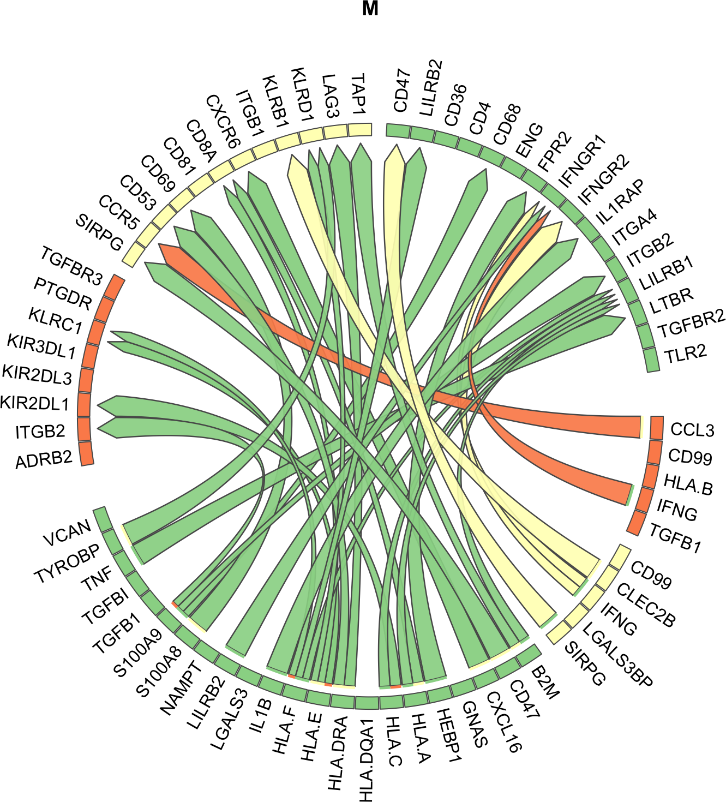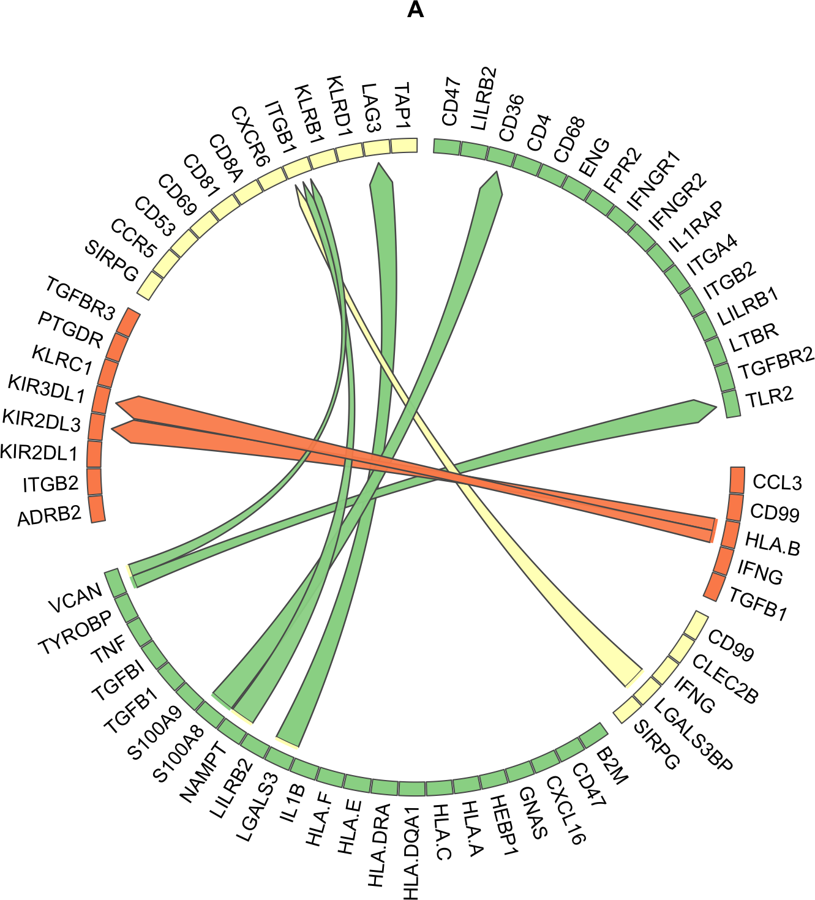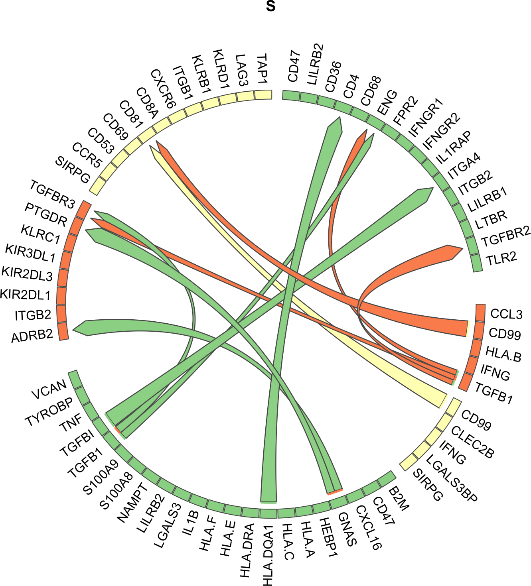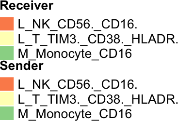

Whereas these ChordDiagram circos plots show the most specific interactions per group, they don't give insights into the data behind these predictions. Because inspecting the data behind the prioritization is recommended to decide on which interactions to validate, we created several functionalities to do this. 

Therefore we will now generate "interpretable bubble plots" that indicate the different prioritization criteria used in MultiNicheNet. 

### Interpretable bubble plots

In the next type of plots, we will visualize the following prioritization criteria used in MultiNicheNet: 
* 1) differential expression of ligand and receptor: the per-sample scaled product of normalized ligand and receptor pseudobulk expression
* 2) the scaled ligand activities
* 3) cell-type specificity of ligand and receptor. 

As a further help for users to further prioritize, we also visualize:
* the condition-average of the fraction of cells expressing the ligand and receptor in the cell types of interest
* the level of curation of these LR pairs as defined by the Intercellular Communication part of the Omnipath database (https://omnipathdb.org/)

We will create this plot for MIS-C group specific interactions of the overall top50 interactions that we visualized in the Circos Chorddiagrams above:


```r
group_oi = "M"
```


```r
prioritized_tbl_oi_M_50 = prioritized_tbl_oi_all %>% 
  filter(group == group_oi)
```


```r
plot_oi = make_sample_lr_prod_activity_plots_Omnipath(
  multinichenet_output$prioritization_tables, 
  prioritized_tbl_oi_M_50 %>% inner_join(lr_network_all)
  )
plot_oi
```

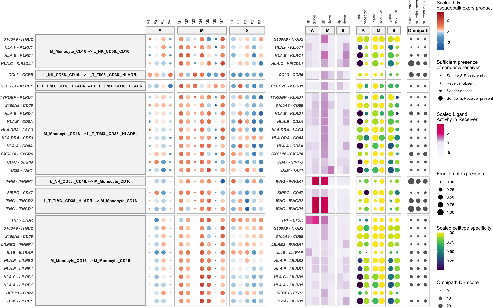
Some notes about this plot:
* Samples that were left out of the DE analysis (because too few cells in that celltype-sample combination) are indicated with a smaller dot. This helps to indicate the samples that did not contribute to the calculation of the logFC, and thus not contributed to the final prioritization. 
* As you can see, the HEBP1-FPR2 interaction does not have Omnipath DB scores. This is because this LR pair was not documented by the Omnipath LR database. Instead it was documented by the original NicheNet LR network (source: Guide2Pharmacology) as can be seen in the table (`lr_network_all %>% filter(ligand == "HEBP1" & receptor == "FPR2")`).

We encourage users to make these plots also for the other groups, like we will do now first for the S group


```r
group_oi = "S"
```


```r
prioritized_tbl_oi_S_50 = prioritized_tbl_oi_all %>% 
  filter(group == group_oi) 
```


```r
plot_oi = make_sample_lr_prod_activity_plots_Omnipath(
  multinichenet_output$prioritization_tables, 
  prioritized_tbl_oi_S_50 %>% inner_join(lr_network_all)
)
plot_oi
```

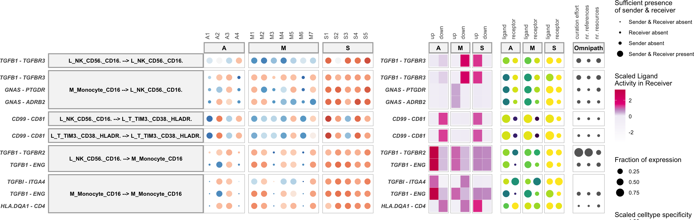

and finally for the A group


```r
group_oi = "A"
```


```r
prioritized_tbl_oi_A_50 = prioritized_tbl_oi_all %>% 
  filter(group == group_oi) 
```


```r
plot_oi = make_sample_lr_prod_activity_plots_Omnipath(
  multinichenet_output$prioritization_tables, 
  prioritized_tbl_oi_A_50 %>% inner_join(lr_network_all)
)
plot_oi
```

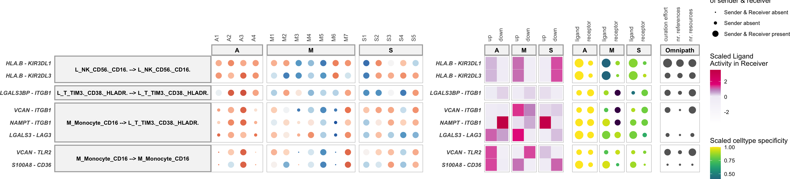

As you could observe from the Circos ChordDiagram and Interpretable Bubble plots above: we find more specific interactions for the M-group than for the S- and A-group here. 
If you want to visualize more interactions specific for a group of interest, so not restricted to e.g. the top50 overall, but the top50 for a group of interest, you can run the following:


```r
prioritized_tbl_oi_A_50 = get_top_n_lr_pairs(
  multinichenet_output$prioritization_tables, 
  50, 
  groups_oi = group_oi) 
```


```r
plot_oi = make_sample_lr_prod_activity_plots_Omnipath(
  multinichenet_output$prioritization_tables, 
  prioritized_tbl_oi_A_50 %>% inner_join(lr_network_all)
)
plot_oi
```

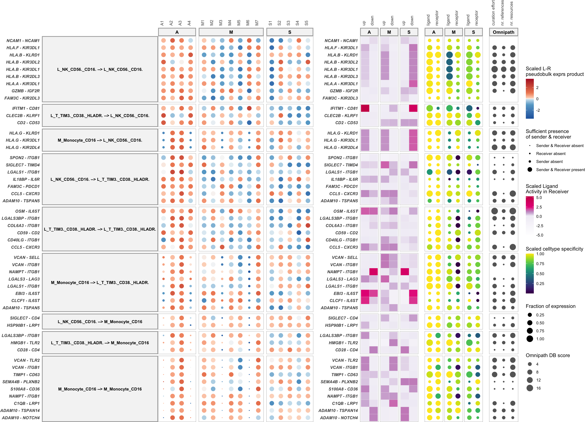
Typically, there are way more than 50 differentially expressed and active ligand-receptor pairs per group across all sender-receiver combinations. Therefore it might be useful to zoom in on specific cell types as senders/receivers:

We will illustrate this for the "M_Monocyte_CD16" cell type as receiver in the M group:


```r
group_oi = "M"
prioritized_tbl_oi_M_50 = get_top_n_lr_pairs(
  multinichenet_output$prioritization_tables, 
  50, 
  groups_oi = group_oi, 
  receivers_oi = "M_Monocyte_CD16"
  ) 
```


```r
plot_oi = make_sample_lr_prod_activity_plots_Omnipath(
  multinichenet_output$prioritization_tables, 
  prioritized_tbl_oi_M_50 %>% inner_join(lr_network_all)
  )
plot_oi
```

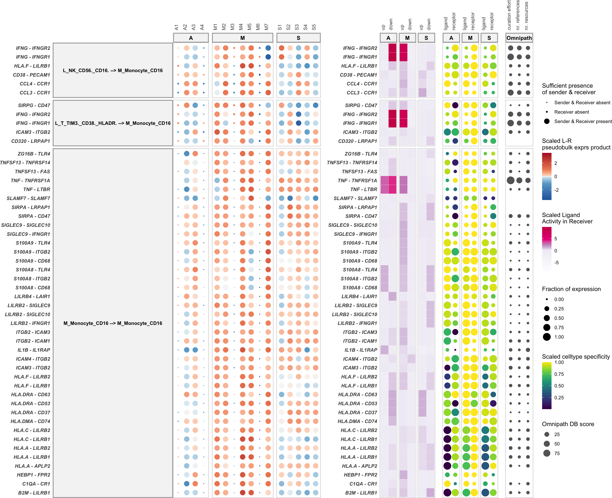

And now as sender:


```r
prioritized_tbl_oi_M_50 = get_top_n_lr_pairs(
  multinichenet_output$prioritization_tables, 
  50, 
  groups_oi = group_oi, 
  senders_oi = "M_Monocyte_CD16")
```


```r
plot_oi = make_sample_lr_prod_activity_plots_Omnipath(
  multinichenet_output$prioritization_tables, 
  prioritized_tbl_oi_M_50 %>% inner_join(lr_network_all))
plot_oi
```

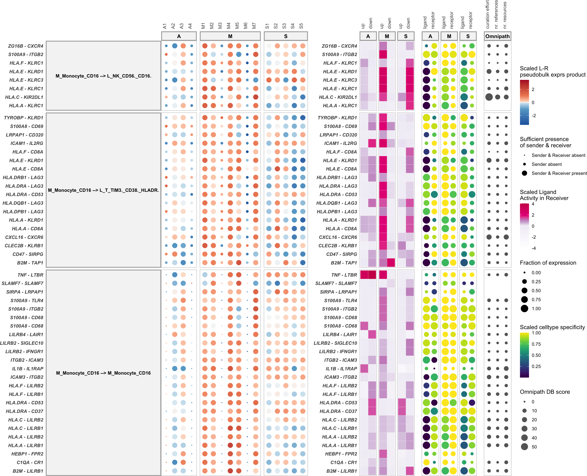

These two types of plots created above (Circos ChordDiagram and Interpretable Bubble Plot) for the most strongly prioritized interactions are the types of plot you should always create and inspect as an end-user. 

The plots that we will discuss in the rest of the vignette are more optional, and can help to dive more deeply in the data. They are however not as necessary as the plots above. 

So, let's now continue with more detailed plots and downstream functionalities:

## Intercellular regulatory network inference and visualization

In the plots above, we showed some of the prioritized interactions, and focused on their expression and activity. These interactions were visualized as independent interactions. However, they are likely not functioning independently in a complex multicellular biological system: cells can send signals to other cells, who as a response to these signals produce extracellular signals themselves to give feedback to the original sender cells, or to propogate the signal to other cell types ("cascade"). In other words: ligands from cell type A may induce the expression of ligands and receptors in cell type B. These ligands and receptors can then be involved in other interactions towards cell type A and interactions towards cell type C. Etc. 

Because one of the elements of MultiNicheNet is the ligand activity and ligand-target inference part of NicheNet, we can actually infer the predicted ligand/receptor-encoding target genes of prioritized ligand-receptor interactions. And as a result, we can get this type of functional insight in the biological system of interest, which we will demonstrate now.

First, we will showcase how to do this by considering target genes supported by NicheNet's prior knowledge solely 

### Without filtering of target genes based on LR-target expression correlation (for demonstration purposes only)

First: get the target genes of prioritized ligand-receptor pairs (here focused on the overall top50 prioritized LR pairs that were visualized in the Circos ChordDiagrams above)

```r
lr_target_prior = prioritized_tbl_oi_all %>% inner_join(
        multinichenet_output$ligand_activities_targets_DEgenes$ligand_activities %>%
          distinct(ligand, target, direction_regulation, contrast) %>% inner_join(contrast_tbl) %>% ungroup() 
        ) 
lr_target_df = lr_target_prior %>% distinct(group, sender, receiver, ligand, receptor, id, target, direction_regulation) 
```

Second, subset on ligands/receptors as target genes

```r
lr_target_df %>% filter(target %in% union(lr_network$ligand, lr_network$receptor))
## # A tibble: 486 × 8
##    group sender                 receiver         ligand receptor id                        target direction_regulation
##    <chr> <chr>                  <chr>            <chr>  <chr>    <chr>                     <chr>  <fct>               
##  1 M     M_Monocyte_CD16        L_NK_CD56._CD16. HLA.E  KLRC1    HLA.E_KLRC1_M_Monocyte_C… AREG   up                  
##  2 M     M_Monocyte_CD16        L_NK_CD56._CD16. HLA.E  KLRC1    HLA.E_KLRC1_M_Monocyte_C… CD55   up                  
##  3 M     M_Monocyte_CD16        L_NK_CD56._CD16. HLA.E  KLRC1    HLA.E_KLRC1_M_Monocyte_C… KLRC1  up                  
##  4 M     M_Monocyte_CD16        L_NK_CD56._CD16. HLA.E  KLRC1    HLA.E_KLRC1_M_Monocyte_C… S100A8 up                  
##  5 M     M_Monocyte_CD16        L_NK_CD56._CD16. HLA.E  KLRC1    HLA.E_KLRC1_M_Monocyte_C… SLC1A5 up                  
##  6 M     M_Monocyte_CD16        L_NK_CD56._CD16. HLA.E  KLRC1    HLA.E_KLRC1_M_Monocyte_C… TFRC   up                  
##  7 M     M_Monocyte_CD16        L_NK_CD56._CD16. HLA.E  KLRC1    HLA.E_KLRC1_M_Monocyte_C… TIMP1  down                
##  8 M     L_T_TIM3._CD38._HLADR. M_Monocyte_CD16  IFNG   IFNGR1   IFNG_IFNGR1_L_T_TIM3._CD… B2M    up                  
##  9 M     L_T_TIM3._CD38._HLADR. M_Monocyte_CD16  IFNG   IFNGR1   IFNG_IFNGR1_L_T_TIM3._CD… BTN3A1 up                  
## 10 M     L_T_TIM3._CD38._HLADR. M_Monocyte_CD16  IFNG   IFNGR1   IFNG_IFNGR1_L_T_TIM3._CD… C1QB   up                  
## # ℹ 476 more rows
```

Whereas these code blocks are just to demonstrate that this type of information is available in MultiNicheNet, the next block of code will infer the systems-wide intercellular regulatory network automatically: 


```r
network = infer_intercellular_regulatory_network(lr_target_df, prioritized_tbl_oi_all)
network$links %>% head()
## # A tibble: 6 × 6
##   sender_ligand               receiver_target         direction_regulation group type          weight
##   <chr>                       <chr>                   <fct>                <chr> <chr>          <dbl>
## 1 L_T_TIM3._CD38._HLADR._IFNG M_Monocyte_CD16_B2M     up                   M     Ligand-Target      1
## 2 L_T_TIM3._CD38._HLADR._IFNG M_Monocyte_CD16_CXCL16  up                   M     Ligand-Target      1
## 3 L_T_TIM3._CD38._HLADR._IFNG M_Monocyte_CD16_HLA.A   up                   M     Ligand-Target      1
## 4 L_T_TIM3._CD38._HLADR._IFNG M_Monocyte_CD16_HLA.C   up                   M     Ligand-Target      1
## 5 L_T_TIM3._CD38._HLADR._IFNG M_Monocyte_CD16_HLA.DRA up                   M     Ligand-Target      1
## 6 L_T_TIM3._CD38._HLADR._IFNG M_Monocyte_CD16_HLA.F   up                   M     Ligand-Target      1
network$nodes %>% head()
## # A tibble: 6 × 4
##   node                         celltype               gene   type_gene      
##   <chr>                        <chr>                  <chr>  <chr>          
## 1 M_Monocyte_CD16_LILRB2       M_Monocyte_CD16        LILRB2 ligand/receptor
## 2 M_Monocyte_CD16_CD47         M_Monocyte_CD16        CD47   ligand/receptor
## 3 L_T_TIM3._CD38._HLADR._SIRPG L_T_TIM3._CD38._HLADR. SIRPG  ligand/receptor
## 4 L_T_TIM3._CD38._HLADR._IFNG  L_T_TIM3._CD38._HLADR. IFNG   ligand         
## 5 M_Monocyte_CD16_CXCL16       M_Monocyte_CD16        CXCL16 ligand         
## 6 M_Monocyte_CD16_HLA.E        M_Monocyte_CD16        HLA.E  ligand
```

And this network can be visualized here in R by running:

```r
colors_sender["L_T_TIM3._CD38._HLADR."] = "pink" # the  original yellow background with white font is not very readable
network_graph = visualize_network(network, colors_sender)
network_graph$plot
```

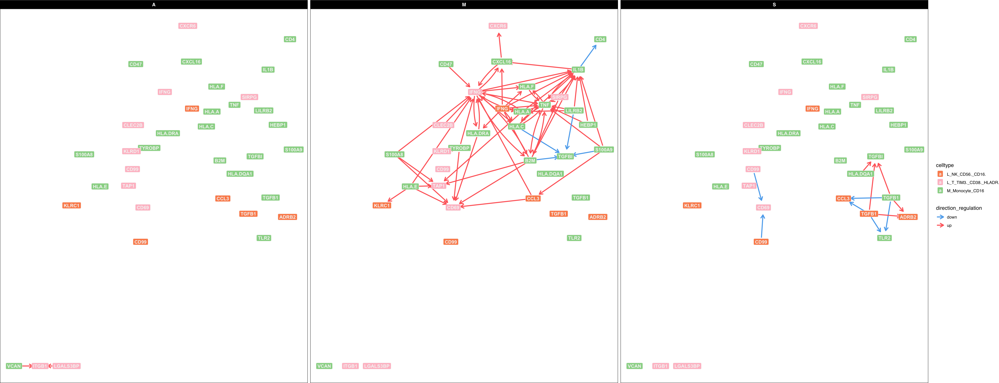

As you can see here: we can see see here that several prioritized ligands seem to be regulated by other prioritized ligands! But, it may be challenging sometimes to discern individual links when several interactions are shown. Therefore, inspection of the underlying data tables (`network$links` and `network$nodes`) may be necessary to discern individual interactions. It is also suggested to export these data tables into more sophisticated network visualization tools (e.g., CytoScape) for better inspection of this network.

To inspect interactions involving specific ligands, such as IFNG as example, we can run the following code:

```r
network$nodes %>% filter(gene == "IFNG")
## # A tibble: 2 × 4
##   node                        celltype               gene  type_gene
##   <chr>                       <chr>                  <chr> <chr>    
## 1 L_T_TIM3._CD38._HLADR._IFNG L_T_TIM3._CD38._HLADR. IFNG  ligand   
## 2 L_NK_CD56._CD16._IFNG       L_NK_CD56._CD16.       IFNG  ligand
```
IFNG as regulating ligand:

```r
network$links %>% filter(sender_ligand == "L_T_TIM3._CD38._HLADR._IFNG" & direction_regulation == "up" & group == "M")
## # A tibble: 8 × 6
##   sender_ligand               receiver_target         direction_regulation group type          weight
##   <chr>                       <chr>                   <fct>                <chr> <chr>          <dbl>
## 1 L_T_TIM3._CD38._HLADR._IFNG M_Monocyte_CD16_B2M     up                   M     Ligand-Target      1
## 2 L_T_TIM3._CD38._HLADR._IFNG M_Monocyte_CD16_CXCL16  up                   M     Ligand-Target      1
## 3 L_T_TIM3._CD38._HLADR._IFNG M_Monocyte_CD16_HLA.A   up                   M     Ligand-Target      1
## 4 L_T_TIM3._CD38._HLADR._IFNG M_Monocyte_CD16_HLA.C   up                   M     Ligand-Target      1
## 5 L_T_TIM3._CD38._HLADR._IFNG M_Monocyte_CD16_HLA.DRA up                   M     Ligand-Target      1
## 6 L_T_TIM3._CD38._HLADR._IFNG M_Monocyte_CD16_HLA.F   up                   M     Ligand-Target      1
## 7 L_T_TIM3._CD38._HLADR._IFNG M_Monocyte_CD16_IL1B    up                   M     Ligand-Target      1
## 8 L_T_TIM3._CD38._HLADR._IFNG M_Monocyte_CD16_TNF     up                   M     Ligand-Target      1
```
IFNG as regulated target:

```r
network$links %>% filter(receiver_target == "L_T_TIM3._CD38._HLADR._IFNG" & direction_regulation == "up" & group == "M")
## # A tibble: 10 × 6
##    sender_ligand                 receiver_target             direction_regulation group type          weight
##    <chr>                         <chr>                       <fct>                <chr> <chr>          <dbl>
##  1 M_Monocyte_CD16_CXCL16        L_T_TIM3._CD38._HLADR._IFNG up                   M     Ligand-Target      1
##  2 M_Monocyte_CD16_HLA.E         L_T_TIM3._CD38._HLADR._IFNG up                   M     Ligand-Target      1
##  3 M_Monocyte_CD16_HLA.DRA       L_T_TIM3._CD38._HLADR._IFNG up                   M     Ligand-Target      1
##  4 M_Monocyte_CD16_S100A8        L_T_TIM3._CD38._HLADR._IFNG up                   M     Ligand-Target      1
##  5 M_Monocyte_CD16_HLA.A         L_T_TIM3._CD38._HLADR._IFNG up                   M     Ligand-Target      1
##  6 L_NK_CD56._CD16._CCL3         L_T_TIM3._CD38._HLADR._IFNG up                   M     Ligand-Target      1
##  7 M_Monocyte_CD16_TYROBP        L_T_TIM3._CD38._HLADR._IFNG up                   M     Ligand-Target      1
##  8 M_Monocyte_CD16_CD47          L_T_TIM3._CD38._HLADR._IFNG up                   M     Ligand-Target      1
##  9 M_Monocyte_CD16_B2M           L_T_TIM3._CD38._HLADR._IFNG up                   M     Ligand-Target      1
## 10 L_T_TIM3._CD38._HLADR._CLEC2B L_T_TIM3._CD38._HLADR._IFNG up                   M     Ligand-Target      1
```

Ligand- and receptor-encoding target genes that were shown here are predicted as target genes of ligands based on prior knowledge. However, it is uncertain whether they are also potentially active in the system under study: e.g., it is possible that some genes are regulated by their upstream ligand only in cell types that are not studied in this context. To increase the chance that inferred ligand-target links are potentially active, we can use the multi-sample nature of this data to filter target genes based on expression correlation between the upstream ligand-receptor pair and the downstream target gene. This is under the assumption that target genes that show across-sample expression correlation with their upstream ligand-receptor pairs may be more likely to be true active target genes than target genes that don’t show this pattern. This correlation was calculated in the (optional) step 7 of the MultiNicheNet analysis.

In the next subsection of the inference of intercellular regulator networks, we will showcase how to consider target genes that are both supported by NicheNet's prior knowledge and expression correlation. 

### With filtering of target genes based on LR-target expression correlation (recommended for analysis in practice)

Now, we will filter out correlated ligand-receptor --> target links that both show high expression correlation (pearson correlation > 0.33 in this example) and have some prior knowledge to support their link. 


```r
lr_target_prior_cor_filtered = 
  multinichenet_output$prioritization_tables$group_prioritization_tbl$group %>% unique() %>% 
  lapply(function(group_oi){
    lr_target_prior_cor_filtered = multinichenet_output$lr_target_prior_cor %>%
      inner_join(
        multinichenet_output$ligand_activities_targets_DEgenes$ligand_activities %>%
          distinct(ligand, target, direction_regulation, contrast)
        ) %>% 
      inner_join(contrast_tbl) %>% filter(group == group_oi)
    
    lr_target_prior_cor_filtered_up = lr_target_prior_cor_filtered %>% 
      filter(direction_regulation == "up") %>% 
      filter( (rank_of_target < top_n_target) & (pearson > 0.33))
    
    lr_target_prior_cor_filtered_down = lr_target_prior_cor_filtered %>% 
      filter(direction_regulation == "down") %>% 
      filter( (rank_of_target < top_n_target) & (pearson < -0.33))
    lr_target_prior_cor_filtered = bind_rows(
      lr_target_prior_cor_filtered_up, 
      lr_target_prior_cor_filtered_down
      )
}) %>% bind_rows()

lr_target_df = lr_target_prior_cor_filtered %>% 
  distinct(group, sender, receiver, ligand, receptor, id, target, direction_regulation) 
```


```r
network = infer_intercellular_regulatory_network(lr_target_df, prioritized_tbl_oi_all)
network$links %>% head()
## # A tibble: 6 × 6
##   sender_ligand         receiver_target      direction_regulation group type          weight
##   <chr>                 <chr>                <fct>                <chr> <chr>          <dbl>
## 1 M_Monocyte_CD16_B2M   M_Monocyte_CD16_IL1B up                   M     Ligand-Target      1
## 2 M_Monocyte_CD16_B2M   M_Monocyte_CD16_TNF  up                   M     Ligand-Target      1
## 3 M_Monocyte_CD16_HLA.A M_Monocyte_CD16_IL1B up                   M     Ligand-Target      1
## 4 M_Monocyte_CD16_HLA.A M_Monocyte_CD16_TNF  up                   M     Ligand-Target      1
## 5 M_Monocyte_CD16_HLA.C M_Monocyte_CD16_IL1B up                   M     Ligand-Target      1
## 6 M_Monocyte_CD16_HLA.C M_Monocyte_CD16_TNF  up                   M     Ligand-Target      1
network$nodes %>% head()
## # A tibble: 6 × 4
##   node                         celltype               gene   type_gene      
##   <chr>                        <chr>                  <chr>  <chr>          
## 1 M_Monocyte_CD16_LILRB2       M_Monocyte_CD16        LILRB2 ligand/receptor
## 2 L_T_TIM3._CD38._HLADR._SIRPG L_T_TIM3._CD38._HLADR. SIRPG  ligand/receptor
## 3 M_Monocyte_CD16_CD47         M_Monocyte_CD16        CD47   ligand/receptor
## 4 M_Monocyte_CD16_B2M          M_Monocyte_CD16        B2M    ligand         
## 5 M_Monocyte_CD16_HLA.A        M_Monocyte_CD16        HLA.A  ligand         
## 6 M_Monocyte_CD16_HLA.C        M_Monocyte_CD16        HLA.C  ligand
```


```r
colors_sender["L_T_TIM3._CD38._HLADR."] = "pink" # the  original yellow background with white font is not very readable
network_graph = visualize_network(network, colors_sender)
network_graph$plot
```

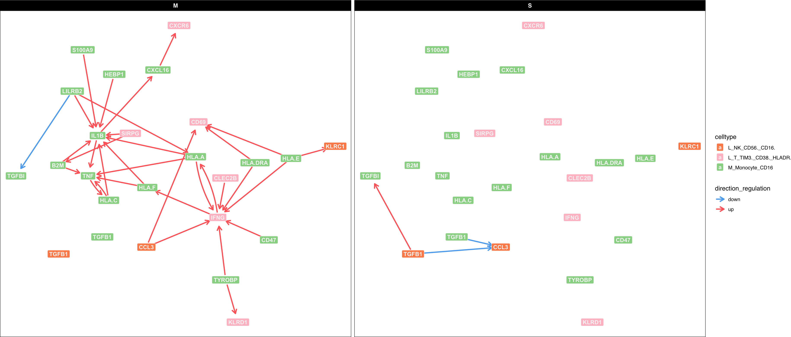

As can be expected, we see fewer links here than in the previously generated intercellular regulatory network. The links that are not present anymore in this network are those ligand-target links that are not supported by high across-sample expression correlation. In conclusion, the links visualized here are the most trustworthy ones, since they are both supported by prior knowledge and expression correlation.

Interestingly, ligands/receptors visualized in this network can be considered as **additionally prioritized** because they are not only a prioritized ligand/receptor but also a target gene of another prioritized ligand-receptor interaction! So, we can also use this network to further prioritize differential CCC interactions. We can get these interactions as follows:

```r
network$prioritized_lr_interactions
## # A tibble: 27 × 5
##    group sender                 receiver        ligand receptor
##    <chr> <chr>                  <chr>           <chr>  <chr>   
##  1 M     M_Monocyte_CD16        M_Monocyte_CD16 B2M    LILRB1  
##  2 M     M_Monocyte_CD16        M_Monocyte_CD16 HLA.A  LILRB1  
##  3 M     M_Monocyte_CD16        M_Monocyte_CD16 HLA.C  LILRB1  
##  4 M     M_Monocyte_CD16        M_Monocyte_CD16 S100A9 CD68    
##  5 M     M_Monocyte_CD16        M_Monocyte_CD16 HLA.F  LILRB1  
##  6 M     M_Monocyte_CD16        M_Monocyte_CD16 HLA.F  LILRB2  
##  7 M     M_Monocyte_CD16        M_Monocyte_CD16 LILRB2 IFNGR1  
##  8 M     L_T_TIM3._CD38._HLADR. M_Monocyte_CD16 SIRPG  CD47    
##  9 M     M_Monocyte_CD16        M_Monocyte_CD16 TNF    LTBR    
## 10 M     M_Monocyte_CD16        M_Monocyte_CD16 HEBP1  FPR2    
## # ℹ 17 more rows
```


```r
prioritized_tbl_oi_network = prioritized_tbl_oi_all %>% inner_join(
  network$prioritized_lr_interactions)
prioritized_tbl_oi_network
## # A tibble: 27 × 8
##    group sender                 receiver               ligand  receptor id    prioritization_score prioritization_rank
##    <chr> <chr>                  <chr>                  <chr>   <chr>    <chr>                <dbl>               <dbl>
##  1 M     M_Monocyte_CD16        L_NK_CD56._CD16.       HLA.E   KLRC1    HLA.…                0.956                   1
##  2 M     L_T_TIM3._CD38._HLADR. M_Monocyte_CD16        IFNG    IFNGR1   IFNG…                0.948                   2
##  3 M     L_T_TIM3._CD38._HLADR. M_Monocyte_CD16        IFNG    IFNGR2   IFNG…                0.928                   4
##  4 M     M_Monocyte_CD16        L_T_TIM3._CD38._HLADR. CXCL16  CXCR6    CXCL…                0.922                   5
##  5 M     M_Monocyte_CD16        L_T_TIM3._CD38._HLADR. HLA.E   CD8A     HLA.…                0.919                   7
##  6 M     M_Monocyte_CD16        M_Monocyte_CD16        S100A9  CD68     S100…                0.917                   8
##  7 M     M_Monocyte_CD16        L_T_TIM3._CD38._HLADR. HLA.DRA LAG3     HLA.…                0.910                   9
##  8 M     M_Monocyte_CD16        M_Monocyte_CD16        HLA.F   LILRB1   HLA.…                0.903                  11
##  9 M     M_Monocyte_CD16        M_Monocyte_CD16        TNF     LTBR     TNF_…                0.902                  12
## 10 M     M_Monocyte_CD16        M_Monocyte_CD16        HLA.F   LILRB2   HLA.…                0.898                  15
## # ℹ 17 more rows
```

Visualize now the expression and activity of these interactions for the M group

```r
group_oi = "M"
```


```r
prioritized_tbl_oi_M = prioritized_tbl_oi_network %>% filter(group == group_oi)

plot_oi = make_sample_lr_prod_activity_plots_Omnipath(
  multinichenet_output$prioritization_tables, 
  prioritized_tbl_oi_M %>% inner_join(lr_network_all)
  )
plot_oi
```

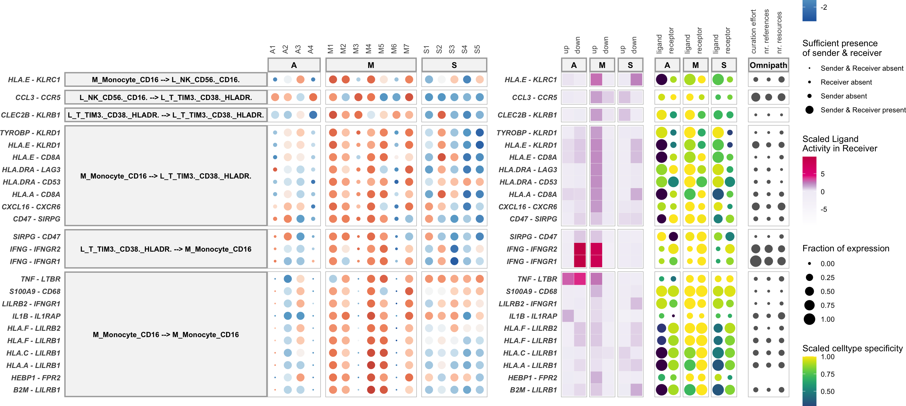
To summarize: this interpretable bubble plot is an important and helpful plot because:
1) these LR interactions are all in the overall top50 of condition-specific interactions
2) they are a likely interaction inducing one or more other prioritized LR interaction and/or they are regulated by one or more other prioritized LR interactions. 
Because of this, interactions in this plot may be interesting candidates for follow-up experimental validation. 

__Note__: These networks were generated by only looking at the top50 interactions overall. In practice, we encourage users to explore more hits than the top50, certainly if many cell type pairs are considered in the analysis. 

All the previous were informative for interactions where both the sender and receiver cell types are captured in the data and where ligand and receptor are sufficiently expressed at the RNA level. However, these two conditions are not always fulfilled and some interesting cell-cell communication signals may be missed as a consequence. Can we still have an idea about these potentially missed interactions? Yes, we can.

## Visualize sender-agnostic ligand activities for each receiver-group combination

In the next type of plot, we plot all the ligand activities (both scaled and absolute activities) of each receiver-condition combination. This can give us some insights in active signaling pathways across conditions. Note that we can thus show top ligands based on ligand activity - irrespective and agnostic of expression in sender. Benefits of this analysis are the possibility to infer the activity of ligands that are expressed by cell types that are not in your single-cell dataset or that are hard to pick up at the RNA level. 

The following block of code will show how to visualize the activities for the top5 ligands for each receiver cell type - condition combination:


```r
ligands_oi = multinichenet_output$prioritization_tables$ligand_activities_target_de_tbl %>% 
  inner_join(contrast_tbl) %>% 
  group_by(group, receiver) %>% 
  distinct(ligand, receiver, group, activity) %>% 
  top_n(5, activity) %>% 
  pull(ligand) %>% unique()

plot_oi = make_ligand_activity_plots(
  multinichenet_output$prioritization_tables, 
  ligands_oi, 
  contrast_tbl,
  widths = NULL)
plot_oi
```

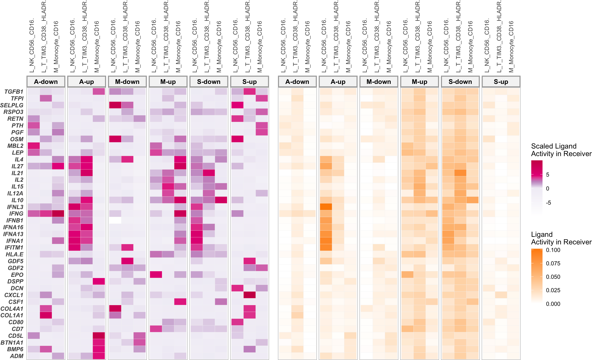

Interestingly, we can here see a clear type I interferon (IFNA1, IFNB1, ...) ligand activity signature in the A-group with predicted upregulatory activity in NK cells and T cells. Because type I interferons were not (sufficiently high) expressed by the cell types in our dataset, they were not retrieved by the classic MultiNicheNet analysis. However, they may have an important role in the Adult COVID19 patient group, as is supported by literature! This demonstrates the usefulness of this analysis: it can help you in having an idea about relevant ligands not captured in the data at hand but with a strong predicted target gene signature in one of the cell types in the data. 

__Note__ you can replace the automatically determined `ligands_oi` by any set of ligands that are of interest to you.

With this plot/downstream analysis, we end the overview of visualizations that can help you in finding interesting hypotheses about important **differential ligand-receptor interactions** in your data. In case you ended up with a shortlist of interactions for further checks and potential experimental validation, we recommend going over the visualizations that are introduced in the next section. They are some additional "sound checks" for your shortlist of interactions. However, we don't recommend generating these plots before having thoroughly analyzed and inspected all the previous visualizations. Only go further now if you understood all the previous steps to avoid getting more overwhelmed.

## Deep Dive into the data

### Visualization of differential ligand-target links

Even though the interpretable bubble plots already provide a lot of information, they do not visualize the specific target genes downstream of the prioritized interactions. Hereby, we still miss some interesting functional information and we cannot assess whether high activity values may be due to a reasonable number of specific target genes or not. Therefore we will now go over some visualizations to inspect target genes downstream of prioritized ligand-receptor interactions.

#### Without filtering of target genes based on LR-target expression correlation: Ligand activity - target gene combination plots

In this type of plot, we can visualize the ligand activities for a group-receiver combination, and show the predicted ligand-target links, and also the expression of the predicted target genes across samples.

For this, we now need to define a receiver cell type of interest. As example, we will take `M_Monocyte_CD16` cells as receiver, and look at the top 10 senderLigand-receiverReceptor pairs with these cells as receiver.


```r
group_oi = "M"
receiver_oi = "M_Monocyte_CD16"
prioritized_tbl_oi_M_10 = get_top_n_lr_pairs(
  multinichenet_output$prioritization_tables, 
  10, 
  groups_oi = group_oi, 
  receivers_oi = receiver_oi)
```


```r
combined_plot = make_ligand_activity_target_plot(
  group_oi, 
  receiver_oi, 
  prioritized_tbl_oi_M_10,
  multinichenet_output$prioritization_tables, 
  multinichenet_output$ligand_activities_targets_DEgenes, contrast_tbl, 
  multinichenet_output$grouping_tbl, 
  multinichenet_output$celltype_info, 
  ligand_target_matrix, 
  plot_legend = FALSE)
combined_plot
## $combined_plot
```

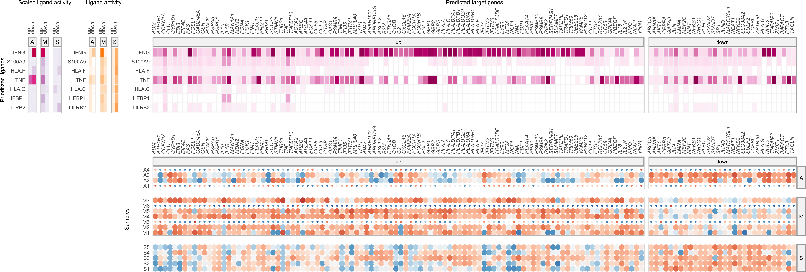

```
## 
## $legends
```

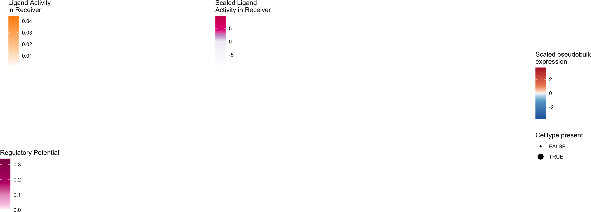
One observation we can make here is that several genes upregulated in the M-group are indeed high-confident target genes of IFNG (dark purple - high regulatory potential scores). Most of these genes are also potential target genes of TNF, but some specific genes are present as well. 

Whereas this plot just showed the top ligands for a certain receiver-contrast, you can also zoom in on specific ligands of interest. As example, we will look at IFNG and IL15:


```r
group_oi = "M"
receiver_oi = "M_Monocyte_CD16"
ligands_oi = c("IFNG","IL15")
prioritized_tbl_ligands_oi = get_top_n_lr_pairs(
  multinichenet_output$prioritization_tables, 
  10000, 
  groups_oi = group_oi, 
  receivers_oi = receiver_oi
  ) %>% filter(ligand %in% ligands_oi) # ligands should still be in the output tables of course
```


```r
combined_plot = make_ligand_activity_target_plot(
  group_oi, 
  receiver_oi, 
  prioritized_tbl_ligands_oi, 
  multinichenet_output$prioritization_tables, 
  multinichenet_output$ligand_activities_targets_DEgenes, 
  contrast_tbl, 
  multinichenet_output$grouping_tbl, 
  multinichenet_output$celltype_info, 
  ligand_target_matrix, 
  plot_legend = FALSE)
combined_plot
## $combined_plot
```


```
## 
## $legends
```

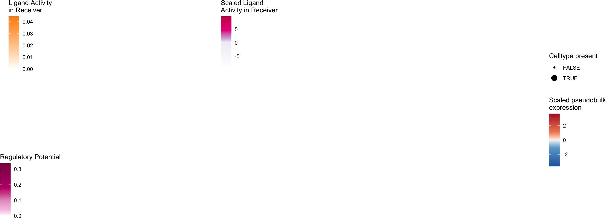

In summary, these "Ligand activity - target gene combination plots" show how well ligand-target links are supported by general prior knowledge, but not whether they are likely to be active in the system under study. That's what we will look at now.

#### With filtering of target genes based on LR-target expression correlation: Ligand activity - target gene - expression correlation combination plot

In the previous plot, target genes were shown that are predicted as target gene of ligands based on prior knowledge. However, we can use the multi-sample nature of this data to filter target genes based on expression correlation between the upstream ligand-receptor pair and the downstream target gene. We will filter out correlated ligand-receptor --> target links that both show high expression correlation (pearson correlation > 0.33 in this example) and have some prior knowledge to support their link. Note that you can only make these visualization if you ran step 7 of the core MultiNicheNet analysis.


```r
group_oi = "M"
receiver_oi = "M_Monocyte_CD16"
lr_target_prior_cor_filtered = multinichenet_output$lr_target_prior_cor %>%
  inner_join(
    multinichenet_output$ligand_activities_targets_DEgenes$ligand_activities %>% 
      distinct(ligand, target, direction_regulation, contrast)
    ) %>% 
  inner_join(contrast_tbl) %>% filter(group == group_oi, receiver == receiver_oi)

lr_target_prior_cor_filtered_up = lr_target_prior_cor_filtered %>% 
  filter(direction_regulation == "up") %>% 
  filter( (rank_of_target < top_n_target) & (pearson > 0.33)) # replace pearson by spearman if you want to filter on the spearman correlation
lr_target_prior_cor_filtered_down = lr_target_prior_cor_filtered %>% 
  filter(direction_regulation == "down") %>% 
  filter( (rank_of_target < top_n_target) & (pearson < -0.33)) # downregulation -- negative correlation - # replace pearson by spearman if you want to filter on the spearman correlation
lr_target_prior_cor_filtered = bind_rows(
  lr_target_prior_cor_filtered_up, 
  lr_target_prior_cor_filtered_down)
```

Now we will visualize the top correlated target genes for the LR pairs that are also in the top 50 LR pairs discriminating the groups from each other:


```r
prioritized_tbl_oi = get_top_n_lr_pairs(
  multinichenet_output$prioritization_tables, 
  50, 
  groups_oi = group_oi, 
  receivers_oi = receiver_oi)
```


```r
lr_target_correlation_plot = make_lr_target_correlation_plot(
  multinichenet_output$prioritization_tables, 
  prioritized_tbl_oi,  
  lr_target_prior_cor_filtered , 
  multinichenet_output$grouping_tbl, 
  multinichenet_output$celltype_info, 
  receiver_oi,
  plot_legend = FALSE)
lr_target_correlation_plot$combined_plot
```

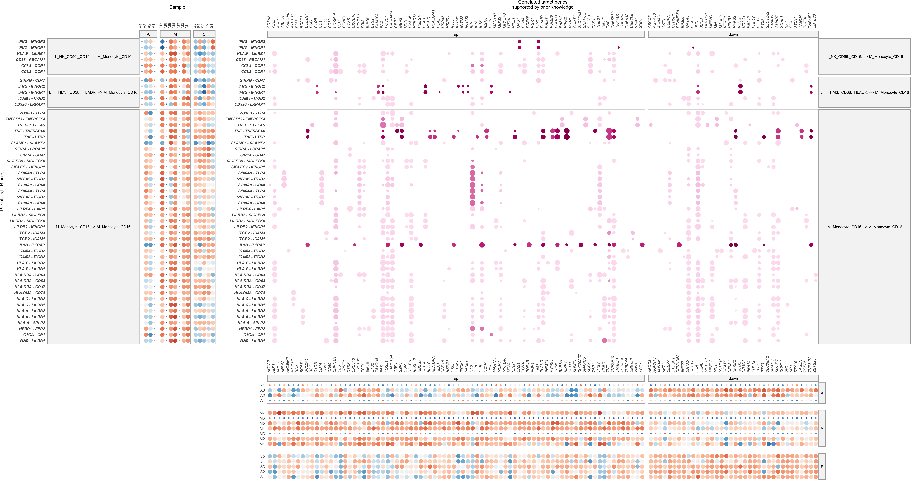
This visualization can help users assess whether ligand-target links that are supported by general prior knowledge, are also potentially active in the system under study: target genes that show across-sample expression correlation with their upstream ligand-receptor pairs may be more likely true target genes than target genes that don’t show this pattern.

Even though this plot indicates the strength of the correlation between ligand-receptor expression and target gene expression, it’s hard to assess the pattern of correlation. To help users evaluate whether high correlation values are not due to artifacts, we provide the following LR-target expression scatter plot visualization for a selected LR pair and their targets:
 

```r
ligand_oi = "IFNG"
receptor_oi = "IFNGR1"
sender_oi = "L_T_TIM3._CD38._HLADR."
receiver_oi = "M_Monocyte_CD16"
lr_target_scatter_plot = make_lr_target_scatter_plot(
  multinichenet_output$prioritization_tables, 
  ligand_oi, receptor_oi, sender_oi, receiver_oi, 
  multinichenet_output$celltype_info, 
  multinichenet_output$grouping_tbl, 
  lr_target_prior_cor_filtered)
lr_target_scatter_plot
```

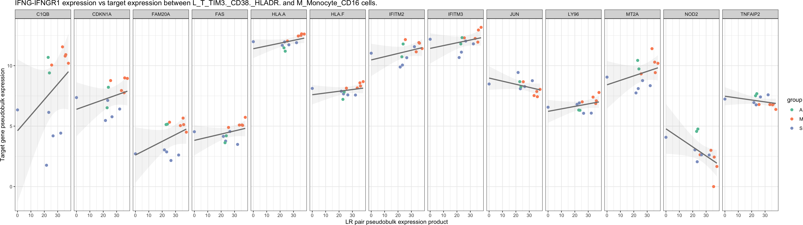

### Visualization of ligand-to-target signaling paths

The next type of "sound check" visualization will visualize potential signaling paths between ligands and target genes of interest. In addition to this visualization, we also get a network table documenting the underlying data source(s) behind each of the links shown in this graph. This analysis can help users to assess the trustworthiness of ligand-target predictions. This is strongly recommended before going into experimental validation of ligand-target links.

This inference of 'prior knowledge' ligand-receptor-to-target signaling paths is done similarly to the workflow described in the nichenetr package https://github.com/saeyslab/nichenetr/blob/master/vignettes/ligand_target_signaling_path.md

First read in the required networks:

```r
if(organism == "human"){
  sig_network = readRDS(url("https://zenodo.org/record/7074291/files/signaling_network_human_21122021.rds")) %>% 
    mutate(from = make.names(from), to = make.names(to))
  
  gr_network = readRDS(url("https://zenodo.org/record/7074291/files/gr_network_human_21122021.rds")) %>% 
    mutate(from = make.names(from), to = make.names(to))
  
  ligand_tf_matrix = readRDS(url("https://zenodo.org/record/7074291/files/ligand_tf_matrix_nsga2r_final.rds"))
  colnames(ligand_tf_matrix) = colnames(ligand_tf_matrix) %>% make.names()
  rownames(ligand_tf_matrix) = rownames(ligand_tf_matrix) %>% make.names()
  
  weighted_networks = readRDS(url("https://zenodo.org/record/7074291/files/weighted_networks_nsga2r_final.rds"))
  weighted_networks$lr_sig = weighted_networks$lr_sig %>% mutate(from = make.names(from), to = make.names(to))
  weighted_networks$gr = weighted_networks$gr %>% mutate(from = make.names(from), to = make.names(to))
  
} else if(organism == "mouse"){
  sig_network = readRDS(url("https://zenodo.org/record/7074291/files/signaling_network_mouse_21122021.rds")) %>% 
    mutate(from = make.names(from), to = make.names(to))
  
  gr_network = readRDS(url("https://zenodo.org/record/7074291/files/gr_network_mouse_21122021.rds")) %>% 
    mutate(from = make.names(from), to = make.names(to))
  
  ligand_tf_matrix = readRDS(url("https://zenodo.org/record/7074291/files/ligand_tf_matrix_nsga2r_final_mouse.rds"))
  colnames(ligand_tf_matrix) = colnames(ligand_tf_matrix) %>% make.names()
  rownames(ligand_tf_matrix) = rownames(ligand_tf_matrix) %>% make.names()
  
  weighted_networks = readRDS(url("https://zenodo.org/record/7074291/files/weighted_networks_nsga2r_final_mouse.rds"))
  weighted_networks$lr_sig = weighted_networks$lr_sig %>% mutate(from = make.names(from), to = make.names(to))
  weighted_networks$gr = weighted_networks$gr %>% mutate(from = make.names(from), to = make.names(to))
}
```

Define which ligand and target genes you want to focus on:
An interesting possiblity would be to focus on expression-correlated target genes downstream of IFNG, that are also encoding for prioritized ligands. To get these target genes, we rerun the following code
IFNG as regulating ligand:

```r
network$links %>% filter(sender_ligand == "L_T_TIM3._CD38._HLADR._IFNG" & direction_regulation == "up" & group == "M")
## # A tibble: 2 × 6
##   sender_ligand               receiver_target       direction_regulation group type          weight
##   <chr>                       <chr>                 <fct>                <chr> <chr>          <dbl>
## 1 L_T_TIM3._CD38._HLADR._IFNG M_Monocyte_CD16_HLA.A up                   M     Ligand-Target      1
## 2 L_T_TIM3._CD38._HLADR._IFNG M_Monocyte_CD16_HLA.F up                   M     Ligand-Target      1
```


```r
ligand_oi = "IFNG"
receptor_oi = "IFNGR1"
targets_all = c("HLA.A", "HLA.F")
  
active_signaling_network = nichenetr::get_ligand_signaling_path_with_receptor(
  ligand_tf_matrix = ligand_tf_matrix, 
  ligands_all = ligand_oi, 
  receptors_all = receptor_oi, 
  targets_all = targets_all, 
  weighted_networks = weighted_networks, 
  top_n_regulators = 3
  )

data_source_network = nichenetr::infer_supporting_datasources(
  signaling_graph_list = active_signaling_network,
  lr_network = lr_network %>% dplyr::rename(from = ligand, to = receptor), 
  sig_network = sig_network, 
  gr_network = gr_network
  )
```


```r
active_signaling_network_min_max = active_signaling_network
active_signaling_network_min_max$sig = active_signaling_network_min_max$sig %>% mutate(weight = ((weight-min(weight))/(max(weight)-min(weight))) + 0.75)
active_signaling_network_min_max$gr = active_signaling_network_min_max$gr %>% mutate(weight = ((weight-min(weight))/(max(weight)-min(weight))) + 0.75)
colors = c("ligand" = "purple", "receptor" = "orange", "target" = "royalblue", "mediator" = "grey60")
#ggraph_signaling_path = suppressWarnings(make_ggraph_signaling_path(active_signaling_network_min_max, colors, ligand_oi, receptor_oi, targets_all))
ggraph_signaling_path = make_ggraph_signaling_path(
  active_signaling_network_min_max, 
  colors, 
  ligand_oi, 
  receptor_oi, 
  targets_all)
ggraph_signaling_path$plot
```

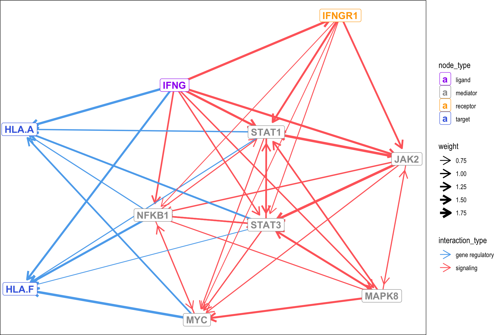

As mentioned, we can also inspect the network table documenting the underlying data source(s) behind each of the links shown in this graph. This analysis can help users to assess the trustworthiness of ligand-target predictions. 

```r
data_source_network %>% head()
## # A tibble: 6 × 5
##   from  to    source                        database        layer     
##   <chr> <chr> <chr>                         <chr>           <chr>     
## 1 IFNG  HLA.A lr_evex_regulation_expression evex_expression regulatory
## 2 IFNG  HLA.A CytoSig_all                   CytoSig         regulatory
## 3 IFNG  HLA.A CytoSig_signature             CytoSig         regulatory
## 4 IFNG  HLA.A NicheNet_LT_frequent          NicheNet_LT     regulatory
## 5 IFNG  HLA.F CytoSig_all                   CytoSig         regulatory
## 6 IFNG  HLA.F CytoSig_signature             CytoSig         regulatory
```

### Single-cell level visualizations

The following type of "sound check" visualization will visualize the single-cell expression distribution of a ligand/receptor/target gene of interest in cell types of interest. This may be informative for users to inspect the data behind DE results. This can help users evaluate whether DE results at pseudobulk level were not due to artifacts. 

#### Zoom in on specific ligand-receptor interactions: Ligand-receptor single-cell expression violin plot

Single-cell expression Violin plots of ligand-receptor interaction of interest: `make_ligand_receptor_violin_plot`

It is often useful to zoom in on specific ligand-receptor interactions of interest by looking in more detail to their expression at the single cell level 

We will again check the IFNG-IFNGR1 interaction for sake of demonstration:

```r
ligand_oi = "IFNG"
receptor_oi = "IFNGR1"
group_oi = "M"
sender_oi = "L_T_TIM3._CD38._HLADR."
receiver_oi = "M_Monocyte_CD16"
```


```r
p_violin = make_ligand_receptor_violin_plot(
  sce = sce, 
  ligand_oi = ligand_oi,
  receptor_oi = receptor_oi, 
  group_oi = group_oi, 
  group_id = group_id, 
  sender_oi = sender_oi, 
  receiver_oi = receiver_oi, 
  sample_id = sample_id, 
  celltype_id = celltype_id)
p_violin
```

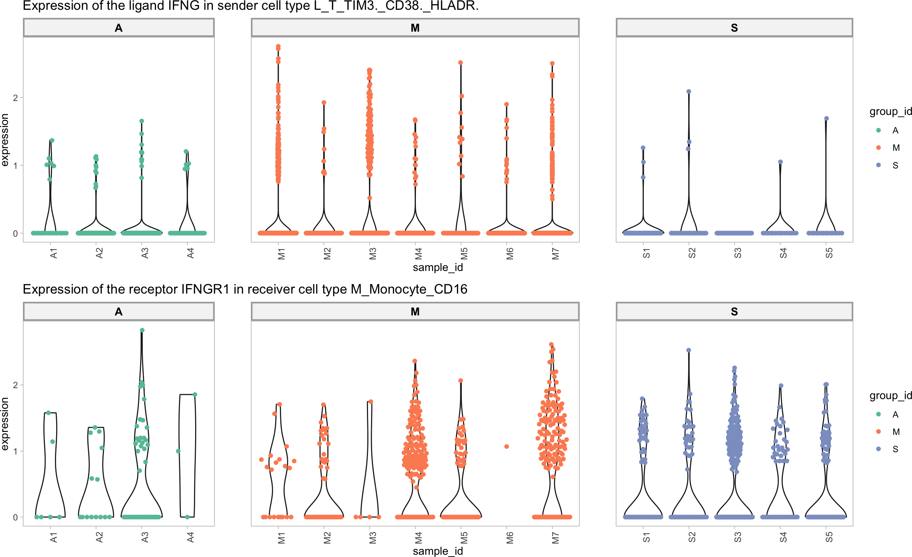

#### Zoom in on specific ligand-target interactions: Target gene single-cell expression violin plot

For the 2 IFNG-target genes we visualized the signaling paths for, we can also inspect their single-cell expression levels:

```r
list_target_plots = lapply(targets_all, function(target_oi) {
  p = make_target_violin_plot(sce = sce, target_oi = target_oi, receiver_oi = receiver_oi, group_oi = group_oi, group_id = group_id, sample_id, celltype_id = celltype_id)
})

list_target_plots
## [[1]]
```

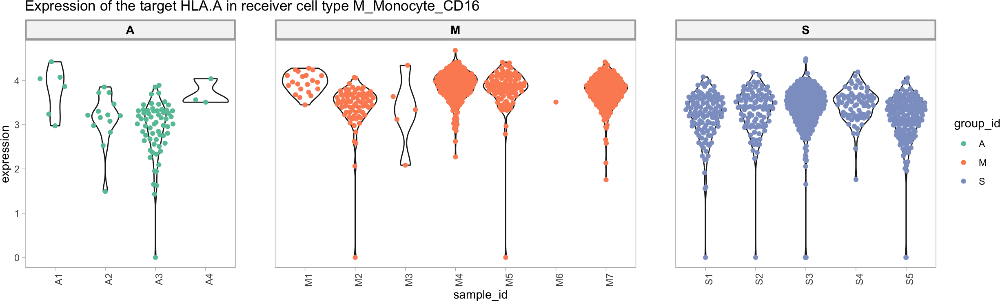

```
## 
## [[2]]
```

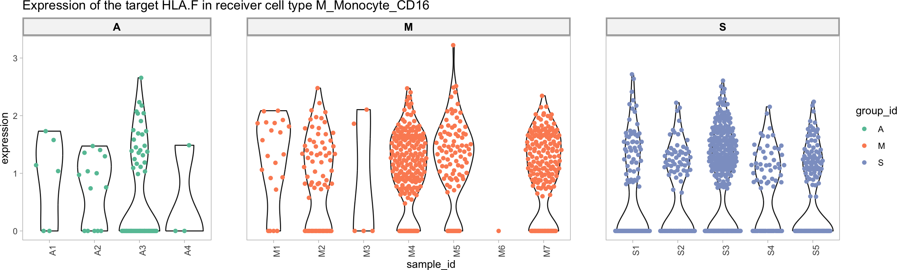

### Visualize top DE genes for a cell type of interest

Finally, we provide some visualizations to just inspect the DE results that were generated during the MultiNicheNet analysis. 


```r
group_oi = "M"
receiver_oi = "M_Monocyte_CD16"
DE_genes = multinichenet_output$ligand_activities_targets_DEgenes$de_genes_df %>% 
  inner_join(contrast_tbl) %>% 
  filter(group == group_oi) %>% 
  arrange(p_val) %>% 
  filter(
    receiver == receiver_oi & 
      logFC > 2 & 
      p_val <= 0.05 &
      contrast == contrast_tbl %>% filter(group == group_oi) %>% pull(contrast)) %>% 
  pull(gene) %>% unique()

p_target = make_DEgene_dotplot_pseudobulk(
  genes_oi = DE_genes, 
  celltype_info = multinichenet_output$celltype_info, 
  prioritization_tables = multinichenet_output$prioritization_tables, 
  celltype_oi = receiver_oi, 
  multinichenet_output$grouping_tbl)
p_target$pseudobulk_plot + ggtitle("DE genes (pseudobulk expression)")
```

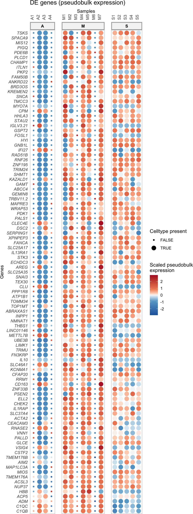

```r
p_target$singlecell_plot + ggtitle("DE genes (single-cell expression)")
```

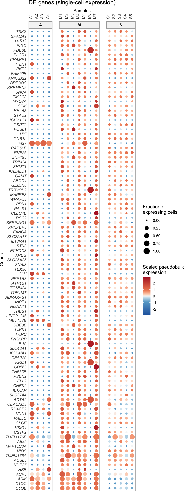

Among these DE genes, you may be most interested in ligands or receptors

Ligands:

```r
group_oi = "M"
receiver_oi = "M_Monocyte_CD16"
DE_genes = multinichenet_output$ligand_activities_targets_DEgenes$de_genes_df %>% 
  inner_join(contrast_tbl) %>% 
  filter(group == group_oi) %>% 
  arrange(p_val) %>% 
  filter(
    receiver == receiver_oi & 
      logFC > 1 & 
      p_val <= 0.05 &
      contrast == contrast_tbl %>% filter(group == group_oi) %>% pull(contrast)) %>% 
  pull(gene) %>% unique()
DE_genes = DE_genes %>% intersect(lr_network$ligand)
p_target = make_DEgene_dotplot_pseudobulk(
  genes_oi = DE_genes, 
  celltype_info = multinichenet_output$celltype_info, 
  prioritization_tables = multinichenet_output$prioritization_tables, 
  celltype_oi = receiver_oi, 
  multinichenet_output$grouping_tbl)
p_target$pseudobulk_plot + ggtitle("DE ligands (pseudobulk expression)")
```

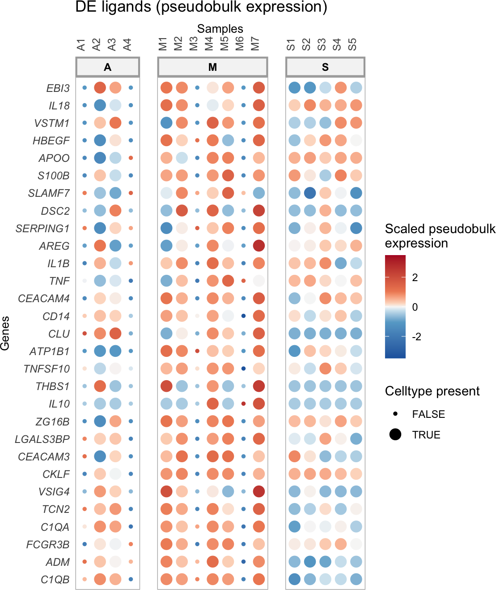

```r
p_target$singlecell_plot + ggtitle("DE ligands (single-cell expression)")
```

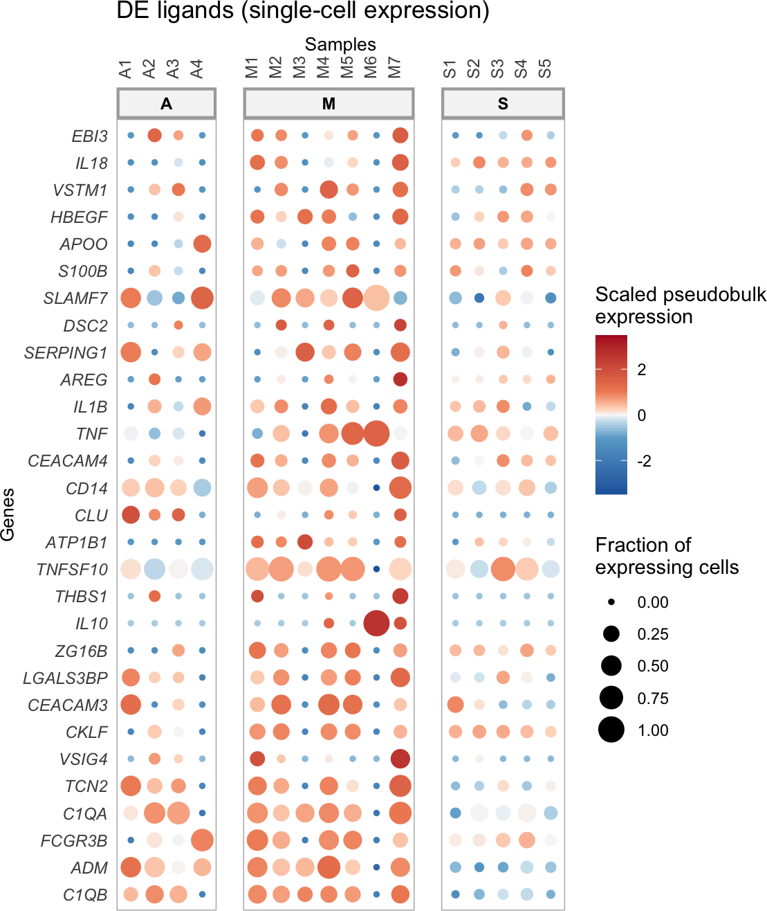

Receptors:

```r
group_oi = "M"
receiver_oi = "M_Monocyte_CD16"
DE_genes = multinichenet_output$ligand_activities_targets_DEgenes$de_genes_df %>% 
  inner_join(contrast_tbl) %>% 
  filter(group == group_oi) %>% 
  arrange(p_val) %>% 
  filter(
    receiver == receiver_oi & 
      logFC > 1 & 
      p_val <= 0.05 &
      contrast == contrast_tbl %>% filter(group == group_oi) %>% pull(contrast)) %>% 
  pull(gene) %>% unique()
DE_genes = DE_genes %>% intersect(lr_network$receptor)
p_target = make_DEgene_dotplot_pseudobulk(
  genes_oi = DE_genes, 
  celltype_info = multinichenet_output$celltype_info, 
  prioritization_tables = multinichenet_output$prioritization_tables, 
  celltype_oi = receiver_oi, 
  multinichenet_output$grouping_tbl)
p_target$pseudobulk_plot + ggtitle("DE receptors (pseudobulk expression)")
```

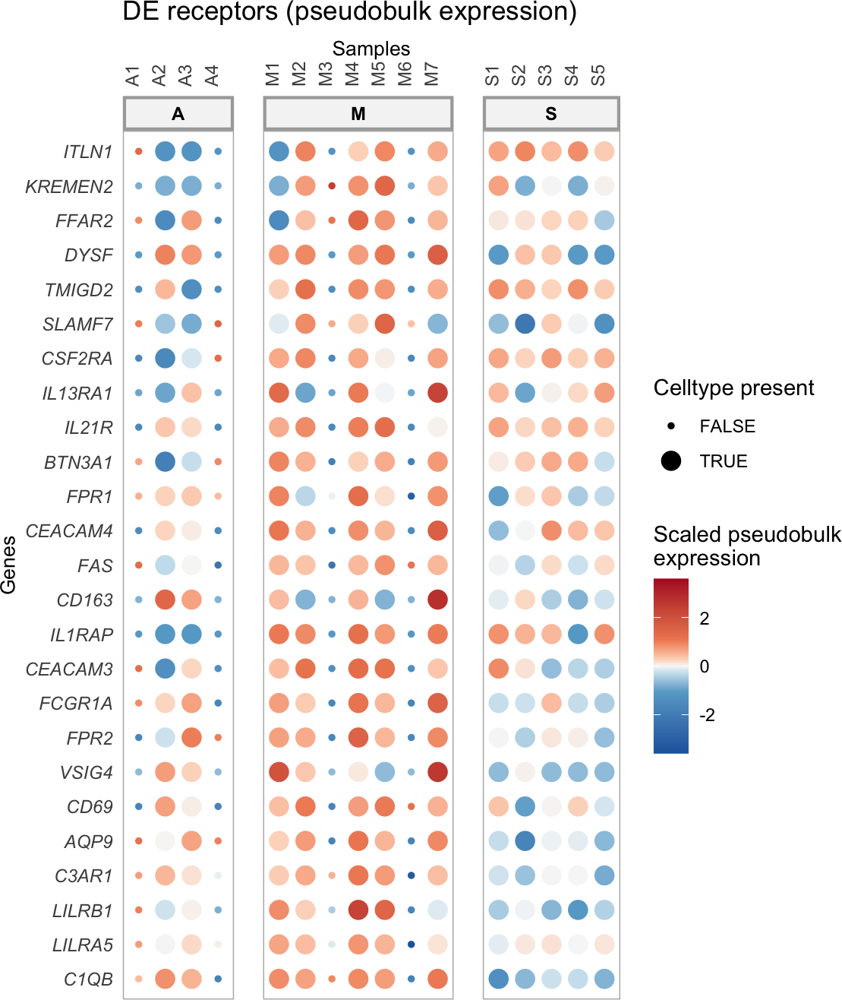

```r
p_target$singlecell_plot + ggtitle("DE receptors (single-cell expression)")
```

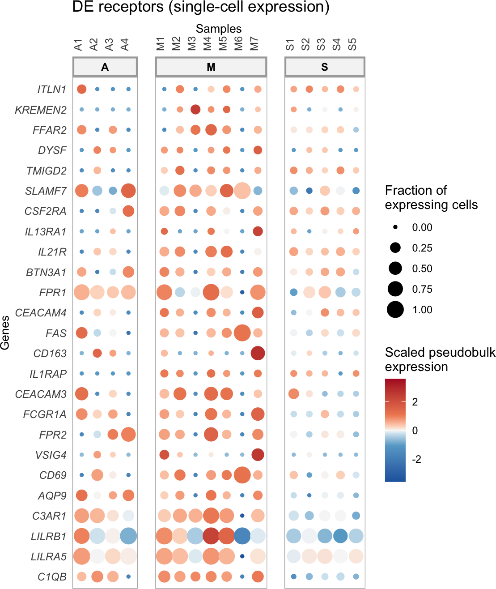

# Conclusion

This vignette covered all the details of a MultiNicheNet analysis, from running the algorithm to interpreting its output till the finest details. It's important to realize that interpreting the output requires quite some time and different levels of iterations: start with the big picture and focus on the most differential LR pairs first. Then later, zoom in on target genes and perform the necessary "sound checks" when going further.  
