MultiNicheNet analysis: MIS-C threewise comparison - step-by-step
================
Robin Browaeys
2023-06-06

<!-- github markdown built using 
rmarkdown::render("vignettes/basic_analysis_steps_MISC.Rmd", output_format = "github_document")
-->

In this vignette, you can learn how to perform an all-vs-all
MultiNicheNet analysis. In this vignette, we start from one
SingleCellExperiment object containing cells from both sender and
receiver cell types and from different patients.

A MultiNicheNet analysis can be performed if you have multi-sample,
multi-group single-cell data. MultiNicheNet will look for cell-cell
communication between the cell types in your data for each sample, and
compare the cell-cell communication patterns between the groups of
interest. Therefore, the absolute minimum of meta data you need to have,
are following columns indicating for each cell: the **group**,
**sample** and **cell type**.

As example expression data of interacting cells, we will here use
scRNAseq data of immune cells in MIS-C patients and healthy siblings
from this paper of Hoste et al.: [TIM3+ TRBV11-2 T cells and IFNγ
signature in patrolling monocytes and CD16+ NK cells delineate
MIS-C](https://rupress.org/jem/article/219/2/e20211381/212918/TIM3-TRBV11-2-T-cells-and-IFN-signature-in)
[](https://doi.org/10.5281/zenodo.6362434)
. MIS-C (multisystem inflammatory syndrome in children) is a novel rare
immunodysregulation syndrome that can arise after SARS-CoV-2 infection
in children. We will use NicheNet to explore immune cell crosstalk
enriched in MIS-C compared to healthy siblings.

In this vignette, we will prepare the data and analysis parameters, and
then perform the MultiNicheNet analysis.

The different steps of the MultiNicheNet analysis are the following:

- 0.  Preparation of the analysis: load packages, NicheNet LR network &
      ligand-target matrix, single-cell expression data, and define main
      settings of the MultiNicheNet analysis

- 1.  Extract cell type abundance and expression information from
      receiver and sender cell types, and link this expression
      information for ligands of the sender cell types to the
      corresponding receptors of the receiver cell types

- 2.  Perform genome-wide differential expression analysis of receiver
      and sender cell types to define DE genes between the conditions of
      interest. Based on this analysis, we can define the logFC/p-value
      of ligands in senders and receptors in receivers, and define the
      set of affected target genes in the receiver.

- 3.  Predict NicheNet ligand activities and NicheNet ligand-target
      links based on these differential expression results

- 4.  Use the information collected above to prioritize all
      sender-ligand—receiver-receptor pairs.

- 5.  Calculate correlation in expression between ligand-receptor pairs
      and their predicted target genes

In this vignette, we will demonstrate all these steps one by one.

After the MultiNicheNet analysis is done, we will explore the output of
the analysis with different ways of visualization.

# Step 0: Preparation of the analysis: load packages, NicheNet LR network & ligand-target matrix, single-cell expression data

## Step 0.1: Load required packages and NicheNet ligand-receptor network and ligand-target matrix

``` r
library(SingleCellExperiment)
library(dplyr)
library(ggplot2)
library(multinichenetr)
```

The Nichenet v2 networks and matrices for both mouse and human can be
downloaded from Zenodo
[](https://doi.org/10.5281/zenodo.7074291).

We will read these object in for human because our expression data is of
human patients. Gene names are here made syntactically valid via
`make.names()` to avoid the loss of genes (eg H2-M3) in downstream
visualizations.

``` r
organism = "human"
if(organism == "human"){
  lr_network = readRDS(url("https://zenodo.org/record/7074291/files/lr_network_human_21122021.rds"))
  lr_network = lr_network %>% dplyr::rename(ligand = from, receptor = to) %>% distinct(ligand, receptor) %>% mutate(ligand = make.names(ligand), receptor = make.names(receptor))
  ligand_target_matrix = readRDS(url("https://zenodo.org/record/7074291/files/ligand_target_matrix_nsga2r_final.rds"))
  colnames(ligand_target_matrix) = colnames(ligand_target_matrix) %>% make.names()
  rownames(ligand_target_matrix) = rownames(ligand_target_matrix) %>% make.names()
} else if(organism == "mouse"){
  lr_network = readRDS(url("https://zenodo.org/record/7074291/files/lr_network_mouse_21122021.rds"))
  lr_network = lr_network %>% dplyr::rename(ligand = from, receptor = to) %>% distinct(ligand, receptor) %>% mutate(ligand = make.names(ligand), receptor = make.names(receptor))
  ligand_target_matrix = readRDS(url("https://zenodo.org/record/7074291/files/ligand_target_matrix_nsga2r_final_mouse.rds"))
  colnames(ligand_target_matrix) = colnames(ligand_target_matrix) %>% make.names()
  rownames(ligand_target_matrix) = rownames(ligand_target_matrix) %>% make.names()
}
```

## Step 0.2: Read in SingleCellExperiment Objects

In this vignette, sender and receiver cell types are in the same
SingleCellExperiment object, which we will load here. In this vignette,
we will load in a subset of the scRNAseq data of the MIS-C
[](https://doi.org/10.5281/zenodo.8010790).
For the sake of demonstration, this subset only contains 3 cell types.
These celltypes are some of the cell types that were found to be most
interesting related to MIS-C according to Hoste et al. 

If you start from a Seurat object, you can convert it easily to a
SingleCellExperiment via
`sce = Seurat::as.SingleCellExperiment(seurat_obj, assay = "RNA")`.

Because the NicheNet 2.0. networks are in the most recent version of the
official gene symbols, we will make sure that the gene symbols used in
the expression data are also updated (= converted from their “aliases”
to official gene symbols). Afterwards, we will make them again
syntactically valid.

``` r
sce = readRDS(url("https://zenodo.org/record/8010790/files/sce_subset_misc.rds"))
sce = alias_to_symbol_SCE(sce, "human") %>% makenames_SCE()
## [1] "there are provided symbols that are not in the alias annotation table: "
##    [1] "AL627309.1"  "AL669831.5"  "AL645608.8"  "AL645608.2"  "AL162741.1"  "AL391244.3"  "AL645728.1"  "AL691432.2"  "FO704657.1"  "AL109917.1"  "AL590822.2"  "AL139246.5"  "AL139246.3"  "AL513320.1"  "AL805961.2" 
##   [16] "AL365255.1"  "AL031848.2"  "Z98884.1"    "AL034417.4"  "AL034417.3"  "AL096855.1"  "AL139424.2"  "AL354956.1"  "AL139423.1"  "AL109811.3"  "AL109811.1"  "AL109811.2"  "AC243836.1"  "AC254633.1"  "AL031283.1" 
##   [31] "AL121992.3"  "AL121992.1"  "AL450998.2"  "AL137802.2"  "AL021920.3"  "BX284668.2"  "BX284668.5"  "BX284668.6"  "AL035413.1"  "AL031727.2"  "AL020998.1"  "AL031005.1"  "AL031728.1"  "AL031281.2"  "AL445686.2" 
##   [46] "AL445471.1"  "AL445471.2"  "AL031432.5"  "AL031432.3"  "AL606491.1"  "AL031280.1"  "AL020996.1"  "AL033528.2"  "AL391650.1"  "AL512408.1"  "BX293535.1"  "AL512288.1"  "AL353622.1"  "AL353622.2"  "AL360012.1" 
##   [61] "AC114488.2"  "AC114488.3"  "AL136115.2"  "AL445248.1"  "AL049795.1"  "AL662907.3"  "AC114490.3"  "AC114490.2"  "AC004865.2"  "AL591845.1"  "AL139260.1"  "AL033527.3"  "AL033527.5"  "AL050341.2"  "AL603839.3" 
##   [76] "AC098484.3"  "AL512353.1"  "AL139289.2"  "AL139289.1"  "AL451062.3"  "AL357079.1"  "AL139220.2"  "AL592166.1"  "AC104170.1"  "AL050343.1"  "AL445685.1"  "AL606760.2"  "AL606760.3"  "AL606760.1"  "AC119428.2" 
##   [91] "AL161644.1"  "AC105277.1"  "AC099791.2"  "AL357078.1"  "AL583808.1"  "AC118549.1"  "AC103591.3"  "AL359504.2"  "AL078459.1"  "AL049597.2"  "AC099063.4"  "AC099063.1"  "AC099568.2"  "AC104836.1"  "AC105942.1" 
##  [106] "AC092802.1"  "AC118553.1"  "AC118553.2"  "AC104506.1"  "AC093157.2"  "AC093157.1"  "AL109741.1"  "AL390036.1"  "AL359258.2"  "AL356488.3"  "AL356488.2"  "SARS"        "AC000032.1"  "AL450468.2"  "AL160006.1" 
##  [121] "AL355488.1"  "AL365361.1"  "AL360270.1"  "AL360270.3"  "AL355816.2"  "AL354760.1"  "AL603832.1"  "AL357055.3"  "AL137856.1"  "AL390066.1"  "AL445231.1"  "AL157902.1"  "AL359915.2"  "AC244453.2"  "AC244021.1" 
##  [136] "AL592494.3"  "AC239800.2"  "AC239800.3"  "AC245595.1"  "AC246785.3"  "FP700111.1"  "AC245014.3"  "AC245014.1"  "AC243547.3"  "AC243547.2"  "NOTCH2NL"    "AC239799.2"  "AC242426.2"  "AC239809.3"  "AC245297.3" 
##  [151] "AC245297.2"  "AC239868.3"  "AC239868.2"  "AL590133.2"  "AL391069.2"  "AL391069.3"  "AL391335.1"  "AL589765.7"  "AL450992.2"  "AL162258.2"  "AL358472.5"  "AL358472.4"  "AL358472.3"  "AL358472.2"  "AL451085.1" 
##  [166] "AL451085.2"  "AC234582.1"  "AC234582.2"  "AL353807.2"  "AL355388.2"  "AL139412.1"  "AL590560.1"  "AL590560.2"  "AL121987.2"  "AL139011.1"  "AL138930.1"  "AL121985.1"  "AL591806.3"  "AL590714.1"  "AL592295.4" 
##  [181] "AL359541.1"  "AL596325.1"  "AL356441.1"  "AL451074.2"  "AL451050.2"  "AL359962.2"  "AL031733.2"  "AL021068.1"  "AL031599.1"  "AL645568.1"  "AL121983.1"  "AL121983.2"  "Z99127.1"    "AL513329.1"  "AL359265.3" 
##  [196] "AL137796.1"  "AL449106.1"  "AL353708.3"  "AL353708.1"  "AL162431.2"  "AL445228.2"  "AL078644.2"  "AL133383.1"  "AL390957.1"  "AL136987.1"  "AL136454.1"  "AL157402.2"  "AC096677.1"  "AC099676.1"  "AC098934.4" 
##  [211] "AL512306.3"  "AL512306.2"  "AC244034.2"  "AL137789.1"  "AL031316.1"  "AL606468.1"  "AL451060.1"  "AL360091.3"  "AC092803.2"  "AL590648.3"  "AC096642.1"  "AL513314.2"  "AL592148.3"  "AL392172.1"  "AL359979.2" 
##  [226] "AC138393.3"  "AC092809.4"  "AC092811.2"  "AL591895.1"  "AL512343.2"  "AL353593.1"  "AL353593.2"  "AL670729.1"  "AL117350.1"  "AL121990.1"  "AL445524.1"  "AL355472.3"  "AL355472.4"  "AL355472.1"  "AL160408.2" 
##  [241] "AL391832.2"  "AL391832.3"  "AL359921.2"  "AL359921.1"  "BX323046.1"  "AL356512.1"  "AL591848.3"  "AL390728.6"  "AL390728.5"  "AC138089.1"  "AC098483.1"  "AC092159.2"  "AC093390.2"  "AC231981.1"  "AC108488.1" 
##  [256] "AC017076.1"  "AC010904.2"  "AC092580.2"  "AC073195.1"  "AC010969.2"  "AC104794.2"  "AC007240.1"  "AC007249.2"  "AC062028.1"  "AC079148.1"  "AC013400.1"  "AC079145.1"  "AC098828.2"  "AC012065.3"  "AC012065.4" 
##  [271] "AC018742.1"  "AC012073.1"  "AC012074.1"  "AC104699.1"  "AC013472.3"  "AC013403.2"  "AC074117.1"  "AC093690.1"  "AC104695.2"  "AC104695.3"  "AC092164.1"  "AC016907.2"  "AL121652.1"  "AL121658.1"  "AL133245.1" 
##  [286] "AC007378.1"  "AC006369.1"  "AC074366.1"  "AC019171.1"  "AC007388.1"  "AC083949.1"  "AC010883.1"  "AC019129.2"  "AC018682.1"  "AC016722.3"  "AC073283.1"  "AC079807.1"  "AC092650.1"  "AC093635.1"  "AC008280.3" 
##  [301] "AC093110.1"  "AC012358.3"  "AC015982.1"  "AC007743.1"  "AC016727.1"  "AC107081.2"  "AC009501.1"  "AC012368.1"  "AC008074.3"  "AC007365.1"  "AC017083.3"  "AC017083.2"  "AC017083.1"  "AC022201.2"  "AC007881.3" 
##  [316] "AC007878.1"  "AC073046.1"  "AC073263.1"  "AC073263.2"  "AC006030.1"  "AC005041.1"  "AC019069.1"  "AC104135.1"  "AC005034.3"  "AC009309.1"  "AC015971.1"  "AC133644.2"  "AC104134.1"  "AC062029.1"  "AC103563.7" 
##  [331] "AC092835.1"  "AC009237.14" "AC021188.1"  "AC092683.1"  "AC109826.1"  "AC079447.1"  "AC092587.1"  "AC018690.1"  "AC092667.1"  "AC016738.1"  "AC104655.1"  "AC012360.1"  "AC012360.3"  "AC010978.1"  "AC013271.1" 
##  [346] "AC108463.3"  "AC068491.3"  "AC017002.3"  "AC017002.1"  "AC079922.2"  "AC016683.1"  "AC016745.2"  "AC104653.1"  "AC110769.2"  "AC009312.1"  "AC009404.1"  "AC093901.1"  "AC012447.1"  "AC068282.1"  "AC012306.2" 
##  [361] "AC073869.3"  "AC011893.1"  "AC114763.1"  "AC092620.1"  "AC007364.1"  "AC091488.1"  "AC009506.1"  "AC009961.1"  "AC009299.3"  "AC008063.1"  "AC009495.3"  "AC007405.3"  "AC078883.2"  "AC078883.3"  "AC078883.1" 
##  [376] "AC010894.2"  "AC010894.4"  "AC093459.1"  "AC079305.1"  "AC073834.1"  "AC009948.1"  "AC009948.4"  "AC009948.3"  "AC010680.3"  "AC010680.2"  "AC010680.1"  "AC068196.1"  "AC009962.1"  "AC096667.1"  "AC017071.1" 
##  [391] "AC013468.1"  "AC108047.1"  "AC005540.1"  "AC064834.1"  "AC114760.2"  "AC020571.1"  "AC013264.1"  "AC010746.1"  "AC011997.1"  "AC007163.1"  "AC005037.1"  "AC064836.3"  "AC007383.2"  "AC007383.3"  "AC008269.1" 
##  [406] "AC007879.2"  "AC009226.1"  "AC007038.2"  "AC007038.1"  "AC079610.2"  "AC079610.1"  "AC068051.1"  "AC016708.1"  "AC098820.2"  "AC021016.3"  "AC012510.1"  "AC009974.1"  "AC097468.3"  "AC068946.1"  "AC053503.2" 
##  [421] "AC079834.2"  "AC097461.1"  "AC097662.1"  "AC009950.1"  "AC012507.1"  "AC012507.4"  "AC073254.1"  "AC105760.1"  "AC105760.2"  "AC112721.2"  "AC104667.1"  "AC012485.3"  "AC016999.1"  "AC062017.1"  "SEPT2"      
##  [436] "AC114730.1"  "AC131097.4"  "AC093642.1"  "AC024060.1"  "AC018816.1"  "AC026202.2"  "AC026202.3"  "AC026191.1"  "AC018809.2"  "AC034198.2"  "AC093495.1"  "AC090948.1"  "AC090948.2"  "AC090948.3"  "AC116096.1" 
##  [451] "AC112220.4"  "AC123023.1"  "AC097359.3"  "AC097359.2"  "AC092053.3"  "AC092053.2"  "AC099541.1"  "AC006059.1"  "AC099329.3"  "AC104184.1"  "AC104187.1"  "AC099669.1"  "AC124045.1"  "AC098613.1"  "AC099778.1" 
##  [466] "AC134772.1"  "AC137630.2"  "AC137630.1"  "AC137630.3"  "QARS"        "AC105935.1"  "U73166.1"    "AC096920.1"  "AC006252.1"  "AC006254.1"  "AC096887.1"  "AC012467.2"  "AC135507.1"  "AC012557.2"  "AC109587.1" 
##  [481] "AC097634.3"  "AC097634.1"  "AC104435.2"  "AC107204.1"  "AC069222.1"  "AC128688.2"  "AC074044.1"  "AC078785.1"  "AC093010.2"  "AC073352.1"  "AC073352.2"  "AC092910.3"  "AC083798.2"  "AC092903.2"  "AC079848.1" 
##  [496] "AC112484.3"  "AC112484.1"  "AC108673.2"  "AC108673.3"  "AC107027.1"  "AC117382.2"  "AC096992.2"  "AC097103.2"  "AC026304.1"  "AC020636.1"  "AC108718.1"  "AC084036.1"  "AC106707.1"  "AC080013.6"  "AC080013.1" 
##  [511] "AC080013.5"  "AC069224.1"  "AC112491.1"  "AC078802.1"  "AC078795.1"  "AC078795.2"  "AC008040.1"  "AC008040.5"  "AC007823.1"  "AC007620.2"  "AC125618.1"  "AC069431.1"  "AC092953.2"  "AC131235.3"  "AC068631.1" 
##  [526] "AC112907.3"  "AC069213.1"  "AC233280.1"  "AC055764.2"  "AC055764.1"  "AC107464.1"  "AC107464.3"  "AC139887.4"  "AC139887.2"  "AC139887.1"  "AC092535.4"  "AC147067.1"  "AC016773.1"  "AL158068.2"  "AC105415.1" 
##  [541] "AC093323.1"  "AC097382.2"  "AC104825.1"  "AC105345.1"  "AC099550.1"  "AC116651.1"  "AC006160.1"  "AC133961.1"  "AC106047.1"  "AC104078.1"  "AC108471.2"  "AC095057.2"  "AC111006.1"  "AC096734.2"  "AC096586.1" 
##  [556] "AC107068.1"  "AC027271.1"  "AC110792.3"  "AC068620.1"  "AC068620.2"  "AC104806.2"  "AC053527.1"  "AC093677.2"  "AC098818.2"  "AC124016.2"  "AC124016.1"  "AC093827.5"  "AC093827.4"  "AC083829.2"  "AC019077.1" 
##  [571] "AC114811.2"  "AC019131.2"  "AP002026.1"  "AC097460.1"  "AP001816.1"  "AC098487.1"  "AF213884.3"  "AC018797.2"  "AC004069.1"  "AC109361.1"  "AC096564.1"  "AC096564.2"  "AC004067.1"  "AC126283.1"  "AC109347.1" 
##  [586] "AC106864.1"  "AC110079.2"  "AC108866.1"  "AC108062.1"  "AC096711.3"  "AC097376.2"  "AC112236.2"  "AC096733.2"  "AC097504.2"  "AC139720.1"  "AC104596.1"  "AC093835.1"  "AC095055.1"  "AC097375.1"  "AC106882.1" 
##  [601] "AC105285.1"  "AC097534.1"  "AC097534.2"  "AC019163.1"  "AC078881.1"  "AC107214.1"  "AC084871.2"  "AC106897.1"  "AC097652.1"  "AC021087.1"  "AC106772.1"  "AC026740.1"  "AC116351.1"  "AC026412.3"  "AC091965.1" 
##  [616] "AC091965.4"  "AC034229.4"  "AC012640.2"  "AC010491.1"  "AC022113.1"  "AC022113.2"  "AC026785.2"  "AC025181.2"  "AC034231.1"  "AC026801.2"  "AC137810.1"  "AC008957.1"  "AC026741.1"  "AC008875.1"  "AC025171.3" 
##  [631] "AC025171.5"  "AC025171.2"  "AC025171.4"  "AC114947.2"  "AC114956.1"  "AC093297.2"  "AC008966.1"  "AC008914.1"  "AC008892.1"  "AC016596.1"  "AC008937.1"  "AC008937.3"  "AC092343.1"  "AC104113.1"  "AC092354.2" 
##  [646] "AC025442.1"  "AC024581.1"  "AC010280.2"  "AC146944.4"  "AC035140.1"  "AC008972.2"  "AC099522.2"  "AC010501.1"  "AC116337.3"  "AC008897.2"  "AC010245.2"  "AC026725.1"  "AC012636.1"  "AC010260.1"  "AC008771.1" 
##  [661] "AC008434.1"  "AC104118.1"  "AC018754.1"  "AC123595.1"  "AC008840.1"  "AC020900.1"  "AC008906.1"  "AC008906.2"  "AC009126.1"  "AC008522.1"  "AC021086.1"  "AC008467.1"  "AC008494.3"  "AC010226.1"  "AC008549.2" 
##  [676] "AC034236.2"  "AC008629.1"  "AC093535.1"  "AC011416.3"  "AC116366.3"  "AC116366.2"  "AC116366.1"  "AC004775.1"  "AC010240.3"  "AC008608.2"  "AC104109.3"  "AC104109.2"  "AC109454.2"  "AC026691.1"  "AC106791.1" 
##  [691] "AC113382.1"  "AC011405.1"  "AC135457.1"  "AC008667.1"  "AC008438.1"  "AC005618.1"  "AC008781.1"  "AC091959.3"  "AC091948.1"  "AC131025.1"  "AC008641.1"  "AC011337.1"  "AC011374.2"  "AC091982.3"  "AC009185.1" 
##  [706] "AC008676.1"  "AC134043.1"  "AC008691.1"  "AC113414.1"  "AC034199.1"  "AC022217.3"  "AC008429.1"  "AC008429.3"  "AC008378.1"  "AC139491.1"  "AC139491.7"  "AC139795.3"  "AC139795.2"  "AC106795.2"  "AC136604.2" 
##  [721] "AC136604.3"  "AC008393.1"  "AC008610.1"  "AC008443.5"  "AC008443.6"  "AC138035.1"  "AL357054.4"  "AL357054.2"  "AL133351.1"  "AL031963.3"  "AL138831.1"  "AL162718.1"  "AL359643.3"  "AL136307.1"  "AL024498.1" 
##  [736] "AL157373.2"  "AL008729.1"  "AL008729.2"  "AL441883.1"  "AL109914.1"  "AL138720.1"  "AL136162.1"  "AL137003.1"  "AL137003.2"  "AL138724.1"  "AL031775.1"  "U91328.2"    "U91328.1"    "HIST1H2BC"   "AL353759.1" 
##  [751] "HIST1H2BE"   "AL031777.3"  "HIST1H2BF"   "HIST1H2BG"   "HIST1H2BI"   "AL121936.1"  "AL513548.3"  "AL513548.1"  "AL009179.1"  "AL121944.1"  "AL358933.1"  "AL049543.1"  "AL645929.2"  "AL662797.1"  "AL662844.4" 
##  [766] "AL645933.2"  "AL662899.2"  "AL662884.4"  "AL662796.1"  "AL669918.1"  "AL645941.3"  "AL645940.1"  "AL451165.2"  "Z84485.1"    "AL353597.1"  "AL121574.1"  "AL365205.1"  "AL513008.1"  "AL035587.1"  "AL133375.1" 
##  [781] "AL355802.2"  "AL096865.1"  "AL035701.1"  "AL355353.1"  "AL021368.1"  "AL021368.2"  "AL135905.1"  "AL354719.2"  "AL391807.1"  "AL365226.2"  "AL365226.1"  "AC019205.1"  "AL121972.1"  "AL590428.1"  "AL080250.1" 
##  [796] "AL359715.3"  "AL359715.1"  "AL359715.2"  "AL139274.2"  "AL049697.1"  "AL353135.1"  "AL096678.1"  "AL121787.1"  "AL132996.1"  "AL589740.1"  "AL513550.1"  "AL137784.2"  "AL133338.1"  "AL133406.3"  "AL133406.2" 
##  [811] "AL024507.2"  "AL390208.1"  "AL359711.2"  "AL512303.1"  "AC002464.1"  "AL080317.1"  "AL080317.2"  "AL080317.3"  "Z97989.1"    "AL050331.2"  "AL365275.1"  "AL096711.2"  "AL590006.1"  "AL355581.1"  "AL353596.1" 
##  [826] "AL024508.2"  "AL356234.2"  "AL357060.1"  "AL590617.2"  "AL031772.1"  "AL158850.1"  "AL035446.1"  "AL023806.1"  "AL356599.1"  "AL031056.1"  "AL358852.1"  "AL355312.4"  "AL080276.2"  "AL590867.1"  "AL596202.1" 
##  [841] "AL355297.3"  "AL355297.4"  "AL391863.1"  "AL035634.1"  "AL627422.2"  "AL035530.2"  "AL356417.3"  "AL356417.1"  "AL139393.2"  "AL022069.1"  "AL159163.1"  "Z94721.1"    "AL121935.1"  "AL121935.2"  "BX322234.1" 
##  [856] "AL109910.2"  "AC093627.5"  "AC093627.4"  "AC147651.1"  "AC147651.4"  "AC073957.3"  "AC073957.2"  "AC091729.3"  "AC102953.2"  "AC104129.1"  "AC004906.1"  "AC024028.1"  "AC092171.4"  "AC092171.3"  "AC073343.2" 
##  [871] "AC004982.2"  "AC004948.1"  "AC006042.4"  "AC006042.2"  "AC007029.1"  "AC073333.1"  "AC073332.1"  "AC004130.1"  "AC073072.1"  "AC005082.1"  "MPP6"        "AC005165.1"  "AC004520.1"  "AC004540.1"  "AC004593.3" 
##  [886] "AC007285.1"  "AC007036.1"  "AC005154.6"  "GARS"        "AC018647.2"  "AC007349.3"  "AC006033.2"  "AC011290.1"  "AC072061.1"  "AC004951.1"  "AC004854.2"  "AC073115.2"  "AC020743.1"  "AC074351.1"  "AC118758.3" 
##  [901] "AC092634.3"  "AC073349.1"  "AC068533.4"  "AC008267.5"  "AC027644.3"  "AC073335.2"  "AC006480.2"  "AC211476.2"  "AC004921.1"  "AC005076.1"  "AC003991.2"  "AC002383.1"  "AC007566.1"  "AC002454.1"  "AC002451.1" 
##  [916] "AC004834.1"  "AC004922.1"  "AC073842.2"  "AC073842.1"  "AC092849.1"  "AC069281.1"  "AC105446.1"  "AC006329.1"  "AC093668.3"  "AC005064.1"  "AC007384.1"  "AC005070.3"  "AC073073.2"  "AC007032.1"  "AC004492.1" 
##  [931] "AC004839.1"  "AC002467.1"  "AC005046.1"  "AC006333.2"  "AC073934.1"  "AC090114.2"  "AC018638.7"  "AC078846.1"  "AC073320.1"  "AC087071.1"  "AC007938.2"  "AC007938.3"  "AC016831.7"  "AC016831.1"  "AC016831.5" 
##  [946] "AC058791.1"  "AC008264.2"  "AC009275.1"  "AC083862.2"  "AC009542.1"  "AC024084.1"  "AC078845.1"  "AC083880.1"  "AC004918.1"  "AC093673.1"  "AC004889.1"  "AC074386.1"  "AC005229.4"  "AC073314.1"  "AC004877.1" 
##  [961] "AC092681.3"  "AC005586.1"  "AC073111.5"  "AC021097.1"  "AC006017.1"  "AC093726.2"  "AC144652.1"  "AC009403.1"  "AC005534.1"  "AC005481.1"  "AC011899.2"  "AC011899.3"  "AL732314.6"  "AL732314.4"  "AL672277.1" 
##  [976] "AL683807.1"  "BX890604.1"  "AC073529.1"  "AC131011.1"  "CXorf21"     "AC108879.1"  "AC234772.3"  "AC234772.2"  "AF196972.1"  "AC115618.1"  "AC231533.1"  "AC232271.1"  "AC233976.1"  "AL445472.1"  "AL354793.1" 
##  [991] "AL022157.1"  "AL034397.2"  "AL034397.3"  "AL590764.1"  "AL353804.1"  "Z68871.1"    "AL121601.1"  "AL683813.1"  "AL078639.1"  "AC244197.3" 
##  [ reached getOption("max.print") -- omitted 2569 entries ]
## [1] "they are added to the alias annotation table, so they don't get lost"
## [1] "following are the official gene symbols of input aliases: "
##              symbol            alias
## 1             AARS1             AARS
## 2           ABITRAM          FAM206A
## 3              ACP3             ACPP
## 4          ACTN1-DT        ACTN1-AS1
## 5             ADPRS          ADPRHL2
## 6             ADSS1           ADSSL1
## 7             ADSS2             ADSS
## 8        ANKRD20A2P        ANKRD20A2
## 9        ANKRD20A3P        ANKRD20A3
## 10       ANKRD20A4P        ANKRD20A4
## 11        ANKRD40CL        LINC00483
## 12           ANTKMT          FAM173A
## 13            AOPEP           C9orf3
## 14           ARLNC1        LINC02170
## 15           ATP5MJ          ATP5MPL
## 16           ATP5MK           ATP5MD
## 17         ATPSCKMT          FAM173B
## 18          B3GALT9          B3GNT10
## 19             BBLN          C9orf16
## 20           BMERB1         C16orf45
## 21            BPNT2           IMPAD1
## 22            BRME1         C19orf57
## 23      CARNMT1-AS1      C9orf41-AS1
## 24            CARS1             CARS
## 25        CARS1-AS1         CARS-AS1
## 26             CBY2            SPERT
## 27          CCDC200        LINC00854
## 28      CCDC28A-AS1            GVQW2
## 29             CCN2             CTGF
## 30             CCN3              NOV
## 31             CCNP            CNTD2
## 32            CDIN1         C15orf41
## 33          CENATAC           CCDC84
## 34            CEP20            FOPNL
## 35            CEP43          FGFR1OP
## 36            CERT1         COL4A3BP
## 37         CFAP20DC          C3orf67
## 38          CFAP251            WDR66
## 39          CFAP410          C21orf2
## 40           CFAP91           MAATS1
## 41           CFAP92         KIAA1257
## 42           CIAO2A           FAM96A
## 43           CIAO2B           FAM96B
## 44            CIAO3            NARFL
## 45           CIBAR1           FAM92A
## 46           CIBAR2           FAM92B
## 47            CILK1              ICK
## 48        CLLU1-AS1          CLLU1OS
## 49             COA8           APOPT1
## 50            CRACD         KIAA1211
## 51           CRACDL        KIAA1211L
## 52            CRPPA             ISPD
## 53            CYRIA           FAM49A
## 54            CYRIB           FAM49B
## 55             CZIB         C1orf123
## 56            DARS1             DARS
## 57        DARS1-AS1         DARS-AS1
## 58          DENND10           FAM45A
## 59          DENND11         KIAA1147
## 60          DENND2B              ST5
## 61           DIPK1A           FAM69A
## 62           DIPK1B           FAM69B
## 63           DIPK2A          C3orf58
## 64           DMAC2L            ATP5S
## 65          DNAAF10            WDR92
## 66          DNAAF11            LRRC6
## 67           DNAAF8         C16orf71
## 68           DNAAF9        C20orf194
## 69            DNAI3            WDR63
## 70            DNAI4            WDR78
## 71            DNAI7            CASC1
## 72        DOCK8-AS1          C9orf66
## 73            DOP1A           DOPEY1
## 74            DOP1B           DOPEY2
## 75           DUSP29            DUPD1
## 76          DYNC2I1            WDR60
## 77          DYNC2I2            WDR34
## 78           DYNLT2            TCTE3
## 79          DYNLT2B         TCTEX1D2
## 80           DYNLT4         TCTEX1D4
## 81           DYNLT5         TCTEX1D1
## 82            ECRG4          C2orf40
## 83          ELAPOR1         KIAA1324
## 84          ELAPOR2        KIAA1324L
## 85            EOLA1         CXorf40A
## 86            EOLA2         CXorf40B
## 87            EPRS1             EPRS
## 88            EZHIP          CXorf67
## 89         FAM153CP          FAM153C
## 90          FAM174C         C19orf24
## 91         FAM86C1P          FAM86C1
## 92             FCSK              FUK
## 93           FHIP1A         FAM160A1
## 94        FHIP1A-DT      FAM160A1-DT
## 95           FHIP1B         FAM160A2
## 96           FHIP2A         FAM160B1
## 97           FHIP2B         FAM160B2
## 98           FLACC1         ALS2CR12
## 99      FMC1-LUC7L2   C7orf55-LUC7L2
## 100          GARRE1         KIAA0355
## 101          GASK1A          FAM198A
## 102          GASK1B          FAM198B
## 103      GASK1B-AS1      FAM198B-AS1
## 104           GCNT4        LINC01336
## 105        GDF5-AS1           GDF5OS
## 106            GET1              WRB
## 107            GET3            ASNA1
## 108            GFUS            TSTA3
## 109           GOLM2            CASC4
## 110            H1-0             H1F0
## 111            H1-1         HIST1H1A
## 112           H1-10             H1FX
## 113       H1-10-AS1         H1FX-AS1
## 114            H1-2         HIST1H1C
## 115            H1-3         HIST1H1D
## 116            H1-4         HIST1H1E
## 117            H1-5         HIST1H1B
## 118            H1-6         HIST1H1T
## 119           H2AB1           H2AFB1
## 120          H2AC11        HIST1H2AG
## 121          H2AC12        HIST1H2AH
## 122          H2AC13        HIST1H2AI
## 123          H2AC14        HIST1H2AJ
## 124          H2AC15        HIST1H2AK
## 125          H2AC16        HIST1H2AL
## 126          H2AC17        HIST1H2AM
## 127          H2AC18       HIST2H2AA3
## 128          H2AC19       HIST2H2AA4
## 129          H2AC20        HIST2H2AC
## 130          H2AC21        HIST2H2AB
## 131           H2AC4        HIST1H2AB
## 132           H2AC6        HIST1H2AC
## 133           H2AC8        HIST1H2AE
## 134            H2AJ            H2AFJ
## 135            H2AW         HIST3H2A
## 136            H2AX            H2AFX
## 137           H2AZ1            H2AFZ
## 138           H2AZ2            H2AFV
## 139          H2BC11        HIST1H2BJ
## 140          H2BC12        HIST1H2BK
## 141          H2BC13        HIST1H2BL
## 142          H2BC14        HIST1H2BM
## 143          H2BC15        HIST1H2BN
## 144          H2BC17        HIST1H2BO
## 145          H2BC18        HIST2H2BF
## 146          H2BC21        HIST2H2BE
## 147           H2BC3        HIST1H2BB
## 148           H2BC5        HIST1H2BD
## 149           H2BC9        HIST1H2BH
## 150           H2BU1        HIST3H2BB
## 151            H3-2       HIST2H3PS2
## 152           H3-3A            H3F3A
## 153           H3-3B            H3F3B
## 154            H3-5            H3F3C
## 155            H3C1         HIST1H3A
## 156           H3C10         HIST1H3H
## 157           H3C11         HIST1H3I
## 158           H3C12         HIST1H3J
## 159           H3C13         HIST2H3D
## 160            H3C2         HIST1H3B
## 161            H3C3         HIST1H3C
## 162            H3C6         HIST1H3E
## 163            H3C7         HIST1H3F
## 164            H3C8         HIST1H3G
## 165           H4-16          HIST4H4
## 166            H4C1         HIST1H4A
## 167           H4C11         HIST1H4J
## 168           H4C13         HIST1H4L
## 169           H4C14         HIST2H4A
## 170           H4C15         HIST2H4B
## 171            H4C2         HIST1H4B
## 172            H4C3         HIST1H4C
## 173            H4C4         HIST1H4D
## 174            H4C5         HIST1H4E
## 175            H4C6         HIST1H4F
## 176            H4C8         HIST1H4H
## 177            H4C9         HIST1H4I
## 178           HARS1             HARS
## 179            HEXD            HEXDC
## 180            HROB         C17orf53
## 181       HSDL2-AS1         C9orf147
## 182           IARS1             IARS
## 183           IFTAP         C11orf74
## 184           ILRUN         C6orf106
## 185           IRAG1            MRVI1
## 186       IRAG1-AS1        MRVI1-AS1
## 187           IRAG2             LRMP
## 188         ITPRID2            SSFA2
## 189           KARS1             KARS
## 190           KASH5          CCDC155
## 191          KATNIP         KIAA0556
## 192           KICS2         C12orf66
## 193           KIFBP           KIF1BP
## 194       KRT10-AS1           TMEM99
## 195           LARS1             LARS
## 196           LDAF1          TMEM159
## 197       LINC02481       LINC002481
## 198       LINC02693         C17orf51
## 199       LINC02694         C15orf53
## 200       LINC02870         C10orf91
## 201       LINC02875         C17orf82
## 202       LINC02899          C5orf17
## 203       LINC02901          C6orf99
## 204       LINC02908         C9orf139
## 205       LINC02909         C12orf77
## 206       LINC02910        C20orf197
## 207       LINC02913         C9orf106
## 208       LNCTAM34A        LINC01759
## 209          LRATD2           FAM84B
## 210            LTO1           ORAOV1
## 211           MACIR          C5orf30
## 212       MACROH2A1            H2AFY
## 213       MACROH2A2           H2AFY2
## 214           MAILR        AZIN1-AS1
## 215         MARCHF1           MARCH1
## 216        MARCHF10          MARCH10
## 217         MARCHF2           MARCH2
## 218         MARCHF3           MARCH3
## 219         MARCHF4           MARCH4
## 220         MARCHF5           MARCH5
## 221         MARCHF6           MARCH6
## 222         MARCHF7           MARCH7
## 223         MARCHF8           MARCH8
## 224         MARCHF9           MARCH9
## 225           MEAK7            TLDC1
## 226        METTL25B           RRNAD1
## 227         MICOS10           MINOS1
## 228         MICOS13         C19orf70
## 229          MIDEAS          ELMSAN1
## 230          MINAR1         KIAA1024
## 231       MIR3667HG         C22orf34
## 232        MIR9-1HG          C1orf61
## 233           MIX23           CCDC58
## 234            MMUT              MUT
## 235          MROCKI        LINC01268
## 236           MRTFA             MKL1
## 237           MRTFB             MKL2
## 238          MTARC1            MARC1
## 239          MTARC2            MARC2
## 240            MTLN           SMIM37
## 241          MTRES1         C6orf203
## 242           MTRFR         C12orf65
## 243           MTSS2           MTSS1L
## 244            MYG1         C12orf10
## 245           NARS1             NARS
## 246        NCBP2AS2        NCBP2-AS2
## 247       NDUFV1-DT         C11orf72
## 248          NIBAN1          FAM129A
## 249          NIBAN2          FAM129B
## 250          NIBAN3          FAM129C
## 251        NOPCHAP1         C12orf45
## 252           NTAQ1           WDYHV1
## 253           NUP42            NUPL2
## 254            OBI1           RNF219
## 255        OBI1-AS1       RNF219-AS1
## 256           ODAD1          CCDC114
## 257           ODAD2            ARMC4
## 258           ODAD3          CCDC151
## 259           ODAD4            TTC25
## 260          PABIR1          FAM122A
## 261          PABIR2          FAM122B
## 262          PABIR3          FAM122C
## 263           PACC1          TMEM206
## 264      PALM2AKAP2            AKAP2
## 265      PALM2AKAP2      PALM2-AKAP2
## 266           PALS1             MPP5
## 267       PAXIP1-DT       PAXIP1-AS1
## 268           PEDS1          TMEM189
## 269    PEDS1-UBE2V1   TMEM189-UBE2V1
## 270         PELATON           SMIM25
## 271           PGAP4          TMEM246
## 272           PGAP6           TMEM8A
## 273           PHAF1         C16orf70
## 274      PIK3IP1-DT      PIK3IP1-AS1
## 275       PITX1-AS1          C5orf66
## 276         PLA2G2C       UBXN10-AS1
## 277          PLAAT1           HRASLS
## 278          PLAAT2          HRASLS2
## 279          PLAAT3          PLA2G16
## 280          PLAAT4          RARRES3
## 281          PLAAT5          HRASLS5
## 282         PLEKHG7         C12orf74
## 283         POGLUT2           KDELC1
## 284         POGLUT3           KDELC2
## 285          POLR1F          TWISTNB
## 286          POLR1G           CD3EAP
## 287          POLR1H            ZNRD1
## 288     PPP1R13B-DT        LINC00637
## 289          PRANCR        LINC01481
## 290         PRECSIT        LINC00346
## 291           PRORP         KIAA0391
## 292         PRSS42P           PRSS42
## 293          PRXL2A          FAM213A
## 294          PRXL2B          FAM213B
## 295          PRXL2C            AAED1
## 296        PSME3IP1          FAM192A
## 297        RAB30-DT        RAB30-AS1
## 298            RADX          CXorf57
## 299           RAMAC           RAMMET
## 300           RARS1             RARS
## 301            RBIS          C8orf59
## 302           RELCH         KIAA1468
## 303           RESF1         KIAA1551
## 304            RO60           TROVE2
## 305        RPL34-DT        RPL34-AS1
## 306            RRM2          C2orf48
## 307            RSKR           SGK494
## 308           RUSF1         C16orf58
## 309           SANBR         KIAA1841
## 310           SCAT1        LINC02081
## 311         SEPTIN1            SEPT1
## 312        SEPTIN10           SEPT10
## 313        SEPTIN11           SEPT11
## 314         SEPTIN3            SEPT3
## 315         SEPTIN4            SEPT4
## 316     SEPTIN4-AS1        SEPT4-AS1
## 317         SEPTIN5            SEPT5
## 318         SEPTIN6            SEPT6
## 319         SEPTIN7            SEPT7
## 320      SEPTIN7-DT        SEPT7-AS1
## 321         SEPTIN8            SEPT8
## 322         SEPTIN9            SEPT9
## 323            SHFL         C19orf66
## 324           SHOC1          C9orf84
## 325         SLC49A4            DIRC2
## 326         SLC66A1            PQLC2
## 327         SLC66A2            PQLC1
## 328         SLC66A3            PQLC3
## 329         SMC5-DT         SMC5-AS1
## 330          SMIM43          TMEM155
## 331          SNHG30        LINC02001
## 332          SNHG32          C6orf48
## 333         SPRING1         C12orf49
## 334           SSPOP             SSPO
## 335         STAM-DT         STAM-AS1
## 336          STEEP1          CXorf56
## 337  STIMATE-MUSTN1   TMEM110-MUSTN1
## 338          STING1          TMEM173
## 339        STX17-DT        STX17-AS1
## 340           TAFA1          FAM19A1
## 341           TAFA2          FAM19A2
## 342         TAMALIN            GRASP
## 343           TARS1             TARS
## 344           TARS3           TARSL2
## 345           TASOR          FAM208A
## 346          TASOR2          FAM208B
## 347        TBC1D29P          TBC1D29
## 348   TIMM23B-AGAP6        LINC00843
## 349          TLCD3A           FAM57A
## 350          TLCD3B           FAM57B
## 351           TLCD4           TMEM56
## 352           TLCD5          TMEM136
## 353            TLE5              AES
## 354 TM4SF19-DYNLT2B TM4SF19-TCTEX1D2
## 355        TMCC1-DT        TMCC1-AS1
## 356       TOLLIP-DT       TOLLIP-AS1
## 357        TRAPPC14          C7orf43
## 358          TUBB8B         TUBB8P12
## 359       USP27X-DT       USP27X-AS1
## 360        USP46-DT        USP46-AS1
## 361           VARS1             VARS
## 362           WARS1             WARS
## 363            YAE1           YAE1D1
## 364           YARS1             YARS
## 365           YJU2B          CCDC130
## 366       YTHDF3-DT       YTHDF3-AS1
## 367            ZFTA         C11orf95
## 368       ZNF22-AS1         C10orf25
## 369      ZNF407-AS1        LINC00909
## 370       ZNF516-DT         C18orf65
## 371       ZNF582-DT       ZNF582-AS1
## 372          ZNF875             HKR1
## 373           ZNRD2           SSSCA1
```

## Step 0.3: Prepare settings of the MultiNicheNet cell-cell communication analysis

### Define in which metadata columns we can find the **group**, **sample** and **cell type** IDs

In this case study, we want to study differences in cell-cell
communication patterns between MIS-C patients (M), their healthy
siblings (S) and adult patients with severe covid (A). The meta data
columns that indicate this disease status is `MIS.C.AgeTier`.

Cell type annotations are indicated in the `Annotation_v2.0` column, and
the sample is indicated by the `ShortID` column. If your cells are
annotated in multiple hierarchical levels, we recommend using a high
level in the hierarchy. This for 2 reasons: 1) MultiNicheNet focuses on
differential expression and not differential abundance, and 2) there
should be sufficient cells per sample-celltype combination.

If you would have batch effects or covariates you can correct for, you
can define this here as well.

Important: for categorical covariates and batches, there should be at
least one sample for every group-batch combination. If one of your
groups/conditions lacks a certain level of your batch, you won’t be able
to correct for the batch effect because the model is then not able to
distinguish batch from group/condition effects.

Important: the column names of group, sample, cell type, batches and
covariates should be syntactically valid (`make.names`)

Important: All group, sample, cell type, batch and covariate names
should be syntactically valid as well (`make.names`) (eg through
`SummarizedExperiment::colData(sce)$ShortID = SummarizedExperiment::colData(sce)$ShortID %>% make.names()`)

``` r
sample_id = "ShortID"
group_id = "MIS.C.AgeTier"
celltype_id = "Annotation_v2.0"
covariates = NA
batches = NA
```

Sender and receiver cell types also need to be defined. Both are here
all cell types in the dataset because we are interested in an All-vs-All
analysis.

``` r
senders_oi = SummarizedExperiment::colData(sce)[,celltype_id] %>% unique()
receivers_oi = SummarizedExperiment::colData(sce)[,celltype_id] %>% unique()
```

If the user wants it, it is possible to use only a subset of senders and
receivers. Senders and receivers can be entirely different, but also
overlapping, or the same. If you don’t use all the cell types in your
data, we recommend to continue with a subset of your data.

``` r
sce = sce[, SummarizedExperiment::colData(sce)[,celltype_id] %in% c(senders_oi, receivers_oi)]
```

Now we will go to the first real step of the MultiNicheNet analysis

# Step 1: Extract cell type abundance and expression information from receiver and sender cell types, and link this expression information for ligands of the sender cell types to the corresponding receptors of the receiver cell types

Since MultiNicheNet will infer group differences at the sample level for
each cell type (currently via Muscat - pseudobulking + EdgeR), we need
to have sufficient cells per sample of a cell type, and this for both
groups. In the following analysis we will set this minimum number of
cells per cell type per sample at 10 (recommended minimum).

``` r
min_cells = 10
```

Now we will calculate abundance and expression information for each cell
type / sample / group combination with the following functions. In the
output of this function, you can also find some ‘Cell type abundance
diagnostic plots’ that will the users which celltype-sample combinations
will be left out later on for DE calculation because the nr of cells is
lower than de defined minimum defined here above. If too many
celltype-sample combinations don’t pass this threshold, we recommend to
define your cell types in a more general way (use one level higher of
the cell type ontology hierarchy) (eg TH17 CD4T cells –\> CD4T cells).

``` r
abundance_expression_info = get_abundance_expression_info(sce = sce, sample_id = sample_id, group_id = group_id, celltype_id = celltype_id, min_cells = min_cells, senders_oi = senders_oi, receivers_oi = receivers_oi, lr_network = lr_network, batches = batches)
```

First, we will check the cell type abundance diagnostic plots.

### Interpretation of cell type abundance information

The first plot visualizes the number of cells per celltype-sample
combination, and indicates which combinations are removed during the DE
analysis because there are less than `min_cells` in the celltype-sample
combination.

``` r
abundance_expression_info$abund_plot_sample
```

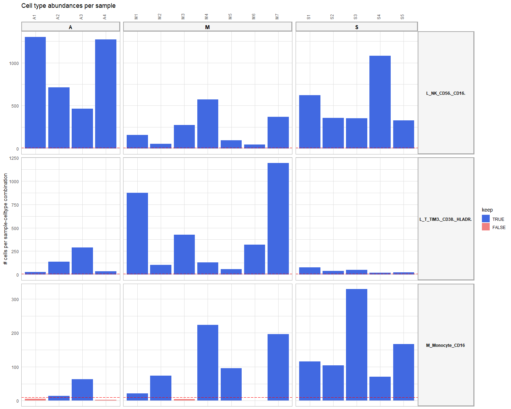<!-- -->
The red dotted line indicates the required minimum of cells as defined
above in `min_cells`. We can see here that some sample-celltype
combinations are left out. For the DE analysis in the next step, only
cell types will be considered if there are at least two samples per
group with a sufficient number of cells.

**Important**: Based on the cell type abundance diagnostics, we
recommend users to change their analysis settings if required (eg
changing cell type annotation level, batches, …), before proceeding with
the rest of the analysis.

# Step 2: Perform genome-wide differential expression analysis of receiver and sender cell types to define DE genes between the conditions of interest. Based on this analysis, we can define the logFC/p-value of ligands in senders and receptors in receivers, and define the set of affected target genes in the receiver.

Now we will go over to the multi-group, multi-sample differential
expression (DE) analysis (also called ‘differential state’ analysis by
the developers of Muscat).

### Define the contrasts and covariates of interest for the DE analysis.

Here, we want to compare each patient group to the other groups, so the
MIS-C (M) group vs healthy control siblins (S) and adult COVID19
patients (A) etcetera. To do this comparison, we need to set the
following contrasts:

``` r
contrasts_oi = c("'M-(S+A)/2','S-(M+A)/2','A-(S+M)/2'")
```

**Very Important** Note the format to indicate the contrasts! This
formatting should be adhered to very strictly, and white spaces are not
allowed! Check `?get_DE_info` for explanation about how to define this
well. The most important things are that: each contrast is surrounded by
single quotation marks, contrasts are separated by a comma without any
whitespace, and alle contrasts together are surrounded by double
quotation marks. If you compare against two groups, you should divide by
2, if you compare against three groups, you should divide by 3 etcetera.

For downstream visualizations and linking contrasts to their main group,
you need to run the following:

``` r
contrast_tbl = tibble(contrast = 
                        c("M-(S+A)/2","S-(M+A)/2", "A-(S+M)/2"), 
                      group = c("M","S","A"))
```

If you want to compare only two groups (eg M vs S), you can do like
this: `contrasts_oi = c("'M-S','S-M'")`
`contrast_tbl = tibble(contrast = c("M-S","S-M"), group = c("M","S"))`

### Perform the DE analysis for each cell type.

``` r
DE_info = get_DE_info(sce = sce, sample_id = sample_id, group_id = group_id, celltype_id = celltype_id, batches = batches, covariates = covariates, contrasts_oi = contrasts_oi, min_cells = min_cells)
```

### Check DE results

Table with logFC and p-values for each gene-celltype-contrast:

``` r
DE_info$celltype_de$de_output_tidy %>% arrange(p_adj) %>% head()
## # A tibble: 6 x 9
##   gene     cluster_id             logFC logCPM     F    p_val     p_adj.loc         p_adj contrast 
##   <chr>    <chr>                  <dbl>  <dbl> <dbl>    <dbl>         <dbl>         <dbl> <chr>    
## 1 TRBV11.2 L_T_TIM3._CD38._HLADR.  4.73   9.84   246 4.33e-13 0.00000000283 0.00000000283 M-(S+A)/2
## 2 IGLV3.25 L_NK_CD56._CD16.        7.54   5      218 6.04e-13 0.00000000516 0.00000000516 A-(S+M)/2
## 3 IGHV3.11 L_NK_CD56._CD16.        5.72   3.09   182 6.56e-11 0.00000028    0.00000028    A-(S+M)/2
## 4 IGHV1.46 L_NK_CD56._CD16.        4.58   4.12   125 1.44e-10 0.000000411   0.000000411   A-(S+M)/2
## 5 IGLV6.57 L_NK_CD56._CD16.        4.76   3.83   112 3.83e-10 0.000000817   0.000000817   A-(S+M)/2
## 6 IGKV1.27 L_NK_CD56._CD16.        4.13   3.35   108 5.5 e-10 0.000000939   0.000000939   A-(S+M)/2
```

``` r
celltype_de = DE_info$celltype_de$de_output_tidy
```

In the next step, we will combine the DE information of senders and
receivers by linking their ligands and receptors together:

### Combine DE information for ligand-senders and receptors-receivers (similar to step1 - `abundance_expression_info$sender_receiver_info`)

``` r
sender_receiver_de = combine_sender_receiver_de(
  sender_de = celltype_de,
  receiver_de = celltype_de,
  senders_oi = senders_oi,
  receivers_oi = receivers_oi,
  lr_network = lr_network
)
```

``` r
sender_receiver_de %>% head(20)
## # A tibble: 20 x 12
##    contrast  sender                 receiver               ligand receptor lfc_ligand lfc_receptor ligand_receptor_lfc_avg p_val_ligand p_adj_ligand p_val_receptor p_adj_receptor
##    <chr>     <chr>                  <chr>                  <chr>  <chr>         <dbl>        <dbl>                   <dbl>        <dbl>        <dbl>          <dbl>          <dbl>
##  1 M-(S+A)/2 L_T_TIM3._CD38._HLADR. M_Monocyte_CD16        CCL3   CCR1          2.89        0.8                       1.85   0.00053          0.0881     0.0568             0.308 
##  2 M-(S+A)/2 L_T_TIM3._CD38._HLADR. L_T_TIM3._CD38._HLADR. CCL3   CCR5          2.89        0.4                       1.64   0.00053          0.0881     0.267              0.821 
##  3 M-(S+A)/2 L_NK_CD56._CD16.       M_Monocyte_CD16        S100A8 CD69          1.68        1.53                      1.60   0.031            0.428      0.00275            0.0893
##  4 A-(S+M)/2 M_Monocyte_CD16        M_Monocyte_CD16        HLA.G  KLRD1         1.46        1.6                       1.53   0.00266          0.268      0.0991             0.644 
##  5 M-(S+A)/2 M_Monocyte_CD16        M_Monocyte_CD16        C1QB   CD33          2.99        0.0287                    1.51   0.00000638       0.0131     0.926              0.992 
##  6 A-(S+M)/2 M_Monocyte_CD16        M_Monocyte_CD16        C1QB   LRP1          2.21        0.578                     1.39   0.000377         0.152      0.0223             0.518 
##  7 M-(S+A)/2 M_Monocyte_CD16        M_Monocyte_CD16        SLAMF7 SLAMF7        1.38        1.38                      1.38   0.0318           0.239      0.0318             0.239 
##  8 M-(S+A)/2 L_T_TIM3._CD38._HLADR. M_Monocyte_CD16        GZMB   IGF2R         2.28        0.423                     1.35   0.0000633        0.0414     0.304              0.64  
##  9 M-(S+A)/2 M_Monocyte_CD16        M_Monocyte_CD16        C1QB   LRP1          2.99       -0.326                     1.33   0.00000638       0.0131     0.0727             0.346 
## 10 M-(S+A)/2 L_T_TIM3._CD38._HLADR. L_T_TIM3._CD38._HLADR. GZMB   IGF2R         2.28        0.376                     1.33   0.0000633        0.0414     0.198              0.755 
## 11 M-(S+A)/2 M_Monocyte_CD16        L_T_TIM3._CD38._HLADR. IL18   IL18R1        1.9         0.726                     1.31   0.0637           0.327      0.0692             0.55  
## 12 A-(S+M)/2 M_Monocyte_CD16        L_T_TIM3._CD38._HLADR. LGALS3 LAG3          0.915       1.71                      1.31   0.00129          0.224      0.0012             0.334 
## 13 M-(S+A)/2 L_NK_CD56._CD16.       L_T_TIM3._CD38._HLADR. FAM3C  ADGRG5        0.101       2.52                      1.31   0.576            0.932      0.00294            0.173 
## 14 M-(S+A)/2 M_Monocyte_CD16        L_T_TIM3._CD38._HLADR. HLA.A  KLRD1         0.799       1.78                      1.29   0.0000086        0.0133     0.000741           0.0969
## 15 M-(S+A)/2 M_Monocyte_CD16        L_NK_CD56._CD16.       IL18   IL18R1        1.9         0.673                     1.29   0.0637           0.327      0.0275             0.414 
## 16 S-(M+A)/2 M_Monocyte_CD16        L_T_TIM3._CD38._HLADR. RETN   GPR25        -0.209       2.75                      1.27   0.666            0.962      0.00000532         0.0171
## 17 A-(S+M)/2 L_NK_CD56._CD16.       M_Monocyte_CD16        SPON2  ITGAM         0.442       2.09                      1.27   0.0424           0.569      0.0111             0.416 
## 18 M-(S+A)/2 M_Monocyte_CD16        L_T_TIM3._CD38._HLADR. TNF    TNFRSF1A      1.78        0.727                     1.25   0.021            0.205      0.0745             0.561 
## 19 A-(S+M)/2 L_NK_CD56._CD16.       M_Monocyte_CD16        ICAM2  ITGAM         0.397       2.09                      1.24   0.0228           0.446      0.0111             0.416 
## 20 A-(S+M)/2 M_Monocyte_CD16        L_NK_CD56._CD16.       HLA.G  LILRB1        1.46        0.996                     1.23   0.00266          0.268      0.00673            0.282
```

# Step 3: Predict NicheNet ligand activities and NicheNet ligand-target links based on these differential expression results

## Define the parameters for the NicheNet ligand activity analysis

Here, we need to define the thresholds that will be used to consider
genes as differentially expressed or not (logFC, p-value, decision
whether to use adjusted or normal p-value, minimum fraction of cells
that should express a gene in at least one sample in a group, whether to
use the normal p-values or empirical p-values).

NicheNet ligand activity will then be calculated as the enrichment of
predicted target genes of ligands in this set of DE genes compared to
the genomic background. Here we choose for a minimum logFC of 0.50,
maximum p-value of 0.05, and minimum fraction of expression of 0.05.

``` r
logFC_threshold = 0.50
p_val_threshold = 0.05
fraction_cutoff = 0.05
```

We will here choose for applying the p-value cutoff on the normal
p-values, and not on the p-values corrected for multiple testing. This
choice was made here because this dataset has only a few samples per
group and we might have a lack of statistical power due to
pseudobulking. In case of more samples per group, and a sufficient high
number of DE genes per group-celltype (\> 50), we would recommend using
the adjusted p-values.

``` r
# p_val_adj = TRUE 
p_val_adj = FALSE 
```

For the NicheNet ligand-target inference, we also need to select which
top n of the predicted target genes will be considered (here: top 250
targets per ligand).

``` r
top_n_target = 250
```

The NicheNet ligand activity analysis can be run in parallel for each
receiver cell type, by changing the number of cores as defined here.
This is only recommended if you have many receiver cell type.

``` r
verbose = TRUE
cores_system = 8
n.cores = min(cores_system, sender_receiver_de$receiver %>% unique() %>% length()) # use one core per receiver cell type
```

## Run the NicheNet ligand activity analysis

(this might take some time)

``` r
ligand_activities_targets_DEgenes = suppressMessages(suppressWarnings(get_ligand_activities_targets_DEgenes(
  receiver_de = celltype_de,
  receivers_oi = receivers_oi,
  ligand_target_matrix = ligand_target_matrix,
  logFC_threshold = logFC_threshold,
  p_val_threshold = p_val_threshold,
  p_val_adj = p_val_adj,
  top_n_target = top_n_target,
  verbose = verbose, 
  n.cores = n.cores
)))
```

Check the DE genes used for the activity analysis

``` r
ligand_activities_targets_DEgenes$de_genes_df %>% head(20)
## # A tibble: 20 x 6
##    gene         receiver         logFC    p_val  p_adj contrast 
##    <chr>        <chr>            <dbl>    <dbl>  <dbl> <chr>    
##  1 TNFRSF14.AS1 L_NK_CD56._CD16. 0.957 0.00935  0.276  M-(S+A)/2
##  2 ACOT7        L_NK_CD56._CD16. 0.711 0.00449  0.218  M-(S+A)/2
##  3 KDM1A        L_NK_CD56._CD16. 0.632 0.0268   0.408  M-(S+A)/2
##  4 SMAP2        L_NK_CD56._CD16. 0.56  0.00332  0.198  M-(S+A)/2
##  5 P3H1         L_NK_CD56._CD16. 0.58  0.00937  0.276  M-(S+A)/2
##  6 CPT2         L_NK_CD56._CD16. 0.632 0.0256   0.401  M-(S+A)/2
##  7 DHCR24       L_NK_CD56._CD16. 1.15  0.00182  0.165  M-(S+A)/2
##  8 GADD45A      L_NK_CD56._CD16. 0.538 0.0224   0.382  M-(S+A)/2
##  9 S100A9       L_NK_CD56._CD16. 1.57  0.0315   0.431  M-(S+A)/2
## 10 S100A8       L_NK_CD56._CD16. 1.68  0.031    0.428  M-(S+A)/2
## 11 XCL1         L_NK_CD56._CD16. 0.896 0.0467   0.473  M-(S+A)/2
## 12 SELL         L_NK_CD56._CD16. 0.576 0.00131  0.15   M-(S+A)/2
## 13 IER5         L_NK_CD56._CD16. 0.736 0.0152   0.338  M-(S+A)/2
## 14 MIR181A1HG   L_NK_CD56._CD16. 0.885 0.0153   0.339  M-(S+A)/2
## 15 CD55         L_NK_CD56._CD16. 0.58  0.0251   0.4    M-(S+A)/2
## 16 UTP25        L_NK_CD56._CD16. 0.697 0.0479   0.475  M-(S+A)/2
## 17 H2AW         L_NK_CD56._CD16. 0.677 0.000416 0.109  M-(S+A)/2
## 18 RNF187       L_NK_CD56._CD16. 0.661 0.0032   0.198  M-(S+A)/2
## 19 LPIN1        L_NK_CD56._CD16. 0.555 0.000124 0.0778 M-(S+A)/2
## 20 POMC         L_NK_CD56._CD16. 0.59  0.015    0.335  M-(S+A)/2
```

Check the output of the activity analysis

``` r
ligand_activities_targets_DEgenes$ligand_activities %>% head(20)
## # A tibble: 20 x 8
## # Groups:   receiver, contrast [1]
##    ligand activity contrast  target   ligand_target_weight receiver         direction_regulation activity_scaled
##    <chr>     <dbl> <chr>     <chr>                   <dbl> <chr>            <fct>                          <dbl>
##  1 A2M      0.0224 M-(S+A)/2 CD55                  0.00649 L_NK_CD56._CD16. up                             0.823
##  2 A2M      0.0224 M-(S+A)/2 FKBP5                 0.00723 L_NK_CD56._CD16. up                             0.823
##  3 A2M      0.0224 M-(S+A)/2 FOS                   0.0146  L_NK_CD56._CD16. up                             0.823
##  4 A2M      0.0224 M-(S+A)/2 GADD45A               0.0110  L_NK_CD56._CD16. up                             0.823
##  5 A2M      0.0224 M-(S+A)/2 H2AC6                 0.00747 L_NK_CD56._CD16. up                             0.823
##  6 A2M      0.0224 M-(S+A)/2 H2BC12                0.00692 L_NK_CD56._CD16. up                             0.823
##  7 A2M      0.0224 M-(S+A)/2 ISG20                 0.00738 L_NK_CD56._CD16. up                             0.823
##  8 A2M      0.0224 M-(S+A)/2 LMNB1                 0.00699 L_NK_CD56._CD16. up                             0.823
##  9 A2M      0.0224 M-(S+A)/2 MYC                   0.0199  L_NK_CD56._CD16. up                             0.823
## 10 A2M      0.0224 M-(S+A)/2 NFKB1                 0.00895 L_NK_CD56._CD16. up                             0.823
## 11 A2M      0.0224 M-(S+A)/2 NFKBIZ                0.00661 L_NK_CD56._CD16. up                             0.823
## 12 A2M      0.0224 M-(S+A)/2 PPP1R15A              0.00776 L_NK_CD56._CD16. up                             0.823
## 13 A2M      0.0224 M-(S+A)/2 SLC1A5                0.00710 L_NK_CD56._CD16. up                             0.823
## 14 A2M      0.0224 M-(S+A)/2 SMAD3                 0.00776 L_NK_CD56._CD16. up                             0.823
## 15 A2M      0.0224 M-(S+A)/2 SOCS3                 0.00968 L_NK_CD56._CD16. up                             0.823
## 16 A2M      0.0224 M-(S+A)/2 TFRC                  0.00712 L_NK_CD56._CD16. up                             0.823
## 17 A2M      0.0224 M-(S+A)/2 WARS1                 0.00743 L_NK_CD56._CD16. up                             0.823
## 18 A2M      0.0224 M-(S+A)/2 ZFP36                 0.00732 L_NK_CD56._CD16. up                             0.823
## 19 AANAT    0.0215 M-(S+A)/2 FKBP5                 0.00514 L_NK_CD56._CD16. up                             0.652
## 20 AANAT    0.0215 M-(S+A)/2 FOS                   0.00863 L_NK_CD56._CD16. up                             0.652
```

# Step 4: Use the information collected above to prioritize all sender-ligand—receiver-receptor pairs.

In the 3 previous steps, we calculated expression, differential
expression and NicheNet activity information. Now we will combine these
different types of information in one prioritization scheme.

MultiNicheNet allows the user to define the weights of the following
criteria to prioritize ligand-receptor interactions:

- Upregulation of the ligand in a sender cell type and/or upregulation
  of the receptor in a receiver cell type - in the condition of
  interest. : `de_ligand` and `de_receptor`
- Sufficiently high expression levels of ligand and receptor in many
  samples of the same group (to mitigate the influence of outlier
  samples). : `frac_exprs_ligand_receptor`
- Cell-type and condition specific expression of the ligand in the
  sender cell type and receptor in the receiver cell type (to mitigate
  the influence of upregulated but still relatively weakly expressed
  ligands/receptors) : `exprs_ligand` and `exprs_receptor`
- High NicheNet ligand activity, to further prioritize ligand-receptor
  pairs based on their predicted effect of the ligand-receptor
  interaction on the gene expression in the receiver cell type :
  `activity_scaled`
- High relative abundance of sender and/or receiver in the condition of
  interest: `abund_sender` and `abund_receiver` (experimental feature -
  not recommended to give non-zero weights for default analyses)

The different properties of the sender-ligand—receiver-receptor pairs
can be weighted according to the user’s preference and insight in the
dataset at hand.

## Define the prioritization weights, and prepare grouping objects

We will set our preference for this dataset as follows - and recommend
the user to use the same weights by default:

``` r
prioritizing_weights_DE = c("de_ligand" = 1,
                         "de_receptor" = 1)
prioritizing_weights_activity = c("activity_scaled" = 2)

prioritizing_weights_expression_specificity = c("exprs_ligand" = 2,
                         "exprs_receptor" = 2)

prioritizing_weights_expression_sufficiency = c("frac_exprs_ligand_receptor" = 1)

prioritizing_weights_relative_abundance = c( "abund_sender" = 0,
                         "abund_receiver" = 0)
```

``` r
prioritizing_weights = c(prioritizing_weights_DE, 
                         prioritizing_weights_activity, 
                         prioritizing_weights_expression_specificity,
                         prioritizing_weights_expression_sufficiency, 
                         prioritizing_weights_relative_abundance)
```

Make necessary grouping data frame

``` r
sender_receiver_tbl = sender_receiver_de %>% dplyr::distinct(sender, receiver)

metadata_combined = SummarizedExperiment::colData(sce) %>% tibble::as_tibble()

if(!is.na(batches)){
  grouping_tbl = metadata_combined[,c(sample_id, group_id, batches)] %>% tibble::as_tibble() %>% dplyr::distinct()
  colnames(grouping_tbl) = c("sample","group",batches)
} else {
  grouping_tbl = metadata_combined[,c(sample_id, group_id)] %>% tibble::as_tibble() %>% dplyr::distinct()
  colnames(grouping_tbl) = c("sample","group")
}
```

Crucial note: grouping_tbl: group should be the same as in the
contrast_tbl, and as in the expression info tables! Rename accordingly
if this would not be the case. If you followed the guidelines of this
tutorial closely, there should be no problem.

## Run the prioritization

``` r
prioritization_tables = suppressMessages(generate_prioritization_tables(
  sender_receiver_info = abundance_expression_info$sender_receiver_info,
  sender_receiver_de = sender_receiver_de,
  ligand_activities_targets_DEgenes = ligand_activities_targets_DEgenes,
  contrast_tbl = contrast_tbl,
  sender_receiver_tbl = sender_receiver_tbl,
  grouping_tbl = grouping_tbl,
  prioritizing_weights = prioritizing_weights,
  fraction_cutoff = fraction_cutoff, 
  abundance_data_receiver = abundance_expression_info$abundance_data_receiver,
  abundance_data_sender = abundance_expression_info$abundance_data_sender
))
```

Check the output tables

First: group-based summary table

``` r
prioritization_tables$group_prioritization_tbl %>% head(20)
## # A tibble: 20 x 60
##    contrast  group sender     recei~1 ligand recep~2 lfc_l~3 lfc_r~4 ligan~5 p_val~6 p_adj~7 p_val~8 p_adj~9 activity direc~* activ~* lr_in~* id    avg_l~* avg_r~* ligan~* fract~* fract~* ligan~* rel_a~* rel_a~* sende~*
##    <chr>     <chr> <chr>      <chr>   <chr>  <chr>     <dbl>   <dbl>   <dbl>   <dbl>   <dbl>   <dbl>   <dbl>    <dbl> <fct>     <dbl> <chr>   <chr>   <dbl>   <dbl>   <dbl>   <dbl>   <dbl>   <dbl>   <dbl>   <dbl>   <dbl>
##  1 A-(S+M)/2 A     M_Monocyt~ L_T_TI~ NAMPT  ITGB1     0.633   0.835   0.734 0.0525    0.584 0.00849   0.643  1.06e-2 up       0.0376 NAMPT_~ NAMP~   1.35    0.907  1.22     0.730   0.554  0.405    0.001   0.130  0.0656
##  2 A-(S+M)/2 A     M_Monocyt~ L_T_TI~ NAMPT  ITGB1     0.633   0.835   0.734 0.0525    0.584 0.00849   0.643  2.13e-2 down     4.11   NAMPT_~ NAMP~   1.35    0.907  1.22     0.730   0.554  0.405    0.001   0.130  0.0656
##  3 M-(S+A)/2 M     L_T_TIM3.~ M_Mono~ IFNG   IFNGR1    1.26    0.507   0.884 0.0233    0.376 0.101     0.396  5.17e-2 up       8.69   IFNG_I~ IFNG~   0.155   0.575  0.0889   0.114   0.498  0.0567   1.00    0.389  0.695 
##  4 M-(S+A)/2 M     L_T_TIM3.~ M_Mono~ IFNG   IFNGR1    1.26    0.507   0.884 0.0233    0.376 0.101     0.396  5.15e-3 down    -2.51   IFNG_I~ IFNG~   0.155   0.575  0.0889   0.114   0.498  0.0567   1.00    0.389  0.695 
##  5 A-(S+M)/2 A     M_Monocyt~ L_T_TI~ LGALS3 LAG3      0.915   1.71    1.31  0.00129   0.224 0.0012    0.334  1.75e-2 up       1.35   LGALS3~ LGAL~   1.80    0.978  1.76     0.835   0.499  0.417    0.001   0.130  0.0656
##  6 A-(S+M)/2 A     M_Monocyt~ L_T_TI~ LGALS3 LAG3      0.915   1.71    1.31  0.00129   0.224 0.0012    0.334  1.27e-2 down     0.886  LGALS3~ LGAL~   1.80    0.978  1.76     0.835   0.499  0.417    0.001   0.130  0.0656
##  7 S-(M+A)/2 S     M_Monocyt~ L_NK_C~ TGFB1  TGFBR3    0.347   0.278   0.312 0.0336    0.467 0.0157    0.24   9.26e-3 up       4.39   TGFB1_~ TGFB~   0.919   0.461  0.424    0.631   0.253  0.160    0.765   0.459  0.612 
##  8 S-(M+A)/2 S     M_Monocyt~ L_NK_C~ TGFB1  TGFBR3    0.347   0.278   0.312 0.0336    0.467 0.0157    0.24   2.05e-2 down    -0.0993 TGFB1_~ TGFB~   0.919   0.461  0.424    0.631   0.253  0.160    0.765   0.459  0.612 
##  9 S-(M+A)/2 S     L_NK_CD56~ L_NK_C~ TGFB1  TGFBR3    0.197   0.278   0.238 0.0778    0.459 0.0157    0.24   9.26e-3 up       4.39   TGFB1_~ TGFB~   0.897   0.461  0.414    0.463   0.253  0.117    0.459   0.459  0.459 
## 10 S-(M+A)/2 S     L_NK_CD56~ L_NK_C~ TGFB1  TGFBR3    0.197   0.278   0.238 0.0778    0.459 0.0157    0.24   2.05e-2 down    -0.0993 TGFB1_~ TGFB~   0.897   0.461  0.414    0.463   0.253  0.117    0.459   0.459  0.459 
## 11 S-(M+A)/2 S     M_Monocyt~ M_Mono~ TGFB1  ENG       0.347   1.36    0.854 0.0336    0.467 0.00936   0.299  1.17e-2 up       1.64   TGFB1_~ TGFB~   0.919   0.147  0.135    0.631   0.125  0.0788   0.765   0.765  0.765 
## 12 S-(M+A)/2 S     M_Monocyt~ M_Mono~ TGFB1  ENG       0.347   1.36    0.854 0.0336    0.467 0.00936   0.299  3.28e-2 down     0.354  TGFB1_~ TGFB~   0.919   0.147  0.135    0.631   0.125  0.0788   0.765   0.765  0.765 
## 13 A-(S+M)/2 A     M_Monocyt~ M_Mono~ ADAM10 NOTCH4    0.391   1.69    1.04  0.119     0.663 0.00183   0.236  9.22e-3 up      -1.16   ADAM10~ ADAM~   0.685   0.183  0.126    0.532   0.181  0.0960   0.001   0.001  0.001 
## 14 A-(S+M)/2 A     M_Monocyt~ M_Mono~ ADAM10 NOTCH4    0.391   1.69    1.04  0.119     0.663 0.00183   0.236  1.03e-4 down     2.04   ADAM10~ ADAM~   0.685   0.183  0.126    0.532   0.181  0.0960   0.001   0.001  0.001 
## 15 A-(S+M)/2 A     M_Monocyt~ M_Mono~ ADAM10 TSPAN14   0.391   0.372   0.382 0.119     0.663 0.0825    0.628  9.22e-3 up      -1.16   ADAM10~ ADAM~   0.685   1.10   0.751    0.532   0.710  0.378    0.001   0.001  0.001 
## 16 A-(S+M)/2 A     M_Monocyt~ M_Mono~ ADAM10 TSPAN14   0.391   0.372   0.382 0.119     0.663 0.0825    0.628  1.03e-4 down     2.04   ADAM10~ ADAM~   0.685   1.10   0.751    0.532   0.710  0.378    0.001   0.001  0.001 
## 17 S-(M+A)/2 S     L_NK_CD56~ M_Mono~ TGFB1  ENG       0.197   1.36    0.779 0.0778    0.459 0.00936   0.299  1.17e-2 up       1.64   TGFB1_~ TGFB~   0.897   0.147  0.132    0.463   0.125  0.0578   0.459   0.765  0.612 
## 18 S-(M+A)/2 S     L_NK_CD56~ M_Mono~ TGFB1  ENG       0.197   1.36    0.779 0.0778    0.459 0.00936   0.299  3.28e-2 down     0.354  TGFB1_~ TGFB~   0.897   0.147  0.132    0.463   0.125  0.0578   0.459   0.765  0.612 
## 19 A-(S+M)/2 A     M_Monocyt~ M_Mono~ S100A8 CD36      0.536   1.39    0.963 0.378     0.866 0.0907    0.633  1.68e-2 up       1.65   S100A8~ S100~   2.36    0.296  0.699    0.772   0.240  0.185    0.001   0.001  0.001 
## 20 A-(S+M)/2 A     M_Monocyt~ M_Mono~ S100A8 CD36      0.536   1.39    0.963 0.378     0.866 0.0907    0.633 -3.57e-3 down    -0.159  S100A8~ S100~   2.36    0.296  0.699    0.772   0.240  0.185    0.001   0.001  0.001 
## # ... with 33 more variables: lfc_pval_ligand <dbl>, p_val_ligand_adapted <dbl>, scaled_lfc_ligand <dbl>, scaled_p_val_ligand <dbl>, scaled_lfc_pval_ligand <dbl>, scaled_p_val_ligand_adapted <dbl>,
## #   lfc_pval_receptor <dbl>, p_val_receptor_adapted <dbl>, scaled_lfc_receptor <dbl>, scaled_p_val_receptor <dbl>, scaled_lfc_pval_receptor <dbl>, scaled_p_val_receptor_adapted <dbl>, activity_up <dbl>,
## #   activity_scaled_up <dbl>, scaled_activity_scaled_up <dbl>, scaled_activity_up <dbl>, activity_down <dbl>, activity_scaled_down <dbl>, scaled_activity_scaled_down <dbl>, scaled_activity_down <dbl>,
## #   scaled_avg_exprs_ligand <dbl>, scaled_avg_frq_ligand <dbl>, pb_ligand_group <dbl>, scaled_pb_ligand <dbl>, scaled_avg_exprs_receptor <dbl>, scaled_avg_frq_receptor <dbl>, pb_receptor_group <dbl>,
## #   scaled_pb_receptor <dbl>, fraction_expressing_ligand_receptor <dbl>, max_scaled_activity <dbl>, na.rm <lgl>, prioritization_score <dbl>, top_group <chr>, and abbreviated variable names 1: receiver, 2: receptor,
## #   3: lfc_ligand, 4: lfc_receptor, 5: ligand_receptor_lfc_avg, 6: p_val_ligand, 7: p_adj_ligand, 8: p_val_receptor, 9: p_adj_receptor, *: direction_regulation, *: activity_scaled, *: lr_interaction,
## #   *: avg_ligand_group, *: avg_receptor_group, *: ligand_receptor_prod_group, *: fraction_ligand_group, *: fraction_receptor_group, *: ligand_receptor_fraction_prod_group, *: rel_abundance_scaled_sender, ...
```

# Step 5: Add information on prior knowledge and expression correlation between LR and target expression.

In multi-sample datasets, we have the opportunity to look whether
expression of ligand-receptor across all samples is correlated with the
expression of their by NicheNet predicted target genes. This is what we
will do with the following line of code:

``` r
lr_target_prior_cor = lr_target_prior_cor_inference(prioritization_tables$group_prioritization_tbl$receiver %>% unique(), abundance_expression_info, celltype_de, grouping_tbl, prioritization_tables, ligand_target_matrix, logFC_threshold = logFC_threshold, p_val_threshold = p_val_threshold, p_val_adj = p_val_adj)
```

# Save all the output of MultiNicheNet

To avoid needing to redo the analysis later. All the output written down
here is sufficient to make all in-built downstream visualizations.

``` r
path = "./"

multinichenet_output = list(
    celltype_info = abundance_expression_info$celltype_info,
    celltype_de = celltype_de,
    sender_receiver_info = abundance_expression_info$sender_receiver_info,
    sender_receiver_de =  sender_receiver_de,
    ligand_activities_targets_DEgenes = ligand_activities_targets_DEgenes,
    prioritization_tables = prioritization_tables,
    grouping_tbl = grouping_tbl,
    lr_target_prior_cor = lr_target_prior_cor
  ) 
multinichenet_output = make_lite_output(multinichenet_output)

save = FALSE
if(save == TRUE){
  saveRDS(multinichenet_output, paste0(path, "multinichenet_output.rds"))

}
```

# Visualization of the results of the cell-cell communication analysis

In a first instance, we will look at the broad overview of prioritized
interactions via condition-specific Circos plots.

## Circos plot of top-prioritized links

We will look here at the top 50 predictions across all contrasts,
senders, and receivers of interest.

``` r
prioritized_tbl_oi_all = get_top_n_lr_pairs(multinichenet_output$prioritization_tables, 50, rank_per_group = FALSE)
```

``` r
prioritized_tbl_oi = multinichenet_output$prioritization_tables$group_prioritization_tbl %>%
  filter(id %in% prioritized_tbl_oi_all$id) %>%
  distinct(id, sender, receiver, ligand, receptor, group) %>% left_join(prioritized_tbl_oi_all)
prioritized_tbl_oi$prioritization_score[is.na(prioritized_tbl_oi$prioritization_score)] = 0

senders_receivers = union(prioritized_tbl_oi$sender %>% unique(), prioritized_tbl_oi$receiver %>% unique()) %>% sort()

colors_sender = RColorBrewer::brewer.pal(n = length(senders_receivers), name = 'Spectral') %>% magrittr::set_names(senders_receivers)
colors_receiver = RColorBrewer::brewer.pal(n = length(senders_receivers), name = 'Spectral') %>% magrittr::set_names(senders_receivers)

circos_list = make_circos_group_comparison(prioritized_tbl_oi, colors_sender, colors_receiver)
```

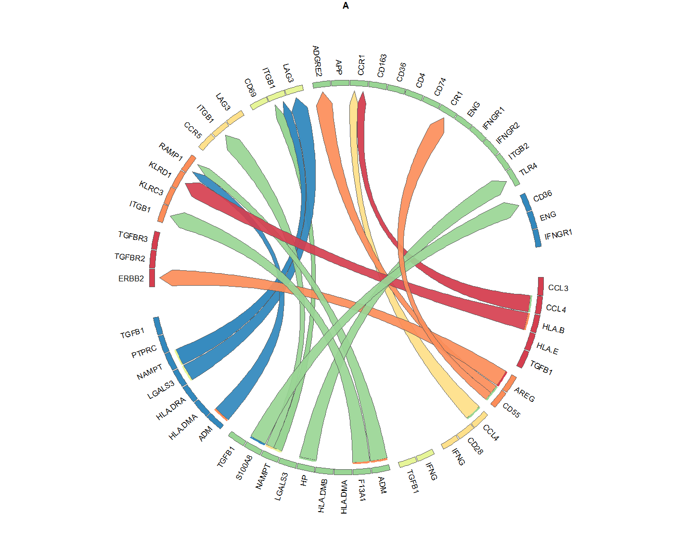<!-- -->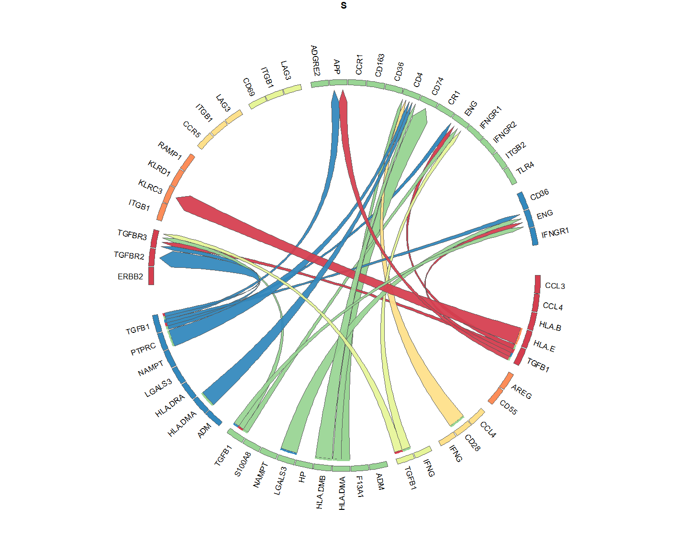<!-- -->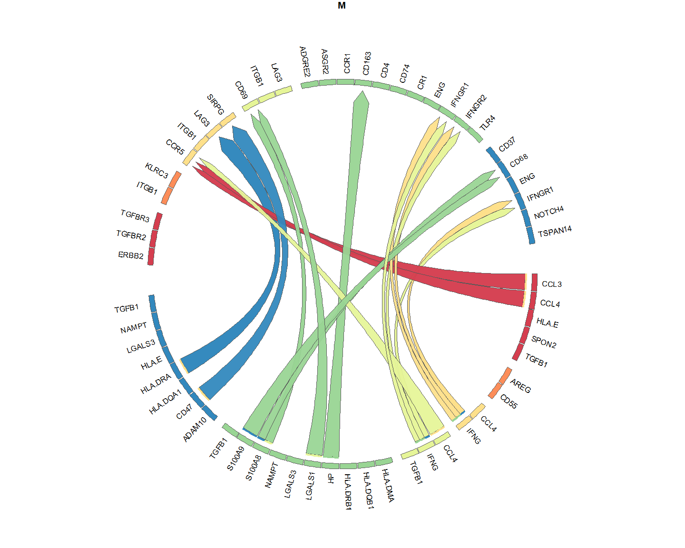<!-- --><!-- -->

## Visualization of scaled ligand-receptor pseudobulk products and ligand activity

Now we will visualize per sample the scaled product of ligand and
receptor expression. Samples that were left out of the DE analysis are
indicated with a smaller dot (this helps to indicate the samples that
did not contribute to the calculation of the logFC, and thus not
contributed to the final prioritization)

We will now check the top 50 interactions specific for the MIS-C group

``` r
group_oi = "M"
```

``` r
prioritized_tbl_oi_M_50 = get_top_n_lr_pairs(multinichenet_output$prioritization_tables, 50, groups_oi = group_oi)

plot_oi = make_sample_lr_prod_activity_plots(multinichenet_output$prioritization_tables, prioritized_tbl_oi_M_50)
plot_oi
```

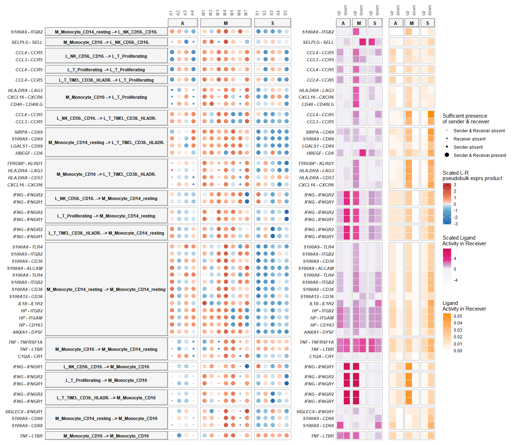<!-- -->

Typically, there are way more than 50 differentially expressed and
active ligand-receptor pairs per group across all sender-receiver
combinations. Therefore it might be useful to zoom in on specific cell
types as senders/receivers:

Eg M_Monocyte_CD16 as receiver:

``` r
prioritized_tbl_oi_M_50 = get_top_n_lr_pairs(multinichenet_output$prioritization_tables, 50, groups_oi = group_oi, receivers_oi = "M_Monocyte_CD16")

plot_oi = make_sample_lr_prod_activity_plots(multinichenet_output$prioritization_tables, prioritized_tbl_oi_M_50)
plot_oi
```

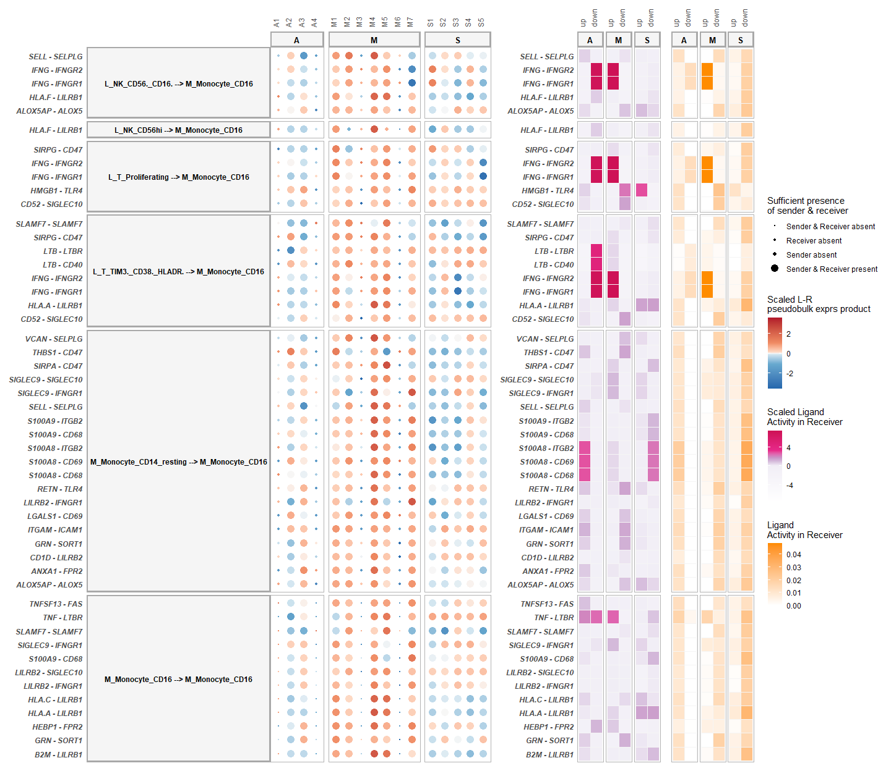<!-- -->

Eg M_Monocyte_CD16 as sender:

``` r
prioritized_tbl_oi_M_50 = get_top_n_lr_pairs(multinichenet_output$prioritization_tables, 50, groups_oi = group_oi, senders_oi = "M_Monocyte_CD16")

plot_oi = make_sample_lr_prod_activity_plots(multinichenet_output$prioritization_tables, prioritized_tbl_oi_M_50)
plot_oi
```

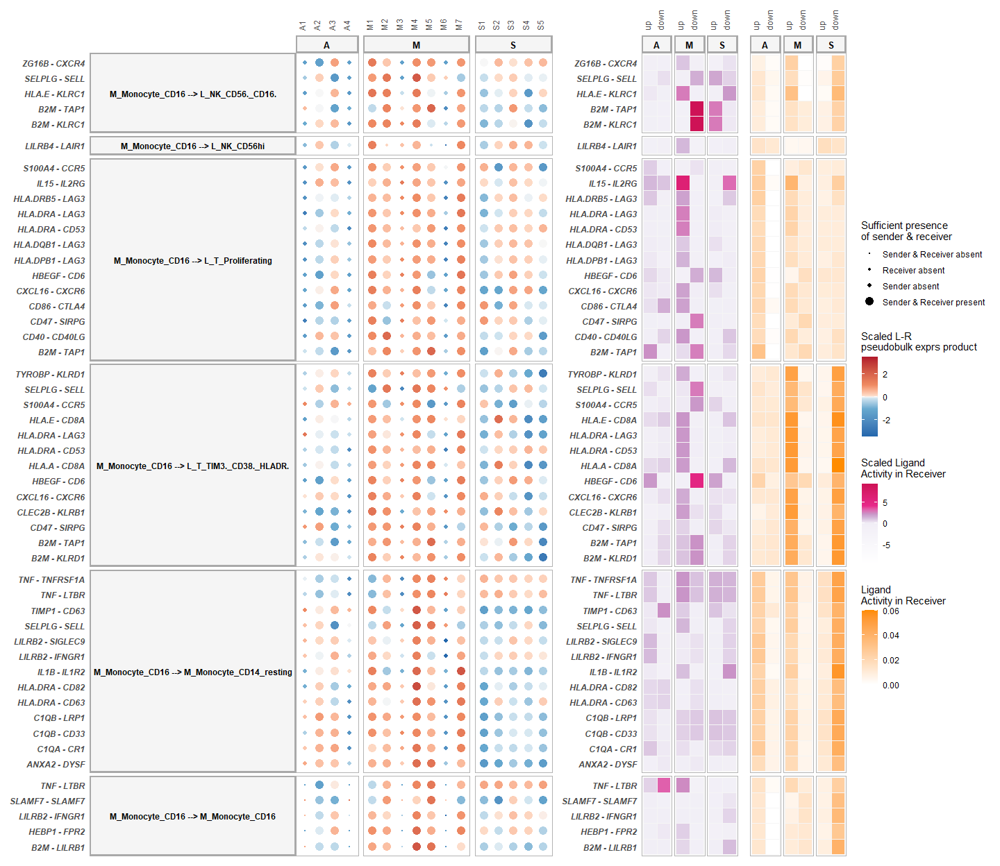<!-- -->

You can make these plots also for the other groups, like we will
illustrate now for the S group

``` r
group_oi = "S"
```

``` r
prioritized_tbl_oi_S_50 = get_top_n_lr_pairs(multinichenet_output$prioritization_tables, 50, groups_oi = group_oi)

plot_oi = make_sample_lr_prod_activity_plots(multinichenet_output$prioritization_tables, prioritized_tbl_oi_S_50)
plot_oi
```

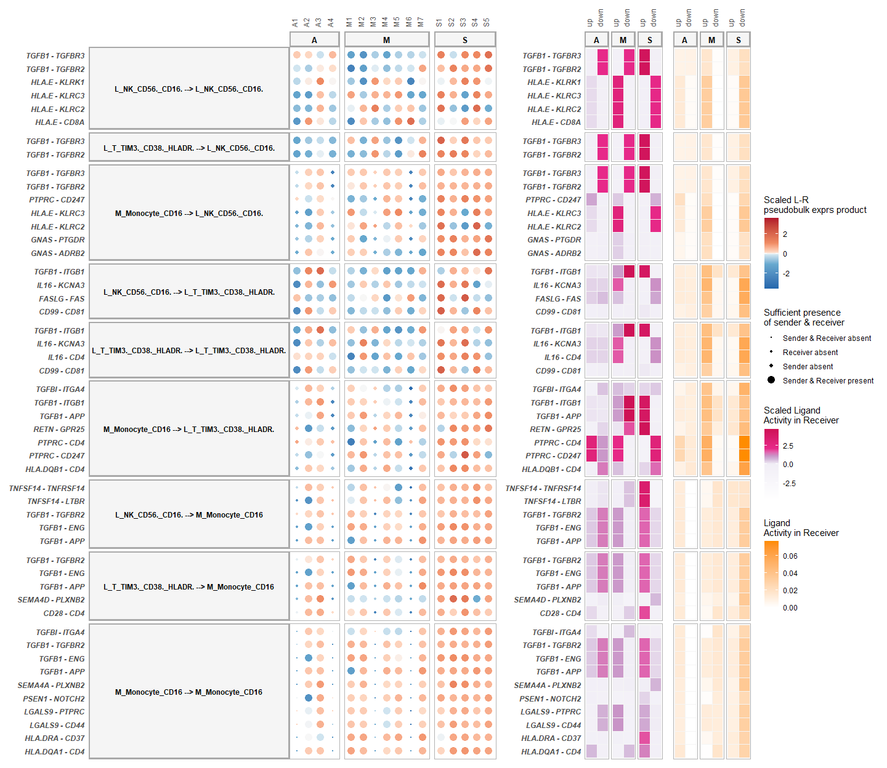<!-- -->

**Note**: Use `make_sample_lr_prod_activity_batch_plots` if you have
batches and want to visualize them on this plot!

## Visualization of ligand-activity, ligand-target links, and target gene expression

In another type of plot, we can visualize the ligand activities for a
group-receiver combination, and show the predicted ligand-target links,
and also the expression of the predicted target genes across samples.

For this, we now need to define a receiver cell type of interest. As
example, we will take `L_T_TIM3._CD38._HLADR.` cells as receiver, and
look at the top 20 senderLigand-receiverReceptor pairs with these cells
as receiver.

``` r
group_oi = "M"
receiver_oi = "L_T_TIM3._CD38._HLADR."
prioritized_tbl_oi_M_10 = get_top_n_lr_pairs(multinichenet_output$prioritization_tables, 10, groups_oi = group_oi, receivers_oi = receiver_oi)
```

``` r
combined_plot = make_ligand_activity_target_plot(group_oi, receiver_oi, prioritized_tbl_oi_M_10, multinichenet_output$prioritization_tables, multinichenet_output$ligand_activities_targets_DEgenes, contrast_tbl, multinichenet_output$grouping_tbl, multinichenet_output$celltype_info, ligand_target_matrix, plot_legend = FALSE)
combined_plot
## $combined_plot
```

<!-- -->

    ## 
    ## $legends

<!-- -->

**Note** Use `make_DEgene_dotplot_pseudobulk_batch` if you want to
indicate the batch of each sample to the plot

## Visualization of expression-correlated target genes of ligand-receptor pairs

Before, we had calculated the correlation in expression between
ligand-receptor pairs and DE genes. Now we will filter out correlated
ligand-receptor –\> target links that both show high expression
correlation (spearman or activity \> 0.50 in this example) and have some
prior knowledge to support their link.

``` r
group_oi = "M"
receiver_oi = "M_Monocyte_CD16"
lr_target_prior_cor_filtered = multinichenet_output$lr_target_prior_cor %>% inner_join(ligand_activities_targets_DEgenes$ligand_activities %>% distinct(ligand, target, direction_regulation, contrast)) %>% inner_join(contrast_tbl) %>% filter(group == group_oi, receiver == receiver_oi)
lr_target_prior_cor_filtered_up = lr_target_prior_cor_filtered %>% filter(direction_regulation == "up") %>% filter( (rank_of_target < top_n_target) & (pearson > 0.50 | spearman > 0.50))
lr_target_prior_cor_filtered_down = lr_target_prior_cor_filtered %>% filter(direction_regulation == "down") %>% filter( (rank_of_target < top_n_target) & (pearson < -0.50 | spearman < -0.50)) # downregulation -- negative correlation
lr_target_prior_cor_filtered = bind_rows(lr_target_prior_cor_filtered_up, lr_target_prior_cor_filtered_down)
```

Now we will visualize the top correlated target genes for the LR pairs
that are also in the top 50 LR pairs discriminating the groups from each
other:

``` r
prioritized_tbl_oi = get_top_n_lr_pairs(prioritization_tables, 50, groups_oi = group_oi, receivers_oi = receiver_oi)
```

``` r
lr_target_correlation_plot = make_lr_target_correlation_plot(multinichenet_output$prioritization_tables, prioritized_tbl_oi,  lr_target_prior_cor_filtered , multinichenet_output$grouping_tbl, multinichenet_output$celltype_info, receiver_oi,plot_legend = FALSE)
lr_target_correlation_plot$combined_plot
```

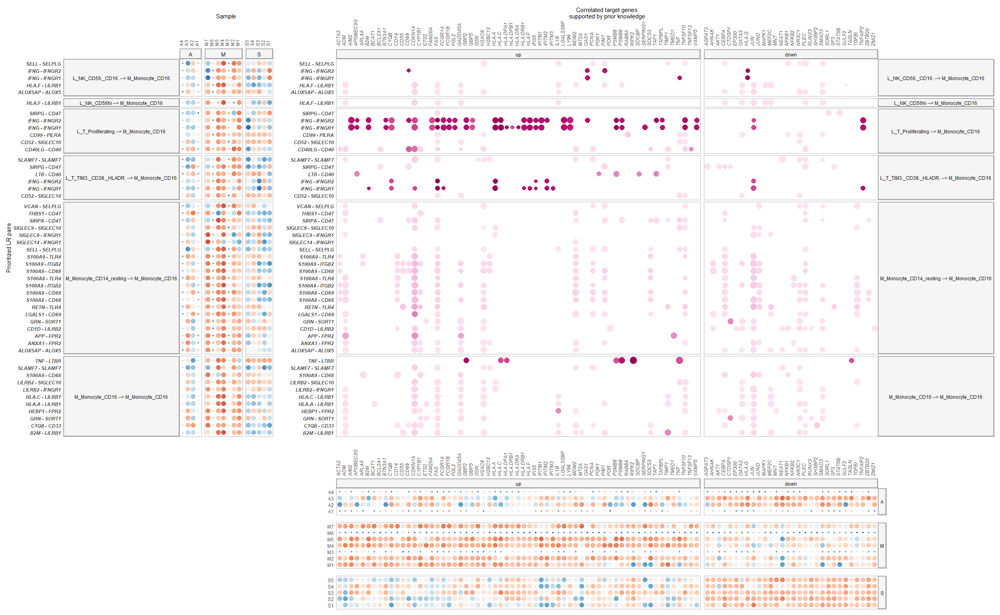<!-- -->

You can also visualize the expression correlation in the following way
for a selected LR pair and their targets:

``` r
ligand_oi = "IFNG"
receptor_oi = "IFNGR2"
sender_oi = "L_T_TIM3._CD38._HLADR."
receiver_oi = "M_Monocyte_CD16"
lr_target_scatter_plot = make_lr_target_scatter_plot(multinichenet_output$prioritization_tables, ligand_oi, receptor_oi, sender_oi, receiver_oi, multinichenet_output$celltype_info, multinichenet_output$grouping_tbl, lr_target_prior_cor_filtered)
lr_target_scatter_plot
```

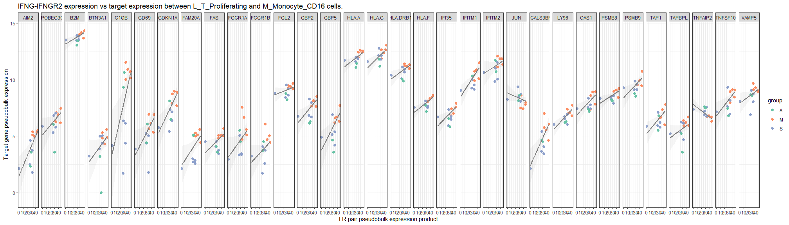<!-- -->

## Intercellular regulatory network systems view

In the plots before, we demonstrated that some DE genes have both
expression correlation and prior knowledge support to be downstream of
ligand-receptor pairs. Interestingly, some target genes can be ligands
or receptors themselves. This illustrates that cells can send signals to
other cells, who as a response to these signals produce signals
themselves to feedback to the original sender cells, or who will effect
other cell types.

As last plot, we can generate a ‘systems’ view of these intercellular
feedback and cascade processes than can be occuring between the
different cell populations involved. In this plot, we will draw links
between ligands of sender cell types their ligand/receptor-annotated
target genes in receiver cell types. So links are ligand-target links (=
gene regulatory links) and not ligand-receptor protein-protein
interactions!

``` r
prioritized_tbl_oi = get_top_n_lr_pairs(prioritization_tables, 150, rank_per_group = FALSE)

lr_target_prior_cor_filtered = prioritization_tables$group_prioritization_tbl$group %>% unique() %>% lapply(function(group_oi){
  lr_target_prior_cor_filtered = multinichenet_output$lr_target_prior_cor %>% inner_join(ligand_activities_targets_DEgenes$ligand_activities %>% distinct(ligand, target, direction_regulation, contrast)) %>% inner_join(contrast_tbl) %>% filter(group == group_oi)
  lr_target_prior_cor_filtered_up = lr_target_prior_cor_filtered %>% filter(direction_regulation == "up") %>% filter( (rank_of_target < top_n_target) & (pearson > 0.50 | spearman > 0.50))
  lr_target_prior_cor_filtered_down = lr_target_prior_cor_filtered %>% filter(direction_regulation == "down") %>% filter( (rank_of_target < top_n_target) & (pearson < -0.50 | spearman < -0.50))
  lr_target_prior_cor_filtered = bind_rows(lr_target_prior_cor_filtered_up, lr_target_prior_cor_filtered_down)
}) %>% bind_rows()
```

``` r
colors_sender["L_T_TIM3._CD38._HLADR."] = "pink" # the  original yellow background color with white font is not very readable
graph_plot = make_ggraph_ligand_target_links(lr_target_prior_cor_filtered = lr_target_prior_cor_filtered, prioritized_tbl_oi = prioritized_tbl_oi, colors = colors_sender)
graph_plot$plot
```

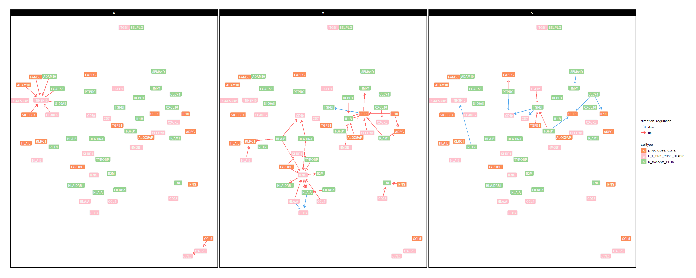<!-- -->

``` r
graph_plot$source_df_lt %>% head()
## # A tibble: 6 x 6
##   sender                          receiver                       direction_regulation group type          weight
##   <chr>                           <chr>                          <fct>                <chr> <chr>          <dbl>
## 1 M_Monocyte_CD16_S100A8          L_T_TIM3._CD38._HLADR._TNFSF10 up                   A     Ligand-Target      1
## 2 M_Monocyte_CD16_LGALS3          L_T_TIM3._CD38._HLADR._TNFSF10 up                   A     Ligand-Target      1
## 3 L_T_TIM3._CD38._HLADR._LGALS3BP L_T_TIM3._CD38._HLADR._TNFSF10 up                   A     Ligand-Target      1
## 4 L_T_TIM3._CD38._HLADR._CD40LG   L_T_TIM3._CD38._HLADR._TNFSF10 up                   A     Ligand-Target      1
## 5 M_Monocyte_CD16_ADAM10          L_T_TIM3._CD38._HLADR._TNFSF10 up                   A     Ligand-Target      1
## 6 L_NK_CD56._CD16._ADAM10         L_T_TIM3._CD38._HLADR._TNFSF10 up                   A     Ligand-Target      1
graph_plot$nodes_df %>% head()
##                                                            node               celltype     gene type_gene
## M_Monocyte_CD16_S100A8                   M_Monocyte_CD16_S100A8        M_Monocyte_CD16   S100A8    ligand
## M_Monocyte_CD16_LGALS3                   M_Monocyte_CD16_LGALS3        M_Monocyte_CD16   LGALS3    ligand
## L_T_TIM3._CD38._HLADR._LGALS3BP L_T_TIM3._CD38._HLADR._LGALS3BP L_T_TIM3._CD38._HLADR. LGALS3BP    ligand
## L_T_TIM3._CD38._HLADR._CD40LG     L_T_TIM3._CD38._HLADR._CD40LG L_T_TIM3._CD38._HLADR.   CD40LG    ligand
## M_Monocyte_CD16_ADAM10                   M_Monocyte_CD16_ADAM10        M_Monocyte_CD16   ADAM10    ligand
## L_NK_CD56._CD16._ADAM10                 L_NK_CD56._CD16._ADAM10       L_NK_CD56._CD16.   ADAM10    ligand
```
