<style type="text/css">
.smaller {
  font-size: 10px
}
</style>

<!-- github markdown built using
rmarkdown::render("vignettes/basic_analysis_steps_MISC_SACL.Rmd", clean = FALSE )
-->


In this vignette, you can learn how to perform a sample-agnostic/cell-level MultiNicheNet analysis to compare cell-cell communication between conditions of interest. In this workflow, cells from the same condition will be pooled together similar to regular differential cell-cell communication workflows. **We only recommend running this pipeline if you have less than 3 samples in each of the groups/conditions you want to compare. Do not run this workflow if you have more samples per condition.** 

As input you need a SingleCellExperiment object containing at least the raw count matrix and metadata providing the following information for each cell: the **group**, **sample** and **cell type**.

As example expression data of interacting cells, we will here use scRNAseq data of immune cells in MIS-C patients and healthy siblings from this paper of Hoste et al.: [TIM3+ TRBV11-2 T cells and IFNγ signature in patrolling monocytes and CD16+ NK cells delineate MIS-C](https://rupress.org/jem/article/219/2/e20211381/212918/TIM3-TRBV11-2-T-cells-and-IFN-signature-in) [](https://doi.org/10.5281/zenodo.6362434). 
MIS-C (multisystem inflammatory syndrome in children) is a novel rare immunodysregulation syndrome that can arise after SARS-CoV-2 infection in children. We will use MultiNicheNet to explore immune cell crosstalk enriched in MIS-C compared to healthy siblings and adult COVID-19 patients. 

In this vignette, we will first prepare the MultiNicheNet core analysis, then run the several steps in the MultiNicheNet core analysis, and finally interpret the output.

# Preparation of the MultiNicheNet core analysis


```r
library(SingleCellExperiment)
library(dplyr)
library(ggplot2)
library(nichenetr)
library(multinichenetr)
```

## Load NicheNet's ligand-receptor network and ligand-target matrix

MultiNicheNet builds upon the NicheNet framework and uses the same prior knowledge networks (ligand-receptor network and ligand-target matrix, currently v2 version).

The Nichenet v2 networks and matrices for both mouse and human can be downloaded from Zenodo [](https://doi.org/10.5281/zenodo.7074291). 

We will read these object in for human because our expression data is of human patients. 
Gene names are here made syntactically valid via `make.names()` to avoid the loss of genes (eg H2-M3) in downstream visualizations.


```r
organism = "human"
```


```r
options(timeout = 120)

if(organism == "human"){
  
  lr_network_all = 
    readRDS(url(
      "https://zenodo.org/record/10229222/files/lr_network_human_allInfo_30112033.rds"
      )) %>% 
    mutate(
      ligand = convert_alias_to_symbols(ligand, organism = organism), 
      receptor = convert_alias_to_symbols(receptor, organism = organism))
  
  lr_network_all = lr_network_all  %>% 
    mutate(ligand = make.names(ligand), receptor = make.names(receptor)) 
  
  lr_network = lr_network_all %>% 
    distinct(ligand, receptor)
  
  ligand_target_matrix = readRDS(url(
    "https://zenodo.org/record/7074291/files/ligand_target_matrix_nsga2r_final.rds"
    ))
  
  colnames(ligand_target_matrix) = colnames(ligand_target_matrix) %>% 
    convert_alias_to_symbols(organism = organism) %>% make.names()
  rownames(ligand_target_matrix) = rownames(ligand_target_matrix) %>% 
    convert_alias_to_symbols(organism = organism) %>% make.names()
  
  lr_network = lr_network %>% filter(ligand %in% colnames(ligand_target_matrix))
  ligand_target_matrix = ligand_target_matrix[, lr_network$ligand %>% unique()]
  
} else if(organism == "mouse"){
  
  lr_network_all = readRDS(url(
    "https://zenodo.org/record/10229222/files/lr_network_mouse_allInfo_30112033.rds"
    )) %>% 
    mutate(
      ligand = convert_alias_to_symbols(ligand, organism = organism), 
      receptor = convert_alias_to_symbols(receptor, organism = organism))
  
  lr_network_all = lr_network_all  %>% 
    mutate(ligand = make.names(ligand), receptor = make.names(receptor)) 
  lr_network = lr_network_all %>% 
    distinct(ligand, receptor)
  
  ligand_target_matrix = readRDS(url(
    "https://zenodo.org/record/7074291/files/ligand_target_matrix_nsga2r_final_mouse.rds"
    ))
  
  colnames(ligand_target_matrix) = colnames(ligand_target_matrix) %>% 
    convert_alias_to_symbols(organism = organism) %>% make.names()
  rownames(ligand_target_matrix) = rownames(ligand_target_matrix) %>% 
    convert_alias_to_symbols(organism = organism) %>% make.names()
  
  lr_network = lr_network %>% filter(ligand %in% colnames(ligand_target_matrix))
  ligand_target_matrix = ligand_target_matrix[, lr_network$ligand %>% unique()]
  
}
```

## Read in SingleCellExperiment Object

In this vignette, we will load in a subset of the scRNAseq data of the MIS-C [](https://doi.org/10.5281/zenodo.8010790). For the sake of demonstration, this subset only contains 3 cell types. These celltypes are some of the cell types that were found to be most interesting related to MIS-C according to Hoste et al. 

If you start from a Seurat object, you can convert it easily to a SingleCellExperiment object via `sce = Seurat::as.SingleCellExperiment(seurat_obj, assay = "RNA")`.

Because the NicheNet 2.0. networks are in the most recent version of the official gene symbols, we will make sure that the gene symbols used in the expression data are also updated (= converted from their "aliases" to official gene symbols). Afterwards, we will make them again syntactically valid. 


```r
sce = readRDS(url(
  "https://zenodo.org/record/8010790/files/sce_subset_misc.rds"
  ))
sce = alias_to_symbol_SCE(sce, "human") %>% makenames_SCE()
```
This dataset does not yet contain normalized counts:


```r
sce = scuttle::logNormCounts(sce)
```

## Prepare the settings of the MultiNicheNet cell-cell communication analysis

In this step, we will formalize our research question into MultiNicheNet input arguments.

### Define in which metadata columns we can find the **group**, **sample** and **cell type** IDs

In this case study, we want to study differences in cell-cell communication patterns between MIS-C patients (M), their healthy siblings (S) and adult patients with severe covid (A). The meta data columns that indicate this disease status(=group/condition of interest) is `MIS.C.AgeTier`. 

Cell type annotations are indicated in the `Annotation_v2.0` column, and the sample is indicated by the `ShortID` column. 
If your cells are annotated in multiple hierarchical levels, we recommend using a relatively high level in the hierarchy because MultiNicheNet focuses on differential expression and not differential abundance


```r
group_id = "MIS.C.AgeTier"
sample_id = "ShortID"
celltype_id = "Annotation_v2.0"
```

In the sammple-agnostic / cell-level worklow, it is not possible to correct for batch effects or covariates. Therefore, you here have to use the following NA settings:


```r
covariates = NA
batches = NA
```

__Important__: The column names of group, sample, and cell type should be syntactically valid (`make.names`)

__Important__: All group, sample, and cell type names should be syntactically valid as well (`make.names`) (eg through `SummarizedExperiment::colData(sce)$ShortID = SummarizedExperiment::colData(sce)$ShortID %>% make.names()`)

### Define the contrasts of interest.

Here, we want to compare each patient group to the other groups, so the MIS-C (M) group vs healthy control siblings (S) and adult COVID19 patients (A) (= M vs S+A) and so on. We want to know which cell-cell communication patterns are specific for the M vs A+S group, the A vs M+S group and the S vs A+M group. 

To perform this comparison, we need to set the following contrasts:


```r
contrasts_oi = c("'M-(S+A)/2','S-(M+A)/2','A-(S+M)/2'")
```

__Very Important__ Note the format to indicate the contrasts! This formatting should be adhered to very strictly, and white spaces are not allowed! Check `?get_DE_info` for explanation about how to define this well. The most important points are that: 
*each contrast is surrounded by single quotation marks
*contrasts are separated by a comma without any white space 
*all contrasts together are surrounded by double quotation marks. 

If you compare against two groups, you should divide by 2 (as demonstrated here), if you compare against three groups, you should divide by 3 and so on.

For downstream visualizations and linking contrasts to their main condition, we also need to run the following:
This is necessary because we will also calculate cell-type+condition specificity of ligands and receptors. 


```r
contrast_tbl = tibble(contrast = 
                        c("M-(S+A)/2","S-(M+A)/2", "A-(S+M)/2"), 
                      group = c("M","S","A"))
```

If you want to compare only two groups (eg M vs S), you can use the following:
`contrasts_oi = c("'M-S','S-M'") `
`contrast_tbl = tibble(contrast = c("M-S","S-M"), group = c("M","S"))`

### Define the sender and receiver cell types of interest.

If you want to focus the analysis on specific cell types (e.g. because you know which cell types reside in the same microenvironments based on spatial data), you can define this here. If you have sufficient computational resources and no specific idea of cell-type colocalzations, we recommend to consider all cell types as potential senders and receivers. Later on during analysis of the output it is still possible to zoom in on the cell types that interest you most, but your analysis is not biased to them.

Here we will consider all cell types in the data:


```r
senders_oi = SummarizedExperiment::colData(sce)[,celltype_id] %>% unique()
receivers_oi = SummarizedExperiment::colData(sce)[,celltype_id] %>% unique()
sce = sce[, SummarizedExperiment::colData(sce)[,celltype_id] %in% 
            c(senders_oi, receivers_oi)
          ]
```

In case you would have samples in your data that do not belong to one of the groups/conditions of interest, we recommend removing them and only keeping conditions of interst:


```r
conditions_keep = c("M", "S", "A")
sce = sce[, SummarizedExperiment::colData(sce)[,group_id] %in% 
            conditions_keep
          ]
```
# Running the MultiNicheNet core analysis

Now we will run the core of a MultiNicheNet analysis. This analysis consists of the following steps:

* 1. Cell-type filtering: determine which cell types are sufficiently present
* 2. Gene filtering: determine which genes are sufficiently expressed in each present cell type
* 3. Pseudobulk expression calculation: determine and normalize per-sample pseudobulk expression levels for each expressed gene in each present cell type
* 4. Differential expression (DE) analysis: determine which genes are differentially expressed
* 5. Ligand activity prediction: use the DE analysis output to predict the activity of ligands in receiver cell types and infer their potential target genes
* 6. Prioritization: rank cell-cell communication patterns through multi-criteria prioritization

Following these steps, one can optionally 
* 7. Calculate the across-samples expression correlation between ligand-receptor pairs and target genes
* 8. Prioritize communication patterns involving condition-specific cell types through an alternative prioritization scheme

After these steps, the output can be further explored as we will demonstrate in the "Downstream analysis of the MultiNicheNet output" section. 

In this vignette, we will demonstrate these steps one-by-one, which offers the most flexibility to the user to assess intermediary results. Other vignettes will demonstrate the use of the `multi_nichenet_analysis` wrapper function.

## Cell-type filtering: determine which cell types are sufficiently present

In this step we will calculate and visualize cell type abundances. This will give an indication about which cell types will be retained in the analysis, and which cell types will be filtered out.  

In the following analysis we will a required minimum number of cells per cell type per condition at 25 Conditions that have less than `min_cells` cells will be excluded from the analysis for that specific cell type.
 

```r
min_cells = 25
```


```r
abundance_info = get_abundance_info(
  sce = sce, 
  sample_id = group_id, group_id = group_id, celltype_id = celltype_id, 
  min_cells = min_cells, 
  senders_oi = senders_oi, receivers_oi = receivers_oi, 
  batches = batches
  )
```

You see here that we set `sample_id = group_id`. This is not a mistake. Why do we do this: we use the regular MultiNicheNet code to get cell type abundances per samples and groups. Because we will ignore sample-level information in this vignette, we will set this parameter to the condition/group ID and not the sample ID.

First, we will check the cell type abundance diagnostic plots.

### Interpretation of cell type abundance information

The first plot visualizes the number of cells per celltype-condition combination, and indicates which combinations are removed during the DE analysis because there are less than `min_cells` in the celltype-condition combination. 


```r
abundance_info$abund_plot_sample
```

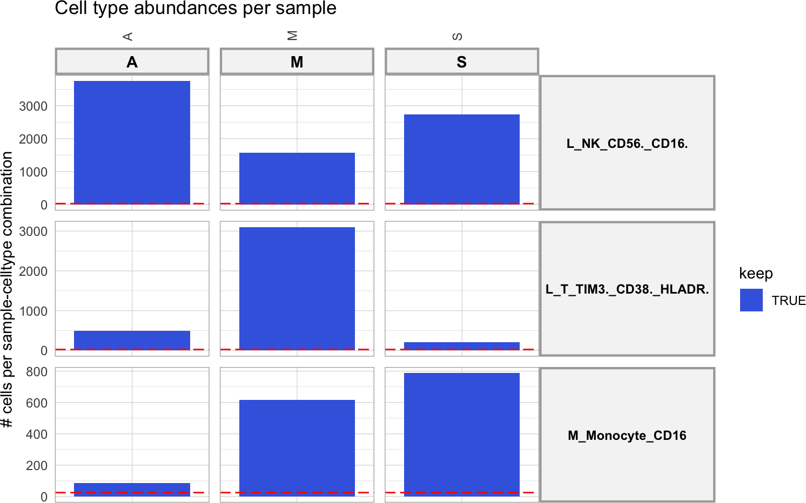

The red dotted line indicates the required minimum of cells as defined above in `min_cells`. We can see here that all cell types are present in all conditions. 

### Cell type filtering based on cell type abundance information

In case this plot would indicate that not all cell types are present in all conditions:
running the following block of code can help you determine which cell types are condition-specific and which cell types are absent. 


```r
sample_group_celltype_df = abundance_info$abundance_data %>% 
  filter(n > min_cells) %>% 
  ungroup() %>% 
  distinct(sample_id, group_id) %>% 
  cross_join(
    abundance_info$abundance_data %>% 
      ungroup() %>% 
      distinct(celltype_id)
    ) %>% 
  arrange(sample_id)

abundance_df = sample_group_celltype_df %>% left_join(
  abundance_info$abundance_data %>% ungroup()
  )

abundance_df$n[is.na(abundance_df$n)] = 0
abundance_df$keep[is.na(abundance_df$keep)] = FALSE
abundance_df_summarized = abundance_df %>% 
  mutate(keep = as.logical(keep)) %>% 
  group_by(group_id, celltype_id) %>% 
  summarise(samples_present = sum((keep)))

celltypes_absent_one_condition = abundance_df_summarized %>% 
  filter(samples_present == 0) %>% pull(celltype_id) %>% unique() 
# find truly condition-specific cell types by searching for cell types 
# truely absent in at least one condition

celltypes_present_one_condition = abundance_df_summarized %>% 
  filter(samples_present >= 1) %>% pull(celltype_id) %>% unique() 
# require presence in at least 1 samples  of one group so 
# it is really present in at least one condition

condition_specific_celltypes = intersect(
  celltypes_absent_one_condition, 
  celltypes_present_one_condition)

total_nr_conditions = SummarizedExperiment::colData(sce)[,group_id] %>% 
  unique() %>% length() 

absent_celltypes = abundance_df_summarized %>% 
  filter(samples_present < 1) %>% 
  group_by(celltype_id) %>% 
  count() %>% 
  filter(n == total_nr_conditions) %>% 
  pull(celltype_id)
  
print("condition-specific celltypes:")
## [1] "condition-specific celltypes:"
print(condition_specific_celltypes)
## character(0)
  
print("absent celltypes:")
## [1] "absent celltypes:"
print(absent_celltypes)
## character(0)
```
Absent cell types will be filtered out, condition-specific cell types can be filtered out if you as a user do not want to run the alternative workflow for condition-specific cell types at the end of the core MultiNicheNet analysis. 


```r
analyse_condition_specific_celltypes = FALSE
```


```r
if(analyse_condition_specific_celltypes == TRUE){
  senders_oi = senders_oi %>% setdiff(absent_celltypes)
  receivers_oi = receivers_oi %>% setdiff(absent_celltypes)
} else {
  senders_oi = senders_oi %>% 
    setdiff(union(absent_celltypes, condition_specific_celltypes))
  receivers_oi = receivers_oi %>% 
    setdiff(union(absent_celltypes, condition_specific_celltypes))
}

sce = sce[, SummarizedExperiment::colData(sce)[,celltype_id] %in% 
            c(senders_oi, receivers_oi)
          ]
```

## Gene filtering: determine which genes are sufficiently expressed in each present cell type

Before running the DE analysis, we will determine which genes are not sufficiently expressed and should be filtered out. 
We will perform gene filtering based on a similar procedure as used in `edgeR::filterByExpr`. However, we adapted this procedure to be more interpretable for single-cell datasets.  

For each cell type, we will consider genes expressed if they are expressed in at least one condition. To do this, we need to set `min_sample_prop = 1`. 


```r
min_sample_prop = 1
```

But how do we define which genes are expressed in a condition? For this we will consider genes as expressed if they have non-zero expression values in a `fraction_cutoff` fraction of cells of that cell type in that condition By default, we set `fraction_cutoff = 0.05`, which means that genes should show non-zero expression values in at least 5% of cells in a condition 


```r
fraction_cutoff = 0.05
```

We recommend using these default values unless there is specific interest in prioritizing (very) weakly expressed interactions. In that case, you could lower the value of `fraction_cutoff`. We explicitly recommend against using `fraction_cutoff > 0.10`.

Now we will calculate the information required for gene filtering with the following command:


```r
frq_list = get_frac_exprs_sampleAgnostic(
  sce = sce, 
  sample_id = sample_id, celltype_id = celltype_id, group_id = group_id, 
  batches = batches, 
  min_cells = min_cells, 
  fraction_cutoff = fraction_cutoff, min_sample_prop = min_sample_prop)
## # A tibble: 6 × 2
##   MIS.C.AgeTier Annotation_v2.0       
##   <chr>         <chr>                 
## 1 M             L_T_TIM3._CD38._HLADR.
## 2 M             L_T_TIM3._CD38._HLADR.
## 3 M             L_T_TIM3._CD38._HLADR.
## 4 M             L_T_TIM3._CD38._HLADR.
## 5 M             L_T_TIM3._CD38._HLADR.
## 6 M             L_T_TIM3._CD38._HLADR.
##   MIS.C.AgeTier MIS.C.AgeTier        Annotation_v2.0
## 1             M             M L_T_TIM3._CD38._HLADR.
## 2             M             M L_T_TIM3._CD38._HLADR.
## 3             M             M L_T_TIM3._CD38._HLADR.
## 4             M             M L_T_TIM3._CD38._HLADR.
## 5             M             M L_T_TIM3._CD38._HLADR.
## 6             M             M L_T_TIM3._CD38._HLADR.
##   sample group               celltype
## 1      M     M L_T_TIM3._CD38._HLADR.
## 2      M     M L_T_TIM3._CD38._HLADR.
## 3      M     M L_T_TIM3._CD38._HLADR.
## 4      M     M L_T_TIM3._CD38._HLADR.
## 5      M     M L_T_TIM3._CD38._HLADR.
## 6      M     M L_T_TIM3._CD38._HLADR.
## # A tibble: 6 × 3
##   sample group celltype              
##   <chr>  <chr> <chr>                 
## 1 M      M     L_T_TIM3._CD38._HLADR.
## 2 M      M     L_T_TIM3._CD38._HLADR.
## 3 M      M     L_T_TIM3._CD38._HLADR.
## 4 M      M     L_T_TIM3._CD38._HLADR.
## 5 M      M     L_T_TIM3._CD38._HLADR.
## 6 M      M     L_T_TIM3._CD38._HLADR.
## [1] "Groups are considered if they have more than 25 cells of the cell type of interest"
## [1] "Genes with non-zero counts in at least 5% of cells of a cell type of interest in a particular group/condition will be considered as expressed in that group/condition"
## [1] "Genes expressed in at least 1 group will considered as expressed in the cell type: L_NK_CD56._CD16."
## [1] "Genes expressed in at least 1 group will considered as expressed in the cell type: L_T_TIM3._CD38._HLADR."
## [1] "Genes expressed in at least 1 group will considered as expressed in the cell type: M_Monocyte_CD16"
## [1] "5589 genes are considered as expressed in the cell type: L_NK_CD56._CD16."
## [1] "7150 genes are considered as expressed in the cell type: L_T_TIM3._CD38._HLADR."
## [1] "7794 genes are considered as expressed in the cell type: M_Monocyte_CD16"
```
Now only keep genes that are expressed by at least one cell type:


```r
genes_oi = frq_list$expressed_df %>% 
  filter(expressed == TRUE) %>% pull(gene) %>% unique() 
sce = sce[genes_oi, ]
```

## Expression calculation: determine and normalize expression levels for each expressed gene in each present cell type

After filtering out absent cell types and genes, we will continue the analysis by calculating the different prioritization criteria that we will use to prioritize cell-cell communication patterns.

First, we will determine and normalize per-condition pseudobulk expression levels for each expressed gene in each present cell type. The function `process_abundance_expression_info` will link this expression information for ligands of the sender cell types to the corresponding receptors of the receiver cell types. This will later on allow us to define the cell-type specicificy criteria for ligands and receptors.


```r
abundance_expression_info = process_abundance_expression_info(
  sce = sce, 
  sample_id = group_id, group_id = group_id, celltype_id = celltype_id, 
  min_cells = min_cells, 
  senders_oi = senders_oi, receivers_oi = receivers_oi, 
  lr_network = lr_network, 
  batches = batches, 
  frq_list = frq_list, 
  abundance_info = abundance_info)
```

You see here that we again set `sample_id = group_id`. This is not a mistake. Why do we do this: we use the regular MultiNicheNet code to get cell type abundances per samples and groups. Because we will ignore sample-level information in this vignette, we will set this parameter to the condition/group ID and not the sample ID.

Normalized pseudobulk expression values per gene/celltype/condition can be inspected by:


```r
abundance_expression_info$celltype_info$pb_df %>% head()
## # A tibble: 6 × 4
##   gene  sample pb_sample celltype              
##   <chr> <chr>      <dbl> <fct>                 
## 1 A1BG  A           3.97 L_T_TIM3._CD38._HLADR.
## 2 AAAS  A           5.00 L_T_TIM3._CD38._HLADR.
## 3 AAGAB A           4.77 L_T_TIM3._CD38._HLADR.
## 4 AAK1  A           6.78 L_T_TIM3._CD38._HLADR.
## 5 AAMDC A           4.11 L_T_TIM3._CD38._HLADR.
## 6 AAMP  A           5.84 L_T_TIM3._CD38._HLADR.
```

Inspecting these values for ligand-receptor interactions can be done by:


```r
abundance_expression_info$sender_receiver_info$pb_df %>% head()
## # A tibble: 6 × 8
##   sample sender                 receiver         ligand receptor pb_ligand pb_receptor ligand_receptor_pb_prod
##   <chr>  <chr>                  <chr>            <chr>  <chr>        <dbl>       <dbl>                   <dbl>
## 1 M      L_NK_CD56._CD16.       M_Monocyte_CD16  B2M    LILRB1        14.1       10.3                     145.
## 2 M      L_T_TIM3._CD38._HLADR. M_Monocyte_CD16  B2M    LILRB1        13.9       10.3                     143.
## 3 M      M_Monocyte_CD16        M_Monocyte_CD16  B2M    LILRB1        13.8       10.3                     143.
## 4 A      L_NK_CD56._CD16.       L_NK_CD56._CD16. B2M    KLRD1         14.4        9.73                    140.
## 5 S      L_NK_CD56._CD16.       L_NK_CD56._CD16. B2M    KLRD1         14.4        9.55                    138.
## 6 M      L_NK_CD56._CD16.       L_NK_CD56._CD16. B2M    KLRD1         14.1        9.62                    135.
```

## Differential expression (DE) analysis: determine which genes are differentially expressed

In this step, we will perform genome-wide differential expression analysis of receiver and sender cell types to define DE genes between the conditions of interest (as formalized by the `contrasts_oi`). Based on this analysis, we later can define the levels of differential expression of ligands in senders and receptors in receivers, and define the set of affected target genes in the receiver cell types (which will be used for the ligand activity analysis).

Because we don't have several samples per condition, we cannot apply pseudobulking followed by EdgeR as done in the regular MultiNicheNet workflow. Instead, we will here perform a classic FindMarkers approach. This has as consequence that you cannot perform DE on multifactorial experimental designs. You can only compare one group vs other group(s).  


```r
DE_info = get_DE_info_sampleAgnostic(
  sce = sce, 
  group_id = group_id, celltype_id = celltype_id, 
  contrasts_oi = contrasts_oi, 
  expressed_df = frq_list$expressed_df, 
  min_cells = min_cells, 
  contrast_tbl = contrast_tbl)
```

### Check DE results

Check DE output information in table with logFC and p-values for each gene-celltype-contrast:


```r
celltype_de = DE_info$celltype_de_findmarkers
```


```r
celltype_de %>% arrange(-logFC) %>% head()
## # A tibble: 6 × 6
##   gene     cluster_id             logFC     p_val     p_adj contrast 
##   <chr>    <chr>                  <dbl>     <dbl>     <dbl> <chr>    
## 1 TRBV11.2 L_T_TIM3._CD38._HLADR.  2.63 0         0         M-(S+A)/2
## 2 MTRNR2L8 M_Monocyte_CD16         2.22 1.24e- 34 1.16e- 32 S-(M+A)/2
## 3 IFI27    M_Monocyte_CD16         2.12 5.86e- 23 5.07e- 20 A-(S+M)/2
## 4 NKG7     L_T_TIM3._CD38._HLADR.  2.02 3.16e- 87 2.51e- 84 M-(S+A)/2
## 5 GZMB     L_T_TIM3._CD38._HLADR.  1.88 1.59e-122 3.80e-119 M-(S+A)/2
## 6 GNLY     L_T_TIM3._CD38._HLADR.  1.67 6.38e- 50 2.07e- 47 M-(S+A)/2
```

### Combine DE information for ligand-senders and receptors-receivers

To end this step, we will combine the DE information of senders and receivers by linking their ligands and receptors together based on the prior knowledge ligand-receptor network.


```r
sender_receiver_de = combine_sender_receiver_de(
  sender_de = celltype_de,
  receiver_de = celltype_de,
  senders_oi = senders_oi,
  receivers_oi = receivers_oi,
  lr_network = lr_network
)
```


```r
sender_receiver_de %>% head(20)
## # A tibble: 20 × 12
##    contrast  sender                 receiver               ligand  receptor lfc_ligand lfc_receptor ligand_receptor_lfc_avg p_val_ligand p_adj_ligand p_val_receptor p_adj_receptor
##    <chr>     <chr>                  <chr>                  <chr>   <chr>         <dbl>        <dbl>                   <dbl>        <dbl>        <dbl>          <dbl>          <dbl>
##  1 M-(S+A)/2 M_Monocyte_CD16        M_Monocyte_CD16        HLA.A   LILRB1        0.880       1.32                     1.10     3.24e-121    2.52e-117      1.88e-105      3.66e-102
##  2 M-(S+A)/2 L_T_TIM3._CD38._HLADR. M_Monocyte_CD16        GZMB    MCL1          1.88        0.184                    1.03     1.59e-122    3.80e-119      9.58e-  6      5.50e-  5
##  3 M-(S+A)/2 M_Monocyte_CD16        M_Monocyte_CD16        TIMP1   CD63          1.02        1.03                     1.03     1.21e- 77    9.43e- 75      1.37e- 86      1.53e- 83
##  4 M-(S+A)/2 M_Monocyte_CD16        M_Monocyte_CD16        B2M     LILRB1        0.706       1.32                     1.01     1.70e-117    6.64e-114      1.88e-105      3.66e-102
##  5 A-(S+M)/2 M_Monocyte_CD16        M_Monocyte_CD16        TIMP1   CD63          1.05        0.958                    1.00     6.42e- 14    9.62e- 12      7.64e- 15      1.40e- 12
##  6 M-(S+A)/2 L_T_TIM3._CD38._HLADR. M_Monocyte_CD16        HLA.C   LILRB1        0.673       1.32                     0.997    2.15e- 90    2.20e- 87      1.88e-105      3.66e-102
##  7 M-(S+A)/2 L_T_TIM3._CD38._HLADR. L_T_TIM3._CD38._HLADR. GZMB    MCL1          1.88        0.0908                   0.984    1.59e-122    3.80e-119      2.79e-  3      1.19e-  2
##  8 M-(S+A)/2 L_T_TIM3._CD38._HLADR. L_NK_CD56._CD16.       GZMB    IGF2R         1.88        0.0769                   0.977    1.59e-122    3.80e-119      1.68e-  6      8.89e-  6
##  9 M-(S+A)/2 L_T_TIM3._CD38._HLADR. M_Monocyte_CD16        GZMB    IGF2R         1.88        0.0723                   0.975    1.59e-122    3.80e-119      2.82e-  6      1.79e-  5
## 10 M-(S+A)/2 L_T_TIM3._CD38._HLADR. M_Monocyte_CD16        HLA.A   LILRB1        0.628       1.32                     0.975    7.14e- 80    4.64e- 77      1.88e-105      3.66e-102
## 11 M-(S+A)/2 L_T_TIM3._CD38._HLADR. L_NK_CD56._CD16.       GZMB    MCL1          1.88        0.0618                   0.969    1.59e-122    3.80e-119      4.95e-  3      1.11e-  2
## 12 M-(S+A)/2 L_T_TIM3._CD38._HLADR. L_T_TIM3._CD38._HLADR. GZMB    IGF2R         1.88        0.0384                   0.958    1.59e-122    3.80e-119      9.12e-  2      1.86e-  1
## 13 M-(S+A)/2 M_Monocyte_CD16        M_Monocyte_CD16        HLA.C   LILRB1        0.520       1.32                     0.921    7.30e- 46    1.07e- 43      1.88e-105      3.66e-102
## 14 M-(S+A)/2 M_Monocyte_CD16        M_Monocyte_CD16        HLA.B   LILRB1        0.470       1.32                     0.896    3.83e- 42    4.74e- 40      1.88e-105      3.66e-102
## 15 M-(S+A)/2 M_Monocyte_CD16        M_Monocyte_CD16        S100A9  CD68          1.11        0.675                    0.893    5.70e- 48    9.66e- 46      5.35e- 56      1.30e- 53
## 16 M-(S+A)/2 M_Monocyte_CD16        M_Monocyte_CD16        HLA.A   LILRB2        0.880       0.897                    0.888    3.24e-121    2.52e-117      8.55e- 72      5.12e- 69
## 17 M-(S+A)/2 M_Monocyte_CD16        L_T_TIM3._CD38._HLADR. S100A9  ITGB2         1.11        0.594                    0.852    5.70e- 48    9.66e- 46      2.19e- 54      7.47e- 52
## 18 M-(S+A)/2 M_Monocyte_CD16        M_Monocyte_CD16        HLA.F   LILRB1        0.347       1.32                     0.834    1.12e- 22    5.38e- 21      1.88e-105      3.66e-102
## 19 M-(S+A)/2 M_Monocyte_CD16        M_Monocyte_CD16        S100A8  CD68          0.986       0.675                    0.830    4.21e- 35    4.10e- 33      5.35e- 56      1.30e- 53
## 20 M-(S+A)/2 M_Monocyte_CD16        M_Monocyte_CD16        HLA.DRA CD63          0.569       1.03                     0.802    1.23e- 22    5.81e- 21      1.37e- 86      1.53e- 83
```

## Ligand activity prediction: use the DE analysis output to predict the activity of ligands in receiver cell types and infer their potential target genes

In this step, we will predict NicheNet ligand activities and NicheNet ligand-target links based on these differential expression results. We do this to prioritize interactions based on their predicted effect on a receiver cell type. We will assume that the most important group-specific interactions are those that lead to group-specific gene expression changes in a receiver cell type.

Similarly to base NicheNet (https://github.com/saeyslab/nichenetr), we use the DE output to create a "geneset of interest": here we assume that DE genes within a cell type may be DE because of differential cell-cell communication processes. In the ligand activity prediction, we will assess the enrichment of target genes of ligands within this geneset of interest. In case high-probabiliy target genes of a ligand are enriched in this set compared to the background of expressed genes, we predict that this ligand may have a high activity. 

Because the ligand activity analysis is an enrichment procedure, it is important that this geneset of interest should contain a sufficient but not too large number of genes. The ratio geneset_oi/background should ideally be between 1/200 and 1/10 (or close to these ratios).

To determine the genesets of interest based on DE output, we need to define some logFC and/or p-value thresholds per cell type/contrast combination. In general, we recommend inspecting the nr. of DE genes for all cell types based on the default thresholds and adapting accordingly. 

### Assess geneset_oi-vs-background ratios for different DE output tresholds prior to the NicheNet ligand activity analysis 

We will first inspect the geneset_oi-vs-background ratios for the default tresholds:


```r
logFC_threshold = 0.25 # lower here for FindMarkers than for Pseudobulk-EdgeR
p_val_threshold = 0.05
```


```r
p_val_adj = TRUE 
```


```r
geneset_assessment = contrast_tbl$contrast %>% 
  lapply(
    process_geneset_data, 
    celltype_de, logFC_threshold, p_val_adj, p_val_threshold
  ) %>% 
  bind_rows() 
geneset_assessment
## # A tibble: 9 × 12
##   cluster_id             n_background n_geneset_up n_geneset_down prop_geneset_up prop_geneset_down in_range_up in_range_down contrast  logFC_threshold p_val_threshold adjusted
##   <chr>                         <int>        <int>          <int>           <dbl>             <dbl> <lgl>       <lgl>         <chr>               <dbl>           <dbl> <lgl>   
## 1 L_NK_CD56._CD16.               5589          214             23         0.0383            0.00412 TRUE        FALSE         M-(S+A)/2            0.25            0.05 TRUE    
## 2 L_T_TIM3._CD38._HLADR.         7150          151             30         0.0211            0.00420 TRUE        FALSE         M-(S+A)/2            0.25            0.05 TRUE    
## 3 M_Monocyte_CD16                7794          435             36         0.0558            0.00462 TRUE        FALSE         M-(S+A)/2            0.25            0.05 TRUE    
## 4 L_NK_CD56._CD16.               5589           75            145         0.0134            0.0259  TRUE        TRUE          S-(M+A)/2            0.25            0.05 TRUE    
## 5 L_T_TIM3._CD38._HLADR.         7150           33            141         0.00462           0.0197  FALSE       TRUE          S-(M+A)/2            0.25            0.05 TRUE    
## 6 M_Monocyte_CD16                7794           81            352         0.0104            0.0452  TRUE        TRUE          S-(M+A)/2            0.25            0.05 TRUE    
## 7 L_NK_CD56._CD16.               5589           49            144         0.00877           0.0258  TRUE        TRUE          A-(S+M)/2            0.25            0.05 TRUE    
## 8 L_T_TIM3._CD38._HLADR.         7150           40            125         0.00559           0.0175  TRUE        TRUE          A-(S+M)/2            0.25            0.05 TRUE    
## 9 M_Monocyte_CD16                7794           85            441         0.0109            0.0566  TRUE        TRUE          A-(S+M)/2            0.25            0.05 TRUE
```
We can see here that for most cell type / contrast combinations, all geneset/background ratio's are within the recommended range (`in_range_up` and `in_range_down` columns). When these geneset/background ratio's would not be within the recommended ranges, we should interpret ligand activity results for these cell types with more caution, or use different thresholds (for these or all cell types). Here, a few celltype-contrast combination are not in the recommended range for up- and or-down genes but they are close (recommend ranges between 0.005 and 0.1). 

### Perform the ligand activity analysis and ligand-target inference

After the ligand activity prediction, we will also infer the predicted target genes of these ligands in each contrast. For this ligand-target inference procedure, we also need to select which top n of the predicted target genes will be considered (here: top 250 targets per ligand). This parameter will not affect the ligand activity predictions. It will only affect ligand-target visualizations and construction of the intercellular regulatory network during the downstream analysis. We recommend users to test other settings in case they would be interested in exploring fewer, but more confident target genes, or vice versa. 


```r
top_n_target = 250
```

The NicheNet ligand activity analysis can be run in parallel for each receiver cell type, by changing the number of cores as defined here. Using more cores will speed up the analysis at the cost of needing more memory. This is only recommended if you have many receiver cell types of interest. 


```r
verbose = TRUE
cores_system = 8
n.cores = min(cores_system, celltype_de$cluster_id %>% unique() %>% length()) 
```

Running the ligand activity prediction will take some time (the more cell types and contrasts, the more time)


```r
ligand_activities_targets_DEgenes = suppressMessages(suppressWarnings(
  get_ligand_activities_targets_DEgenes(
    receiver_de = celltype_de,
    receivers_oi = intersect(receivers_oi, celltype_de$cluster_id %>% unique()),
    ligand_target_matrix = ligand_target_matrix,
    logFC_threshold = logFC_threshold,
    p_val_threshold = p_val_threshold,
    p_val_adj = p_val_adj,
    top_n_target = top_n_target,
    verbose = verbose, 
    n.cores = n.cores
  )
))
```

You can check the output of the ligand activity and ligand-target inference here:


```r
ligand_activities_targets_DEgenes$ligand_activities %>% head(20)
## # A tibble: 20 × 8
## # Groups:   receiver, contrast [1]
##    ligand activity contrast  target  ligand_target_weight receiver         direction_regulation activity_scaled
##    <chr>     <dbl> <chr>     <chr>                  <dbl> <chr>            <fct>                          <dbl>
##  1 A2M      0.0279 A-(S+M)/2 ALOX5AP              0.00727 L_NK_CD56._CD16. up                             0.140
##  2 A2M      0.0279 A-(S+M)/2 ANXA2                0.00643 L_NK_CD56._CD16. up                             0.140
##  3 A2M      0.0279 A-(S+M)/2 AREG                 0.00638 L_NK_CD56._CD16. up                             0.140
##  4 A2M      0.0279 A-(S+M)/2 BST2                 0.00662 L_NK_CD56._CD16. up                             0.140
##  5 A2M      0.0279 A-(S+M)/2 CXCR4                0.00967 L_NK_CD56._CD16. up                             0.140
##  6 A2M      0.0279 A-(S+M)/2 DDIT4                0.0114  L_NK_CD56._CD16. up                             0.140
##  7 A2M      0.0279 A-(S+M)/2 IRF7                 0.00777 L_NK_CD56._CD16. up                             0.140
##  8 A2M      0.0279 A-(S+M)/2 ISG20                0.00738 L_NK_CD56._CD16. up                             0.140
##  9 A2M      0.0279 A-(S+M)/2 MT2A                 0.00639 L_NK_CD56._CD16. up                             0.140
## 10 A2M      0.0279 A-(S+M)/2 TSC22D3              0.00661 L_NK_CD56._CD16. up                             0.140
## 11 A2M      0.0279 A-(S+M)/2 TXNIP                0.00939 L_NK_CD56._CD16. up                             0.140
## 12 A2M      0.0279 A-(S+M)/2 VIM                  0.00857 L_NK_CD56._CD16. up                             0.140
## 13 A2M      0.0279 A-(S+M)/2 ZFP36                0.00732 L_NK_CD56._CD16. up                             0.140
## 14 A2M      0.0279 A-(S+M)/2 ZFP36L2              0.00660 L_NK_CD56._CD16. up                             0.140
## 15 AANAT    0.0239 A-(S+M)/2 ALOX5AP              0.00384 L_NK_CD56._CD16. up                            -0.326
## 16 AANAT    0.0239 A-(S+M)/2 AREG                 0.00379 L_NK_CD56._CD16. up                            -0.326
## 17 AANAT    0.0239 A-(S+M)/2 CXCR4                0.00589 L_NK_CD56._CD16. up                            -0.326
## 18 AANAT    0.0239 A-(S+M)/2 DDIT4                0.00659 L_NK_CD56._CD16. up                            -0.326
## 19 AANAT    0.0239 A-(S+M)/2 ISG20                0.00446 L_NK_CD56._CD16. up                            -0.326
## 20 AANAT    0.0239 A-(S+M)/2 TSC22D3              0.00370 L_NK_CD56._CD16. up                            -0.326
```

## Prioritization: rank cell-cell communication patterns through multi-criteria prioritization

In the previous steps, we calculated expression, differential expression and NicheNet ligand activity. In the final step, we will now combine all calculated information to rank all sender-ligand---receiver-receptor pairs according to group/condition specificity. We will use the following criteria to prioritize ligand-receptor interactions:

* Upregulation of the ligand in a sender cell type and/or upregulation of the receptor in a receiver cell type - in the condition of interest.
* Cell-type specific expression of the ligand in the sender cell type and receptor in the receiver cell type in the condition of interest (to mitigate the influence of upregulated but still relatively weakly expressed ligands/receptors). 
* High NicheNet ligand activity, to further prioritize ligand-receptor pairs based on their predicted effect of the ligand-receptor interaction on the gene expression in the receiver cell type. 

We will combine these prioritization criteria in a single aggregated prioritization score. For the analysis on this type of data (with no or limited samples per condition), we only recommend using `scenario = "no_frac_LR_expr"`.

Finally, we still need to make one choice. For NicheNet ligand activity we can choose to prioritize ligands that only induce upregulation of target genes (`ligand_activity_down = FALSE`) or can lead potentially lead to both up- and downregulation (`ligand_activity_down = TRUE`). The benefit of `ligand_activity_down = FALSE` is ease of interpretability: prioritized ligand-receptor pairs will be upregulated in the condition of interest, just like their target genes.  `ligand_activity_down = TRUE` can be harder to interpret because target genes of some interactions may be upregulated in the other conditions compared to the condition of interest. This is harder to interpret, but may help to pick up interactions that can also repress gene expression. 

Here we will choose for setting `ligand_activity_down = FALSE` and focus specifically on upregulating ligands.


```r
ligand_activity_down = FALSE
```


```r
sender_receiver_tbl = sender_receiver_de %>% distinct(sender, receiver)

metadata_combined = SummarizedExperiment::colData(sce) %>% tibble::as_tibble()

  if(!is.na(batches)){
    grouping_tbl = metadata_combined[,c(group_id, batches)] %>% tibble::as_tibble() %>% dplyr::distinct()
    colnames(grouping_tbl) = c("group",batches)
    grouping_tbl = grouping_tbl %>% mutate(sample = group)
    grouping_tbl = grouping_tbl %>% tibble::as_tibble()
  } else {
    grouping_tbl = metadata_combined[,c(group_id)] %>% tibble::as_tibble() %>% dplyr::distinct()
    colnames(grouping_tbl) = c("group")
    grouping_tbl = grouping_tbl %>% mutate(sample = group) %>% select(sample, group)
    
  }

prioritization_tables = suppressMessages(generate_prioritization_tables(
    sender_receiver_info = abundance_expression_info$sender_receiver_info,
    sender_receiver_de = sender_receiver_de,
    ligand_activities_targets_DEgenes = ligand_activities_targets_DEgenes,
    contrast_tbl = contrast_tbl,
    sender_receiver_tbl = sender_receiver_tbl,
    grouping_tbl = grouping_tbl,
    scenario = "no_frac_LR_expr", # 
    fraction_cutoff = fraction_cutoff, 
    abundance_data_receiver = abundance_expression_info$abundance_data_receiver,
    abundance_data_sender = abundance_expression_info$abundance_data_sender,
    ligand_activity_down = ligand_activity_down
  ))
```

Note, in contrast to the regular and default MultiNicheNet prioritization 

Check the output tables

First: group-based summary table


```r
prioritization_tables$group_prioritization_tbl %>% head(20)
## # A tibble: 20 × 18
##    contrast  group sender                 receiver               ligand   receptor lr_interaction id               scaled_lfc_ligand scaled_p_val_ligand_…¹ scaled_lfc_receptor scaled_p_val_recepto…² max_scaled_activity scaled_pb_ligand scaled_pb_receptor fraction_expressing_…³ prioritization_score top_group
##    <chr>     <chr> <chr>                  <chr>                  <chr>    <chr>    <chr>          <chr>                        <dbl>                  <dbl>               <dbl>                  <dbl>               <dbl>            <dbl>              <dbl>                  <dbl>                <dbl> <chr>    
##  1 A-(S+M)/2 A     L_NK_CD56._CD16.       L_NK_CD56._CD16.       HLA.A    KIR3DL1  HLA.A_KIR3DL1  HLA.A_KIR3DL1_L…             0.751                  0.847               0.922                  0.974               1.00             1.00               1.00                       1                0.950 A        
##  2 A-(S+M)/2 A     L_NK_CD56._CD16.       L_NK_CD56._CD16.       HLA.A    KLRD1    HLA.A_KLRD1    HLA.A_KLRD1_L_N…             0.751                  0.847               0.931                  0.939               1.00             1.00               1.00                       1                0.947 A        
##  3 M-(S+A)/2 M     L_T_TIM3._CD38._HLADR. M_Monocyte_CD16        IFNG     IFNGR1   IFNG_IFNGR1    IFNG_IFNGR1_L_T…             0.703                  0.837               0.937                  0.922               1.00             1.00               1.00                       1                0.941 M        
##  4 M-(S+A)/2 M     L_T_TIM3._CD38._HLADR. M_Monocyte_CD16        IFNG     IFNGR2   IFNG_IFNGR2    IFNG_IFNGR2_L_T…             0.703                  0.837               0.938                  0.890               1.00             1.00               1.00                       1                0.937 M        
##  5 M-(S+A)/2 M     L_NK_CD56._CD16.       L_T_TIM3._CD38._HLADR. CCL4     CCR5     CCL4_CCR5      CCL4_CCR5_L_NK_…             0.965                  0.970               0.789                  0.818               0.869            1.00               1.00                       1                0.928 M        
##  6 M-(S+A)/2 M     M_Monocyte_CD16        M_Monocyte_CD16        TNF      LTBR     TNF_LTBR       TNF_LTBR_M_Mono…             0.914                  0.906               0.915                  0.830               0.855            1.00               1.00                       1                0.928 M        
##  7 A-(S+M)/2 A     L_NK_CD56._CD16.       L_NK_CD56._CD16.       HLA.A    KIR3DL2  HLA.A_KIR3DL2  HLA.A_KIR3DL2_L…             0.751                  0.847               0.761                  0.870               1.00             1.00               1.00                       1                0.923 A        
##  8 M-(S+A)/2 M     M_Monocyte_CD16        L_T_TIM3._CD38._HLADR. HLA.DRB5 LAG3     HLA.DRB5_LAG3  HLA.DRB5_LAG3_M…             0.966                  0.935               0.988                  0.978               0.679            1.00               1.00                       1                0.923 M        
##  9 M-(S+A)/2 M     M_Monocyte_CD16        L_T_TIM3._CD38._HLADR. HLA.DPB1 LAG3     HLA.DPB1_LAG3  HLA.DPB1_LAG3_M…             0.945                  0.886               0.988                  0.978               0.708            1.00               1.00                       1                0.922 M        
## 10 M-(S+A)/2 M     M_Monocyte_CD16        L_T_TIM3._CD38._HLADR. HLA.DRA  LAG3     HLA.DRA_LAG3   HLA.DRA_LAG3_M_…             0.970                  0.944               0.988                  0.978               0.666            1.00               1.00                       1                0.922 M        
## 11 M-(S+A)/2 M     M_Monocyte_CD16        M_Monocyte_CD16        TIMP1    CD63     TIMP1_CD63     TIMP1_CD63_M_Mo…             0.991                  0.989               0.999                  0.998               0.656            0.989              0.973                      1                0.921 M        
## 12 A-(S+M)/2 A     L_NK_CD56._CD16.       L_NK_CD56._CD16.       HLA.B    KIR3DL1  HLA.B_KIR3DL1  HLA.B_KIR3DL1_L…             0.974                  0.999               0.922                  0.974               0.641            1.00               1.00                       1                0.915 A        
## 13 A-(S+M)/2 A     L_NK_CD56._CD16.       L_NK_CD56._CD16.       HLA.B    KLRD1    HLA.B_KLRD1    HLA.B_KLRD1_L_N…             0.974                  0.999               0.931                  0.939               0.641            1.00               1.00                       1                0.913 A        
## 14 M-(S+A)/2 M     L_NK_CD56._CD16.       M_Monocyte_CD16        CCL3     CCR1     CCL3_CCR1      CCL3_CCR1_L_NK_…             0.942                  0.982               0.822                  0.895               0.739            1.00               1.00                       1                0.912 M        
## 15 M-(S+A)/2 M     L_NK_CD56._CD16.       M_Monocyte_CD16        IFNG     IFNGR1   IFNG_IFNGR1    IFNG_IFNGR1_L_N…             0.622                  0.750               0.937                  0.922               1.00             0.942              1.00                       1                0.912 M        
## 16 M-(S+A)/2 M     L_NK_CD56._CD16.       M_Monocyte_CD16        IFNG     IFNGR2   IFNG_IFNGR2    IFNG_IFNGR2_L_N…             0.622                  0.750               0.938                  0.890               1.00             0.942              1.00                       1                0.909 M        
## 17 M-(S+A)/2 M     M_Monocyte_CD16        L_NK_CD56._CD16.       TYROBP   KLRD1    TYROBP_KLRD1   TYROBP_KLRD1_M_…             0.924                  0.943               0.945                  0.933               0.686            1.00               0.984                      1                0.909 M        
## 18 M-(S+A)/2 M     L_NK_CD56._CD16.       M_Monocyte_CD16        CD99     PILRA    CD99_PILRA     CD99_PILRA_L_NK…             0.910                  0.946               0.982                  0.966               0.643            0.984              1.00                       1                0.906 M        
## 19 M-(S+A)/2 M     L_NK_CD56._CD16.       L_T_TIM3._CD38._HLADR. CCL3     CCR5     CCL3_CCR5      CCL3_CCR5_L_NK_…             0.942                  0.982               0.789                  0.818               0.762            1.00               1.00                       1                0.906 M        
## 20 M-(S+A)/2 M     L_T_TIM3._CD38._HLADR. M_Monocyte_CD16        CD99     PILRA    CD99_PILRA     CD99_PILRA_L_T_…             0.921                  0.915               0.982                  0.966               0.643            0.975              1.00                       1                0.902 M        
## # ℹ abbreviated names: ¹​scaled_p_val_ligand_adapted, ²​scaled_p_val_receptor_adapted, ³​fraction_expressing_ligand_receptor
```
This table gives the final prioritization score of each interaction, and the values of the individual prioritization criteria.

With this step, all required steps are finished. Now, we can optionally still run the following steps
* Prioritize communication patterns involving condition-specific cell types through an alternative prioritization scheme
However, this is not relevant for this dataset since there are no condition-specific cell types here.  

## Save all the output of MultiNicheNet 

To avoid needing to redo the analysis later, we will here to save an output object that contains all information to perform all downstream analyses.


```r
path = "./"

multinichenet_output = list(
    celltype_info = abundance_expression_info$celltype_info,
    celltype_de = celltype_de,
    sender_receiver_info = abundance_expression_info$sender_receiver_info,
    sender_receiver_de =  sender_receiver_de,
    ligand_activities_targets_DEgenes = ligand_activities_targets_DEgenes,
    prioritization_tables = prioritization_tables,
    grouping_tbl = grouping_tbl,
    lr_target_prior_cor = tibble()
  ) 
multinichenet_output = make_lite_output(multinichenet_output)

save = FALSE
if(save == TRUE){
  saveRDS(multinichenet_output, paste0(path, "multinichenet_output.rds"))

}
```

# Interpreting the MultiNicheNet analysis output

## Visualization of differential cell-cell interactions

### Summarizing ChordDiagram circos plots

In a first instance, we will look at the broad overview of prioritized interactions via condition-specific Chordiagram circos plots.

We will look here at the top 50 predictions across all contrasts, senders, and receivers of interest.


```r
prioritized_tbl_oi_all = get_top_n_lr_pairs(
  multinichenet_output$prioritization_tables, 
  top_n = 50, 
  rank_per_group = FALSE
  )
```


```r
prioritized_tbl_oi = 
  multinichenet_output$prioritization_tables$group_prioritization_tbl %>%
  filter(id %in% prioritized_tbl_oi_all$id) %>%
  distinct(id, sender, receiver, ligand, receptor, group) %>% 
  left_join(prioritized_tbl_oi_all)
prioritized_tbl_oi$prioritization_score[is.na(prioritized_tbl_oi$prioritization_score)] = 0

senders_receivers = union(prioritized_tbl_oi$sender %>% unique(), prioritized_tbl_oi$receiver %>% unique()) %>% sort()

colors_sender = RColorBrewer::brewer.pal(n = length(senders_receivers), name = 'Spectral') %>% magrittr::set_names(senders_receivers)
colors_receiver = RColorBrewer::brewer.pal(n = length(senders_receivers), name = 'Spectral') %>% magrittr::set_names(senders_receivers)

circos_list = make_circos_group_comparison(prioritized_tbl_oi, colors_sender, colors_receiver)
```

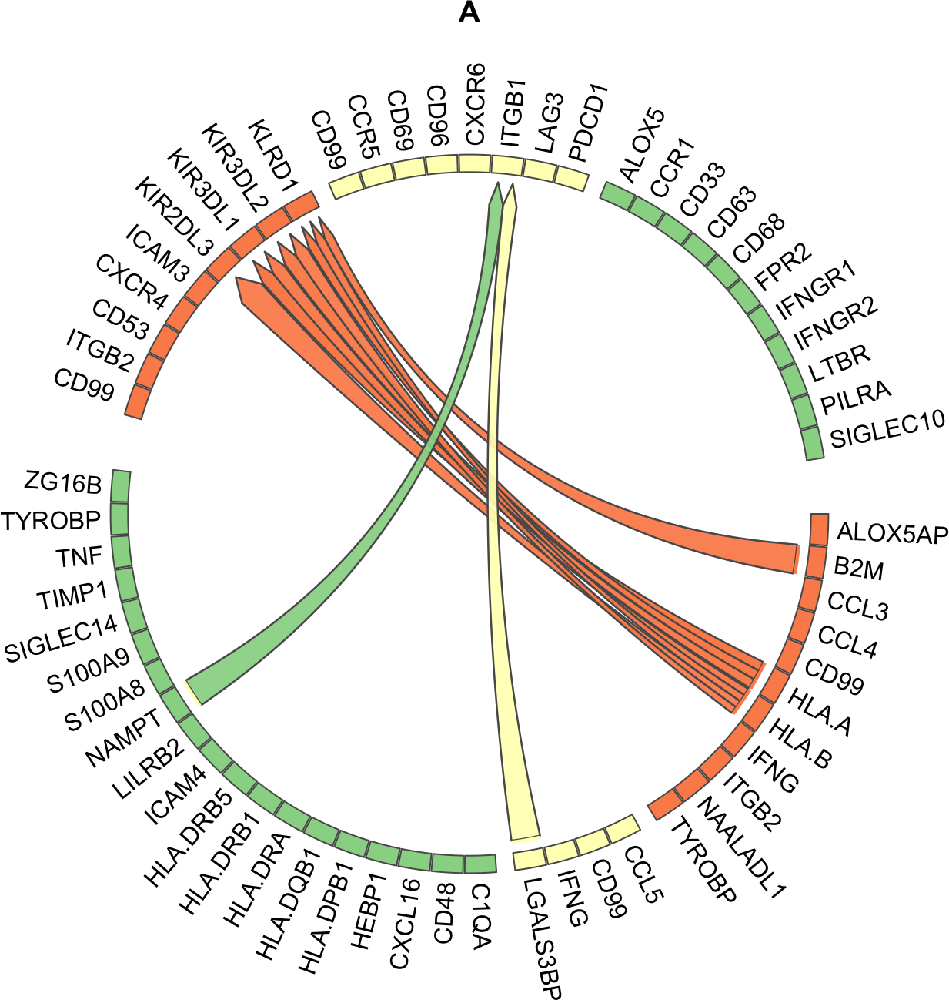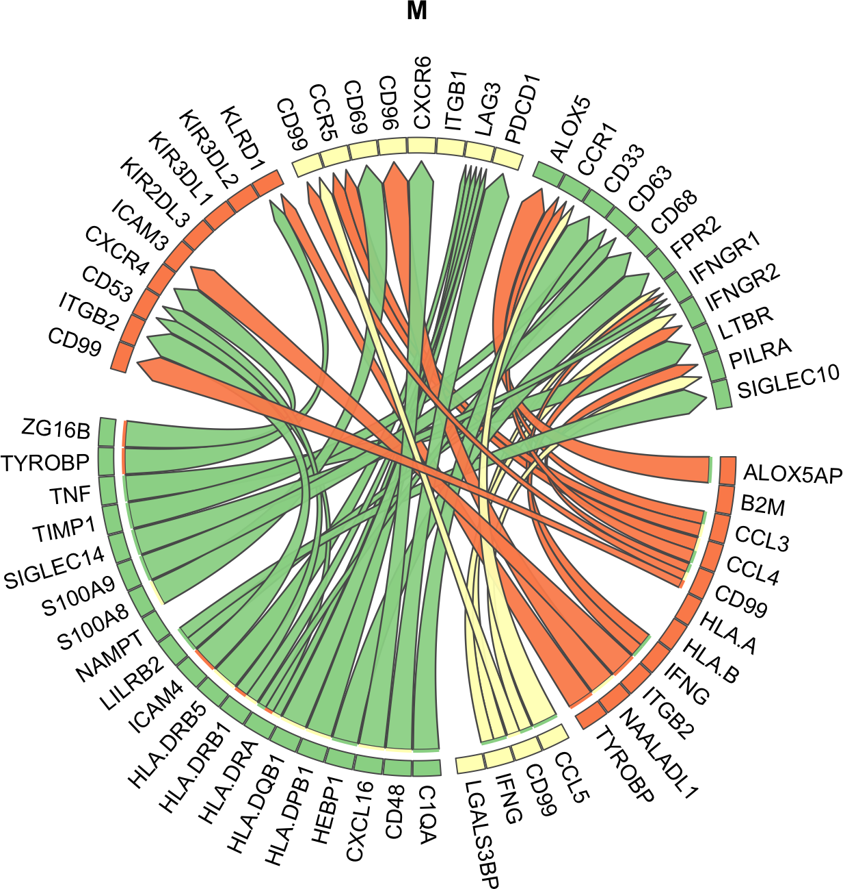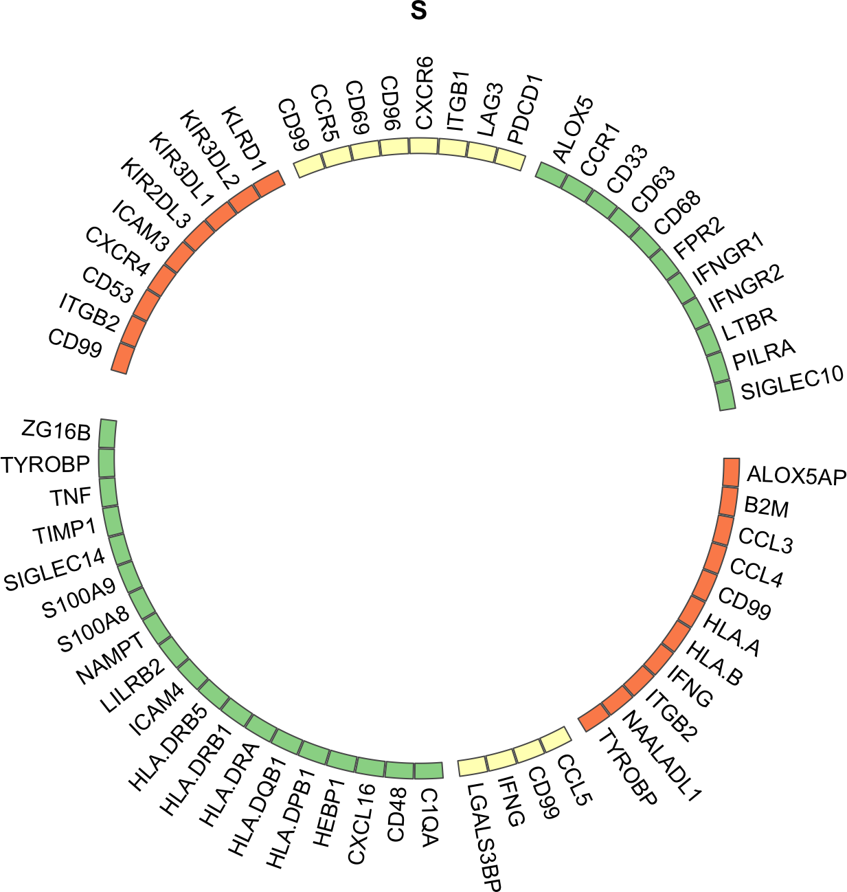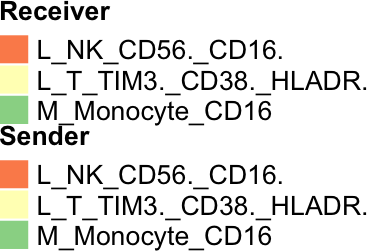

### Interpretable bubble plots

Whereas these ChordDiagrams show the most specific interactions per group, they don't give insights into the data behind these predictions. Therefore we will now look at visualizations that indicate the different prioritization criteria used in MultiNicheNet. 

In the next type of plots, we will 1) visualize the per-sample scaled product of normalized ligand and receptor pseudobulk expression, 2) visualize the scaled ligand activities, 3) cell-type specificity. 

We will now check the top 50 interactions specific for the MIS-C group


```r
group_oi = "M"
```


```r
prioritized_tbl_oi_M_50 = get_top_n_lr_pairs(
  multinichenet_output$prioritization_tables, 
  top_n = 50, 
  groups_oi = group_oi)
```


```r
plot_oi = make_sample_lr_prod_activity_plots(
  multinichenet_output$prioritization_tables, 
  prioritized_tbl_oi_M_50)
plot_oi
```

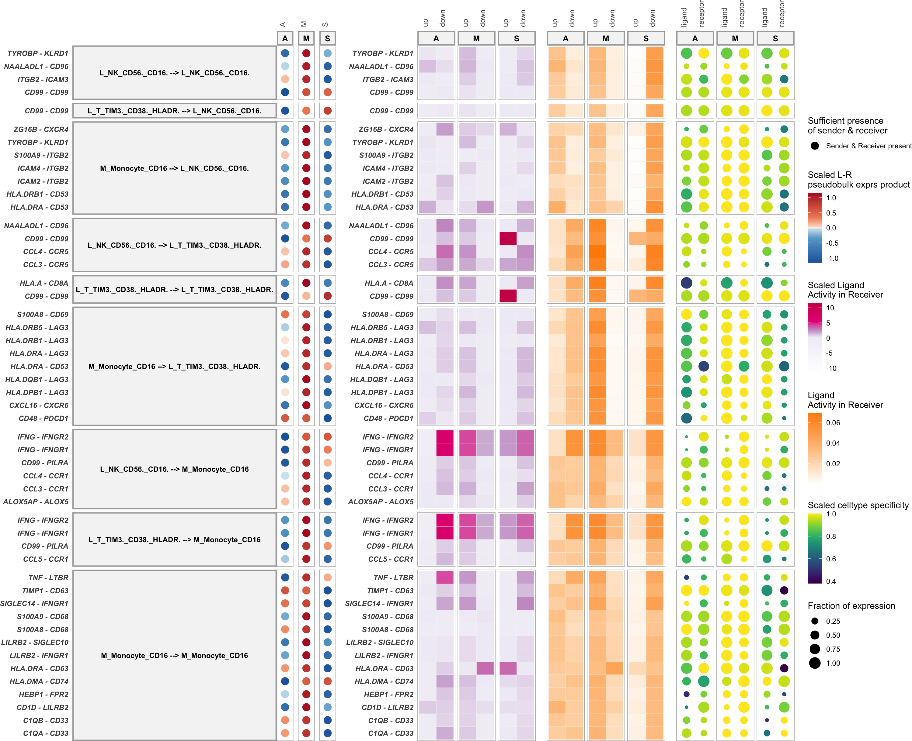
Samples that were left out of the DE analysis are indicated with a smaller dot (this helps to indicate the samples that did not contribute to the calculation of the logFC, and thus not contributed to the final prioritization)

As a further help for further prioritization, we can assess the level of curation of these LR pairs as defined by the Intercellular Communication part of the Omnipath database


```r
prioritized_tbl_oi_M_50_omnipath = prioritized_tbl_oi_M_50 %>% 
  inner_join(lr_network_all)
```

Now we add this to the bubble plot visualization:

```r
plot_oi = make_sample_lr_prod_activity_plots_Omnipath(
  multinichenet_output$prioritization_tables, 
  prioritized_tbl_oi_M_50_omnipath)
plot_oi
```

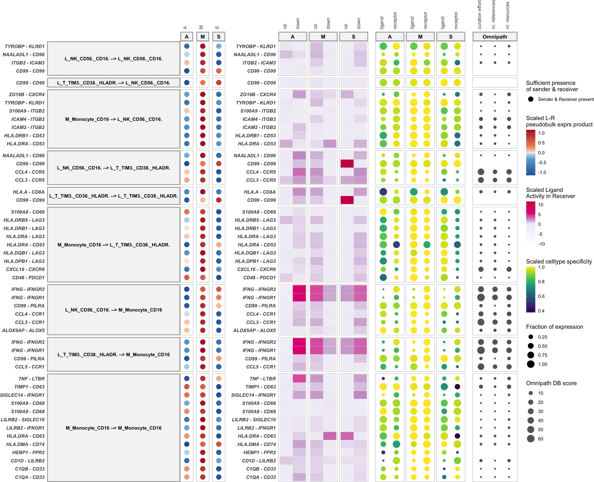

As you can see, the HEBP1-FPR2 interaction has no Omnipath DB scores. This is because this LR pair was not documented by the Omnipath LR database. Instead it was documented by the original NicheNet LR network (source: Guide2Pharmacology) as can be seen in the table.

Further note: Typically, there are way more than 50 differentially expressed and active ligand-receptor pairs per group across all sender-receiver combinations. Therefore it might be useful to zoom in on specific cell types as senders/receivers:

Eg M_Monocyte_CD16 as receiver:


```r
prioritized_tbl_oi_M_50 = get_top_n_lr_pairs(
  multinichenet_output$prioritization_tables, 
  50, 
  groups_oi = group_oi, 
  receivers_oi = "M_Monocyte_CD16")
```


```r
plot_oi = make_sample_lr_prod_activity_plots_Omnipath(
  multinichenet_output$prioritization_tables, 
  prioritized_tbl_oi_M_50 %>% inner_join(lr_network_all))
plot_oi
```

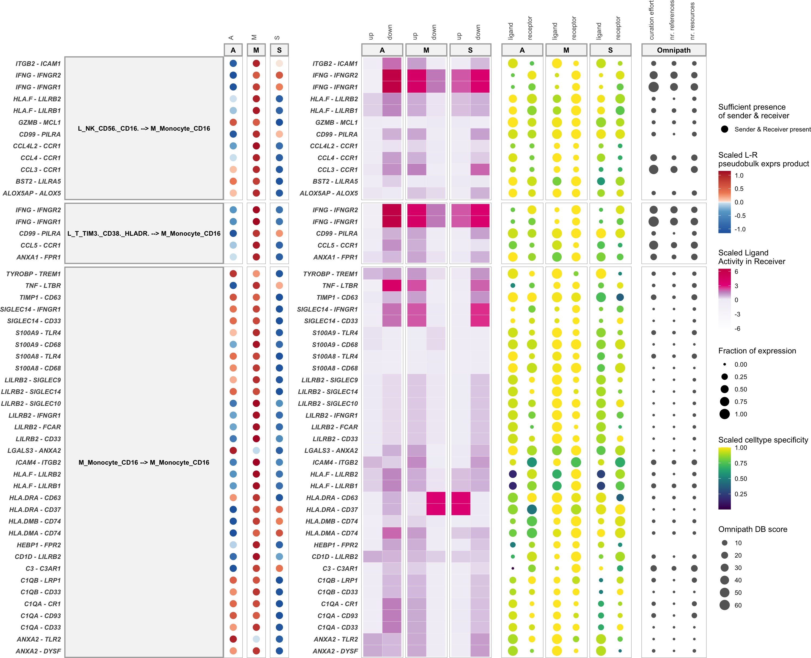

Eg M_Monocyte_CD16 as sender:


```r
prioritized_tbl_oi_M_50 = get_top_n_lr_pairs(
  multinichenet_output$prioritization_tables, 
  50, 
  groups_oi = group_oi, 
  senders_oi = "M_Monocyte_CD16")
```


```r
plot_oi = make_sample_lr_prod_activity_plots_Omnipath(
  multinichenet_output$prioritization_tables, 
  prioritized_tbl_oi_M_50 %>% inner_join(lr_network_all))
plot_oi
```

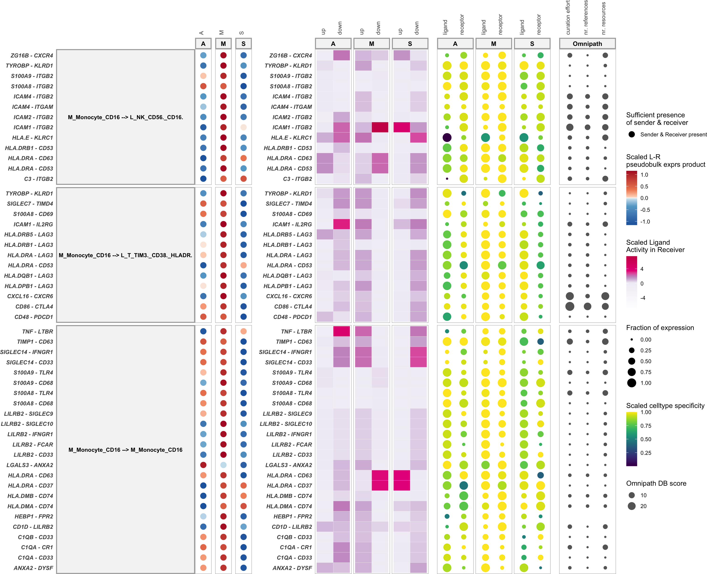

You can make these plots also for the other groups, like we will illustrate now for the S group


```r
group_oi = "S"
```


```r
prioritized_tbl_oi_S_50 = get_top_n_lr_pairs(
  multinichenet_output$prioritization_tables, 
  50, 
  groups_oi = group_oi)

plot_oi = make_sample_lr_prod_activity_plots_Omnipath(
  multinichenet_output$prioritization_tables, 
  prioritized_tbl_oi_S_50 %>% inner_join(lr_network_all))
plot_oi
```

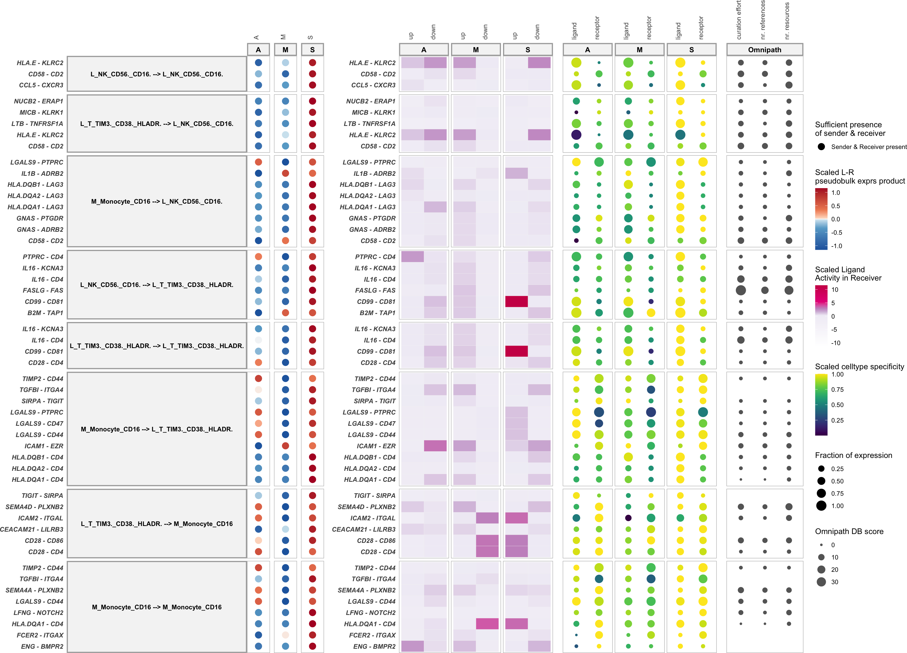


## Visualization of differential ligand-target links

### Without filtering of target genes based on LR-target expression correlation

In another type of plot, we can visualize the ligand activities for a group-receiver combination, and show the predicted ligand-target links, and also the expression of the predicted target genes across samples.

For this, we now need to define a receiver cell type of interest. As example, we will take `M_Monocyte_CD16` cells as receiver, and look at the top 10 senderLigand-receiverReceptor pairs with these cells as receiver.


```r
group_oi = "M"
receiver_oi = "M_Monocyte_CD16"
prioritized_tbl_oi_M_10 = get_top_n_lr_pairs(
  multinichenet_output$prioritization_tables, 
  10, 
  groups_oi = group_oi, 
  receivers_oi = receiver_oi)
```


```r
combined_plot = make_ligand_activity_target_plot(
  group_oi, 
  receiver_oi, 
  prioritized_tbl_oi_M_10,
  multinichenet_output$prioritization_tables, 
  multinichenet_output$ligand_activities_targets_DEgenes, contrast_tbl, 
  multinichenet_output$grouping_tbl, 
  multinichenet_output$celltype_info, 
  ligand_target_matrix, 
  plot_legend = FALSE)
combined_plot
## $combined_plot
```

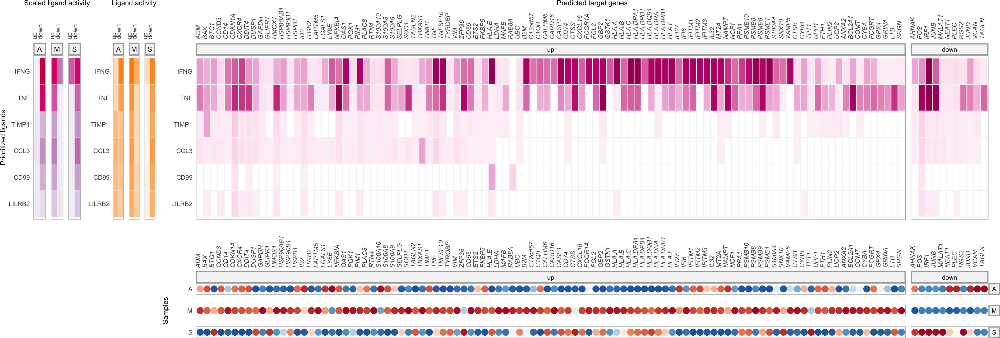

```
## 
## $legends
```

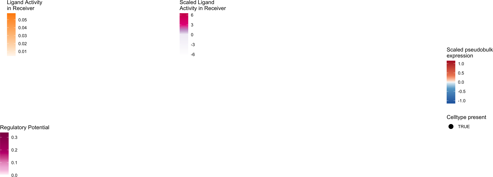

## Intercellular regulatory network inference and visualization

In the plots before, we visualized target genes that are supported by prior knowledge to be downstream of ligand-receptor pairs. Interestingly, some target genes can be ligands or receptors themselves. This illustrates that cells can send signals to other cells, who as a response to these signals produce signals themselves to feedback to the original sender cells, or who will effect other cell types. 

As last plot, we can generate a 'systems' view of these intercellular feedback and cascade processes than can be occuring between the different cell populations involved. In this plot, we will draw links between ligands of sender cell types their ligand/receptor-annotated target genes in receiver cell types. So links are ligand-target links (= gene regulatory links) and not ligand-receptor protein-protein interactions! We will infer this intercellular regulatory network here for the top50 interactions.

__Important__ In the default MultiNicheNet workflow for datasets with multiple samples per condition, we further filter out target genes based on expression correlation before generating this plot. However, this would not be meaningful here since we don't have multiple samples. As a consequence, we will have many ligand-target links here in these plots, making the plots less readable if we would consider more than the top 50 or 100 interactions. 


```r
prioritized_tbl_oi = get_top_n_lr_pairs(
  multinichenet_output$prioritization_tables, 
  50, 
  rank_per_group = FALSE)
```


```r
lr_target_prior = prioritized_tbl_oi %>% inner_join(
        multinichenet_output$ligand_activities_targets_DEgenes$ligand_activities %>%
          distinct(ligand, target, direction_regulation, contrast) %>% inner_join(contrast_tbl) %>% ungroup() 
        ) 
      

lr_target_df = lr_target_prior %>% distinct(group, sender, receiver, ligand, receptor, id, target, direction_regulation) 
```


```r
network = infer_intercellular_regulatory_network(lr_target_df, prioritized_tbl_oi)
network$links %>% head()
## # A tibble: 6 × 6
##   sender_ligand               receiver_target          direction_regulation group type          weight
##   <chr>                       <chr>                    <fct>                <chr> <chr>          <dbl>
## 1 L_NK_CD56._CD16._HLA.A      L_NK_CD56._CD16._ALOX5AP up                   A     Ligand-Target      1
## 2 L_T_TIM3._CD38._HLADR._IFNG M_Monocyte_CD16_CXCL16   up                   M     Ligand-Target      1
## 3 L_T_TIM3._CD38._HLADR._IFNG M_Monocyte_CD16_HLA.DPB1 up                   M     Ligand-Target      1
## 4 L_T_TIM3._CD38._HLADR._IFNG M_Monocyte_CD16_HLA.DQB1 up                   M     Ligand-Target      1
## 5 L_T_TIM3._CD38._HLADR._IFNG M_Monocyte_CD16_HLA.DRA  up                   M     Ligand-Target      1
## 6 L_T_TIM3._CD38._HLADR._IFNG M_Monocyte_CD16_HLA.DRB1 up                   M     Ligand-Target      1
network$nodes %>% head()
## # A tibble: 6 × 4
##   node                        celltype               gene  type_gene      
##   <chr>                       <chr>                  <chr> <chr>          
## 1 L_NK_CD56._CD16._CD99       L_NK_CD56._CD16.       CD99  ligand/receptor
## 2 L_T_TIM3._CD38._HLADR._CD99 L_T_TIM3._CD38._HLADR. CD99  ligand/receptor
## 3 L_NK_CD56._CD16._ITGB2      L_NK_CD56._CD16.       ITGB2 ligand/receptor
## 4 L_NK_CD56._CD16._HLA.A      L_NK_CD56._CD16.       HLA.A ligand         
## 5 L_T_TIM3._CD38._HLADR._IFNG L_T_TIM3._CD38._HLADR. IFNG  ligand         
## 6 L_NK_CD56._CD16._CCL4       L_NK_CD56._CD16.       CCL4  ligand
```


```r
colors_sender["L_T_TIM3._CD38._HLADR."] = "pink" # the  original yellow background with white font is not very readable
network_graph = visualize_network(network, colors_sender)
network_graph$plot
```

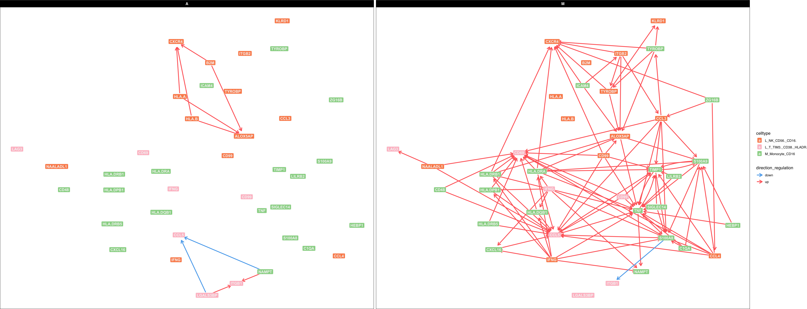

If you want to know the exact set of top-ranked ligands that are potentially regulated by one ligand of interest, you can run following code:


```r
ligand_oi = "IFNG"
group_oi = "M"
lr_target_df %>% filter(ligand == ligand_oi & group == group_oi) %>% pull(target) %>% unique() %>% intersect(lr_network$ligand)
##  [1] "B2M"      "C1QB"     "CD55"     "CXCL16"   "HLA.A"    "HLA.B"    "HLA.C"    "HLA.DPB1" "HLA.DQB1" "HLA.DRA"  "HLA.DRB1" "HLA.E"    "HLA.F"    "IFITM1"   "IL32"     "NAMPT"    "S100A4"   "S100A8"   "TNF"      "TNFSF10"
```

Interestingly, we can also use this network to further prioritize differential CCC interactions. Here we will assume that the most important LR interactions are the ones that are involved in this intercellular regulatory network. We can get these interactions as follows:


```r
network$prioritized_lr_interactions
## # A tibble: 50 × 5
##    group sender                 receiver               ligand   receptor
##    <chr> <chr>                  <chr>                  <chr>    <chr>   
##  1 A     L_NK_CD56._CD16.       L_NK_CD56._CD16.       HLA.A    KIR3DL1 
##  2 A     L_NK_CD56._CD16.       L_NK_CD56._CD16.       HLA.A    KLRD1   
##  3 M     L_T_TIM3._CD38._HLADR. M_Monocyte_CD16        IFNG     IFNGR1  
##  4 M     L_T_TIM3._CD38._HLADR. M_Monocyte_CD16        IFNG     IFNGR2  
##  5 M     L_NK_CD56._CD16.       L_T_TIM3._CD38._HLADR. CCL4     CCR5    
##  6 M     M_Monocyte_CD16        M_Monocyte_CD16        TNF      LTBR    
##  7 A     L_NK_CD56._CD16.       L_NK_CD56._CD16.       HLA.A    KIR3DL2 
##  8 M     M_Monocyte_CD16        L_T_TIM3._CD38._HLADR. HLA.DRB5 LAG3    
##  9 M     M_Monocyte_CD16        L_T_TIM3._CD38._HLADR. HLA.DPB1 LAG3    
## 10 M     M_Monocyte_CD16        L_T_TIM3._CD38._HLADR. HLA.DRA  LAG3    
## # ℹ 40 more rows
```


```r
prioritized_tbl_oi_network = prioritized_tbl_oi %>% inner_join(
  network$prioritized_lr_interactions)
prioritized_tbl_oi_network
## # A tibble: 50 × 8
##    group sender                 receiver               ligand   receptor id                                                   prioritization_score prioritization_rank
##    <chr> <chr>                  <chr>                  <chr>    <chr>    <chr>                                                               <dbl>               <dbl>
##  1 A     L_NK_CD56._CD16.       L_NK_CD56._CD16.       HLA.A    KIR3DL1  HLA.A_KIR3DL1_L_NK_CD56._CD16._L_NK_CD56._CD16.                     0.950                   1
##  2 A     L_NK_CD56._CD16.       L_NK_CD56._CD16.       HLA.A    KLRD1    HLA.A_KLRD1_L_NK_CD56._CD16._L_NK_CD56._CD16.                       0.947                   2
##  3 M     L_T_TIM3._CD38._HLADR. M_Monocyte_CD16        IFNG     IFNGR1   IFNG_IFNGR1_L_T_TIM3._CD38._HLADR._M_Monocyte_CD16                  0.941                   3
##  4 M     L_T_TIM3._CD38._HLADR. M_Monocyte_CD16        IFNG     IFNGR2   IFNG_IFNGR2_L_T_TIM3._CD38._HLADR._M_Monocyte_CD16                  0.937                   4
##  5 M     L_NK_CD56._CD16.       L_T_TIM3._CD38._HLADR. CCL4     CCR5     CCL4_CCR5_L_NK_CD56._CD16._L_T_TIM3._CD38._HLADR.                   0.928                   5
##  6 M     M_Monocyte_CD16        M_Monocyte_CD16        TNF      LTBR     TNF_LTBR_M_Monocyte_CD16_M_Monocyte_CD16                            0.928                   6
##  7 A     L_NK_CD56._CD16.       L_NK_CD56._CD16.       HLA.A    KIR3DL2  HLA.A_KIR3DL2_L_NK_CD56._CD16._L_NK_CD56._CD16.                     0.923                   7
##  8 M     M_Monocyte_CD16        L_T_TIM3._CD38._HLADR. HLA.DRB5 LAG3     HLA.DRB5_LAG3_M_Monocyte_CD16_L_T_TIM3._CD38._HLADR.                0.923                   8
##  9 M     M_Monocyte_CD16        L_T_TIM3._CD38._HLADR. HLA.DPB1 LAG3     HLA.DPB1_LAG3_M_Monocyte_CD16_L_T_TIM3._CD38._HLADR.                0.922                   9
## 10 M     M_Monocyte_CD16        L_T_TIM3._CD38._HLADR. HLA.DRA  LAG3     HLA.DRA_LAG3_M_Monocyte_CD16_L_T_TIM3._CD38._HLADR.                 0.922                  10
## # ℹ 40 more rows
```

Visualize now the expression and activity of these interactions for the M group

```r
group_oi = "M"
```


```r
prioritized_tbl_oi_M = prioritized_tbl_oi_network %>% filter(group == group_oi)

plot_oi = make_sample_lr_prod_activity_plots_Omnipath(
  multinichenet_output$prioritization_tables, 
  prioritized_tbl_oi_M %>% inner_join(lr_network_all)
  )
plot_oi
```

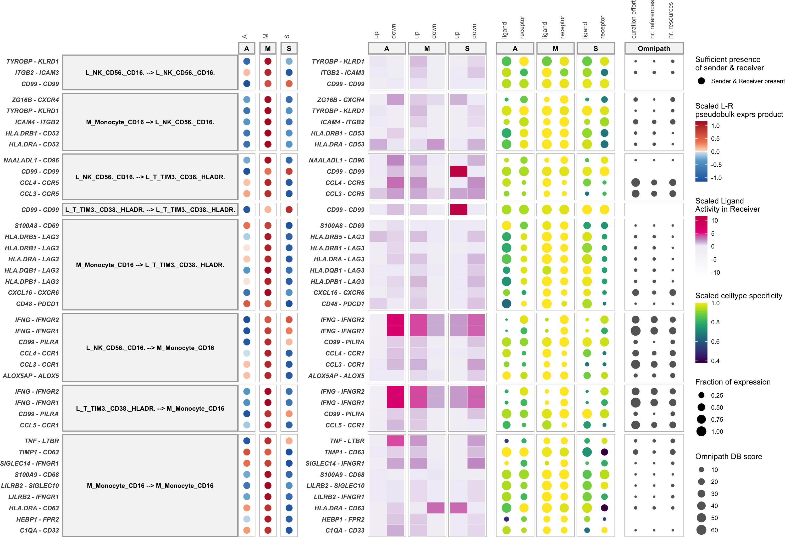
## Visualize (sender-agnostic) ligand activities for each receiver-group combination

In the next type of plot, we plot all the ligand activities (Both scaled and absolute activities) of each receiver-group combination. This can give us some insights in active signaling pathways across groups. Note that we can thus show top ligands based on ligand activity - irrespective and agnostic of expression in sender. Benefits of this analysis are the possibility to infer the activity of ligands that are expressed by cell types that are not in your single-cell dataset or that are hard to pick up at the RNA level. 

The following block of code will show how to visualize the activities for the top5 ligands for each receiver cell type - condition combination:


```r
ligands_oi = multinichenet_output$prioritization_tables$ligand_activities_target_de_tbl %>% inner_join(contrast_tbl) %>% 
  group_by(group, receiver) %>% distinct(ligand, receiver, group, activity) %>% 
  top_n(5, activity) %>% pull(ligand) %>% unique()

plot_oi = make_ligand_activity_plots(multinichenet_output$prioritization_tables, ligands_oi, contrast_tbl, widths = NULL)
plot_oi
```

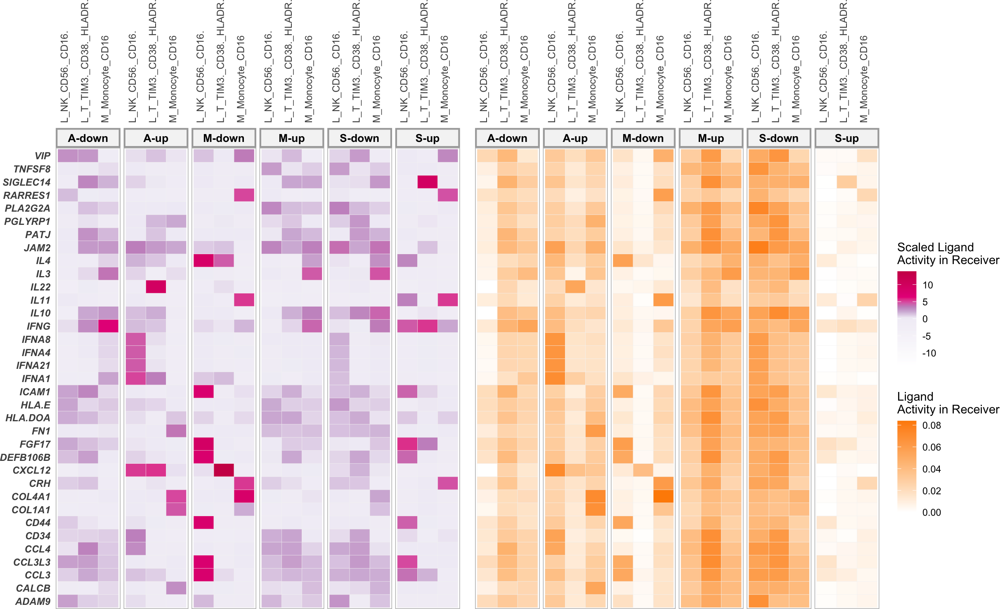

Here we see a type I interferon ligand activity signature in the A-group (predicted upregulation). Because type I interferons were not (sufficiently high) expressed by the cell types in our dataset, they were not retrieved by the classic MultiNicheNet analysis. However, they may have an important role in the Adult COVID19 patient group, as is supported by literature. 
