Multi-Sample Multi-condition Cell-Cell Communication Analysis via
NicheNet: HNSCC application; All-vs-All
================
Robin Browaeys
2021-04-09

<!-- github markdown built using 
rmarkdown::render("vignettes/basic_analysis_steps_separate.Rmd", output_format = "github_document")
-->

In this vignette, you can learn how to perform an all-vs-all
MultiNicheNet analysis. In this vignette, we start from two Seurat
objects: one seurat object containing the sender cell types, and one
seurat object with receiver cell types. (for demonstration purposes, we
start from the same object, that we then split based on sender/receiver
cell type)

A MultiNicheNet analysis can be performed if you have multi-sample,
multi-group single-cell data. MultiNicheNet will look for cell-cell
communication between the cell types in your data for each sample, and
compare the cell-cell communication patterns between the groups of
interest. Therefore, the absolute minimum of meta data you need to have,
are following columns indicating for each cell: the **group**,
**sample** and **cell type**.

As example expression data of interacting cells, we will use data from
Puram et al. to explore intercellular communication in the tumor
microenvironment in head and neck squamous cell carcinoma (HNSCC) \[See
@puram\_single-cell\_2017\]
[](https://doi.org/10.5281/zenodo.4675430).
More specifically, we will look at differential cell-cell communication
patterns between tumors scoring high for a partial
epithelial-mesenschymal transition (p-EMT) program vs low-scoring
tumors.

In this vignette, we will prepare the data and analysis parameters, and
then perform the MultiNicheNet analysis.

The different steps of the MultiNicheNet analysis are the following:

-   1.  Preparation of the analysis: load packages, NicheNet LR network
        & ligand-target matrix, single-cell expression data, and define
        main settings of the MultiNicheNet analysis

-   1.  Extract cell type abundance and expression information from
        receiver and sender cell types, and link this expression
        information for ligands of the sender cell types to the
        corresponding receptors of the receiver cell types

-   1.  Perform genome-wide differential expression analysis of receiver
        and sender cell types to define DE genes between the conditions
        of interest. Based on this analysis, we can define the
        logFC/p-value of ligands in senders and receptors in receivers,
        and define the set of affected target genes in the receiver.

-   1.  Predict NicheNet ligand activities and NicheNet ligand-target
        links based on these differential expression results

-   1.  Use the information collected above to prioritize all
        sender-ligand—receiver-receptor pairs.

-   1.  Optional: unsupervised analysis of
        sender-ligand—receiver-receptor pair expression values per
        sample, to see heterogeneity in cell-cell communication.

In this vignette, we will demonstrate all these steps in detail.

After the MultiNicheNet analysis is done, we will explore the output of
the analysis with different ways of visualization.

# Step 0: Preparation of the analysis: load packages, NicheNet LR network & ligand-target matrix, single-cell expression data

## Step 0.1: Load required packages and NicheNet ligand-receptor network and ligand-target matrix

``` r
library(Seurat)
library(dplyr)
library(ggplot2)
library(multinichenetr)
```

``` r
# LR network
lr_network = readRDS(url("https://zenodo.org/record/3260758/files/lr_network.rds"))
lr_network = lr_network %>% filter(! database %in% c("ppi_prediction","ppi_prediction_go")) # We filter out these interactions because they are not really bona-fide LR pairs - NicheNet v2 prior models will be released relatively soon
lr_network = lr_network %>% dplyr::rename(ligand = from, receptor = to) %>% distinct(ligand, receptor)
```

``` r
ligand_target_matrix = readRDS(url("https://zenodo.org/record/3260758/files/ligand_target_matrix.rds"))
```

## Step 0.2: Prepare Seurat Objects for Sender and Receiver cells

In this vignette, sender and receiver cell types are in the same Seurat
object, which we will load here.

In this case study, we want to study differences in cell-cell
communication patterns between pEMT-high and pEMT-low tumors. The meta
data columns that indicate the pEMT status of tumors are ‘pEMT’ and
‘pEMT\_fine’, cell type is indicated in the ‘celltype’ column, and the
sample is indicated by the ‘tumor’ column.

### Malignant cells as receiver

**User adaptation required**

``` r
getwd()
## [1] "C:/Users/rbrowaey/work/Research/NicheNet/multinichenetr/vignettes"
seurat_obj_receiver = readRDS(url("https://zenodo.org/record/4675430/files/seurat_obj_hnscc.rds")) %>% subset(subset = celltype == "Malignant")
seurat_obj_receiver@meta.data$pEMT_fine = factor(seurat_obj_receiver@meta.data$pEMT_fine, levels = c("High","Medium","Low")) 
DimPlot(seurat_obj_receiver, group.by = "celltype")
```

<!-- -->

``` r
DimPlot(seurat_obj_receiver, group.by = "tumor")
```

<!-- -->

``` r
DimPlot(seurat_obj_receiver, group.by = "pEMT")
```

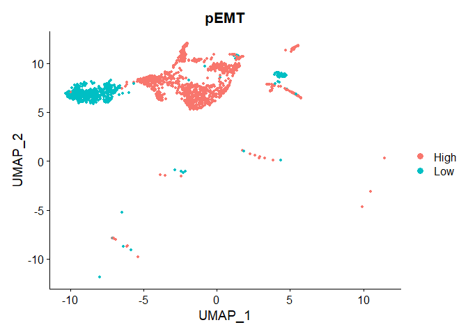<!-- -->

``` r
DimPlot(seurat_obj_receiver, group.by = "pEMT_fine")
```

<!-- -->

We will now also check the number of cells per cell type condition
combination, and the number of patients per condition.

**User adaptation required**

``` r
table(seurat_obj_receiver@meta.data$celltype, seurat_obj_receiver@meta.data$tumor) # cell types vs samples
##            
##             HN16 HN17 HN18 HN20 HN22 HN25 HN26 HN28 HN5 HN6
##   Malignant   82  353  263  331  123  153   61   49  70 157
table(seurat_obj_receiver@meta.data$celltype, seurat_obj_receiver@meta.data$pEMT_fine) # cell types vs conditions
##            
##             High Medium Low
##   Malignant  435    658 549
table(seurat_obj_receiver@meta.data$tumor, seurat_obj_receiver@meta.data$pEMT_fine) # samples vs conditions
##       
##        High Medium Low
##   HN16   82      0   0
##   HN17  353      0   0
##   HN18    0    263   0
##   HN20    0      0 331
##   HN22    0    123   0
##   HN25    0    153   0
##   HN26    0      0  61
##   HN28    0     49   0
##   HN5     0     70   0
##   HN6     0      0 157
```

### Non-Malignant cells as sender

**User adaptation required**

``` r
getwd()
## [1] "C:/Users/rbrowaey/work/Research/NicheNet/multinichenetr/vignettes"
seurat_obj_sender =readRDS(url("https://zenodo.org/record/4675430/files/seurat_obj_hnscc.rds")) %>% subset(subset = celltype != "Malignant")
seurat_obj_sender@meta.data$pEMT_fine = factor(seurat_obj_sender@meta.data$pEMT_fine, levels = c("High","Medium","Low")) 
DimPlot(seurat_obj_sender, group.by = "celltype")
```

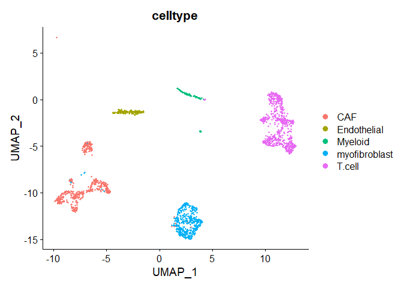<!-- -->

``` r
DimPlot(seurat_obj_sender, group.by = "tumor")
```

<!-- -->

``` r
DimPlot(seurat_obj_sender, group.by = "pEMT")
```

<!-- -->

``` r
DimPlot(seurat_obj_sender, group.by = "pEMT_fine")
```

<!-- -->

We will now also check the number of cells per cell type condition
combination, and the number of patients per condition.

**User adaptation required**

``` r
table(seurat_obj_sender@meta.data$celltype, seurat_obj_sender@meta.data$tumor) # cell types vs samples
##                
##                 HN16 HN17 HN18 HN20 HN22 HN25 HN26 HN28 HN5 HN6
##   CAF             47   37   36    3    9   73   19  157  37  82
##   Endothelial     43   17   18    1    1    1    0   14  11  52
##   Myeloid         15    2    7    0    1    8    1    1  58   6
##   myofibroblast   84    6   14   10   45   88   45  140   5   6
##   T.cell         300   61  207    0    0   93    3    0  28   0
table(seurat_obj_sender@meta.data$celltype, seurat_obj_sender@meta.data$pEMT_fine) # cell types vs conditions
##                
##                 High Medium Low
##   CAF             84    312 104
##   Endothelial     60     45  53
##   Myeloid         17     75   7
##   myofibroblast   90    292  61
##   T.cell         361    328   3
table(seurat_obj_sender@meta.data$tumor, seurat_obj_sender@meta.data$pEMT_fine) # samples vs conditions
##       
##        High Medium Low
##   HN16  489      0   0
##   HN17  123      0   0
##   HN18    0    282   0
##   HN20    0      0  14
##   HN22    0     56   0
##   HN25    0    263   0
##   HN26    0      0  68
##   HN28    0    312   0
##   HN5     0    139   0
##   HN6     0      0 146
```

As you can see, some Celltype-Sample combinations have 0 cells. It is
possible that during DE analysis, some cell types will be removed from
the analysis if there is not enough information to do a DE analysis.
(More info later)

## Step 0.3: Prepare settings of the MultiNicheNet cell-cell communication analysis

### Define in which metadata columns we can find the **group**, **sample** and **cell type** IDs

For the group\_id, we now choose for the ‘pEMT\_fine’ column instead of
‘pEMT’, which we selected in the analysis of the other vignette.

**User adaptation required**

``` r
sample_id = "tumor"
group_id = "pEMT_fine"
celltype_id_receiver = "celltype"
celltype_id_sender = "celltype"
```

Sender and receiver cell types also need to be defined. Both are here
all cell types in the dataset because we are interested in an All-vs-All
analysis.

``` r
senders_oi = seurat_obj_sender@meta.data[,celltype_id_sender] %>% unique()
receivers_oi = seurat_obj_receiver@meta.data[,celltype_id_receiver] %>% unique()
```

Now we will go to the first real step of the MultiNicheNet analysis

# Step 1: Extract cell type abundance and expression information from receiver and sender cell types, and link this expression information for ligands of the sender cell types to the corresponding receptors of the receiver cell types

Since MultiNicheNet will infer group differences at the sample level for
each cell type (currently via Muscat and pseudobulking), we need to have
sufficient cells per sample of a cell type, and this for both groups. In
the following analysis we will set this minimum number of cells per cell
type per sample at 5. For 10x scRNAseq datasets, we recommend to set
this to 10.

**User adaptation recommended**

``` r
min_cells = 5
```

Now we will calculate abundance and expression information for each cell
type / sample / group combination with the following functions. In the
output of this function, you can also find some ‘Cell type abundance
diagnostic plots’ that will the users which celltype-sample combinations
will be left out later on for DE calculation because the nr of cells is
lower than de defined minimum defined here above. If too many
celltype-sample combinations don’t pass this threshold, we recommend to
define your cell types in a more general way (use one level higher of
the cell type ontology hierarchy) (eg TH17 CD4T cells –&gt; CD4T cells).

``` r
abundance_expression_info = get_abundance_expression_info_separate(seurat_obj_receiver = seurat_obj_receiver, seurat_obj_sender = seurat_obj_sender, sample_id = sample_id, group_id = group_id, celltype_id_receiver = celltype_id_receiver, celltype_id_sender = celltype_id_sender, senders_oi = senders_oi, receivers_oi = receivers_oi, lr_network = lr_network, min_cells = min_cells)
```

First, check the cell type abundance diagnostic plots.

### Interpretation of cell type abundance information

The first plot visualizes the number of cells per celltype-sample
combination, and indicates which combinations are removed during the DE
analysis because there are less than `min_cells` in the celltype-sample
combination.

``` r
abundance_expression_info$abund_plot_sample_receiver
```

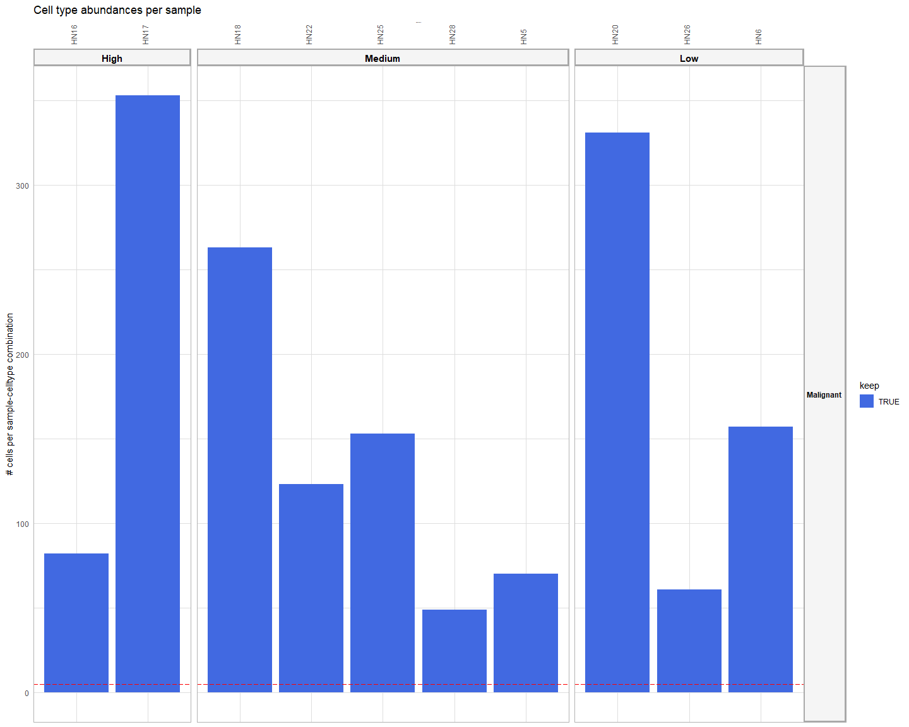<!-- -->

``` r
abundance_expression_info$abund_plot_sample_sender
```

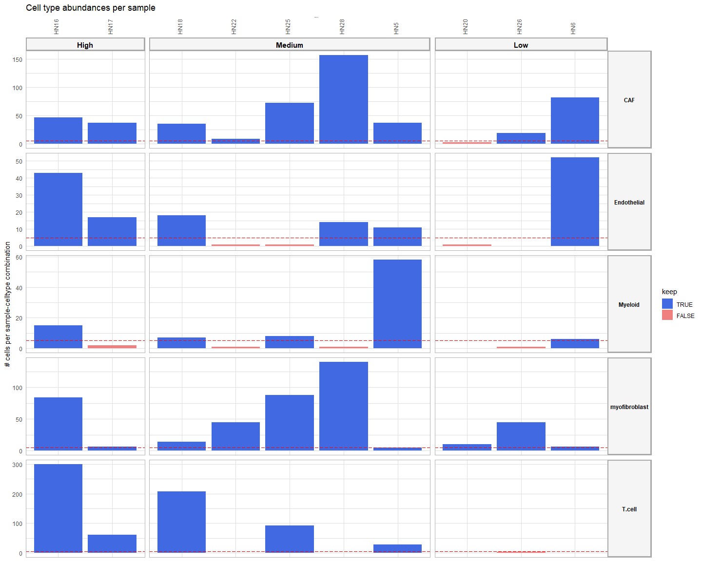<!-- -->
The red dotted line indicates the required minimum of cells as defined
above in `min_cells`. We can see here that quite many sample-celltype
combinations are left out. For Endothelial, Myeloid, and T cells, we
don’t even have two or more samples that have enough cells of those cell
types. Therefore, those cell types were removed before the DE analysis.
As stated before when seeing this, we would recommend to use a
higher-level cell type annotation if possible. But the annotation here
is already high-level, and grouping Endothelial cells, T cells and
Myeloid cells eg would not make sense biologically. That we won’t be
able to include these cell types in our analysis is a limitation of the
MultiNicheNet approach compared to classic cell-level-based approaches,
but on the contrary, those cell-level-based approaches don’t reveal the
lack of cells in many samples, and might lead to biased results. Another
limitation is that we lose now potentially very important group-specific
cell types, like T cells in this case. To overcome this, we will use a
hack later on. TODODODOODDOODODODODODODOD

In a next plot, we will look at differential abundance between the
conditions. This because the pseudobulking approach behind Muscat could
potentially suffer from some biases if there would be huge differences
in abundances of a cell type between different groups. Downstream
results of these cell types should then be considered with some caution.

``` r
abundance_expression_info$abund_plot_group_receiver
```

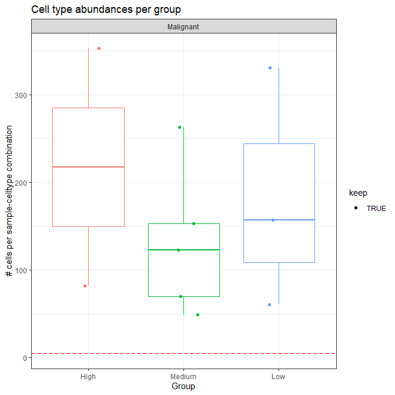<!-- -->

``` r
abundance_expression_info$abund_plot_group_sender
```

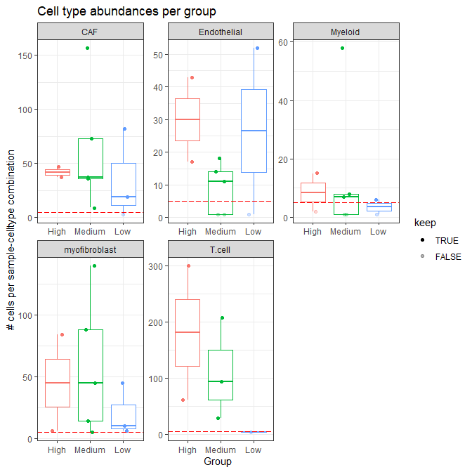<!-- -->
Differential abundance looks quite OK for the cell types kept for the DE
analysis (i.e. CAF, Malignant and myofibroblast)

If you want to look at the cell numbers behind these plots, you can do
so via the following piece of code

``` r
abundance_expression_info$abundance_data_receiver
## # A tibble: 10 x 5
## # Groups:   sample, receiver [10]
##    sample receiver  n_cells_receiver group  keep_receiver
##    <chr>  <chr>                <int> <fct>          <dbl>
##  1 HN16   Malignant               82 High               1
##  2 HN17   Malignant              353 High               1
##  3 HN18   Malignant              263 Medium             1
##  4 HN20   Malignant              331 Low                1
##  5 HN22   Malignant              123 Medium             1
##  6 HN25   Malignant              153 Medium             1
##  7 HN26   Malignant               61 Low                1
##  8 HN28   Malignant               49 Medium             1
##  9 HN5    Malignant               70 Medium             1
## 10 HN6    Malignant              157 Low                1
abundance_expression_info$abundance_data_sender # in the case of an all-vs-all analysis: both are the same
## # A tibble: 44 x 5
## # Groups:   sample, sender [44]
##    sample sender        n_cells_sender group keep_sender
##    <chr>  <chr>                  <int> <fct>       <dbl>
##  1 HN16   CAF                       47 High            1
##  2 HN16   Endothelial               43 High            1
##  3 HN16   Myeloid                   15 High            1
##  4 HN16   myofibroblast             84 High            1
##  5 HN16   T.cell                   300 High            1
##  6 HN17   CAF                       37 High            1
##  7 HN17   Endothelial               17 High            1
##  8 HN17   Myeloid                    2 High            0
##  9 HN17   myofibroblast              6 High            1
## 10 HN17   T.cell                    61 High            1
## # ... with 34 more rows
```

**Important**: Based on the cell type abundance diagnostics, we
recommend users to change their analysis settings if required, before
proceeding with the rest of the analysis.

### Interpretation of expression information

Previously, we also calculated expression information. With the
following piece of code, you can check the average expression for each
gene per sample (normalized expression value and fraction of expressing
cells with non-zero counts).

``` r
abundance_expression_info$receiver_info$avg_df
## # A tibble: 207,510 x 4
##    gene         sample average_sample celltype 
##    <chr>        <chr>           <dbl> <fct>    
##  1 C9orf152     HN26           0      Malignant
##  2 RPS11        HN26           2.91   Malignant
##  3 ELMO2        HN26           0.434  Malignant
##  4 CREB3L1      HN26           0.0733 Malignant
##  5 PNMA1        HN26           0.575  Malignant
##  6 MMP2         HN26           0.0345 Malignant
##  7 TMEM216      HN26           0.458  Malignant
##  8 TRAF3IP2-AS1 HN26           0.404  Malignant
##  9 LRRC37A5P    HN26           0      Malignant
## 10 LOC653712    HN26           0.164  Malignant
## # ... with 207,500 more rows
abundance_expression_info$receiver_info$frq_df
## # A tibble: 207,510 x 4
##    gene         sample fraction_sample celltype 
##    <chr>        <chr>            <dbl> <chr>    
##  1 C9orf152     HN26            0      Malignant
##  2 RPS11        HN26            0.967  Malignant
##  3 ELMO2        HN26            0.262  Malignant
##  4 CREB3L1      HN26            0.0820 Malignant
##  5 PNMA1        HN26            0.230  Malignant
##  6 MMP2         HN26            0.0328 Malignant
##  7 TMEM216      HN26            0.197  Malignant
##  8 TRAF3IP2-AS1 HN26            0.689  Malignant
##  9 LRRC37A5P    HN26            0      Malignant
## 10 LOC653712    HN26            0.230  Malignant
## # ... with 207,500 more rows

abundance_expression_info$sender_info$avg_df
## # A tibble: 1,037,550 x 4
##    gene         sample average_sample celltype     
##    <chr>        <chr>           <dbl> <fct>        
##  1 C9orf152     HN28           0      myofibroblast
##  2 RPS11        HN28           2.67   myofibroblast
##  3 ELMO2        HN28           0.276  myofibroblast
##  4 CREB3L1      HN28           0      myofibroblast
##  5 PNMA1        HN28           0.580  myofibroblast
##  6 MMP2         HN28           0.0636 myofibroblast
##  7 TMEM216      HN28           0.0891 myofibroblast
##  8 TRAF3IP2-AS1 HN28           0.589  myofibroblast
##  9 LRRC37A5P    HN28           0      myofibroblast
## 10 LOC653712    HN28           0.0747 myofibroblast
## # ... with 1,037,540 more rows
abundance_expression_info$sender_info$frq_df
## # A tibble: 1,037,550 x 4
##    gene         sample fraction_sample celltype     
##    <chr>        <chr>            <dbl> <chr>        
##  1 C9orf152     HN28            0      myofibroblast
##  2 RPS11        HN28            0.957  myofibroblast
##  3 ELMO2        HN28            0.157  myofibroblast
##  4 CREB3L1      HN28            0      myofibroblast
##  5 PNMA1        HN28            0.243  myofibroblast
##  6 MMP2         HN28            0.05   myofibroblast
##  7 TMEM216      HN28            0.0429 myofibroblast
##  8 TRAF3IP2-AS1 HN28            0.593  myofibroblast
##  9 LRRC37A5P    HN28            0      myofibroblast
## 10 LOC653712    HN28            0.0929 myofibroblast
## # ... with 1,037,540 more rows
```

Now for the average per group:

``` r
abundance_expression_info$receiver_info$avg_df_group
## # A tibble: 62,253 x 4
## # Groups:   group, celltype [3]
##    group celltype  gene     average_group
##    <fct> <fct>     <chr>            <dbl>
##  1 High  Malignant A1BG           0.121  
##  2 High  Malignant A1BG-AS1       0.0193 
##  3 High  Malignant A1CF           0.00430
##  4 High  Malignant A2M            0.147  
##  5 High  Malignant A2M-AS1        0.00216
##  6 High  Malignant A2ML1          0.101  
##  7 High  Malignant A2MP1          0      
##  8 High  Malignant A4GALT         0.176  
##  9 High  Malignant A4GNT          0      
## 10 High  Malignant AAAS           0.698  
## # ... with 62,243 more rows
abundance_expression_info$receiver_info$frq_df_group
## # A tibble: 62,253 x 4
## # Groups:   group, celltype [3]
##    group celltype  gene     fraction_group
##    <fct> <chr>     <chr>             <dbl>
##  1 High  Malignant A1BG            0.0719 
##  2 High  Malignant A1BG-AS1        0.0179 
##  3 High  Malignant A1CF            0.103  
##  4 High  Malignant A2M             0.120  
##  5 High  Malignant A2M-AS1         0.00142
##  6 High  Malignant A2ML1           0.249  
##  7 High  Malignant A2MP1           0      
##  8 High  Malignant A4GALT          0.143  
##  9 High  Malignant A4GNT           0      
## 10 High  Malignant AAAS            0.352  
## # ... with 62,243 more rows

abundance_expression_info$sender_info$avg_df_group
## # A tibble: 311,265 x 4
## # Groups:   group, celltype [15]
##    group celltype gene     average_group
##    <fct> <fct>    <chr>            <dbl>
##  1 High  CAF      A1BG           0.241  
##  2 High  CAF      A1BG-AS1       0.0573 
##  3 High  CAF      A1CF           0.00447
##  4 High  CAF      A2M            1.07   
##  5 High  CAF      A2M-AS1        0.0331 
##  6 High  CAF      A2ML1          0.0269 
##  7 High  CAF      A2MP1          0      
##  8 High  CAF      A4GALT         0.252  
##  9 High  CAF      A4GNT          0      
## 10 High  CAF      AAAS           0.121  
## # ... with 311,255 more rows
abundance_expression_info$sender_info$frq_df_group
## # A tibble: 311,265 x 4
## # Groups:   group, celltype [15]
##    group celltype gene     fraction_group
##    <fct> <chr>    <chr>             <dbl>
##  1 High  CAF      A1BG             0.179 
##  2 High  CAF      A1BG-AS1         0.0426
##  3 High  CAF      A1CF             0.0589
##  4 High  CAF      A2M              0.489 
##  5 High  CAF      A2M-AS1          0.0426
##  6 High  CAF      A2ML1            0.174 
##  7 High  CAF      A2MP1            0     
##  8 High  CAF      A4GALT           0.152 
##  9 High  CAF      A4GNT            0     
## 10 High  CAF      AAAS             0.0561
## # ... with 311,255 more rows
```

In the last part of this step, we combined this information for each
ligand-receptor pair combination for each sender-receiver combination.
The output of this can be seen as well:

For sample-based:

``` r
abundance_expression_info$sender_receiver_info$avg_df
## # A tibble: 60,300 x 8
##    sample sender        receiver  ligand receptor avg_ligand avg_receptor ligand_receptor_prod
##    <chr>  <fct>         <fct>     <chr>  <chr>         <dbl>        <dbl>                <dbl>
##  1 HN17   CAF           Malignant COL1A1 ITGB1          3.43         2.72                 9.34
##  2 HN17   CAF           Malignant COL1A1 SDC1           3.43         2.53                 8.69
##  3 HN17   myofibroblast Malignant COL1A1 ITGB1          3.17         2.72                 8.61
##  4 HN17   CAF           Malignant COL1A1 CD44           3.43         2.34                 8.02
##  5 HN17   myofibroblast Malignant COL1A1 SDC1           3.17         2.53                 8.01
##  6 HN20   CAF           Malignant COL1A1 SDC1           3.22         2.42                 7.78
##  7 HN17   myofibroblast Malignant COL1A1 CD44           3.17         2.34                 7.39
##  8 HN20   CAF           Malignant FN1    SDC1           2.85         2.42                 6.89
##  9 HN16   CAF           Malignant COL1A1 ITGB1          2.60         2.63                 6.83
## 10 HN17   Myeloid       Malignant ADAM17 ITGB1          2.51         2.72                 6.82
## # ... with 60,290 more rows
abundance_expression_info$sender_receiver_info$frq_df
## # A tibble: 60,300 x 8
##    sample sender        receiver  ligand receptor fraction_ligand fraction_receptor ligand_receptor_fraction_prod
##    <chr>  <chr>         <chr>     <chr>  <chr>              <dbl>             <dbl>                         <dbl>
##  1 HN28   Myeloid       Malignant COL1A1 CD44                   1             1                             1    
##  2 HN28   Myeloid       Malignant LAMA2  RPSA                   1             1                             1    
##  3 HN28   Myeloid       Malignant FN1    CD44                   1             1                             1    
##  4 HN28   Myeloid       Malignant HAS2   CD44                   1             1                             1    
##  5 HN28   Myeloid       Malignant LAMC3  CD44                   1             1                             1    
##  6 HN28   Myeloid       Malignant LAMB2  RPSA                   1             1                             1    
##  7 HN20   Endothelial   Malignant F11R   F11R                   1             0.997                         0.997
##  8 HN17   myofibroblast Malignant THBS1  SDC1                   1             0.994                         0.994
##  9 HN17   myofibroblast Malignant COL1A1 ITGB1                  1             0.994                         0.994
## 10 HN17   myofibroblast Malignant COL1A1 SDC1                   1             0.994                         0.994
## # ... with 60,290 more rows
```

For group-based:

``` r
abundance_expression_info$sender_receiver_info$avg_df_group
## # A tibble: 18,090 x 8
## # Groups:   group, sender [15]
##    group sender        receiver  ligand receptor avg_ligand_group avg_receptor_group ligand_receptor_prod_group
##    <fct> <fct>         <fct>     <chr>  <chr>               <dbl>              <dbl>                      <dbl>
##  1 High  CAF           Malignant COL1A1 ITGB1                3.02               2.67                       8.07
##  2 High  CAF           Malignant COL1A1 SDC1                 3.02               2.26                       6.81
##  3 High  CAF           Malignant COL1A1 CD44                 3.02               2.17                       6.56
##  4 High  myofibroblast Malignant COL1A1 ITGB1                2.34               2.67                       6.25
##  5 Low   CAF           Malignant COL1A1 SDC1                 2.75               2.22                       6.11
##  6 High  Endothelial   Malignant CD99   CD99                 2.32               2.43                       5.64
##  7 High  myofibroblast Malignant THBS1  SDC1                 2.46               2.26                       5.55
##  8 High  Endothelial   Malignant COL4A1 ITGB1                2.04               2.67                       5.46
##  9 Low   CAF           Malignant COL1A1 CD44                 2.75               1.96                       5.39
## 10 High  CAF           Malignant FN1    ITGB1                2.01               2.67                       5.36
## # ... with 18,080 more rows
abundance_expression_info$sender_receiver_info$frq_df_group
## # A tibble: 18,090 x 8
## # Groups:   group, sender [15]
##    group sender        receiver  ligand receptor fraction_ligand_group fraction_receptor_group ligand_receptor_fraction_prod_group
##    <fct> <chr>         <chr>     <chr>  <chr>                    <dbl>                   <dbl>                               <dbl>
##  1 High  Myeloid       Malignant F11R   F11R                     1                       0.981                               0.981
##  2 High  CAF           Malignant COL1A1 ITGB1                    0.957                   0.979                               0.937
##  3 High  myofibroblast Malignant THBS1  CD47                     0.976                   0.939                               0.917
##  4 High  CAF           Malignant COL1A1 CD44                     0.957                   0.953                               0.913
##  5 High  T.cell        Malignant F11R   F11R                     0.924                   0.981                               0.906
##  6 High  Endothelial   Malignant F11R   F11R                     0.906                   0.981                               0.889
##  7 Low   CAF           Malignant HLA-E  KLRD1                    0.970                   0.912                               0.885
##  8 High  Endothelial   Malignant HLA-E  KLRD1                    1                       0.876                               0.876
##  9 High  Myeloid       Malignant HLA-E  KLRD1                    1                       0.876                               0.876
## 10 Low   CAF           Malignant COL1A1 SDC1                     0.972                   0.902                               0.876
## # ... with 18,080 more rows
```

# Step 2: Perform genome-wide differential expression analysis of receiver and sender cell types to define DE genes between the conditions of interest. Based on this analysis, we can define the logFC/p-value of ligands in senders and receptors in receivers, and define the set of affected target genes in the receiver.

Now we will go over to the multi-group, multi-sample differential
expression (DE) analysis (also called ‘differential state’ analysis by
the developers of Muscat).

### Define the contrasts and covariates of interest for the DE analysis.

Here, we want to compare the p-EMT-high vs the p-EMT-low group and find
cell-cell communication events that are higher in high than low pEMT. We
don’t have other covariates to correct for in this dataset. If you would
have covariates you can correct for (meaning: different covariate values
should be present in all your groups of interest as defined in the
contrasts), we strongly recommend doing this, since this is one of the
main unique possibilities of the MultiNicheNet approach.

Note the format to indicate the contrasts! (This formatting should be
adhered to very strictly, and white spaces are not allowed)

**User adaptation required**

``` r
covariates = NA
contrasts_oi = c("'High-(Medium+Low)/2','Medium-(High+Low)/2','Low-(Medium+High)/2'") # no spaces between the different contrasts!
contrast_tbl = tibble(contrast = 
                        c("High-(Medium+Low)/2", "Medium-(High+Low)/2","Low-(Medium+High)/2"),  # division by 2 necessary because 2 groups to compare against !!
                      group = c("High","Medium","Low")) 
min_cells = 5 # here 5 for demonstration purposes - but recommended default is 10.
```

### Perform the DE analysis for each cell type.

``` r
DE_info_receiver = get_DE_info(seurat_obj = seurat_obj_receiver, sample_id = sample_id, group_id = group_id, celltype_id = celltype_id_receiver, covariates = covariates, contrasts_oi = contrasts_oi, min_cells = min_cells)
```

``` r
DE_info_sender = get_DE_info(seurat_obj = seurat_obj_sender, sample_id = sample_id, group_id = group_id, celltype_id = celltype_id_sender, covariates = covariates, contrasts_oi = contrasts_oi, min_cells = min_cells)
## [1] "excluded cell types are:"
## [1] "Endothelial" "Myeloid"     "T.cell"     
## [1] "These celltypes are not considered in the analysis. After removing samples that contain less cells than the required minimal, some groups don't have 2 or more samples anymore. As a result the analysis cannot be run. To solve this: decrease the number of min_cells or change your group_id and pool all samples that belong to groups that are not of interest! "
```

### Check DE results

Table with logFC and p-values for each gene-celltype-contrast:

``` r
DE_info_receiver$celltype_de$de_output_tidy
## # A tibble: 44,481 x 9
##    gene         cluster_id   logFC logCPM       F  p_val p_adj.loc p_adj contrast           
##    <chr>        <chr>        <dbl>  <dbl>   <dbl>  <dbl>     <dbl> <dbl> <chr>              
##  1 RPS11        Malignant  -0.0106   8.91 0.00475 0.946      0.992     1 High-(Medium+Low)/2
##  2 ELMO2        Malignant   0.0411   5.81 0.0107  0.919      0.987     1 High-(Medium+Low)/2
##  3 CREB3L1      Malignant  -6.2      2.78 4.77    0.0505     0.59      1 High-(Medium+Low)/2
##  4 PNMA1        Malignant  -0.91     5.83 1.99    0.185      0.74      1 High-(Medium+Low)/2
##  5 MMP2         Malignant   1.69     6.33 6.54    0.0258     0.536     1 High-(Medium+Low)/2
##  6 TMEM216      Malignant  -0.393    5.9  0.607   0.452      0.869     1 High-(Medium+Low)/2
##  7 TRAF3IP2-AS1 Malignant  -0.333    4.39 0.515   0.487      0.884     1 High-(Medium+Low)/2
##  8 LOC653712    Malignant   0.839    2.79 1.13    0.309      0.808     1 High-(Medium+Low)/2
##  9 ZHX3         Malignant   0.0272   3.75 0.0028  0.959      0.994     1 High-(Medium+Low)/2
## 10 ERCC5        Malignant   0.385    5.6  1.11    0.313      0.809     1 High-(Medium+Low)/2
## # ... with 44,471 more rows
```

``` r
DE_info_sender$celltype_de$de_output_tidy
## # A tibble: 58,119 x 9
##    gene         cluster_id   logFC logCPM       F p_val p_adj.loc p_adj contrast           
##    <chr>        <chr>        <dbl>  <dbl>   <dbl> <dbl>     <dbl> <dbl> <chr>              
##  1 RPS11        CAF        -0.0696   9.29 0.0663  0.8       0.958     1 High-(Medium+Low)/2
##  2 ELMO2        CAF         0.308    6.64 0.439   0.518     0.885     1 High-(Medium+Low)/2
##  3 CREB3L1      CAF         0.319    5.45 0.0785  0.783     0.953     1 High-(Medium+Low)/2
##  4 PNMA1        CAF        -0.947    6.51 2.59    0.13      0.676     1 High-(Medium+Low)/2
##  5 MMP2         CAF         0.0535   9.28 0.0447  0.836     0.964     1 High-(Medium+Low)/2
##  6 TMEM216      CAF        -0.203    6    0.11    0.745     0.943     1 High-(Medium+Low)/2
##  7 TRAF3IP2-AS1 CAF        -0.625    5.54 0.888   0.362     0.826     1 High-(Medium+Low)/2
##  8 ZHX3         CAF        -0.0565   5.47 0.00652 0.937     0.985     1 High-(Medium+Low)/2
##  9 ERCC5        CAF        -0.0511   6.08 0.00536 0.943     0.987     1 High-(Medium+Low)/2
## 10 APBB2        CAF         0.193    6.47 0.158   0.697     0.929     1 High-(Medium+Low)/2
## # ... with 58,109 more rows
```

Diagnostic p-value histograms:

``` r
DE_info_receiver$hist_pvals
```

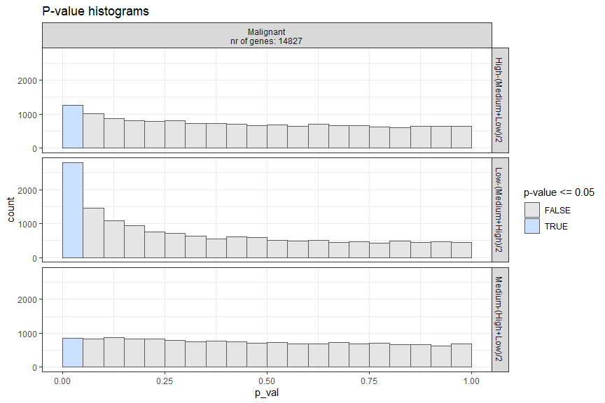<!-- -->

``` r
DE_info_sender$hist_pvals
```

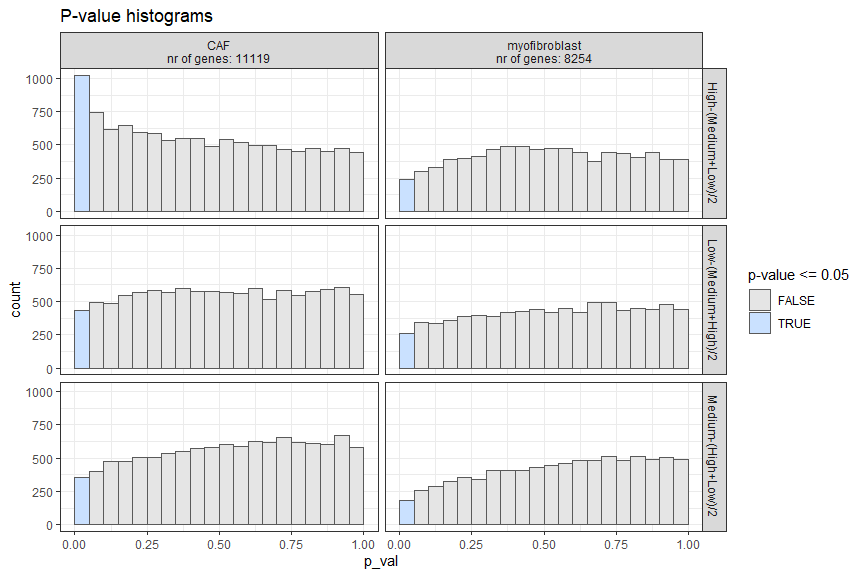<!-- -->

(Note: this p-value histograms are the same for High-Low and Low-High
because we only have two groups and compare them to each other - a DE
gene in one comparison will then also be DE in the other comparison,
with just a reversed sign of the logFC)

In order to trust the p-values, the p-value distributions should be
uniform distributions, with a peak allowed between 0 and 0.05 if there
would be a clear biological effect in the data. This clear effect
(=clear DE) seems to be present here in the Malignant cell type
populations, although the histogram is not very uniformly distributed
for p-values between 0.05 and 0.25. This might point to issues in the DE
model definition (eg we did not add all important covariates,
substructure present,…)

Because there might be some issues, and we anticipate this could be
present in other datasets, we will now use the empiricall null
procedure. This is a procedure that will define empirical p-values based
on the observed distribution of the test statistic (here: logFC) and not
based on the theoretical distribution. We only recommend this if the
p-value distributions point to possible issues. (\[ADD REFERENCE\])

### Empirical Null procedure

**User adaptation recommended**

``` r
empirical_pval_receiver = TRUE
if(empirical_pval_receiver == TRUE){
  DE_info_emp_receiver = get_empirical_pvals(DE_info_receiver$celltype_de$de_output_tidy)
} 
empirical_pval_sender = TRUE
if(empirical_pval_sender == TRUE){
  DE_info_emp_sender = get_empirical_pvals(DE_info_sender$celltype_de$de_output_tidy)
} 
```

Table with logFC and p-values for each gene-celltype-contrast:

``` r
DE_info_emp_receiver$de_output_tidy_emp
## # A tibble: 44,481 x 11
##    gene         cluster_id   logFC logCPM       F  p_val p_adj.loc p_adj contrast             p_emp p_adj_emp
##    <chr>        <chr>        <dbl>  <dbl>   <dbl>  <dbl>     <dbl> <dbl> <chr>                <dbl>     <dbl>
##  1 RPS11        Malignant  -0.0106   8.91 0.00475 0.946      0.992     1 High-(Medium+Low)/2 0.870      0.994
##  2 ELMO2        Malignant   0.0411   5.81 0.0107  0.919      0.987     1 High-(Medium+Low)/2 0.752      0.994
##  3 CREB3L1      Malignant  -6.2      2.78 4.77    0.0505     0.59      1 High-(Medium+Low)/2 0.124      0.917
##  4 PNMA1        Malignant  -0.91     5.83 1.99    0.185      0.74      1 High-(Medium+Low)/2 0.332      0.969
##  5 MMP2         Malignant   1.69     6.33 6.54    0.0258     0.536     1 High-(Medium+Low)/2 0.0255     0.766
##  6 TMEM216      Malignant  -0.393    5.9  0.607   0.452      0.869     1 High-(Medium+Low)/2 0.650      0.994
##  7 TRAF3IP2-AS1 Malignant  -0.333    4.39 0.515   0.487      0.884     1 High-(Medium+Low)/2 0.687      0.994
##  8 LOC653712    Malignant   0.839    2.79 1.13    0.309      0.808     1 High-(Medium+Low)/2 0.254      0.948
##  9 ZHX3         Malignant   0.0272   3.75 0.0028  0.959      0.994     1 High-(Medium+Low)/2 0.787      0.994
## 10 ERCC5        Malignant   0.385    5.6  1.11    0.313      0.809     1 High-(Medium+Low)/2 0.257      0.950
## # ... with 44,471 more rows
```

``` r
DE_info_emp_sender$de_output_tidy_emp
## # A tibble: 58,119 x 11
##    gene         cluster_id   logFC logCPM       F p_val p_adj.loc p_adj contrast            p_emp p_adj_emp
##    <chr>        <chr>        <dbl>  <dbl>   <dbl> <dbl>     <dbl> <dbl> <chr>               <dbl>     <dbl>
##  1 RPS11        CAF        -0.0696   9.29 0.0663  0.8       0.958     1 High-(Medium+Low)/2 0.894     0.996
##  2 ELMO2        CAF         0.308    6.64 0.439   0.518     0.885     1 High-(Medium+Low)/2 0.528     0.987
##  3 CREB3L1      CAF         0.319    5.45 0.0785  0.783     0.953     1 High-(Medium+Low)/2 0.752     0.991
##  4 PNMA1        CAF        -0.947    6.51 2.59    0.13      0.676     1 High-(Medium+Low)/2 0.229     0.987
##  5 MMP2         CAF         0.0535   9.28 0.0447  0.836     0.964     1 High-(Medium+Low)/2 0.796     0.991
##  6 TMEM216      CAF        -0.203    6    0.11    0.745     0.943     1 High-(Medium+Low)/2 0.846     0.994
##  7 TRAF3IP2-AS1 CAF        -0.625    5.54 0.888   0.362     0.826     1 High-(Medium+Low)/2 0.489     0.987
##  8 ZHX3         CAF        -0.0565   5.47 0.00652 0.937     0.985     1 High-(Medium+Low)/2 0.988     0.999
##  9 ERCC5        CAF        -0.0511   6.08 0.00536 0.943     0.987     1 High-(Medium+Low)/2 0.983     0.999
## 10 APBB2        CAF         0.193    6.47 0.158   0.697     0.929     1 High-(Medium+Low)/2 0.680     0.988
## # ... with 58,109 more rows
```

The following plot shows those corrected, empirical p-values:

``` r
DE_info_emp_receiver$hist_pvals_emp
```

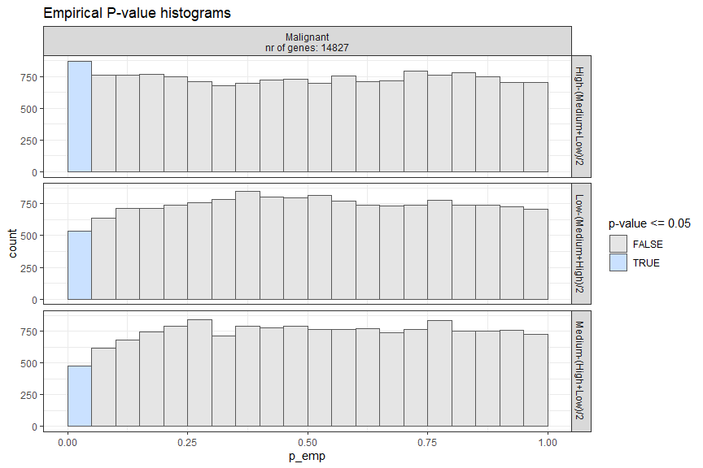<!-- -->

``` r
DE_info_emp_sender$hist_pvals_emp
```

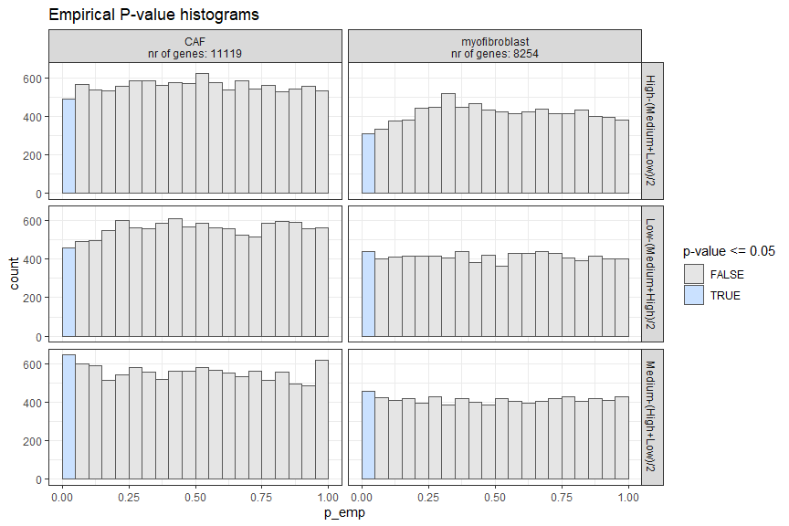<!-- -->

The following plots show how well the correction worked. The green
fitted curve should fit well with the histogram. If not, this might
point to some issues in the DE model definition.

**User adaptation required**

``` r
DE_info_emp$z_distr_plots_emp_pval
## $`CAF.High-Low`
```

<!-- -->

    ## 
    ## $`CAF.Low-High`

<!-- -->

    ## 
    ## $`Malignant.High-Low`

<!-- -->

    ## 
    ## $`Malignant.Low-High`

<!-- -->

    ## 
    ## $`myofibroblast.High-Low`

<!-- -->

    ## 
    ## $`myofibroblast.Low-High`

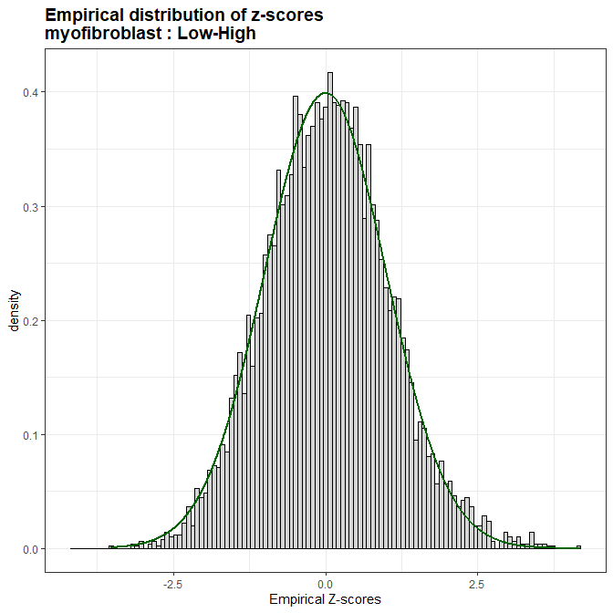<!-- -->

In general, these plots looks fine.

As additional check, we will look for the concordance between p-values
rankings of the original and empirical DE analysis (via ranking-line and
upset plots):

``` r
comparison_plots_receivers = DE_info_receiver$celltype_de$de_output_tidy$cluster_id %>% unique() %>% lapply(function(celltype_oi, adjusted = FALSE){
  if(adjusted == TRUE){
      de_genes_normal = DE_info_receiver$celltype_de$de_output_tidy %>% filter(cluster_id == celltype_oi) %>% filter(p_adj.glb <= 0.05) %>% pull(gene) %>% unique()
      de_genes_emp = DE_info_emp_receiver$de_output_tidy_emp %>% filter(cluster_id == celltype_oi) %>% filter(p_adj_emp <= 0.05) %>% pull(gene) %>% unique()

  } else {
      de_genes_normal = DE_info_receiver$celltype_de$de_output_tidy %>% filter(cluster_id == celltype_oi) %>% filter(p_val <= 0.05) %>% pull(gene) %>% unique()
      de_genes_emp = DE_info_emp_receiver$de_output_tidy_emp %>% filter(cluster_id == celltype_oi) %>% filter(p_emp <= 0.05) %>% pull(gene) %>% unique()

  }

  upset_df = tibble(gene = union(de_genes_normal, de_genes_emp), normal = as.double(gene %in% de_genes_normal), empirical = as.double(gene %in% de_genes_emp)) %>% data.frame() %>% magrittr::set_rownames(.$gene) %>% select(-gene)
  colnames(upset_df) = paste(colnames(upset_df), celltype_oi, sep = "-")
  p_upset = UpSetR::upset(upset_df, sets.bar.color = "#56B4E9", order.by = "freq", empty.intersections = "on") 
  
  p_ranking = DE_info_emp_receiver$de_output_tidy_emp %>% filter(gene %in% union(de_genes_normal, de_genes_emp) & cluster_id == celltype_oi) %>% group_by(cluster_id, contrast) %>% mutate(normal = rank(p_val), empirical = rank(p_emp)) %>% filter(normal != empirical) %>% mutate(empirical_lower = empirical < normal) %>% tidyr::gather(rank_type, rank, normal:empirical) %>% select(gene, rank_type, rank, empirical_lower)  %>% 
    ggplot(aes(rank_type, rank, group = gene, color = empirical_lower)) + geom_line(aes(group = gene)) + facet_grid(cluster_id ~ contrast) + theme_bw()
  
  return(list(p_upset, p_ranking))
  
}, adjusted = FALSE) 
comparison_plots_receivers
## [[1]]
## [[1]][[1]]
```

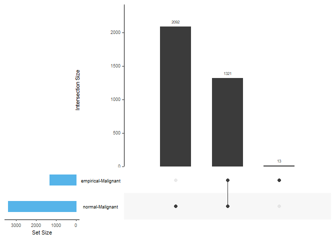<!-- -->

    ## 
    ## [[1]][[2]]

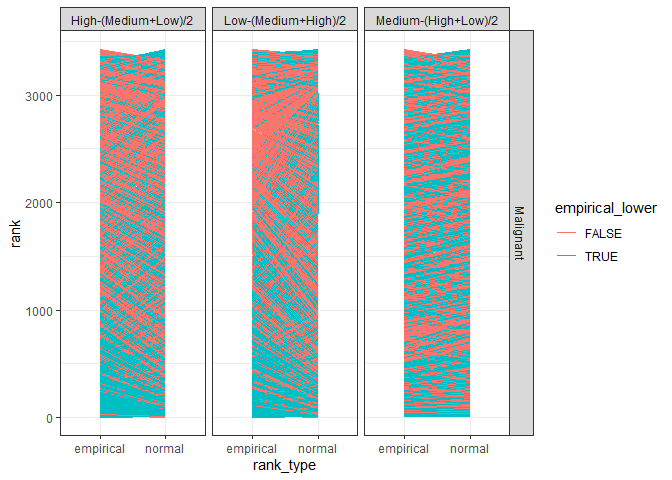<!-- -->

``` r
comparison_plots_senders = DE_info_sender$celltype_de$de_output_tidy$cluster_id %>% unique() %>% lapply(function(celltype_oi, adjusted = FALSE){
  if(adjusted == TRUE){
      de_genes_normal = DE_info_sender$celltype_de$de_output_tidy %>% filter(cluster_id == celltype_oi) %>% filter(p_adj.glb <= 0.05) %>% pull(gene) %>% unique()
      de_genes_emp = DE_info_emp_sender$de_output_tidy_emp %>% filter(cluster_id == celltype_oi) %>% filter(p_adj_emp <= 0.05) %>% pull(gene) %>% unique()

  } else {
      de_genes_normal = DE_info_sender$celltype_de$de_output_tidy %>% filter(cluster_id == celltype_oi) %>% filter(p_val <= 0.05) %>% pull(gene) %>% unique()
      de_genes_emp = DE_info_emp_sender$de_output_tidy_emp %>% filter(cluster_id == celltype_oi) %>% filter(p_emp <= 0.05) %>% pull(gene) %>% unique()

  }

  upset_df = tibble(gene = union(de_genes_normal, de_genes_emp), normal = as.double(gene %in% de_genes_normal), empirical = as.double(gene %in% de_genes_emp)) %>% data.frame() %>% magrittr::set_rownames(.$gene) %>% select(-gene)
  colnames(upset_df) = paste(colnames(upset_df), celltype_oi, sep = "-")
  p_upset = UpSetR::upset(upset_df, sets.bar.color = "#56B4E9", order.by = "freq", empty.intersections = "on") 
  
  p_ranking = DE_info_emp_sender$de_output_tidy_emp %>% filter(gene %in% union(de_genes_normal, de_genes_emp) & cluster_id == celltype_oi) %>% group_by(cluster_id, contrast) %>% mutate(normal = rank(p_val), empirical = rank(p_emp)) %>% filter(normal != empirical) %>% mutate(empirical_lower = empirical < normal) %>% tidyr::gather(rank_type, rank, normal:empirical) %>% select(gene, rank_type, rank, empirical_lower)  %>% 
    ggplot(aes(rank_type, rank, group = gene, color = empirical_lower)) + geom_line(aes(group = gene)) + facet_grid(cluster_id ~ contrast) + theme_bw()
  
  return(list(p_upset, p_ranking))
  
}, adjusted = FALSE) 
comparison_plots_senders
## [[1]]
## [[1]][[1]]
```

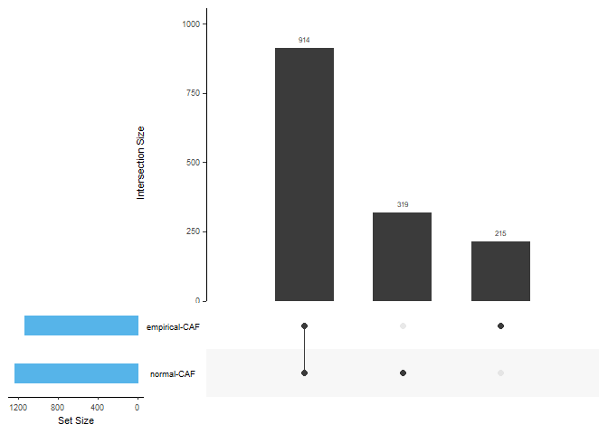<!-- -->

    ## 
    ## [[1]][[2]]

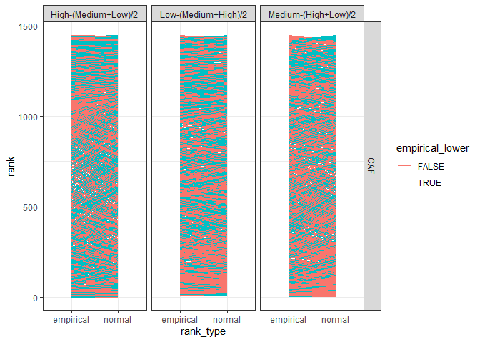<!-- -->

    ## 
    ## 
    ## [[2]]
    ## [[2]][[1]]

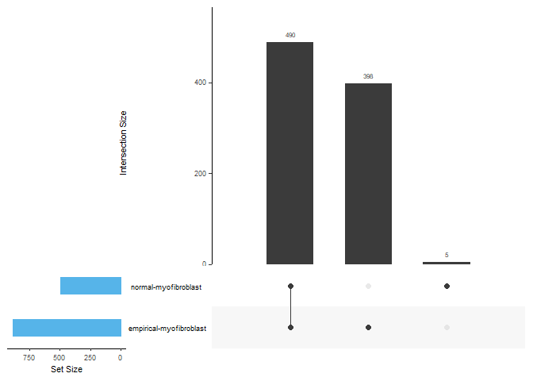<!-- -->

    ## 
    ## [[2]][[2]]

<!-- -->

### Conclusion of the diagnostic plots concerning the DE analysis

P-value histograms of both the normal and empirical p-values indicate
there might be some problems in the DE model definition, certainly for
malignant cells. If possible it might be a good idea to include more
covariates in the model, or use the `pEMT_fine` group definition
instead.

Because of these issues (that point to violations to the assumptions
that should be fulfilled for having accurate theoretical p-values), we
decide to continue based on the empirical p-values in this case study.

**User adaptation recommended**

``` r
empirical_pval_receiver = TRUE
if(empirical_pval_receiver == FALSE){
  celltype_de_receiver = DE_info_receiver$celltype_de$de_output_tidy
} else {
  celltype_de_receiver = DE_info_emp_receiver$de_output_tidy_emp %>% select(-p_val, -p_adj) %>% rename(p_val = p_emp, p_adj = p_adj_emp)
}
empirical_pval_sender = TRUE
if(empirical_pval_sender == FALSE){
  celltype_de_sender = DE_info_sender$celltype_de$de_output_tidy
} else {
  celltype_de_sender = DE_info_emp_sender$de_output_tidy_emp %>% select(-p_val, -p_adj) %>% rename(p_val = p_emp, p_adj = p_adj_emp)
}
```

### Combine DE information for ligand-senders and receptors-receivers (similar to step1 - `abundance_expression_info$sender_receiver_info`)

``` r
sender_receiver_de = combine_sender_receiver_de(
  sender_de = celltype_de_sender,
  receiver_de = celltype_de_receiver,
  senders_oi = senders_oi,
  receivers_oi = receivers_oi,
  lr_network = lr_network
)
```

``` r
sender_receiver_de %>% head(20)
## # A tibble: 20 x 12
##    contrast     sender    receiver ligand receptor lfc_ligand lfc_receptor ligand_receptor_l~ p_val_ligand p_adj_ligand p_val_receptor p_adj_receptor
##    <chr>        <chr>     <chr>    <chr>  <chr>         <dbl>        <dbl>              <dbl>        <dbl>        <dbl>          <dbl>          <dbl>
##  1 Low-(Medium~ CAF       Maligna~ NTN4   DCC           1.12         7.14                4.13     0.218           0.999         0.0314          0.993
##  2 Low-(Medium~ CAF       Maligna~ CD34   SELL          1.38         5.54                3.46     0.159           0.999         0.0611          0.993
##  3 Low-(Medium~ myofibro~ Maligna~ NTN4   DCC          -0.225        7.14                3.46     0.680           0.991         0.0314          0.993
##  4 Low-(Medium~ CAF       Maligna~ FGF13  FGFR1         3.22         3.19                3.20     0.0614          0.999         0.0436          0.993
##  5 Low-(Medium~ myofibro~ Maligna~ CFH    SELL          0.834        5.54                3.19     0.259           0.986         0.0611          0.993
##  6 Low-(Medium~ CAF       Maligna~ DLK1   NOTCH3        3.31         3.01                3.16     0.0611          0.999         0.0620          0.993
##  7 Medium-(Hig~ CAF       Maligna~ CSF3   CSF1R         2.89         3.27                3.08     0.00876         0.700         0.0245          0.997
##  8 High-(Mediu~ CAF       Maligna~ IL24   IL20RB        4.85         1.19                3.02     0.000526        0.987         0.0199          0.745
##  9 Low-(Medium~ myofibro~ Maligna~ BMP2   ACVR2A        4.32         1.62                2.97     0.00476         0.699         0.0315          0.993
## 10 Low-(Medium~ CAF       Maligna~ TNFSF~ TNFRSF1~      3.97         1.96                2.96     0.00953         0.999         0.355           0.993
## 11 Low-(Medium~ CAF       Maligna~ CFH    SELL          0.377        5.54                2.96     0.209           0.999         0.0611          0.993
## 12 Medium-(Hig~ CAF       Maligna~ DLK1   NOTCH3        5.2          0.68                2.94     0.000424        0.262         0.407           0.997
## 13 Low-(Medium~ myofibro~ Maligna~ FN1    ITGA4         0.758        5                   2.88     0.0248          0.847         0.124           0.993
## 14 Low-(Medium~ CAF       Maligna~ RSPO3  LGR6          2.79         2.94                2.86     0.0317          0.999         0.183           0.993
## 15 Medium-(Hig~ CAF       Maligna~ DLK1   NOTCH4        5.2          0.529               2.86     0.000424        0.262         0.747           0.997
## 16 Medium-(Hig~ CAF       Maligna~ DLK1   NOTCH1        5.2          0.514               2.86     0.000424        0.262         0.453           0.997
## 17 Low-(Medium~ CAF       Maligna~ GAS6   MERTK         0.761        4.83                2.80     0.278           0.999         0.181           0.993
## 18 Medium-(Hig~ CAF       Maligna~ DLK1   NOTCH2        5.2          0.223               2.71     0.000424        0.262         0.809           0.997
## 19 High-(Mediu~ CAF       Maligna~ IL24   IL22RA1       4.85         0.562               2.71     0.000526        0.987         0.236           0.942
## 20 Low-(Medium~ CAF       Maligna~ VCAM1  ITGA4         0.296        5                   2.65     0.574           0.999         0.124           0.993
```

# Step 3: Predict NicheNet ligand activities and NicheNet ligand-target links based on these differential expression results

## Define the parameters for the NicheNet ligand activity analysis

Here, we need to define the thresholds that will be used to consider
genes as differentially expressed or not (logFC, p-value, decision
whether to use adjusted or normal p-value, minimum fraction of cells
that should express a gene in at least one sample in a group, whether to
use the normal p-values or empirical p-values).

NicheNet ligand activity will then be calculated as the enrichment of
predicted target genes of ligands in this set of DE genes compared to
the genomic background. Here we choose for a minimum logFC of 0.50,
maximum p-value of 0.05, and minimum fraction of expression of 0.05.

**User adaptation recommended**

``` r
logFC_threshold = 0.50
p_val_threshold = 0.05
fraction_cutoff = 0.05
```

We will here choose for applying the p-value cutoff on the normal
p-values, and not on the p-values corrected for multiple testing. This
choice was made here because of lack of statistical power due to
pseudobulking and the fact that this dataset has only a few samples per
group.

**User adaptation recommended**

``` r
p_val_adj = FALSE 
```

For the NicheNet ligand-target inference, we also need to select which
top n of the predicted target genes will be considered (here: top 250
targets per ligand).

**User adaptation recommended**

``` r
top_n_target = 250
```

The NicheNet ligand activity analysis can be run in parallel for each
receiver cell type, by changing the number of cores as defined here.
This is only recommended if you have many receiver cell type.

**User adaptation recommended**

``` r
verbose = TRUE
n.cores = 1
```

## Run the NicheNet ligand activity analysis

``` r
ligand_activities_targets_DEgenes = suppressMessages(suppressWarnings(get_ligand_activities_targets_DEgenes(
  receiver_de = celltype_de_receiver,
  receivers_oi = receivers_oi,
  ligand_target_matrix = ligand_target_matrix,
  logFC_threshold = logFC_threshold,
  p_val_threshold = p_val_threshold,
  p_val_adj = p_val_adj,
  top_n_target = top_n_target,
  verbose = verbose, 
  n.cores = n.cores
)))
## [1] "receiver_oi:"
## [1] "Malignant"
## [1] "contrast_oi:"
## [1] "High-(Medium+Low)/2"
## [1] "Number of DE genes (gene set of interest): "
## [1] 575
## [1] "contrast_oi:"
## [1] "Medium-(High+Low)/2"
## [1] "Number of DE genes (gene set of interest): "
## [1] 216
## [1] "contrast_oi:"
## [1] "Low-(Medium+High)/2"
## [1] "Number of DE genes (gene set of interest): "
## [1] 80
```

Check the DE genes used for the activity analysis

``` r
ligand_activities_targets_DEgenes$de_genes_df %>% head(20)
## # A tibble: 20 x 6
##    gene      receiver  logFC   p_val p_adj contrast           
##    <chr>     <chr>     <dbl>   <dbl> <dbl> <chr>              
##  1 MMP2      Malignant 1.69  0.0255  0.766 High-(Medium+Low)/2
##  2 APBB2     Malignant 1.53  0.0113  0.684 High-(Medium+Low)/2
##  3 UQCR11    Malignant 0.542 0.0238  0.754 High-(Medium+Low)/2
##  4 MIER1     Malignant 0.534 0.0418  0.829 High-(Medium+Low)/2
##  5 SERPINF1  Malignant 1.38  0.0151  0.722 High-(Medium+Low)/2
##  6 WDR34     Malignant 0.585 0.0479  0.841 High-(Medium+Low)/2
##  7 LINC00460 Malignant 3.65  0.0149  0.720 High-(Medium+Low)/2
##  8 MT1JP     Malignant 2.05  0.0289  0.788 High-(Medium+Low)/2
##  9 C11orf73  Malignant 0.558 0.0499  0.841 High-(Medium+Low)/2
## 10 COL18A1   Malignant 1.15  0.0287  0.788 High-(Medium+Low)/2
## 11 SNAPC1    Malignant 0.737 0.0277  0.787 High-(Medium+Low)/2
## 12 ITSN1     Malignant 1.06  0.0216  0.745 High-(Medium+Low)/2
## 13 PGM1      Malignant 0.933 0.00705 0.594 High-(Medium+Low)/2
## 14 ANXA8     Malignant 1.34  0.00173 0.443 High-(Medium+Low)/2
## 15 RAB5A     Malignant 0.573 0.0365  0.817 High-(Medium+Low)/2
## 16 ZMYM6NB   Malignant 0.733 0.00956 0.656 High-(Medium+Low)/2
## 17 MAN1A1    Malignant 3.76  0.00196 0.443 High-(Medium+Low)/2
## 18 PDLIM1    Malignant 0.633 0.0124  0.693 High-(Medium+Low)/2
## 19 ELP6      Malignant 0.851 0.00766 0.611 High-(Medium+Low)/2
## 20 NDRG1     Malignant 0.733 0.0490  0.841 High-(Medium+Low)/2
```

Check the output of the activity analysis

``` r
ligand_activities_targets_DEgenes$ligand_activities %>% head(20)
## # A tibble: 20 x 7
## # Groups:   receiver, contrast [1]
##    ligand activity contrast            target   ligand_target_weight receiver  activity_scaled
##    <chr>     <dbl> <chr>               <chr>                   <dbl> <chr>               <dbl>
##  1 CXCL1    0.0737 High-(Medium+Low)/2 AJUBA                0.000876 Malignant           0.823
##  2 CXCL1    0.0737 High-(Medium+Low)/2 ANGPTL4              0.000940 Malignant           0.823
##  3 CXCL1    0.0737 High-(Medium+Low)/2 CAV1                 0.000897 Malignant           0.823
##  4 CXCL1    0.0737 High-(Medium+Low)/2 COL18A1              0.000877 Malignant           0.823
##  5 CXCL1    0.0737 High-(Medium+Low)/2 COL1A1               0.00383  Malignant           0.823
##  6 CXCL1    0.0737 High-(Medium+Low)/2 DDIT4                0.00111  Malignant           0.823
##  7 CXCL1    0.0737 High-(Medium+Low)/2 ETS2                 0.000867 Malignant           0.823
##  8 CXCL1    0.0737 High-(Medium+Low)/2 IL1B                 0.000893 Malignant           0.823
##  9 CXCL1    0.0737 High-(Medium+Low)/2 MYH9                 0.000920 Malignant           0.823
## 10 CXCL1    0.0737 High-(Medium+Low)/2 NAV2                 0.000913 Malignant           0.823
## 11 CXCL1    0.0737 High-(Medium+Low)/2 PML                  0.000850 Malignant           0.823
## 12 CXCL1    0.0737 High-(Medium+Low)/2 PTGS2                0.000981 Malignant           0.823
## 13 CXCL1    0.0737 High-(Medium+Low)/2 S100A10              0.000888 Malignant           0.823
## 14 CXCL1    0.0737 High-(Medium+Low)/2 SEMA3B               0.000897 Malignant           0.823
## 15 CXCL1    0.0737 High-(Medium+Low)/2 SERPINE1             0.00114  Malignant           0.823
## 16 CXCL1    0.0737 High-(Medium+Low)/2 SLC2A1               0.000938 Malignant           0.823
## 17 CXCL1    0.0737 High-(Medium+Low)/2 SULF2                0.000894 Malignant           0.823
## 18 CXCL1    0.0737 High-(Medium+Low)/2 SYNPO                0.000949 Malignant           0.823
## 19 CXCL1    0.0737 High-(Medium+Low)/2 ZFP36L2              0.000899 Malignant           0.823
## 20 CXCL2    0.0718 High-(Medium+Low)/2 CAPN2                0.000953 Malignant           0.684
```

# Step 4: Use the information collected above to prioritize all sender-ligand—receiver-receptor pairs.

In the 3 previous steps, we calculated expression, differential
expression and NicheNet activity information. Now we will combine these
different types of information in one prioritization scheme.

MultiNicheNet allows the user to define the weights of the following
criteria to prioritize ligand-receptor interactions:

-   Upregulation of the ligand in a sender cell type and/or upregulation
    of the receptor in a receiver cell type - in the condition of
    interest. : `scaled_lfc_ligand`, `scaled_p_val_ligand`,
    `scaled_lfc_receptor`, and `scaled_p_val_receptor`
-   Sufficiently high expression levels of ligand and receptor in many
    samples of the same group (to mitigate the influence of outlier
    samples). : `fraction_expressing_ligand_receptor`
-   Cell-type and condition specific expression of the ligand in the
    sender cell type and receptor in the receiver cell type (to mitigate
    the influence of upregulated but still relatively weakly expressed
    ligands/receptors) : `scaled_avg_exprs_ligand`,
    `scaled_avg_frq_ligand`, `scaled_avg_exprs_receptor`, and
    `scaled_avg_frq_receptor`
-   High NicheNet ligand activity, to further prioritize ligand-receptor
    pairs based on their predicted effect of the ligand-receptor
    interaction on the gene expression in the receiver cell type :
    `scaled_activity` and `scaled_activity_scaled`
    (scaled\_activity=absolute value of ligand activity;
    scaled\_activity\_scaled=scaled ligand activity value that is
    comparable between different receiver settings - recommended to put
    more weight on this)
-   High relative abundance of sender and/or receiver in the condition
    of interest: `scaled_abundance_sender` and
    `scaled_abundance_receiver`

The different properties of the sender-ligand—receiver-receptor pairs
can be weighted according to the user’s preference and insight in the
dataset at hand.

## Define the prioritization weights, and prepare grouping objects

We will set our preference for this dataset as follows:

**User adaptation recommended**

``` r
prioritizing_weights_DE = c("scaled_lfc_ligand" = 1.5,
                         "scaled_p_val_ligand" = 1.5,
                         "scaled_lfc_receptor" = 1.5,
                         "scaled_p_val_receptor" = 1.5)
prioritizing_weights_activity = c("scaled_activity_scaled" = 2,
                                  "scaled_activity" = 2)

prioritizing_weights_expression_specificity = c("scaled_avg_exprs_ligand" = 1,
                         "scaled_avg_frq_ligand" = 1,
                         "scaled_avg_exprs_receptor" = 1,
                         "scaled_avg_frq_receptor" = 1)

prioritizing_weights_expression_sufficiency = c("fraction_expressing_ligand_receptor" = 2)

prioritizing_weights_relative_abundance = c( "scaled_abundance_sender" = 0,
                         "scaled_abundance_receiver" = 0)
```

``` r
prioritizing_weights = c(prioritizing_weights_DE, 
                         prioritizing_weights_activity, 
                         prioritizing_weights_expression_specificity,
                         prioritizing_weights_expression_sufficiency, 
                         prioritizing_weights_relative_abundance)
```

Make necessary grouping data frame

``` r
sender_receiver_tbl = sender_receiver_de %>% dplyr::distinct(sender, receiver)

metadata_combined = seurat_obj_receiver@meta.data %>% tibble::as_tibble()

if(!is.na(covariates)){
  grouping_tbl = metadata_combined[,c(sample_id, group_id, covariates)] %>% tibble::as_tibble() %>% dplyr::distinct()
  colnames(grouping_tbl) = c("sample","group",covariates)
} else {
  grouping_tbl = metadata_combined[,c(sample_id, group_id)] %>% tibble::as_tibble() %>% dplyr::distinct()
  colnames(grouping_tbl) = c("sample","group")
}
```

## Run the prioritization

``` r
prioritization_tables = suppressMessages(generate_prioritization_tables(
  sender_receiver_info = abundance_expression_info$sender_receiver_info,
  sender_receiver_de = sender_receiver_de,
  ligand_activities_targets_DEgenes = ligand_activities_targets_DEgenes,
  contrast_tbl = contrast_tbl,
  sender_receiver_tbl = sender_receiver_tbl,
  grouping_tbl = grouping_tbl,
  prioritizing_weights = prioritizing_weights,
  fraction_cutoff = fraction_cutoff, 
  abundance_data_receiver = abundance_expression_info$abundance_data_receiver,
  abundance_data_sender = abundance_expression_info$abundance_data_sender
))
```

Check the output tables

First: group-based summary table

``` r
prioritization_tables$group_prioritization_tbl %>% head(20)
## # A tibble: 20 x 38
##    contrast   group sender  receiver ligand receptor lfc_ligand lfc_receptor ligand_receptor~ p_val_ligand p_adj_ligand p_val_receptor p_adj_receptor
##    <chr>      <chr> <chr>   <chr>    <chr>  <chr>         <dbl>        <dbl>            <dbl>        <dbl>        <dbl>          <dbl>          <dbl>
##  1 High-(Med~ High  CAF     Maligna~ IL24   IL20RB        4.85         1.19             3.02      0.000526        0.987      0.0199             0.745
##  2 High-(Med~ High  CAF     Maligna~ TNC    ITGB6         1.01         2.03             1.52      0.138           0.987      0.000667           0.413
##  3 High-(Med~ High  CAF     Maligna~ SEMA5A MET           1.75         0.903            1.33      0.0263          0.987      0.0206             0.745
##  4 High-(Med~ High  CAF     Maligna~ TNC    ITGB1         1.01         0.93             0.97      0.138           0.987      0.0000236          0.117
##  5 High-(Med~ High  CAF     Maligna~ TNC    ITGAV         1.01         1.05             1.03      0.138           0.987      0.0616             0.875
##  6 High-(Med~ High  myofib~ Maligna~ ADAM17 ITGA5         0.987        1.49             1.24      0.0534          0.988      0.0117             0.693
##  7 High-(Med~ High  myofib~ Maligna~ ADAM17 ITGB1         0.987        0.93             0.958     0.0534          0.988      0.0000236          0.117
##  8 High-(Med~ High  CAF     Maligna~ IL24   IL22RA1       4.85         0.562            2.71      0.000526        0.987      0.236              0.942
##  9 High-(Med~ High  CAF     Maligna~ ADAM17 ITGA5         0.598        1.49             1.04      0.225           0.987      0.0117             0.693
## 10 High-(Med~ High  myofib~ Maligna~ TNC    ITGB6         0.648        2.03             1.34      0.180           0.988      0.000667           0.413
## 11 High-(Med~ High  CAF     Maligna~ COL1A1 ITGA3         0.762        1.21             0.986     0.0590          0.987      0.000401           0.413
## 12 High-(Med~ High  CAF     Maligna~ ADAM17 ITGB1         0.598        0.93             0.764     0.225           0.987      0.0000236          0.117
## 13 High-(Med~ High  CAF     Maligna~ CALM2  MYLK          0.617        1.61             1.11      0.0598          0.987      0.0201             0.745
## 14 High-(Med~ High  CAF     Maligna~ COL4A1 ITGB1         0.787        0.93             0.858     0.111           0.987      0.0000236          0.117
## 15 High-(Med~ High  CAF     Maligna~ WNT5A  RYK           2.68         0.613            1.65      0.00947         0.987      0.169              0.927
## 16 High-(Med~ High  CAF     Maligna~ COL1A1 ITGB1         0.762        0.93             0.846     0.0590          0.987      0.0000236          0.117
## 17 High-(Med~ High  myofib~ Maligna~ TNC    ITGB1         0.648        0.93             0.789     0.180           0.988      0.0000236          0.117
## 18 High-(Med~ High  CAF     Maligna~ COL1A1 ITGAV         0.762        1.05             0.906     0.0590          0.987      0.0616             0.875
## 19 High-(Med~ High  myofib~ Maligna~ TNC    ITGAV         0.648        1.05             0.849     0.180           0.988      0.0616             0.875
## 20 High-(Med~ High  CAF     Maligna~ LAMC3  ITGA3         1.06         1.21             1.14      0.258           0.987      0.000401           0.413
## # ... with 25 more variables: activity <dbl>, activity_scaled <dbl>, lr_interaction <chr>, id <chr>, avg_ligand_group <dbl>,
## #   avg_receptor_group <dbl>, ligand_receptor_prod_group <dbl>, fraction_ligand_group <dbl>, fraction_receptor_group <dbl>,
## #   ligand_receptor_fraction_prod_group <dbl>, rel_abundance_scaled_sender <dbl>, rel_abundance_scaled_receiver <dbl>,
## #   sender_receiver_rel_abundance_avg <dbl>, scaled_lfc_ligand <dbl>, scaled_p_val_ligand <dbl>, scaled_lfc_receptor <dbl>,
## #   scaled_p_val_receptor <dbl>, scaled_activity_scaled <dbl>, scaled_activity <dbl>, scaled_avg_exprs_ligand <dbl>, scaled_avg_frq_ligand <dbl>,
## #   scaled_avg_exprs_receptor <dbl>, scaled_avg_frq_receptor <dbl>, fraction_expressing_ligand_receptor <dbl>, prioritization_score <dbl>
```

Second: sample-based summary table: contains expression information of
each LR pair per sample

``` r
prioritization_tables$sample_prioritization_tbl %>% head(20)
## # A tibble: 20 x 22
##    sample sender    receiver  ligand receptor avg_ligand avg_receptor ligand_receptor_p~ fraction_ligand fraction_recept~ ligand_receptor_frac~ group
##    <chr>  <chr>     <chr>     <chr>  <chr>         <dbl>        <dbl>              <dbl>           <dbl>            <dbl>                 <dbl> <chr>
##  1 HN17   CAF       Malignant COL1A1 ITGB1          3.43         2.72               9.34           1                0.994                 0.994 High 
##  2 HN17   CAF       Malignant COL1A1 SDC1           3.43         2.53               8.69           1                0.994                 0.994 High 
##  3 HN17   myofibro~ Malignant COL1A1 ITGB1          3.17         2.72               8.61           1                0.994                 0.994 High 
##  4 HN17   CAF       Malignant COL1A1 CD44           3.43         2.34               8.02           1                0.992                 0.992 High 
##  5 HN17   myofibro~ Malignant COL1A1 SDC1           3.17         2.53               8.01           1                0.994                 0.994 High 
##  6 HN20   CAF       Malignant COL1A1 SDC1           3.22         2.42               7.78           1                0.967                 0.967 Low  
##  7 HN17   myofibro~ Malignant COL1A1 CD44           3.17         2.34               7.39           1                0.992                 0.992 High 
##  8 HN20   CAF       Malignant FN1    SDC1           2.85         2.42               6.89           1                0.967                 0.967 Low  
##  9 HN16   CAF       Malignant COL1A1 ITGB1          2.60         2.63               6.83           0.915            0.963                 0.881 High 
## 10 HN17   Myeloid   Malignant ADAM17 ITGB1          2.51         2.72               6.82           1                0.994                 0.994 High 
## 11 HN5    CAF       Malignant COL1A1 CD44           2.79         2.41               6.72           0.973            0.971                 0.945 Medi~
## 12 HN26   Myeloid   Malignant F11R   F11R           3.27         2.05               6.72           1                0.951                 0.951 Low  
## 13 HN20   CAF       Malignant COL1A1 CD44           3.22         2.08               6.71           1                0.964                 0.964 Low  
## 14 HN20   CAF       Malignant COL1A1 ITGB8          3.22         2.02               6.51           1                0.988                 0.988 Low  
## 15 HN22   myofibro~ Malignant THBS1  SDC1           2.87         2.25               6.44           0.911            0.943                 0.859 Medi~
## 16 HN28   Endothel~ Malignant CD99   CD99           2.63         2.44               6.40           0.929            0.959                 0.891 Medi~
## 17 HN22   myofibro~ Malignant THBS1  CD47           2.87         2.20               6.32           0.911            0.984                 0.896 Medi~
## 18 HN5    CAF       Malignant COL1A1 SDC1           2.79         2.23               6.23           0.973            0.971                 0.945 Medi~
## 19 HN20   myofibro~ Malignant THBS1  SDC1           2.53         2.42               6.11           1                0.967                 0.967 Low  
## 20 HN5    CAF       Malignant COL1A1 ITGB1          2.79         2.19               6.10           0.973            0.943                 0.917 Medi~
## # ... with 10 more variables: prioritization_score <dbl>, lr_interaction <chr>, id <chr>, scaled_LR_prod <dbl>, scaled_LR_frac <dbl>,
## #   n_cells_receiver <dbl>, keep_receiver <dbl>, n_cells_sender <dbl>, keep_sender <dbl>, keep_sender_receiver <fct>
```

# Step 5: Optional: unsupervised analysis of sender-ligand—receiver-receptor pair expression values per sample, to see heterogeneity in cell-cell communication.

**User adaptation recommended**

``` r
return_lr_prod_matrix = TRUE
if(return_lr_prod_matrix == TRUE){

  ids_oi = prioritization_tables$group_prioritization_tbl %>% dplyr::filter(fraction_expressing_ligand_receptor > 0)  %>% dplyr::pull(id) %>% unique()
  
  lr_prod_df = abundance_expression_info$sender_receiver_info$avg_df %>% dplyr::inner_join(grouping_tbl, by = "sample") %>% dplyr::mutate(lr_interaction = paste(ligand, receptor, sep = "_")) %>% dplyr::mutate(id = paste(lr_interaction, sender, receiver, sep = "_")) %>% dplyr::select(sample, id, ligand_receptor_prod) %>% dplyr::filter(id %in% ids_oi) %>% dplyr::distinct() %>% tidyr::spread(id, ligand_receptor_prod)
  lr_prod_mat = lr_prod_df %>% dplyr::select(-sample) %>% data.frame() %>% as.matrix()
  rownames(lr_prod_mat) = lr_prod_df$sample
  
  col_remove = lr_prod_mat %>% apply(2,function(x)sum(x != 0)) %>% .[. == 0] %>% names()
  row_remove = lr_prod_mat %>% apply(1,function(x)sum(x != 0)) %>% .[. == 0] %>% names()
  
  lr_prod_mat = lr_prod_mat %>% .[rownames(.) %>% generics::setdiff(col_remove),colnames(.) %>% generics::setdiff(col_remove)]
} else {
  lr_prod_mat = NULL
}
```

# Save all the output of MultiNicheNet

To avoid needing to redo the analysis later. All the output written down
here is sufficient to make all in-built downstream visualizations.

**User adaptation recommended**

``` r
path = "./"

multinichenet_output = list(
    receiver_info = abundance_expression_info$receiver_info,
    receiver_de = celltype_de_receiver,
    sender_info = abundance_expression_info$sender_info,
    sender_de = celltype_de_sender,
    sender_receiver_info = abundance_expression_info$sender_receiver_info,
    sender_receiver_de =  sender_receiver_de,
    ligand_activities_targets_DEgenes = ligand_activities_targets_DEgenes,
    prioritization_tables = prioritization_tables,
    lr_prod_mat = lr_prod_mat,
    grouping_tbl = grouping_tbl
  ) 
save = FALSE
if(save == TRUE){
  saveRDS(multinichenet_output, paste0(path, "multinichenet_output.rds"))

}
```

# Visualization of the results of the cell-cell communication analysis

In a first instance, we will look at the broad overview of prioritized
interactions via condition-specific Circos plots. We will filter on the
prioritization score after removing interactions that are not
upregulated in the condition of interest, and that are in no patient
expressed in more than 5% of cells of a cell type (cf
`fraction_cutoff`).

We will look here at the top100 predictions across all contrasts (high
vs low; and low vs high), senders, and receivers of interest.

## Circos plot of top-prioritized links

``` r
prioritized_tbl_oi = multinichenet_output$prioritization_tables$group_prioritization_tbl %>% 
  filter(fraction_ligand_group > fraction_cutoff & fraction_receptor_group > fraction_cutoff) %>% 
  distinct(id, sender, receiver, ligand, receptor, group, prioritization_score, ligand_receptor_lfc_avg, fraction_expressing_ligand_receptor) %>% 
  filter(fraction_expressing_ligand_receptor > 0) %>% top_n(100, prioritization_score) 

prioritized_tbl_oi %>% group_by(group) %>% count()
## # A tibble: 3 x 2
## # Groups:   group [3]
##   group      n
##   <chr>  <int>
## 1 High      77
## 2 Low        8
## 3 Medium    15

prioritized_tbl_oi = multinichenet_output$prioritization_tables$group_prioritization_tbl %>% 
  filter(id %in% prioritized_tbl_oi$id) %>% 
  distinct(id, sender, receiver, ligand, receptor, group) %>% left_join(prioritized_tbl_oi)
prioritized_tbl_oi$prioritization_score[is.na(prioritized_tbl_oi$prioritization_score)] = 0


n_senders = prioritized_tbl_oi$sender %>% unique() %>% length()
n_receivers = prioritized_tbl_oi$receiver %>% unique() %>% length()

colors_sender = c("red", "royalblue") %>% magrittr::set_names(prioritized_tbl_oi$sender %>% unique())
colors_receiver = c("orange") %>% magrittr::set_names(prioritized_tbl_oi$receiver %>% unique())

circos_list = make_circos_group_comparison(prioritized_tbl_oi, colors_sender, colors_receiver)
```

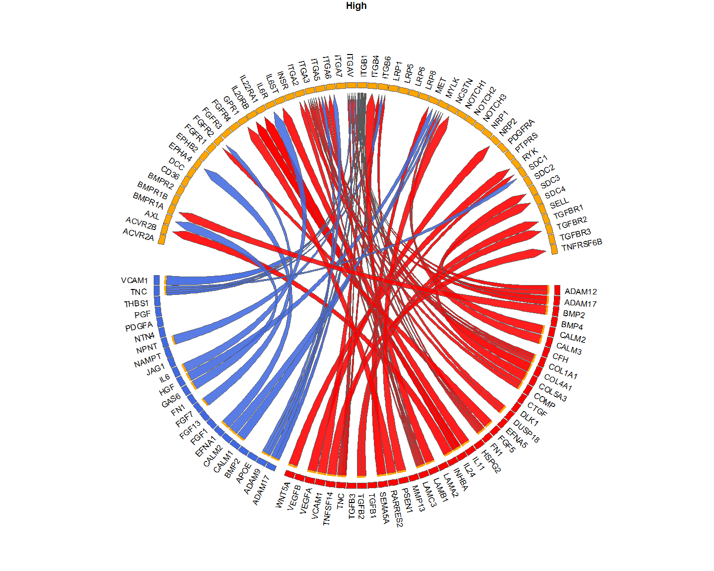<!-- -->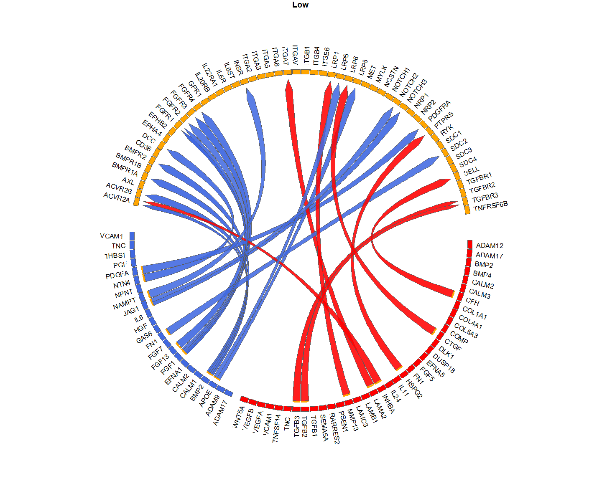<!-- -->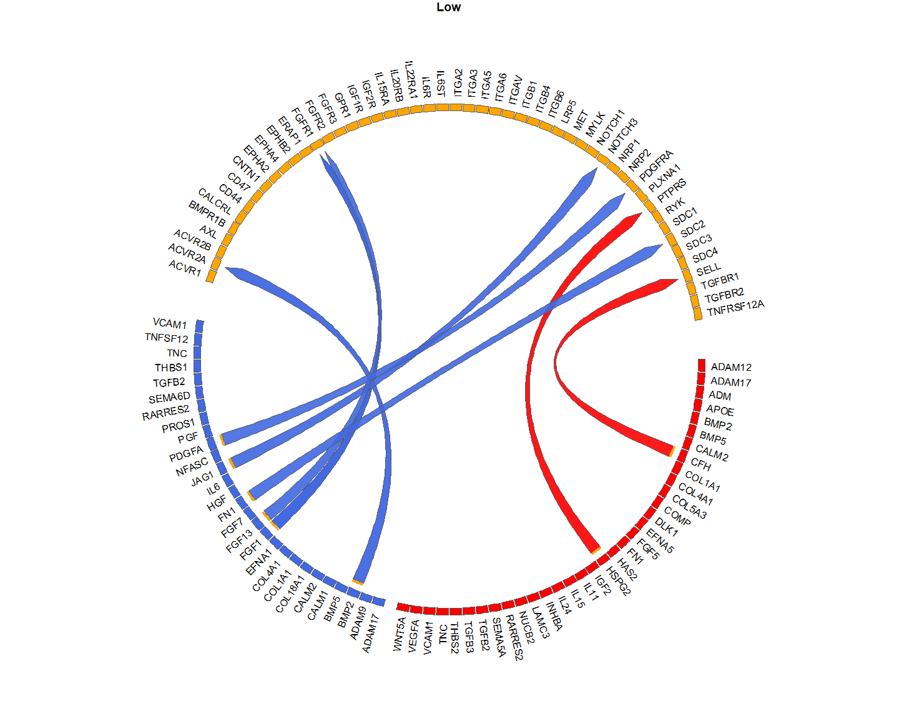<!-- -->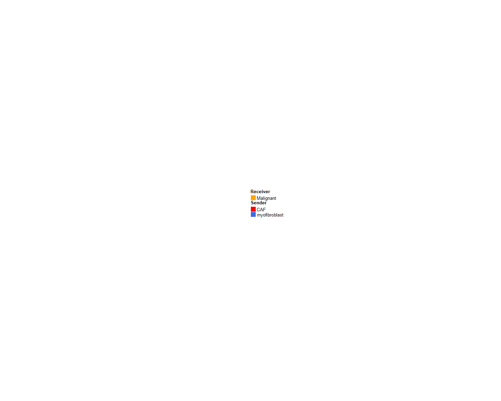<!-- -->

## Visualization of scaled\_LR\_prod per sample

Now we will visualize per sample the scaled product of ligand and
receptor expression. Samples that were left out of the DE analysis are
indicated with a smaller dot (this helps to indicate the samples that
did not contribute to the calculation of the logFC, and thus not
contributed to the final prioritization)

We will now check the top75 interactions specific for the pEMT high
group

``` r
group_oi = "High"
```

``` r
multinichenet_output$prioritization_tables$sample_prioritization_tbl$group = factor(multinichenet_output$prioritization_tables$sample_prioritization_tbl$group, levels = c("High","Medium","Low"))

prioritized_tbl_oi = multinichenet_output$prioritization_tables$group_prioritization_tbl %>% 
  distinct(id, sender, receiver, lr_interaction, group, ligand_receptor_lfc_avg, activity_scaled, fraction_expressing_ligand_receptor,  prioritization_score) %>% 
  filter(fraction_expressing_ligand_receptor > 0) %>% 
  filter(group == group_oi) %>% group_by(group) %>% top_n(75, prioritization_score) 

plot_oi = make_sample_lr_prod_plots(multinichenet_output$prioritization_tables, prioritized_tbl_oi)
plot_oi
```

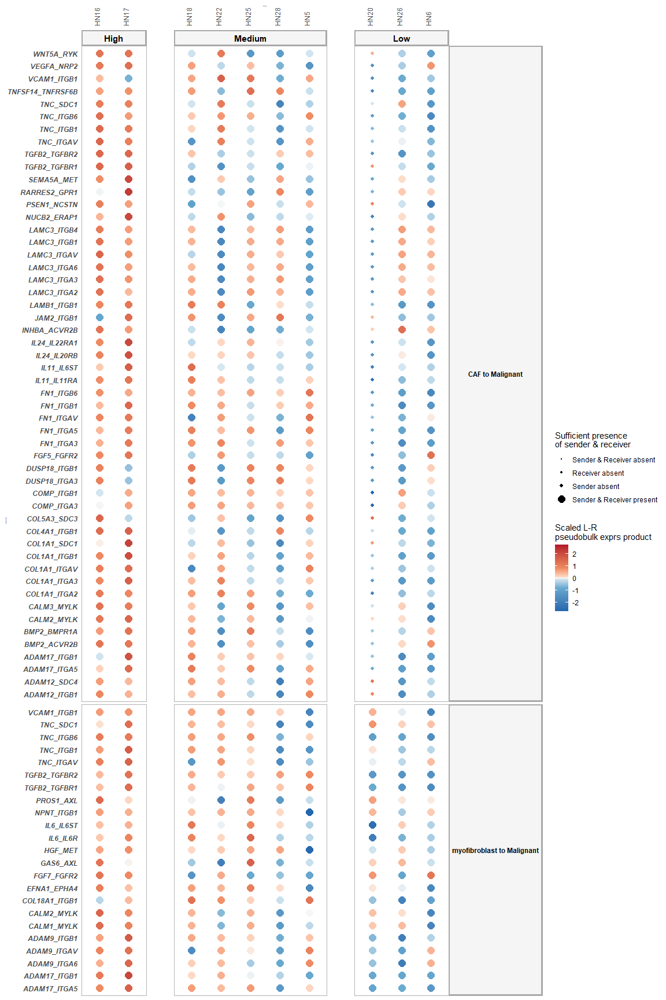<!-- -->

Next to these LR expression products, we can also plot the NicheNet
ligand activities of the ligand in the receiver.

``` r
multinichenet_output$prioritization_tables$group_prioritization_tbl$group = factor(multinichenet_output$prioritization_tables$group_prioritization_tbl$group, levels = c("High","Medium","Low"))

prioritized_tbl_oi = multinichenet_output$prioritization_tables$group_prioritization_tbl %>% 
  distinct(id, sender, receiver, lr_interaction, group, ligand_receptor_lfc_avg, activity_scaled, fraction_expressing_ligand_receptor,  prioritization_score) %>% 
  filter(fraction_expressing_ligand_receptor > 0) %>% 
  filter(group == group_oi) %>% group_by(group) %>% top_n(75, prioritization_score) 

plot_oi = make_sample_lr_prod_activity_plots(multinichenet_output$prioritization_tables, prioritized_tbl_oi, widths = c(5,1,1))
plot_oi
```

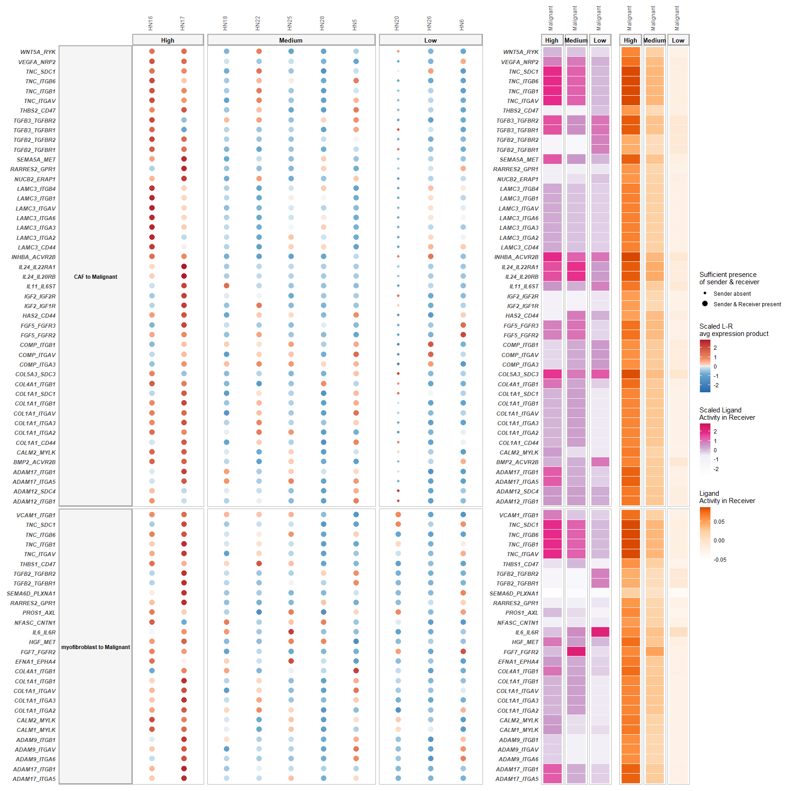<!-- -->

## Visualization of expression-logFC per group and ligand activity

Next type of plots will show the logFC of LR pairs across all
sender-receiver pairs that are selected, and add the ligand activity
next to it.

``` r
receiver_oi = "Malignant"
group_oi = "High"
```

``` r
prioritized_tbl_oi = multinichenet_output$prioritization_tables$group_prioritization_tbl %>% 
  filter(fraction_ligand_group > fraction_cutoff & fraction_receptor_group > fraction_cutoff) %>% 
  distinct(id, sender, receiver, lr_interaction, group, ligand_receptor_lfc_avg, activity_scaled, fraction_ligand_group, fraction_expressing_ligand_receptor, scaled_avg_exprs_ligand, prioritization_score) %>% 
  filter(fraction_expressing_ligand_receptor > 0) %>% 
  filter(group == group_oi & receiver == receiver_oi) %>% top_n(75, prioritization_score) 

plot_oi = make_group_lfc_exprs_activity_plot(multinichenet_output$prioritization_tables, prioritized_tbl_oi, receiver_oi, heights = c(5,1,1))
plot_oi
```

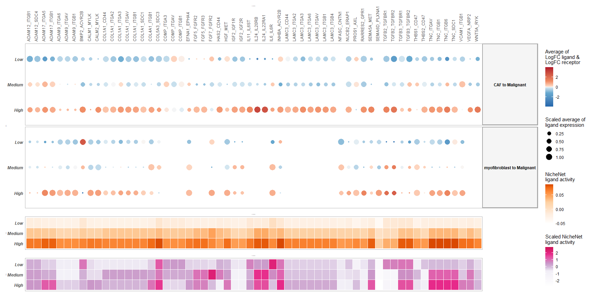<!-- -->

## Visualization of ligand-activity, ligand-target links, and target gene expression

In another type of plot, we can visualize the ligand activities for a
group-receiver combination, and show the predicted ligand-target links,
and also the expression of the predicted target genes across samples.

First: show this for a selection of ligands with high ligand activities:

``` r
group_oi = "High"
receiver_oi = "Malignant"
prioritized_tbl_oi = multinichenet_output$prioritization_tables$group_prioritization_tbl %>% 
  filter(fraction_ligand_group > fraction_cutoff & fraction_receptor_group > fraction_cutoff) %>% 
  distinct(id, sender, receiver, ligand, receptor, group, prioritization_score, ligand_receptor_lfc_avg, fraction_expressing_ligand_receptor, activity_scaled) %>% 
  filter(fraction_expressing_ligand_receptor > 0) %>% 
  filter(group == group_oi & receiver == receiver_oi) %>% 
  group_by(group) %>% top_n(50, prioritization_score) %>% top_n(25, activity_scaled) %>% arrange(-activity_scaled)
```

``` r
combined_plot = make_ligand_activity_target_plot(group_oi, receiver_oi, prioritized_tbl_oi, multinichenet_output$ligand_activities_targets_DEgenes, contrast_tbl, multinichenet_output$grouping_tbl, multinichenet_output$receiver_info, plot_legend = FALSE)
combined_plot
## $combined_plot
```

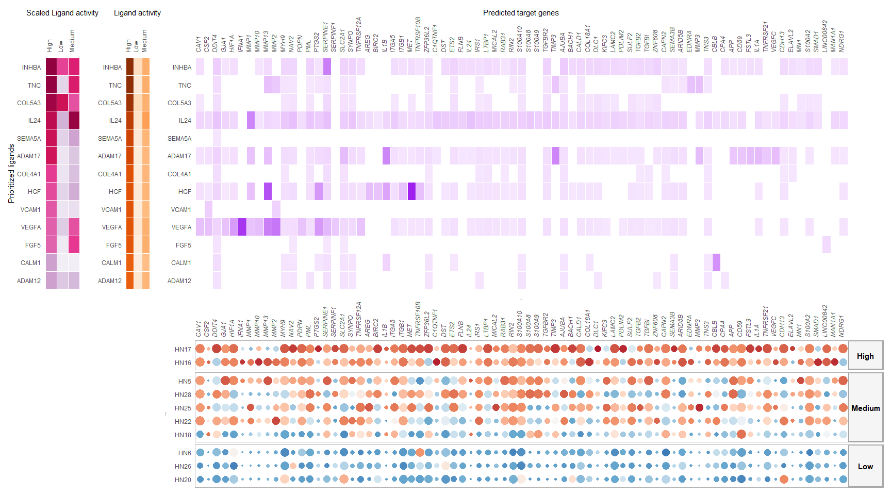<!-- -->

    ## 
    ## $legends

<!-- -->

Now: show this for a selection of ligands with high general
prioritization scores, not necessarily high ligand activities.

``` r
group_oi = "High"
receiver_oi = "Malignant"
prioritized_tbl_oi = multinichenet_output$prioritization_tables$group_prioritization_tbl %>% 
  filter(fraction_ligand_group > fraction_cutoff & fraction_receptor_group > fraction_cutoff) %>% 
  distinct(id, sender, receiver, ligand, receptor, group, prioritization_score, ligand_receptor_lfc_avg, fraction_expressing_ligand_receptor, activity_scaled) %>% 
  filter(fraction_expressing_ligand_receptor > 0) %>% 
  filter(group == group_oi & receiver == receiver_oi) %>% 
  group_by(group) %>% top_n(25, prioritization_score) %>% arrange(-activity_scaled)
```

``` r
combined_plot = make_ligand_activity_target_plot(group_oi, receiver_oi, prioritized_tbl_oi, multinichenet_output$ligand_activities_targets_DEgenes, contrast_tbl, multinichenet_output$grouping_tbl, multinichenet_output$receiver_info, plot_legend = FALSE)
combined_plot
## $combined_plot
```

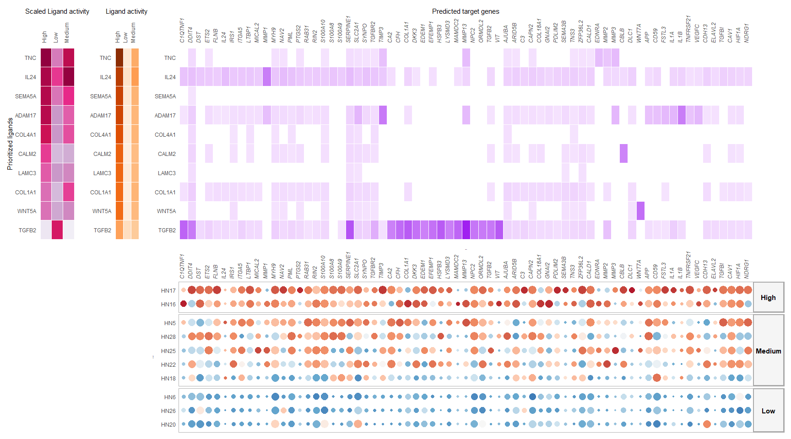<!-- -->

    ## 
    ## $legends

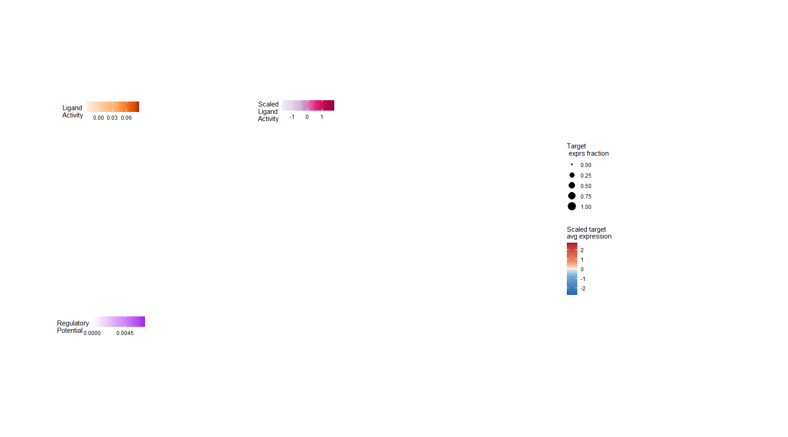<!-- -->

## Show ligand activities for each receiver-group combination

In the next type of plot, we plot all the ligand activities (Both scaled
and absolute activities) of each receiver-group combination. This can
give us some insights in active signaling pathways across groups. Note
that we can thus show top ligands based on ligand activity - agnostic of
expression in sender.

``` r
ligands_oi = multinichenet_output$prioritization_tables$ligand_activities_target_de_tbl %>% inner_join(contrast_tbl) %>% 
  group_by(group, receiver) %>% distinct(ligand, receiver, group, activity) %>% 
  top_n(5, activity) %>% pull(ligand) %>% unique()

plot_oi = make_ligand_activity_plots(multinichenet_output$prioritization_tables, ligands_oi, contrast_tbl, widths = NULL)
plot_oi
```

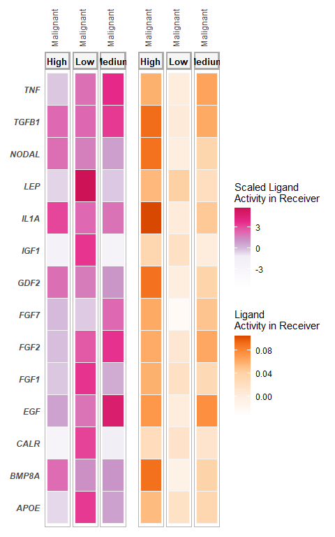<!-- -->

Or we can do this plot for ligands, while considering the general
priorization score (which considers expression information etc)

Show top ligands based on prioritization scores

``` r
ligands_oi = multinichenet_output$prioritization_tables$group_prioritization_tbl %>% 
  group_by(group, receiver) %>% distinct(ligand, receiver, group, prioritization_score) %>% 
  top_n(5, prioritization_score) %>% pull(ligand) %>% unique()

plot_oi = make_ligand_activity_plots(multinichenet_output$prioritization_tables, ligands_oi, contrast_tbl, widths = NULL)
plot_oi
```

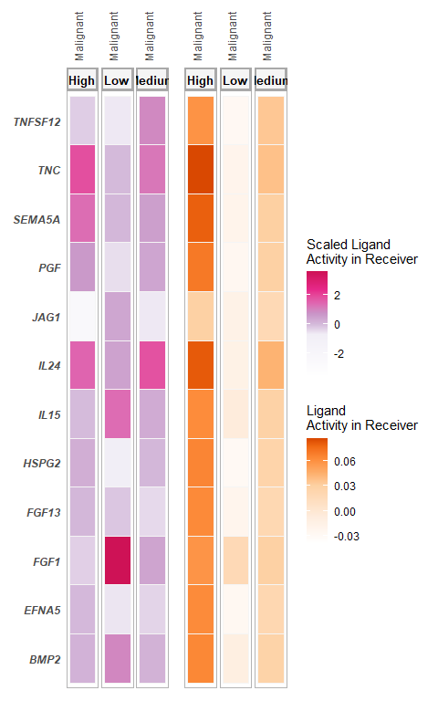<!-- -->

## Zoom in on specific ligand-receptor interactions: show their expression in the single-cell data!

Single-cell-based Nebulosa, Feature, and Violin plots of ligand-receptor
interaction of interest: `make_ligand_receptor_nebulosa_feature_plot`
and `make_ligand_receptor_violin_plot`

It is often useful to zoom in on specific ligand-receptor interactions
of interest by looking in more detail to their expression at the single
cell level

Check the highest scoring links based on the general prioritization
score. Here we will pick one of those to visualize.

``` r
prioritized_tbl_oi = multinichenet_output$prioritization_tables$group_prioritization_tbl %>% 
  filter(fraction_ligand_group > fraction_cutoff & fraction_receptor_group > fraction_cutoff) %>% 
  distinct(id, sender, receiver, ligand, receptor, group, prioritization_score) %>% 
  group_by(group, receiver) %>% top_n(5, prioritization_score) 
prioritized_tbl_oi
## # A tibble: 15 x 7
## # Groups:   group, receiver [3]
##    group  sender        receiver  ligand  receptor  id                                        prioritization_score
##    <fct>  <chr>         <chr>     <chr>   <chr>     <chr>                                                    <dbl>
##  1 High   CAF           Malignant IL24    IL20RB    IL24_IL20RB_CAF_Malignant                                1.08 
##  2 High   CAF           Malignant TNC     ITGB6     TNC_ITGB6_CAF_Malignant                                  1.06 
##  3 High   CAF           Malignant SEMA5A  MET       SEMA5A_MET_CAF_Malignant                                 1.06 
##  4 High   CAF           Malignant TNC     ITGB1     TNC_ITGB1_CAF_Malignant                                  1.05 
##  5 High   CAF           Malignant TNC     ITGAV     TNC_ITGAV_CAF_Malignant                                  1.05 
##  6 Medium myofibroblast Malignant PGF     NRP1      PGF_NRP1_myofibroblast_Malignant                         0.996
##  7 Low    myofibroblast Malignant FGF1    FGFR1     FGF1_FGFR1_myofibroblast_Malignant                       0.985
##  8 Medium CAF           Malignant EFNA5   EPHB2     EFNA5_EPHB2_CAF_Malignant                                0.957
##  9 Low    myofibroblast Malignant BMP2    ACVR2A    BMP2_ACVR2A_myofibroblast_Malignant                      0.942
## 10 Medium CAF           Malignant IL15    IL15RA    IL15_IL15RA_CAF_Malignant                                0.941
## 11 Medium myofibroblast Malignant TNFSF12 TNFRSF12A TNFSF12_TNFRSF12A_myofibroblast_Malignant                0.938
## 12 Medium CAF           Malignant EFNA5   EPHA2     EFNA5_EPHA2_CAF_Malignant                                0.924
## 13 Low    myofibroblast Malignant JAG1    NOTCH3    JAG1_NOTCH3_myofibroblast_Malignant                      0.906
## 14 Low    myofibroblast Malignant FGF13   FGFR1     FGF13_FGFR1_myofibroblast_Malignant                      0.900
## 15 Low    CAF           Malignant HSPG2   PTPRS     HSPG2_PTPRS_CAF_Malignant                                0.897
```

``` r
ligand_oi = "IL24"
receptor_oi = "IL20RB"
group_oi = "High"
sender_oi = "CAF"
receiver_oi = "Malignant"
```

Nebulosa and Feature plot of the ligand in the sender cell type and the
receptor in the receiver cell type (split per condition)

``` r
plot_list = make_ligand_receptor_nebulosa_feature_plot(seurat_obj_sender = seurat_obj_sender, seurat_obj_receiver = seurat_obj_receiver, ligand_oi = ligand_oi, receptor_oi = receptor_oi, group_oi = group_oi, group_id = group_id, celltype_id_sender = celltype_id_sender, celltype_id_receiver = celltype_id_receiver, senders_oi = c("myofibroblast","CAF"), receivers_oi = c("Malignant"), prioritized_tbl_oi = prioritized_tbl_oi)
plot_list$nebulosa # not recommended for Smart-seq data
```

<!-- -->

``` r
plot_list$feature
```

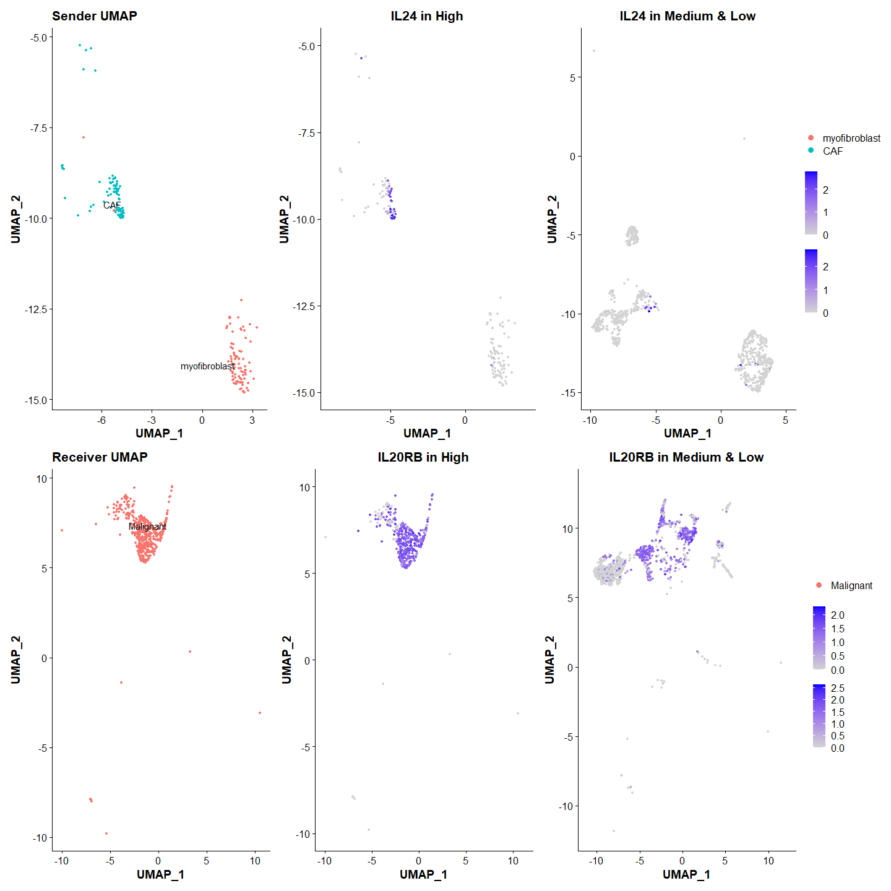<!-- -->
Pooled single-cell and sample-specific single-cell violin plots of
ligand and receptor expression in respectively sender and receiver.

``` r
plot_list2 = make_ligand_receptor_violin_plot(seurat_obj_sender = seurat_obj_sender, seurat_obj_receiver = seurat_obj_receiver, ligand_oi = ligand_oi, receptor_oi = receptor_oi, group_oi = group_oi, group_id = group_id, sender_oi = sender_oi, receiver_oi = receiver_oi, sample_id = sample_id, celltype_id_sender = celltype_id_sender, celltype_id_receiver = celltype_id_receiver, prioritized_tbl_oi = prioritized_tbl_oi)
plot_list2$violin_group
```

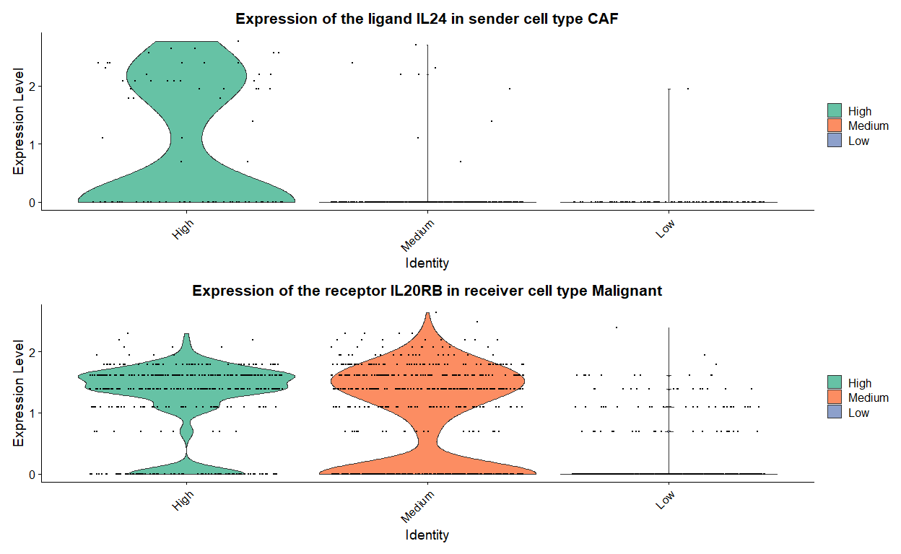<!-- -->

``` r
plot_list2$violin_sample
```

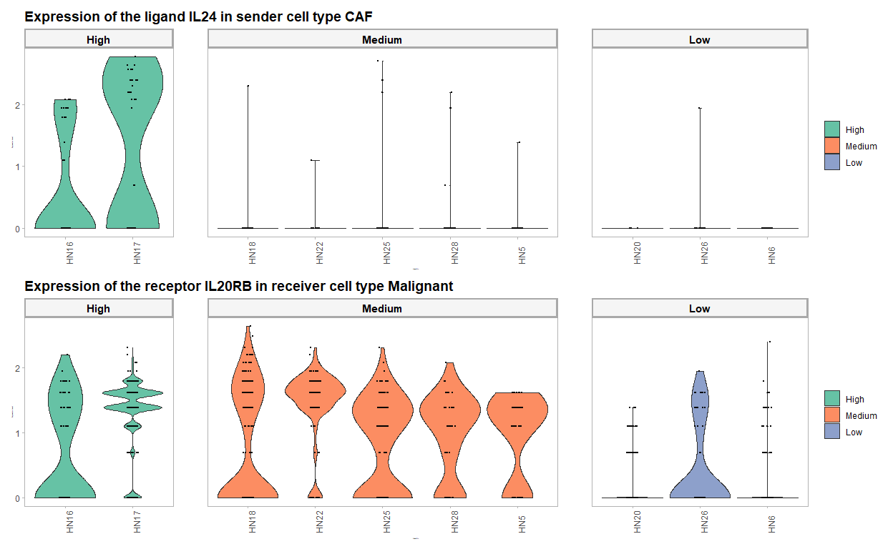<!-- -->

## Zoom in on specific ligand-target interactions: show their expression in the single-cell data!

Make target gene violin and nebulosa plots: `make_target_violin_plot`
and `make_target_nebulosa_feature_plot`

``` r
receiver_oi = "Malignant"
group_oi = "High"

multinichenet_output$ligand_activities_targets_DEgenes$de_genes_df %>% inner_join(contrast_tbl) %>% filter(p_val <= 0.05) %>% filter(group == group_oi) %>% filter(receiver == receiver_oi) %>% arrange(p_val) %>% top_n(100, logFC)  
## # A tibble: 100 x 7
##    gene    receiver  logFC      p_val  p_adj contrast            group
##    <chr>   <chr>     <dbl>      <dbl>  <dbl> <chr>               <chr>
##  1 LTBP1   Malignant  2.6  0.00000233 0.0185 High-(Medium+Low)/2 High 
##  2 MMP10   Malignant  3    0.0000461  0.137  High-(Medium+Low)/2 High 
##  3 LPXN    Malignant  3.36 0.000386   0.413  High-(Medium+Low)/2 High 
##  4 LGALS9C Malignant  2.72 0.000479   0.413  High-(Medium+Low)/2 High 
##  5 CGB8    Malignant  4.35 0.000501   0.413  High-(Medium+Low)/2 High 
##  6 INHBA   Malignant  2.91 0.000637   0.413  High-(Medium+Low)/2 High 
##  7 NEFM    Malignant  6.49 0.000689   0.413  High-(Medium+Low)/2 High 
##  8 TAGLN   Malignant  2.48 0.000912   0.413  High-(Medium+Low)/2 High 
##  9 TGFB2   Malignant  3.19 0.00111    0.413  High-(Medium+Low)/2 High 
## 10 GCNT1   Malignant  3.03 0.00118    0.413  High-(Medium+Low)/2 High 
## # ... with 90 more rows
```

RAB31: interesting gene

``` r
target_oi = "MMP10"

make_target_violin_plot(seurat_obj_receiver = seurat_obj_receiver, target_oi = target_oi, receiver_oi = receiver_oi, group_oi = group_oi, group_id = group_id, sample_id, celltype_id_receiver = celltype_id_receiver, multinichenet_output$prioritization_tables$group_prioritization_tbl)
## $violin_group
```

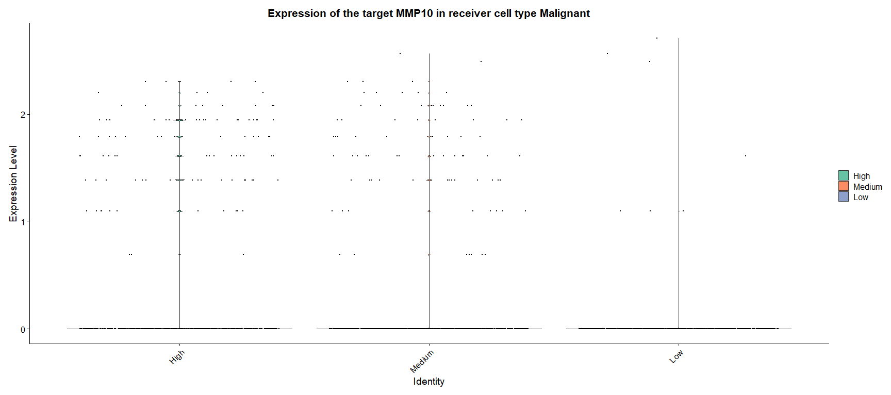<!-- -->

    ## 
    ## $violin_sample

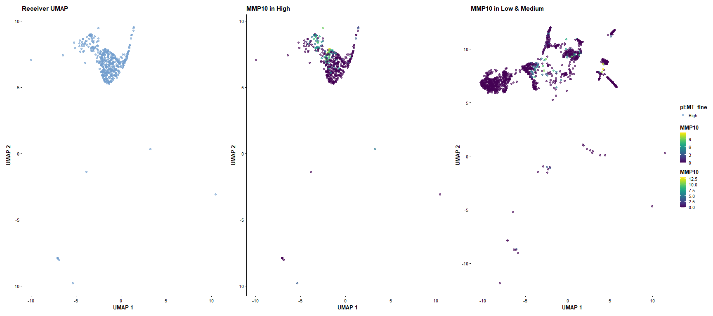<!-- -->

``` r
make_target_nebulosa_feature_plot(seurat_obj_receiver = seurat_obj_receiver, target_oi = target_oi, group_oi = group_oi, group_id = group_id, celltype_id_receiver = celltype_id_receiver, receivers_oi = c("Malignant"), multinichenet_output$prioritization_tables$group_prioritization_tbl) 
## $nebulosa
```

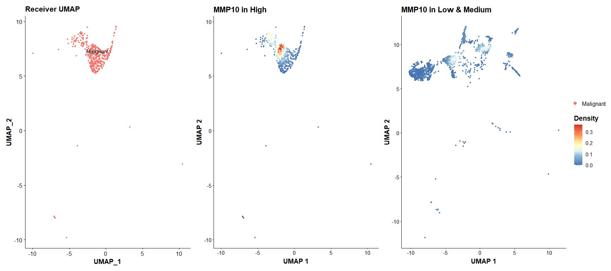<!-- -->

    ## 
    ## $feature

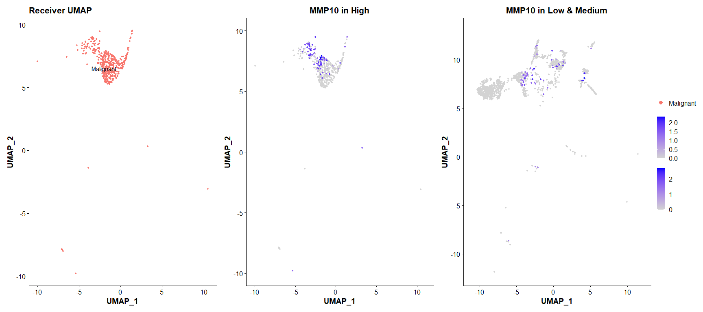<!-- -->

## Make Dotplot for all DE genes/targets

Note: DE here determined based on the parameters used for the
MultiNicheNet analysis (cf above): this means that DE genes are here not
based on the p-value corrected for multiple testing!

Only top 100 genes here for visualization purposes

``` r
receiver_oi = "Malignant"
group_oi = "High"

targets_oi = multinichenet_output$ligand_activities_targets_DEgenes$de_genes_df %>% inner_join(contrast_tbl) %>% filter(group == group_oi) %>% arrange(p_val) %>% filter(receiver == receiver_oi) %>% top_n(100, logFC) %>% pull(gene) %>% unique()
```

``` r
p_target = make_sample_target_plots(receiver_info = multinichenet_output$receiver_info, targets_oi, receiver_oi, multinichenet_output$grouping_tbl)
p_target + ggtitle(paste0("DE genes in ",group_oi, " in celltype ",receiver_oi))
```

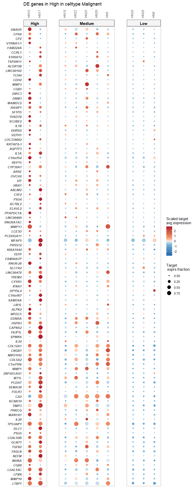<!-- -->

## References
