<style type="text/css">
.smaller {
  font-size: 10px
}
</style>

<!-- github markdown built using
rmarkdown::render("vignettes/batch_correction_analysis_LungAtlas.Rmd", clean = FALSE )
-->


In this vignette, you can learn how to perform a MultiNicheNet analysis to compare cell-cell communication between two conditions of interest (one-vs-one comparison) while correcting for __batch effects__. A MultiNicheNet analysis can be performed if you have multi-sample, multi-condition/group single-cell data. We strongly recommend having at least 4 samples in each of the groups/conditions you want to compare. With less samples, the benefits of performing a pseudobulk-based DE analysis are less clear. For those datasets, you can check and run our alternative workflow that makes use of cell-level sample-agnostic differential expression tools.

As input you need a SingleCellExperiment object containing at least the raw count matrix and metadata providing the following information for each cell: the **group**, **sample** and **cell type**.

As example expression data of interacting cells, we will here use merged scRNAseq data from four studies comparing healthy lungs to lungs from patients with idiopathic pulmonary fibrosis (IPF)) (Adams 2020, Reyfman 2019, Morse 2019, and Habermann 2020). Harmonized cell type annotations across the 4 different studies were obtained through Azimuth [Azimuth meta-analysis of human scRNA-seq datasets](https://cellxgene.cziscience.com/collections/2f75d249-1bec-459b-bf2b-b86221097ced).

We will here demonstrate how MultiNicheNet can exploit the flexibility of generalized linear models in the pseudobulk-edgeR framework to correct for batch effects, here the source study: Adams 2020, Reyfman 2019, Morse 2019, or Habermann 2020. We will apply MultiNicheNet to compare cell-cell interaction changes between IPF and healthy tissue. Note that the only required input for a batch-correcting MultiNicheNet analysis is a merged scRNA-seq object containing raw counts and harmonized cell type annotations.

We will first prepare the MultiNicheNet core analysis, then run the several steps in the MultiNicheNet core analysis, and finally interpret the output.

# Preparation of the MultiNicheNet core analysis


```r
library(SingleCellExperiment)
library(dplyr)
library(ggplot2)
library(nichenetr)
library(multinichenetr)
```

## Load NicheNet's ligand-receptor network and ligand-target matrix

MultiNicheNet builds upon the NicheNet framework and uses the same prior knowledge networks (ligand-receptor network and ligand-target matrix, currently v2 version).

The Nichenet v2 networks and matrices for both mouse and human can be downloaded from Zenodo [](https://doi.org/10.5281/zenodo.7074291). 

We will read these object in for human because our expression data is of human patients. 
Gene names are here made syntactically valid via `make.names()` to avoid the loss of genes (eg H2-M3) in downstream visualizations.


```r
organism = "human"
```


```r
options(timeout = 120)

if(organism == "human"){
  
  lr_network_all = 
    readRDS(url(
      "https://zenodo.org/record/10229222/files/lr_network_human_allInfo_30112033.rds"
      )) %>% 
    mutate(
      ligand = convert_alias_to_symbols(ligand, organism = organism), 
      receptor = convert_alias_to_symbols(receptor, organism = organism))
  
  lr_network_all = lr_network_all  %>% 
    mutate(ligand = make.names(ligand), receptor = make.names(receptor)) 
  
  lr_network = lr_network_all %>% 
    distinct(ligand, receptor)
  
  ligand_target_matrix = readRDS(url(
    "https://zenodo.org/record/7074291/files/ligand_target_matrix_nsga2r_final.rds"
    ))
  
  colnames(ligand_target_matrix) = colnames(ligand_target_matrix) %>% 
    convert_alias_to_symbols(organism = organism) %>% make.names()
  rownames(ligand_target_matrix) = rownames(ligand_target_matrix) %>% 
    convert_alias_to_symbols(organism = organism) %>% make.names()
  
  lr_network = lr_network %>% filter(ligand %in% colnames(ligand_target_matrix))
  ligand_target_matrix = ligand_target_matrix[, lr_network$ligand %>% unique()]
  
} else if(organism == "mouse"){
  
  lr_network_all = readRDS(url(
    "https://zenodo.org/record/10229222/files/lr_network_mouse_allInfo_30112033.rds"
    )) %>% 
    mutate(
      ligand = convert_alias_to_symbols(ligand, organism = organism), 
      receptor = convert_alias_to_symbols(receptor, organism = organism))
  
  lr_network_all = lr_network_all  %>% 
    mutate(ligand = make.names(ligand), receptor = make.names(receptor)) 
  lr_network = lr_network_all %>% 
    distinct(ligand, receptor)
  
  ligand_target_matrix = readRDS(url(
    "https://zenodo.org/record/7074291/files/ligand_target_matrix_nsga2r_final_mouse.rds"
    ))
  
  colnames(ligand_target_matrix) = colnames(ligand_target_matrix) %>% 
    convert_alias_to_symbols(organism = organism) %>% make.names()
  rownames(ligand_target_matrix) = rownames(ligand_target_matrix) %>% 
    convert_alias_to_symbols(organism = organism) %>% make.names()
  
  lr_network = lr_network %>% filter(ligand %in% colnames(ligand_target_matrix))
  ligand_target_matrix = ligand_target_matrix[, lr_network$ligand %>% unique()]
  
}
```

## Read in SingleCellExperiment Object

In this vignette, we will load in a subset of the integrated lung atlas data. For the sake of demonstration, this subset only contains 4 cell types. 
If you start from a Seurat object, you can convert it easily to a SingleCellExperiment object via `sce = Seurat::as.SingleCellExperiment(seurat_obj, assay = "RNA")`.

Because the NicheNet 2.0. networks are in the most recent version of the official gene symbols, we will make sure that the gene symbols used in the expression data are also updated (= converted from their "aliases" to official gene symbols). Afterwards, we will make them again syntactically valid. 


```r
sce = readRDS(url(
  "https://zenodo.org/record/8010790/files/sce_subset_lung.rds"
  ))
sce = alias_to_symbol_SCE(sce, "human") %>% makenames_SCE()
```

## Prepare the settings of the MultiNicheNet cell-cell communication analysis

In this step, we will formalize our research question into MultiNicheNet input arguments.

### Define in which metadata columns we can find the **group**, **sample** and **cell type** IDs

In this case study, we want to study differences in cell-cell communication changes between two patient groups (IPF patients vs healthy subjects), while considering the source dataset cells were derived from. Patient groups are indicated in the following meta data column: `disease`, which has 2 different values: idiopathic.pulmonary.fibrosis and normal.

Cell type annotations are indicated in the `annotation.l1` column, and the sample is indicated by the `donor` column. 
If your cells are annotated in multiple hierarchical levels, we recommend using a relatively high level in the hierarchy. This for 2 reasons: 1) MultiNicheNet focuses on differential expression and not differential abundance, and 2) there should be sufficient cells per sample-celltype combination (see later).


```r
sample_id = "donor"
group_id = "disease"
celltype_id = "annotation.l1"
```

__Important__: It is required that each sample-id is uniquely assigned to only one condition/group of interest. See the vignettes about paired and multifactorial analysis to see how to define your analysis input when you have multiple samples (and conditions) per patient.

If you would have batch effects or covariates you can correct for, you can define this here as well. Here, we want to correct for the source study, which is indicated in the following meta data column: `dataset_origin`, which has 4 different values: adams_2020, habermann_2020, morse_2019, reyfman_2019 and normal.


```r
covariates = NA
batches = "dataset_origin"
```

__Important__: for categorical covariates and batches, there should be at least one sample for every group-batch combination. If one of your groups/conditions lacks a certain level of your batch, you won't be able to correct for the batch effect because the model is then not able to distinguish batch from group/condition effects.

__Important__: The column names of group, sample, cell type, batches and covariates should be syntactically valid (`make.names`)

__Important__: All group, sample, cell type, batch and covariate names should be syntactically valid as well (`make.names`) (eg through `SummarizedExperiment::colData(sce)$ShortID = SummarizedExperiment::colData(sce)$ShortID %>% make.names()`)

### Define the contrasts of interest.

For this analysis, we want to compare how cell-cell communication differs between IPF and normal lungs.


```r
contrasts_oi = c("'idiopathic.pulmonary.fibrosis-normal','normal-idiopathic.pulmonary.fibrosis'")
```

__Very Important__ Note the format to indicate the contrasts! This formatting should be adhered to very strictly, and white spaces are not allowed! Check `?get_DE_info` for explanation about how to define this well. The most important points are that: 
*each contrast is surrounded by single quotation marks
*contrasts are separated by a comma without any white space 
*all contrasts together are surrounded by double quotation marks. 

If you compare against two groups, you should divide by 2 (as demonstrated in other vignettes), if you compare against three groups, you should divide by 3 and so on.

For downstream visualizations and linking contrasts to their main condition, we also need to run the following:
This is necessary because we will also calculate cell-type+condition specificity of ligands and receptors. 


```r
contrast_tbl = tibble(contrast =
                        c("idiopathic.pulmonary.fibrosis-normal", "normal-idiopathic.pulmonary.fibrosis"),
                      group = c("idiopathic.pulmonary.fibrosis", "normal"))
```

Other vignettes will demonstrate how to formalize different types of research questions.

### Define the sender and receiver cell types of interest.

If you want to focus the analysis on specific cell types (e.g. because you know which cell types reside in the same microenvironments based on spatial data), you can define this here. If you have sufficient computational resources and no specific idea of cell-type colocalzations, we recommend to consider all cell types as potential senders and receivers. Later on during analysis of the output it is still possible to zoom in on the cell types that interest you most, but your analysis is not biased to them.

Here we will consider all cell types in the data:


```r
senders_oi = SummarizedExperiment::colData(sce)[,celltype_id] %>% unique()
receivers_oi = SummarizedExperiment::colData(sce)[,celltype_id] %>% unique()
sce = sce[, SummarizedExperiment::colData(sce)[,celltype_id] %in% 
            c(senders_oi, receivers_oi)
          ]
```

In case you would have samples in your data that do not belong to one of the groups/conditions of interest, we recommend removing them and only keeping conditions of interest. This may be especially relevant in atlas settings where you may have cells from patients belonging to diseases that are outside of the scope of the current comparison.


```r
conditions_keep = c("normal", "idiopathic.pulmonary.fibrosis")
sce = sce[, SummarizedExperiment::colData(sce)[,group_id] %in% 
            conditions_keep
          ]
```

# Running the MultiNicheNet core analysis

Now we will run the core of a MultiNicheNet analysis. This analysis consists of the following steps:

* 1. Cell-type filtering: determine which cell types are sufficiently present
* 2. Gene filtering: determine which genes are sufficiently expressed in each present cell type
* 3. Pseudobulk expression calculation: determine and normalize per-sample pseudobulk expression levels for each expressed gene in each present cell type
* 4. Differential expression (DE) analysis: determine which genes are differentially expressed
* 5. Ligand activity prediction: use the DE analysis output to predict the activity of ligands in receiver cell types and infer their potential target genes
* 6. Prioritization: rank cell-cell communication patterns through multi-criteria prioritization

Following these steps, one can optionally 
* 7. Calculate the across-samples expression correlation between ligand-receptor pairs and target genes
* 8. Prioritize communication patterns involving condition-specific cell types through an alternative prioritization scheme

After these steps, the output can be further explored as we will demonstrate in the "Downstream analysis of the MultiNicheNet output" section. 

In this vignette, we will demonstrate these steps one-by-one, which offers the most flexibility to the user to assess intermediary results. Other vignettes will demonstrate the use of the `multi_nichenet_analysis` wrapper function.

## Cell-type filtering: determine which cell types are sufficiently present

In this step we will calculate and visualize cell type abundances. This will give an indication about which cell types will be retained in the analysis, and which cell types will be filtered out.  
Since MultiNicheNet will infer group differences at the sample level for each cell type (currently via Muscat - pseudobulking + EdgeR), we need to have sufficient cells per sample of a cell type, and this for all groups. In the following analysis we will set this minimum number of cells per cell type per sample at 10. Samples that have less than `min_cells` cells will be excluded from the analysis for that specific cell type.
 

```r
min_cells = 10
```

We recommend using `min_cells = 10`, except for datasets with several lowly abundant cell types of interest. For those datasets, we recommend using `min_cells = 5`.


```r
abundance_info = get_abundance_info(
  sce = sce, 
  sample_id = sample_id, group_id = group_id, celltype_id = celltype_id, 
  min_cells = min_cells, 
  senders_oi = senders_oi, receivers_oi = receivers_oi, 
  batches = batches
  )
```

First, we will check the cell type abundance diagnostic plots.

### Interpretation of cell type abundance information

The first plot visualizes the number of cells per celltype-sample combination, and indicates which combinations are removed during the DE analysis because there are less than `min_cells` in the celltype-sample combination. 


```r
abundance_info$abund_plot_sample
```

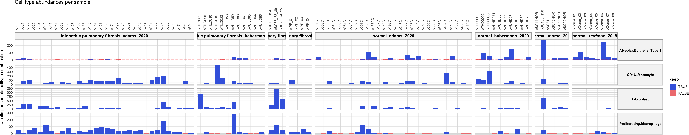

The red dotted line indicates the required minimum of cells as defined above in `min_cells`. We can see here that some sample-celltype combinations are left out. For the DE analysis in the next step, only cell types will be considered if there are at least two samples per condition-batch combination with a sufficient number of cells. 

__Important__: Based on the cell type abundance diagnostics, we recommend users to change their analysis settings if required (eg changing cell type annotation level, batches, ...), before proceeding with the rest of the analysis. If too many celltype-sample combinations don't pass this threshold, we recommend to define your cell types in a more general way (use one level higher of the cell type ontology hierarchy) (eg TH17 CD4T cells --> CD4T cells) or use `min_cells = 5` if this would not be possible.


### Cell type filtering based on cell type abundance information

Running the following block of code can help you determine which cell types are condition-specific and which cell types are absent. 


```r
sample_group_celltype_df = abundance_info$abundance_data %>% 
  filter(n > min_cells) %>% 
  ungroup() %>% 
  distinct(sample_id, group_id) %>% 
  cross_join(
    abundance_info$abundance_data %>% 
      ungroup() %>% 
      distinct(celltype_id)
    ) %>% 
  arrange(sample_id)

abundance_df = sample_group_celltype_df %>% left_join(
  abundance_info$abundance_data %>% ungroup()
  )

abundance_df$n[is.na(abundance_df$n)] = 0
abundance_df$keep[is.na(abundance_df$keep)] = FALSE
abundance_df_summarized = abundance_df %>% 
  mutate(keep = as.logical(keep)) %>% 
  group_by(group_id, celltype_id) %>% 
  summarise(samples_present = sum((keep)))

celltypes_absent_one_condition = abundance_df_summarized %>% 
  filter(samples_present == 0) %>% pull(celltype_id) %>% unique() 
# find truly condition-specific cell types by searching for cell types 
# truely absent in at least one condition

celltypes_present_one_condition = abundance_df_summarized %>% 
  filter(samples_present >= 2) %>% pull(celltype_id) %>% unique() 
# require presence in at least 2 samples of one group so 
# it is really present in at least one condition

condition_specific_celltypes = intersect(
  celltypes_absent_one_condition, 
  celltypes_present_one_condition)

total_nr_conditions = SummarizedExperiment::colData(sce)[,group_id] %>% 
  unique() %>% length() 

absent_celltypes = abundance_df_summarized %>% 
  filter(samples_present < 2) %>% 
  group_by(celltype_id) %>% 
  count() %>% 
  filter(n == total_nr_conditions) %>% 
  pull(celltype_id)
  
print("condition-specific celltypes:")
## [1] "condition-specific celltypes:"
print(condition_specific_celltypes)
## character(0)
  
print("absent celltypes:")
## [1] "absent celltypes:"
print(absent_celltypes)
## character(0)
```
Absent cell types will be filtered out, condition-specific cell types can be filtered out if you as a user do not want to run the alternative workflow for condition-specific cell types in the optional step 8 of the core MultiNicheNet analysis. 


```r
analyse_condition_specific_celltypes = FALSE
```


```r
if(analyse_condition_specific_celltypes == TRUE){
  senders_oi = senders_oi %>% setdiff(absent_celltypes)
  receivers_oi = receivers_oi %>% setdiff(absent_celltypes)
} else {
  senders_oi = senders_oi %>% 
    setdiff(union(absent_celltypes, condition_specific_celltypes))
  receivers_oi = receivers_oi %>% 
    setdiff(union(absent_celltypes, condition_specific_celltypes))
}

sce = sce[, SummarizedExperiment::colData(sce)[,celltype_id] %in% 
            c(senders_oi, receivers_oi)
          ]
```

## Gene filtering: determine which genes are sufficiently expressed in each present cell type

Before running the DE analysis, we will determine which genes are not sufficiently expressed and should be filtered out. 
We will perform gene filtering based on a similar procedure as used in `edgeR::filterByExpr`. However, we adapted this procedure to be more interpretable for single-cell datasets.  

For each cell type, we will consider genes expressed if they are expressed in at least a `min_sample_prop` fraction of samples in the condition with the lowest number of samples. By default, we set `min_sample_prop = 0.50`, which means that genes should be expressed in at least 2 samples if the group with lowest nr. of samples has 4 samples like this dataset. 


```r
min_sample_prop = 0.50
```

But how do we define which genes are expressed in a sample? For this we will consider genes as expressed if they have non-zero expression values in a `fraction_cutoff` fraction of cells of that cell type in that sample. By default, we set `fraction_cutoff = 0.05`, which means that genes should show non-zero expression values in at least 5% of cells in a sample. 


```r
fraction_cutoff = 0.05
```

We recommend using these default values unless there is specific interest in prioritizing (very) weakly expressed interactions. In that case, you could lower the value of `fraction_cutoff`. We explicitly recommend against using `fraction_cutoff > 0.10`.

Now we will calculate the information required for gene filtering with the following command:


```r
frq_list = get_frac_exprs(
  sce = sce, 
  sample_id = sample_id, celltype_id =  celltype_id, group_id = group_id, 
  batches = batches, 
  min_cells = min_cells, 
  fraction_cutoff = fraction_cutoff, min_sample_prop = min_sample_prop)
## [1] "Samples are considered if they have more than 10 cells of the cell type of interest"
## [1] "Genes with non-zero counts in at least 5% of cells of a cell type of interest in a particular sample will be considered as expressed in that sample."
## [1] "Genes expressed in at least 6 samples will considered as expressed in the cell type: Alveolar.Epithelial.Type.1"
## [1] "Genes expressed in at least 16 samples will considered as expressed in the cell type: CD16..Monocyte"
## [1] "Genes expressed in at least 16 samples will considered as expressed in the cell type: Fibroblast"
## [1] "Genes expressed in at least 6.5 samples will considered as expressed in the cell type: Proliferating.Macrophage"
## [1] "10193 genes are considered as expressed in the cell type: Alveolar.Epithelial.Type.1"
## [1] "8810 genes are considered as expressed in the cell type: CD16..Monocyte"
## [1] "10643 genes are considered as expressed in the cell type: Fibroblast"
## [1] "11018 genes are considered as expressed in the cell type: Proliferating.Macrophage"
```

Now only keep genes that are expressed by at least one cell type:


```r
genes_oi = frq_list$expressed_df %>% 
  filter(expressed == TRUE) %>% pull(gene) %>% unique() 
sce = sce[genes_oi, ]
```

## Pseudobulk expression calculation: determine and normalize per-sample pseudobulk expression levels for each expressed gene in each present cell type

After filtering out absent cell types and genes, we will continue the analysis by calculating the different prioritization criteria that we will use to prioritize cell-cell communication patterns.

First, we will determine and normalize per-sample pseudobulk expression levels for each expressed gene in each present cell type. The function `process_abundance_expression_info` will link this expression information for ligands of the sender cell types to the corresponding receptors of the receiver cell types. This will later on allow us to define the cell-type specicificy criteria for ligands and receptors.


```r
abundance_expression_info = process_abundance_expression_info(
  sce = sce, 
  sample_id = sample_id, group_id = group_id, celltype_id = celltype_id, 
  min_cells = min_cells, 
  senders_oi = senders_oi, receivers_oi = receivers_oi, 
  lr_network = lr_network, 
  batches = batches, 
  frq_list = frq_list, 
  abundance_info = abundance_info)
```

Normalized pseudobulk expression values per gene/celltype/sample can be inspected by:


```r
abundance_expression_info$celltype_info$pb_df %>% head()
## # A tibble: 6 × 4
##   gene    sample  pb_sample celltype      
##   <chr>   <chr>       <dbl> <fct>         
## 1 A1BG    pVUHD66      6.07 CD16..Monocyte
## 2 A2M     pVUHD66      4.53 CD16..Monocyte
## 3 A2ML1   pVUHD66      0    CD16..Monocyte
## 4 A3GALT2 pVUHD66      0    CD16..Monocyte
## 5 A4GALT  pVUHD66      0    CD16..Monocyte
## 6 A4GNT   pVUHD66      0    CD16..Monocyte
```

An average of these sample-level expression values per condition/group can be inspected by:


```r
abundance_expression_info$celltype_info$pb_df_group %>% head()
## # A tibble: 6 × 4
## # Groups:   group, celltype [1]
##   group                         celltype                   gene    pb_group
##   <chr>                         <chr>                      <chr>      <dbl>
## 1 idiopathic.pulmonary.fibrosis Alveolar.Epithelial.Type.1 A1BG       3.37 
## 2 idiopathic.pulmonary.fibrosis Alveolar.Epithelial.Type.1 A2M        2.73 
## 3 idiopathic.pulmonary.fibrosis Alveolar.Epithelial.Type.1 A2ML1      0.410
## 4 idiopathic.pulmonary.fibrosis Alveolar.Epithelial.Type.1 A3GALT2    0    
## 5 idiopathic.pulmonary.fibrosis Alveolar.Epithelial.Type.1 A4GALT     1.07 
## 6 idiopathic.pulmonary.fibrosis Alveolar.Epithelial.Type.1 A4GNT      0
```

Inspecting these values for ligand-receptor interactions can be done by:


```r
abundance_expression_info$sender_receiver_info$pb_df %>% head()
## # A tibble: 6 × 8
##   sample    sender         receiver                   ligand receptor pb_ligand pb_receptor ligand_receptor_pb_prod
##   <chr>     <chr>          <chr>                      <chr>  <chr>        <dbl>       <dbl>                   <dbl>
## 1 pTILD006  Fibroblast     Fibroblast                 TIMP1  CD63          14.4        12.6                    182.
## 2 pTILD006  CD16..Monocyte Fibroblast                 TIMP1  CD63          13.7        12.6                    174.
## 3 p208C     Fibroblast     Fibroblast                 TIMP1  CD63          15.0        11.5                    173.
## 4 pDonor_07 Fibroblast     Alveolar.Epithelial.Type.1 TIMP1  CD63          14.4        12.0                    173.
## 5 pDonor_07 Fibroblast     Fibroblast                 TIMP1  CD63          14.4        11.7                    169.
## 6 pTILD006  Fibroblast     CD16..Monocyte             TIMP1  CD63          14.4        11.6                    167.
abundance_expression_info$sender_receiver_info$pb_df_group %>% head()
## # A tibble: 6 × 8
## # Groups:   group, sender [2]
##   group                         sender     receiver                   ligand receptor pb_ligand_group pb_receptor_group ligand_receptor_pb_prod_group
##   <chr>                         <chr>      <chr>                      <chr>  <chr>              <dbl>             <dbl>                         <dbl>
## 1 idiopathic.pulmonary.fibrosis Fibroblast Fibroblast                 TIMP1  CD63                12.5              11.3                          142.
## 2 idiopathic.pulmonary.fibrosis Fibroblast Proliferating.Macrophage   TIMP1  CD63                12.5              11.2                          140.
## 3 normal                        Fibroblast Fibroblast                 TIMP1  CD63                12.5              10.9                          137.
## 4 idiopathic.pulmonary.fibrosis Fibroblast Alveolar.Epithelial.Type.1 TIMP1  CD63                12.5              10.9                          136.
## 5 idiopathic.pulmonary.fibrosis Fibroblast Fibroblast                 TIMP1  MMP2                12.5              10.7                          134.
## 6 normal                        Fibroblast Alveolar.Epithelial.Type.1 TIMP1  CD63                12.5              10.7                          134.
```

## Differential expression (DE) analysis: determine which genes are differentially expressed

In this step, we will perform genome-wide differential expression analysis of receiver and sender cell types to define DE genes between the conditions of interest (as formalized by the `contrasts_oi`). Based on this analysis, we later can define the levels of differential expression of ligands in senders and receptors in receivers, and define the set of affected target genes in the receiver cell types (which will be used for the ligand activity analysis).

We will apply pseudobulking followed by EdgeR to perform multi-condition multi-sample differential expression (DE) analysis (also called 'differential state' analysis by the developers of Muscat). 


```r
DE_info = get_DE_info(
  sce = sce, 
  sample_id = sample_id, group_id = group_id, celltype_id = celltype_id, 
  batches = batches, covariates = covariates, 
  contrasts_oi = contrasts_oi, 
  min_cells = min_cells, 
  expressed_df = frq_list$expressed_df)
## [1] "DE analysis is done:"
## [1] "included cell types are:"
## [1] "CD16..Monocyte"             "Alveolar.Epithelial.Type.1" "Fibroblast"                 "Proliferating.Macrophage"
```

### Check DE results

Check DE output information in table with logFC and p-values for each gene-celltype-contrast:


```r
DE_info$celltype_de$de_output_tidy %>% head()
## # A tibble: 6 × 9
##   gene  cluster_id       logFC logCPM       F  p_val p_adj.loc p_adj contrast                            
##   <chr> <chr>            <dbl>  <dbl>   <dbl>  <dbl>     <dbl> <dbl> <chr>                               
## 1 A1BG  CD16..Monocyte -0.143    5.07 0.337   0.563      0.827 0.827 idiopathic.pulmonary.fibrosis-normal
## 2 A2M   CD16..Monocyte  0.514    4.04 2.61    0.109      0.366 0.366 idiopathic.pulmonary.fibrosis-normal
## 3 AAAS  CD16..Monocyte  0.0185   4.46 0.00473 0.945      0.987 0.987 idiopathic.pulmonary.fibrosis-normal
## 4 AACS  CD16..Monocyte -0.59     3.89 2.94    0.09       0.334 0.334 idiopathic.pulmonary.fibrosis-normal
## 5 AAGAB CD16..Monocyte -0.137    5.47 0.594   0.443      0.743 0.743 idiopathic.pulmonary.fibrosis-normal
## 6 AAK1  CD16..Monocyte -0.352    6.7  5.96    0.0166     0.123 0.123 idiopathic.pulmonary.fibrosis-normal
```
Evaluate the distributions of p-values:


```r
DE_info$hist_pvals
```

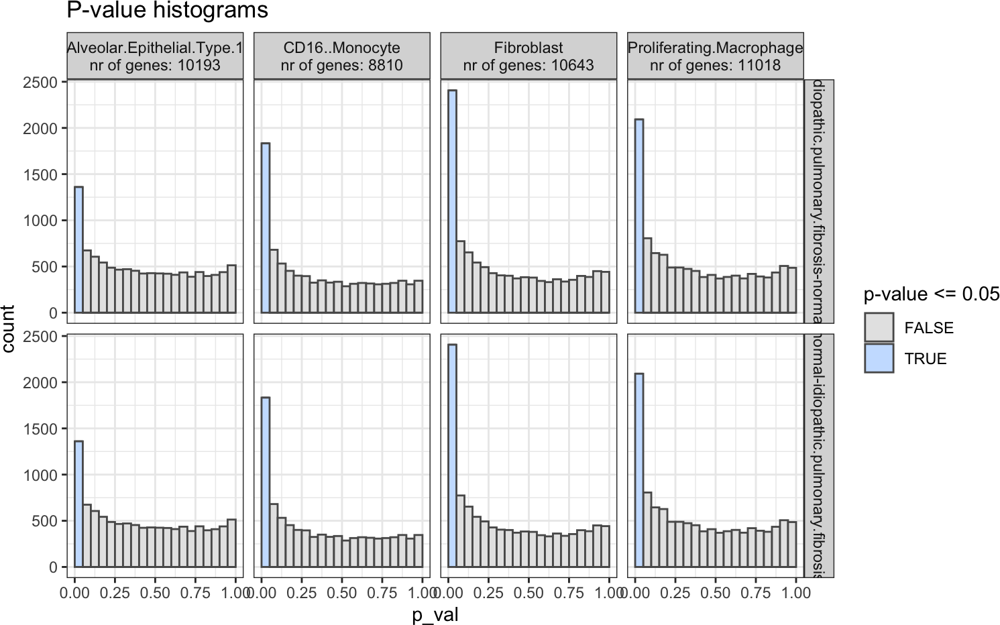

These distributions look fine (uniform distribution, except peak at p-value <= 0.05), so we will continue using these regular p-values. In case these p-value distributions look irregular, you can estimate empirical p-values as we will demonstrate in another vignette.


```r
empirical_pval = FALSE
```


```r
if(empirical_pval == TRUE){
  DE_info_emp = get_empirical_pvals(DE_info$celltype_de$de_output_tidy)
  celltype_de = DE_info_emp$de_output_tidy_emp %>% select(-p_val, -p_adj) %>% 
    rename(p_val = p_emp, p_adj = p_adj_emp)
} else {
  celltype_de = DE_info$celltype_de$de_output_tidy
} 
```

### Combine DE information for ligand-senders and receptors-receivers

To end this step, we will combine the DE information of senders and receivers by linking their ligands and receptors together based on the prior knowledge ligand-receptor network.


```r
sender_receiver_de = combine_sender_receiver_de(
  sender_de = celltype_de,
  receiver_de = celltype_de,
  senders_oi = senders_oi,
  receivers_oi = receivers_oi,
  lr_network = lr_network
)
```


```r
sender_receiver_de %>% head(20)
## # A tibble: 20 × 12
##    contrast                             sender        receiver ligand receptor lfc_ligand lfc_receptor ligand_receptor_lfc_…¹ p_val_ligand p_adj_ligand p_val_receptor p_adj_receptor
##    <chr>                                <chr>         <chr>    <chr>  <chr>         <dbl>        <dbl>                  <dbl>        <dbl>        <dbl>          <dbl>          <dbl>
##  1 idiopathic.pulmonary.fibrosis-normal Alveolar.Epi… Alveola… CDH2   CDH2           4.05        4.05                    4.05     2.21e-10     9.40e- 8       2.21e-10    0.000000094
##  2 idiopathic.pulmonary.fibrosis-normal Alveolar.Epi… Prolife… AREG   MMP9           2.94        3.86                    3.4      1.22e- 7     2.64e- 5       3.76e- 5    0.00345    
##  3 idiopathic.pulmonary.fibrosis-normal Proliferatin… Prolife… PPBP   GRM7           5.42        1.21                    3.32     2.43e- 8     2.43e- 5       1.05e- 2    0.112      
##  4 idiopathic.pulmonary.fibrosis-normal Proliferatin… Fibrobl… SPP1   ITGA8          5.01        1.51                    3.26     1.24e- 6     3.58e- 4       6.5 e- 5    0.00239    
##  5 idiopathic.pulmonary.fibrosis-normal Proliferatin… Alveola… SPP1   ITGB6          5.01        1.44                    3.22     1.24e- 6     3.58e- 4       2.44e- 9    0.000000804
##  6 idiopathic.pulmonary.fibrosis-normal Proliferatin… Fibrobl… PPBP   ADRA2A         5.42        0.968                   3.19     2.43e- 8     2.43e- 5       2.21e- 2    0.132      
##  7 idiopathic.pulmonary.fibrosis-normal Proliferatin… Alveola… SPP1   ITGAV          5.01        1.31                    3.16     1.24e- 6     3.58e- 4       6.28e- 7    0.000108   
##  8 idiopathic.pulmonary.fibrosis-normal Proliferatin… Prolife… PPBP   OPRD1          5.42        0.817                   3.12     2.43e- 8     2.43e- 5       2.68e- 1    0.608      
##  9 idiopathic.pulmonary.fibrosis-normal Proliferatin… Prolife… CCL7   CCR3           4.92        1.25                    3.08     1.15e- 8     2.14e- 5       4.15e- 2    0.237      
## 10 idiopathic.pulmonary.fibrosis-normal Proliferatin… Prolife… SPP1   ITGA8          5.01        1.07                    3.04     1.24e- 6     3.58e- 4       1.07e- 1    0.394      
## 11 idiopathic.pulmonary.fibrosis-normal Proliferatin… Prolife… CCL22  DPP4           3.27        2.78                    3.02     3.05e- 3     5.32e- 2       4.44e- 3    0.0662     
## 12 idiopathic.pulmonary.fibrosis-normal Proliferatin… Fibrobl… PPBP   OPRM1          5.42        0.592                   3.01     2.43e- 8     2.43e- 5       1.99e- 1    0.486      
## 13 idiopathic.pulmonary.fibrosis-normal Proliferatin… Prolife… TIMP3  MMP9           2.03        3.86                    2.94     1.37e- 3     3.37e- 2       3.76e- 5    0.00345    
## 14 idiopathic.pulmonary.fibrosis-normal Proliferatin… Fibrobl… PPBP   GRM7           5.42        0.353                   2.89     2.43e- 8     2.43e- 5       2.37e- 1    0.532      
## 15 idiopathic.pulmonary.fibrosis-normal Proliferatin… Alveola… SPP1   ITGB5          5.01        0.714                   2.86     1.24e- 6     3.58e- 4       2.67e- 2    0.275      
## 16 idiopathic.pulmonary.fibrosis-normal Proliferatin… Prolife… CCL7   CCR5           4.92        0.801                   2.86     1.15e- 8     2.14e- 5       9.49e- 2    0.371      
## 17 normal-idiopathic.pulmonary.fibrosis Fibroblast    Alveola… HP     APOA1          2.61        3.06                    2.84     5.18e- 5     2.03e- 3       6.25e- 5    0.00472    
## 18 idiopathic.pulmonary.fibrosis-normal Alveolar.Epi… Alveola… MMP7   ERBB4          4.48        1.15                    2.82     1.75e-13     2.54e-10       1.03e- 2    0.158      
## 19 idiopathic.pulmonary.fibrosis-normal Proliferatin… Prolife… SPP1   ITGA9          5.01        0.598                   2.80     1.24e- 6     3.58e- 4       2.13e- 1    0.546      
## 20 idiopathic.pulmonary.fibrosis-normal Proliferatin… Alveola… PPBP   GRM7           5.42        0.177                   2.80     2.43e- 8     2.43e- 5       7.77e- 1    0.961      
## # ℹ abbreviated name: ¹​ligand_receptor_lfc_avg
```

## Ligand activity prediction: use the DE analysis output to predict the activity of ligands in receiver cell types and infer their potential target genes

In this step, we will predict NicheNet ligand activities and NicheNet ligand-target links based on these differential expression results. We do this to prioritize interactions based on their predicted effect on a receiver cell type. We will assume that the most important group-specific interactions are those that lead to group-specific gene expression changes in a receiver cell type.

Similarly to base NicheNet (https://github.com/saeyslab/nichenetr), we use the DE output to create a "geneset of interest": here we assume that DE genes within a cell type may be DE because of differential cell-cell communication processes. In the ligand activity prediction, we will assess the enrichment of target genes of ligands within this geneset of interest. In case high-probabiliy target genes of a ligand are enriched in this set compared to the background of expressed genes, we predict that this ligand may have a high activity. 

Because the ligand activity analysis is an enrichment procedure, it is important that this geneset of interest should contain a sufficient but not too large number of genes. The ratio geneset_oi/background should ideally be between 1/200 and 1/10 (or close to these ratios).

To determine the genesets of interest based on DE output, we need to define some logFC and/or p-value thresholds per cell type/contrast combination. In general, we recommend inspecting the nr. of DE genes for all cell types based on the default thresholds and adapting accordingly. By default, we will apply the p-value cutoff on the normal p-values, and not on the p-values corrected for multiple testing. This choice was made because most multi-sample single-cell transcriptomics datasets have just a few samples per group and we might have a lack of statistical power due to pseudobulking. But, if the smallest group >= 20 samples, we typically recommend using p_val_adj = TRUE. When the biological difference between the conditions is very large, we typically recommend increasing the logFC_threshold and/or using p_val_adj = TRUE.

### Assess geneset_oi-vs-background ratios for different DE output tresholds prior to the NicheNet ligand activity analysis 

Because we have data with many samples here, we will first inspect the geneset_oi-vs-background ratios in case of using the adjusted p-values:


```r
logFC_threshold = 0.50
p_val_threshold = 0.05
```


```r
p_val_adj = TRUE 
```


```r
geneset_assessment = contrast_tbl$contrast %>% 
  lapply(
    process_geneset_data, 
    celltype_de, logFC_threshold, p_val_adj, p_val_threshold
  ) %>% 
  bind_rows() 
geneset_assessment
## # A tibble: 8 × 12
##   cluster_id                 n_background n_geneset_up n_geneset_down prop_geneset_up prop_geneset_down in_range_up in_range_down contrast   logFC_threshold p_val_threshold adjusted
##   <chr>                             <int>        <int>          <int>           <dbl>             <dbl> <lgl>       <lgl>         <chr>                <dbl>           <dbl> <lgl>   
## 1 Alveolar.Epithelial.Type.1        10193          227             91         0.0223            0.00893 TRUE        TRUE          idiopathi…             0.5            0.05 TRUE    
## 2 CD16..Monocyte                     8810          249            366         0.0283            0.0415  TRUE        TRUE          idiopathi…             0.5            0.05 TRUE    
## 3 Fibroblast                        10643          658            302         0.0618            0.0284  TRUE        TRUE          idiopathi…             0.5            0.05 TRUE    
## 4 Proliferating.Macrophage          11018          259            270         0.0235            0.0245  TRUE        TRUE          idiopathi…             0.5            0.05 TRUE    
## 5 Alveolar.Epithelial.Type.1        10193           91            227         0.00893           0.0223  TRUE        TRUE          normal-id…             0.5            0.05 TRUE    
## 6 CD16..Monocyte                     8810          366            249         0.0415            0.0283  TRUE        TRUE          normal-id…             0.5            0.05 TRUE    
## 7 Fibroblast                        10643          302            658         0.0284            0.0618  TRUE        TRUE          normal-id…             0.5            0.05 TRUE    
## 8 Proliferating.Macrophage          11018          270            259         0.0245            0.0235  TRUE        TRUE          normal-id…             0.5            0.05 TRUE
```
We can see here that for all cell type / contrast combinations, all geneset/background ratio's are within the recommended range (`in_range_up` and `in_range_down` columns), and we will therefore proceed with these tresholds for the ligand activity analysis. When these geneset/background ratio's would not be within the recommended ranges, we should interpret ligand activity results for these cell types with more caution, or use different thresholds (for these or all cell types). 

### Perform the ligand activity analysis and ligand-target inference

After the ligand activity prediction, we will also infer the predicted target genes of these ligands in each contrast. For this ligand-target inference procedure, we also need to select which top n of the predicted target genes will be considered (here: top 250 targets per ligand). This parameter will not affect the ligand activity predictions. It will only affect ligand-target visualizations and construction of the intercellular regulatory network during the downstream analysis. We recommend users to test other settings in case they would be interested in exploring fewer, but more confident target genes, or vice versa. 


```r
top_n_target = 250
```

The NicheNet ligand activity analysis can be run in parallel for each receiver cell type, by changing the number of cores as defined here. Using more cores will speed up the analysis at the cost of needing more memory. This is only recommended if you have many receiver cell types of interest. 


```r
verbose = TRUE
cores_system = 8
n.cores = min(cores_system, celltype_de$cluster_id %>% unique() %>% length()) 
```

Running the ligand activity prediction will take some time (the more cell types and contrasts, the more time)


```r
ligand_activities_targets_DEgenes = suppressMessages(suppressWarnings(
  get_ligand_activities_targets_DEgenes(
    receiver_de = celltype_de,
    receivers_oi = intersect(receivers_oi, celltype_de$cluster_id %>% unique()),
    ligand_target_matrix = ligand_target_matrix,
    logFC_threshold = logFC_threshold,
    p_val_threshold = p_val_threshold,
    p_val_adj = p_val_adj,
    top_n_target = top_n_target,
    verbose = verbose, 
    n.cores = n.cores
  )
))
```

You can check the output of the ligand activity and ligand-target inference here:


```r
ligand_activities_targets_DEgenes$ligand_activities %>% head(20)
## # A tibble: 20 × 8
## # Groups:   receiver, contrast [1]
##    ligand activity contrast                             target   ligand_target_weight receiver                   direction_regulation activity_scaled
##    <chr>     <dbl> <chr>                                <chr>                   <dbl> <chr>                      <fct>                          <dbl>
##  1 A2M      0.0286 idiopathic.pulmonary.fibrosis-normal BAX                   0.0115  Alveolar.Epithelial.Type.1 up                             0.469
##  2 A2M      0.0286 idiopathic.pulmonary.fibrosis-normal BMP4                  0.00776 Alveolar.Epithelial.Type.1 up                             0.469
##  3 A2M      0.0286 idiopathic.pulmonary.fibrosis-normal CCL2                  0.0117  Alveolar.Epithelial.Type.1 up                             0.469
##  4 A2M      0.0286 idiopathic.pulmonary.fibrosis-normal CCND1                 0.0186  Alveolar.Epithelial.Type.1 up                             0.469
##  5 A2M      0.0286 idiopathic.pulmonary.fibrosis-normal CCND2                 0.00954 Alveolar.Epithelial.Type.1 up                             0.469
##  6 A2M      0.0286 idiopathic.pulmonary.fibrosis-normal CDKN2A                0.00716 Alveolar.Epithelial.Type.1 up                             0.469
##  7 A2M      0.0286 idiopathic.pulmonary.fibrosis-normal COL1A1                0.00720 Alveolar.Epithelial.Type.1 up                             0.469
##  8 A2M      0.0286 idiopathic.pulmonary.fibrosis-normal COL1A2                0.00834 Alveolar.Epithelial.Type.1 up                             0.469
##  9 A2M      0.0286 idiopathic.pulmonary.fibrosis-normal CTNNB1                0.00691 Alveolar.Epithelial.Type.1 up                             0.469
## 10 A2M      0.0286 idiopathic.pulmonary.fibrosis-normal DUSP6                 0.00908 Alveolar.Epithelial.Type.1 up                             0.469
## 11 A2M      0.0286 idiopathic.pulmonary.fibrosis-normal E2F3                  0.00678 Alveolar.Epithelial.Type.1 up                             0.469
## 12 A2M      0.0286 idiopathic.pulmonary.fibrosis-normal FN1                   0.00965 Alveolar.Epithelial.Type.1 up                             0.469
## 13 A2M      0.0286 idiopathic.pulmonary.fibrosis-normal IFI16                 0.00727 Alveolar.Epithelial.Type.1 up                             0.469
## 14 A2M      0.0286 idiopathic.pulmonary.fibrosis-normal NFIA                  0.00700 Alveolar.Epithelial.Type.1 up                             0.469
## 15 A2M      0.0286 idiopathic.pulmonary.fibrosis-normal PCDH7                 0.00677 Alveolar.Epithelial.Type.1 up                             0.469
## 16 A2M      0.0286 idiopathic.pulmonary.fibrosis-normal PHLDA1                0.00690 Alveolar.Epithelial.Type.1 up                             0.469
## 17 A2M      0.0286 idiopathic.pulmonary.fibrosis-normal PLAU                  0.00999 Alveolar.Epithelial.Type.1 up                             0.469
## 18 A2M      0.0286 idiopathic.pulmonary.fibrosis-normal SERPINE1              0.0140  Alveolar.Epithelial.Type.1 up                             0.469
## 19 A2M      0.0286 idiopathic.pulmonary.fibrosis-normal SOCS2                 0.00894 Alveolar.Epithelial.Type.1 up                             0.469
## 20 A2M      0.0286 idiopathic.pulmonary.fibrosis-normal SOX9                  0.00692 Alveolar.Epithelial.Type.1 up                             0.469
```

## Prioritization: rank cell-cell communication patterns through multi-criteria prioritization

In the previous steps, we calculated expression, differential expression and NicheNet ligand activity. In the final step, we will now combine all calculated information to rank all sender-ligand---receiver-receptor pairs according to group/condition specificity. We will use the following criteria to prioritize ligand-receptor interactions:

* Upregulation of the ligand in a sender cell type and/or upregulation of the receptor in a receiver cell type - in the condition of interest.
* Cell-type specific expression of the ligand in the sender cell type and receptor in the receiver cell type in the condition of interest (to mitigate the influence of upregulated but still relatively weakly expressed ligands/receptors). 
* Sufficiently high expression levels of ligand and receptor in many samples of the same group.
* High NicheNet ligand activity, to further prioritize ligand-receptor pairs based on their predicted effect of the ligand-receptor interaction on the gene expression in the receiver cell type. 

We will combine these prioritization criteria in a single aggregated prioritization score. In the default setting, we will weigh each of these criteria equally (`scenario = "regular"`). This setting is strongly recommended. However, we also provide some additional setting to accomodate different biological scenarios. The setting `scenario = "lower_DE"` halves the weight for DE criteria and doubles the weight for ligand activity. This is recommended in case your hypothesis is that the differential CCC patterns in your data are less likely to be driven by DE (eg in cases of differential migration into a niche). The setting `scenario = "no_frac_LR_expr"` ignores the criterion "Sufficiently high expression levels of ligand and receptor in many samples of the same group". This may be interesting for users that have data with a limited number of samples and don’t want to penalize interactions if they are not sufficiently expressed in some samples. 

Finally, we still need to make one choice. For NicheNet ligand activity we can choose to prioritize ligands that only induce upregulation of target genes (`ligand_activity_down = FALSE`) or can lead potentially lead to both up- and downregulation (`ligand_activity_down = TRUE`). The benefit of `ligand_activity_down = FALSE` is ease of interpretability: prioritized ligand-receptor pairs will be upregulated in the condition of interest, just like their target genes.  `ligand_activity_down = TRUE` can be harder to interpret because target genes of some interactions may be upregulated in the other conditions compared to the condition of interest. This is harder to interpret, but may help to pick up interactions that can also repress gene expression. 

Here we will choose for setting `ligand_activity_down = FALSE` and focus specifically on upregulating ligands.


```r
ligand_activity_down = FALSE
```


```r
sender_receiver_tbl = sender_receiver_de %>% distinct(sender, receiver)

metadata_combined = SummarizedExperiment::colData(sce) %>% tibble::as_tibble()

if(!is.na(batches)){
  grouping_tbl = metadata_combined[,c(sample_id, group_id, batches)] %>% 
    tibble::as_tibble() %>% distinct()
  colnames(grouping_tbl) = c("sample","group",batches)
} else {
  grouping_tbl = metadata_combined[,c(sample_id, group_id)] %>% 
    tibble::as_tibble() %>% distinct()
  colnames(grouping_tbl) = c("sample","group")
}

prioritization_tables = suppressMessages(generate_prioritization_tables(
    sender_receiver_info = abundance_expression_info$sender_receiver_info,
    sender_receiver_de = sender_receiver_de,
    ligand_activities_targets_DEgenes = ligand_activities_targets_DEgenes,
    contrast_tbl = contrast_tbl,
    sender_receiver_tbl = sender_receiver_tbl,
    grouping_tbl = grouping_tbl,
    scenario = "regular", # all prioritization criteria will be weighted equally
    fraction_cutoff = fraction_cutoff, 
    abundance_data_receiver = abundance_expression_info$abundance_data_receiver,
    abundance_data_sender = abundance_expression_info$abundance_data_sender,
    ligand_activity_down = ligand_activity_down
  ))
```

Check the output tables

First: group-based summary table


```r
prioritization_tables$group_prioritization_tbl %>% head(20)
## # A tibble: 20 × 18
##    contrast        group sender receiver ligand receptor lr_interaction id    scaled_lfc_ligand scaled_p_val_ligand_…¹ scaled_lfc_receptor scaled_p_val_recepto…² max_scaled_activity
##    <chr>           <chr> <chr>  <chr>    <chr>  <chr>    <chr>          <chr>             <dbl>                  <dbl>               <dbl>                  <dbl>               <dbl>
##  1 idiopathic.pul… idio… Fibro… Fibrobl… ITM2B  ROR2     ITM2B_ROR2     ITM2…             0.771                  0.947               0.834                  0.938               0.802
##  2 normal-idiopat… norm… CD16.… CD16..M… IL10   IL10RA   IL10_IL10RA    IL10…             0.947                  0.978               0.732                  0.912               1.00 
##  3 idiopathic.pul… idio… Fibro… CD16..M… TGM2   ITGA4    TGM2_ITGA4     TGM2…             0.843                  0.927               0.839                  0.950               0.861
##  4 idiopathic.pul… idio… Fibro… CD16..M… CXCL14 CXCR4    CXCL14_CXCR4   CXCL…             0.981                  0.993               0.911                  0.980               0.648
##  5 idiopathic.pul… idio… Fibro… Prolife… COL14… CD44     COL14A1_CD44   COL1…             0.952                  0.992               0.775                  0.941               0.708
##  6 idiopathic.pul… idio… Fibro… CD16..M… CXCL12 CXCR4    CXCL12_CXCR4   CXCL…             0.973                  0.998               0.911                  0.980               0.642
##  7 idiopathic.pul… idio… Fibro… Fibrobl… BMP4   ACVR1    BMP4_ACVR1     BMP4…             0.913                  0.974               0.709                  0.836               1.00 
##  8 idiopathic.pul… idio… Fibro… Fibrobl… A2M    MMP2     A2M_MMP2       A2M_…             0.939                  0.976               0.887                  0.985               0.581
##  9 idiopathic.pul… idio… Proli… Alveola… FN1    ITGB6    FN1_ITGB6      FN1_…             0.957                  0.986               0.974                  0.998               0.745
## 10 idiopathic.pul… idio… Fibro… Fibrobl… SLIT3  ROBO2    SLIT3_ROBO2    SLIT…             0.889                  0.981               0.972                  0.991               0.627
## 11 idiopathic.pul… idio… Fibro… Fibrobl… SLIT3  ROBO1    SLIT3_ROBO1    SLIT…             0.889                  0.981               0.931                  0.992               0.627
## 12 idiopathic.pul… idio… Proli… Prolife… SPP1   CD44     SPP1_CD44      SPP1…             1.00                   0.979               0.775                  0.941               0.601
## 13 idiopathic.pul… idio… Fibro… Fibrobl… COL6A3 ITGA1    COL6A3_ITGA1   COL6…             0.836                  0.956               0.819                  0.903               0.747
## 14 idiopathic.pul… idio… Proli… Prolife… FN1    SDC2     FN1_SDC2       FN1_…             0.957                  0.986               0.874                  0.909               0.573
## 15 idiopathic.pul… idio… Fibro… CD16..M… MDK    ITGA4    MDK_ITGA4      MDK_…             0.877                  0.901               0.839                  0.950               0.750
## 16 idiopathic.pul… idio… Proli… Fibrobl… FN1    ITGA8    FN1_ITGA8      FN1_…             0.957                  0.986               0.979                  0.979               0.622
## 17 idiopathic.pul… idio… Fibro… Fibrobl… COL5A1 ITGA1    COL5A1_ITGA1   COL5…             0.676                  0.765               0.819                  0.903               0.912
## 18 idiopathic.pul… idio… Fibro… Fibrobl… COL5A1 SDC3     COL5A1_SDC3    COL5…             0.676                  0.765               0.965                  0.990               0.912
## 19 idiopathic.pul… idio… Fibro… Alveola… FN1    ITGB6    FN1_ITGB6      FN1_…             0.846                  0.945               0.974                  0.998               0.745
## 20 idiopathic.pul… idio… Fibro… Prolife… CFH    ITGAM    CFH_ITGAM      CFH_…             0.919                  0.989               0.949                  0.994               0.543
## # ℹ abbreviated names: ¹​scaled_p_val_ligand_adapted, ²​scaled_p_val_receptor_adapted
## # ℹ 5 more variables: scaled_pb_ligand <dbl>, scaled_pb_receptor <dbl>, fraction_expressing_ligand_receptor <dbl>, prioritization_score <dbl>, top_group <chr>
```
This table gives the final prioritization score of each interaction, and the values of the individual prioritization criteria.

With this step, all required steps are finished. Now, we can optionally still run the following steps
* Calculate the across-samples expression correlation between ligand-receptor pairs and target genes
* Prioritize communication patterns involving condition-specific cell types through an alternative prioritization scheme

Here we will only focus on the expression correlation step:

## Calculate the across-samples expression correlation between ligand-receptor pairs and target genes

In multi-sample datasets, we have the opportunity to look whether expression of ligand-receptor across all samples is correlated with the expression of their by NicheNet predicted target genes. This is what we will do with the following line of code:


```r
lr_target_prior_cor = lr_target_prior_cor_inference(
  receivers_oi = prioritization_tables$group_prioritization_tbl$receiver %>% unique(), 
  abundance_expression_info = abundance_expression_info, 
  celltype_de = celltype_de, 
  grouping_tbl = grouping_tbl, 
  prioritization_tables = prioritization_tables, 
  ligand_target_matrix = ligand_target_matrix, 
  logFC_threshold = logFC_threshold, 
  p_val_threshold = p_val_threshold, 
  p_val_adj = p_val_adj
  )
```

## Save all the output of MultiNicheNet 

To avoid needing to redo the analysis later, we will here to save an output object that contains all information to perform all downstream analyses.


```r
path = "./"

multinichenet_output = list(
    celltype_info = abundance_expression_info$celltype_info,
    celltype_de = celltype_de,
    sender_receiver_info = abundance_expression_info$sender_receiver_info,
    sender_receiver_de =  sender_receiver_de,
    ligand_activities_targets_DEgenes = ligand_activities_targets_DEgenes,
    prioritization_tables = prioritization_tables,
    grouping_tbl = grouping_tbl,
    lr_target_prior_cor = lr_target_prior_cor
  ) 
multinichenet_output = make_lite_output(multinichenet_output)

save = FALSE
if(save == TRUE){
  saveRDS(multinichenet_output, paste0(path, "multinichenet_output.rds"))

}
```

# Interpreting the MultiNicheNet analysis output

## Visualization of differential cell-cell interactions

### Summarizing ChordDiagram circos plots

In a first instance, we will look at the broad overview of prioritized interactions via condition-specific Chordiagram circos plots.

We will look here at the top 50 predictions across all contrasts, senders, and receivers of interest.


```r
prioritized_tbl_oi_all = get_top_n_lr_pairs(
  multinichenet_output$prioritization_tables, 
  top_n = 50, 
  rank_per_group = FALSE
  )
```


```r
prioritized_tbl_oi = 
  multinichenet_output$prioritization_tables$group_prioritization_tbl %>%
  filter(id %in% prioritized_tbl_oi_all$id) %>%
  distinct(id, sender, receiver, ligand, receptor, group) %>% 
  left_join(prioritized_tbl_oi_all)
prioritized_tbl_oi$prioritization_score[is.na(prioritized_tbl_oi$prioritization_score)] = 0

senders_receivers = union(prioritized_tbl_oi$sender %>% unique(), prioritized_tbl_oi$receiver %>% unique()) %>% sort()

colors_sender = RColorBrewer::brewer.pal(n = length(senders_receivers), name = 'Spectral') %>% magrittr::set_names(senders_receivers)
colors_receiver = RColorBrewer::brewer.pal(n = length(senders_receivers), name = 'Spectral') %>% magrittr::set_names(senders_receivers)

circos_list = make_circos_group_comparison(prioritized_tbl_oi, colors_sender, colors_receiver)
```

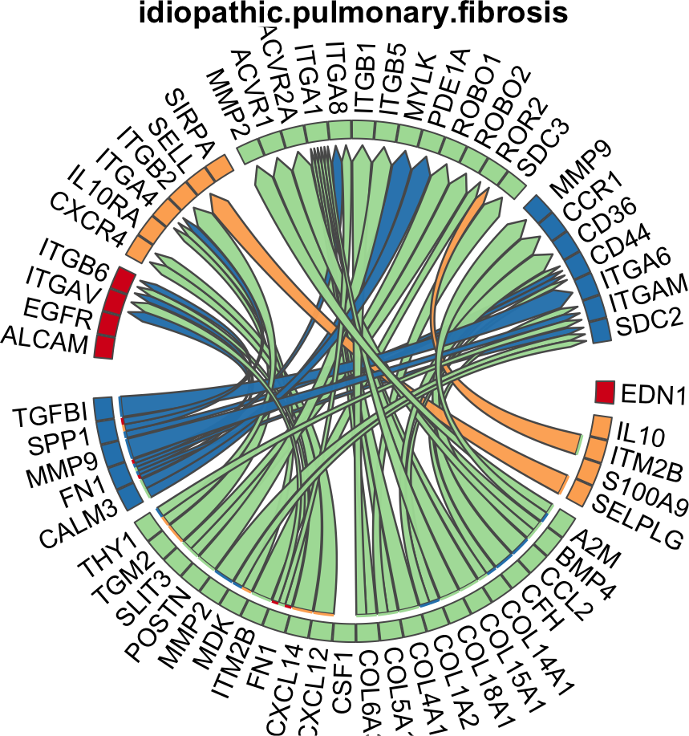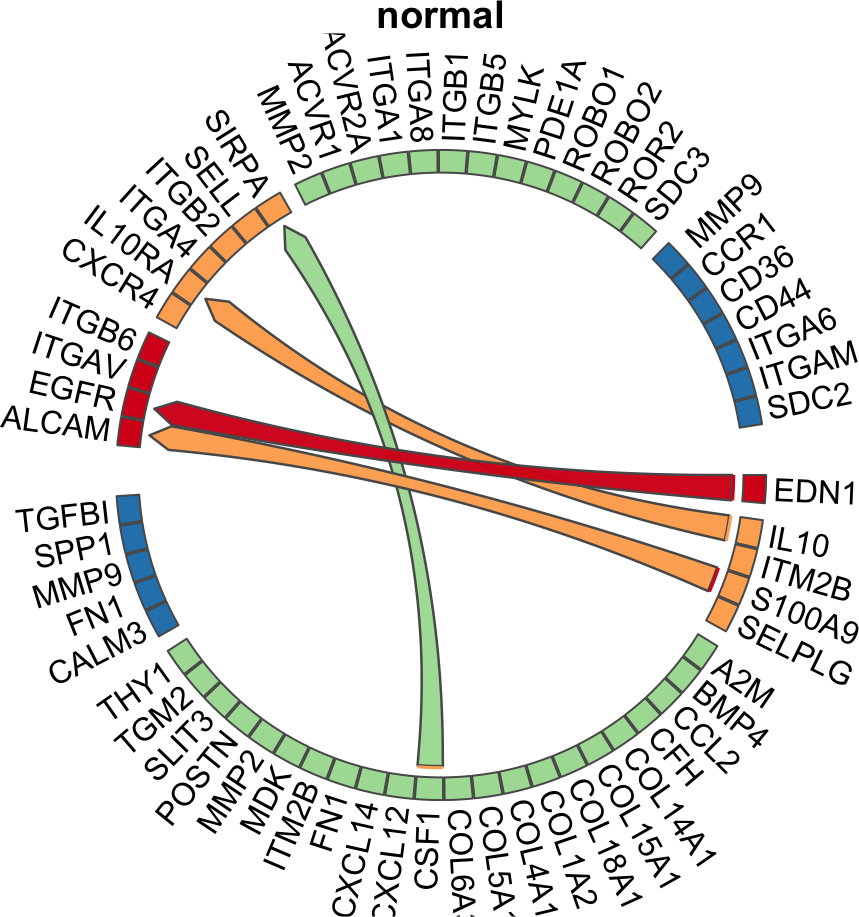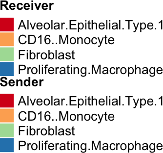

### Interpretable bubble plots

Whereas these ChordDiagrams show the most specific interactions per group, they don't give insights into the data behind these predictions. Therefore we will now look at visualizations that indicate the different prioritization criteria used in MultiNicheNet. 

In the next type of plots, we will 1) visualize the per-sample scaled product of normalized ligand and receptor pseudobulk expression, 2) visualize the scaled ligand activities, 3) cell-type specificity. 

We will now check the top 50 interactions specific for the Tumor-tissue


```r
group_oi = "idiopathic.pulmonary.fibrosis"
```


```r
prioritized_tbl_oi_IPF_50 = get_top_n_lr_pairs(
  multinichenet_output$prioritization_tables, 
  top_n = 50, 
  groups_oi = group_oi)
```


```r
plot_oi = make_sample_lr_prod_activity_plots(
  multinichenet_output$prioritization_tables, 
  prioritized_tbl_oi_IPF_50)
plot_oi
```

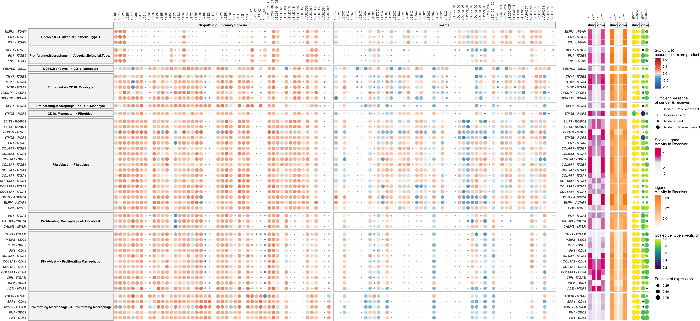
Samples that were left out of the DE analysis are indicated with a smaller dot (this helps to indicate the samples that did not contribute to the calculation of the logFC, and thus not contributed to the final prioritization)

As a further help for further prioritization, we can assess the level of curation of these LR pairs as defined by the Intercellular Communication part of the Omnipath database


```r
prioritized_tbl_oi_IPF_50_omnipath = prioritized_tbl_oi_IPF_50 %>% 
  inner_join(lr_network_all)
```

Now we add this to the bubble plot visualization:

```r
plot_oi = make_sample_lr_prod_activity_plots_Omnipath(
  multinichenet_output$prioritization_tables, 
  prioritized_tbl_oi_IPF_50_omnipath)
plot_oi
```

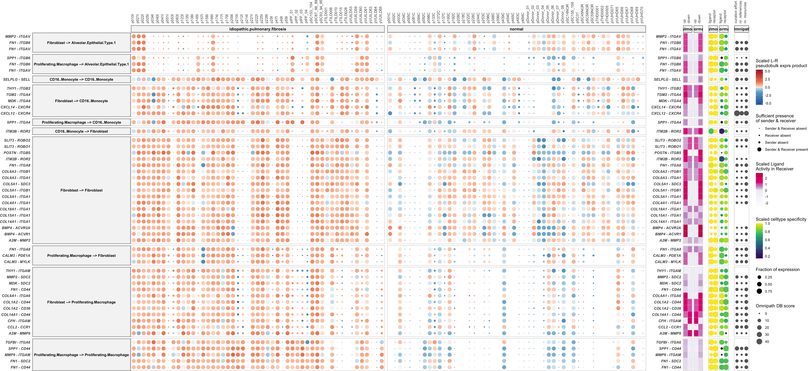

Further note: Typically, there are way more than 50 differentially expressed and active ligand-receptor pairs per group across all sender-receiver combinations. Therefore it might be useful to zoom in on specific cell types as senders/receivers:

Eg CD16..Monocyte as receiver:


```r
prioritized_tbl_oi_IPF_50 = get_top_n_lr_pairs(
  multinichenet_output$prioritization_tables, 
  50, 
  groups_oi = group_oi, 
  receivers_oi = "CD16..Monocyte")
```


```r
plot_oi = make_sample_lr_prod_activity_plots_Omnipath(
  multinichenet_output$prioritization_tables, 
  prioritized_tbl_oi_IPF_50 %>% inner_join(lr_network_all))
plot_oi
```

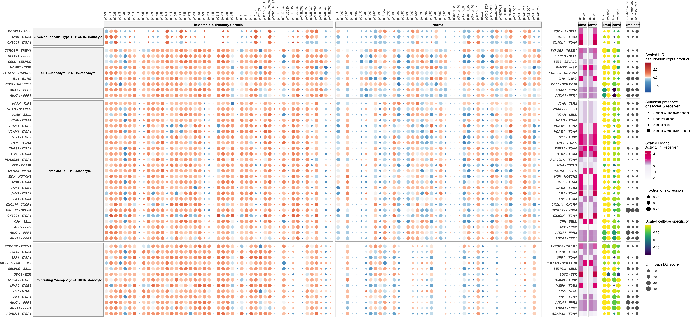

Eg CD14.Monocyte as sender:


```r
prioritized_tbl_oi_IPF_50 = get_top_n_lr_pairs(
  multinichenet_output$prioritization_tables, 
  50, 
  groups_oi = group_oi, 
  senders_oi = "CD16..Monocyte")
```


```r
plot_oi = make_sample_lr_prod_activity_plots_Omnipath(
  multinichenet_output$prioritization_tables, 
  prioritized_tbl_oi_IPF_50 %>% inner_join(lr_network_all))
plot_oi
```

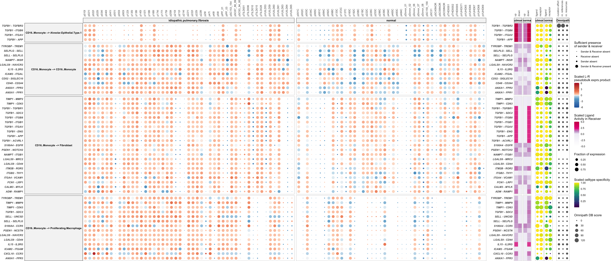

You can make these plots also for the other groups, like we will illustrate now for the S group


```r
group_oi = "normal"
```


```r
prioritized_tbl_oi_Normal_50 = get_top_n_lr_pairs(
  multinichenet_output$prioritization_tables, 
  50, 
  groups_oi = group_oi)

plot_oi = make_sample_lr_prod_activity_plots_Omnipath(
  multinichenet_output$prioritization_tables, 
  prioritized_tbl_oi_Normal_50 %>% inner_join(lr_network_all))
plot_oi
```

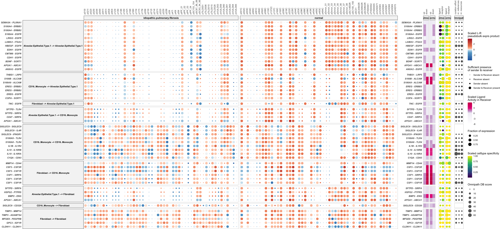

__Note__: We can use `make_sample_lr_prod_activity_batch_plots` to visualize batches on this plot!


```r
plot_oi = make_sample_lr_prod_activity_batch_plots(
  multinichenet_output$prioritization_tables, 
  prioritized_tbl_oi_IPF_50, 
  multinichenet_output$grouping_tbl, 
  batches)
plot_oi
```

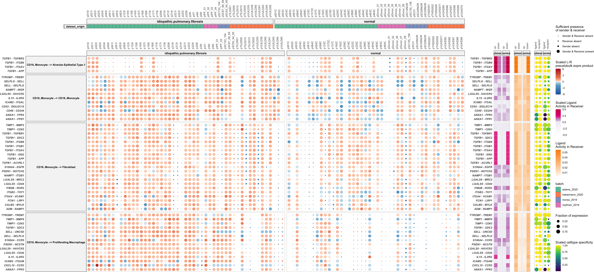

## Visualization of differential ligand-target links

### Without filtering of target genes based on LR-target expression correlation

In another type of plot, we can visualize the ligand activities for a group-receiver combination, and show the predicted ligand-target links, and also the expression of the predicted target genes across samples.

For this, we now need to define a receiver cell type of interest. As example, we will take `CLEC9A` cells as receiver, and look at the top 10 senderLigand-receiverReceptor pairs with these cells as receiver.


```r
group_oi = "idiopathic.pulmonary.fibrosis"
receiver_oi = "CD16..Monocyte"
prioritized_tbl_oi_IPF_10 = get_top_n_lr_pairs(
  multinichenet_output$prioritization_tables, 
  10, 
  groups_oi = group_oi, 
  receivers_oi = receiver_oi)
```


```r
combined_plot = make_ligand_activity_target_plot(
  group_oi, 
  receiver_oi, 
  prioritized_tbl_oi_IPF_10,
  multinichenet_output$prioritization_tables, 
  multinichenet_output$ligand_activities_targets_DEgenes, contrast_tbl, 
  multinichenet_output$grouping_tbl, 
  multinichenet_output$celltype_info, 
  ligand_target_matrix, 
  plot_legend = FALSE)
combined_plot
## $combined_plot
```

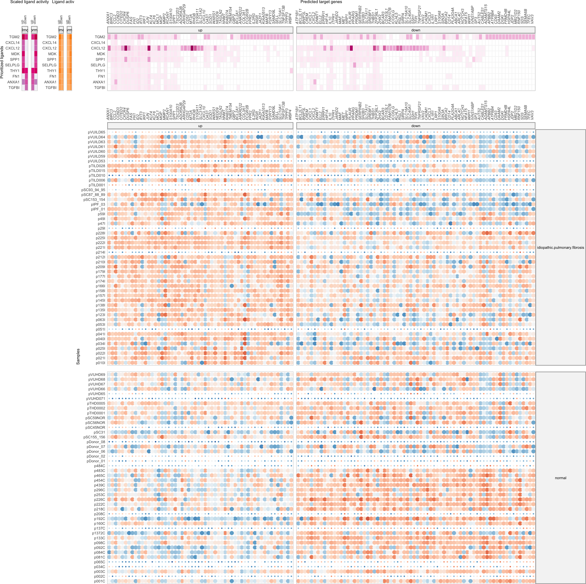

```
## 
## $legends
```

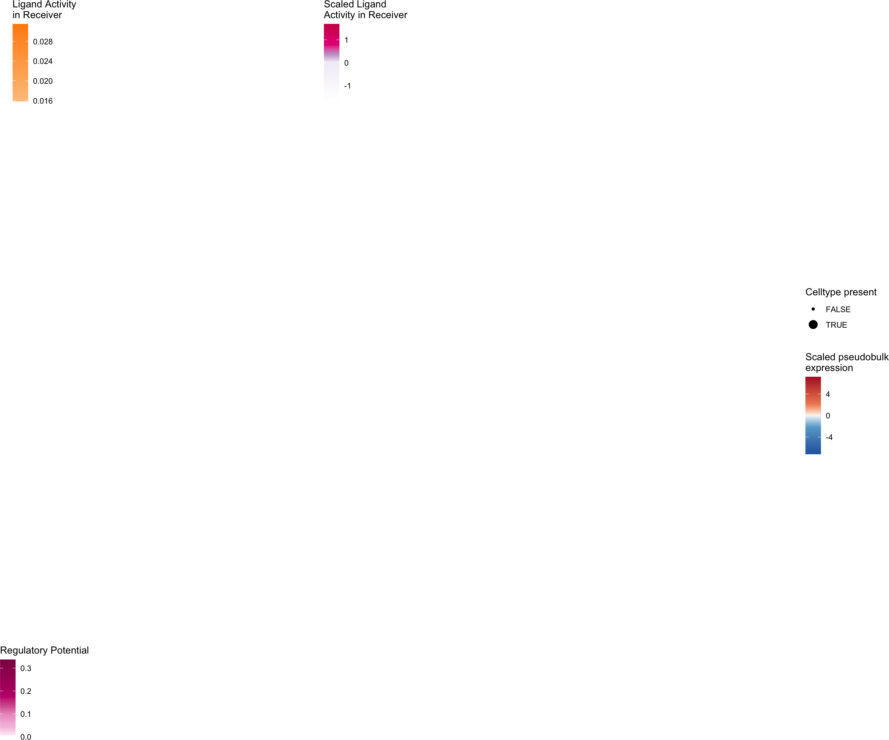

What if there is a specific ligand you are interested in?


```r
group_oi = "idiopathic.pulmonary.fibrosis"
receiver_oi = "CD16..Monocyte"
ligands_oi = c("BMP1","BMP4","BMP5")
prioritized_tbl_ligands_oi = get_top_n_lr_pairs(
  multinichenet_output$prioritization_tables, 
  10000, 
  groups_oi = group_oi, 
  receivers_oi = receiver_oi
  ) %>% filter(ligand %in% ligands_oi) # ligands should still be in the output tables of course
```


```r
combined_plot = make_ligand_activity_target_plot(
  group_oi, 
  receiver_oi, 
  prioritized_tbl_ligands_oi, 
  multinichenet_output$prioritization_tables, 
  multinichenet_output$ligand_activities_targets_DEgenes, 
  contrast_tbl, 
  multinichenet_output$grouping_tbl, 
  multinichenet_output$celltype_info, 
  ligand_target_matrix, 
  plot_legend = FALSE)
combined_plot
## $combined_plot
```

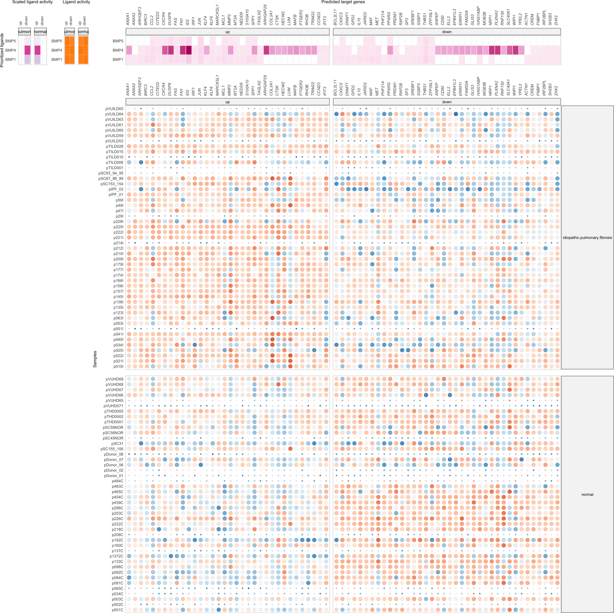

```
## 
## $legends
```

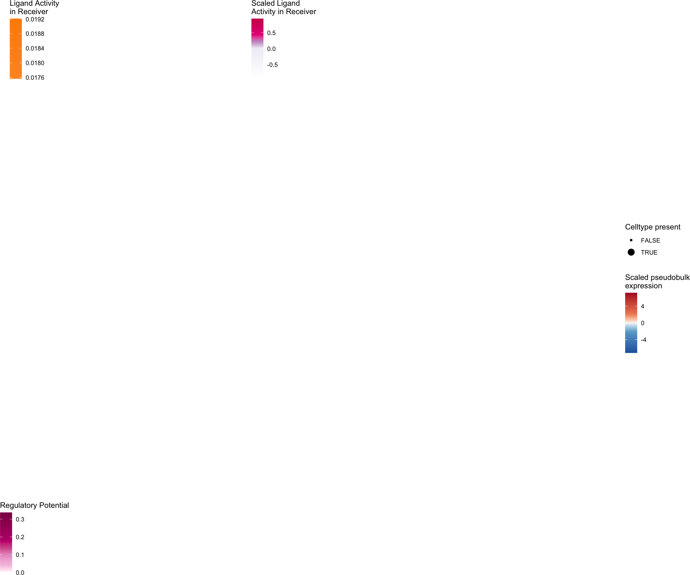

### With filtering of target genes based on LR-target expression correlation

In the previous plots, target genes were shown that are predicted as target gene of ligands based on prior knowledge. However, we can use the multi-sample nature of this data to filter target genes based on expression correlation between the upstream ligand-receptor pair and the downstream target gene. We will filter out correlated ligand-receptor --> target links that both show high expression correlation (spearman or pearson correlation > 0.50 in this example) and have some prior knowledge to support their link. Note that you can only make these visualization if you ran step 7 of the core MultiNicheNet analysis.


```r
group_oi = "idiopathic.pulmonary.fibrosis"
receiver_oi = "CD16..Monocyte"
lr_target_prior_cor_filtered = multinichenet_output$lr_target_prior_cor %>%
  inner_join(
    multinichenet_output$ligand_activities_targets_DEgenes$ligand_activities %>% 
      distinct(ligand, target, direction_regulation, contrast)
    ) %>% 
  inner_join(contrast_tbl) %>% filter(group == group_oi, receiver == receiver_oi)

lr_target_prior_cor_filtered_up = lr_target_prior_cor_filtered %>% 
  filter(direction_regulation == "up") %>% 
  filter( (rank_of_target < top_n_target) & (pearson > 0.50 | spearman > 0.50))
lr_target_prior_cor_filtered_down = lr_target_prior_cor_filtered %>% 
  filter(direction_regulation == "down") %>% 
  filter( (rank_of_target < top_n_target) & (pearson < -0.50 | spearman < -0.50)) # downregulation -- negative correlation
lr_target_prior_cor_filtered = bind_rows(
  lr_target_prior_cor_filtered_up, 
  lr_target_prior_cor_filtered_down)
```

Now we will visualize the top correlated target genes for the LR pairs that are also in the top 50 LR pairs discriminating the groups from each other:


```r
prioritized_tbl_oi = get_top_n_lr_pairs(
  multinichenet_output$prioritization_tables, 
  50, 
  groups_oi = group_oi, 
  receivers_oi = receiver_oi)
```


```r
lr_target_correlation_plot = make_lr_target_correlation_plot(
  multinichenet_output$prioritization_tables, 
  prioritized_tbl_oi,  
  lr_target_prior_cor_filtered , 
  multinichenet_output$grouping_tbl, 
  multinichenet_output$celltype_info, 
  receiver_oi,
  plot_legend = FALSE)
lr_target_correlation_plot$combined_plot
```


You can also visualize the expression correlation in the following way for a selected LR pair and their targets:


```r
ligand_oi = "CXCL12"
receptor_oi = "CXCR4"
sender_oi = "Fibroblast"
receiver_oi = "CD16..Monocyte"
lr_target_scatter_plot = make_lr_target_scatter_plot(
  multinichenet_output$prioritization_tables, 
  ligand_oi, receptor_oi, sender_oi, receiver_oi, 
  multinichenet_output$celltype_info, 
  multinichenet_output$grouping_tbl, 
  lr_target_prior_cor_filtered)
lr_target_scatter_plot
```

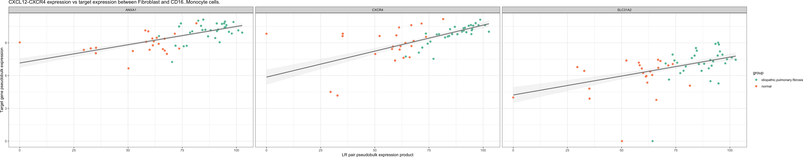

## Intercellular regulatory network inference and visualization

In the plots before, we demonstrated that some DE genes have both expression correlation and prior knowledge support to be downstream of ligand-receptor pairs. Interestingly, some target genes can be ligands or receptors themselves. This illustrates that cells can send signals to other cells, who as a response to these signals produce signals themselves to feedback to the original sender cells, or who will effect other cell types. 

As last plot, we can generate a 'systems' view of these intercellular feedback and cascade processes than can be occuring between the different cell populations involved. In this plot, we will draw links between ligands of sender cell types their ligand/receptor-annotated target genes in receiver cell types. So links are ligand-target links (= gene regulatory links) and not ligand-receptor protein-protein interactions! We will infer this intercellular regulatory network here for the top100 interactions. You can increase this to include more hits of course (recommended). 


```r
prioritized_tbl_oi = get_top_n_lr_pairs(
  multinichenet_output$prioritization_tables, 
  100, 
  rank_per_group = FALSE)

lr_target_prior_cor_filtered = 
  multinichenet_output$prioritization_tables$group_prioritization_tbl$group %>% unique() %>% 
  lapply(function(group_oi){
    lr_target_prior_cor_filtered = multinichenet_output$lr_target_prior_cor %>%
      inner_join(
        multinichenet_output$ligand_activities_targets_DEgenes$ligand_activities %>%
          distinct(ligand, target, direction_regulation, contrast)
        ) %>% 
      inner_join(contrast_tbl) %>% filter(group == group_oi)
    
    lr_target_prior_cor_filtered_up = lr_target_prior_cor_filtered %>% 
      filter(direction_regulation == "up") %>% 
      filter( (rank_of_target < top_n_target) & (pearson > 0.50 | spearman > 0.50))
    
    lr_target_prior_cor_filtered_down = lr_target_prior_cor_filtered %>% 
      filter(direction_regulation == "down") %>% 
      filter( (rank_of_target < top_n_target) & (pearson < -0.50 | spearman < -0.50))
    lr_target_prior_cor_filtered = bind_rows(
      lr_target_prior_cor_filtered_up, 
      lr_target_prior_cor_filtered_down
      )
}) %>% bind_rows()

lr_target_df = lr_target_prior_cor_filtered %>% 
  distinct(group, sender, receiver, ligand, receptor, id, target, direction_regulation) 
```


```r
network = infer_intercellular_regulatory_network(lr_target_df, prioritized_tbl_oi)
network$links %>% head()
## # A tibble: 6 × 6
##   sender_ligand                 receiver_target direction_regulation group                         type          weight
##   <chr>                         <chr>           <fct>                <chr>                         <chr>          <dbl>
## 1 Fibroblast_A2M                Fibroblast_A2M  up                   idiopathic.pulmonary.fibrosis Ligand-Target      1
## 2 Fibroblast_A2M                Fibroblast_FN1  up                   idiopathic.pulmonary.fibrosis Ligand-Target      1
## 3 Proliferating.Macrophage_SPP1 Fibroblast_FN1  up                   idiopathic.pulmonary.fibrosis Ligand-Target      1
## 4 Proliferating.Macrophage_FN1  Fibroblast_FN1  up                   idiopathic.pulmonary.fibrosis Ligand-Target      1
## 5 Fibroblast_FN1                Fibroblast_FN1  up                   idiopathic.pulmonary.fibrosis Ligand-Target      1
## 6 Fibroblast_COL1A1             Fibroblast_A2M  up                   idiopathic.pulmonary.fibrosis Ligand-Target      1
network$nodes %>% head()
## # A tibble: 6 × 4
##   node                          celltype                 gene   type_gene      
##   <chr>                         <chr>                    <chr>  <chr>          
## 1 Fibroblast_MMP2               Fibroblast               MMP2   ligand/receptor
## 2 Proliferating.Macrophage_MMP9 Proliferating.Macrophage MMP9   ligand/receptor
## 3 CD16..Monocyte_SELL           CD16..Monocyte           SELL   ligand/receptor
## 4 CD16..Monocyte_SELPLG         CD16..Monocyte           SELPLG ligand/receptor
## 5 Proliferating.Macrophage_CD44 Proliferating.Macrophage CD44   ligand/receptor
## 6 Fibroblast_A2M                Fibroblast               A2M    ligand
```


```r
network_graph = visualize_network(network, colors_sender)
network_graph$plot
```

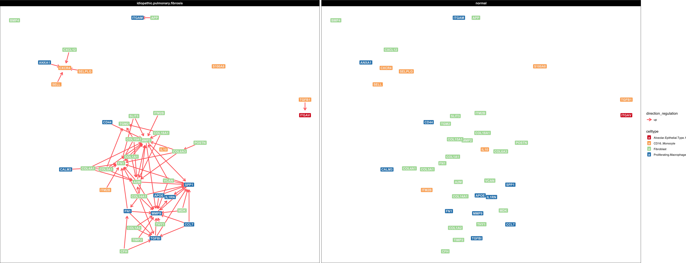

Interestingly, we can also use this network to further prioritize differential CCC interactions. Here we will assume that the most important LR interactions are the ones that are involved in this intercellular regulatory network. We can get these interactions as follows:


```r
network$prioritized_lr_interactions
## # A tibble: 60 × 5
##    group                         sender                   receiver   ligand receptor
##    <chr>                         <chr>                    <chr>      <chr>  <chr>   
##  1 idiopathic.pulmonary.fibrosis Fibroblast               Fibroblast A2M    MMP2    
##  2 idiopathic.pulmonary.fibrosis Proliferating.Macrophage Fibroblast SPP1   ITGA8   
##  3 idiopathic.pulmonary.fibrosis Proliferating.Macrophage Fibroblast FN1    ITGA8   
##  4 idiopathic.pulmonary.fibrosis Fibroblast               Fibroblast FN1    ITGA8   
##  5 idiopathic.pulmonary.fibrosis Fibroblast               Fibroblast FN1    SDC2    
##  6 idiopathic.pulmonary.fibrosis Fibroblast               Fibroblast COL1A1 ITGA1   
##  7 idiopathic.pulmonary.fibrosis Fibroblast               Fibroblast SLIT3  ROBO2   
##  8 idiopathic.pulmonary.fibrosis Fibroblast               Fibroblast COL6A3 ITGA1   
##  9 idiopathic.pulmonary.fibrosis Fibroblast               Fibroblast COL4A1 ITGB1   
## 10 idiopathic.pulmonary.fibrosis CD16..Monocyte           Fibroblast ITM2B  ROR2    
## # ℹ 50 more rows
```


```r
prioritized_tbl_oi_network = prioritized_tbl_oi %>% inner_join(
  network$prioritized_lr_interactions)
prioritized_tbl_oi_network
## # A tibble: 60 × 8
##    group                         sender                   receiver                 ligand  receptor id                                       prioritization_score prioritization_rank
##    <chr>                         <chr>                    <chr>                    <chr>   <chr>    <chr>                                                   <dbl>               <dbl>
##  1 idiopathic.pulmonary.fibrosis Fibroblast               Fibroblast               ITM2B   ROR2     ITM2B_ROR2_Fibroblast_Fibroblast                        0.912                   1
##  2 normal                        CD16..Monocyte           CD16..Monocyte           IL10    IL10RA   IL10_IL10RA_CD16..Monocyte_CD16..Monocy…                0.910                   2
##  3 idiopathic.pulmonary.fibrosis Fibroblast               Proliferating.Macrophage COL14A1 CD44     COL14A1_CD44_Fibroblast_Proliferating.M…                0.907                   5
##  4 idiopathic.pulmonary.fibrosis Fibroblast               CD16..Monocyte           CXCL12  CXCR4    CXCL12_CXCR4_Fibroblast_CD16..Monocyte                  0.906                   6
##  5 idiopathic.pulmonary.fibrosis Fibroblast               Fibroblast               BMP4    ACVR1    BMP4_ACVR1_Fibroblast_Fibroblast                        0.904                   7
##  6 idiopathic.pulmonary.fibrosis Fibroblast               Fibroblast               A2M     MMP2     A2M_MMP2_Fibroblast_Fibroblast                          0.903                   8
##  7 idiopathic.pulmonary.fibrosis Fibroblast               Fibroblast               SLIT3   ROBO2    SLIT3_ROBO2_Fibroblast_Fibroblast                       0.898                  10
##  8 idiopathic.pulmonary.fibrosis Fibroblast               Fibroblast               SLIT3   ROBO1    SLIT3_ROBO1_Fibroblast_Fibroblast                       0.898                  11
##  9 idiopathic.pulmonary.fibrosis Proliferating.Macrophage Proliferating.Macrophage SPP1    CD44     SPP1_CD44_Proliferating.Macrophage_Prol…                0.895                  12
## 10 idiopathic.pulmonary.fibrosis Fibroblast               Fibroblast               COL6A3  ITGA1    COL6A3_ITGA1_Fibroblast_Fibroblast                      0.895                  13
## # ℹ 50 more rows
```

Visualize now the expression and activity of these interactions for the Tumor group

```r
group_oi = "idiopathic.pulmonary.fibrosis"
```


```r
prioritized_tbl_oi_IPF = prioritized_tbl_oi_network %>% filter(group == group_oi)

plot_oi = make_sample_lr_prod_activity_plots_Omnipath(
  multinichenet_output$prioritization_tables, 
  prioritized_tbl_oi_IPF %>% inner_join(lr_network_all)
  )
plot_oi
```

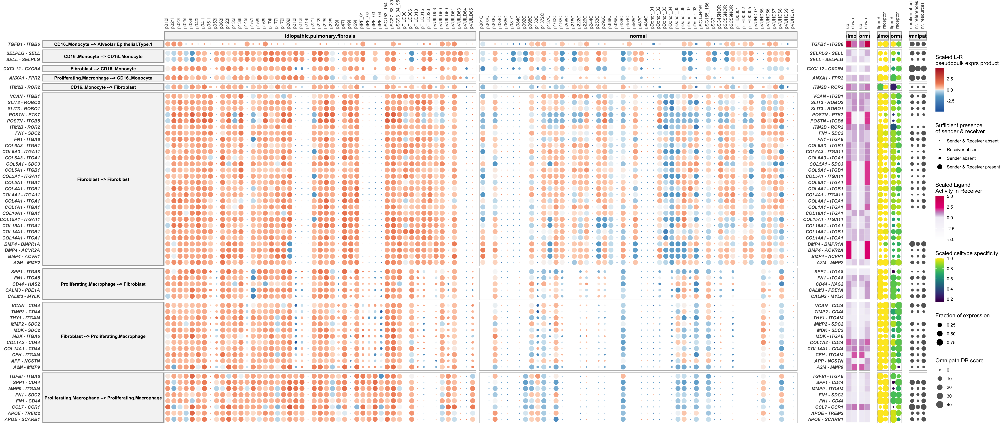


# Comparing the MultiNicheNet analysis with batch correction versus without

To assess how much difference the batch correction made, we will now run the MultiNicheNet analysis without batch correction with the wrapper function using the same parameters, and saving these analysis results in `multinichenet_output_noBC`

```r
batches =  NA

multinichenet_output_noBC = multi_nichenet_analysis(
  sce = sce, 
  celltype_id = celltype_id, sample_id = sample_id, group_id = group_id, 
  batches = batches, covariates = covariates, 
  lr_network = lr_network, ligand_target_matrix = ligand_target_matrix, 
  contrasts_oi = contrasts_oi, contrast_tbl = contrast_tbl, 
  senders_oi = senders_oi, receivers_oi = receivers_oi,
  min_cells = min_cells, 
  fraction_cutoff = fraction_cutoff, 
  min_sample_prop = min_sample_prop,
  scenario = "regular", 
  ligand_activity_down = ligand_activity_down,
  logFC_threshold = logFC_threshold, 
  p_val_threshold = p_val_threshold, 
  p_val_adj = p_val_adj, 
  empirical_pval = empirical_pval, 
  top_n_target = top_n_target, 
  n.cores = n.cores, 
  verbose = TRUE
  )
## [1] "Make diagnostic abundance plots + define expressed genes"
## [1] "condition-specific celltypes:"
## character(0)
## [1] "absent celltypes:"
## character(0)
## [1] "Samples are considered if they have more than 10 cells of the cell type of interest"
## [1] "Genes with non-zero counts in at least 5% of cells of a cell type of interest in a particular sample will be considered as expressed in that sample."
## [1] "Genes expressed in at least 6 samples will considered as expressed in the cell type: Alveolar.Epithelial.Type.1"
## [1] "Genes expressed in at least 16 samples will considered as expressed in the cell type: CD16..Monocyte"
## [1] "Genes expressed in at least 16 samples will considered as expressed in the cell type: Fibroblast"
## [1] "Genes expressed in at least 6.5 samples will considered as expressed in the cell type: Proliferating.Macrophage"
## [1] "10193 genes are considered as expressed in the cell type: Alveolar.Epithelial.Type.1"
## [1] "8810 genes are considered as expressed in the cell type: CD16..Monocyte"
## [1] "10643 genes are considered as expressed in the cell type: Fibroblast"
## [1] "11018 genes are considered as expressed in the cell type: Proliferating.Macrophage"
## [1] "Calculate differential expression for all cell types"
## [1] "DE analysis is done:"
## [1] "included cell types are:"
## [1] "CD16..Monocyte"             "Alveolar.Epithelial.Type.1" "Fibroblast"                 "Proliferating.Macrophage"  
## [1] "retained cell types"
## [1] "CD16..Monocyte"             "Alveolar.Epithelial.Type.1" "Fibroblast"                 "Proliferating.Macrophage"  
## [1] "Calculate normalized average and pseudobulk expression"
## [1] "Calculate NicheNet ligand activities and ligand-target links"
## [1] "Combine all the information in prioritization tables"
## [1] "Calculate correlation between LR pairs and target genes"
## [1] "There are no condition specific cell types in the data. MultiNicheNet analysis is performed in the regular way for all cell types."
```

First we will show the top 50 interactions from the batch-corrected analysis (BC analysis) with non-corrected pseudobulk expression values


```r
group_oi = "idiopathic.pulmonary.fibrosis"
batches =  "dataset_origin"
```


```r
prioritized_tbl_oi_top_50 = get_top_n_lr_pairs(
  multinichenet_output$prioritization_tables, 
  50, 
  groups_oi = group_oi) # from BC-analysis

plot_oi = make_sample_lr_prod_activity_batch_plots(
  multinichenet_output_noBC$prioritization_tables, 
  prioritized_tbl_oi_top_50, 
  multinichenet_output$grouping_tbl, 
  batches)
plot_oi
```

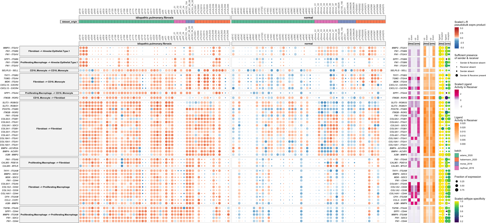

For this dataset and these cell types, the non-corrected expression values look similar to the corrected ones.

Now we will combine the prioritization tables of both analyses. This will then later be used to define which interactions are most specific to the BC analysis compared to the non-BC analysis


```r
prioritized_tbl_oi_high5000_withBC = get_top_n_lr_pairs(
  multinichenet_output$prioritization_tables, 
  5000, 
  rank_per_group = FALSE
  )

prioritized_tbl_oi_high5000_noBC = get_top_n_lr_pairs(
  multinichenet_output_noBC$prioritization_tables, 
  5000, 
  rank_per_group = FALSE
  )

prioritized_tbl_oi_high5000 = prioritized_tbl_oi_high5000_withBC %>% 
  rename(score_BC = prioritization_score , rank_BC = prioritization_rank) %>% 
  full_join(
    prioritized_tbl_oi_high5000_noBC %>% 
      rename(score_noBC = prioritization_score , rank_noBC = prioritization_rank)
    )

head(prioritized_tbl_oi_high5000) # you can see some interactions NA in an analysis: this because ligand or receptor gene was filtered out
## # A tibble: 6 × 10
##   group                         sender         receiver                 ligand  receptor id                           score_BC rank_BC score_noBC rank_noBC
##   <chr>                         <chr>          <chr>                    <chr>   <chr>    <chr>                           <dbl>   <dbl>      <dbl>     <dbl>
## 1 idiopathic.pulmonary.fibrosis Fibroblast     Fibroblast               ITM2B   ROR2     ITM2B_ROR2_Fibroblast_Fibro…    0.912       1      0.892         6
## 2 normal                        CD16..Monocyte CD16..Monocyte           IL10    IL10RA   IL10_IL10RA_CD16..Monocyte_…    0.910       2      0.910         2
## 3 idiopathic.pulmonary.fibrosis Fibroblast     CD16..Monocyte           TGM2    ITGA4    TGM2_ITGA4_Fibroblast_CD16.…    0.908       3      0.796       421
## 4 idiopathic.pulmonary.fibrosis Fibroblast     CD16..Monocyte           CXCL14  CXCR4    CXCL14_CXCR4_Fibroblast_CD1…    0.908       4      0.889         9
## 5 idiopathic.pulmonary.fibrosis Fibroblast     Proliferating.Macrophage COL14A1 CD44     COL14A1_CD44_Fibroblast_Pro…    0.907       5      0.896         5
## 6 idiopathic.pulmonary.fibrosis Fibroblast     CD16..Monocyte           CXCL12  CXCR4    CXCL12_CXCR4_Fibroblast_CD1…    0.906       6      0.926         1

prioritized_tbl_oi_high5000 = prioritized_tbl_oi_high5000 %>% 
  mutate(
    diff_rank = rank_BC  - rank_noBC, 
    diff_score = score_BC - score_noBC) 
```

Inspecting `prioritized_tbl_oi_high5000` enables you to see how prioritization scores and ranks differ between both analyses.


```r
prioritized_tbl_oi_high5000 %>% View()
```

Now we will define which interactions are most specific to the BC analysis compared to the non-BC analysis


```r
BC_interactions = prioritized_tbl_oi_high5000 %>% 
  arrange(-diff_score) %>% 
  filter(group == group_oi) %>% 
  filter(rank_BC < 2000) %>% 
  pull(id) %>% 
  head(10)
noBC_interactions = prioritized_tbl_oi_high5000 %>%
  arrange(diff_score) %>% 
  filter(group == group_oi) %>% 
  filter(rank_noBC < 2000) %>% 
  pull(id) %>% 
  head(10)

BC_interactions_df = prioritized_tbl_oi_high5000 %>%
  arrange(-score_BC) %>% 
  filter(is.na(diff_rank)) %>% 
  filter(group == group_oi) %>% 
  head(10)

noBC_interactions_df = prioritized_tbl_oi_high5000 %>%
  arrange(-score_noBC)  %>% 
  filter(is.na(diff_rank)) %>% 
  filter(group == group_oi) %>% 
  head(10)

BC_specific_interactions_df = prioritized_tbl_oi_high5000 %>%
  arrange(-score_BC) %>% 
  filter(group == group_oi) %>% 
  filter(id %in% BC_interactions)

noBC_specific_interactions_df = prioritized_tbl_oi_high5000 %>%
  arrange(-score_noBC) %>% 
  filter(group == group_oi) %>% 
  filter(id %in% noBC_interactions)
```

### Visualization of scaled_LR_prod_activity per sample

#### BC-specific hits with BC expression values plot


```r
plot_oi = make_sample_lr_prod_activity_batch_plots(
  multinichenet_output$prioritization_tables, 
  BC_specific_interactions_df, 
  multinichenet_output$grouping_tbl, 
  batches)
plot_oi
```

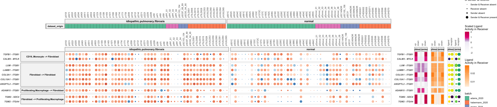

#### BC-specific hits with noBC expression values plot


```r
plot_oi = make_sample_lr_prod_activity_batch_plots(
  multinichenet_output_noBC$prioritization_tables,  
  BC_specific_interactions_df, 
  multinichenet_output$grouping_tbl, 
  batches)
plot_oi
```

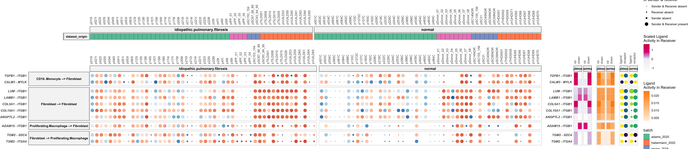

You can here indeed see the clear effects of the source-dataset in expression levels of some interactions (which may cloud the true DE signal that we pick up after correction).

#### noBC-specific hits with BC expression values plot


```r
plot_oi = make_sample_lr_prod_activity_batch_plots(
  multinichenet_output$prioritization_tables, 
  noBC_specific_interactions_df, 
  multinichenet_output$grouping_tbl, 
  batches)
plot_oi
```

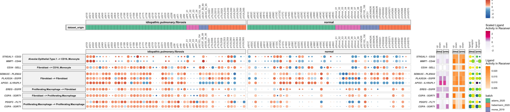

#### noBC-specific hits with no BC expression values plots


```r
plot_oi = make_sample_lr_prod_activity_batch_plots(
  multinichenet_output_noBC$prioritization_tables, 
  noBC_specific_interactions_df, 
  multinichenet_output$grouping_tbl, 
  batches)
plot_oi
```

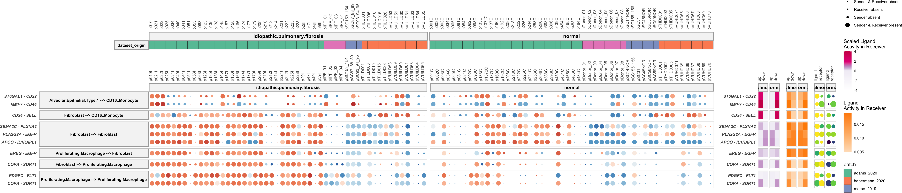
What you can see in these last two plots: some of these interactions are predicted as DE without batch correction because the expression is specific for the dataset of origin with the highest number of samples. This points to the need to correct for this during the analysis.

Important to note is that the interactions we visualize here were prioritized also by including ligand activity, so not only the DE of the LR pair! However, ligand activity may also be affected by batch effect correction because the underlying DE genes in receivers is affected by batch effect correction. Therefore, we will now check the effect of the dataset of origin on gene expression of some DE genes

### Check target genes!

Show now also DE genes that are different! -  this is important for the ligand activities!


```r
pval_df_targets = multinichenet_output_noBC$celltype_de %>% 
  filter(contrast == "idiopathic.pulmonary.fibrosis-normal") %>% 
  select(gene, cluster_id, p_adj, logFC) %>% 
  distinct() %>% 
  rename(p_adj_noBC = p_adj, logFC_noBC = logFC) %>% 
  inner_join(
    multinichenet_output$celltype_de %>% 
      filter(contrast == "idiopathic.pulmonary.fibrosis-normal") %>% 
      select(gene, cluster_id, p_adj, logFC) %>% 
      distinct() %>% 
      rename(p_adj_BC = p_adj, logFC_BC = logFC)
    )
## targets with more DE in noBC condition
pval_df_targets %>% 
  filter(logFC_noBC > 0) %>% 
  mutate(prop = p_adj_BC/p_adj_noBC, prop_logFC = logFC_noBC/logFC_BC) %>% 
  mutate(prop_pval_logFC = prop*prop_logFC) %>% 
  arrange(-prop_pval_logFC) %>% 
  filter(prop > 1 & p_adj_noBC < 0.05 & p_adj_BC > 0.05) 
## # A tibble: 19 × 9
##    gene      cluster_id                 p_adj_noBC logFC_noBC p_adj_BC logFC_BC  prop prop_logFC prop_pval_logFC
##    <chr>     <chr>                           <dbl>      <dbl>    <dbl>    <dbl> <dbl>      <dbl>           <dbl>
##  1 CCL21     Fibroblast                    0.0102       2.39    0.462     0.783 45.3        3.05          138.  
##  2 FST       Fibroblast                    0.013        1.76    0.324     0.691 24.9        2.55           63.5 
##  3 TREM2     Alveolar.Epithelial.Type.1    0.00418      2.98    0.0794    1.88  19.0        1.59           30.1 
##  4 COL5A2    Fibroblast                    0.0469       0.613   0.224     0.383  4.78       1.60            7.64
##  5 SPP1      Alveolar.Epithelial.Type.1    0.0252       2.67    0.104     1.69   4.13       1.58            6.52
##  6 SERPINE1  Fibroblast                    0.0427       1.23    0.143     0.9    3.35       1.37            4.58
##  7 DTNA      Fibroblast                    0.0231       1.05    0.0743    0.742  3.22       1.42            4.55
##  8 PDE4B     Fibroblast                    0.0193       0.859   0.056     0.601  2.90       1.43            4.15
##  9 PPARG     Fibroblast                    0.0311       1.02    0.0747    0.711  2.40       1.43            3.45
## 10 PDGFC     Fibroblast                    0.0433       0.772   0.0871    0.511  2.01       1.51            3.04
## 11 ACSL4     Fibroblast                    0.0228       1.02    0.0534    0.834  2.34       1.22            2.86
## 12 ITGA11    Fibroblast                    0.044        0.82    0.086     0.62   1.95       1.32            2.59
## 13 TNFRSF10D Fibroblast                    0.0311       1.1     0.0617    0.908  1.98       1.21            2.40
## 14 C4orf48   Fibroblast                    0.0378       0.679   0.0701    0.527  1.85       1.29            2.39
## 15 SDC2      Fibroblast                    0.047        0.568   0.0903    0.477  1.92       1.19            2.29
## 16 NLGN4Y    Fibroblast                    0.0431       1.32    0.0623    1.09   1.45       1.21            1.75
## 17 MSRB3     Proliferating.Macrophage      0.0421       2.47    0.0543    2.31   1.29       1.07            1.38
## 18 AMPD3     Proliferating.Macrophage      0.0478       1.75    0.0518    1.39   1.08       1.26            1.36
## 19 RSPH3     Fibroblast                    0.047        0.706   0.0521    0.644  1.11       1.10            1.22

pval_df_targets %>% 
  filter(logFC_noBC > 0) %>% 
  mutate(prop = p_adj_BC/p_adj_noBC, prop_logFC = logFC_noBC/logFC_BC) %>% 
  mutate(prop_pval_logFC = prop*prop_logFC) %>% 
  arrange(-prop_pval_logFC) %>% 
  filter(prop > 1 & p_adj_noBC < 0.05 & p_adj_BC > 0.05) %>% 
  group_by(cluster_id) %>% 
  count() %>% 
  arrange(-n)
## # A tibble: 3 × 2
## # Groups:   cluster_id [3]
##   cluster_id                     n
##   <chr>                      <int>
## 1 Fibroblast                    15
## 2 Alveolar.Epithelial.Type.1     2
## 3 Proliferating.Macrophage       2

## targets with more DE in BC condition
pval_df_targets %>% 
  filter(logFC_BC > 0) %>% 
  mutate(prop = p_adj_BC/p_adj_noBC, prop_logFC = logFC_noBC/logFC_BC) %>% 
  mutate(prop_pval_logFC = prop*prop_logFC) %>% 
  arrange(prop_pval_logFC) %>% 
  filter(prop < 1 & p_adj_noBC > 0.05 & p_adj_BC < 0.05) 
## # A tibble: 178 × 9
##    gene    cluster_id     p_adj_noBC logFC_noBC  p_adj_BC logFC_BC     prop prop_logFC prop_pval_logFC
##    <chr>   <chr>               <dbl>      <dbl>     <dbl>    <dbl>    <dbl>      <dbl>           <dbl>
##  1 MCL1    CD16..Monocyte     0.94     -0.274   0.0425       0.532 0.0452      -0.515        -0.0233  
##  2 MYLK    Fibroblast         0.741    -0.262   0.0455       0.817 0.0614      -0.321        -0.0197  
##  3 TGM2    Fibroblast         0.679    -0.29    0.0217       0.694 0.0320      -0.418        -0.0134  
##  4 MCL1    Fibroblast         0.861    -0.319   0.0147       0.811 0.0171      -0.393        -0.00672 
##  5 CD81    Fibroblast         0.993    -0.00883 0.00615      0.54  0.00619     -0.0164       -0.000101
##  6 TSC22D1 Fibroblast         0.144     0.578   0.0000329    1     0.000228     0.578         0.000132
##  7 A2M     Fibroblast         0.426     0.534   0.000148     1.32  0.000347     0.405         0.000141
##  8 ITM2B   CD16..Monocyte     0.554     0.292   0.000945     0.58  0.00171      0.503         0.000859
##  9 FHL1    Fibroblast         0.968     0.0367  0.0165       0.613 0.0170       0.0599        0.00102 
## 10 WLS     Fibroblast         0.0636    0.651   0.000112     0.841 0.00176      0.774         0.00136 
## # ℹ 168 more rows
pval_df_targets %>% 
  filter(logFC_BC > 0) %>% 
  mutate(prop = p_adj_BC/p_adj_noBC, prop_logFC = logFC_noBC/logFC_BC) %>% 
  mutate(prop_pval_logFC = prop*prop_logFC) %>% 
  arrange(prop_pval_logFC) %>% 
  filter(prop < 1 & p_adj_noBC > 0.05 & p_adj_BC < 0.05) %>% 
  group_by(cluster_id) %>% 
  count() %>% 
  arrange(-n)
## # A tibble: 4 × 2
## # Groups:   cluster_id [4]
##   cluster_id                     n
##   <chr>                      <int>
## 1 Fibroblast                    59
## 2 CD16..Monocyte                43
## 3 Proliferating.Macrophage      41
## 4 Alveolar.Epithelial.Type.1    35
```

Define BC-specific DE genes in Fibroblast


```r
targets_oi = pval_df_targets %>% 
  filter(logFC_BC > 0) %>% 
  mutate(prop = p_adj_BC/p_adj_noBC, prop_logFC = logFC_noBC/logFC_BC) %>% 
  mutate(prop_pval_logFC = prop*prop_logFC) %>% 
  arrange(prop_pval_logFC) %>% 
  filter(p_adj_noBC > 0.05 & p_adj_BC < 0.05) %>% 
  filter(cluster_id == "Fibroblast") %>% 
  pull(gene) %>% head(5)
targets_oi %>% tibble(gene = .) 
## # A tibble: 5 × 1
##   gene   
##   <chr>  
## 1 MYLK   
## 2 TGM2   
## 3 MCL1   
## 4 CD81   
## 5 TSC22D1
```

Visualize these BC_specific_targets with corrected expression values:


```r
p_target = make_DEgene_dotplot_pseudobulk_batch(
  genes_oi = targets_oi, 
  celltype_info = multinichenet_output$celltype_info, 
  prioritization_tables = multinichenet_output$prioritization_tables, 
  celltype_oi = "Fibroblast", 
  batch_oi = batches, 
  grouping_tbl = multinichenet_output$grouping_tbl)
p_target$pseudobulk_plot
```

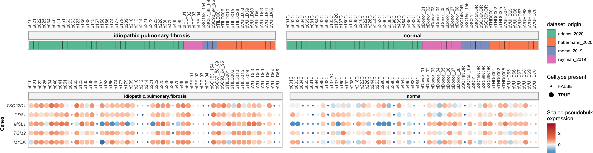

Visualize these BC_specific_targets with non-corrected expression values:


```r
p_target = make_DEgene_dotplot_pseudobulk_batch(
  genes_oi = targets_oi, 
  celltype_info = multinichenet_output_noBC$celltype_info, 
  prioritization_tables = multinichenet_output_noBC$prioritization_tables, 
  celltype_oi = "Fibroblast",  
  batch_oi = batches, 
  grouping_tbl = multinichenet_output$grouping_tbl)
p_target$pseudobulk_plot
```

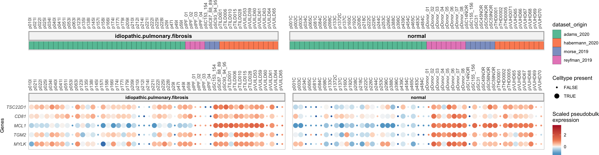

Based on these plots, we can appreciate why they were DE more strongly after correction that before.

All together, these comparisons demonstrate that it is advisable to perform batch correction when possible.
