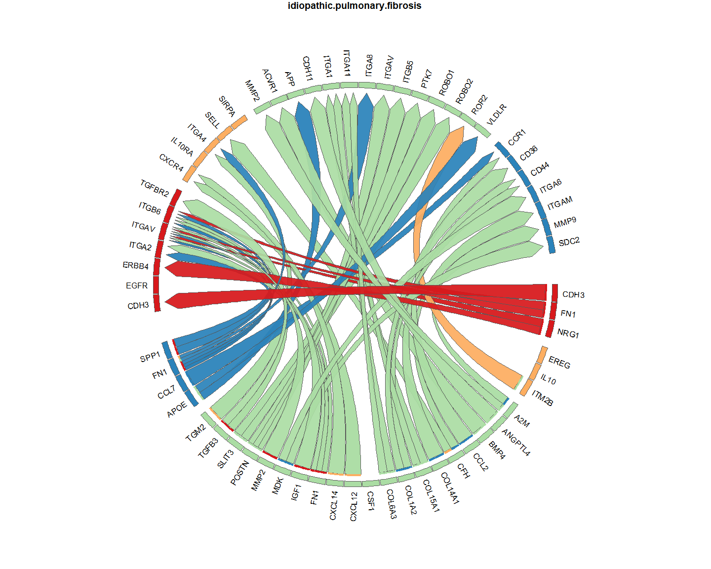
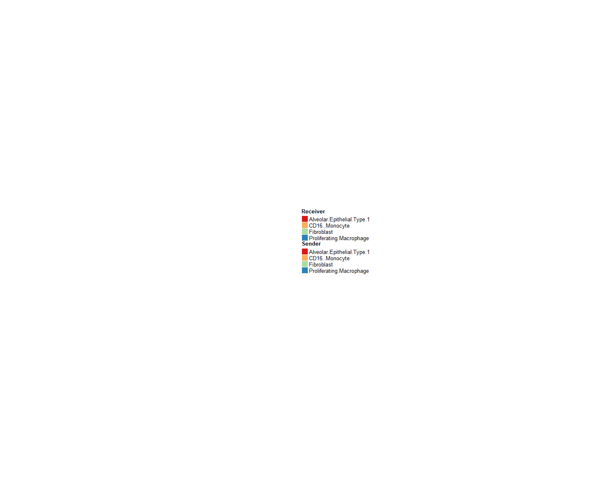
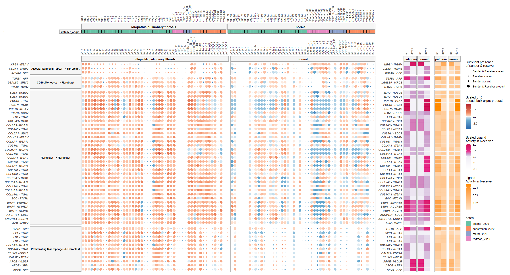
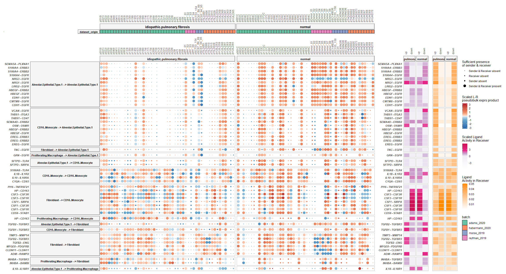
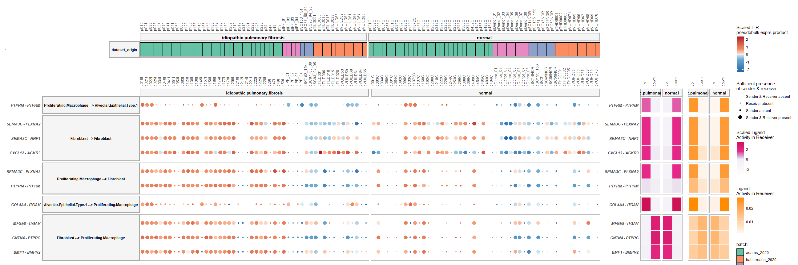
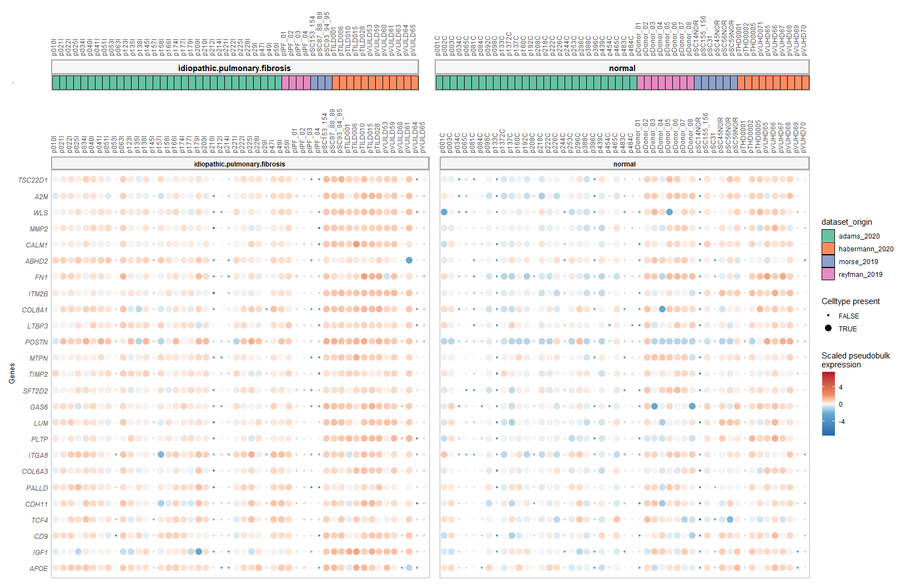

MultiNicheNet analysis: Integrated lung atlas analysis - correct for
batch effects to infer differences between IPF and healthy subjects -
wrapper function
================
Robin Browaeys
2023-06-06

<!-- github markdown built using 
rmarkdown::render("vignettes/batch_correction_analysis_LungAtlas.Rmd", output_format = "github_document")
-->

In this vignette, you can learn how to perform a MultiNicheNet analysis
comparing cell-cell communication between different groups/conditions of
interest while correcting for batch effects. In this vignette, we start
from one SingleCellExperiment object containing cells from both sender
and receiver cell types and from different patients. This object was
obtained after merging cells from different studies as described below.

A MultiNicheNet analysis can be performed if you have multi-sample,
multi-group single-cell data. MultiNicheNet will look for cell-cell
communication between the cell types in your data for each sample, and
compare the cell-cell communication patterns between the groups of
interest. Therefore, the absolute minimum of meta data you need to have,
are following columns indicating for each cell: the **group**,
**sample** and **cell type**.

As example expression data of interacting cells, we will here use merged
scRNAseq data from four studies comparing healthy lungs to lungs from
patients with idiopathic pulmonary fibrosis (IPF)) (Adams 2020, Reyfman
2019, Morse 2019, and Habermann 2020). Harmonized cell type annotations
across the 4 different studies were obtained through Azimuth [Azimuth
meta-analysis of human scRNA-seq
datasets](https://cellxgene.cziscience.com/collections/2f75d249-1bec-459b-bf2b-b86221097ced).

We will here demonstrate how MultiNicheNet can exploit the flexibility
of generalized linear models in the pseudobulk-edgeR framework to
correct for batch effects, here the source study: Adams 2020, Reyfman
2019, Morse 2019, or Habermann 2020. We will apply MultiNicheNet to
compare cell-cell interaction changes between IPF and healthy tissue.
Note that the only required input for a batch-correcting MultiNicheNet
analysis is a merged scRNA-seq object containing raw counts and
harmonized cell type annotations.

In this vignette, we will first prepare the data and analysis
parameters, and then perform the MultiNicheNet analysis.

The different steps of the MultiNicheNet analysis are the following:

- 0.  Preparation of the analysis: load packages, NicheNet LR network &
      ligand-target matrix, single-cell expression data, and define main
      settings of the MultiNicheNet analysis

- 1.  Extract cell type abundance and expression information from
      receiver and sender cell types, and link this expression
      information for ligands of the sender cell types to the
      corresponding receptors of the receiver cell types

- 2.  Perform genome-wide differential expression analysis of receiver
      and sender cell types to define DE genes between the conditions of
      interest. Based on this analysis, we can define the logFC/p-value
      of ligands in senders and receptors in receivers, and define the
      set of affected target genes in the receiver.

- 3.  Predict NicheNet ligand activities and NicheNet ligand-target
      links based on these differential expression results

- 4.  Use the information collected above to prioritize all
      sender-ligand—receiver-receptor pairs.

- 5.  Calculate correlation in expression between ligand-receptor pairs
      and their predicted target genes

In this vignette, we will demonstrate the use of a wrapper function to
perform all these steps in one line of code. If you want to explore the
different steps of MultiNicheNet one by one in more detail, you could
check this other vignette:
[basis_analysis_steps_MISC.md](basis_analysis_steps_MISC.md).

After the MultiNicheNet analysis is done, we will explore the output of
the analysis with different ways of visualization.

# Step 0: Preparation of the analysis: load packages, NicheNet LR network & ligand-target matrix, single-cell expression data

## Step 0.1: Load required packages and NicheNet ligand-receptor network and ligand-target matrix

``` r
library(SingleCellExperiment)
library(dplyr)
library(ggplot2)
library(multinichenetr)
```

The Nichenet v2 networks and matrices for both mouse and human can be
downloaded from Zenodo
[](https://doi.org/10.5281/zenodo.7074291).

We will read these object in for human because our expression data is of
human patients. Gene names are here made syntactically valid via
`make.names()` to avoid the loss of genes (eg H2-M3) in downstream
visualizations.

``` r
organism = "human"
if(organism == "human"){
  lr_network = readRDS(url("https://zenodo.org/record/7074291/files/lr_network_human_21122021.rds"))
  lr_network = lr_network %>% dplyr::rename(ligand = from, receptor = to) %>% distinct(ligand, receptor) %>% mutate(ligand = make.names(ligand), receptor = make.names(receptor))
  ligand_target_matrix = readRDS(url("https://zenodo.org/record/7074291/files/ligand_target_matrix_nsga2r_final.rds"))
  colnames(ligand_target_matrix) = colnames(ligand_target_matrix) %>% make.names()
  rownames(ligand_target_matrix) = rownames(ligand_target_matrix) %>% make.names()
} else if(organism == "mouse"){
  lr_network = readRDS(url("https://zenodo.org/record/7074291/files/lr_network_mouse_21122021.rds"))
  lr_network = lr_network %>% dplyr::rename(ligand = from, receptor = to) %>% distinct(ligand, receptor) %>% mutate(ligand = make.names(ligand), receptor = make.names(receptor))
  ligand_target_matrix = readRDS(url("https://zenodo.org/record/7074291/files/ligand_target_matrix_nsga2r_final_mouse.rds"))
  colnames(ligand_target_matrix) = colnames(ligand_target_matrix) %>% make.names()
  rownames(ligand_target_matrix) = rownames(ligand_target_matrix) %>% make.names()
}
```

## Step 0.2: Read in SingleCellExperiment Objects

In this vignette, sender and receiver cell types are in the same
SingleCellExperiment object, which we will load here. In this vignette,
we will load in a subset of the scRNAseq data of the MIS-C
[](https://doi.org/10.5281/zenodo.8010790).
For the sake of demonstration, this subset only contains 4 cell types.

If you start from a Seurat object, you can convert it easily to a
SingleCellExperiment via
`sce = Seurat::as.SingleCellExperiment(seurat_obj, assay = "RNA")`.

Because the NicheNet 2.0. networks are in the most recent version of the
official gene symbols, we will make sure that the gene symbols used in
the expression data are also updated (= converted from their “aliases”
to official gene symbols). Afterwards, we will make them again
syntactically valid.

``` r
sce = readRDS(url("https://zenodo.org/record/8010790/files/sce_subset_lung.rds"))
sce = alias_to_symbol_SCE(sce, "human") %>% makenames_SCE()
## [1] "there are provided symbols that are not in the alias annotation table: "
##  [1] "KRTAP20.3"     "ERVV.1"        "KRTAP19.4"     "KRTAP6.2"      "KRTAP21.2"     "ERVV.2"        "H4.16"         "KRTAP25.1"     "ERVFRD.1"      "KRTAP20.1"     "STON1.GTF2A1L" "KRTAP13.2"     "KRTAP15.1"    
## [14] "KRTAP19.8"     "KRTAP26.1"     "HLA.DRB5"      "KRTAP8.1"      "KRTAP4.3"      "KRTAP19.7"     "KRTAP13.4"     "ERVMER34.1"    "IGHV3.9"       "KRTAP22.1"     "NKX2.6"        "MIR9.1HG"      "KRTAP19.1"    
## [27] "KRTAP27.1"     "KRTAP21.3"     "NKX1.1"        "KRTAP19.3"     "RPS10.NUDT3"   "KRTAP6.1"      "KRTAP19.6"     "KRTAP21.1"     "KRTAP19.2"     "KRTAP9.1"      "KRT10.AS1"     "NKX1.2"        "KRTAP4.6"     
## [40] "KRTAP20.2"     "KRTAP24.1"     "KRTAP4.1"      "KRTAP13.3"     "CLLU1.AS1"     "KRTAP11.1"     "KRTAP4.7"      "ERVW.1"        "IGHV3.36"      "BCL2L2.PABPN1" "KRTAP23.1"     "KRTAP19.5"    
## [1] "they are added to the alias annotation table, so they don't get lost"
## [1] "following are the official gene symbols of input aliases: "
##       symbol     alias
## 1       H1-0      H1.0
## 2       H1-1      H1.1
## 3      H1-10     H1.10
## 4       H1-2      H1.2
## 5       H1-3      H1.3
## 6       H1-4      H1.4
## 7       H1-5      H1.5
## 8       H1-6      H1.6
## 9       H1-7      H1.7
## 10      H1-8      H1.8
## 11     H3-3A     H3.3A
## 12     H3-3B     H3.3B
## 13      H3-5      H3.5
## 14 KRTAP13-1 KRTAP13.1
## 15  KRTAP4-2  KRTAP4.2
## 16  KRTAP4-4  KRTAP4.4
## 17  KRTAP4-5  KRTAP4.5
## 18 KRTAP5-10 KRTAP5.10
## 19 KRTAP5-11 KRTAP5.11
## 20  KRTAP5-7  KRTAP5.7
## 21  KRTAP5-8  KRTAP5.8
## 22  KRTAP5-9  KRTAP5.9
## 23  KRTAP9-8  KRTAP9.8
## 24    NKX2-1    NKX2.1
## 25    NKX2-2    NKX2.2
## 26    NKX2-3    NKX2.3
## 27    NKX2-4    NKX2.4
## 28    NKX2-5    NKX2.5
## 29    NKX2-8    NKX2.8
## 30    NKX3-1    NKX3.1
## 31    NKX3-2    NKX3.2
## 32    NKX6-1    NKX6.1
## 33    NKX6-2    NKX6.2
## 34    NKX6-3    NKX6.3
```

Now we will go further in defining the settings for the MultiNicheNet
analysis

# Step 1: Prepare the cell-cell communication analysis

### Define in which metadata columns we can find the **group**, **sample** and **cell type** IDs

In this case study, we want to study differences in cell-cell
communication changes between two patient groups (IPF patients vs
healthy subjects), while considering the source dataset cells were
derived from. Patient groups are indicated in the following meta data
column: `disease`, which has 2 different values:
idiopathic.pulmonary.fibrosis and normal.

Cell type annotations are indicated in the `annotation.l1` column, and
the sample is indicated by the `donor` column. If your cells are
annotated in multiple hierarchical levels, we recommend using a high
level in the hierarchy. This for 2 reasons: 1) MultiNicheNet focuses on
differential expression and not differential abundance, and 2) there
should be sufficient cells per sample-celltype combination.

If you would have batch effects or covariates you can correct for, you
can define this here as well. Here, we want to correct for the source
study, which is indicated in the following meta data column:
`dataset_origin`, which has 4 different values: adams_2020,
habermann_2020, morse_2019, reyfman_2019 and normal.

Important: for categorical covariates and batches, there should be at
least one sample for every group-batch combination. If one of your
groups/conditions lacks a certain level of your batch, you won’t be able
to correct for the batch effect because the model is then not able to
distinguish batch from group/condition effects.

Important: the column names of group, sample, cell type, batches and
covariates should be syntactically valid (`make.names`)

Important: All group, sample, cell type, batch and covariate names
should be syntactically valid as well (`make.names`) (eg through
`SummarizedExperiment::colData(sce)$ShortID = SummarizedExperiment::colData(sce)$ShortID %>% make.names()`)

``` r
sample_id = "donor"
group_id = "disease"
celltype_id = "annotation.l1"
covariates = NA
batches =  "dataset_origin"
```

Important: for a MultiNicheNet analysis there is a difference between a
covariate and batch in the following sense: covariates will just be
included in the DE GLM model, whereas batches will be included in the DE
GLM model AND expression values for downstream visualizations will be
corrected for the batch effects. In this dataset, we want to take into
account the dataset-of-origin and correct the expression values for
downstream visualizations (as demonstrated later). Therefore we add
dataset_origin as batch and not as covariate.

Sender and receiver cell types also need to be defined. Both are here
all cell types in the dataset because we are interested in an All-vs-All
analysis.

``` r
senders_oi = SummarizedExperiment::colData(sce)[,celltype_id] %>% unique()
receivers_oi = SummarizedExperiment::colData(sce)[,celltype_id] %>% unique()
```

If the user wants it, it is possible to use only a subset of senders and
receivers. Senders and receivers can be entirely different, but also
overlapping, or the same. If you don’t use all the cell types in your
data, we recommend to continue with a subset of your data.

``` r
sce = sce[, SummarizedExperiment::colData(sce)[,celltype_id] %in% c(senders_oi, receivers_oi)]
```

### Define the contrasts and covariates of interest for the DE analysis, and the minimal number of cells of a cell type that each sample should have to be considered for DE analysis of that cell type.

Since MultiNicheNet will infer group differences at the sample level for
each cell type (currently via Muscat - pseudobulking + EdgeR), we need
to have sufficient cells per sample of a cell type, and this for both
groups. In the following analysis we will set this minimum number of
cells per cell type per sample at 10 (recommended minimum).

``` r
min_cells = 10
```

For this analysis, we want to compare how cell-cell communication
differs between IPF and normal lungs.

To do this comparison, we need to set the following contrasts:

``` r
contrasts_oi = c("'idiopathic.pulmonary.fibrosis-normal','normal-idiopathic.pulmonary.fibrosis'")
```

**Very Important** Note the format to indicate the contrasts! This
formatting should be adhered to very strictly, and white spaces are not
allowed! Check `?get_DE_info` for explanation about how to define this
well. The most important things are that: each contrast is surrounded by
single quotation marks, contrasts are separated by a comma without any
whitespace, and alle contrasts together are surrounded by double
quotation marks. If you compare against two groups, you should divide by
2, if you compare against three groups, you should divide by 3 etcetera.
See some of the other MultiNicheNet tutorials that demonstrate how to do
this.

For downstream visualizations and linking contrasts to their main group,
you need to run the following:

``` r
contrast_tbl = tibble(contrast =
                        c("idiopathic.pulmonary.fibrosis-normal", "normal-idiopathic.pulmonary.fibrosis"),
                      group = c("idiopathic.pulmonary.fibrosis", "normal"))
```

### Define the parameters for the NicheNet ligand activity analysis

Here, we need to define the thresholds that will be used to consider
genes as differentially expressed or not (logFC, p-value, decision
whether to use adjusted or normal p-value, minimum fraction of cells
that should express a gene in at least one sample in a group, whether to
use the normal p-values or empirical p-values).

NicheNet ligand activity will then be calculated as the enrichment of
predicted target genes of ligands in this set of DE genes compared to
the genomic background. Here we choose for a minimum logFC of 0.50,
maximum p-value of 0.05, and minimum fraction of expression of 0.05.

``` r
logFC_threshold = 0.50
p_val_threshold = 0.05
fraction_cutoff = 0.05
```

We will here choose for applying the p-value cutoff on the p-values
corrected for multiple testing because we have many samples in this
dataset, so the pseudobulk analysis will less likely be underpowered.

``` r
p_val_adj = TRUE
empirical_pval = FALSE
```

For the NicheNet ligand-target inference, we also need to select which
top n of the predicted target genes will be considered (here: top 250
targets per ligand).

``` r
top_n_target = 250
```

The NicheNet ligand activity analysis can be run in parallel for each
receiver cell type, by changing the number of cores as defined here.
This is only recommended if you have many receiver cell type.

``` r
cores_system = 8
n.cores = min(cores_system, union(senders_oi, receivers_oi) %>% length()) # use one core per receiver cell type
```

### Define the weights of the prioritization of both expression, differential expression and NicheNet activity information

MultiNicheNet allows the user to define the weights of the following
criteria to prioritize ligand-receptor interactions:

- Upregulation of the ligand in a sender cell type and/or upregulation
  of the receptor in a receiver cell type - in the condition of
  interest. : `de_ligand` and `de_receptor`
- Sufficiently high expression levels of ligand and receptor in many
  samples of the same group (to mitigate the influence of outlier
  samples). : `frac_exprs_ligand_receptor`
- Cell-type and condition specific expression of the ligand in the
  sender cell type and receptor in the receiver cell type (to mitigate
  the influence of upregulated but still relatively weakly expressed
  ligands/receptors) : `exprs_ligand` and `exprs_receptor`
- High NicheNet ligand activity, to further prioritize ligand-receptor
  pairs based on their predicted effect of the ligand-receptor
  interaction on the gene expression in the receiver cell type :
  `activity_scaled`
- High relative abundance of sender and/or receiver in the condition of
  interest: `abund_sender` and `abund_receiver` (experimental feature -
  not recommended to give non-zero weights for default analyses)

The different properties of the sender-ligand—receiver-receptor pairs
can be weighted according to the user’s preference and insight in the
dataset at hand.

We will set our preference for this dataset as follows - and recommend
the user to use the same weights by default if they don’t have specific
reasons to change some of the parameters:

``` r
prioritizing_weights_DE = c("de_ligand" = 1,
                         "de_receptor" = 1)
prioritizing_weights_activity = c("activity_scaled" = 2)

prioritizing_weights_expression_specificity = c("exprs_ligand" = 2,
                         "exprs_receptor" = 2)

prioritizing_weights_expression_sufficiency = c("frac_exprs_ligand_receptor" = 1)

prioritizing_weights_relative_abundance = c( "abund_sender" = 0,
                         "abund_receiver" = 0)
```

``` r
prioritizing_weights = c(prioritizing_weights_DE, 
                         prioritizing_weights_activity, 
                         prioritizing_weights_expression_specificity,
                         prioritizing_weights_expression_sufficiency, 
                         prioritizing_weights_relative_abundance)
```

# Step 2: Perform MultiNicheNet’s cell-cell communication analysis

Now we will run the MultiNicheNet wrapper. In the function
`multi_nichenet_analysis`, we need to specify that we use one
SingleCellExperiment object of which all cell types should be considered
as both receiver and sender by setting
`sender_receiver_separate = FALSE`. This setting will call the
underlying `multi_nichenet_analysis_combined` pipeline function. In case
you want to consider different sender and receiver cell types, you
should put `sender_receiver_separate = TRUE` and add the additional
function arguments as can be seen in `?multi_nichenet_analysis_separate`

To keep track of the different steps, we will here set `verbose = TRUE`

This takes a few minutes for this vignette. The more cell types are
considered, the longer this analysis takes.

``` r
multinichenet_output = multi_nichenet_analysis(sce = sce, celltype_id = celltype_id, sample_id = sample_id, group_id = group_id, 
                                lr_network = lr_network, ligand_target_matrix = ligand_target_matrix, contrasts_oi = contrasts_oi, contrast_tbl = contrast_tbl, batches = batches, covariates = covariates,
                                prioritizing_weights = prioritizing_weights, min_cells = min_cells, logFC_threshold = logFC_threshold, p_val_threshold = p_val_threshold,  
                                fraction_cutoff = fraction_cutoff, p_val_adj = p_val_adj, empirical_pval = empirical_pval, top_n_target = top_n_target, n.cores = n.cores, sender_receiver_separate = FALSE, verbose = TRUE)
## [1] "Calculate differential expression for all cell types"
## [1] "Make diagnostic abundance plots + Calculate expression information"
## [1] "Calculate NicheNet ligand activities and ligand-target links"
## [1] "Combine all the information in prioritization tables"
```

The output of the MultiNicheNet analysis contains much information. We
will now go over this step-by-step

## Check the returned tables in the output

### Average expression value and fraction of each cell type - sample combination

``` r
multinichenet_output$celltype_info$avg_df %>% head()
## # A tibble: 6 x 4
##   gene    sample  average_sample celltype      
##   <chr>   <chr>            <dbl> <fct>         
## 1 LPL     pVUHD66         0      CD16..Monocyte
## 2 PIK3R1  pVUHD66         0.185  CD16..Monocyte
## 3 THBD    pVUHD66         0.0464 CD16..Monocyte
## 4 SLC35E3 pVUHD66         0.0849 CD16..Monocyte
## 5 SORT1   pVUHD66         0.160  CD16..Monocyte
## 6 DENND3  pVUHD66         0.366  CD16..Monocyte
multinichenet_output$celltype_info$frq_df %>% head()
## # A tibble: 6 x 8
##   gene    sample  fraction_sample celltype       group  expressed_sample n_expressed expressed_celltype
##   <chr>   <chr>             <dbl> <chr>          <chr>  <lgl>                  <int> <lgl>             
## 1 LPL     pVUHD66            0    CD16..Monocyte normal FALSE                     56 TRUE              
## 2 PIK3R1  pVUHD66            0.2  CD16..Monocyte normal TRUE                      81 TRUE              
## 3 THBD    pVUHD66            0.04 CD16..Monocyte normal TRUE                      83 TRUE              
## 4 SLC35E3 pVUHD66            0.08 CD16..Monocyte normal TRUE                      82 TRUE              
## 5 SORT1   pVUHD66            0.16 CD16..Monocyte normal TRUE                      77 TRUE              
## 6 DENND3  pVUHD66            0.4  CD16..Monocyte normal TRUE                      87 TRUE
multinichenet_output$celltype_info$avg_df_group %>% head()
## # A tibble: 6 x 4
## # Groups:   group, celltype [1]
##   group                         celltype                   gene   average_group
##   <chr>                         <fct>                      <chr>          <dbl>
## 1 idiopathic.pulmonary.fibrosis Alveolar.Epithelial.Type.1 A2M           0.0141
## 2 idiopathic.pulmonary.fibrosis Alveolar.Epithelial.Type.1 AARS1         0.143 
## 3 idiopathic.pulmonary.fibrosis Alveolar.Epithelial.Type.1 AASS          0.132 
## 4 idiopathic.pulmonary.fibrosis Alveolar.Epithelial.Type.1 ABCA1         0.455 
## 5 idiopathic.pulmonary.fibrosis Alveolar.Epithelial.Type.1 ABCB10        0.152 
## 6 idiopathic.pulmonary.fibrosis Alveolar.Epithelial.Type.1 ABCC3         0.505
multinichenet_output$celltype_info$frq_df_group %>% head()
## # A tibble: 6 x 4
## # Groups:   group, celltype [1]
##   group                         celltype                   gene   fraction_group
##   <chr>                         <chr>                      <chr>           <dbl>
## 1 idiopathic.pulmonary.fibrosis Alveolar.Epithelial.Type.1 A2M            0.0176
## 2 idiopathic.pulmonary.fibrosis Alveolar.Epithelial.Type.1 AARS1          0.150 
## 3 idiopathic.pulmonary.fibrosis Alveolar.Epithelial.Type.1 AASS           0.110 
## 4 idiopathic.pulmonary.fibrosis Alveolar.Epithelial.Type.1 ABCA1          0.314 
## 5 idiopathic.pulmonary.fibrosis Alveolar.Epithelial.Type.1 ABCB10         0.141 
## 6 idiopathic.pulmonary.fibrosis Alveolar.Epithelial.Type.1 ABCC3          0.356
multinichenet_output$celltype_info$rel_abundance_df %>% head()
## # A tibble: 6 x 3
##   group                         celltype                   rel_abundance_scaled
##   <chr>                         <chr>                                     <dbl>
## 1 idiopathic.pulmonary.fibrosis Alveolar.Epithelial.Type.1                0.001
## 2 normal                        Alveolar.Epithelial.Type.1                1.00 
## 3 idiopathic.pulmonary.fibrosis CD16..Monocyte                            0.439
## 4 normal                        CD16..Monocyte                            0.563
## 5 idiopathic.pulmonary.fibrosis Fibroblast                                0.639
## 6 normal                        Fibroblast                                0.363
```

### DE information for each cell type - contrast combination

``` r
multinichenet_output$celltype_de %>% head()
## # A tibble: 6 x 9
##   gene    cluster_id       logFC logCPM        F     p_val p_adj.loc   p_adj contrast                            
##   <chr>   <chr>            <dbl>  <dbl>    <dbl>     <dbl>     <dbl>   <dbl> <chr>                               
## 1 LPL     CD16..Monocyte  0.529    5.61  1.91    0.171       0.382   0.382   idiopathic.pulmonary.fibrosis-normal
## 2 PIK3R1  CD16..Monocyte -0.0384   6.81  0.0535  0.818       0.933   0.933   idiopathic.pulmonary.fibrosis-normal
## 3 THBD    CD16..Monocyte -0.399    7.02  3.6     0.0614      0.203   0.203   idiopathic.pulmonary.fibrosis-normal
## 4 SLC35E3 CD16..Monocyte  0.834    6.7  17.9     0.0000602   0.00156 0.00156 idiopathic.pulmonary.fibrosis-normal
## 5 SORT1   CD16..Monocyte  0.0159   6.29  0.00932 0.923       0.977   0.977   idiopathic.pulmonary.fibrosis-normal
## 6 DENND3  CD16..Monocyte -0.559    7.19 17.3     0.0000765   0.00185 0.00185 idiopathic.pulmonary.fibrosis-normal
```

### Output of the NicheNet ligand activity analysis, and the NicheNet ligand-target inference

``` r
multinichenet_output$ligand_activities_targets_DEgenes$ligand_activities %>% head()
## # A tibble: 6 x 8
## # Groups:   receiver, contrast [1]
##   ligand activity contrast                             target ligand_target_weight receiver                   direction_regulation activity_scaled
##   <chr>     <dbl> <chr>                                <chr>                 <dbl> <chr>                      <fct>                          <dbl>
## 1 A2M      0.0262 idiopathic.pulmonary.fibrosis-normal AREG                0.00638 Alveolar.Epithelial.Type.1 up                             0.236
## 2 A2M      0.0262 idiopathic.pulmonary.fibrosis-normal BAX                 0.0115  Alveolar.Epithelial.Type.1 up                             0.236
## 3 A2M      0.0262 idiopathic.pulmonary.fibrosis-normal BCAT1               0.00616 Alveolar.Epithelial.Type.1 up                             0.236
## 4 A2M      0.0262 idiopathic.pulmonary.fibrosis-normal CALD1               0.00620 Alveolar.Epithelial.Type.1 up                             0.236
## 5 A2M      0.0262 idiopathic.pulmonary.fibrosis-normal CCND1               0.0186  Alveolar.Epithelial.Type.1 up                             0.236
## 6 A2M      0.0262 idiopathic.pulmonary.fibrosis-normal CCND2               0.00954 Alveolar.Epithelial.Type.1 up                             0.236
```

### Tables with the final prioritization scores (results per group and per sample)

``` r
multinichenet_output$prioritization_tables$group_prioritization_tbl %>% head()
## # A tibble: 6 x 60
##   contr~1 group sender recei~2 ligand recep~3 lfc_l~4 lfc_r~5 ligan~6 p_val~7 p_adj~8 p_val~9 p_adj~* activ~* direc~* activ~* lr_in~* id    avg_l~* avg_r~* ligan~* fract~* fract~* ligan~* rel_a~* rel_a~* sende~* lfc_p~*
##   <chr>   <chr> <chr>  <chr>   <chr>  <chr>     <dbl>   <dbl>   <dbl>   <dbl>   <dbl>   <dbl>   <dbl>   <dbl> <fct>     <dbl> <chr>   <chr>   <dbl>   <dbl>   <dbl>   <dbl>   <dbl>   <dbl>   <dbl>   <dbl>   <dbl>   <dbl>
## 1 idiopa~ idio~ Proli~ Alveol~ FN1    ITGB6     1.61     1.41    1.51 7.41e-8 5.16e-5 9.91e-9 1.98e-6  0.0313 up         1.04 FN1_IT~ FN1_~    2.45   1.16     2.84   0.861   0.614   0.528   0.719   0.001   0.360   11.5 
## 2 idiopa~ idio~ Proli~ Alveol~ FN1    ITGB6     1.61     1.41    1.51 7.41e-8 5.16e-5 9.91e-9 1.98e-6  0.0207 down       6.63 FN1_IT~ FN1_~    2.45   1.16     2.84   0.861   0.614   0.528   0.719   0.001   0.360   11.5 
## 3 idiopa~ idio~ Proli~ Alveol~ FN1    ITGAV     1.61     1.29    1.45 7.41e-8 5.16e-5 1.86e-6 1.83e-4  0.0313 up         1.04 FN1_IT~ FN1_~    2.45   0.532    1.30   0.861   0.382   0.328   0.719   0.001   0.360   11.5 
## 4 idiopa~ idio~ Proli~ Alveol~ FN1    ITGAV     1.61     1.29    1.45 7.41e-8 5.16e-5 1.86e-6 1.83e-4  0.0207 down       6.63 FN1_IT~ FN1_~    2.45   0.532    1.30   0.861   0.382   0.328   0.719   0.001   0.360   11.5 
## 5 idiopa~ idio~ Fibro~ Alveol~ FN1    ITGB6     0.616    1.41    1.01 1.73e-3 2.08e-2 9.91e-9 1.98e-6  0.0313 up         1.04 FN1_IT~ FN1_~    2.19   1.16     2.54   0.872   0.614   0.535   0.639   0.001   0.320    1.70
## 6 idiopa~ idio~ Fibro~ Alveol~ FN1    ITGB6     0.616    1.41    1.01 1.73e-3 2.08e-2 9.91e-9 1.98e-6  0.0207 down       6.63 FN1_IT~ FN1_~    2.19   1.16     2.54   0.872   0.614   0.535   0.639   0.001   0.320    1.70
## # ... with 32 more variables: p_val_ligand_adapted <dbl>, scaled_lfc_ligand <dbl>, scaled_p_val_ligand <dbl>, scaled_lfc_pval_ligand <dbl>, scaled_p_val_ligand_adapted <dbl>, lfc_pval_receptor <dbl>,
## #   p_val_receptor_adapted <dbl>, scaled_lfc_receptor <dbl>, scaled_p_val_receptor <dbl>, scaled_lfc_pval_receptor <dbl>, scaled_p_val_receptor_adapted <dbl>, activity_up <dbl>, activity_scaled_up <dbl>,
## #   scaled_activity_scaled_up <dbl>, scaled_activity_up <dbl>, activity_down <dbl>, activity_scaled_down <dbl>, scaled_activity_scaled_down <dbl>, scaled_activity_down <dbl>, scaled_avg_exprs_ligand <dbl>,
## #   scaled_avg_frq_ligand <dbl>, pb_ligand_group <dbl>, scaled_pb_ligand <dbl>, scaled_avg_exprs_receptor <dbl>, scaled_avg_frq_receptor <dbl>, pb_receptor_group <dbl>, scaled_pb_receptor <dbl>,
## #   fraction_expressing_ligand_receptor <dbl>, max_scaled_activity <dbl>, na.rm <lgl>, prioritization_score <dbl>, top_group <chr>, and abbreviated variable names 1: contrast, 2: receiver, 3: receptor, 4: lfc_ligand,
## #   5: lfc_receptor, 6: ligand_receptor_lfc_avg, 7: p_val_ligand, 8: p_adj_ligand, 9: p_val_receptor, *: p_adj_receptor, *: activity, *: direction_regulation, *: activity_scaled, *: lr_interaction, *: avg_ligand_group,
## #   *: avg_receptor_group, *: ligand_receptor_prod_group, *: fraction_ligand_group, *: fraction_receptor_group, *: ligand_receptor_fraction_prod_group, *: rel_abundance_scaled_sender, ...
```

Based on these prioritization tables, we will define which interactions
to visualize in the different plots below.

# Step 3: Visualization of the results of the cell-cell communication analysis

In a first instance, we will look at the broad overview of prioritized
interactions via condition-specific Circos plots.

## Circos plot of top-prioritized links

We will look here at the top 50 predictions across all contrasts,
senders, and receivers of interest.

``` r
prioritized_tbl_oi_all = get_top_n_lr_pairs(multinichenet_output$prioritization_tables, 50, rank_per_group = FALSE)
```

``` r
prioritized_tbl_oi = multinichenet_output$prioritization_tables$group_prioritization_tbl %>%
  filter(id %in% prioritized_tbl_oi_all$id) %>%
  distinct(id, sender, receiver, ligand, receptor, group) %>% left_join(prioritized_tbl_oi_all)
prioritized_tbl_oi$prioritization_score[is.na(prioritized_tbl_oi$prioritization_score)] = 0

senders_receivers = union(prioritized_tbl_oi$sender %>% unique(), prioritized_tbl_oi$receiver %>% unique()) %>% sort()

colors_sender = RColorBrewer::brewer.pal(n = length(senders_receivers), name = 'Spectral') %>% magrittr::set_names(senders_receivers)
colors_receiver = RColorBrewer::brewer.pal(n = length(senders_receivers), name = 'Spectral') %>% magrittr::set_names(senders_receivers)

circos_list = make_circos_group_comparison(prioritized_tbl_oi, colors_sender, colors_receiver)
```

<!-- --><!-- --><!-- -->

## Visualization of scaled ligand-receptor pseudobulk products and ligand activity

Now we will visualize per sample the scaled product of ligand and
receptor expression. Samples that were left out of the DE analysis are
indicated with a smaller dot (this helps to indicate the samples that
did not contribute to the calculation of the logFC, and thus not
contributed to the final prioritization)

We will now check the top 50 interactions that were prioritized for
idiopathic.pulmonary.fibrosis vs normal:

``` r
group_oi = "idiopathic.pulmonary.fibrosis"
```

``` r
prioritized_tbl_oi_top_50 = get_top_n_lr_pairs(multinichenet_output$prioritization_tables, 50, groups_oi = group_oi)

plot_oi = make_sample_lr_prod_activity_batch_plots(multinichenet_output$prioritization_tables, prioritized_tbl_oi_top_50, multinichenet_output$grouping_tbl, batches , widths = c(11,1,1))
plot_oi
```

<!-- -->

Typically, there are way more than 50 differentially expressed and
active ligand-receptor pairs per group across all sender-receiver
combinations. Therefore it might be useful to zoom in on specific cell
types as senders/receivers:

Eg Fibroblast as receiver:

``` r
prioritized_tbl_oi_top_50 = get_top_n_lr_pairs(multinichenet_output$prioritization_tables, 50, groups_oi = group_oi, receivers_oi = "Fibroblast")

plot_oi = make_sample_lr_prod_activity_batch_plots(multinichenet_output$prioritization_tables, prioritized_tbl_oi_top_50, multinichenet_output$grouping_tbl, batches , widths = c(11,1,1))
plot_oi
```

<!-- -->

Eg Fibroblast as sender:

``` r
prioritized_tbl_oi_top_50 = get_top_n_lr_pairs(multinichenet_output$prioritization_tables, 50, groups_oi = group_oi, senders_oi = "Fibroblast")

plot_oi = make_sample_lr_prod_activity_batch_plots(multinichenet_output$prioritization_tables, prioritized_tbl_oi_top_50, multinichenet_output$grouping_tbl, batches , widths = c(11,1,1))
plot_oi
```

<!-- -->

You can make these plots also for the other groups, like we will
illustrate now for the normal group

``` r
group_oi = "normal"
```

``` r
prioritized_tbl_oi_top_50 = get_top_n_lr_pairs(multinichenet_output$prioritization_tables, 50, groups_oi = group_oi)

plot_oi = make_sample_lr_prod_activity_batch_plots(multinichenet_output$prioritization_tables, prioritized_tbl_oi_top_50, multinichenet_output$grouping_tbl, batches , widths = c(11,1,1))
plot_oi
```

<!-- -->

## Intercellular regulatory network systems view

As additional plot, we can generate a ‘systems’ view of these
intercellular feedback and cascade processes than can be occuring
between the different cell populations involved. In this plot, we will
draw links between ligands of sender cell types their
ligand/receptor-annotated target genes in receiver cell types. So links
are ligand-target links (= gene regulatory links) and not
ligand-receptor protein-protein interactions!

``` r
prioritized_tbl_oi = get_top_n_lr_pairs(multinichenet_output$prioritization_tables, 150, rank_per_group = FALSE)

lr_target_prior_cor_filtered = multinichenet_output$prioritization_tables$group_prioritization_tbl$group %>% unique() %>% lapply(function(group_oi){
  lr_target_prior_cor_filtered = multinichenet_output$lr_target_prior_cor %>% inner_join(multinichenet_output$ligand_activities_targets_DEgenes$ligand_activities %>% distinct(ligand, target, direction_regulation, contrast)) %>% inner_join(contrast_tbl) %>% filter(group == group_oi)
  lr_target_prior_cor_filtered_up = lr_target_prior_cor_filtered %>% filter(direction_regulation == "up") %>% filter( (rank_of_target < top_n_target) & (pearson > 0.50 | spearman > 0.50))
  lr_target_prior_cor_filtered_down = lr_target_prior_cor_filtered %>% filter(direction_regulation == "down") %>% filter( (rank_of_target < top_n_target) & (pearson < -0.50 | spearman < -0.50))
  lr_target_prior_cor_filtered = bind_rows(lr_target_prior_cor_filtered_up, lr_target_prior_cor_filtered_down)
}) %>% bind_rows()
```

``` r
graph_plot = make_ggraph_ligand_target_links(lr_target_prior_cor_filtered = lr_target_prior_cor_filtered, prioritized_tbl_oi = prioritized_tbl_oi, colors = colors_sender)
graph_plot$plot
```

<!-- -->

``` r
graph_plot$source_df_lt %>% head()
## # A tibble: 6 x 6
##   sender                         receiver                       direction_regulation group                         type          weight
##   <chr>                          <chr>                          <fct>                <chr>                         <chr>          <dbl>
## 1 Fibroblast_FN1                 Alveolar.Epithelial.Type.1_FN1 up                   idiopathic.pulmonary.fibrosis Ligand-Target      1
## 2 Proliferating.Macrophage_FN1   Alveolar.Epithelial.Type.1_FN1 up                   idiopathic.pulmonary.fibrosis Ligand-Target      1
## 3 Proliferating.Macrophage_SPP1  Alveolar.Epithelial.Type.1_FN1 up                   idiopathic.pulmonary.fibrosis Ligand-Target      1
## 4 Alveolar.Epithelial.Type.1_FN1 Alveolar.Epithelial.Type.1_FN1 up                   idiopathic.pulmonary.fibrosis Ligand-Target      1
## 5 CD16..Monocyte_TGFB1           Alveolar.Epithelial.Type.1_FN1 up                   idiopathic.pulmonary.fibrosis Ligand-Target      1
## 6 Proliferating.Macrophage_TGFB1 Alveolar.Epithelial.Type.1_FN1 up                   idiopathic.pulmonary.fibrosis Ligand-Target      1
graph_plot$nodes_df %>% head()
##                                                            node                   celltype   gene       type_gene
## Fibroblast_MMP2                                 Fibroblast_MMP2                 Fibroblast   MMP2 ligand/receptor
## CD16..Monocyte_SELL                         CD16..Monocyte_SELL             CD16..Monocyte   SELL ligand/receptor
## CD16..Monocyte_SELPLG                     CD16..Monocyte_SELPLG             CD16..Monocyte SELPLG ligand/receptor
## Alveolar.Epithelial.Type.1_CDH3 Alveolar.Epithelial.Type.1_CDH3 Alveolar.Epithelial.Type.1   CDH3 ligand/receptor
## Proliferating.Macrophage_MMP9     Proliferating.Macrophage_MMP9   Proliferating.Macrophage   MMP9 ligand/receptor
## Fibroblast_FN1                                   Fibroblast_FN1                 Fibroblast    FN1          ligand
```

## Comparing results of the analysis with batch correction to an analysis where we would ignore the existence of the batches.

To assess how much difference the batch correction made, we will now run
the MultiNicheNet analysis without batch correction

``` r
batches =  NA

multinichenet_output_noBC = multi_nichenet_analysis(sce = sce, celltype_id = celltype_id, sample_id = sample_id, group_id = group_id, 
                                lr_network = lr_network, ligand_target_matrix = ligand_target_matrix, contrasts_oi = contrasts_oi, contrast_tbl = contrast_tbl, batches = batches, covariates = covariates,
                                prioritizing_weights = prioritizing_weights, min_cells = min_cells, logFC_threshold = logFC_threshold, p_val_threshold = p_val_threshold,  
                                fraction_cutoff = fraction_cutoff, p_val_adj = p_val_adj, empirical_pval = empirical_pval, top_n_target = top_n_target, n.cores = n.cores, sender_receiver_separate = FALSE, verbose = TRUE)
## [1] "Calculate differential expression for all cell types"
## [1] "Make diagnostic abundance plots + Calculate expression information"
## [1] "Calculate NicheNet ligand activities and ligand-target links"
## [1] "Combine all the information in prioritization tables"
```

First we will show the top 50 interactions from the batch-corrected
analysis (BC analysis) with non-corrected pseudobulk expression values

``` r
group_oi = "idiopathic.pulmonary.fibrosis"
batches =  "dataset_origin"
```

``` r
prioritized_tbl_oi_top_50 = get_top_n_lr_pairs(multinichenet_output$prioritization_tables, 50, groups_oi = group_oi) # from BC-analysis

plot_oi = make_sample_lr_prod_activity_batch_plots(multinichenet_output_noBC$prioritization_tables, prioritized_tbl_oi_top_50, multinichenet_output$grouping_tbl, batches , widths = c(11,1,1))
plot_oi
```

<!-- -->

For this dataset and these cell types, the non-corrected expression
values look similar to the corrected ones.

Now we will combine the prioritization tables of both analyses. This
will then later be used to define which interactions are most specific
to the BC analysis compared to the non-BC analysis

``` r
prioritized_tbl_oi_high5000_withBC = get_top_n_lr_pairs(multinichenet_output$prioritization_tables, 5000, rank_per_group = FALSE)
prioritized_tbl_oi_high5000_noBC = get_top_n_lr_pairs(multinichenet_output_noBC$prioritization_tables, 5000, rank_per_group = FALSE)

prioritized_tbl_oi_high5000 = prioritized_tbl_oi_high5000_withBC %>% rename(score_BC = prioritization_score , rank_BC = prioritization_rank) %>% full_join(prioritized_tbl_oi_high5000_noBC %>% rename(score_noBC = prioritization_score , rank_noBC = prioritization_rank))

head(prioritized_tbl_oi_high5000) # you can see some interactions NA in an analysis: this because ligand or receptor gene was filtered out
## # A tibble: 6 x 10
##   group                         sender                   receiver                   ligand receptor id                                                            score_BC rank_BC score_noBC rank_noBC
##   <chr>                         <chr>                    <chr>                      <chr>  <chr>    <chr>                                                            <dbl>   <dbl>      <dbl>     <dbl>
## 1 idiopathic.pulmonary.fibrosis Proliferating.Macrophage Alveolar.Epithelial.Type.1 FN1    ITGB6    FN1_ITGB6_Proliferating.Macrophage_Alveolar.Epithelial.Type.1    0.968       1      0.861        40
## 2 idiopathic.pulmonary.fibrosis Proliferating.Macrophage Alveolar.Epithelial.Type.1 FN1    ITGAV    FN1_ITGAV_Proliferating.Macrophage_Alveolar.Epithelial.Type.1    0.961       2     NA            NA
## 3 idiopathic.pulmonary.fibrosis Fibroblast               Alveolar.Epithelial.Type.1 FN1    ITGB6    FN1_ITGB6_Fibroblast_Alveolar.Epithelial.Type.1                  0.947       3      0.772       404
## 4 idiopathic.pulmonary.fibrosis Fibroblast               Alveolar.Epithelial.Type.1 TGFB3  ITGB6    TGFB3_ITGB6_Fibroblast_Alveolar.Epithelial.Type.1                0.946       4     NA            NA
## 5 idiopathic.pulmonary.fibrosis Fibroblast               CD16..Monocyte             CXCL12 CXCR4    CXCL12_CXCR4_Fibroblast_CD16..Monocyte                           0.939       5      0.976         1
## 6 idiopathic.pulmonary.fibrosis Fibroblast               Alveolar.Epithelial.Type.1 FN1    ITGAV    FN1_ITGAV_Fibroblast_Alveolar.Epithelial.Type.1                  0.938       6     NA            NA

prioritized_tbl_oi_high5000 = prioritized_tbl_oi_high5000 %>% mutate(diff_rank = rank_BC  - rank_noBC, diff_score = score_BC - score_noBC) 
```

Inspecting `prioritized_tbl_oi_high5000` enables you to see how
prioritization scores and ranks differ between both analyses.

``` r
prioritized_tbl_oi_high5000 %>% View()
```

Now we will define which interactions are most specific to the BC
analysis compared to the non-BC analysis

``` r
BC_interactions = prioritized_tbl_oi_high5000 %>% arrange(-diff_score) %>% filter(group == group_oi) %>% filter(rank_BC < 2000) %>% pull(id) %>% head(10)
noBC_interactions = prioritized_tbl_oi_high5000 %>% arrange(diff_score) %>% filter(group == group_oi) %>% filter(rank_noBC < 2000) %>% pull(id) %>% head(10)

BC_interactions_df = prioritized_tbl_oi_high5000 %>% arrange(-score_BC) %>% filter(is.na(diff_rank)) %>% filter(group == group_oi) %>% head(10)
noBC_interactions_df = prioritized_tbl_oi_high5000 %>% arrange(-score_noBC)  %>% filter(is.na(diff_rank)) %>% filter(group == group_oi) %>% head(10)

BC_specific_interactions_df = prioritized_tbl_oi_high5000 %>% arrange(-score_BC) %>% filter(group == group_oi) %>% filter(id %in% BC_interactions)
noBC_specific_interactions_df = prioritized_tbl_oi_high5000 %>% arrange(-score_noBC) %>% filter(group == group_oi) %>% filter(id %in% noBC_interactions)
```

### Visualization of scaled_LR_prod_activity per sample

#### BC-specific hits with BC expression values plot

``` r
plot_oi = make_sample_lr_prod_activity_batch_plots(multinichenet_output$prioritization_tables, BC_specific_interactions_df, multinichenet_output$grouping_tbl, batches , widths = c(11,1,1))
plot_oi
```

<!-- -->

#### BC-specific hits with noBC expression values plot

``` r
plot_oi = make_sample_lr_prod_activity_batch_plots(multinichenet_output_noBC$prioritization_tables,  BC_specific_interactions_df, multinichenet_output$grouping_tbl, batches, widths = c(11,1,1))
plot_oi
```

<!-- -->

#### noBC-specific hits with BC expression values plot

``` r
plot_oi = make_sample_lr_prod_activity_batch_plots(multinichenet_output_noBC$prioritization_tables, noBC_specific_interactions_df, multinichenet_output$grouping_tbl, batches , widths = c(11,1,1))
plot_oi
```

<!-- -->

#### noBC-specific hits with no BC expression values plots

``` r
plot_oi = make_sample_lr_prod_activity_batch_plots(multinichenet_output_noBC$prioritization_tables, noBC_specific_interactions_df , multinichenet_output$grouping_tbl, batches , widths = c(11,1,1))
plot_oi
```

<!-- -->

Important to notice: specific interactions of batch or noBATCH analysis:
also including the ligand activity metric, so not only the DE of the LR
pair!

### Check target genes!

Show now also DE genes that are different! - this is important for the
ligand activities!

``` r
pval_df_targets = multinichenet_output_noBC$celltype_de %>% filter(logFC > 0 & contrast == "idiopathic.pulmonary.fibrosis-normal") %>% select(gene, cluster_id, p_adj) %>% distinct() %>% rename(p_adj_noBC = p_adj) %>% 
  inner_join(multinichenet_output$celltype_de %>% filter(logFC > 0 & contrast == "idiopathic.pulmonary.fibrosis-normal") %>% select(gene, cluster_id, p_adj) %>% distinct() %>% rename(p_adj_BC = p_adj))

## targets with more DE in noBC condition
pval_df_targets %>% mutate(prop = p_adj_BC/p_adj_noBC)  %>% arrange(-prop) %>% filter(prop > 1 & p_adj_noBC < 0.05 & p_adj_BC > 0.05) 
## # A tibble: 11 x 5
##    gene     cluster_id p_adj_noBC p_adj_BC  prop
##    <chr>    <chr>           <dbl>    <dbl> <dbl>
##  1 SERPINE1 Fibroblast     0.0352   0.163   4.63
##  2 ERCC1    Fibroblast     0.0171   0.0772  4.51
##  3 NEBL     Fibroblast     0.0202   0.067   3.32
##  4 DTNA     Fibroblast     0.0439   0.121   2.76
##  5 NFIA     Fibroblast     0.0325   0.0811  2.50
##  6 ACSL4    Fibroblast     0.0256   0.0605  2.36
##  7 ANKRD28  Fibroblast     0.0247   0.058   2.35
##  8 APP      Fibroblast     0.0392   0.0741  1.89
##  9 ROR2     Fibroblast     0.0378   0.0644  1.70
## 10 PTPRG    Fibroblast     0.0424   0.0621  1.46
## 11 FRS2     Fibroblast     0.0439   0.056   1.28
pval_df_targets %>% mutate(prop = p_adj_BC/p_adj_noBC)  %>% arrange(-prop) %>% filter(prop > 1 & p_adj_noBC < 0.05 & p_adj_BC > 0.05) %>% group_by(cluster_id) %>% count() %>% arrange(-n)
## # A tibble: 1 x 2
## # Groups:   cluster_id [1]
##   cluster_id     n
##   <chr>      <int>
## 1 Fibroblast    11

## targets with more DE in BC condition
pval_df_targets %>% mutate(prop = p_adj_BC/p_adj_noBC)  %>% arrange(-prop) %>% filter(prop < 1 & p_adj_noBC > 0.05 & p_adj_BC < 0.05) 
## # A tibble: 78 x 5
##    gene      cluster_id               p_adj_noBC p_adj_BC  prop
##    <chr>     <chr>                         <dbl>    <dbl> <dbl>
##  1 EZR       Proliferating.Macrophage     0.0562   0.0385 0.685
##  2 FRMD4B    Proliferating.Macrophage     0.058    0.0396 0.683
##  3 TNFRSF10D Proliferating.Macrophage     0.0654   0.0395 0.604
##  4 APOE      Fibroblast                   0.0514   0.0246 0.479
##  5 IL1RN     Proliferating.Macrophage     0.0861   0.0398 0.462
##  6 IGF1      Fibroblast                   0.114    0.0499 0.438
##  7 S100A9    Proliferating.Macrophage     0.118    0.0498 0.422
##  8 MERTK     Proliferating.Macrophage     0.0528   0.0216 0.409
##  9 ACSL4     Proliferating.Macrophage     0.0758   0.0286 0.377
## 10 SPARC     Proliferating.Macrophage     0.0841   0.0298 0.354
## # ... with 68 more rows
pval_df_targets %>% mutate(prop = p_adj_BC/p_adj_noBC)  %>% arrange(-prop) %>% filter(prop < 1 & p_adj_noBC > 0.05 & p_adj_BC < 0.05) %>% group_by(cluster_id) %>% count() %>% arrange(-n)
## # A tibble: 4 x 2
## # Groups:   cluster_id [4]
##   cluster_id                     n
##   <chr>                      <int>
## 1 Fibroblast                    25
## 2 Proliferating.Macrophage      24
## 3 CD16..Monocyte                23
## 4 Alveolar.Epithelial.Type.1     6
```

Define BC-specific DE genes in Fibroblasts

``` r
targets_oi = pval_df_targets %>% mutate(prop = p_adj_BC/p_adj_noBC)  %>% arrange(-prop) %>% filter(prop < 1 & p_adj_noBC > 0.05 & p_adj_BC < 0.05) %>% filter(cluster_id == "Fibroblast") %>% pull(gene)
targets_oi %>% tibble(gene = .) 
## # A tibble: 25 x 1
##    gene  
##    <chr> 
##  1 APOE  
##  2 IGF1  
##  3 CD9   
##  4 TCF4  
##  5 CDH11 
##  6 PALLD 
##  7 COL6A3
##  8 ITGA8 
##  9 PLTP  
## 10 LUM   
## # ... with 15 more rows
```

Visualize these BC_specific_targets with corrected expression values:

``` r
p_target = make_DEgene_dotplot_pseudobulk_batch(genes_oi = targets_oi, celltype_info = multinichenet_output$celltype_info, prioritization_tables = multinichenet_output$prioritization_tables, celltype_oi = "Fibroblast", batch_oi = batches, grouping_tbl = multinichenet_output$grouping_tbl)
p_target$pseudobulk_plot
```

<!-- -->

Visualize these BC_specific_targets with non-corrected expression
values:

``` r
p_target = make_DEgene_dotplot_pseudobulk_batch(genes_oi = targets_oi, celltype_info = multinichenet_output_noBC$celltype_info, prioritization_tables = multinichenet_output_noBC$prioritization_tables, celltype_oi = "Fibroblast",  batch_oi = batches, grouping_tbl = multinichenet_output$grouping_tbl)
p_target$pseudobulk_plot
```

<!-- -->

Here you see a clear difference, pointing to the need to properly
correct for batch effects to get a good set of DE genes, which will be
used in the ligand activity calculations within MultiNicheNet.
