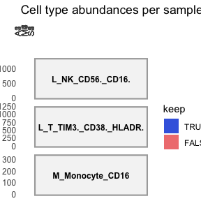
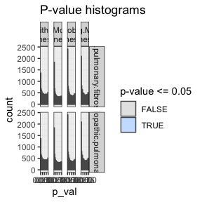

<style type="text/css">
.smaller {
  font-size: 10px
}
</style>

<!-- github markdown built using
rmarkdown::render("vignettes/condition_specific_celltype_MISC.Rmd", clean = FALSE )
-->


In this vignette, you can learn how to perform a MultiNicheNet analysis when you have one or more condition-specific cell types in your data. The differential expression analysis step in MultiNicheNet is the core issue for analyzing condition-specific cell types. This is because condition-specific cell types, by their very nature, do not have a counterpart in other conditions against which differential expression can be measured.

As the best solution, we recommend - if possible and biologically sensible to annotate your cells at one level higher in the cell type annotation hierarchy (eg sub cell type can be seen as a different cell state). Hereby, you will not have this problem of condition-specific cell types anymore. 

A a second solution, we propose the procedure as showcased in this vignette. This consists of 3 consecutive workflows: 
*1) General Workflow: This is the regular MultiNicheNet approach. In the general workflow, condition-specific cell types are excluded from the analysis. This approach focuses on achieving the best prioritization for other cell types that are present across different conditions, allowing for a standard DE analysis. The exclusion of condition-specific cell types simplifies the analysis but at the expense of potentially missing out on valuable insights that these unique cell types could provide. Therefore you can go further with the next two workflows: 
*2) Workflow A (Sender Cell Types): This workflow adapts the analysis to include condition-specific cell types as sender cell types. It circumvents the need for DE analysis of the ligand by only focusing the ligand-prioritization on ligand cell type specificity and ligand activity. 
*3) Workflow B (Receiver Cell Types): Workflow B allows for the inclusion of condition-specific cell types as receiver cell types by forgoing the DE analysis of the receiver, meaning that we cannot consider receptor differential expresion and ligand activity. Instead, receptor prioritization is based solely on the receptor cell type specificity.

As example expression data of interacting cells, we will here use scRNAseq data of immune cells in MIS-C patients and healthy siblings from this paper of Hoste et al.: [TIM3+ TRBV11-2 T cells and IFNγ signature in patrolling monocytes and CD16+ NK cells delineate MIS-C](https://rupress.org/jem/article/219/2/e20211381/212918/TIM3-TRBV11-2-T-cells-and-IFN-signature-in) [](https://doi.org/10.5281/zenodo.6362434)
. MIS-C (multisystem inflammatory syndrome in children) is a novel rare immunodysregulation syndrome that can arise after SARS-CoV-2 infection in children. We will use NicheNet to explore immune cell crosstalk enriched in MIS-C compared to healthy siblings and patients with adult COVID-19. 

# Preparation of the MultiNicheNet core analysis


``` r
library(SingleCellExperiment)
library(dplyr)
library(ggplot2)
library(nichenetr)
library(multinichenetr)
```

## Load NicheNet's ligand-receptor network and ligand-target matrix

MultiNicheNet builds upon the NicheNet framework and uses the same prior knowledge networks (ligand-receptor network and ligand-target matrix, currently v2 version).

The Nichenet v2 networks and matrices for both mouse and human can be downloaded from Zenodo [](https://doi.org/10.5281/zenodo.7074291). 

We will read these object in for human because our expression data is of human patients. 
Gene names are here made syntactically valid via `make.names()` to avoid the loss of genes (eg H2-M3) in downstream visualizations.


``` r
organism = "human"
```


``` r
options(timeout = 120)

if(organism == "human"){
  
  lr_network_all = 
    readRDS(url(
      "https://zenodo.org/record/10229222/files/lr_network_human_allInfo_30112033.rds"
      )) %>% 
    mutate(
      ligand = convert_alias_to_symbols(ligand, organism = organism), 
      receptor = convert_alias_to_symbols(receptor, organism = organism))
  
  lr_network_all = lr_network_all  %>% 
    mutate(ligand = make.names(ligand), receptor = make.names(receptor)) 
  
  lr_network = lr_network_all %>% 
    distinct(ligand, receptor)
  
  ligand_target_matrix = readRDS(url(
    "https://zenodo.org/record/7074291/files/ligand_target_matrix_nsga2r_final.rds"
    ))
  
  colnames(ligand_target_matrix) = colnames(ligand_target_matrix) %>% 
    convert_alias_to_symbols(organism = organism) %>% make.names()
  rownames(ligand_target_matrix) = rownames(ligand_target_matrix) %>% 
    convert_alias_to_symbols(organism = organism) %>% make.names()
  
  lr_network = lr_network %>% filter(ligand %in% colnames(ligand_target_matrix))
  ligand_target_matrix = ligand_target_matrix[, lr_network$ligand %>% unique()]
  
} else if(organism == "mouse"){
  
  lr_network_all = readRDS(url(
    "https://zenodo.org/record/10229222/files/lr_network_mouse_allInfo_30112033.rds"
    )) %>% 
    mutate(
      ligand = convert_alias_to_symbols(ligand, organism = organism), 
      receptor = convert_alias_to_symbols(receptor, organism = organism))
  
  lr_network_all = lr_network_all  %>% 
    mutate(ligand = make.names(ligand), receptor = make.names(receptor)) 
  lr_network = lr_network_all %>% 
    distinct(ligand, receptor)
  
  ligand_target_matrix = readRDS(url(
    "https://zenodo.org/record/7074291/files/ligand_target_matrix_nsga2r_final_mouse.rds"
    ))
  
  colnames(ligand_target_matrix) = colnames(ligand_target_matrix) %>% 
    convert_alias_to_symbols(organism = organism) %>% make.names()
  rownames(ligand_target_matrix) = rownames(ligand_target_matrix) %>% 
    convert_alias_to_symbols(organism = organism) %>% make.names()
  
  lr_network = lr_network %>% filter(ligand %in% colnames(ligand_target_matrix))
  ligand_target_matrix = ligand_target_matrix[, lr_network$ligand %>% unique()]
  
}
```

## Read in SingleCellExperiment Objects 

In this vignette, we will load in a subset of the scRNAseq data of the MIS-C [](https://doi.org/10.5281/zenodo.8010790). For the sake of demonstration, this subset only contains 3 cell types. These celltypes are some of the cell types that were found to be most interesting related to MIS-C according to Hoste et al. 

If you start from a Seurat object, you can convert it easily to a SingleCellExperiment object via `sce = Seurat::as.SingleCellExperiment(seurat_obj, assay = "RNA")`.

Because the NicheNet 2.0. networks are in the most recent version of the official gene symbols, we will make sure that the gene symbols used in the expression data are also updated (= converted from their "aliases" to official gene symbols). Afterwards, we will make them again syntactically valid. 


``` r
sce = readRDS(url(
  "https://zenodo.org/record/8010790/files/sce_subset_misc.rds"
  ))
sce = alias_to_symbol_SCE(sce, "human") %>% makenames_SCE()
```

## Prepare the settings of the MultiNicheNet cell-cell communication analysis

In this step, we will formalize our research question into MultiNicheNet input arguments.

### Define in which metadata columns we can find the **group**, **sample** and **cell type** IDs

In this case study, we want to study differences in cell-cell communication patterns between MIS-C patients (M), their healthy siblings (S) and adult patients with severe covid (A). The meta data columns that indicate this disease status(=group/condition of interest) is `MIS.C.AgeTier`. 

Cell type annotations are indicated in the `Annotation_v2.0` column, and the sample is indicated by the `ShortID` column. 
If your cells are annotated in multiple hierarchical levels, we recommend using a relatively high level in the hierarchy. This for 2 reasons: 1) MultiNicheNet focuses on differential expression and not differential abundance, and 2) there should be sufficient cells per sample-celltype combination (see later).


``` r
sample_id = "ShortID"
group_id = "MIS.C.AgeTier"
celltype_id = "Annotation_v2.0"
```

__Important__: It is required that each sample-id is uniquely assigned to only one condition/group of interest. See the vignettes about paired and multifactorial analysis to see how to define your analysis input when you have multiple samples (and conditions) per patient.

If you would have batch effects or covariates you can correct for, you can define this here as well. However, this is not applicable to this dataset. Therefore we will use the following NA settings:


``` r
covariates = NA
batches = NA
```

__Important__: for categorical covariates and batches, there should be at least one sample for every group-batch combination. If one of your groups/conditions lacks a certain level of your batch, you won't be able to correct for the batch effect because the model is then not able to distinguish batch from group/condition effects.

__Important__: The column names of group, sample, cell type, batches and covariates should be syntactically valid (`make.names`)

__Important__: All group, sample, cell type, batch and covariate names should be syntactically valid as well (`make.names`) (eg through `SummarizedExperiment::colData(sce)$ShortID = SummarizedExperiment::colData(sce)$ShortID %>% make.names()`)

### Define the contrasts of interest.

Here, we want to compare each patient group to the other groups, so the MIS-C (M) group vs healthy control siblings (S) and adult COVID19 patients (A) (= M vs S+A) and so on. We want to know which cell-cell communication patterns are specific for the M vs A+S group, the A vs M+S group and the S vs A+M group. 

To perform this comparison, we need to set the following contrasts:


``` r
contrasts_oi = c("'M-(S+A)/2','S-(M+A)/2','A-(S+M)/2'")
```

__Very Important__ Note the format to indicate the contrasts! This formatting should be adhered to very strictly, and white spaces are not allowed! Check `?get_DE_info` for explanation about how to define this well. The most important points are that: 
*each contrast is surrounded by single quotation marks
*contrasts are separated by a comma without any white space 
*all contrasts together are surrounded by double quotation marks. 

If you compare against two groups, you should divide by 2 (as demonstrated here), if you compare against three groups, you should divide by 3 and so on.

For downstream visualizations and linking contrasts to their main condition, we also need to run the following:
This is necessary because we will also calculate cell-type+condition specificity of ligands and receptors. 


``` r
contrast_tbl = tibble(contrast = 
                        c("M-(S+A)/2","S-(M+A)/2", "A-(S+M)/2"), 
                      group = c("M","S","A"))
```

If you want to compare only two groups (eg M vs S), you can use the following:
`contrasts_oi = c("'M-S','S-M'") `
`contrast_tbl = tibble(contrast = c("M-S","S-M"), group = c("M","S"))`

Other vignettes will demonstrate how to formalize different types of research questions.

### Define the sender and receiver cell types of interest.

If you want to focus the analysis on specific cell types (e.g. because you know which cell types reside in the same microenvironments based on spatial data), you can define this here. If you have sufficient computational resources and no specific idea of cell-type colocalzations, we recommend to consider all cell types as potential senders and receivers. Later on during analysis of the output it is still possible to zoom in on the cell types that interest you most, but your analysis is not biased to them.


``` r
senders_oi = SummarizedExperiment::colData(sce)[,celltype_id] %>% unique()
receivers_oi = SummarizedExperiment::colData(sce)[,celltype_id] %>% unique()
```

If the user wants it, it is possible to use only a subset of senders and receivers. Senders and receivers can be entirely different, but also overlapping, or the same. If you don't use all the cell types in your data, we recommend to continue with a subset of your data.


``` r
sce = sce[, SummarizedExperiment::colData(sce)[,celltype_id] %in% c(senders_oi, receivers_oi)]
```

In this vignette we will specifically demonstrate our workaround in case you are dealing with condition-specific cell types. These are cell types that are lacking in at least one condition, and are present in at least one other condition. 
For demonstration purposes, we will here artificially remove L_T_TIM3._CD38._HLADR. from the sibling and adult samples, making these cells specific for the MIS-C group. 


``` r
sce_T = sce[, SummarizedExperiment::colData(sce)[,celltype_id] == "L_T_TIM3._CD38._HLADR."]
sce_T_Sibling =  sce_T[, SummarizedExperiment::colData(sce_T)[,group_id] %in% c("S","A")]
sce = sce[, setdiff(colnames(sce), colnames(sce_T_Sibling))]
```

# Running the MultiNicheNet core analysis

Now we will run the core of a MultiNicheNet analysis. This analysis consists of the following steps:

* 1. Cell-type filtering: determine which cell types are sufficiently present
* 2. Gene filtering: determine which genes are sufficiently expressed in each present cell type
* 3. Pseudobulk expression calculation: determine and normalize per-sample pseudobulk expression levels for each expressed gene in each present cell type
* 4. Differential expression (DE) analysis: determine which genes are differentially expressed
* 5. Ligand activity prediction: use the DE analysis output to predict the activity of ligands in receiver cell types and infer their potential target genes
* 6. Prioritization: rank cell-cell communication patterns through multi-criteria prioritization

Following these steps, one can optionally 
* 7. Calculate the across-samples expression correlation between ligand-receptor pairs and target genes
* 8. Prioritize communication patterns involving condition-specific cell types through an alternative prioritization scheme

After these steps, the output can be further explored as we will demonstrate in the "Downstream analysis of the MultiNicheNet output" section. 

In this vignette, we will demonstrate these steps one-by-one, which offers the most flexibility to the user to assess intermediary results. 

## Cell-type filtering: determine which cell types are sufficiently present

In this step we will calculate and visualize cell type abundances. This will give an indication about which cell types will be retained in the analysis, and which cell types will be filtered out.  

Since MultiNicheNet will infer group differences at the sample level for each cell type (currently via Muscat - pseudobulking + EdgeR), we need to have sufficient cells per sample of a cell type, and this for all groups. In the following analysis we will set this minimum number of cells per cell type per sample at 10. Samples that have less than `min_cells` cells will be excluded from the analysis for that specific cell type.
 

``` r
min_cells = 10
```

We recommend using `min_cells = 10`, except for datasets with several lowly abundant cell types of interest. For those datasets, we recommend using `min_cells = 5`.


``` r
abundance_info = get_abundance_info(
  sce = sce, 
  sample_id = sample_id, group_id = group_id, celltype_id = celltype_id, 
  min_cells = min_cells, 
  senders_oi = senders_oi, receivers_oi = receivers_oi, 
  batches = batches
  )
```

First, we will check the cell type abundance diagnostic plots.

### Interpretation of cell type abundance information

The first plot visualizes the number of cells per celltype-sample combination, and indicates which combinations are removed during the DE analysis because there are less than `min_cells` in the celltype-sample combination. 


``` r
abundance_info$abund_plot_sample
```

<!-- -->
The red dotted line indicates the required minimum of cells as defined above in `min_cells`. We can see here that L_T_TIM3._CD38._HLADR. are absent in the A and S groups, and only present in the M-group.

### Cell type filtering based on cell type abundance information

Running the following block of code can help you automatically determine which cell types are condition-specific and which cell types are absent. 


``` r
abundance_df_summarized = abundance_info$abundance_data %>% 
  mutate(keep = as.logical(keep)) %>% 
  group_by(group_id, celltype_id) %>% 
  summarise(samples_present = sum((keep)))

celltypes_absent_one_condition = abundance_df_summarized %>% 
  filter(samples_present == 0) %>% pull(celltype_id) %>% unique() 
# find truly condition-specific cell types by searching for cell types 
# truely absent in at least one condition

celltypes_present_one_condition = abundance_df_summarized %>% 
  filter(samples_present >= 2) %>% pull(celltype_id) %>% unique() 
# require presence in at least 2 samples of one group so 
# it is really present in at least one condition

condition_specific_celltypes = intersect(
  celltypes_absent_one_condition, 
  celltypes_present_one_condition)

total_nr_conditions = SummarizedExperiment::colData(sce)[,group_id] %>% 
  unique() %>% length() 

absent_celltypes = abundance_df_summarized %>% 
  filter(samples_present < 2) %>% 
  group_by(celltype_id) %>% 
  count() %>% 
  filter(n == total_nr_conditions) %>% 
  pull(celltype_id)
  
print("condition-specific celltypes:")
## [1] "condition-specific celltypes:"
print(condition_specific_celltypes)
## [1] "L_T_TIM3._CD38._HLADR."
  
print("absent celltypes:")
## [1] "absent celltypes:"
print(absent_celltypes)
## character(0)
```
Absent cell types will be filtered out, condition-specific cell types can be filtered out if you as a user do not want to run the alternative workflow for condition-specific cell types in the optional step 8 of the core MultiNicheNet analysis. However, in this analysis, we want to assess cell-cell communication involving condition-specific cell types, so we will keep condition-specific cell types by setting `analyse_condition_specific_celltypes = TRUE`


``` r
analyse_condition_specific_celltypes = TRUE
```


``` r
if(analyse_condition_specific_celltypes == TRUE){
  senders_oi = senders_oi %>% setdiff(absent_celltypes)
  receivers_oi = receivers_oi %>% setdiff(absent_celltypes)
} else {
  senders_oi = senders_oi %>% 
    setdiff(union(absent_celltypes, condition_specific_celltypes))
  receivers_oi = receivers_oi %>% 
    setdiff(union(absent_celltypes, condition_specific_celltypes))
}

sce = sce[, SummarizedExperiment::colData(sce)[,celltype_id] %in% 
            c(senders_oi, receivers_oi)
          ]
```

## Gene filtering: determine which genes are sufficiently expressed in each present cell type

Before running the DE analysis, we will determine which genes are not sufficiently expressed and should be filtered out. 
We will perform gene filtering based on a similar procedure as used in `edgeR::filterByExpr`. However, we adapted this procedure to be more interpretable for single-cell datasets.  

For each cell type, we will consider genes expressed if they are expressed in at least a `min_sample_prop` fraction of samples in the condition with the lowest number of samples. By default, we set `min_sample_prop = 0.50`, which means that genes should be expressed in at least 2 samples if the group with lowest nr. of samples has 4 samples like this dataset. 


``` r
min_sample_prop = 0.50
```

But how do we define which genes are expressed in a sample? For this we will consider genes as expressed if they have non-zero expression values in a `fraction_cutoff` fraction of cells of that cell type in that sample. By default, we set `fraction_cutoff = 0.05`, which means that genes should show non-zero expression values in at least 5% of cells in a sample. 


``` r
fraction_cutoff = 0.05
```

We recommend using these default values unless there is specific interest in prioritizing (very) weakly expressed interactions. In that case, you could lower the value of `fraction_cutoff`. We explicitly recommend against using `fraction_cutoff > 0.10`.

Now we will calculate the information required for gene filtering with the following command:


``` r
frq_list = get_frac_exprs(
  sce = sce, 
  sample_id = sample_id, celltype_id =  celltype_id, group_id = group_id, 
  batches = batches, 
  min_cells = min_cells, 
  fraction_cutoff = fraction_cutoff, min_sample_prop = min_sample_prop)
## [1] "Samples are considered if they have more than 10 cells of the cell type of interest"
## [1] "Genes with non-zero counts in at least 5% of cells of a cell type of interest in a particular sample will be considered as expressed in that sample."
## [1] "Genes expressed in at least 2 samples will considered as expressed in the cell type: L_NK_CD56._CD16."
## [1] "Genes expressed in at least 3.5 samples will considered as expressed in the cell type: L_T_TIM3._CD38._HLADR."
## [1] "Genes expressed in at least 2 samples will considered as expressed in the cell type: M_Monocyte_CD16"
## [1] "6621 genes are considered as expressed in the cell type: L_NK_CD56._CD16."
## [1] "7518 genes are considered as expressed in the cell type: L_T_TIM3._CD38._HLADR."
## [1] "8817 genes are considered as expressed in the cell type: M_Monocyte_CD16"
```

Now only keep genes that are expressed by at least one cell type:


``` r
genes_oi = frq_list$expressed_df %>% 
  filter(expressed == TRUE) %>% pull(gene) %>% unique() 
sce = sce[genes_oi, ]
```

## Pseudobulk expression calculation: determine and normalize per-sample pseudobulk expression levels for each expressed gene in each present cell type

After filtering out absent cell types and genes, we will continue the analysis by calculating the different prioritization criteria that we will use to prioritize cell-cell communication patterns.

First, we will determine and normalize per-sample pseudobulk expression levels for each expressed gene in each present cell type. The function `process_abundance_expression_info` will link this expression information for ligands of the sender cell types to the corresponding receptors of the receiver cell types. This will later on allow us to define the cell-type specicificy criteria for ligands and receptors.


``` r
abundance_expression_info = process_abundance_expression_info(
  sce = sce, 
  sample_id = sample_id, group_id = group_id, celltype_id = celltype_id, 
  min_cells = min_cells, 
  senders_oi = senders_oi, receivers_oi = receivers_oi, 
  lr_network = lr_network, 
  batches = batches, 
  frq_list = frq_list, 
  abundance_info = abundance_info)
```

Normalized pseudobulk expression values per gene/celltype/sample can be inspected by:


``` r
abundance_expression_info$celltype_info$pb_df %>% head()
## # A tibble: 6 × 4
##   gene  sample pb_sample celltype              
##   <chr> <chr>      <dbl> <fct>                 
## 1 A1BG  M1          4.70 L_T_TIM3._CD38._HLADR.
## 2 AAAS  M1          4.87 L_T_TIM3._CD38._HLADR.
## 3 AAGAB M1          5.33 L_T_TIM3._CD38._HLADR.
## 4 AAK1  M1          6.67 L_T_TIM3._CD38._HLADR.
## 5 AAMDC M1          3.46 L_T_TIM3._CD38._HLADR.
## 6 AAMP  M1          5.95 L_T_TIM3._CD38._HLADR.
```

An average of these sample-level expression values per condition/group can be inspected by:


``` r
abundance_expression_info$celltype_info$pb_df_group %>% head()
## # A tibble: 6 × 4
## # Groups:   group, celltype [1]
##   group celltype         gene  pb_group
##   <chr> <chr>            <chr>    <dbl>
## 1 A     L_NK_CD56._CD16. A1BG      3.92
## 2 A     L_NK_CD56._CD16. AAAS      4.82
## 3 A     L_NK_CD56._CD16. AAGAB     4.83
## 4 A     L_NK_CD56._CD16. AAK1      7.04
## 5 A     L_NK_CD56._CD16. AAMDC     3.66
## 6 A     L_NK_CD56._CD16. AAMP      6.05
```

Inspecting these values for ligand-receptor interactions can be done by:


``` r
abundance_expression_info$sender_receiver_info$pb_df %>% head()
## # A tibble: 6 × 8
##   sample sender                 receiver        ligand receptor pb_ligand pb_receptor ligand_receptor_pb_prod
##   <chr>  <chr>                  <chr>           <chr>  <chr>        <dbl>       <dbl>                   <dbl>
## 1 M4     M_Monocyte_CD16        M_Monocyte_CD16 B2M    LILRB1        14.1        11.4                    161.
## 2 M4     L_NK_CD56._CD16.       M_Monocyte_CD16 B2M    LILRB1        14.0        11.4                    160.
## 3 M4     L_T_TIM3._CD38._HLADR. M_Monocyte_CD16 B2M    LILRB1        13.8        11.4                    157.
## 4 M5     L_NK_CD56._CD16.       M_Monocyte_CD16 B2M    LILRB1        14.5        10.5                    153.
## 5 M5     M_Monocyte_CD16        M_Monocyte_CD16 B2M    LILRB1        14.4        10.5                    151.
## 6 M5     L_T_TIM3._CD38._HLADR. M_Monocyte_CD16 B2M    LILRB1        14.1        10.5                    149.
abundance_expression_info$sender_receiver_info$pb_df_group %>% head()
## # A tibble: 6 × 8
## # Groups:   group, sender [5]
##   group sender                 receiver         ligand receptor pb_ligand_group pb_receptor_group ligand_receptor_pb_prod_group
##   <chr> <chr>                  <chr>            <chr>  <chr>              <dbl>             <dbl>                         <dbl>
## 1 M     L_NK_CD56._CD16.       M_Monocyte_CD16  B2M    LILRB1              14.1              9.99                          141.
## 2 M     M_Monocyte_CD16        M_Monocyte_CD16  B2M    LILRB1              14.1              9.99                          140.
## 3 M     L_T_TIM3._CD38._HLADR. M_Monocyte_CD16  B2M    LILRB1              13.9              9.99                          139.
## 4 A     L_NK_CD56._CD16.       L_NK_CD56._CD16. B2M    KLRD1               14.3              9.72                          139.
## 5 S     L_NK_CD56._CD16.       L_NK_CD56._CD16. B2M    KLRD1               14.4              9.46                          136.
## 6 M     L_NK_CD56._CD16.       L_NK_CD56._CD16. B2M    KLRD1               14.1              9.49                          134.
```

## Differential expression (DE) analysis: determine which genes are differentially expressed

In this step, we will perform genome-wide differential expression analysis of receiver and sender cell types to define DE genes between the conditions of interest (as formalized by the `contrasts_oi`). Based on this analysis, we later can define the levels of differential expression of ligands in senders and receptors in receivers, and define the set of affected target genes in the receiver cell types (which will be used for the ligand activity analysis).

We will apply pseudobulking followed by EdgeR to perform multi-condition multi-sample differential expression (DE) analysis (also called 'differential state' analysis by the developers of Muscat). 


``` r
DE_info = get_DE_info(
  sce = sce, 
  sample_id = sample_id, group_id = group_id, celltype_id = celltype_id, 
  batches = batches, covariates = covariates, 
  contrasts_oi = contrasts_oi, 
  min_cells = min_cells, 
  expressed_df = frq_list$expressed_df)
## Error in perform_muscat_de_analysis(sce = sce_oi, sample_id = sample_id, : conditions written in contrasts should be in the condition-indicating column! This is not the case, which can lead to errors downstream.
```

Logically, DE analysis cannot be performed for the condition-specific cell types. This results here in an error for the "L_T_TIM3._CD38._HLADR." cell type. 

### Check DE results

Table with logFC and p-values for each gene-celltype-contrast:


``` r
DE_info$celltype_de$de_output_tidy %>% head()
## # A tibble: 6 × 9
##   gene  cluster_id       logFC logCPM       F  p_val p_adj.loc p_adj contrast                            
##   <chr> <chr>            <dbl>  <dbl>   <dbl>  <dbl>     <dbl> <dbl> <chr>                               
## 1 A1BG  CD16..Monocyte -0.143    5.07 0.337   0.563      0.827 0.827 idiopathic.pulmonary.fibrosis-normal
## 2 A2M   CD16..Monocyte  0.514    4.04 2.61    0.109      0.366 0.366 idiopathic.pulmonary.fibrosis-normal
## 3 AAAS  CD16..Monocyte  0.0185   4.46 0.00473 0.945      0.987 0.987 idiopathic.pulmonary.fibrosis-normal
## 4 AACS  CD16..Monocyte -0.59     3.89 2.94    0.09       0.334 0.334 idiopathic.pulmonary.fibrosis-normal
## 5 AAGAB CD16..Monocyte -0.137    5.47 0.594   0.443      0.743 0.743 idiopathic.pulmonary.fibrosis-normal
## 6 AAK1  CD16..Monocyte -0.352    6.7  5.96    0.0166     0.123 0.123 idiopathic.pulmonary.fibrosis-normal
```

Evaluate the distributions of p-values:


``` r
DE_info$hist_pvals
```

<!-- -->

These distributions look fine (uniform distribution, except peak at p-value <= 0.05), so we will continue using these regular p-values. In case these p-value distributions look irregular, you can estimate empirical p-values as we will demonstrate in another vignette.


``` r
empirical_pval = FALSE
```


``` r
if(empirical_pval == TRUE){
  DE_info_emp = get_empirical_pvals(DE_info$celltype_de$de_output_tidy)
  celltype_de = DE_info_emp$de_output_tidy_emp %>% select(-p_val, -p_adj) %>% 
    rename(p_val = p_emp, p_adj = p_adj_emp)
} else {
  celltype_de = DE_info$celltype_de$de_output_tidy
} 
```

### Combine DE information for ligand-senders and receptors-receivers

To end this step, we will combine the DE information of senders and receivers by linking their ligands and receptors together based on the prior knowledge ligand-receptor network.


``` r
sender_receiver_de = combine_sender_receiver_de(
  sender_de = celltype_de,
  receiver_de = celltype_de,
  senders_oi = senders_oi,
  receivers_oi = receivers_oi,
  lr_network = lr_network
)
```


``` r
sender_receiver_de %>% head(20)
## # A tibble: 0 × 12
## # ℹ 12 variables: contrast <chr>, sender <chr>, receiver <chr>, ligand <chr>, receptor <chr>, lfc_ligand <dbl>, lfc_receptor <dbl>, ligand_receptor_lfc_avg <dbl>, p_val_ligand <dbl>, p_adj_ligand <dbl>, p_val_receptor <dbl>, p_adj_receptor <dbl>
```

## Ligand activity prediction: use the DE analysis output to predict the activity of ligands in receiver cell types and infer their potential target genes

In this step, we will predict NicheNet ligand activities and NicheNet ligand-target links based on these differential expression results. We do this to prioritize interactions based on their predicted effect on a receiver cell type. We will assume that the most important group-specific interactions are those that lead to group-specific gene expression changes in a receiver cell type.

Similarly to base NicheNet (https://github.com/saeyslab/nichenetr), we use the DE output to create a "geneset of interest": here we assume that DE genes within a cell type may be DE because of differential cell-cell communication processes. In the ligand activity prediction, we will assess the enrichment of target genes of ligands within this geneset of interest. In case high-probabiliy target genes of a ligand are enriched in this set compared to the background of expressed genes, we predict that this ligand may have a high activity. 

Because the ligand activity analysis is an enrichment procedure, it is important that this geneset of interest should contain a sufficient but not too large number of genes. The ratio geneset_oi/background should ideally be between 1/200 and 1/10 (or close to these ratios).

To determine the genesets of interest based on DE output, we need to define some logFC and/or p-value thresholds per cell type/contrast combination. In general, we recommend inspecting the nr. of DE genes for all cell types based on the default thresholds and adapting accordingly. By default, we will apply the p-value cutoff on the normal p-values, and not on the p-values corrected for multiple testing. This choice was made because most multi-sample single-cell transcriptomics datasets have just a few samples per group and we might have a lack of statistical power due to pseudobulking. But, if the smallest group >= 20 samples, we typically recommend using p_val_adj = TRUE. When the biological difference between the conditions is very large, we typically recommend increasing the logFC_threshold and/or using p_val_adj = TRUE.

### Assess geneset_oi-vs-background ratios for different DE output tresholds prior to the NicheNet ligand activity analysis 

We will first inspect the geneset_oi-vs-background ratios for the default tresholds:


``` r
logFC_threshold = 0.50
p_val_threshold = 0.05
```


``` r
p_val_adj = FALSE 
```


``` r
geneset_assessment = contrast_tbl$contrast %>% 
  lapply(
    process_geneset_data, 
    celltype_de, logFC_threshold, p_val_adj, p_val_threshold
  ) %>% 
  bind_rows() 
geneset_assessment
## # A tibble: 0 × 12
## # ℹ 12 variables: cluster_id <chr>, n_background <int>, n_geneset_up <int>, n_geneset_down <int>, prop_geneset_up <dbl>, prop_geneset_down <dbl>, in_range_up <lgl>, in_range_down <lgl>, contrast <chr>, logFC_threshold <dbl>, p_val_threshold <dbl>, adjusted <lgl>
```
We can see here that for all cell type / contrast combinations, all geneset/background ratio's are within the recommended range (`in_range_up` and `in_range_down` columns). When these geneset/background ratio's would not be within the recommended ranges, we should interpret ligand activity results for these cell types with more caution, or use different thresholds (for these or all cell types). 

For the sake of demonstration, we will also calculate these ratio's in case we would use the adjusted p-value as threshold.


``` r
geneset_assessment_adjustedPval = contrast_tbl$contrast %>% 
  lapply(
    process_geneset_data, 
    celltype_de, logFC_threshold, p_val_adj = TRUE, p_val_threshold
    ) %>% 
  bind_rows() 
geneset_assessment_adjustedPval
## # A tibble: 0 × 12
## # ℹ 12 variables: cluster_id <chr>, n_background <int>, n_geneset_up <int>, n_geneset_down <int>, prop_geneset_up <dbl>, prop_geneset_down <dbl>, in_range_up <lgl>, in_range_down <lgl>, contrast <chr>, logFC_threshold <dbl>, p_val_threshold <dbl>, adjusted <lgl>
```
We can see here that for most cell type / contrast combinations, the geneset/background ratio's are not within the recommended range. Therefore, we will proceed with the default tresholds for the ligand activity analysis

### Perform the ligand activity analysis and ligand-target inference

After the ligand activity prediction, we will also infer the predicted target genes of these ligands in each contrast. For this ligand-target inference procedure, we also need to select which top n of the predicted target genes will be considered (here: top 250 targets per ligand). This parameter will not affect the ligand activity predictions. It will only affect ligand-target visualizations and construction of the intercellular regulatory network during the downstream analysis. We recommend users to test other settings in case they would be interested in exploring fewer, but more confident target genes, or vice versa. 


``` r
top_n_target = 250
```

The NicheNet ligand activity analysis can be run in parallel for each receiver cell type, by changing the number of cores as defined here. Using more cores will speed up the analysis at the cost of needing more memory. This is only recommended if you have many receiver cell types of interest. 


``` r
verbose = TRUE
cores_system = 8
n.cores = min(cores_system, celltype_de$cluster_id %>% unique() %>% length()) 
```

Running the ligand activity prediction will take some time (the more cell types and contrasts, the more time)


``` r
ligand_activities_targets_DEgenes = suppressMessages(suppressWarnings(
  get_ligand_activities_targets_DEgenes(
    receiver_de = celltype_de,
    receivers_oi = intersect(receivers_oi, celltype_de$cluster_id %>% unique()),
    ligand_target_matrix = ligand_target_matrix,
    logFC_threshold = logFC_threshold,
    p_val_threshold = p_val_threshold,
    p_val_adj = p_val_adj,
    top_n_target = top_n_target,
    verbose = verbose, 
    n.cores = n.cores
  )
))
```

You can check the output of the ligand activity and ligand-target inference here:


``` r
ligand_activities_targets_DEgenes$ligand_activities %>% head(20)
## # A tibble: 20 × 8
## # Groups:   receiver, contrast [1]
##    ligand activity contrast                             target  ligand_target_weight receiver                   direction_regulation activity_scaled
##    <chr>     <dbl> <chr>                                <chr>                  <dbl> <chr>                      <fct>                          <dbl>
##  1 A2M      0.0479 idiopathic.pulmonary.fibrosis-normal ANGPTL4              0.00747 Alveolar.Epithelial.Type.1 up                             0.943
##  2 A2M      0.0479 idiopathic.pulmonary.fibrosis-normal ASS1                 0.00892 Alveolar.Epithelial.Type.1 up                             0.943
##  3 A2M      0.0479 idiopathic.pulmonary.fibrosis-normal BAX                  0.0115  Alveolar.Epithelial.Type.1 up                             0.943
##  4 A2M      0.0479 idiopathic.pulmonary.fibrosis-normal BMP4                 0.00776 Alveolar.Epithelial.Type.1 up                             0.943
##  5 A2M      0.0479 idiopathic.pulmonary.fibrosis-normal CCL2                 0.0117  Alveolar.Epithelial.Type.1 up                             0.943
##  6 A2M      0.0479 idiopathic.pulmonary.fibrosis-normal CCND1                0.0186  Alveolar.Epithelial.Type.1 up                             0.943
##  7 A2M      0.0479 idiopathic.pulmonary.fibrosis-normal CCND2                0.00954 Alveolar.Epithelial.Type.1 up                             0.943
##  8 A2M      0.0479 idiopathic.pulmonary.fibrosis-normal CDKN1A               0.0218  Alveolar.Epithelial.Type.1 up                             0.943
##  9 A2M      0.0479 idiopathic.pulmonary.fibrosis-normal CDKN2A               0.00716 Alveolar.Epithelial.Type.1 up                             0.943
## 10 A2M      0.0479 idiopathic.pulmonary.fibrosis-normal CLDN1                0.00728 Alveolar.Epithelial.Type.1 up                             0.943
## 11 A2M      0.0479 idiopathic.pulmonary.fibrosis-normal COL1A1               0.00720 Alveolar.Epithelial.Type.1 up                             0.943
## 12 A2M      0.0479 idiopathic.pulmonary.fibrosis-normal COL1A2               0.00834 Alveolar.Epithelial.Type.1 up                             0.943
## 13 A2M      0.0479 idiopathic.pulmonary.fibrosis-normal CTNNB1               0.00691 Alveolar.Epithelial.Type.1 up                             0.943
## 14 A2M      0.0479 idiopathic.pulmonary.fibrosis-normal DDX60                0.00714 Alveolar.Epithelial.Type.1 up                             0.943
## 15 A2M      0.0479 idiopathic.pulmonary.fibrosis-normal DKK1                 0.0104  Alveolar.Epithelial.Type.1 up                             0.943
## 16 A2M      0.0479 idiopathic.pulmonary.fibrosis-normal DUSP6                0.00908 Alveolar.Epithelial.Type.1 up                             0.943
## 17 A2M      0.0479 idiopathic.pulmonary.fibrosis-normal E2F3                 0.00678 Alveolar.Epithelial.Type.1 up                             0.943
## 18 A2M      0.0479 idiopathic.pulmonary.fibrosis-normal ETS1                 0.00729 Alveolar.Epithelial.Type.1 up                             0.943
## 19 A2M      0.0479 idiopathic.pulmonary.fibrosis-normal FN1                  0.00965 Alveolar.Epithelial.Type.1 up                             0.943
## 20 A2M      0.0479 idiopathic.pulmonary.fibrosis-normal FOSL2                0.00733 Alveolar.Epithelial.Type.1 up                             0.943
```

## Prioritization: rank cell-cell communication patterns through multi-criteria prioritization

In the previous steps, we calculated expression, differential expression and NicheNet ligand activity. In the final step, we will now combine all calculated information to rank all sender-ligand---receiver-receptor pairs according to group/condition specificity. We will use the following criteria to prioritize ligand-receptor interactions:

* Upregulation of the ligand in a sender cell type and/or upregulation of the receptor in a receiver cell type - in the condition of interest.
* Cell-type specific expression of the ligand in the sender cell type and receptor in the receiver cell type in the condition of interest (to mitigate the influence of upregulated but still relatively weakly expressed ligands/receptors). 
* Sufficiently high expression levels of ligand and receptor in many samples of the same group.
* High NicheNet ligand activity, to further prioritize ligand-receptor pairs based on their predicted effect of the ligand-receptor interaction on the gene expression in the receiver cell type. 

We will combine these prioritization criteria in a single aggregated prioritization score. In the default setting, we will weigh each of these criteria equally (`scenario = "regular"`). This setting is strongly recommended. However, we also provide some additional setting to accomodate different biological scenarios. The setting `scenario = "lower_DE"` halves the weight for DE criteria and doubles the weight for ligand activity. This is recommended in case your hypothesis is that the differential CCC patterns in your data are less likely to be driven by DE (eg in cases of differential migration into a niche). The setting `scenario = "no_frac_LR_expr"` ignores the criterion "Sufficiently high expression levels of ligand and receptor in many samples of the same group". This may be interesting for users that have data with a limited number of samples and don’t want to penalize interactions if they are not sufficiently expressed in some samples. 

Finally, we still need to make one choice. For NicheNet ligand activity we can choose to prioritize ligands that only induce upregulation of target genes (`ligand_activity_down = FALSE`) or can lead potentially lead to both up- and downregulation (`ligand_activity_down = TRUE`). The benefit of `ligand_activity_down = FALSE` is ease of interpretability: prioritized ligand-receptor pairs will be upregulated in the condition of interest, just like their target genes.  `ligand_activity_down = TRUE` can be harder to interpret because target genes of some interactions may be upregulated in the other conditions compared to the condition of interest. This is harder to interpret, but may help to pick up interactions that can also repress gene expression. 

Here we will choose for setting `ligand_activity_down = FALSE` and focus specifically on upregulating ligands.


``` r
ligand_activity_down = FALSE
```


``` r
sender_receiver_tbl = sender_receiver_de %>% distinct(sender, receiver)

metadata_combined = SummarizedExperiment::colData(sce) %>% tibble::as_tibble()

if(!is.na(batches)){
  grouping_tbl = metadata_combined[,c(sample_id, group_id, batches)] %>% 
    tibble::as_tibble() %>% distinct()
  colnames(grouping_tbl) = c("sample","group",batches)
} else {
  grouping_tbl = metadata_combined[,c(sample_id, group_id)] %>% 
    tibble::as_tibble() %>% distinct()
  colnames(grouping_tbl) = c("sample","group")
}

prioritization_tables = suppressMessages(generate_prioritization_tables(
    sender_receiver_info = abundance_expression_info$sender_receiver_info,
    sender_receiver_de = sender_receiver_de,
    ligand_activities_targets_DEgenes = ligand_activities_targets_DEgenes,
    contrast_tbl = contrast_tbl,
    sender_receiver_tbl = sender_receiver_tbl,
    grouping_tbl = grouping_tbl,
    scenario = "regular", # all prioritization criteria will be weighted equally
    fraction_cutoff = fraction_cutoff, 
    abundance_data_receiver = abundance_expression_info$abundance_data_receiver,
    abundance_data_sender = abundance_expression_info$abundance_data_sender,
    ligand_activity_down = ligand_activity_down
  ))
```

Check the output tables

First: group-based summary table


``` r
prioritization_tables$group_prioritization_tbl %>% head(20)
## # A tibble: 0 × 18
## # ℹ 18 variables: contrast <chr>, group <chr>, sender <chr>, receiver <chr>, ligand <chr>, receptor <chr>, lr_interaction <chr>, id <chr>, scaled_lfc_ligand <dbl>, scaled_p_val_ligand_adapted <dbl>, scaled_lfc_receptor <dbl>, scaled_p_val_receptor_adapted <dbl>,
## #   max_scaled_activity <dbl>, scaled_pb_ligand <dbl>, scaled_pb_receptor <dbl>, fraction_expressing_ligand_receptor <dbl>, prioritization_score <dbl>, top_group <chr>
```
This table gives the final prioritization score of each interaction, and the values of the individual prioritization criteria.

With this step, all required steps are finished. Now, we can optionally still run the following steps
* Calculate the across-samples expression correlation between ligand-receptor pairs and target genes
* Prioritize communication patterns involving condition-specific cell types through an alternative prioritization scheme

Here we will first focus on the expression correlation step:

## Calculate the across-samples expression correlation between ligand-receptor pairs and target genes

In multi-sample datasets, we have the opportunity to look whether expression of ligand-receptor across all samples is correlated with the expression of their by NicheNet predicted target genes. This is what we will do with the following line of code:


``` r
lr_target_prior_cor = lr_target_prior_cor_inference(
  receivers_oi = prioritization_tables$group_prioritization_tbl$receiver %>% unique(), 
  abundance_expression_info = abundance_expression_info, 
  celltype_de = celltype_de, 
  grouping_tbl = grouping_tbl, 
  prioritization_tables = prioritization_tables, 
  ligand_target_matrix = ligand_target_matrix, 
  logFC_threshold = logFC_threshold, 
  p_val_threshold = p_val_threshold, 
  p_val_adj = p_val_adj
  )
## [1] "For no celltypes, sufficient samples (>= 5) were available for a correlation analysis. lr_target_prior_cor, the output of this function, will be NULL. As a result, not all types of downstream visualizations can be created."
```

## Save all the output of MultiNicheNet 

To avoid needing to redo the analysis later, we will here to save an output object that contains all information to perform all downstream analyses. 

``` r
path = "./"

multinichenet_output = list(
    celltype_info = abundance_expression_info$celltype_info,
    celltype_de = celltype_de,
    sender_receiver_info = abundance_expression_info$sender_receiver_info,
    sender_receiver_de =  sender_receiver_de,
    ligand_activities_targets_DEgenes = ligand_activities_targets_DEgenes,
    prioritization_tables = prioritization_tables,
    grouping_tbl = grouping_tbl,
    lr_target_prior_cor = lr_target_prior_cor
  ) 
multinichenet_output = make_lite_output(multinichenet_output)

save = FALSE
if(save == TRUE){
  saveRDS(multinichenet_output, paste0(path, "multinichenet_output.rds"))

}
```

# Interpreting the MultiNicheNet analysis output

## Visualization of differential cell-cell interactions

### Summarizing ChordDiagram circos plots

In a first instance, we will look at the broad overview of prioritized interactions via condition-specific Chordiagram circos plots. The aim of this visualizatin is to provide a summary of the top prioritized senderLigand-receiverReceptor interactions per condition (between all cell types or between cell type pairs of interest). 

We will look here at the top 50 predictions across all contrasts, senders, and receivers of interest.


``` r
prioritized_tbl_oi_all = get_top_n_lr_pairs(prioritization_tables, 50, rank_per_group = FALSE)
```


``` r
prioritized_tbl_oi = prioritization_tables$group_prioritization_tbl %>%
  filter(id %in% prioritized_tbl_oi_all$id) %>%
  distinct(id, sender, receiver, ligand, receptor, group) %>% left_join(prioritized_tbl_oi_all)
prioritized_tbl_oi$prioritization_score[is.na(prioritized_tbl_oi$prioritization_score)] = 0 
```


