MultiNicheNet analysis: anti-PD1 Breast cancer multifactorial
comparison - step-by-step with all details
================
Robin Browaeys
2023-06-06

<!-- github markdown built using 
rmarkdown::render("vignettes/detailed_analysis_steps_empirical_pvalues.Rmd", output_format = "github_document")
-->

In this vignette, you can learn how to perform a MultiNicheNet analysis
comparing cell-cell communication between multiple groups of
patients/conditions, from data with complex multifcatorial experimental
designs. In this vignette, we start from one SingleCellExperiment object
containing cells from both sender and receiver cell types and from
different patients.

A MultiNicheNet analysis can be performed if you have multi-sample,
multi-group single-cell data. MultiNicheNet will look for cell-cell
communication between the cell types in your data for each sample, and
compare the cell-cell communication patterns between the groups of
interest. Therefore, the absolute minimum of meta data you need to have,
are following columns indicating for each cell: the **group**,
**sample** and **cell type**.

As example expression data of interacting cells, we will here use
scRNAseq data from breast cancer biopsies of patients receiving anti-PD1
immune-checkpoint blockade therapy. Bassez et al. collected from each
patient one tumor biopsy before anti-PD1 therapy (“pre-treatment”) and
one during subsequent surgery (“on-treatment”) [A single-cell map of
intratumoral changes during anti-PD1 treatment of patients with breast
cancer](https://www.nature.com/articles/s41591-021-01323-8). Based on
additional scTCR-seq results, they identified one group of patients with
clonotype expansion as response to the therapy (“E”) and one group with
only limited or no clonotype expansion (“NE”).

We will here demonstrate how MultiNicheNet can exploit the flexibility
of generalized linear models in the pseudobulk-edgeR framework to handle
complex multifactor experimental designs and address non-trivial
questions. We will apply MultiNicheNet qto compare cell-cell interaction
changes during anti-PD1 therapy (“on” versus “pre”) between the E
patients and the NE patients. This analysis exemplifies how to study
differential dynamics of cell-cell communication between conditions or
patient groups.

The different steps of the MultiNicheNet analysis are the following:

- 0.  Preparation of the analysis: load packages, NicheNet LR network &
      ligand-target matrix, single-cell expression data, and define main
      settings of the MultiNicheNet analysis

- 1.  Extract cell type abundance and expression information from
      receiver and sender cell types, and link this expression
      information for ligands of the sender cell types to the
      corresponding receptors of the receiver cell types

- 2.  Perform genome-wide differential expression analysis of receiver
      and sender cell types to define DE genes between the conditions of
      interest. Based on this analysis, we can define the logFC/p-value
      of ligands in senders and receptors in receivers, and define the
      set of affected target genes in the receiver.

- 3.  Predict NicheNet ligand activities and NicheNet ligand-target
      links based on these differential expression results

- 4.  Use the information collected above to prioritize all
      sender-ligand—receiver-receptor pairs.

- 5.  Calculate correlation in expression between ligand-receptor pairs
      and their predicted target genes

In this vignette, we will demonstrate all these steps in detail.

After the MultiNicheNet analysis is done, we will explore the output of
the analysis with different ways of visualization.

# Step 0: Preparation of the analysis: load packages, NicheNet LR network & ligand-target matrix, single-cell expression data

## Step 0.1: Load required packages and NicheNet ligand-receptor network and ligand-target matrix

``` r
library(SingleCellExperiment)
library(dplyr)
library(ggplot2)
library(multinichenetr)
```

The Nichenet v2 networks and matrices for both mouse and human can be
downloaded from Zenodo
[](https://doi.org/10.5281/zenodo.7074291).

We will read these object in for human because our expression data is of
human patients. Gene names are here made syntactically valid via
`make.names()` to avoid the loss of genes (eg H2-M3) in downstream
visualizations.

``` r
organism = "human"
if(organism == "human"){
  lr_network = readRDS(url("https://zenodo.org/record/7074291/files/lr_network_human_21122021.rds"))
  lr_network = lr_network %>% dplyr::rename(ligand = from, receptor = to) %>% distinct(ligand, receptor) %>% mutate(ligand = make.names(ligand), receptor = make.names(receptor))
  ligand_target_matrix = readRDS(url("https://zenodo.org/record/7074291/files/ligand_target_matrix_nsga2r_final.rds"))
  colnames(ligand_target_matrix) = colnames(ligand_target_matrix) %>% make.names()
  rownames(ligand_target_matrix) = rownames(ligand_target_matrix) %>% make.names()
} else if(organism == "mouse"){
  lr_network = readRDS(url("https://zenodo.org/record/7074291/files/lr_network_mouse_21122021.rds"))
  lr_network = lr_network %>% dplyr::rename(ligand = from, receptor = to) %>% distinct(ligand, receptor) %>% mutate(ligand = make.names(ligand), receptor = make.names(receptor))
  ligand_target_matrix = readRDS(url("https://zenodo.org/record/7074291/files/ligand_target_matrix_nsga2r_final_mouse.rds"))
  colnames(ligand_target_matrix) = colnames(ligand_target_matrix) %>% make.names()
  rownames(ligand_target_matrix) = rownames(ligand_target_matrix) %>% make.names()
}
```

## Step 0.2: Read in SingleCellExperiment Objects

In this vignette, sender and receiver cell types are in the same
SingleCellExperiment object, which we will load here. In this vignette,
we will load in a subset of the breast cancer scRNA-seq data
[](https://doi.org/10.5281/zenodo.8010790).
For the sake of demonstration, this subset only contains 3 cell types.

If you start from a Seurat object, you can convert it easily to a
SingleCellExperiment via
`sce = Seurat::as.SingleCellExperiment(seurat_obj, assay = "RNA")`.

Because the NicheNet 2.0. networks are in the most recent version of the
official gene symbols, we will make sure that the gene symbols used in
the expression data are also updated (= converted from their “aliases”
to official gene symbols). Afterwards, we will make them again
syntactically valid.

``` r
sce = readRDS(url("https://zenodo.org/record/8010790/files/sce_subset_breastcancer.rds"))
sce = alias_to_symbol_SCE(sce, "human") %>% makenames_SCE()
## [1] "there are provided symbols that are not in the alias annotation table: "
##    [1] "AC000403.1"  "AC002070.1"  "AC002091.2"  "AC002116.2"  "AC002310.1"  "AC002398.2"  "AC002467.1"  "AC002480.2"  "AC002511.1"  "AC003102.1"  "AC003681.1"  "AC004130.1"  "AC004241.1"  "AC004466.1"  "AC004520.1" 
##   [16] "AC004540.1"  "AC004585.1"  "AC004687.1"  "AC004771.3"  "AC004803.1"  "AC004812.2"  "AC004816.2"  "AC004817.3"  "AC004832.6"  "AC004846.1"  "AC004854.2"  "AC004865.2"  "AC004918.1"  "AC004921.1"  "AC004943.2" 
##   [31] "AC004951.1"  "AC004982.2"  "AC005013.1"  "AC005034.3"  "AC005037.1"  "AC005041.1"  "AC005064.1"  "AC005070.3"  "AC005076.1"  "AC005082.1"  "AC005224.1"  "AC005224.3"  "AC005229.4"  "AC005261.1"  "AC005261.3" 
##   [46] "AC005288.1"  "AC005291.1"  "AC005291.2"  "AC005332.1"  "AC005332.3"  "AC005332.4"  "AC005332.5"  "AC005332.6"  "AC005332.7"  "AC005363.2"  "AC005392.2"  "AC005498.2"  "AC005498.3"  "AC005520.2"  "AC005580.1" 
##   [61] "AC005618.1"  "AC005726.1"  "AC005775.1"  "AC005837.1"  "AC005838.2"  "AC005840.4"  "AC005842.1"  "AC005884.1"  "AC005899.6"  "AC005920.1"  "AC006033.2"  "AC006059.1"  "AC006064.2"  "AC006064.4"  "AC006213.1" 
##   [76] "AC006213.2"  "AC006252.1"  "AC006254.1"  "AC006299.1"  "AC006333.2"  "AC006369.1"  "AC006441.4"  "AC006449.2"  "AC006449.6"  "AC006480.2"  "AC006504.1"  "AC006504.5"  "AC006942.1"  "AC007032.1"  "AC007038.1" 
##   [91] "AC007038.2"  "AC007114.1"  "AC007216.4"  "AC007249.2"  "AC007325.2"  "AC007364.1"  "AC007383.2"  "AC007384.1"  "AC007388.1"  "AC007405.3"  "AC007406.3"  "AC007541.1"  "AC007563.2"  "AC007569.1"  "AC007608.3" 
##  [106] "AC007611.1"  "AC007620.2"  "AC007681.1"  "AC007686.3"  "AC007743.1"  "AC007750.1"  "AC007773.1"  "AC007952.4"  "AC007952.7"  "AC007998.3"  "AC008014.1"  "AC008035.1"  "AC008040.5"  "AC008050.1"  "AC008083.2" 
##  [121] "AC008105.1"  "AC008105.3"  "AC008124.1"  "AC008264.2"  "AC008267.5"  "AC008393.1"  "AC008438.1"  "AC008443.5"  "AC008467.1"  "AC008514.1"  "AC008522.1"  "AC008543.1"  "AC008555.5"  "AC008556.1"  "AC008608.2" 
##  [136] "AC008610.1"  "AC008637.1"  "AC008691.1"  "AC008735.2"  "AC008741.2"  "AC008750.8"  "AC008758.4"  "AC008763.1"  "AC008764.6"  "AC008764.8"  "AC008771.1"  "AC008840.1"  "AC008894.2"  "AC008914.1"  "AC008915.2" 
##  [151] "AC008945.1"  "AC008957.1"  "AC008966.1"  "AC009005.1"  "AC009021.1"  "AC009041.1"  "AC009041.2"  "AC009053.2"  "AC009061.2"  "AC009065.4"  "AC009093.1"  "AC009093.2"  "AC009113.1"  "AC009118.2"  "AC009118.3" 
##  [166] "AC009119.1"  "AC009126.1"  "AC009133.1"  "AC009133.3"  "AC009163.7"  "AC009237.14" "AC009275.1"  "AC009283.1"  "AC009309.1"  "AC009318.1"  "AC009318.2"  "AC009318.3"  "AC009403.1"  "AC009404.1"  "AC009506.1" 
##  [181] "AC009630.1"  "AC009690.2"  "AC009779.2"  "AC009779.3"  "AC009812.1"  "AC009812.4"  "AC009831.1"  "AC009948.1"  "AC009961.1"  "AC010173.1"  "AC010198.1"  "AC010226.1"  "AC010240.3"  "AC010245.2"  "AC010247.2" 
##  [196] "AC010331.1"  "AC010491.1"  "AC010504.1"  "AC010522.1"  "AC010531.6"  "AC010618.3"  "AC010642.2"  "AC010654.1"  "AC010680.2"  "AC010809.2"  "AC010864.1"  "AC010894.2"  "AC010931.2"  "AC010969.2"  "AC010976.2" 
##  [211] "AC011043.1"  "AC011247.1"  "AC011337.1"  "AC011446.2"  "AC011447.3"  "AC011450.1"  "AC011468.5"  "AC011472.1"  "AC011484.1"  "AC011603.2"  "AC011611.3"  "AC011611.4"  "AC011893.1"  "AC011899.2"  "AC011921.1" 
##  [226] "AC012236.1"  "AC012306.2"  "AC012313.1"  "AC012358.3"  "AC012360.3"  "AC012368.1"  "AC012467.2"  "AC012615.1"  "AC012640.2"  "AC012645.1"  "AC012645.3"  "AC013264.1"  "AC013394.1"  "AC013400.1"  "AC013549.2" 
##  [241] "AC013565.1"  "AC015712.1"  "AC015712.2"  "AC015726.1"  "AC015813.1"  "AC015912.3"  "AC015922.4"  "AC015982.1"  "AC016027.1"  "AC016065.1"  "AC016205.1"  "AC016355.1"  "AC016394.1"  "AC016405.3"  "AC016588.2" 
##  [256] "AC016590.1"  "AC016596.1"  "AC016727.1"  "AC016745.2"  "AC016773.1"  "AC016831.1"  "AC016831.5"  "AC016876.1"  "AC016957.2"  "AC017002.1"  "AC017002.3"  "AC017033.1"  "AC017083.1"  "AC017083.2"  "AC018638.7" 
##  [271] "AC018647.1"  "AC018647.2"  "AC018653.3"  "AC018797.2"  "AC018809.2"  "AC018816.1"  "AC019131.2"  "AC019163.1"  "AC019171.1"  "AC019205.1"  "AC020558.1"  "AC020571.1"  "AC020656.2"  "AC020659.1"  "AC020765.2" 
##  [286] "AC020910.4"  "AC020911.2"  "AC020915.1"  "AC020915.3"  "AC020916.1"  "AC020928.1"  "AC020928.2"  "AC020978.5"  "AC021028.1"  "AC021054.1"  "AC021092.1"  "AC021097.1"  "AC021188.1"  "AC021321.1"  "AC021678.2" 
##  [301] "AC021739.2"  "AC021752.1"  "AC022034.2"  "AC022075.1"  "AC022098.1"  "AC022182.1"  "AC022182.2"  "AC022211.2"  "AC022364.1"  "AC022509.1"  "AC022509.2"  "AC022509.3"  "AC022613.1"  "AC022613.2"  "AC022706.1" 
##  [316] "AC022762.2"  "AC022784.3"  "AC022916.1"  "AC023043.1"  "AC023157.3"  "AC023355.1"  "AC023509.2"  "AC023509.3"  "AC023590.1"  "AC023632.2"  "AC023908.3"  "AC024060.1"  "AC024257.3"  "AC024337.2"  "AC024575.1" 
##  [331] "AC024592.3"  "AC024909.2"  "AC025031.4"  "AC025154.2"  "AC025159.1"  "AC025164.1"  "AC025171.2"  "AC025171.3"  "AC025181.2"  "AC025283.2"  "AC025423.4"  "AC025580.2"  "AC025682.1"  "AC025809.1"  "AC026191.1" 
##  [346] "AC026202.2"  "AC026304.1"  "AC026401.3"  "AC026471.1"  "AC026471.2"  "AC026471.3"  "AC026691.1"  "AC026801.2"  "AC026979.2"  "AC027020.2"  "AC027031.2"  "AC027097.1"  "AC027097.2"  "AC027117.2"  "AC027237.3" 
##  [361] "AC027288.3"  "AC027290.1"  "AC027307.2"  "AC027307.3"  "AC027644.3"  "AC027682.1"  "AC027682.2"  "AC027682.3"  "AC027682.4"  "AC027682.6"  "AC027702.1"  "AC034102.6"  "AC034206.1"  "AC034231.1"  "AC034236.2" 
##  [376] "AC036176.1"  "AC037198.2"  "AC037459.2"  "AC037459.3"  "AC040162.1"  "AC040162.3"  "AC040169.1"  "AC040970.1"  "AC044839.1"  "AC044849.1"  "AC046143.1"  "AC048341.1"  "AC048341.2"  "AC048382.6"  "AC051619.5" 
##  [391] "AC053527.1"  "AC058791.1"  "AC060766.4"  "AC060780.1"  "AC061992.1"  "AC062004.1"  "AC062017.1"  "AC062029.1"  "AC064807.1"  "AC064836.3"  "AC067750.1"  "AC067852.2"  "AC068282.1"  "AC068338.2"  "AC068473.1" 
##  [406] "AC068473.5"  "AC068491.3"  "AC068790.8"  "AC068888.1"  "AC069148.1"  "AC069185.1"  "AC069224.1"  "AC069360.1"  "AC069544.1"  "AC072061.1"  "AC073073.2"  "AC073195.1"  "AC073254.1"  "AC073332.1"  "AC073335.2" 
##  [421] "AC073349.1"  "AC073352.2"  "AC073389.1"  "AC073508.3"  "AC073575.2"  "AC073611.1"  "AC073834.1"  "AC073896.2"  "AC074032.1"  "AC074044.1"  "AC074117.1"  "AC074135.1"  "AC074327.1"  "AC078785.1"  "AC078795.1" 
##  [436] "AC078845.1"  "AC078846.1"  "AC078883.1"  "AC079209.1"  "AC079298.3"  "AC079313.2"  "AC079601.1"  "AC079630.1"  "AC079807.1"  "AC079834.2"  "AC079848.1"  "AC079922.2"  "AC080013.1"  "AC080013.5"  "AC080038.1" 
##  [451] "AC083798.2"  "AC083843.3"  "AC083862.2"  "AC083880.1"  "AC083949.1"  "AC083964.1"  "AC083973.1"  "AC084018.2"  "AC084033.3"  "AC084036.1"  "AC084346.2"  "AC084757.3"  "AC084824.5"  "AC087203.3"  "AC087239.1" 
##  [466] "AC087289.5"  "AC087392.1"  "AC087477.2"  "AC087500.1"  "AC087623.3"  "AC087645.2"  "AC087741.1"  "AC090061.1"  "AC090114.2"  "AC090125.1"  "AC090136.3"  "AC090152.1"  "AC090204.1"  "AC090229.1"  "AC090360.1" 
##  [481] "AC090409.1"  "AC090559.1"  "AC090568.2"  "AC090579.1"  "AC090673.1"  "AC090825.1"  "AC090912.1"  "AC091057.2"  "AC091057.3"  "AC091180.2"  "AC091271.1"  "AC091564.2"  "AC091729.3"  "AC091948.1"  "AC091965.1" 
##  [496] "AC091982.3"  "AC092040.1"  "AC092111.1"  "AC092112.1"  "AC092117.1"  "AC092131.1"  "AC092164.1"  "AC092171.4"  "AC092279.1"  "AC092295.2"  "AC092329.1"  "AC092368.3"  "AC092375.2"  "AC092376.2"  "AC092384.1" 
##  [511] "AC092614.1"  "AC092683.1"  "AC092747.4"  "AC092755.2"  "AC092802.1"  "AC092803.2"  "AC092807.3"  "AC092835.1"  "AC092903.2"  "AC092910.3"  "AC093001.1"  "AC093010.2"  "AC093157.1"  "AC093227.1"  "AC093249.6" 
##  [526] "AC093297.2"  "AC093323.1"  "AC093462.1"  "AC093495.1"  "AC093525.6"  "AC093525.7"  "AC093627.4"  "AC093627.6"  "AC093635.1"  "AC093673.1"  "AC093677.2"  "AC093726.1"  "AC093901.1"  "AC096677.1"  "AC096733.2" 
##  [541] "AC096992.2"  "AC097103.2"  "AC097359.2"  "AC097375.1"  "AC097376.2"  "AC097461.1"  "AC097534.2"  "AC097634.1"  "AC097662.1"  "AC098487.1"  "AC098613.1"  "AC098818.2"  "AC098850.3"  "AC098864.1"  "AC099066.2" 
##  [556] "AC099522.2"  "AC099524.1"  "AC099560.1"  "AC099778.1"  "AC099850.1"  "AC100786.1"  "AC100793.2"  "AC100803.3"  "AC100810.1"  "AC100812.1"  "AC100814.1"  "AC102953.2"  "AC103591.3"  "AC103691.1"  "AC103702.2" 
##  [571] "AC103724.3"  "AC103736.1"  "AC103974.1"  "AC104031.1"  "AC104118.1"  "AC104506.1"  "AC104596.1"  "AC104695.3"  "AC104699.1"  "AC104794.2"  "AC104825.1"  "AC104964.4"  "AC104971.3"  "AC104986.2"  "AC105020.6" 
##  [586] "AC105052.1"  "AC105277.1"  "AC105345.1"  "AC105446.1"  "AC105760.2"  "AC105942.1"  "AC106707.1"  "AC106739.1"  "AC106779.1"  "AC106782.1"  "AC106782.2"  "AC106786.1"  "AC106786.2"  "AC106791.1"  "AC106869.1" 
##  [601] "AC106881.1"  "AC106886.5"  "AC106897.1"  "AC107068.1"  "AC107204.1"  "AC107375.1"  "AC107884.1"  "AC107959.1"  "AC107982.3"  "AC108047.1"  "AC108134.2"  "AC108134.3"  "AC108463.3"  "AC108488.1"  "AC108673.3" 
##  [616] "AC108860.2"  "AC108866.1"  "AC109322.1"  "AC109460.1"  "AC109826.1"  "AC110285.2"  "AC110285.6"  "AC110597.1"  "AC110597.3"  "AC110769.2"  "AC111182.1"  "AC112715.1"  "AC112721.2"  "AC112907.3"  "AC113383.1" 
##  [631] "AC114271.1"  "AC114284.1"  "AC114291.1"  "AC114763.1"  "AC114811.2"  "AC115618.1"  "AC116351.1"  "AC116366.1"  "AC116366.2"  "AC116407.2"  "AC118549.1"  "AC118553.1"  "AC119396.1"  "AC119428.2"  "AC120053.1" 
##  [646] "AC120193.1"  "AC121247.1"  "AC121761.1"  "AC123768.3"  "AC124016.1"  "AC124045.1"  "AC124068.2"  "AC124242.1"  "AC124312.1"  "AC124312.3"  "AC124798.1"  "AC124947.1"  "AC125807.2"  "AC126755.2"  "AC127024.2" 
##  [661] "AC127521.1"  "AC128688.2"  "AC129926.1"  "AC130371.2"  "AC130650.2"  "AC131025.2"  "AC131097.4"  "AC131971.1"  "AC132192.2"  "AC132872.1"  "AC133550.2"  "AC133644.2"  "AC134312.5"  "AC135050.1"  "AC135279.3" 
##  [676] "AC135457.1"  "AC135507.1"  "AC135782.3"  "AC136475.1"  "AC136475.2"  "AC136475.3"  "AC136475.5"  "AC137767.1"  "AC138123.1"  "AC138150.1"  "AC138356.1"  "AC138969.1"  "AC139530.1"  "AC139720.1"  "AC139795.2" 
##  [691] "AC139887.2"  "AC139887.4"  "AC141424.1"  "AC142472.1"  "AC144652.1"  "AC144831.1"  "AC145124.1"  "AC145207.2"  "AC145207.5"  "AC145212.1"  "AC145285.2"  "AC146944.4"  "AC147067.1"  "AC147651.4"  "AC211476.2" 
##  [706] "AC231981.1"  "AC233280.1"  "AC233309.1"  "AC233723.1"  "AC233755.1"  "AC233976.1"  "AC234582.1"  "AC234772.2"  "AC237221.1"  "AC239800.2"  "AC239800.3"  "AC239809.3"  "AC239868.2"  "AC239868.3"  "AC240274.1" 
##  [721] "AC242426.2"  "AC243829.1"  "AC243829.4"  "AC243960.1"  "AC243960.3"  "AC243964.2"  "AC244021.1"  "AC244090.1"  "AC244197.2"  "AC244197.3"  "AC244517.1"  "AC245014.3"  "AC245060.5"  "AC245060.6"  "AC245140.2" 
##  [736] "AC245297.2"  "AC245297.3"  "AC245452.1"  "AC245595.1"  "AC246785.3"  "AC246787.2"  "AC246817.2"  "AC254633.1"  "AD000671.2"  "AF001548.2"  "AF117829.1"  "AF127577.4"  "AF127936.1"  "AF165147.1"  "AF213884.3" 
##  [751] "AJ009632.2"  "AL009178.2"  "AL009179.1"  "AL020996.1"  "AL021068.1"  "AL021368.2"  "AL021453.1"  "AL021707.2"  "AL021707.6"  "AL021707.7"  "AL022068.1"  "AL022069.1"  "AL022157.1"  "AL022316.1"  "AL022322.1" 
##  [766] "AL022328.3"  "AL022328.4"  "AL022341.1"  "AL022341.2"  "AL024508.2"  "AL031058.1"  "AL031728.1"  "AL031775.1"  "AL031848.2"  "AL031963.3"  "AL033384.1"  "AL033528.2"  "AL034345.2"  "AL034397.3"  "AL034550.2" 
##  [781] "AL035071.1"  "AL035413.1"  "AL035530.2"  "AL035563.1"  "AL035681.1"  "AL035701.1"  "AL049597.2"  "AL049697.1"  "AL049780.2"  "AL049840.1"  "AL050341.2"  "AL050403.2"  "AL078590.3"  "AL078639.1"  "AL080250.1" 
##  [796] "AL080276.2"  "AL080317.3"  "AL096678.1"  "AL096865.1"  "AL109741.1"  "AL109767.1"  "AL109811.3"  "AL109914.1"  "AL109955.1"  "AL109976.1"  "AL117190.1"  "AL117329.1"  "AL117332.1"  "AL117336.3"  "AL117379.1" 
##  [811] "AL117381.1"  "AL118506.1"  "AL118508.1"  "AL118516.1"  "AL118558.3"  "AL121603.2"  "AL121658.1"  "AL121748.1"  "AL121761.1"  "AL121787.1"  "AL121832.2"  "AL121944.1"  "AL122035.1"  "AL132639.2"  "AL132656.2" 
##  [826] "AL132780.2"  "AL133245.1"  "AL133338.1"  "AL133346.1"  "AL133410.1"  "AL133415.1"  "AL133467.1"  "AL133551.1"  "AL135791.1"  "AL135925.1"  "AL135999.1"  "AL136038.3"  "AL136038.5"  "AL136040.1"  "AL136084.2" 
##  [841] "AL136295.2"  "AL136295.5"  "AL136531.2"  "AL136962.1"  "AL137003.1"  "AL137003.2"  "AL137026.1"  "AL137186.2"  "AL137779.2"  "AL137802.2"  "AL138724.1"  "AL138899.1"  "AL138963.1"  "AL138963.3"  "AL138995.1" 
##  [856] "AL139023.1"  "AL139089.1"  "AL139099.1"  "AL139220.2"  "AL139246.5"  "AL139260.1"  "AL139274.2"  "AL139289.2"  "AL139352.1"  "AL139353.1"  "AL139384.1"  "AL139393.2"  "AL157392.5"  "AL157834.2"  "AL157895.1" 
##  [871] "AL158151.1"  "AL158152.1"  "AL158152.2"  "AL158163.2"  "AL158835.1"  "AL158850.1"  "AL159169.2"  "AL160006.1"  "AL160313.1"  "AL161421.1"  "AL161457.2"  "AL161772.1"  "AL161785.1"  "AL161935.3"  "AL162231.1" 
##  [886] "AL162231.2"  "AL162258.2"  "AL162377.1"  "AL162426.1"  "AL162586.1"  "AL163051.1"  "AL163636.2"  "AL353194.1"  "AL353593.2"  "AL353622.1"  "AL353708.1"  "AL353708.3"  "AL353719.1"  "AL353759.1"  "AL354696.2" 
##  [901] "AL354707.1"  "AL354732.1"  "AL354733.3"  "AL354822.1"  "AL354920.1"  "AL355001.2"  "AL355075.4"  "AL355076.2"  "AL355312.3"  "AL355312.4"  "AL355338.1"  "AL355353.1"  "AL355472.1"  "AL355488.1"  "AL355581.1" 
##  [916] "AL355816.2"  "AL356019.2"  "AL356020.1"  "AL356056.2"  "AL356417.2"  "AL356481.1"  "AL356488.3"  "AL356512.1"  "AL356599.1"  "AL357033.4"  "AL357054.4"  "AL357055.3"  "AL357060.1"  "AL357078.1"  "AL358472.2" 
##  [931] "AL358781.1"  "AL358852.1"  "AL359220.1"  "AL359258.2"  "AL359397.2"  "AL359504.2"  "AL359513.1"  "AL359643.2"  "AL359643.3"  "AL359711.2"  "AL359834.1"  "AL359915.2"  "AL359921.2"  "AL359962.2"  "AL365203.2" 
##  [946] "AL365205.1"  "AL365226.2"  "AL365356.5"  "AL365361.1"  "AL390036.1"  "AL390066.1"  "AL390198.1"  "AL390728.5"  "AL390728.6"  "AL391056.1"  "AL391069.2"  "AL391069.3"  "AL391121.1"  "AL391244.3"  "AL391422.3" 
##  [961] "AL391807.1"  "AL391845.2"  "AL392046.1"  "AL392172.1"  "AL441883.1"  "AL441992.1"  "AL442663.3"  "AL445472.1"  "AL445524.1"  "AL445647.1"  "AL445673.1"  "AL450326.1"  "AL450384.2"  "AL450998.2"  "AL451042.2" 
##  [976] "AL451074.2"  "AL451085.1"  "AL451085.2"  "AL451165.2"  "AL512353.1"  "AL512625.1"  "AL512625.3"  "AL512791.2"  "AL513283.1"  "AL513314.2"  "AL513548.1"  "AL513550.1"  "AL583785.1"  "AL589843.1"  "AL590079.1" 
##  [991] "AL590226.1"  "AL590399.1"  "AL590428.1"  "AL590617.2"  "AL590705.1"  "AL590764.1"  "AL590999.1"  "AL591845.1"  "AL591895.1"  "AL592148.3" 
##  [ reached getOption("max.print") -- omitted 3749 entries ]
## [1] "they are added to the alias annotation table, so they don't get lost"
## [1] "following are the official gene symbols of input aliases: "
##             symbol          alias
## 1            AARS1           AARS
## 2          ABITRAM        FAM206A
## 3             ACP3           ACPP
## 4         ACTN1-DT      ACTN1-AS1
## 5            ADPRS        ADPRHL2
## 6            ADSS1         ADSSL1
## 7            ADSS2           ADSS
## 8       ANKRD20A2P      ANKRD20A2
## 9       ANKRD20A3P      ANKRD20A3
## 10      ANKRD20A4P      ANKRD20A4
## 11          ANTKMT        FAM173A
## 12           AOPEP         C9orf3
## 13          ARLNC1      LINC02170
## 14     ARPIN-AP3S2 C15orf38-AP3S2
## 15            ARSL           ARSE
## 16          ATP5MJ        ATP5MPL
## 17          ATP5MK         ATP5MD
## 18        ATPSCKMT        FAM173B
## 19            BBLN        C9orf16
## 20          BMERB1       C16orf45
## 21           BNIP5       C6orf222
## 22           BPNT2         IMPAD1
## 23           BRME1       C19orf57
## 24     CARNMT1-AS1    C9orf41-AS1
## 25           CARS1           CARS
## 26            CBY2          SPERT
## 27     CCDC28A-AS1          GVQW2
## 28            CCN1          CYR61
## 29            CCN2           CTGF
## 30            CCN3            NOV
## 31            CCN4          WISP1
## 32            CCN5          WISP2
## 33            CCN6          WISP3
## 34            CCNP          CNTD2
## 35     CD300LD-AS1       C17orf77
## 36           CDIN1       C15orf41
## 37         CENATAC         CCDC84
## 38           CEP20          FOPNL
## 39           CEP43        FGFR1OP
## 40           CERT1       COL4A3BP
## 41        CFAP20DC        C3orf67
## 42         CFAP251          WDR66
## 43         CFAP410        C21orf2
## 44          CFAP91         MAATS1
## 45          CFAP92       KIAA1257
## 46          CIAO2A         FAM96A
## 47          CIAO2B         FAM96B
## 48           CIAO3          NARFL
## 49          CIBAR1         FAM92A
## 50          CIBAR2         FAM92B
## 51           CILK1            ICK
## 52       CLLU1-AS1        CLLU1OS
## 53            COA8         APOPT1
## 54           CRACD       KIAA1211
## 55          CRACDL      KIAA1211L
## 56           CRPPA           ISPD
## 57           CYRIA         FAM49A
## 58           CYRIB         FAM49B
## 59            CZIB       C1orf123
## 60           DARS1           DARS
## 61       DARS1-AS1       DARS-AS1
## 62         DENND10         FAM45A
## 63         DENND11       KIAA1147
## 64         DENND2B            ST5
## 65           DGCR5          DGCR9
## 66       DIP2C-AS1          PRR26
## 67          DIPK1A         FAM69A
## 68          DIPK1B         FAM69B
## 69          DIPK1C         FAM69C
## 70          DIPK2A        C3orf58
## 71          DIPK2B        CXorf36
## 72          DMAC2L          ATP5S
## 73         DNAAF10          WDR92
## 74         DNAAF11          LRRC6
## 75          DNAAF6         PIH1D3
## 76          DNAAF8       C16orf71
## 77          DNAAF9      C20orf194
## 78           DNAI3          WDR63
## 79           DNAI4          WDR78
## 80           DNAI7          CASC1
## 81       DOCK8-AS1        C9orf66
## 82           DOP1A         DOPEY1
## 83           DOP1B         DOPEY2
## 84          DUSP29          DUPD1
## 85         DYNC2I1          WDR60
## 86         DYNC2I2          WDR34
## 87          DYNLT2          TCTE3
## 88         DYNLT2B       TCTEX1D2
## 89          DYNLT4       TCTEX1D4
## 90          DYNLT5       TCTEX1D1
## 91           ECRG4        C2orf40
## 92         ELAPOR1       KIAA1324
## 93         ELAPOR2      KIAA1324L
## 94           EOLA1       CXorf40A
## 95           EOLA2       CXorf40B
## 96           EPIST    C5orf66-AS1
## 97           EPRS1           EPRS
## 98           EZHIP        CXorf67
## 99        FAM153CP        FAM153C
## 100        FAM166C        C2orf70
## 101        FAM174C       C19orf24
## 102        FAM230J      LINC01660
## 103       FAM86C1P        FAM86C1
## 104           FCSK            FUK
## 105         FHIP1A       FAM160A1
## 106      FHIP1A-DT    FAM160A1-DT
## 107         FHIP1B       FAM160A2
## 108         FHIP2A       FAM160B1
## 109         FHIP2B       FAM160B2
## 110         FLACC1       ALS2CR12
## 111    FMC1-LUC7L2 C7orf55-LUC7L2
## 112         GARRE1       KIAA0355
## 113         GASK1A        FAM198A
## 114         GASK1B        FAM198B
## 115     GASK1B-AS1    FAM198B-AS1
## 116          GCNT4      LINC01336
## 117       GDF5-AS1         GDF5OS
## 118           GET1            WRB
## 119           GET3          ASNA1
## 120           GFUS          TSTA3
## 121          GOLM2          CASC4
## 122           H1-0           H1F0
## 123           H1-1       HIST1H1A
## 124          H1-10           H1FX
## 125      H1-10-AS1       H1FX-AS1
## 126           H1-2       HIST1H1C
## 127           H1-3       HIST1H1D
## 128           H1-4       HIST1H1E
## 129           H1-5       HIST1H1B
## 130           H1-6       HIST1H1T
## 131         H2AC11      HIST1H2AG
## 132         H2AC12      HIST1H2AH
## 133         H2AC13      HIST1H2AI
## 134         H2AC14      HIST1H2AJ
## 135         H2AC15      HIST1H2AK
## 136         H2AC16      HIST1H2AL
## 137         H2AC17      HIST1H2AM
## 138         H2AC18     HIST2H2AA3
## 139         H2AC19     HIST2H2AA4
## 140         H2AC20      HIST2H2AC
## 141         H2AC21      HIST2H2AB
## 142          H2AC4      HIST1H2AB
## 143          H2AC6      HIST1H2AC
## 144          H2AC8      HIST1H2AE
## 145           H2AJ          H2AFJ
## 146           H2AW       HIST3H2A
## 147           H2AX          H2AFX
## 148          H2AZ1          H2AFZ
## 149          H2AZ2          H2AFV
## 150         H2BC11      HIST1H2BJ
## 151         H2BC12      HIST1H2BK
## 152         H2BC13      HIST1H2BL
## 153         H2BC14      HIST1H2BM
## 154         H2BC15      HIST1H2BN
## 155         H2BC17      HIST1H2BO
## 156         H2BC18      HIST2H2BF
## 157         H2BC21      HIST2H2BE
## 158          H2BC3      HIST1H2BB
## 159          H2BC5      HIST1H2BD
## 160          H2BC9      HIST1H2BH
## 161          H2BS1          H2BFS
## 162          H2BU1      HIST3H2BB
## 163          H2BW2          H2BFM
## 164           H3-2     HIST2H3PS2
## 165          H3-3A          H3F3A
## 166          H3-3B          H3F3B
## 167           H3-5          H3F3C
## 168           H3C1       HIST1H3A
## 169          H3C10       HIST1H3H
## 170          H3C11       HIST1H3I
## 171          H3C12       HIST1H3J
## 172          H3C13       HIST2H3D
## 173           H3C2       HIST1H3B
## 174           H3C3       HIST1H3C
## 175           H3C6       HIST1H3E
## 176           H3C7       HIST1H3F
## 177           H3C8       HIST1H3G
## 178          H4-16        HIST4H4
## 179           H4C1       HIST1H4A
## 180          H4C11       HIST1H4J
## 181          H4C13       HIST1H4L
## 182          H4C14       HIST2H4A
## 183          H4C15       HIST2H4B
## 184           H4C2       HIST1H4B
## 185           H4C3       HIST1H4C
## 186           H4C4       HIST1H4D
## 187           H4C5       HIST1H4E
## 188           H4C6       HIST1H4F
## 189           H4C8       HIST1H4H
## 190           H4C9       HIST1H4I
## 191          HARS1           HARS
## 192           HEXD          HEXDC
## 193          HOATZ       C11orf88
## 194           HROB       C17orf53
## 195      HSDL2-AS1       C9orf147
## 196          IARS1           IARS
## 197          IFTAP       C11orf74
## 198           IHO1         CCDC36
## 199          ILRUN       C6orf106
## 200         INSYN1       C15orf59
## 201     INSYN1-AS1   C15orf59-AS1
## 202        INSYN2A        FAM196A
## 203        INSYN2B        FAM196B
## 204          IRAG1          MRVI1
## 205      IRAG1-AS1      MRVI1-AS1
## 206          IRAG2           LRMP
## 207        ITPRID1        CCDC129
## 208        ITPRID2          SSFA2
## 209          KARS1           KARS
## 210          KASH5        CCDC155
## 211         KATNIP       KIAA0556
## 212          KICS2       C12orf66
## 213          KIFBP         KIF1BP
## 214      KRT10-AS1         TMEM99
## 215          LARS1           LARS
## 216          LDAF1        TMEM159
## 217          LETR1      LINC01197
## 218      LINC02481     LINC002481
## 219      LINC02693       C17orf51
## 220      LINC02694       C15orf53
## 221      LINC02869       C1orf143
## 222      LINC02870       C10orf91
## 223      LINC02872       C9orf170
## 224      LINC02873       C11orf44
## 225      LINC02875       C17orf82
## 226      LINC02881      C10orf142
## 227      LINC02897       C1orf229
## 228      LINC02898        C2orf91
## 229      LINC02899        C5orf17
## 230      LINC02901        C6orf99
## 231      LINC02906        C8orf87
## 232      LINC02908       C9orf139
## 233      LINC02910      C20orf197
## 234      LINC02913       C9orf106
## 235      LINC02915       C15orf54
## 236        LNCAROD      LINC01468
## 237         LNCNEF      LINC01384
## 238          LNCOG      LINC02407
## 239      LNCTAM34A      LINC01759
## 240         LRATD1         FAM84A
## 241         LRATD2         FAM84B
## 242           LTO1         ORAOV1
## 243        MAB21L4        C2orf54
## 244          MACIR        C5orf30
## 245      MACROH2A1          H2AFY
## 246      MACROH2A2         H2AFY2
## 247          MAILR      AZIN1-AS1
## 248        MARCHF1         MARCH1
## 249       MARCHF10        MARCH10
## 250       MARCHF11        MARCH11
## 251        MARCHF2         MARCH2
## 252        MARCHF3         MARCH3
## 253        MARCHF4         MARCH4
## 254        MARCHF5         MARCH5
## 255        MARCHF6         MARCH6
## 256        MARCHF7         MARCH7
## 257        MARCHF8         MARCH8
## 258        MARCHF9         MARCH9
## 259          MEAK7          TLDC1
## 260       METTL25B         RRNAD1
## 261        MICOS10         MINOS1
## 262        MICOS13       C19orf70
## 263         MIDEAS        ELMSAN1
## 264         MINAR1       KIAA1024
## 265         MINAR2      KIAA1024L
## 266      MIR1915HG         CASC10
## 267      MIR3667HG       C22orf34
## 268       MIR9-1HG        C1orf61
## 269          MIX23         CCDC58
## 270           MMUT            MUT
## 271         MROCKI      LINC01268
## 272          MRTFA           MKL1
## 273          MRTFB           MKL2
## 274         MTARC1          MARC1
## 275         MTARC2          MARC2
## 276           MTLN         SMIM37
## 277         MTRES1       C6orf203
## 278          MTRFR       C12orf65
## 279          MTSS2         MTSS1L
## 280           MYG1       C12orf10
## 281          NARS1           NARS
## 282       NCBP2AS2      NCBP2-AS2
## 283      NDUFV1-DT       C11orf72
## 284           NEBL      C10orf113
## 285         NIBAN1        FAM129A
## 286         NIBAN2        FAM129B
## 287         NIBAN3        FAM129C
## 288       NOPCHAP1       C12orf45
## 289       NOVA1-DT      LINC02588
## 290          NRAD1      LINC00284
## 291          NTAQ1         WDYHV1
## 292          NUP42          NUPL2
## 293           OBI1         RNF219
## 294       OBI1-AS1     RNF219-AS1
## 295          ODAD1        CCDC114
## 296          ODAD2          ARMC4
## 297          ODAD3        CCDC151
## 298          ODAD4          TTC25
## 299         PABIR1        FAM122A
## 300         PABIR2        FAM122B
## 301         PABIR3        FAM122C
## 302          PACC1        TMEM206
## 303     PALM2AKAP2          AKAP2
## 304     PALM2AKAP2          PALM2
## 305     PALM2AKAP2    PALM2-AKAP2
## 306          PALS1           MPP5
## 307      PAXIP1-DT     PAXIP1-AS1
## 308          PCARE        C2orf71
## 309          PEDS1        TMEM189
## 310   PEDS1-UBE2V1 TMEM189-UBE2V1
## 311        PELATON         SMIM25
## 312          PGAP4        TMEM246
## 313          PGAP6         TMEM8A
## 314          PHAF1       C16orf70
## 315     PIK3IP1-DT    PIK3IP1-AS1
## 316      PITX1-AS1        C5orf66
## 317      PKNOX2-DT     PKNOX2-AS1
## 318        PLA2G2C     UBXN10-AS1
## 319         PLAAT1         HRASLS
## 320         PLAAT2        HRASLS2
## 321         PLAAT3        PLA2G16
## 322         PLAAT4        RARRES3
## 323         PLAAT5        HRASLS5
## 324        PLEKHG7       C12orf74
## 325        POGLUT2         KDELC1
## 326        POGLUT3         KDELC2
## 327         POLR1F        TWISTNB
## 328         POLR1G         CD3EAP
## 329         POLR1H          ZNRD1
## 330    PPP1R13B-DT      LINC00637
## 331         PRANCR      LINC01481
## 332      PRDM16-DT      LINC00982
## 333        PRECSIT      LINC00346
## 334          PRORP       KIAA0391
## 335        PRSS42P         PRSS42
## 336        PRSS45P         PRSS45
## 337         PRXL2A        FAM213A
## 338         PRXL2B        FAM213B
## 339         PRXL2C          AAED1
## 340       PSME3IP1        FAM192A
## 341         PWWP3B         MUM1L1
## 342       RAB30-DT      RAB30-AS1
## 343           RADX        CXorf57
## 344          RAMAC         RAMMET
## 345          RARS1           RARS
## 346           RBIS        C8orf59
## 347          RELCH       KIAA1468
## 348          RESF1       KIAA1551
## 349           RO60         TROVE2
## 350       RPL34-DT      RPL34-AS1
## 351           RRM2        C2orf48
## 352           RSKR         SGK494
## 353          RUSF1       C16orf58
## 354          SANBR       KIAA1841
## 355          SCAT1      LINC02081
## 356        SEPTIN1          SEPT1
## 357       SEPTIN10         SEPT10
## 358       SEPTIN11         SEPT11
## 359       SEPTIN12         SEPT12
## 360        SEPTIN3          SEPT3
## 361        SEPTIN4          SEPT4
## 362    SEPTIN4-AS1      SEPT4-AS1
## 363        SEPTIN5          SEPT5
## 364        SEPTIN6          SEPT6
## 365        SEPTIN7          SEPT7
## 366     SEPTIN7-DT      SEPT7-AS1
## 367        SEPTIN8          SEPT8
## 368        SEPTIN9          SEPT9
## 369           SHFL       C19orf66
## 370          SHOC1        C9orf84
## 371        SLC49A4          DIRC2
## 372        SLC66A1          PQLC2
## 373       SLC66A1L         PQLC2L
## 374        SLC66A2          PQLC1
## 375        SLC66A3          PQLC3
## 376        SMC2-DT       SMC2-AS1
## 377        SMC5-DT       SMC5-AS1
## 378         SMIM43        TMEM155
## 379         SNHG30      LINC02001
## 380         SNHG32        C6orf48
## 381        SPRING1       C12orf49
## 382          SSPOP           SSPO
## 383        STAM-DT       STAM-AS1
## 384         STEEP1        CXorf56
## 385 STIMATE-MUSTN1 TMEM110-MUSTN1
## 386         STING1        TMEM173
## 387       STX17-DT      STX17-AS1
## 388          TAFA1        FAM19A1
## 389          TAFA2        FAM19A2
## 390          TAFA3        FAM19A3
## 391          TAFA4        FAM19A4
## 392          TAFA5        FAM19A5
## 393        TAMALIN          GRASP
## 394          TARS1           TARS
## 395          TARS3         TARSL2
## 396          TASOR        FAM208A
## 397         TASOR2        FAM208B
## 398       TBC1D29P        TBC1D29
## 399  TIMM23B-AGAP6      LINC00843
## 400         TLCD3A         FAM57A
## 401         TLCD3B         FAM57B
## 402          TLCD4         TMEM56
## 403    TLCD4-RWDD3   TMEM56-RWDD3
## 404          TLCD5        TMEM136
## 405           TLE5            AES
## 406       TMCC1-DT      TMCC1-AS1
## 407      TOLLIP-DT     TOLLIP-AS1
## 408       TRAPPC14        C7orf43
## 409      USP27X-DT     USP27X-AS1
## 410       USP46-DT      USP46-AS1
## 411          VARS1           VARS
## 412          WARS1           WARS
## 413           YAE1         YAE1D1
## 414          YARS1           YARS
## 415          YJU2B        CCDC130
## 416      YTHDF3-DT     YTHDF3-AS1
## 417           ZFTA       C11orf95
## 418      ZNF22-AS1       C10orf25
## 419     ZNF407-AS1      LINC00909
## 420      ZNF516-DT       C18orf65
## 421      ZNF582-DT     ZNF582-AS1
## 422         ZNF875           HKR1
## 423          ZNRD2         SSSCA1
```

In this case study, we want to study differences in therapy-induced
cell-cell communication changes (On-vs-Pre therapy) between two patient
groups (E vs NE: patients with clonotype expansion versus patients
without clonotype expansion). Both therapy-timepoint and patient group
are indicated in the following meta data column: `expansion_timepoint`,
which has 4 different values: PreE, PreNE, OnE, OnNE.

Cell type annotations are indicated in the `subType` column, and the
sample is indicated by the `sample_id` column. If your cells are
annotated in multiple hierarchical levels, we recommend using a high
level in the hierarchy. This for 2 reasons: 1) MultiNicheNet focuses on
differential expression and not differential abundance, and 2) there
should be sufficient cells per sample-celltype combination.

We will now also check the number of cells per cell type condition
combination, and the number of patients per condition.

``` r
table(SummarizedExperiment::colData(sce)$subType, SummarizedExperiment::colData(sce)$sample_id) # cell types vs samples
##              
##               BIOKEY_10On BIOKEY_10Pre BIOKEY_11On BIOKEY_11Pre BIOKEY_12On BIOKEY_12Pre BIOKEY_14On BIOKEY_14Pre BIOKEY_15On BIOKEY_15Pre BIOKEY_16On BIOKEY_16Pre BIOKEY_17On BIOKEY_17Pre BIOKEY_18On BIOKEY_18Pre
##   CD4T               1600          497         659          182        1022          972          85          407        1324          509         543          614          34           31         757           78
##   Fibroblast          220          365          46           38         253          460         115          475          85          329          41           63        1663          664         480          473
##   macrophages         326           77         162           94         125           77          21           32         117          224         778          511         138           67          56           29
##              
##               BIOKEY_19On BIOKEY_19Pre BIOKEY_20On BIOKEY_20Pre BIOKEY_21On BIOKEY_21Pre BIOKEY_22On BIOKEY_22Pre BIOKEY_23On BIOKEY_23Pre BIOKEY_24On BIOKEY_24Pre BIOKEY_25On BIOKEY_25Pre BIOKEY_26On BIOKEY_26Pre
##   CD4T                377          818         396           51          15          143          16           41         281           10         110          134         190           43           6           38
##   Fibroblast          567          741         401          145         136          274        1762          243         623           55         557          267          27           53          63          136
##   macrophages          73           40          84            4          98           29          32            6         105            4         152           82           8           14          89           54
##              
##               BIOKEY_27On BIOKEY_27Pre BIOKEY_28On BIOKEY_28Pre BIOKEY_29On BIOKEY_29Pre BIOKEY_2On BIOKEY_2Pre BIOKEY_30On BIOKEY_30Pre BIOKEY_31On BIOKEY_31Pre BIOKEY_3On BIOKEY_3Pre BIOKEY_4On BIOKEY_4Pre BIOKEY_5On
##   CD4T                257          295         394          163          77           60       1006         616          37           28         507          162         50         116        521        1039        192
##   Fibroblast          751         1069          37          196          36          148        261         268         177          146         145           45       1543        2312         30         201         63
##   macrophages          48           23         793           86           8           24        105         166          77           67         347          258        154         144         31          65         13
##              
##               BIOKEY_5Pre BIOKEY_6On BIOKEY_6Pre BIOKEY_7On BIOKEY_7Pre BIOKEY_8On BIOKEY_8Pre BIOKEY_9On BIOKEY_9Pre
##   CD4T                828        348         247          5          31        108          39         80          50
##   Fibroblast           40        716         801       1176         108          4           8        146         324
##   macrophages          10        141         116        158          17        211          50         31          47
```

As you can see, some Celltype-Sample combinations have very few cells.
It is possible that during DE analysis, some cell types will be removed
from the analysis if there is not enough information to do a DE
analysis. (More info later)

``` r
table(SummarizedExperiment::colData(sce)$subType, SummarizedExperiment::colData(sce)$expansion_timepoint) # cell types vs conditions
##              
##                 OnE  OnNE  PreE PreNE
##   CD4T         6998  3999  4005  4237
##   Fibroblast   1370 10754  2009  8438
##   macrophages  2717  1764  1366  1051
```

## Step 0.3: Prepare settings of the MultiNicheNet cell-cell communication analysis

### Define in which metadata columns we can find the **group**, **sample** and **cell type** IDs

If you would have batch effects or covariates you can correct for, you
can define this here as well.

Important: for categorical covariates and batches, there should be at
least one sample for every group-batch combination. If one of your
groups/conditions lacks a certain level of your batch, you won’t be able
to correct for the batch effect because the model is then not able to
distinguish batch from group/condition effects.

Important: the column names of group, sample, cell type, batches and
covariates should be syntactically valid (`make.names`)

Important: All group, sample, cell type, batch and covariate names
should be syntactically valid as well (`make.names`) (eg through
`SummarizedExperiment::colData(sce)$ShortID = SummarizedExperiment::colData(sce)$ShortID %>% make.names()`)

``` r
sample_id = "sample_id"
group_id = "expansion_timepoint"
celltype_id = "subType"
covariates = NA
batches = NA
```

Sender and receiver cell types also need to be defined. Both are here
all cell types in the dataset because we are interested in an All-vs-All
analysis.

``` r
senders_oi = SummarizedExperiment::colData(sce)[,celltype_id] %>% unique()
receivers_oi = SummarizedExperiment::colData(sce)[,celltype_id] %>% unique()
```

If the user wants it, it is possible to use only a subset of senders and
receivers. Senders and receivers can be entirely different, but also
overlapping, or the same. If you don’t use all the cell types in your
data, we recommend to continue with a subset of your data.

``` r
sce = sce[, SummarizedExperiment::colData(sce)[,celltype_id] %in% c(senders_oi, receivers_oi)]
```

Now we will go to the first real step of the MultiNicheNet analysis

# Step 1: Extract cell type abundance and expression information from receiver and sender cell types, and link this expression information for ligands of the sender cell types to the corresponding receptors of the receiver cell types

Since MultiNicheNet will infer group differences at the sample level for
each cell type (currently via Muscat - pseudobulking + EdgeR), we need
to have sufficient cells per sample of a cell type, and this for both
groups. In the following analysis we will set this minimum number of
cells per cell type per sample at 10 (recommended minimum).

``` r
min_cells = 10
```

Now we will calculate abundance and expression information for each cell
type / sample / group combination with the following functions. In the
output of this function, you can also find some ‘Cell type abundance
diagnostic plots’ that will the users which celltype-sample combinations
will be left out later on for DE calculation because the nr of cells is
lower than de defined minimum defined here above. If too many
celltype-sample combinations don’t pass this threshold, we recommend to
define your cell types in a more general way (use one level higher of
the cell type ontology hierarchy) (eg TH17 CD4T cells –\> CD4T cells).

``` r
abundance_expression_info = get_abundance_expression_info(sce = sce, sample_id = sample_id, group_id = group_id, celltype_id = celltype_id, min_cells = min_cells, senders_oi = senders_oi, receivers_oi = receivers_oi, lr_network = lr_network, batches = batches)
```

First, we will check the cell type abundance diagnostic plots.

### Interpretation of cell type abundance information

The first plot visualizes the number of cells per celltype-sample
combination, and indicates which combinations are removed during the DE
analysis because there are less than `min_cells` in the celltype-sample
combination.

``` r
abundance_expression_info$abund_plot_sample
```

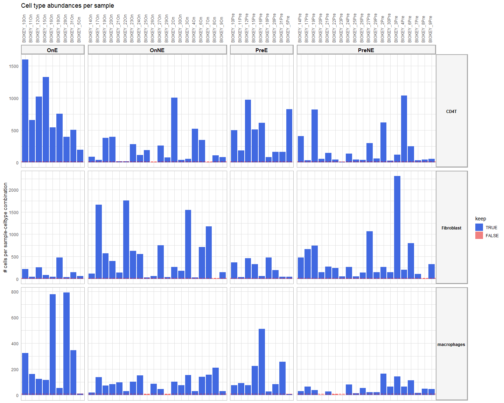<!-- -->
The red dotted line indicates the required minimum of cells as defined
above in `min_cells`. We can see here that some sample-celltype
combinations are left out. For the DE analysis in the next step, only
cell types will be considered if there are at least two samples per
group with a sufficient number of cells.

In a next plot, we will look at differential abundance between the
conditions. This because the pseudobulking approach behind Muscat could
potentially suffer from some biases if there would be huge differences
in abundances of a cell type between different groups. Downstream
results of these cell types should then be considered with some caution.

``` r
abundance_expression_info$abund_plot_group
```

<!-- -->
Differential abundance looks quite OK.

If you want to look at the cell numbers behind these plots, you can do
so via the following piece of code

``` r
abundance_expression_info$abundance_data_receiver %>% head()
## # A tibble: 6 x 5
## # Groups:   sample, receiver [6]
##   sample       receiver    n_cells_receiver group keep_receiver
##   <chr>        <chr>                  <int> <chr>         <dbl>
## 1 BIOKEY_10On  CD4T                    1600 OnE               1
## 2 BIOKEY_10On  Fibroblast               220 OnE               1
## 3 BIOKEY_10On  macrophages              326 OnE               1
## 4 BIOKEY_10Pre CD4T                     497 PreE              1
## 5 BIOKEY_10Pre Fibroblast               365 PreE              1
## 6 BIOKEY_10Pre macrophages               77 PreE              1
abundance_expression_info$abundance_data_sender %>% head() # in the case of an all-vs-all analysis: both are the same
## # A tibble: 6 x 5
## # Groups:   sample, sender [6]
##   sample       sender      n_cells_sender group keep_sender
##   <chr>        <chr>                <int> <chr>       <dbl>
## 1 BIOKEY_10On  CD4T                  1600 OnE             1
## 2 BIOKEY_10On  Fibroblast             220 OnE             1
## 3 BIOKEY_10On  macrophages            326 OnE             1
## 4 BIOKEY_10Pre CD4T                   497 PreE            1
## 5 BIOKEY_10Pre Fibroblast             365 PreE            1
## 6 BIOKEY_10Pre macrophages             77 PreE            1
```

**Important**: Based on the cell type abundance diagnostics, we
recommend users to change their analysis settings if required (eg
changing cell type annotation level, batches, …), before proceeding with
the rest of the analysis.

### Interpretation of expression information

Previously, we also calculated expression information. With the
following piece of code, you can check the average expression for each
gene per sample (normalized expression value and fraction of expressing
cells with non-zero counts, and logCPM-pseudocounts).

``` r
abundance_expression_info$celltype_info$avg_df %>% head()
## # A tibble: 6 x 4
##   gene     sample       average_sample celltype
##   <chr>    <chr>                 <dbl> <fct>   
## 1 A1BG     BIOKEY_10Pre        0.0972  CD4T    
## 2 A1BG.AS1 BIOKEY_10Pre        0.0351  CD4T    
## 3 A2M      BIOKEY_10Pre        0.0195  CD4T    
## 4 A2M.AS1  BIOKEY_10Pre        0.00139 CD4T    
## 5 A4GALT   BIOKEY_10Pre        0.00139 CD4T    
## 6 AAAS     BIOKEY_10Pre        0.0797  CD4T
abundance_expression_info$celltype_info$frq_df %>% head()
## # A tibble: 6 x 8
##   gene     sample       fraction_sample celltype group expressed_sample n_expressed expressed_celltype
##   <chr>    <chr>                  <dbl> <chr>    <chr> <lgl>                  <int> <lgl>             
## 1 A1BG     BIOKEY_10Pre         0.129   CD4T     PreE  TRUE                      55 TRUE              
## 2 A1BG.AS1 BIOKEY_10Pre         0.0483  CD4T     PreE  TRUE                      22 TRUE              
## 3 A2M      BIOKEY_10Pre         0.0262  CD4T     PreE  TRUE                      14 TRUE              
## 4 A2M.AS1  BIOKEY_10Pre         0.00201 CD4T     PreE  FALSE                      3 FALSE             
## 5 A4GALT   BIOKEY_10Pre         0.00201 CD4T     PreE  FALSE                      0 FALSE             
## 6 AAAS     BIOKEY_10Pre         0.113   CD4T     PreE  TRUE                      50 TRUE
abundance_expression_info$celltype_info$pb_df %>% head()
## # A tibble: 6 x 4
##   gene     sample      pb_sample celltype
##   <chr>    <chr>           <dbl> <fct>   
## 1 A1BG     BIOKEY_10On     4.85  CD4T    
## 2 A1BG.AS1 BIOKEY_10On     3.47  CD4T    
## 3 A2M      BIOKEY_10On     2.70  CD4T    
## 4 A2M.AS1  BIOKEY_10On     2.32  CD4T    
## 5 A4GALT   BIOKEY_10On     0.374 CD4T    
## 6 AAAS     BIOKEY_10On     4.38  CD4T
```

Now for the average per group:

``` r
abundance_expression_info$celltype_info$avg_df_group %>% head()
## # A tibble: 6 x 4
## # Groups:   group, celltype [1]
##   group celltype gene      average_group
##   <chr> <fct>    <chr>             <dbl>
## 1 OnE   CD4T     A1BG           0.0870  
## 2 OnE   CD4T     A1BG.AS1       0.0179  
## 3 OnE   CD4T     A2M            0.0130  
## 4 OnE   CD4T     A2M.AS1        0.00494 
## 5 OnE   CD4T     A2ML1          0.000390
## 6 OnE   CD4T     A2ML1.AS1      0
abundance_expression_info$celltype_info$frq_df_group %>% head()
## # A tibble: 6 x 4
## # Groups:   group, celltype [1]
##   group celltype gene      fraction_group
##   <chr> <chr>    <chr>              <dbl>
## 1 OnE   CD4T     A1BG            0.117   
## 2 OnE   CD4T     A1BG.AS1        0.0253  
## 3 OnE   CD4T     A2M             0.0166  
## 4 OnE   CD4T     A2M.AS1         0.00704 
## 5 OnE   CD4T     A2ML1           0.000563
## 6 OnE   CD4T     A2ML1.AS1       0
abundance_expression_info$celltype_info$pb_df_group %>% head()
## # A tibble: 6 x 4
## # Groups:   group, celltype [1]
##   group celltype gene      pb_group
##   <chr> <fct>    <chr>        <dbl>
## 1 OnE   CD4T     A1BG         5.23 
## 2 OnE   CD4T     A1BG.AS1     3.03 
## 3 OnE   CD4T     A2M          2.29 
## 4 OnE   CD4T     A2M.AS1      1.51 
## 5 OnE   CD4T     A2ML1        0.153
## 6 OnE   CD4T     A2ML1.AS1    0
```

In the last part of this step, we combined this information for each
ligand-receptor pair combination for each sender-receiver combination.
The output of this can be seen as well:

For sample-based:

``` r
abundance_expression_info$sender_receiver_info$avg_df %>% head()
## # A tibble: 6 x 8
##   sample       sender      receiver    ligand  receptor avg_ligand avg_receptor ligand_receptor_prod
##   <chr>        <fct>       <fct>       <chr>   <chr>         <dbl>        <dbl>                <dbl>
## 1 BIOKEY_24Pre macrophages macrophages HLA.DMA CD74           1.97         4.96                 9.79
## 2 BIOKEY_7On   Fibroblast  macrophages MIF     CD74           2.26         4.29                 9.68
## 3 BIOKEY_27Pre macrophages macrophages HLA.DMA CD74           1.96         4.78                 9.39
## 4 BIOKEY_6Pre  macrophages macrophages HLA.DMA CD74           1.87         5.00                 9.33
## 5 BIOKEY_28On  Fibroblast  macrophages MIF     CD74           2.58         3.56                 9.18
## 6 BIOKEY_14Pre macrophages macrophages HLA.DMA CD74           1.82         4.87                 8.87
abundance_expression_info$sender_receiver_info$frq_df %>% head()
## # A tibble: 6 x 8
##   sample       sender receiver    ligand receptor fraction_ligand fraction_receptor ligand_receptor_fraction_prod
##   <chr>        <chr>  <chr>       <chr>  <chr>              <dbl>             <dbl>                         <dbl>
## 1 BIOKEY_23Pre CD4T   CD4T        CD99   CD99                   1                 1                             1
## 2 BIOKEY_23Pre CD4T   macrophages CD99   CD99                   1                 1                             1
## 3 BIOKEY_26On  CD4T   macrophages MIF    CD74                   1                 1                             1
## 4 BIOKEY_21On  CD4T   CD4T        MIF    CXCR4                  1                 1                             1
## 5 BIOKEY_21On  CD4T   macrophages MIF    CD74                   1                 1                             1
## 6 BIOKEY_29On  CD4T   macrophages HLA.A  APLP2                  1                 1                             1
abundance_expression_info$sender_receiver_info$pb_df %>% head()
## # A tibble: 6 x 8
##   sample       sender      receiver    ligand  receptor pb_ligand pb_receptor ligand_receptor_pb_prod
##   <chr>        <fct>       <fct>       <chr>   <chr>        <dbl>       <dbl>                   <dbl>
## 1 BIOKEY_28On  macrophages macrophages MIF     CD74          12.2        14.3                    173.
## 2 BIOKEY_10On  macrophages macrophages HLA.DMA CD74          11.0        15.6                    172.
## 3 BIOKEY_28On  Fibroblast  macrophages MIF     CD74          11.9        14.3                    170.
## 4 BIOKEY_11On  macrophages macrophages HLA.DMA CD74          10.8        15.6                    168.
## 5 BIOKEY_7On   Fibroblast  macrophages MIF     CD74          11.5        14.5                    167.
## 6 BIOKEY_31Pre macrophages macrophages MIF     CD74          12.0        13.8                    166.
```

For group-based:

``` r
abundance_expression_info$sender_receiver_info$avg_df_group %>% head()
## # A tibble: 6 x 8
## # Groups:   group, sender [6]
##   group sender      receiver    ligand  receptor avg_ligand_group avg_receptor_group ligand_receptor_prod_group
##   <chr> <fct>       <fct>       <chr>   <chr>               <dbl>              <dbl>                      <dbl>
## 1 OnE   Fibroblast  macrophages MIF     CD74                 1.49               4.46                       6.64
## 2 OnE   macrophages macrophages HLA.DMA CD74                 1.43               4.46                       6.38
## 3 PreNE macrophages macrophages HLA.DMA CD74                 1.45               4.39                       6.37
## 4 PreNE Fibroblast  macrophages MIF     CD74                 1.35               4.39                       5.91
## 5 OnNE  macrophages macrophages HLA.DMA CD74                 1.34               4.15                       5.58
## 6 PreE  macrophages macrophages MIF     CD74                 1.34               4.14                       5.57
abundance_expression_info$sender_receiver_info$frq_df_group %>% head()
## # A tibble: 6 x 8
## # Groups:   group, sender [5]
##   group sender      receiver    ligand  receptor fraction_ligand_group fraction_receptor_group ligand_receptor_fraction_prod_group
##   <chr> <chr>       <chr>       <chr>   <chr>                    <dbl>                   <dbl>                               <dbl>
## 1 OnE   Fibroblast  macrophages MIF     CD74                     0.952                   0.999                               0.951
## 2 OnE   macrophages macrophages HLA.DRA CD63                     0.986                   0.947                               0.933
## 3 OnNE  Fibroblast  macrophages MIF     CD74                     0.924                   0.997                               0.921
## 4 PreNE Fibroblast  macrophages MIF     CD74                     0.921                   0.998                               0.919
## 5 OnE   macrophages Fibroblast  HLA.DRA CD63                     0.986                   0.930                               0.916
## 6 PreE  Fibroblast  macrophages MIF     CD74                     0.919                   0.996                               0.915
abundance_expression_info$sender_receiver_info$pb_df_group %>% head()
## # A tibble: 6 x 8
## # Groups:   group, sender [5]
##   group sender      receiver    ligand  receptor pb_ligand_group pb_receptor_group ligand_receptor_pb_prod_group
##   <chr> <fct>       <fct>       <chr>   <chr>              <dbl>             <dbl>                         <dbl>
## 1 OnE   macrophages macrophages HLA.DMA CD74               10.3               15.0                          154.
## 2 OnE   Fibroblast  macrophages MIF     CD74               10.1               15.0                          151.
## 3 OnE   macrophages macrophages MIF     CD74                9.90              15.0                          148.
## 4 OnE   CD4T        macrophages MIF     CD74                9.77              15.0                          147.
## 5 PreE  macrophages macrophages MIF     CD74               10.0               14.5                          145.
## 6 PreNE Fibroblast  macrophages MIF     CD74                9.98              14.4                          144.
```

# Step 2: Perform genome-wide differential expression analysis of receiver and sender cell types to define DE genes between the conditions of interest. Based on this analysis, we can define the logFC/p-value of ligands in senders and receptors in receivers, and define the set of affected target genes in the receiver.

Now we will go over to the multi-group, multi-sample differential
expression (DE) analysis (also called ‘differential state’ analysis by
the developers of Muscat).

### Define the contrasts and covariates of interest for the DE analysis.

For this analysis, we want to compare how cell-cell communication
changes On-vs-Pre anti-PD1 therapy are different between
responder/expander patients vs non-responder/expander patients. In other
words, we want to study how both patient groups react differently to the
therapy.

To do this comparison, we need to set the following contrasts:

``` r
contrasts_oi = c("'(OnE-PreE)-(OnNE-PreNE)','(OnNE-PreNE)-(OnE-PreE)'")
```

To understand this, let’s take a look at the first contrasts of
interest: `(OnE-PreE)-(OnNE-PreNE)`. As you can see, the first part of
the expression: `(OnE-PreE)` will cover differences on-vs-pre therapy in
the E group, the second part `(OnNE-PreNE)` in the NE group. By adding
the minus sign, we can compare these differences between the E and NE
group.

**Very Important** Note the format to indicate the contrasts! This
formatting should be adhered to very strictly, and white spaces are not
allowed! Check `?get_DE_info` for explanation about how to define this
well. The most important things are that: each contrast is surrounded by
single quotation marks, contrasts are separated by a comma without any
whitespace, and alle contrasts together are surrounded by double
quotation marks. If you compare against two groups, you should divide by
2, if you compare against three groups, you should divide by 3 etcetera.

For downstream visualizations and linking contrasts to their main group,
you need to run the following:

``` r
contrast_tbl = tibble(contrast =
                        c("(OnE-PreE)-(OnNE-PreNE)", "(OnNE-PreNE)-(OnE-PreE)"),
                      group = c("OnE","OnNE")) 
```

### Perform the DE analysis for each cell type.

``` r
DE_info = get_DE_info(sce = sce, sample_id = sample_id, group_id = group_id, celltype_id = celltype_id, batches = batches, covariates = covariates, contrasts_oi = contrasts_oi, min_cells = min_cells)
```

### Check DE results

Table with logFC and p-values for each gene-celltype-contrast:

``` r
DE_info$celltype_de$de_output_tidy %>% arrange(p_val) %>% head()
## # A tibble: 6 x 9
##   gene     cluster_id  logFC logCPM     F     p_val p_adj.loc  p_adj contrast               
##   <chr>    <chr>       <dbl>  <dbl> <dbl>     <dbl>     <dbl>  <dbl> <chr>                  
## 1 IGKV1.5  macrophages  7.64   5.5   25.7 0.0000046    0.0334 0.0334 (OnE-PreE)-(OnNE-PreNE)
## 2 IGKV1.5  macrophages -7.64   5.5   25.7 0.0000046    0.0334 0.0334 (OnNE-PreNE)-(OnE-PreE)
## 3 IGHV4.39 CD4T         5.17   4.17  14.8 0.000287     1      1      (OnE-PreE)-(OnNE-PreNE)
## 4 IGHV4.39 CD4T        -5.17   4.17  14.8 0.000287     1      1      (OnNE-PreNE)-(OnE-PreE)
## 5 IGLV3.1  Fibroblast  -6.93   8.81  14   0.000428     1      1      (OnE-PreE)-(OnNE-PreNE)
## 6 IGLV3.1  Fibroblast   6.93   8.81  14   0.000428     1      1      (OnNE-PreNE)-(OnE-PreE)
```

It is always a good idea to check distribution of the p-values resulting
from this DE expression analysis. In order to trust the p-values, the
p-value distributions should be uniform distributions, with a peak
allowed between 0 and 0.05 if there would be a clear biological effect
in the data.

You can look at these p-value histograms in the following way:

``` r
DE_info$hist_pvals
```

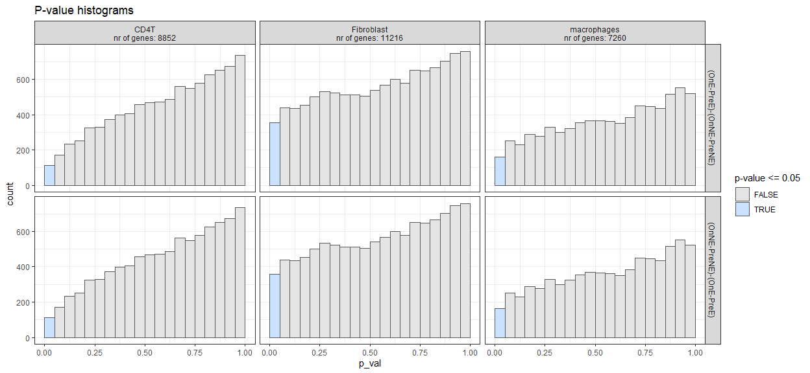<!-- -->

The p-value distributions do look suboptimal here (for comparison to
appropriate distributions:
[detailed_analysis_steps_MISC.md](detailed_analysis_steps_MISC.md)).
This might point to issues in the DE model definition. For example in
case we did not add all important covariates, there is substructure
present in the groups, etc.

If there are some issues, you can use the empiricall null procedure from
Efron. This is a procedure that will define empirical p-values based on
the observed distribution of the test statistic (here: logFC) and not
based on the theoretical distribution. This approach has also been used
in the Saturn package: <https://github.com/statOmics/satuRn>. We only
recommend this if the p-value distributions point to possible issues, as
is here the case.

### Empirical Null procedure

``` r
empirical_pval = TRUE
if(empirical_pval == TRUE){
  DE_info_emp = get_empirical_pvals(DE_info$celltype_de$de_output_tidy)
} 
```

Table with logFC and p-values for each gene-celltype-contrast:

``` r
DE_info_emp$de_output_tidy_emp %>% arrange(p_emp) %>% head()
## # A tibble: 6 x 11
##   gene     cluster_id  logFC logCPM     F     p_val p_adj.loc  p_adj contrast                   p_emp   p_adj_emp
##   <chr>    <chr>       <dbl>  <dbl> <dbl>     <dbl>     <dbl>  <dbl> <chr>                      <dbl>       <dbl>
## 1 IGKV1.5  macrophages -7.64   5.5   25.7 0.0000046    0.0334 0.0334 (OnNE-PreNE)-(OnE-PreE) 8.17e-11 0.000000593
## 2 IGKV1.5  macrophages  7.64   5.5   25.7 0.0000046    0.0334 0.0334 (OnE-PreE)-(OnNE-PreNE) 8.17e-11 0.000000593
## 3 IGHV4.39 CD4T        -5.17   4.17  14.8 0.000287     1      1      (OnNE-PreNE)-(OnE-PreE) 1.52e- 8 0.000134   
## 4 IGHV4.39 CD4T         5.17   4.17  14.8 0.000287     1      1      (OnE-PreE)-(OnNE-PreNE) 1.52e- 8 0.000134   
## 5 CCL4L2   CD4T         3.65   6.22  12   0.001        1      1      (OnNE-PreNE)-(OnE-PreE) 2.96e- 7 0.00131    
## 6 CCL4L2   CD4T        -3.65   6.22  12   0.001        1      1      (OnE-PreE)-(OnNE-PreNE) 2.96e- 7 0.00131
```

The following plot shows the distributions of those corrected, empirical
p-values:

``` r
DE_info_emp$hist_pvals_emp
```

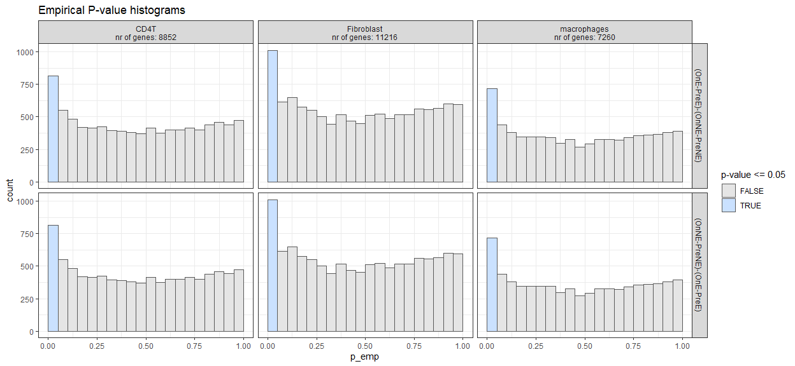<!-- -->

These look already better now.

The following plots show how well the correction worked. The green
fitted curve should fit well with the histogram. If not, this might
point to some issues in the DE model definition.

``` r
DE_info_emp$z_distr_plots_emp_pval
## $`CD4T.(OnE-PreE)-(OnNE-PreNE)`
```

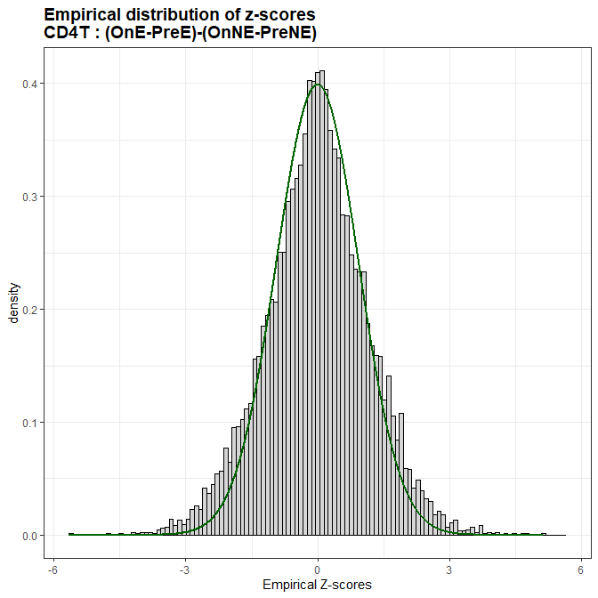<!-- -->

    ## 
    ## $`CD4T.(OnNE-PreNE)-(OnE-PreE)`

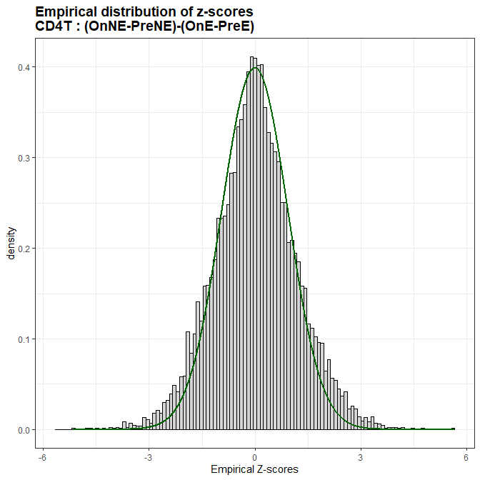<!-- -->

    ## 
    ## $`Fibroblast.(OnE-PreE)-(OnNE-PreNE)`

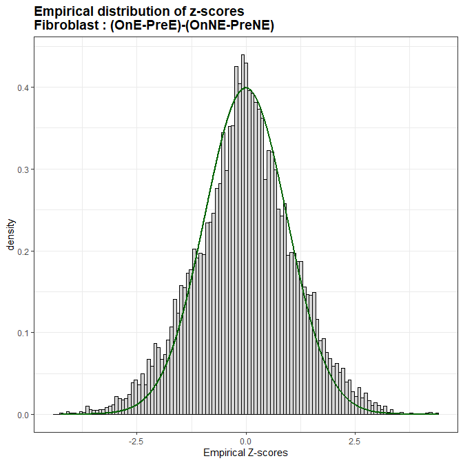<!-- -->

    ## 
    ## $`Fibroblast.(OnNE-PreNE)-(OnE-PreE)`

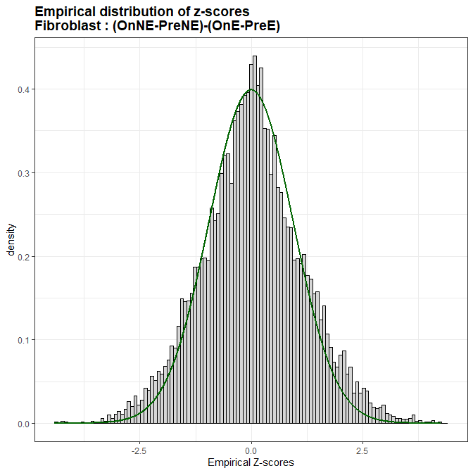<!-- -->

    ## 
    ## $`macrophages.(OnE-PreE)-(OnNE-PreNE)`

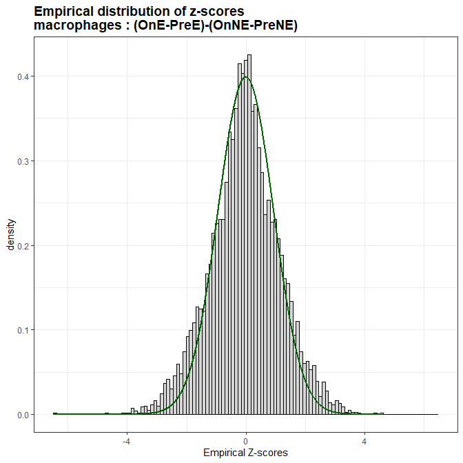<!-- -->

    ## 
    ## $`macrophages.(OnNE-PreNE)-(OnE-PreE)`

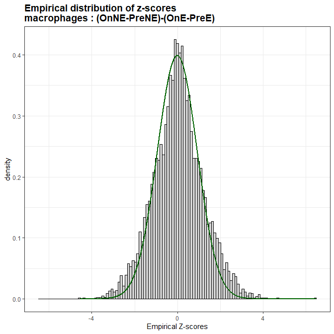<!-- -->

In general, these plots look OK.

Next, we will compare the empirical p-values to the original ones
before. We will look for the concordance between p-values rankings of
the original and empirical DE analysis (via ranking-line and upset
plots):

``` r
comparison_plots = compare_normal_emp_pvals(DE_info, DE_info_emp, adj_pval = FALSE)
comparison_plots
## [[1]]
## [[1]][[1]]
```

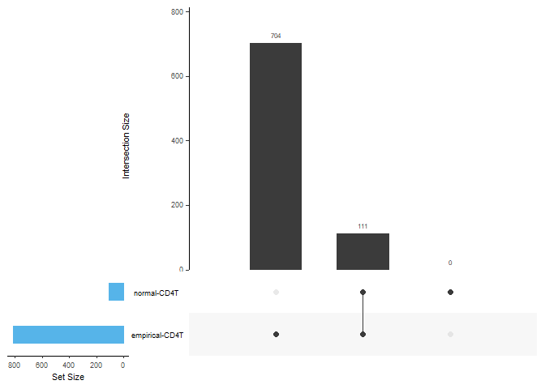<!-- -->

    ## 
    ## [[1]][[2]]

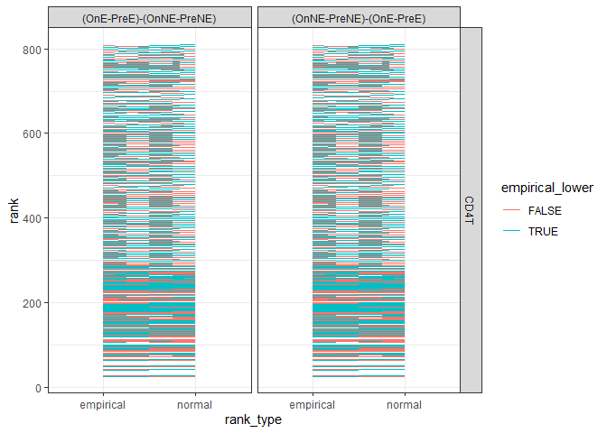<!-- -->

    ## 
    ## 
    ## [[2]]
    ## [[2]][[1]]

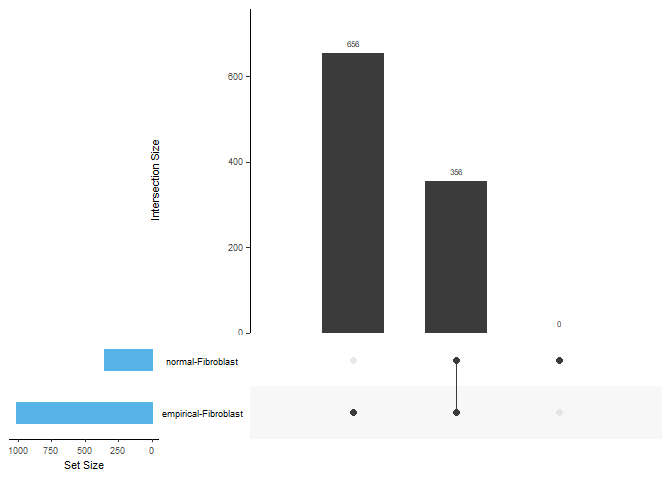<!-- -->

    ## 
    ## [[2]][[2]]

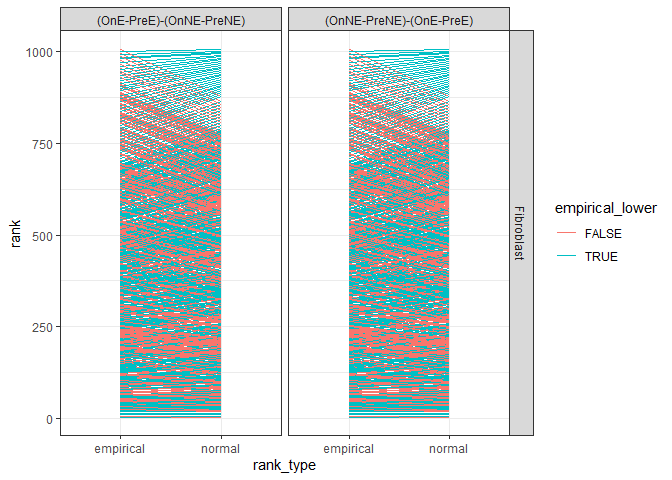<!-- -->

    ## 
    ## 
    ## [[3]]
    ## [[3]][[1]]

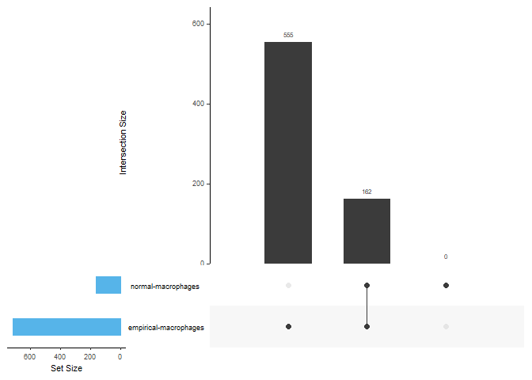<!-- -->

    ## 
    ## [[3]][[2]]

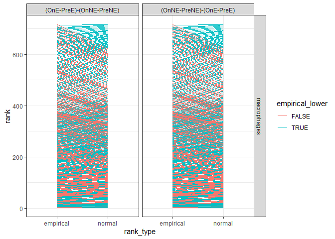<!-- -->

You can see that for some cell types, the genes considered to be DE can
change.

### Conclusion of the diagnostic plots concerning the DE analysis

P-value histograms of the normal p-values did not look good here,
pointing to possible violations of the model assumptions. Therefore we
estimated empirical p-values and we will continue with the MultiNicheNet
analysis with these empirical p-values (set `empirical_pval = TRUE` in
next code chunk).

``` r
empirical_pval = TRUE
if(empirical_pval == FALSE){
  celltype_de = DE_info$celltype_de$de_output_tidy
} else {
  celltype_de = DE_info_emp$de_output_tidy_emp %>% dplyr::select(-p_val, -p_adj) %>% dplyr::rename(p_val = p_emp, p_adj = p_adj_emp)
}
```

In the next step, we will combine the DE information of senders and
receivers by linking their ligands and receptors together:

### Combine DE information for ligand-senders and receptors-receivers (similar to step1 - `abundance_expression_info$sender_receiver_info`)

``` r
sender_receiver_de = combine_sender_receiver_de(
  sender_de = celltype_de,
  receiver_de = celltype_de,
  senders_oi = senders_oi,
  receivers_oi = receivers_oi,
  lr_network = lr_network
)
```

``` r
sender_receiver_de %>% head(20)
## # A tibble: 20 x 12
##    contrast                sender      receiver    ligand  receptor lfc_ligand lfc_receptor ligand_receptor_lfc_avg p_val_ligand p_adj_ligand p_val_receptor p_adj_receptor
##    <chr>                   <chr>       <chr>       <chr>   <chr>         <dbl>        <dbl>                   <dbl>        <dbl>        <dbl>          <dbl>          <dbl>
##  1 (OnNE-PreNE)-(OnE-PreE) macrophages CD4T        CCL17   CCR4           5.62       0.339                     2.98  0.00000526       0.0127         0.128            0.689
##  2 (OnNE-PreNE)-(OnE-PreE) Fibroblast  CD4T        PIP     NPTN           4.4        0.329                     2.36  0.00719          0.334          0.160            0.732
##  3 (OnNE-PreNE)-(OnE-PreE) macrophages Fibroblast  CXCL13  ACKR4          4.04       0.529                     2.28  0.000283         0.0977         0.452            0.947
##  4 (OnNE-PreNE)-(OnE-PreE) Fibroblast  macrophages PIP     NPTN           4.4        0.162                     2.28  0.00719          0.334          0.565            0.980
##  5 (OnNE-PreNE)-(OnE-PreE) Fibroblast  Fibroblast  PIP     NPTN           4.4        0.125                     2.26  0.00719          0.334          0.718            0.999
##  6 (OnNE-PreNE)-(OnE-PreE) macrophages CD4T        CXCL13  CXCR5          4.04       0.461                     2.25  0.000283         0.0977         0.226            0.801
##  7 (OnNE-PreNE)-(OnE-PreE) Fibroblast  Fibroblast  PIP     CD4            4.4        0.0816                    2.24  0.00719          0.334          0.948            0.999
##  8 (OnNE-PreNE)-(OnE-PreE) Fibroblast  CD4T        PIP     CD4            4.4       -0.0236                    2.19  0.00719          0.334          0.841            0.998
##  9 (OnNE-PreNE)-(OnE-PreE) macrophages Fibroblast  CXCL13  CCR10          4.04       0.245                     2.14  0.000283         0.0977         0.531            0.974
## 10 (OnNE-PreNE)-(OnE-PreE) CD4T        CD4T        CCL4L2  CCR1           3.65       0.494                     2.07  0.000000296      0.00131        0.387            0.904
## 11 (OnNE-PreNE)-(OnE-PreE) Fibroblast  macrophages PIP     CD4            4.4       -0.328                     2.04  0.00719          0.334          0.0635           0.544
## 12 (OnE-PreE)-(OnNE-PreNE) CD4T        Fibroblast  CXCL14  CXCR4          2.65       1.28                      1.96  0.000617         0.102          0.0547           0.571
## 13 (OnE-PreE)-(OnNE-PreNE) Fibroblast  Fibroblast  CDH2    CDH2           1.96       1.96                      1.96  0.00263          0.275          0.00263          0.275
## 14 (OnNE-PreNE)-(OnE-PreE) macrophages CD4T        CXCL13  CXCR3          4.04      -0.142                     1.95  0.000283         0.0977         0.484            0.949
## 15 (OnNE-PreNE)-(OnE-PreE) Fibroblast  macrophages SAA1    CD36           2.77       1.06                      1.92  0.00770          0.339          0.0895           0.603
## 16 (OnNE-PreNE)-(OnE-PreE) CD4T        macrophages CCL4L2  CCR5           3.65       0.119                     1.88  0.000000296      0.00131        0.840            0.999
## 17 (OnE-PreE)-(OnNE-PreNE) Fibroblast  Fibroblast  HLA.DRA CD37           1.7        2.02                      1.86  0.000527         0.165          0.00570          0.321
## 18 (OnE-PreE)-(OnNE-PreNE) Fibroblast  Fibroblast  AREG    MMP9           2.67       1.02                      1.84  0.00318          0.275          0.315            0.873
## 19 (OnE-PreE)-(OnNE-PreNE) Fibroblast  Fibroblast  PENK    OGFR           3.05       0.469                     1.76  0.0104           0.359          0.0175           0.419
## 20 (OnE-PreE)-(OnNE-PreNE) Fibroblast  Fibroblast  MMP7    SDC1           3.2        0.312                     1.76  0.00392          0.292          0.539            0.974
```

# Step 3: Predict NicheNet ligand activities and NicheNet ligand-target links based on these differential expression results

## Define the parameters for the NicheNet ligand activity analysis

Here, we need to define the thresholds that will be used to consider
genes as differentially expressed or not (logFC, p-value, decision
whether to use adjusted or normal p-value, minimum fraction of cells
that should express a gene in at least one sample in a group, whether to
use the normal p-values or empirical p-values).

NicheNet ligand activity will then be calculated as the enrichment of
predicted target genes of ligands in this set of DE genes compared to
the genomic background. Here we choose for a minimum logFC of 0.50,
maximum p-value of 0.05, and minimum fraction of expression of 0.05.

``` r
logFC_threshold = 0.50
p_val_threshold = 0.05
fraction_cutoff = 0.05
```

We will here choose for applying the p-value cutoff on the normal
p-values, and not on the p-values corrected for multiple testing. This
choice was made here because this dataset has only a few samples per
group and we might have a lack of statistical power due to
pseudobulking. In case of more samples per group, and a sufficient high
number of DE genes per group-celltype (\> 20-50), we would recommend
using the adjusted p-values.

``` r
# p_val_adj = TRUE 
p_val_adj = FALSE 
```

For the NicheNet ligand-target inference, we also need to select which
top n of the predicted target genes will be considered (here: top 250
targets per ligand).

``` r
top_n_target = 250
```

The NicheNet ligand activity analysis can be run in parallel for each
receiver cell type, by changing the number of cores as defined here.
This is only recommended if you have many receiver cell type.

``` r
verbose = TRUE
cores_system = 8
n.cores = min(cores_system, sender_receiver_de$receiver %>% unique() %>% length()) # use one core per receiver cell type
```

## Run the NicheNet ligand activity analysis

(this might take some time)

``` r
ligand_activities_targets_DEgenes = suppressMessages(suppressWarnings(get_ligand_activities_targets_DEgenes(
  receiver_de = celltype_de,
  receivers_oi = receivers_oi,
  ligand_target_matrix = ligand_target_matrix,
  logFC_threshold = logFC_threshold,
  p_val_threshold = p_val_threshold,
  p_val_adj = p_val_adj,
  top_n_target = top_n_target,
  verbose = verbose, 
  n.cores = n.cores
)))
```

Check the DE genes used for the activity analysis

``` r
ligand_activities_targets_DEgenes$de_genes_df %>% head(20)
## # A tibble: 20 x 6
##    gene       receiver logFC    p_val p_adj contrast               
##    <chr>      <chr>    <dbl>    <dbl> <dbl> <chr>                  
##  1 AC007388.1 CD4T     0.507 0.0471   0.532 (OnE-PreE)-(OnNE-PreNE)
##  2 AC008124.1 CD4T     0.541 0.00911  0.313 (OnE-PreE)-(OnNE-PreNE)
##  3 AC084033.3 CD4T     0.544 0.0116   0.334 (OnE-PreE)-(OnNE-PreNE)
##  4 AC245014.3 CD4T     0.682 0.0228   0.412 (OnE-PreE)-(OnNE-PreNE)
##  5 ACOT4      CD4T     0.95  0.00502  0.253 (OnE-PreE)-(OnNE-PreNE)
##  6 ACOX3      CD4T     0.58  0.0266   0.436 (OnE-PreE)-(OnNE-PreNE)
##  7 AGPAT5     CD4T     0.628 0.00230  0.182 (OnE-PreE)-(OnNE-PreNE)
##  8 AL133415.1 CD4T     0.691 0.0320   0.467 (OnE-PreE)-(OnNE-PreNE)
##  9 ALG11      CD4T     0.711 0.00696  0.282 (OnE-PreE)-(OnNE-PreNE)
## 10 ANTXR2     CD4T     0.587 0.00123  0.136 (OnE-PreE)-(OnNE-PreNE)
## 11 AP4E1      CD4T     0.7   0.00600  0.268 (OnE-PreE)-(OnNE-PreNE)
## 12 AP4M1      CD4T     0.519 0.0320   0.467 (OnE-PreE)-(OnNE-PreNE)
## 13 APOBR      CD4T     0.889 0.000768 0.113 (OnE-PreE)-(OnNE-PreNE)
## 14 APOC1      CD4T     0.908 0.0198   0.399 (OnE-PreE)-(OnNE-PreNE)
## 15 APOE       CD4T     1.07  0.00255  0.189 (OnE-PreE)-(OnNE-PreNE)
## 16 ARL5B      CD4T     0.754 0.00151  0.156 (OnE-PreE)-(OnNE-PreNE)
## 17 ARSG       CD4T     0.549 0.0180   0.387 (OnE-PreE)-(OnNE-PreNE)
## 18 ATN1       CD4T     0.544 0.0192   0.394 (OnE-PreE)-(OnNE-PreNE)
## 19 AUH        CD4T     0.528 0.00297  0.210 (OnE-PreE)-(OnNE-PreNE)
## 20 BCS1L      CD4T     0.629 0.0245   0.425 (OnE-PreE)-(OnNE-PreNE)
```

Check the output of the activity analysis

``` r
ligand_activities_targets_DEgenes$ligand_activities %>% head(20)
## # A tibble: 20 x 8
## # Groups:   receiver, contrast [1]
##    ligand activity contrast                target    ligand_target_weight receiver direction_regulation activity_scaled
##    <chr>     <dbl> <chr>                   <chr>                    <dbl> <chr>    <fct>                          <dbl>
##  1 A2M    -0.00263 (OnE-PreE)-(OnNE-PreNE) CD70                   0.00689 CD4T     up                            -0.412
##  2 A2M    -0.00263 (OnE-PreE)-(OnNE-PreNE) CEBPD                  0.00752 CD4T     up                            -0.412
##  3 A2M    -0.00263 (OnE-PreE)-(OnNE-PreNE) IL2RA                  0.00743 CD4T     up                            -0.412
##  4 A2M    -0.00263 (OnE-PreE)-(OnNE-PreNE) SHC1                   0.00671 CD4T     up                            -0.412
##  5 A2M    -0.00263 (OnE-PreE)-(OnNE-PreNE) SLC1A5                 0.00710 CD4T     up                            -0.412
##  6 A2M    -0.00263 (OnE-PreE)-(OnNE-PreNE) SLC2A1                 0.00739 CD4T     up                            -0.412
##  7 A2M    -0.00263 (OnE-PreE)-(OnNE-PreNE) THBS1                  0.0104  CD4T     up                            -0.412
##  8 AANAT  -0.00248 (OnE-PreE)-(OnNE-PreNE) CEBPD                  0.00408 CD4T     up                            -0.280
##  9 AANAT  -0.00248 (OnE-PreE)-(OnNE-PreNE) IL2RA                  0.00425 CD4T     up                            -0.280
## 10 AANAT  -0.00248 (OnE-PreE)-(OnNE-PreNE) NBPF1                  0.00445 CD4T     up                            -0.280
## 11 AANAT  -0.00248 (OnE-PreE)-(OnNE-PreNE) SHC1                   0.00405 CD4T     up                            -0.280
## 12 AANAT  -0.00248 (OnE-PreE)-(OnNE-PreNE) SLC1A5                 0.00416 CD4T     up                            -0.280
## 13 AANAT  -0.00248 (OnE-PreE)-(OnNE-PreNE) SLC2A1                 0.00481 CD4T     up                            -0.280
## 14 AANAT  -0.00248 (OnE-PreE)-(OnNE-PreNE) THBS1                  0.00599 CD4T     up                            -0.280
## 15 ABCA1  -0.00202 (OnE-PreE)-(OnNE-PreNE) ACOX3                  0.0447  CD4T     up                             0.122
## 16 ABCA1  -0.00202 (OnE-PreE)-(OnNE-PreNE) EIF4ENIF1              0.0436  CD4T     up                             0.122
## 17 ABCA1  -0.00202 (OnE-PreE)-(OnNE-PreNE) HLA.DRA                0.0464  CD4T     up                             0.122
## 18 ABCA1  -0.00202 (OnE-PreE)-(OnNE-PreNE) TSTD2                  0.0432  CD4T     up                             0.122
## 19 ABCA1  -0.00202 (OnE-PreE)-(OnNE-PreNE) VKORC1                 0.0438  CD4T     up                             0.122
## 20 ABCA1  -0.00202 (OnE-PreE)-(OnNE-PreNE) ZNF235                 0.0425  CD4T     up                             0.122
```

# Step 4: Use the information collected above to prioritize all sender-ligand—receiver-receptor pairs.

In the 3 previous steps, we calculated expression, differential
expression and NicheNet activity information. Now we will combine these
different types of information in one prioritization scheme.

MultiNicheNet allows the user to define the weights of the following
criteria to prioritize ligand-receptor interactions:

- Upregulation of the ligand in a sender cell type and/or upregulation
  of the receptor in a receiver cell type - in the condition of
  interest. : `de_ligand` and `de_receptor`
- Sufficiently high expression levels of ligand and receptor in many
  samples of the same group (to mitigate the influence of outlier
  samples). : `frac_exprs_ligand_receptor`
- Cell-type and condition specific expression of the ligand in the
  sender cell type and receptor in the receiver cell type (to mitigate
  the influence of upregulated but still relatively weakly expressed
  ligands/receptors) : `exprs_ligand` and `exprs_receptor`
- High NicheNet ligand activity, to further prioritize ligand-receptor
  pairs based on their predicted effect of the ligand-receptor
  interaction on the gene expression in the receiver cell type :
  `activity_scaled`
- High relative abundance of sender and/or receiver in the condition of
  interest: `abund_sender` and `abund_receiver` (experimental feature -
  not recommended to give non-zero weights for default analyses)

The different properties of the sender-ligand—receiver-receptor pairs
can be weighted according to the user’s preference and insight in the
dataset at hand.

## Define the prioritization weights, and prepare grouping objects

We will set our preference for this dataset as follows - and recommend
the user to use the same weights by default:

``` r
prioritizing_weights_DE = c("de_ligand" = 1,
                         "de_receptor" = 1)
prioritizing_weights_activity = c("activity_scaled" = 2)

prioritizing_weights_expression_specificity = c("exprs_ligand" = 2,
                         "exprs_receptor" = 2)

prioritizing_weights_expression_sufficiency = c("frac_exprs_ligand_receptor" = 1)

prioritizing_weights_relative_abundance = c( "abund_sender" = 0,
                         "abund_receiver" = 0)
```

``` r
prioritizing_weights = c(prioritizing_weights_DE, 
                         prioritizing_weights_activity, 
                         prioritizing_weights_expression_specificity,
                         prioritizing_weights_expression_sufficiency, 
                         prioritizing_weights_relative_abundance)
```

Make necessary grouping data frame

``` r
sender_receiver_tbl = sender_receiver_de %>% dplyr::distinct(sender, receiver)

metadata_combined = SummarizedExperiment::colData(sce) %>% tibble::as_tibble()

if(!is.na(batches)){
  grouping_tbl = metadata_combined[,c(sample_id, group_id, batches)] %>% tibble::as_tibble() %>% dplyr::distinct()
  colnames(grouping_tbl) = c("sample","group",batches)
} else {
  grouping_tbl = metadata_combined[,c(sample_id, group_id)] %>% tibble::as_tibble() %>% dplyr::distinct()
  colnames(grouping_tbl) = c("sample","group")
}
```

Crucial note: grouping_tbl: group should be the same as in the
contrast_tbl, and as in the expression info tables! Rename accordingly
if this would not be the case. If you followed the guidelines of this
tutorial closely, there should be no problem.

## Run the prioritization

``` r
prioritization_tables = suppressMessages(generate_prioritization_tables(
  sender_receiver_info = abundance_expression_info$sender_receiver_info,
  sender_receiver_de = sender_receiver_de,
  ligand_activities_targets_DEgenes = ligand_activities_targets_DEgenes,
  contrast_tbl = contrast_tbl,
  sender_receiver_tbl = sender_receiver_tbl,
  grouping_tbl = grouping_tbl,
  prioritizing_weights = prioritizing_weights,
  fraction_cutoff = fraction_cutoff, 
  abundance_data_receiver = abundance_expression_info$abundance_data_receiver,
  abundance_data_sender = abundance_expression_info$abundance_data_sender
))
```

Check the output tables

First: group-based summary table

``` r
prioritization_tables$group_prioritization_tbl %>% head(20)
## # A tibble: 20 x 60
##    contrast      group sender recei~1 ligand recep~2 lfc_l~3 lfc_r~4 ligan~5 p_val~6 p_adj~7 p_val~8 p_adj~9 activity direc~* activ~* lr_in~* id    avg_l~* avg_r~* ligan~* fract~* fract~* ligan~* rel_a~* rel_a~* sende~*
##    <chr>         <chr> <chr>  <chr>   <chr>  <chr>     <dbl>   <dbl>   <dbl>   <dbl>   <dbl>   <dbl>   <dbl>    <dbl> <fct>     <dbl> <chr>   <chr>   <dbl>   <dbl>   <dbl>   <dbl>   <dbl>   <dbl>   <dbl>   <dbl>   <dbl>
##  1 (OnE-PreE)-(~ OnE   macro~ Fibrob~ TNF    LTBR      0.845  0.181    0.513  0.0658   0.547 0.214     0.794  9.81e-2 up       3.30   TNF_LT~ TNF_~   0.245  0.294   0.0720   0.219  0.379   0.0828   1.00    0.001   0.501
##  2 (OnE-PreE)-(~ OnE   macro~ Fibrob~ TNF    LTBR      0.845  0.181    0.513  0.0658   0.547 0.214     0.794 -3.62e-3 down     0.194  TNF_LT~ TNF_~   0.245  0.294   0.0720   0.219  0.379   0.0828   1.00    0.001   0.501
##  3 (OnE-PreE)-(~ OnE   Fibro~ CD4T    TGM2   ITGA4     1.41   0.311    0.860  0.0182   0.422 0.0401    0.495 -1.90e-3 up       0.221  TGM2_I~ TGM2~   0.199  0.303   0.0604   0.203  0.345   0.0701   0.001   0.898   0.450
##  4 (OnE-PreE)-(~ OnE   Fibro~ CD4T    TGM2   ITGA4     1.41   0.311    0.860  0.0182   0.422 0.0401    0.495  1.03e-2 down     2.48   TGM2_I~ TGM2~   0.199  0.303   0.0604   0.203  0.345   0.0701   0.001   0.898   0.450
##  5 (OnE-PreE)-(~ OnE   macro~ macrop~ TNF    LTBR      0.845  0.184    0.514  0.0658   0.547 0.260     0.825  2.97e-2 up       4.86   TNF_LT~ TNF_~   0.245  0.242   0.0591   0.219  0.327   0.0715   1.00    1.00    1.00 
##  6 (OnE-PreE)-(~ OnE   macro~ macrop~ TNF    LTBR      0.845  0.184    0.514  0.0658   0.547 0.260     0.825  1.81e-3 down    -2.14   TNF_LT~ TNF_~   0.245  0.242   0.0591   0.219  0.327   0.0715   1.00    1.00    1.00 
##  7 (OnE-PreE)-(~ OnE   macro~ CD4T    TNF    TRAF2     0.845  0.285    0.565  0.0658   0.547 0.149     0.714  7.88e-4 up       2.56   TNF_TR~ TNF_~   0.245  0.0682  0.0167   0.219  0.0950  0.0208   1.00    0.898   0.950
##  8 (OnE-PreE)-(~ OnE   macro~ CD4T    TNF    TRAF2     0.845  0.285    0.565  0.0658   0.547 0.149     0.714  4.34e-3 down    -0.748  TNF_TR~ TNF_~   0.245  0.0682  0.0167   0.219  0.0950  0.0208   1.00    0.898   0.950
##  9 (OnE-PreE)-(~ OnE   macro~ CD4T    CXCL9  CXCR3     1.61   0.142    0.876  0.0745   0.581 0.484     0.949 -2.60e-3 up      -0.383  CXCL9_~ CXCL~   1.49   0.321   0.478    0.596  0.364   0.217    1.00    0.898   0.950
## 10 (OnE-PreE)-(~ OnE   macro~ CD4T    CXCL9  CXCR3     1.61   0.142    0.876  0.0745   0.581 0.484     0.949  1.14e-2 down     3.04   CXCL9_~ CXCL~   1.49   0.321   0.478    0.596  0.364   0.217    1.00    0.898   0.950
## 11 (OnE-PreE)-(~ OnE   macro~ Fibrob~ TNF    TNFRSF~   0.845  0.0877   0.466  0.0658   0.547 0.530     0.974  9.81e-2 up       3.30   TNF_TN~ TNF_~   0.245  0.500   0.122    0.219  0.582   0.127    1.00    0.001   0.501
## 12 (OnE-PreE)-(~ OnE   macro~ Fibrob~ TNF    TNFRSF~   0.845  0.0877   0.466  0.0658   0.547 0.530     0.974 -3.62e-3 down     0.194  TNF_TN~ TNF_~   0.245  0.500   0.122    0.219  0.582   0.127    1.00    0.001   0.501
## 13 (OnE-PreE)-(~ OnE   Fibro~ CD4T    CXCL9  CXCR3     2.01   0.142    1.08   0.0582   0.584 0.484     0.949 -2.60e-3 up      -0.383  CXCL9_~ CXCL~   0.958  0.321   0.308    0.413  0.364   0.150    0.001   0.898   0.450
## 14 (OnE-PreE)-(~ OnE   Fibro~ CD4T    CXCL9  CXCR3     2.01   0.142    1.08   0.0582   0.584 0.484     0.949  1.14e-2 down     3.04   CXCL9_~ CXCL~   0.958  0.321   0.308    0.413  0.364   0.150    0.001   0.898   0.450
## 15 (OnNE-PreNE)~ OnNE  CD4T   CD4T    PTPRC  DPP4      0.146  0.379    0.262  0.297    0.853 0.0597    0.563  5.63e-3 up      -0.0547 PTPRC_~ PTPR~   1.10   0.101   0.111    0.859  0.132   0.113    0.204   0.204   0.204
## 16 (OnNE-PreNE)~ OnNE  CD4T   CD4T    PTPRC  DPP4      0.146  0.379    0.262  0.297    0.853 0.0597    0.563  2.06e-3 down     3.67   PTPRC_~ PTPR~   1.10   0.101   0.111    0.859  0.132   0.113    0.204   0.204   0.204
## 17 (OnE-PreE)-(~ OnE   Fibro~ macrop~ CSF1   CSF3R     0.431  0.695    0.563  0.125    0.712 0.00214   0.187  1.25e-2 up       1.73   CSF1_C~ CSF1~   0.318  0.302   0.0960   0.383  0.390   0.150    0.001   1.00    0.501
## 18 (OnE-PreE)-(~ OnE   Fibro~ macrop~ CSF1   CSF3R     0.431  0.695    0.563  0.125    0.712 0.00214   0.187  7.46e-3 down     0.461  CSF1_C~ CSF1~   0.318  0.302   0.0960   0.383  0.390   0.150    0.001   1.00    0.501
## 19 (OnE-PreE)-(~ OnE   macro~ CD4T    TNF    TNFRSF~   0.845  0.148    0.496  0.0658   0.547 0.323     0.864  7.88e-4 up       2.56   TNF_TN~ TNF_~   0.245  0.359   0.0879   0.219  0.394   0.0862   1.00    0.898   0.950
## 20 (OnE-PreE)-(~ OnE   macro~ CD4T    TNF    TNFRSF~   0.845  0.148    0.496  0.0658   0.547 0.323     0.864  4.34e-3 down    -0.748  TNF_TN~ TNF_~   0.245  0.359   0.0879   0.219  0.394   0.0862   1.00    0.898   0.950
## # ... with 33 more variables: lfc_pval_ligand <dbl>, p_val_ligand_adapted <dbl>, scaled_lfc_ligand <dbl>, scaled_p_val_ligand <dbl>, scaled_lfc_pval_ligand <dbl>, scaled_p_val_ligand_adapted <dbl>,
## #   lfc_pval_receptor <dbl>, p_val_receptor_adapted <dbl>, scaled_lfc_receptor <dbl>, scaled_p_val_receptor <dbl>, scaled_lfc_pval_receptor <dbl>, scaled_p_val_receptor_adapted <dbl>, activity_up <dbl>,
## #   activity_scaled_up <dbl>, scaled_activity_scaled_up <dbl>, scaled_activity_up <dbl>, activity_down <dbl>, activity_scaled_down <dbl>, scaled_activity_scaled_down <dbl>, scaled_activity_down <dbl>,
## #   scaled_avg_exprs_ligand <dbl>, scaled_avg_frq_ligand <dbl>, pb_ligand_group <dbl>, scaled_pb_ligand <dbl>, scaled_avg_exprs_receptor <dbl>, scaled_avg_frq_receptor <dbl>, pb_receptor_group <dbl>,
## #   scaled_pb_receptor <dbl>, fraction_expressing_ligand_receptor <dbl>, max_scaled_activity <dbl>, na.rm <lgl>, prioritization_score <dbl>, top_group <chr>, and abbreviated variable names 1: receiver, 2: receptor,
## #   3: lfc_ligand, 4: lfc_receptor, 5: ligand_receptor_lfc_avg, 6: p_val_ligand, 7: p_adj_ligand, 8: p_val_receptor, 9: p_adj_receptor, *: direction_regulation, *: activity_scaled, *: lr_interaction,
## #   *: avg_ligand_group, *: avg_receptor_group, *: ligand_receptor_prod_group, *: fraction_ligand_group, *: fraction_receptor_group, *: ligand_receptor_fraction_prod_group, *: rel_abundance_scaled_sender, ...
```

Second: sample-based summary table: contains expression information of
each LR pair per sample

``` r
prioritization_tables$sample_prioritization_tbl %>% head(20)
## # A tibble: 20 x 26
##    sample       sender      receiver    ligand  recep~1 avg_l~2 avg_r~3 ligan~4 fract~5 fract~6 ligan~7 pb_li~8 pb_re~9 ligan~* group prior~* lr_in~* id    scale~* scale~* scale~* n_cel~* keep_~* n_cel~* keep_~* keep_~*
##    <chr>        <chr>       <chr>       <chr>   <chr>     <dbl>   <dbl>   <dbl>   <dbl>   <dbl>   <dbl>   <dbl>   <dbl>   <dbl> <chr>   <dbl> <chr>   <chr>   <dbl>   <dbl>   <dbl>   <dbl>   <dbl>   <dbl>   <dbl> <fct>  
##  1 BIOKEY_24Pre macrophages macrophages HLA.DMA CD74       1.97    4.96    9.79   0.976   1       0.976   10.6     15.1    161. PreNE  NA     HLA.DM~ HLA.~   1.91    1.06    1.10       82       1      82       1 Sender~
##  2 BIOKEY_7On   Fibroblast  macrophages MIF     CD74       2.26    4.29    9.68   0.992   1       0.992   11.5     14.5    167. OnNE    0.479 MIF_CD~ MIF_~   3.32    1.38    2.48      158       1    1176       1 Sender~
##  3 BIOKEY_27Pre macrophages macrophages HLA.DMA CD74       1.96    4.78    9.39   0.957   1       0.957   10.8     15.0    161. PreNE  NA     HLA.DM~ HLA.~   1.70    0.889   1.13       23       1      23       1 Sender~
##  4 BIOKEY_6Pre  macrophages macrophages HLA.DMA CD74       1.87    5.00    9.33   0.966   1       0.966   10.7     15.4    165. PreNE  NA     HLA.DM~ HLA.~   1.68    0.972   1.35      116       1     116       1 Sender~
##  5 BIOKEY_28On  Fibroblast  macrophages MIF     CD74       2.58    3.56    9.18   1       0.997   0.997   11.9     14.3    170. OnE     0.869 MIF_CD~ MIF_~   2.90    1.48    2.75      793       1      37       1 Sender~
##  6 BIOKEY_14Pre macrophages macrophages HLA.DMA CD74       1.82    4.87    8.87   0.938   1       0.938   10.7     15.2    162. PreNE  NA     HLA.DM~ HLA.~   1.44    0.716   1.17       32       1      32       1 Sender~
##  7 BIOKEY_7Pre  Fibroblast  macrophages MIF     CD74       2.10    4.22    8.86   0.991   1       0.991   11.4     14.1    162. PreNE  NA     MIF_CD~ MIF_~   2.64    1.35    1.92       17       1     108       1 Sender~
##  8 BIOKEY_30On  macrophages macrophages HLA.DMA CD74       1.80    4.90    8.85   0.961   1       0.961   10.5     15.2    159. OnNE    0.554 HLA.DM~ HLA.~   1.43    0.931   0.967      77       1      77       1 Sender~
##  9 BIOKEY_30Pre macrophages macrophages HLA.DMA CD74       1.72    4.90    8.41   0.970   1       0.970   10.0     14.8    148. PreNE  NA     HLA.DM~ HLA.~   1.21    1.01    0.250      67       1      67       1 Sender~
## 10 BIOKEY_18Pre macrophages macrophages HLA.DMA CD74       1.71    4.90    8.39   1       1       1       10.3     15.1    156. PreE   NA     HLA.DM~ HLA.~   1.20    1.29    0.744      29       1      29       1 Sender~
## 11 BIOKEY_20Pre macrophages macrophages HLA.DMA CD74       1.68    4.93    8.31   1       1       1        9.66    14.4    139. PreNE  NA     HLA.DM~ HLA.~   1.15    1.29   -0.359       4       0       4       0 Sender~
## 12 BIOKEY_18On  macrophages macrophages HLA.DMA CD74       1.67    4.90    8.16   0.911   1       0.911   10.5     15.4    162. OnE     0.854 HLA.DM~ HLA.~   1.08    0.471   1.18       56       1      56       1 Sender~
## 13 BIOKEY_31Pre macrophages macrophages MIF     CD74       2.41    3.38    8.16   0.977   0.977   0.954   12.0     13.8    166. PreE   NA     MIF_CD~ MIF_~   2.26    1.10    1.75      258       1     258       1 Sender~
## 14 BIOKEY_5On   Fibroblast  macrophages MIF     CD74       1.86    4.37    8.11   1       1       1       10.9     14.3    156. OnE     0.869 MIF_CD~ MIF_~   2.01    1.54    1.26       13       1      63       1 Sender~
## 15 BIOKEY_10On  macrophages macrophages HLA.DMA CD74       1.68    4.74    7.99   0.942   1       0.942   11.0     15.6    172. OnE     0.854 HLA.DM~ HLA.~   0.991   0.754   1.81      326       1     326       1 Sender~
## 16 BIOKEY_12On  macrophages macrophages HLA.DMA CD74       1.65    4.81    7.95   0.976   1       0.976   10.5     15.3    160. OnE     0.854 HLA.DM~ HLA.~   0.973   1.07    1.02      125       1     125       1 Sender~
## 17 BIOKEY_4Pre  macrophages macrophages HLA.DMA CD74       1.68    4.66    7.85   0.938   1       0.938   10.7     15.2    162. PreNE  NA     HLA.DM~ HLA.~   0.919   0.725   1.13       65       1      65       1 Sender~
## 18 BIOKEY_19Pre macrophages macrophages HLA.DMA CD74       1.63    4.81    7.83   0.925   1       0.925   10.3     15.0    155. PreNE  NA     HLA.DM~ HLA.~   0.910   0.602   0.718      40       1      40       1 Sender~
## 19 BIOKEY_28On  macrophages macrophages MIF     CD74       2.17    3.56    7.73   0.987   0.997   0.985   12.2     14.3    173. OnE     0.691 MIF_CD~ MIF_~   1.97    1.34    2.19      793       1     793       1 Sender~
## 20 BIOKEY_27On  macrophages macrophages HLA.DMA CD74       1.77    4.34    7.69   0.958   1       0.958   10.8     14.9    160. OnNE    0.554 HLA.DM~ HLA.~   0.836   0.906   1.03       48       1      48       1 Sender~
## # ... with abbreviated variable names 1: receptor, 2: avg_ligand, 3: avg_receptor, 4: ligand_receptor_prod, 5: fraction_ligand, 6: fraction_receptor, 7: ligand_receptor_fraction_prod, 8: pb_ligand, 9: pb_receptor,
## #   *: ligand_receptor_pb_prod, *: prioritization_score, *: lr_interaction, *: scaled_LR_prod, *: scaled_LR_frac, *: scaled_LR_pb_prod, *: n_cells_receiver, *: keep_receiver, *: n_cells_sender, *: keep_sender,
## #   *: keep_sender_receiver
```

# Step 5: Add information on prior knowledge and expression correlation between LR and target expression.

In multi-sample datasets, we have the opportunity to look whether
expression of ligand-receptor across all samples is correlated with the
expression of their by NicheNet predicted target genes. This is what we
will do with the following line of code:

``` r
lr_target_prior_cor = lr_target_prior_cor_inference(prioritization_tables$group_prioritization_tbl$receiver %>% unique(), abundance_expression_info, celltype_de, grouping_tbl, prioritization_tables, ligand_target_matrix, logFC_threshold = logFC_threshold, p_val_threshold = p_val_threshold, p_val_adj = p_val_adj)
```

# Save all the output of MultiNicheNet

To avoid needing to redo the analysis later. All the output written down
here is sufficient to make all in-built downstream visualizations.

``` r
path = "./"

multinichenet_output = list(
    celltype_info = abundance_expression_info$celltype_info,
    celltype_de = celltype_de,
    sender_receiver_info = abundance_expression_info$sender_receiver_info,
    sender_receiver_de =  sender_receiver_de,
    ligand_activities_targets_DEgenes = ligand_activities_targets_DEgenes,
    prioritization_tables = prioritization_tables,
    grouping_tbl = grouping_tbl,
    lr_target_prior_cor = lr_target_prior_cor
  ) 
multinichenet_output = make_lite_output(multinichenet_output)

save = FALSE
if(save == TRUE){
  saveRDS(multinichenet_output, paste0(path, "multinichenet_output.rds"))

}
```

# Visualization of the results of the cell-cell communication analysis

In a first instance, we will look at the broad overview of prioritized
interactions via condition-specific Circos plots.

## Circos plot of top-prioritized links

We will look here at the top 50 predictions across all contrasts,
senders, and receivers of interest.

``` r
prioritized_tbl_oi_all = get_top_n_lr_pairs(multinichenet_output$prioritization_tables, 50, rank_per_group = FALSE)
```

``` r
prioritized_tbl_oi = multinichenet_output$prioritization_tables$group_prioritization_tbl %>%
  filter(id %in% prioritized_tbl_oi_all$id) %>%
  distinct(id, sender, receiver, ligand, receptor, group) %>% left_join(prioritized_tbl_oi_all)
prioritized_tbl_oi$prioritization_score[is.na(prioritized_tbl_oi$prioritization_score)] = 0

senders_receivers = union(prioritized_tbl_oi$sender %>% unique(), prioritized_tbl_oi$receiver %>% unique()) %>% sort()

colors_sender = RColorBrewer::brewer.pal(n = length(senders_receivers), name = 'Spectral') %>% magrittr::set_names(senders_receivers)
colors_receiver = RColorBrewer::brewer.pal(n = length(senders_receivers), name = 'Spectral') %>% magrittr::set_names(senders_receivers)

circos_list = make_circos_group_comparison(prioritized_tbl_oi, colors_sender, colors_receiver)
```

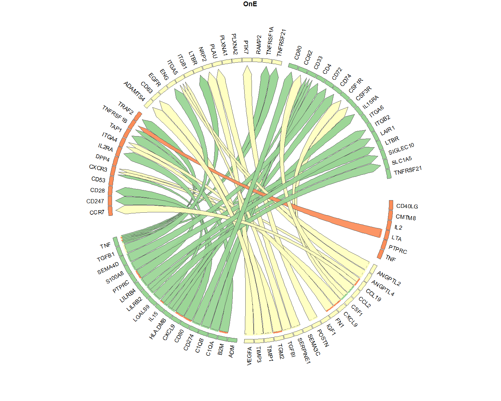<!-- -->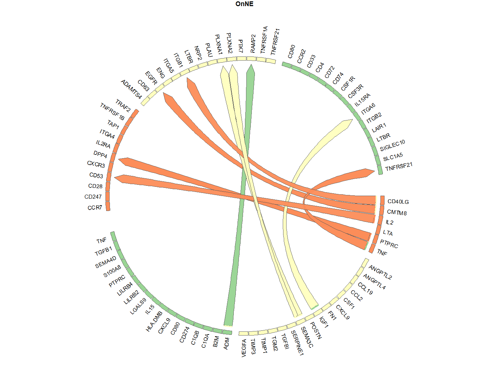<!-- --><!-- -->

Now you can also make a full circos plot for one group of interest,
where will show the top30 per group

``` r
prioritized_tbl_oi_E_30 = get_top_n_lr_pairs(multinichenet_output$prioritization_tables, 30, groups_oi = "OnE")
prioritized_tbl_oi_NE_30 = get_top_n_lr_pairs(multinichenet_output$prioritization_tables, 30, groups_oi = "OnNE")
```

``` r
circos_E = make_circos_one_group(prioritized_tbl_oi_E_30, colors_sender, colors_receiver)
```

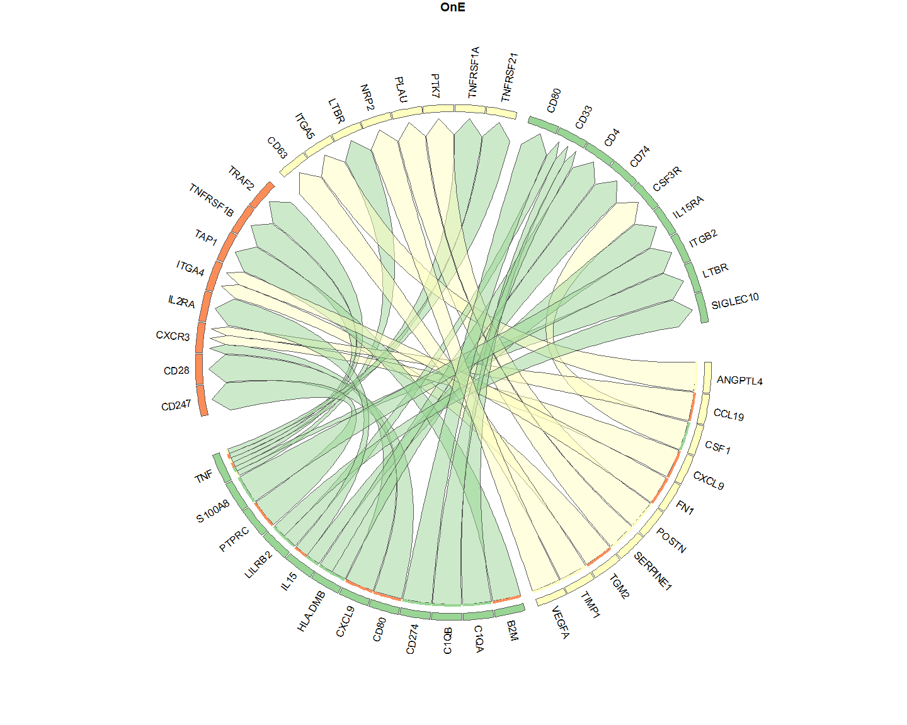<!-- --><!-- -->

``` r
circos_NE = make_circos_one_group(prioritized_tbl_oi_NE_30, colors_sender, colors_receiver)
```

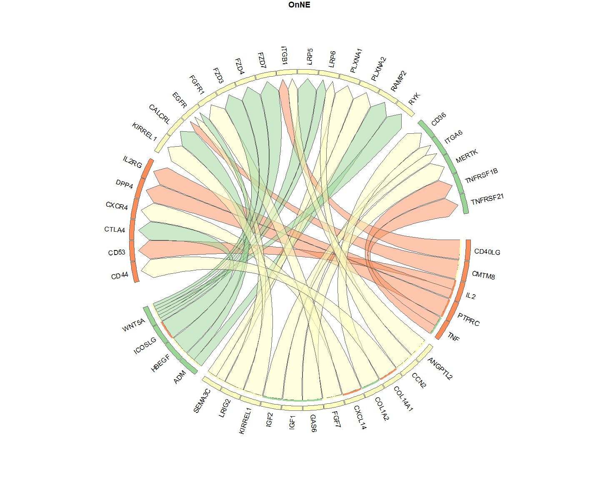<!-- -->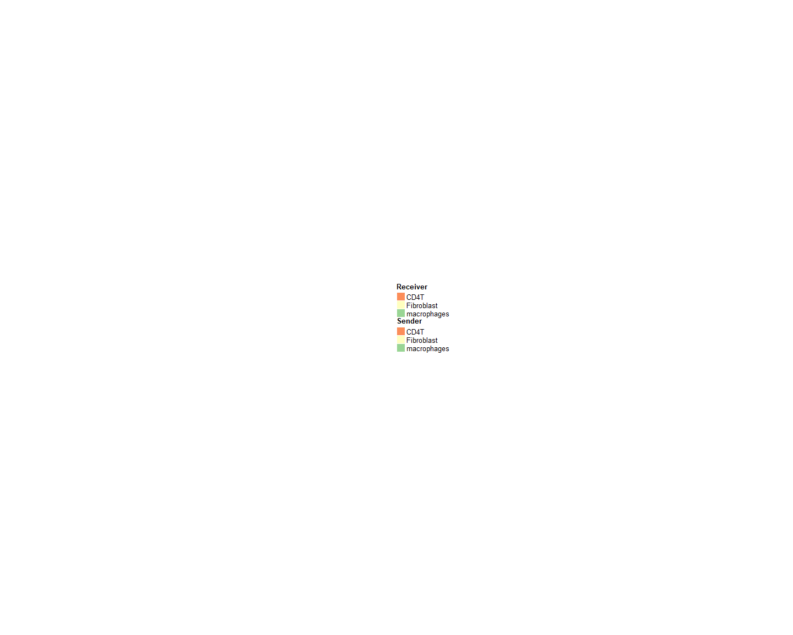<!-- -->

## Visualization of scaled ligand-receptor pseudobulk products and ligand activity

Now we will visualize per sample the scaled product of ligand and
receptor expression. Samples that were left out of the DE analysis are
indicated with a smaller dot (this helps to indicate the samples that
did not contribute to the calculation of the logFC, and thus not
contributed to the final prioritization)

We will now check the top 30 interactions that we also visualized in the
circos plots above.

E group

``` r
plot_oi = make_sample_lr_prod_activity_plots(multinichenet_output$prioritization_tables, prioritized_tbl_oi_E_30)
plot_oi
```

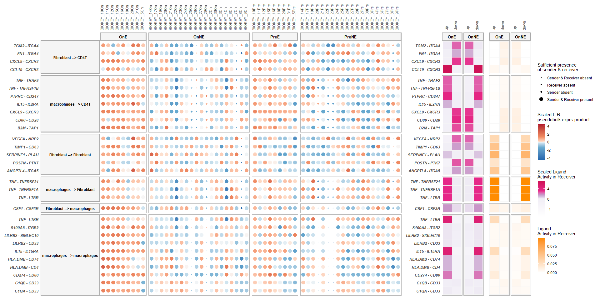<!-- -->

How should we interpret this plot: this plots shows the top 30
interactions of which the On-vs-Pre change is more strong in the E group
than the NE group.

Now for the NE group (top 30 interactions of which the On-vs-Pre change
is more strong in the NE group than the E group.)

``` r
plot_oi = make_sample_lr_prod_activity_plots(multinichenet_output$prioritization_tables, prioritized_tbl_oi_NE_30)
plot_oi
```

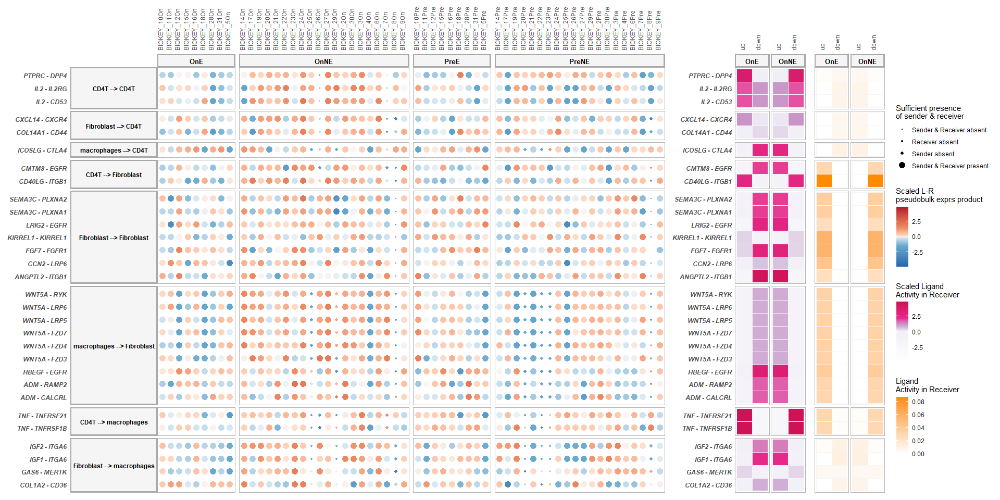<!-- -->

Typically, there are way more than 30 differentially expressed and
active ligand-receptor pairs per group across all sender-receiver
combinations. Therefore it might be useful to zoom in on specific cell
types as senders/receivers:

Eg macrophages as receiver:

``` r
group_oi = "OnE"
prioritized_tbl_oi_top_50 = get_top_n_lr_pairs(multinichenet_output$prioritization_tables, 50, groups_oi = group_oi, receivers_oi = "macrophages")

plot_oi = make_sample_lr_prod_activity_plots(multinichenet_output$prioritization_tables, prioritized_tbl_oi_top_50)
plot_oi
```

<!-- -->

Eg macrophages as sender:

``` r
prioritized_tbl_oi_top_50 = get_top_n_lr_pairs(multinichenet_output$prioritization_tables, 50, groups_oi = group_oi, senders_oi = "macrophages")

plot_oi = make_sample_lr_prod_activity_plots(multinichenet_output$prioritization_tables, prioritized_tbl_oi_top_50)
plot_oi
```

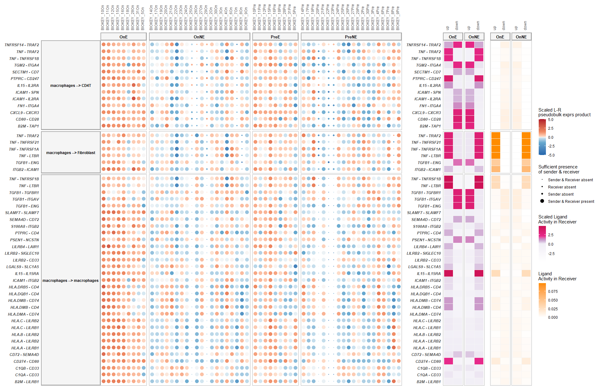<!-- -->

## Intercellular regulatory network systems view

As additional plot, we can generate a ‘systems’ view of these
intercellular feedback and cascade processes than can be occuring
between the different cell populations involved. In this plot, we will
draw links between ligands of sender cell types their
ligand/receptor-annotated target genes in receiver cell types. So links
are ligand-target links (= gene regulatory links) and not
ligand-receptor protein-protein interactions!

``` r
prioritized_tbl_oi = get_top_n_lr_pairs(multinichenet_output$prioritization_tables, 500, rank_per_group = FALSE)

lr_target_prior_cor_filtered = multinichenet_output$prioritization_tables$group_prioritization_tbl$group %>% unique() %>% lapply(function(group_oi){
  lr_target_prior_cor_filtered = multinichenet_output$lr_target_prior_cor %>% inner_join(multinichenet_output$ligand_activities_targets_DEgenes$ligand_activities %>% distinct(ligand, target, direction_regulation, contrast)) %>% inner_join(contrast_tbl) %>% filter(group == group_oi)
  lr_target_prior_cor_filtered_up = lr_target_prior_cor_filtered %>% filter(direction_regulation == "up") %>% filter( (rank_of_target < top_n_target) & (pearson > 0.50 | spearman > 0.50))
  lr_target_prior_cor_filtered_down = lr_target_prior_cor_filtered %>% filter(direction_regulation == "down") %>% filter( (rank_of_target < top_n_target) & (pearson < -0.50 | spearman < -0.50))
  lr_target_prior_cor_filtered = bind_rows(lr_target_prior_cor_filtered_up, lr_target_prior_cor_filtered_down)
}) %>% bind_rows()
```

``` r
colors_sender["Fibroblast"] = "pink" # the  original yellow with white font is not very readable
graph_plot = make_ggraph_ligand_target_links(lr_target_prior_cor_filtered = lr_target_prior_cor_filtered, prioritized_tbl_oi = prioritized_tbl_oi, colors = colors_sender)
graph_plot$plot
```

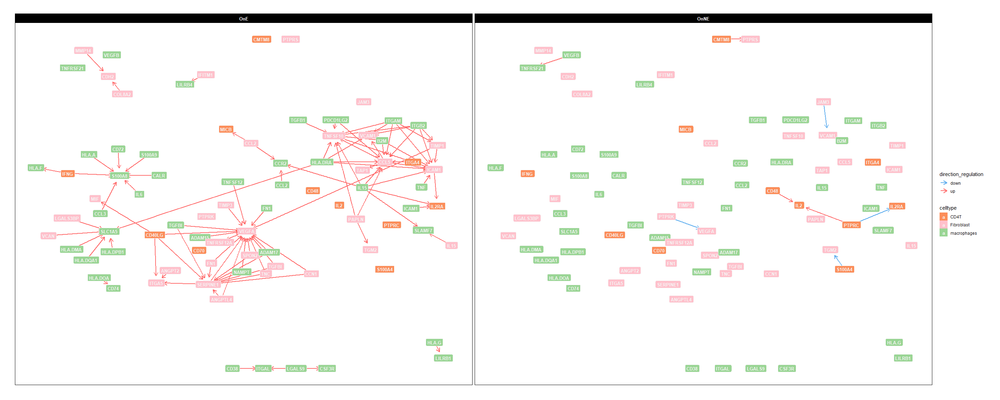<!-- -->

``` r
graph_plot$source_df_lt %>% head()
## # A tibble: 6 x 6
##   sender            receiver           direction_regulation group type          weight
##   <chr>             <chr>              <fct>                <chr> <chr>          <dbl>
## 1 Fibroblast_TIMP1  Fibroblast_TIMP1   up                   OnE   Ligand-Target      1
## 2 Fibroblast_TIMP1  Fibroblast_VEGFA   up                   OnE   Ligand-Target      1
## 3 Fibroblast_TIMP3  Fibroblast_VEGFA   up                   OnE   Ligand-Target      1
## 4 macrophages_B2M   Fibroblast_CCL5    up                   OnE   Ligand-Target      1
## 5 macrophages_B2M   Fibroblast_TNFSF10 up                   OnE   Ligand-Target      1
## 6 macrophages_ITGB2 Fibroblast_TIMP1   up                   OnE   Ligand-Target      1
graph_plot$nodes_df %>% head()
##                                node    celltype  gene       type_gene
## macrophages_ITGB2 macrophages_ITGB2 macrophages ITGB2 ligand/receptor
## Fibroblast_ICAM1   Fibroblast_ICAM1  Fibroblast ICAM1 ligand/receptor
## Fibroblast_MMP14   Fibroblast_MMP14  Fibroblast MMP14 ligand/receptor
## Fibroblast_JAM3     Fibroblast_JAM3  Fibroblast  JAM3 ligand/receptor
## Fibroblast_VCAM1   Fibroblast_VCAM1  Fibroblast VCAM1 ligand/receptor
## Fibroblast_TIMP1   Fibroblast_TIMP1  Fibroblast TIMP1          ligand
```

## Show ligand activities for each receiver-group combination

In the next type of plot, we plot all the ligand activities (Both scaled
and absolute activities) of each receiver-group combination. This can
give us some insights in active signaling pathways across groups. Note
that we can thus show top ligands based on ligand activity - agnostic of
expression in sender.

``` r
ligands_oi = multinichenet_output$prioritization_tables$ligand_activities_target_de_tbl %>% inner_join(contrast_tbl) %>% 
  group_by(group, receiver) %>% distinct(ligand, receiver, group, activity) %>% 
  top_n(5, activity) %>% pull(ligand) %>% unique()

plot_oi = make_ligand_activity_plots(multinichenet_output$prioritization_tables, ligands_oi, contrast_tbl, widths = NULL)
plot_oi
```

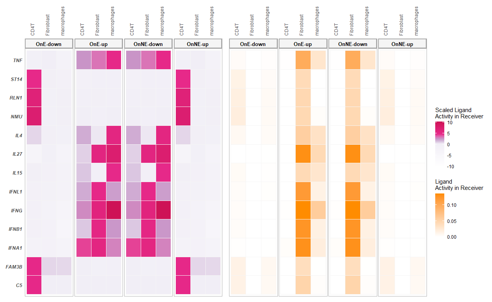<!-- -->

This plot eg shows a strong interferon signature in all 3 cell types for
genes with stronger On-vs-Pre differences in the E than NE group.

## Zoom in on specific ligand-receptor interactions: show their expression in the single-cell data!

Single-cell-based Feature, and Violin plots of ligand-receptor
interaction of interest: `make_ligand_receptor_feature_plot` and
`make_ligand_receptor_violin_plot`

It is often useful to zoom in on specific ligand-receptor interactions
of interest by looking in more detail to their expression at the single
cell level

Check the highest scoring links based on the general prioritization
score. Here we will pick one of those to visualize.

``` r
prioritized_tbl_oi %>% head(10)
## # A tibble: 10 x 8
##    group sender      receiver    ligand receptor id                                  prioritization_score prioritization_rank
##    <chr> <chr>       <chr>       <chr>  <chr>    <chr>                                              <dbl>               <dbl>
##  1 OnE   macrophages Fibroblast  TNF    LTBR     TNF_LTBR_macrophages_Fibroblast                    0.944                   1
##  2 OnE   Fibroblast  CD4T        TGM2   ITGA4    TGM2_ITGA4_Fibroblast_CD4T                         0.940                   2
##  3 OnE   macrophages macrophages TNF    LTBR     TNF_LTBR_macrophages_macrophages                   0.939                   3
##  4 OnE   macrophages CD4T        TNF    TRAF2    TNF_TRAF2_macrophages_CD4T                         0.937                   4
##  5 OnE   macrophages CD4T        CXCL9  CXCR3    CXCL9_CXCR3_macrophages_CD4T                       0.933                   5
##  6 OnE   macrophages Fibroblast  TNF    TNFRSF1A TNF_TNFRSF1A_macrophages_Fibroblast                0.923                   6
##  7 OnE   Fibroblast  CD4T        CXCL9  CXCR3    CXCL9_CXCR3_Fibroblast_CD4T                        0.921                   7
##  8 OnNE  CD4T        CD4T        PTPRC  DPP4     PTPRC_DPP4_CD4T_CD4T                               0.921                   8
##  9 OnE   Fibroblast  macrophages CSF1   CSF3R    CSF1_CSF3R_Fibroblast_macrophages                  0.920                   9
## 10 OnE   macrophages CD4T        TNF    TNFRSF1B TNF_TNFRSF1B_macrophages_CD4T                      0.920                  10
```

``` r
ligand_oi = "CXCL9"
receptor_oi = "CXCR3"
group_oi = "OnE"
sender_oi = "macrophages"
receiver_oi = "CD4T"
```

``` r
p_violin = make_ligand_receptor_violin_plot(sce_sender = sce, sce_receiver = sce, ligand_oi = ligand_oi, receptor_oi = receptor_oi, group_oi = group_oi, group_id = group_id, sender_oi = sender_oi, receiver_oi = receiver_oi, sample_id = sample_id, celltype_id_sender = celltype_id, celltype_id_receiver = celltype_id)
p_violin
```

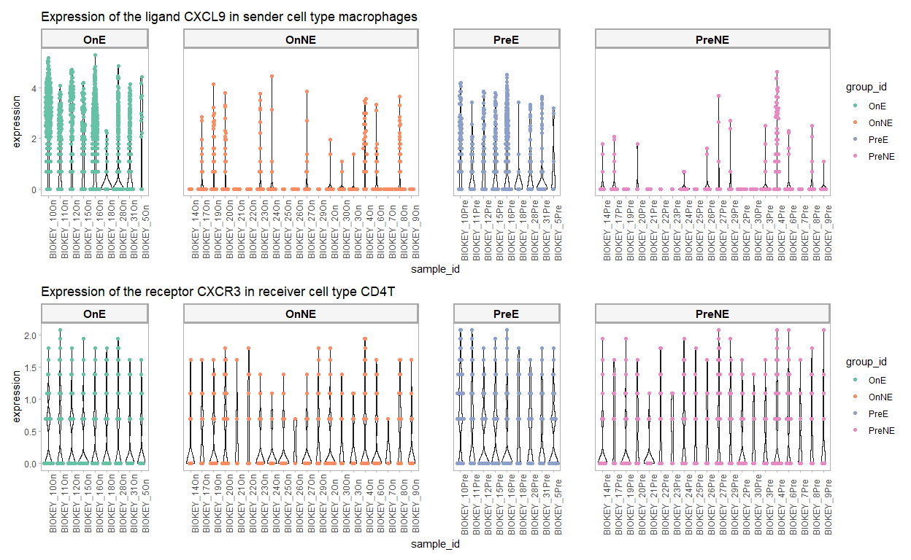<!-- -->

For `make_ligand_receptor_feature_plot`, your SingleCellExperiment
object should have a dimensionality reduction element stored.

## Plots of cell-cell communication changes

All the above visualizations were general and not specific to the
multifactorial design and complex contrast of this data and analysis. In
the final part of this vignette, we will demonstrate some visualizations
that better showcase differences in therapy-induced cell-cell
communication changes. Because it is very hard to do this for the final
MultiNicheNet prioritization score including both expression and
activity, we will only visualize ligand-receptor expression in the
following plots. But realise that the interactions we will show are
prioritized by MultiNicheNet not only based on expression, but thus also
ligand activity.

Also note that following visualizations should be tailored to the
specific multifactorial design of the data you are analyzing.

### Prepare difference plots

In the following blocks of code, we will first create and reformat a
data frame so that we know for each sample from which patient it came,
whether it was On or Pre therapy, whether the patient is from the E or
NE group, and also what the pseudobulk expression product is for a
ligand-receptor pair.

As example, we will focus on the top 10 interactions with stronger
On-Pre differences in the E group versus the NE group.

``` r
# get prioritized interactions
prioritized_tbl_oi = get_top_n_lr_pairs(multinichenet_output$prioritization_tables, 10, rank_per_group = TRUE, groups_oi = "OnE")

# create sample-level data frame for these interactions
sample_data = multinichenet_output$prioritization_tables$sample_prioritization_tbl %>% dplyr::filter(id %in% prioritized_tbl_oi$id) %>% dplyr::mutate(sender_receiver = paste(sender, receiver, sep = " --> "), lr_interaction = paste(ligand, receptor, sep = " - "))   %>%  dplyr::arrange(receiver) %>% dplyr::group_by(receiver) %>%  dplyr::arrange(sender, .by_group = TRUE) 

sample_data = sample_data %>% dplyr::mutate(sender_receiver = factor(sender_receiver, levels = sample_data$sender_receiver %>% unique()))

# define the time point and group and link it all together
grouping_tbl2 = multinichenet_output$grouping_tbl %>% dplyr::inner_join(multinichenet_output$prioritization_tables$sample_prioritization_tbl %>% dplyr::distinct(sample, keep_receiver, keep_sender))
grouping_tbl2 = grouping_tbl2 %>% inner_join(tibble(group = c("PreE","PreNE","OnE","OnNE"), contrast = c("E","NE","E","NE")))
  
grouping_tbl2$on_pre = "On"
grouping_tbl2$on_pre[grouping_tbl2$group %in% c("PreE","PreNE")] = "Pre"

sample_data = sample_data %>% ungroup() %>% 
  mutate(patient= sample_data$sample %>% stringr::str_split("Pre") %>% sapply(function(x){x[1]}) %>% stringr::str_split("On")  %>% sapply(function(x){x[1]})) %>% 
  inner_join(grouping_tbl2)
```

Then we will remove samples where sender and/or receiver was missing and
calculate the On-vs-Pre difference in pseudobulk expression (absolute
and relative difference, named respectively `diff` and `lfc`).

``` r
sample_data = sample_data %>% filter(keep_sender & keep_receiver) %>% mutate(group = factor(group, levels = c("PreNE","PreE", "OnNE","OnE")), on_pre = factor(on_pre, levels = c("Pre","On")))
sample_data = sample_data %>% inner_join(
  sample_data %>% filter(keep_receiver == 1 & keep_sender == 1) %>% ungroup() %>% select(id, patient, on_pre, ligand_receptor_pb_prod) %>% distinct() %>% tidyr::spread(on_pre, ligand_receptor_pb_prod) %>% mutate(diff = On-Pre, fc = On/Pre) %>% mutate(lfc = log(fc)) %>% arrange(-lfc)
  )
order_patients = sample_data %>% group_by(patient) %>% summarise(sum_diff = sum(diff, na.rm = TRUE)) %>% arrange(-sum_diff) %>% pull(patient)
order_samples = sample_data %>% group_by(patient) %>% summarise(sum_diff = sum(diff, na.rm = TRUE)) %>% inner_join(sample_data) %>% arrange(-sum_diff) %>% pull(sample) %>% unique()
```

### Boxplots

``` r
p_lr_prod_change_boxplot = sample_data %>% mutate(patient = factor(patient, levels = order_patients)) %>% 
    ggplot(aes(x = contrast, y = ligand_receptor_pb_prod, fill = on_pre, group = group)) +
    geom_boxplot() + 
    facet_wrap(id~.) +
    theme_bw() +
    xlab("") + ylab("") 

p_lr_prod_change_boxplot
```

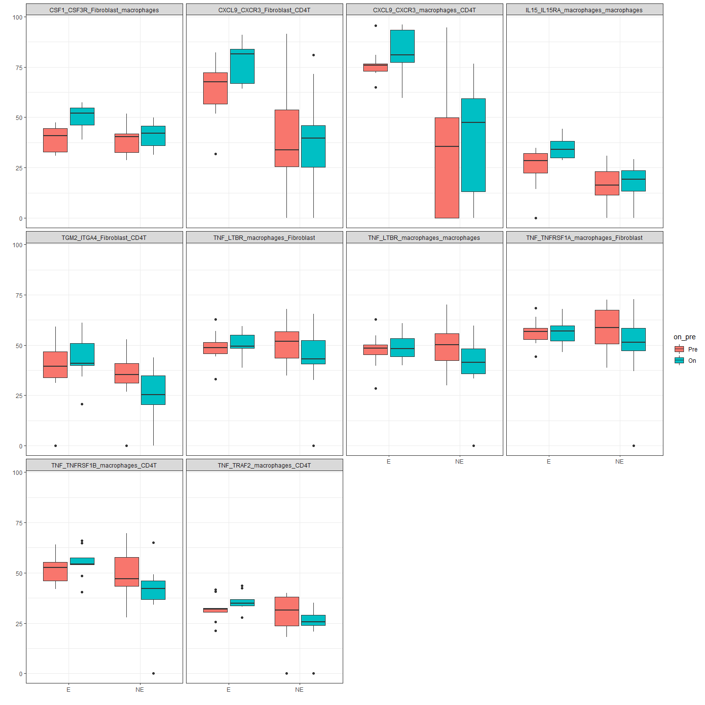<!-- -->
These boxplots reflect what the DE model underlying MultiNicheNet
infers: namely average group differences. However, they don’t show
potential inter-sample heterogeneity. That’s why we will also create
bubble and line plots in the following blocks of code.

### Bubble plots

Bubble Blot for E group

We will now visualize the On-vs-Pre absolute difference in pseudobulk
ligand-receptor expression product in a bubble plot.

``` r

max_diff = abs(sample_data$diff) %>% max(na.rm = TRUE)
custom_scale_color = scale_color_gradientn(colours = RColorBrewer::brewer.pal(n = 7, 
        name = "RdBu") %>% rev(), values = c(0, 0.30, 0.425, 
        0.5, 0.575, 0.70, 1), limits = c(-1 * max_diff, max_diff))

p_lr_prod_change = sample_data %>% mutate(patient = factor(patient, levels = order_patients)) %>%
    ggplot(aes(patient, lr_interaction, color = diff)) +
    geom_point(size = 5) +
    facet_grid(sender_receiver~contrast, scales = "free", space = "free", switch = "y") +
    theme_light() +  
        theme(axis.ticks = element_blank(), axis.title = element_blank(), 
            axis.text.y = element_text(face = "bold.italic", 
                size = 9), axis.text.x = element_text(size = 9, 
                angle = 90, hjust = 0), panel.grid.major = element_blank(), 
            panel.grid.minor = element_blank(), panel.spacing.x = unit(0.4, 
                "lines"), panel.spacing.y = unit(0.25, 
                "lines"), strip.text.x.top = element_text(size = 10, 
                color = "black", face = "bold", angle = 0), 
            strip.text.y.left = element_text(size = 9, color = "black", 
                face = "bold", angle = 0), strip.background = element_rect(color = "darkgrey", 
                fill = "whitesmoke", size = 1.5, linetype = "solid")) +
    custom_scale_color +
    xlab("") + ylab("")
p_lr_prod_change
```

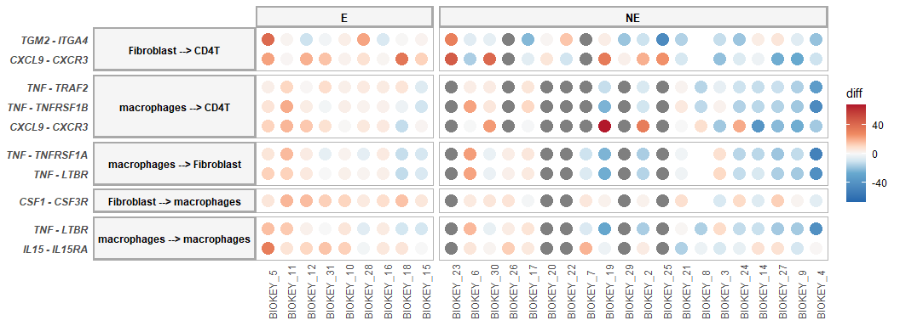<!-- -->

### Line plots

``` r
line_plot = sample_data %>% filter(ligand_receptor_pb_prod != 0) %>%
    ggplot(aes(on_pre, ligand_receptor_pb_prod, group = patient, color = contrast)) +
    geom_point() + geom_line() +
    facet_grid(id~contrast, scales = "free", switch = "y") +
    theme_bw() + 
    scale_color_brewer(palette = "Set2") +
    xlab("") + ylab("")
line_plot
```

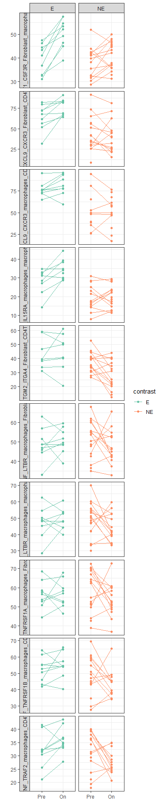<!-- -->
