<style type="text/css">
.smaller {
  font-size: 10px
}
</style>

<!-- github markdown built using
rmarkdown::render("vignettes/multifactorial_analysis_BreastCancer.Rmd", clean = FALSE )
-->


In this vignette, you can learn how to perform a MultiNicheNet analysis on data with complex multifactorial experimental designs. More specifically, we will cover in depth how to study differential dynamics of cell-cell communication between conditions. We will assume the following type of design that is quite common: we have 2 or more conditions/groups of interest, and for each condition we also have 2 or more time points (eg before and after a certain treatment). Research questions are: how does cell-cell communication change over time in each condition? And, importantly, how are these time-related changes different between the conditions? Certainly the latter is a non-trivial question. We will here demonstrate how MultiNicheNet can exploit the flexibility of generalized linear models in the pseudobulk-edgeR framework to handle this non-trivial question. 

This vignette is quite advanced, so if you are new to MultiNicheNet, we recommend reading and running this vignette: [basis_analysis_steps_MISC.knit.md](basis_analysis_steps_MISC.knit.md) to get acquainted with the methodology and simple applications. 

As example expression data of interacting cells for this vignette, we will here use scRNAseq data from breast cancer biopsies of patients receiving anti-PD1 immune-checkpoint blockade therapy. Bassez et al. collected from each patient one tumor biopsy before anti-PD1 therapy (“pre-treatment”) and one during subsequent surgery (“on-treatment”) [A single-cell map of intratumoral changes during anti-PD1 treatment of patients with breast cancer](https://www.nature.com/articles/s41591-021-01323-8). Based on additional scTCR-seq results, they identified one group of patients with clonotype expansion as response to the therapy (“E”) and one group with only limited or no clonotype expansion (“NE”). To make this vignette more easily adaptable to the user, we will rename the groups and time points as follows: E --> group1, NE --> group2, Pre-treatment: timepoint1, On-treatment: timepoint2. 

Now, how can we define which CCC patterns are changing during anti-PD1 therapy and which of these changes are specific to E compared to NE patients (and vice versa)?
First, we will run a MultiNicheNet, focusing on anti-PD1 therapy related differences in group1. Secondly, we will do the same for group2. Then we will compare the prioritized interactions between both groups in a basic way. Finally, we will run a MultiNicheNet analysis with a complex contrast to focus specifically on group-specific differences in anti-PD1 therapy associated CCC changes.

In this vignette, we will first prepare the common elements of all MultiNicheNet core analyses, then run, interpret and compare the different analyses.

# Preparation of the MultiNicheNet core analysis


```r
library(SingleCellExperiment)
library(dplyr)
library(ggplot2)
library(nichenetr)
library(multinichenetr)
```

## Load NicheNet's ligand-receptor network and ligand-target matrix

The Nichenet v2 networks and matrices for both mouse and human can be downloaded from Zenodo [](https://doi.org/10.5281/zenodo.7074291). 

We will read these object in for human because our expression data is of human patients. 
Gene names are here made syntactically valid via `make.names()` to avoid the loss of genes (eg H2-M3) in downstream visualizations.


```r
organism = "human"
```


```r
options(timeout = 250)

if(organism == "human"){
  
  lr_network_all = 
    readRDS(url(
      "https://zenodo.org/record/10229222/files/lr_network_human_allInfo_30112033.rds"
      )) %>% 
    mutate(
      ligand = convert_alias_to_symbols(ligand, organism = organism), 
      receptor = convert_alias_to_symbols(receptor, organism = organism))
  
  lr_network_all = lr_network_all  %>% 
    mutate(ligand = make.names(ligand), receptor = make.names(receptor)) 
  
  lr_network = lr_network_all %>% 
    distinct(ligand, receptor)
  
  ligand_target_matrix = readRDS(url(
    "https://zenodo.org/record/7074291/files/ligand_target_matrix_nsga2r_final.rds"
    ))
  
  colnames(ligand_target_matrix) = colnames(ligand_target_matrix) %>% 
    convert_alias_to_symbols(organism = organism) %>% make.names()
  rownames(ligand_target_matrix) = rownames(ligand_target_matrix) %>% 
    convert_alias_to_symbols(organism = organism) %>% make.names()
  
  lr_network = lr_network %>% filter(ligand %in% colnames(ligand_target_matrix))
  ligand_target_matrix = ligand_target_matrix[, lr_network$ligand %>% unique()]
  
} else if(organism == "mouse"){
  
  lr_network_all = readRDS(url(
    "https://zenodo.org/record/10229222/files/lr_network_mouse_allInfo_30112033.rds"
    )) %>% 
    mutate(
      ligand = convert_alias_to_symbols(ligand, organism = organism), 
      receptor = convert_alias_to_symbols(receptor, organism = organism))
  
  lr_network_all = lr_network_all  %>% 
    mutate(ligand = make.names(ligand), receptor = make.names(receptor)) 
  lr_network = lr_network_all %>% 
    distinct(ligand, receptor)
  
  ligand_target_matrix = readRDS(url(
    "https://zenodo.org/record/7074291/files/ligand_target_matrix_nsga2r_final_mouse.rds"
    ))
  
  colnames(ligand_target_matrix) = colnames(ligand_target_matrix) %>% 
    convert_alias_to_symbols(organism = organism) %>% make.names()
  rownames(ligand_target_matrix) = rownames(ligand_target_matrix) %>% 
    convert_alias_to_symbols(organism = organism) %>% make.names()
  
  lr_network = lr_network %>% filter(ligand %in% colnames(ligand_target_matrix))
  ligand_target_matrix = ligand_target_matrix[, lr_network$ligand %>% unique()]
  
}
```

## Read in SingleCellExperiment Object

In this vignette, we will load in a subset of the breast cancer scRNAseq data [](https://doi.org/10.5281/zenodo.8010790). For the sake of demonstration, this subset only contains 3 cell types. 

Because the NicheNet 2.0. networks are in the most recent version of the official gene symbols, we will make sure that the gene symbols used in the expression data are also updated (= converted from their "aliases" to official gene symbols). Afterwards, we will make them again syntactically valid. 


```r
sce = readRDS(url(
  "https://zenodo.org/record/8010790/files/sce_subset_breastcancer.rds"
  ))
sce = alias_to_symbol_SCE(sce, "human") %>% makenames_SCE()
## [1] "there are provided symbols that are not in the alias annotation table: "
##    [1] "AC000403.1"  "AC002070.1"  "AC002091.2"  "AC002116.2"  "AC002310.1"  "AC002398.2"  "AC002467.1"  "AC002480.2"  "AC002511.1"  "AC003102.1"  "AC003681.1"  "AC004130.1"  "AC004241.1" 
##   [14] "AC004466.1"  "AC004520.1"  "AC004540.1"  "AC004585.1"  "AC004687.1"  "AC004771.3"  "AC004803.1"  "AC004812.2"  "AC004816.2"  "AC004817.3"  "AC004832.6"  "AC004846.1"  "AC004854.2" 
##   [27] "AC004865.2"  "AC004918.1"  "AC004921.1"  "AC004943.2"  "AC004951.1"  "AC004982.2"  "AC005013.1"  "AC005034.3"  "AC005037.1"  "AC005041.1"  "AC005064.1"  "AC005070.3"  "AC005076.1" 
##   [40] "AC005082.1"  "AC005224.1"  "AC005224.3"  "AC005229.4"  "AC005261.1"  "AC005261.3"  "AC005288.1"  "AC005291.1"  "AC005291.2"  "AC005332.1"  "AC005332.3"  "AC005332.4"  "AC005332.5" 
##   [53] "AC005332.6"  "AC005332.7"  "AC005363.2"  "AC005392.2"  "AC005498.2"  "AC005498.3"  "AC005520.2"  "AC005580.1"  "AC005618.1"  "AC005726.1"  "AC005775.1"  "AC005837.1"  "AC005838.2" 
##   [66] "AC005840.4"  "AC005842.1"  "AC005884.1"  "AC005899.6"  "AC005920.1"  "AC006033.2"  "AC006059.1"  "AC006064.2"  "AC006064.4"  "AC006213.1"  "AC006213.2"  "AC006252.1"  "AC006254.1" 
##   [79] "AC006299.1"  "AC006333.2"  "AC006369.1"  "AC006441.4"  "AC006449.2"  "AC006449.6"  "AC006480.2"  "AC006504.1"  "AC006504.5"  "AC006942.1"  "AC007032.1"  "AC007038.1"  "AC007038.2" 
##   [92] "AC007114.1"  "AC007216.4"  "AC007249.2"  "AC007325.2"  "AC007364.1"  "AC007383.2"  "AC007384.1"  "AC007388.1"  "AC007405.3"  "AC007406.3"  "AC007541.1"  "AC007563.2"  "AC007569.1" 
##  [105] "AC007608.3"  "AC007611.1"  "AC007620.2"  "AC007681.1"  "AC007686.3"  "AC007743.1"  "AC007750.1"  "AC007773.1"  "AC007952.4"  "AC007952.7"  "AC007998.3"  "AC008014.1"  "AC008035.1" 
##  [118] "AC008040.5"  "AC008050.1"  "AC008083.2"  "AC008105.1"  "AC008105.3"  "AC008124.1"  "AC008264.2"  "AC008267.5"  "AC008393.1"  "AC008438.1"  "AC008443.5"  "AC008467.1"  "AC008514.1" 
##  [131] "AC008522.1"  "AC008543.1"  "AC008555.5"  "AC008556.1"  "AC008608.2"  "AC008610.1"  "AC008637.1"  "AC008691.1"  "AC008735.2"  "AC008741.2"  "AC008750.8"  "AC008758.4"  "AC008763.1" 
##  [144] "AC008764.6"  "AC008764.8"  "AC008771.1"  "AC008840.1"  "AC008894.2"  "AC008914.1"  "AC008915.2"  "AC008945.1"  "AC008957.1"  "AC008966.1"  "AC009005.1"  "AC009021.1"  "AC009041.1" 
##  [157] "AC009041.2"  "AC009053.2"  "AC009061.2"  "AC009065.4"  "AC009093.1"  "AC009093.2"  "AC009113.1"  "AC009118.2"  "AC009118.3"  "AC009119.1"  "AC009126.1"  "AC009133.1"  "AC009133.3" 
##  [170] "AC009163.7"  "AC009237.14" "AC009275.1"  "AC009283.1"  "AC009309.1"  "AC009318.1"  "AC009318.2"  "AC009318.3"  "AC009403.1"  "AC009404.1"  "AC009506.1"  "AC009630.1"  "AC009690.2" 
##  [183] "AC009779.2"  "AC009779.3"  "AC009812.1"  "AC009812.4"  "AC009831.1"  "AC009948.1"  "AC009961.1"  "AC010173.1"  "AC010198.1"  "AC010226.1"  "AC010240.3"  "AC010245.2"  "AC010247.2" 
##  [196] "AC010331.1"  "AC010491.1"  "AC010504.1"  "AC010522.1"  "AC010531.6"  "AC010618.3"  "AC010642.2"  "AC010654.1"  "AC010680.2"  "AC010809.2"  "AC010864.1"  "AC010894.2"  "AC010931.2" 
##  [209] "AC010969.2"  "AC010976.2"  "AC011043.1"  "AC011247.1"  "AC011337.1"  "AC011446.2"  "AC011447.3"  "AC011450.1"  "AC011468.5"  "AC011472.1"  "AC011484.1"  "AC011603.2"  "AC011611.3" 
##  [222] "AC011611.4"  "AC011893.1"  "AC011899.2"  "AC011921.1"  "AC012236.1"  "AC012306.2"  "AC012313.1"  "AC012358.3"  "AC012360.3"  "AC012368.1"  "AC012467.2"  "AC012615.1"  "AC012640.2" 
##  [235] "AC012645.1"  "AC012645.3"  "AC013264.1"  "AC013394.1"  "AC013400.1"  "AC013549.2"  "AC013565.1"  "AC015712.1"  "AC015712.2"  "AC015726.1"  "AC015813.1"  "AC015912.3"  "AC015922.4" 
##  [248] "AC015982.1"  "AC016027.1"  "AC016065.1"  "AC016205.1"  "AC016355.1"  "AC016394.1"  "AC016405.3"  "AC016588.2"  "AC016590.1"  "AC016596.1"  "AC016727.1"  "AC016745.2"  "AC016773.1" 
##  [261] "AC016831.1"  "AC016831.5"  "AC016876.1"  "AC016957.2"  "AC017002.1"  "AC017002.3"  "AC017033.1"  "AC017083.1"  "AC017083.2"  "AC018638.7"  "AC018647.1"  "AC018647.2"  "AC018653.3" 
##  [274] "AC018797.2"  "AC018809.2"  "AC018816.1"  "AC019131.2"  "AC019163.1"  "AC019171.1"  "AC019205.1"  "AC020558.1"  "AC020571.1"  "AC020656.2"  "AC020659.1"  "AC020765.2"  "AC020910.4" 
##  [287] "AC020911.2"  "AC020915.1"  "AC020915.3"  "AC020916.1"  "AC020928.1"  "AC020928.2"  "AC020978.5"  "AC021028.1"  "AC021054.1"  "AC021092.1"  "AC021097.1"  "AC021188.1"  "AC021321.1" 
##  [300] "AC021678.2"  "AC021739.2"  "AC021752.1"  "AC022034.2"  "AC022075.1"  "AC022098.1"  "AC022182.1"  "AC022182.2"  "AC022211.2"  "AC022364.1"  "AC022509.1"  "AC022509.2"  "AC022509.3" 
##  [313] "AC022613.1"  "AC022613.2"  "AC022706.1"  "AC022762.2"  "AC022784.3"  "AC022916.1"  "AC023043.1"  "AC023157.3"  "AC023355.1"  "AC023509.2"  "AC023509.3"  "AC023590.1"  "AC023632.2" 
##  [326] "AC023908.3"  "AC024060.1"  "AC024257.3"  "AC024337.2"  "AC024575.1"  "AC024592.3"  "AC024909.2"  "AC025031.4"  "AC025154.2"  "AC025159.1"  "AC025164.1"  "AC025171.2"  "AC025171.3" 
##  [339] "AC025181.2"  "AC025283.2"  "AC025423.4"  "AC025580.2"  "AC025682.1"  "AC025809.1"  "AC026191.1"  "AC026202.2"  "AC026304.1"  "AC026401.3"  "AC026471.1"  "AC026471.2"  "AC026471.3" 
##  [352] "AC026691.1"  "AC026801.2"  "AC026979.2"  "AC027020.2"  "AC027031.2"  "AC027097.1"  "AC027097.2"  "AC027117.2"  "AC027237.3"  "AC027288.3"  "AC027290.1"  "AC027307.2"  "AC027307.3" 
##  [365] "AC027644.3"  "AC027682.1"  "AC027682.2"  "AC027682.3"  "AC027682.4"  "AC027682.6"  "AC027702.1"  "AC034102.6"  "AC034206.1"  "AC034231.1"  "AC034236.2"  "AC036176.1"  "AC037198.2" 
##  [378] "AC037459.2"  "AC037459.3"  "AC040162.1"  "AC040162.3"  "AC040169.1"  "AC040970.1"  "AC044839.1"  "AC044849.1"  "AC046143.1"  "AC048341.1"  "AC048341.2"  "AC048382.6"  "AC051619.5" 
##  [391] "AC053527.1"  "AC058791.1"  "AC060766.4"  "AC060780.1"  "AC061992.1"  "AC062004.1"  "AC062017.1"  "AC062029.1"  "AC064807.1"  "AC064836.3"  "AC067750.1"  "AC067852.2"  "AC068282.1" 
##  [404] "AC068338.2"  "AC068473.1"  "AC068473.5"  "AC068491.3"  "AC068790.8"  "AC068888.1"  "AC069148.1"  "AC069185.1"  "AC069224.1"  "AC069360.1"  "AC069544.1"  "AC072061.1"  "AC073073.2" 
##  [417] "AC073195.1"  "AC073254.1"  "AC073332.1"  "AC073335.2"  "AC073349.1"  "AC073352.2"  "AC073389.1"  "AC073508.3"  "AC073575.2"  "AC073611.1"  "AC073834.1"  "AC073896.2"  "AC074032.1" 
##  [430] "AC074044.1"  "AC074117.1"  "AC074135.1"  "AC074327.1"  "AC078785.1"  "AC078795.1"  "AC078845.1"  "AC078846.1"  "AC078883.1"  "AC079209.1"  "AC079298.3"  "AC079313.2"  "AC079601.1" 
##  [443] "AC079630.1"  "AC079807.1"  "AC079834.2"  "AC079848.1"  "AC079922.2"  "AC080013.1"  "AC080013.5"  "AC080038.1"  "AC083798.2"  "AC083843.3"  "AC083862.2"  "AC083880.1"  "AC083949.1" 
##  [456] "AC083964.1"  "AC083973.1"  "AC084018.2"  "AC084033.3"  "AC084036.1"  "AC084346.2"  "AC084757.3"  "AC084824.5"  "AC087203.3"  "AC087239.1"  "AC087289.5"  "AC087392.1"  "AC087477.2" 
##  [469] "AC087500.1"  "AC087623.3"  "AC087645.2"  "AC087741.1"  "AC090061.1"  "AC090114.2"  "AC090125.1"  "AC090136.3"  "AC090152.1"  "AC090204.1"  "AC090229.1"  "AC090360.1"  "AC090409.1" 
##  [482] "AC090559.1"  "AC090568.2"  "AC090579.1"  "AC090673.1"  "AC090825.1"  "AC090912.1"  "AC091057.2"  "AC091057.3"  "AC091180.2"  "AC091271.1"  "AC091564.2"  "AC091729.3"  "AC091948.1" 
##  [495] "AC091965.1"  "AC091982.3"  "AC092040.1"  "AC092111.1"  "AC092112.1"  "AC092117.1"  "AC092131.1"  "AC092164.1"  "AC092171.4"  "AC092279.1"  "AC092295.2"  "AC092329.1"  "AC092368.3" 
##  [508] "AC092375.2"  "AC092376.2"  "AC092384.1"  "AC092614.1"  "AC092683.1"  "AC092747.4"  "AC092755.2"  "AC092802.1"  "AC092803.2"  "AC092807.3"  "AC092835.1"  "AC092903.2"  "AC092910.3" 
##  [521] "AC093001.1"  "AC093010.2"  "AC093157.1"  "AC093227.1"  "AC093249.6"  "AC093297.2"  "AC093323.1"  "AC093462.1"  "AC093495.1"  "AC093525.6"  "AC093525.7"  "AC093627.4"  "AC093627.6" 
##  [534] "AC093635.1"  "AC093673.1"  "AC093677.2"  "AC093726.1"  "AC093901.1"  "AC096677.1"  "AC096733.2"  "AC096992.2"  "AC097103.2"  "AC097359.2"  "AC097375.1"  "AC097376.2"  "AC097461.1" 
##  [547] "AC097534.2"  "AC097634.1"  "AC097662.1"  "AC098487.1"  "AC098613.1"  "AC098818.2"  "AC098850.3"  "AC098864.1"  "AC099066.2"  "AC099522.2"  "AC099524.1"  "AC099560.1"  "AC099778.1" 
##  [560] "AC099850.1"  "AC100786.1"  "AC100793.2"  "AC100803.3"  "AC100810.1"  "AC100812.1"  "AC100814.1"  "AC102953.2"  "AC103591.3"  "AC103691.1"  "AC103702.2"  "AC103724.3"  "AC103736.1" 
##  [573] "AC103974.1"  "AC104031.1"  "AC104118.1"  "AC104506.1"  "AC104596.1"  "AC104695.3"  "AC104699.1"  "AC104794.2"  "AC104825.1"  "AC104964.4"  "AC104971.3"  "AC104986.2"  "AC105020.6" 
##  [586] "AC105052.1"  "AC105277.1"  "AC105345.1"  "AC105446.1"  "AC105760.2"  "AC105942.1"  "AC106707.1"  "AC106739.1"  "AC106779.1"  "AC106782.1"  "AC106782.2"  "AC106786.1"  "AC106786.2" 
##  [599] "AC106791.1"  "AC106869.1"  "AC106881.1"  "AC106886.5"  "AC106897.1"  "AC107068.1"  "AC107204.1"  "AC107375.1"  "AC107884.1"  "AC107959.1"  "AC107982.3"  "AC108047.1"  "AC108134.2" 
##  [612] "AC108134.3"  "AC108463.3"  "AC108488.1"  "AC108673.3"  "AC108860.2"  "AC108866.1"  "AC109322.1"  "AC109460.1"  "AC109826.1"  "AC110285.2"  "AC110285.6"  "AC110597.1"  "AC110597.3" 
##  [625] "AC110769.2"  "AC111182.1"  "AC112715.1"  "AC112721.2"  "AC112907.3"  "AC113383.1"  "AC114271.1"  "AC114284.1"  "AC114291.1"  "AC114763.1"  "AC114811.2"  "AC115618.1"  "AC116351.1" 
##  [638] "AC116366.1"  "AC116366.2"  "AC116407.2"  "AC118549.1"  "AC118553.1"  "AC119396.1"  "AC119428.2"  "AC120053.1"  "AC120193.1"  "AC121247.1"  "AC121761.1"  "AC123768.3"  "AC124016.1" 
##  [651] "AC124045.1"  "AC124068.2"  "AC124242.1"  "AC124312.1"  "AC124312.3"  "AC124798.1"  "AC124947.1"  "AC125807.2"  "AC126755.2"  "AC127024.2"  "AC127521.1"  "AC128688.2"  "AC129926.1" 
##  [664] "AC130371.2"  "AC130650.2"  "AC131025.2"  "AC131097.4"  "AC131971.1"  "AC132192.2"  "AC132872.1"  "AC133550.2"  "AC133644.2"  "AC134312.5"  "AC135050.1"  "AC135279.3"  "AC135457.1" 
##  [677] "AC135507.1"  "AC135782.3"  "AC136475.1"  "AC136475.2"  "AC136475.3"  "AC136475.5"  "AC137767.1"  "AC138123.1"  "AC138150.1"  "AC138356.1"  "AC138969.1"  "AC139530.1"  "AC139720.1" 
##  [690] "AC139795.2"  "AC139887.2"  "AC139887.4"  "AC141424.1"  "AC142472.1"  "AC144652.1"  "AC144831.1"  "AC145124.1"  "AC145207.2"  "AC145207.5"  "AC145212.1"  "AC145285.2"  "AC146944.4" 
##  [703] "AC147067.1"  "AC147651.4"  "AC211476.2"  "AC231981.1"  "AC233280.1"  "AC233309.1"  "AC233723.1"  "AC233755.1"  "AC233976.1"  "AC234582.1"  "AC234772.2"  "AC237221.1"  "AC239800.2" 
##  [716] "AC239800.3"  "AC239809.3"  "AC239868.2"  "AC239868.3"  "AC240274.1"  "AC242426.2"  "AC243829.1"  "AC243829.4"  "AC243960.1"  "AC243960.3"  "AC243964.2"  "AC244021.1"  "AC244090.1" 
##  [729] "AC244197.2"  "AC244197.3"  "AC244517.1"  "AC245014.3"  "AC245060.5"  "AC245060.6"  "AC245140.2"  "AC245297.2"  "AC245297.3"  "AC245452.1"  "AC245595.1"  "AC246785.3"  "AC246787.2" 
##  [742] "AC246817.2"  "AC254633.1"  "AD000671.2"  "AF001548.2"  "AF117829.1"  "AF127577.4"  "AF127936.1"  "AF165147.1"  "AF213884.3"  "AJ009632.2"  "AL009178.2"  "AL009179.1"  "AL020996.1" 
##  [755] "AL021068.1"  "AL021368.2"  "AL021453.1"  "AL021707.2"  "AL021707.6"  "AL021707.7"  "AL022068.1"  "AL022069.1"  "AL022157.1"  "AL022316.1"  "AL022322.1"  "AL022328.3"  "AL022328.4" 
##  [768] "AL022341.1"  "AL022341.2"  "AL024508.2"  "AL031058.1"  "AL031728.1"  "AL031775.1"  "AL031848.2"  "AL031963.3"  "AL033384.1"  "AL033528.2"  "AL034345.2"  "AL034397.3"  "AL034550.2" 
##  [781] "AL035071.1"  "AL035413.1"  "AL035530.2"  "AL035563.1"  "AL035681.1"  "AL035701.1"  "AL049597.2"  "AL049697.1"  "AL049780.2"  "AL049840.1"  "AL050341.2"  "AL050403.2"  "AL078590.3" 
##  [794] "AL078639.1"  "AL080250.1"  "AL080276.2"  "AL080317.3"  "AL096678.1"  "AL096865.1"  "AL109741.1"  "AL109767.1"  "AL109811.3"  "AL109914.1"  "AL109955.1"  "AL109976.1"  "AL117190.1" 
##  [807] "AL117329.1"  "AL117332.1"  "AL117336.3"  "AL117379.1"  "AL117381.1"  "AL118506.1"  "AL118508.1"  "AL118516.1"  "AL118558.3"  "AL121603.2"  "AL121658.1"  "AL121748.1"  "AL121761.1" 
##  [820] "AL121787.1"  "AL121832.2"  "AL121944.1"  "AL122035.1"  "AL132639.2"  "AL132656.2"  "AL132780.2"  "AL133245.1"  "AL133338.1"  "AL133346.1"  "AL133410.1"  "AL133415.1"  "AL133467.1" 
##  [833] "AL133551.1"  "AL135791.1"  "AL135925.1"  "AL135999.1"  "AL136038.3"  "AL136038.5"  "AL136040.1"  "AL136084.2"  "AL136295.2"  "AL136295.5"  "AL136531.2"  "AL136962.1"  "AL137003.1" 
##  [846] "AL137003.2"  "AL137026.1"  "AL137186.2"  "AL137779.2"  "AL137802.2"  "AL138724.1"  "AL138899.1"  "AL138963.1"  "AL138963.3"  "AL138995.1"  "AL139023.1"  "AL139089.1"  "AL139099.1" 
##  [859] "AL139220.2"  "AL139246.5"  "AL139260.1"  "AL139274.2"  "AL139289.2"  "AL139352.1"  "AL139353.1"  "AL139384.1"  "AL139393.2"  "AL157392.5"  "AL157834.2"  "AL157895.1"  "AL158151.1" 
##  [872] "AL158152.1"  "AL158152.2"  "AL158163.2"  "AL158835.1"  "AL158850.1"  "AL159169.2"  "AL160006.1"  "AL160313.1"  "AL161421.1"  "AL161457.2"  "AL161772.1"  "AL161785.1"  "AL161935.3" 
##  [885] "AL162231.1"  "AL162231.2"  "AL162258.2"  "AL162377.1"  "AL162426.1"  "AL162586.1"  "AL163051.1"  "AL163636.2"  "AL353194.1"  "AL353593.2"  "AL353622.1"  "AL353708.1"  "AL353708.3" 
##  [898] "AL353719.1"  "AL353759.1"  "AL354696.2"  "AL354707.1"  "AL354732.1"  "AL354733.3"  "AL354822.1"  "AL354920.1"  "AL355001.2"  "AL355075.4"  "AL355076.2"  "AL355312.3"  "AL355312.4" 
##  [911] "AL355338.1"  "AL355353.1"  "AL355472.1"  "AL355488.1"  "AL355581.1"  "AL355816.2"  "AL356019.2"  "AL356020.1"  "AL356056.2"  "AL356417.2"  "AL356481.1"  "AL356488.3"  "AL356512.1" 
##  [924] "AL356599.1"  "AL357033.4"  "AL357054.4"  "AL357055.3"  "AL357060.1"  "AL357078.1"  "AL358472.2"  "AL358781.1"  "AL358852.1"  "AL359220.1"  "AL359258.2"  "AL359397.2"  "AL359504.2" 
##  [937] "AL359513.1"  "AL359643.2"  "AL359643.3"  "AL359711.2"  "AL359834.1"  "AL359915.2"  "AL359921.2"  "AL359962.2"  "AL365203.2"  "AL365205.1"  "AL365226.2"  "AL365356.5"  "AL365361.1" 
##  [950] "AL390036.1"  "AL390066.1"  "AL390198.1"  "AL390728.5"  "AL390728.6"  "AL391056.1"  "AL391069.2"  "AL391069.3"  "AL391121.1"  "AL391244.3"  "AL391422.3"  "AL391807.1"  "AL391845.2" 
##  [963] "AL392046.1"  "AL392172.1"  "AL441883.1"  "AL441992.1"  "AL442663.3"  "AL445472.1"  "AL445524.1"  "AL445647.1"  "AL445673.1"  "AL450326.1"  "AL450384.2"  "AL450998.2"  "AL451042.2" 
##  [976] "AL451074.2"  "AL451085.1"  "AL451085.2"  "AL451165.2"  "AL512353.1"  "AL512625.1"  "AL512625.3"  "AL512791.2"  "AL513283.1"  "AL513314.2"  "AL513548.1"  "AL513550.1"  "AL583785.1" 
##  [989] "AL589843.1"  "AL590079.1"  "AL590226.1"  "AL590399.1"  "AL590428.1"  "AL590617.2"  "AL590705.1"  "AL590764.1"  "AL590999.1"  "AL591845.1"  "AL591895.1"  "AL592148.3" 
##  [ reached getOption("max.print") -- omitted 3749 entries ]
## [1] "they are added to the alias annotation table, so they don't get lost"
## [1] "following are the official gene symbols of input aliases: "
##             symbol          alias
## 1            AARS1           AARS
## 2          ABITRAM        FAM206A
## 3             ACP3           ACPP
## 4         ACTN1-DT      ACTN1-AS1
## 5            ADPRS        ADPRHL2
## 6            ADSS1         ADSSL1
## 7            ADSS2           ADSS
## 8       ANKRD20A2P      ANKRD20A2
## 9       ANKRD20A3P      ANKRD20A3
## 10      ANKRD20A4P      ANKRD20A4
## 11          ANTKMT        FAM173A
## 12           AOPEP         C9orf3
## 13          ARLNC1      LINC02170
## 14     ARPIN-AP3S2 C15orf38-AP3S2
## 15            ARSL           ARSE
## 16          ATP5MJ        ATP5MPL
## 17          ATP5MK         ATP5MD
## 18        ATPSCKMT        FAM173B
## 19            BBLN        C9orf16
## 20          BMERB1       C16orf45
## 21           BNIP5       C6orf222
## 22           BPNT2         IMPAD1
## 23           BRME1       C19orf57
## 24     CARNMT1-AS1    C9orf41-AS1
## 25           CARS1           CARS
## 26            CBY2          SPERT
## 27     CCDC28A-AS1          GVQW2
## 28            CCN1          CYR61
## 29            CCN2           CTGF
## 30            CCN3            NOV
## 31            CCN4          WISP1
## 32            CCN5          WISP2
## 33            CCN6          WISP3
## 34            CCNP          CNTD2
## 35     CD300LD-AS1       C17orf77
## 36           CDIN1       C15orf41
## 37         CENATAC         CCDC84
## 38           CEP20          FOPNL
## 39           CEP43        FGFR1OP
## 40           CERT1       COL4A3BP
## 41        CFAP20DC        C3orf67
## 42         CFAP251          WDR66
## 43         CFAP410        C21orf2
## 44          CFAP91         MAATS1
## 45          CFAP92       KIAA1257
## 46          CIAO2A         FAM96A
## 47          CIAO2B         FAM96B
## 48           CIAO3          NARFL
## 49          CIBAR1         FAM92A
## 50          CIBAR2         FAM92B
## 51           CILK1            ICK
## 52       CLLU1-AS1        CLLU1OS
## 53            COA8         APOPT1
## 54           CRACD       KIAA1211
## 55          CRACDL      KIAA1211L
## 56           CRPPA           ISPD
## 57           CYRIA         FAM49A
## 58           CYRIB         FAM49B
## 59            CZIB       C1orf123
## 60           DARS1           DARS
## 61       DARS1-AS1       DARS-AS1
## 62         DENND10         FAM45A
## 63         DENND11       KIAA1147
## 64         DENND2B            ST5
## 65           DGCR5          DGCR9
## 66       DIP2C-AS1          PRR26
## 67          DIPK1A         FAM69A
## 68          DIPK1B         FAM69B
## 69          DIPK1C         FAM69C
## 70          DIPK2A        C3orf58
## 71          DIPK2B        CXorf36
## 72          DMAC2L          ATP5S
## 73         DNAAF10          WDR92
## 74         DNAAF11          LRRC6
## 75          DNAAF6         PIH1D3
## 76          DNAAF8       C16orf71
## 77          DNAAF9      C20orf194
## 78           DNAI3          WDR63
## 79           DNAI4          WDR78
## 80           DNAI7          CASC1
## 81       DOCK8-AS1        C9orf66
## 82           DOP1A         DOPEY1
## 83           DOP1B         DOPEY2
## 84          DUSP29          DUPD1
## 85         DYNC2I1          WDR60
## 86         DYNC2I2          WDR34
## 87          DYNLT2          TCTE3
## 88         DYNLT2B       TCTEX1D2
## 89          DYNLT4       TCTEX1D4
## 90          DYNLT5       TCTEX1D1
## 91           ECRG4        C2orf40
## 92         ELAPOR1       KIAA1324
## 93         ELAPOR2      KIAA1324L
## 94           EOLA1       CXorf40A
## 95           EOLA2       CXorf40B
## 96           EPIST    C5orf66-AS1
## 97           EPRS1           EPRS
## 98           EZHIP        CXorf67
## 99        FAM153CP        FAM153C
## 100        FAM166C        C2orf70
## 101        FAM174C       C19orf24
## 102        FAM230J      LINC01660
## 103       FAM86C1P        FAM86C1
## 104           FCSK            FUK
## 105         FHIP1A       FAM160A1
## 106      FHIP1A-DT    FAM160A1-DT
## 107         FHIP1B       FAM160A2
## 108         FHIP2A       FAM160B1
## 109         FHIP2B       FAM160B2
## 110         FLACC1       ALS2CR12
## 111    FMC1-LUC7L2 C7orf55-LUC7L2
## 112         GARRE1       KIAA0355
## 113         GASK1A        FAM198A
## 114         GASK1B        FAM198B
## 115     GASK1B-AS1    FAM198B-AS1
## 116          GCNT4      LINC01336
## 117       GDF5-AS1         GDF5OS
## 118           GET1            WRB
## 119           GET3          ASNA1
## 120           GFUS          TSTA3
## 121          GOLM2          CASC4
## 122           H1-0           H1F0
## 123           H1-1       HIST1H1A
## 124          H1-10           H1FX
## 125      H1-10-AS1       H1FX-AS1
## 126           H1-2       HIST1H1C
## 127           H1-3       HIST1H1D
## 128           H1-4       HIST1H1E
## 129           H1-5       HIST1H1B
## 130           H1-6       HIST1H1T
## 131         H2AC11      HIST1H2AG
## 132         H2AC12      HIST1H2AH
## 133         H2AC13      HIST1H2AI
## 134         H2AC14      HIST1H2AJ
## 135         H2AC15      HIST1H2AK
## 136         H2AC16      HIST1H2AL
## 137         H2AC17      HIST1H2AM
## 138         H2AC18     HIST2H2AA3
## 139         H2AC19     HIST2H2AA4
## 140         H2AC20      HIST2H2AC
## 141         H2AC21      HIST2H2AB
## 142          H2AC4      HIST1H2AB
## 143          H2AC6      HIST1H2AC
## 144          H2AC8      HIST1H2AE
## 145           H2AJ          H2AFJ
## 146           H2AW       HIST3H2A
## 147           H2AX          H2AFX
## 148          H2AZ1          H2AFZ
## 149          H2AZ2          H2AFV
## 150         H2BC11      HIST1H2BJ
## 151         H2BC12      HIST1H2BK
## 152         H2BC13      HIST1H2BL
## 153         H2BC14      HIST1H2BM
## 154         H2BC15      HIST1H2BN
## 155         H2BC17      HIST1H2BO
## 156         H2BC18      HIST2H2BF
## 157         H2BC21      HIST2H2BE
## 158          H2BC3      HIST1H2BB
## 159          H2BC5      HIST1H2BD
## 160          H2BC9      HIST1H2BH
## 161          H2BS1          H2BFS
## 162          H2BU1      HIST3H2BB
## 163          H2BW2          H2BFM
## 164           H3-2     HIST2H3PS2
## 165          H3-3A          H3F3A
## 166          H3-3B          H3F3B
## 167           H3-5          H3F3C
## 168           H3C1       HIST1H3A
## 169          H3C10       HIST1H3H
## 170          H3C11       HIST1H3I
## 171          H3C12       HIST1H3J
## 172          H3C13       HIST2H3D
## 173           H3C2       HIST1H3B
## 174           H3C3       HIST1H3C
## 175           H3C6       HIST1H3E
## 176           H3C7       HIST1H3F
## 177           H3C8       HIST1H3G
## 178          H4-16        HIST4H4
## 179           H4C1       HIST1H4A
## 180          H4C11       HIST1H4J
## 181          H4C13       HIST1H4L
## 182          H4C14       HIST2H4A
## 183          H4C15       HIST2H4B
## 184           H4C2       HIST1H4B
## 185           H4C3       HIST1H4C
## 186           H4C4       HIST1H4D
## 187           H4C5       HIST1H4E
## 188           H4C6       HIST1H4F
## 189           H4C8       HIST1H4H
## 190           H4C9       HIST1H4I
## 191          HARS1           HARS
## 192           HEXD          HEXDC
## 193          HOATZ       C11orf88
## 194           HROB       C17orf53
## 195      HSDL2-AS1       C9orf147
## 196          IARS1           IARS
## 197          IFTAP       C11orf74
## 198           IHO1         CCDC36
## 199          ILRUN       C6orf106
## 200         INSYN1       C15orf59
## 201     INSYN1-AS1   C15orf59-AS1
## 202        INSYN2A        FAM196A
## 203        INSYN2B        FAM196B
## 204          IRAG1          MRVI1
## 205      IRAG1-AS1      MRVI1-AS1
## 206          IRAG2           LRMP
## 207        ITPRID1        CCDC129
## 208        ITPRID2          SSFA2
## 209          KARS1           KARS
## 210          KASH5        CCDC155
## 211         KATNIP       KIAA0556
## 212          KICS2       C12orf66
## 213          KIFBP         KIF1BP
## 214      KRT10-AS1         TMEM99
## 215          LARS1           LARS
## 216          LDAF1        TMEM159
## 217          LETR1      LINC01197
## 218      LINC02481     LINC002481
## 219      LINC02693       C17orf51
## 220      LINC02694       C15orf53
## 221      LINC02869       C1orf143
## 222      LINC02870       C10orf91
## 223      LINC02872       C9orf170
## 224      LINC02873       C11orf44
## 225      LINC02875       C17orf82
## 226      LINC02881      C10orf142
## 227      LINC02897       C1orf229
## 228      LINC02898        C2orf91
## 229      LINC02899        C5orf17
## 230      LINC02901        C6orf99
## 231      LINC02906        C8orf87
## 232      LINC02908       C9orf139
## 233      LINC02910      C20orf197
## 234      LINC02913       C9orf106
## 235      LINC02915       C15orf54
## 236        LNCAROD      LINC01468
## 237         LNCNEF      LINC01384
## 238          LNCOG      LINC02407
## 239      LNCTAM34A      LINC01759
## 240         LRATD1         FAM84A
## 241         LRATD2         FAM84B
## 242           LTO1         ORAOV1
## 243        MAB21L4        C2orf54
## 244          MACIR        C5orf30
## 245      MACROH2A1          H2AFY
## 246      MACROH2A2         H2AFY2
## 247          MAILR      AZIN1-AS1
## 248        MARCHF1         MARCH1
## 249       MARCHF10        MARCH10
## 250       MARCHF11        MARCH11
## 251        MARCHF2         MARCH2
## 252        MARCHF3         MARCH3
## 253        MARCHF4         MARCH4
## 254        MARCHF5         MARCH5
## 255        MARCHF6         MARCH6
## 256        MARCHF7         MARCH7
## 257        MARCHF8         MARCH8
## 258        MARCHF9         MARCH9
## 259          MEAK7          TLDC1
## 260       METTL25B         RRNAD1
## 261        MICOS10         MINOS1
## 262        MICOS13       C19orf70
## 263         MIDEAS        ELMSAN1
## 264         MINAR1       KIAA1024
## 265         MINAR2      KIAA1024L
## 266      MIR1915HG         CASC10
## 267      MIR3667HG       C22orf34
## 268       MIR9-1HG        C1orf61
## 269          MIX23         CCDC58
## 270           MMUT            MUT
## 271         MROCKI      LINC01268
## 272          MRTFA           MKL1
## 273          MRTFB           MKL2
## 274         MTARC1          MARC1
## 275         MTARC2          MARC2
## 276           MTLN         SMIM37
## 277         MTRES1       C6orf203
## 278          MTRFR       C12orf65
## 279          MTSS2         MTSS1L
## 280           MYG1       C12orf10
## 281          NARS1           NARS
## 282       NCBP2AS2      NCBP2-AS2
## 283      NDUFV1-DT       C11orf72
## 284           NEBL      C10orf113
## 285         NIBAN1        FAM129A
## 286         NIBAN2        FAM129B
## 287         NIBAN3        FAM129C
## 288       NOPCHAP1       C12orf45
## 289       NOVA1-DT      LINC02588
## 290          NRAD1      LINC00284
## 291          NTAQ1         WDYHV1
## 292          NUP42          NUPL2
## 293           OBI1         RNF219
## 294       OBI1-AS1     RNF219-AS1
## 295          ODAD1        CCDC114
## 296          ODAD2          ARMC4
## 297          ODAD3        CCDC151
## 298          ODAD4          TTC25
## 299         PABIR1        FAM122A
## 300         PABIR2        FAM122B
## 301         PABIR3        FAM122C
## 302          PACC1        TMEM206
## 303     PALM2AKAP2          AKAP2
## 304     PALM2AKAP2          PALM2
## 305     PALM2AKAP2    PALM2-AKAP2
## 306          PALS1           MPP5
## 307      PAXIP1-DT     PAXIP1-AS1
## 308          PCARE        C2orf71
## 309          PEDS1        TMEM189
## 310   PEDS1-UBE2V1 TMEM189-UBE2V1
## 311        PELATON         SMIM25
## 312          PGAP4        TMEM246
## 313          PGAP6         TMEM8A
## 314          PHAF1       C16orf70
## 315     PIK3IP1-DT    PIK3IP1-AS1
## 316      PITX1-AS1        C5orf66
## 317      PKNOX2-DT     PKNOX2-AS1
## 318        PLA2G2C     UBXN10-AS1
## 319         PLAAT1         HRASLS
## 320         PLAAT2        HRASLS2
## 321         PLAAT3        PLA2G16
## 322         PLAAT4        RARRES3
## 323         PLAAT5        HRASLS5
## 324        PLEKHG7       C12orf74
## 325        POGLUT2         KDELC1
## 326        POGLUT3         KDELC2
## 327         POLR1F        TWISTNB
## 328         POLR1G         CD3EAP
## 329         POLR1H          ZNRD1
## 330    PPP1R13B-DT      LINC00637
## 331         PRANCR      LINC01481
## 332      PRDM16-DT      LINC00982
## 333        PRECSIT      LINC00346
## 334          PRORP       KIAA0391
## 335        PRSS42P         PRSS42
## 336        PRSS45P         PRSS45
## 337         PRXL2A        FAM213A
## 338         PRXL2B        FAM213B
## 339         PRXL2C          AAED1
## 340       PSME3IP1        FAM192A
## 341         PWWP3B         MUM1L1
## 342       RAB30-DT      RAB30-AS1
## 343           RADX        CXorf57
## 344          RAMAC         RAMMET
## 345          RARS1           RARS
## 346           RBIS        C8orf59
## 347          RELCH       KIAA1468
## 348          RESF1       KIAA1551
## 349           RO60         TROVE2
## 350       RPL34-DT      RPL34-AS1
## 351           RRM2        C2orf48
## 352           RSKR         SGK494
## 353          RUSF1       C16orf58
## 354          SANBR       KIAA1841
## 355          SCAT1      LINC02081
## 356        SEPTIN1          SEPT1
## 357       SEPTIN10         SEPT10
## 358       SEPTIN11         SEPT11
## 359       SEPTIN12         SEPT12
## 360        SEPTIN3          SEPT3
## 361        SEPTIN4          SEPT4
## 362    SEPTIN4-AS1      SEPT4-AS1
## 363        SEPTIN5          SEPT5
## 364        SEPTIN6          SEPT6
## 365        SEPTIN7          SEPT7
## 366     SEPTIN7-DT      SEPT7-AS1
## 367        SEPTIN8          SEPT8
## 368        SEPTIN9          SEPT9
## 369           SHFL       C19orf66
## 370          SHOC1        C9orf84
## 371        SLC49A4          DIRC2
## 372        SLC66A1          PQLC2
## 373       SLC66A1L         PQLC2L
## 374        SLC66A2          PQLC1
## 375        SLC66A3          PQLC3
## 376        SMC2-DT       SMC2-AS1
## 377        SMC5-DT       SMC5-AS1
## 378         SMIM43        TMEM155
## 379         SNHG30      LINC02001
## 380         SNHG32        C6orf48
## 381        SPRING1       C12orf49
## 382          SSPOP           SSPO
## 383        STAM-DT       STAM-AS1
## 384         STEEP1        CXorf56
## 385 STIMATE-MUSTN1 TMEM110-MUSTN1
## 386         STING1        TMEM173
## 387       STX17-DT      STX17-AS1
## 388          TAFA1        FAM19A1
## 389          TAFA2        FAM19A2
## 390          TAFA3        FAM19A3
## 391          TAFA4        FAM19A4
## 392          TAFA5        FAM19A5
## 393        TAMALIN          GRASP
## 394          TARS1           TARS
## 395          TARS3         TARSL2
## 396          TASOR        FAM208A
## 397         TASOR2        FAM208B
## 398       TBC1D29P        TBC1D29
## 399  TIMM23B-AGAP6      LINC00843
## 400         TLCD3A         FAM57A
## 401         TLCD3B         FAM57B
## 402          TLCD4         TMEM56
## 403    TLCD4-RWDD3   TMEM56-RWDD3
## 404          TLCD5        TMEM136
## 405           TLE5            AES
## 406       TMCC1-DT      TMCC1-AS1
## 407      TOLLIP-DT     TOLLIP-AS1
## 408       TRAPPC14        C7orf43
## 409      USP27X-DT     USP27X-AS1
## 410       USP46-DT      USP46-AS1
## 411          VARS1           VARS
## 412          WARS1           WARS
## 413           YAE1         YAE1D1
## 414          YARS1           YARS
## 415          YJU2B        CCDC130
## 416      YTHDF3-DT     YTHDF3-AS1
## 417           ZFTA       C11orf95
## 418      ZNF22-AS1       C10orf25
## 419     ZNF407-AS1      LINC00909
## 420      ZNF516-DT       C18orf65
## 421      ZNF582-DT     ZNF582-AS1
## 422         ZNF875           HKR1
## 423          ZNRD2         SSSCA1
```

Now we will go further in defining the settings for the MultiNicheNet analysis

## Prepare the settings of the MultiNicheNet cell-cell communication analysis

In this step, we will formalize our research question into MultiNicheNet input arguments.

In this case study, we want to study differences in therapy-induced cell-cell communication changes (On-vs-Pre therapy) between two patient groups (E vs NE: patients with clonotype expansion versus patients without clonotype expansion). Both therapy-timepoint and patient group are indicated in the following meta data column: `expansion_timepoint`, which has 4 different values: PreE, PreNE, OnE, OnNE.

Cell type annotations are indicated in the `subType` column, and the sample is indicated by the `sample_id` column. 


```r
sample_id = "sample_id"
group_id = "expansion_timepoint"
celltype_id = "subType"
```

__Important__: It is required that each sample-id is uniquely assigned to only one condition/group of interest. Therefore, our `sample_id` here does not only indicate the patient, but also the timepoint of sampling.

If you would have batch effects or covariates you can correct for, you can define this here as well. However, this is not applicable to this dataset. Therefore we will use the following NA settings:


```r
batches = NA
covariates = NA
```

__Important__: for batches, there should be at least one sample for every group-batch combination. If one of your groups/conditions lacks a certain level of your batch, you won't be able to correct for the batch effect because the model is then not able to distinguish batch from group/condition effects.

__Important__: The column names of group, sample, cell type, and batches should be syntactically valid (`make.names`)

__Important__: All group, sample, cell type, and batch names should be syntactically valid as well (`make.names`) (eg through `SummarizedExperiment::colData(sce)$ShortID = SummarizedExperiment::colData(sce)$ShortID %>% make.names()`)

If you want to focus the analysis on specific cell types (e.g. because you know which cell types reside in the same microenvironments based on spatial data), you can define this here. If you have sufficient computational resources and no specific idea of cell-type colocalzations, we recommend to consider all cell types as potential senders and receivers. 

Here we will consider all cell types in the data:


```r
senders_oi = SummarizedExperiment::colData(sce)[,celltype_id] %>% unique()
receivers_oi = SummarizedExperiment::colData(sce)[,celltype_id] %>% unique()
sce = sce[, SummarizedExperiment::colData(sce)[,celltype_id] %in% 
            c(senders_oi, receivers_oi)
          ]
```

In case you would have samples in your data that do not belong to one of the groups/conditions of interest, we recommend removing them and only keeping conditions of interest. 

Before we do this, we will here rename our group/timepoint combinations. 
This is not necessary for you to do this, but then you will need to replace "G1.T1" with the equivalent of group1-timepoint1 in your data. Etc.

```r
SummarizedExperiment::colData(sce)[,group_id][SummarizedExperiment::colData(sce)[,group_id] == "PreE"] = "G1.T1"
SummarizedExperiment::colData(sce)[,group_id][SummarizedExperiment::colData(sce)[,group_id] == "PreNE"] = "G2.T1"
SummarizedExperiment::colData(sce)[,group_id][SummarizedExperiment::colData(sce)[,group_id] == "OnE"] = "G1.T2"
SummarizedExperiment::colData(sce)[,group_id][SummarizedExperiment::colData(sce)[,group_id] == "OnNE"] = "G2.T2"
```


```r
conditions_keep = c("G1.T1", "G2.T1", "G1.T2", "G2.T2")
sce = sce[, SummarizedExperiment::colData(sce)[,group_id] %in% 
            conditions_keep
          ]
```

## Defining the parameters of the MultiNicheNet core analyses

In MultiNicheNet, following steps are executed: 

* 1. Cell-type filtering: determine which cell types are sufficiently present
* 2. Gene filtering: determine which genes are sufficiently expressed in each present cell type
* 3. Pseudobulk expression calculation: determine and normalize per-sample pseudobulk expression levels for each expressed gene in each present cell type
* 4. Differential expression (DE) analysis: determine which genes are differentially expressed
* 5. Ligand activity prediction: use the DE analysis output to predict the activity of ligands in receiver cell types and infer their potential target genes
* 6. Prioritization: rank cell-cell communication patterns through multi-criteria prioritization

For each of these steps, some parameters need to be defined. This is what we will do now.

*Parameters for step 1: Cell-type filtering:*

Since MultiNicheNet will infer group differences at the sample level for each cell type (currently via Muscat - pseudobulking + EdgeR), we need to have sufficient cells per sample of a cell type, and this for all groups. In the following analysis we will set this minimum number of cells per cell type per sample at 10. Samples that have less than `min_cells` cells will be excluded from the analysis for that specific cell type.


```r
min_cells = 10
```

*Parameters for step 2: Gene filtering*

For each cell type, we will consider genes expressed if they are expressed in at least a `min_sample_prop` fraction of samples in the condition with the lowest number of samples. By default, we set `min_sample_prop = 0.50`. 


```r
min_sample_prop = 0.50
```

But how do we define which genes are expressed in a sample? For this we will consider genes as expressed if they have non-zero expression values in a `fraction_cutoff` fraction of cells of that cell type in that sample. By default, we set `fraction_cutoff = 0.05`, which means that genes should show non-zero expression values in at least 5% of cells in a sample. 


```r
fraction_cutoff = 0.05
```

*Parameters for step 5: Ligand activity prediction*

One of the prioritization criteria is the predicted activity of ligands in receiver cell types. Similarly to base NicheNet (https://github.com/saeyslab/nichenetr), we use the DE output to create a "geneset of interest": here we assume that DE genes within a cell type may be DE because of differential cell-cell communication processes. To determine the genesets of interest based on DE output, we need to define which logFC and/or p-value thresholds we will use. 

By default, we will apply the p-value cutoff on the normal p-values, and not on the p-values corrected for multiple testing. This choice was made because most multi-sample single-cell transcriptomics datasets have just a few samples per group and we might have a lack of statistical power due to pseudobulking. But, if the smallest group >= 20 samples, we typically recommend using p_val_adj = TRUE. When the biological difference between the conditions is very large, we typically recommend increasing the logFC_threshold and/or using p_val_adj = TRUE.


```r
logFC_threshold = 0.50
p_val_threshold = 0.05
```


```r
p_val_adj = FALSE 
```

After the ligand activity prediction, we will also infer the predicted target genes of these ligands in each contrast. For this ligand-target inference procedure, we also need to select which top n of the predicted target genes will be considered (here: top 250 targets per ligand). This parameter will not affect the ligand activity predictions. It will only affect ligand-target visualizations and construction of the intercellular regulatory network during the downstream analysis. We recommend users to test other settings in case they would be interested in exploring fewer, but more confident target genes, or vice versa. 


```r
top_n_target = 250
```

The NicheNet ligand activity analysis can be run in parallel for each receiver cell type, by changing the number of cores as defined here. Using more cores will speed up the analysis at the cost of needing more memory. This is only recommended if you have many receiver cell types of interest. You can define here the maximum number of cores you want to be used. 


```r
n.cores = 8
```

*Parameters for step 6: Prioritization*

We will use the following criteria to prioritize ligand-receptor interactions:

* Upregulation of the ligand in a sender cell type and/or upregulation of the receptor in a receiver cell type - in the condition of interest.
* Cell-type specific expression of the ligand in the sender cell type and receptor in the receiver cell type in the condition of interest (to mitigate the influence of upregulated but still relatively weakly expressed ligands/receptors). 
* Sufficiently high expression levels of ligand and receptor in many samples of the same group.
* High NicheNet ligand activity, to further prioritize ligand-receptor pairs based on their predicted effect of the ligand-receptor interaction on the gene expression in the receiver cell type. 

We will combine these prioritization criteria in a single aggregated prioritization score. In the default setting, we will weigh each of these criteria equally (`scenario = "regular"`). This setting is strongly recommended. However, we also provide some additional setting to accomodate different biological scenarios. The setting `scenario = "lower_DE"` halves the weight for DE criteria and doubles the weight for ligand activity. This is recommended in case your hypothesis is that the differential CCC patterns in your data are less likely to be driven by DE (eg in cases of differential migration into a niche). The setting `scenario = "no_frac_LR_expr"` ignores the criterion "Sufficiently high expression levels of ligand and receptor in many samples of the same group". This may be interesting for users that have data with a limited number of samples and don’t want to penalize interactions if they are not sufficiently expressed in some samples. 

Here we will choose for the regular setting.


```r
scenario = "regular"
```

Finally, we still need to make one choice. For NicheNet ligand activity we can choose to prioritize ligands that only induce upregulation of target genes (`ligand_activity_down = FALSE`) or can lead potentially lead to both up- and downregulation (`ligand_activity_down = TRUE`). The benefit of `ligand_activity_down = FALSE` is ease of interpretability: prioritized ligand-receptor pairs will be upregulated in the condition of interest, just like their target genes.  `ligand_activity_down = TRUE` can be harder to interpret because target genes of some interactions may be upregulated in the other conditions compared to the condition of interest. This is harder to interpret, but may help to pick up interactions that can also repress gene expression. 

Here we will choose for setting `ligand_activity_down = FALSE` and focus specifically on upregulating ligands.


```r
ligand_activity_down = FALSE
```

# Running the MultiNicheNet core analyses

## 1) G1.T2-G1.T1: Anti-PD1 therapy associated cell-cell communication changes in patients with clonotype expansion (E)

*Set the required contrast of interest.*

Here, we want to compare on-treatment samples with pre-treatment samples for group E. Therefore we can set this contrast as:


```r
contrasts_oi = c("'G1.T2-G1.T1','G1.T1-G1.T2'") 
```

__Very Important__ Note the format to indicate the contrasts! This formatting should be adhered to very strictly, and white spaces are not allowed! Check `?get_DE_info` for explanation about how to define this well. The most important points are that: 
*each contrast is surrounded by single quotation marks
*contrasts are separated by a comma without any white space 
*all contrasts together are surrounded by double quotation marks. 

For downstream visualizations and linking contrasts to their main condition, we also need to run the following:
This is necessary because we will also calculate cell-type+condition specificity of ligands and receptors. 


```r
contrast_tbl = tibble(
  contrast = c("G1.T2-G1.T1", "G1.T1-G1.T2"), 
  group = c("G1.T2","G1.T1")
  )
```

### Run the analysis

*Cell-type filtering: determine which cell types are sufficiently present*


```r
abundance_info = get_abundance_info(
  sce = sce, 
  sample_id = sample_id, group_id = group_id, celltype_id = celltype_id, 
  min_cells = min_cells, 
  senders_oi = senders_oi, receivers_oi = receivers_oi, 
  batches = batches
  )
```


```r
abundance_info$abund_plot_sample
```

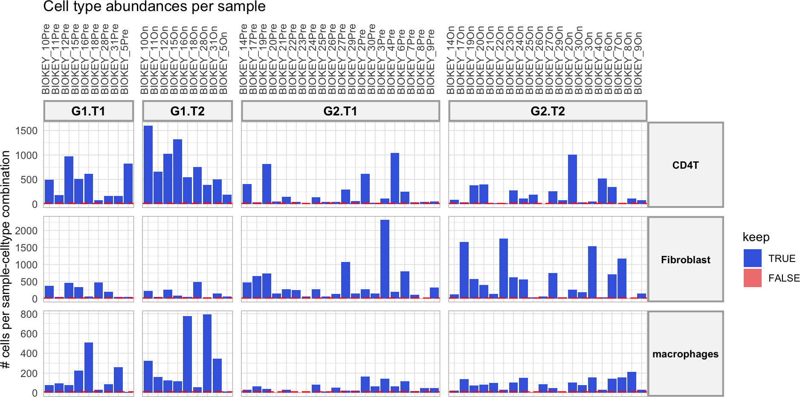

*Gene filtering: determine which genes are sufficiently expressed in each present cell type*


```r
frq_list = get_frac_exprs(
  sce = sce, 
  sample_id = sample_id, celltype_id =  celltype_id, group_id = group_id, 
  batches = batches, 
  min_cells = min_cells, 
  fraction_cutoff = fraction_cutoff, min_sample_prop = min_sample_prop)
## [1] "Samples are considered if they have more than 10 cells of the cell type of interest"
## [1] "Genes with non-zero counts in at least 5% of cells of a cell type of interest in a particular sample will be considered as expressed in that sample."
## [1] "Genes expressed in at least 4.5 samples will considered as expressed in the cell type: CD4T"
## [1] "Genes expressed in at least 4.5 samples will considered as expressed in the cell type: Fibroblast"
## [1] "Genes expressed in at least 4.5 samples will considered as expressed in the cell type: macrophages"
## [1] "8701 genes are considered as expressed in the cell type: CD4T"
## [1] "10255 genes are considered as expressed in the cell type: Fibroblast"
## [1] "9833 genes are considered as expressed in the cell type: macrophages"
```

Now only keep genes that are expressed by at least one cell type:


```r
genes_oi = frq_list$expressed_df %>% 
  filter(expressed == TRUE) %>% pull(gene) %>% unique() 
sce = sce[genes_oi, ]
```

*Pseudobulk expression calculation: determine and normalize per-sample pseudobulk expression levels for each expressed gene in each present cell type*


```r
abundance_expression_info = process_abundance_expression_info(
  sce = sce, 
  sample_id = sample_id, group_id = group_id, celltype_id = celltype_id, 
  min_cells = min_cells, 
  senders_oi = senders_oi, receivers_oi = receivers_oi, 
  lr_network = lr_network, 
  batches = batches, 
  frq_list = frq_list, 
  abundance_info = abundance_info)
```

*Differential expression (DE) analysis: determine which genes are differentially expressed*


```r
DE_info_group1 = get_DE_info(
  sce = sce, 
  sample_id = sample_id, group_id = group_id, celltype_id = celltype_id, 
  batches = batches, covariates = covariates, 
  contrasts_oi = contrasts_oi, 
  min_cells = min_cells, 
  expressed_df = frq_list$expressed_df)
## [1] "DE analysis is done:"
## [1] "included cell types are:"
## [1] "CD4T"        "Fibroblast"  "macrophages"
```

Check DE output information in table with logFC and p-values for each gene-celltype-contrast:


```r
DE_info_group1$celltype_de$de_output_tidy %>% head()
## # A tibble: 6 × 9
##   gene  cluster_id   logFC logCPM      F p_val p_adj.loc p_adj contrast   
##   <chr> <chr>        <dbl>  <dbl>  <dbl> <dbl>     <dbl> <dbl> <chr>      
## 1 A1BG  CD4T       -0.188    5.59 0.899  0.347         1     1 G1.T2-G1.T1
## 2 AAAS  CD4T       -0.0684   4.35 0.0979 0.818         1     1 G1.T2-G1.T1
## 3 AAGAB CD4T       -0.0582   5.01 0.118  0.733         1     1 G1.T2-G1.T1
## 4 AAK1  CD4T       -0.109    7.06 0.343  0.56          1     1 G1.T2-G1.T1
## 5 AAMDC CD4T        0.0708   3.73 0.0593 0.808         1     1 G1.T2-G1.T1
## 6 AAMP  CD4T       -0.158    5.82 1.07   0.306         1     1 G1.T2-G1.T1
```
Evaluate the distributions of p-values:


```r
DE_info_group1$hist_pvals
```

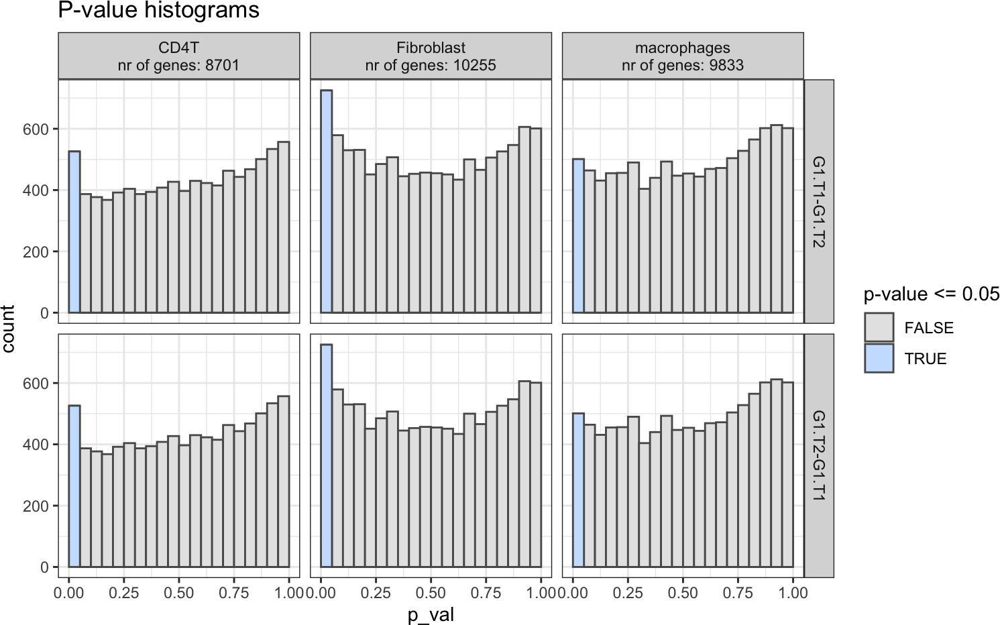

These distributions look fine (uniform distribution, except peak at p-value <= 0.05), so we will continue using these regular p-values. In case these p-value distributions look irregular, you can estimate empirical p-values as we will demonstrate in another vignette.


```r
empirical_pval = FALSE
```


```r
if(empirical_pval == TRUE){
  DE_info_emp = get_empirical_pvals(DE_info_group1$celltype_de$de_output_tidy)
  celltype_de_group1 = DE_info_emp$de_output_tidy_emp %>% select(-p_val, -p_adj) %>% 
    rename(p_val = p_emp, p_adj = p_adj_emp)
} else {
  celltype_de_group1 = DE_info_group1$celltype_de$de_output_tidy
} 
```

*Combine DE information for ligand-senders and receptors-receivers*


```r
sender_receiver_de = combine_sender_receiver_de(
  sender_de = celltype_de_group1,
  receiver_de = celltype_de_group1,
  senders_oi = senders_oi,
  receivers_oi = receivers_oi,
  lr_network = lr_network
)
```


```r
sender_receiver_de %>% head(20)
## # A tibble: 20 × 12
##    contrast    sender      receiver    ligand   receptor lfc_ligand lfc_receptor ligand_receptor_lfc_avg p_val_ligand p_adj_ligand p_val_receptor p_adj_receptor
##    <chr>       <chr>       <chr>       <chr>    <chr>         <dbl>        <dbl>                   <dbl>        <dbl>        <dbl>          <dbl>          <dbl>
##  1 G1.T2-G1.T1 Fibroblast  Fibroblast  SERPINE1 PLAUR          3.23      0.544                      1.89    0.000127        0.0651        0.23             0.895
##  2 G1.T2-G1.T1 Fibroblast  Fibroblast  CCN1     ITGA5          2.3       1.42                       1.86    0.0000031       0.0106        0.00438          0.375
##  3 G1.T1-G1.T2 macrophages macrophages COL1A1   ITGA9          2.12      1.35                       1.74    0.0133          0.814         0.0282           0.938
##  4 G1.T2-G1.T1 Fibroblast  CD4T        SERPINE1 ITGAV          3.23      0.221                      1.73    0.000127        0.0651        0.422            1    
##  5 G1.T2-G1.T1 Fibroblast  Fibroblast  SERPINE1 PLAU           3.23      0.204                      1.72    0.000127        0.0651        0.689            1    
##  6 G1.T2-G1.T1 Fibroblast  macrophages SERPINE1 ITGAV          3.23      0.168                      1.70    0.000127        0.0651        0.61             1    
##  7 G1.T2-G1.T1 Fibroblast  macrophages SERPINE1 LRP1           3.23      0.0928                     1.66    0.000127        0.0651        0.662            1    
##  8 G1.T2-G1.T1 Fibroblast  Fibroblast  ANGPTL4  ITGA5          1.86      1.42                       1.64    0.0384          0.664         0.00438          0.375
##  9 G1.T2-G1.T1 macrophages macrophages THBS1    SDC4           2.45      0.791                      1.62    0.0158          0.84          0.0499           0.968
## 10 G1.T1-G1.T2 Fibroblast  Fibroblast  PIP      CD4            2.93      0.307                      1.62    0.129           0.813         0.622            1    
## 11 G1.T2-G1.T1 Fibroblast  Fibroblast  SERPINE1 ITGAV          3.23      0.00231                    1.62    0.000127        0.0651        0.991            1    
## 12 G1.T2-G1.T1 Fibroblast  CD4T        VEGFA    FLT1           1.89      1.32                       1.60    0.018           0.583         0.00118          0.12 
## 13 G1.T2-G1.T1 Fibroblast  Fibroblast  SERPINE1 ITGB5          3.23     -0.0468                     1.59    0.000127        0.0651        0.9              1    
## 14 G1.T2-G1.T1 Fibroblast  macrophages SERPINE1 PLAUR          3.23     -0.0975                     1.57    0.000127        0.0651        0.809            1    
## 15 G1.T2-G1.T1 Fibroblast  Fibroblast  SERPINE1 PLAT           3.23     -0.109                      1.56    0.000127        0.0651        0.751            1    
## 16 G1.T2-G1.T1 Fibroblast  macrophages CCN1     SDC4           2.3       0.791                      1.55    0.0000031       0.0106        0.0499           0.968
## 17 G1.T2-G1.T1 Fibroblast  Fibroblast  SERPINE1 LRP1           3.23     -0.178                      1.53    0.000127        0.0651        0.411            0.97 
## 18 G1.T2-G1.T1 Fibroblast  macrophages CCN1     TLR2           2.3       0.739                      1.52    0.0000031       0.0106        0.00337          0.572
## 19 G1.T1-G1.T2 Fibroblast  CD4T        PIP      NPTN           2.93      0.0964                     1.51    0.129           0.813         0.713            1    
## 20 G1.T2-G1.T1 macrophages macrophages THBS1    CD47           2.45      0.559                      1.50    0.0158          0.84          0.0269           0.938
```

*Ligand activity prediction: use the DE analysis output to predict the activity of ligands in receiver cell types and infer their potential target genes*

We will first inspect the geneset_oi-vs-background ratios for the default tresholds:


```r
geneset_assessment = contrast_tbl$contrast %>% 
  lapply(
    process_geneset_data, 
    celltype_de_group1, logFC_threshold, p_val_adj, p_val_threshold
  ) %>% 
  bind_rows() 
geneset_assessment
## # A tibble: 6 × 12
##   cluster_id  n_background n_geneset_up n_geneset_down prop_geneset_up prop_geneset_down in_range_up in_range_down contrast    logFC_threshold p_val_threshold adjusted
##   <chr>              <int>        <int>          <int>           <dbl>             <dbl> <lgl>       <lgl>         <chr>                 <dbl>           <dbl> <lgl>   
## 1 CD4T                8701          206            162          0.0237            0.0186 TRUE        TRUE          G1.T2-G1.T1             0.5            0.05 FALSE   
## 2 Fibroblast         10255          265            267          0.0258            0.0260 TRUE        TRUE          G1.T2-G1.T1             0.5            0.05 FALSE   
## 3 macrophages         9833          253            196          0.0257            0.0199 TRUE        TRUE          G1.T2-G1.T1             0.5            0.05 FALSE   
## 4 CD4T                8701          162            206          0.0186            0.0237 TRUE        TRUE          G1.T1-G1.T2             0.5            0.05 FALSE   
## 5 Fibroblast         10255          267            265          0.0260            0.0258 TRUE        TRUE          G1.T1-G1.T2             0.5            0.05 FALSE   
## 6 macrophages         9833          196            253          0.0199            0.0257 TRUE        TRUE          G1.T1-G1.T2             0.5            0.05 FALSE
```

We can see here that for all cell type / contrast combinations, all geneset/background ratio's are within the recommended range (`in_range_up` and `in_range_down` columns). When these geneset/background ratio's would not be within the recommended ranges, we should interpret ligand activity results for these cell types with more caution, or use different thresholds (for these or all cell types). 


```r
ligand_activities_targets_DEgenes = suppressMessages(suppressWarnings(
  get_ligand_activities_targets_DEgenes(
    receiver_de = celltype_de_group1,
    receivers_oi = intersect(receivers_oi, celltype_de_group1$cluster_id %>% unique()),
    ligand_target_matrix = ligand_target_matrix,
    logFC_threshold = logFC_threshold,
    p_val_threshold = p_val_threshold,
    p_val_adj = p_val_adj,
    top_n_target = top_n_target,
    verbose = TRUE, 
    n.cores = n.cores
  )
))
```

*Prioritization: rank cell-cell communication patterns through multi-criteria prioritization*


```r
sender_receiver_tbl = sender_receiver_de %>% distinct(sender, receiver)

metadata_combined = SummarizedExperiment::colData(sce) %>% tibble::as_tibble()

if(!is.na(batches)){
  grouping_tbl = metadata_combined[,c(sample_id, group_id, batches)] %>% 
    tibble::as_tibble() %>% distinct()
  colnames(grouping_tbl) = c("sample","group",batches)
} else {
  grouping_tbl = metadata_combined[,c(sample_id, group_id)] %>% 
    tibble::as_tibble() %>% distinct()
  colnames(grouping_tbl) = c("sample","group")
}

prioritization_tables = suppressMessages(generate_prioritization_tables(
    sender_receiver_info = abundance_expression_info$sender_receiver_info,
    sender_receiver_de = sender_receiver_de,
    ligand_activities_targets_DEgenes = ligand_activities_targets_DEgenes,
    contrast_tbl = contrast_tbl,
    sender_receiver_tbl = sender_receiver_tbl,
    grouping_tbl = grouping_tbl,
    scenario = "regular", # all prioritization criteria will be weighted equally
    fraction_cutoff = fraction_cutoff, 
    abundance_data_receiver = abundance_expression_info$abundance_data_receiver,
    abundance_data_sender = abundance_expression_info$abundance_data_sender,
    ligand_activity_down = ligand_activity_down
  ))
```

*Compile the MultiNicheNet output object*


```r
multinichenet_output_group1_t2vst1 = list(
    celltype_info = abundance_expression_info$celltype_info,
    celltype_de = celltype_de_group1,
    sender_receiver_info = abundance_expression_info$sender_receiver_info,
    sender_receiver_de =  sender_receiver_de,
    ligand_activities_targets_DEgenes = ligand_activities_targets_DEgenes,
    prioritization_tables = prioritization_tables,
    grouping_tbl = grouping_tbl,
    lr_target_prior_cor = tibble()
  ) 
multinichenet_output_group1_t2vst1 = make_lite_output(multinichenet_output_group1_t2vst1)
```


### Interpret the analysis

*Summarizing ChordDiagram circos plots*

In a first instance, we will look at the broad overview of prioritized interactions via condition-specific Chordiagram circos plots.

We will look here at the top 50 predictions across all contrasts, senders, and receivers of interest.


```r
prioritized_tbl_oi_all = get_top_n_lr_pairs(
  multinichenet_output_group1_t2vst1$prioritization_tables, 
  top_n = 50, 
  rank_per_group = FALSE
  )
```


```r
prioritized_tbl_oi = 
  multinichenet_output_group1_t2vst1$prioritization_tables$group_prioritization_tbl %>%
  filter(id %in% prioritized_tbl_oi_all$id) %>%
  distinct(id, sender, receiver, ligand, receptor, group) %>% 
  left_join(prioritized_tbl_oi_all)
prioritized_tbl_oi$prioritization_score[is.na(prioritized_tbl_oi$prioritization_score)] = 0

senders_receivers = union(prioritized_tbl_oi$sender %>% unique(), prioritized_tbl_oi$receiver %>% unique()) %>% sort()

colors_sender = RColorBrewer::brewer.pal(n = length(senders_receivers), name = 'Spectral') %>% magrittr::set_names(senders_receivers)
colors_receiver = RColorBrewer::brewer.pal(n = length(senders_receivers), name = 'Spectral') %>% magrittr::set_names(senders_receivers)

circos_list = make_circos_group_comparison(prioritized_tbl_oi, colors_sender, colors_receiver)
```

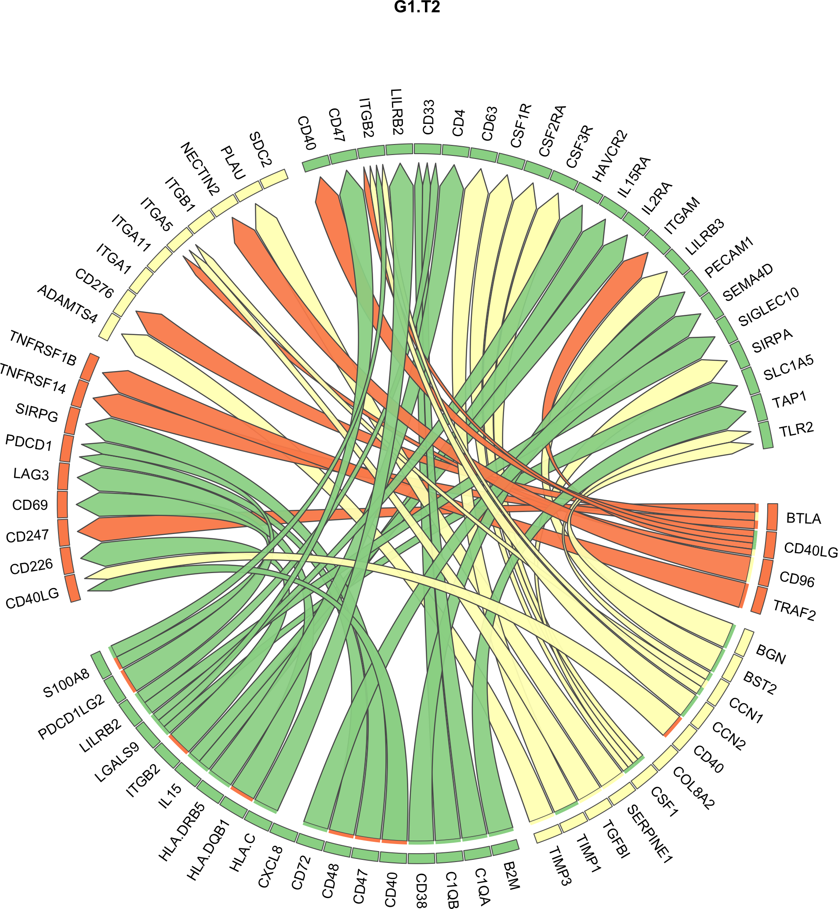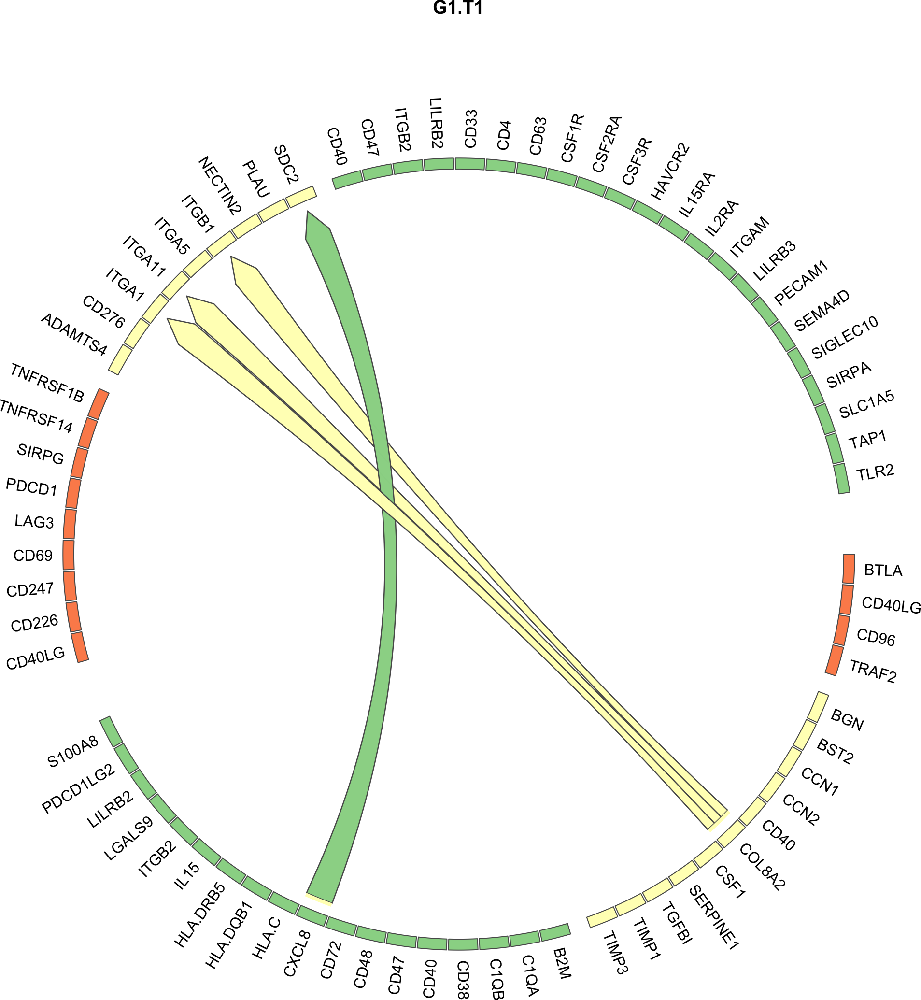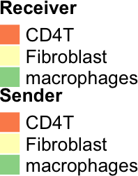

We observe more interactions that increase during therapy ("G1.T2" condition) compared to interactions that decrease ("G1.T1" condition)

*Interpretable bubble plots*

Whereas these ChordDiagrams show the most specific interactions per group, they don't give insights into the data behind these predictions. Therefore we will now look at visualizations that indicate the different prioritization criteria used in MultiNicheNet. 

In the next type of plots, we will 1) visualize the per-sample scaled product of normalized ligand and receptor pseudobulk expression, 2) visualize the scaled ligand activities, and 3) cell-type specificity. 

We will now check the top interactions specific for the OnE group (G1.T2) - so these are the interactions that increase during anti-PD1 therapy.


```r
group_oi = "G1.T2"
```


```r
prioritized_tbl_oi_50 = get_top_n_lr_pairs(
  multinichenet_output_group1_t2vst1$prioritization_tables, 
  top_n = 50, rank_per_group = FALSE) %>% filter(group == group_oi)
```


```r
prioritized_tbl_oi_50_omnipath = prioritized_tbl_oi_50 %>% 
  inner_join(lr_network_all)
```

Now we add this to the bubble plot visualization:

```r
plot_oi = make_sample_lr_prod_activity_plots_Omnipath(
  multinichenet_output_group1_t2vst1$prioritization_tables, 
  prioritized_tbl_oi_50_omnipath)
plot_oi
```

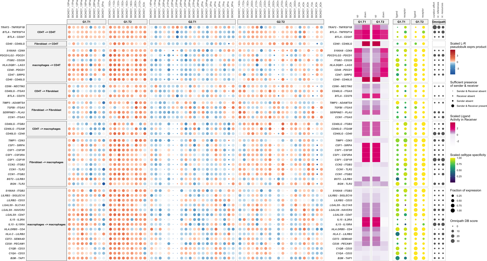
Interestingly, we can already see that some of these interactions are only increasing in the E group, whereas others change in the NE group as well!

In practice, we always recommend generating these plots for all conditions/contrasts. To avoid that this vignette becomes too long, we will not do this here. 

Now let's do the same analysis for the NE group instead

## 2) G2.T2-G2.T1: Anti-PD1 therapy associated cell-cell communication changes in patients without clonotype expansion (NE)

*Set the required contrast of interest.*

Here, we want to compare on-treatment samples with pre-treatment samples for group NE. Therefore we can set this contrast as:


```r
contrasts_oi = c("'G2.T2-G2.T1','G2.T1-G2.T2'") 
```


```r
contrast_tbl = tibble(
  contrast = c("G2.T2-G2.T1", "G2.T1-G2.T2"), 
  group = c("G2.T2","G2.T1")
  )
```

### Run the analysis

In this case, the first 3 steps (cell-type filtering, gene filtering, and pseudobulk expression calculation) were run for the entire dataset and are exactly the same now as for the first MultiNicheNet analysis. Therefore, we will not redo these steps, and just start with step 4, the first unique step for this second analysis.

*Differential expression (DE) analysis: determine which genes are differentially expressed*


```r
DE_info_group2 = get_DE_info(
  sce = sce, 
  sample_id = sample_id, group_id = group_id, celltype_id = celltype_id, 
  batches = batches, covariates = covariates, 
  contrasts_oi = contrasts_oi, 
  min_cells = min_cells, 
  expressed_df = frq_list$expressed_df)
## [1] "DE analysis is done:"
## [1] "included cell types are:"
## [1] "CD4T"        "Fibroblast"  "macrophages"
```
Check DE output information in table with logFC and p-values for each gene-celltype-contrast:


```r
DE_info_group2$celltype_de$de_output_tidy %>% head()
## # A tibble: 6 × 9
##   gene  cluster_id   logFC logCPM      F p_val p_adj.loc p_adj contrast   
##   <chr> <chr>        <dbl>  <dbl>  <dbl> <dbl>     <dbl> <dbl> <chr>      
## 1 A1BG  CD4T        0.0208   5.59 0.0162 0.899     1     1     G2.T2-G2.T1
## 2 AAAS  CD4T        0.0546   4.35 0.075  0.785     1     1     G2.T2-G2.T1
## 3 AAGAB CD4T        0.02     5.01 0.0177 0.895     1     1     G2.T2-G2.T1
## 4 AAK1  CD4T        0.0902   7.06 0.397  0.531     0.93  0.93  G2.T2-G2.T1
## 5 AAMDC CD4T        0.027    3.73 0.0104 0.919     1     1     G2.T2-G2.T1
## 6 AAMP  CD4T       -0.172    5.82 1.77   0.189     0.695 0.695 G2.T2-G2.T1
```
Evaluate the distributions of p-values:


```r
DE_info_group2$hist_pvals
```

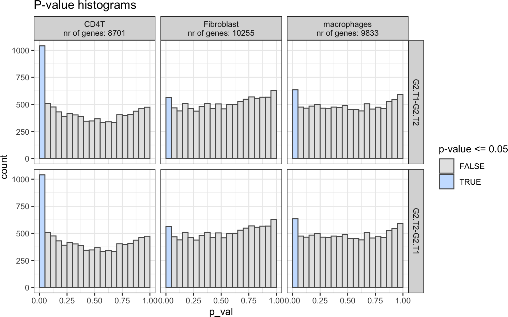

These distributions look fine (uniform distribution, except peak at p-value <= 0.05), so we will continue using these regular p-values. In case these p-value distributions look irregular, you can estimate empirical p-values as we will demonstrate in another vignette.


```r
empirical_pval = FALSE
```


```r
if(empirical_pval == TRUE){
  DE_info_emp = get_empirical_pvals(DE_info_group2$celltype_de$de_output_tidy)
  celltype_de_group2 = DE_info_emp$de_output_tidy_emp %>% select(-p_val, -p_adj) %>% 
    rename(p_val = p_emp, p_adj = p_adj_emp)
} else {
  celltype_de_group2 = DE_info_group2$celltype_de$de_output_tidy
} 
```

*Combine DE information for ligand-senders and receptors-receivers*


```r
sender_receiver_de = combine_sender_receiver_de(
  sender_de = celltype_de_group2,
  receiver_de = celltype_de_group2,
  senders_oi = senders_oi,
  receivers_oi = receivers_oi,
  lr_network = lr_network
)
```


```r
sender_receiver_de %>% head(20)
## # A tibble: 20 × 12
##    contrast    sender      receiver    ligand receptor lfc_ligand lfc_receptor ligand_receptor_lfc_avg p_val_ligand p_adj_ligand p_val_receptor p_adj_receptor
##    <chr>       <chr>       <chr>       <chr>  <chr>         <dbl>        <dbl>                   <dbl>        <dbl>        <dbl>          <dbl>          <dbl>
##  1 G2.T2-G2.T1 macrophages macrophages THBS1  CD36           2.78       1.18                      1.98    0.000171       0.0386          0.0186          0.589
##  2 G2.T2-G2.T1 CD4T        CD4T        CCL4L2 CCR1           3.56       0.268                     1.91    0.0000338      0.00331         0.705           0.995
##  3 G2.T2-G2.T1 CD4T        CD4T        CCL3   CCR4           3.31       0.437                     1.87    0.000739       0.033           0.0466          0.406
##  4 G2.T2-G2.T1 CD4T        macrophages CCL4L2 CCR5           3.56       0.151                     1.86    0.0000338      0.00331         0.695           1    
##  5 G2.T2-G2.T1 CD4T        macrophages CCL4L2 CCR1           3.56       0.0782                    1.82    0.0000338      0.00331         0.695           1    
##  6 G2.T2-G2.T1 CD4T        CD4T        CCL3   CCR1           3.31       0.268                     1.79    0.000739       0.033           0.705           0.995
##  7 G2.T2-G2.T1 CD4T        macrophages CCL3   CCR5           3.31       0.151                     1.73    0.000739       0.033           0.695           1    
##  8 G2.T2-G2.T1 macrophages macrophages THBS1  SDC4           2.78       0.611                     1.70    0.000171       0.0386          0.124           0.911
##  9 G2.T2-G2.T1 CD4T        macrophages CCL3   CCR1           3.31       0.0782                    1.69    0.000739       0.033           0.695           1    
## 10 G2.T2-G2.T1 Fibroblast  Fibroblast  PRG4   TLR4           2.96       0.418                     1.69    0.0017         0.176           0.147           1    
## 11 G2.T2-G2.T1 CD4T        CD4T        CCL4L2 CCR5           3.56      -0.232                     1.66    0.0000338      0.00331         0.54            0.934
## 12 G2.T2-G2.T1 Fibroblast  macrophages PRG4   TLR2           2.96       0.335                     1.65    0.0017         0.176           0.0668          0.839
## 13 G2.T2-G2.T1 macrophages Fibroblast  THBS1  CD36           2.78       0.495                     1.64    0.000171       0.0386          0.302           1    
## 14 G2.T2-G2.T1 macrophages CD4T        THBS1  SDC4           2.78       0.487                     1.63    0.000171       0.0386          0.235           0.75 
## 15 G2.T2-G2.T1 Fibroblast  CD4T        PRG4   CD44           2.96       0.299                     1.63    0.0017         0.176           0.0133          0.211
## 16 G2.T2-G2.T1 macrophages macrophages THBS1  CD47           2.78       0.379                     1.58    0.000171       0.0386          0.054           0.793
## 17 G2.T1-G2.T2 CD4T        Fibroblast  CXCL14 CXCR4          2.53       0.573                     1.55    0.000151       0.0106          0.232           1    
## 18 G2.T2-G2.T1 CD4T        CD4T        CCL3   CCR5           3.31      -0.232                     1.54    0.000739       0.033           0.54            0.934
## 19 G2.T2-G2.T1 Fibroblast  Fibroblast  PRG4   CD44           2.96       0.103                     1.53    0.0017         0.176           0.639           1    
## 20 G2.T2-G2.T1 macrophages macrophages THBS1  ITGA6          2.78       0.226                     1.50    0.000171       0.0386          0.511           1
```

*Ligand activity prediction: use the DE analysis output to predict the activity of ligands in receiver cell types and infer their potential target genes*

We will first inspect the geneset_oi-vs-background ratios for the default tresholds:


```r
geneset_assessment = contrast_tbl$contrast %>% 
  lapply(
    process_geneset_data, 
    celltype_de_group2, logFC_threshold, p_val_adj, p_val_threshold
  ) %>% 
  bind_rows() 
geneset_assessment
## # A tibble: 6 × 12
##   cluster_id  n_background n_geneset_up n_geneset_down prop_geneset_up prop_geneset_down in_range_up in_range_down contrast    logFC_threshold p_val_threshold adjusted
##   <chr>              <int>        <int>          <int>           <dbl>             <dbl> <lgl>       <lgl>         <chr>                 <dbl>           <dbl> <lgl>   
## 1 CD4T                8701          309            232         0.0355            0.0267  TRUE        TRUE          G2.T2-G2.T1             0.5            0.05 FALSE   
## 2 Fibroblast         10255          183             75         0.0178            0.00731 TRUE        TRUE          G2.T2-G2.T1             0.5            0.05 FALSE   
## 3 macrophages         9833          243            185         0.0247            0.0188  TRUE        TRUE          G2.T2-G2.T1             0.5            0.05 FALSE   
## 4 CD4T                8701          232            309         0.0267            0.0355  TRUE        TRUE          G2.T1-G2.T2             0.5            0.05 FALSE   
## 5 Fibroblast         10255           75            183         0.00731           0.0178  TRUE        TRUE          G2.T1-G2.T2             0.5            0.05 FALSE   
## 6 macrophages         9833          185            243         0.0188            0.0247  TRUE        TRUE          G2.T1-G2.T2             0.5            0.05 FALSE
```

We can see here that for all cell type / contrast combinations, all geneset/background ratio's are within the recommended range (`in_range_up` and `in_range_down` columns). When these geneset/background ratio's would not be within the recommended ranges, we should interpret ligand activity results for these cell types with more caution, or use different thresholds (for these or all cell types). 


```r
ligand_activities_targets_DEgenes = suppressMessages(suppressWarnings(
  get_ligand_activities_targets_DEgenes(
    receiver_de = celltype_de_group2,
    receivers_oi = intersect(receivers_oi, celltype_de_group2$cluster_id %>% unique()),
    ligand_target_matrix = ligand_target_matrix,
    logFC_threshold = logFC_threshold,
    p_val_threshold = p_val_threshold,
    p_val_adj = p_val_adj,
    top_n_target = top_n_target,
    verbose = TRUE, 
    n.cores = n.cores
  )
))
```

*Prioritization: rank cell-cell communication patterns through multi-criteria prioritization*


```r
sender_receiver_tbl = sender_receiver_de %>% distinct(sender, receiver)

metadata_combined = SummarizedExperiment::colData(sce) %>% tibble::as_tibble()

if(!is.na(batches)){
  grouping_tbl = metadata_combined[,c(sample_id, group_id, batches)] %>% 
    tibble::as_tibble() %>% distinct()
  colnames(grouping_tbl) = c("sample","group",batches)
} else {
  grouping_tbl = metadata_combined[,c(sample_id, group_id)] %>% 
    tibble::as_tibble() %>% distinct()
  colnames(grouping_tbl) = c("sample","group")
}

prioritization_tables = suppressMessages(generate_prioritization_tables(
    sender_receiver_info = abundance_expression_info$sender_receiver_info,
    sender_receiver_de = sender_receiver_de,
    ligand_activities_targets_DEgenes = ligand_activities_targets_DEgenes,
    contrast_tbl = contrast_tbl,
    sender_receiver_tbl = sender_receiver_tbl,
    grouping_tbl = grouping_tbl,
    scenario = "regular", # all prioritization criteria will be weighted equally
    fraction_cutoff = fraction_cutoff, 
    abundance_data_receiver = abundance_expression_info$abundance_data_receiver,
    abundance_data_sender = abundance_expression_info$abundance_data_sender,
    ligand_activity_down = ligand_activity_down
  ))
```

*Compile the MultiNicheNet output object*


```r
multinichenet_output_group2_t2vst1 = list(
    celltype_info = abundance_expression_info$celltype_info,
    celltype_de = celltype_de_group2,
    sender_receiver_info = abundance_expression_info$sender_receiver_info,
    sender_receiver_de =  sender_receiver_de,
    ligand_activities_targets_DEgenes = ligand_activities_targets_DEgenes,
    prioritization_tables = prioritization_tables,
    grouping_tbl = grouping_tbl,
    lr_target_prior_cor = tibble()
  ) 
multinichenet_output_group2_t2vst1 = make_lite_output(multinichenet_output_group2_t2vst1)
```

### Interpret the analysis

*Summarizing ChordDiagram circos plots*

We will look here at the top 50 predictions across all contrasts, senders, and receivers of interest.


```r
prioritized_tbl_oi_all = get_top_n_lr_pairs(
  multinichenet_output_group2_t2vst1$prioritization_tables, 
  top_n = 50, 
  rank_per_group = FALSE
  )
```


```r
prioritized_tbl_oi = 
  multinichenet_output_group2_t2vst1$prioritization_tables$group_prioritization_tbl %>%
  filter(id %in% prioritized_tbl_oi_all$id) %>%
  distinct(id, sender, receiver, ligand, receptor, group) %>% 
  left_join(prioritized_tbl_oi_all)
prioritized_tbl_oi$prioritization_score[is.na(prioritized_tbl_oi$prioritization_score)] = 0

senders_receivers = union(prioritized_tbl_oi$sender %>% unique(), prioritized_tbl_oi$receiver %>% unique()) %>% sort()

colors_sender = RColorBrewer::brewer.pal(n = length(senders_receivers), name = 'Spectral') %>% magrittr::set_names(senders_receivers)
colors_receiver = RColorBrewer::brewer.pal(n = length(senders_receivers), name = 'Spectral') %>% magrittr::set_names(senders_receivers)

circos_list = make_circos_group_comparison(prioritized_tbl_oi, colors_sender, colors_receiver)
```

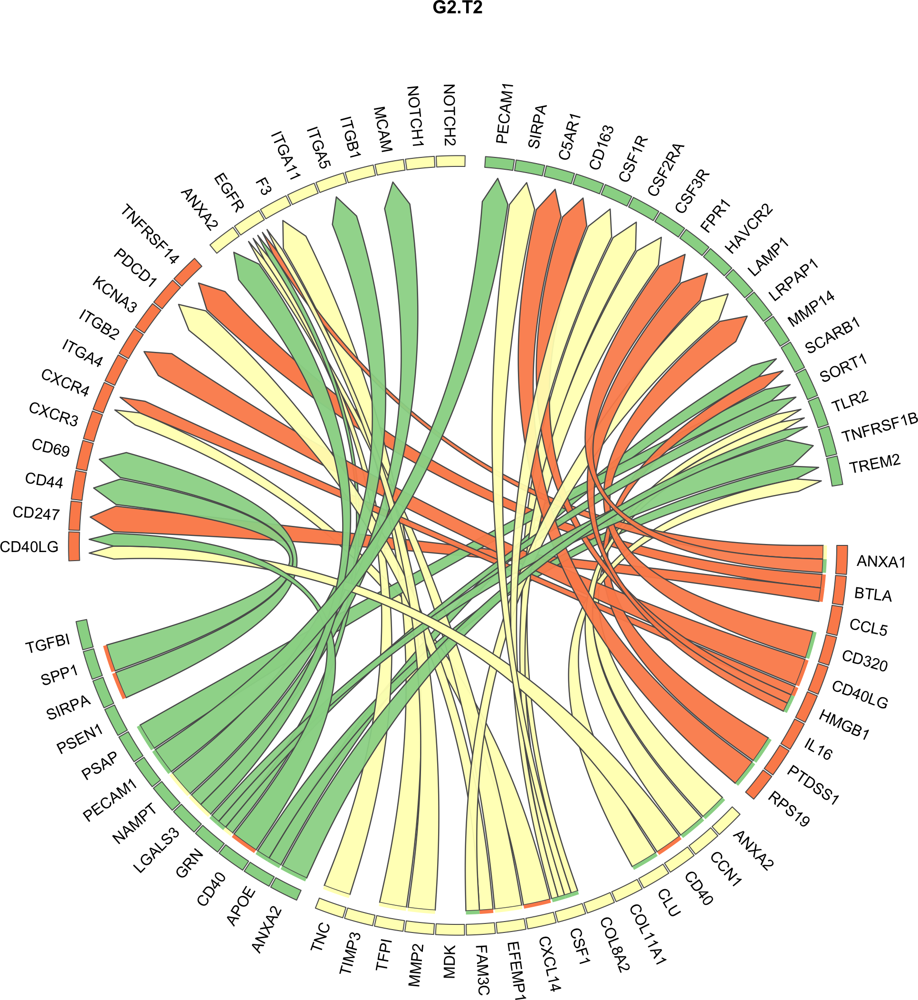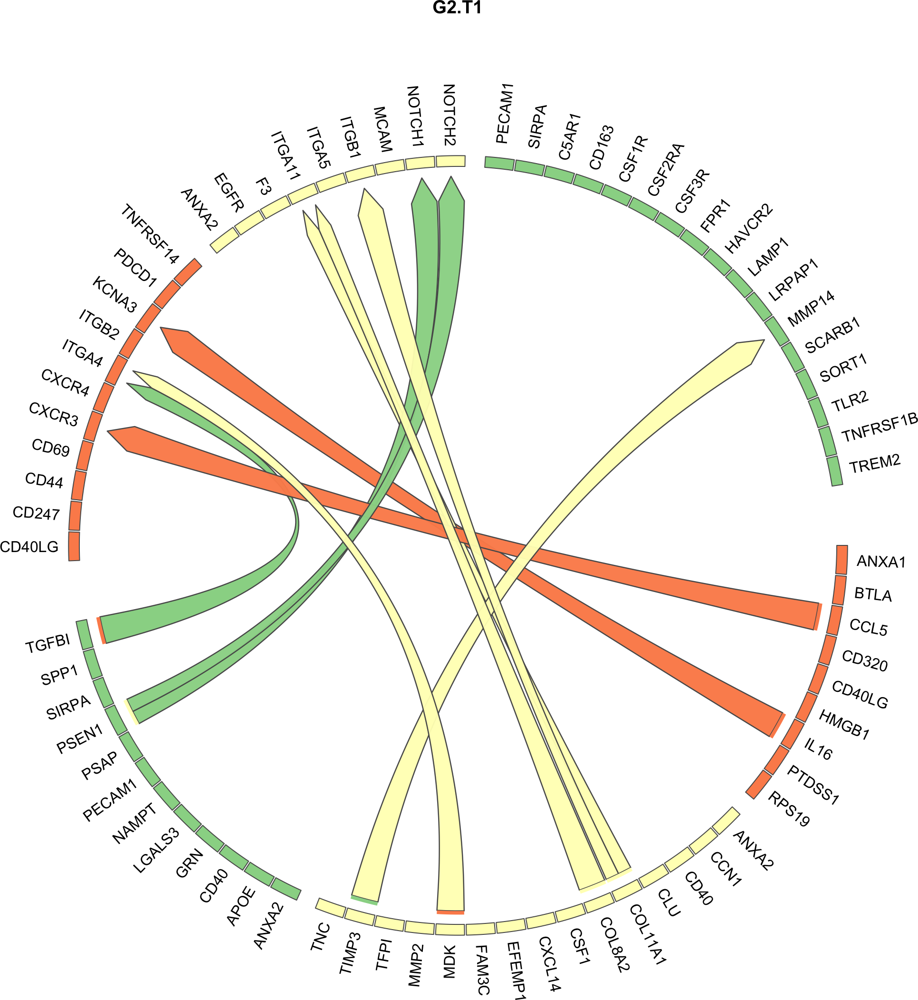

Also in this group of patients we see rather an increase on therapy compared to pre-therapy.

*Interpretable bubble plots*

We will now check the top interactions specific for the OnE group - so these are the interactions that increase during anti-PD1 therapy.


```r
group_oi = "G2.T2"
```


```r
prioritized_tbl_oi_50 = get_top_n_lr_pairs(
  multinichenet_output_group2_t2vst1$prioritization_tables, 
  top_n = 50, rank_per_group = FALSE) %>% filter(group == group_oi)
```


```r
prioritized_tbl_oi_50_omnipath = prioritized_tbl_oi_50 %>% 
  inner_join(lr_network_all)
```

Now we add this to the bubble plot visualization:

```r
plot_oi = make_sample_lr_prod_activity_plots_Omnipath(
  multinichenet_output_group2_t2vst1$prioritization_tables, 
  prioritized_tbl_oi_50_omnipath)
plot_oi
```

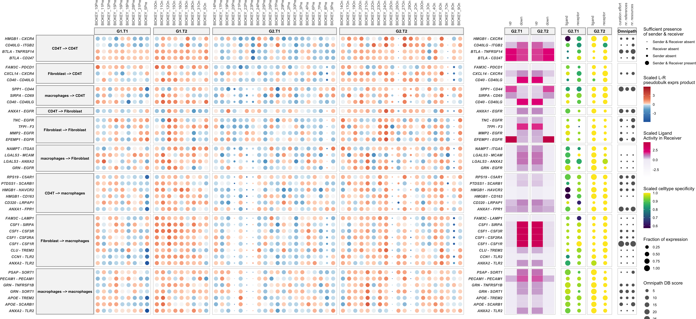

So interesting observation: even though the NE group is characterized by a lack of T cell clonotype expansion after therapy, there are still clear therapy-induced differences on gene expression and cell-cell communication.

Interestingly, we can see here as well that some interactions are only increasing in the NE group, whereas others change in the E group as well!

This brings us to the next research question: do some interactions increase/decrease more in the E group vs the NE group or vice versa? 

## 3A) E-vs-NE: simple comparison of prioritized anti-PD1 therapy-associated CCC patterns

To address this question, we will first do a simple analysis. We will just compare the prioritization scores between the E and the NE group, to find CCC patterns that are most different between the E and NE group.

*Set up the comparisons*


```r
comparison_table = multinichenet_output_group1_t2vst1$prioritization_tables$group_prioritization_tbl %>% 
  select(group, id, prioritization_score) %>% 
  rename(prioritization_score_group1 = prioritization_score) %>% 
  mutate(group = case_when(
    group == "G1.T1" ~ "timepoint1",
    group == "G1.T2" ~ "timepoint2",
    TRUE ~ group)
    ) %>% 
  inner_join(
    multinichenet_output_group2_t2vst1$prioritization_tables$group_prioritization_tbl %>% 
      select(group, id, prioritization_score) %>% 
      rename(prioritization_score_group2 = prioritization_score) %>% 
  mutate(group = case_when(
    group == "G2.T1" ~ "timepoint1",
    group == "G2.T2" ~ "timepoint2",
    TRUE ~ group)
    )
  ) %>%  
  mutate(difference_group1_vs_group2 = prioritization_score_group1 - prioritization_score_group2) 
```

Let's now inspect some of the top interactions that got much higher scores in the E group


```r
comparison_table %>% 
  arrange(-difference_group1_vs_group2) %>% 
  filter(prioritization_score_group1 > 0.80)
## # A tibble: 852 × 5
##    group      id                                        prioritization_score_group1 prioritization_score_group2 difference_group1_vs_group2
##    <chr>      <chr>                                                           <dbl>                       <dbl>                       <dbl>
##  1 timepoint2 CCL5_CCR1_Fibroblast_macrophages                                0.844                       0.375                       0.468
##  2 timepoint2 BST2_LILRA5_Fibroblast_macrophages                              0.830                       0.365                       0.465
##  3 timepoint2 CDH2_CDH2_Fibroblast_Fibroblast                                 0.806                       0.351                       0.455
##  4 timepoint2 CCL2_CCR2_Fibroblast_macrophages                                0.838                       0.397                       0.441
##  5 timepoint2 CCL5_SDC4_Fibroblast_macrophages                                0.853                       0.425                       0.427
##  6 timepoint2 CCL5_CCR5_Fibroblast_macrophages                                0.800                       0.374                       0.426
##  7 timepoint2 BST2_LILRB3_Fibroblast_macrophages                              0.924                       0.513                       0.411
##  8 timepoint2 TNFSF10_TNFRSF10B_macrophages_Fibroblast                        0.856                       0.447                       0.409
##  9 timepoint2 TNFSF10_TNFRSF10B_Fibroblast_Fibroblast                         0.830                       0.446                       0.384
## 10 timepoint2 TNFSF10_TNFRSF10B_macrophages_macrophages                       0.871                       0.509                       0.361
## # ℹ 842 more rows
```

Let's now inspect some of the top interactions that got much higher scores in the NE group


```r
comparison_table %>% 
  arrange(difference_group1_vs_group2) %>% 
  filter(prioritization_score_group2 > 0.80)
## # A tibble: 574 × 5
##    group      id                                   prioritization_score_group1 prioritization_score_group2 difference_group1_vs_group2
##    <chr>      <chr>                                                      <dbl>                       <dbl>                       <dbl>
##  1 timepoint2 IGF2_ITGA6_Fibroblast_macrophages                          0.366                       0.800                      -0.434
##  2 timepoint1 TIMP3_ADAM17_Fibroblast_macrophages                        0.518                       0.868                      -0.350
##  3 timepoint2 LAMB1_ITGA6_Fibroblast_macrophages                         0.471                       0.820                      -0.348
##  4 timepoint2 ANXA1_EGFR_CD4T_Fibroblast                                 0.583                       0.891                      -0.308
##  5 timepoint2 CCN1_ITGA6_Fibroblast_macrophages                          0.520                       0.818                      -0.298
##  6 timepoint2 PI16_TNFRSF21_Fibroblast_macrophages                       0.520                       0.814                      -0.294
##  7 timepoint2 MELTF_TFRC_macrophages_macrophages                         0.523                       0.815                      -0.292
##  8 timepoint2 IL2_IL2RG_CD4T_CD4T                                        0.550                       0.831                      -0.281
##  9 timepoint2 IL2_CD53_CD4T_CD4T                                         0.573                       0.853                      -0.280
## 10 timepoint1 LILRB2_CD33_macrophages_macrophages                        0.591                       0.864                      -0.273
## # ℹ 564 more rows
```

### Interactions increasing after therapy in the E group
Visualize now interactions that are in the top250 interactions for the contrast On-vs-Pre in the E group.

*E-group specific*

Of these, we will first zoom into the top25 interactions with biggest difference in the E-vs-NE group. 


```r
group_oi = "G1.T2"
```


```r
prioritized_tbl_oi_250 = get_top_n_lr_pairs(
  multinichenet_output_group1_t2vst1$prioritization_tables, 
  top_n = 250, rank_per_group = FALSE) %>% 
  filter(group == group_oi) %>% 
  inner_join(lr_network_all)
```


```r
ids_group1_vs_group2 = comparison_table %>% filter(group == "timepoint2" & id %in% prioritized_tbl_oi_250$id) %>% top_n(25, difference_group1_vs_group2) %>% filter(difference_group1_vs_group2 > 0) %>% pull(id)
```


```r
prioritized_tbl_oi_250_unique_E = prioritized_tbl_oi_250 %>% 
  filter(id %in% ids_group1_vs_group2)
```


```r
plot_oi = make_sample_lr_prod_activity_plots_Omnipath(
  multinichenet_output_group1_t2vst1$prioritization_tables, 
  prioritized_tbl_oi_250_unique_E)
plot_oi
```

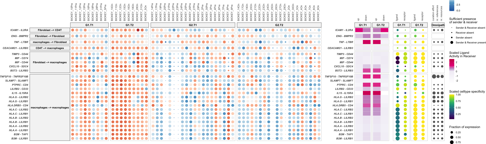

*shared between E-group and NE-group*

Now we will look at the interactions with a very similar score between E and NE. So these interactions are interactions that increase after therapy, but shared between group E and NE.


```r
ids_E_shared_NE = comparison_table %>% filter(group == "timepoint2" & id %in% prioritized_tbl_oi_250$id)  %>% mutate(deviation_from_0 = abs(0-difference_group1_vs_group2)) %>% top_n(25, -deviation_from_0) %>% arrange(deviation_from_0) %>% pull(id)
```


```r
prioritized_tbl_oi_250_shared_E_NE = prioritized_tbl_oi_250 %>% 
  filter(id %in% ids_E_shared_NE)
```


```r
plot_oi = make_sample_lr_prod_activity_plots_Omnipath(
  multinichenet_output_group1_t2vst1$prioritization_tables, 
  prioritized_tbl_oi_250_shared_E_NE)
plot_oi
```

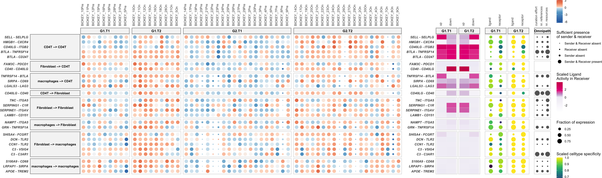

### Interactions decreasing after therapy in the E group
Visualize now interactions that are in the top250 interactions for the contrast On-vs-Pre in the E group. We will focus on decreasing interactions here.

*E-group specific*

Of these, we will first zoom into the top10 interactions with biggest difference in the E-vs-NE group. 


```r
group_oi = "G1.T1"
```


```r
prioritized_tbl_oi_250 = get_top_n_lr_pairs(
  multinichenet_output_group1_t2vst1$prioritization_tables, 
  top_n = 250, rank_per_group = FALSE) %>% 
  filter(group == group_oi) %>% 
  inner_join(lr_network_all)
```


```r
ids_group1_vs_group2 = comparison_table %>% filter(group == "timepoint1" & id %in% prioritized_tbl_oi_250$id) %>% top_n(10, difference_group1_vs_group2) %>% filter(difference_group1_vs_group2 > 0) %>% pull(id)
```


```r
prioritized_tbl_oi_250_unique_E = prioritized_tbl_oi_250 %>% 
  filter(id %in% ids_group1_vs_group2)
```


```r
plot_oi = make_sample_lr_prod_activity_plots_Omnipath(
  multinichenet_output_group1_t2vst1$prioritization_tables, 
  prioritized_tbl_oi_250_unique_E)
plot_oi
```

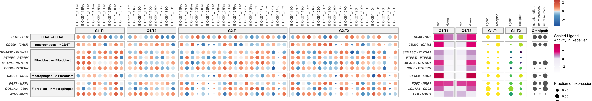

*shared between E-group and NE-group*

Now we will look at the interactions with a very similar score between E and NE. So these interactions are interactions that decrease after therapy, but shared between group E and NE.


```r
ids_E_shared_NE = comparison_table %>% filter(group == "timepoint1" & id %in% prioritized_tbl_oi_250$id) %>% mutate(deviation_from_0 = abs(0-difference_group1_vs_group2)) %>% top_n(10, -deviation_from_0) %>% arrange(deviation_from_0) %>% pull(id)
```


```r
prioritized_tbl_oi_250_shared_E_NE = prioritized_tbl_oi_250 %>% 
  filter(id %in% ids_E_shared_NE)
```


```r
plot_oi = make_sample_lr_prod_activity_plots_Omnipath(
  multinichenet_output_group1_t2vst1$prioritization_tables, 
  prioritized_tbl_oi_250_shared_E_NE)
plot_oi
```

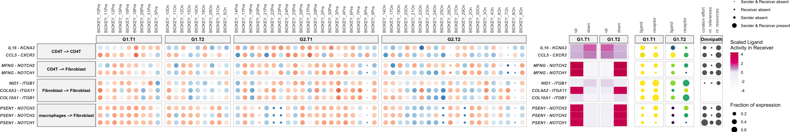

### Interactions increasing after therapy in the NE group
Visualize now interactions that are in the top250 interactions for the contrast On-vs-Pre in the E group.

To avoid making this vignette too long, we will not explicitly show this for the NE group since the code is the same as for the E group, you only need to change the `group_oi` to  `"G2.T2"`.

### Conclusions of these comparisons

Whereas these comparisons are quite intuitive, they are also relatively arbitrary (requiring cutoffs to compare interactions) and suboptimal. They are suboptimal because the prioritization scores of interactions are relative versus the other interactions within a group. If there is a difference in __effect size__ of the therapy-induced changes in CCC, comparing the final prioritization scores may not be optimal.

Therefore, we will now discuss another way to infer group-specific therapy-associated CCC patterns: namely setting up complex multifactorial contrasts in the DE analysis of a MultiNicheNet analysis.

## 3B) E-vs-NE: MultiNicheNet analysis with complex contrast setting: (G1.T2-G1.T1)-(G2.T2-G2.T1)

*Set the required contrasts*

For this analysis, we want to compare how cell-cell communication changes On-vs-Pre anti-PD1 therapy are different between responder/expander patients vs non-responder/expander patients. In other words, we want to study how both patient groups react differently to the therapy. 

To perform this comparison, we need to set the following contrasts:


```r
contrasts_oi = c("'(G1.T2-G1.T1)-(G2.T2-G2.T1)','(G2.T2-G2.T1)-(G1.T2-G1.T1)','(G1.T1-G1.T2)-(G2.T1-G2.T2)','(G2.T1-G2.T2)-(G1.T1-G1.T2)'")
contrast_tbl = tibble(contrast =
                        c("(G1.T2-G1.T1)-(G2.T2-G2.T1)", 
                          "(G2.T2-G2.T1)-(G1.T2-G1.T1)", 
                          "(G1.T1-G1.T2)-(G2.T1-G2.T2)", 
                          "(G2.T1-G2.T2)-(G1.T1-G1.T2)"),
                      group = c("G1.T2","G2.T2","G1.T1","G2.T1")) 
```

To understand this, let's take a look at the first contrasts of interest: `(G1.T2-G1.T1)-(G2.T2-G2.T1)`. As you can see, the first part of the expression: `(G1.T2-G1.T1)` will cover differences on-vs-pre therapy in group1, the second part `(G2.T2-G2.T1)` in the NE group. By adding the minus sign, we can compare these differences between the E and NE group.

### Run the analysis

In this case, the first 3 steps (cell-type filtering, gene filtering, and pseudobulk expression calculation) were run for the entire dataset and are exactly the same now as for the first MultiNicheNet analysis. Therefore, we will not redo these steps, and just start with step 4, the first unique step for this second analysis.

*Differential expression (DE) analysis: determine which genes are differentially expressed*


```r
DE_info = get_DE_info(
  sce = sce, 
  sample_id = sample_id, group_id = group_id, celltype_id = celltype_id, 
  batches = batches, covariates = covariates, 
  contrasts_oi = contrasts_oi, 
  min_cells = min_cells, 
  expressed_df = frq_list$expressed_df)
## [1] "DE analysis is done:"
## [1] "included cell types are:"
## [1] "CD4T"        "Fibroblast"  "macrophages"
```
Check DE output information in table with logFC and p-values for each gene-celltype-contrast:


```r
DE_info$celltype_de$de_output_tidy %>% head()
## # A tibble: 6 × 9
##   gene  cluster_id   logFC logCPM       F p_val p_adj.loc p_adj contrast                   
##   <chr> <chr>        <dbl>  <dbl>   <dbl> <dbl>     <dbl> <dbl> <chr>                      
## 1 A1BG  CD4T       -0.209    5.59 0.662   0.419         1     1 (G1.T2-G1.T1)-(G2.T2-G2.T1)
## 2 AAAS  CD4T       -0.123    4.35 0.173   0.679         1     1 (G1.T2-G1.T1)-(G2.T2-G2.T1)
## 3 AAGAB CD4T       -0.0782   5.01 0.119   0.731         1     1 (G1.T2-G1.T1)-(G2.T2-G2.T1)
## 4 AAK1  CD4T       -0.2      7.06 0.719   0.4           1     1 (G1.T2-G1.T1)-(G2.T2-G2.T1)
## 5 AAMDC CD4T        0.0439   3.73 0.0123  0.912         1     1 (G1.T2-G1.T1)-(G2.T2-G2.T1)
## 6 AAMP  CD4T        0.0137   5.82 0.00469 0.946         1     1 (G1.T2-G1.T1)-(G2.T2-G2.T1)
```
Evaluate the distributions of p-values:


```r
DE_info$hist_pvals
```

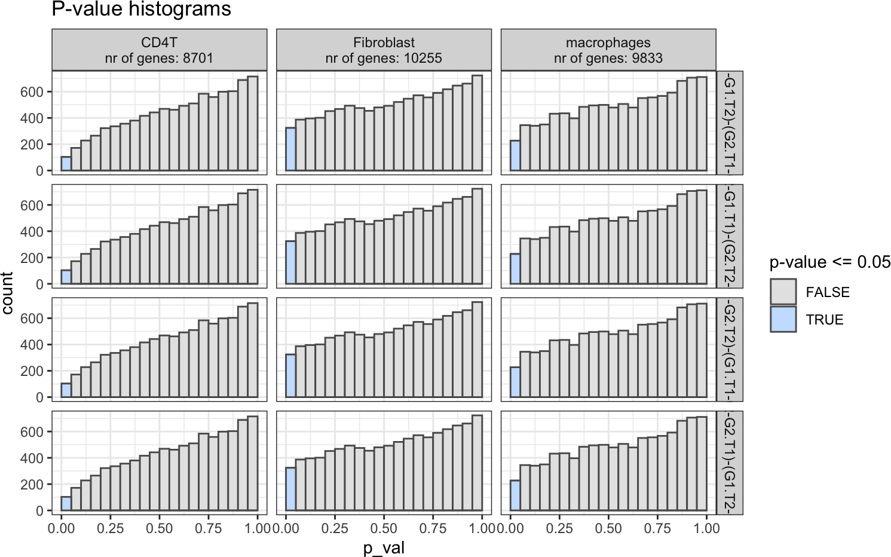

These distributions do not look fine. We expect a uniform distribution, or a uniform distribution with a peak at p-value <= 0.05. Irregularities in the p-value distribution might point to issues in the DE model definition. For example in case we did not add all important covariates, or if there is substructure present in the groups, etc. In such cases, we can use the empiricall null procedure from Efron. This is a procedure that will define empirical p-values based on the observed distribution of the test statistic (here: logFC) and not based on the theoretical distribution. This approach has also been used in the Saturn package: https://github.com/statOmics/satuRn. We only recommend this if the p-value distributions point to possible issues, which is the case here.

To continue with the empirical p-values:


```r
empirical_pval = TRUE
```


```r
if(empirical_pval == TRUE){
  DE_info_emp = get_empirical_pvals(DE_info$celltype_de$de_output_tidy)
  celltype_de = DE_info_emp$de_output_tidy_emp %>% select(-p_val, -p_adj) %>% 
    rename(p_val = p_emp, p_adj = p_adj_emp)
} else {
  celltype_de = DE_info$celltype_de$de_output_tidy
} 
```

Check empirical p-value distributions:


```r
DE_info_emp$hist_pvals_emp
```

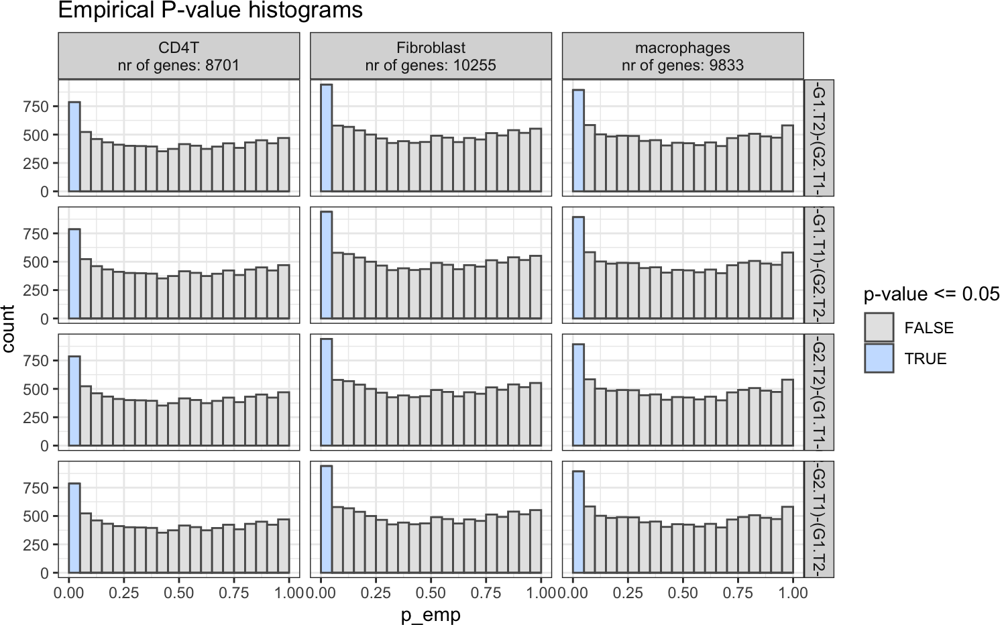

These look already better now.

The following plots show how well the correction worked. The green fitted curve should fit well with the histogram. If not, this might point to some issues in the DE model definition.


```r
DE_info_emp$z_distr_plots_emp_pval
## $`CD4T.(G1.T2-G1.T1)-(G2.T2-G2.T1)`
```

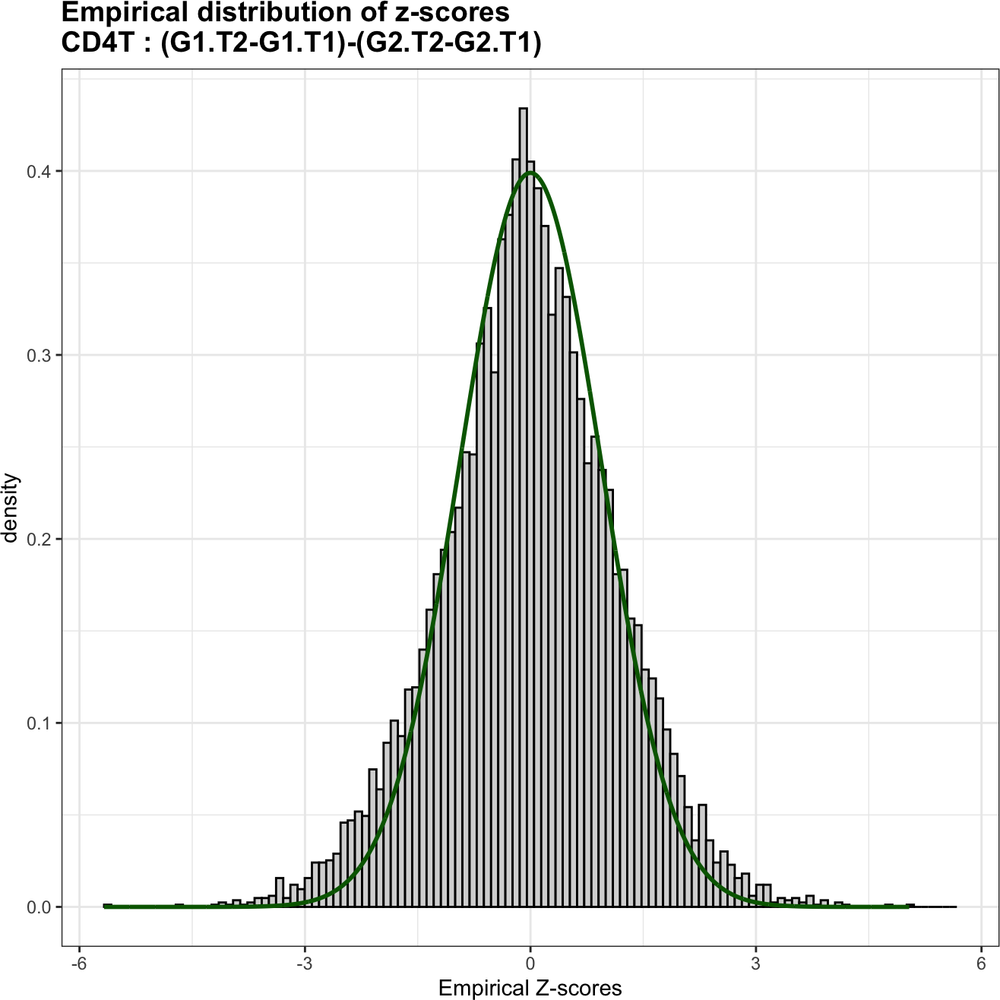

```
## 
## $`CD4T.(G2.T2-G2.T1)-(G1.T2-G1.T1)`
```

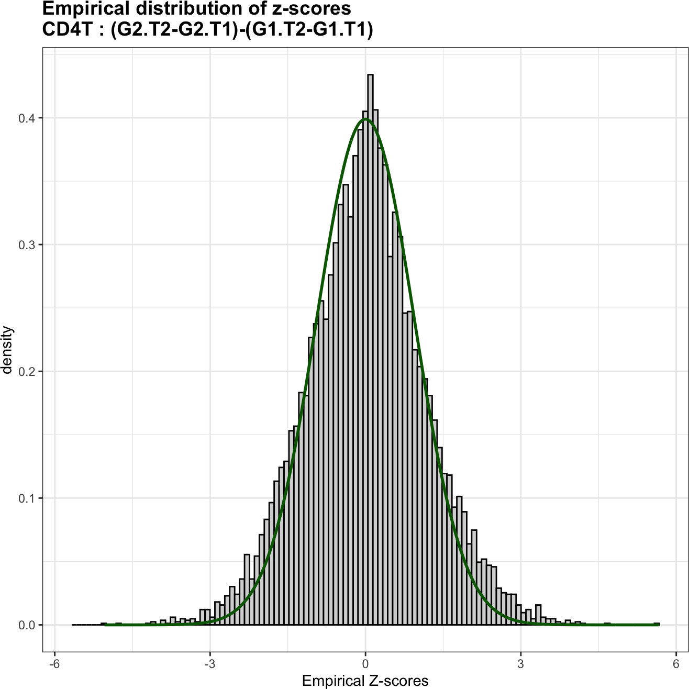

```
## 
## $`CD4T.(G1.T1-G1.T2)-(G2.T1-G2.T2)`
```


```
## 
## $`CD4T.(G2.T1-G2.T2)-(G1.T1-G1.T2)`
```


```
## 
## $`Fibroblast.(G1.T2-G1.T1)-(G2.T2-G2.T1)`
```

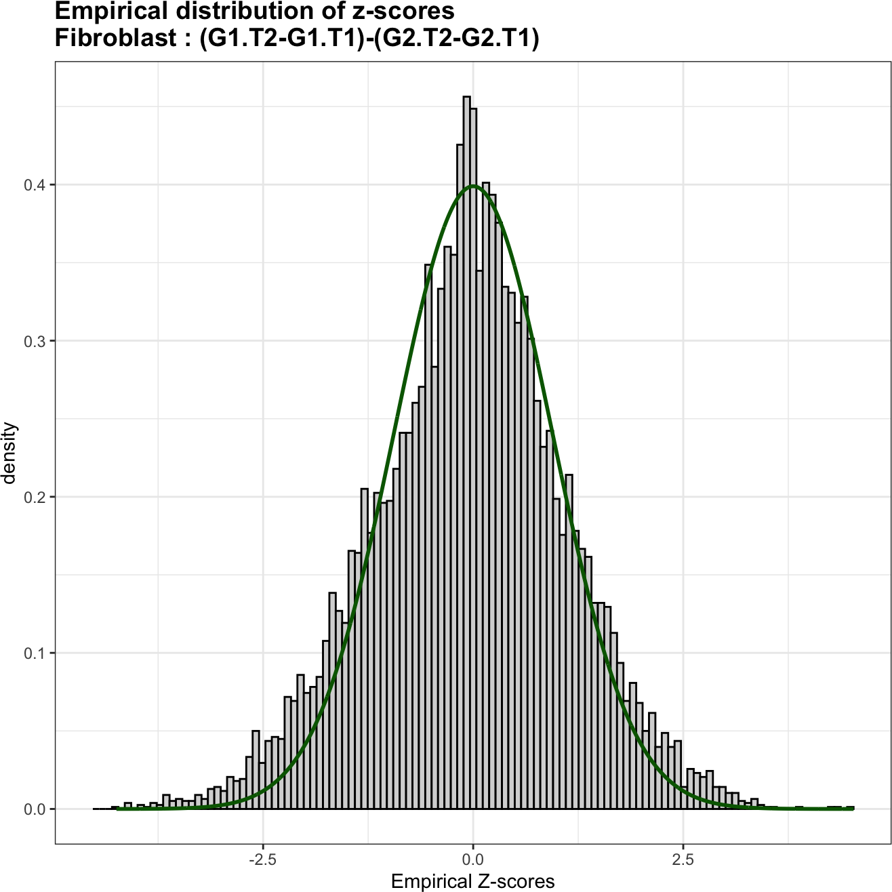

```
## 
## $`Fibroblast.(G2.T2-G2.T1)-(G1.T2-G1.T1)`
```


```
## 
## $`Fibroblast.(G1.T1-G1.T2)-(G2.T1-G2.T2)`
```

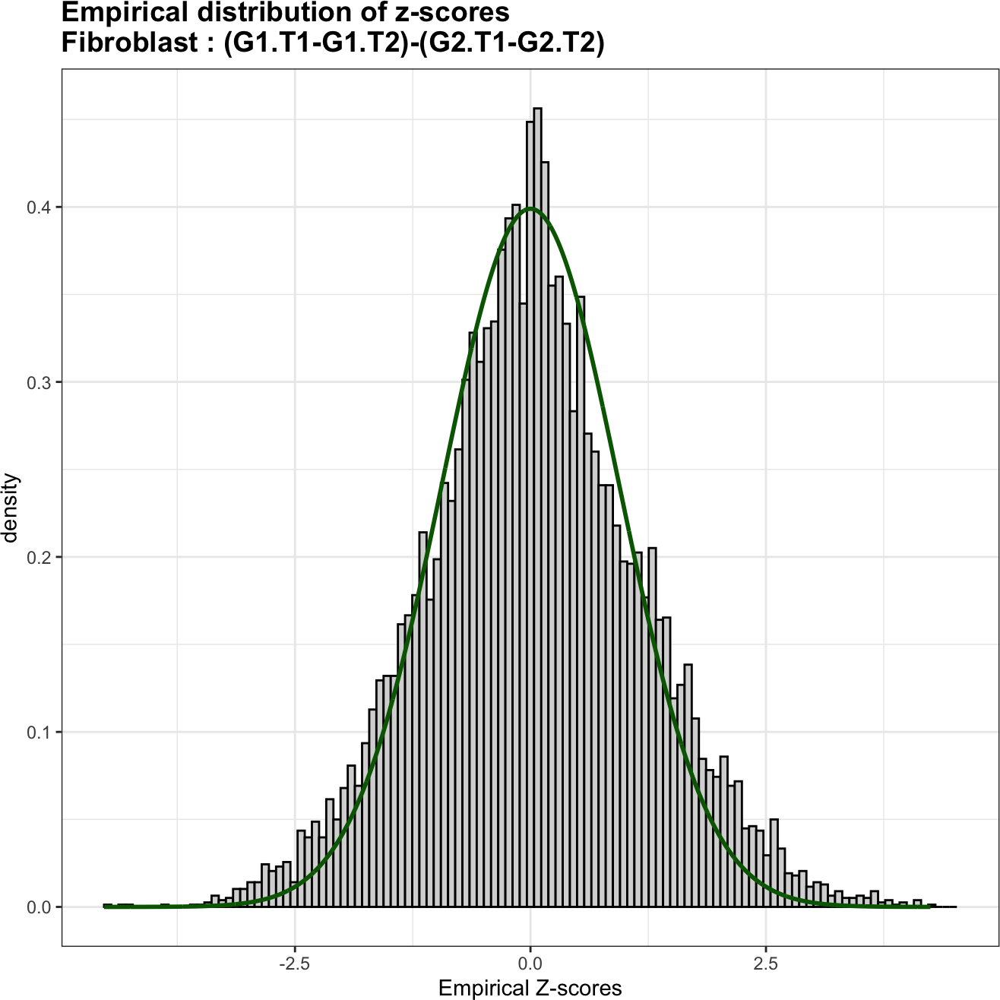

```
## 
## $`Fibroblast.(G2.T1-G2.T2)-(G1.T1-G1.T2)`
```


```
## 
## $`macrophages.(G1.T2-G1.T1)-(G2.T2-G2.T1)`
```


```
## 
## $`macrophages.(G2.T2-G2.T1)-(G1.T2-G1.T1)`
```

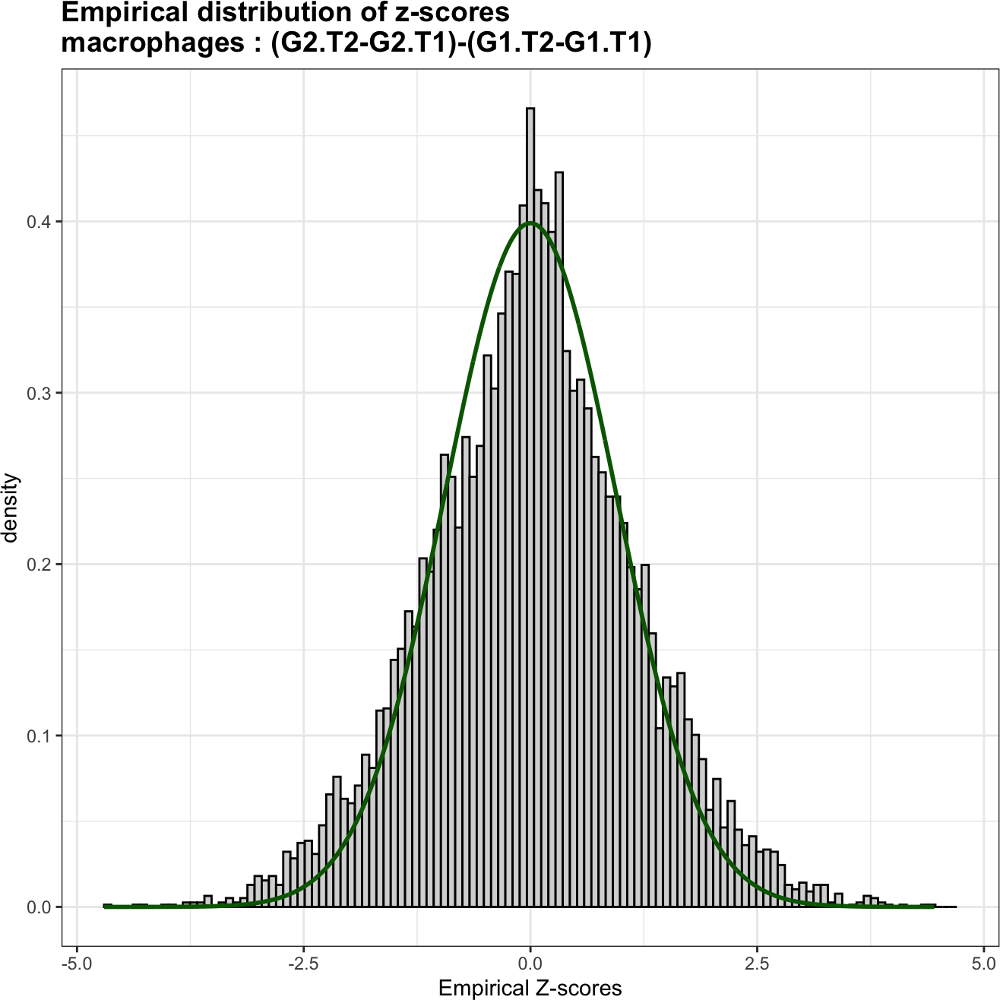

```
## 
## $`macrophages.(G1.T1-G1.T2)-(G2.T1-G2.T2)`
```


```
## 
## $`macrophages.(G2.T1-G2.T2)-(G1.T1-G1.T2)`
```


In general, these plots look OK. Therefore we will continue with these p-values. 

*Ligand activity prediction: use the DE analysis output to predict the activity of ligands in receiver cell types and infer their potential target genes*

Here we get to the most complex part of this vignette.

Let's look at the first contrasts of interest: `(G1.T2-G1.T1)-(G2.T2-G2.T1)`. A positive logFC value here means that the timepoint2-timepoint1 difference in group1 is bigger than in group2. This can be because the increase after therapy (resulting in higher G1.T2 values) is higher in group1 than in the group2. This is the type of trend we are looking for. However, a positive logFC will also be returned in case nothing happens in group1, and there is a therapy-associated decrease in group2. Or when the therapy-associated decrease in group2 is bigger than in group1. This latter examples are trends whe are not looking for. 
If we would just filter genes based on logFC to get a geneset of interest, we will confound this geneset with different patterns with different biological meanings.

To recap:
we are interested in: 
* ligand-receptor interactions that increase after therapy more strongly in group1 vs group2
* target genes that follow the trend of their upstream ligand-receptor interactions and thus also increase after therapy more strongly in group1 vs group2.

How to get to these genesets:
1) Change the `celltype_de` table of DE results:
* for the contrast (G1.T2-G1.T1)-(G2.T2-G2.T1): give all genes with a pos logFC value a value of 0 if their logFC in the **timepoint2-timepoint1** comparison (kept in `celltype_de_group1`) is smaller than (`logFC_threshold`). Give all genes with a negative logFC a value of 0. As a result, the geneset for ligand activity analysis will only contain genes that are increasing after therapy, and this increase in stronger in group1 than group2. 
* for the contrast (G2.T2-G2.T1)-(G1.T2-G1.T1): give all genes with a pos logFC value a value of 0 if their logFC in the **timepoint2-timepoint1** comparison (kept in `celltype_de_group2`) is smaller than (`logFC_threshold`). Give all genes with a negative logFC a value of 0. As a result, the geneset for ligand activity analysis will only contain genes that are increasing after therapy, and this increase in stronger in group2 than group1. 
* for the contrast (G1.T1-G1.T2)-(G2.T1-G2.T2): give all genes with a pos logFC value a value of 0 if their logFC in the **timepoint1-timepoint2** comparison (kept in `celltype_de_group1`) is smaller than (`logFC_threshold`). Give all genes with a negative logFC a value of 0. As a result, the geneset for ligand activity analysis will only contain genes that are decreasing after therapy, and this decrease in stronger in group1 than group1.
* for the contrast (G2.T1-G2.T2)-(G1.T1-G1.T2): give all genes with a pos logFC value a value of 0 if their logFC in the **timepoint1-timepoint2** comparison (kept in `celltype_de_group2`) is smaller than (`logFC_threshold`). Give all genes with a negative logFC a value of 0. As a result, the geneset for ligand activity analysis will only contain genes that are decreasing after therapy, and this decrease in stronger in group2 than group1.

Because we want to keep the same patterns for the ligands/receptors: we will do the same but in more permissive setting: just make sure the On/timepoint2-vs-Pre/timepoint1 difference is in the expected direction without needing to be significant.


Gene-celltype table with genes that will keep their pos logFC value for contrast (G1.T2-G1.T1)-(G2.T2-G2.T1) + modified celltype_de table

```r
gene_celltype_tbl_increase_group1_permissive = celltype_de_group1 %>% 
  filter(contrast == "G1.T2-G1.T1") %>% 
  mutate(logFC_multiplier = ifelse(logFC > 0, 1, 0)) %>% 
  distinct(gene, cluster_id, logFC_multiplier)

gene_celltype_tbl_increase_group1_stringent = celltype_de_group1 %>% 
  filter(contrast == "G1.T2-G1.T1") %>% 
  mutate(logFC_multiplier = ifelse(logFC >= logFC_threshold & p_val <= p_val_threshold, 1, 0)) %>% 
  distinct(gene, cluster_id, logFC_multiplier)
```


```r
celltype_de_increase_group1_permissive = celltype_de %>% 
  filter(contrast == "(G1.T2-G1.T1)-(G2.T2-G2.T1)") %>% 
  inner_join(gene_celltype_tbl_increase_group1_permissive) 

celltype_de_increase_group1_permissive = bind_rows(
  celltype_de_increase_group1_permissive %>% 
    filter(logFC > 0) %>% 
    mutate(logFC = logFC*logFC_multiplier),
  celltype_de_increase_group1_permissive %>% 
    filter(logFC <= 0) %>% 
    mutate(logFC = logFC*0) 
) %>% arrange(-logFC)


celltype_de_increase_group1_stringent = celltype_de %>% 
  filter(contrast == "(G1.T2-G1.T1)-(G2.T2-G2.T1)") %>% 
  inner_join(gene_celltype_tbl_increase_group1_stringent) 

celltype_de_increase_group1_stringent = bind_rows(
  celltype_de_increase_group1_stringent %>% 
    filter(logFC > 0) %>% 
    mutate(logFC = logFC*logFC_multiplier),
  celltype_de_increase_group1_stringent %>% 
    filter(logFC <= 0) %>% 
    mutate(logFC = logFC*0) 
) %>% arrange(-logFC)


celltype_de_increase_group1_stringent %>% head()
## # A tibble: 6 × 10
##   gene     cluster_id  logFC logCPM     F p_adj.loc contrast                           p_val    p_adj logFC_multiplier
##   <chr>    <chr>       <dbl>  <dbl> <dbl>     <dbl> <chr>                              <dbl>    <dbl>            <dbl>
## 1 IGHV4.39 CD4T         5.15   4.17 14.7          1 (G1.T2-G1.T1)-(G2.T2-G2.T1) 0.0000000141 0.000122                1
## 2 CCL5     Fibroblast   2.85   6.33 10.4          1 (G1.T2-G1.T1)-(G2.T2-G2.T1) 0.0000652    0.0835                  1
## 3 HSPA1B   Fibroblast   2.47   6.46  7.64         1 (G1.T2-G1.T1)-(G2.T2-G2.T1) 0.000528     0.159                   1
## 4 IDO1     Fibroblast   2.36   5.45  4.97         1 (G1.T2-G1.T1)-(G2.T2-G2.T1) 0.00467      0.288                   1
## 5 BGN      macrophages  2.34   3.76  5.25         1 (G1.T2-G1.T1)-(G2.T2-G2.T1) 0.00176      0.234                   1
## 6 HSPA1A   Fibroblast   2.28   7.76  8.26         1 (G1.T2-G1.T1)-(G2.T2-G2.T1) 0.000325     0.128                   1
```

Gene-celltype table with genes that will keep their pos logFC value for contrast (G2.T2-G2.T1)-(G1.T2-G1.T1):

```r
gene_celltype_tbl_increase_group2_permissive = celltype_de_group2 %>% 
  filter(contrast == "G2.T2-G2.T1") %>% 
  mutate(logFC_multiplier = ifelse(logFC > 0, 1, 0)) %>% 
  distinct(gene, cluster_id, logFC_multiplier)

gene_celltype_tbl_increase_group2_stringent = celltype_de_group2 %>% 
  filter(contrast == "G2.T2-G2.T1") %>% 
  mutate(logFC_multiplier = ifelse(logFC >= logFC_threshold & p_val <= p_val_threshold, 1, 0)) %>% 
  distinct(gene, cluster_id, logFC_multiplier)
```


```r
celltype_de_increase_group2_permissive = celltype_de %>% 
  filter(contrast == "(G2.T2-G2.T1)-(G1.T2-G1.T1)") %>% 
  inner_join(gene_celltype_tbl_increase_group2_permissive) 

celltype_de_increase_group2_permissive = bind_rows(
  celltype_de_increase_group2_permissive %>% 
    filter(logFC > 0) %>% 
    mutate(logFC = logFC*logFC_multiplier),
  celltype_de_increase_group2_permissive %>% 
    filter(logFC <= 0) %>% 
    mutate(logFC = logFC*0) 
) %>% arrange(-logFC)

celltype_de_increase_group2_stringent = celltype_de %>% 
  filter(contrast == "(G2.T2-G2.T1)-(G1.T2-G1.T1)") %>% 
  inner_join(gene_celltype_tbl_increase_group2_stringent) 

celltype_de_increase_group2_stringent = bind_rows(
  celltype_de_increase_group2_stringent %>% 
    filter(logFC > 0) %>% 
    mutate(logFC = logFC*logFC_multiplier),
  celltype_de_increase_group2_stringent %>% 
    filter(logFC <= 0) %>% 
    mutate(logFC = logFC*0) 
) %>% arrange(-logFC)

celltype_de_increase_group2_stringent %>% head()
## # A tibble: 6 × 10
##   gene   cluster_id  logFC logCPM     F p_adj.loc contrast                          p_val   p_adj logFC_multiplier
##   <chr>  <chr>       <dbl>  <dbl> <dbl>     <dbl> <chr>                             <dbl>   <dbl>            <dbl>
## 1 FABP4  macrophages  5.17   6.54 11.5          1 (G2.T2-G2.T1)-(G1.T2-G1.T1) 0.0000189   0.0372                 1
## 2 CCL4L2 CD4T         3.69   6.22 12.2          1 (G2.T2-G2.T1)-(G1.T2-G1.T1) 0.000000471 0.00205                1
## 3 CFD    Fibroblast   2.87  10.6   3.64         1 (G2.T2-G2.T1)-(G1.T2-G1.T1) 0.0172      0.409                  1
## 4 PRSS23 macrophages  2.77   3.06  5.22         1 (G2.T2-G2.T1)-(G1.T2-G1.T1) 0.00345     0.263                  1
## 5 SAA1   Fibroblast   2.75   3.89  4.77         1 (G2.T2-G2.T1)-(G1.T2-G1.T1) 0.00650     0.321                  1
## 6 CCL3   CD4T         2.73   5.83  5.95         1 (G2.T2-G2.T1)-(G1.T2-G1.T1) 0.000353    0.0930                 1
```

Gene-celltype table with genes that will keep their pos logFC value for contrast (G1.T1-G1.T2)-(G2.T1-G2.T2):

```r
gene_celltype_tbl_decrease_group1_permissive = celltype_de_group1 %>% 
  filter(contrast == "G1.T1-G1.T2") %>% 
  mutate(logFC_multiplier = ifelse(logFC > 0, 1, 0)) %>% 
  distinct(gene, cluster_id, logFC_multiplier)

gene_celltype_tbl_decrease_group1_stringent = celltype_de_group1 %>% 
  filter(contrast == "G1.T1-G1.T2") %>% 
  mutate(logFC_multiplier = ifelse(logFC >= logFC_threshold & p_val <= p_val_threshold, 1, 0)) %>% 
  distinct(gene, cluster_id, logFC_multiplier)
```


```r
celltype_de_decrease_group1_permissive = celltype_de %>% 
  filter(contrast == "(G1.T1-G1.T2)-(G2.T1-G2.T2)") %>% 
  inner_join(gene_celltype_tbl_decrease_group1_permissive) 

celltype_de_decrease_group1_permissive = bind_rows(
  celltype_de_decrease_group1_permissive %>% 
    filter(logFC > 0) %>% 
    mutate(logFC = logFC*logFC_multiplier),
  celltype_de_decrease_group1_permissive %>% 
    filter(logFC <= 0) %>% 
    mutate(logFC = logFC*0) 
) %>% arrange(-logFC)

celltype_de_decrease_group1_stringent = celltype_de %>% 
  filter(contrast == "(G1.T1-G1.T2)-(G2.T1-G2.T2)") %>% 
  inner_join(gene_celltype_tbl_decrease_group1_stringent) 

celltype_de_decrease_group1_stringent = bind_rows(
  celltype_de_decrease_group1_stringent %>% 
    filter(logFC > 0) %>% 
    mutate(logFC = logFC*logFC_multiplier),
  celltype_de_decrease_group1_stringent %>% 
    filter(logFC <= 0) %>% 
    mutate(logFC = logFC*0) 
) %>% arrange(-logFC)

celltype_de_decrease_group1_stringent %>% head()
## # A tibble: 6 × 10
##   gene    cluster_id  logFC logCPM     F p_adj.loc contrast                         p_val  p_adj logFC_multiplier
##   <chr>   <chr>       <dbl>  <dbl> <dbl>     <dbl> <chr>                            <dbl>  <dbl>            <dbl>
## 1 IGLV3.1 Fibroblast   6.96   8.84 14.1          1 (G1.T1-G1.T2)-(G2.T1-G2.T2) 0.00000599 0.0566                1
## 2 HBB     macrophages  4.75   4.72  4.98         1 (G1.T1-G1.T2)-(G2.T1-G2.T2) 0.00430    0.283                 1
## 3 CALML5  CD4T         3.65   2.65  7.3          1 (G1.T1-G1.T2)-(G2.T1-G2.T2) 0.0000798  0.0489                1
## 4 HBB     CD4T         3.5    7.95  3.14         1 (G1.T1-G1.T2)-(G2.T1-G2.T2) 0.00932    0.326                 1
## 5 HBB     Fibroblast   3.48   8.17  1.69         1 (G1.T1-G1.T2)-(G2.T1-G2.T2) 0.103      0.671                 1
## 6 CCDC80  macrophages  3.04   3.11  7.74         1 (G1.T1-G1.T2)-(G2.T1-G2.T2) 0.000394   0.117                 1
```

Gene-celltype table with genes that will keep their pos logFC value for contrast (G2.T1-G2.T2)-(G1.T1-G1.T2):

```r
gene_celltype_tbl_decrease_group2_permissive = celltype_de_group2 %>% 
  filter(contrast == "G2.T1-G2.T2") %>% 
  mutate(logFC_multiplier = ifelse(logFC > 0, 1, 0)) %>% 
  distinct(gene, cluster_id, logFC_multiplier)

gene_celltype_tbl_decrease_group2_stringent = celltype_de_group2 %>% 
  filter(contrast == "G2.T1-G2.T2") %>% 
  mutate(logFC_multiplier = ifelse(logFC >= logFC_threshold & p_val <= p_val_threshold, 1, 0)) %>% 
  distinct(gene, cluster_id, logFC_multiplier)
```


```r
celltype_de_decrease_group2_permissive = celltype_de %>% 
  filter(contrast == "(G2.T1-G2.T2)-(G1.T1-G1.T2)") %>% 
  inner_join(gene_celltype_tbl_decrease_group2_permissive) 

celltype_de_decrease_group2_permissive = bind_rows(
  celltype_de_decrease_group2_permissive %>% 
    filter(logFC > 0) %>% 
    mutate(logFC = logFC*logFC_multiplier),
  celltype_de_decrease_group2_permissive %>% 
    filter(logFC <= 0) %>% 
    mutate(logFC = logFC*0) 
) %>% arrange(-logFC)

celltype_de_decrease_group2_stringent = celltype_de %>% 
  filter(contrast == "(G2.T1-G2.T2)-(G1.T1-G1.T2)") %>% 
  inner_join(gene_celltype_tbl_decrease_group2_stringent) 

celltype_de_decrease_group2_stringent = bind_rows(
  celltype_de_decrease_group2_stringent %>% 
    filter(logFC > 0) %>% 
    mutate(logFC = logFC*logFC_multiplier),
  celltype_de_decrease_group2_stringent %>% 
    filter(logFC <= 0) %>% 
    mutate(logFC = logFC*0) 
) %>% arrange(-logFC)

celltype_de_decrease_group2_stringent %>% head()
## # A tibble: 6 × 10
##   gene     cluster_id  logFC logCPM     F p_adj.loc contrast                           p_val    p_adj logFC_multiplier
##   <chr>    <chr>       <dbl>  <dbl> <dbl>     <dbl> <chr>                              <dbl>    <dbl>            <dbl>
## 1 IGHV4.39 CD4T         5.15   4.17 14.7          1 (G2.T1-G2.T2)-(G1.T1-G1.T2) 0.0000000141 0.000122                1
## 2 IGHV3.23 macrophages  4.67   5.31  7.78         1 (G2.T1-G2.T2)-(G1.T1-G1.T2) 0.000177     0.0916                  1
## 3 IGLV3.25 macrophages  4.29   4.08  8            1 (G2.T1-G2.T2)-(G1.T1-G1.T2) 0.000146     0.0916                  1
## 4 IGLV3.21 Fibroblast   4.24   4.16  8.45         1 (G2.T1-G2.T2)-(G1.T1-G1.T2) 0.000281     0.128                   1
## 5 IGKV3.20 macrophages  3.21   6.15  5.58         1 (G2.T1-G2.T2)-(G1.T1-G1.T2) 0.00130      0.223                   1
## 6 FDCSP    Fibroblast   3.2    4.27  5.07         1 (G2.T1-G2.T2)-(G1.T1-G1.T2) 0.00430      0.284                   1
```

So let's now make the new `cellype_de` tables:

The permissive table that will be used for the prioritization of ligand-receptor pairs based on DE values:


```r
celltype_de_LR = list(
  celltype_de_increase_group1_permissive,
  celltype_de_increase_group2_permissive,
  celltype_de_decrease_group1_permissive,
  celltype_de_decrease_group2_permissive) %>% bind_rows()
```

The stringent table that will be used for the creation of genesets for the ligand activity analysis:


```r
celltype_de_genesets = list(
  celltype_de_increase_group1_stringent,
  celltype_de_increase_group2_stringent,
  celltype_de_decrease_group1_stringent,
  celltype_de_decrease_group2_stringent) %>% bind_rows()
```

We will first inspect the geneset_oi-vs-background ratios for the default tresholds:


```r
geneset_assessment = contrast_tbl$contrast %>% 
  lapply(
    process_geneset_data, 
    celltype_de_genesets, logFC_threshold, p_val_adj, p_val_threshold
  ) %>% 
  bind_rows() 
geneset_assessment
## # A tibble: 12 × 12
##    cluster_id  n_background n_geneset_up n_geneset_down prop_geneset_up prop_geneset_down in_range_up in_range_down contrast                    logFC_threshold p_val_threshold adjusted
##    <chr>              <int>        <int>          <int>           <dbl>             <dbl> <lgl>       <lgl>         <chr>                                 <dbl>           <dbl> <lgl>   
##  1 CD4T                8701           22              0         0.00253                 0 FALSE       FALSE         (G1.T2-G1.T1)-(G2.T2-G2.T1)             0.5            0.05 FALSE   
##  2 Fibroblast         10255          133              0         0.0130                  0 TRUE        FALSE         (G1.T2-G1.T1)-(G2.T2-G2.T1)             0.5            0.05 FALSE   
##  3 macrophages         9833           96              0         0.00976                 0 TRUE        FALSE         (G1.T2-G1.T1)-(G2.T2-G2.T1)             0.5            0.05 FALSE   
##  4 CD4T                8701           50              0         0.00575                 0 TRUE        FALSE         (G2.T2-G2.T1)-(G1.T2-G1.T1)             0.5            0.05 FALSE   
##  5 Fibroblast         10255           27              0         0.00263                 0 FALSE       FALSE         (G2.T2-G2.T1)-(G1.T2-G1.T1)             0.5            0.05 FALSE   
##  6 macrophages         9833           68              0         0.00692                 0 TRUE        FALSE         (G2.T2-G2.T1)-(G1.T2-G1.T1)             0.5            0.05 FALSE   
##  7 CD4T                8701           34              0         0.00391                 0 FALSE       FALSE         (G1.T1-G1.T2)-(G2.T1-G2.T2)             0.5            0.05 FALSE   
##  8 Fibroblast         10255          144              0         0.0140                  0 TRUE        FALSE         (G1.T1-G1.T2)-(G2.T1-G2.T2)             0.5            0.05 FALSE   
##  9 macrophages         9833           90              0         0.00915                 0 TRUE        FALSE         (G1.T1-G1.T2)-(G2.T1-G2.T2)             0.5            0.05 FALSE   
## 10 CD4T                8701           60              0         0.00690                 0 TRUE        FALSE         (G2.T1-G2.T2)-(G1.T1-G1.T2)             0.5            0.05 FALSE   
## 11 Fibroblast         10255           23              0         0.00224                 0 FALSE       FALSE         (G2.T1-G2.T2)-(G1.T1-G1.T2)             0.5            0.05 FALSE   
## 12 macrophages         9833           67              0         0.00681                 0 TRUE        FALSE         (G2.T1-G2.T2)-(G1.T1-G1.T2)             0.5            0.05 FALSE
```

We can see here that for most geneset/background ratio's we are within or close to the recommended range for the upregulated genes (`in_range_up` and `in_range_down` columns). This is not the case for the downregulated genes, but we are not interested in those for now.


```r
ligand_activities_targets_DEgenes = suppressMessages(suppressWarnings(
  get_ligand_activities_targets_DEgenes(
    receiver_de = celltype_de_genesets,
    receivers_oi = intersect(receivers_oi, celltype_de_genesets$cluster_id %>% unique()),
    ligand_target_matrix = ligand_target_matrix,
    logFC_threshold = logFC_threshold,
    p_val_threshold = p_val_threshold,
    p_val_adj = p_val_adj,
    top_n_target = top_n_target,
    verbose = TRUE, 
    n.cores = n.cores
  )
))
```

*Combine DE information for ligand-senders and receptors-receivers*

Use the adapted `celltype_de_LR` table to keep the expression change patterns we want:


```r
sender_receiver_de = combine_sender_receiver_de(
  sender_de = celltype_de_LR,
  receiver_de = celltype_de_LR,
  senders_oi = senders_oi,
  receivers_oi = receivers_oi,
  lr_network = lr_network
)
```


```r
sender_receiver_de %>% head(20)
## # A tibble: 20 × 12
##    contrast                    sender      receiver    ligand receptor lfc_ligand lfc_receptor ligand_receptor_lfc_avg p_val_ligand p_adj_ligand p_val_receptor p_adj_receptor
##    <chr>                       <chr>       <chr>       <chr>  <chr>         <dbl>        <dbl>                   <dbl>        <dbl>        <dbl>          <dbl>          <dbl>
##  1 (G2.T2-G2.T1)-(G1.T2-G1.T1) Fibroblast  CD4T        PIP    NPTN           4.36       0.35                      2.36  0.00641          0.321          0.161            0.747
##  2 (G1.T1-G1.T2)-(G2.T1-G2.T2) Fibroblast  CD4T        PIP    NPTN           4.36       0.35                      2.36  0.00641          0.321          0.161            0.747
##  3 (G2.T2-G2.T1)-(G1.T2-G1.T1) Fibroblast  macrophages PIP    NPTN           4.36       0.141                     2.25  0.00641          0.321          0.650            0.994
##  4 (G2.T2-G2.T1)-(G1.T2-G1.T1) Fibroblast  Fibroblast  PIP    NPTN           4.36       0.114                     2.24  0.00641          0.321          0.708            1.00 
##  5 (G1.T1-G1.T2)-(G2.T1-G2.T2) Fibroblast  Fibroblast  PIP    NPTN           4.36       0.114                     2.24  0.00641          0.321          0.708            1.00 
##  6 (G1.T1-G1.T2)-(G2.T1-G2.T2) Fibroblast  Fibroblast  PIP    CD4            4.36       0.0732                    2.22  0.00641          0.321          0.924            1.00 
##  7 (G2.T2-G2.T1)-(G1.T2-G1.T1) Fibroblast  Fibroblast  PIP    CD4            4.36       0                         2.18  0.00641          0.321          0.924            1.00 
##  8 (G2.T2-G2.T1)-(G1.T2-G1.T1) Fibroblast  CD4T        PIP    CD4            4.36       0                         2.18  0.00641          0.321          0.868            0.999
##  9 (G2.T2-G2.T1)-(G1.T2-G1.T1) Fibroblast  macrophages PIP    CD4            4.36       0                         2.18  0.00641          0.321          0.0793           0.637
## 10 (G1.T1-G1.T2)-(G2.T1-G2.T2) Fibroblast  CD4T        PIP    CD4            4.36       0                         2.18  0.00641          0.321          0.868            0.999
## 11 (G1.T1-G1.T2)-(G2.T1-G2.T2) Fibroblast  macrophages PIP    CD4            4.36       0                         2.18  0.00641          0.321          0.0793           0.637
## 12 (G1.T1-G1.T2)-(G2.T1-G2.T2) Fibroblast  macrophages PIP    NPTN           4.36       0                         2.18  0.00641          0.321          0.650            0.994
## 13 (G2.T2-G2.T1)-(G1.T2-G1.T1) CD4T        CD4T        CCL4L2 CCR1           3.69       0.516                     2.10  0.000000471      0.00205        0.421            0.924
## 14 (G1.T1-G1.T2)-(G2.T1-G2.T2) CD4T        CD4T        CCL4L2 CCR1           3.69       0.516                     2.10  0.000000471      0.00205        0.421            0.924
## 15 (G1.T2-G1.T1)-(G2.T2-G2.T1) Fibroblast  Fibroblast  CDH2   CDH2           1.98       1.98                      1.98  0.00251          0.255          0.00251          0.255
## 16 (G2.T1-G2.T2)-(G1.T1-G1.T2) Fibroblast  Fibroblast  CDH2   CDH2           1.98       1.98                      1.98  0.00251          0.255          0.00251          0.255
## 17 (G2.T2-G2.T1)-(G1.T2-G1.T1) macrophages CD4T        PIP    NPTN           3.58       0.35                      1.96  0.00195          0.240          0.161            0.747
## 18 (G1.T1-G1.T2)-(G2.T1-G2.T2) macrophages CD4T        PIP    NPTN           3.58       0.35                      1.96  0.00195          0.240          0.161            0.747
## 19 (G1.T2-G1.T1)-(G2.T2-G2.T1) CD4T        Fibroblast  CXCL14 CXCR4          2.63       1.28                      1.96  0.000546         0.111          0.0565           0.569
## 20 (G2.T1-G2.T2)-(G1.T1-G1.T2) CD4T        Fibroblast  CXCL14 CXCR4          2.63       1.28                      1.96  0.000546         0.111          0.0565           0.569
```

*Prioritization: rank cell-cell communication patterns through multi-criteria prioritization*


```r
sender_receiver_tbl = sender_receiver_de %>% distinct(sender, receiver)

metadata_combined = SummarizedExperiment::colData(sce) %>% tibble::as_tibble()

if(!is.na(batches)){
  grouping_tbl = metadata_combined[,c(sample_id, group_id, batches)] %>% 
    tibble::as_tibble() %>% distinct()
  colnames(grouping_tbl) = c("sample","group",batches)
} else {
  grouping_tbl = metadata_combined[,c(sample_id, group_id)] %>% 
    tibble::as_tibble() %>% distinct()
  colnames(grouping_tbl) = c("sample","group")
}

prioritization_tables = suppressMessages(generate_prioritization_tables(
    sender_receiver_info = abundance_expression_info$sender_receiver_info,
    sender_receiver_de = sender_receiver_de,
    ligand_activities_targets_DEgenes = ligand_activities_targets_DEgenes,
    contrast_tbl = contrast_tbl,
    sender_receiver_tbl = sender_receiver_tbl,
    grouping_tbl = grouping_tbl,
    scenario = "regular", # all prioritization criteria will be weighted equally
    fraction_cutoff = fraction_cutoff, 
    abundance_data_receiver = abundance_expression_info$abundance_data_receiver,
    abundance_data_sender = abundance_expression_info$abundance_data_sender,
    ligand_activity_down = FALSE
  ))
```

*Compile the MultiNicheNet output object*


```r
multinichenet_output = list(
    celltype_info = abundance_expression_info$celltype_info,
    celltype_de = celltype_de_genesets,
    sender_receiver_info = abundance_expression_info$sender_receiver_info,
    sender_receiver_de =  sender_receiver_de,
    ligand_activities_targets_DEgenes = ligand_activities_targets_DEgenes,
    prioritization_tables = prioritization_tables,
    grouping_tbl = grouping_tbl,
    lr_target_prior_cor = tibble()
  ) 
multinichenet_output = make_lite_output(multinichenet_output)
```

### Interpret the analysis

*Summarizing ChordDiagram circos plots*

We will look here at the top 50 predictions across all contrasts, senders, and receivers of interest.


```r
prioritized_tbl_oi_all = get_top_n_lr_pairs(
  multinichenet_output$prioritization_tables, 
  top_n = 50, 
  rank_per_group = FALSE
  )
```


```r
prioritized_tbl_oi = 
  multinichenet_output$prioritization_tables$group_prioritization_tbl %>%
  filter(id %in% prioritized_tbl_oi_all$id) %>%
  distinct(id, sender, receiver, ligand, receptor, group) %>% 
  left_join(prioritized_tbl_oi_all)
prioritized_tbl_oi$prioritization_score[is.na(prioritized_tbl_oi$prioritization_score)] = 0

senders_receivers = union(prioritized_tbl_oi$sender %>% unique(), prioritized_tbl_oi$receiver %>% unique()) %>% sort()

colors_sender = RColorBrewer::brewer.pal(n = length(senders_receivers), name = 'Spectral') %>% magrittr::set_names(senders_receivers)
colors_receiver = RColorBrewer::brewer.pal(n = length(senders_receivers), name = 'Spectral') %>% magrittr::set_names(senders_receivers)

circos_list = make_circos_group_comparison(prioritized_tbl_oi, colors_sender, colors_receiver)
```

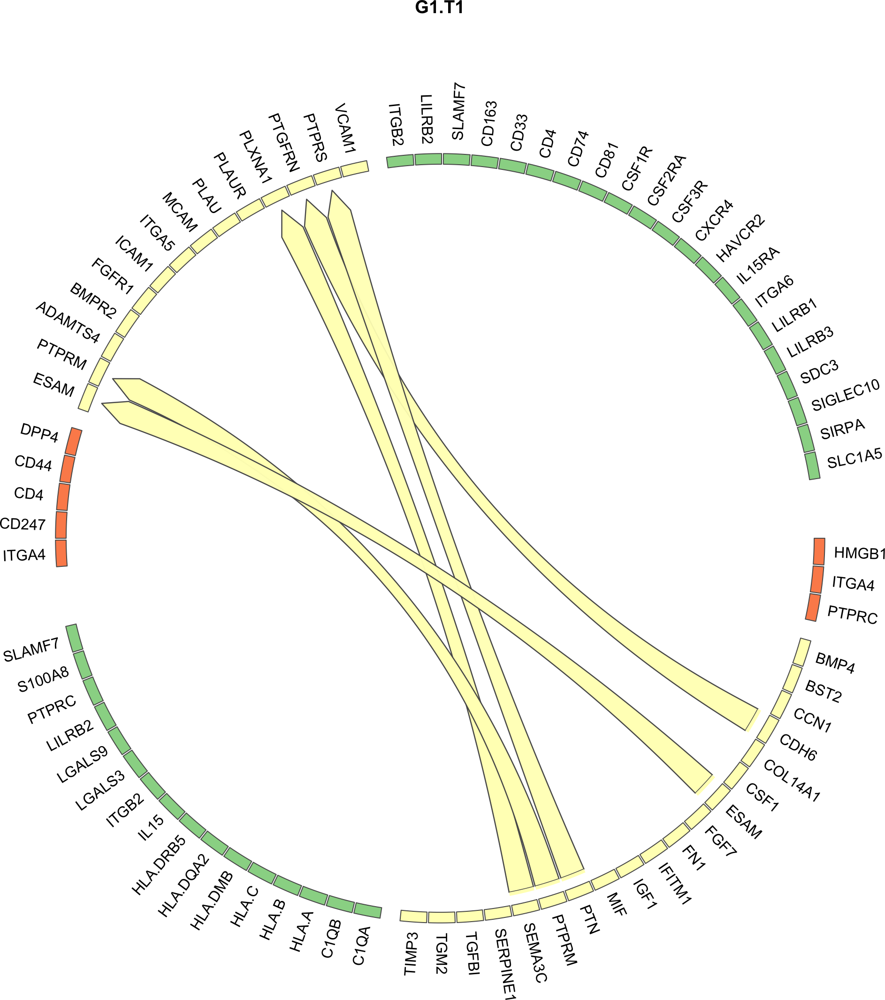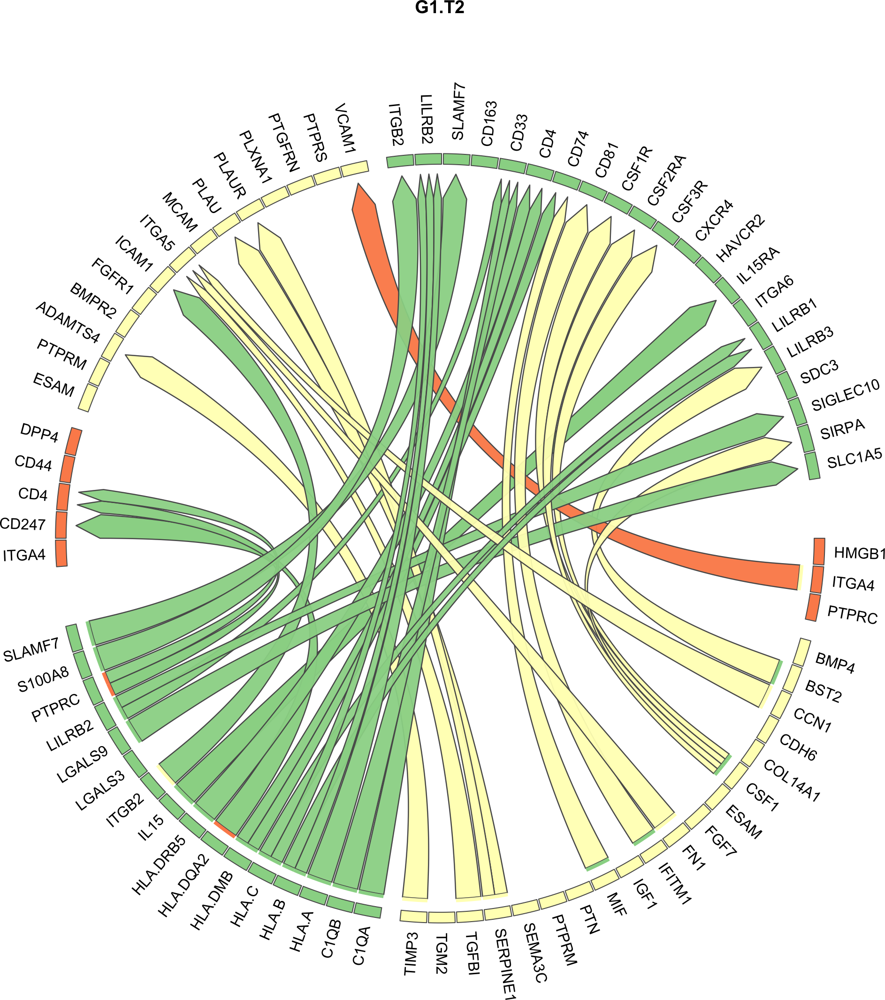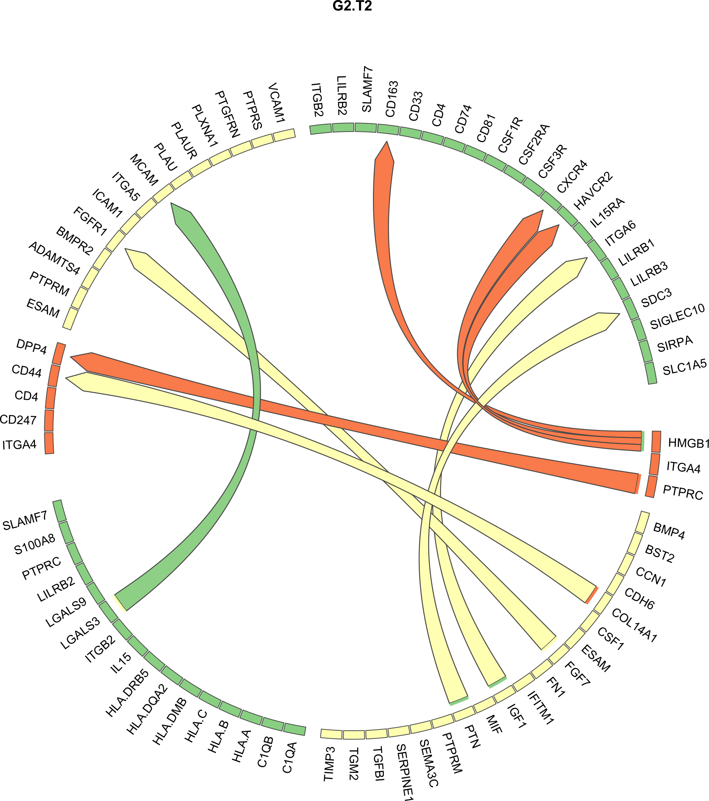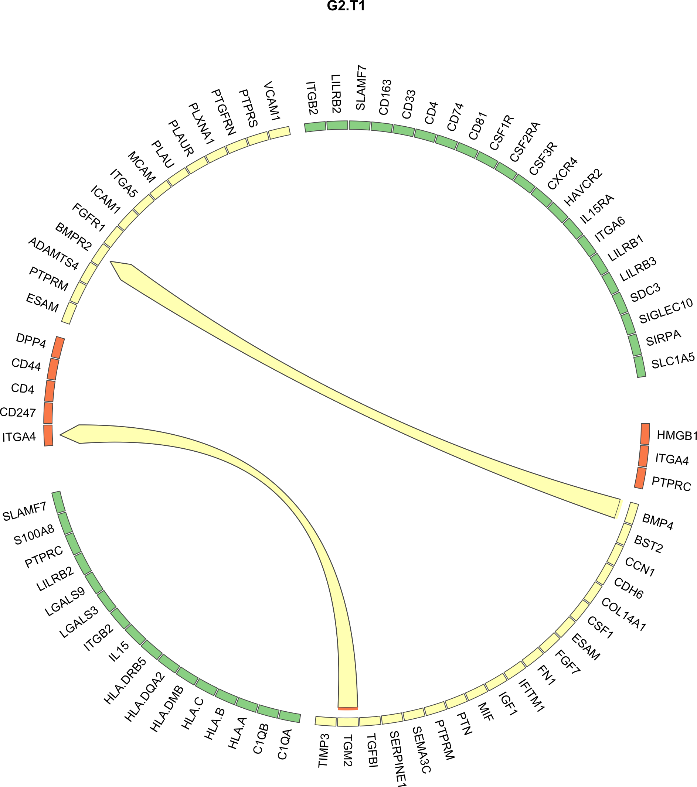

In general, we see most specific interactions are the ones that increase in the E group (= patients with T cell clonotype expansion after aPD1 therapy)

*Interpretable bubble plots*

We will now check the top interactions specific for the OnE group - so these are the interactions that increase during anti-PD1 therapy and more strongly in the E than NE group.


```r
group_oi = "G1.T2"
```


```r
prioritized_tbl_oi_50 = get_top_n_lr_pairs(
  multinichenet_output$prioritization_tables, 
  top_n = 50, rank_per_group = FALSE) %>% filter(group == group_oi)
```


```r
prioritized_tbl_oi_50_omnipath = prioritized_tbl_oi_50 %>% 
  inner_join(lr_network_all)
```

Now we add this to the bubble plot visualization:

```r
plot_oi = make_sample_lr_prod_activity_plots_Omnipath(
  multinichenet_output$prioritization_tables, 
  prioritized_tbl_oi_50_omnipath)
plot_oi
```

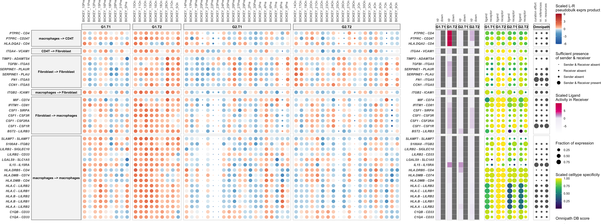

Now let's check the top interactions specific for the PreE group - so these are the interactions that decrease during anti-PD1 therapy, and more strongly in group1 than group2.


```r
group_oi = "G1.T1"
```


```r
prioritized_tbl_oi_50 = get_top_n_lr_pairs(
  multinichenet_output$prioritization_tables, 
  top_n = 50, rank_per_group = FALSE) %>% filter(group == group_oi)
```


```r
prioritized_tbl_oi_50_omnipath = prioritized_tbl_oi_50 %>% 
  inner_join(lr_network_all)
```


```r
plot_oi = make_sample_lr_prod_activity_plots_Omnipath(
  multinichenet_output$prioritization_tables, 
  prioritized_tbl_oi_50_omnipath)
plot_oi
```

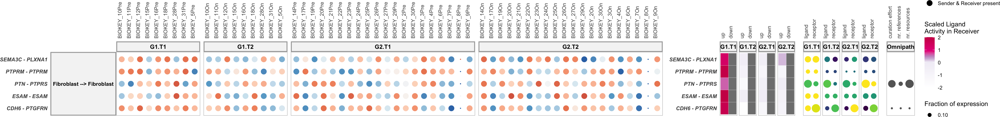

These are just a few interactions because they should be part of top50. Let's now look at some more interactions: top25 within PreE.


```r
prioritized_tbl_oi_50 = get_top_n_lr_pairs(
  multinichenet_output$prioritization_tables, 
  top_n = 25, groups = group_oi)
```


```r
prioritized_tbl_oi_50_omnipath = prioritized_tbl_oi_50 %>% 
  inner_join(lr_network_all)
```


```r
plot_oi = make_sample_lr_prod_activity_plots_Omnipath(
  multinichenet_output$prioritization_tables, 
  prioritized_tbl_oi_50_omnipath)
plot_oi
```

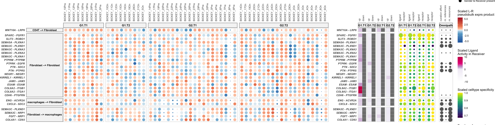

We recommend generating these plots as well for the other conditions, but we will not do this here to reduce the length of the vignette.

### Intercellular regulatory network inference and visualization 

One of the unique benefits of MultiNicheNet is the prediction of ligand activities and target genes downstream of ligand-receptor pairs. This may offer additional unique insights into the data at hand. We will showcase this here by inferring an intercellular regulatory network. Interestingly, some target genes can be ligands or receptors themselves. This illustrates that cells can send signals to other cells, who as a response to these signals produce signals themselves to feedback to the original sender cells, or who will effect other cell types. With MultiNicheNet, we can generate this 'systems' view of these intercellular feedback and cascade processes than can be occuring between the different cell populations involved. In this intercellular regulatory network, we will draw links between ligands of sender cell types their ligand/receptor-annotated target genes in receiver cell types. So links are ligand-target links (= gene regulatory links) and not ligand-receptor protein-protein interactions!

Because we typically predict many target genes for each ligand, we may get a crowded ligand-target network in the end. To prune this network, we can filter target genes based on correlation in expression across samples with their upstream ligand-receptor pairs. 

So, before inferring the intercellular regulatory network, we will calculate these LR-target correlations:


```r
lr_target_prior_cor = lr_target_prior_cor_inference(
  receivers_oi = multinichenet_output$prioritization_tables$group_prioritization_tbl$receiver %>% unique(), 
  abundance_expression_info = abundance_expression_info, 
  celltype_de = celltype_de_LR, 
  grouping_tbl = multinichenet_output$grouping_tbl, 
  prioritization_tables = multinichenet_output$prioritization_tables, 
  ligand_target_matrix = ligand_target_matrix, 
  logFC_threshold = logFC_threshold, 
  p_val_threshold = p_val_threshold, 
  p_val_adj = p_val_adj
  )
```

In the plots before, we demonstrated that some DE genes have both expression correlation and prior knowledge support to be downstream of ligand-receptor pairs.  We will infer this intercellular regulatory network here for the top250 interactions overall.


```r
prioritized_tbl_oi = get_top_n_lr_pairs(
  multinichenet_output$prioritization_tables, 
  250, 
  rank_per_group = FALSE)

lr_target_prior_cor_filtered = 
  multinichenet_output$prioritization_tables$group_prioritization_tbl$group %>% unique() %>% 
  lapply(function(group_oi){
    lr_target_prior_cor_filtered = lr_target_prior_cor %>%
      inner_join(
        multinichenet_output$ligand_activities_targets_DEgenes$ligand_activities %>%
          distinct(ligand, target, direction_regulation, contrast)
        ) %>% 
      inner_join(contrast_tbl) %>% filter(group == group_oi)
    
    lr_target_prior_cor_filtered_up = lr_target_prior_cor_filtered %>% 
      filter(direction_regulation == "up") %>% 
      filter( (rank_of_target < top_n_target) & (pearson > 0.2 | spearman > 0.2))
    
    lr_target_prior_cor_filtered_down = lr_target_prior_cor_filtered %>% 
      filter(direction_regulation == "down") %>% 
      filter( (rank_of_target < top_n_target) & (pearson < -0.2 | spearman < -0.2))
    lr_target_prior_cor_filtered = bind_rows(
      lr_target_prior_cor_filtered_up, 
      lr_target_prior_cor_filtered_down
      )
}) %>% bind_rows()

lr_target_df = lr_target_prior_cor_filtered %>% 
  distinct(group, sender, receiver, ligand, receptor, id, target, direction_regulation) 
```


```r
network = infer_intercellular_regulatory_network(lr_target_df, prioritized_tbl_oi)
network$links %>% head()
## # A tibble: 6 × 6
##   sender_ligand     receiver_target     direction_regulation group type          weight
##   <chr>             <chr>               <fct>                <chr> <chr>          <dbl>
## 1 Fibroblast_TIMP1  Fibroblast_SERPINE1 up                   G1.T2 Ligand-Target      1
## 2 Fibroblast_TIMP1  Fibroblast_TIMP1    up                   G1.T2 Ligand-Target      1
## 3 Fibroblast_FN1    Fibroblast_SERPINE1 up                   G1.T2 Ligand-Target      1
## 4 macrophages_B2M   Fibroblast_TIMP1    up                   G1.T2 Ligand-Target      1
## 5 macrophages_ITGB2 Fibroblast_SERPINE1 up                   G1.T2 Ligand-Target      1
## 6 macrophages_ITGB2 Fibroblast_TIMP1    up                   G1.T2 Ligand-Target      1
network$nodes %>% head()
## # A tibble: 6 × 4
##   node              celltype    gene  type_gene      
##   <chr>             <chr>       <chr> <chr>          
## 1 macrophages_PTPRC macrophages PTPRC ligand/receptor
## 2 Fibroblast_ICAM1  Fibroblast  ICAM1 ligand/receptor
## 3 CD4T_CD28         CD4T        CD28  ligand/receptor
## 4 Fibroblast_TIMP1  Fibroblast  TIMP1 ligand         
## 5 Fibroblast_FN1    Fibroblast  FN1   ligand         
## 6 macrophages_B2M   macrophages B2M   ligand
```


```r
colors_sender["Fibroblast"] = "pink" # the  original yellow background with white font is not very readable
network_graph = visualize_network(network, colors_sender)
network_graph$plot
```

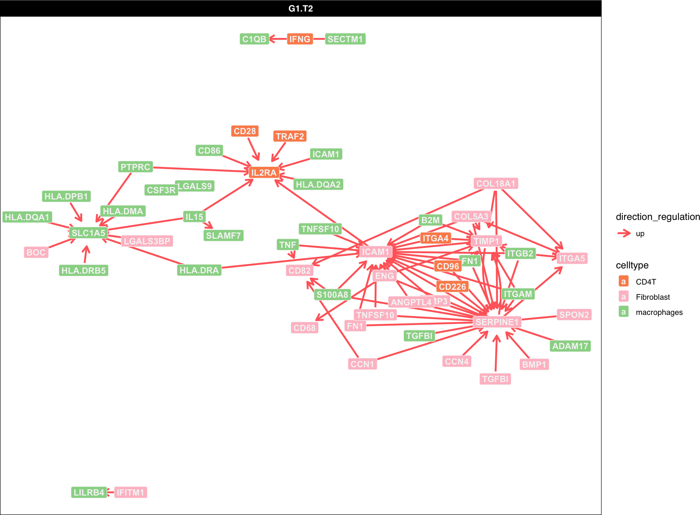

Interestingly, we are only left with interactions that increase after therapy in the E group. This means that we don't find many intercellular regulatory connections for the other groups. In most cases, you will get this type of network for all conditions in your data.

Note: we can also use this network to further prioritize differential CCC interactions. Here we will assume that the most important LR interactions are the ones that are involved in this intercellular regulatory network. We can get these interactions as follows:

```r
network$prioritized_lr_interactions
## # A tibble: 61 × 5
##    group sender      receiver   ligand   receptor
##    <chr> <chr>       <chr>      <chr>    <chr>   
##  1 G1.T2 Fibroblast  Fibroblast TIMP1    CD63    
##  2 G1.T2 Fibroblast  Fibroblast FN1      ITGA5   
##  3 G1.T2 macrophages Fibroblast B2M      TAP1    
##  4 G1.T2 macrophages Fibroblast ITGB2    THY1    
##  5 G1.T2 Fibroblast  Fibroblast FN1      NT5E    
##  6 G1.T2 Fibroblast  Fibroblast TIMP3    ADAMTS4 
##  7 G1.T2 Fibroblast  Fibroblast SERPINE1 PLAU    
##  8 G1.T2 Fibroblast  Fibroblast SERPINE1 PLAUR   
##  9 G1.T2 Fibroblast  Fibroblast CCN1     ITGA5   
## 10 G1.T2 macrophages Fibroblast FN1      ITGA5   
## # ℹ 51 more rows
```


```r
prioritized_tbl_oi_network = prioritized_tbl_oi %>% inner_join(
  network$prioritized_lr_interactions)
prioritized_tbl_oi_network
## # A tibble: 61 × 8
##    group sender      receiver    ligand   receptor id                                    prioritization_score prioritization_rank
##    <chr> <chr>       <chr>       <chr>    <chr>    <chr>                                                <dbl>               <dbl>
##  1 G1.T2 Fibroblast  Fibroblast  SERPINE1 PLAU     SERPINE1_PLAU_Fibroblast_Fibroblast                  0.926                   2
##  2 G1.T2 macrophages macrophages IL15     IL15RA   IL15_IL15RA_macrophages_macrophages                  0.925                   3
##  3 G1.T2 macrophages CD4T        PTPRC    CD247    PTPRC_CD247_macrophages_CD4T                         0.919                   4
##  4 G1.T2 Fibroblast  Fibroblast  TGFBI    ITGA5    TGFBI_ITGA5_Fibroblast_Fibroblast                    0.911                   7
##  5 G1.T2 Fibroblast  Fibroblast  TIMP3    ADAMTS4  TIMP3_ADAMTS4_Fibroblast_Fibroblast                  0.895                  13
##  6 G1.T2 CD4T        Fibroblast  ITGA4    VCAM1    ITGA4_VCAM1_CD4T_Fibroblast                          0.894                  14
##  7 G1.T2 Fibroblast  Fibroblast  SERPINE1 PLAUR    SERPINE1_PLAUR_Fibroblast_Fibroblast                 0.886                  21
##  8 G1.T2 macrophages Fibroblast  ITGB2    ICAM1    ITGB2_ICAM1_macrophages_Fibroblast                   0.885                  22
##  9 G1.T2 macrophages macrophages HLA.DRB5 CD4      HLA.DRB5_CD4_macrophages_macrophages                 0.883                  24
## 10 G1.T2 macrophages macrophages LGALS9   SLC1A5   LGALS9_SLC1A5_macrophages_macrophages                0.877                  29
## # ℹ 51 more rows
```

Visualize now the expression and activity of these interactions for the OnE group

```r
group_oi = "G1.T2"
```


```r
prioritized_tbl_oi_M = prioritized_tbl_oi_network %>% filter(group == group_oi)

plot_oi = make_sample_lr_prod_activity_plots_Omnipath(
  multinichenet_output$prioritization_tables, 
  prioritized_tbl_oi_M %>% inner_join(lr_network_all)
  )
plot_oi
```

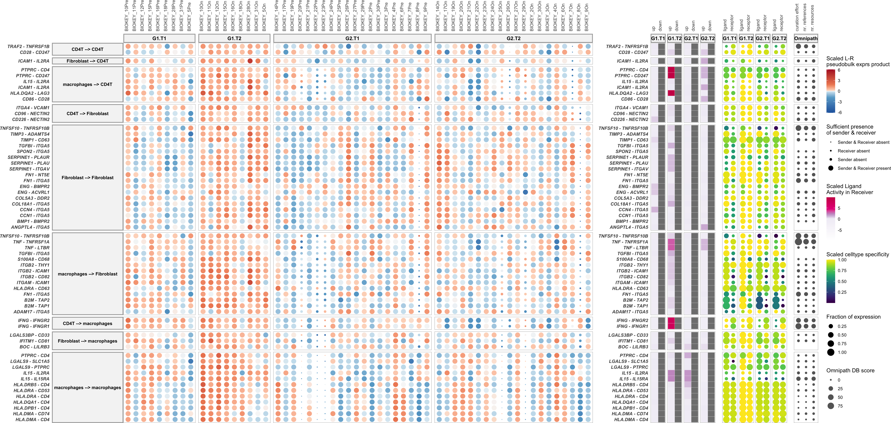

### Plots of cell-cell communication changes

All the above visualizations were general and not specific to the multifactorial design and complex contrast of this data and analysis. In the final part of this vignette, we will demonstrate some visualizations that better showcase differences in therapy-induced cell-cell communication changes. Because it is very hard to do this for the final MultiNicheNet prioritization score including both expression and activity, we will only visualize ligand-receptor expression in the following plots. But realise that the interactions we will show are prioritized by MultiNicheNet not only based on differential expression, but thus also cell-type specificity and ligand activity.

As example, we will focus on the top 10 interactions with stronger On-Pre differences in group1 versus group2.


```r
prioritized_tbl_oi = get_top_n_lr_pairs(multinichenet_output$prioritization_tables, 10, rank_per_group = TRUE, groups_oi = "G1.T2")
```

A first visualization will not require that the timepoint 1 and timepoint 2 samples were gathered from the same subjects. The other visualization will assume this, and can only be generated in those scenarios. 

*Boxplots of LR pseudobulk expression product*

In the following blocks of code, we will first create and reformat a data frame so that we know for each sample the time point (timepoint.1/Pre or timepoint.2/On) and patient group (group1/E or group2/NE), and also what the pseudobulk expression product is for a ligand-receptor pair. 


```r
# create sample-level data frame for these interactions
sample_data = multinichenet_output$prioritization_tables$sample_prioritization_tbl %>% dplyr::filter(id %in% prioritized_tbl_oi$id) %>% dplyr::mutate(sender_receiver = paste(sender, receiver, sep = " --> "), lr_interaction = paste(ligand, receptor, sep = " - "))   %>%  dplyr::arrange(receiver) %>% dplyr::group_by(receiver) %>%  dplyr::arrange(sender, .by_group = TRUE) 

sample_data = sample_data %>% dplyr::mutate(sender_receiver = factor(sender_receiver, levels = sample_data$sender_receiver %>% unique()))
```


```r
# define the time point and group and link it all together
grouping_tbl2 = multinichenet_output$grouping_tbl %>% dplyr::inner_join(multinichenet_output$prioritization_tables$sample_prioritization_tbl %>% dplyr::distinct(sample))
grouping_tbl2 = grouping_tbl2 %>% inner_join(tibble(group = c("G1.T1","G2.T1","G1.T2","G2.T2"), contrast = c("group1","group2","group1","group2")))
  
grouping_tbl2$timepoint = "timepoint2"
grouping_tbl2$timepoint[grouping_tbl2$group %in% c("G1.T1","G2.T1")] = "timepoint1"

sample_data = sample_data %>% ungroup() %>% 
  inner_join(grouping_tbl2)

sample_data = sample_data %>% select(sample, group, contrast, timepoint, id, ligand_receptor_pb_prod) %>% distinct()
```


```r
p_lr_prod_change_boxplot = sample_data %>% 
    ggplot(aes(x = contrast, y = ligand_receptor_pb_prod, fill = timepoint, group = group)) +
    geom_boxplot() + 
    facet_wrap(id~.) +
    theme_bw() +
    xlab("") + ylab("") 

p_lr_prod_change_boxplot
```

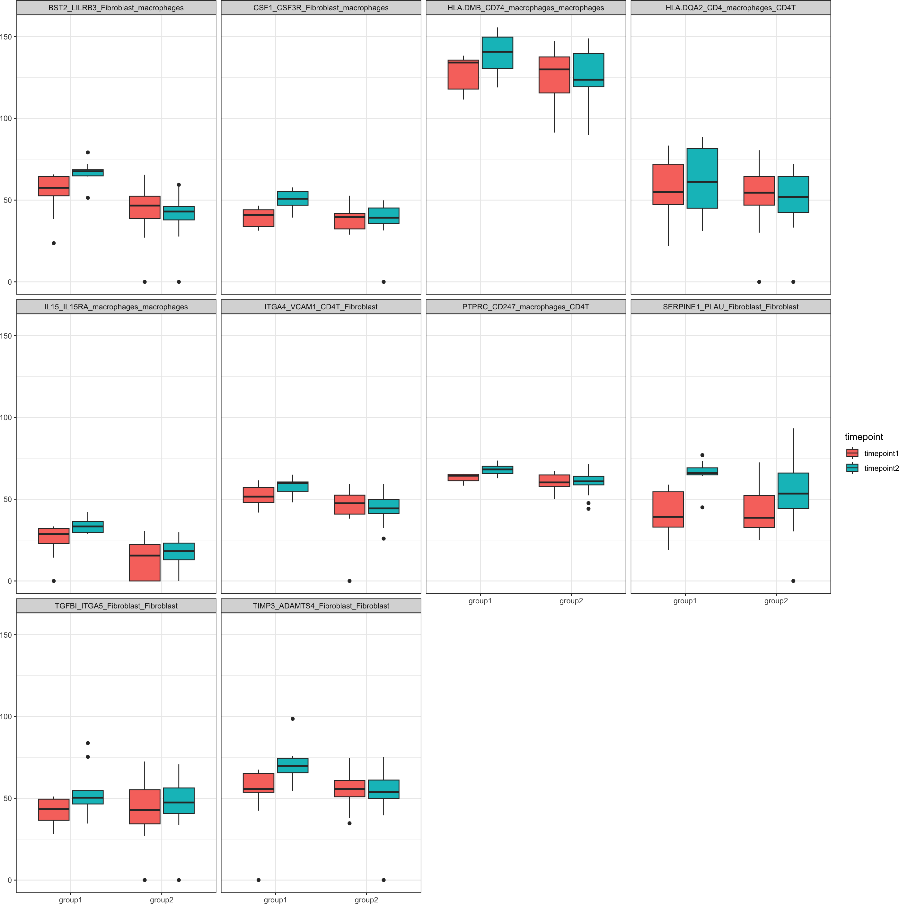
These boxplots reflect what the DE model underlying MultiNicheNet infers: namely average group differences. 

However, these boxplots don't show potential inter-sample heterogeneity. That's why we will also create bubble and line plots in the following blocks of code. In those plots we will calculate the timepoint2 vs timepoint1 differences for each subject separately. Therefore, you can only generate those if you have this type of experimental design (same subject, multiple time points). 

*Difference plots*

Prepare the appropriate data frame structure to create this plots. This will be very similar to the previous blocks of code. Exception: we will now also include information about the subject the samples were collected from + whether sender and receiver cell types were sufficiently present in each subject both before and on treatment.

First: link sample_id to subject_id:


```r
sample_subject_tbl = colData(sce) %>% as_tibble() %>% distinct(patient_id, sample_id) %>% rename(subject = patient_id, sample = sample_id)
```

Create sample-level data frame for these interactions


```r
sample_data = multinichenet_output$prioritization_tables$sample_prioritization_tbl %>% dplyr::filter(id %in% prioritized_tbl_oi$id) %>% dplyr::mutate(sender_receiver = paste(sender, receiver, sep = " --> "), lr_interaction = paste(ligand, receptor, sep = " - "))   %>%  dplyr::arrange(receiver) %>% dplyr::group_by(receiver) %>%  dplyr::arrange(sender, .by_group = TRUE) 

sample_data = sample_data %>% dplyr::mutate(sender_receiver = factor(sender_receiver, levels = sample_data$sender_receiver %>% unique()))
```

Define the time point and group and link it all together


```r
grouping_tbl2 = multinichenet_output$grouping_tbl %>% dplyr::inner_join(multinichenet_output$prioritization_tables$sample_prioritization_tbl %>% dplyr::distinct(sample, sender, receiver, keep_sender, keep_receiver))
grouping_tbl2 = grouping_tbl2 %>% inner_join(tibble(group = c("G1.T1","G2.T1","G1.T2","G2.T2"), contrast = c("group1","group2","group1","group2")))
  
grouping_tbl2$timepoint = "timepoint2"
grouping_tbl2$timepoint[grouping_tbl2$group %in% c("G1.T1","G2.T1")] = "timepoint1"

sample_data = sample_data %>% ungroup() %>% 
  inner_join(grouping_tbl2) %>% 
  inner_join(sample_subject_tbl)

sample_data = sample_data %>% select(subject, sample, group, contrast, timepoint, sender_receiver, keep_sender, keep_receiver, keep_sender_receiver, ligand, receptor, lr_interaction, id, ligand_receptor_pb_prod, scaled_LR_pb_prod) %>% distinct()
```

Then we will remove samples where sender and/or receiver was missing and calculate the On-vs-Pre difference in pseudobulk expression (absolute and relative difference, named respectively `diff` and `lfc`). 


```r
sample_data = sample_data %>% filter(keep_sender & keep_receiver) %>% mutate(group = factor(group, levels = c("G2.T1","G1.T1", "G2.T2","G1.T2")), timepoint = factor(timepoint, levels = c("timepoint1","timepoint2")))
sample_data = sample_data %>% inner_join(
  sample_data %>% filter(keep_receiver == 1 & keep_sender == 1) %>% ungroup() %>% select(id, subject, timepoint, ligand_receptor_pb_prod) %>% distinct() %>% tidyr::spread(timepoint, ligand_receptor_pb_prod) %>% mutate(diff = timepoint2-timepoint1, fc = timepoint2/timepoint1) %>% mutate(lfc = log(fc)) %>% arrange(-lfc)
  )
```

For the visualization, we will also order the subjects based the total difference across all shown interactions:


```r
order_subjects = sample_data %>% group_by(subject) %>% summarise(sum_diff = sum(diff, na.rm = TRUE)) %>% arrange(-sum_diff) %>% pull(subject)
order_samples = sample_data %>% group_by(subject) %>% summarise(sum_diff = sum(diff, na.rm = TRUE)) %>% inner_join(sample_data) %>% arrange(-sum_diff) %>% pull(sample) %>% unique()
```

*Difference Bubble plots*

Bubble Blot for E group

We will now visualize the On-vs-Pre absolute difference in pseudobulk ligand-receptor expression product in a bubble plot. 


```r
max_diff = abs(sample_data$diff) %>% max(na.rm = TRUE)
custom_scale_color = scale_color_gradientn(colours = RColorBrewer::brewer.pal(n = 7, 
        name = "RdBu") %>% rev(), values = c(0, 0.30, 0.425, 
        0.5, 0.575, 0.70, 1), limits = c(-1 * max_diff, max_diff))

p_lr_prod_change = sample_data %>% mutate(subject = factor(subject, levels = order_subjects)) %>%
    ggplot(aes(subject, lr_interaction, color = diff)) +
    geom_point(size = 5) +
    facet_grid(sender_receiver~contrast, scales = "free", space = "free", switch = "y") +
    theme_light() +  
        theme(axis.ticks = element_blank(), axis.title = element_blank(), 
            axis.text.y = element_text(face = "bold.italic", 
                size = 9), axis.text.x = element_text(size = 9, 
                angle = 90, hjust = 0), panel.grid.major = element_blank(), 
            panel.grid.minor = element_blank(), panel.spacing.x = unit(0.4, 
                "lines"), panel.spacing.y = unit(0.25, 
                "lines"), strip.text.x.top = element_text(size = 10, 
                color = "black", face = "bold", angle = 0), 
            strip.text.y.left = element_text(size = 9, color = "black", 
                face = "bold", angle = 0), strip.background = element_rect(color = "darkgrey", 
                fill = "whitesmoke", size = 1.5, linetype = "solid")) +
    custom_scale_color +
    xlab("") + ylab("")
p_lr_prod_change
```

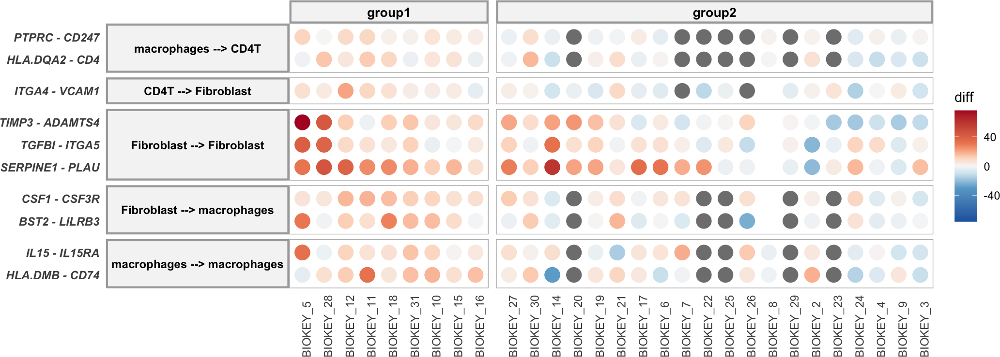

All interactions increased in exrpession in almost all group1 subjects, and certainly not in all group2 subjects. 

*Line plots*

Another type of plot to visualize this type of data is the line plot:


```r
line_plot = sample_data %>% filter(ligand_receptor_pb_prod != 0) %>%
    ggplot(aes(timepoint, ligand_receptor_pb_prod, group = subject, color = contrast)) +
    geom_point() + geom_line() +
    facet_grid(id~contrast, scales = "free", switch = "y") +
    theme_bw() + 
    scale_color_brewer(palette = "Set2") +
    xlab("") + ylab("")
line_plot
```

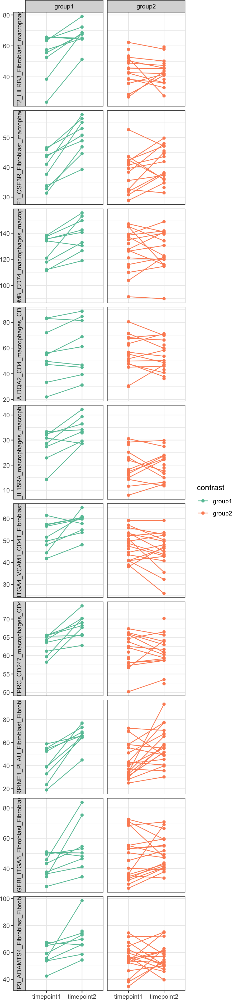
*Bubble plot of pseudobulk values: contrasting t1 and t2*

Now instead of a difference bubble plot, we will plot the timepoint1 and timepoint2 values under each other.


```r
keep_sender_receiver_values = c(0.25, 0.9, 1.75, 4)
names(keep_sender_receiver_values) = levels(sample_data$keep_sender_receiver)

p1 = sample_data %>% mutate(timepoint = factor(timepoint, levels = c("timepoint2","timepoint1"))) %>%
    ggplot(aes(subject, timepoint, color = scaled_LR_pb_prod, size = keep_sender_receiver)) +
    geom_point() +
    facet_grid(sender_receiver + lr_interaction ~ contrast, scales = "free", space = "free", switch = "y") +
    scale_x_discrete(position = "top") +
    theme_light() +
    theme(
      axis.ticks = element_blank(),
      axis.title = element_blank(),
      axis.text.y = element_text(size = 8, face = "bold"),
      axis.text.x = element_text(size = 8,  angle = 90,hjust = 0),
      panel.grid.major = element_blank(),
      panel.grid.minor = element_blank(),
      panel.spacing.x = unit(0.40, "lines"),
      panel.spacing.y = unit(0.25, "lines"),
      strip.text.x.top = element_text(size = 9, color = "black", face = "bold", angle = 0),
      strip.text.y.left = element_text(size = 9, color = "black", face = "bold.italic", angle = 0),
      strip.background = element_rect(color="darkgrey", fill="whitesmoke", size=1.5, linetype="solid")
    ) + labs(color = "Scaled L-R\npseudobulk exprs product", size= "Sufficient presence\nof sender & receiver") + 
    scale_y_discrete(position = "right") +
    scale_size_manual(values = keep_sender_receiver_values)
  max_lfc = abs(sample_data$scaled_LR_pb_prod) %>% max()
  custom_scale_fill = scale_color_gradientn(colours = RColorBrewer::brewer.pal(n = 7, name = "RdBu") %>% rev(),values = c(0, 0.350, 0.4850, 0.5, 0.5150, 0.65, 1),  limits = c(-1*max_lfc, max_lfc))
  
  p1 = p1 + custom_scale_fill
p1
```

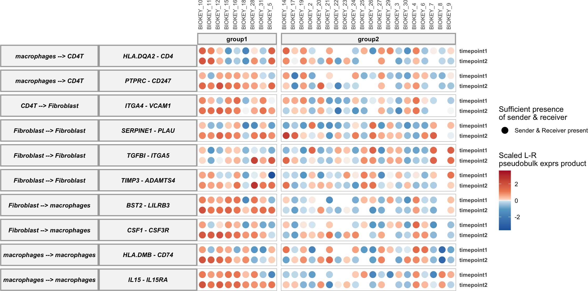

