<style type="text/css">
.smaller {
  font-size: 10px
}
</style>

<!-- github markdown built using
rmarkdown::render("vignettes/multifactorial_analysis_BreastCancer_SACL.rmd", clean = FALSE )
-->


In this vignette, you can learn how to perform a sample-agnostic/cell-level MultiNicheNet analysis on data with complex multifactorial experimental designs. More specifically, we will cover in depth how to study differential dynamics of cell-cell communication between conditions. We will assume the following type of design that is quite common: we have 2 or more conditions/groups of interest, and for each condition we also have 2 or more time points (eg before and after a certain treatment). Research questions are: how does cell-cell communication change over time in each condition? And, importantly, how are these time-related changes different between the conditions? Certainly the latter is a non-trivial question. 

Compared to the vignette [multifactorial_analysis_BreastCancer.knit.md](multifactorial_analysis_BreastCancer.knit.md), this vignette demonstrates how to perform such a multifactorial analysis on data where you have less than 3 samples in each of the groups/conditions. In this workflow, cells from the same condition will be pooled together similar to regular differential cell-cell communication workflows. **We only recommend running this pipeline if you have less than 3 samples in each of the groups/conditions you want to compare. Do not run this workflow if you have more samples per condition.** 

This vignette is quite advanced, so if you are new to the sample-agnostic/cell-level  MultiNicheNet, we recommend reading and running this vignette: [basis_analysis_steps_MISC_SACL.knit.md](basis_analysis_steps_MISC_SACL.knit.md) to get acquainted with the methodology and simple applications. 

As example expression data of interacting cells for this vignette, we will here use scRNAseq data from breast cancer biopsies of patients receiving anti-PD1 immune-checkpoint blockade therapy. Bassez et al. collected from each patient one tumor biopsy before anti-PD1 therapy (“pre-treatment”) and one during subsequent surgery (“on-treatment”) [A single-cell map of intratumoral changes during anti-PD1 treatment of patients with breast cancer](https://www.nature.com/articles/s41591-021-01323-8). Based on additional scTCR-seq results, they identified one group of patients with clonotype expansion as response to the therapy (“E”) and one group with only limited or no clonotype expansion (“NE”). To make this vignette more easily adaptable to the user, we will rename the groups and time points as follows: E --> group1, NE --> group2, Pre-treatment: timepoint1, On-treatment: timepoint2. 

Now, how can we define which CCC patterns are changing during anti-PD1 therapy and which of these changes are specific to E compared to NE patients (and vice versa)?
First, we will run a MultiNicheNet, focusing on anti-PD1 therapy related differences in group1. Secondly, we will do the same for group2. Then we will compare the prioritized interactions between both groups in a basic way. Finally, we will run a MultiNicheNet analysis with a complex contrast to focus specifically on group-specific differences in anti-PD1 therapy associated CCC changes.

In this vignette, we will first prepare the common elements of all MultiNicheNet core analyses, then run, interpret and compare the different analyses.

# Preparation of the MultiNicheNet core analysis


```r
library(SingleCellExperiment)
library(dplyr)
library(ggplot2)
library(nichenetr)
library(multinichenetr)
```

## Load NicheNet's ligand-receptor network and ligand-target matrix

MultiNicheNet builds upon the NicheNet framework and uses the same prior knowledge networks (ligand-receptor network and ligand-target matrix, currently v2 version).

The Nichenet v2 networks and matrices for both mouse and human can be downloaded from Zenodo [](https://doi.org/10.5281/zenodo.7074291). 

We will read these object in for human because our expression data is of human patients. 
Gene names are here made syntactically valid via `make.names()` to avoid the loss of genes (eg H2-M3) in downstream visualizations.


```r
organism = "human"
```


```r
options(timeout = 250)

if(organism == "human"){
  
  lr_network_all = 
    readRDS(url(
      "https://zenodo.org/record/10229222/files/lr_network_human_allInfo_30112033.rds"
      )) %>% 
    mutate(
      ligand = convert_alias_to_symbols(ligand, organism = organism), 
      receptor = convert_alias_to_symbols(receptor, organism = organism))
  
  lr_network_all = lr_network_all  %>% 
    mutate(ligand = make.names(ligand), receptor = make.names(receptor)) 
  
  lr_network = lr_network_all %>% 
    distinct(ligand, receptor)
  
  ligand_target_matrix = readRDS(url(
    "https://zenodo.org/record/7074291/files/ligand_target_matrix_nsga2r_final.rds"
    ))
  
  colnames(ligand_target_matrix) = colnames(ligand_target_matrix) %>% 
    convert_alias_to_symbols(organism = organism) %>% make.names()
  rownames(ligand_target_matrix) = rownames(ligand_target_matrix) %>% 
    convert_alias_to_symbols(organism = organism) %>% make.names()
  
  lr_network = lr_network %>% filter(ligand %in% colnames(ligand_target_matrix))
  ligand_target_matrix = ligand_target_matrix[, lr_network$ligand %>% unique()]
  
} else if(organism == "mouse"){
  
  lr_network_all = readRDS(url(
    "https://zenodo.org/record/10229222/files/lr_network_mouse_allInfo_30112033.rds"
    )) %>% 
    mutate(
      ligand = convert_alias_to_symbols(ligand, organism = organism), 
      receptor = convert_alias_to_symbols(receptor, organism = organism))
  
  lr_network_all = lr_network_all  %>% 
    mutate(ligand = make.names(ligand), receptor = make.names(receptor)) 
  lr_network = lr_network_all %>% 
    distinct(ligand, receptor)
  
  ligand_target_matrix = readRDS(url(
    "https://zenodo.org/record/7074291/files/ligand_target_matrix_nsga2r_final_mouse.rds"
    ))
  
  colnames(ligand_target_matrix) = colnames(ligand_target_matrix) %>% 
    convert_alias_to_symbols(organism = organism) %>% make.names()
  rownames(ligand_target_matrix) = rownames(ligand_target_matrix) %>% 
    convert_alias_to_symbols(organism = organism) %>% make.names()
  
  lr_network = lr_network %>% filter(ligand %in% colnames(ligand_target_matrix))
  ligand_target_matrix = ligand_target_matrix[, lr_network$ligand %>% unique()]
  
}
```

## Read in SingleCellExperiment Object

In this vignette, sender and receiver cell types are in the same SingleCellExperiment object, which we will load here. In this vignette, we will load in a subset of the breast cancer scRNAseq data [](https://doi.org/10.5281/zenodo.8010790). For the sake of demonstration, this subset only contains 3 cell types. 

If you start from a Seurat object, you can convert it easily to a SingleCellExperiment object via `sce = Seurat::as.SingleCellExperiment(seurat_obj, assay = "RNA")`.

Because the NicheNet 2.0. networks are in the most recent version of the official gene symbols, we will make sure that the gene symbols used in the expression data are also updated (= converted from their "aliases" to official gene symbols). Afterwards, we will make them again syntactically valid. 


```r
sce = readRDS(url(
  "https://zenodo.org/record/8010790/files/sce_subset_breastcancer.rds"
  ))
sce = alias_to_symbol_SCE(sce, "human") %>% makenames_SCE()
```

Make sure your dataset also contains normalized counts. If this is not the case, you can calculate this as shown in the next code chunk:


```r
sce = scuttle::logNormCounts(sce)
```

## Prepare the settings of the MultiNicheNet cell-cell communication analysis

In this step, we will formalize our research question into MultiNicheNet input arguments.

In this case study, we want to study differences in therapy-induced cell-cell communication changes (On-vs-Pre therapy) between two patient groups (E vs NE: patients with clonotype expansion versus patients without clonotype expansion). Both therapy-timepoint and patient group are indicated in the following meta data column: `expansion_timepoint`, which has 4 different values: PreE, PreNE, OnE, OnNE.

Cell type annotations are indicated in the `subType` column, and the sample is indicated by the `sample_id` column. 


```r
group_id = "expansion_timepoint" # combination timepoint/KO-vs-WT
sample_id = "sample_id"
celltype_id = "subType"
```

In the sammple-agnostic / cell-level worklow, it is not possible to correct for batch effects or covariates. Therefore, you here have to use the following NA settings:


```r
covariates = NA
batches = NA
```

__Important__: It is required that each sample-id is uniquely assigned to only one condition/group of interest. Therefore, our `sample_id` here does not only indicate the patient, but also the timepoint of sampling.

__Important__: The column names of group, sample, and cell type should be syntactically valid (`make.names`)

__Important__: All group, sample, and cell type names should be syntactically valid as well (`make.names`) (eg through `SummarizedExperiment::colData(sce)$ShortID = SummarizedExperiment::colData(sce)$ShortID %>% make.names()`)

If you want to focus the analysis on specific cell types (e.g. because you know which cell types reside in the same microenvironments based on spatial data), you can define this here. If you have sufficient computational resources and no specific idea of cell-type colocalzations, we recommend to consider all cell types as potential senders and receivers. Later on during analysis of the output it is still possible to zoom in on the cell types that interest you most, but your analysis is not biased to them.

Here we will consider all cell types in the data:


```r
senders_oi = SummarizedExperiment::colData(sce)[,celltype_id] %>% unique()
receivers_oi = SummarizedExperiment::colData(sce)[,celltype_id] %>% unique()
sce = sce[, SummarizedExperiment::colData(sce)[,celltype_id] %in% 
            c(senders_oi, receivers_oi)
          ]
```

In case you would have samples in your data that do not belong to one of the groups/conditions of interest, we recommend removing them and only keeping conditions of interest. 

Before we do this, we will here rename our group/timepoint combinations. 
This is not necessary for you to do this, but then you will need to replace "G1.T1" with the equivalent of group1-timepoint1 in your data. Etc.


```r
SummarizedExperiment::colData(sce)[,group_id][SummarizedExperiment::colData(sce)[,group_id] == "PreE"] = "G1.T1"
SummarizedExperiment::colData(sce)[,group_id][SummarizedExperiment::colData(sce)[,group_id] == "PreNE"] = "G2.T1"
SummarizedExperiment::colData(sce)[,group_id][SummarizedExperiment::colData(sce)[,group_id] == "OnE"] = "G1.T2"
SummarizedExperiment::colData(sce)[,group_id][SummarizedExperiment::colData(sce)[,group_id] == "OnNE"] = "G2.T2"
```


```r
conditions_keep = c("G1.T1", "G2.T1", "G1.T2", "G2.T2")
sce = sce[, SummarizedExperiment::colData(sce)[,group_id] %in% 
            conditions_keep
          ]
```

## Defining the parameters of the MultiNicheNet core analyses

In MultiNicheNet, following steps are executed: 

* 1. Cell-type filtering: determine which cell types are sufficiently present
* 2. Gene filtering: determine which genes are sufficiently expressed in each present cell type
* 3. Pseudobulk expression calculation: determine and normalize per-sample pseudobulk expression levels for each expressed gene in each present cell type
* 4. Differential expression (DE) analysis: determine which genes are differentially expressed
* 5. Ligand activity prediction: use the DE analysis output to predict the activity of ligands in receiver cell types and infer their potential target genes
* 6. Prioritization: rank cell-cell communication patterns through multi-criteria prioritization

For each of these steps, some parameters need to be defined. This is what we will do now.

*Parameters for step 1: Cell-type filtering:*

In a MultiNicheNet analysis we will set a required minimum number of cells per cell type per condition. By default, we set this at 25 here for the sample-agnostic analyses. Conditions that have less than `min_cells` cells will be excluded from the analysis for that specific cell type.
 

```r
min_cells = 25
```

*Parameters for step 2: Gene filtering*

For each cell type, we will consider genes expressed if they are expressed in at least one condition. To do this, we need to set `min_sample_prop = 1`. 


```r
min_sample_prop = 1
```

But how do we define which genes are expressed in a condition? For this we will consider genes as expressed if they have non-zero expression values in a `fraction_cutoff` fraction of cells of that cell type in that condition By default, we set `fraction_cutoff = 0.05`, which means that genes should show non-zero expression values in at least 5% of cells in a condition 


```r
fraction_cutoff = 0.05
```

We recommend using these default values unless there is specific interest in prioritizing (very) weakly expressed interactions. In that case, you could lower the value of `fraction_cutoff`. We explicitly recommend against using `fraction_cutoff > 0.10`.

*Parameters for step 5: Ligand activity prediction*

One of the prioritization criteria is the predicted activity of ligands in receiver cell types. Similarly to base NicheNet (https://github.com/saeyslab/nichenetr), we use the DE output to create a "geneset of interest": here we assume that DE genes within a cell type may be DE because of differential cell-cell communication processes. To determine the genesets of interest based on DE output, we need to define which logFC and/or p-value thresholds we will use. 

We recommend following values for the sample-agnostic FindMarkers-way of DE analysis:


```r
logFC_threshold = 0.25 # lower here for FindMarkers than for Pseudobulk-EdgeR 
p_val_threshold = 0.05 
```


```r
p_val_adj = TRUE 
```

After the ligand activity prediction, we will also infer the predicted target genes of these ligands in each contrast. For this ligand-target inference procedure, we also need to select which top n of the predicted target genes will be considered (here: top 250 targets per ligand). This parameter will not affect the ligand activity predictions. It will only affect ligand-target visualizations and construction of the intercellular regulatory network during the downstream analysis. We recommend users to test other settings in case they would be interested in exploring fewer, but more confident target genes, or vice versa. 


```r
top_n_target = 250
```

The NicheNet ligand activity analysis can be run in parallel for each receiver cell type, by changing the number of cores as defined here. Using more cores will speed up the analysis at the cost of needing more memory. This is only recommended if you have many receiver cell types of interest. You can define here the maximum number of cores you want to be used. 


```r
n.cores = 8
```

*Parameters for step 6: Prioritization*

We will use the following criteria to prioritize ligand-receptor interactions:

* Upregulation of the ligand in a sender cell type and/or upregulation of the receptor in a receiver cell type - in the condition of interest.
* Cell-type specific expression of the ligand in the sender cell type and receptor in the receiver cell type in the condition of interest (to mitigate the influence of upregulated but still relatively weakly expressed ligands/receptors). 
* High NicheNet ligand activity, to further prioritize ligand-receptor pairs based on their predicted effect of the ligand-receptor interaction on the gene expression in the receiver cell type. 

We will combine these prioritization criteria in a single aggregated prioritization score. For the analysis on this type of data (with no or limited samples per condition), we only recommend using `scenario = "no_frac_LR_expr"`.


```r
scenario = "no_frac_LR_expr"
```

Finally, we still need to make one choice. For NicheNet ligand activity we can choose to prioritize ligands that only induce upregulation of target genes (`ligand_activity_down = FALSE`) or can lead potentially lead to both up- and downregulation (`ligand_activity_down = TRUE`). The benefit of `ligand_activity_down = FALSE` is ease of interpretability: prioritized ligand-receptor pairs will be upregulated in the condition of interest, just like their target genes.  `ligand_activity_down = TRUE` can be harder to interpret because target genes of some interactions may be upregulated in the other conditions compared to the condition of interest. This is harder to interpret, but may help to pick up interactions that can also repress gene expression. 

Here we will choose for setting `ligand_activity_down = FALSE` and focus specifically on upregulating ligands.


```r
ligand_activity_down = FALSE
```

# Running the MultiNicheNet core analyses

## 1) G1.T2-G1.T1: Anti-PD1 therapy associated cell-cell communication changes in patients with clonotype expansion (E)

*Set the required contrast of interest.*

Here, we want to compare on-treatment samples with pre-treatment samples for group E. Therefore we can set this contrast as:


```r
contrasts_oi = c("'G1.T2-G1.T1','G1.T1-G1.T2'") 
```

__Very Important__ Note the format to indicate the contrasts! This formatting should be adhered to very strictly, and white spaces are not allowed! Check `?get_DE_info` for explanation about how to define this well. The most important points are that: 
*each contrast is surrounded by single quotation marks
*contrasts are separated by a comma without any white space 
*all contrasts together are surrounded by double quotation marks. 

For downstream visualizations and linking contrasts to their main condition, we also need to run the following:
This is necessary because we will also calculate cell-type+condition specificity of ligands and receptors. 


```r
contrast_tbl = tibble(
  contrast = c("G1.T2-G1.T1", "G1.T1-G1.T2"), 
  group = c("G1.T2","G1.T1")
  )
```

### Run the analysis

*Cell-type filtering: determine which cell types are sufficiently present*


```r
abundance_info = get_abundance_info(
  sce = sce, 
  sample_id = group_id, group_id = group_id, celltype_id = celltype_id, 
  min_cells = min_cells, 
  senders_oi = senders_oi, receivers_oi = receivers_oi, 
  batches = batches
  )
```

You see here that we set `sample_id = group_id`. This is not a mistake. Why do we do this: we use the regular MultiNicheNet code to get cell type abundances per samples and groups. Because we will ignore sample-level information in this vignette, we will set this parameter to the condition/group ID and not the sample ID.

First, we will check the cell type abundance diagnostic plots.

The first plot visualizes the number of cells per celltype-condition combination, and indicates which combinations are removed during the DE analysis because there are less than `min_cells` in the celltype-condition combination. 


```r
abundance_info$abund_plot_sample
```

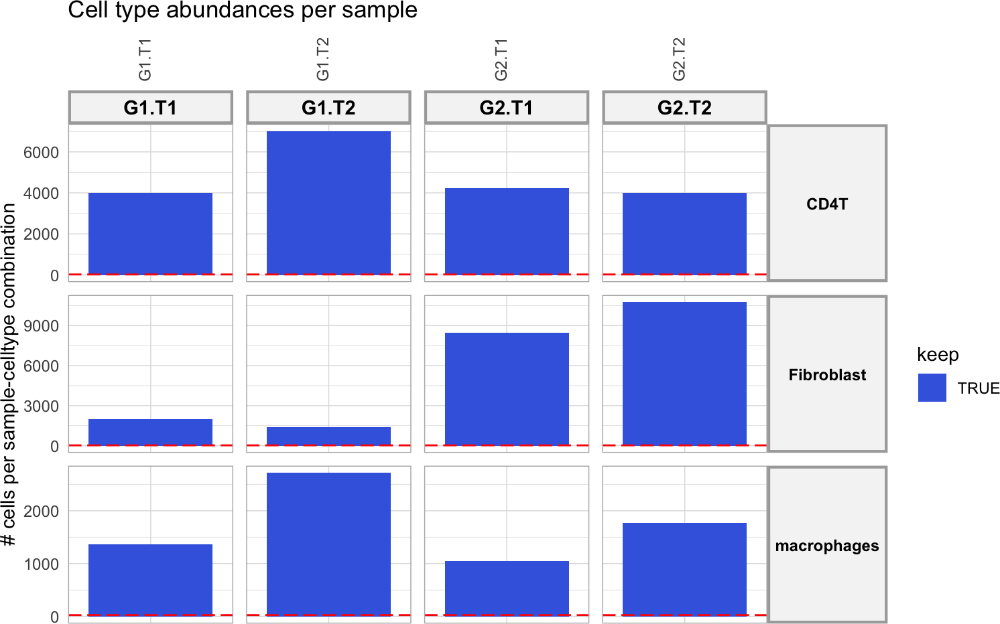

The red dotted line indicates the required minimum of cells as defined above in `min_cells`. We can see here that all cell types are present in all conditions. 

### Cell type filtering based on cell type abundance information

In case this plot would indicate that not all cell types are present in all conditions:
running the following block of code can help you determine which cell types are condition-specific and which cell types are absent. 


```r
sample_group_celltype_df = abundance_info$abundance_data %>% 
  filter(n > min_cells) %>% 
  ungroup() %>% 
  distinct(sample_id, group_id) %>% 
  cross_join(
    abundance_info$abundance_data %>% 
      ungroup() %>% 
      distinct(celltype_id)
    ) %>% 
  arrange(sample_id)

abundance_df = sample_group_celltype_df %>% left_join(
  abundance_info$abundance_data %>% ungroup()
  )

abundance_df$n[is.na(abundance_df$n)] = 0
abundance_df$keep[is.na(abundance_df$keep)] = FALSE
abundance_df_summarized = abundance_df %>% 
  mutate(keep = as.logical(keep)) %>% 
  group_by(group_id, celltype_id) %>% 
  summarise(samples_present = sum((keep)))

celltypes_absent_one_condition = abundance_df_summarized %>% 
  filter(samples_present == 0) %>% pull(celltype_id) %>% unique() 
# find truly condition-specific cell types by searching for cell types 
# truely absent in at least one condition

celltypes_present_one_condition = abundance_df_summarized %>% 
  filter(samples_present >= 1) %>% pull(celltype_id) %>% unique() 
# require presence in at least 1 samples  of one group so 
# it is really present in at least one condition

condition_specific_celltypes = intersect(
  celltypes_absent_one_condition, 
  celltypes_present_one_condition)

total_nr_conditions = SummarizedExperiment::colData(sce)[,group_id] %>% 
  unique() %>% length() 

absent_celltypes = abundance_df_summarized %>% 
  filter(samples_present < 1) %>% 
  group_by(celltype_id) %>% 
  count() %>% 
  filter(n == total_nr_conditions) %>% 
  pull(celltype_id)
  
print("condition-specific celltypes:")
## [1] "condition-specific celltypes:"
print(condition_specific_celltypes)
## character(0)
  
print("absent celltypes:")
## [1] "absent celltypes:"
print(absent_celltypes)
## character(0)
```
Absent cell types and condition-specific cell types will be filtered out for this analysis. 


```r
senders_oi = senders_oi %>% 
    setdiff(union(absent_celltypes, condition_specific_celltypes))
receivers_oi = receivers_oi %>% 
    setdiff(union(absent_celltypes, condition_specific_celltypes))

sce = sce[, SummarizedExperiment::colData(sce)[,celltype_id] %in% 
            c(senders_oi, receivers_oi)
          ]
```


## Gene filtering: determine which genes are sufficiently expressed in each present cell type

Before running the DE analysis, we will determine which genes are not sufficiently expressed and should be filtered out. 
We will perform gene filtering based on a similar procedure as used in `edgeR::filterByExpr`. However, we adapted this procedure to be more interpretable for single-cell datasets.  


```r
frq_list = get_frac_exprs_sampleAgnostic(
  sce = sce, 
  sample_id = sample_id, celltype_id = celltype_id, group_id = group_id, 
  batches = batches, 
  min_cells = min_cells, 
  fraction_cutoff = fraction_cutoff, min_sample_prop = min_sample_prop)
## # A tibble: 6 × 2
##   expansion_timepoint subType    
##   <chr>               <chr>      
## 1 G1.T1               CD4T       
## 2 G1.T1               CD4T       
## 3 G1.T1               Fibroblast 
## 4 G1.T1               macrophages
## 5 G1.T1               CD4T       
## 6 G1.T1               Fibroblast 
##   expansion_timepoint expansion_timepoint     subType
## 1               G1.T1               G1.T1        CD4T
## 2               G1.T1               G1.T1        CD4T
## 3               G1.T1               G1.T1  Fibroblast
## 4               G1.T1               G1.T1 macrophages
## 5               G1.T1               G1.T1        CD4T
## 6               G1.T1               G1.T1  Fibroblast
##   sample group    celltype
## 1  G1.T1 G1.T1        CD4T
## 2  G1.T1 G1.T1        CD4T
## 3  G1.T1 G1.T1  Fibroblast
## 4  G1.T1 G1.T1 macrophages
## 5  G1.T1 G1.T1        CD4T
## 6  G1.T1 G1.T1  Fibroblast
## # A tibble: 6 × 3
##   sample group celltype   
##   <chr>  <chr> <chr>      
## 1 G1.T1  G1.T1 CD4T       
## 2 G1.T1  G1.T1 CD4T       
## 3 G1.T1  G1.T1 Fibroblast 
## 4 G1.T1  G1.T1 macrophages
## 5 G1.T1  G1.T1 CD4T       
## 6 G1.T1  G1.T1 Fibroblast 
## [1] "Groups are considered if they have more than 25 cells of the cell type of interest"
## [1] "Genes with non-zero counts in at least 5% of cells of a cell type of interest in a particular group/condition will be considered as expressed in that group/condition"
## [1] "Genes expressed in at least 1 group will considered as expressed in the cell type: CD4T"
## [1] "Genes expressed in at least 1 group will considered as expressed in the cell type: Fibroblast"
## [1] "Genes expressed in at least 1 group will considered as expressed in the cell type: macrophages"
## [1] "7052 genes are considered as expressed in the cell type: CD4T"
## [1] "8497 genes are considered as expressed in the cell type: Fibroblast"
## [1] "7979 genes are considered as expressed in the cell type: macrophages"
```

Now only keep genes that are expressed by at least one cell type:


```r
genes_oi = frq_list$expressed_df %>% 
  filter(expressed == TRUE) %>% pull(gene) %>% unique() 
sce = sce[genes_oi, ]
```

## Expression calculation: determine and normalize expression levels for each expressed gene in each present cell type

After filtering out absent cell types and genes, we will continue the analysis by calculating the different prioritization criteria that we will use to prioritize cell-cell communication patterns.

First, we will determine and normalize per-condition pseudobulk expression levels for each expressed gene in each present cell type. The function `process_abundance_expression_info` will link this expression information for ligands of the sender cell types to the corresponding receptors of the receiver cell types. This will later on allow us to define the cell-type specicificy criteria for ligands and receptors.


```r
abundance_expression_info = process_abundance_expression_info(
  sce = sce, 
  sample_id = group_id, group_id = group_id, celltype_id = celltype_id, 
  min_cells = min_cells, 
  senders_oi = senders_oi, receivers_oi = receivers_oi, 
  lr_network = lr_network, 
  batches = batches, 
  frq_list = frq_list, 
  abundance_info = abundance_info)
```

You see here that we again set `sample_id = group_id`. This is not a mistake. Why do we do this: we use the regular MultiNicheNet code to get cell type abundances per samples and groups. Because we will ignore sample-level information in this vignette, we will set this parameter to the condition/group ID and not the sample ID.

*Differential expression (DE) analysis: determine which genes are differentially expressed*

In this step, we will perform genome-wide differential expression analysis of receiver and sender cell types to define DE genes between the conditions of interest (as formalized by the `contrasts_oi`). Based on this analysis, we later can define the levels of differential expression of ligands in senders and receptors in receivers, and define the set of affected target genes in the receiver cell types (which will be used for the ligand activity analysis).

Because we don't have several samples per condition, we cannot apply pseudobulking followed by EdgeR as done in the regular MultiNicheNet workflow. Instead, we will here perform a classic FindMarkers approach. 


```r
DE_info_group1 = get_DE_info_sampleAgnostic(
  sce = sce, 
  group_id = group_id, celltype_id = celltype_id, 
  contrasts_oi = contrasts_oi, 
  min_cells = min_cells, 
  expressed_df = frq_list$expressed_df, 
  contrast_tbl = contrast_tbl)
```

Check DE output information in table with logFC and p-values for each gene-celltype-contrast:


```r
DE_info_group1$celltype_de_findmarkers %>% head()
## # A tibble: 6 × 6
##   gene    cluster_id  logFC     p_val     p_adj contrast   
##   <chr>   <chr>       <dbl>     <dbl>     <dbl> <chr>      
## 1 TXNIP   CD4T       -1.33  0         0         G1.T1-G1.T2
## 2 TSC22D3 CD4T       -1.30  0         0         G1.T1-G1.T2
## 3 NFKBIA  CD4T       -1.08  0         0         G1.T1-G1.T2
## 4 PRDM1   CD4T       -0.555 0         0         G1.T1-G1.T2
## 5 CYTIP   CD4T       -0.641 5.29e-321 7.46e-318 G1.T1-G1.T2
## 6 RGS1    CD4T       -0.698 1.44e-196 1.69e-193 G1.T1-G1.T2
```
Evaluate the distributions of p-values:


```r
DE_info_group1$hist_pvals_findmarkers
```

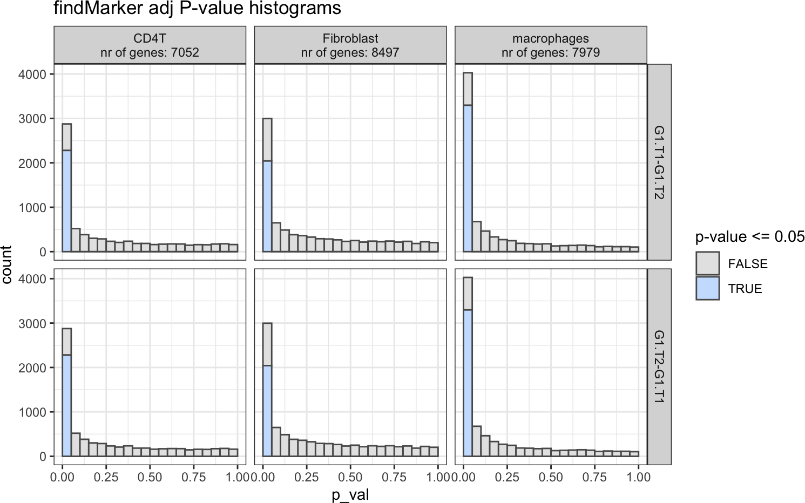

```r
celltype_de_group1 = DE_info_group1$celltype_de_findmarkers
```

*Combine DE information for ligand-senders and receptors-receivers*


```r
sender_receiver_de = combine_sender_receiver_de(
  sender_de = celltype_de_group1,
  receiver_de = celltype_de_group1,
  senders_oi = senders_oi,
  receivers_oi = receivers_oi,
  lr_network = lr_network
)
```


```r
sender_receiver_de %>% head(20)
## # A tibble: 20 × 12
##    contrast    sender     receiver    ligand receptor lfc_ligand lfc_receptor ligand_receptor_lfc_avg p_val_ligand p_adj_ligand p_val_receptor p_adj_receptor
##    <chr>       <chr>      <chr>       <chr>  <chr>         <dbl>        <dbl>                   <dbl>        <dbl>        <dbl>          <dbl>          <dbl>
##  1 G1.T2-G1.T1 Fibroblast macrophages CCN1   ITGB2         1.00       0.171                     0.586     1.47e-88     3.13e-85       5.44e- 9   0.000000130 
##  2 G1.T2-G1.T1 Fibroblast macrophages CCN1   TLR2          1.00       0.107                     0.554     1.47e-88     3.13e-85       6.84e-10   0.0000000198
##  3 G1.T2-G1.T1 Fibroblast Fibroblast  CCN1   ITGA5         1.00       0.0874                    0.544     1.47e-88     3.13e-85       1.90e- 6   0.0000345   
##  4 G1.T2-G1.T1 Fibroblast macrophages CCN1   ITGAM         1.00       0.0617                    0.531     1.47e-88     3.13e-85       1.17e- 3   0.00527     
##  5 G1.T2-G1.T1 Fibroblast CD4T        CCN1   ITGB2         1.00       0.0611                    0.531     1.47e-88     3.13e-85       1.90e- 4   0.00110     
##  6 G1.T2-G1.T1 Fibroblast CD4T        CCN1   ITGB1         1.00       0.0258                    0.513     1.47e-88     3.13e-85       1.24e- 1   0.245       
##  7 G1.T2-G1.T1 Fibroblast macrophages CCN1   SDC4          1.00       0.0118                    0.506     1.47e-88     3.13e-85       2.00e- 1   0.290       
##  8 G1.T2-G1.T1 Fibroblast Fibroblast  CCN1   SDC4          1.00      -0.00293                   0.499     1.47e-88     3.13e-85       7.06e- 1   0.830       
##  9 G1.T2-G1.T1 Fibroblast CD4T        CCN1   ITGA5         1.00      -0.00836                   0.496     1.47e-88     3.13e-85       1.09e- 1   0.222       
## 10 G1.T2-G1.T1 Fibroblast CD4T        CCN1   SDC4          1.00      -0.00914                   0.496     1.47e-88     3.13e-85       7.34e- 2   0.164       
## 11 G1.T2-G1.T1 Fibroblast macrophages CCN1   ITGA6         1.00      -0.0152                    0.493     1.47e-88     3.13e-85       1.03e- 2   0.0292      
## 12 G1.T2-G1.T1 Fibroblast CD4T        CCN1   ITGA6         1.00      -0.0167                    0.492     1.47e-88     3.13e-85       5.41e- 3   0.0203      
## 13 G1.T2-G1.T1 Fibroblast Fibroblast  CCN1   ITGB2         1.00      -0.0218                    0.490     1.47e-88     3.13e-85       2.35e- 2   0.0804      
## 14 G1.T2-G1.T1 Fibroblast macrophages CCN1   ITGB5         1.00      -0.0306                    0.485     1.47e-88     3.13e-85       5.28e- 4   0.00276     
## 15 G1.T2-G1.T1 Fibroblast macrophages CCN1   ITGAV         1.00      -0.0355                    0.483     1.47e-88     3.13e-85       1.78e- 2   0.0445      
## 16 G1.T2-G1.T1 Fibroblast Fibroblast  CCN1   ITGAV         1.00      -0.0563                    0.472     1.47e-88     3.13e-85       1.64e- 2   0.0619      
## 17 G1.T2-G1.T1 Fibroblast macrophages CCN1   ITGA5         1.00      -0.0577                    0.472     1.47e-88     3.13e-85       9.44e- 5   0.000683    
## 18 G1.T1-G1.T2 Fibroblast Fibroblast  COL3A1 ITGB1         0.728      0.205                     0.466     2.09e-24     2.73e-22       1.72e- 9   0.0000000614
## 19 G1.T2-G1.T1 Fibroblast Fibroblast  CCN1   ITGB5         1.00      -0.0844                    0.458     1.47e-88     3.13e-85       3.12e- 4   0.00276     
## 20 G1.T2-G1.T1 Fibroblast macrophages CCN1   TLR4          1.00      -0.0928                    0.454     1.47e-88     3.13e-85       1.23e- 8   0.000000275
```

*Ligand activity prediction: use the DE analysis output to predict the activity of ligands in receiver cell types and infer their potential target genes*

We will first inspect the geneset_oi-vs-background ratios for the default tresholds:


```r
geneset_assessment = contrast_tbl$contrast %>% 
  lapply(
    process_geneset_data, 
    celltype_de_group1, logFC_threshold, p_val_adj, p_val_threshold
  ) %>% 
  bind_rows() 
geneset_assessment
## # A tibble: 6 × 12
##   cluster_id  n_background n_geneset_up n_geneset_down prop_geneset_up prop_geneset_down in_range_up in_range_down contrast    logFC_threshold p_val_threshold adjusted
##   <chr>              <int>        <int>          <int>           <dbl>             <dbl> <lgl>       <lgl>         <chr>                 <dbl>           <dbl> <lgl>   
## 1 CD4T                7052           35             10         0.00496           0.00142 FALSE       FALSE         G1.T2-G1.T1            0.25            0.05 TRUE    
## 2 Fibroblast          8497           83             25         0.00977           0.00294 TRUE        FALSE         G1.T2-G1.T1            0.25            0.05 TRUE    
## 3 macrophages         7979           60             14         0.00752           0.00175 TRUE        FALSE         G1.T2-G1.T1            0.25            0.05 TRUE    
## 4 CD4T                7052           10             35         0.00142           0.00496 FALSE       FALSE         G1.T1-G1.T2            0.25            0.05 TRUE    
## 5 Fibroblast          8497           25             83         0.00294           0.00977 FALSE       TRUE          G1.T1-G1.T2            0.25            0.05 TRUE    
## 6 macrophages         7979           14             60         0.00175           0.00752 FALSE       TRUE          G1.T1-G1.T2            0.25            0.05 TRUE
```

We can see here that for most cell type / contrast combinations, most geneset/background ratio's are NOT within the recommended range (`in_range_up` and `in_range_down` columns).  Therefore, it could be useful to use more lenient thresholds (for these or all cell types). 


```r
logFC_threshold = 0.125  
p_val_threshold = 0.05 
```


```r
p_val_adj = TRUE 
```


```r
geneset_assessment = contrast_tbl$contrast %>% 
  lapply(
    process_geneset_data, 
    celltype_de_group1, logFC_threshold, p_val_adj, p_val_threshold
  ) %>% 
  bind_rows() 
geneset_assessment
## # A tibble: 6 × 12
##   cluster_id  n_background n_geneset_up n_geneset_down prop_geneset_up prop_geneset_down in_range_up in_range_down contrast    logFC_threshold p_val_threshold adjusted
##   <chr>              <int>        <int>          <int>           <dbl>             <dbl> <lgl>       <lgl>         <chr>                 <dbl>           <dbl> <lgl>   
## 1 CD4T                7052          111             56         0.0157            0.00794 TRUE        TRUE          G1.T2-G1.T1           0.125            0.05 TRUE    
## 2 Fibroblast          8497          233             99         0.0274            0.0117  TRUE        TRUE          G1.T2-G1.T1           0.125            0.05 TRUE    
## 3 macrophages         7979          175            103         0.0219            0.0129  TRUE        TRUE          G1.T2-G1.T1           0.125            0.05 TRUE    
## 4 CD4T                7052           56            111         0.00794           0.0157  TRUE        TRUE          G1.T1-G1.T2           0.125            0.05 TRUE    
## 5 Fibroblast          8497           99            233         0.0117            0.0274  TRUE        TRUE          G1.T1-G1.T2           0.125            0.05 TRUE    
## 6 macrophages         7979          103            175         0.0129            0.0219  TRUE        TRUE          G1.T1-G1.T2           0.125            0.05 TRUE
```
This looks better. 

Now we can run the ligand activity analysis: (this will take some time (the more cell types and contrasts, the more time))


```r
ligand_activities_targets_DEgenes = suppressMessages(suppressWarnings(
  get_ligand_activities_targets_DEgenes(
    receiver_de = celltype_de_group1,
    receivers_oi = intersect(receivers_oi, celltype_de_group1$cluster_id %>% unique()),
    ligand_target_matrix = ligand_target_matrix,
    logFC_threshold = logFC_threshold,
    p_val_threshold = p_val_threshold,
    p_val_adj = p_val_adj,
    top_n_target = top_n_target,
    verbose = TRUE, 
    n.cores = n.cores
  )
))
```

*Prioritization: rank cell-cell communication patterns through multi-criteria prioritization*


```r
sender_receiver_tbl = sender_receiver_de %>% distinct(sender, receiver)

metadata_combined = SummarizedExperiment::colData(sce) %>% tibble::as_tibble()

  if(!is.na(batches)){
    grouping_tbl = metadata_combined[,c(group_id, batches)] %>% tibble::as_tibble() %>% dplyr::distinct()
    colnames(grouping_tbl) = c("group",batches)
    grouping_tbl = grouping_tbl %>% mutate(sample = group)
    grouping_tbl = grouping_tbl %>% tibble::as_tibble()
  } else {
    grouping_tbl = metadata_combined[,c(group_id)] %>% tibble::as_tibble() %>% dplyr::distinct()
    colnames(grouping_tbl) = c("group")
    grouping_tbl = grouping_tbl %>% mutate(sample = group) %>% select(sample, group)
    
  }
  
prioritization_tables = suppressMessages(generate_prioritization_tables(
    sender_receiver_info = abundance_expression_info$sender_receiver_info,
    sender_receiver_de = sender_receiver_de,
    ligand_activities_targets_DEgenes = ligand_activities_targets_DEgenes,
    contrast_tbl = contrast_tbl,
    sender_receiver_tbl = sender_receiver_tbl,
    grouping_tbl = grouping_tbl,
    scenario = scenario, 
    fraction_cutoff = fraction_cutoff, 
    abundance_data_receiver = abundance_expression_info$abundance_data_receiver,
    abundance_data_sender = abundance_expression_info$abundance_data_sender,
    ligand_activity_down = ligand_activity_down
  ))
```

*Compile the MultiNicheNet output object*


```r
multinichenet_output_group1_t2vst1 = list(
    celltype_info = abundance_expression_info$celltype_info,
    celltype_de = celltype_de_group1,
    sender_receiver_info = abundance_expression_info$sender_receiver_info,
    sender_receiver_de =  sender_receiver_de,
    ligand_activities_targets_DEgenes = ligand_activities_targets_DEgenes,
    prioritization_tables = prioritization_tables,
    grouping_tbl = grouping_tbl,
    lr_target_prior_cor = tibble()
  ) 
multinichenet_output_group1_t2vst1 = make_lite_output(multinichenet_output_group1_t2vst1)
```

### Interpret the analysis

*Summarizing ChordDiagram circos plots*

In a first instance, we will look at the broad overview of prioritized interactions via condition-specific Chordiagram circos plots.

We will look here at the top 50 predictions across all contrasts, senders, and receivers of interest.


```r
prioritized_tbl_oi_all = get_top_n_lr_pairs(
  multinichenet_output_group1_t2vst1$prioritization_tables, 
  top_n = 50, 
  rank_per_group = FALSE
  )
```


```r
prioritized_tbl_oi = 
  multinichenet_output_group1_t2vst1$prioritization_tables$group_prioritization_tbl %>%
  filter(id %in% prioritized_tbl_oi_all$id) %>%
  distinct(id, sender, receiver, ligand, receptor, group) %>% 
  left_join(prioritized_tbl_oi_all)
prioritized_tbl_oi$prioritization_score[is.na(prioritized_tbl_oi$prioritization_score)] = 0

senders_receivers = union(prioritized_tbl_oi$sender %>% unique(), prioritized_tbl_oi$receiver %>% unique()) %>% sort()

colors_sender = RColorBrewer::brewer.pal(n = length(senders_receivers), name = 'Spectral') %>% magrittr::set_names(senders_receivers)
colors_receiver = RColorBrewer::brewer.pal(n = length(senders_receivers), name = 'Spectral') %>% magrittr::set_names(senders_receivers)

circos_list = make_circos_group_comparison(prioritized_tbl_oi, colors_sender, colors_receiver)
```

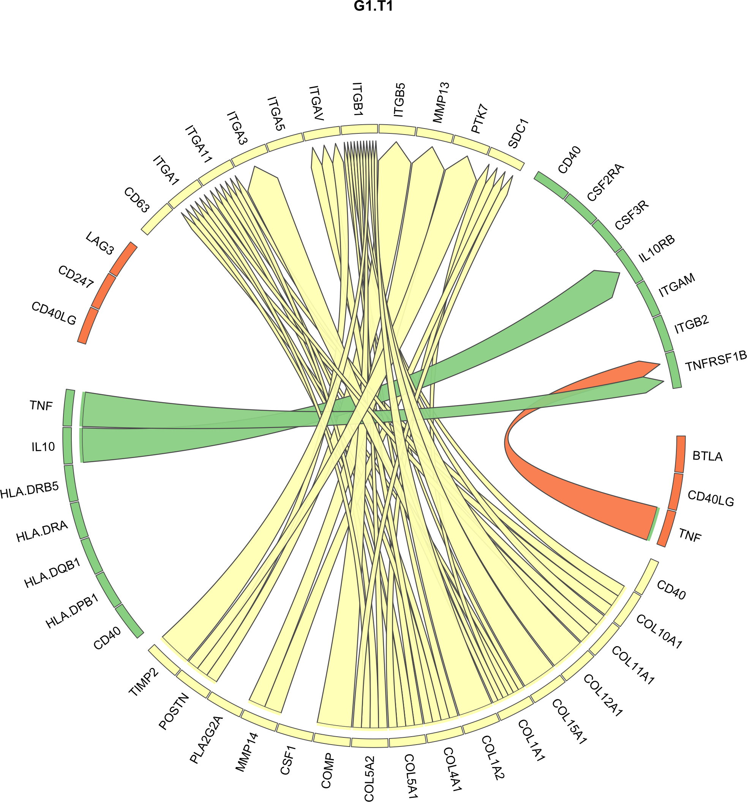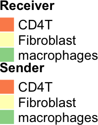

*Interpretable bubble plots*

Whereas these ChordDiagrams show the most specific interactions per group, they don't give insights into the data behind these predictions. Therefore we will now look at visualizations that indicate the different prioritization criteria used in MultiNicheNet. 

In the next type of plots, we will 1) visualize the per-sample scaled product of normalized ligand and receptor pseudobulk expression, 2) visualize the scaled ligand activities, and 3) cell-type specificity. 

We will now check the top interactions specific for the OnE group (G1.T2) - so these are the interactions that increase during anti-PD1 therapy.


```r
group_oi = "G1.T2"
```


```r
prioritized_tbl_oi_50 = get_top_n_lr_pairs(
  multinichenet_output_group1_t2vst1$prioritization_tables, 
  top_n = 50, rank_per_group = FALSE) %>% filter(group == group_oi)
```


```r
prioritized_tbl_oi_50_omnipath = prioritized_tbl_oi_50 %>% 
  inner_join(lr_network_all)
```

Now we add this to the bubble plot visualization:

```r
plot_oi = make_sample_lr_prod_activity_plots_Omnipath(
  multinichenet_output_group1_t2vst1$prioritization_tables, 
  prioritized_tbl_oi_50_omnipath)
plot_oi
```


Interestingly, we can already see that some of these interactions are only increasing in the E group, whereas others change in the NE group as well!

In practice, we always recommend generating these plots for all conditions/contrasts. To avoid that this vignette becomes too long, we will not do this here. 

Now let's do the same analysis for the NE group instead

## 2) G2.T2-G2.T1: Anti-PD1 therapy associated cell-cell communication changes in patients without clonotype expansion (NE)

*Set the required contrast of interest.*

Here, we want to compare on-treatment samples with pre-treatment samples for group NE. Therefore we can set this contrast as:


```r
contrasts_oi = c("'G2.T2-G2.T1','G2.T1-G2.T2'") 
```


```r
contrast_tbl = tibble(
  contrast = c("G2.T2-G2.T1", "G2.T1-G2.T2"), 
  group = c("G2.T2","G2.T1")
  )
```

### Run the analysis

In this case, the first 3 steps (cell-type filtering, gene filtering, and pseudobulk expression calculation) were run for the entire dataset and are exactly the same now as for the first MultiNicheNet analysis. Therefore, we will not redo these steps, and just start with step 4, the first unique step for this second analysis.

*Differential expression (DE) analysis: determine which genes are differentially expressed*
  
In this step, we will perform genome-wide differential expression analysis of receiver and sender cell types to define DE genes between the conditions of interest (as formalized by the `contrasts_oi`). Based on this analysis, we later can define the levels of differential expression of ligands in senders and receptors in receivers, and define the set of affected target genes in the receiver cell types (which will be used for the ligand activity analysis).

Because we don't have several samples per condition, we cannot apply pseudobulking followed by EdgeR as done in the regular MultiNicheNet workflow. Instead, we will here perform a classic FindMarkers approach. 


```r
DE_info_group2 = get_DE_info_sampleAgnostic(
  sce = sce, 
  group_id = group_id, celltype_id = celltype_id, 
  contrasts_oi = contrasts_oi, 
  min_cells = min_cells, 
  expressed_df = frq_list$expressed_df, 
  contrast_tbl = contrast_tbl)
```

Check DE output information in table with logFC and p-values for each gene-celltype-contrast:


```r
DE_info_group2$celltype_de_findmarkers %>% head()
## # A tibble: 6 × 6
##   gene    cluster_id  logFC     p_val     p_adj contrast   
##   <chr>   <chr>       <dbl>     <dbl>     <dbl> <chr>      
## 1 TXNIP   CD4T       -1.69  0         0         G2.T1-G2.T2
## 2 TSC22D3 CD4T       -1.46  0         0         G2.T1-G2.T2
## 3 BTG1    CD4T       -1.16  0         0         G2.T1-G2.T2
## 4 NFKBIA  CD4T       -1.12  0         0         G2.T1-G2.T2
## 5 PRDM1   CD4T       -0.467 1.12e-237 1.58e-234 G2.T1-G2.T2
## 6 CYTIP   CD4T       -0.592 3.38e-222 3.98e-219 G2.T1-G2.T2
```
Evaluate the distributions of p-values:


```r
DE_info_group2$hist_pvals_findmarkers
```

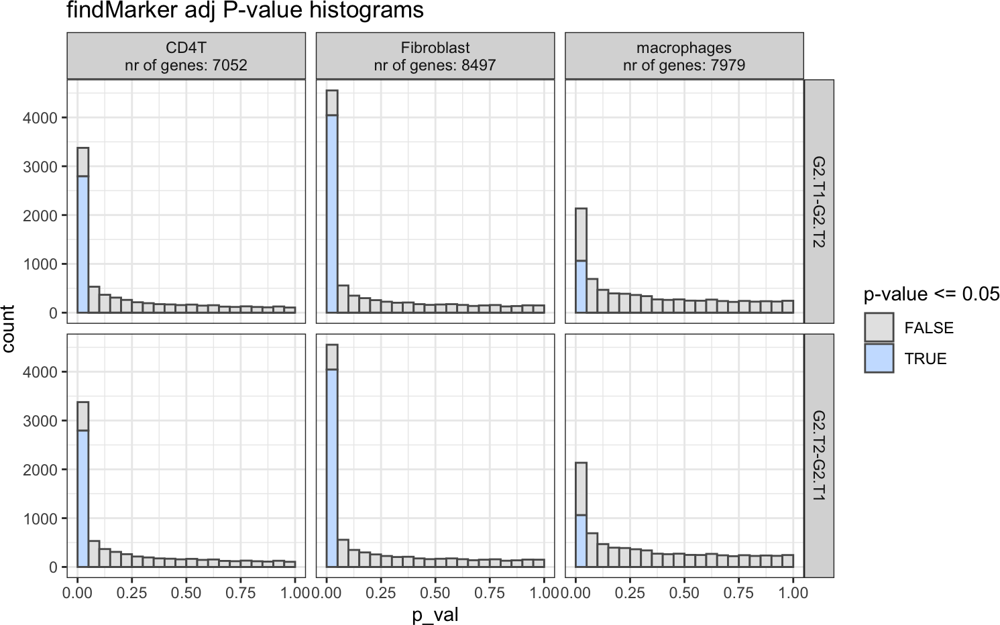


```r
celltype_de_group2 = DE_info_group2$celltype_de_findmarkers
```

*Combine DE information for ligand-senders and receptors-receivers*


```r
sender_receiver_de = combine_sender_receiver_de(
  sender_de = celltype_de_group2,
  receiver_de = celltype_de_group2,
  senders_oi = senders_oi,
  receivers_oi = receivers_oi,
  lr_network = lr_network
)
```


```r
sender_receiver_de %>% head(20)
## # A tibble: 20 × 12
##    contrast    sender     receiver    ligand receptor lfc_ligand lfc_receptor ligand_receptor_lfc_avg p_val_ligand p_adj_ligand p_val_receptor p_adj_receptor
##    <chr>       <chr>      <chr>       <chr>  <chr>         <dbl>        <dbl>                   <dbl>        <dbl>        <dbl>          <dbl>          <dbl>
##  1 G2.T2-G2.T1 Fibroblast Fibroblast  CCN2   ITGA5          1.28      0.0881                    0.685            0            0       3.68e-31       1.32e-29
##  2 G2.T2-G2.T1 Fibroblast Fibroblast  CCN2   LRP6           1.28      0.00162                   0.642            0            0       7.15e- 1       7.91e- 1
##  3 G2.T2-G2.T1 Fibroblast Fibroblast  CCN2   IGF2R          1.28     -0.00577                   0.638            0            0       3.14e- 1       4.23e- 1
##  4 G2.T2-G2.T1 Fibroblast Fibroblast  CCN1   ITGA5          1.19      0.0881                    0.637            0            0       3.68e-31       1.32e-29
##  5 G2.T2-G2.T1 Fibroblast Fibroblast  CCN2   ITGB2          1.28     -0.0132                    0.635            0            0       2.72e- 5       1.17e- 4
##  6 G2.T2-G2.T1 Fibroblast CD4T        CCN2   ITGA5          1.28     -0.0191                    0.632            0            0       2.38e- 3       8.83e- 3
##  7 G2.T2-G2.T1 Fibroblast Fibroblast  CCN1   ITGAV          1.19      0.0754                    0.631            0            0       4.70e-15       6.41e-14
##  8 G2.T2-G2.T1 Fibroblast CD4T        CCN2   IGF2R          1.28     -0.0218                    0.630            0            0       3.53e- 4       1.81e- 3
##  9 G2.T2-G2.T1 Fibroblast CD4T        CCN2   ITGB2          1.28     -0.0224                    0.630            0            0       2.02e- 1       3.09e- 1
## 10 G2.T2-G2.T1 Fibroblast Fibroblast  CCN2   LRP1           1.28     -0.0226                    0.630            0            0       1.28e- 1       2.04e- 1
## 11 G2.T2-G2.T1 Fibroblast Fibroblast  CCN1   ITGB5          1.19      0.0696                    0.628            0            0       1.74e- 9       1.47e- 8
## 12 G2.T2-G2.T1 Fibroblast macrophages CCN2   IGF2R          1.28     -0.0342                    0.624            0            0       4.21e- 2       1.69e- 1
## 13 G2.T2-G2.T1 Fibroblast macrophages CCN2   ITGAM          1.28     -0.0426                    0.620            0            0       3.57e- 2       1.52e- 1
## 14 G2.T2-G2.T1 Fibroblast macrophages CCN2   ITGA5          1.28     -0.0434                    0.619            0            0       5.12e- 3       4.15e- 2
## 15 G2.T2-G2.T1 Fibroblast macrophages CCN1   ITGB1          1.19      0.0283                    0.607            0            0       2.08e- 1       4.42e- 1
## 16 G2.T2-G2.T1 Fibroblast macrophages CCN2   ITGB2          1.28     -0.0768                    0.603            0            0       2.01e- 2       1.07e- 1
## 17 G2.T2-G2.T1 Fibroblast macrophages CCN1   SDC4           1.19      0.0171                    0.602            0            0       3.90e- 2       1.61e- 1
## 18 G2.T2-G2.T1 Fibroblast macrophages CCN1   ITGB5          1.19      0.0105                    0.598            0            0       4.00e- 1       6.31e- 1
## 19 G2.T2-G2.T1 Fibroblast macrophages CCN1   TLR2           1.19      0.00396                   0.595            0            0       8.50e- 1       9.33e- 1
## 20 G2.T2-G2.T1 Fibroblast Fibroblast  CCN1   SDC4           1.19      0.00320                   0.595            0            0       3.47e- 1       4.58e- 1
```

*Ligand activity prediction: use the DE analysis output to predict the activity of ligands in receiver cell types and infer their potential target genes*

We will first inspect the geneset_oi-vs-background ratios for the default tresholds:


```r
logFC_threshold = 0.25  
p_val_threshold = 0.05 
```


```r
p_val_adj = TRUE 
```


```r
geneset_assessment = contrast_tbl$contrast %>% 
  lapply(
    process_geneset_data, 
    celltype_de_group2, logFC_threshold, p_val_adj, p_val_threshold
  ) %>% 
  bind_rows() 
geneset_assessment
## # A tibble: 6 × 12
##   cluster_id  n_background n_geneset_up n_geneset_down prop_geneset_up prop_geneset_down in_range_up in_range_down contrast    logFC_threshold p_val_threshold adjusted
##   <chr>              <int>        <int>          <int>           <dbl>             <dbl> <lgl>       <lgl>         <chr>                 <dbl>           <dbl> <lgl>   
## 1 CD4T                7052           30              7        0.00425           0.000993 FALSE       FALSE         G2.T2-G2.T1            0.25            0.05 TRUE    
## 2 Fibroblast          8497           50              8        0.00588           0.000942 TRUE        FALSE         G2.T2-G2.T1            0.25            0.05 TRUE    
## 3 macrophages         7979           35             24        0.00439           0.00301  FALSE       FALSE         G2.T2-G2.T1            0.25            0.05 TRUE    
## 4 CD4T                7052            7             30        0.000993          0.00425  FALSE       FALSE         G2.T1-G2.T2            0.25            0.05 TRUE    
## 5 Fibroblast          8497            8             50        0.000942          0.00588  FALSE       TRUE          G2.T1-G2.T2            0.25            0.05 TRUE    
## 6 macrophages         7979           24             35        0.00301           0.00439  FALSE       FALSE         G2.T1-G2.T2            0.25            0.05 TRUE
```

We can see here that for most cell type / contrast combinations, most geneset/background ratio's are NOT within the recommended range (`in_range_up` and `in_range_down` columns).  Therefore, it could be useful to use more lenient thresholds (for these or all cell types). 


```r
logFC_threshold = 0.125  
p_val_threshold = 0.05 
```


```r
p_val_adj = TRUE 
```


```r
geneset_assessment = contrast_tbl$contrast %>% 
  lapply(
    process_geneset_data, 
    celltype_de_group2, logFC_threshold, p_val_adj, p_val_threshold
  ) %>% 
  bind_rows() 
geneset_assessment
## # A tibble: 6 × 12
##   cluster_id  n_background n_geneset_up n_geneset_down prop_geneset_up prop_geneset_down in_range_up in_range_down contrast    logFC_threshold p_val_threshold adjusted
##   <chr>              <int>        <int>          <int>           <dbl>             <dbl> <lgl>       <lgl>         <chr>                 <dbl>           <dbl> <lgl>   
## 1 CD4T                7052           76             52         0.0108            0.00737 TRUE        TRUE          G2.T2-G2.T1           0.125            0.05 TRUE    
## 2 Fibroblast          8497          166             48         0.0195            0.00565 TRUE        TRUE          G2.T2-G2.T1           0.125            0.05 TRUE    
## 3 macrophages         7979          115             85         0.0144            0.0107  TRUE        TRUE          G2.T2-G2.T1           0.125            0.05 TRUE    
## 4 CD4T                7052           52             76         0.00737           0.0108  TRUE        TRUE          G2.T1-G2.T2           0.125            0.05 TRUE    
## 5 Fibroblast          8497           48            166         0.00565           0.0195  TRUE        TRUE          G2.T1-G2.T2           0.125            0.05 TRUE    
## 6 macrophages         7979           85            115         0.0107            0.0144  TRUE        TRUE          G2.T1-G2.T2           0.125            0.05 TRUE
```
This looks better. 

Now we can run the ligand activity analysis: (this will take some time (the more cell types and contrasts, the more time))


```r
ligand_activities_targets_DEgenes = suppressMessages(suppressWarnings(
  get_ligand_activities_targets_DEgenes(
    receiver_de = celltype_de_group2,
    receivers_oi = intersect(receivers_oi, celltype_de_group2$cluster_id %>% unique()),
    ligand_target_matrix = ligand_target_matrix,
    logFC_threshold = logFC_threshold,
    p_val_threshold = p_val_threshold,
    p_val_adj = p_val_adj,
    top_n_target = top_n_target,
    verbose = TRUE, 
    n.cores = n.cores
  )
))
```

*Prioritization: rank cell-cell communication patterns through multi-criteria prioritization*
  

```r
sender_receiver_tbl = sender_receiver_de %>% distinct(sender, receiver)

metadata_combined = SummarizedExperiment::colData(sce) %>% tibble::as_tibble()

if(!is.na(batches)){
  grouping_tbl = metadata_combined[,c(group_id, batches)] %>% tibble::as_tibble() %>% dplyr::distinct()
  colnames(grouping_tbl) = c("group",batches)
  grouping_tbl = grouping_tbl %>% mutate(sample = group)
  grouping_tbl = grouping_tbl %>% tibble::as_tibble()
} else {
  grouping_tbl = metadata_combined[,c(group_id)] %>% tibble::as_tibble() %>% dplyr::distinct()
  colnames(grouping_tbl) = c("group")
  grouping_tbl = grouping_tbl %>% mutate(sample = group) %>% select(sample, group)
  
}

prioritization_tables = suppressMessages(generate_prioritization_tables(
  sender_receiver_info = abundance_expression_info$sender_receiver_info,
  sender_receiver_de = sender_receiver_de,
  ligand_activities_targets_DEgenes = ligand_activities_targets_DEgenes,
  contrast_tbl = contrast_tbl,
  sender_receiver_tbl = sender_receiver_tbl,
  grouping_tbl = grouping_tbl,
  scenario = scenario, 
  fraction_cutoff = fraction_cutoff, 
  abundance_data_receiver = abundance_expression_info$abundance_data_receiver,
  abundance_data_sender = abundance_expression_info$abundance_data_sender,
  ligand_activity_down = ligand_activity_down
))
```

*Compile the MultiNicheNet output object*
  

```r
multinichenet_output_group2_t2vst1 = list(
  celltype_info = abundance_expression_info$celltype_info,
  celltype_de = celltype_de_group2,
  sender_receiver_info = abundance_expression_info$sender_receiver_info,
  sender_receiver_de =  sender_receiver_de,
  ligand_activities_targets_DEgenes = ligand_activities_targets_DEgenes,
  prioritization_tables = prioritization_tables,
  grouping_tbl = grouping_tbl,
  lr_target_prior_cor = tibble()
) 
multinichenet_output_group2_t2vst1 = make_lite_output(multinichenet_output_group2_t2vst1)
```

### Interpret the analysis

*Summarizing ChordDiagram circos plots*
  
In a first instance, we will look at the broad overview of prioritized interactions via condition-specific Chordiagram circos plots.

We will look here at the top 50 predictions across all contrasts, senders, and receivers of interest.


```r
prioritized_tbl_oi_all = get_top_n_lr_pairs(
  multinichenet_output_group2_t2vst1$prioritization_tables, 
  top_n = 50, 
  rank_per_group = FALSE
)
```


```r
prioritized_tbl_oi = 
  multinichenet_output_group2_t2vst1$prioritization_tables$group_prioritization_tbl %>%
  filter(id %in% prioritized_tbl_oi_all$id) %>%
  distinct(id, sender, receiver, ligand, receptor, group) %>% 
  left_join(prioritized_tbl_oi_all)
prioritized_tbl_oi$prioritization_score[is.na(prioritized_tbl_oi$prioritization_score)] = 0

senders_receivers = union(prioritized_tbl_oi$sender %>% unique(), prioritized_tbl_oi$receiver %>% unique()) %>% sort()

colors_sender = RColorBrewer::brewer.pal(n = length(senders_receivers), name = 'Spectral') %>% magrittr::set_names(senders_receivers)
colors_receiver = RColorBrewer::brewer.pal(n = length(senders_receivers), name = 'Spectral') %>% magrittr::set_names(senders_receivers)

circos_list = make_circos_group_comparison(prioritized_tbl_oi, colors_sender, colors_receiver)
```

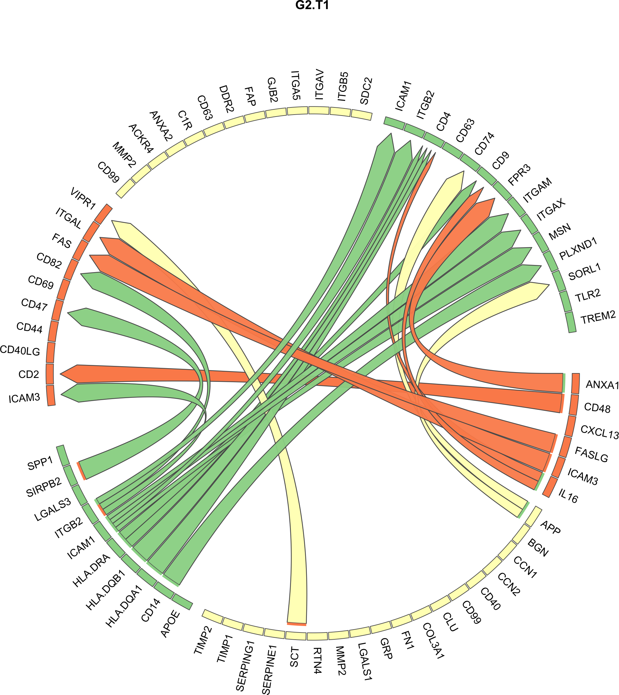

*Interpretable bubble plots*
  
Whereas these ChordDiagrams show the most specific interactions per group, they don't give insights into the data behind these predictions. Therefore we will now look at visualizations that indicate the different prioritization criteria used in MultiNicheNet. 

In the next type of plots, we will 1) visualize the per-sample scaled product of normalized ligand and receptor pseudobulk expression, 2) visualize the scaled ligand activities, and 3) cell-type specificity. 

We will now check the top interactions specific for the OnNE group (G2.T2) - so these are the interactions that increase during anti-PD1 therapy.


```r
group_oi = "G2.T2"
```


```r
prioritized_tbl_oi_50 = get_top_n_lr_pairs(
  multinichenet_output_group2_t2vst1$prioritization_tables, 
  top_n = 50, rank_per_group = FALSE) %>% filter(group == group_oi)
```


```r
prioritized_tbl_oi_50_omnipath = prioritized_tbl_oi_50 %>% 
  inner_join(lr_network_all)
```

Now we add this to the bubble plot visualization:

```r
plot_oi = make_sample_lr_prod_activity_plots_Omnipath(
  multinichenet_output_group2_t2vst1$prioritization_tables, 
  prioritized_tbl_oi_50_omnipath)
plot_oi
```

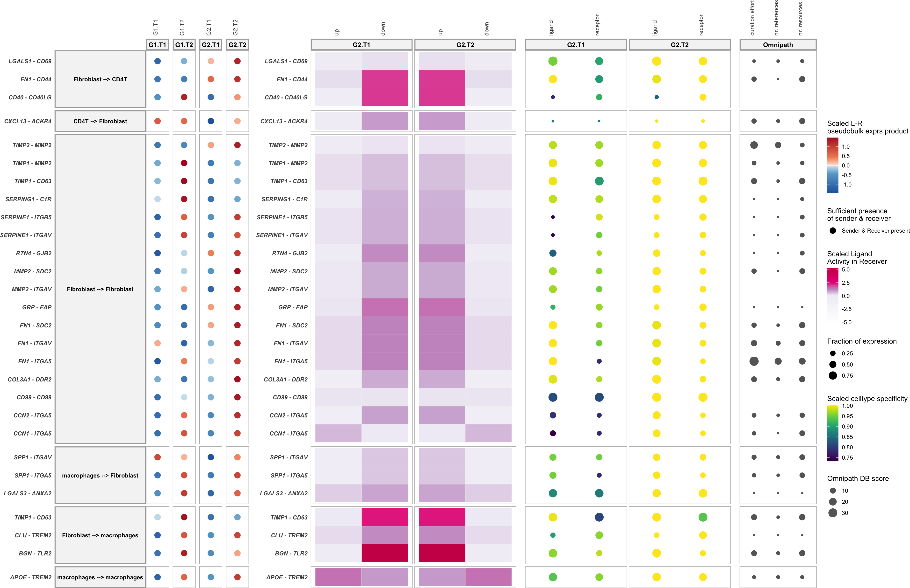
Interestingly, we can already see that some of these interactions are only increasing in the NE group, whereas others change in the E group as well (or even more strongly)!

__In practice, we always recommend generating these plots for all conditions/contrasts. To avoid that this vignette becomes too long, we will not do this here. __

So interesting observation: even though the NE group is characterized by a lack of T cell clonotype expansion after therapy, there are still clear therapy-induced differences on gene expression and cell-cell communication.

Interestingly, we can see here as well that some interactions are only increasing in the NE group, whereas others change in the E group as well!

This brings us to the next research question: do some interactions increase/decrease more in the E group vs the NE group or vice versa? 

## 3A) E-vs-NE: simple comparison of prioritized anti-PD1 therapy-associated CCC patterns

To address this question, we will first do a simple analysis. We will just compare the prioritization scores between the E and the NE group, to find CCC patterns that are most different between the E and NE group.

*Set up the comparisons*


```r
comparison_table = multinichenet_output_group1_t2vst1$prioritization_tables$group_prioritization_tbl %>% 
  select(group, id, prioritization_score) %>% 
  rename(prioritization_score_group1 = prioritization_score) %>% 
  mutate(group = case_when(
    group == "G1.T1" ~ "timepoint1",
    group == "G1.T2" ~ "timepoint2",
    TRUE ~ group)
    ) %>% 
  inner_join(
    multinichenet_output_group2_t2vst1$prioritization_tables$group_prioritization_tbl %>% 
      select(group, id, prioritization_score) %>% 
      rename(prioritization_score_group2 = prioritization_score) %>% 
  mutate(group = case_when(
    group == "G2.T1" ~ "timepoint1",
    group == "G2.T2" ~ "timepoint2",
    TRUE ~ group)
    )
  ) %>%  
  mutate(difference_group1_vs_group2 = prioritization_score_group1 - prioritization_score_group2) 
```

Let's now inspect some of the top interactions that got much higher scores in the E group


```r
comparison_table %>% 
  arrange(-difference_group1_vs_group2) %>% 
  filter(prioritization_score_group1 > 0.80)
## # A tibble: 635 × 5
##    group      id                                 prioritization_score_group1 prioritization_score_group2 difference_group1_vs_group2
##    <chr>      <chr>                                                    <dbl>                       <dbl>                       <dbl>
##  1 timepoint2 BST2_LILRB3_Fibroblast_macrophages                       0.870                       0.401                       0.469
##  2 timepoint1 COL1A1_ITGAV_Fibroblast_Fibroblast                       0.959                       0.507                       0.452
##  3 timepoint1 MIF_ACKR3_macrophages_Fibroblast                         0.821                       0.381                       0.439
##  4 timepoint1 POSTN_ITGB5_Fibroblast_Fibroblast                        0.952                       0.548                       0.403
##  5 timepoint1 POSTN_ITGAV_Fibroblast_Fibroblast                        0.936                       0.538                       0.398
##  6 timepoint1 INHBA_TGFBR3_Fibroblast_Fibroblast                       0.855                       0.463                       0.392
##  7 timepoint2 TNFSF10_TNFRSF10A_Fibroblast_CD4T                        0.805                       0.437                       0.368
##  8 timepoint1 COL1A1_ITGB1_Fibroblast_Fibroblast                       0.989                       0.622                       0.367
##  9 timepoint1 ADM_RAMP2_macrophages_Fibroblast                         0.818                       0.453                       0.365
## 10 timepoint1 POSTN_PTK7_Fibroblast_Fibroblast                         0.916                       0.551                       0.365
## # ℹ 625 more rows
```

Let's now inspect some of the top interactions that got much higher scores in the NE group


```r
comparison_table %>% 
  arrange(difference_group1_vs_group2) %>% 
  filter(prioritization_score_group2 > 0.80)
## # A tibble: 511 × 5
##    group      id                                   prioritization_score_group1 prioritization_score_group2 difference_group1_vs_group2
##    <chr>      <chr>                                                      <dbl>                       <dbl>                       <dbl>
##  1 timepoint1 C3_ITGB2_macrophages_macrophages                           0.452                       0.875                      -0.423
##  2 timepoint1 HLA.DMA_CD74_macrophages_macrophages                       0.493                       0.895                      -0.402
##  3 timepoint2 FN1_SDC2_Fibroblast_macrophages                            0.470                       0.868                      -0.398
##  4 timepoint1 C3_ITGAM_macrophages_macrophages                           0.476                       0.868                      -0.391
##  5 timepoint1 TNFSF10_TNFRSF10A_Fibroblast_CD4T                          0.468                       0.850                      -0.383
##  6 timepoint1 HLA.DMB_CD74_macrophages_macrophages                       0.487                       0.866                      -0.379
##  7 timepoint1 VCAM1_ITGB2_Fibroblast_macrophages                         0.499                       0.873                      -0.374
##  8 timepoint2 COL1A1_ITGAV_Fibroblast_Fibroblast                         0.492                       0.863                      -0.370
##  9 timepoint1 S100A8_ITGB2_macrophages_macrophages                       0.504                       0.866                      -0.362
## 10 timepoint2 GRP_FAP_Fibroblast_Fibroblast                              0.584                       0.946                      -0.362
## # ℹ 501 more rows
```

### Interactions increasing after therapy in the E group
Visualize now interactions that are in the top250 interactions for the contrast On-vs-Pre in the E group.

*E-group specific*

Of these, we will first zoom into the top25 interactions with biggest difference in the E-vs-NE group. 


```r
group_oi = "G1.T2"
```


```r
prioritized_tbl_oi_250 = get_top_n_lr_pairs(
  multinichenet_output_group1_t2vst1$prioritization_tables, 
  top_n = 250, rank_per_group = FALSE) %>% 
  filter(group == group_oi) %>% 
  inner_join(lr_network_all)
```


```r
ids_group1_vs_group2 = comparison_table %>% filter(group == "timepoint2" & id %in% prioritized_tbl_oi_250$id) %>% top_n(25, difference_group1_vs_group2) %>% filter(difference_group1_vs_group2 > 0) %>% pull(id)
```


```r
prioritized_tbl_oi_250_unique_E = prioritized_tbl_oi_250 %>% 
  filter(id %in% ids_group1_vs_group2)
```


```r
plot_oi = make_sample_lr_prod_activity_plots_Omnipath(
  multinichenet_output_group1_t2vst1$prioritization_tables, 
  prioritized_tbl_oi_250_unique_E)
plot_oi
```

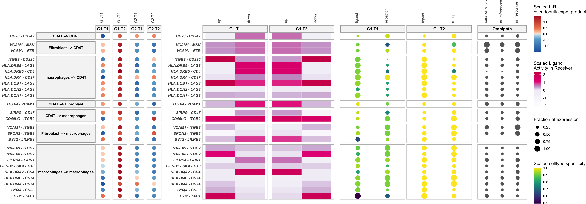

*shared between E-group and NE-group*

Now we will look at the interactions with a very similar score between E and NE. So these interactions are interactions that increase after therapy, but shared between group E and NE.


```r
ids_E_shared_NE = comparison_table %>% filter(group == "timepoint2" & id %in% prioritized_tbl_oi_250$id)  %>% mutate(deviation_from_0 = abs(0-difference_group1_vs_group2)) %>% top_n(25, -deviation_from_0) %>% arrange(deviation_from_0) %>% pull(id)
```


```r
prioritized_tbl_oi_250_shared_E_NE = prioritized_tbl_oi_250 %>% 
  filter(id %in% ids_E_shared_NE)
```


```r
plot_oi = make_sample_lr_prod_activity_plots_Omnipath(
  multinichenet_output_group1_t2vst1$prioritization_tables, 
  prioritized_tbl_oi_250_shared_E_NE)
plot_oi
```

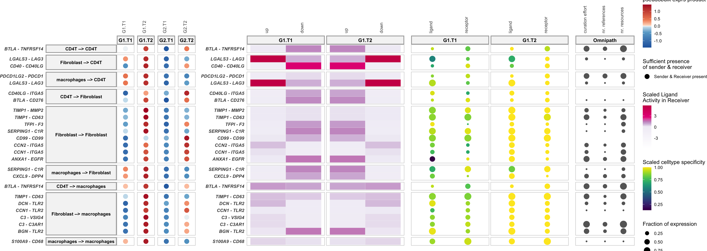

### Interactions decreasing after therapy in the E group
Visualize now interactions that are in the top250 interactions for the contrast On-vs-Pre in the E group. We will focus on decreasing interactions here.

*E-group specific*

Of these, we will first zoom into the top10 interactions with biggest difference in the E-vs-NE group. 


```r
group_oi = "G1.T1"
```


```r
prioritized_tbl_oi_250 = get_top_n_lr_pairs(
  multinichenet_output_group1_t2vst1$prioritization_tables, 
  top_n = 250, rank_per_group = FALSE) %>% 
  filter(group == group_oi) %>% 
  inner_join(lr_network_all)
```


```r
ids_group1_vs_group2 = comparison_table %>% filter(group == "timepoint1" & id %in% prioritized_tbl_oi_250$id) %>% top_n(10, difference_group1_vs_group2) %>% filter(difference_group1_vs_group2 > 0) %>% pull(id)
```


```r
prioritized_tbl_oi_250_unique_E = prioritized_tbl_oi_250 %>% 
  filter(id %in% ids_group1_vs_group2)
```


```r
plot_oi = make_sample_lr_prod_activity_plots_Omnipath(
  multinichenet_output_group1_t2vst1$prioritization_tables, 
  prioritized_tbl_oi_250_unique_E)
plot_oi
```

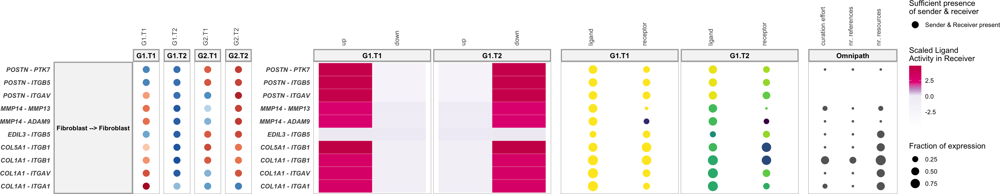

*shared between E-group and NE-group*

Now we will look at the interactions with a very similar score between E and NE. So these interactions are interactions that decrease after therapy, but shared between group E and NE.


```r
ids_E_shared_NE = comparison_table %>% filter(group == "timepoint1" & id %in% prioritized_tbl_oi_250$id) %>% mutate(deviation_from_0 = abs(0-difference_group1_vs_group2)) %>% top_n(10, -deviation_from_0) %>% arrange(deviation_from_0) %>% pull(id)
```


```r
prioritized_tbl_oi_250_shared_E_NE = prioritized_tbl_oi_250 %>% 
  filter(id %in% ids_E_shared_NE)
```


```r
plot_oi = make_sample_lr_prod_activity_plots_Omnipath(
  multinichenet_output_group1_t2vst1$prioritization_tables, 
  prioritized_tbl_oi_250_shared_E_NE)
plot_oi
```

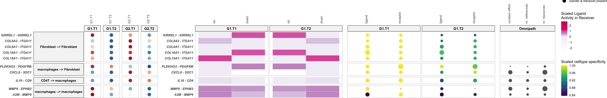

### Interactions increasing after therapy in the NE group
Visualize now interactions that are in the top250 interactions for the contrast On-vs-Pre in the E group.

To avoid making this vignette too long, we will not explicitly show this for the NE group since the code is the same as for the E group, you only need to change the `group_oi` to  `"G2.T2"`.

### Conclusions of these comparisons

Whereas these comparisons are quite intuitive, they are also relatively arbitrary (requiring cutoffs to compare interactions) and suboptimal. They are suboptimal because the prioritization scores of interactions are relative versus the other interactions within a group. If there is a difference in __effect size__ of the therapy-induced changes in CCC, comparing the final prioritization scores may not be optimal. This is something we saw in these previous plots. 

Therefore, we will now discuss another way to infer group-specific therapy-associated CCC patterns: namely looking explicitly at a multifactorial contrast.

## 3B) E-vs-NE: MultiNicheNet analysis with complex contrast setting: (G1.T2-G1.T1)-(G2.T2-G2.T1)

Because the DE analysis is here done in a classic FindMarkers approach, we cannot perform DE on multifactorial experimental designs. You can only compare one group vs other group(s). 
Therefore, we propose here the following solution for a multifactorial design: 

"Calculate the __between group__ difference between the time-difference logFC values"


```r
celltype_de_group1 %>% arrange(-logFC) %>% head()
## # A tibble: 6 × 6
##   gene      cluster_id  logFC    p_val    p_adj contrast   
##   <chr>     <chr>       <dbl>    <dbl>    <dbl> <chr>      
## 1 TXNIP     CD4T        1.33  0        0        G1.T2-G1.T1
## 2 TSC22D3   CD4T        1.30  0        0        G1.T2-G1.T1
## 3 MT2A      macrophages 1.18  2.35e-91 9.39e-88 G1.T2-G1.T1
## 4 NFKBIA    CD4T        1.08  0        0        G1.T2-G1.T1
## 5 CCN1      Fibroblast  1.00  1.47e-88 3.13e-85 G1.T2-G1.T1
## 6 MTRNR2L12 macrophages 0.958 3.86e-90 1.03e-86 G1.T2-G1.T1
celltype_de_group2 %>% arrange(-logFC) %>% head()
## # A tibble: 6 × 6
##   gene    cluster_id logFC p_val p_adj contrast   
##   <chr>   <chr>      <dbl> <dbl> <dbl> <chr>      
## 1 TXNIP   CD4T        1.69     0     0 G2.T2-G2.T1
## 2 TSC22D3 CD4T        1.46     0     0 G2.T2-G2.T1
## 3 CCN2    Fibroblast  1.28     0     0 G2.T2-G2.T1
## 4 CCN1    Fibroblast  1.19     0     0 G2.T2-G2.T1
## 5 BTG1    CD4T        1.16     0     0 G2.T2-G2.T1
## 6 NFKBIA  CD4T        1.12     0     0 G2.T2-G2.T1
```
Now step 2: 
Calculate the __between group__ difference between the time-difference logFC values + save the minimal p-value (if a gene was significant for one contrast, keep track of that)


```r
celltype_de_TimeDiff_On_vs_Pre = inner_join(
  celltype_de_group1 %>% filter(contrast == "G1.T2-G1.T1")   %>% rename(logFC_G1 = logFC, p_val_G1 = p_val, p_adj_G1 = p_adj) %>% distinct(gene, cluster_id, logFC_G1, p_val_G1, p_adj_G1),
  celltype_de_group2 %>% filter(contrast == "G2.T2-G2.T1")  %>% rename(logFC_G2 = logFC, p_val_G2 = p_val, p_adj_G2 = p_adj) %>% distinct(gene, cluster_id, logFC_G2, p_val_G2, p_adj_G2)
)  
celltype_de_TimeDiff_Pre_vs_On = inner_join(
  celltype_de_group1 %>% filter(contrast == "G1.T1-G1.T2")  %>% rename(logFC_G1 = logFC, p_val_G1 = p_val, p_adj_G1 = p_adj) %>% distinct(gene, cluster_id, logFC_G1, p_val_G1, p_adj_G1),
  celltype_de_group2 %>% filter(contrast == "G2.T1-G2.T2") %>% rename(logFC_G2 = logFC, p_val_G2 = p_val, p_adj_G2 = p_adj) %>% distinct(gene, cluster_id, logFC_G2, p_val_G2, p_adj_G2)
)  

celltype_de = bind_rows(
  celltype_de_TimeDiff_On_vs_Pre %>% mutate(logFC = logFC_G1 - logFC_G2, p_val = pmin(p_val_G1, p_val_G2), p_adj = pmin(p_adj_G1, p_adj_G2)) %>% mutate(contrast = "(G1.T2-G1.T1)-(G2.T2-G2.T1)"), 
  celltype_de_TimeDiff_On_vs_Pre %>% mutate(logFC = logFC_G2 - logFC_G1, p_val = pmin(p_val_G1, p_val_G2), p_adj = pmin(p_adj_G1, p_adj_G2)) %>% mutate(contrast = "(G2.T2-G2.T1)-(G1.T2-G1.T1)"), 
  celltype_de_TimeDiff_Pre_vs_On %>% mutate(logFC = logFC_G1 - logFC_G2, p_val = pmin(p_val_G1, p_val_G2), p_adj = pmin(p_adj_G1, p_adj_G2)) %>% mutate(contrast = "(G1.T1-G1.T2)-(G2.T1-G2.T2)"), 
  celltype_de_TimeDiff_Pre_vs_On %>% mutate(logFC = logFC_G2 - logFC_G1, p_val = pmin(p_val_G1, p_val_G2), p_adj = pmin(p_adj_G1, p_adj_G2)) %>% mutate(contrast = "(G2.T1-G2.T2)-(G1.T1-G1.T2)")
)
```

Just know that by doing this, we may have some positive "logFC values" for genes that have a lower decrease in one group vs the other: eg:


```r
celltype_de %>% filter(logFC_G1 < 0 & logFC > 0 & contrast == "(G1.T2-G1.T1)-(G2.T2-G2.T1)") %>% arrange(-logFC) %>% head(5)
## # A tibble: 5 × 12
##   gene   cluster_id  logFC_G1    p_val_G1   p_adj_G1 logFC_G2 p_val_G2 p_adj_G2 logFC    p_val    p_adj contrast                   
##   <chr>  <chr>          <dbl>       <dbl>      <dbl>    <dbl>    <dbl>    <dbl> <dbl>    <dbl>    <dbl> <chr>                      
## 1 TUBA1A macrophages  -0.0195 0.362       0.463        -0.323 9.75e-30 5.55e-27 0.304 9.75e-30 5.55e-27 (G1.T2-G1.T1)-(G2.T2-G2.T1)
## 2 BTG2   macrophages  -0.110  0.000000156 0.00000266   -0.350 1.75e-25 6.63e-23 0.241 1.75e-25 6.63e-23 (G1.T2-G1.T1)-(G2.T2-G2.T1)
## 3 CLEC7A macrophages  -0.0346 0.148       0.229        -0.256 3.04e-19 8.37e-17 0.221 3.04e-19 8.37e-17 (G1.T2-G1.T1)-(G2.T2-G2.T1)
## 4 S100A4 macrophages  -0.0601 0.160       0.243        -0.280 2.57e- 8 1.30e- 6 0.220 2.57e- 8 1.30e- 6 (G1.T2-G1.T1)-(G2.T2-G2.T1)
## 5 IER2   macrophages  -0.153  0.0000106   0.000112     -0.349 1.67e-12 1.85e-10 0.196 1.67e-12 1.85e-10 (G1.T2-G1.T1)-(G2.T2-G2.T1)
```

So important to summarize the interpretation of logFC values (= group-difference between time-difference logFC values) per contrast:
* (G1.T2-G1.T1)-(G2.T2-G2.T1): positive logFC if: 
  1) increase after treatment is bigger in group E than group NE
  2) decrease after treatment is smaller in group E than group NE
  
Therefore these logFC values are the same as for this contrast:
* (G2.T1-G2.T2)-(G1.T1-G1.T2): positive logFC if: 
  1) decrease after treatment is bigger in group NE than in group E
  2) increase after treatment is smaller in group NE than group E  
  
*Ligand activity prediction: use the DE analysis output to predict the activity of ligands in receiver cell types and infer their potential target genes*

Here we get to the most complex part of this vignette.

Let's look at the first contrasts of interest: `(G1.T2-G1.T1)-(G2.T2-G2.T1)`. As written before: a positive logFC value here means that the timepoint2-timepoint1 difference in group1 is bigger than in group2. This can be because the increase after therapy (resulting in higher G1.T2 values) is higher in group1 than in the group2. This is the type of trend we are looking for. However, a positive logFC will also be returned in case nothing happens in group1, and there is a therapy-associated decrease in group2. Or when the therapy-associated decrease in group2 is bigger than in group1. This latter examples are trends whe are not looking for. 
If we would just filter genes based on logFC to get a geneset of interest, we will confound this geneset with different patterns with different biological meanings.

To recap:
we are interested in: 
* ligand-receptor interactions that increase after therapy more strongly in group1 vs group2
* target genes that follow the trend of their upstream ligand-receptor interactions and thus also increase after therapy more strongly in group1 vs group2.

How to get to these genesets:
1) Change the `celltype_de` table of DE results:
* for the contrast (G1.T2-G1.T1)-(G2.T2-G2.T1): give all genes with a pos logFC value a value of 0 if their logFC in the **timepoint2-timepoint1** comparison (kept in `celltype_de_group1`) is smaller than (`logFC_threshold`). Give all genes with a negative logFC a value of 0. As a result, the geneset for ligand activity analysis will only contain genes that are increasing after therapy, and this increase in stronger in group1 than group2. 
* for the contrast (G2.T2-G2.T1)-(G1.T2-G1.T1): give all genes with a pos logFC value a value of 0 if their logFC in the **timepoint2-timepoint1** comparison (kept in `celltype_de_group2`) is smaller than (`logFC_threshold`). Give all genes with a negative logFC a value of 0. As a result, the geneset for ligand activity analysis will only contain genes that are increasing after therapy, and this increase in stronger in group2 than group1. 
* for the contrast (G1.T1-G1.T2)-(G2.T1-G2.T2): give all genes with a pos logFC value a value of 0 if their logFC in the **timepoint1-timepoint2** comparison (kept in `celltype_de_group1`) is smaller than (`logFC_threshold`). Give all genes with a negative logFC a value of 0. As a result, the geneset for ligand activity analysis will only contain genes that are decreasing after therapy, and this decrease in stronger in group1 than group1.
* for the contrast (G2.T1-G2.T2)-(G1.T1-G1.T2): give all genes with a pos logFC value a value of 0 if their logFC in the **timepoint1-timepoint2** comparison (kept in `celltype_de_group2`) is smaller than (`logFC_threshold`). Give all genes with a negative logFC a value of 0. As a result, the geneset for ligand activity analysis will only contain genes that are decreasing after therapy, and this decrease in stronger in group2 than group1.

Because we want to keep the same patterns for the ligands/receptors: we will do the same but in more permissive setting: just make sure the On/timepoint2-vs-Pre/timepoint1 difference is in the expected direction without needing to be significant.

Gene-celltype table with genes that will keep their pos logFC value for contrast (G1.T2-G1.T1)-(G2.T2-G2.T1) + modified celltype_de table

```r
gene_celltype_tbl_increase_group1_permissive = celltype_de_group1 %>% 
  filter(contrast == "G1.T2-G1.T1") %>% 
  mutate(logFC_multiplier = ifelse(logFC > 0, 1, 0)) %>% 
  distinct(gene, cluster_id, logFC_multiplier)

gene_celltype_tbl_increase_group1_stringent = celltype_de_group1 %>% 
  filter(contrast == "G1.T2-G1.T1") %>% 
  mutate(logFC_multiplier = ifelse(logFC >= logFC_threshold & p_val <= p_val_threshold, 1, 0)) %>% 
  distinct(gene, cluster_id, logFC_multiplier)
```


```r
celltype_de_increase_group1_permissive = celltype_de %>% 
  filter(contrast == "(G1.T2-G1.T1)-(G2.T2-G2.T1)") %>% 
  inner_join(gene_celltype_tbl_increase_group1_permissive) 

celltype_de_increase_group1_permissive = bind_rows(
  celltype_de_increase_group1_permissive %>% 
    filter(logFC > 0) %>% 
    mutate(logFC = logFC*logFC_multiplier),
  celltype_de_increase_group1_permissive %>% 
    filter(logFC <= 0) %>% 
    mutate(logFC = logFC*0) 
) %>% arrange(-logFC)


celltype_de_increase_group1_stringent = celltype_de %>% 
  filter(contrast == "(G1.T2-G1.T1)-(G2.T2-G2.T1)") %>% 
  inner_join(gene_celltype_tbl_increase_group1_stringent) 

celltype_de_increase_group1_stringent = bind_rows(
  celltype_de_increase_group1_stringent %>% 
    filter(logFC > 0) %>% 
    mutate(logFC = logFC*logFC_multiplier),
  celltype_de_increase_group1_stringent %>% 
    filter(logFC <= 0) %>% 
    mutate(logFC = logFC*0) 
) %>% arrange(-logFC)


celltype_de_increase_group1_stringent %>% head()
## # A tibble: 6 × 13
##   gene      cluster_id  logFC_G1 p_val_G1 p_adj_G1 logFC_G2 p_val_G2 p_adj_G2 logFC    p_val    p_adj contrast                    logFC_multiplier
##   <chr>     <chr>          <dbl>    <dbl>    <dbl>    <dbl>    <dbl>    <dbl> <dbl>    <dbl>    <dbl> <chr>                                  <dbl>
## 1 MTRNR2L12 macrophages    0.958 3.86e-90 1.03e-86   -0.317 1.92e-10 1.58e- 8 1.28  3.86e-90 1.03e-86 (G1.T2-G1.T1)-(G2.T2-G2.T1)                1
## 2 CD74      Fibroblast     0.571 1.01e-35 2.68e-33   -0.256 1.88e-74 2.38e-72 0.828 1.88e-74 2.38e-72 (G1.T2-G1.T1)-(G2.T2-G2.T1)                1
## 3 LYZ       macrophages    0.639 6.48e-27 1.29e-24   -0.163 4.84e- 3 3.99e- 2 0.802 6.48e-27 1.29e-24 (G1.T2-G1.T1)-(G2.T2-G2.T1)                1
## 4 HLA.DPA1  macrophages    0.406 3.17e-21 3.56e-19   -0.317 9.42e- 7 3.34e- 5 0.723 3.17e-21 3.56e-19 (G1.T2-G1.T1)-(G2.T2-G2.T1)                1
## 5 CD74      macrophages    0.357 4.14e-17 3.27e-15   -0.344 4.53e- 9 2.82e- 7 0.701 4.14e-17 3.27e-15 (G1.T2-G1.T1)-(G2.T2-G2.T1)                1
## 6 MT2A      macrophages    1.18  2.35e-91 9.39e-88    0.488 3.37e-18 7.92e-16 0.696 2.35e-91 9.39e-88 (G1.T2-G1.T1)-(G2.T2-G2.T1)                1
```

Gene-celltype table with genes that will keep their pos logFC value for contrast (G2.T2-G2.T1)-(G1.T2-G1.T1):

```r
gene_celltype_tbl_increase_group2_permissive = celltype_de_group2 %>% 
  filter(contrast == "G2.T2-G2.T1") %>% 
  mutate(logFC_multiplier = ifelse(logFC > 0, 1, 0)) %>% 
  distinct(gene, cluster_id, logFC_multiplier)

gene_celltype_tbl_increase_group2_stringent = celltype_de_group2 %>% 
  filter(contrast == "G2.T2-G2.T1") %>% 
  mutate(logFC_multiplier = ifelse(logFC >= logFC_threshold & p_val <= p_val_threshold, 1, 0)) %>% 
  distinct(gene, cluster_id, logFC_multiplier)
```


```r
celltype_de_increase_group2_permissive = celltype_de %>% 
  filter(contrast == "(G2.T2-G2.T1)-(G1.T2-G1.T1)") %>% 
  inner_join(gene_celltype_tbl_increase_group2_permissive) 

celltype_de_increase_group2_permissive = bind_rows(
  celltype_de_increase_group2_permissive %>% 
    filter(logFC > 0) %>% 
    mutate(logFC = logFC*logFC_multiplier),
  celltype_de_increase_group2_permissive %>% 
    filter(logFC <= 0) %>% 
    mutate(logFC = logFC*0) 
) %>% arrange(-logFC)

celltype_de_increase_group2_stringent = celltype_de %>% 
  filter(contrast == "(G2.T2-G2.T1)-(G1.T2-G1.T1)") %>% 
  inner_join(gene_celltype_tbl_increase_group2_stringent) 

celltype_de_increase_group2_stringent = bind_rows(
  celltype_de_increase_group2_stringent %>% 
    filter(logFC > 0) %>% 
    mutate(logFC = logFC*logFC_multiplier),
  celltype_de_increase_group2_stringent %>% 
    filter(logFC <= 0) %>% 
    mutate(logFC = logFC*0) 
) %>% arrange(-logFC)

celltype_de_increase_group2_stringent %>% head()
## # A tibble: 6 × 13
##   gene   cluster_id  logFC_G1  p_val_G1  p_adj_G1 logFC_G2 p_val_G2 p_adj_G2 logFC    p_val    p_adj contrast                    logFC_multiplier
##   <chr>  <chr>          <dbl>     <dbl>     <dbl>    <dbl>    <dbl>    <dbl> <dbl>    <dbl>    <dbl> <chr>                                  <dbl>
## 1 COL3A1 Fibroblast   -0.728  2.09e- 24 2.73e- 22    0.318 1.48e-25 3.86e-24 1.05  1.48e-25 3.86e-24 (G2.T2-G2.T1)-(G1.T2-G1.T1)                1
## 2 COL1A2 Fibroblast   -0.665  1.73e- 19 1.69e- 17    0.331 1.57e-27 4.54e-26 0.996 1.57e-27 4.54e-26 (G2.T2-G2.T1)-(G1.T2-G1.T1)                1
## 3 COL1A1 Fibroblast   -0.675  1.85e- 15 1.35e- 13    0.271 3.29e-14 4.20e-13 0.946 1.85e-15 1.35e-13 (G2.T2-G2.T1)-(G1.T2-G1.T1)                1
## 4 SPP1   macrophages  -0.344  5.16e-  5 4.19e-  4    0.469 1.48e- 6 4.83e- 5 0.812 1.48e- 6 4.83e- 5 (G2.T2-G2.T1)-(G1.T2-G1.T1)                1
## 5 CTSD   macrophages   0.0402 4.06e-  1 5.05e-  1    0.670 5.97e-29 2.98e-26 0.630 5.97e-29 2.98e-26 (G2.T2-G2.T1)-(G1.T2-G1.T1)                1
## 6 BTG1   CD4T          0.532  7.20e-153 3.91e-150    1.16  0        0        0.627 0        0        (G2.T2-G2.T1)-(G1.T2-G1.T1)                1
```

Gene-celltype table with genes that will keep their pos logFC value for contrast (G1.T1-G1.T2)-(G2.T1-G2.T2):

```r
gene_celltype_tbl_decrease_group1_permissive = celltype_de_group1 %>% 
  filter(contrast == "G1.T1-G1.T2") %>% 
  mutate(logFC_multiplier = ifelse(logFC > 0, 1, 0)) %>% 
  distinct(gene, cluster_id, logFC_multiplier)

gene_celltype_tbl_decrease_group1_stringent = celltype_de_group1 %>% 
  filter(contrast == "G1.T1-G1.T2") %>% 
  mutate(logFC_multiplier = ifelse(logFC >= logFC_threshold & p_val <= p_val_threshold, 1, 0)) %>% 
  distinct(gene, cluster_id, logFC_multiplier)
```


```r
celltype_de_decrease_group1_permissive = celltype_de %>% 
  filter(contrast == "(G1.T1-G1.T2)-(G2.T1-G2.T2)") %>% 
  inner_join(gene_celltype_tbl_decrease_group1_permissive) 

celltype_de_decrease_group1_permissive = bind_rows(
  celltype_de_decrease_group1_permissive %>% 
    filter(logFC > 0) %>% 
    mutate(logFC = logFC*logFC_multiplier),
  celltype_de_decrease_group1_permissive %>% 
    filter(logFC <= 0) %>% 
    mutate(logFC = logFC*0) 
) %>% arrange(-logFC)

celltype_de_decrease_group1_stringent = celltype_de %>% 
  filter(contrast == "(G1.T1-G1.T2)-(G2.T1-G2.T2)") %>% 
  inner_join(gene_celltype_tbl_decrease_group1_stringent) 

celltype_de_decrease_group1_stringent = bind_rows(
  celltype_de_decrease_group1_stringent %>% 
    filter(logFC > 0) %>% 
    mutate(logFC = logFC*logFC_multiplier),
  celltype_de_decrease_group1_stringent %>% 
    filter(logFC <= 0) %>% 
    mutate(logFC = logFC*0) 
) %>% arrange(-logFC)

celltype_de_decrease_group1_stringent %>% head()
## # A tibble: 6 × 13
##   gene    cluster_id  logFC_G1  p_val_G1  p_adj_G1 logFC_G2 p_val_G2 p_adj_G2 logFC     p_val     p_adj contrast                    logFC_multiplier
##   <chr>   <chr>          <dbl>     <dbl>     <dbl>    <dbl>    <dbl>    <dbl> <dbl>     <dbl>     <dbl> <chr>                                  <dbl>
## 1 COL3A1  Fibroblast     0.728 2.09e- 24 2.73e- 22  -0.318  1.48e-25 3.86e-24 1.05  1.48e- 25 3.86e- 24 (G1.T1-G1.T2)-(G2.T1-G2.T2)                1
## 2 COL1A2  Fibroblast     0.665 1.73e- 19 1.69e- 17  -0.331  1.57e-27 4.54e-26 0.996 1.57e- 27 4.54e- 26 (G1.T1-G1.T2)-(G2.T1-G2.T2)                1
## 3 COL1A1  Fibroblast     0.675 1.85e- 15 1.35e- 13  -0.271  3.29e-14 4.20e-13 0.946 1.85e- 15 1.35e- 13 (G1.T1-G1.T2)-(G2.T1-G2.T2)                1
## 4 SPP1    macrophages    0.344 5.16e-  5 4.19e-  4  -0.469  1.48e- 6 4.83e- 5 0.812 1.48e-  6 4.83e-  5 (G1.T1-G1.T2)-(G2.T1-G2.T2)                1
## 5 MT.ATP8 CD4T           0.710 1.00e-176 7.85e-174  -0.0805 6.87e- 4 3.15e- 3 0.791 1.00e-176 7.85e-174 (G1.T1-G1.T2)-(G2.T1-G2.T2)                1
## 6 COL6A3  Fibroblast     0.363 3.81e- 11 1.72e-  9  -0.245  2.62e-28 7.97e-27 0.608 2.62e- 28 7.97e- 27 (G1.T1-G1.T2)-(G2.T1-G2.T2)                1
```

Gene-celltype table with genes that will keep their pos logFC value for contrast (G2.T1-G2.T2)-(G1.T1-G1.T2):

```r
gene_celltype_tbl_decrease_group2_permissive = celltype_de_group2 %>% 
  filter(contrast == "G2.T1-G2.T2") %>% 
  mutate(logFC_multiplier = ifelse(logFC > 0, 1, 0)) %>% 
  distinct(gene, cluster_id, logFC_multiplier)

gene_celltype_tbl_decrease_group2_stringent = celltype_de_group2 %>% 
  filter(contrast == "G2.T1-G2.T2") %>% 
  mutate(logFC_multiplier = ifelse(logFC >= logFC_threshold & p_val <= p_val_threshold, 1, 0)) %>% 
  distinct(gene, cluster_id, logFC_multiplier)
```


```r
celltype_de_decrease_group2_permissive = celltype_de %>% 
  filter(contrast == "(G2.T1-G2.T2)-(G1.T1-G1.T2)") %>% 
  inner_join(gene_celltype_tbl_decrease_group2_permissive) 

celltype_de_decrease_group2_permissive = bind_rows(
  celltype_de_decrease_group2_permissive %>% 
    filter(logFC > 0) %>% 
    mutate(logFC = logFC*logFC_multiplier),
  celltype_de_decrease_group2_permissive %>% 
    filter(logFC <= 0) %>% 
    mutate(logFC = logFC*0) 
) %>% arrange(-logFC)

celltype_de_decrease_group2_stringent = celltype_de %>% 
  filter(contrast == "(G2.T1-G2.T2)-(G1.T1-G1.T2)") %>% 
  inner_join(gene_celltype_tbl_decrease_group2_stringent) 

celltype_de_decrease_group2_stringent = bind_rows(
  celltype_de_decrease_group2_stringent %>% 
    filter(logFC > 0) %>% 
    mutate(logFC = logFC*logFC_multiplier),
  celltype_de_decrease_group2_stringent %>% 
    filter(logFC <= 0) %>% 
    mutate(logFC = logFC*0) 
) %>% arrange(-logFC)

celltype_de_decrease_group2_stringent %>% head()
## # A tibble: 6 × 13
##   gene      cluster_id  logFC_G1 p_val_G1 p_adj_G1 logFC_G2  p_val_G2  p_adj_G2 logFC     p_val     p_adj contrast                    logFC_multiplier
##   <chr>     <chr>          <dbl>    <dbl>    <dbl>    <dbl>     <dbl>     <dbl> <dbl>     <dbl>     <dbl> <chr>                                  <dbl>
## 1 MTRNR2L12 macrophages  -0.958  3.86e-90 1.03e-86    0.317 1.92e- 10 1.58e-  8 1.28  3.86e- 90 1.03e- 86 (G2.T1-G2.T2)-(G1.T1-G1.T2)                1
## 2 CD74      Fibroblast   -0.571  1.01e-35 2.68e-33    0.256 1.88e- 74 2.38e- 72 0.828 1.88e- 74 2.38e- 72 (G2.T1-G2.T2)-(G1.T1-G1.T2)                1
## 3 LYZ       macrophages  -0.639  6.48e-27 1.29e-24    0.163 4.84e-  3 3.99e-  2 0.802 6.48e- 27 1.29e- 24 (G2.T1-G2.T2)-(G1.T1-G1.T2)                1
## 4 MTRNR2L12 Fibroblast   -0.0558 3.00e- 1 4.90e- 1    0.705 2.59e-288 2.75e-285 0.761 2.59e-288 2.75e-285 (G2.T1-G2.T2)-(G1.T1-G1.T2)                1
## 5 HLA.DPA1  macrophages  -0.406  3.17e-21 3.56e-19    0.317 9.42e-  7 3.34e-  5 0.723 3.17e- 21 3.56e- 19 (G2.T1-G2.T2)-(G1.T1-G1.T2)                1
## 6 CD74      macrophages  -0.357  4.14e-17 3.27e-15    0.344 4.53e-  9 2.82e-  7 0.701 4.14e- 17 3.27e- 15 (G2.T1-G2.T2)-(G1.T1-G1.T2)                1
```

So let's now make the new `cellype_de` tables:

The permissive table that will be used for the prioritization of ligand-receptor pairs based on DE values:


```r
celltype_de_LR = list(
  celltype_de_increase_group1_permissive,
  celltype_de_increase_group2_permissive,
  celltype_de_decrease_group1_permissive,
  celltype_de_decrease_group2_permissive) %>% bind_rows()
```

The stringent table that will be used for the creation of genesets for the ligand activity analysis:


```r
celltype_de_genesets = list(
  celltype_de_increase_group1_stringent,
  celltype_de_increase_group2_stringent,
  celltype_de_decrease_group1_stringent,
  celltype_de_decrease_group2_stringent) %>% bind_rows()
```

We will first inspect the geneset_oi-vs-background ratios for the tresholds appropriate for this "multifactorial-like analysis":


```r
p_val_threshold = 1 # because the p-values in this setting do not make sense
logFC_threshold = 0.125 # we can be a bit more lenient here
```


```r
contrast_tbl = tibble(contrast =
                        c("(G1.T2-G1.T1)-(G2.T2-G2.T1)", 
                          "(G2.T2-G2.T1)-(G1.T2-G1.T1)", 
                          "(G1.T1-G1.T2)-(G2.T1-G2.T2)", 
                          "(G2.T1-G2.T2)-(G1.T1-G1.T2)"),
                      group = c("G1.T2","G2.T2","G1.T1","G2.T1")) 
```


```r
geneset_assessment = contrast_tbl$contrast %>% 
  lapply(
    process_geneset_data, 
    celltype_de_genesets, logFC_threshold, p_val_adj, p_val_threshold
  ) %>% 
  bind_rows() 
geneset_assessment
## # A tibble: 12 × 12
##    cluster_id  n_background n_geneset_up n_geneset_down prop_geneset_up prop_geneset_down in_range_up in_range_down contrast                    logFC_threshold p_val_threshold adjusted
##    <chr>              <int>        <int>          <int>           <dbl>             <dbl> <lgl>       <lgl>         <chr>                                 <dbl>           <dbl> <lgl>   
##  1 CD4T                7052           38              0         0.00539                 0 TRUE        FALSE         (G1.T2-G1.T1)-(G2.T2-G2.T1)           0.125               1 TRUE    
##  2 Fibroblast          8497          120              0         0.0141                  0 TRUE        FALSE         (G1.T2-G1.T1)-(G2.T2-G2.T1)           0.125               1 TRUE    
##  3 macrophages         7979          117              0         0.0147                  0 TRUE        FALSE         (G1.T2-G1.T1)-(G2.T2-G2.T1)           0.125               1 TRUE    
##  4 CD4T                7052           25              0         0.00355                 0 FALSE       FALSE         (G2.T2-G2.T1)-(G1.T2-G1.T1)           0.125               1 TRUE    
##  5 Fibroblast          8497           55              0         0.00647                 0 TRUE        FALSE         (G2.T2-G2.T1)-(G1.T2-G1.T1)           0.125               1 TRUE    
##  6 macrophages         7979           69              0         0.00865                 0 TRUE        FALSE         (G2.T2-G2.T1)-(G1.T2-G1.T1)           0.125               1 TRUE    
##  7 CD4T                7052           29              0         0.00411                 0 FALSE       FALSE         (G1.T1-G1.T2)-(G2.T1-G2.T2)           0.125               1 TRUE    
##  8 Fibroblast          8497           56              0         0.00659                 0 TRUE        FALSE         (G1.T1-G1.T2)-(G2.T1-G2.T2)           0.125               1 TRUE    
##  9 macrophages         7979           54              0         0.00677                 0 TRUE        FALSE         (G1.T1-G1.T2)-(G2.T1-G2.T2)           0.125               1 TRUE    
## 10 CD4T                7052           12              0         0.00170                 0 FALSE       FALSE         (G2.T1-G2.T2)-(G1.T1-G1.T2)           0.125               1 TRUE    
## 11 Fibroblast          8497           19              0         0.00224                 0 FALSE       FALSE         (G2.T1-G2.T2)-(G1.T1-G1.T2)           0.125               1 TRUE    
## 12 macrophages         7979           44              0         0.00551                 0 TRUE        FALSE         (G2.T1-G2.T2)-(G1.T1-G1.T2)           0.125               1 TRUE
```

We can see here that for most geneset/background ratio's we are within or close to the recommended range for the upregulated genes (`in_range_up` and `in_range_down` columns). 


```r
ligand_activities_targets_DEgenes = suppressMessages(suppressWarnings(
  get_ligand_activities_targets_DEgenes(
    receiver_de = celltype_de_genesets,
    receivers_oi = intersect(receivers_oi, celltype_de_genesets$cluster_id %>% unique()),
    ligand_target_matrix = ligand_target_matrix,
    logFC_threshold = logFC_threshold,
    p_val_threshold = p_val_threshold,
    p_val_adj = p_val_adj,
    top_n_target = top_n_target,
    verbose = TRUE, 
    n.cores = n.cores
  )
))
```

*Combine DE information for ligand-senders and receptors-receivers*

Use the adapted `celltype_de_LR` table to keep the expression change patterns we want:


```r
sender_receiver_de = combine_sender_receiver_de(
  sender_de = celltype_de_LR,
  receiver_de = celltype_de_LR,
  senders_oi = senders_oi,
  receivers_oi = receivers_oi,
  lr_network = lr_network
)
```


```r
sender_receiver_de %>% head(20)
## # A tibble: 20 × 12
##    contrast                    sender      receiver    ligand  receptor lfc_ligand lfc_receptor ligand_receptor_lfc_avg p_val_ligand p_adj_ligand p_val_receptor p_adj_receptor
##    <chr>                       <chr>       <chr>       <chr>   <chr>         <dbl>        <dbl>                   <dbl>        <dbl>        <dbl>          <dbl>          <dbl>
##  1 (G1.T1-G1.T2)-(G2.T1-G2.T2) Fibroblast  Fibroblast  COL3A1  ITGB1         1.05        0.199                    0.623     1.48e-25     3.86e-24       1.72e- 9       6.14e- 8
##  2 (G2.T2-G2.T1)-(G1.T2-G1.T1) Fibroblast  macrophages COL1A2  CD36          0.996       0.207                    0.602     1.57e-27     4.54e-26       2.65e-16       4.50e-14
##  3 (G1.T1-G1.T2)-(G2.T1-G2.T2) Fibroblast  macrophages COL1A2  CD36          0.996       0.207                    0.602     1.57e-27     4.54e-26       2.65e-16       4.50e-14
##  4 (G1.T1-G1.T2)-(G2.T1-G2.T2) Fibroblast  Fibroblast  COL1A2  ITGB1         0.996       0.199                    0.598     1.57e-27     4.54e-26       1.72e- 9       6.14e- 8
##  5 (G1.T2-G1.T1)-(G2.T2-G2.T1) macrophages Fibroblast  HLA.DMA CD74          0.368       0.828                    0.598     2.30e- 9     5.88e- 8       1.88e-74       2.38e-72
##  6 (G2.T1-G2.T2)-(G1.T1-G1.T2) macrophages Fibroblast  HLA.DMA CD74          0.368       0.828                    0.598     2.30e- 9     5.88e- 8       1.88e-74       2.38e-72
##  7 (G2.T2-G2.T1)-(G1.T2-G1.T1) Fibroblast  macrophages COL3A1  ITGB1         1.05        0.131                    0.589     1.48e-25     3.86e-24       5.72e- 8       1.08e- 6
##  8 (G1.T1-G1.T2)-(G2.T1-G2.T2) Fibroblast  macrophages COL3A1  ITGB1         1.05        0.131                    0.589     1.48e-25     3.86e-24       5.72e- 8       1.08e- 6
##  9 (G2.T2-G2.T1)-(G1.T2-G1.T1) Fibroblast  macrophages COL1A1  CD36          0.946       0.207                    0.577     1.85e-15     1.35e-13       2.65e-16       4.50e-14
## 10 (G1.T1-G1.T2)-(G2.T1-G2.T2) Fibroblast  macrophages COL1A1  CD36          0.946       0.207                    0.577     1.85e-15     1.35e-13       2.65e-16       4.50e-14
## 11 (G1.T1-G1.T2)-(G2.T1-G2.T2) Fibroblast  Fibroblast  COL1A1  ITGB1         0.946       0.199                    0.573     1.85e-15     1.35e-13       1.72e- 9       6.14e- 8
## 12 (G2.T2-G2.T1)-(G1.T2-G1.T1) Fibroblast  macrophages COL1A2  ITGB1         0.996       0.131                    0.564     1.57e-27     4.54e-26       5.72e- 8       1.08e- 6
## 13 (G1.T1-G1.T2)-(G2.T1-G2.T2) Fibroblast  macrophages COL1A2  ITGB1         0.996       0.131                    0.564     1.57e-27     4.54e-26       5.72e- 8       1.08e- 6
## 14 (G1.T1-G1.T2)-(G2.T1-G2.T2) Fibroblast  Fibroblast  COL3A1  ITGA1         1.05        0.0789                   0.562     1.48e-25     3.86e-24       2.07e- 4       1.97e- 3
## 15 (G1.T2-G1.T1)-(G2.T2-G2.T1) macrophages Fibroblast  HLA.DMB CD74          0.288       0.828                    0.558     4.71e- 7     7.11e- 6       1.88e-74       2.38e-72
## 16 (G2.T1-G2.T2)-(G1.T1-G1.T2) macrophages Fibroblast  HLA.DMB CD74          0.288       0.828                    0.558     4.71e- 7     7.11e- 6       1.88e-74       2.38e-72
## 17 (G2.T2-G2.T1)-(G1.T2-G1.T1) Fibroblast  Fibroblast  COL1A1  ITGAV         0.946       0.132                    0.539     1.85e-15     1.35e-13       4.70e-15       6.41e-14
## 18 (G1.T1-G1.T2)-(G2.T1-G2.T2) Fibroblast  Fibroblast  COL1A1  ITGAV         0.946       0.132                    0.539     1.85e-15     1.35e-13       4.70e-15       6.41e-14
## 19 (G2.T2-G2.T1)-(G1.T2-G1.T1) Fibroblast  macrophages COL1A1  ITGB1         0.946       0.131                    0.539     1.85e-15     1.35e-13       5.72e- 8       1.08e- 6
## 20 (G1.T1-G1.T2)-(G2.T1-G2.T2) Fibroblast  macrophages COL1A1  ITGB1         0.946       0.131                    0.539     1.85e-15     1.35e-13       5.72e- 8       1.08e- 6
```

*Prioritization: rank cell-cell communication patterns through multi-criteria prioritization*
  

```r
sender_receiver_tbl = sender_receiver_de %>% distinct(sender, receiver)

metadata_combined = SummarizedExperiment::colData(sce) %>% tibble::as_tibble()

if(!is.na(batches)){
  grouping_tbl = metadata_combined[,c(group_id, batches)] %>% tibble::as_tibble() %>% dplyr::distinct()
  colnames(grouping_tbl) = c("group",batches)
  grouping_tbl = grouping_tbl %>% mutate(sample = group)
  grouping_tbl = grouping_tbl %>% tibble::as_tibble()
} else {
  grouping_tbl = metadata_combined[,c(group_id)] %>% tibble::as_tibble() %>% dplyr::distinct()
  colnames(grouping_tbl) = c("group")
  grouping_tbl = grouping_tbl %>% mutate(sample = group) %>% select(sample, group)
  
}

prioritization_tables = suppressMessages(generate_prioritization_tables_sampleAgnostic_multifactorial(
  sender_receiver_info = abundance_expression_info$sender_receiver_info,
  sender_receiver_de = sender_receiver_de,
  ligand_activities_targets_DEgenes = ligand_activities_targets_DEgenes,
  contrast_tbl = contrast_tbl,
  sender_receiver_tbl = sender_receiver_tbl,
  grouping_tbl = grouping_tbl,
  scenario = "regular", 
  fraction_cutoff = fraction_cutoff, 
  abundance_data_receiver = abundance_expression_info$abundance_data_receiver,
  abundance_data_sender = abundance_expression_info$abundance_data_sender,
  ligand_activity_down = FALSE
)) # this specific function to not include p-values for the DE assessment, since these are meaningless for this
# customized multifactorial analysis
```


*Compile the MultiNicheNet output object*


```r
multinichenet_output = list(
    celltype_info = abundance_expression_info$celltype_info,
    celltype_de = celltype_de_genesets,
    sender_receiver_info = abundance_expression_info$sender_receiver_info,
    sender_receiver_de =  sender_receiver_de,
    ligand_activities_targets_DEgenes = ligand_activities_targets_DEgenes,
    prioritization_tables = prioritization_tables,
    grouping_tbl = grouping_tbl,
    lr_target_prior_cor = tibble()
  ) 
multinichenet_output = make_lite_output(multinichenet_output)
```

### Interpret the analysis

*Summarizing ChordDiagram circos plots*

We will look here at the top 50 predictions across all contrasts, senders, and receivers of interest.


```r
prioritized_tbl_oi_all = get_top_n_lr_pairs(
  multinichenet_output$prioritization_tables, 
  top_n = 50, 
  rank_per_group = FALSE
  )
```


```r
prioritized_tbl_oi = 
  multinichenet_output$prioritization_tables$group_prioritization_tbl %>%
  filter(id %in% prioritized_tbl_oi_all$id) %>%
  distinct(id, sender, receiver, ligand, receptor, group) %>% 
  left_join(prioritized_tbl_oi_all)
prioritized_tbl_oi$prioritization_score[is.na(prioritized_tbl_oi$prioritization_score)] = 0

senders_receivers = union(prioritized_tbl_oi$sender %>% unique(), prioritized_tbl_oi$receiver %>% unique()) %>% sort()

colors_sender = RColorBrewer::brewer.pal(n = length(senders_receivers), name = 'Spectral') %>% magrittr::set_names(senders_receivers)
colors_receiver = RColorBrewer::brewer.pal(n = length(senders_receivers), name = 'Spectral') %>% magrittr::set_names(senders_receivers)

circos_list = make_circos_group_comparison(prioritized_tbl_oi, colors_sender, colors_receiver)
```

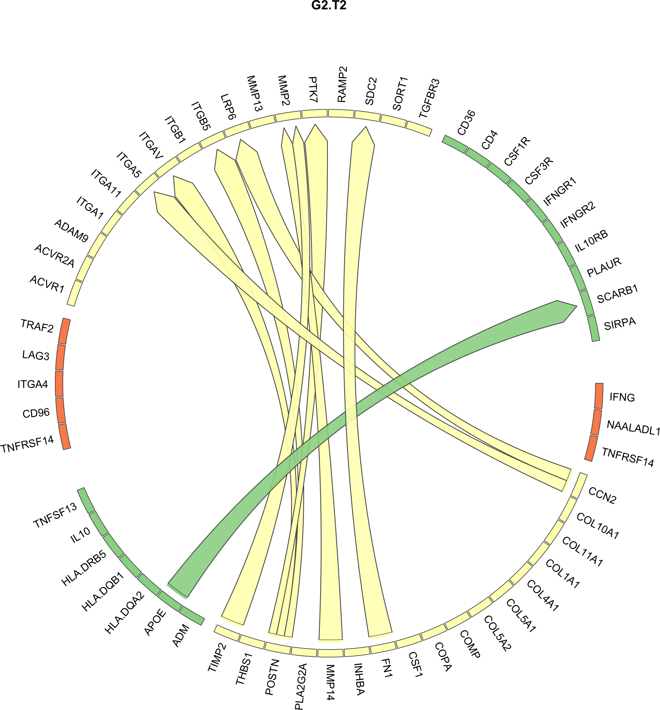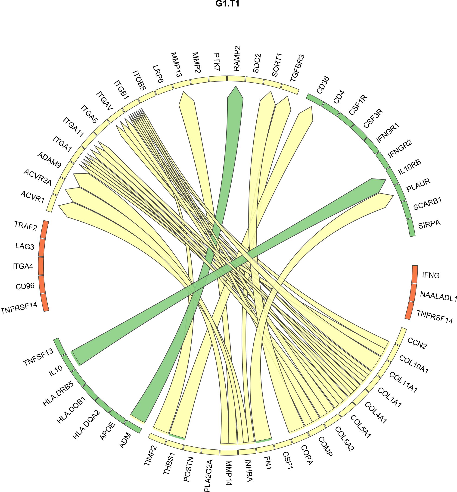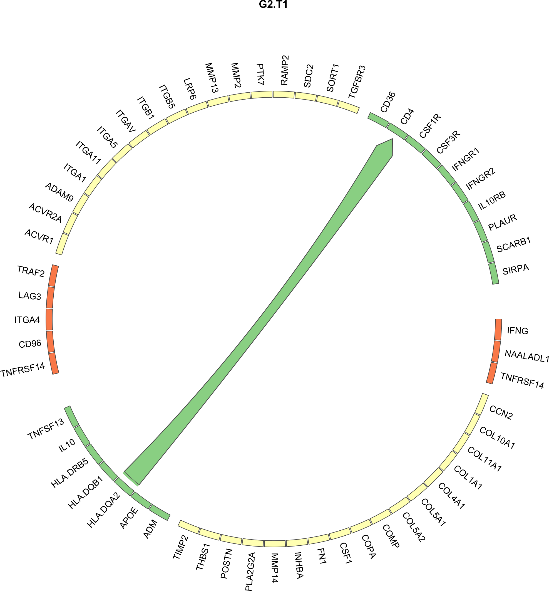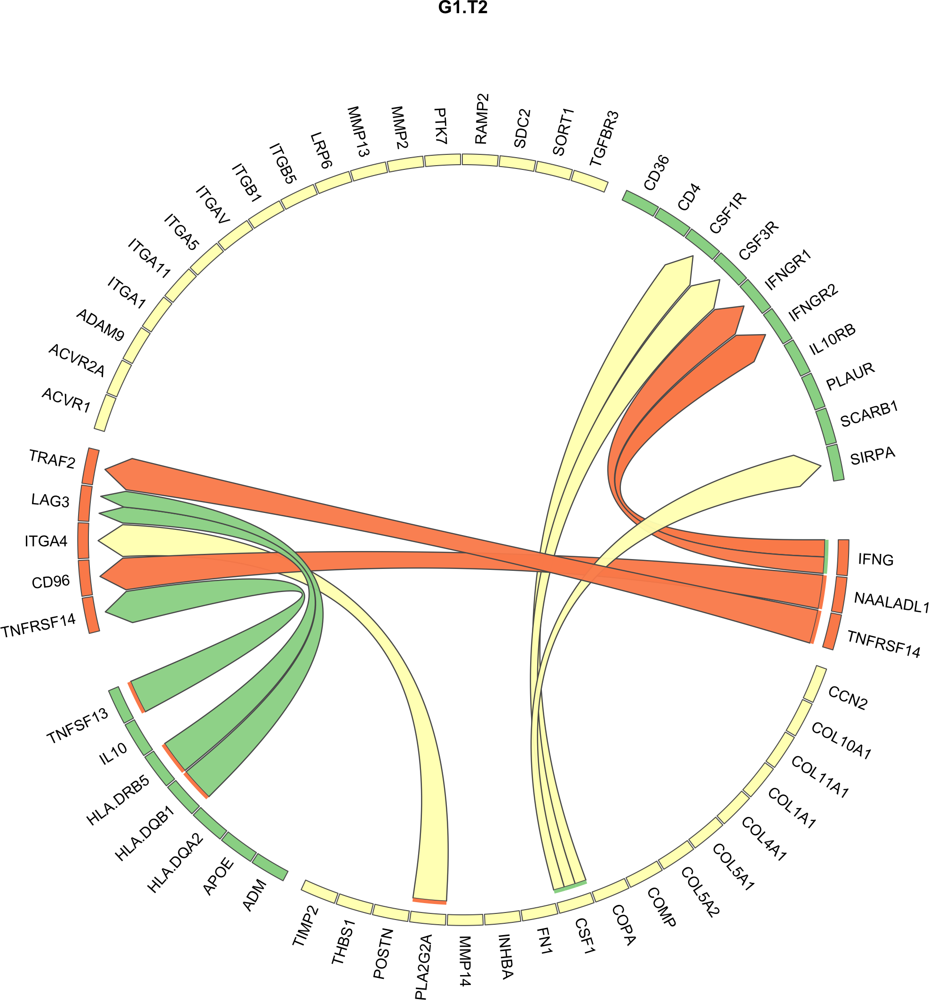

In general, we see most specific interactions are the ones that increase in the E group (= patients with T cell clonotype expansion after aPD1 therapy)

*Interpretable bubble plots*

We will now check the top interactions specific for the OnE group - so these are the interactions that increase during anti-PD1 therapy and more strongly in the E than NE group.


```r
group_oi = "G1.T2"
```


```r
prioritized_tbl_oi_50 = get_top_n_lr_pairs(
  multinichenet_output$prioritization_tables, 
  top_n = 50, rank_per_group = FALSE) %>% filter(group == group_oi)
```


```r
prioritized_tbl_oi_50_omnipath = prioritized_tbl_oi_50 %>% 
  inner_join(lr_network_all)
```

Now we add this to the bubble plot visualization:

```r
plot_oi = make_sample_lr_prod_activity_plots_Omnipath(
  multinichenet_output$prioritization_tables, 
  prioritized_tbl_oi_50_omnipath)
plot_oi
```

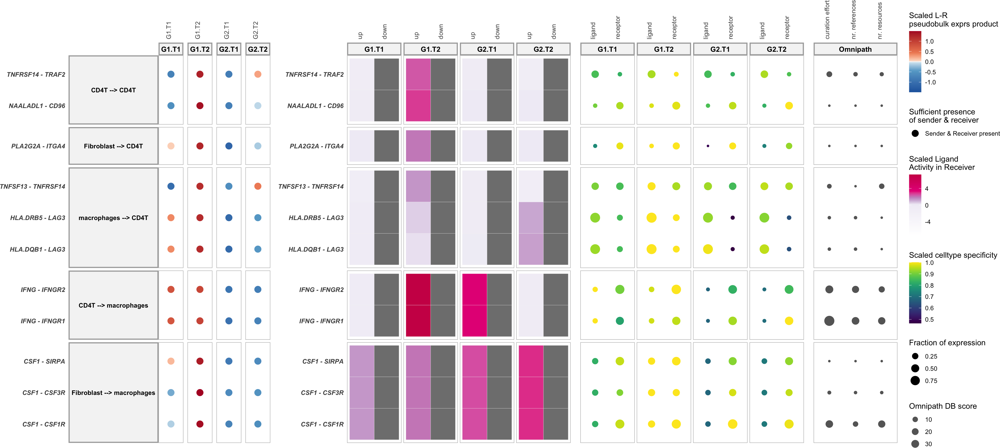


Further note: Typically, there are way more than 50 differentially expressed and active ligand-receptor pairs per group across all sender-receiver combinations. Therefore it might be useful to zoom in on specific cell types as senders/receivers:

Eg macrophages as sender:


```r
prioritized_tbl_oi_M_50 = get_top_n_lr_pairs(
  multinichenet_output$prioritization_tables, 
  50, 
  groups_oi = group_oi, 
  senders_oi = "macrophages")
```


```r
plot_oi = make_sample_lr_prod_activity_plots_Omnipath(
  multinichenet_output$prioritization_tables, 
  prioritized_tbl_oi_M_50 %>% inner_join(lr_network_all))
plot_oi
```

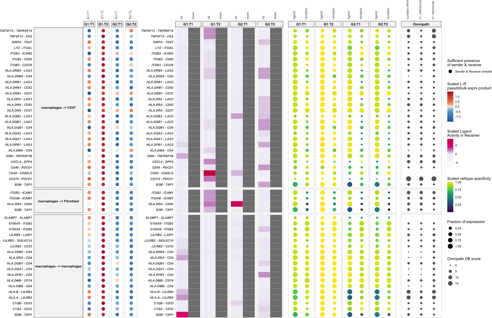

Now let's check the top interactions specific for the PreE group - so these are the interactions that decrease during anti-PD1 therapy, and more strongly in group1 than group2.


```r
group_oi = "G1.T1"
```


```r
prioritized_tbl_oi_50 = get_top_n_lr_pairs(
  multinichenet_output$prioritization_tables, 
  top_n = 50, rank_per_group = FALSE) %>% filter(group == group_oi)
```


```r
prioritized_tbl_oi_50_omnipath = prioritized_tbl_oi_50 %>% 
  inner_join(lr_network_all)
```


```r
plot_oi = make_sample_lr_prod_activity_plots_Omnipath(
  multinichenet_output$prioritization_tables, 
  prioritized_tbl_oi_50_omnipath)
plot_oi
```

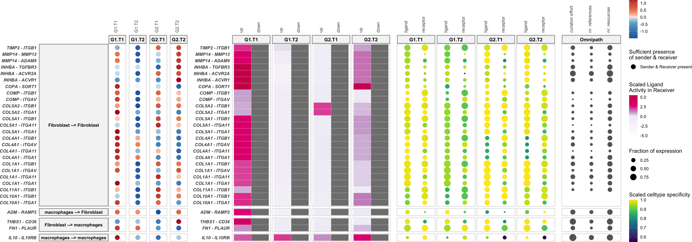

We recommend generating these plots as well for the other conditions, but we will not do this here to reduce the length of the vignette.

### Intercellular regulatory network inference and visualization 

One of the unique benefits of MultiNicheNet is the prediction of ligand activities and target genes downstream of ligand-receptor pairs. This may offer additional unique insights into the data at hand. We will showcase this here by inferring an intercellular regulatory network. Interestingly, some target genes can be ligands or receptors themselves. This illustrates that cells can send signals to other cells, who as a response to these signals produce signals themselves to feedback to the original sender cells, or who will effect other cell types. With MultiNicheNet, we can generate this 'systems' view of these intercellular feedback and cascade processes than can be occuring between the different cell populations involved. In this intercellular regulatory network, we will draw links between ligands of sender cell types their ligand/receptor-annotated target genes in receiver cell types. So links are ligand-target links (= gene regulatory links) and not ligand-receptor protein-protein interactions!

__Important__ In the default MultiNicheNet workflow for datasets with multiple samples per condition, we further filter out target genes based on expression correlation before generating this plot. However, this would not be meaningful here since we don't have multiple samples. As a consequence, we will have many ligand-target links here in these plots, making the plots less readable if we would consider more than the top 50 or 100 interactions. 


```r
prioritized_tbl_oi = get_top_n_lr_pairs(
  multinichenet_output$prioritization_tables, 
  100, 
  rank_per_group = FALSE)

lr_target_prior = prioritized_tbl_oi %>% inner_join(
        multinichenet_output$ligand_activities_targets_DEgenes$ligand_activities %>%
          distinct(ligand, target, direction_regulation, contrast) %>% inner_join(contrast_tbl) %>% ungroup() 
        ) 

lr_target_df = lr_target_prior %>% 
  distinct(group, sender, receiver, ligand, receptor, id, target, direction_regulation) 
```


```r
network = infer_intercellular_regulatory_network(lr_target_df, prioritized_tbl_oi)
network$links %>% head()
## # A tibble: 6 × 6
##   sender_ligand     receiver_target    direction_regulation group type          weight
##   <chr>             <chr>              <fct>                <chr> <chr>          <dbl>
## 1 Fibroblast_POSTN  Fibroblast_CCN2    up                   G2.T2 Ligand-Target      1
## 2 Fibroblast_POSTN  Fibroblast_COL1A1  up                   G2.T2 Ligand-Target      1
## 3 Fibroblast_POSTN  Fibroblast_COL6A3  up                   G2.T2 Ligand-Target      1
## 4 Fibroblast_POSTN  Fibroblast_FN1     up                   G2.T2 Ligand-Target      1
## 5 Fibroblast_POSTN  Fibroblast_GRP     up                   G2.T2 Ligand-Target      1
## 6 Fibroblast_COL5A1 Fibroblast_COL10A1 up                   G1.T1 Ligand-Target      1
network$nodes %>% head()
## # A tibble: 6 × 4
##   node              celltype   gene   type_gene      
##   <chr>             <chr>      <chr>  <chr>          
## 1 Fibroblast_MMP2   Fibroblast MMP2   ligand/receptor
## 2 Fibroblast_VCAM1  Fibroblast VCAM1  ligand/receptor
## 3 Fibroblast_POSTN  Fibroblast POSTN  ligand         
## 4 Fibroblast_COL5A1 Fibroblast COL5A1 ligand         
## 5 Fibroblast_COL4A1 Fibroblast COL4A1 ligand         
## 6 Fibroblast_MMP14  Fibroblast MMP14  ligand
```


```r
colors_sender["Fibroblast"] = "pink" # the  original yellow background with white font is not very readable
network_graph = visualize_network(network, colors_sender)
network_graph$plot
```


Interestingly, we are only left with interactions that increase after therapy in the E group. This means that we don't find many intercellular regulatory connections for the other groups. In most cases, you will get this type of network for all conditions in your data.

Note: we can also use this network to further prioritize differential CCC interactions. Here we will assume that the most important LR interactions are the ones that are involved in this intercellular regulatory network. We can get these interactions as follows:

```r
network$prioritized_lr_interactions
## # A tibble: 76 × 5
##    group sender     receiver   ligand receptor
##    <chr> <chr>      <chr>      <chr>  <chr>   
##  1 G2.T2 Fibroblast Fibroblast POSTN  ITGB5   
##  2 G2.T2 Fibroblast Fibroblast POSTN  ITGAV   
##  3 G1.T1 Fibroblast Fibroblast COL5A1 ITGB1   
##  4 G1.T1 Fibroblast Fibroblast COL4A1 ITGAV   
##  5 G2.T2 Fibroblast Fibroblast POSTN  PTK7    
##  6 G1.T1 Fibroblast Fibroblast COL4A1 ITGB1   
##  7 G1.T1 Fibroblast Fibroblast COL5A1 ITGA1   
##  8 G1.T1 Fibroblast Fibroblast COL4A1 ITGA1   
##  9 G1.T1 Fibroblast Fibroblast MMP14  MMP13   
## 10 G1.T1 Fibroblast Fibroblast INHBA  TGFBR3  
## # ℹ 66 more rows
```


```r
prioritized_tbl_oi_network = prioritized_tbl_oi %>% inner_join(
  network$prioritized_lr_interactions)
prioritized_tbl_oi_network
## # A tibble: 76 × 8
##    group sender     receiver   ligand receptor id                                 prioritization_score prioritization_rank
##    <chr> <chr>      <chr>      <chr>  <chr>    <chr>                                             <dbl>               <dbl>
##  1 G2.T2 Fibroblast Fibroblast POSTN  ITGB5    POSTN_ITGB5_Fibroblast_Fibroblast                 0.989                   1
##  2 G2.T2 Fibroblast Fibroblast POSTN  ITGAV    POSTN_ITGAV_Fibroblast_Fibroblast                 0.986                   2
##  3 G1.T1 Fibroblast Fibroblast COL5A1 ITGB1    COL5A1_ITGB1_Fibroblast_Fibroblast                0.985                   3
##  4 G1.T1 Fibroblast Fibroblast COL4A1 ITGAV    COL4A1_ITGAV_Fibroblast_Fibroblast                0.980                   4
##  5 G2.T2 Fibroblast Fibroblast POSTN  PTK7     POSTN_PTK7_Fibroblast_Fibroblast                  0.980                   5
##  6 G1.T1 Fibroblast Fibroblast COL4A1 ITGB1    COL4A1_ITGB1_Fibroblast_Fibroblast                0.980                   6
##  7 G1.T1 Fibroblast Fibroblast COL5A1 ITGA1    COL5A1_ITGA1_Fibroblast_Fibroblast                0.975                   7
##  8 G1.T1 Fibroblast Fibroblast COL4A1 ITGA1    COL4A1_ITGA1_Fibroblast_Fibroblast                0.971                   8
##  9 G1.T1 Fibroblast Fibroblast MMP14  MMP13    MMP14_MMP13_Fibroblast_Fibroblast                 0.958                   9
## 10 G1.T1 Fibroblast Fibroblast INHBA  TGFBR3   INHBA_TGFBR3_Fibroblast_Fibroblast                0.953                  10
## # ℹ 66 more rows
```

Visualize now the expression and activity of these interactions for the OnE group

```r
group_oi = "G1.T2"
```


```r
prioritized_tbl_oi_M = prioritized_tbl_oi_network %>% filter(group == group_oi)

plot_oi = make_sample_lr_prod_activity_plots_Omnipath(
  multinichenet_output$prioritization_tables, 
  prioritized_tbl_oi_M %>% inner_join(lr_network_all)
  )
plot_oi
```

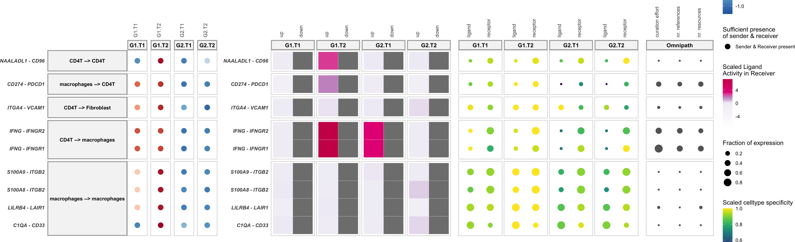
