<style type="text/css">
.smaller {
  font-size: 10px
}
</style>

<!-- github markdown built using
rmarkdown::render("vignettes/paired_analysis_SCC.Rmd", clean = FALSE )
-->


In this vignette, you can learn how to perform a MultiNicheNet analysis to compare cell-cell communication between two conditions of interest (one-vs-one comparison) in a __paired design__ setting. A MultiNicheNet analysis can be performed if you have multi-sample, multi-condition/group single-cell data. We strongly recommend having at least 4 samples in each of the groups/conditions you want to compare. With less samples, the benefits of performing a pseudobulk-based DE analysis are less clear. For those datasets, you can check and run our alternative workflow that makes use of cell-level sample-agnostic differential expression tools.

As input you need a SingleCellExperiment object containing at least the raw count matrix and metadata providing the following information for each cell: the **group**, **sample** and **cell type**.

As example expression data of interacting cells, we will here use scRNAseq data of patients with squamous cell carcinoma from this paper of Ji et al.: [Multimodal Analysis of Composition and Spatial Architecture in Human Squamous Cell Carcinoma](https://www.sciencedirect.com/science/article/pii/S0092867420306723). We have data of **normal and tumor tissue for each patient**, and thus a **paired design**. 

We will use MultiNicheNet to explore tumor microenvironment interactions that are different between tumor and normal tissue. In this vignette, we will prepare the data and analysis parameters, and then perform the MultiNicheNet analysis. In contrast to a classic pairwise analysis between conditions/groups, we will here demonstrate how you can include in the DE model that tumor and healthy tissue come from the same patient. 

We will first prepare the MultiNicheNet core analysis, then run the several steps in the MultiNicheNet core analysis, and finally interpret the output.

# Preparation of the MultiNicheNet core analysis


```r
library(SingleCellExperiment)
library(dplyr)
library(ggplot2)
library(nichenetr)
library(multinichenetr)
```

## Load NicheNet's ligand-receptor network and ligand-target matrix

MultiNicheNet builds upon the NicheNet framework and uses the same prior knowledge networks (ligand-receptor network and ligand-target matrix, currently v2 version).

The Nichenet v2 networks and matrices for both mouse and human can be downloaded from Zenodo [](https://doi.org/10.5281/zenodo.7074291). 

We will read these object in for human because our expression data is of human patients. 
Gene names are here made syntactically valid via `make.names()` to avoid the loss of genes (eg H2-M3) in downstream visualizations.


```r
organism = "human"
```


```r
options(timeout = 120)

if(organism == "human"){
  
  lr_network_all = 
    readRDS(url(
      "https://zenodo.org/record/10229222/files/lr_network_human_allInfo_30112033.rds"
      )) %>% 
    mutate(
      ligand = convert_alias_to_symbols(ligand, organism = organism), 
      receptor = convert_alias_to_symbols(receptor, organism = organism))
  
  lr_network_all = lr_network_all  %>% 
    mutate(ligand = make.names(ligand), receptor = make.names(receptor)) 
  
  lr_network = lr_network_all %>% 
    distinct(ligand, receptor)
  
  ligand_target_matrix = readRDS(url(
    "https://zenodo.org/record/7074291/files/ligand_target_matrix_nsga2r_final.rds"
    ))
  
  colnames(ligand_target_matrix) = colnames(ligand_target_matrix) %>% 
    convert_alias_to_symbols(organism = organism) %>% make.names()
  rownames(ligand_target_matrix) = rownames(ligand_target_matrix) %>% 
    convert_alias_to_symbols(organism = organism) %>% make.names()
  
  lr_network = lr_network %>% filter(ligand %in% colnames(ligand_target_matrix))
  ligand_target_matrix = ligand_target_matrix[, lr_network$ligand %>% unique()]
  
} else if(organism == "mouse"){
  
  lr_network_all = readRDS(url(
    "https://zenodo.org/record/10229222/files/lr_network_mouse_allInfo_30112033.rds"
    )) %>% 
    mutate(
      ligand = convert_alias_to_symbols(ligand, organism = organism), 
      receptor = convert_alias_to_symbols(receptor, organism = organism))
  
  lr_network_all = lr_network_all  %>% 
    mutate(ligand = make.names(ligand), receptor = make.names(receptor)) 
  lr_network = lr_network_all %>% 
    distinct(ligand, receptor)
  
  ligand_target_matrix = readRDS(url(
    "https://zenodo.org/record/7074291/files/ligand_target_matrix_nsga2r_final_mouse.rds"
    ))
  
  colnames(ligand_target_matrix) = colnames(ligand_target_matrix) %>% 
    convert_alias_to_symbols(organism = organism) %>% make.names()
  rownames(ligand_target_matrix) = rownames(ligand_target_matrix) %>% 
    convert_alias_to_symbols(organism = organism) %>% make.names()
  
  lr_network = lr_network %>% filter(ligand %in% colnames(ligand_target_matrix))
  ligand_target_matrix = ligand_target_matrix[, lr_network$ligand %>% unique()]
  
}
```

## Read in SingleCellExperiment Object

In this vignette, we will load in a subset of the scRNAseq data of the Ji el al Squamous Cell Carcinoma data. For the sake of demonstration, this subset only contains 4 cell types. 

If you start from a Seurat object, you can convert it easily to a SingleCellExperiment object via `sce = Seurat::as.SingleCellExperiment(seurat_obj, assay = "RNA")`.

Because the NicheNet 2.0. networks are in the most recent version of the official gene symbols, we will make sure that the gene symbols used in the expression data are also updated (= converted from their "aliases" to official gene symbols). Afterwards, we will make them again syntactically valid. 


```r
sce = readRDS(url(
  "https://zenodo.org/record/8010790/files/sce_subset_scc.rds"
  ))
sce = alias_to_symbol_SCE(sce, "human") %>% makenames_SCE()
```

## Prepare the settings of the MultiNicheNet cell-cell communication analysis

In this step, we will formalize our research question into MultiNicheNet input arguments.

### Define in which metadata columns we can find the **group**, **sample** and **cell type** IDs

In this case study, we want to study differences in cell-cell communication patterns between cells in tumor tissue and healthy tissue. The meta data columns that indicate this tissue status is `tum.norm` (values: Tumor and Normal). 

Cell type annotations are indicated in the `celltype_alt` column, and the sample is indicated by the `sample_id` column. 
If your cells are annotated in multiple hierarchical levels, we recommend using a relatively high level in the hierarchy. This for 2 reasons: 1) MultiNicheNet focuses on differential expression and not differential abundance, and 2) there should be sufficient cells per sample-celltype combination (see later).


```r
sample_id = "sample_id"
group_id = "tum.norm"
celltype_id = "celltype_alt"
```

__Important__: It is required that each sample-id is uniquely assigned to only one condition/group of interest. See the vignettes about paired and multifactorial analysis to see how to define your analysis input when you have multiple samples (and conditions) per patient.

If you would have batch effects or covariates you can correct for, you can define this here as well. For this dataset, we can set the patient ID (given by the `patient` column) as covariate. Important: for a MultiNicheNet analysis there is a difference between a covariate and batch in the following sense: covariates will just be included in the DE GLM model, whereas batches will be included in the DE GLM model AND normalized pseudobulk expression values will be corrected for the batch effects. In this dataset, we want to take into account the patient effect, but not correct the expression values for the patient effect. Therefore we add patient as covariate and not as batch. 


```r
covariates = "patient"
batches = NA
```

__Important__: for categorical covariates and batches, there should be at least one sample for every group-batch combination. If one of your groups/conditions lacks a certain level of your batch, you won't be able to correct for the batch effect because the model is then not able to distinguish batch from group/condition effects.

__Important__: The column names of group, sample, cell type, batches and covariates should be syntactically valid (`make.names`)

__Important__: All group, sample, cell type, batch and covariate names should be syntactically valid as well (`make.names`) (eg through `SummarizedExperiment::colData(sce)$ShortID = SummarizedExperiment::colData(sce)$ShortID %>% make.names()`)

### Define the contrasts of interest.

For this analysis, we want to compare Tumor tissue and normal tissue. To do this comparison, we need to set the following contrasts:


```r
contrasts_oi = c("'Tumor-Normal','Normal-Tumor'")
```

__Very Important__ Note the format to indicate the contrasts! This formatting should be adhered to very strictly, and white spaces are not allowed! Check `?get_DE_info` for explanation about how to define this well. The most important points are that: 
*each contrast is surrounded by single quotation marks
*contrasts are separated by a comma without any white space 
*all contrasts together are surrounded by double quotation marks. 

If you compare against two groups, you should divide by 2 (as demonstrated in other vignettes), if you compare against three groups, you should divide by 3 and so on.

For downstream visualizations and linking contrasts to their main condition, we also need to run the following:
This is necessary because we will also calculate cell-type+condition specificity of ligands and receptors. 


```r
contrast_tbl = tibble(contrast =
                        c("Tumor-Normal", "Normal-Tumor"),
                      group = c("Tumor", "Normal"))
```

Other vignettes will demonstrate how to formalize different types of research questions.

### Define the sender and receiver cell types of interest.

If you want to focus the analysis on specific cell types (e.g. because you know which cell types reside in the same microenvironments based on spatial data), you can define this here. If you have sufficient computational resources and no specific idea of cell-type colocalzations, we recommend to consider all cell types as potential senders and receivers. Later on during analysis of the output it is still possible to zoom in on the cell types that interest you most, but your analysis is not biased to them.

Here we will consider all cell types in the data:


```r
senders_oi = SummarizedExperiment::colData(sce)[,celltype_id] %>% unique()
receivers_oi = SummarizedExperiment::colData(sce)[,celltype_id] %>% unique()
sce = sce[, SummarizedExperiment::colData(sce)[,celltype_id] %in% 
            c(senders_oi, receivers_oi)
          ]
```

In case you would have samples in your data that do not belong to one of the groups/conditions of interest, we recommend removing them and only keeping conditions of interest:


```r
conditions_keep = c("Normal", "Tumor")
sce = sce[, SummarizedExperiment::colData(sce)[,group_id] %in% 
            conditions_keep
          ]
```
# Running the MultiNicheNet core analysis

Now we will run the core of a MultiNicheNet analysis. This analysis consists of the following steps:

* 1. Cell-type filtering: determine which cell types are sufficiently present
* 2. Gene filtering: determine which genes are sufficiently expressed in each present cell type
* 3. Pseudobulk expression calculation: determine and normalize per-sample pseudobulk expression levels for each expressed gene in each present cell type
* 4. Differential expression (DE) analysis: determine which genes are differentially expressed
* 5. Ligand activity prediction: use the DE analysis output to predict the activity of ligands in receiver cell types and infer their potential target genes
* 6. Prioritization: rank cell-cell communication patterns through multi-criteria prioritization

Following these steps, one can optionally 
* 7. Calculate the across-samples expression correlation between ligand-receptor pairs and target genes
* 8. Prioritize communication patterns involving condition-specific cell types through an alternative prioritization scheme

After these steps, the output can be further explored as we will demonstrate in the "Downstream analysis of the MultiNicheNet output" section. 

In this vignette, we will demonstrate these steps one-by-one, which offers the most flexibility to the user to assess intermediary results. Other vignettes will demonstrate the use of the `multi_nichenet_analysis` wrapper function.

## Cell-type filtering: determine which cell types are sufficiently present

In this step we will calculate and visualize cell type abundances. This will give an indication about which cell types will be retained in the analysis, and which cell types will be filtered out.  
Since MultiNicheNet will infer group differences at the sample level for each cell type (currently via Muscat - pseudobulking + EdgeR), we need to have sufficient cells per sample of a cell type, and this for all groups. In the following analysis we will set this minimum number of cells per cell type per sample at 10. Samples that have less than `min_cells` cells will be excluded from the analysis for that specific cell type.
 

```r
min_cells = 10
```

We recommend using `min_cells = 10`, except for datasets with several lowly abundant cell types of interest. For those datasets, we recommend using `min_cells = 5`.


```r
abundance_info = get_abundance_info(
  sce = sce, 
  sample_id = sample_id, group_id = group_id, celltype_id = celltype_id, 
  min_cells = min_cells, 
  senders_oi = senders_oi, receivers_oi = receivers_oi, 
  batches = batches
  )
```

First, we will check the cell type abundance diagnostic plots.

### Interpretation of cell type abundance information

The first plot visualizes the number of cells per celltype-sample combination, and indicates which combinations are removed during the DE analysis because there are less than `min_cells` in the celltype-sample combination. 


```r
abundance_info$abund_plot_sample
```

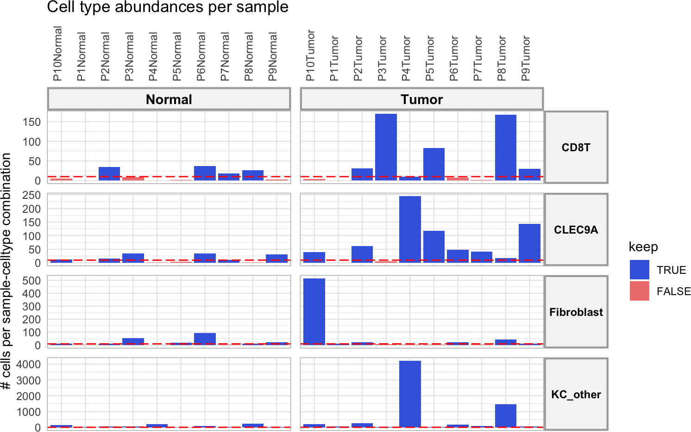

The red dotted line indicates the required minimum of cells as defined above in `min_cells`. We can see here that some sample-celltype combinations are left out. For the DE analysis in the next step, only cell types will be considered if there are at least two samples per group with a sufficient number of cells. But as we can see here: all cell types will be considered for the analysis and there are no condition-specific cell types. 

__Important__: Based on the cell type abundance diagnostics, we recommend users to change their analysis settings if required (eg changing cell type annotation level, batches, ...), before proceeding with the rest of the analysis. If too many celltype-sample combinations don't pass this threshold, we recommend to define your cell types in a more general way (use one level higher of the cell type ontology hierarchy) (eg TH17 CD4T cells --> CD4T cells) or use `min_cells = 5` if this would not be possible.

You can always explore this plot for a more lenient or stringent setting of `min_cells` in case of doubt. In this case study, it may be useful to be more lenient. Why? Because we added the Patient ID as covariate, we need to have sufficient cells of one patient for BOTH tumor and normal tissue to include that patient in the DE analysis. Since we seem to have many "borderline" cases here and could up with a low nr of included patients, we will drop our stringency level.


```r
min_cells = 5

abundance_info = get_abundance_info(
  sce = sce, 
  sample_id = sample_id, group_id = group_id, celltype_id = celltype_id, 
  min_cells = min_cells, 
  senders_oi = senders_oi, receivers_oi = receivers_oi, 
  batches = batches
  )

abundance_info$abund_plot_sample
```


### Cell type filtering based on cell type abundance information

Running the following block of code can help you determine which cell types are condition-specific and which cell types are absent. 


```r
sample_group_celltype_df = abundance_info$abundance_data %>% 
  filter(n > min_cells) %>% 
  ungroup() %>% 
  distinct(sample_id, group_id) %>% 
  cross_join(
    abundance_info$abundance_data %>% 
      ungroup() %>% 
      distinct(celltype_id)
    ) %>% 
  arrange(sample_id)

abundance_df = sample_group_celltype_df %>% left_join(
  abundance_info$abundance_data %>% ungroup()
  )

abundance_df$n[is.na(abundance_df$n)] = 0
abundance_df$keep[is.na(abundance_df$keep)] = FALSE
abundance_df_summarized = abundance_df %>% 
  mutate(keep = as.logical(keep)) %>% 
  group_by(group_id, celltype_id) %>% 
  summarise(samples_present = sum((keep)))

celltypes_absent_one_condition = abundance_df_summarized %>% 
  filter(samples_present == 0) %>% pull(celltype_id) %>% unique() 
# find truly condition-specific cell types by searching for cell types 
# truely absent in at least one condition

celltypes_present_one_condition = abundance_df_summarized %>% 
  filter(samples_present >= 2) %>% pull(celltype_id) %>% unique() 
# require presence in at least 2 samples of one group so 
# it is really present in at least one condition

condition_specific_celltypes = intersect(
  celltypes_absent_one_condition, 
  celltypes_present_one_condition)

total_nr_conditions = SummarizedExperiment::colData(sce)[,group_id] %>% 
  unique() %>% length() 

absent_celltypes = abundance_df_summarized %>% 
  filter(samples_present < 2) %>% 
  group_by(celltype_id) %>% 
  count() %>% 
  filter(n == total_nr_conditions) %>% 
  pull(celltype_id)
  
print("condition-specific celltypes:")
## [1] "condition-specific celltypes:"
print(condition_specific_celltypes)
## character(0)
  
print("absent celltypes:")
## [1] "absent celltypes:"
print(absent_celltypes)
## character(0)
```
Absent cell types will be filtered out, condition-specific cell types can be filtered out if you as a user do not want to run the alternative workflow for condition-specific cell types in the optional step 8 of the core MultiNicheNet analysis. 

For this dataset, there are no condition-specific or absent cell types, so this does not really matter.


```r
analyse_condition_specific_celltypes = FALSE
```


```r
if(analyse_condition_specific_celltypes == TRUE){
  senders_oi = senders_oi %>% setdiff(absent_celltypes)
  receivers_oi = receivers_oi %>% setdiff(absent_celltypes)
} else {
  senders_oi = senders_oi %>% 
    setdiff(union(absent_celltypes, condition_specific_celltypes))
  receivers_oi = receivers_oi %>% 
    setdiff(union(absent_celltypes, condition_specific_celltypes))
}

sce = sce[, SummarizedExperiment::colData(sce)[,celltype_id] %in% 
            c(senders_oi, receivers_oi)
          ]
```

## Gene filtering: determine which genes are sufficiently expressed in each present cell type

Before running the DE analysis, we will determine which genes are not sufficiently expressed and should be filtered out. 
We will perform gene filtering based on a similar procedure as used in `edgeR::filterByExpr`. However, we adapted this procedure to be more interpretable for single-cell datasets.  

For each cell type, we will consider genes expressed if they are expressed in at least a `min_sample_prop` fraction of samples in the condition with the lowest number of samples. By default, we set `min_sample_prop = 0.50`, which means that genes should be expressed in at least 2 samples if the group with lowest nr. of samples has 4 samples like this dataset. 


```r
min_sample_prop = 0.50
```

But how do we define which genes are expressed in a sample? For this we will consider genes as expressed if they have non-zero expression values in a `fraction_cutoff` fraction of cells of that cell type in that sample. By default, we set `fraction_cutoff = 0.05`, which means that genes should show non-zero expression values in at least 5% of cells in a sample. 


```r
fraction_cutoff = 0.05
```

We recommend using these default values unless there is specific interest in prioritizing (very) weakly expressed interactions. In that case, you could lower the value of `fraction_cutoff`. We explicitly recommend against using `fraction_cutoff > 0.10`.

Now we will calculate the information required for gene filtering with the following command:


```r
frq_list = get_frac_exprs(
  sce = sce, 
  sample_id = sample_id, celltype_id =  celltype_id, group_id = group_id, 
  batches = batches, 
  min_cells = min_cells, 
  fraction_cutoff = fraction_cutoff, min_sample_prop = min_sample_prop)
## [1] "Samples are considered if they have more than 5 cells of the cell type of interest"
## [1] "Genes with non-zero counts in at least 5% of cells of a cell type of interest in a particular sample will be considered as expressed in that sample."
## [1] "Genes expressed in at least 3 samples will considered as expressed in the cell type: CD8T"
## [1] "Genes expressed in at least 3 samples will considered as expressed in the cell type: CLEC9A"
## [1] "Genes expressed in at least 4 samples will considered as expressed in the cell type: Fibroblast"
## [1] "Genes expressed in at least 5 samples will considered as expressed in the cell type: KC_other"
## [1] "7915 genes are considered as expressed in the cell type: CD8T"
## [1] "8901 genes are considered as expressed in the cell type: CLEC9A"
## [1] "10494 genes are considered as expressed in the cell type: Fibroblast"
## [1] "10982 genes are considered as expressed in the cell type: KC_other"
```

Now only keep genes that are expressed by at least one cell type:


```r
genes_oi = frq_list$expressed_df %>% 
  filter(expressed == TRUE) %>% pull(gene) %>% unique() 
sce = sce[genes_oi, ]
```

## Pseudobulk expression calculation: determine and normalize per-sample pseudobulk expression levels for each expressed gene in each present cell type

After filtering out absent cell types and genes, we will continue the analysis by calculating the different prioritization criteria that we will use to prioritize cell-cell communication patterns.

First, we will determine and normalize per-sample pseudobulk expression levels for each expressed gene in each present cell type. The function `process_abundance_expression_info` will link this expression information for ligands of the sender cell types to the corresponding receptors of the receiver cell types. This will later on allow us to define the cell-type specicificy criteria for ligands and receptors.


```r
abundance_expression_info = process_abundance_expression_info(
  sce = sce, 
  sample_id = sample_id, group_id = group_id, celltype_id = celltype_id, 
  min_cells = min_cells, 
  senders_oi = senders_oi, receivers_oi = receivers_oi, 
  lr_network = lr_network, 
  batches = batches, 
  frq_list = frq_list, 
  abundance_info = abundance_info)
```

Normalized pseudobulk expression values per gene/celltype/sample can be inspected by:


```r
abundance_expression_info$celltype_info$pb_df %>% head()
## # A tibble: 6 × 4
##   gene     sample    pb_sample celltype
##   <chr>    <chr>         <dbl> <fct>   
## 1 A1BG     P10Normal      2.18 KC_other
## 2 A1BG.AS1 P10Normal      1.64 KC_other
## 3 A2M      P10Normal      3.24 KC_other
## 4 A2ML1    P10Normal      3.92 KC_other
## 5 A4GALT   P10Normal      0    KC_other
## 6 AAAS     P10Normal      4.60 KC_other
```

An average of these sample-level expression values per condition/group can be inspected by:


```r
abundance_expression_info$celltype_info$pb_df_group %>% head()
## # A tibble: 6 × 4
## # Groups:   group, celltype [1]
##   group  celltype gene     pb_group
##   <chr>  <chr>    <chr>       <dbl>
## 1 Normal CD8T     A1BG         6.06
## 2 Normal CD8T     A1BG.AS1     1.22
## 3 Normal CD8T     A2M          0   
## 4 Normal CD8T     A2ML1        0   
## 5 Normal CD8T     A4GALT       0   
## 6 Normal CD8T     AAAS         3.20
```

Inspecting these values for ligand-receptor interactions can be done by:


```r
abundance_expression_info$sender_receiver_info$pb_df %>% head()
## # A tibble: 6 × 8
##   sample    sender receiver   ligand  receptor pb_ligand pb_receptor ligand_receptor_pb_prod
##   <chr>     <chr>  <chr>      <chr>   <chr>        <dbl>       <dbl>                   <dbl>
## 1 P6Normal  CLEC9A Fibroblast HLA.DRA CD63          14.9        12.3                    184.
## 2 P10Tumor  CLEC9A Fibroblast HLA.DRA CD63          15.2        11.8                    180.
## 3 P4Tumor   CLEC9A Fibroblast HLA.DRA CD63          15.3        11.6                    178.
## 4 P4Tumor   CLEC9A CLEC9A     HLA.DMA CD74          10.8        16.0                    172.
## 5 P10Normal CLEC9A Fibroblast HLA.DRA CD63          14.6        11.7                    171.
## 6 P2Tumor   CLEC9A Fibroblast HLA.DRA CD63          14.5        11.7                    169.
abundance_expression_info$sender_receiver_info$pb_df_group %>% head()
## # A tibble: 6 × 8
## # Groups:   group, sender [2]
##   group  sender receiver   ligand  receptor pb_ligand_group pb_receptor_group ligand_receptor_pb_prod_group
##   <chr>  <chr>  <chr>      <chr>   <chr>              <dbl>             <dbl>                         <dbl>
## 1 Normal CLEC9A Fibroblast HLA.DRA CD63               14.5              11.5                           167.
## 2 Tumor  CLEC9A Fibroblast HLA.DRA CD63               14.4              11.5                           167.
## 3 Normal CLEC9A CLEC9A     HLA.DMA CD74               10.0              15.3                           154.
## 4 Tumor  CLEC9A CLEC9A     HLA.DMA CD74                9.83             15.1                           149.
## 5 Normal CLEC9A KC_other   HLA.DRA CD9                14.5               9.75                          141.
## 6 Normal CLEC9A Fibroblast HLA.DRA CD9                14.5               9.63                          140.
```

## Differential expression (DE) analysis: determine which genes are differentially expressed

In this step, we will perform genome-wide differential expression analysis of receiver and sender cell types to define DE genes between the conditions of interest (as formalized by the `contrasts_oi`). Based on this analysis, we later can define the levels of differential expression of ligands in senders and receptors in receivers, and define the set of affected target genes in the receiver cell types (which will be used for the ligand activity analysis).

We will apply pseudobulking followed by EdgeR to perform multi-condition multi-sample differential expression (DE) analysis (also called 'differential state' analysis by the developers of Muscat). 


```r
DE_info = get_DE_info(
  sce = sce, 
  sample_id = sample_id, group_id = group_id, celltype_id = celltype_id, 
  batches = batches, covariates = covariates, 
  contrasts_oi = contrasts_oi, 
  min_cells = min_cells, 
  expressed_df = frq_list$expressed_df)
## [1] "DE analysis is done:"
## [1] "included cell types are:"
## [1] "KC_other"   "Fibroblast" "CLEC9A"     "CD8T"
```

### Check DE results

Check DE output information in table with logFC and p-values for each gene-celltype-contrast:


```r
DE_info$celltype_de$de_output_tidy %>% head()
## # A tibble: 6 × 9
##   gene    cluster_id  logFC logCPM     F   p_val p_adj.loc  p_adj contrast    
##   <chr>   <chr>       <dbl>  <dbl> <dbl>   <dbl>     <dbl>  <dbl> <chr>       
## 1 A1BG    KC_other    0.379   2.88  0.46 0.505      0.749  0.749  Tumor-Normal
## 2 A2ML1   KC_other    0.41    4.79  0.47 0.501      0.746  0.746  Tumor-Normal
## 3 AAAS    KC_other    0.362   4.54  1.93 0.179      0.433  0.433  Tumor-Normal
## 4 AACS    KC_other   -0.651   4.78  5.01 0.0365     0.177  0.177  Tumor-Normal
## 5 AADACL2 KC_other   -2.54    2.84  8.45 0.00968    0.0835 0.0835 Tumor-Normal
## 6 AAGAB   KC_other    0.816   4.69  9.14 0.00664    0.0674 0.0674 Tumor-Normal
```
Evaluate the distributions of p-values:


```r
DE_info$hist_pvals
```

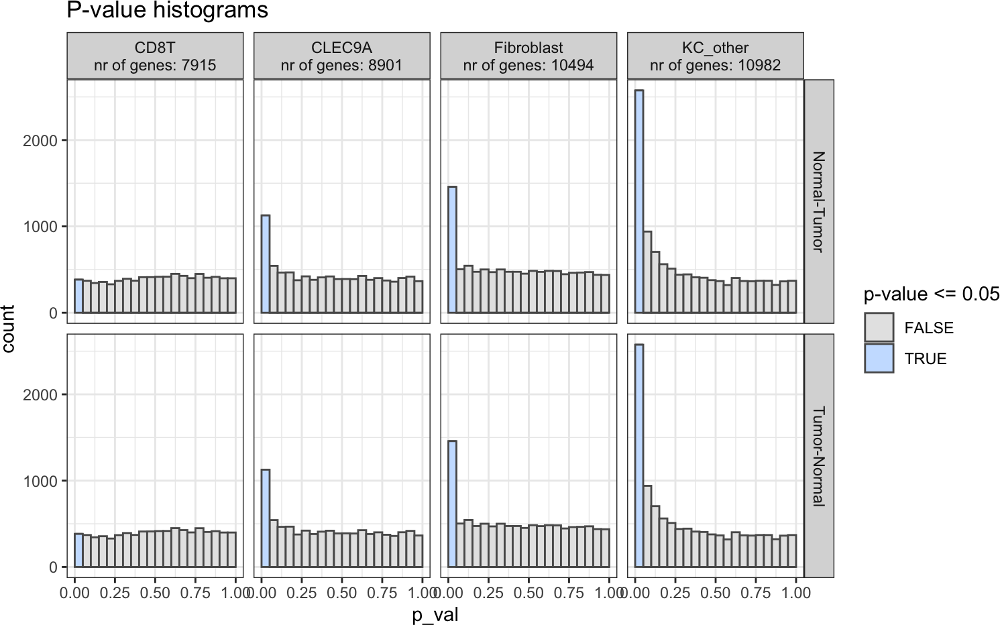

These distributions look fine (uniform distribution, except peak at p-value <= 0.05), so we will continue using these regular p-values. In case these p-value distributions look irregular, you can estimate empirical p-values as we will demonstrate in another vignette.


```r
empirical_pval = FALSE
```


```r
if(empirical_pval == TRUE){
  DE_info_emp = get_empirical_pvals(DE_info$celltype_de$de_output_tidy)
  celltype_de = DE_info_emp$de_output_tidy_emp %>% select(-p_val, -p_adj) %>% 
    rename(p_val = p_emp, p_adj = p_adj_emp)
} else {
  celltype_de = DE_info$celltype_de$de_output_tidy
} 
```

### Combine DE information for ligand-senders and receptors-receivers

To end this step, we will combine the DE information of senders and receivers by linking their ligands and receptors together based on the prior knowledge ligand-receptor network.


```r
sender_receiver_de = combine_sender_receiver_de(
  sender_de = celltype_de,
  receiver_de = celltype_de,
  senders_oi = senders_oi,
  receivers_oi = receivers_oi,
  lr_network = lr_network
)
```


```r
sender_receiver_de %>% head(20)
## # A tibble: 20 × 12
##    contrast     sender     receiver   ligand receptor lfc_ligand lfc_receptor ligand_receptor_lfc_avg p_val_ligand p_adj_ligand p_val_receptor p_adj_receptor
##    <chr>        <chr>      <chr>      <chr>  <chr>         <dbl>        <dbl>                   <dbl>        <dbl>        <dbl>          <dbl>          <dbl>
##  1 Tumor-Normal Fibroblast Fibroblast MMP1   F2R          11.6         1.81                      6.70     1.02e-84     1.07e-80       3.96e- 5       1.27e- 3
##  2 Tumor-Normal KC_other   Fibroblast TPSAB1 F2RL1        11.2         1.23                      6.22     2.36e-14     2.59e-10       2.04e- 1       7.1 e- 1
##  3 Tumor-Normal Fibroblast CD8T       CCL5   CCR1          7.54        4.64                      6.09     2.82e-19     1.18e-16       3   e- 2       8.66e- 1
##  4 Tumor-Normal Fibroblast Fibroblast TIMP1  MMP1          0.434      11.6                       6.02     1.49e- 1     6.3 e- 1       1.02e-84       1.07e-80
##  5 Tumor-Normal KC_other   Fibroblast TIMP1  MMP1          0.306      11.6                       5.95     2.01e- 1     4.61e- 1       1.02e-84       1.07e-80
##  6 Tumor-Normal Fibroblast CD8T       MMP1   F2R          11.6         0.0622                    5.83     1.02e-84     1.07e-80       9.34e- 1       9.99e- 1
##  7 Tumor-Normal Fibroblast KC_other   MMP1   ITGA2        11.6        -0.0228                    5.79     1.02e-84     1.07e-80       9.35e- 1       9.78e- 1
##  8 Tumor-Normal Fibroblast KC_other   MMP1   CD44         11.6        -0.333                     5.63     1.02e-84     1.07e-80       2.02e- 1       4.62e- 1
##  9 Tumor-Normal CLEC9A     Fibroblast TIMP1  MMP1         -0.366      11.6                       5.62     2.49e- 1     7.46e- 1       1.02e-84       1.07e-80
## 10 Tumor-Normal KC_other   KC_other   TPSAB1 F2RL1        11.2        -0.113                     5.54     2.36e-14     2.59e-10       7.54e- 1       8.98e- 1
## 11 Tumor-Normal Fibroblast CD8T       MMP1   CD44         11.6        -0.534                     5.53     1.02e-84     1.07e-80       1.87e- 1       9.99e- 1
## 12 Tumor-Normal Fibroblast KC_other   MMP1   F2R          11.6        -0.812                     5.39     1.02e-84     1.07e-80       8.63e- 2       2.9 e- 1
## 13 Tumor-Normal Fibroblast Fibroblast MMP1   CD44         11.6        -0.859                     5.37     1.02e-84     1.07e-80       8.38e- 3       1.07e- 1
## 14 Tumor-Normal Fibroblast CLEC9A     MMP1   CD44         11.6        -1.13                      5.24     1.02e-84     1.07e-80       2.16e- 4       1.03e- 2
## 15 Tumor-Normal CD8T       Fibroblast TIMP1  MMP1         -1.23       11.6                       5.18     1.44e- 2     6.78e- 1       1.02e-84       1.07e-80
## 16 Tumor-Normal CLEC9A     CLEC9A     CCL19  CCR7          6.21        3.88                      5.04     5.79e-37     5.15e-33       9.38e-21       2.09e-17
## 17 Tumor-Normal Fibroblast KC_other   CCN4   ITGA5         4.57        5.16                      4.86     7.78e-10     6.75e- 8       1.33e- 8       1.83e- 5
## 18 Tumor-Normal CLEC9A     Fibroblast CXCL13 ACKR4         8.58        1.12                      4.85     4.87e-16     6.20e-13       1.07e- 2       1.27e- 1
## 19 Tumor-Normal Fibroblast CD8T       INHBA  ACVR1         4.85        4.65                      4.75     1.12e-23     7.33e-21       2.92e- 2       8.51e- 1
## 20 Tumor-Normal CLEC9A     CD8T       CXCL13 CXCR3         8.58        0.897                     4.74     4.87e-16     6.20e-13       1.27e- 1       9.99e- 1
```

## Ligand activity prediction: use the DE analysis output to predict the activity of ligands in receiver cell types and infer their potential target genes

In this step, we will predict NicheNet ligand activities and NicheNet ligand-target links based on these differential expression results. We do this to prioritize interactions based on their predicted effect on a receiver cell type. We will assume that the most important group-specific interactions are those that lead to group-specific gene expression changes in a receiver cell type.

Similarly to base NicheNet (https://github.com/saeyslab/nichenetr), we use the DE output to create a "geneset of interest": here we assume that DE genes within a cell type may be DE because of differential cell-cell communication processes. In the ligand activity prediction, we will assess the enrichment of target genes of ligands within this geneset of interest. In case high-probabiliy target genes of a ligand are enriched in this set compared to the background of expressed genes, we predict that this ligand may have a high activity. 

Because the ligand activity analysis is an enrichment procedure, it is important that this geneset of interest should contain a sufficient but not too large number of genes. The ratio geneset_oi/background should ideally be between 1/200 and 1/10 (or close to these ratios).

To determine the genesets of interest based on DE output, we need to define some logFC and/or p-value thresholds per cell type/contrast combination. In general, we recommend inspecting the nr. of DE genes for all cell types based on the default thresholds and adapting accordingly. By default, we will apply the p-value cutoff on the normal p-values, and not on the p-values corrected for multiple testing. This choice was made because most multi-sample single-cell transcriptomics datasets have just a few samples per group and we might have a lack of statistical power due to pseudobulking. But, if the smallest group >= 20 samples, we typically recommend using p_val_adj = TRUE. When the biological difference between the conditions is very large, we typically recommend increasing the logFC_threshold and/or using p_val_adj = TRUE.

### Assess geneset_oi-vs-background ratios for different DE output tresholds prior to the NicheNet ligand activity analysis 

We will first inspect the geneset_oi-vs-background ratios for the default tresholds:


```r
logFC_threshold = 0.50
p_val_threshold = 0.05
```


```r
p_val_adj = FALSE 
```


```r
geneset_assessment = contrast_tbl$contrast %>% 
  lapply(
    process_geneset_data, 
    celltype_de, logFC_threshold, p_val_adj, p_val_threshold
  ) %>% 
  bind_rows() 
geneset_assessment
## # A tibble: 8 × 12
##   cluster_id n_background n_geneset_up n_geneset_down prop_geneset_up prop_geneset_down in_range_up in_range_down contrast     logFC_threshold p_val_threshold adjusted
##   <chr>             <int>        <int>          <int>           <dbl>             <dbl> <lgl>       <lgl>         <chr>                  <dbl>           <dbl> <lgl>   
## 1 CD8T               7915          310             73         0.0392            0.00922 TRUE        TRUE          Tumor-Normal             0.5            0.05 FALSE   
## 2 CLEC9A             8901          700            427         0.0786            0.0480  TRUE        TRUE          Tumor-Normal             0.5            0.05 FALSE   
## 3 Fibroblast        10494          712            746         0.0678            0.0711  TRUE        TRUE          Tumor-Normal             0.5            0.05 FALSE   
## 4 KC_other          10982         1373           1102         0.125             0.100   FALSE       FALSE         Tumor-Normal             0.5            0.05 FALSE   
## 5 CD8T               7915           73            310         0.00922           0.0392  TRUE        TRUE          Normal-Tumor             0.5            0.05 FALSE   
## 6 CLEC9A             8901          427            700         0.0480            0.0786  TRUE        TRUE          Normal-Tumor             0.5            0.05 FALSE   
## 7 Fibroblast        10494          746            712         0.0711            0.0678  TRUE        TRUE          Normal-Tumor             0.5            0.05 FALSE   
## 8 KC_other          10982         1102           1373         0.100             0.125   FALSE       FALSE         Normal-Tumor             0.5            0.05 FALSE
```
We can see here that for all cell type / contrast combinations, all geneset/background ratio's are within the recommended range (`in_range_up` and `in_range_down` columns). When these geneset/background ratio's would not be within the recommended ranges, we should interpret ligand activity results for these cell types with more caution, or use different thresholds (for these or all cell types). 

Because we are only out of range for the `KC_other` cell type, we will explore these ratio's in case we would increase the stringency of the logFC cutoff a little bit.


```r
logFC_threshold = 0.75
```


```r
geneset_assessment = contrast_tbl$contrast %>% 
  lapply(
    process_geneset_data, 
    celltype_de, logFC_threshold, p_val_adj = p_val_adj, p_val_threshold
    ) %>% 
  bind_rows() 
geneset_assessment
## # A tibble: 8 × 12
##   cluster_id n_background n_geneset_up n_geneset_down prop_geneset_up prop_geneset_down in_range_up in_range_down contrast     logFC_threshold p_val_threshold adjusted
##   <chr>             <int>        <int>          <int>           <dbl>             <dbl> <lgl>       <lgl>         <chr>                  <dbl>           <dbl> <lgl>   
## 1 CD8T               7915          310             73         0.0392            0.00922 TRUE        TRUE          Tumor-Normal            0.75            0.05 FALSE   
## 2 CLEC9A             8901          649            328         0.0729            0.0368  TRUE        TRUE          Tumor-Normal            0.75            0.05 FALSE   
## 3 Fibroblast        10494          696            721         0.0663            0.0687  TRUE        TRUE          Tumor-Normal            0.75            0.05 FALSE   
## 4 KC_other          10982         1009            779         0.0919            0.0709  TRUE        TRUE          Tumor-Normal            0.75            0.05 FALSE   
## 5 CD8T               7915           73            310         0.00922           0.0392  TRUE        TRUE          Normal-Tumor            0.75            0.05 FALSE   
## 6 CLEC9A             8901          328            649         0.0368            0.0729  TRUE        TRUE          Normal-Tumor            0.75            0.05 FALSE   
## 7 Fibroblast        10494          721            696         0.0687            0.0663  TRUE        TRUE          Normal-Tumor            0.75            0.05 FALSE   
## 8 KC_other          10982          779           1009         0.0709            0.0919  TRUE        TRUE          Normal-Tumor            0.75            0.05 FALSE
```
Now we are in range for all cell types, and we will therefore proceed with these tresholds for the ligand activity analysis.

### Perform the ligand activity analysis and ligand-target inference

After the ligand activity prediction, we will also infer the predicted target genes of these ligands in each contrast. For this ligand-target inference procedure, we also need to select which top n of the predicted target genes will be considered (here: top 250 targets per ligand). This parameter will not affect the ligand activity predictions. It will only affect ligand-target visualizations and construction of the intercellular regulatory network during the downstream analysis. We recommend users to test other settings in case they would be interested in exploring fewer, but more confident target genes, or vice versa. 


```r
top_n_target = 250
```

The NicheNet ligand activity analysis can be run in parallel for each receiver cell type, by changing the number of cores as defined here. Using more cores will speed up the analysis at the cost of needing more memory. This is only recommended if you have many receiver cell types of interest. 


```r
verbose = TRUE
cores_system = 8
n.cores = min(cores_system, celltype_de$cluster_id %>% unique() %>% length()) 
```

Running the ligand activity prediction will take some time (the more cell types and contrasts, the more time)


```r
ligand_activities_targets_DEgenes = suppressMessages(suppressWarnings(
  get_ligand_activities_targets_DEgenes(
    receiver_de = celltype_de,
    receivers_oi = intersect(receivers_oi, celltype_de$cluster_id %>% unique()),
    ligand_target_matrix = ligand_target_matrix,
    logFC_threshold = logFC_threshold,
    p_val_threshold = p_val_threshold,
    p_val_adj = p_val_adj,
    top_n_target = top_n_target,
    verbose = verbose, 
    n.cores = n.cores
  )
))
```

You can check the output of the ligand activity and ligand-target inference here:


```r
ligand_activities_targets_DEgenes$ligand_activities %>% head(20)
## # A tibble: 20 × 8
## # Groups:   receiver, contrast [1]
##    ligand activity contrast     target ligand_target_weight receiver direction_regulation activity_scaled
##    <chr>     <dbl> <chr>        <chr>                 <dbl> <chr>    <fct>                          <dbl>
##  1 A2M      0.0335 Tumor-Normal BIRC5               0.00940 CD8T     up                             0.286
##  2 A2M      0.0335 Tumor-Normal BST2                0.00662 CD8T     up                             0.286
##  3 A2M      0.0335 Tumor-Normal CCL20               0.00678 CD8T     up                             0.286
##  4 A2M      0.0335 Tumor-Normal CCL5                0.00888 CD8T     up                             0.286
##  5 A2M      0.0335 Tumor-Normal CCNA2               0.00880 CD8T     up                             0.286
##  6 A2M      0.0335 Tumor-Normal CD70                0.00689 CD8T     up                             0.286
##  7 A2M      0.0335 Tumor-Normal CDK1                0.00814 CD8T     up                             0.286
##  8 A2M      0.0335 Tumor-Normal CDK4                0.00751 CD8T     up                             0.286
##  9 A2M      0.0335 Tumor-Normal CDK6                0.00889 CD8T     up                             0.286
## 10 A2M      0.0335 Tumor-Normal CDKN2C              0.00726 CD8T     up                             0.286
## 11 A2M      0.0335 Tumor-Normal CKS1B               0.00744 CD8T     up                             0.286
## 12 A2M      0.0335 Tumor-Normal CORO1C              0.00677 CD8T     up                             0.286
## 13 A2M      0.0335 Tumor-Normal CSF2                0.00859 CD8T     up                             0.286
## 14 A2M      0.0335 Tumor-Normal DDX60               0.00714 CD8T     up                             0.286
## 15 A2M      0.0335 Tumor-Normal DNMT1               0.00746 CD8T     up                             0.286
## 16 A2M      0.0335 Tumor-Normal GEM                 0.00689 CD8T     up                             0.286
## 17 A2M      0.0335 Tumor-Normal HMGB2               0.00672 CD8T     up                             0.286
## 18 A2M      0.0335 Tumor-Normal IFNG                0.0100  CD8T     up                             0.286
## 19 A2M      0.0335 Tumor-Normal IL2RA               0.00743 CD8T     up                             0.286
## 20 A2M      0.0335 Tumor-Normal JUN                 0.0136  CD8T     up                             0.286
```

## Prioritization: rank cell-cell communication patterns through multi-criteria prioritization

In the previous steps, we calculated expression, differential expression and NicheNet ligand activity. In the final step, we will now combine all calculated information to rank all sender-ligand---receiver-receptor pairs according to group/condition specificity. We will use the following criteria to prioritize ligand-receptor interactions:

* Upregulation of the ligand in a sender cell type and/or upregulation of the receptor in a receiver cell type - in the condition of interest.
* Cell-type specific expression of the ligand in the sender cell type and receptor in the receiver cell type in the condition of interest (to mitigate the influence of upregulated but still relatively weakly expressed ligands/receptors). 
* Sufficiently high expression levels of ligand and receptor in many samples of the same group.
* High NicheNet ligand activity, to further prioritize ligand-receptor pairs based on their predicted effect of the ligand-receptor interaction on the gene expression in the receiver cell type. 

We will combine these prioritization criteria in a single aggregated prioritization score. In the default setting, we will weigh each of these criteria equally (`scenario = "regular"`). This setting is strongly recommended. However, we also provide some additional setting to accomodate different biological scenarios. The setting `scenario = "lower_DE"` halves the weight for DE criteria and doubles the weight for ligand activity. This is recommended in case your hypothesis is that the differential CCC patterns in your data are less likely to be driven by DE (eg in cases of differential migration into a niche). The setting `scenario = "no_frac_LR_expr"` ignores the criterion "Sufficiently high expression levels of ligand and receptor in many samples of the same group". This may be interesting for users that have data with a limited number of samples and don’t want to penalize interactions if they are not sufficiently expressed in some samples. 

Finally, we still need to make one choice. For NicheNet ligand activity we can choose to prioritize ligands that only induce upregulation of target genes (`ligand_activity_down = FALSE`) or can lead potentially lead to both up- and downregulation (`ligand_activity_down = TRUE`). The benefit of `ligand_activity_down = FALSE` is ease of interpretability: prioritized ligand-receptor pairs will be upregulated in the condition of interest, just like their target genes.  `ligand_activity_down = TRUE` can be harder to interpret because target genes of some interactions may be upregulated in the other conditions compared to the condition of interest. This is harder to interpret, but may help to pick up interactions that can also repress gene expression. 

Here we will choose for setting `ligand_activity_down = FALSE` and focus specifically on upregulating ligands.


```r
ligand_activity_down = FALSE
```


```r
sender_receiver_tbl = sender_receiver_de %>% distinct(sender, receiver)

metadata_combined = SummarizedExperiment::colData(sce) %>% tibble::as_tibble()

if(!is.na(batches)){
  grouping_tbl = metadata_combined[,c(sample_id, group_id, batches)] %>% 
    tibble::as_tibble() %>% distinct()
  colnames(grouping_tbl) = c("sample","group",batches)
} else {
  grouping_tbl = metadata_combined[,c(sample_id, group_id)] %>% 
    tibble::as_tibble() %>% distinct()
  colnames(grouping_tbl) = c("sample","group")
}

prioritization_tables = suppressMessages(generate_prioritization_tables(
    sender_receiver_info = abundance_expression_info$sender_receiver_info,
    sender_receiver_de = sender_receiver_de,
    ligand_activities_targets_DEgenes = ligand_activities_targets_DEgenes,
    contrast_tbl = contrast_tbl,
    sender_receiver_tbl = sender_receiver_tbl,
    grouping_tbl = grouping_tbl,
    scenario = "regular", # all prioritization criteria will be weighted equally
    fraction_cutoff = fraction_cutoff, 
    abundance_data_receiver = abundance_expression_info$abundance_data_receiver,
    abundance_data_sender = abundance_expression_info$abundance_data_sender,
    ligand_activity_down = ligand_activity_down
  ))
```

Check the output tables

First: group-based summary table


```r
prioritization_tables$group_prioritization_tbl %>% head(20)
## # A tibble: 20 × 18
##    contrast     group  sender     receiver   ligand  receptor lr_interaction id        scaled_lfc_ligand scaled_p_val_ligand_…¹ scaled_lfc_receptor scaled_p_val_recepto…²
##    <chr>        <chr>  <chr>      <chr>      <chr>   <chr>    <chr>          <chr>                 <dbl>                  <dbl>               <dbl>                  <dbl>
##  1 Tumor-Normal Tumor  Fibroblast Fibroblast COL5A1  ITGA1    COL5A1_ITGA1   COL5A1_I…             0.908                  0.957               0.971                  0.991
##  2 Tumor-Normal Tumor  Fibroblast Fibroblast COL1A1  ITGA1    COL1A1_ITGA1   COL1A1_I…             0.879                  0.960               0.971                  0.991
##  3 Tumor-Normal Tumor  Fibroblast Fibroblast WNT5A   FZD1     WNT5A_FZD1     WNT5A_FZ…             0.994                  0.996               0.917                  0.907
##  4 Tumor-Normal Tumor  Fibroblast Fibroblast COL4A1  ITGA1    COL4A1_ITGA1   COL4A1_I…             0.957                  0.987               0.971                  0.991
##  5 Tumor-Normal Tumor  Fibroblast KC_other   TGFB3   ITGB6    TGFB3_ITGB6    TGFB3_IT…             0.934                  0.956               0.945                  0.955
##  6 Tumor-Normal Tumor  Fibroblast Fibroblast COL5A3  ITGA1    COL5A3_ITGA1   COL5A3_I…             0.963                  0.979               0.971                  0.991
##  7 Tumor-Normal Tumor  Fibroblast Fibroblast POSTN   PTK7     POSTN_PTK7     POSTN_PT…             0.972                  0.993               0.976                  0.998
##  8 Tumor-Normal Tumor  Fibroblast Fibroblast COL6A3  ITGA1    COL6A3_ITGA1   COL6A3_I…             0.884                  0.962               0.971                  0.991
##  9 Tumor-Normal Tumor  Fibroblast Fibroblast COL5A1  DDR2     COL5A1_DDR2    COL5A1_D…             0.908                  0.957               0.856                  0.906
## 10 Tumor-Normal Tumor  Fibroblast Fibroblast COL1A1  DDR2     COL1A1_DDR2    COL1A1_D…             0.879                  0.960               0.856                  0.906
## 11 Tumor-Normal Tumor  CLEC9A     CD8T       IL15    IL2RA    IL15_IL2RA     IL15_IL2…             0.865                  0.916               0.955                  0.938
## 12 Tumor-Normal Tumor  Fibroblast Fibroblast COL18A1 ITGA1    COL18A1_ITGA1  COL18A1_…             0.938                  0.977               0.971                  0.991
## 13 Tumor-Normal Tumor  Fibroblast KC_other   TNC     ITGB6    TNC_ITGB6      TNC_ITGB…             0.978                  0.995               0.945                  0.955
## 14 Tumor-Normal Tumor  Fibroblast Fibroblast COL4A2  ITGA1    COL4A2_ITGA1   COL4A2_I…             0.945                  0.983               0.971                  0.991
## 15 Tumor-Normal Tumor  Fibroblast Fibroblast COL5A2  ITGA1    COL5A2_ITGA1   COL5A2_I…             0.937                  0.979               0.971                  0.991
## 16 Tumor-Normal Tumor  Fibroblast Fibroblast COL3A1  ITGA1    COL3A1_ITGA1   COL3A1_I…             0.887                  0.961               0.971                  0.991
## 17 Tumor-Normal Tumor  CD8T       CLEC9A     IFNG    IFNGR2   IFNG_IFNGR2    IFNG_IFN…             0.932                  0.961               0.793                  0.873
## 18 Normal-Tumor Normal Fibroblast Fibroblast FGF7    FGFR1    FGF7_FGFR1     FGF7_FGF…             0.928                  0.970               0.725                  0.788
## 19 Tumor-Normal Tumor  Fibroblast Fibroblast COL5A3  DDR2     COL5A3_DDR2    COL5A3_D…             0.963                  0.979               0.856                  0.906
## 20 Tumor-Normal Tumor  CLEC9A     CD8T       CXCL9   CXCR3    CXCL9_CXCR3    CXCL9_CX…             0.921                  0.970               0.818                  0.804
## # ℹ abbreviated names: ¹​scaled_p_val_ligand_adapted, ²​scaled_p_val_receptor_adapted
## # ℹ 6 more variables: max_scaled_activity <dbl>, scaled_pb_ligand <dbl>, scaled_pb_receptor <dbl>, fraction_expressing_ligand_receptor <dbl>, prioritization_score <dbl>,
## #   top_group <chr>
```
This table gives the final prioritization score of each interaction, and the values of the individual prioritization criteria.

With this step, all required steps are finished. Now, we can optionally still run the following steps
* Calculate the across-samples expression correlation between ligand-receptor pairs and target genes
* Prioritize communication patterns involving condition-specific cell types through an alternative prioritization scheme

Here we will only focus on the expression correlation step:

## Calculate the across-samples expression correlation between ligand-receptor pairs and target genes

In multi-sample datasets, we have the opportunity to look whether expression of ligand-receptor across all samples is correlated with the expression of their by NicheNet predicted target genes. This is what we will do with the following line of code:


```r
lr_target_prior_cor = lr_target_prior_cor_inference(
  receivers_oi = prioritization_tables$group_prioritization_tbl$receiver %>% unique(), 
  abundance_expression_info = abundance_expression_info, 
  celltype_de = celltype_de, 
  grouping_tbl = grouping_tbl, 
  prioritization_tables = prioritization_tables, 
  ligand_target_matrix = ligand_target_matrix, 
  logFC_threshold = logFC_threshold, 
  p_val_threshold = p_val_threshold, 
  p_val_adj = p_val_adj
  )
```

## Save all the output of MultiNicheNet 

To avoid needing to redo the analysis later, we will here to save an output object that contains all information to perform all downstream analyses.


```r
path = "./"

multinichenet_output = list(
    celltype_info = abundance_expression_info$celltype_info,
    celltype_de = celltype_de,
    sender_receiver_info = abundance_expression_info$sender_receiver_info,
    sender_receiver_de =  sender_receiver_de,
    ligand_activities_targets_DEgenes = ligand_activities_targets_DEgenes,
    prioritization_tables = prioritization_tables,
    grouping_tbl = grouping_tbl,
    lr_target_prior_cor = lr_target_prior_cor
  ) 
multinichenet_output = make_lite_output(multinichenet_output)

save = FALSE
if(save == TRUE){
  saveRDS(multinichenet_output, paste0(path, "multinichenet_output.rds"))

}
```

# Interpreting the MultiNicheNet analysis output

## Visualization of differential cell-cell interactions

### Summarizing ChordDiagram circos plots

In a first instance, we will look at the broad overview of prioritized interactions via condition-specific Chordiagram circos plots.

We will look here at the top 50 predictions across all contrasts, senders, and receivers of interest.


```r
prioritized_tbl_oi_all = get_top_n_lr_pairs(
  multinichenet_output$prioritization_tables, 
  top_n = 50, 
  rank_per_group = FALSE
  )
```


```r
prioritized_tbl_oi = 
  multinichenet_output$prioritization_tables$group_prioritization_tbl %>%
  filter(id %in% prioritized_tbl_oi_all$id) %>%
  distinct(id, sender, receiver, ligand, receptor, group) %>% 
  left_join(prioritized_tbl_oi_all)
prioritized_tbl_oi$prioritization_score[is.na(prioritized_tbl_oi$prioritization_score)] = 0

senders_receivers = union(prioritized_tbl_oi$sender %>% unique(), prioritized_tbl_oi$receiver %>% unique()) %>% sort()

colors_sender = RColorBrewer::brewer.pal(n = length(senders_receivers), name = 'Spectral') %>% magrittr::set_names(senders_receivers)
colors_receiver = RColorBrewer::brewer.pal(n = length(senders_receivers), name = 'Spectral') %>% magrittr::set_names(senders_receivers)

circos_list = make_circos_group_comparison(prioritized_tbl_oi, colors_sender, colors_receiver)
```

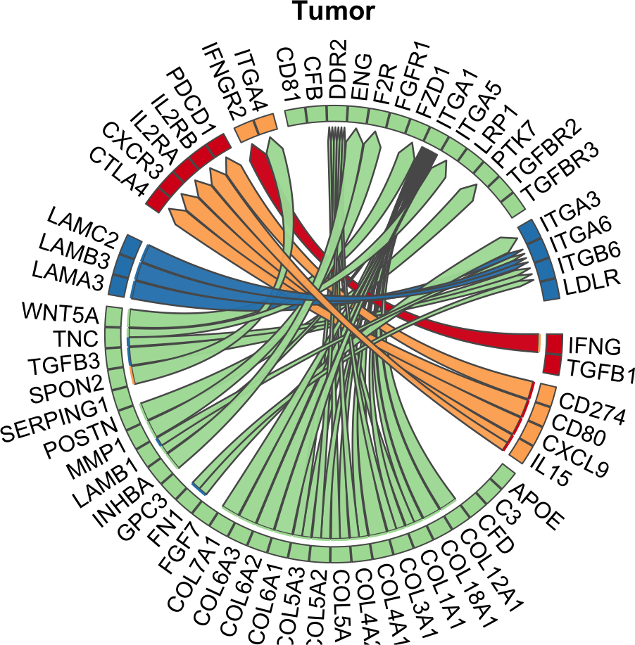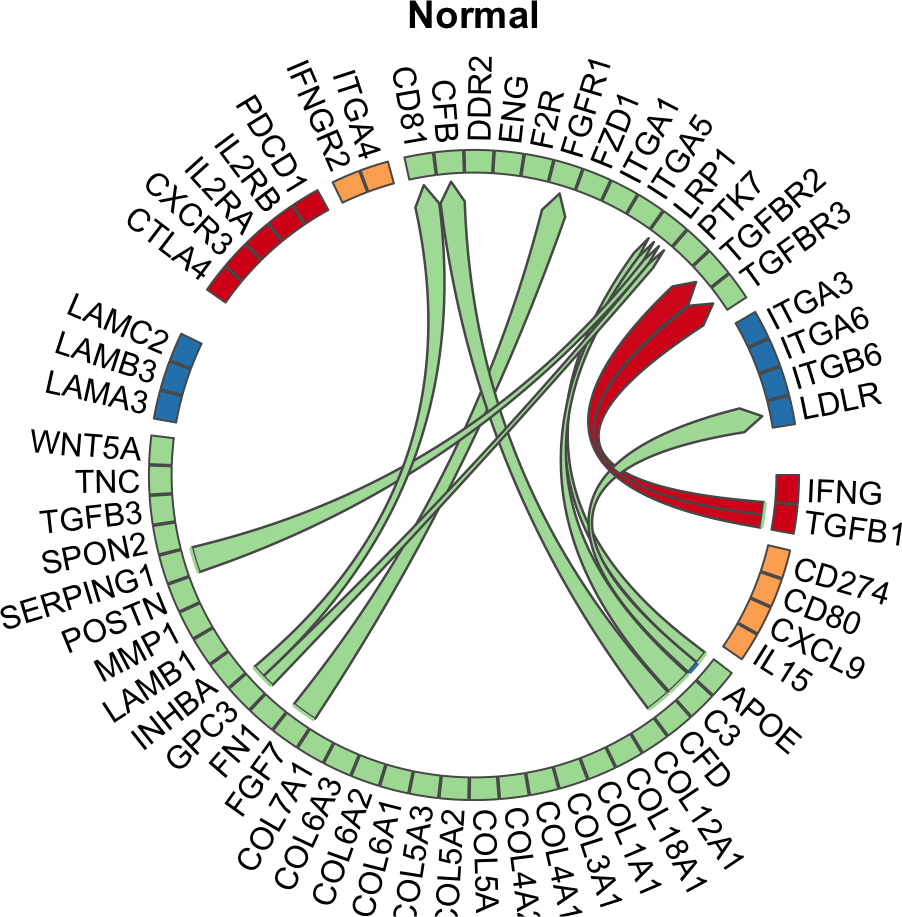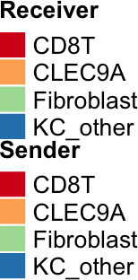

### Interpretable bubble plots

Whereas these ChordDiagrams show the most specific interactions per group, they don't give insights into the data behind these predictions. Therefore we will now look at visualizations that indicate the different prioritization criteria used in MultiNicheNet. 

In the next type of plots, we will 1) visualize the per-sample scaled product of normalized ligand and receptor pseudobulk expression, 2) visualize the scaled ligand activities, 3) cell-type specificity. 

We will now check the top 50 interactions specific for the Tumor-tissue


```r
group_oi = "Tumor"
```


```r
prioritized_tbl_oi_Tumor_50 = get_top_n_lr_pairs(
  multinichenet_output$prioritization_tables, 
  top_n = 50, 
  groups_oi = group_oi)
```


```r
plot_oi = make_sample_lr_prod_activity_plots(
  multinichenet_output$prioritization_tables, 
  prioritized_tbl_oi_Tumor_50)
plot_oi
```

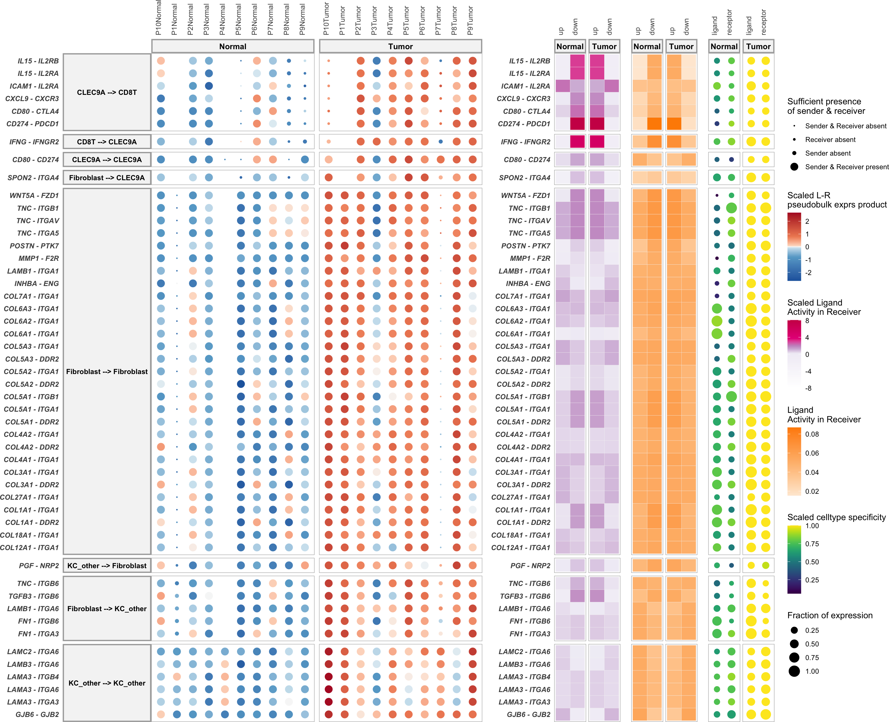
Samples that were left out of the DE analysis are indicated with a smaller dot (this helps to indicate the samples that did not contribute to the calculation of the logFC, and thus not contributed to the final prioritization)

As a further help for further prioritization, we can assess the level of curation of these LR pairs as defined by the Intercellular Communication part of the Omnipath database


```r
prioritized_tbl_oi_Tumor_50_omnipath = prioritized_tbl_oi_Tumor_50 %>% 
  inner_join(lr_network_all)
```

Now we add this to the bubble plot visualization:

```r
plot_oi = make_sample_lr_prod_activity_plots_Omnipath(
  multinichenet_output$prioritization_tables, 
  prioritized_tbl_oi_Tumor_50_omnipath)
plot_oi
```

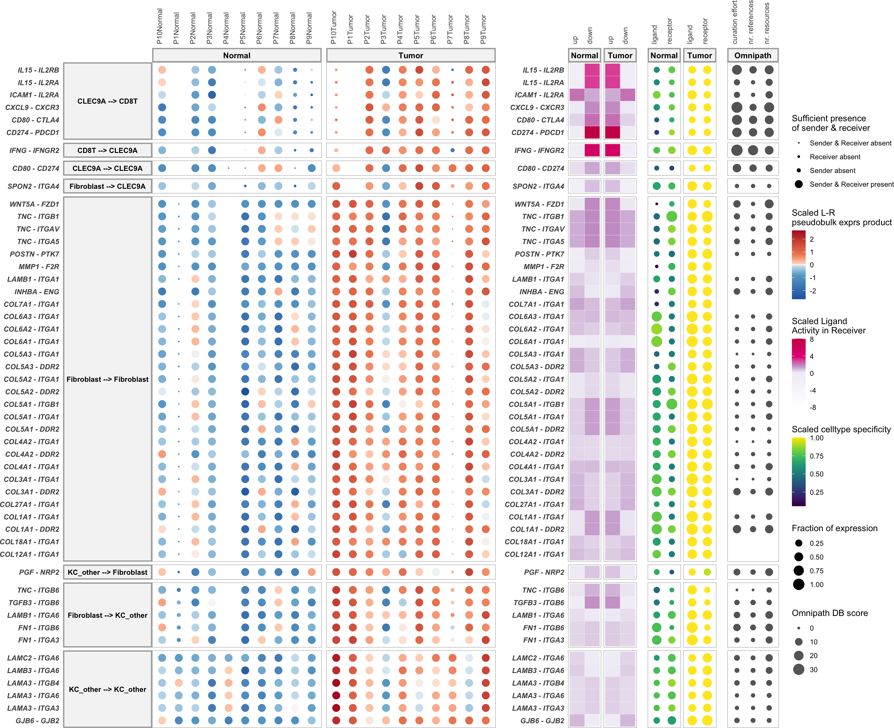

Further note: Typically, there are way more than 50 differentially expressed and active ligand-receptor pairs per group across all sender-receiver combinations. Therefore it might be useful to zoom in on specific cell types as senders/receivers:

Eg CLEC9A DCs as receiver:


```r
prioritized_tbl_oi_Tumor_50 = get_top_n_lr_pairs(
  multinichenet_output$prioritization_tables, 
  50, 
  groups_oi = group_oi, 
  receivers_oi = "CLEC9A")
```


```r
plot_oi = make_sample_lr_prod_activity_plots_Omnipath(
  multinichenet_output$prioritization_tables, 
  prioritized_tbl_oi_Tumor_50 %>% inner_join(lr_network_all))
plot_oi
```

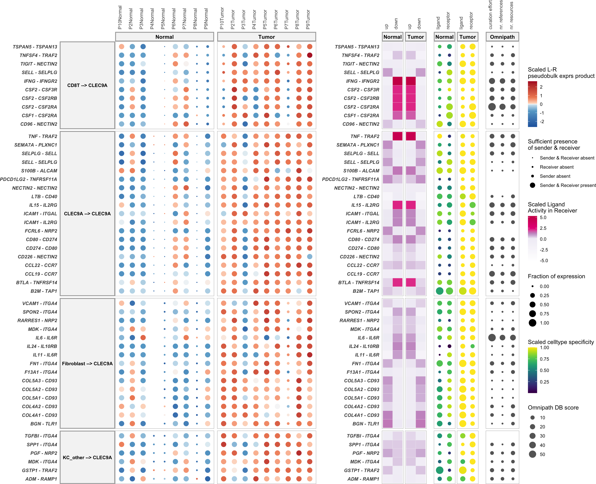

Eg CLEC9A as sender:


```r
prioritized_tbl_oi_Tumor_50 = get_top_n_lr_pairs(
  multinichenet_output$prioritization_tables, 
  50, 
  groups_oi = group_oi, 
  senders_oi = "CLEC9A")
```


```r
plot_oi = make_sample_lr_prod_activity_plots_Omnipath(
  multinichenet_output$prioritization_tables, 
  prioritized_tbl_oi_Tumor_50 %>% inner_join(lr_network_all))
plot_oi
```

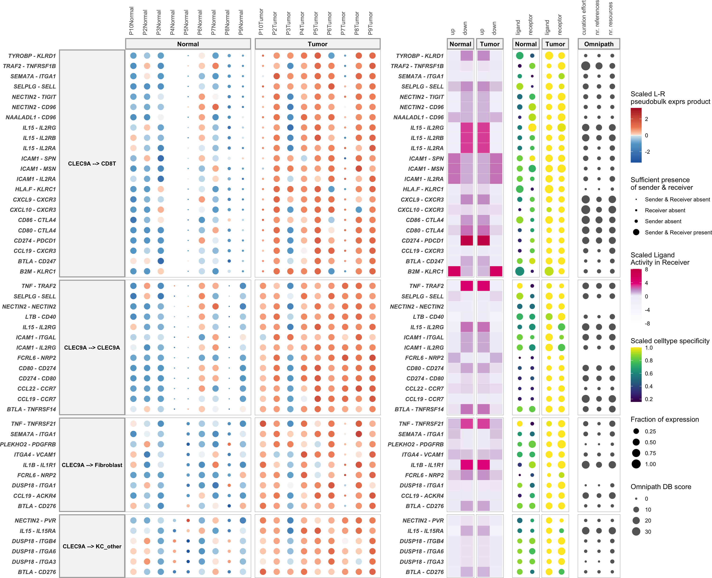

You can make these plots also for the other groups, like we will illustrate now for the S group


```r
group_oi = "Normal"
```


```r
prioritized_tbl_oi_Normal_50 = get_top_n_lr_pairs(
  multinichenet_output$prioritization_tables, 
  50, 
  groups_oi = group_oi)

plot_oi = make_sample_lr_prod_activity_plots_Omnipath(
  multinichenet_output$prioritization_tables, 
  prioritized_tbl_oi_Normal_50 %>% inner_join(lr_network_all))
plot_oi
```

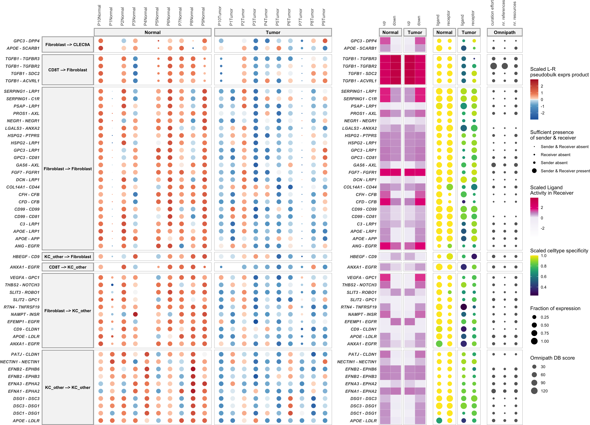

__Note__: Use `make_sample_lr_prod_activity_batch_plots` if you have batches and want to visualize them on this plot!

## Visualization of differential ligand-target links

### Without filtering of target genes based on LR-target expression correlation

In another type of plot, we can visualize the ligand activities for a group-receiver combination, and show the predicted ligand-target links, and also the expression of the predicted target genes across samples.

For this, we now need to define a receiver cell type of interest. As example, we will take `CLEC9A` cells as receiver, and look at the top 10 senderLigand-receiverReceptor pairs with these cells as receiver.


```r
group_oi = "Tumor"
receiver_oi = "CLEC9A"
prioritized_tbl_oi_Tumor_10 = get_top_n_lr_pairs(
  multinichenet_output$prioritization_tables, 
  10, 
  groups_oi = group_oi, 
  receivers_oi = receiver_oi)
```


```r
combined_plot = make_ligand_activity_target_plot(
  group_oi, 
  receiver_oi, 
  prioritized_tbl_oi_Tumor_10,
  multinichenet_output$prioritization_tables, 
  multinichenet_output$ligand_activities_targets_DEgenes, contrast_tbl, 
  multinichenet_output$grouping_tbl, 
  multinichenet_output$celltype_info, 
  ligand_target_matrix, 
  plot_legend = FALSE)
combined_plot
## $combined_plot
```

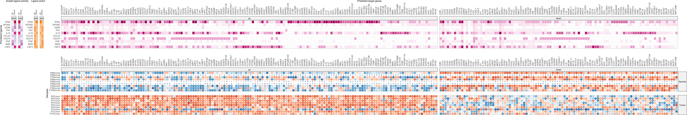

```
## 
## $legends
```

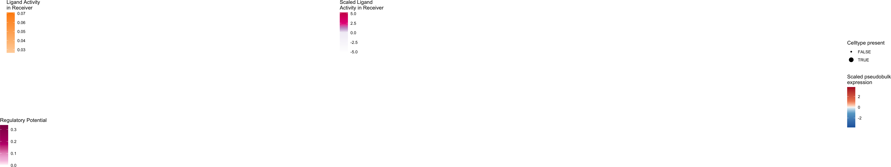

What if there is a specific ligand you are interested in?


```r
group_oi = "Tumor"
receiver_oi = "CLEC9A"
ligands_oi = c("CSF1","CSF2")
prioritized_tbl_ligands_oi = get_top_n_lr_pairs(
  multinichenet_output$prioritization_tables, 
  10000, 
  groups_oi = group_oi, 
  receivers_oi = receiver_oi
  ) %>% filter(ligand %in% ligands_oi) # ligands should still be in the output tables of course
```


```r
combined_plot = make_ligand_activity_target_plot(
  group_oi, 
  receiver_oi, 
  prioritized_tbl_ligands_oi, 
  multinichenet_output$prioritization_tables, 
  multinichenet_output$ligand_activities_targets_DEgenes, 
  contrast_tbl, 
  multinichenet_output$grouping_tbl, 
  multinichenet_output$celltype_info, 
  ligand_target_matrix, 
  plot_legend = FALSE)
combined_plot
## $combined_plot
```

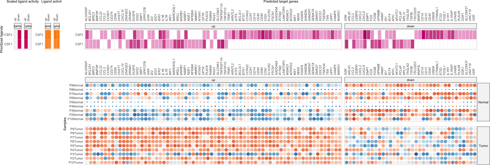

```
## 
## $legends
```

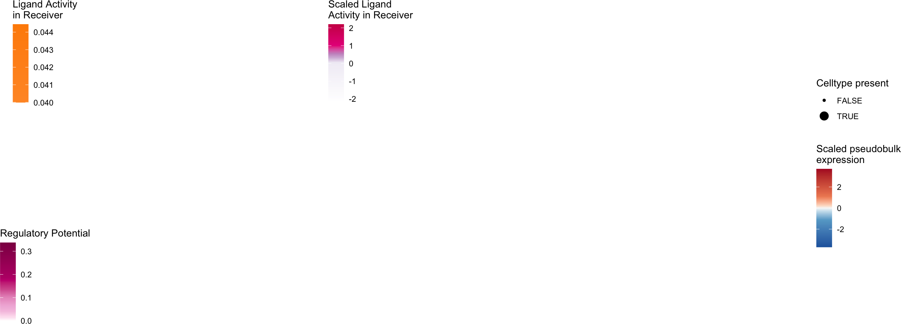

### With filtering of target genes based on LR-target expression correlation

In the previous plots, target genes were shown that are predicted as target gene of ligands based on prior knowledge. However, we can use the multi-sample nature of this data to filter target genes based on expression correlation between the upstream ligand-receptor pair and the downstream target gene. We will filter out correlated ligand-receptor --> target links that both show high expression correlation (spearman or pearson correlation > 0.50 in this example) and have some prior knowledge to support their link. Note that you can only make these visualization if you ran step 7 of the core MultiNicheNet analysis.


```r
group_oi = "Tumor"
receiver_oi = "CLEC9A"
lr_target_prior_cor_filtered = multinichenet_output$lr_target_prior_cor %>%
  inner_join(
    multinichenet_output$ligand_activities_targets_DEgenes$ligand_activities %>% 
      distinct(ligand, target, direction_regulation, contrast)
    ) %>% 
  inner_join(contrast_tbl) %>% filter(group == group_oi, receiver == receiver_oi)

lr_target_prior_cor_filtered_up = lr_target_prior_cor_filtered %>% 
  filter(direction_regulation == "up") %>% 
  filter( (rank_of_target < top_n_target) & (pearson > 0.50 | spearman > 0.50))
lr_target_prior_cor_filtered_down = lr_target_prior_cor_filtered %>% 
  filter(direction_regulation == "down") %>% 
  filter( (rank_of_target < top_n_target) & (pearson < -0.50 | spearman < -0.50)) # downregulation -- negative correlation
lr_target_prior_cor_filtered = bind_rows(
  lr_target_prior_cor_filtered_up, 
  lr_target_prior_cor_filtered_down)
```

Now we will visualize the top correlated target genes for the LR pairs that are also in the top 50 LR pairs discriminating the groups from each other:


```r
prioritized_tbl_oi = get_top_n_lr_pairs(
  multinichenet_output$prioritization_tables, 
  50, 
  groups_oi = group_oi, 
  receivers_oi = receiver_oi)
```


```r
lr_target_correlation_plot = make_lr_target_correlation_plot(
  multinichenet_output$prioritization_tables, 
  prioritized_tbl_oi,  
  lr_target_prior_cor_filtered , 
  multinichenet_output$grouping_tbl, 
  multinichenet_output$celltype_info, 
  receiver_oi,
  plot_legend = FALSE)
lr_target_correlation_plot$combined_plot
```

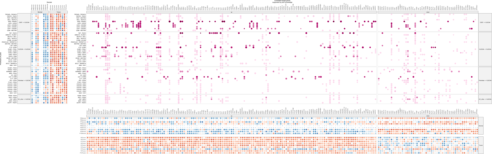

You can also visualize the expression correlation in the following way for a selected LR pair and their targets:


```r
ligand_oi = "IFNG"
receptor_oi = "IFNGR2"
sender_oi = "CD8T"
receiver_oi = "CLEC9A"
lr_target_scatter_plot = make_lr_target_scatter_plot(
  multinichenet_output$prioritization_tables, 
  ligand_oi, receptor_oi, sender_oi, receiver_oi, 
  multinichenet_output$celltype_info, 
  multinichenet_output$grouping_tbl, 
  lr_target_prior_cor_filtered)
lr_target_scatter_plot
```

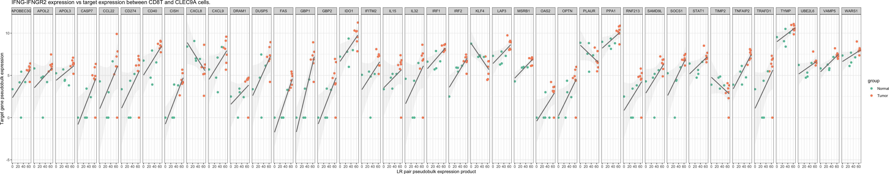

## Intercellular regulatory network inference and visualization

In the plots before, we demonstrated that some DE genes have both expression correlation and prior knowledge support to be downstream of ligand-receptor pairs. Interestingly, some target genes can be ligands or receptors themselves. This illustrates that cells can send signals to other cells, who as a response to these signals produce signals themselves to feedback to the original sender cells, or who will effect other cell types. 

As last plot, we can generate a 'systems' view of these intercellular feedback and cascade processes than can be occuring between the different cell populations involved. In this plot, we will draw links between ligands of sender cell types their ligand/receptor-annotated target genes in receiver cell types. So links are ligand-target links (= gene regulatory links) and not ligand-receptor protein-protein interactions! We will infer this intercellular regulatory network here for the top50 interactions. You can increase this to include more hits of course (recommended). 


```r
prioritized_tbl_oi = get_top_n_lr_pairs(
  multinichenet_output$prioritization_tables, 
  50, 
  rank_per_group = FALSE)

lr_target_prior_cor_filtered = 
  multinichenet_output$prioritization_tables$group_prioritization_tbl$group %>% unique() %>% 
  lapply(function(group_oi){
    lr_target_prior_cor_filtered = multinichenet_output$lr_target_prior_cor %>%
      inner_join(
        multinichenet_output$ligand_activities_targets_DEgenes$ligand_activities %>%
          distinct(ligand, target, direction_regulation, contrast)
        ) %>% 
      inner_join(contrast_tbl) %>% filter(group == group_oi)
    
    lr_target_prior_cor_filtered_up = lr_target_prior_cor_filtered %>% 
      filter(direction_regulation == "up") %>% 
      filter( (rank_of_target < top_n_target) & (pearson > 0.50 | spearman > 0.50))
    
    lr_target_prior_cor_filtered_down = lr_target_prior_cor_filtered %>% 
      filter(direction_regulation == "down") %>% 
      filter( (rank_of_target < top_n_target) & (pearson < -0.50 | spearman < -0.50))
    lr_target_prior_cor_filtered = bind_rows(
      lr_target_prior_cor_filtered_up, 
      lr_target_prior_cor_filtered_down
      )
}) %>% bind_rows()

lr_target_df = lr_target_prior_cor_filtered %>% 
  distinct(group, sender, receiver, ligand, receptor, id, target, direction_regulation) 
```


```r
network = infer_intercellular_regulatory_network(lr_target_df, prioritized_tbl_oi)
network$links %>% head()
## # A tibble: 6 × 6
##   sender_ligand     receiver_target   direction_regulation group type          weight
##   <chr>             <chr>             <fct>                <chr> <chr>          <dbl>
## 1 Fibroblast_COL1A1 Fibroblast_COL1A1 up                   Tumor Ligand-Target      1
## 2 Fibroblast_COL1A1 Fibroblast_COL4A1 up                   Tumor Ligand-Target      1
## 3 Fibroblast_COL1A1 Fibroblast_COL5A1 up                   Tumor Ligand-Target      1
## 4 Fibroblast_COL1A1 Fibroblast_FN1    up                   Tumor Ligand-Target      1
## 5 Fibroblast_COL1A1 Fibroblast_MMP1   up                   Tumor Ligand-Target      1
## 6 Fibroblast_COL1A1 Fibroblast_TGFB3  up                   Tumor Ligand-Target      1
network$nodes %>% head()
## # A tibble: 6 × 4
##   node              celltype   gene   type_gene
##   <chr>             <chr>      <chr>  <chr>    
## 1 Fibroblast_COL1A1 Fibroblast COL1A1 ligand   
## 2 Fibroblast_COL3A1 Fibroblast COL3A1 ligand   
## 3 Fibroblast_POSTN  Fibroblast POSTN  ligand   
## 4 Fibroblast_COL6A2 Fibroblast COL6A2 ligand   
## 5 Fibroblast_COL6A1 Fibroblast COL6A1 ligand   
## 6 Fibroblast_MMP1   Fibroblast MMP1   ligand
```


```r
network_graph = visualize_network(network, colors_sender)
network_graph$plot
```

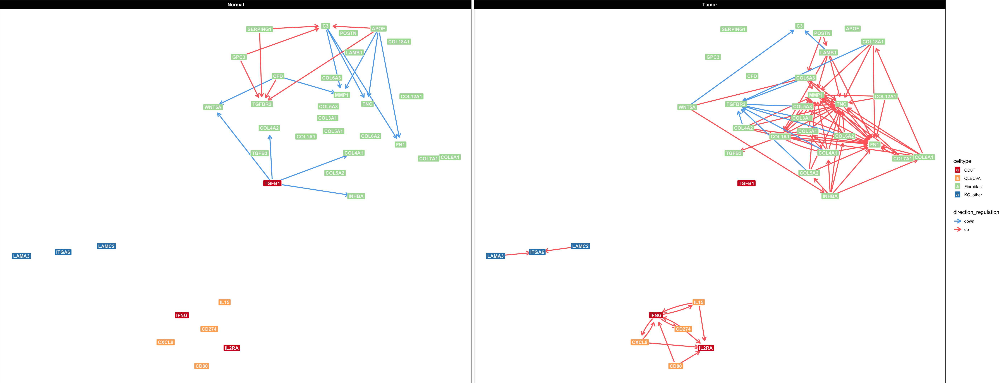

Interestingly, we can also use this network to further prioritize differential CCC interactions. Here we will assume that the most important LR interactions are the ones that are involved in this intercellular regulatory network. We can get these interactions as follows:


```r
network$prioritized_lr_interactions
## # A tibble: 40 × 5
##    group sender     receiver   ligand receptor
##    <chr> <chr>      <chr>      <chr>  <chr>   
##  1 Tumor Fibroblast Fibroblast COL1A1 ITGA1   
##  2 Tumor Fibroblast Fibroblast COL3A1 ITGA1   
##  3 Tumor Fibroblast Fibroblast COL1A1 DDR2    
##  4 Tumor Fibroblast Fibroblast POSTN  PTK7    
##  5 Tumor Fibroblast Fibroblast COL6A2 ITGA1   
##  6 Tumor Fibroblast Fibroblast COL3A1 DDR2    
##  7 Tumor Fibroblast Fibroblast COL6A1 ITGA1   
##  8 Tumor Fibroblast Fibroblast MMP1   F2R     
##  9 Tumor Fibroblast Fibroblast COL6A3 ITGA1   
## 10 Tumor Fibroblast Fibroblast COL4A1 ITGA1   
## # ℹ 30 more rows
```


```r
prioritized_tbl_oi_network = prioritized_tbl_oi %>% inner_join(
  network$prioritized_lr_interactions)
prioritized_tbl_oi_network
## # A tibble: 40 × 8
##    group sender     receiver   ligand receptor id                                 prioritization_score prioritization_rank
##    <chr> <chr>      <chr>      <chr>  <chr>    <chr>                                             <dbl>               <dbl>
##  1 Tumor Fibroblast Fibroblast COL5A1 ITGA1    COL5A1_ITGA1_Fibroblast_Fibroblast                0.958                   1
##  2 Tumor Fibroblast Fibroblast COL1A1 ITGA1    COL1A1_ITGA1_Fibroblast_Fibroblast                0.957                   2
##  3 Tumor Fibroblast Fibroblast WNT5A  FZD1     WNT5A_FZD1_Fibroblast_Fibroblast                  0.953                   3
##  4 Tumor Fibroblast Fibroblast COL4A1 ITGA1    COL4A1_ITGA1_Fibroblast_Fibroblast                0.950                   4
##  5 Tumor Fibroblast Fibroblast COL5A3 ITGA1    COL5A3_ITGA1_Fibroblast_Fibroblast                0.943                   6
##  6 Tumor Fibroblast Fibroblast POSTN  PTK7     POSTN_PTK7_Fibroblast_Fibroblast                  0.943                   7
##  7 Tumor Fibroblast Fibroblast COL6A3 ITGA1    COL6A3_ITGA1_Fibroblast_Fibroblast                0.943                   8
##  8 Tumor Fibroblast Fibroblast COL5A1 DDR2     COL5A1_DDR2_Fibroblast_Fibroblast                 0.941                   9
##  9 Tumor Fibroblast Fibroblast COL1A1 DDR2     COL1A1_DDR2_Fibroblast_Fibroblast                 0.940                  10
## 10 Tumor CLEC9A     CD8T       IL15   IL2RA    IL15_IL2RA_CLEC9A_CD8T                            0.940                  11
## # ℹ 30 more rows
```

Visualize now the expression and activity of these interactions for the Tumor group

```r
group_oi = "Tumor"
```


```r
prioritized_tbl_oi_Tumor = prioritized_tbl_oi_network %>% filter(group == group_oi)

plot_oi = make_sample_lr_prod_activity_plots_Omnipath(
  multinichenet_output$prioritization_tables, 
  prioritized_tbl_oi_Tumor %>% inner_join(lr_network_all)
  )
plot_oi
```

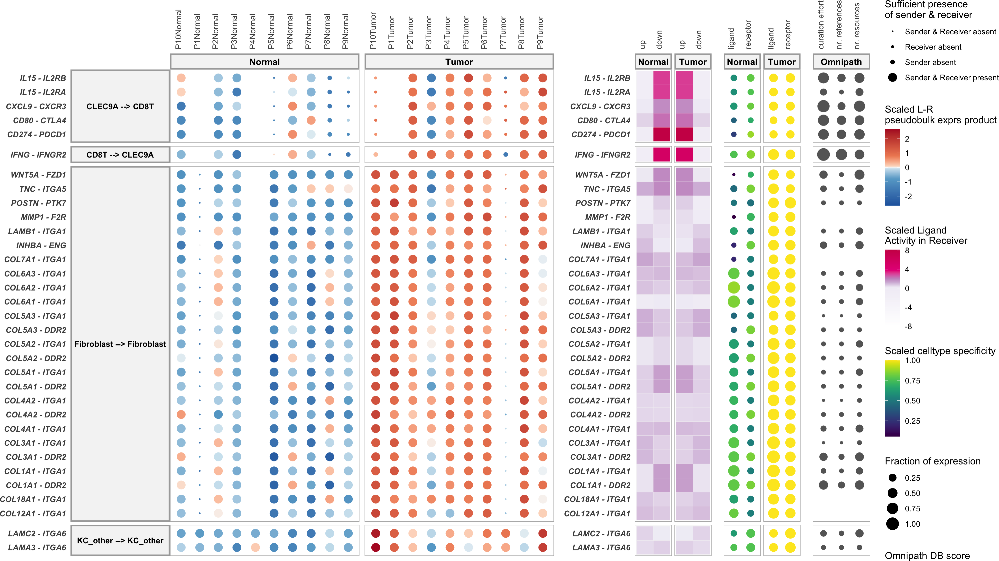
