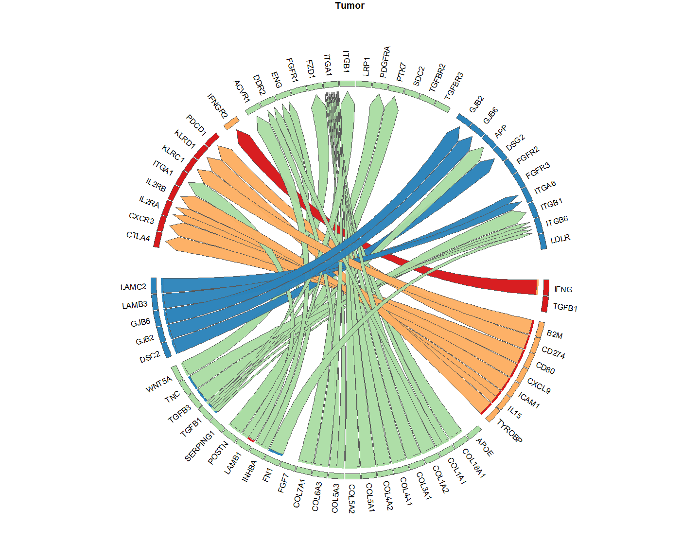
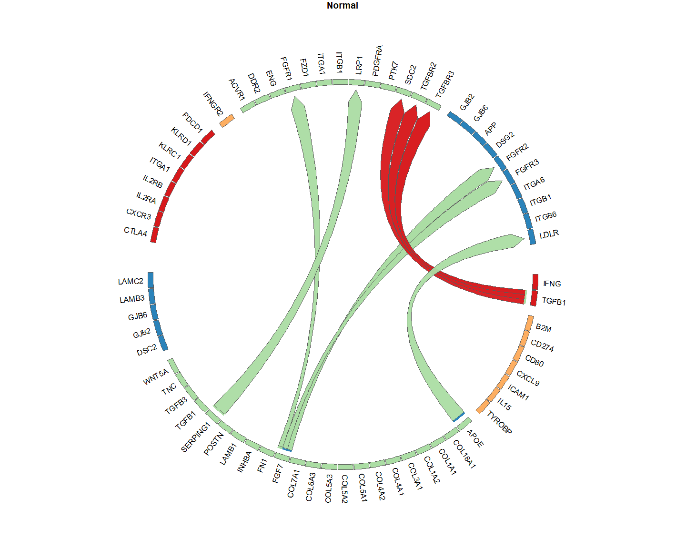
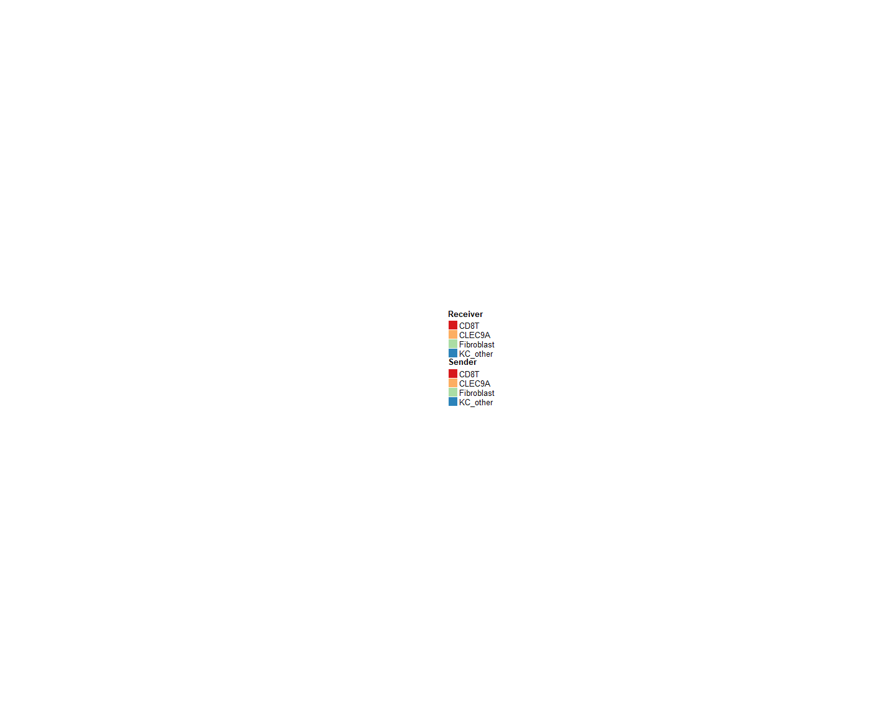
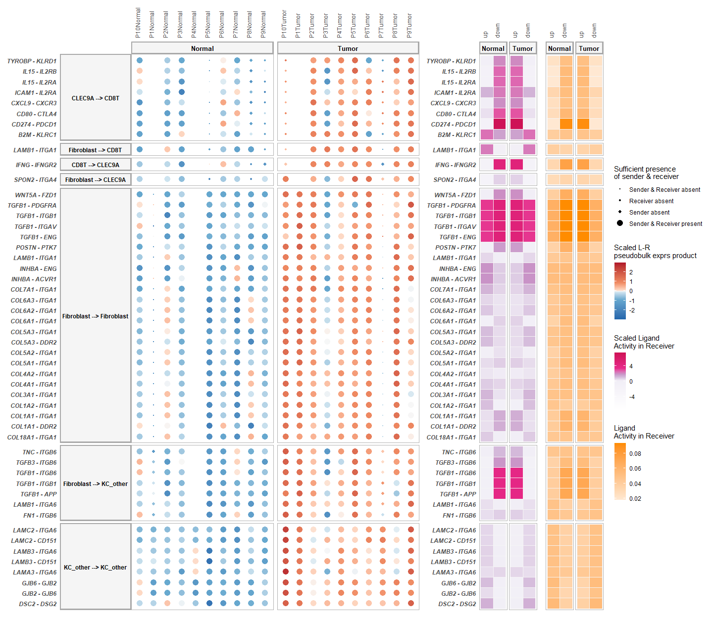
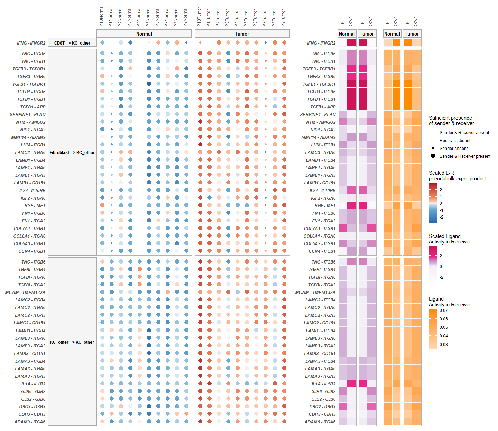
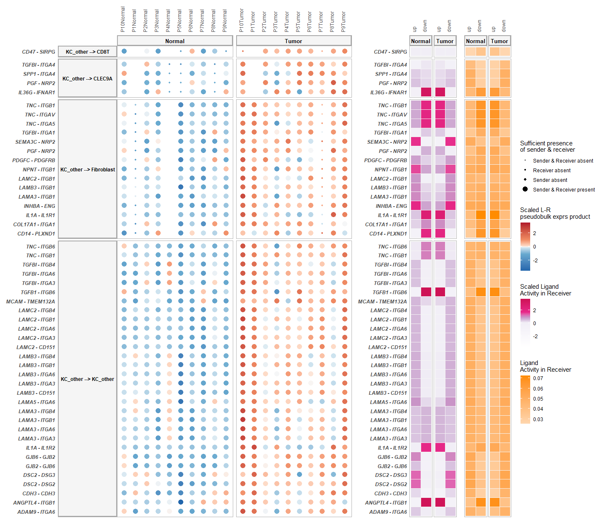
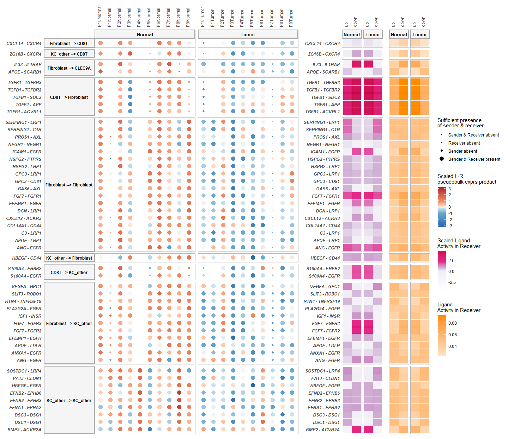
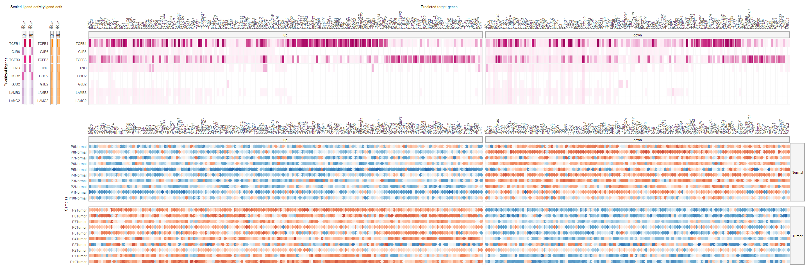
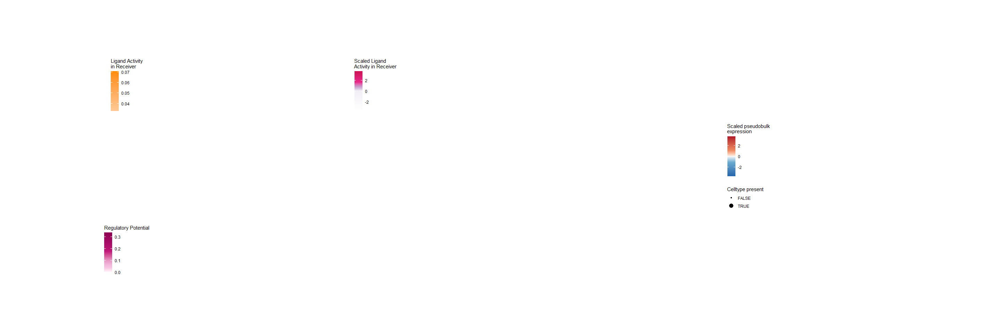
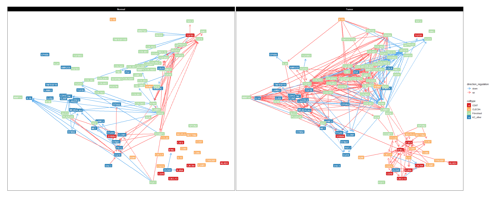

MultiNicheNet analysis: SCC paired analysis - wrapper function
================
Robin Browaeys
2023-06-06

<!-- github markdown built using 
rmarkdown::render("vignettes/paired_analysis_SCC.Rmd", output_format = "github_document")
-->

In this vignette, you can learn how to perform a MultiNicheNet analysis
comparing cell-cell communication between two groups of
patients/conditions. In this vignette, we start from one
SingleCellExperiment object containing cells from both sender and
receiver cell types and from different patients.

A MultiNicheNet analysis can be performed if you have multi-sample,
multi-group single-cell data. MultiNicheNet will look for cell-cell
communication between the cell types in your data for each sample, and
compare the cell-cell communication patterns between the groups of
interest. Therefore, the absolute minimum of meta data you need to have,
are following columns indicating for each cell: the **group**,
**sample** and **cell type**.

As example expression data of interacting cells, we will here use
scRNAseq data of patients with squamous cell carcinoma from this paper
of Ji et al.: [Multimodal Analysis of Composition and Spatial
Architecture in Human Squamous Cell
Carcinoma](https://www.sciencedirect.com/science/article/pii/S0092867420306723).
We have data of normal and of tumor tissue for each patient, and thus a
paired design.

We will use MultiNicheNet to explore tumor microenvironment interactions
that are different between tumor and normal tissue.

In this vignette, we will prepare the data and analysis parameters, and
then perform the MultiNicheNet analysis. In contrast to a classic
pairwise analysis between conditions/groups, we will here demonstrate
how you can include in the DE model that tumor and healthy tissue come
from the same patient.

The different steps of the MultiNicheNet analysis are the following:

- 0.  Preparation of the analysis: load packages, NicheNet LR network &
      ligand-target matrix, single-cell expression data, and define main
      settings of the MultiNicheNet analysis

- 1.  Extract cell type abundance and expression information from
      receiver and sender cell types, and link this expression
      information for ligands of the sender cell types to the
      corresponding receptors of the receiver cell types

- 2.  Perform genome-wide differential expression analysis of receiver
      and sender cell types to define DE genes between the conditions of
      interest. Based on this analysis, we can define the logFC/p-value
      of ligands in senders and receptors in receivers, and define the
      set of affected target genes in the receiver.

- 3.  Predict NicheNet ligand activities and NicheNet ligand-target
      links based on these differential expression results

- 4.  Use the information collected above to prioritize all
      sender-ligand—receiver-receptor pairs.

- 5.  Calculate correlation in expression between ligand-receptor pairs
      and their predicted target genes

In this vignette, we will demonstrate the use of a wrapper function to
perform all these steps in one line of code. If you want to explore the
different steps of MultiNicheNet one by one in more detail, you could
check this other vignette:
[basis_analysis_steps_MISC.md](basis_analysis_steps_MISC.md).

After the MultiNicheNet analysis is done, we will explore the output of
the analysis with different ways of visualization.

# Step 0: Preparation of the analysis: load packages, NicheNet LR network & ligand-target matrix, single-cell expression data

## Step 0.1: Load required packages and NicheNet ligand-receptor network and ligand-target matrix

``` r
library(SingleCellExperiment)
library(dplyr)
library(ggplot2)
library(multinichenetr)
```

The Nichenet v2 networks and matrices for both mouse and human can be
downloaded from Zenodo
[](https://doi.org/10.5281/zenodo.7074291).

We will read these object in for human because our expression data is of
human patients. Gene names are here made syntactically valid via
`make.names()` to avoid the loss of genes (eg H2-M3) in downstream
visualizations.

``` r
organism = "human"
if(organism == "human"){
  lr_network = readRDS(url("https://zenodo.org/record/7074291/files/lr_network_human_21122021.rds"))
  lr_network = lr_network %>% dplyr::rename(ligand = from, receptor = to) %>% distinct(ligand, receptor) %>% mutate(ligand = make.names(ligand), receptor = make.names(receptor))
  ligand_target_matrix = readRDS(url("https://zenodo.org/record/7074291/files/ligand_target_matrix_nsga2r_final.rds"))
  colnames(ligand_target_matrix) = colnames(ligand_target_matrix) %>% make.names()
  rownames(ligand_target_matrix) = rownames(ligand_target_matrix) %>% make.names()
} else if(organism == "mouse"){
  lr_network = readRDS(url("https://zenodo.org/record/7074291/files/lr_network_mouse_21122021.rds"))
  lr_network = lr_network %>% dplyr::rename(ligand = from, receptor = to) %>% distinct(ligand, receptor) %>% mutate(ligand = make.names(ligand), receptor = make.names(receptor))
  ligand_target_matrix = readRDS(url("https://zenodo.org/record/7074291/files/ligand_target_matrix_nsga2r_final_mouse.rds"))
  colnames(ligand_target_matrix) = colnames(ligand_target_matrix) %>% make.names()
  rownames(ligand_target_matrix) = rownames(ligand_target_matrix) %>% make.names()
}
```

## Step 0.2: Read in SingleCellExperiment Objects

In this vignette, sender and receiver cell types are in the same
SingleCellExperiment object, which we will load here. In this vignette,
we will load in a subset of the SCC scRNAseq data
[](https://doi.org/10.5281/zenodo.8010790).
For the sake of demonstration, this subset only contains 4 cell types.

If you start from a Seurat object, you can convert it easily to a
SingleCellExperiment via
`sce = Seurat::as.SingleCellExperiment(seurat_obj, assay = "RNA")`.

Because the NicheNet 2.0. networks are in the most recent version of the
official gene symbols, we will make sure that the gene symbols used in
the expression data are also updated (= converted from their “aliases”
to official gene symbols). Afterwards, we will make them again
syntactically valid.

``` r
sce = readRDS(url("https://zenodo.org/record/8010790/files/sce_subset_scc.rds"))
sce = alias_to_symbol_SCE(sce, "human") %>% makenames_SCE()
## [1] "there are provided symbols that are not in the alias annotation table: "
##    [1] "RP11-34P13.7"        "AL627309.1"          "AP006222.2"          "RP4-669L17.10"       "RP11-206L10.3"       "RP11-206L10.2"       "RP11-206L10.9"       "RP11-54O7.1"         "RP11-54O7.17"       
##   [10] "RP11-465B22.8"       "RP5-902P8.12"        "RP4-758J18.2"        "RP4-758J18.13"       "AL645728.1"          "RP11-345P4.9"        "RP11-345P4.10"       "SLC35E2"             "RP11-547D24.3"      
##   [19] "RP5-892K4.1"         "RP11-181G12.2"       "AL590822.2"          "AL590822.1"          "RP11-181G12.4"       "RP3-395M20.12"       "RP11-168F9.2"        "RP1-202O8.3"         "RP11-312B8.1"       
##   [28] "RP3-510D11.1"        "RP3-510D11.2"        "RP11-558F24.4"       "APITD1"              "RP4-635E18.8"        "RP4-635E18.7"        "RP4-635E18.6"        "RP11-474O21.5"       "RP4-680D5.2"        
##   [37] "RP11-169K16.9"       "RP11-276H7.2"        "RP11-276H7.3"        "C1orf134"            "RP4-798A10.2"        "RP4-798A10.7"        "RP11-108M9.4"        "RP11-108M9.6"        "RP11-380J14.1"      
##   [46] "RP1-43E13.2"         "RP11-91K11.2"        "RP5-930J4.4"         "RP1-74M1.3"          "RP5-1057J7.6"        "RP5-1057J7.7"        "RP1-150O5.3"         "RP5-886K2.3"         "RP11-10N16.2"       
##   [55] "RP4-594I10.3"        "RP11-84D1.2"         "RP3-465N24.6"        "RP11-70P17.1"        "RP1-187B23.1"        "RP1-317E23.3"        "AL020996.1"          "RP11-96L14.7"        "RP5-968P14.2"       
##   [64] "RP4-752I6.1"         "RP11-288L9.1"        "AL353354.2"          "RP5-1092A3.4"        "RP11-442N24--B.1"    "RP11-242O24.5"       "RP1-65J11.1"         "RP11-73M7.9"         "RP11-84A19.2"       
##   [73] "RP11-84A19.4"        "RP11-277A4.4"        "RP11-114B7.6"        "ADC"                 "RP11-244H3.4"        "RP4-728D4.2"         "RP4-789D17.5"        "RP11-268J15.5"       "RP11-109P14.10"     
##   [82] "RP5-884C9.2"         "RP5-864K19.4"        "RP11-69E11.4"        "RP1-39G22.7"         "RP11-656D10.3"       "RP11-399E6.4"        "RP5-994D16.3"        "RP11-342M1.3"        "RP1-92O14.3"        
##   [91] "RP11-269F19.2"       "RP4-533D7.5"         "RP11-511I2.2"        "RP5-850O15.4"        "RP11-296A18.3"       "RP11-296A18.6"       "RP11-275F13.1"       "RP11-253A20.1"       "RP4-657D16.3"       
##  [100] "RP11-155O18.6"       "RP5-1024G6.7"        "RP5-1024G6.5"        "RP5-1024G6.8"        "RP4-758J24.5"        "AL161915.1"          "AL357673.1"          "RP5-866L20.1"        "RP11-67L3.4"        
##  [109] "RP11-504A18.1"       "RP11-63G10.3"        "RP4-794H19.1"        "RP4-782L23.1"        "RP11-776H12.1"       "RP11-430G17.3"       "RP11-230B22.1"       "RP4-792G4.2"         "RP11-182I10.3"      
##  [118] "RP4-763G1.2"         "RP4-694A7.4"         "RP4-660H19.1"        "RP11-17E13.2"        "RP11-386I14.4"       "RP11-170N11.1"       "RP11-475O6.1"        "RP11-486G15.2"       "RP11-131L23.1"      
##  [127] "RP4-651E10.4"        "RP4-612B15.3"        "RP4-604K5.2"         "RP11-76N22.2"        "RP5-1007M22.2"       "RP5-943J3.2"         "RP4-665J23.1"        "RP4-561L24.3"        "RP4-639F20.1"       
##  [136] "RP11-57H12.3"        "RP11-286B14.2"       "RP5-884G6.2"         "RP11-305E17.6"       "RP4-549L20.3"        "AC093157.1"          "RP11-421L21.2"       "RP11-421L21.3"       "RP4-575N6.4"        
##  [145] "RP11-483I13.5"       "RP5-1065J22.8"       "SARS"                "RP5-1160K1.3"        "RP4-773N10.4"        "RP5-1074L1.1"        "RP5-1074L1.4"        "RP11-96K19.5"        "RP5-1180E21.4"      
##  [154] "RP5-1180E21.5"       "RP11-88H9.2"         "RP4-671G15.2"        "RP11-426L16.3"       "RP3-522D1.1"         "RP11-389O22.1"       "RP11-31F15.2"        "RP5-1073O3.7"        "RP4-655J12.4"       
##  [163] "RP4-753F5.1"         "RP11-27K13.3"        "RP11-188D8.1"        "RP11-418J17.1"       "RP11-114O18.1"       "RP11-439A17.7"       "RP11-439A17.9"       "RP11-343N15.5"       "RP11-417J8.1"       
##  [172] "RP11-417J8.3"        "RP11-417J8.6"        "RP11-423O2.5"        "RP11-423O2.7"        "RP11-782C8.2"        "RP11-782C8.1"        "RP11-782C8.3"        "RP11-782C8.5"        "RP11-435B5.3"       
##  [181] "RP11-435B5.4"        "RP11-435B5.7"        "RP6-206I17.1"        "AL592284.1"          "RP11-640M9.1"        "RP4-791M13.3"        "AL590452.1"          "RP11-326G21.1"       "RP11-458D21.6"      
##  [190] "NOTCH2NL"            "RP11-315I20.1"       "RP11-337C18.8"       "RP11-337C18.9"       "RP6-74O6.2"          "XXyac-YX155B6.7"     "XXyac-YX155B6.5"     "RP11-495P10.6"       "RP11-14N7.2"        
##  [199] "RP11-403I13.5"       "RP11-403I13.4"       "RP11-403I13.8"       "RP11-277L2.4"        "RP11-277L2.3"        "RP11-353N4.1"        "RP11-353N4.4"        "RP11-196G18.3"       "RP11-196G18.23"     
##  [208] "RP11-196G18.24"      "RP11-126K1.2"        "RP11-126K1.6"        "RP11-98D18.9"        "AL450992.2"          "RP11-107M16.2"       "LOR"                 "BX470102.3"          "RP1-178F15.4"       
##  [217] "RP11-422P24.10"      "RP11-422P24.11"      "RP11-350G8.5"        "RP11-307C12.13"      "RP11-307C12.12"      "RP11-307C12.11"      "RP11-263K19.4"       "RP11-98G7.1"         "RP11-284F21.9"      
##  [226] "RP11-66D17.3"        "CTA-134P22.2"        "RP11-190A12.7"       "AL590560.1"          "RP11-297K8.2"        "RP11-122G18.5"       "RP11-122G18.8"       "RP11-474I16.8"       "RP11-267N12.3"      
##  [235] "RP11-306I1.2"        "RP11-479J7.2"        "RP11-277B15.3"       "RP11-104L21.3"       "RP11-297H3.3"        "RP11-296O14.3"       "RP11-160H22.3"       "RP11-160H22.5"       "RP11-318C24.2"      
##  [244] "RP5-1098D14.1"       "RP11-533E19.7"       "RP11-533E19.5"       "RP5-1180C10.2"       "RP11-46A10.5"        "RP11-46A10.4"        "RP11-309G3.3"        "RP11-538D16.3"       "RP1-127C7.6"        
##  [253] "RP11-382D12.2"       "GS1-279B7.2"         "RP5-973M2.2"         "RP11-547I7.2"        "RP11-101E13.5"       "RP11-134G8.8"        "RP11-134G8.7"        "AC096677.1"          "RP11-307B6.3"       
##  [262] "RP11-465N4.4"        "RP11-480I12.7"       "RP11-134P9.3"        "RP11-430C7.4"        "RP11-430C7.5"        "RP11-576D8.4"        "RP11-312O7.2"        "RP11-534L20.5"       "RP11-343H5.6"       
##  [271] "RP1-272L16.1"        "RP1-28O10.1"         "RP11-318L16.6"       "RP11-384C4.7"        "RP11-61J19.4"        "RP11-224O19.2"       "RP11-392O17.1"       "RP11-95P13.1"        "RP11-378J18.3"      
##  [280] "RP11-378J18.8"       "RP11-452F19.3"       "RP11-504P24.8"       "RP11-365O16.6"       "RP11-145A3.1"        "RP11-285F7.2"        "RP11-396C23.4"       "RP11-396C23.2"       "CTD-2090I13.1"      
##  [289] "RP5-1139B12.2"       "RP4-803J11.2"        "RP5-1068B5.3"        "RP11-295G20.2"       "RP5-827C21.6"        "RP5-827C21.4"        "RP4-781K5.2"         "RP4-781K5.4"         "RP4-781K5.5"        
##  [298] "RP4-597N16.4"        "RP11-385F5.5"        "RP11-385F5.4"        "RP11-261C10.2"       "RP11-261C10.3"       "RP11-269F20.1"       "RP11-156E8.1"        "RP11-439E19.9"       "RP11-488L18.10"     
##  [307] "AC116614.1"          "AC144450.2"          "AC142528.1"          "AC108488.4"          "DKFZP761K2322"       "AC017076.5"          "AC092580.4"          "AC011747.4"          "AC011747.7"         
##  [316] "RP11-434B12.1"       "RP11-214N9.1"        "RP11-521D12.5"       "RP11-95D17.1"        "RP11-254F7.2"        "RP11-254F7.4"        "RP11-320M2.1"        "RP11-791G15.2"       "AC096559.1"         
##  [325] "RP11-111J6.2"        "AC092594.1"          "RP11-79O8.1"         "RP11-130L8.1"        "AC067959.1"          "AC011239.1"          "AC009228.1"          "RP11-443B20.1"       "RP11-509E16.1"      
##  [334] "RP11-458N5.1"        "AC013449.1"          "RP11-195B17.1"       "AC074117.10"         "AC104695.3"          "RP11-373D23.3"       "AC097724.3"          "AC109642.1"          "RP11-1057B6.1"      
##  [343] "CTC-336P14.1"        "RP11-563N4.1"        "AL133245.2"          "AC009499.1"          "AC073218.2"          "AC019064.1"          "RP11-490M8.1"        "AC007382.1"          "AC007246.3"         
##  [352] "AC016735.2"          "AC093609.1"          "AC010883.5"          "RP11-333I13.1"       "AC073283.7"          "AC079807.2"          "RP11-191L17.1"       "AC010967.2"          "RP11-477N3.1"       
##  [361] "AC012358.8"          "RP11-554J4.1"        "AC007743.1"          "RP11-355B11.2"       "AC107081.5"          "AC093159.1"          "AC009501.4"          "AC074289.1"          "AC008074.3"         
##  [370] "RP11-568N6.1"        "AC007365.3"          "AC007386.2"          "AC092669.3"          "RP11-474G23.2"       "RP11-474G23.3"       "RP11-427H3.3"        "AC016700.5"          "AC022201.5"         
##  [379] "AC007040.11"         "RP11-467P9.1"        "RP11-259N19.1"       "AC104135.3"          "AC007099.1"          "RP11-342K6.1"        "RP11-342K6.4"        "RP11-60H5.1"         "RP11-301O19.1"      
##  [388] "AC062029.1"          "RP11-575H3.1"        "AC092835.2"          "RP11-440D17.3"       "RP11-353K11.1"       "AC159540.1"          "C2ORF15"             "MRPL30.1"            "RP11-527J8.1"       
##  [397] "RP11-299H21.1"       "RP11-332H14.2"       "AC012360.6"          "AC012487.2"          "RP11-1223D19.1"      "RP13-1039J1.2"       "LIMS3.1"             "RP11-803D5.4"        "AC017002.1"         
##  [406] "AC012442.6"          "AC079922.3"          "RP11-65I12.1"        "RP11-480C16.1"       "RP11-141B14.1"       "AC010982.1"          "AC009404.2"          "AC093901.1"          "RP11-19E11.1"       
##  [415] "AC012363.4"          "AC068282.3"          "RP11-286H15.1"       "RP5-935K16.1"        "RP11-395A13.2"       "AC133785.1"          "RP11-725P16.2"       "AC093391.2"          "AC097721.2"         
##  [424] "RP11-231E19.1"       "AC092620.3"          "AC009480.3"          "AC093375.1"          "RP11-546J1.1"        "RP11-1152H14.1"      "AC005042.4"          "AC009506.1"          "AC009961.3"         
##  [433] "AC009299.2"          "AC009299.3"          "AC009495.2"          "AC010127.3"          "AC007405.6"          "AC068039.4"          "AC078883.4"          "AC078883.3"          "AC093818.1"         
##  [442] "RP11-796E10.1"       "RP11-394I13.2"       "AC018470.4"          "AC010894.3"          "AC018890.6"          "AC009336.24"         "AC079305.10"         "RP11-337N6.1"        "AC009948.5"         
##  [451] "RP11-65L3.4"         "RP11-65L3.2"         "RP11-171I2.5"        "RP11-171I2.2"        "RP11-171I2.4"        "RP11-366L5.1"        "RP11-438L19.1"       "AC008174.3"          "AC097500.2"         
##  [460] "RP11-410E4.1"        "RP11-647K16.1"       "AC093388.3"          "RP11-347P5.1"        "AC011997.1"          "C2orf47"             "AC007163.3"          "RP11-469M7.1"        "AC005037.3"         
##  [469] "RP11-107N15.1"       "AC079354.1"          "AC079354.3"          "AC079354.5"          "RP11-686O6.1"        "RP11-686O6.2"        "AC007383.3"          "AC007383.4"          "AC008269.2"         
##  [478] "AC007879.7"          "RP11-801F7.1"        "AC096772.6"          "RP11-260M2.1"        "AC007038.7"          "AC006994.2"          "RP11-105N14.1"       "AC072062.1"          "AC093382.1"         
##  [487] "RP11-566E18.3"       "AC073321.4"          "RP11-378A13.2"       "RP11-548H3.1"        "RP11-33O4.1"         "RP11-256I23.2"       "RP11-256I23.3"       "AC009502.4"          "AC114765.2"         
##  [496] "AC067956.1"          "CTD-2308L22.1"       "RP11-384O8.1"        "RP11-16P6.1"         "AC097662.2"          "AC009950.2"          "AC098823.3"          "RP11-400N9.1"        "RP11-309M7.1"       
##  [505] "AC105760.2"          "AC104667.3"          "AC016757.3"          "AC062017.1"          "AC093802.1"          "AC005237.4"          "AC104841.2"          "SEPT2"               "AC133528.2"         
##  [514] "AC131097.3"          "AC131097.4"          "AC093642.3"          "RP11-341N2.1"        "RP11-97C16.1"        "AC018816.3"          "AC023481.1"          "RP11-58B17.2"        "RP11-266J6.2"       
##  [523] "AC022007.5"          "RP11-767C1.2"        "AC093495.4"          "RP11-536I6.2"        "RP11-415F23.2"       "RP11-180N14.1"       "RP11-222K16.2"       "AC098973.2"          "RP11-10C24.2"       
##  [532] "RP11-10C24.3"        "RP11-10C24.1"        "RP11-129K12.1"       "RP11-129K12.4"       "RP11-259K5.2"        "RP11-391M1.4"        "RP4-613B23.1"        "KRBOX1.1"            "RP4-555D20.4"       
##  [541] "RP4-555D20.2"        "RP11-424N24.2"       "RP11-348P10.2"       "RP11-708J19.1"       "RP13-131K19.1"       "RP13-131K19.7"       "RP13-131K19.6"       "QARS"                "RP11-3B7.1"         
##  [550] "U73166.2"            "NAT6"                "RP11-804H8.6"        "RP5-1157M23.2"       "RP11-884K10.7"       "RP11-157F20.3"       "RP11-755B10.4"       "RP11-755B10.3"       "RP11-802O23.3"      
##  [559] "RP11-245J9.5"        "RP11-245J9.4"        "RP11-245J9.6"        "RP11-129B22.1"       "RP11-81N13.1"        "CTD-2013N24.2"       "RP11-460N16.1"       "RP11-154H23.3"       "RP11-803B1.8"       
##  [568] "CTD-2026G6.3"        "RP11-159G9.5"        "CRYBG3.1"            "RP11-201E8.1"        "RP11-861A13.4"       "RP11-757F18.5"       "RP11-572C15.6"       "RP11-484K9.4"        "RP11-572M11.4"      
##  [577] "RP11-553L6.5"        "RP11-190C22.8"       "RP11-190C22.9"       "RP11-18H7.1"         "RP11-299J3.8"        "RP11-67L2.2"         "RP11-379B18.5"       "RP11-666A20.4"       "RP11-475N22.4"      
##  [586] "RP11-723O4.9"        "RP11-434H6.6"        "RP11-434H6.7"        "RP11-93K22.13"       "RP11-77P16.4"        "RP11-200A1.1"        "RP11-375I20.6"       "RP11-731C17.2"       "RP11-85F14.5"       
##  [595] "RP11-319G6.1"        "RP11-485G4.2"        "RP11-91G21.1"        "AC117395.1"          "RP11-651P23.5"       "RP11-103G8.2"        "RP11-246A10.1"       "RP11-38P22.2"        "RP11-292E2.1"       
##  [604] "RP11-305K5.1"        "RP11-538P18.2"       "RP11-379F4.6"        "RP11-379F4.4"        "RP11-379F4.9"        "RP11-16N11.2"        "RP11-3P17.4"         "RP11-3P17.5"         "RP11-816J6.3"       
##  [613] "RP11-362K14.5"       "RP11-362K14.7"       "RP11-362K14.6"       "RP11-379K17.12"      "PP13439"             "RP11-408H1.3"        "RP11-255G21.1"       "RP11-91K9.1"         "RP11-385J1.2"       
##  [622] "RP11-255C15.4"       "RP11-145M9.4"        "AC007620.3"          "RP11-145M9.5"        "RP11-531F16.4"       "RP11-778D9.12"       "RP11-573D15.9"       "RP11-573D15.2"       "AC022498.1"         
##  [631] "RP11-135A1.2"        "AC046143.3"          "RP11-534C12.1"       "AC090505.4"          "RP11-141C7.4"        "AC069513.4"          "AC124944.3"          "RP11-480A16.1"       "TM4SF19.1"          
##  [640] "RP13-616I3.1"        "RP11-496H1.2"        "RP11-803P9.1"        "RP11-440L14.4"       "RP11-440L14.1"       "AC092535.3"          "CRIPAK"              "RP11-1398P2.1"       "RP11-572O17.1"      
##  [649] "RP11-529E10.7"       "RP11-539L10.3"       "AC093323.3"          "RP11-539L10.2"       "RP11-367J11.3"       "RP11-774O3.3"        "RP11-689P11.2"       "RP11-22A3.2"         "RP11-669M16.1"      
##  [658] "AC006160.5"          "RP11-362J17.1"       "RP11-496D24.2"       "RP11-293A21.1"       "RP11-665I14.1"       "RP11-431M7.3"        "RP11-36B15.1"        "RP11-617D20.1"       "AC021860.1"         
##  [667] "RP11-539G18.2"       "RP11-700J17.2"       "RP11-121C2.2"        "RP11-365H22.2"       "RP11-571I18.4"       "RP11-177J6.1"        "RP11-646I6.5"        "AC068620.1"          "RP11-393M11.2"      
##  [676] "RP11-738E22.3"       "RP11-319E12.2"       "RP11-16N2.1"         "RP11-798L4.1"        "RP11-707A18.1"       "RP11-807H7.1"        "RP11-584P21.2"       "RP11-46J23.1"        "RP11-352E8.2"       
##  [685] "RP11-692D12.1"       "RP11-44F21.5"        "RP11-556N4.1"        "FAM47E-STBD1.1"      "RP11-109G23.3"       "RP11-689K5.3"        "RP11-127B20.2"       "RP11-127B20.3"       "AGPAT9"             
##  [694] "RP11-115D19.1"       "RP11-145G20.1"       "RP11-323J4.1"        "RP11-571L19.8"       "RP11-696N14.1"       "AP001816.1"          "RP11-499E18.1"       "AF213884.2"          "RP11-10L12.4"       
##  [703] "RP11-703G6.1"        "AC004069.2"          "RP11-286E11.1"       "RP11-286E11.2"       "AC004067.5"          "RP11-602N24.3"       "RP11-73K9.2"         "RP11-73K9.3"         "RP11-55L3.1"        
##  [712] "RP11-384K6.6"        "RP11-21I10.2"        "RP11-33B1.3"         "RP11-679C8.2"        "RP11-170N16.3"       "RP11-420A23.1"       "RP11-714L20.1"       "RP11-83A24.2"        "RP11-342I1.2"       
##  [721] "RP11-425I13.3"       "RP11-284M14.1"       "RP13-578N3.3"        "RP11-673E1.1"        "RP11-372K14.2"       "RP11-164P12.4"       "RP11-164P12.3"       "RP11-424M21.1"       "RP11-73G16.2"       
##  [730] "RP11-18H21.1"        "RP11-461L13.3"       "RP11-597D13.9"       "RP11-502M1.2"        "RP11-497K21.1"       "RP11-218F10.3"       "RP11-219C20.3"       "RP11-635L1.3"        "RP11-798M19.6"      
##  [739] "RP11-130F10.1"       "RP11-367N14.2"       "RP11-367N14.3"       "RP11-290F5.2"        "RP11-326I11.3"       "RP11-701P16.5"       "RP11-279O9.4"        "RP11-462G22.2"       "CTD-2228K2.5"       
##  [748] "AC026740.1"          "CTD-2589H19.6"       "CTD-2012J19.3"       "CTD-2194D22.3"       "RP11-259O2.1"        "RP11-259O2.2"        "CTD-2044J15.2"       "CTD-2199O4.1"        "CTD-2256P15.1"      
##  [757] "CTD-2256P15.4"       "CTD-2256P15.2"       "RP11-215G15.5"       "CTD-2165H16.4"       "RP11-360I2.1"        "RP11-804N13.1"       "CTD-2306M5.1"        "CTD-2118P12.1"       "CTD-2152M20.2"      
##  [766] "CTD-2186M15.3"       "CTD-2066L21.3"       "CTD-2203K17.1"       "CTD-2517O10.6"       "CTD-2201E18.5"       "CTD-2035E11.3"       "AC025171.1"          "CTD-2035E11.5"       "CTD-2636A23.2"      
##  [775] "RP11-159F24.6"       "RP11-159F24.5"       "RP11-53O19.1"        "RP11-53O19.3"        "CTD-2366F13.2"       "CTD-2366F13.1"       "CTD-2081C10.7"       "RP11-506H20.1"       "CTD-2031P19.3"      
##  [784] "CTD-2310F14.1"       "RP11-231G3.1"        "CKS1B.1"             "RP11-307L14.1"       "RP11-307L14.2"       "RP11-83M16.5"        "RP11-434D9.2"        "CTC-537E7.3"         "CTC-537E7.2"        
##  [793] "CTC-498J12.1"        "CTC-498J12.3"        "RP11-497H16.9"       "CTC-365E16.1"        "RP11-389C8.3"        "CTD-2631K10.1"       "CTD-2376I4.1"        "CTD-2376I4.2"        "RP11-79P5.9"        
##  [802] "CTD-2377O17.1"       "RP11-229C3.2"        "CTD-2235C13.3"       "CTC-366B18.2"        "CTC-366B18.4"        "CTD-2037K23.2"       "CTD-2015H6.3"        "CTC-325J23.2"        "RP11-343L5.2"       
##  [811] "CTD-2269F5.1"        "CTC-428H11.2"        "CTD-2337A12.1"       "RP11-254I22.1"       "CTD-2260A17.1"       "CTD-2260A17.2"       "CTD-2007H13.3"       "CTD-2001C12.1"       "CTD-2587M2.1"       
##  [820] "CTC-332L22.1"        "RP11-526F3.1"        "CTC-487M23.8"        "CTD-2201G3.1"        "CTC-428G20.3"        "CTC-428G20.6"        "AC010226.4"          "CTC-505O3.3"         "CTD-2287O16.5"      
##  [829] "CTD-2280E9.1"        "CTC-210G5.1"         "CTC-228N24.1"        "CTC-228N24.3"        "AC116366.6"          "CTB-113I20.2"        "RP11-215P8.3"        "CTC-276P9.1"         "CTC-321K16.1"       
##  [838] "RP11-119J18.1"       "RP11-381K20.2"       "RP11-256P1.1"        "AC034243.1"          "CTB-46B19.2"         "AC005754.8"          "AC008781.7"          "AC005740.6"          "RP11-373N22.3"      
##  [847] "CTD-2283N19.1"       "CTC-529P8.1"         "CTC-367J11.1"        "CTC-251D13.1"        "CTB-113P19.4"        "CTB-113P19.5"        "RP11-175K6.1"        "CTB-11I22.1"         "CTB-11I22.2"        
##  [856] "CTB-127C13.1"        "RP11-109J4.1"        "CTC-308K20.1"        "CTC-209H22.3"        "CTB-33O18.1"         "RP11-1334A24.6"      "RP11-1277A3.3"       "RP11-1277A3.1"       "RP11-423H2.3"       
##  [865] "RP11-1379J22.2"      "RP11-1379J22.5"      "CTC-241N9.1"         "CTB-129O4.1"         "CTC-573N18.1"        "CTC-338M12.5"        "CTC-338M12.6"        "RP11-532F6.3"        "RP11-157J24.2"      
##  [874] "RP1-90J20.8"         "RP1-90J20.12"        "RP1-40E16.12"        "RP1-40E16.9"         "RP11-420L9.5"        "RP3-406P24.4"        "RP4-529N6.1"         "RP11-428J1.5"        "RP11-428J1.4"       
##  [883] "RP1-232P20.1"        "RP1-80N2.3"          "RP1-80N2.2"          "RP3-512B11.3"        "RP11-314C16.1"       "RP1-290I10.7"        "RP11-456H18.2"       "RP1-257A7.4"         "RP1-257A7.5"        
##  [892] "RP1-223E5.4"         "AL441883.1"          "RP3-500L14.2"        "RP11-560J1.2"        "RP1-151F17.1"        "RP1-151F17.2"        "RP11-500C11.3"       "RP4-625H18.2"        "RP11-524C21.2"      
##  [901] "RP1-30M3.5"          "U91328.20"           "U91328.19"           "HIST1H2BC"           "HIST1H2BE"           "HIST1H2BF"           "HIST1H2BG"           "HIST1H2BI"           "CTA-14H9.5"         
##  [910] "RP11-457M11.5"       "RP1-86C11.7"         "RP1-153G14.4"        "RP1-313I6.12"        "XXbac-BPG252P9.9"    "XXbac-BPG252P9.10"   "XXbac-BPG27H4.8"     "XXbac-BPG299F13.17"  "MEGT1"              
##  [919] "TAP2.1"              "RP3-468B3.2"         "RP11-513I15.6"       "RP11-140K17.3"       "RP1-179N16.6"        "RP1-50J22.4"         "RP11-328M4.2"        "RP11-7K24.3"         "RP3-475N16.1"       
##  [928] "RP11-387M24.5"       "RP3-337H4.9"         "RP1-261G23.7"        "RP1-244F24.1"        "RP11-385F7.1"        "RP11-345L23.1"       "RP11-79N23.1"        "RP11-411K7.1"        "RP11-524H19.2"      
##  [937] "RP11-203B9.4"        "XXbac-BPGBPG55C20.2" "RP5-1148A21.3"       "RP3-525N10.2"        "RP11-462G2.1"        "RP11-134K13.4"       "RP11-154D6.1"        "RP11-398K22.12"      "RP11-553A21.3"      
##  [946] "RP11-554D15.3"       "RP1-234P15.4"        "RP11-250B2.6"        "RP11-250B2.3"        "RP11-379B8.1"        "RP11-30P6.6"         "RP11-321N4.5"        "RP1-3J17.3"          "RP11-393I2.4"       
##  [955] "RP1-102H19.8"        "C6ORF165"            "AL079342.1"          "RP1-45N11.1"         "RP11-98I9.4"         "RP3-467N11.1"        "RP1-191J18.66"       "RP1-111B22.3"        "RP11-425D10.10"     
##  [964] "RP5-1112D6.4"        "RP5-1112D6.7"        "RP5-1112D6.8"        "RP1-142L7.8"         "RP11-437J19.1"       "RP1-124C6.1"         "RP11-367G18.1"       "RP3-399L15.3"        "RP1-93H18.7"        
##  [973] "RP11-351A11.1"       "RP11-510H23.1"       "RP11-624M8.1"        "RP11-69I8.3"         "RP11-557H15.3"       "RP11-557H15.4"       "RP1-287H17.1"        "RP3-406A7.7"         "RP3-325F22.5"       
##  [982] "RP11-356I2.4"        "RP11-390P2.4"        "RP1-67K17.4"         "RP11-439L18.1"       "RP11-439L18.3"       "RP1-45I4.3"          "RP1-20N2.6"          "RP3-466P17.1"        "RP11-545I5.3"       
##  [991] "RP3-337D23.3"        "RP11-361F15.2"       "RP1-12G14.7"         "RP11-350J20.5"       "RP11-350J20.12"      "RP3-398G3.5"         "RP11-477D19.2"       "RP11-230C9.4"        "RP11-732M18.3"      
## [1000] "RP1-111C20.4"       
##  [ reached getOption("max.print") -- omitted 4444 entries ]
## [1] "they are added to the alias annotation table, so they don't get lost"
## [1] "following are the official gene symbols of input aliases: "
##          symbol          alias
## 1         AGAP4          AGAP8
## 2          AGO2          CASC7
## 3       ANXA8L1        ANXA8L2
## 4          AREG          AREGB
## 5      ARHGAP42        TMEM133
## 6         BTBD8       KIAA1107
## 7      C10orf67      C10orf115
## 8         CBWD6          CBWD7
## 9        CC2D2B      C10orf131
## 10         CD5L           AIM1
## 11       COMMD9      LINC00610
## 12     CYB561D2 XXcos-LUCA11.4
## 13         DDTL     KB-226F1.2
## 14       DLGAP2     ERICH1-AS1
## 15       DRICH1       C22orf43
## 16       DRICH1     KB-208E9.1
## 17         FCAR     CTB-61M7.2
## 18     GOLGA6L9      GOLGA6L20
## 19       GPR89B         GPR89C
## 20      GRAMD1B      LINC01059
## 21        HCG15          HCG16
## 22       HNRNPU     HNRNPU-AS1
## 23         LCOR       C10orf12
## 24        LRRC3        LRRC3DN
## 25       MICAL2        MICALCL
## 26         MRC1         MRC1L1
## 27        NAA38          LSMD1
## 28       NBPF11         NBPF24
## 29       NBPF15         NBPF16
## 30         NEBL      C10orf113
## 31        NSUN6      ARL5B-AS1
## 32         OAZ1           AZI1
## 33   PALM2AKAP2          AKAP2
## 34   PALM2AKAP2          PALM2
## 35   PALM2AKAP2    PALM2-AKAP2
## 36    PIK3R5-DT     CTB-41I6.1
## 37    PIK3R5-DT     CTB-41I6.2
## 38      PLA2G2C     UBXN10-AS1
## 39      PLEKHG7       C12orf74
## 40       PNMA6A         PNMA6C
## 41      PPP1R3F LL0XNC01-7P3.1
## 42       PTPN20        PTPN20A
## 43       PTPN20        PTPN20B
## 44        RPS17         RPS17L
## 45         RRM2        C2orf48
## 46      SLITRK2        TMEM257
## 47        SYNE3      LINC00341
## 48 TRAF3IP2-AS1         C6orf3
```

Now we will go further in defining the settings for the MultiNicheNet
analysis

# Step 1: Prepare the cell-cell communication analysis

### Define in which metadata columns we can find the **group**, **sample** and **cell type** IDs

In this case study, we want to study differences in cell-cell
communication patterns between cells in tumor tissue and healthy tissue.
The meta data columns that indicate this tissue status is `tum.norm`
(values: Tumor and Normal).

Cell type annotations are indicated in the `celltype_alt` column, and
the sample is indicated by the `sample_id` column. If your cells are
annotated in multiple hierarchical levels, we recommend using a high
level in the hierarchy. This for 2 reasons: 1) MultiNicheNet focuses on
differential expression and not differential abundance, and 2) there
should be sufficient cells per sample-celltype combination.

If you would have batch effects or covariates you can correct for, you
can define this here as well. For this dataset, we can set the patient
ID (given by the `patient` column) as covariate.

Important: for categorical covariates and batches, there should be at
least one sample for every group-batch combination. If one of your
groups/conditions lacks a certain level of your batch, you won’t be able
to correct for the batch effect because the model is then not able to
distinguish batch from group/condition effects.

Important: the column names of group, sample, cell type, batches and
covariates should be syntactically valid (`make.names`)

Important: All group, sample, cell type, batch and covariate names
should be syntactically valid as well (`make.names`) (eg through
`SummarizedExperiment::colData(sce)$ShortID = SummarizedExperiment::colData(sce)$ShortID %>% make.names()`)

``` r
sample_id = "sample_id"
group_id = "tum.norm"
celltype_id = "celltype_alt"
covariates = "patient" 
batches = NA
```

Important: for a MultiNicheNet analysis there is a difference between a
covariate and batch in the following sense: covariates will just be
included in the DE GLM model, whereas batches will be included in the DE
GLM model AND expression values for downstream visualizations will be
corrected for the batch effects. In this dataset, we want to take into
account the patient effect, but not correct the expression values for
visualizations for the patient effect. Therefore we add patient as
covariate and not as batch.

Sender and receiver cell types also need to be defined. Both are here
all cell types in the dataset because we are interested in an All-vs-All
analysis.

``` r
senders_oi = SummarizedExperiment::colData(sce)[,celltype_id] %>% unique()
receivers_oi = SummarizedExperiment::colData(sce)[,celltype_id] %>% unique()
```

If the user wants it, it is possible to use only a subset of senders and
receivers. Senders and receivers can be entirely different, but also
overlapping, or the same. If you don’t use all the cell types in your
data, we recommend to continue with a subset of your data.

``` r
sce = sce[, SummarizedExperiment::colData(sce)[,celltype_id] %in% c(senders_oi, receivers_oi)]
```

### Define the contrasts for the DE analysis, and the minimal number of cells of a cell type that each sample should have to be considered for DE analysis of that cell type.

Since MultiNicheNet will infer group differences at the sample level for
each cell type (currently via Muscat - pseudobulking + EdgeR), we need
to have sufficient cells per sample of a cell type, and this for both
groups. In the following analysis we will set this minimum number of
cells per cell type per sample at 5 (really absolute minimum).

``` r
min_cells = 5
```

For this analysis, we want to compare Tumor tissue and normal tissue. To
do this comparison, we need to set the following contrasts:

``` r
contrasts_oi = c("'Tumor-Normal','Normal-Tumor'")
```

**Very Important** Note the format to indicate the contrasts! This
formatting should be adhered to very strictly, and white spaces are not
allowed! Check `?get_DE_info` for explanation about how to define this
well. The most important things are that: each contrast is surrounded by
single quotation marks, contrasts are separated by a comma without any
whitespace, and alle contrasts together are surrounded by double
quotation marks. If you compare against two groups, you should divide by
2, if you compare against three groups, you should divide by 3 etcetera.
See some of the other MultiNicheNet tutorials that demonstrate how to do
this.

For downstream visualizations and linking contrasts to their main group,
you need to run the following:

``` r
contrast_tbl = tibble(contrast =
                        c("Tumor-Normal", "Normal-Tumor"),
                      group = c("Tumor", "Normal"))
```

Because this dataset also contains a third group of patients that we are
not interested in for this analysis, we will further subset our data and
only keep cells from patients that belong to the groups of interest (M
and S).

``` r
sce = sce[, SummarizedExperiment::colData(sce)[,group_id] %in% contrast_tbl$group]
```

### Define the parameters for the NicheNet ligand activity analysis

Here, we need to define the thresholds that will be used to consider
genes as differentially expressed or not (logFC, p-value, decision
whether to use adjusted or normal p-value, minimum fraction of cells
that should express a gene in at least one sample in a group, whether to
use the normal p-values or empirical p-values).

NicheNet ligand activity will then be calculated as the enrichment of
predicted target genes of ligands in this set of DE genes compared to
the genomic background. Here we choose for a minimum logFC of 0.75,
maximum p-value of 0.05, and minimum fraction of expression of 0.05.
Compared to other vignettes, we have put the logFC_threshold a little
bit higher. We made this choice because of the paired design and a
logFC_threshold of 0.50 resulted in too many genes for a proper ligand
activity analysis.

``` r
logFC_threshold = 0.75
p_val_threshold = 0.05
fraction_cutoff = 0.05
```

We will here choose for applying the p-value cutoff on the normal
p-values, and not on the p-values corrected for multiple testing. This
choice was made here because this dataset has only a few samples per
group and we might have a lack of statistical power due to
pseudobulking. In case of more samples per group, and a sufficient high
number of DE genes per group-celltype (\> 50), we would recommend using
the adjusted p-values. We also choose here to work with the default
p-values and not Efron empirical p-values (see
[detailed_analysis_steps_empirical_pvalues.md](detailed_analysis_steps_empirical_pvalues.md)
for more information).

``` r
# p_val_adj = TRUE 
p_val_adj = FALSE 
empirical_pval = FALSE
```

For the NicheNet ligand-target inference, we also need to select which
top n of the predicted target genes will be considered (here: top 250
targets per ligand).

``` r
top_n_target = 250
```

The NicheNet ligand activity analysis can be run in parallel for each
receiver cell type, by changing the number of cores as defined here.
This is only recommended if you have many receiver cell type.

``` r
cores_system = 8
n.cores = min(cores_system, union(senders_oi, receivers_oi) %>% length()) # use one core per receiver cell type
```

### Define the weights of the prioritization of both expression, differential expression and NicheNet activity information

MultiNicheNet allows the user to define the weights of the following
criteria to prioritize ligand-receptor interactions:

- Upregulation of the ligand in a sender cell type and/or upregulation
  of the receptor in a receiver cell type - in the condition of
  interest. : `de_ligand` and `de_receptor`
- Sufficiently high expression levels of ligand and receptor in many
  samples of the same group (to mitigate the influence of outlier
  samples). : `frac_exprs_ligand_receptor`
- Cell-type and condition specific expression of the ligand in the
  sender cell type and receptor in the receiver cell type (to mitigate
  the influence of upregulated but still relatively weakly expressed
  ligands/receptors) : `exprs_ligand` and `exprs_receptor`
- High NicheNet ligand activity, to further prioritize ligand-receptor
  pairs based on their predicted effect of the ligand-receptor
  interaction on the gene expression in the receiver cell type :
  `activity_scaled`
- High relative abundance of sender and/or receiver in the condition of
  interest: `abund_sender` and `abund_receiver` (experimental feature -
  not recommended to give non-zero weights for default analyses)

The different properties of the sender-ligand—receiver-receptor pairs
can be weighted according to the user’s preference and insight in the
dataset at hand.

We will set our preference for this dataset as follows - and recommend
the user to use the same weights by default if they don’t have specific
reasons to change some of the parameters:

``` r
prioritizing_weights_DE = c("de_ligand" = 1,
                         "de_receptor" = 1)
prioritizing_weights_activity = c("activity_scaled" = 2)

prioritizing_weights_expression_specificity = c("exprs_ligand" = 2,
                         "exprs_receptor" = 2)

prioritizing_weights_expression_sufficiency = c("frac_exprs_ligand_receptor" = 1)

prioritizing_weights_relative_abundance = c( "abund_sender" = 0,
                         "abund_receiver" = 0)
```

``` r
prioritizing_weights = c(prioritizing_weights_DE, 
                         prioritizing_weights_activity, 
                         prioritizing_weights_expression_specificity,
                         prioritizing_weights_expression_sufficiency, 
                         prioritizing_weights_relative_abundance)
```

# Step 2: Perform MultiNicheNet’s cell-cell communication analysis

Now we will run the MultiNicheNet wrapper. In the function
`multi_nichenet_analysis`, we need to specify that we use one
SingleCellExperiment object of which all cell types should be considered
as both receiver and sender by setting
`sender_receiver_separate = FALSE`. This setting will call the
underlying `multi_nichenet_analysis_combined` pipeline function. In case
you want to consider different sender and receiver cell types, you
should put `sender_receiver_separate = TRUE` and add the additional
function arguments as can be seen in `?multi_nichenet_analysis_separate`

To keep track of the different steps, we will here set `verbose = TRUE`

This takes a few minutes for this vignette. The more cell types are
considered, the longer this analysis takes.

``` r
multinichenet_output = multi_nichenet_analysis(sce = sce, celltype_id = celltype_id, sample_id = sample_id, group_id = group_id, 
                                lr_network = lr_network, ligand_target_matrix = ligand_target_matrix, contrasts_oi = contrasts_oi, contrast_tbl = contrast_tbl, batches = batches, covariates = covariates,
                                prioritizing_weights = prioritizing_weights, min_cells = min_cells, logFC_threshold = logFC_threshold, p_val_threshold = p_val_threshold,  
                                fraction_cutoff = fraction_cutoff, p_val_adj = p_val_adj, empirical_pval = empirical_pval, top_n_target = top_n_target, n.cores = n.cores, sender_receiver_separate = FALSE, verbose = TRUE)
## [1] "Calculate differential expression for all cell types"
## [1] "Make diagnostic abundance plots + Calculate expression information"
## [1] "Calculate NicheNet ligand activities and ligand-target links"
## [1] "Combine all the information in prioritization tables"
```

The output of the MultiNicheNet analysis contains much information. We
will now go over this step-by-step

## Check the returned tables in the output

### Average expression value and fraction of each cell type - sample combination

``` r
multinichenet_output$celltype_info$avg_df %>% head()
## # A tibble: 6 x 4
##   gene       sample  average_sample celltype
##   <chr>      <chr>            <dbl> <fct>   
## 1 AP006222.2 P1Tumor          0.168 KC_other
## 2 HES4       P1Tumor          0.238 KC_other
## 3 ISG15      P1Tumor          0.811 KC_other
## 4 AGRN       P1Tumor          0.459 KC_other
## 5 TNFRSF18   P1Tumor          0.127 KC_other
## 6 TNFRSF4    P1Tumor          0     KC_other
multinichenet_output$celltype_info$frq_df %>% head()
## # A tibble: 6 x 8
##   gene       sample  fraction_sample celltype group expressed_sample n_expressed expressed_celltype
##   <chr>      <chr>             <dbl> <chr>    <chr> <lgl>                  <int> <lgl>             
## 1 AP006222.2 P1Tumor           0.233 KC_other Tumor TRUE                      19 TRUE              
## 2 HES4       P1Tumor           0.217 KC_other Tumor TRUE                      20 TRUE              
## 3 ISG15      P1Tumor           0.567 KC_other Tumor TRUE                      19 TRUE              
## 4 AGRN       P1Tumor           0.533 KC_other Tumor TRUE                      19 TRUE              
## 5 TNFRSF18   P1Tumor           0.183 KC_other Tumor TRUE                      20 TRUE              
## 6 TNFRSF4    P1Tumor           0     KC_other Tumor FALSE                     11 TRUE
multinichenet_output$celltype_info$avg_df_group %>% head()
## # A tibble: 6 x 4
## # Groups:   group, celltype [1]
##   group  celltype gene    average_group
##   <chr>  <fct>    <chr>           <dbl>
## 1 Normal CD8T     A1BG          0.187  
## 2 Normal CD8T     A2M           0      
## 3 Normal CD8T     AADACL2       0      
## 4 Normal CD8T     AAGAB         0.0329 
## 5 Normal CD8T     AAMDC         0.180  
## 6 Normal CD8T     AASS          0.00297
multinichenet_output$celltype_info$frq_df_group %>% head()
## # A tibble: 6 x 4
## # Groups:   group, celltype [1]
##   group  celltype gene    fraction_group
##   <chr>  <chr>    <chr>            <dbl>
## 1 Normal CD8T     A1BG           0.168  
## 2 Normal CD8T     A2M            0      
## 3 Normal CD8T     AADACL2        0      
## 4 Normal CD8T     AAGAB          0.0336 
## 5 Normal CD8T     AAMDC          0.178  
## 6 Normal CD8T     AASS           0.00270
multinichenet_output$celltype_info$rel_abundance_df %>% head()
## # A tibble: 6 x 3
##   group  celltype   rel_abundance_scaled
##   <chr>  <chr>                     <dbl>
## 1 Normal CD8T                      0.810
## 2 Tumor  CD8T                      0.192
## 3 Normal CLEC9A                    0.628
## 4 Tumor  CLEC9A                    0.374
## 5 Normal Fibroblast                1.00 
## 6 Tumor  Fibroblast                0.001
```

### DE information for each cell type - contrast combination

``` r
multinichenet_output$celltype_de %>% head()
## # A tibble: 6 x 9
##   gene       cluster_id  logFC logCPM     F    p_val p_adj.loc   p_adj contrast    
##   <chr>      <chr>       <dbl>  <dbl> <dbl>    <dbl>     <dbl>   <dbl> <chr>       
## 1 AP006222.2 KC_other    0.916   4.01  8.3  0.00947    0.0797  0.0797  Tumor-Normal
## 2 HES4       KC_other   -0.514   5.38  1.31 0.266      0.53    0.53    Tumor-Normal
## 3 ISG15      KC_other    2.47    7.83 18.5  0.000371   0.0117  0.0117  Tumor-Normal
## 4 AGRN       KC_other    0.822   5.13  5.35 0.0319     0.157   0.157   Tumor-Normal
## 5 TNFRSF18   KC_other   -1.1     5.51 20.1  0.000248   0.00931 0.00931 Tumor-Normal
## 6 TNFRSF4    KC_other    0.766   2.43  1.72 0.206      0.46    0.46    Tumor-Normal
```

### Output of the NicheNet ligand activity analysis, and the NicheNet ligand-target inference

``` r
multinichenet_output$ligand_activities_targets_DEgenes$ligand_activities %>% head()
## # A tibble: 6 x 8
## # Groups:   receiver, contrast [1]
##   ligand activity contrast     target ligand_target_weight receiver direction_regulation activity_scaled
##   <chr>     <dbl> <chr>        <chr>                 <dbl> <chr>    <fct>                          <dbl>
## 1 A2M      0.0380 Tumor-Normal BIRC5               0.00940 CD8T     up                             0.290
## 2 A2M      0.0380 Tumor-Normal BST2                0.00662 CD8T     up                             0.290
## 3 A2M      0.0380 Tumor-Normal CCL20               0.00678 CD8T     up                             0.290
## 4 A2M      0.0380 Tumor-Normal CCL5                0.00888 CD8T     up                             0.290
## 5 A2M      0.0380 Tumor-Normal CCNA2               0.00880 CD8T     up                             0.290
## 6 A2M      0.0380 Tumor-Normal CD70                0.00689 CD8T     up                             0.290
```

### Tables with the final prioritization scores (results per group and per sample)

``` r
multinichenet_output$prioritization_tables$group_prioritization_tbl %>% head()
## # A tibble: 6 x 60
##   contr~1 group sender recei~2 ligand recep~3 lfc_l~4 lfc_r~5 ligan~6 p_val~7 p_adj~8 p_val~9 p_adj~* activ~* direc~* activ~* lr_in~* id    avg_l~* avg_r~* ligan~* fract~* fract~* ligan~* rel_a~* rel_a~* sende~* lfc_p~*
##   <chr>   <chr> <chr>  <chr>   <chr>  <chr>     <dbl>   <dbl>   <dbl>   <dbl>   <dbl>   <dbl>   <dbl>   <dbl> <fct>     <dbl> <chr>   <chr>   <dbl>   <dbl>   <dbl>   <dbl>   <dbl>   <dbl>   <dbl>   <dbl>   <dbl>   <dbl>
## 1 Tumor-~ Tumor Fibro~ KC_oth~ TGFB1  ITGB6      1.82    1.91    1.86 4.55e-4 0.0096  8.15e-4 1.9 e-2  0.0707 up        3.68  TGFB1_~ TGFB~   0.510   0.166  0.0848   0.489   0.172  0.0841   0.001   0.636   0.319    6.08
## 2 Tumor-~ Tumor Fibro~ KC_oth~ TGFB1  ITGB6      1.82    1.91    1.86 4.55e-4 0.0096  8.15e-4 1.9 e-2  0.0403 down     -0.561 TGFB1_~ TGFB~   0.510   0.166  0.0848   0.489   0.172  0.0841   0.001   0.636   0.319    6.08
## 3 Tumor-~ Tumor Fibro~ Fibrob~ POSTN  PTK7       3.44    2.81    3.12 1.57e-4 0.00437 4.47e-6 3.07e-4  0.0632 up        1.65  POSTN_~ POST~   1.36    0.937  1.28     0.577   0.751  0.434    0.001   0.001   0.001   13.1 
## 4 Tumor-~ Tumor Fibro~ Fibrob~ POSTN  PTK7       3.44    2.81    3.12 1.57e-4 0.00437 4.47e-6 3.07e-4  0.0359 down     -0.279 POSTN_~ POST~   1.36    0.937  1.28     0.577   0.751  0.434    0.001   0.001   0.001   13.1 
## 5 Tumor-~ Tumor Fibro~ Fibrob~ TGFB1  ENG        1.82    1.03    1.42 4.55e-4 0.0096  1.46e-2 1.18e-1  0.0936 up        4.61  TGFB1_~ TGFB~   0.510   0.621  0.316    0.489   0.609  0.298    0.001   0.001   0.001    6.08
## 6 Tumor-~ Tumor Fibro~ Fibrob~ TGFB1  ENG        1.82    1.03    1.42 4.55e-4 0.0096  1.46e-2 1.18e-1  0.0639 down      3.18  TGFB1_~ TGFB~   0.510   0.621  0.316    0.489   0.609  0.298    0.001   0.001   0.001    6.08
## # ... with 32 more variables: p_val_ligand_adapted <dbl>, scaled_lfc_ligand <dbl>, scaled_p_val_ligand <dbl>, scaled_lfc_pval_ligand <dbl>, scaled_p_val_ligand_adapted <dbl>, lfc_pval_receptor <dbl>,
## #   p_val_receptor_adapted <dbl>, scaled_lfc_receptor <dbl>, scaled_p_val_receptor <dbl>, scaled_lfc_pval_receptor <dbl>, scaled_p_val_receptor_adapted <dbl>, activity_up <dbl>, activity_scaled_up <dbl>,
## #   scaled_activity_scaled_up <dbl>, scaled_activity_up <dbl>, activity_down <dbl>, activity_scaled_down <dbl>, scaled_activity_scaled_down <dbl>, scaled_activity_down <dbl>, scaled_avg_exprs_ligand <dbl>,
## #   scaled_avg_frq_ligand <dbl>, pb_ligand_group <dbl>, scaled_pb_ligand <dbl>, scaled_avg_exprs_receptor <dbl>, scaled_avg_frq_receptor <dbl>, pb_receptor_group <dbl>, scaled_pb_receptor <dbl>,
## #   fraction_expressing_ligand_receptor <dbl>, max_scaled_activity <dbl>, na.rm <lgl>, prioritization_score <dbl>, top_group <chr>, and abbreviated variable names 1: contrast, 2: receiver, 3: receptor, 4: lfc_ligand,
## #   5: lfc_receptor, 6: ligand_receptor_lfc_avg, 7: p_val_ligand, 8: p_adj_ligand, 9: p_val_receptor, *: p_adj_receptor, *: activity, *: direction_regulation, *: activity_scaled, *: lr_interaction, *: avg_ligand_group,
## #   *: avg_receptor_group, *: ligand_receptor_prod_group, *: fraction_ligand_group, *: fraction_receptor_group, *: ligand_receptor_fraction_prod_group, *: rel_abundance_scaled_sender, ...
```

Based on these prioritization tables, we will define which interactions
to visualize in the different plots below.

# Step 3: Visualization of the results of the cell-cell communication analysis

In a first instance, we will look at the broad overview of prioritized
interactions via condition-specific Circos plots.

## Circos plot of top-prioritized links

We will look here at the top 50 predictions across all contrasts,
senders, and receivers of interest.

``` r
prioritized_tbl_oi_all = get_top_n_lr_pairs(multinichenet_output$prioritization_tables, 50, rank_per_group = FALSE)
```

``` r
prioritized_tbl_oi = multinichenet_output$prioritization_tables$group_prioritization_tbl %>%
  filter(id %in% prioritized_tbl_oi_all$id) %>%
  distinct(id, sender, receiver, ligand, receptor, group) %>% left_join(prioritized_tbl_oi_all)
prioritized_tbl_oi$prioritization_score[is.na(prioritized_tbl_oi$prioritization_score)] = 0

senders_receivers = union(prioritized_tbl_oi$sender %>% unique(), prioritized_tbl_oi$receiver %>% unique()) %>% sort()

colors_sender = RColorBrewer::brewer.pal(n = length(senders_receivers), name = 'Spectral') %>% magrittr::set_names(senders_receivers)
colors_receiver = RColorBrewer::brewer.pal(n = length(senders_receivers), name = 'Spectral') %>% magrittr::set_names(senders_receivers)

circos_list = make_circos_group_comparison(prioritized_tbl_oi, colors_sender, colors_receiver)
```

<!-- --><!-- --><!-- -->

## Visualization of scaled ligand-receptor pseudobulk products and ligand activity

Now we will visualize per sample the scaled product of ligand and
receptor expression. Samples that were left out of the DE analysis are
indicated with a smaller dot (this helps to indicate the samples that
did not contribute to the calculation of the logFC, and thus not
contributed to the final prioritization)

We will now check the top 50 interactions specific for the Tumor
condition

``` r
group_oi = "Tumor"
```

``` r
prioritized_tbl_oi_Top_50 = get_top_n_lr_pairs(multinichenet_output$prioritization_tables, 50, groups_oi = group_oi)

plot_oi = make_sample_lr_prod_activity_plots(multinichenet_output$prioritization_tables, prioritized_tbl_oi_Top_50)
plot_oi
```

<!-- -->

Typically, there are way more than 50 differentially expressed and
active ligand-receptor pairs per group across all sender-receiver
combinations, certainly when analyzing multiple cell types (so more than
3 as done for demonstration purposes in this tutorial). Therefore it
might be useful to zoom in on specific cell types as senders/receivers:

Eg KC_other (tumor-specific keratinocytes) as receiver:

``` r
prioritized_tbl_oi_Top_50 = get_top_n_lr_pairs(multinichenet_output$prioritization_tables, 50, groups_oi = group_oi, receivers_oi = "KC_other")

plot_oi = make_sample_lr_prod_activity_plots(multinichenet_output$prioritization_tables, prioritized_tbl_oi_Top_50)
plot_oi
```

<!-- -->

Eg CD8T as sender:

``` r
prioritized_tbl_oi_Top_50 = get_top_n_lr_pairs(multinichenet_output$prioritization_tables, 50, groups_oi = group_oi, senders_oi = "KC_other")

plot_oi = make_sample_lr_prod_activity_plots(multinichenet_output$prioritization_tables, prioritized_tbl_oi_Top_50)
plot_oi
```

<!-- -->

You can make these plots also for the other groups, like we will
illustrate now for the Normal group

``` r
group_oi = "Normal"
```

``` r
prioritized_tbl_oi_S_50 = get_top_n_lr_pairs(multinichenet_output$prioritization_tables, 50, groups_oi = group_oi)

plot_oi = make_sample_lr_prod_activity_plots(multinichenet_output$prioritization_tables, prioritized_tbl_oi_S_50)
plot_oi
```

<!-- -->

## Visualization of ligand-activity, ligand-target links, and target gene expression

In another type of plot, we can visualize the ligand activities for a
group-receiver combination, and show the predicted ligand-target links,
and also the expression of the predicted target genes across samples.

For this, we now need to define a receiver cell type of interest. As
example, we will take `L_T_TIM3._CD38._HLADR.` cells as receiver, and
look at the top 20 senderLigand-receiverReceptor pairs with these cells
as receiver.

``` r
group_oi = "Tumor"
receiver_oi = "KC_other"
prioritized_tbl_oi_Top_10 = get_top_n_lr_pairs(multinichenet_output$prioritization_tables, 10, groups_oi = group_oi, receivers_oi = receiver_oi)
```

``` r
combined_plot = make_ligand_activity_target_plot(group_oi, receiver_oi, prioritized_tbl_oi_Top_10, multinichenet_output$prioritization_tables, multinichenet_output$ligand_activities_targets_DEgenes, contrast_tbl, multinichenet_output$grouping_tbl, multinichenet_output$celltype_info, ligand_target_matrix, plot_legend = FALSE)
combined_plot
## $combined_plot
```

<!-- -->

    ## 
    ## $legends

<!-- -->

## Intercellular regulatory network systems view

As last plot, we can generate a ‘systems’ view of these intercellular
feedback and cascade processes than can be occuring between the
different cell populations involved. In this plot, we will draw links
between ligands of sender cell types their ligand/receptor-annotated
target genes in receiver cell types. So links are ligand-target links (=
gene regulatory links) and not ligand-receptor protein-protein
interactions!

``` r
prioritized_tbl_oi = get_top_n_lr_pairs(multinichenet_output$prioritization_tables, 150, rank_per_group = FALSE)

lr_target_prior_cor_filtered = multinichenet_output$prioritization_tables$group_prioritization_tbl$group %>% unique() %>% lapply(function(group_oi){
  lr_target_prior_cor_filtered = multinichenet_output$lr_target_prior_cor %>% inner_join(multinichenet_output$ligand_activities_targets_DEgenes$ligand_activities %>% distinct(ligand, target, direction_regulation, contrast)) %>% inner_join(contrast_tbl) %>% filter(group == group_oi)
  lr_target_prior_cor_filtered_up = lr_target_prior_cor_filtered %>% filter(direction_regulation == "up") %>% filter( (rank_of_target < top_n_target) & (pearson > 0.50 | spearman > 0.50))
  lr_target_prior_cor_filtered_down = lr_target_prior_cor_filtered %>% filter(direction_regulation == "down") %>% filter( (rank_of_target < top_n_target) & (pearson < -0.50 | spearman < -0.50))
  lr_target_prior_cor_filtered = bind_rows(lr_target_prior_cor_filtered_up, lr_target_prior_cor_filtered_down)
}) %>% bind_rows()
```

``` r
graph_plot = make_ggraph_ligand_target_links(lr_target_prior_cor_filtered = lr_target_prior_cor_filtered, prioritized_tbl_oi = prioritized_tbl_oi, colors = colors_sender)
graph_plot$plot
```

<!-- -->

``` r
graph_plot$source_df_lt %>% head()
## # A tibble: 6 x 6
##   sender         receiver       direction_regulation group type          weight
##   <chr>          <chr>          <fct>                <chr> <chr>          <dbl>
## 1 KC_other_GJB2  KC_other_IL1A  up                   Tumor Ligand-Target      1
## 2 KC_other_GJB2  KC_other_TGFBI up                   Tumor Ligand-Target      1
## 3 KC_other_GJB2  KC_other_TNC   up                   Tumor Ligand-Target      1
## 4 KC_other_GJB6  KC_other_TNC   up                   Tumor Ligand-Target      1
## 5 Fibroblast_TNC KC_other_TNC   up                   Tumor Ligand-Target      1
## 6 KC_other_LAMB3 KC_other_IL1A  up                   Tumor Ligand-Target      1
graph_plot$nodes_df %>% head()
##                            node   celltype  gene       type_gene
## KC_other_GJB2     KC_other_GJB2   KC_other  GJB2 ligand/receptor
## KC_other_GJB6     KC_other_GJB6   KC_other  GJB6 ligand/receptor
## KC_other_CDH3     KC_other_CDH3   KC_other  CDH3 ligand/receptor
## Fibroblast_MMP1 Fibroblast_MMP1 Fibroblast  MMP1 ligand/receptor
## CLEC9A_CD274       CLEC9A_CD274     CLEC9A CD274 ligand/receptor
## CLEC9A_CD80         CLEC9A_CD80     CLEC9A  CD80 ligand/receptor
```
